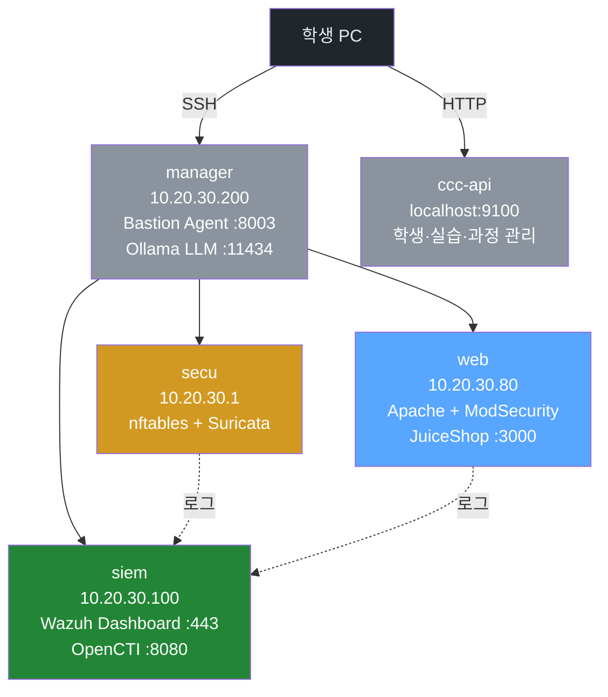

# Week 01: 보안 개론 + 실습 환경 구축

## 학습 목표
- 사이버보안의 기본 개념, 역사, 주요 용어를 이해한다
- CIA Triad, AAA, Defense in Depth 등 보안 원칙을 설명할 수 있다
- 실습 인프라(4대 VM)에 접속하여 각 서버의 역할과 구성을 파악한다
- 기본 리눅스 명령어와 네트워크 도구를 사용하여 정보를 수집한다
- Bastion 에이전트와 CCC API를 구분하고 각각의 역할을 이해한다
- 보안 윤리와 법적 책임을 인지한다

## 전제 조건
- 리눅스 터미널 기본 사용 경험 (ls, cd, cat 수준)
- SSH 클라이언트 설치 (Windows: PuTTY 또는 WSL, Mac/Linux: 내장 ssh)
- 웹 브라우저 (Chrome/Firefox)

## 강의 시간 배분 (3시간)

| 시간 | 내용 | 유형 |
|------|------|------|
| 0:00-0:40 | 사이버보안 개론 (이론) | 강의 |
| 0:40-1:10 | 보안 원칙과 프레임워크 | 강의 |
| 1:10-1:20 | 휴식 | - |
| 1:20-2:00 | 실습 인프라 소개 + 접속 실습 | 실습 |
| 2:00-2:40 | 리눅스/네트워크 기본 도구 실습 | 실습 |
| 2:40-2:50 | 휴식 | - |
| 2:50-3:30 | Bastion 에이전트 + CCC API 실습 | 실습 |
| 3:30-3:40 | 보안 윤리 + 과제 안내 | 정리 |

---

# Part 1: 사이버보안 개론 (40분)

## 1.1 사이버보안이란?

사이버보안(Cybersecurity)은 컴퓨터 시스템, 네트워크, 데이터를 무단 접근·손상·도난으로부터 보호하는 모든 활동을 말한다.

### 왜 중요한가?

디지털 전환이 가속화되면서 기업·정부·개인의 핵심 자산이 온라인으로 이동하고 있다. 이에 따라 사이버 공격의 빈도와 피해 규모도 급증하고 있다.

**주요 통계 (2024~2025 기준):**
- 글로벌 사이버 범죄 피해액: 연간 약 10.5조 달러 (Cybersecurity Ventures)
- 랜섬웨어 평균 피해 복구 비용: 약 185만 달러 (Sophos 2024)
- 데이터 유출 평균 탐지 시간: 약 194일 (IBM Cost of a Data Breach 2024)
- 한국 개인정보 유출 신고 건수: 연간 300건 이상 (KISA)

### 보안의 역사 간략 타임라인

```
1970s: 최초의 컴퓨터 바이러스 (Creeper, 1971)
1980s: Morris Worm (1988) — 인터넷 최초의 대규모 웜, 6000대 감염
1990s: 웹의 등장 → 웹 해킹의 시작 (SQL Injection 개념 등장)
2000s: 대규모 DDoS, APT 공격 등장 (Stuxnet, 2010)
2010s: 랜섬웨어 대유행 (WannaCry 2017), 클라우드 보안 이슈
2020s: 공급망 공격 (SolarWinds 2020), AI 기반 공격/방어, LLM 보안
```

## 1.2 핵심 용어 상세 해설

### 기본 용어

| 용어 | 정의 | 비유 | 실제 예시 |
|------|------|------|---------|
| **취약점 (Vulnerability)** | 시스템의 보안 약점 | 잠금장치가 없는 창문 | SQL Injection이 가능한 로그인 폼 |
| **위협 (Threat)** | 취약점을 악용할 수 있는 잠재적 위험 | 도둑의 존재 | 해커가 SQLi로 DB를 탈취할 수 있음 |
| **공격 (Attack/Exploit)** | 위협이 실제로 실행된 것 | 도둑이 창문을 열고 침입 | `' OR 1=1--` 페이로드 전송 |
| **자산 (Asset)** | 보호해야 할 대상 | 집 안의 귀중품 | 사용자 DB, 웹 서버, 소스코드 |
| **리스크 (Risk)** | 위협 × 취약점 × 영향도 | 도둑이 와서 귀중품을 훔칠 확률 × 피해액 | SQLi로 10만 건 개인정보 유출 가능성 |
| **대응 (Countermeasure)** | 리스크를 줄이기 위한 조치 | 창문 잠금장치 설치 | 입력값 검증, WAF 배치 |

### 보안 식별자 체계

| 식별자 | 정식 명칭 | 관리 기관 | 역할 | 예시 |
|--------|---------|---------|------|------|
| **CVE** | Common Vulnerabilities and Exposures | MITRE | 취약점에 고유 번호 부여 | CVE-2021-44228 (Log4Shell) |
| **CWE** | Common Weakness Enumeration | MITRE | 취약점의 유형(카테고리) 분류 | CWE-89 (SQL Injection) |
| **CVSS** | Common Vulnerability Scoring System | FIRST | 취약점 심각도 점수 (0~10) | CVSS 10.0 (Log4Shell) |
| **CPE** | Common Platform Enumeration | NIST | 영향받는 소프트웨어 식별 | cpe:2.3:a:apache:log4j:2.14.1 |

**CVE와 CWE의 관계:**

CWE는 "약점의 종류" (SQL Injection이라는 유형), CVE는 "특정 제품에서 발견된 실제 사례"이다.

```
CWE-89 (SQL Injection 유형)
  +-- CVE-2024-XXXXX (A 제품의 SQLi 취약점)
  +-- CVE-2024-YYYYY (B 제품의 SQLi 취약점)
```

### MITRE ATT&CK 프레임워크 소개

MITRE ATT&CK는 실제 관찰된 공격 행위를 체계적으로 분류한 지식 기반이다. 공격자는 "왜(전술) → 어떻게(기법) → 구체적으로(절차)" 순서로 행동한다.

```
전술(Tactic)  = "왜?" (공격 목적)
기법(Technique) = "어떻게?" (공격 방법)
절차(Procedure) = "구체적으로?" (실제 명령/도구)

예시:
  전술: Initial Access (초기 접근)
    +-- 기법: T1190 Exploit Public-Facing Application
          +-- 절차: JuiceShop에 ' OR 1=1-- 전송하여 로그인 우회
```

**14개 전술 요약:**

| 순서 | 전술 | 설명 |
|------|------|------|
| 1 | Reconnaissance | 목표 정보 수집 |
| 2 | Resource Development | 공격 인프라 준비 |
| 3 | Initial Access | 최초 침투 |
| 4 | Execution | 악성 코드 실행 |
| 5 | Persistence | 지속적 접근 확보 |
| 6 | Privilege Escalation | 권한 상승 |
| 7 | Defense Evasion | 탐지 회피 |
| 8 | Credential Access | 인증 정보 탈취 |
| 9 | Discovery | 내부 정보 수집 |
| 10 | Lateral Movement | 내부 이동 |
| 11 | Collection | 데이터 수집 |
| 12 | Command and Control | 원격 제어 |
| 13 | Exfiltration | 데이터 유출 |
| 14 | Impact | 시스템 파괴/변조 |

> 이 과목에서는 14개 전술 중 실습 인프라에서 재현 가능한 기법들을 직접 실행해본다.

### OWASP Top 10 (2021)

| 순위 | 카테고리 | 설명 | 실습 주차 |
|------|---------|------|---------|
| A01 | Broken Access Control | 접근 제어 실패 | Week 06 |
| A02 | Cryptographic Failures | 암호화 실패 | Week 06 |
| A03 | Injection | SQLi, XSS, Command Injection | Week 04, 05 |
| A04 | Insecure Design | 안전하지 않은 설계 | Week 03 |
| A05 | Security Misconfiguration | 보안 설정 오류 | Week 07 |
| A06 | Vulnerable Components | 취약한 구성요소 | Week 07 |
| A07 | Auth Failures | 인증/세션 관리 실패 | Week 06 |
| A08 | Software/Data Integrity | 무결성 실패 | Week 12 |
| A09 | Logging/Monitoring Failures | 로깅 실패 | Week 13 |
| A10 | SSRF | 서버 측 요청 위조 | Week 07 |

---

# Part 2: 보안 원칙과 프레임워크 (30분)

## 2.1 CIA Triad (보안의 3요소)

```
              기밀성
           Confidentiality
              ╱╲
             ╱  ╲
            ╱    ╲
           ╱  CIA  ╲
          ╱   Triad  ╲
         ╱____________╲
   무결성              가용성
  Integrity         Availability
```

### 기밀성 (Confidentiality)
- **정의:** 인가된 사용자만 정보에 접근할 수 있도록 보장
- **위반 사례:** 해커가 DB를 덤프하여 고객 개인정보 유출
- **보호 방법:** 암호화(AES, RSA), 접근 제어(RBAC), 인증(MFA)
- **실습 연관:** Week 04에서 SQLi로 DB 데이터를 추출하면 기밀성 위반

### 무결성 (Integrity)
- **정의:** 정보가 무단으로 변경되지 않음을 보장
- **위반 사례:** 공격자가 웹 페이지를 변조(defacement)
- **보호 방법:** 해시 함수(SHA-256), 디지털 서명, FIM(File Integrity Monitoring)
- **실습 연관:** Week 11에서 SUID 바이너리를 악용하면 시스템 파일 무결성 위반

### 가용성 (Availability)
- **정의:** 필요할 때 정보와 시스템에 접근 가능하도록 보장
- **위반 사례:** DDoS 공격으로 웹 서비스 다운
- **보호 방법:** 이중화, 로드 밸런서, DDoS 방어, 백업
- **실습 연관:** Week 10에서 방화벽 우회 시 가용성과 보안의 트레이드오프

## 2.2 AAA 프레임워크

| 요소 | 정의 | 예시 |
|------|------|------|
| **Authentication (인증)** | "너 누구?" | 아이디/비밀번호, 생체인증, MFA |
| **Authorization (인가)** | "너 뭐 할 수 있어?" | RBAC, 파일 퍼미션, sudo 권한 |
| **Accounting (감사)** | "너 뭐 했어?" | 로그 기록, SIEM, Bastion evidence |

**이 수업에서의 AAA:**
- Authentication: CCC API 접근 시 `X-API-Key: ccc-api-key-2026` 헤더
- Authorization: 관리자/학생 역할별 엔드포인트 분리 (`/groups`는 관리자만)
- Accounting: Bastion 에이전트가 수행한 모든 작업이 evidence DB에 기록됨

## 2.3 Defense in Depth (심층 방어)

단일 방어에 의존하지 않고, 여러 계층의 보안을 중첩하는 전략이다.

```
[Layer 1] 물리적 보안      -- 서버실 출입 통제
  [Layer 2] 네트워크 보안   -- 방화벽, IPS
    [Layer 3] 호스트 보안    -- 패치, AV, FIM
      [Layer 4] 애플리케이션 보안 -- WAF, 코드 검증
        [Layer 5] 데이터 보안     -- 암호화, DLP

  외부 --> [물리] --> [네트워크] --> [호스트] --> [앱] --> [데이터]
            secu       secu         각 서버     web      DB 암호화
            출입통제   nftables     패치/AV     WAF
                       Suricata
```

**우리 실습 인프라에서의 Defense in Depth:**

| 계층 | 인프라 구성 | 역할 |
|------|-----------|------|
| 네트워크 | secu (nftables) | 트래픽 필터링 |
| 네트워크 | secu (Suricata IPS) | 악성 패턴 탐지/차단 |
| 애플리케이션 | web (Apache+ModSecurity WAF) | 웹 공격 차단 |
| 호스트 | web (Linux 권한 관리) | OS 수준 접근 제어 |
| 모니터링 | siem (Wazuh) | 로그 수집·분석·경보 |
| 운영 | manager (Bastion) | 보안 작업 오케스트레이션·증적 |

## 2.4 공격자의 유형과 동기

| 유형 | 동기 | 기술 수준 | 사용 도구 | 실제 사례 |
|------|------|---------|---------|---------|
| 스크립트 키디 | 호기심, 과시 | 낮음 | 공개 도구 (Metasploit, SQLmap) | 학교 서버 해킹 시도 |
| 핵티비스트 | 정치/사회적 목적 | 중간 | DDoS, 웹 변조 | Anonymous, LulzSec |
| 사이버 범죄자 | 금전적 이익 | 높음 | 랜섬웨어, 피싱 | REvil, Conti 랜섬웨어 그룹 |
| 국가 지원 해커 (APT) | 첩보, 파괴 | 매우 높음 | 제로데이, 공급망 공격 | Lazarus(북한), APT28(러시아) |
| 내부자 위협 | 불만, 금전 | 시스템 지식 보유 | 권한 남용 | Snowden, 퇴직 직원 데이터 유출 |

## 2.5 모의해킹(Penetration Testing)의 단계

이 과목 전체는 모의해킹의 체계적 방법론을 따른다.

```
[1] 사전 협의    → 범위, 규칙, 일정 합의 (Week 01)
[2] 정보 수집    → 대상 시스템 정찰 (Week 02~03)
[3] 취약점 분석  → 발견된 정보로 약점 식별 (Week 04~07)
[4] 공격 실행    → 취약점 악용 (Week 09~12)
[5] 권한 상승    → 더 높은 권한 확보 (Week 11)
[6] 지속성 확보  → 재접근 방법 설치 (Week 12)
[7] 보고서 작성  → 발견사항 문서화 (Week 14~15)
```

---

# Part 3: 실습 인프라 소개 + 접속 실습 (40분)

## 3.1 인프라 구성도



**중요 — 두 개의 API를 구분하라:**

| 구성요소 | 위치 | 포트 | 역할 | 이번 주 실습 |
|----------|------|------|------|--------------|
| **ccc-api** | 강사 서버 | :9100 | 학생·과정·실습·평가 관리 (행정) | 과정 조회, 진도 조회 |
| **Bastion 에이전트** | manager (10.20.30.200) | :8003 | 자연어 기반 보안 작업 수행 (실행) | 자연어로 SSH·스캔·점검 실행 |
| **SubAgent** | 각 VM | :8002 | Bastion의 원격 실행 대리자 | (내부 통신, 직접 호출 없음) |

## 3.2 각 서버의 보안 역할

### secu — 네트워크 보안 게이트웨이
| 항목 | 상세 |
|------|------|
| 비유 | 건물 입구 경비원 + 금속탐지기 |
| 핵심 SW | nftables (방화벽), Suricata (IPS) |
| 하는 일 | 모든 네트워크 트래픽을 검사, 허용/차단/경보 |
| 학습 주차 | Week 09~10 (네트워크 공격, IPS 우회) |

### web — 웹 서버 (공격 대상)
| 항목 | 상세 |
|------|------|
| 비유 | 은행 창구 (고객이 접근하는 서비스) |
| 핵심 SW | Apache(:80), JuiceShop(:3000), ModSecurity WAF |
| 하는 일 | 웹 서비스 제공, 의도적으로 취약한 앱(JuiceShop) 운영 |
| 학습 주차 | Week 03~07 (웹 공격 전반), Week 11~12 (권한 상승) |
| 중요 정보 | 사용자: ccc, 비밀번호: 1, **sudo NOPASSWD: ALL** (의도적 취약 설정) |

> **JuiceShop란?**
> OWASP에서 만든 의도적으로 취약한 웹 애플리케이션이다. SQL Injection, XSS, CSRF 등
> 100개 이상의 보안 챌린지를 포함하고 있어 보안 학습에 최적화되어 있다.

### siem — 보안 모니터링 센터
| 항목 | 상세 |
|------|------|
| 비유 | CCTV 관제실 + 경보 시스템 |
| 핵심 SW | Wazuh 4.11.2 (SIEM), OpenCTI (위협 인텔리전스) |
| 하는 일 | 모든 서버의 로그를 수집·분석, 이상 행위 탐지 후 경보 |
| 학습 주차 | Week 13 (ATT&CK), Week 14 (자동화) |

### manager — AI 보안 운영 에이전트 호스트
| 항목 | 상세 |
|------|------|
| 비유 | 보안 관리 본부 (AI 비서가 상주하며 지시받고 실행·기록) |
| 핵심 SW | Bastion Agent(:8003), Ollama LLM(:11434) |
| 하는 일 | 자연어 지시를 받아 적절한 Skill을 실행하고 증적을 남김 |
| 학습 주차 | 매주 (Bastion 경유 실습) |

---

## 실습 3.1: SSH 접속 (기본)

### Step 1: manager 서버 접속

**이것은 무엇인가?** SSH(Secure Shell)는 암호화된 원격 터미널 접속 프로토콜이다. 모든 보안 실습의 출발점이다.

**왜 manager부터?** Bastion 에이전트가 manager에 있기 때문이다. 이후 실습에서는 주로 Bastion에게 자연어로 지시하여 다른 서버를 조작한다.

**실행할 명령:**

```bash
# 학생 PC 터미널에서 실행
ssh ccc@10.20.30.200
# 비밀번호: 1
```

**이 명령의 의미:**
- `ssh`: SSH 클라이언트 실행
- `ccc@10.20.30.200`: 사용자명 `ccc`로 IP `10.20.30.200` 서버에 접속

**예상 출력:**
```
ccc@10.20.30.200's password: (1 입력)
Welcome to Ubuntu 22.04.x LTS
Last login: ...
ccc@manager:~$
```

**결과 해석:**
- 프롬프트가 `ccc@manager:~$`로 바뀌었으면 접속 성공
- `Connection refused`: 서버 미기동 또는 방화벽 차단
- `Permission denied`: 비밀번호 오류
- `No route to host`: 네트워크 설정 오류 (IP 오타 확인)

### Step 2: 접속 확인

```bash
hostname
# 의미: 현재 접속한 서버의 호스트명 조회
# 예상 출력: manager

whoami
# 의미: 현재 로그인한 사용자명 조회
# 예상 출력: ccc

pwd
# 의미: 현재 작업 디렉토리 조회 (Print Working Directory)
# 예상 출력: /home/ccc
```

**왜 이 세 명령을 습관화해야 하는가?**
운영 중 여러 서버를 오가다 보면 "지금 어느 서버에서 어떤 권한으로 무엇을 하고 있는지" 헷갈리기 쉽다. 보안 엔지니어의 실수 대부분이 "잘못된 서버에 잘못된 명령을 실행"에서 발생한다. `hostname && whoami && pwd` 삼종 세트로 상황을 항상 확인하는 습관을 들여라.

### Step 3: manager에서 다른 서버로 SSH

manager 안에서 다른 VM으로 점프한다.

```bash
# web 서버에 접속하여 hostname 확인 후 자동 종료
ssh ccc@10.20.30.80 'hostname && whoami'
# 비밀번호 입력 (1)
# 예상 출력:
# web
# ccc
```

**이 명령의 구조:**
- `ssh ccc@10.20.30.80 '명령'`: 서버에 접속하자마자 명령을 실행하고 돌아옴 (인터랙티브 쉘 열지 않음)
- 작은따옴표 `'...'`: 원격에서 실행할 명령 묶음

**트러블슈팅:**
- `Host key verification failed`: `.ssh/known_hosts`에 예전 키가 남아있는 경우 → `ssh-keygen -R 10.20.30.80`로 제거
- `Connection refused`: sshd 미기동 또는 방화벽 `tcp 22` 차단

다른 서버들도 같은 방식으로 확인:
```bash
ssh ccc@10.20.30.1 'hostname'    # secu
ssh ccc@10.20.30.100 'hostname'  # siem
```

---

## 실습 3.2: 시스템 정보 수집

공격자가 서버에 접근한 뒤 가장 먼저 하는 일이 "여기가 어디이고 어떤 환경인가"를 파악하는 것이다. 이것이 MITRE ATT&CK의 **T1082 (System Information Discovery)** 기법이다.

### 운영체제 정보

```bash
cat /etc/os-release | head -4
```

**이것은 무엇인가?** `/etc/os-release`는 리눅스 배포판 정보가 담긴 표준 파일이다. 모든 모던 배포판(Ubuntu, CentOS, Debian 등)이 이 파일을 제공한다.

**왜 필요한가?** 배포판과 버전이 결정되면 가능한 공격·방어 기법이 구체화된다. 예: Ubuntu 22.04는 systemd 기반, AppArmor 기본 활성화.

**예상 출력:**
```
PRETTY_NAME="Ubuntu 22.04.x LTS"
NAME="Ubuntu"
VERSION_ID="22.04"
VERSION="22.04.x LTS (Jammy Jellyfish)"
```

**결과 해석:**
- `PRETTY_NAME`: 사람이 읽기 편한 이름
- `VERSION_ID`: 숫자로 된 버전 (스크립트에서 비교용)

### 커널 버전

```bash
uname -a
```

**이것은 무엇인가?** `uname`은 "Unix name"의 줄임. 커널과 시스템 정보를 출력한다. `-a`는 전부(all).

**왜 필요한가?** 커널 버전 특정되면 `DirtyPipe(CVE-2022-0847)`, `DirtyCOW(CVE-2016-5195)` 같은 커널 권한상승 취약점 해당 여부를 판단할 수 있다.

**예상 출력:**
```
Linux manager 6.8.0-106-generic #106-Ubuntu SMP ... x86_64 GNU/Linux
```

**결과 해석 (필드별):**
- `Linux`: 커널 종류
- `manager`: 호스트명
- `6.8.0-106-generic`: 커널 버전. 6.x는 비교적 최신이므로 옛날 CVE에는 영향 없음
- `x86_64`: 64비트 Intel/AMD 아키텍처

### 네트워크 정보

```bash
ip addr show | grep "inet " | grep -v 127.0.0.1
```

**명령 분해:**
- `ip addr show`: 모든 네트워크 인터페이스와 IP 주소 출력
- `| grep "inet "`: IPv4 주소 라인만 필터 (`inet6`는 제외됨)
- `| grep -v 127.0.0.1`: 루프백 주소는 제외 (`-v`는 역매치)

**예상 출력:**
```
    inet 10.20.30.200/24 brd 10.20.30.255 scope global ens37
    inet 192.168.208.142/24 brd 192.168.208.255 scope global ens33
```

**결과 해석:**
- `10.20.30.200`: **내부망 IP** — 실습 인프라 네트워크 (모든 VM이 이 대역)
- `192.168.208.142`: **외부망 IP** — 호스트 OS와의 연결 (NAT)
- `/24`: 서브넷 마스크 (255.255.255.0) → 같은 네트워크 범위 10.20.30.0~255
- `scope global`: 외부에서 접근 가능한 주소 (vs `scope host`는 로컬만)

```bash
ip route show
```

**이것은 무엇인가?** 라우팅 테이블. "어떤 목적지로 갈 때 어느 인터페이스로 가는가"의 규칙이다.

**예상 출력:**
```
default via 10.20.30.1 dev ens37
10.20.30.0/24 dev ens37 proto kernel scope link src 10.20.30.200
```

**결과 해석:**
- `default via 10.20.30.1`: 어느 네트워크에도 해당 안 되는 목적지는 **게이트웨이 10.20.30.1(secu)로 보낸다** → secu가 방화벽/라우터 역할
- `10.20.30.0/24 dev ens37`: 같은 대역 내 통신은 ens37 인터페이스로 직접 전송

### 열린 포트 확인

```bash
ss -tlnp
```

**명령 분해:**
- `ss`: socket statistics (예전 `netstat`의 후계자, 더 빠름)
- `-t`: TCP 포트만
- `-l`: LISTEN 상태만 (들어오는 연결을 받는 포트)
- `-n`: 숫자로 표시 (포트 이름 대신 번호)
- `-p`: 프로세스명 표시

**예상 출력 (manager 서버):**
```
State  Recv-Q Send-Q Local Address:Port   Peer Address:Port Process
LISTEN 0      128    0.0.0.0:22           0.0.0.0:*         users:(("sshd",...))
LISTEN 0      128    0.0.0.0:8002         0.0.0.0:*         users:(("python3",...))
LISTEN 0      128    0.0.0.0:8003         0.0.0.0:*         users:(("python3",...))
LISTEN 0      128    127.0.0.1:11434      0.0.0.0:*         users:(("ollama",...))
```

**결과 해석:**
- `0.0.0.0:22` → SSH 서버 (외부에서 접속 가능)
- `0.0.0.0:8002` → SubAgent (Bastion이 원격 실행에 사용)
- `0.0.0.0:8003` → Bastion 에이전트 API
- `127.0.0.1:11434` → Ollama LLM (로컬만 바인딩 → 외부에서 접근 불가)
- `0.0.0.0:*` vs `127.0.0.1:*`의 차이가 **공격 표면 파악의 핵심**

---

## 실습 3.3: 네트워크 도구

### ping — 연결 확인

```bash
ping -c 3 10.20.30.80
```

**이것은 무엇인가?** ICMP Echo Request/Reply로 대상과의 기본 연결성을 확인하는 도구. `-c 3`은 3회만 보내고 종료.

**예상 출력:**
```
PING 10.20.30.80 (10.20.30.80) 56(84) bytes of data.
64 bytes from 10.20.30.80: icmp_seq=1 ttl=64 time=0.882 ms
64 bytes from 10.20.30.80: icmp_seq=2 ttl=64 time=0.654 ms
64 bytes from 10.20.30.80: icmp_seq=3 ttl=64 time=0.712 ms
--- 10.20.30.80 ping statistics ---
3 packets transmitted, 3 received, 0% packet loss, time 2004ms
```

**결과 해석:**
- `ttl=64`: TTL이 64면 Linux 서버, 128이면 Windows (기본값 지문)
- `time=0.x ms`: 응답 시간 1ms 미만 → 같은 LAN
- `0% packet loss`: 패킷 손실 0% → 정상 연결

### curl — HTTP로 웹 서버 확인

```bash
curl -s -I http://10.20.30.80:3000 | head -10
```

**명령 분해:**
- `curl`: 다용도 HTTP 클라이언트
- `-s`: silent (진행률 표시 없음)
- `-I`: HEAD 요청 (본문 없이 헤더만)
- `http://10.20.30.80:3000`: JuiceShop 주소

**왜 HEAD 요청인가?** 웹 서버의 "종류·버전"은 응답 본문이 아니라 **응답 헤더**에 드러난다. 본문까지 받으면 느리고 불필요한 로그만 남긴다.

**예상 출력:**
```
HTTP/1.1 200 OK
X-Powered-By: Express
Access-Control-Allow-Origin: *
X-Content-Type-Options: nosniff
...
```

**결과 해석 — 여기서 무엇을 알 수 있는가?**
- `HTTP/1.1 200 OK`: 서비스가 정상 응답 중
- `X-Powered-By: Express`: **Node.js Express 프레임워크 사용** → 해당 버전의 알려진 취약점 검색 가능
- `Access-Control-Allow-Origin: *`: **CORS 완전 개방** → 다른 도메인에서 API 호출 허용 → 이미 취약 신호
- `X-Content-Type-Options: nosniff`: MIME 스니핑 방지 (좋은 습관)

### 포트 스캔 — bash 기본 방법

실제 침투에서 대상 서버에 nmap이 없을 때를 대비해 bash 내장 기능만으로 포트 스캔을 할 수 있어야 한다.

```bash
for port in 22 80 443 3000 8002 8080 8081 8082 8443; do
    timeout 1 bash -c "echo >/dev/tcp/10.20.30.80/$port" 2>/dev/null \
      && echo "  $port: OPEN" \
      || echo "  $port: closed"
done
```

**명령 분해:**
- `for port in ...; do ... done`: 포트 번호 목록을 하나씩 `$port`에 대입
- `timeout 1`: 1초 내에 끝나지 않으면 강제 종료 (스캔 속도 확보)
- `echo >/dev/tcp/IP/포트`: bash 특수 기능. 해당 포트로 TCP 연결을 시도
- `2>/dev/null`: 오류 메시지 숨김
- `&&`: 앞 명령 성공 시 `OPEN` 출력, `||`: 실패 시 `closed` 출력

**예상 출력:**
```
  22: OPEN
  80: OPEN
  443: closed
  3000: OPEN
  8002: OPEN
  8080: closed
  8081: OPEN
  8082: OPEN
  8443: closed
```

**왜 이 기법이 중요한가?** "**Living off the Land**" 기법의 기초다. 공격자는 대상 시스템에 이미 있는 도구만으로 공격하여 탐지를 피한다. Defender도 이 기법을 알아야 로그에서 남는 흔적을 인식할 수 있다.

### nmap — 전문 포트 스캔

```bash
nmap -sV -p 22,80,3000 10.20.30.80
```

**옵션 해설:**
- `-sV`: Service Version 탐지 — 단순 open/closed가 아니라 "무슨 서비스 몇 버전"까지 식별
- `-p 22,80,3000`: 특정 포트만 검사 (빠름)
- 추가 옵션:
  - `-sS`: SYN(스텔스) 스캔 — sudo 필요
  - `-O`: OS 탐지 — TCP/IP 스택 지문으로 OS 추정
  - `-A`: 종합 스캔 (느림, 철저함)

**예상 출력:**
```
PORT     STATE SERVICE VERSION
22/tcp   open  ssh     OpenSSH 8.9p1 Ubuntu 3ubuntu0.x
80/tcp   open  http    Apache httpd 2.4.xx
3000/tcp open  http    Node.js Express framework
```

**결과 해석 — 공격자의 사고 흐름:**
1. `OpenSSH 8.9p1 Ubuntu` → 이 버전의 CVE 검색 → 취약하면 brute force 또는 RCE 시도
2. `Apache httpd 2.4.xx` → WAF 없으면 웹 공격 시도 (Week 04~07)
3. `Node.js Express` → 포트 3000이 "일반적으로 개발 환경"이다. **production에 dev 서버가 노출된 상태** → 잘못된 배포

> **⚠️ 법적 주의:**
> nmap은 강력한 도구이다. **허가 없이 타인 시스템에 사용하면 불법**이다.
> 정보통신망법 제48조 위반 시 5년 이하 징역.
> 본 실습은 교육용으로 구성된 내부 10.20.30.0/24 대역에서만 수행한다.

---

# Part 4: Bastion 에이전트 + CCC API 실습 (40분)

## 4.1 두 API의 차이

| 구분 | ccc-api | Bastion 에이전트 |
|------|---------|------------------|
| 위치 | 강사 서버 (localhost:9100) | manager VM (10.20.30.200:8003) |
| 역할 | **관리**: 학생, 과정, 실습, 평가 | **실행**: 자연어 지시로 보안 작업 수행 |
| 대상 사용자 | 행정/플랫폼 관리 | 학생이 실습 중 사용 |
| 인증 | `X-API-Key: ccc-api-key-2026` | 없음 (내부망 전용) |
| 이번 주 실습 | 과정 목록 조회 | 자연어로 서버 점검 요청 |

## 4.2 ccc-api 실습 (학생용 행정 정보)

### 과정 목록 조회

```bash
curl -s http://localhost:9100/education/courses \
  -H "X-API-Key: ccc-api-key-2026" | python3 -m json.tool | head -30
```

**명령 분해:**
- `curl -s ...`: silent 모드로 GET 요청 (`-X GET`은 기본이라 생략 가능)
- `-H "X-API-Key: ..."`: 인증 헤더 추가. 이 헤더 없으면 401 Unauthorized
- `| python3 -m json.tool`: JSON 응답을 보기 좋게 포맷팅
- `| head -30`: 처음 30줄만 표시

**예상 출력:**
```json
{
    "courses": [
        {
            "id": "course1-attack",
            "title": "모의해킹",
            "weeks": 15
        },
        {
            "id": "course2-security-ops",
            ...
        }
    ]
}
```

**결과 해석:**
- 현재 플랫폼에 등록된 20개 과정이 반환된다
- `id`는 이후 API에서 과정을 지정할 때 사용하는 키
- `weeks`는 총 주차 수 (15주 표준)

### 특정 주차 강의 조회

```bash
curl -s "http://localhost:9100/education/lecture/course1-attack/1" \
  -H "X-API-Key: ccc-api-key-2026" | python3 -m json.tool | head -20
```

**이것은 무엇인가?** 이 수업 자체의 lecture.md 내용을 API로 가져오는 엔드포인트다. 웹 UI가 이 API를 사용하여 학생에게 강의를 보여준다.

## 4.3 Bastion 에이전트란?

**Bastion는 자연어 기반 보안 운영 에이전트이다.**

전통적인 방식에서는 엔지니어가 SSH로 각 서버에 접속하여 명령을 손으로 입력했다. Bastion를 쓰면:

1. **학생이 자연어로 지시** — "secu 서버의 방화벽 룰 보여줘"
2. **Bastion이 LLM으로 해석** — 어떤 서버에 어떤 명령을 실행해야 할지 판단
3. **적절한 Skill 선택** — 미리 등록된 `nftables_show`, `suricata_rules` 등의 기능
4. **SubAgent에 원격 실행 요청** — 각 VM의 :8002 포트로 SSH 명령 전송
5. **Evidence DB에 기록** — 언제, 어디서, 무엇을, 결과는 어떻게

**핵심 차이:**
```
직접 SSH:    명령 → 결과 → (기록 없음, 재현 어려움)
Bastion:     자연어 → Skill → 실행 → Evidence(증적) 자동 기록
```

## 4.4 Bastion 헬스체크

```bash
curl -s http://10.20.30.200:8003/health | python3 -m json.tool
```

**예상 출력:**
```json
{
    "status": "ok",
    "model": "gemma3:4b",
    "llm": "http://localhost:11434",
    "skills": 12,
    "playbooks": 5
}
```

**결과 해석:**
- `status: ok`: Bastion 프로세스 정상 기동
- `model`: 뒤에서 돌아가는 LLM 모델명 (Ollama의 gemma3:4b)
- `llm`: Ollama API URL
- `skills` / `playbooks`: 등록된 기능 수

**문제 해결:**
- 응답 없으면 `ssh ccc@10.20.30.200 'sudo systemctl status bastion-api'`로 서비스 상태 확인

## 4.5 Skill과 Playbook 조회

**Skill이란?** Bastion가 실행할 수 있는 개별 기능 단위. 예: `ssh_exec`, `nmap_scan`, `wazuh_query`.

**Playbook이란?** Skill 여러 개를 조합한 시나리오. 예: `incident-containment-v1` = `nmap_scan` → `wazuh_alert` → `nft_block`.

```bash
# 등록된 Skill 목록
curl -s http://10.20.30.200:8003/skills | python3 -m json.tool | head -30

# 등록된 Playbook 목록
curl -s http://10.20.30.200:8003/playbooks | python3 -m json.tool | head -30
```

**결과 해석:**
- Skill은 "재료" (한 가지만 한다)
- Playbook은 "레시피" (재료들을 순서대로 조합)
- 각 Skill/Playbook에는 `description`, `params`, `risk_level`이 있다

## 4.6 /ask — 단순 질문 API

Bastion에게 자연어로 질문하고 텍스트 답변만 받는 가장 간단한 방식이다.

```bash
curl -s -X POST http://10.20.30.200:8003/ask \
  -H 'Content-Type: application/json' \
  -d '{"message": "현재 manager 서버의 hostname과 uptime을 확인해줘"}' \
  | python3 -c "import sys,json; d=json.load(sys.stdin); print(d['answer'])"
```

**명령 분해:**
- `-X POST`: POST 메서드 (body 전송)
- `-H 'Content-Type: application/json'`: JSON을 보낸다고 서버에 알림
- `-d '{"message": "..."}'`: JSON 본문
- `answer` 필드만 추출하여 출력

**Bastion 내부 동작:**
1. LLM이 메시지 의도 해석 → "hostname과 uptime 조회 요청"
2. 적절한 Skill 선택 (예: `ssh_exec`)
3. manager 서버에서 실행
4. 결과를 자연어로 가공
5. Evidence DB에 기록

**예상 응답:**
```
manager 서버의 hostname은 'manager'이고, uptime은 '12 days, 3:24'입니다.
```

## 4.7 /evidence — 작업 기록 조회

Bastion가 수행한 작업은 전부 evidence DB에 남는다.

```bash
curl -s "http://10.20.30.200:8003/evidence?limit=5" | python3 -m json.tool
```

**예상 출력 (일부):**
```json
[
    {
        "timestamp": "2026-03-28T10:15:22",
        "user_message": "현재 manager 서버의 hostname과 uptime을 확인해줘",
        "skill": "ssh_exec",
        "params": {"host": "localhost", "cmd": "hostname && uptime"},
        "output": "manager\n up 12 days...",
        "success": true
    }
]
```

**결과 해석:**
- `user_message`: 학생이 입력한 원문
- `skill`: Bastion가 선택한 Skill
- `params`: 실제 실행된 파라미터
- `output`: 실행 결과
- `success`: 성공 여부

**왜 증적이 중요한가?**
1. **감사(Audit)**: "누가 언제 무엇을 했는가"를 증명할 수 있어야 보안 운영이 성립한다
2. **재현성(Reproducibility)**: 동일 상황에서 같은 작업을 재실행할 수 있다
3. **학습**: 반복되는 패턴은 Skill/Playbook으로 승격되어 재사용된다

## 4.8 실습 시나리오 — 4개 서버 점검

학생이 자연어로 인프라 점검을 지시해보자.

```bash
curl -s -X POST http://10.20.30.200:8003/ask \
  -H 'Content-Type: application/json' \
  -d '{"message": "모든 VM(secu, web, siem, manager)의 hostname과 uptime을 확인해서 표로 정리해줘"}' \
  | python3 -c "import sys,json; d=json.load(sys.stdin); print(d['answer'])"
```

**예상 응답 (가공된 자연어):**
```
4개 VM 점검 결과:

| VM      | Hostname | Uptime              |
|---------|----------|---------------------|
| manager | manager  | up 12 days, 3:24    |
| secu    | secu     | up 10 days, 7:12    |
| web     | web      | up  8 days, 15:30   |
| siem    | siem     | up 11 days, 2:45    |
```

**내부 동작:**
Bastion가 SSH Skill을 4번 호출하여 각 VM에서 명령을 실행하고, 결과를 LLM으로 종합 정리했다. 학생은 4번의 SSH 세션을 직접 관리할 필요가 없다.

**evidence 재확인:**
```bash
curl -s "http://10.20.30.200:8003/evidence?limit=10" | python3 -m json.tool | grep -E '"skill"|"user_message"' | head -20
```
방금의 작업이 기록되어 있음을 확인한다.

---

# Part 5: 보안 윤리와 법적 책임 (20분)

## 5.1 모의해킹의 법적 근거

모의해킹은 **반드시 사전 서면 허가**가 있어야 합법이다.

| 구분 | 합법 | 불법 |
|------|------|------|
| 허가 | 고객과 서면 계약 체결 후 실행 | 허가 없이 타인 시스템 스캔/공격 |
| 범위 | 합의된 IP/도메인만 대상 | 범위 밖 시스템 접근 |
| 시간 | 합의된 기간 내 실행 | 계약 기간 외 활동 |
| 보고 | 발견사항을 고객에게 보고 | 발견한 취약점을 악용/유출 |

### 관련 법률 (한국)

| 법률 | 조항 | 내용 | 벌칙 |
|------|------|------|------|
| 정보통신망법 | 제48조 | 정보통신망 침입 금지 | 5년 이하 징역 |
| 정보통신망법 | 제49조 | 타인 비밀 침해 금지 | 5년 이하 징역 |
| 개인정보보호법 | 제71조 | 개인정보 부정 취득 | 5년 이하 징역/5천만원 벌금 |
| 형법 | 제316조 | 비밀침해 | 3년 이하 징역 |

## 5.2 이 수업에서의 규칙

1. **실습 서버에서만 작업한다** (10.20.30.0/24 네트워크)
2. **외부 시스템을 절대 스캔하거나 공격하지 않는다**
3. **발견한 취약점은 수업 내에서만 논의한다**
4. **다른 학생의 작업을 방해하지 않는다**
5. **가능한 Bastion를 경유하여 작업하여 evidence를 남긴다**

---

## 과제 (다음 주까지)

### 과제 1: 인프라 파악 보고서 (60점)

4개 서버(manager, secu, web, siem)에 접속하여 다음 정보를 수집하고 보고서를 작성하라.

**수집 항목:**
| 항목 | 명령어 |
|------|--------|
| 운영체제/버전 | `cat /etc/os-release \| head -3` |
| 커널 | `uname -r` |
| CPU 코어 수 | `nproc` |
| 메모리 | `free -h` |
| 디스크 사용량 | `df -h /` |
| 열린 포트 | `ss -tlnp` |
| 주요 서비스 | `systemctl list-units --type=service --state=running` |

**제출 형식 예시:**
```
[서버명] manager (10.20.30.200)
  OS: Ubuntu 22.04.x
  커널: 6.8.0-106-generic
  CPU: 4 cores
  메모리: 7.8Gi total / 2.1Gi used
  디스크: 50G total / 15G used (31%)
  열린 포트: 22(ssh), 8002(subagent), 8003(bastion), 11434(ollama)
  주요 서비스: ssh, bastion-api, subagent, ollama
```

**채점 기준:**
- 4개 서버 전체 수집 (각 15점)
- 정보의 정확성과 완전성

### 과제 2: Bastion 자연어 지시 (40점)

Bastion 에이전트에 자연어로 지시하여 다음을 수행하고 결과와 evidence를 제출하라.

**요구사항 (각 10점):**
1. Bastion `/health` 엔드포인트 응답 캡처
2. `/ask`로 "4개 VM의 열린 포트를 요약해줘" 요청 후 응답 캡처
3. `/ask`로 "web 서버에서 Apache 버전과 JuiceShop 응답 코드를 확인해줘" 요청 후 응답 캡처
4. `/evidence?limit=20` 응답에서 위 3개 요청이 기록되어 있음을 확인

**제출 방식:** 각 단계의 요청 명령과 응답을 md 파일로 정리

---

## 검증 체크리스트

- [ ] 4개 서버에 SSH 접속 성공 (manager, secu, web, siem)
- [ ] 각 서버의 hostname, OS, 커널 확인
- [ ] bash `/dev/tcp`로 web 서버 포트 스캔 수행
- [ ] nmap으로 web 서버 서비스 버전 탐지
- [ ] curl로 JuiceShop (포트 3000) HTTP 헤더 확인
- [ ] ccc-api `/education/courses` 응답 수신
- [ ] Bastion `/health` 응답 수신
- [ ] Bastion `/ask`로 자연어 지시 후 자연어 응답 수신
- [ ] Bastion `/evidence`에서 방금의 작업이 기록되어 있음 확인

---

## 다음 주 예고
**Week 02: 정보수집과 정찰 (Reconnaissance)**
- nmap 고급 스캔 기법 (SYN, FIN, ACK, NULL 스캔)
- DNS 정보 수집 (dig, nslookup, 역방향 조회)
- 웹 서버 핑거프린팅 (whatweb, wappalyzer)
- 디렉토리/파일 열거 (gobuster, dirb)
- robots.txt, sitemap.xml 분석
- Google Dorking 기법
- Bastion로 정찰 자동화 시나리오

---

## 용어 해설

> 이 주차에서 처음 등장하거나 자주 나오는 용어를 정리한다.

| 용어 | 영문 | 설명 | 비유 |
|------|------|------|------|
| **페이로드** | Payload | 공격에 사용되는 실제 데이터/코드. 예: `' OR 1=1--` | 미사일의 탄두 |
| **익스플로잇** | Exploit | 취약점을 악용하는 기법 또는 코드 | 열쇠 없이 문을 여는 방법 |
| **셸** | Shell | 운영체제와 사용자를 연결하는 명령어 해석기 (bash, sh) | OS에게 명령을 내리는 창구 |
| **포트** | Port | 서버에서 특정 서비스를 식별하는 번호 (0~65535) | 아파트 호수 |
| **데몬** | Daemon | 백그라운드에서 실행되는 서비스 프로그램 | 24시간 근무 경비원 |
| **패킷** | Packet | 네트워크로 전송되는 데이터의 단위 | 택배 상자 하나 |
| **해시** | Hash | 임의 길이 데이터를 고정 길이 값으로 변환 (SHA-256 등) | 지문 |
| **SSH** | Secure Shell | 원격 서버에 안전하게 접속하는 프로토콜 (:22) | 암호화된 전화선 |
| **sudo** | SuperUser DO | 관리자 권한으로 명령 실행 | "사장님 권한 실행" |
| **SUID** | Set User ID | 파일 소유자 권한으로 실행되는 특수 권한 | 사원증 대여 |
| **IPS** | Intrusion Prevention System | 네트워크 침입 방지 시스템 | 공항 보안검색대 |
| **SIEM** | Security Information and Event Management | 보안 로그 통합 관제 | CCTV 관제실 |
| **WAF** | Web Application Firewall | 웹 공격 탐지·차단 방화벽 | 웹사이트 전용 경비 |
| **nftables** | nftables | Linux 커널 방화벽 프레임워크 (iptables 후계) | 건물 출입구 차단기 |
| **Suricata** | Suricata | 오픈소스 IDS/IPS 엔진 | X-ray 검색기 |
| **Wazuh** | Wazuh | 오픈소스 SIEM 플랫폼 | CCTV + AI 관제 |
| **ATT&CK** | MITRE ATT&CK | 실제 공격 전술·기법 분류 DB | 범죄수법 백과사전 |
| **OWASP** | Open Web Application Security Project | 웹 보안 국제 단체 | 웹 보안 표준 기관 |
| **Bastion** | Bastion | 본 플랫폼의 AI 보안 운영 에이전트 (:8003) | 상주 AI 보안 비서 |
| **SubAgent** | SubAgent | Bastion이 VM에서 원격 실행하는 대리자 (:8002) | 현장 파견 직원 |
| **ccc-api** | CCC API | 학생·과정·실습 관리 API (:9100) | 학사관리 시스템 |

---

> **실습 환경 검증 완료** (2026-03-28): JuiceShop SQLi/XSS/IDOR, nmap, 경로탐색(%2500), sudo NOPASSWD, SSH키, crontab

---

<!--
사례 섹션 폐기 (2026-04-27 수기 검토): w01 보안 개론 + 실습 환경 — *과목
오리엔테이션* 주차이며 특정 공격 기법 사례 매칭 대상 아님. T1041 generic
Exfil tag 매핑 X. 폐기.
-->


