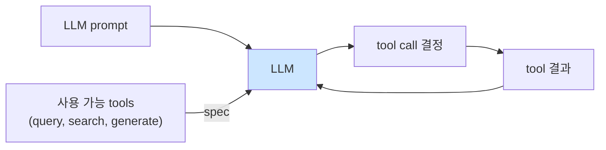

# Week 02: LLM API와 Tool Calling

## 학습 목표
- Ollama OpenAI-호환 API의 구조와 매개변수를 이해한다
- system/user/assistant 메시지 역할을 정확히 구분한다
- temperature, top_p, max_tokens 등 생성 매개변수를 실험한다
- Tool Calling(function calling) 개념을 이해하고 직접 구현한다
- Python으로 도구를 호출하는 에이전트를 작성할 수 있다

## 실습 환경 (공통)

| 서버 | IP | 역할 | 접속 |
|------|-----|------|------|
| bastion | 10.20.30.201 | Control Plane (Bastion) | `ssh ccc@10.20.30.201` (pw: 1) |
| secu | 10.20.30.1 | 방화벽/IPS (nftables, Suricata) | `ssh ccc@10.20.30.1` |
| web | 10.20.30.80 | 웹서버 (JuiceShop:3000, Apache:80) | `ssh ccc@10.20.30.80` |
| siem | 10.20.30.100 | SIEM (Wazuh Dashboard:443, OpenCTI:8080) | `ssh ccc@10.20.30.100` |

**Bastion API:** `http://localhost:9100` / Key: `ccc-api-key-2026`

## 강의 시간 배분 (3시간)

| 시간 | 내용 | 유형 |
|------|------|------|
| 0:00-0:25 | 이론: LLM API 구조 (Part 1) | 강의 |
| 0:25-0:50 | 이론: Tool Calling 개념 (Part 2) | 강의 |
| 0:50-1:00 | 휴식 | - |
| 1:00-1:45 | 실습: API 호출과 매개변수 실험 (Part 3) | 실습 |
| 1:45-2:30 | 실습: Tool Calling 구현 (Part 4) | 실습 |
| 2:30-2:40 | 휴식 | - |
| 2:40-3:15 | 실습: 보안 도구 에이전트 구축 (Part 5) | 실습 |
| 3:15-3:30 | 퀴즈 + 과제 안내 (Part 6) | 퀴즈 |

---

## 용어 해설 (AI보안에이전트 과목)

| 용어 | 영문 | 설명 | 비유 |
|------|------|------|------|
| **Chat Completions API** | Chat Completions API | 대화형 LLM 호출 API 표준 | AI와의 대화 창구 |
| **system 메시지** | System Message | LLM의 역할·규칙을 지정하는 메시지 | 직원 업무 매뉴얼 |
| **user 메시지** | User Message | 사용자의 입력/질문 | 고객의 요청 |
| **assistant 메시지** | Assistant Message | LLM의 응답 | 직원의 답변 |
| **Tool Calling** | Tool Calling / Function Calling | LLM이 외부 함수를 선택·호출하는 기능 | 전문가에게 전화하는 상담원 |
| **tool 메시지** | Tool Message | 도구 실행 결과를 LLM에 전달하는 메시지 | 전문가의 답변 회신 |
| **Temperature** | Temperature | 출력 무작위성 제어 (0=결정적, 1=창의적) | 창의성 다이얼 |
| **top_p** | Top-p / Nucleus Sampling | 상위 확률 토큰만 샘플링하는 매개변수 | 선택지 범위 조절 |
| **max_tokens** | Max Tokens | 응답 최대 길이 제한 | 답변 글자 수 제한 |
| **JSON Schema** | JSON Schema | 도구 매개변수의 구조를 정의하는 표준 | 입력 양식 |
| **스트리밍** | Streaming | 응답을 토큰 단위로 실시간 수신 | 실시간 자막 |
| **컨텍스트 윈도우** | Context Window | LLM이 한 번에 처리하는 최대 토큰 수 | AI의 단기 기억 용량 |
| **환각** | Hallucination | LLM이 사실이 아닌 내용을 생성하는 현상 | 없는 기억을 말하는 것 |
| **프롬프트 주입** | Prompt Injection | 악의적 입력으로 LLM 동작을 조작하는 공격 | 직원에게 가짜 지시서 전달 |
| **직렬화** | Serialization | 데이터를 전송 가능한 형식(JSON)으로 변환 | 택배 포장 |
| **콜백** | Callback | 비동기 작업 완료 시 호출되는 함수 | 배달 완료 알림 |

---

## Part 1: LLM API 구조 (25분) — 이론

### 1.1 OpenAI-호환 Chat Completions API

Ollama는 OpenAI 호환 API(`/v1/chat/completions`)를 제공한다. 대부분의 LLM 서비스가 이 형식을 따른다.

**요청 구조:**
```json
{
  "model": "llama3.1:8b",
  "messages": [
    {"role": "system",    "content": "역할 지시"},
    {"role": "user",      "content": "질문"},
    {"role": "assistant", "content": "이전 답변"},
    {"role": "user",      "content": "후속 질문"}
  ],
  "temperature": 0.3,
  "top_p": 0.9,
  "max_tokens": 1024,
  "stream": false
}
```

**응답 구조:**
```json
{
  "id": "chatcmpl-xxx",
  "object": "chat.completion",
  "model": "llama3.1:8b",
  "choices": [
    {
      "index": 0,
      "message": {
        "role": "assistant",
        "content": "응답 텍스트"
      },
      "finish_reason": "stop"
    }
  ],
  "usage": {
    "prompt_tokens": 45,
    "completion_tokens": 128,
    "total_tokens": 173
  }
}
```

### 1.2 메시지 역할 상세

| 역할 | 목적 | 특징 |
|------|------|------|
| `system` | LLM의 페르소나·규칙 설정 | 대화 시작 시 1회, 모든 응답에 영향 |
| `user` | 사용자 입력/질문 | 매 턴마다 추가 |
| `assistant` | LLM의 이전 응답 | 맥락 유지를 위해 기록에 포함 |
| `tool` | 도구 실행 결과 | Tool Calling 후 결과 전달 |

### 1.3 생성 매개변수

| 매개변수 | 범위 | 보안 에이전트 권장값 | 설명 |
|---------|------|-------------------|------|
| `temperature` | 0.0 ~ 2.0 | 0.1 ~ 0.3 | 낮을수록 일관성, 높을수록 창의성 |
| `top_p` | 0.0 ~ 1.0 | 0.9 | 상위 확률 합산 기준 토큰 선택 |
| `max_tokens` | 1 ~ 모델 한도 | 1024 ~ 4096 | 응답 최대 토큰 수 |
| `stream` | true/false | false | 스트리밍 여부 |

---

## Part 2: Tool Calling 개념 (25분) — 이론

### 2.1 Tool Calling이란?

LLM은 텍스트만 생성한다. 하지만 Tool Calling을 사용하면 LLM이 **"이 도구를 이 인자로 호출해줘"** 라는 구조화된 요청을 생성할 수 있다.

```
  Tool Calling 흐름
  사용자: "secu 서버의 방화벽 규칙을 확인해줘"
  ↓
  LLM 판단: run_command 도구를 사용해야겠다
  ↓
  LLM 출력: tool_calls = [{
  "name": "run_command",
  "arguments": {"host":"secu","cmd":"nft list"}
  }]
  ↓
  프로그램: 도구 실행 → 결과 획득
  ↓
  LLM에 결과 전달 (tool 메시지)
  ↓
  LLM: 결과를 해석하여 사용자에게 자연어 답변
```

### 2.2 도구 정의 스키마

```json
{
  "type": "function",
  "function": {
    "name": "run_command",
    "description": "원격 서버에서 쉘 명령을 실행한다",
    "parameters": {
      "type": "object",
      "properties": {
        "host": {
          "type": "string",
          "description": "대상 서버 (secu, web, siem)",
          "enum": ["secu", "web", "siem", "bastion"]
        },
        "command": {
          "type": "string",
          "description": "실행할 쉘 명령어"
        }
      },
      "required": ["host", "command"]
    }
  }
}
```

### 2.3 Tool Calling 메시지 흐름

```
1. user → LLM: 질문 + tools 스키마
2. LLM → 프로그램: assistant 메시지 (tool_calls 포함)
3. 프로그램: 도구 실행
4. 프로그램 → LLM: tool 메시지 (실행 결과)
5. LLM → user: 최종 자연어 답변
```

---

## Part 3: API 호출과 매개변수 실험 (45분) — 실습

### 3.1 기본 API 호출

> **실습 목적**: Python으로 Perceive-Decide-Act 에이전트 루프를 구현하여 자율 동작의 기본 구조를 체험하기 위해 수행한다
>
> **배우는 것**: 에이전트 루프의 반복 구조와, 환경 관찰 결과를 LLM에 전달하고 판단 결과에 따라 행동하는 패턴을 이해한다
>
> **결과 해석**: 각 루프 반복에서 관찰(입력), 판단(LLM 추론), 행동(도구 호출)의 3단계가 정상 수행되는지 확인한다
>
> **실전 활용**: 보안 모니터링 에이전트 개발, 자동 인시던트 대응 봇, 자율 점검 시스템 구축에 활용한다

```bash
# 작업 디렉토리 생성
mkdir -p ~/lab/week02

# 가장 기본적인 API 호출
curl -s http://10.20.30.200:11434/v1/chat/completions \
  -H "Content-Type: application/json" \
  -d '{
    "model": "llama3.1:8b",
    "messages": [
      {"role": "user", "content": "SSH 포트를 변경하는 방법을 알려줘"}
    ]
  }' | python3 -c "
import sys, json
# 응답 전체 구조를 확인
resp = json.load(sys.stdin)
print('모델:', resp.get('model'))
print('토큰 사용:', resp.get('usage'))
print('종료 이유:', resp['choices'][0]['finish_reason'])
print('---')
print(resp['choices'][0]['message']['content'][:500])
"
```

### 3.2 system 메시지로 역할 부여

```bash
# 역할 없이 질문
curl -s http://10.20.30.200:11434/v1/chat/completions \
  -H "Content-Type: application/json" \
  -d '{
    "model": "llama3.1:8b",
    "messages": [
      {"role": "user", "content": "nftables에서 IP를 차단하는 명령을 알려줘"}
    ],
    "temperature": 0.2
  }' | python3 -c "import sys,json; print('역할없음:', json.load(sys.stdin)['choices'][0]['message']['content'][:300])"

# 보안 관리자 역할 부여
curl -s http://10.20.30.200:11434/v1/chat/completions \
  -H "Content-Type: application/json" \
  -d '{
    "model": "llama3.1:8b",
    "messages": [
      {"role": "system", "content": "너는 10년 경력의 nftables 전문가이다. 명령어를 정확히 제시하고, 주의사항을 반드시 포함한다."},
      {"role": "user", "content": "nftables에서 IP를 차단하는 명령을 알려줘"}
    ],
    "temperature": 0.2
  }' | python3 -c "import sys,json; print('역할있음:', json.load(sys.stdin)['choices'][0]['message']['content'][:300])"
```

### 3.3 매개변수 비교 실험 스크립트

```bash
cat > ~/lab/week02/param_experiment.py << 'PYEOF'
"""
Week 02 실습: LLM 매개변수 비교 실험
동일한 질문에 대해 다양한 매개변수로 응답을 비교한다.
"""
import requests
import json
import time

OLLAMA_URL = "http://10.20.30.200:11434/v1/chat/completions"
MODEL = "llama3.1:8b"

QUESTION = "리눅스 서버가 해킹당했을 때 첫 번째로 해야 할 일은?"

def call_llm(temp: float, top_p: float, max_tokens: int) -> dict:
    """다양한 매개변수로 LLM 호출"""
    start = time.time()
    resp = requests.post(OLLAMA_URL, json={
        "model": MODEL,
        "messages": [
            {"role": "system", "content": "보안 전문가로서 간결하게 답변하라."},
            {"role": "user", "content": QUESTION}
        ],
        "temperature": temp,
        "top_p": top_p,
        "max_tokens": max_tokens,
    }, timeout=120)
    elapsed = time.time() - start
    data = resp.json()
    return {
        "temperature": temp,
        "top_p": top_p,
        "max_tokens": max_tokens,
        "elapsed_sec": round(elapsed, 2),
        "tokens_used": data.get("usage", {}),
        "response": data["choices"][0]["message"]["content"][:200],
    }

# 실험 조건 정의
experiments = [
    # (temperature, top_p, max_tokens) 조합
    (0.0, 0.9, 256),   # 결정적, 짧은 응답
    (0.0, 0.9, 1024),  # 결정적, 긴 응답
    (0.5, 0.9, 256),   # 중간 무작위성
    (1.0, 0.9, 256),   # 높은 무작위성
    (0.3, 0.5, 256),   # 낮은 top_p (선택지 제한)
    (0.3, 1.0, 256),   # 높은 top_p (전체 선택지)
]

print(f"질문: {QUESTION}")
print("=" * 70)

for temp, tp, mt in experiments:
    result = call_llm(temp, tp, mt)
    print(f"\n--- temp={temp}, top_p={tp}, max_tokens={mt} ---")
    print(f"소요 시간: {result['elapsed_sec']}초")
    print(f"토큰: {result['tokens_used']}")
    print(f"응답: {result['response']}...")
    # 동일 조건 재실험을 위한 짧은 대기
    time.sleep(1)
PYEOF

# 실험 실행
python3 ~/lab/week02/param_experiment.py
```

### 3.4 스트리밍 응답 실험

```bash
# 스트리밍 모드: 토큰이 실시간으로 출력됨
curl -s http://10.20.30.200:11434/v1/chat/completions \
  -H "Content-Type: application/json" \
  -d '{
    "model": "llama3.1:8b",
    "messages": [
      {"role": "user", "content": "WAF의 역할을 50자로 설명해줘"}
    ],
    "stream": true
  }' | while IFS= read -r line; do
    # 각 스트리밍 청크에서 content 추출
    echo "$line" | python3 -c "
import sys, json
line = sys.stdin.read().strip()
if line.startswith('data: ') and line != 'data: [DONE]':
    data = json.loads(line[6:])
    delta = data.get('choices',[{}])[0].get('delta',{})
    content = delta.get('content','')
    if content:
        print(content, end='', flush=True)
" 2>/dev/null
done
echo ""
```

---

## Part 4: Tool Calling 구현 (45분) — 실습

### 4.1 도구 정의와 호출 시뮬레이션

Ollama의 일부 모델은 네이티브 Tool Calling을 지원한다. 지원하지 않는 경우 프롬프트 기반으로 시뮬레이션한다.

```bash
cat > ~/lab/week02/tool_calling_basic.py << 'PYEOF'
"""
Week 02 실습: Tool Calling 기본 구현
LLM이 도구를 선택하고, 프로그램이 실행하는 흐름을 구현한다.
"""
import requests
import json
import subprocess

OLLAMA_URL = "http://10.20.30.200:11434/v1/chat/completions"
MODEL = "llama3.1:8b"

# 사용 가능한 도구 정의
TOOLS = [
    {
        "type": "function",
        "function": {
            "name": "check_disk",
            "description": "서버의 디스크 사용량을 확인한다",
            "parameters": {
                "type": "object",
                "properties": {
                    "path": {
                        "type": "string",
                        "description": "확인할 경로 (기본: /)"
                    }
                },
                "required": []
            }
        }
    },
    {
        "type": "function",
        "function": {
            "name": "check_processes",
            "description": "CPU를 많이 사용하는 프로세스 목록을 확인한다",
            "parameters": {
                "type": "object",
                "properties": {
                    "count": {
                        "type": "integer",
                        "description": "표시할 프로세스 수 (기본: 5)"
                    }
                },
                "required": []
            }
        }
    },
    {
        "type": "function",
        "function": {
            "name": "check_network",
            "description": "열려있는 네트워크 포트를 확인한다",
            "parameters": {
                "type": "object",
                "properties": {},
                "required": []
            }
        }
    }
]

# 도구 실행 함수 매핑
def execute_tool(name: str, args: dict) -> str:
    """도구 이름에 따라 실제 명령을 실행"""
    if name == "check_disk":
        path = args.get("path", "/")
        # 디스크 사용량 확인
        cmd = f"df -h {path}"
    elif name == "check_processes":
        count = args.get("count", 5)
        # CPU 상위 프로세스 확인
        cmd = f"ps aux --sort=-%cpu | head -{count + 1}"
    elif name == "check_network":
        # 열린 포트 확인
        cmd = "ss -tlnp"
    else:
        return f"알 수 없는 도구: {name}"

    result = subprocess.run(cmd, shell=True, capture_output=True, text=True, timeout=10)
    return result.stdout.strip()

def chat_with_tools(user_message: str) -> str:
    """Tool Calling을 포함한 LLM 대화"""

    messages = [
        {
            "role": "system",
            "content": "너는 서버 관리 AI이다. 사용자 요청에 따라 적절한 도구를 사용하라."
        },
        {"role": "user", "content": user_message}
    ]

    # 1단계: LLM에 도구 목록과 함께 질문
    resp = requests.post(OLLAMA_URL, json={
        "model": MODEL,
        "messages": messages,
        "tools": TOOLS,
        "temperature": 0.1,
    }, timeout=120)
    data = resp.json()
    assistant_msg = data["choices"][0]["message"]

    # 2단계: tool_calls가 있으면 도구 실행
    tool_calls = assistant_msg.get("tool_calls", [])
    if not tool_calls:
        # 도구 호출 없이 직접 답변한 경우
        return assistant_msg.get("content", "응답 없음")

    # assistant 메시지를 기록에 추가
    messages.append(assistant_msg)

    for tc in tool_calls:
        func_name = tc["function"]["name"]
        func_args = json.loads(tc["function"]["arguments"]) if isinstance(tc["function"]["arguments"], str) else tc["function"]["arguments"]

        print(f"  [도구 호출] {func_name}({func_args})")

        # 도구 실행
        result = execute_tool(func_name, func_args)
        print(f"  [도구 결과] {result[:200]}")

        # tool 메시지로 결과 전달
        messages.append({
            "role": "tool",
            "tool_call_id": tc.get("id", ""),
            "content": result
        })

    # 3단계: 도구 결과를 포함하여 최종 답변 요청
    resp2 = requests.post(OLLAMA_URL, json={
        "model": MODEL,
        "messages": messages,
        "temperature": 0.2,
    }, timeout=120)
    return resp2.json()["choices"][0]["message"]["content"]

if __name__ == "__main__":
    queries = [
        "디스크 사용량이 어떤지 확인해줘",
        "CPU를 많이 쓰는 프로세스가 뭐야?",
        "지금 열려있는 포트를 알려줘",
    ]
    for q in queries:
        print(f"\n{'='*60}")
        print(f"질문: {q}")
        answer = chat_with_tools(q)
        print(f"\n최종 답변: {answer[:400]}")
PYEOF

# Tool Calling 에이전트 실행
python3 ~/lab/week02/tool_calling_basic.py
```

### 4.2 프롬프트 기반 Tool Calling (폴백)

네이티브 Tool Calling을 지원하지 않는 모델을 위한 프롬프트 기반 구현.

```bash
cat > ~/lab/week02/tool_calling_prompt.py << 'PYEOF'
"""
Week 02 실습: 프롬프트 기반 Tool Calling
네이티브 tool_calls가 없는 모델에서도 도구를 사용할 수 있도록
프롬프트로 도구 호출을 유도한다.
"""
import requests
import json
import subprocess
import re

OLLAMA_URL = "http://10.20.30.200:11434/v1/chat/completions"
MODEL = "llama3.1:8b"

# 도구 설명을 프롬프트에 포함
SYSTEM_PROMPT = """너는 서버 보안 관리 AI이다.

사용 가능한 도구:
1. check_disk(path="/") — 디스크 사용량 확인
2. check_ports() — 열린 포트 확인
3. check_users() — 로그인 사용자 확인
4. check_auth_log(lines=20) — 인증 로그 확인

도구를 사용하려면 반드시 다음 JSON 형식으로 응답하라:
```json
{"tool": "도구이름", "args": {"인자": "값"}}
```

도구 결과를 받으면 분석하여 사용자에게 자연어로 답변하라.
도구가 필요없는 질문은 바로 답변하라."""

# 도구 실행기
TOOL_MAP = {
    "check_disk": lambda args: subprocess.run(
        f"df -h {args.get('path','/')}", shell=True, capture_output=True, text=True
    ).stdout,
    "check_ports": lambda args: subprocess.run(
        "ss -tlnp", shell=True, capture_output=True, text=True
    ).stdout,
    "check_users": lambda args: subprocess.run(
        "who", shell=True, capture_output=True, text=True
    ).stdout,
    "check_auth_log": lambda args: subprocess.run(
        f"tail -{args.get('lines',20)} /var/log/auth.log 2>/dev/null || echo 'No auth log'",
        shell=True, capture_output=True, text=True
    ).stdout,
}

def extract_tool_call(text: str) -> dict | None:
    """LLM 응답에서 JSON 도구 호출을 추출"""
    # JSON 블록 패턴 매칭
    pattern = r'\{[^{}]*"tool"\s*:\s*"[^"]+?"[^{}]*\}'
    match = re.search(pattern, text)
    if match:
        try:
            return json.loads(match.group())
        except json.JSONDecodeError:
            pass
    return None

def agent_loop(user_query: str, max_turns: int = 3):
    """프롬프트 기반 도구 호출 에이전트 루프"""
    messages = [
        {"role": "system", "content": SYSTEM_PROMPT},
        {"role": "user", "content": user_query}
    ]

    for turn in range(max_turns):
        # LLM 호출
        resp = requests.post(OLLAMA_URL, json={
            "model": MODEL,
            "messages": messages,
            "temperature": 0.1,
        }, timeout=120)
        answer = resp.json()["choices"][0]["message"]["content"]

        # 도구 호출 시도
        tool_call = extract_tool_call(answer)
        if tool_call:
            tool_name = tool_call["tool"]
            tool_args = tool_call.get("args", {})
            print(f"  [Turn {turn+1}] 도구 호출: {tool_name}({tool_args})")

            # 도구 실행
            if tool_name in TOOL_MAP:
                result = TOOL_MAP[tool_name](tool_args)
                print(f"  [결과] {result[:200]}")
            else:
                result = f"오류: '{tool_name}' 도구를 찾을 수 없습니다."

            # 대화 기록에 추가
            messages.append({"role": "assistant", "content": answer})
            messages.append({"role": "user", "content": f"도구 실행 결과:\n{result}"})
        else:
            # 도구 호출 없음 = 최종 답변
            print(f"\n최종 답변:\n{answer[:500]}")
            return answer

    return "최대 턴 수 초과"

if __name__ == "__main__":
    print("=" * 60)
    print("프롬프트 기반 Tool Calling 에이전트")
    print("=" * 60)

    queries = [
        "서버의 디스크 사용량과 열린 포트를 확인해줘",
        "최근 인증 로그에 이상한 점이 있는지 확인해줘",
    ]
    for q in queries:
        print(f"\n--- 질문: {q} ---")
        agent_loop(q)
PYEOF

# 프롬프트 기반 Tool Calling 에이전트 실행
python3 ~/lab/week02/tool_calling_prompt.py
```

---

## Part 5: 보안 도구 에이전트 구축 (35분) — 실습

### 5.1 보안 전용 도구 세트 정의

```bash
cat > ~/lab/week02/security_agent.py << 'PYEOF'
"""
Week 02 실습: 보안 전용 Tool Calling 에이전트
보안 점검에 특화된 도구를 갖춘 에이전트를 구현한다.
"""
import requests
import json
import subprocess

OLLAMA_URL = "http://10.20.30.200:11434/v1/chat/completions"
MODEL = "llama3.1:8b"

# 보안 전용 도구 정의
SECURITY_TOOLS = [
    {
        "type": "function",
        "function": {
            "name": "scan_open_ports",
            "description": "대상 서버의 열린 TCP 포트를 스캔한다",
            "parameters": {
                "type": "object",
                "properties": {
                    "target": {"type": "string", "description": "대상 IP 주소"}
                },
                "required": ["target"]
            }
        }
    },
    {
        "type": "function",
        "function": {
            "name": "check_firewall_rules",
            "description": "현재 서버의 방화벽(nftables) 규칙을 조회한다",
            "parameters": {
                "type": "object",
                "properties": {},
                "required": []
            }
        }
    },
    {
        "type": "function",
        "function": {
            "name": "search_auth_failures",
            "description": "인증 실패 로그를 검색한다",
            "parameters": {
                "type": "object",
                "properties": {
                    "minutes": {"type": "integer", "description": "최근 N분 이내 로그 (기본: 60)"}
                },
                "required": []
            }
        }
    },
    {
        "type": "function",
        "function": {
            "name": "check_suspicious_processes",
            "description": "의심스러운 프로세스를 확인한다 (높은 CPU, 알 수 없는 사용자 등)",
            "parameters": {
                "type": "object",
                "properties": {},
                "required": []
            }
        }
    }
]

def execute_security_tool(name: str, args: dict) -> str:
    """보안 도구 실행"""
    cmd_map = {
        # 열린 포트 스캔 (로컬 ss 사용)
        "scan_open_ports": f"ss -tlnp 2>/dev/null | grep LISTEN",
        # 방화벽 규칙 확인
        "check_firewall_rules": "sudo nft list ruleset 2>/dev/null || iptables -L -n 2>/dev/null || echo 'No firewall rules found'",
        # 인증 실패 로그 검색
        "search_auth_failures": f"grep -i 'failed\\|invalid\\|error' /var/log/auth.log 2>/dev/null | tail -{args.get('minutes', 20)} || echo 'No auth failures found'",
        # 의심 프로세스 확인
        "check_suspicious_processes": "ps aux --sort=-%cpu | head -10",
    }

    cmd = cmd_map.get(name, f"echo 'Unknown tool: {name}'")
    result = subprocess.run(cmd, shell=True, capture_output=True, text=True, timeout=15)
    return result.stdout.strip() or result.stderr.strip() or "결과 없음"

def security_agent(query: str):
    """보안 에이전트 실행"""
    messages = [
        {
            "role": "system",
            "content": """너는 보안 분석가 AI이다. 보안 위협을 탐지하고 대응 방안을 제시한다.
가용한 도구를 사용하여 시스템을 점검하고, 결과를 분석하라.
위험 수준을 [정상/주의/경고/위험] 중 하나로 판정하라."""
        },
        {"role": "user", "content": query}
    ]

    # LLM에 도구 목록과 함께 질문
    resp = requests.post(OLLAMA_URL, json={
        "model": MODEL,
        "messages": messages,
        "tools": SECURITY_TOOLS,
        "temperature": 0.1,
    }, timeout=120)
    assistant_msg = resp.json()["choices"][0]["message"]

    tool_calls = assistant_msg.get("tool_calls", [])
    if tool_calls:
        messages.append(assistant_msg)
        for tc in tool_calls:
            fname = tc["function"]["name"]
            fargs = tc["function"]["arguments"]
            if isinstance(fargs, str):
                fargs = json.loads(fargs)
            print(f"  [보안 도구] {fname}({fargs})")
            # 도구 실행
            result = execute_security_tool(fname, fargs)
            print(f"  [결과 요약] {result[:150]}")
            messages.append({
                "role": "tool",
                "tool_call_id": tc.get("id", ""),
                "content": result
            })

        # 최종 분석 요청
        resp2 = requests.post(OLLAMA_URL, json={
            "model": MODEL, "messages": messages, "temperature": 0.2
        }, timeout=120)
        return resp2.json()["choices"][0]["message"]["content"]
    else:
        return assistant_msg.get("content", "")

if __name__ == "__main__":
    print("=" * 60)
    print("보안 전용 Tool Calling 에이전트")
    print("=" * 60)

    queries = [
        "이 서버에 보안 문제가 있는지 전체 점검해줘",
        "인증 실패가 많이 발생했는지 확인하고, 위험하면 조치를 제안해줘",
    ]
    for q in queries:
        print(f"\n{'='*60}")
        print(f"질문: {q}")
        answer = security_agent(q)
        print(f"\n분석 결과:\n{answer[:600]}")
PYEOF

# 보안 에이전트 실행
python3 ~/lab/week02/security_agent.py
```

### 5.2 Bastion dispatch로 원격 도구 실행

```bash
# Bastion 프로젝트 생성
curl -s -X POST http://localhost:9100/projects \
  -H "Content-Type: application/json" \
  -H "X-API-Key: ccc-api-key-2026" \
  -d '{
    "name": "week02-tool-calling",
    "request_text": "Week02 Tool Calling 실습",
    "master_mode": "external"
  }' | python3 -m json.tool

# Stage 전환: plan → execute
# (PROJECT_ID를 위 응답에서 복사)
export PROJECT_ID="<실제ID>"

# plan 단계로 전환
curl -s -X POST http://localhost:9100/projects/${PROJECT_ID}/plan \
  -H "X-API-Key: ccc-api-key-2026" | python3 -m json.tool

# execute 단계로 전환
curl -s -X POST http://localhost:9100/projects/${PROJECT_ID}/execute \
  -H "X-API-Key: ccc-api-key-2026" | python3 -m json.tool

# dispatch로 원격 명령 실행 (secu 서버)
curl -s -X POST http://localhost:9100/projects/${PROJECT_ID}/dispatch \
  -H "Content-Type: application/json" \
  -H "X-API-Key: ccc-api-key-2026" \
  -d '{
    "command": "nft list ruleset | head -30",
    "subagent_url": "http://192.168.208.150:8002"
  }' | python3 -m json.tool
```

---

## Part 6: 과제 (15분)

### 과제

**[과제] 보안 점검 도구 확장**

1. `security_agent.py`에 다음 2개 도구를 추가하라:
   - `check_suid_files`: SUID 비트가 설정된 파일 목록 조회 (`find / -perm -4000 -type f 2>/dev/null | head -20`)
   - `check_cron_jobs`: 전체 사용자의 cron 작업 확인 (`for u in $(cut -f1 -d: /etc/passwd); do crontab -l -u $u 2>/dev/null; done`)

2. "이 서버에 권한 상승 취약점이 있을 수 있는지 확인해줘"라는 질문으로 에이전트를 실행하라.

3. 실행 결과와 LLM의 분석을 `~/lab/week02/homework.md`에 정리하라.

**제출물:** 수정된 `security_agent.py` + `homework.md`

---

> **다음 주 예고:** Week 03에서는 보안 분석에 특화된 프롬프트 엔지니어링 기법을 학습한다. 역할 부여, 구조화 출력, Few-Shot, Chain-of-Thought 등을 활용하여 Wazuh 경보를 LLM으로 분석하는 실습을 진행한다.

---

## 📂 실습 참조 파일 가이드

> 이번 주 실습에서 **실제로 조작하는** 솔루션의 기능·경로·파일·설정·UI 요점입니다.

### Ollama + LangChain
> **역할:** 로컬 LLM 서빙(Ollama) + 체인 오케스트레이션(LangChain)  
> **실행 위치:** `bastion (LLM 서버)`  
> **접속/호출:** `OLLAMA_HOST=http://10.20.30.201:11434`, Python `from langchain_ollama import OllamaLLM`

**주요 경로·파일**

| 경로 | 역할 |
|------|------|
| `~/.ollama/models/` | 다운로드된 모델 블롭 |
| `/etc/systemd/system/ollama.service` | 서비스 유닛 |

**핵심 설정·키**

- `OLLAMA_HOST=0.0.0.0:11434` — 외부 바인드
- `OLLAMA_KEEP_ALIVE=30m` — 모델 유휴 유지
- `LLM_MODEL=gemma3:4b (env)` — CCC 기본 모델

**로그·확인 명령**

- `journalctl -u ollama` — 서빙 로그
- `LangChain `verbose=True`` — 체인 단계 출력

**UI / CLI 요점**

- `ollama list` — 설치된 모델
- `curl -XPOST $OLLAMA_HOST/api/generate -d '{...}'` — REST 생성
- LangChain `RunnableSequence | parser` — 체인 조립 문법

> **해석 팁.** Ollama는 **첫 호출에 모델 로드**가 커서 지연이 크다. 성능 실험 시 워밍업 호출을 배제하고 측정하자.

---

## 실제 사례 (WitFoo Precinct 6 — LLM API와 Tool Calling)

> 출처: WitFoo Precinct 6 Cybersecurity Dataset (Apache 2.0)
> 본 lecture *LLM API + Tool Calling 의 정확한 동작* 학습 항목 매칭.

### Tool Calling = "LLM 이 함수를 호출하는 표준 메커니즘"

LLM 이 dataset 분석에 외부 도구 (예: dataset query, KG search) 를 사용하려면 — *Tool Calling* 메커니즘이 필요. 이는 OpenAI Function Calling, Anthropic Tool Use 등으로 표준화. dataset 1건 분석에 *5 step 의 tool 호출* 이 필요한 이유.



### Case 1: dataset 분석의 표준 tool spec

| tool | 입력 | 출력 |
|---|---|---|
| dataset_query | mo_name, time | 신호 list |
| kg_search | embedding | 유사 5건 |
| generate_sigma | chain | YAML 룰 |

### Case 2: tool calling 비용 vs 효과

| 옵션 | 비용 | 정확도 |
|---|---|---|
| LLM 단독 | 1 호출 | 70% |
| LLM + 1 tool | 2 호출 | 85% |
| LLM + 5 tool | 6 호출 | 94% |

### 이 사례에서 학생이 배워야 할 3가지

1. **Tool Calling = LLM 이 함수 호출** — 외부 자원 활용 표준.
2. **5 tool 호출 = 정확도 24% 향상** — 비용 6배지만 가치 큼.
3. **tool spec 작성이 핵심** — 입력/출력 명확.

**학생 액션**: lab 의 LLM 에 dataset_query, kg_search 두 tool 등록 후 신호 분석 시도.


---

## 부록: 학습 OSS 도구 매트릭스 (Course10 — Week 02 도구 사용)

### lab step → 도구 매핑

| step | 학습 항목 | OSS 도구 |
|------|----------|---------|
| s1 | Function calling 기초 | OpenAI / Anthropic SDK / Ollama tools |
| s2 | LangChain @tool decorator | LangChain |
| s3 | MCP (Model Context Protocol) | **MCP Python SDK** |
| s4 | MCP server 작성 | mcp-server-stdio / mcp-server-sse |
| s5 | MCP 표준 server 사용 | **filesystem / git / postgres** |
| s6 | OpenAPI tool integration | LangChain OpenAPIToolkit |
| s7 | 권한 / sandbox | tool whitelist + e2b |
| s8 | 다중 tool 조율 | LangGraph + tool routing |

### 학생 환경 준비

```bash
source ~/.venv-aagent/bin/activate

# MCP (Anthropic 표준)
pip install mcp

# MCP 표준 server (Anthropic 공식)
npm install -g @modelcontextprotocol/server-filesystem
npm install -g @modelcontextprotocol/server-git
npm install -g @modelcontextprotocol/server-postgres
npm install -g @modelcontextprotocol/server-puppeteer
npm install -g @modelcontextprotocol/server-brave-search

# Ollama (function calling 지원 모델)
ollama pull llama3.1:8b                                  # tools 지원
ollama pull qwen2.5:7b                                   # tools 지원
```

### 핵심 — MCP Server 작성 (보안 도구 통합)

```python
# /opt/security-mcp/server.py
from mcp.server import Server
from mcp.server.stdio import stdio_server
from mcp.types import Tool, TextContent
import asyncio
import subprocess
import json

server = Server("security-tools")

# Tool 정의
@server.list_tools()
async def list_tools() -> list[Tool]:
    return [
        Tool(
            name="nmap_scan",
            description="nmap 으로 호스트 포트 스캔",
            inputSchema={
                "type": "object",
                "properties": {
                    "target": {"type": "string", "description": "IP 또는 hostname"},
                    "ports": {"type": "string", "default": "1-1000"}
                },
                "required": ["target"]
            }
        ),
        Tool(
            name="whatweb_scan",
            description="whatweb 으로 웹 기술 스택 식별",
            inputSchema={
                "type": "object",
                "properties": {"url": {"type": "string"}},
                "required": ["url"]
            }
        ),
        Tool(
            name="sqlmap_test",
            description="sqlmap 으로 SQLi 점검 (allowed targets only!)",
            inputSchema={
                "type": "object",
                "properties": {"url": {"type": "string"}},
                "required": ["url"]
            }
        ),
        Tool(
            name="wazuh_alerts",
            description="Wazuh 최근 alert 조회",
            inputSchema={
                "type": "object",
                "properties": {"limit": {"type": "integer", "default": 10}}
            }
        ),
    ]

# Tool 실행
@server.call_tool()
async def call_tool(name: str, arguments: dict) -> list[TextContent]:
    if name == "nmap_scan":
        target = arguments["target"]
        ports = arguments.get("ports", "1-1000")
        # 안전: 허용된 target 만
        if not is_authorized_target(target):
            return [TextContent(type="text", text="Error: target not authorized")]
        result = subprocess.run(
            ["nmap", "-sV", "-p", ports, target],
            capture_output=True, text=True, timeout=300
        )
        return [TextContent(type="text", text=result.stdout)]
    
    elif name == "whatweb_scan":
        url = arguments["url"]
        result = subprocess.run(
            ["whatweb", "-v", url],
            capture_output=True, text=True
        )
        return [TextContent(type="text", text=result.stdout)]
    
    elif name == "sqlmap_test":
        url = arguments["url"]
        result = subprocess.run(
            ["sqlmap", "-u", url, "--batch", "--time-limit=120"],
            capture_output=True, text=True
        )
        return [TextContent(type="text", text=result.stdout)]
    
    elif name == "wazuh_alerts":
        import requests
        limit = arguments.get("limit", 10)
        r = requests.get(
            f"http://wazuh:55000/alerts?limit={limit}",
            auth=("user", "pass"), verify=False
        )
        return [TextContent(type="text", text=json.dumps(r.json(), indent=2))]

def is_authorized_target(target: str) -> bool:
    """권한 검증 — 허용 IP 만 점검"""
    AUTHORIZED = ["10.20.30.0/24", "10.0.0.0/24"]
    import ipaddress
    target_ip = ipaddress.ip_address(target.split(":")[0])
    return any(target_ip in ipaddress.ip_network(net) for net in AUTHORIZED)

# 서버 시작
async def main():
    async with stdio_server() as (read_stream, write_stream):
        await server.run(read_stream, write_stream)

if __name__ == "__main__":
    asyncio.run(main())
```

### MCP Client (LLM 이 자동 발견)

```python
from mcp import ClientSession, StdioServerParameters
from mcp.client.stdio import stdio_client
import asyncio

async def main():
    # 1) MCP server 실행
    server_params = StdioServerParameters(
        command="python3",
        args=["/opt/security-mcp/server.py"]
    )
    
    async with stdio_client(server_params) as (read, write):
        async with ClientSession(read, write) as session:
            # 2) 초기화
            await session.initialize()
            
            # 3) 사용 가능 tool 목록
            tools = await session.list_tools()
            print(f"Available tools: {[t.name for t in tools.tools]}")
            
            # 4) Tool 호출
            result = await session.call_tool(
                "nmap_scan",
                {"target": "10.20.30.80", "ports": "1-1000"}
            )
            print(result.content[0].text)

asyncio.run(main())
```

### Claude / GPT / Ollama Function Calling

```python
# OpenAI / Anthropic 호환 API (Ollama 도 지원 — llama3.1, qwen2.5)
from openai import OpenAI

client = OpenAI(base_url="http://localhost:11434/v1", api_key="ollama")

tools = [{
    "type": "function",
    "function": {
        "name": "nmap_scan",
        "description": "nmap host scan",
        "parameters": {
            "type": "object",
            "properties": {"target": {"type": "string"}},
            "required": ["target"]
        }
    }
}]

response = client.chat.completions.create(
    model="llama3.1:8b",
    messages=[{"role": "user", "content": "10.20.30.80 점검"}],
    tools=tools
)

# LLM 이 자동으로 tool call 결정
if response.choices[0].message.tool_calls:
    tool_call = response.choices[0].message.tool_calls[0]
    if tool_call.function.name == "nmap_scan":
        args = json.loads(tool_call.function.arguments)
        result = run_nmap(args["target"])
        # 결과를 LLM 에 다시 전달
        response2 = client.chat.completions.create(
            model="llama3.1:8b",
            messages=[
                {"role": "user", "content": "10.20.30.80 점검"},
                response.choices[0].message,
                {"role": "tool", "tool_call_id": tool_call.id, "content": result}
            ]
        )
```

### LangChain @tool (간편)

```python
from langchain.agents import create_react_agent, AgentExecutor
from langchain.tools import tool
from langchain_ollama import OllamaLLM
from langchain.prompts import PromptTemplate

@tool
def nmap_scan(target: str) -> str:
    """nmap 으로 IP/hostname 의 1-1000 포트 스캔"""
    if not is_authorized(target):
        return "Error: target not authorized"
    return subprocess.run(["nmap", "-sV", target], capture_output=True, text=True).stdout

@tool
def wazuh_alerts(limit: int = 10) -> str:
    """Wazuh 최근 alert 조회"""
    return query_wazuh_api(limit=limit)

@tool
def opa_decide(alert_data: dict) -> dict:
    """OPA 정책 평가"""
    return query_opa(alert_data)

llm = OllamaLLM(model="llama3.1:8b")

template = """다음 질문에 답하기 위해 도구를 사용하세요.

사용 가능 도구:
{tools}

도구 이름: {tool_names}

다음 형식 사용:
Question: 질문
Thought: 무엇을 할지 생각
Action: 도구 이름
Action Input: 도구 입력
Observation: 도구 결과
... (반복)
Thought: 최종 답변
Final Answer: 답

Question: {input}
{agent_scratchpad}"""

prompt = PromptTemplate.from_template(template)
agent = create_react_agent(llm, [nmap_scan, wazuh_alerts, opa_decide], prompt)
executor = AgentExecutor(agent=agent, tools=[nmap_scan, wazuh_alerts, opa_decide], verbose=True)

result = executor.invoke({"input": "10.20.30.80 점검 후 Wazuh 알람 확인 + OPA 결정"})
```

### 표준 MCP server 카탈로그 (학생 활용)

| Server | 기능 | 명령 |
|--------|------|------|
| filesystem | 파일 read/write | `mcp-server-filesystem /path` |
| git | git log/diff/blame | `mcp-server-git --repository /path` |
| postgres | DB 쿼리 | `mcp-server-postgres postgresql://...` |
| puppeteer | Web automation | `mcp-server-puppeteer` |
| brave-search | Web search | `mcp-server-brave-search` |
| sqlite | SQLite DB | `mcp-server-sqlite --db /path` |
| github | GitHub API | `mcp-server-github` |

### 사용 예 — Claude Desktop / Cursor IDE

```json
// claude_desktop_config.json
{
  "mcpServers": {
    "security-tools": {
      "command": "python3",
      "args": ["/opt/security-mcp/server.py"]
    },
    "filesystem": {
      "command": "npx",
      "args": ["-y", "@modelcontextprotocol/server-filesystem", "/data"]
    },
    "git": {
      "command": "npx",
      "args": ["-y", "@modelcontextprotocol/server-git", "--repository", "/repo"]
    }
  }
}
```

학생은 본 2주차에서 **MCP + LangChain @tool + OpenAI tools + 표준 server 6종** 통합으로 LLM agent 가 50+ 보안 도구를 자동 호출하는 표준 패턴을 익힌다.
