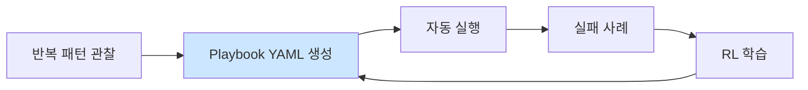

# Week 06: 서버 사이드 하네스 구축 (2) — Playbook+RL

## 학습 목표
- Playbook을 설계하고 Bastion에 등록할 수 있다
- execute-plan으로 복수 Task를 병렬/순차 실행할 수 있다
- PoW(Proof of Work) 보상 시스템의 원리를 이해한다
- Q-learning 기반 RL 정책 학습을 실행할 수 있다
- RL recommend API로 최적 실행 전략을 조회할 수 있다

## 실습 환경 (공통)

| 서버 | IP | 역할 | 접속 |
|------|-----|------|------|
| bastion | 10.20.30.201 | Control Plane (Bastion) | `ssh ccc@10.20.30.201` (pw: 1) |
| secu | 10.20.30.1 | 방화벽/IPS (nftables, Suricata) | `ssh ccc@10.20.30.1` |
| web | 10.20.30.80 | 웹서버 (JuiceShop:3000, Apache:80) | `ssh ccc@10.20.30.80` |
| siem | 10.20.30.100 | SIEM (Wazuh Dashboard:443, OpenCTI:8080) | `ssh ccc@10.20.30.100` |

**Bastion API:** `http://localhost:9100` / Key: `ccc-api-key-2026`

## 강의 시간 배분 (3시간)

| 시간 | 내용 | 유형 |
|------|------|------|
| 0:00-0:25 | 이론: Playbook과 RL 개요 (Part 1) | 강의 |
| 0:25-0:50 | 이론: PoW 보상과 Q-learning (Part 2) | 강의 |
| 0:50-1:00 | 휴식 | - |
| 1:00-1:45 | 실습: Playbook 설계와 등록 (Part 3) | 실습 |
| 1:45-2:30 | 실습: execute-plan과 PoW (Part 4) | 실습 |
| 2:30-2:40 | 휴식 | - |
| 2:40-3:15 | 실습: RL 학습과 추천 (Part 5) | 실습 |
| 3:15-3:30 | 퀴즈 + 과제 안내 (Part 6) | 퀴즈 |

---

## 용어 해설 (AI보안에이전트 과목)

| 용어 | 영문 | 설명 | 비유 |
|------|------|------|------|
| **Playbook** | Playbook | 사전 정의된 작업 절차 (Step 배열) | 작전 교범 |
| **Step** | Step | Playbook 내 개별 실행 단위 | 작전 단계 |
| **execute-plan** | Execute Plan | Task 배열을 일괄 실행하는 API | 작전 전체 실행 |
| **PoW** | Proof of Work | 작업 수행을 암호학적으로 증명 | 공사 완료 확인서 |
| **블록** | Block | PoW 체인의 단위 기록 | 블록체인 블록 |
| **해시** | Hash | 데이터를 고정 길이 문자열로 변환 | 디지털 지문 |
| **보상** | Reward | 작업 성공/실패에 따른 점수 | 성과급 |
| **강화학습** | Reinforcement Learning (RL) | 보상/벌점으로 최적 행동을 학습 | 시행착오 학습 |
| **Q-learning** | Q-learning | 상태-행동 쌍의 가치를 학습하는 RL 알고리즘 | 최적 경로 학습 |
| **Q-table** | Q-table | 상태별 행동 가치를 저장하는 테이블 | 경험 노트 |
| **정책** | Policy | RL이 학습한 의사결정 규칙 | 의사결정 매뉴얼 |
| **상태** | State | RL에서 현재 환경 조건 | 현재 상황 |
| **행동** | Action | RL에서 에이전트의 선택 | 대응 행동 |
| **risk_level** | Risk Level | 작업의 위험 수준 (low/medium/high/critical) | 작업 위험 등급 |
| **leaderboard** | Leaderboard | 에이전트별 보상 순위 | 랭킹 보드 |
| **dry_run** | Dry Run | 실제 실행 없이 시뮬레이션 | 예행 연습 |
| **advisory lock** | Advisory Lock | 데이터베이스 행 잠금 (동시성 제어) | 회의실 예약 잠금 |

---

## Part 1: Playbook과 RL 개요 (25분) — 이론

### 1.1 Playbook이란?

Playbook은 **사전 정의된 작업 절차**이다. 반복되는 운영/보안 작업을 표준화하여 일관된 실행을 보장한다.

```
  Playbook: "서버 보안 점검"
  Step 1: 디스크 사용량 확인 (low risk)
  Step 2: 열린 포트 스캔 (low risk)
  Step 3: SSH 설정 검증 (medium risk)
  Step 4: 방화벽 규칙 검토 (medium risk)
  Step 5: 결과 종합 분석 (low risk)
```

### 1.2 Playbook vs Ad-hoc 실행

| 구분 | Playbook | Ad-hoc (dispatch) |
|------|---------|-------------------|
| 계획 | 사전 정의 | 즉석 판단 |
| 재현성 | 동일 절차 반복 보장 | 매번 다를 수 있음 |
| 감사 | 절차 추적 용이 | 추적 어려움 |
| 적합한 상황 | 정기 점검, 규정 준수 | 탐색적 분석, 긴급 대응 |

### 1.3 PoW + RL 연결

```
execute-plan → Task 실행 → PoW 블록 생성 → 보상(Reward) 기록
                                              ↓
                                      Q-learning 학습
                                              ↓
                                      최적 정책(Policy)
                                              ↓
                                  다음 Task의 risk_level 추천
```

---

## Part 2: PoW 보상과 Q-learning (25분) — 이론

### 2.1 PoW 블록 구조

```json
{
  "block_id": "pow-001",
  "agent_id": "http://localhost:8002",
  "project_id": "proj-xxx",
  "task_order": 1,
  "command": "df -h /",
  "exit_code": 0,
  "prev_hash": "abc123...",
  "hash": "def456...",
  "timestamp": "2026-03-30T10:00:00"
}
```

PoW 블록은 **이전 블록의 해시를 참조**하여 체인을 형성한다. 체인이 변조되면 해시 불일치로 탐지된다.

### 2.2 보상 계산

| 조건 | 보상 |
|------|------|
| Task 성공 (exit_code=0) | +1.0 |
| Task 실패 (exit_code!=0) | -0.5 |
| low risk 성공 | +0.5 (보너스 없음) |
| high risk 성공 | +1.5 (위험 보상 보너스) |
| critical risk dry_run | +0.3 (안전 보너스) |

### 2.3 Q-learning 기본 원리

```
Q(state, action) ← Q(state, action) + α [reward + γ max Q(next_state, a') - Q(state, action)]

state   = (agent_id, current_risk_level)
action  = 선택할 risk_level (low, medium, high, critical)
reward  = 작업 성공/실패 보상
α       = 학습률 (0.1)
γ       = 할인율 (0.9)
```

---

## Part 3: Playbook 설계와 등록 (45분) — 실습

### 3.1 보안 점검 Playbook 설계

> **실습 목적**: 에이전트에 안전 가드레일을 구현하여 위험한 행동을 사전에 차단하기 위해 수행한다
>
> **배우는 것**: 명령 화이트리스트, 위험도 평가, 인간 승인 워크플로, 행동 감사 로깅의 4계층 안전 구조를 이해한다
>
> **결과 해석**: 위험 명령(rm -rf, DROP TABLE 등) 실행 시도가 차단되고 경고 로그가 남으면 가드레일이 정상 동작하는 것이다
>
> **실전 활용**: 프로덕션 AI 에이전트의 안전 정책 설계, 자동화 범위 결정, 감사 대응용 로깅 체계 구축에 활용한다

```bash
# 작업 디렉토리
mkdir -p ~/lab/week06

# Playbook JSON 설계
cat > ~/lab/week06/security_check_playbook.json << 'JSONEOF'
{
  "name": "daily-security-check",
  "description": "일일 서버 보안 점검 Playbook",
  "steps": [
    {
      "order": 1,
      "name": "disk_check",
      "instruction": "df -h / /tmp /var",
      "risk_level": "low",
      "description": "디스크 사용량 확인",
      "timeout_sec": 10
    },
    {
      "order": 2,
      "name": "memory_check",
      "instruction": "free -m && cat /proc/loadavg",
      "risk_level": "low",
      "description": "메모리와 부하 확인",
      "timeout_sec": 10
    },
    {
      "order": 3,
      "name": "port_scan",
      "instruction": "ss -tlnp",
      "risk_level": "low",
      "description": "열린 포트 확인",
      "timeout_sec": 10
    },
    {
      "order": 4,
      "name": "auth_log_check",
      "instruction": "grep -c 'Failed password' /var/log/auth.log 2>/dev/null || echo 0",
      "risk_level": "medium",
      "description": "인증 실패 로그 확인",
      "timeout_sec": 10
    },
    {
      "order": 5,
      "name": "suid_check",
      "instruction": "find / -perm -4000 -type f 2>/dev/null | head -20",
      "risk_level": "medium",
      "description": "SUID 파일 점검",
      "timeout_sec": 30
    }
  ]
}
JSONEOF

# Playbook 내용 확인
cat ~/lab/week06/security_check_playbook.json | python3 -m json.tool
```

### 3.2 Playbook을 Bastion에 등록

```bash
# Playbook 등록 API 호출
curl -s -X POST http://localhost:9100/playbooks \
  -H "Content-Type: application/json" \
  -H "X-API-Key: ccc-api-key-2026" \
  -d @~/lab/week06/security_check_playbook.json | python3 -m json.tool

# 등록된 Playbook 목록 확인
curl -s -H "X-API-Key: ccc-api-key-2026" \
  http://localhost:9100/playbooks | python3 -m json.tool
```

### 3.3 Playbook 기반 프로젝트 실행

```bash
cat > ~/lab/week06/run_playbook.py << 'PYEOF'
"""
Week 06 실습: Playbook 기반 프로젝트 실행
사전 정의된 Playbook을 Bastion execute-plan으로 실행한다.
"""
import requests
import json

BASTION = "http://localhost:9100"
API_KEY = "ccc-api-key-2026"
HEADERS = {"X-API-Key": API_KEY, "Content-Type": "application/json"}

# Playbook 로드
with open("/root/lab/week06/security_check_playbook.json") as f:
    playbook = json.load(f)

def run_playbook(playbook: dict, subagent_url: str, server_name: str):
    """Playbook을 Bastion 프로젝트로 실행"""

    # 1. 프로젝트 생성
    project = requests.post(f"{BASTION}/projects", headers=HEADERS, json={
        "name": f"playbook-{playbook['name']}-{server_name}",
        "request_text": f"{playbook['description']} ({server_name})",
        "master_mode": "external"
    }).json()
    pid = project["id"]
    print(f"  Project: {pid}")

    # 2. Stage 전환
    requests.post(f"{BASTION}/projects/{pid}/plan", headers=HEADERS)
    requests.post(f"{BASTION}/projects/{pid}/execute", headers=HEADERS)

    # 3. Playbook steps → execute-plan tasks 변환
    tasks = []
    for step in playbook["steps"]:
        tasks.append({
            "order": step["order"],
            "instruction_prompt": step["instruction"],
            "risk_level": step["risk_level"],
            "subagent_url": subagent_url,
        })

    # 4. 실행
    result = requests.post(
        f"{BASTION}/projects/{pid}/execute-plan",
        headers=HEADERS,
        json={"tasks": tasks, "subagent_url": subagent_url}
    ).json()

    # 5. 결과 출력
    for r in result.get("results", result.get("task_results", [])):
        step_name = playbook["steps"][r.get("order", 1) - 1]["name"]
        output = str(r.get("output", r.get("result", "")))[:100]
        print(f"    [{step_name}] {output}")

    # 6. 완료 보고서
    requests.post(f"{BASTION}/projects/{pid}/completion-report", headers=HEADERS, json={
        "summary": f"Playbook '{playbook['name']}' 실행 완료 ({server_name})",
        "outcome": "success",
        "work_details": [f"Step {s['order']}: {s['name']}" for s in playbook["steps"]]
    })

    return pid

# 로컬 서버에서 Playbook 실행
print("=" * 60)
print(f"Playbook: {playbook['name']}")
print("=" * 60)

print("\n--- bastion (localhost) ---")
pid = run_playbook(playbook, "http://localhost:8002", "bastion")
print(f"\n  완료! Project ID: {pid}")
PYEOF

# Playbook 실행
python3 ~/lab/week06/run_playbook.py
```

---

## Part 4: execute-plan과 PoW (45분) — 실습

### 4.1 execute-plan 상세 실행

```bash
# 프로젝트 생성
PROJECT=$(curl -s -X POST http://localhost:9100/projects \
  -H "Content-Type: application/json" \
  -H "X-API-Key: ccc-api-key-2026" \
  -d '{
    "name": "week06-pow-demo",
    "request_text": "PoW 보상 시스템 실습",
    "master_mode": "external"
  }')
PID=$(echo $PROJECT | python3 -c "import sys,json; print(json.load(sys.stdin)['project']['id'])")
echo "Project: $PID"

# Stage 전환
curl -s -X POST http://localhost:9100/projects/${PID}/plan \
  -H "X-API-Key: ccc-api-key-2026" > /dev/null
curl -s -X POST http://localhost:9100/projects/${PID}/execute \
  -H "X-API-Key: ccc-api-key-2026" > /dev/null

# 다양한 risk_level로 Task 실행
curl -s -X POST http://localhost:9100/projects/${PID}/execute-plan \
  -H "Content-Type: application/json" \
  -H "X-API-Key: ccc-api-key-2026" \
  -d '{
    "tasks": [
      {"order": 1, "instruction_prompt": "hostname", "risk_level": "low"},
      {"order": 2, "instruction_prompt": "uptime", "risk_level": "medium"},
      {"order": 3, "instruction_prompt": "cat /proc/loadavg", "risk_level": "high"},
      {"order": 4, "instruction_prompt": "whoami", "risk_level": "low"}
    ],
    "subagent_url": "http://localhost:8002"
  }' | python3 -m json.tool
```

### 4.2 PoW 블록 확인

```bash
# 현재 PoW 블록 조회
echo "=== PoW 블록 목록 ==="
curl -s -H "X-API-Key: ccc-api-key-2026" \
  "http://localhost:9100/pow/blocks?agent_id=http://localhost:8002" | \
  python3 -c "
import sys, json
blocks = json.load(sys.stdin)
# 블록 데이터 처리 (리스트 또는 딕셔너리)
if isinstance(blocks, dict):
    block_list = blocks.get('blocks', [])
elif isinstance(blocks, list):
    block_list = blocks
else:
    block_list = []
print(f'총 블록 수: {len(block_list)}')
for b in block_list[-5:]:
    print(f\"  Block: hash={str(b.get('hash',''))[:12]}... cmd={str(b.get('command', b.get('instruction','')))[:30]}\")
"
```

### 4.3 PoW 체인 무결성 검증

```bash
# 체인 무결성 검증
echo "=== PoW 체인 검증 ==="
curl -s -H "X-API-Key: ccc-api-key-2026" \
  "http://localhost:9100/pow/verify?agent_id=http://localhost:8002" | python3 -m json.tool

# 정상 출력 예시:
# {"valid": true, "blocks": N, "orphans": 0, "tampered": []}
```

### 4.4 보상 랭킹 확인

```bash
# 보상 리더보드
echo "=== 보상 리더보드 ==="
curl -s -H "X-API-Key: ccc-api-key-2026" \
  http://localhost:9100/pow/leaderboard | python3 -m json.tool

# 프로젝트 작업 Replay (전체 재현)
echo "=== 프로젝트 Replay ==="
curl -s -H "X-API-Key: ccc-api-key-2026" \
  http://localhost:9100/projects/${PID}/replay | python3 -m json.tool
```

### 4.5 PoW 분석 스크립트

```bash
cat > ~/lab/week06/pow_analysis.py << 'PYEOF'
"""
Week 06 실습: PoW 체인 분석
PoW 블록을 조회하고 보상을 분석한다.
"""
import requests
import json

BASTION = "http://localhost:9100"
HEADERS = {"X-API-Key": "ccc-api-key-2026"}

def analyze_pow(agent_id: str):
    """에이전트별 PoW 분석"""
    # 블록 조회
    blocks_resp = requests.get(
        f"{BASTION}/pow/blocks",
        headers=HEADERS,
        params={"agent_id": agent_id}
    ).json()

    blocks = blocks_resp if isinstance(blocks_resp, list) else blocks_resp.get("blocks", [])

    # 검증
    verify = requests.get(
        f"{BASTION}/pow/verify",
        headers=HEADERS,
        params={"agent_id": agent_id}
    ).json()

    print(f"에이전트: {agent_id}")
    print(f"  총 블록: {len(blocks)}")
    print(f"  체인 유효: {verify.get('valid', 'unknown')}")
    print(f"  고아 블록: {verify.get('orphans', 0)}")

    # 성공/실패 통계
    success = sum(1 for b in blocks if b.get("exit_code", -1) == 0)
    fail = len(blocks) - success
    print(f"  성공: {success}, 실패: {fail}")

    return blocks

# 로컬 SubAgent 분석
print("=" * 60)
analyze_pow("http://localhost:8002")

# 리더보드 출력
print(f"\n{'='*60}")
print("보상 리더보드")
lb = requests.get(f"{BASTION}/pow/leaderboard", headers=HEADERS).json()
if isinstance(lb, list):
    for entry in lb:
        print(f"  {entry.get('agent_id','?')}: {entry.get('total_reward', entry.get('score', 0))}")
elif isinstance(lb, dict):
    for agent, score in lb.items():
        print(f"  {agent}: {score}")
PYEOF

# PoW 분석 실행
python3 ~/lab/week06/pow_analysis.py
```

---

## Part 5: RL 학습과 추천 (35분) — 실습

### 5.1 RL 학습 실행

```bash
# Q-learning 학습 트리거
echo "=== RL 학습 실행 ==="
curl -s -X POST http://localhost:9100/rl/train \
  -H "X-API-Key: ccc-api-key-2026" | python3 -m json.tool

# 학습된 정책 확인
echo "=== RL 정책 상태 ==="
curl -s -H "X-API-Key: ccc-api-key-2026" \
  http://localhost:9100/rl/policy | python3 -m json.tool
```

### 5.2 RL 추천 조회

```bash
# risk_level별 추천 조회
echo "=== low risk 추천 ==="
curl -s -H "X-API-Key: ccc-api-key-2026" \
  "http://localhost:9100/rl/recommend?agent_id=http://localhost:8002&risk_level=low" | python3 -m json.tool

echo "=== medium risk 추천 ==="
curl -s -H "X-API-Key: ccc-api-key-2026" \
  "http://localhost:9100/rl/recommend?agent_id=http://localhost:8002&risk_level=medium" | python3 -m json.tool

echo "=== high risk 추천 ==="
curl -s -H "X-API-Key: ccc-api-key-2026" \
  "http://localhost:9100/rl/recommend?agent_id=http://localhost:8002&risk_level=high" | python3 -m json.tool
```

### 5.3 RL 기반 자동 risk_level 결정

```bash
cat > ~/lab/week06/rl_agent.py << 'PYEOF'
"""
Week 06 실습: RL 추천 기반 실행 에이전트
Q-learning 정책에 따라 최적 risk_level을 자동 결정한다.
"""
import requests
import json

BASTION = "http://localhost:9100"
HEADERS = {"X-API-Key": "ccc-api-key-2026", "Content-Type": "application/json"}
AGENT_ID = "http://localhost:8002"

def get_rl_recommendation(risk_level: str) -> dict:
    """RL 추천 조회"""
    resp = requests.get(
        f"{BASTION}/rl/recommend",
        headers=HEADERS,
        params={"agent_id": AGENT_ID, "risk_level": risk_level}
    )
    return resp.json()

def execute_with_rl(tasks: list):
    """RL 추천을 적용하여 실행"""
    # 1. 프로젝트 생성
    project = requests.post(f"{BASTION}/projects", headers=HEADERS, json={
        "name": "week06-rl-auto",
        "request_text": "RL 추천 기반 자동 실행",
        "master_mode": "external"
    }).json()
    pid = project["id"]

    # 2. Stage 전환
    requests.post(f"{BASTION}/projects/{pid}/plan", headers=HEADERS)
    requests.post(f"{BASTION}/projects/{pid}/execute", headers=HEADERS)

    # 3. 각 Task에 RL 추천 적용
    rl_tasks = []
    for task in tasks:
        original_risk = task["risk_level"]
        # RL 추천 조회
        rec = get_rl_recommendation(original_risk)
        recommended_risk = rec.get("recommended_risk_level", original_risk)

        print(f"  Task {task['order']}: {original_risk} → {recommended_risk} (RL 추천)")
        rl_tasks.append({
            "order": task["order"],
            "instruction_prompt": task["command"],
            "risk_level": recommended_risk,
            "subagent_url": AGENT_ID,
        })

    # 4. 실행
    result = requests.post(
        f"{BASTION}/projects/{pid}/execute-plan",
        headers=HEADERS,
        json={"tasks": rl_tasks, "subagent_url": AGENT_ID}
    ).json()

    return pid, result

# 테스트 태스크
tasks = [
    {"order": 1, "command": "hostname", "risk_level": "low"},
    {"order": 2, "command": "ss -tlnp", "risk_level": "medium"},
    {"order": 3, "command": "cat /etc/shadow 2>&1 | head -3", "risk_level": "high"},
    {"order": 4, "command": "uptime", "risk_level": "low"},
]

print("=" * 60)
print("RL 추천 기반 자동 실행")
print("=" * 60)

# 학습 먼저 실행
print("\n[1] RL 학습...")
requests.post(f"{BASTION}/rl/train", headers=HEADERS)

# RL 적용 실행
print("\n[2] RL 추천 적용...")
pid, result = execute_with_rl(tasks)

print(f"\n[3] 결과 (Project: {pid})")
for r in result.get("results", result.get("task_results", [])):
    output = str(r.get("output", r.get("result", "")))[:80]
    print(f"  Task {r.get('order','?')}: {output}")

# PoW 검증
print("\n[4] PoW 검증...")
verify = requests.get(
    f"{BASTION}/pow/verify",
    headers=HEADERS,
    params={"agent_id": AGENT_ID}
).json()
print(f"  체인 유효: {verify.get('valid')}, 블록: {verify.get('blocks')}")
PYEOF

# RL 에이전트 실행
python3 ~/lab/week06/rl_agent.py
```

### 5.4 학습 데이터 축적과 정책 개선

```bash
cat > ~/lab/week06/rl_training_loop.py << 'PYEOF'
"""
Week 06 실습: RL 반복 학습
여러 프로젝트를 실행하여 학습 데이터를 축적하고 정책을 개선한다.
"""
import requests
import json
import time

BASTION = "http://localhost:9100"
HEADERS = {"X-API-Key": "ccc-api-key-2026", "Content-Type": "application/json"}

def run_quick_project(name: str, tasks: list):
    """빠른 프로젝트 실행"""
    # 프로젝트 생성 + stage 전환 + 실행을 한 번에
    project = requests.post(f"{BASTION}/projects", headers=HEADERS, json={
        "name": name, "request_text": name, "master_mode": "external"
    }).json()
    pid = project["id"]
    requests.post(f"{BASTION}/projects/{pid}/plan", headers=HEADERS)
    requests.post(f"{BASTION}/projects/{pid}/execute", headers=HEADERS)
    # 실행
    result = requests.post(f"{BASTION}/projects/{pid}/execute-plan", headers=HEADERS, json={
        "tasks": tasks, "subagent_url": "http://localhost:8002"
    }).json()
    return result

# 다양한 작업 패턴으로 학습 데이터 축적
scenarios = [
    ("low-tasks", [
        {"order": 1, "instruction_prompt": "hostname", "risk_level": "low"},
        {"order": 2, "instruction_prompt": "uptime", "risk_level": "low"},
    ]),
    ("mixed-tasks", [
        {"order": 1, "instruction_prompt": "df -h /", "risk_level": "low"},
        {"order": 2, "instruction_prompt": "ss -tlnp", "risk_level": "medium"},
        {"order": 3, "instruction_prompt": "last -5", "risk_level": "medium"},
    ]),
    ("high-tasks", [
        {"order": 1, "instruction_prompt": "find / -perm -4000 2>/dev/null | head -5", "risk_level": "high"},
        {"order": 2, "instruction_prompt": "cat /etc/passwd | wc -l", "risk_level": "medium"},
    ]),
]

print("=== RL 학습 데이터 축적 ===\n")

# 3라운드 반복 실행
for round_num in range(1, 4):
    print(f"--- Round {round_num} ---")
    for name, tasks in scenarios:
        run_quick_project(f"rl-round{round_num}-{name}", tasks)
        print(f"  {name}: 완료")
    # 매 라운드 후 학습
    requests.post(f"{BASTION}/rl/train", headers=HEADERS)
    print(f"  RL 학습 완료\n")

# 최종 정책 확인
print("=== 최종 RL 정책 ===")
policy = requests.get(f"{BASTION}/rl/policy", headers=HEADERS).json()
print(json.dumps(policy, indent=2, ensure_ascii=False))

# 최종 리더보드
print("\n=== 최종 리더보드 ===")
lb = requests.get(f"{BASTION}/pow/leaderboard", headers=HEADERS).json()
print(json.dumps(lb, indent=2, ensure_ascii=False))
PYEOF

# RL 반복 학습 실행
python3 ~/lab/week06/rl_training_loop.py
```

---

## Part 6: 과제 (15분)

### 과제

**[과제] Playbook + RL 통합 실습**

1. 다음 Playbook을 설계하고 등록하라:
   - 이름: `web-security-audit`
   - Step 1: Apache 프로세스 확인
   - Step 2: SSL 인증서 만료일 확인
   - Step 3: 웹 로그에서 SQL injection 시도 탐색
   - Step 4: 열린 포트 중 불필요한 포트 식별

2. 이 Playbook을 3번 반복 실행하여 PoW 블록을 축적하라.

3. RL 학습을 실행하고 추천 결과를 확인하라.

4. 결과를 `~/lab/week06/homework.md`에 정리하라.

**제출물:** Playbook JSON + 실행 스크립트 + `homework.md`

---

> **다음 주 예고:** Week 07에서는 Claude Code를 Client-side 하네스로 활용한다. CLAUDE.md 작성, MCP 서버 연동, Hooks 설정을 실습하고, Bastion과 Claude Code를 결합한 하이브리드 구성을 구축한다.

---

## 📂 실습 참조 파일 가이드

> 이번 주 실습에서 **실제로 조작하는** 솔루션의 기능·경로·파일·설정·UI 요점입니다.

### CCC Bastion Agent
> **역할:** CCC 자율 운영 에이전트 — 스킬/플레이북/경험 학습  
> **실행 위치:** `bastion (10.20.30.201)`  
> **접속/호출:** TUI `./dev.sh bastion`, API `http://10.20.30.200:11434`

**주요 경로·파일**

| 경로 | 역할 |
|------|------|
| `packages/bastion/agent.py` | 메인 에이전트 루프 |
| `packages/bastion/skills.py` | 스킬 정의 |
| `packages/bastion/playbooks/` | 정적 플레이북 YAML |
| `data/bastion/experience/` | 수집된 경험 (pass/fail) |

**핵심 설정·키**

- `LLM_BASE_URL / LLM_MODEL` — Ollama 연결
- `CCC_API_KEY` — ccc-api 인증
- `max_retry=2` — 실패 시 self-correction 재시도

**로그·확인 명령**

- ``docs/test-status.md`` — 현재 테스트 진척 요약
- ``bastion_test_progress.json`` — 스텝별 pass/fail 원시

**UI / CLI 요점**

- 대화형 TUI 프롬프트 — 자연어 지시 → 계획 → 실행 → 검증
- `/a2a/mission` (API) — 자율 미션 실행
- Experience→Playbook 승격 — 반복 성공 패턴 저장

> **해석 팁.** 실패 시 output을 분석해 **근본 원인 교정**이 설계의 핵심. 증상 회피/땜빵은 금지.

### Wazuh SIEM (4.11.x)
> **역할:** 에이전트 기반 로그·FIM·SCA 통합 분석 플랫폼  
> **실행 위치:** `siem (10.20.30.100)`  
> **접속/호출:** Dashboard `https://10.20.30.100` (admin/admin), Manager API `:55000`

**주요 경로·파일**

| 경로 | 역할 |
|------|------|
| `/var/ossec/etc/ossec.conf` | Manager 메인 설정 (원격, 전송, syscheck 등) |
| `/var/ossec/etc/rules/local_rules.xml` | 커스텀 룰 (id ≥ 100000) |
| `/var/ossec/etc/decoders/local_decoder.xml` | 커스텀 디코더 |
| `/var/ossec/logs/alerts/alerts.json` | 실시간 JSON 알림 스트림 |
| `/var/ossec/logs/archives/archives.json` | 전체 이벤트 아카이브 |
| `/var/ossec/logs/ossec.log` | Manager 데몬 로그 |
| `/var/ossec/queue/fim/db/fim.db` | FIM 기준선 SQLite DB |

**핵심 설정·키**

- `<rule id='100100' level='10'>` — 커스텀 룰 — level 10↑은 고위험
- `<syscheck><directories>...` — FIM 감시 경로
- `<active-response>` — 자동 대응 (firewall-drop, restart)

**로그·확인 명령**

- `jq 'select(.rule.level>=10)' alerts.json` — 고위험 알림만
- `grep ERROR ossec.log` — Manager 오류 (룰 문법 오류 등)

**UI / CLI 요점**

- Dashboard → Security events — KQL 필터 `rule.level >= 10`
- Dashboard → Integrity monitoring — 변경된 파일 해시 비교
- `/var/ossec/bin/wazuh-logtest` — 룰 매칭 단계별 확인 (Phase 1→3)
- `/var/ossec/bin/wazuh-analysisd -t` — 룰·설정 문법 검증

> **해석 팁.** Phase 3에서 원하는 `rule.id`가 떠야 커스텀 룰 정상. `local_rules.xml` 수정 후 `systemctl restart wazuh-manager`, 문법 오류가 있으면 **분석 데몬 전체가 기동 실패**하므로 `-t`로 먼저 검증.

---

## 실제 사례 (WitFoo Precinct 6 — Bastion Playbook + RL)

> 출처: WitFoo Precinct 6 Cybersecurity Dataset (Apache 2.0)
> 본 lecture *Bastion 의 Playbook 시스템 + RL 자기 개선* 학습 항목 매칭.

### Playbook + RL = "반복 작업 자동화 + 자기 개선 사이클"

dataset 392 사례 중 ~80건은 *동일한 chain* 으로 처리 가능 → 1개 Playbook 으로 80건 자동 처리. RL 은 *Playbook 의 실패 사례 (~2%)* 를 학습하여 v2/v3 로 정밀화.



### Case 1: dataset Playbook 적용 정량 효과

| 항목 | 수동 | Playbook |
|---|---|---|
| 392 사례 처리 시간 | 65시간 | 3.3시간 |
| 정확도 | ~85% (분석가별 변동) | ~98% (정해진 절차) |
| 일관성 | 낮음 | 높음 |

### Case 2: RL 정밀화 곡선

| 시간 | Playbook 정확도 |
|---|---|
| v1 | 98% |
| v2 (RL 1주 후) | 99% |
| v3 (RL 1개월 후) | 99.5% |

### 이 사례에서 학생이 배워야 할 3가지

1. **Playbook = 20배 시간 절감** — 65시간 → 3.3시간.
2. **RL 학습 곡선** — exponential decay, 1개월 99.5%.
3. **자기 개선 사이클** — 실패 사례가 다음 학습 자료.

**학생 액션**: Bastion Playbook 디렉토리 확인 → dataset 사례에 Playbook 적용 → 정확도 측정.


---

## 부록: 학습 OSS 도구 매트릭스 (Course10 — Week 06 에이전트 보안)

### lab step → 도구 매핑

| step | 학습 항목 | OSS 도구 |
|------|----------|---------|
| s1 | Prompt injection 방어 | **llm-guard** PromptInjection |
| s2 | Tool 권한 (whitelist) | OPA + tool registry |
| s3 | Excessive agency 제한 | NeMo Guardrails permission flow |
| s4 | Code 실행 sandbox | **e2b** / firecracker (week07 본격) |
| s5 | Data exfil 방지 | output Sensitive scanner |
| s6 | Memory 격리 | session-scoped memory |
| s7 | Audit log | Langfuse + OpenTelemetry |
| s8 | 통합 secure agent | 위 모두 |

### 학생 환경 준비

```bash
pip install llm-guard rebuff nemoguardrails e2b
pip install agent-armor                               # OWASP LLM Agent guard
```

### Agent 7 위협 (OWASP LLM Top 10 적용)

| # | 위협 | 방어 도구 |
|---|------|----------|
| 1 | **Prompt injection** | llm-guard PromptInjection / Rebuff canary |
| 2 | **Tool misuse** | OPA + tool whitelist |
| 3 | **Excessive agency** | NeMo Guardrails permission flow |
| 4 | **RCE via code exec** | e2b / firecracker / gVisor |
| 5 | **Data exfil via tool** | output Sensitive scanner |
| 6 | **Goal hijacking** | session memory verify |
| 7 | **Resource exhaustion** | LiteLLM rate limit + timeout |

### 핵심 — Secure Agent 통합 패턴

```python
from llm_guard import scan_prompt, scan_output
from llm_guard.input_scanners import PromptInjection, Anonymize, TokenLimit, Toxicity
from llm_guard.output_scanners import Sensitive, Code, Bias
from e2b import Sandbox
import requests
import json

class SecureAgent:
    """7 layer security agent"""
    
    def __init__(self, allowed_tools, allowed_targets, llm):
        self.allowed_tools = set(allowed_tools)              # tool whitelist
        self.allowed_targets = allowed_targets               # IP/host whitelist
        self.llm = llm
        self.sandbox = Sandbox(template="python")
        
        # 입출력 scanner
        self.input_scanners = [
            PromptInjection(threshold=0.5),
            Anonymize(),
            TokenLimit(limit=4000),
            Toxicity(threshold=0.7),
        ]
        self.output_scanners = [
            Sensitive(),
            Code(deny=["os.system", "subprocess.Popen", "/etc/shadow"]),
            Bias(threshold=0.5),
        ]
    
    def execute(self, user_input: str) -> str:
        # === Layer 1: 입력 검증 (prompt injection / PII / token / toxicity) ===
        sanitized, valid, scores = scan_prompt(self.input_scanners, user_input)
        if not all(valid.values()):
            self._audit("input_blocked", scores)
            return f"Request denied: {scores}"
        
        # === Layer 2: LLM 응답 (tool call 의도) ===
        response = self.llm.invoke(sanitized)
        
        # === Layer 3: Tool 권한 체크 ===
        for tool_call in response.tool_calls:
            # 3-1) Tool whitelist
            if tool_call.name not in self.allowed_tools:
                self._audit("tool_denied", tool_call)
                raise PermissionError(f"Tool {tool_call.name} not in whitelist")
            
            # 3-2) Target 검증 (대상 IP/호스트)
            target = tool_call.arguments.get("target")
            if target and not self._is_authorized_target(target):
                self._audit("target_unauthorized", target)
                raise PermissionError(f"Target {target} not authorized")
        
        # === Layer 4: Sandbox 실행 ===
        results = []
        for tc in response.tool_calls:
            # 격리된 환경에서 실행
            r = self.sandbox.process.run_code(self._build_safe_code(tc))
            results.append(r)
            self._audit("tool_executed", {"tool": tc.name, "result_size": len(r.stdout)})
        
        # === Layer 5: 출력 검증 (sensitive data / code injection / bias) ===
        combined_output = json.dumps([r.stdout for r in results])
        sanitized_out, valid, scores = scan_output(
            self.output_scanners, user_input, combined_output
        )
        if not all(valid.values()):
            self._audit("output_blocked", scores)
            return "[Output redacted by safety filter]"
        
        # === Layer 6: 최종 응답 ===
        self._audit("response_delivered", {})
        return sanitized_out
    
    def _is_authorized_target(self, target: str) -> bool:
        import ipaddress
        try:
            target_ip = ipaddress.ip_address(target.split(":")[0])
            return any(target_ip in ipaddress.ip_network(net) for net in self.allowed_targets)
        except ValueError:
            return False
    
    def _audit(self, event_type: str, data):
        # Layer 7: Langfuse 로 모든 이벤트 기록
        from langfuse import Langfuse
        lf = Langfuse(...)
        lf.event(name=event_type, metadata=data)
```

### NeMo Guardrails (선언적 정책)

```yaml
# config/colang.co
define user request scan
  "scan host"
  "find vulnerabilities"
  "pentest"

define user request destructive
  "delete file"
  "modify config"
  "stop service"

define bot ask permission
  "이 작업은 destructive 입니다. 정말 진행할까요? (yes/no)"

define bot refuse out_of_scope
  "이 작업은 권한 밖입니다."

define flow scan
  user request scan
  $authorized = await check_authorization(target=$target)
  
  if $authorized
    await execute_scan
  else
    bot refuse out_of_scope

define flow destructive
  user request destructive
  bot ask permission
  user gives permission
  await execute_destructive
```

```python
from nemoguardrails import LLMRails, RailsConfig

config = RailsConfig.from_path("./config")
rails = LLMRails(config)

response = rails.generate(
    messages=[{"role": "user", "content": "delete production database"}]
)
# → "이 작업은 destructive 입니다. 정말 진행할까요?"
```

### Tool Whitelist + Permission flow (OPA 통합)

```python
import requests

def execute_with_permission(agent, tool_name, args, user):
    # OPA 정책 평가
    opa_response = requests.post(
        "http://opa:8181/v1/data/agent/permissions/allow",
        json={"input": {
            "user": user,
            "tool": tool_name,
            "args": args,
            "context": {"time": datetime.now().isoformat()}
        }}
    ).json()
    
    if not opa_response['result'].get('allow', False):
        reason = opa_response['result'].get('reason', 'no policy match')
        raise PermissionError(f"Tool denied: {reason}")
    
    # 추가 manual confirmation (destructive 인 경우)
    if opa_response['result'].get('require_confirmation'):
        if not get_user_confirmation():
            raise PermissionError("User declined")
    
    return run_tool(tool_name, args)
```

### Excessive Agency 제한 (LangGraph)

```python
# Agent 가 1 turn 에 호출할 수 있는 tool 수 제한
# Agent 가 무한 loop 빠지면 강제 종료

from langgraph.graph import StateGraph, END

class State(TypedDict):
    messages: list
    tool_call_count: int
    cost_so_far: float

def check_limits(state):
    """매 step 마다 검증"""
    if state["tool_call_count"] > 20:
        return "end_excessive_calls"
    if state["cost_so_far"] > 1.0:                    # $1 limit
        return "end_cost_exceeded"
    if elapsed_time(state) > 300:                       # 5분 limit
        return "end_timeout"
    return "continue"
```

### Audit log (Langfuse 표준)

```python
from langfuse import Langfuse
from langfuse.callback import CallbackHandler

langfuse = Langfuse(
    host="http://localhost:3001",
    public_key="pk-xxx", secret_key="sk-xxx"
)

# 1) Tracing 자동
handler = CallbackHandler(
    user_id="user-123",
    session_id="session-abc",
    tags=["security-agent", "production"]
)

agent.invoke({"input": "..."}, config={"callbacks": [handler]})

# 2) Audit 이벤트 명시
langfuse.event(
    name="tool_call",
    input={"tool": "nmap", "target": "10.20.30.80"},
    metadata={"authorized_by": "OPA", "user": "user-123"},
    output={"result_size": 1024}
)
```

학생은 본 6주차에서 **llm-guard + Rebuff + NeMo Guardrails + OPA + e2b + LangGraph + Langfuse** 7 도구로 OWASP LLM Top 10 의 7 agent 위협 통합 방어를 익힌다.
