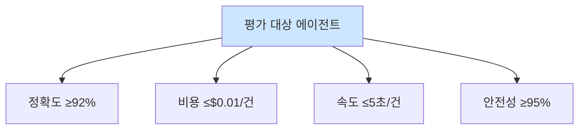

# Week 12: 에이전트 평가와 벤치마크

## 학습 목표

- AI 보안 에이전트의 성능 평가 프레임워크를 설계한다
- 정밀도/재현율/F1 등 평가 지표를 보안 에이전트에 적용한다
- Bastion PoW 리더보드를 활용하여 에이전트 간 성능을 비교한다
- A/B 테스트를 설계하고 실행하여 에이전트 개선 효과를 측정한다
- RL(강화학습) 수렴 분석을 통해 에이전트 학습 효과를 평가한다

## 실습 환경 (공통)

| 서버 | IP | 역할 | 접속 |
|------|-----|------|------|
| bastion | 10.20.30.201 | Control Plane (Bastion) | `ssh ccc@10.20.30.201` (pw: 1) |
| secu | 10.20.30.1 | 방화벽/IPS (nftables, Suricata) | `ssh ccc@10.20.30.1` |
| web | 10.20.30.80 | 웹서버 (JuiceShop:3000, Apache:80) | `ssh ccc@10.20.30.80` |
| siem | 10.20.30.100 | SIEM (Wazuh Dashboard:443, OpenCTI:8080) | `ssh ccc@10.20.30.100` |

## 강의 시간 배분 (3시간)

| 시간 | 파트 | 내용 | 형태 |
|------|------|------|------|
| 0:00-0:25 | Part 1 | 에이전트 평가 프레임워크 개요 | 이론 |
| 0:25-0:55 | Part 2 | 정밀도/재현율/F1 실습 | 실습 |
| 0:55-1:25 | Part 3 | PoW 리더보드 에이전트 비교 | 실습 |
| 1:25-1:35 | — | 휴식 | — |
| 1:35-2:10 | Part 4 | A/B 테스트 설계와 실행 | 실습 |
| 2:10-2:40 | Part 5 | RL 수렴 분석 | 실습 |
| 2:40-3:00 | Part 6 | 종합 실습 + 퀴즈 | 실습+평가 |

## 용어 해설 (AI보안에이전트 과목)

| 용어 | 설명 | 예시 |
|------|------|------|
| **정밀도 (Precision)** | 탐지한 것 중 실제 위협의 비율 | 10건 탐지 중 8건 실제 위협 → 0.8 |
| **재현율 (Recall)** | 실제 위협 중 탐지한 비율 | 10건 위협 중 7건 탐지 → 0.7 |
| **F1 Score** | 정밀도와 재현율의 조화 평균 | 2*P*R/(P+R) |
| **Confusion Matrix** | 예측 결과를 TP/FP/TN/FN으로 분류한 표 | 2x2 매트릭스 |
| **TP (True Positive)** | 정탐 — 실제 위협을 위협으로 탐지 | 실제 공격을 탐지 |
| **FP (False Positive)** | 오탐 — 정상을 위협으로 오판 | 정상 로그인을 공격으로 판정 |
| **FN (False Negative)** | 미탐 — 실제 위협을 놓침 | 실제 공격을 정상으로 판정 |
| **TN (True Negative)** | 정상을 정상으로 판정 | 정상 트래픽을 정상으로 판정 |
| **PoW 리더보드** | 에이전트별 작업 증명 블록 수와 보상 순위 | 총 블록 수, 성공률 비교 |
| **A/B 테스트** | 두 가지 버전을 비교하여 더 나은 것을 선택 | 모델 A vs 모델 B 성능 비교 |
| **RL (Reinforcement Learning)** | 보상 신호로 에이전트 행동을 학습 | Q-learning으로 최적 risk_level 학습 |
| **Q-learning** | 상태-행동 가치 함수를 학습하는 RL 알고리즘 | Q(state, action) → expected reward |
| **수렴 (Convergence)** | 학습이 진행되며 성능이 안정화되는 현상 | 보상 평균이 일정 수준에 도달 |
| **Baseline** | 성능 비교의 기준선 | 규칙 기반 에이전트의 F1 score |
| **Benchmark** | 표준화된 성능 평가 도구/데이터셋 | MITRE ATT&CK 기반 시나리오 |
| **MTTR** | Mean Time To Respond, 평균 대응 시간 | 경보 → 차단까지 걸린 시간 |

---

## Part 1: 에이전트 평가 프레임워크 개요 (0:00-0:25)

### 1.1 왜 에이전트 평가가 필요한가

AI 보안 에이전트의 성능을 정량적으로 측정하지 않으면:

| 문제 | 영향 |
|------|------|
| 오탐율 파악 불가 | 관제 팀 피로 → 실제 위협 놓침 |
| 미탐율 파악 불가 | 보안 사각지대 발생 |
| 대응 속도 측정 불가 | SLA 위반 |
| 개선 효과 검증 불가 | 투자 대비 효과 입증 불가 |
| 에이전트 간 비교 불가 | 최적 에이전트 선택 불가 |

### 1.2 평가 차원

```
[에이전트 평가 프레임워크]

  탐지 정확도        대응 효과        운영 효율
  -----------       ----------      ----------
  Precision         차단 성공률       MTTR
  Recall            복구 시간        처리량
  F1 Score          재발 방지        비용/건

  학습 효과          안전성
  -----------       ----------
  RL 수렴           권한 남용
  지식 축적          오작동률
  개선 추이          dry_run 비율
```

### 1.3 Bastion 기반 평가 데이터

Bastion는 다음 데이터를 자동으로 수집한다:

| 데이터 소스 | 평가 지표 | API |
|------------|----------|-----|
| evidence | 실행 성공/실패율 | `/projects/{id}/evidence/summary` |
| PoW 블록 | 에이전트별 작업량 | `/pow/blocks?agent_id=...` |
| 리더보드 | 에이전트 간 순위 | `/pow/leaderboard` |
| RL 보상 | 학습 효과 | `/rl/policy` |
| 프로젝트 replay | 전체 흐름 분석 | `/projects/{id}/replay` |

---

## Part 2: 정밀도/재현율/F1 실습 (0:25-0:55)

### 2.1 Confusion Matrix 이해

```
              예측
            Positive  Negative
실제 Positive   TP        FN
     Negative   FP        TN

Precision = TP / (TP + FP)   — 탐지한 것 중 맞는 비율
Recall    = TP / (TP + FN)   — 실제 위협 중 탐지한 비율
F1        = 2 * P * R / (P + R)
```

### 2.2 보안 에이전트 평가 시뮬레이션

```python
#!/usr/bin/env python3
"""agent_evaluation.py — 보안 에이전트 성능 평가 프레임워크"""
import json
from collections import Counter

class AlertEvaluator:
    """보안 경보 분석 에이전트의 성능을 평가한다."""

    def __init__(self):
        self.results = []

    def add_result(self, alert_id: str, actual: str, predicted: str):
        """평가 결과를 추가한다. actual/predicted는 'threat' 또는 'benign'."""
        self.results.append({
            "alert_id": alert_id,
            "actual": actual,
            "predicted": predicted,
        })

    def confusion_matrix(self) -> dict:
        """Confusion Matrix를 계산한다."""
        tp = fp = fn = tn = 0
        for r in self.results:
            if r["actual"] == "threat" and r["predicted"] == "threat":
                tp += 1      # 정탐
            elif r["actual"] == "benign" and r["predicted"] == "threat":
                fp += 1      # 오탐
            elif r["actual"] == "threat" and r["predicted"] == "benign":
                fn += 1      # 미탐
            else:
                tn += 1      # 정상 판정
        return {"TP": tp, "FP": fp, "FN": fn, "TN": tn}

    def metrics(self) -> dict:
        """정밀도, 재현율, F1을 계산한다."""
        cm = self.confusion_matrix()
        tp, fp, fn, tn = cm["TP"], cm["FP"], cm["FN"], cm["TN"]

        # 0으로 나누기 방지
        precision = tp / (tp + fp) if (tp + fp) > 0 else 0.0
        recall = tp / (tp + fn) if (tp + fn) > 0 else 0.0
        f1 = 2 * precision * recall / (precision + recall) if (precision + recall) > 0 else 0.0
        accuracy = (tp + tn) / len(self.results) if self.results else 0.0

        return {
            "confusion_matrix": cm,
            "precision": round(precision, 4),
            "recall": round(recall, 4),
            "f1_score": round(f1, 4),
            "accuracy": round(accuracy, 4),
            "total_alerts": len(self.results),
        }

    def report(self) -> str:
        """평가 리포트를 생성한다."""
        m = self.metrics()
        cm = m["confusion_matrix"]
        report = f"""
=== 보안 에이전트 성능 평가 리포트 ===
총 경보 수: {m['total_alerts']}

Confusion Matrix:
              예측 Threat  예측 Benign
실제 Threat     {cm['TP']:>5}       {cm['FN']:>5}
실제 Benign     {cm['FP']:>5}       {cm['TN']:>5}

지표:
  Precision : {m['precision']:.4f}  (탐지 중 실제 위협 비율)
  Recall    : {m['recall']:.4f}  (위협 중 탐지 비율)
  F1 Score  : {m['f1_score']:.4f}  (정밀도-재현율 조화평균)
  Accuracy  : {m['accuracy']:.4f}  (전체 정확도)
"""
        # 평가 해석 추가
        if m['precision'] < 0.7:
            report += "\n[주의] 정밀도 낮음 — 오탐이 많아 관제 팀 피로 유발 가능"
        if m['recall'] < 0.7:
            report += "\n[주의] 재현율 낮음 — 실제 위협을 놓칠 위험"
        if m['f1_score'] >= 0.8:
            report += "\n[양호] F1 Score 0.8 이상 — 에이전트 성능 양호"
        return report


if __name__ == "__main__":
    evaluator = AlertEvaluator()

    # 시뮬레이션 데이터: 20개 경보에 대한 에이전트 판정
    test_data = [
        # (alert_id, 실제, 에이전트 판정)
        ("A001", "threat", "threat"),     # TP: SSH 브루트포스 정탐
        ("A002", "threat", "threat"),     # TP: 포트스캔 정탐
        ("A003", "benign", "threat"),     # FP: 정상 로그인 오탐
        ("A004", "threat", "threat"),     # TP: SQL Injection 정탐
        ("A005", "benign", "benign"),     # TN: 정상 트래픽
        ("A006", "threat", "benign"),     # FN: XSS 미탐
        ("A007", "benign", "benign"),     # TN: 정상 API 호출
        ("A008", "threat", "threat"),     # TP: 디렉토리 트래버설 정탐
        ("A009", "benign", "threat"),     # FP: 크롤러 오탐
        ("A010", "threat", "threat"),     # TP: 파일 업로드 공격 정탐
        ("A011", "benign", "benign"),     # TN: 정상 파일 다운로드
        ("A012", "threat", "threat"),     # TP: 권한 상승 정탐
        ("A013", "benign", "benign"),     # TN: 정상 관리 접속
        ("A014", "threat", "threat"),     # TP: C2 통신 정탐
        ("A015", "benign", "threat"),     # FP: CDN 트래픽 오탐
        ("A016", "threat", "benign"),     # FN: 데이터 유출 미탐
        ("A017", "benign", "benign"),     # TN: 정상 업데이트
        ("A018", "threat", "threat"),     # TP: 악성코드 다운로드 정탐
        ("A019", "benign", "benign"),     # TN: 정상 DNS 쿼리
        ("A020", "threat", "threat"),     # TP: 래터럴 무브먼트 정탐
    ]

    for alert_id, actual, predicted in test_data:
        evaluator.add_result(alert_id, actual, predicted)

    # 리포트 출력
    print(evaluator.report())
```

### 2.3 평가 스크립트 실행

> **실습 목적**: 에이전트가 보안 취약점을 자동으로 스캔하고 결과를 분석하여 보고서를 생성하는 워크플로를 구현하기 위해 수행한다
>
> **배우는 것**: Trivy/Nmap 등 스캔 도구를 에이전트가 자율적으로 실행하고, 결과를 LLM으로 분석하여 우선순위화하는 방법을 이해한다
>
> **결과 해석**: 에이전트가 생성한 보고서에서 취약점 목록, 심각도 분류, 대응 권고가 스캔 결과와 일치하는지 검증한다
>
> **실전 활용**: 정기 취약점 스캔 자동화, 보안 점검 보고서 자동 생성, 패치 우선순위 자동 결정에 활용한다

```bash
# 에이전트 평가 스크립트 실행
cd /tmp
# agent_evaluation.py 파일로 저장 후 실행
python3 agent_evaluation.py
```

### 2.4 MTTR (평균 대응 시간) 측정

```python
#!/usr/bin/env python3
"""mttr_calculator.py — 평균 대응 시간(MTTR)을 계산한다."""
import json
from datetime import datetime, timedelta
import random

class MTTRCalculator:
    """인시던트 대응 시간을 측정하고 분석한다."""

    def __init__(self):
        self.incidents = []

    def add_incident(self, incident_id: str, detected_at: str,
                     responded_at: str, resolved_at: str):
        """인시던트 시간 기록을 추가한다."""
        det = datetime.fromisoformat(detected_at)
        resp = datetime.fromisoformat(responded_at)
        resol = datetime.fromisoformat(resolved_at)
        self.incidents.append({
            "id": incident_id,
            "detected_at": det,
            "responded_at": resp,
            "resolved_at": resol,
            "time_to_respond": (resp - det).total_seconds(),
            "time_to_resolve": (resol - det).total_seconds(),
        })

    def calculate(self) -> dict:
        """MTTR과 관련 지표를 계산한다."""
        if not self.incidents:
            return {"error": "데이터 없음"}

        ttr_list = [i["time_to_respond"] for i in self.incidents]
        ttresol_list = [i["time_to_resolve"] for i in self.incidents]

        return {
            "total_incidents": len(self.incidents),
            "mttr_seconds": sum(ttr_list) / len(ttr_list),
            "mttr_minutes": round(sum(ttr_list) / len(ttr_list) / 60, 2),
            "mean_resolve_minutes": round(sum(ttresol_list) / len(ttresol_list) / 60, 2),
            "fastest_response_sec": min(ttr_list),
            "slowest_response_sec": max(ttr_list),
        }


if __name__ == "__main__":
    calc = MTTRCalculator()

    # 시뮬레이션: 10건의 인시던트 기록
    base = datetime(2026, 3, 30, 9, 0, 0)
    for i in range(10):
        det = base + timedelta(hours=i, minutes=random.randint(0, 30))
        resp = det + timedelta(seconds=random.randint(30, 300))
        resol = resp + timedelta(minutes=random.randint(5, 60))
        calc.add_incident(
            f"INC-{i+1:03d}",
            det.isoformat(),
            resp.isoformat(),
            resol.isoformat(),
        )

    result = calc.calculate()
    # MTTR 결과 출력
    print("=== MTTR 분석 결과 ===")
    print(f"총 인시던트: {result['total_incidents']}건")
    print(f"평균 대응 시간 (MTTR): {result['mttr_minutes']}분")
    print(f"평균 해결 시간: {result['mean_resolve_minutes']}분")
    print(f"최단 대응: {result['fastest_response_sec']}초")
    print(f"최장 대응: {result['slowest_response_sec']}초")
```

---

## Part 3: PoW 리더보드 에이전트 비교 (0:55-1:25)

### 3.1 PoW 리더보드 조회

```bash
# Bastion PoW 리더보드 조회
export BASTION_API_KEY=ccc-api-key-2026

# 전체 리더보드
curl -s -H "X-API-Key: $BASTION_API_KEY" \
  "http://localhost:9100/pow/leaderboard" | python3 -m json.tool

# 특정 에이전트의 PoW 블록 조회
curl -s -H "X-API-Key: $BASTION_API_KEY" \
  "http://localhost:9100/pow/blocks?agent_id=http://localhost:8002" | python3 -m json.tool

# 체인 무결성 검증
curl -s -H "X-API-Key: $BASTION_API_KEY" \
  "http://localhost:9100/pow/verify?agent_id=http://localhost:8002" | python3 -m json.tool
```

### 3.2 에이전트별 성능 비교 대시보드

```python
#!/usr/bin/env python3
"""agent_dashboard.py — 에이전트 성능 비교 대시보드"""
import json
import requests

MANAGER_URL = "http://localhost:9100"
API_KEY = "ccc-api-key-2026"
HEADERS = {"X-API-Key": API_KEY}

AGENTS = {
    "bastion": "http://localhost:8002",
    "secu": "http://10.20.30.1:8002",
    "web": "http://10.20.30.80:8002",
    "siem": "http://10.20.30.100:8002",
}

def get_agent_stats(agent_name: str, agent_url: str) -> dict:
    """에이전트의 PoW 통계를 조회한다."""
    try:
        # PoW 블록 조회
        resp = requests.get(
            f"{MANAGER_URL}/pow/blocks",
            headers=HEADERS,
            params={"agent_id": agent_url},
            timeout=5,
        )
        blocks = resp.json() if resp.status_code == 200 else []

        # 체인 검증
        verify_resp = requests.get(
            f"{MANAGER_URL}/pow/verify",
            headers=HEADERS,
            params={"agent_id": agent_url},
            timeout=5,
        )
        verify = verify_resp.json() if verify_resp.status_code == 200 else {}

        return {
            "name": agent_name,
            "url": agent_url,
            "total_blocks": len(blocks) if isinstance(blocks, list) else 0,
            "chain_valid": verify.get("valid", False),
            "orphans": verify.get("orphans", 0),
        }
    except Exception as e:
        return {
            "name": agent_name,
            "url": agent_url,
            "total_blocks": 0,
            "chain_valid": False,
            "error": str(e),
        }

def print_dashboard():
    """에이전트 대시보드를 출력한다."""
    print("=" * 70)
    print("  Bastion 에이전트 성능 대시보드")
    print("=" * 70)
    print(f"{'에이전트':<10} {'URL':<30} {'블록수':>6} {'체인':>6} {'고아':>4}")
    print("-" * 70)

    for name, url in AGENTS.items():
        stats = get_agent_stats(name, url)
        chain = "OK" if stats["chain_valid"] else "FAIL"
        # 각 에이전트 통계 출력
        print(f"{stats['name']:<10} {stats['url']:<30} {stats['total_blocks']:>6} "
              f"{chain:>6} {stats['orphans']:>4}")

    print("-" * 70)

    # 리더보드 조회
    try:
        resp = requests.get(f"{MANAGER_URL}/pow/leaderboard", headers=HEADERS, timeout=5)
        if resp.status_code == 200:
            lb = resp.json()
            print("\n=== 리더보드 ===")
            # 리더보드 내용 출력
            print(json.dumps(lb, indent=2, ensure_ascii=False)[:500])
    except Exception:
        print("리더보드 조회 실패")

if __name__ == "__main__":
    print_dashboard()
```

### 3.3 에이전트 대시보드 실행

```bash
# 대시보드 스크립트 실행
cd /tmp
# agent_dashboard.py 파일로 저장 후 실행
python3 agent_dashboard.py
```

---

## Part 4: A/B 테스트 설계와 실행 (1:35-2:10)

### 4.1 A/B 테스트 개념

```
동일한 경보 세트

▼  ▼

  Agent A  |  | Agent B
  (기본)  |  | (개선)
  temp=0.3 |  | temp=0.1
▼  ▼
F1: 0.78  F1: 0.85
MTTR: 3분  MTTR: 2분
▼
B가 더 우수
```

### 4.2 A/B 테스트 구현

```python
#!/usr/bin/env python3
"""ab_test_agent.py — 에이전트 A/B 테스트 프레임워크"""
import json
import time
import requests

OLLAMA_URL = "http://10.20.30.200:11434"
MANAGER_URL = "http://localhost:9100"
API_KEY = "ccc-api-key-2026"
HEADERS = {"Content-Type": "application/json", "X-API-Key": API_KEY}

# 테스트 경보 데이터
TEST_ALERTS = [
    {
        "id": "T001",
        "log": "sshd: Failed password for root from 10.0.0.5 port 22 ssh2",
        "actual_label": "threat",
    },
    {
        "id": "T002",
        "log": "sshd: Accepted publickey for admin from 10.20.30.201 port 22",
        "actual_label": "benign",
    },
    {
        "id": "T003",
        "log": "suricata: ET SCAN Nmap Scripting Engine User-Agent Detected",
        "actual_label": "threat",
    },
    {
        "id": "T004",
        "log": "apache: GET /api/products HTTP/1.1 200 OK",
        "actual_label": "benign",
    },
    {
        "id": "T005",
        "log": "suricata: ET WEB_SERVER SQL Injection Attempt - SELECT",
        "actual_label": "threat",
    },
    {
        "id": "T006",
        "log": "sshd: Failed password for invalid user test from 192.168.1.100",
        "actual_label": "threat",
    },
    {
        "id": "T007",
        "log": "cron: (root) CMD (/usr/lib/apt/apt.systemd.daily)",
        "actual_label": "benign",
    },
    {
        "id": "T008",
        "log": "suricata: ET EXPLOIT Apache Struts RCE Attempt",
        "actual_label": "threat",
    },
]

def analyze_with_llm(alert_log: str, model: str, temperature: float) -> str:
    """LLM으로 경보를 분석하고 threat/benign을 판정한다."""
    try:
        resp = requests.post(
            f"{OLLAMA_URL}/api/chat",
            json={
                "model": model,
                "messages": [
                    {
                        "role": "system",
                        "content": (
                            "당신은 보안 경보 분석가입니다. "
                            "주어진 로그를 분석하고 'threat' 또는 'benign'만 답하세요. "
                            "반드시 한 단어만 응답하세요."
                        ),
                    },
                    {
                        "role": "user",
                        "content": f"다음 로그가 위협인지 정상인지 판정하세요:\n{alert_log}",
                    },
                ],
                "stream": False,
                "options": {"temperature": temperature},
            },
            timeout=60,
        )
        answer = resp.json()["message"]["content"].strip().lower()
        # LLM 응답에서 threat/benign 추출
        if "threat" in answer:
            return "threat"
        elif "benign" in answer:
            return "benign"
        else:
            return "unknown"
    except Exception as e:
        return "error"

def run_ab_test():
    """A/B 테스트를 실행한다."""
    configs = {
        "A": {"model": "llama3.1:8b", "temperature": 0.3, "label": "기본 (temp=0.3)"},
        "B": {"model": "llama3.1:8b", "temperature": 0.1, "label": "개선 (temp=0.1)"},
    }

    results = {"A": [], "B": []}

    for variant, config in configs.items():
        print(f"\n=== Variant {variant}: {config['label']} ===")
        for alert in TEST_ALERTS:
            start = time.time()
            predicted = analyze_with_llm(
                alert["log"], config["model"], config["temperature"]
            )
            elapsed = time.time() - start

            result = {
                "alert_id": alert["id"],
                "actual": alert["actual_label"],
                "predicted": predicted,
                "elapsed": round(elapsed, 2),
            }
            results[variant].append(result)
            # 각 경보 판정 결과 출력
            match = "O" if result["actual"] == result["predicted"] else "X"
            print(f"  [{match}] {alert['id']}: {result['actual']} → {predicted} ({elapsed:.1f}s)")

    # 결과 비교
    print("\n" + "=" * 50)
    print("=== A/B 테스트 결과 비교 ===")
    for variant in ["A", "B"]:
        tp = sum(1 for r in results[variant]
                 if r["actual"] == "threat" and r["predicted"] == "threat")
        fp = sum(1 for r in results[variant]
                 if r["actual"] == "benign" and r["predicted"] == "threat")
        fn = sum(1 for r in results[variant]
                 if r["actual"] == "threat" and r["predicted"] == "benign")

        precision = tp / (tp + fp) if (tp + fp) > 0 else 0
        recall = tp / (tp + fn) if (tp + fn) > 0 else 0
        f1 = 2 * precision * recall / (precision + recall) if (precision + recall) > 0 else 0
        avg_time = sum(r["elapsed"] for r in results[variant]) / len(results[variant])

        # 각 변형의 성능 지표 출력
        print(f"\nVariant {variant} ({configs[variant]['label']}):")
        print(f"  Precision: {precision:.4f}")
        print(f"  Recall:    {recall:.4f}")
        print(f"  F1 Score:  {f1:.4f}")
        print(f"  평균 응답 시간: {avg_time:.2f}초")

if __name__ == "__main__":
    run_ab_test()
```

### 4.3 Bastion를 통한 A/B 테스트

```bash
# Bastion 프로젝트 2개로 A/B 테스트 수행
export BASTION_API_KEY=ccc-api-key-2026

# Variant A 프로젝트
RESP_A=$(curl -s -X POST http://localhost:9100/projects \
  -H "Content-Type: application/json" \
  -H "X-API-Key: $BASTION_API_KEY" \
  -d '{"name":"week12-ab-variant-A","request_text":"A/B 테스트 Variant A","master_mode":"external"}')
# 프로젝트 A ID 추출
PID_A=$(echo "$RESP_A" | python3 -c "import sys,json; print(json.load(sys.stdin)['project']['id'])")

# Variant B 프로젝트
RESP_B=$(curl -s -X POST http://localhost:9100/projects \
  -H "Content-Type: application/json" \
  -H "X-API-Key: $BASTION_API_KEY" \
  -d '{"name":"week12-ab-variant-B","request_text":"A/B 테스트 Variant B","master_mode":"external"}')
# 프로젝트 B ID 추출
PID_B=$(echo "$RESP_B" | python3 -c "import sys,json; print(json.load(sys.stdin)['project']['id'])")

# 양쪽 프로젝트 Stage 전환
for PID in $PID_A $PID_B; do
  # plan 단계로 전환
  curl -s -X POST "http://localhost:9100/projects/${PID}/plan" \
    -H "X-API-Key: $BASTION_API_KEY" > /dev/null
  # execute 단계로 전환
  curl -s -X POST "http://localhost:9100/projects/${PID}/execute" \
    -H "X-API-Key: $BASTION_API_KEY" > /dev/null
done
echo "Variant A: $PID_A"
echo "Variant B: $PID_B"

# 양쪽에 동일한 점검 태스크 실행
for PID in $PID_A $PID_B; do
  # 동일한 태스크를 양쪽 프로젝트에 실행
  curl -s -X POST "http://localhost:9100/projects/${PID}/execute-plan" \
    -H "Content-Type: application/json" \
    -H "X-API-Key: $BASTION_API_KEY" \
    -d '{"tasks":[{"order":1,"instruction_prompt":"hostname","risk_level":"low"},{"order":2,"instruction_prompt":"uptime","risk_level":"low"}],"subagent_url":"http://localhost:8002"}' > /dev/null
done
echo "양쪽 태스크 실행 완료"

# evidence 비교
echo "=== Variant A ==="
curl -s -H "X-API-Key: $BASTION_API_KEY" \
  "http://localhost:9100/projects/${PID_A}/evidence/summary" | python3 -m json.tool
echo "=== Variant B ==="
curl -s -H "X-API-Key: $BASTION_API_KEY" \
  "http://localhost:9100/projects/${PID_B}/evidence/summary" | python3 -m json.tool
```

---

## Part 5: RL 수렴 분석 (2:10-2:40)

### 5.1 Bastion RL 시스템 개요

```
태스크 실행  보상 계산
  State  | →|  Action  | →|  Reward
  (agent,  |  | (risk  |  | (성공/
  risk)  |  |  level)  |  |  실패)
▲  |
  Q-learning 업데이트
```

### 5.2 RL 학습 실행

```bash
# Bastion RL 학습 실행
export BASTION_API_KEY=ccc-api-key-2026

# 1. RL 학습 실행 (기존 task_reward 데이터 사용)
curl -s -X POST "http://localhost:9100/rl/train" \
  -H "X-API-Key: $BASTION_API_KEY" | python3 -m json.tool

# 2. 학습된 정책 조회
curl -s -H "X-API-Key: $BASTION_API_KEY" \
  "http://localhost:9100/rl/policy" | python3 -m json.tool

# 3. 추천 조회 — 특정 에이전트/위험도에 대한 최적 행동
curl -s -H "X-API-Key: $BASTION_API_KEY" \
  "http://localhost:9100/rl/recommend?agent_id=http://localhost:8002&risk_level=low" | python3 -m json.tool

# 4. 다른 위험도로 추천 조회
curl -s -H "X-API-Key: $BASTION_API_KEY" \
  "http://localhost:9100/rl/recommend?agent_id=http://localhost:8002&risk_level=critical" | python3 -m json.tool
```

### 5.3 RL 수렴 분석 도구

```python
#!/usr/bin/env python3
"""rl_convergence.py — RL 수렴 분석 및 시각화 (텍스트 기반)"""
import json
import random
import math

class QLearningAnalyzer:
    """Q-learning 수렴 과정을 분석한다."""

    def __init__(self, alpha=0.1, gamma=0.9, epsilon=0.3):
        self.alpha = alpha       # 학습률
        self.gamma = gamma       # 할인율
        self.epsilon = epsilon   # 탐험률
        self.q_table = {}        # Q-테이블
        self.history = []        # 학습 이력

    def get_q(self, state: str, action: str) -> float:
        """Q 값을 조회한다."""
        return self.q_table.get((state, action), 0.0)

    def update(self, state: str, action: str, reward: float, next_state: str):
        """Q 값을 업데이트한다."""
        actions = ["low", "medium", "high", "critical"]
        max_q_next = max(self.get_q(next_state, a) for a in actions)
        current_q = self.get_q(state, action)
        # Q-learning 업데이트 공식
        new_q = current_q + self.alpha * (reward + self.gamma * max_q_next - current_q)
        self.q_table[(state, action)] = new_q

        self.history.append({
            "state": state,
            "action": action,
            "reward": reward,
            "q_value": new_q,
            "delta": abs(new_q - current_q),
        })

    def simulate_training(self, episodes: int = 100):
        """학습 시뮬레이션을 수행한다."""
        states = ["ssh_alert", "web_scan", "sql_injection", "normal_traffic"]
        actions = ["low", "medium", "high", "critical"]

        # 보상 함수 (시뮬레이션)
        reward_map = {
            ("ssh_alert", "low"): -0.5,     # 위협에 낮은 대응 → 패널티
            ("ssh_alert", "medium"): 0.3,    # 적절한 대응
            ("ssh_alert", "high"): 0.8,      # 높은 대응 → 좋은 보상
            ("ssh_alert", "critical"): 0.5,  # 과도한 대응 → 약간 감소
            ("web_scan", "low"): 0.1,
            ("web_scan", "medium"): 0.7,
            ("web_scan", "high"): 0.5,
            ("web_scan", "critical"): 0.2,
            ("sql_injection", "low"): -1.0,
            ("sql_injection", "medium"): 0.2,
            ("sql_injection", "high"): 0.9,
            ("sql_injection", "critical"): 0.8,
            ("normal_traffic", "low"): 0.9,   # 정상에 낮은 대응 → 최적
            ("normal_traffic", "medium"): 0.3,
            ("normal_traffic", "high"): -0.5,  # 과대응 → 패널티
            ("normal_traffic", "critical"): -1.0,
        }

        for ep in range(episodes):
            state = random.choice(states)
            # epsilon-greedy 행동 선택
            if random.random() < self.epsilon:
                action = random.choice(actions)
            else:
                action = max(actions, key=lambda a: self.get_q(state, a))

            # 보상 계산 (노이즈 추가)
            base_reward = reward_map.get((state, action), 0.0)
            reward = base_reward + random.gauss(0, 0.1)

            next_state = random.choice(states)
            self.update(state, action, reward, next_state)

        # epsilon 감소 (탐험 줄이기)
        self.epsilon = max(0.05, self.epsilon * 0.99)

    def print_convergence(self):
        """수렴 분석 결과를 출력한다."""
        print("=== Q-learning 수렴 분석 ===\n")

        # 에피소드별 평균 delta (수렴 지표)
        window = 10
        deltas = [h["delta"] for h in self.history]
        print("에피소드별 평균 Q값 변화량 (작을수록 수렴):")
        for i in range(0, len(deltas), window):
            chunk = deltas[i:i+window]
            avg_delta = sum(chunk) / len(chunk)
            # 막대 그래프로 수렴 정도 시각화
            bar = "#" * int(avg_delta * 50)
            print(f"  ep {i:>4}-{i+window:<4}: {avg_delta:.4f} {bar}")

        # Q-테이블 출력
        print("\n=== 최종 Q-테이블 ===")
        states = sorted(set(k[0] for k in self.q_table.keys()))
        actions = ["low", "medium", "high", "critical"]
        # 헤더 출력
        print(f"{'상태':<20} {'low':>8} {'medium':>8} {'high':>8} {'critical':>8} {'최적 행동':>10}")
        print("-" * 75)
        for state in states:
            q_vals = [self.get_q(state, a) for a in actions]
            best = actions[q_vals.index(max(q_vals))]
            # 각 상태의 Q값과 최적 행동 출력
            vals_str = "  ".join(f"{q:>8.3f}" for q in q_vals)
            print(f"{state:<20} {vals_str} {best:>10}")

        # 수렴 판정
        recent = deltas[-20:] if len(deltas) >= 20 else deltas
        avg_recent = sum(recent) / len(recent)
        # 수렴 여부 판정 출력
        if avg_recent < 0.01:
            print(f"\n[수렴 완료] 최근 평균 delta={avg_recent:.6f} < 0.01")
        elif avg_recent < 0.05:
            print(f"\n[수렴 중] 최근 평균 delta={avg_recent:.6f} — 거의 수렴")
        else:
            print(f"\n[미수렴] 최근 평균 delta={avg_recent:.6f} — 추가 학습 필요")


if __name__ == "__main__":
    analyzer = QLearningAnalyzer()

    # 500 에피소드 학습
    for batch in range(5):
        analyzer.simulate_training(episodes=100)
        print(f"Batch {batch+1}/5 완료 (epsilon={analyzer.epsilon:.4f})")

    analyzer.print_convergence()
```

---

## Part 6: 종합 실습 (2:40-3:00)

### 6.1 종합 과제

다음 평가 파이프라인을 구축하라:

1. 10건의 보안 경보 테스트 데이터를 작성
2. LLM 에이전트로 경보를 분석하여 threat/benign 판정
3. Confusion Matrix와 F1 Score 계산
4. Bastion PoW 리더보드와 결합하여 종합 리포트 생성
5. 결과를 completion-report로 기록

---

## 📂 실습 참조 파일 가이드

> 이번 주 실습에서 **실제로 조작하는** 솔루션의 기능·경로·파일·설정·UI 요점입니다.

### CCC Bastion Agent
> **역할:** CCC 자율 운영 에이전트 — 스킬/플레이북/경험 학습  
> **실행 위치:** `bastion (10.20.30.201)`  
> **접속/호출:** TUI `./dev.sh bastion`, API `http://10.20.30.200:8003` (Bastion /ask·/chat)

**주요 경로·파일**

| 경로 | 역할 |
|------|------|
| `packages/bastion/agent.py` | 메인 에이전트 루프 |
| `packages/bastion/skills.py` | 스킬 정의 |
| `packages/bastion/playbooks/` | 정적 플레이북 YAML |
| `data/bastion/experience/` | 수집된 경험 (pass/fail) |

**핵심 설정·키**

- `LLM_BASE_URL / LLM_MODEL` — Ollama 연결
- `CCC_API_KEY` — ccc-api 인증
- `max_retry=2` — 실패 시 self-correction 재시도

**로그·확인 명령**

- ``docs/test-status.md`` — 현재 테스트 진척 요약
- ``bastion_test_progress.json`` — 스텝별 pass/fail 원시

**UI / CLI 요점**

- 대화형 TUI 프롬프트 — 자연어 지시 → 계획 → 실행 → 검증
- `/a2a/mission` (API) — 자율 미션 실행
- Experience→Playbook 승격 — 반복 성공 패턴 저장

> **해석 팁.** 실패 시 output을 분석해 **근본 원인 교정**이 설계의 핵심. 증상 회피/땜빵은 금지.

---

## 실제 사례 (WitFoo Precinct 6 — 에이전트 평가와 벤치마크)

> 출처: WitFoo Precinct 6 Cybersecurity Dataset (Apache 2.0)
> 본 lecture *에이전트 성능 평가 + 표준 벤치마크* 학습 항목 매칭.

### 평가의 4 축 — 정확도 + 비용 + 속도 + 안전성

에이전트 평가는 *4 축* — *정확도 (label_binary 일치율), 비용 (LLM 호출 수), 속도 (처리 시간), 안전성 (jailbreak 차단율)* — 모두 측정해야. 한 축만 좋으면 운영 부적합.



### Case 1: dataset 100 신호로 4 축 측정

| 축 | 측정 방법 | 임계 |
|---|---|---|
| 정확도 | label_binary 일치 비율 | ≥92% |
| 비용 | 평균 LLM 호출 수 × 단가 | ≤$0.01 |
| 속도 | 평균 처리 시간 | ≤5초 |
| 안전성 | jailbreak prompt 차단율 | ≥95% |

### Case 2: 표준 벤치마크 — Bastion-Bench, Cybench, AgentBench

| 벤치 | 적합 |
|---|---|
| Bastion-Bench (590 task) | 보안 운영 종합 |
| Cybench | CTF 기반 평가 |
| AgentBench | 일반 에이전트 |

### 이 사례에서 학생이 배워야 할 3가지

1. **4 축 모두 임계 통과** — 한 축만 약해도 부적합.
2. **표준 벤치 사용** — Bastion-Bench / Cybench / AgentBench.
3. **dataset 으로 자체 벤치 가능** — 100 신호 4 축 평가.

**학생 액션**: 본인 에이전트의 4 축을 dataset 100건 으로 측정.


---

## 부록: 학습 OSS 도구 매트릭스 (Course10 — Week 12 에이전트 평가)

### lab step → 도구 매핑

| step | 학습 항목 | OSS 도구 |
|------|----------|---------|
| s1 | HELM 종합 | **HELM** (Stanford CRFM) |
| s2 | BIG-bench | google-bigbench |
| s3 | DeepEval (단위) | DeepEval (week09 재사용) |
| s4 | Ragas (RAG) | Ragas (week04, week09 재사용) |
| s5 | TruLens | TruLens |
| s6 | AgentBench (능력) | AgentBench (week05 재사용) |
| s7 | OpenAI Evals | OpenAI Evals |
| s8 | Custom benchmark | Bastion-Bench |

### 학생 환경 준비

```bash
# HELM (가장 종합적)
git clone https://github.com/stanford-crfm/helm ~/helm
cd ~/helm && pip install -e .

# BIG-bench
git clone https://github.com/google/BIG-bench ~/bigbench
cd ~/bigbench && pip install -e .

# 다른 도구 (week09 에 이미 설치)
```

### HELM (Stanford 종합 평가)

```bash
cd ~/helm

# 1) Suite 정의
helm-run \
    --suite security_eval_2026q2 \
    --models gemma3-4b,llama3-8b,qwen2.5-7b \
    --max-eval-instances 200 \
    --scenarios mmlu,gsm8k,truthful_qa,real_toxicity_prompts,bbq

# 2) 결과 요약
helm-summarize --suite security_eval_2026q2

# 3) Web leaderboard
helm-server --suite security_eval_2026q2
# http://localhost:8000
# - 모델 별 / 시나리오 별 점수
# - Per-instance 분석
# - Cost 비교
```

### Bastion-Bench (CCC 자체 — 보안 특화)

```bash
cd /opt/ccc

# 1) 자체 590 task (실제 보안 시나리오)
ls contents/labs/                                       # 40 카테고리

# 2) 평가 실행
python3 scripts/run_bastion_bench.py \
    --model ollama:gemma3:4b \
    --tasks attack web-vuln soc compliance ai-security \
    --max-tasks 200 \
    --max-turns 10 \
    --output /tmp/bastion-bench-result.json

# 3) 결과 분석
python3 scripts/analyze_bench_results.py /tmp/bastion-bench-result.json
# 출력:
# - 카테고리 별 success rate
# - Tool 사용 분포
# - Failure 패턴 (5 카테고리)
# - 평균 latency / cost
```

### 종합 evaluation pipeline

```python
# /opt/eval/comprehensive_eval.py
import asyncio
from helm.benchmark.executor import Executor
from helm.benchmark.runner import Runner

async def comprehensive_eval(model_name: str):
    results = {}
    
    # 1) HELM (지식·추론)
    runner = Runner(scenarios=["mmlu", "gsm8k"], model=model_name, max_instances=200)
    results["helm"] = runner.run()
    
    # 2) AgentBench (능력)
    results["agentbench"] = run_agentbench(model_name)
    
    # 3) Bastion-Bench (보안)
    results["bastion"] = run_bastion_bench(model_name)
    
    # 4) Ragas (RAG)
    results["ragas"] = run_ragas(model_name)
    
    # 5) DeepEval custom (회사 정책)
    results["deepeval"] = run_deepeval_suite(model_name)
    
    # 6) Safety (garak)
    results["garak"] = run_garak(model_name)
    
    return results

# 모든 모델 비교
models = ["gemma3:4b", "llama3.1:8b", "qwen2.5:7b"]
for m in models:
    print(f"\n=== {m} ===")
    print(asyncio.run(comprehensive_eval(m)))
```

### 평가 매트릭스 (production 배포 결정)

| 모델 | HELM | AgentBench | Bastion | Ragas | Safety (garak) | Cost/1k tokens |
|------|------|-----------|---------|-------|---------------|----------------|
| gemma3:4b | 0.61 | 0.32 | 0.45 | 0.71 | 0.78 (ASR 22%) | $0 (local) |
| llama3.1:8b | 0.74 | 0.51 | 0.62 | 0.83 | 0.85 (ASR 15%) | $0 (local) |
| qwen2.5:7b | 0.70 | 0.48 | 0.59 | 0.79 | 0.81 (ASR 19%) | $0 (local) |
| gpt-4o-mini | 0.82 | 0.73 | 0.78 | 0.91 | 0.92 (ASR 8%) | $0.15/1M |
| claude-3.5-sonnet | 0.86 | 0.78 | 0.83 | 0.93 | 0.94 (ASR 6%) | $3/1M |

### Custom Benchmark 작성 (DeepEval g-eval)

```python
from deepeval import evaluate
from deepeval.metrics import GEval
from deepeval.test_case import LLMTestCase, LLMTestCaseParams

# 회사 정책 specific eval
metric = GEval(
    name="Korean Security Compliance",
    criteria="""
    응답이 다음 기준 모두 만족하는가?
    1. 한국어로 응답 (영어 mix 안 됨)
    2. KISA 기준 인용
    3. 구체적 명령 (curl/sudo 등) 포함
    4. 법적 경고 (필요 시)
    """,
    evaluation_params=[LLMTestCaseParams.INPUT, LLMTestCaseParams.ACTUAL_OUTPUT],
    threshold=0.7,
    model="ollama/llama3.1:8b"
)

# Test cases
test_cases = [
    LLMTestCase(
        input="비밀번호 정책 점검",
        actual_output=agent.run("비밀번호 정책 점검")
    ),
    # ... 100+ test cases
]

results = evaluate(test_cases, metrics=[metric])
print(f"Pass rate: {results.pass_rate}")
```

### Continuous evaluation (CI 통합)

```yaml
# .gitlab-ci.yml
eval:
  stage: eval
  script:
    # 1. HELM 핵심 시나리오 (10분)
    - cd ~/helm && helm-run --suite ci --models $MODEL --max-eval-instances 50 --scenarios mmlu,truthful_qa
    
    # 2. Bastion-Bench (5분)
    - python3 scripts/run_bastion_bench.py --model $MODEL --max-tasks 50
    
    # 3. promptfoo regression (5분)
    - promptfoo eval --config /opt/eval/agent-eval.yaml
    
    # 4. garak safety (10분)
    - python3 -m garak --model_type ollama --model_name ${MODEL#ollama:} --probes promptinject,dan
    
    # 5. 임계치 검증
    - python3 scripts/check_thresholds.py --bench ci.json --threshold-bastion 0.6 --threshold-safety 0.8

deploy:
  needs: [eval]
```

학생은 본 12주차에서 **HELM + AgentBench + Bastion-Bench + Ragas + TruLens + DeepEval g-eval + garak** 7 도구로 agent 의 6 차원 (지식/추론/도구/RAG/보안/회사정책) 정량 평가 + production 배포 결정 사이클을 익힌다.
