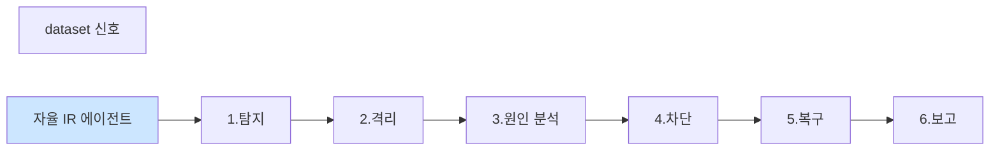

# Week 13: 프로젝트 A — 자율 인시던트 대응 에이전트

## 학습 목표

- Wazuh 경보를 자동 수신하는 파이프라인을 설계하고 프로토타입을 구축한다
- LLM 기반 위협 분석 엔진의 프롬프트와 판정 기준을 설계한다
- nftables 자동 차단 → Slack 알림 → Evidence 기록 전체 흐름을 설계한다
- 팀별 아키텍처를 확정하고 핵심 모듈의 프로토타입을 완성한다
- Bastion 프로젝트와 연동하여 모든 작업을 evidence로 기록한다

## 실습 환경 (공통)

| 서버 | IP | 역할 | 접속 |
|------|-----|------|------|
| bastion | 10.20.30.201 | Control Plane (Bastion) | `ssh ccc@10.20.30.201` (pw: 1) |
| secu | 10.20.30.1 | 방화벽/IPS (nftables, Suricata) | `ssh ccc@10.20.30.1` |
| web | 10.20.30.80 | 웹서버 (JuiceShop:3000, Apache:80) | `ssh ccc@10.20.30.80` |
| siem | 10.20.30.100 | SIEM (Wazuh Dashboard:443, OpenCTI:8080) | `ssh ccc@10.20.30.100` |

## 강의 시간 배분 (3시간)

| 시간 | 파트 | 내용 | 형태 |
|------|------|------|------|
| 0:00-0:20 | Part 1 | 프로젝트 A 요구사항과 아키텍처 | 이론 |
| 0:20-0:50 | Part 2 | Wazuh 경보 수집 모듈 구현 | 실습 |
| 0:50-1:25 | Part 3 | LLM 위협 분석 엔진 프로토타입 | 실습 |
| 1:25-1:35 | — | 휴식 | — |
| 1:35-2:10 | Part 4 | 자동 차단 + Slack 알림 모듈 | 실습 |
| 2:10-2:40 | Part 5 | Bastion 연동 및 Evidence 기록 | 실습 |
| 2:40-3:00 | Part 6 | 팀별 설계 발표 + 피드백 | 발표 |

## 용어 해설 (AI보안에이전트 과목)

| 용어 | 설명 | 예시 |
|------|------|------|
| **자율 인시던트 대응** | 사람 개입 없이 경보→분석→차단→보고를 수행 | Wazuh 경보 → LLM 분석 → nftables 차단 |
| **파이프라인** | 데이터가 순차적으로 처리되는 단계별 흐름 | 수집 → 분석 → 판정 → 대응 → 보고 |
| **Wazuh API** | Wazuh SIEM의 REST API | GET /alerts, GET /agents |
| **rule_id** | Wazuh 경보 규칙 식별자 | 5710 (SSH 인증 실패) |
| **rule_level** | Wazuh 경보 심각도 (0-15) | 10 이상 = 즉시 대응 |
| **nftables set** | IP 주소 집합을 관리하는 nftables 객체 | blocklist set에 IP 추가 |
| **Slack Bot** | Slack 채널에 메시지를 보내는 자동화 봇 | OldClaw Bot |
| **Evidence** | Bastion의 감사 기록 | 모든 실행 결과를 불변 기록 |
| **completion-report** | 프로젝트 완료 보고서 | 요약, 결과, 세부사항 포함 |
| **Webhook** | 이벤트 발생 시 HTTP로 통보하는 메커니즘 | Wazuh → Bastion 경보 전달 |
| **Triage** | 경보 우선순위 분류 | critical/high/medium/low |
| **enrichment** | 경보에 추가 정보를 보강 | IP → GeoIP, reputation |
| **rate-limit** | 단위 시간당 처리량 제한 | 1분당 최대 10건 차단 |
| **idempotent** | 동일 요청을 반복해도 결과가 같은 성질 | 이미 차단된 IP 재차단 시 에러 없음 |
| **프로토타입** | 핵심 기능만 구현한 초기 버전 | MVP (Minimum Viable Product) |

---

## Part 1: 프로젝트 A 요구사항과 아키텍처 (0:00-0:20)

### 1.1 프로젝트 요구사항

| 항목 | 요구사항 |
|------|---------|
| 팀 구성 | 2-3명 |
| 기간 | 3주 (Week 13: 설계+프로토타입, Week 14: 구현, Week 15: 시연) |
| 목표 | Wazuh 경보 → LLM 분석 → 차단 → 알림 → Evidence 전체 자동화 |
| 평가 | Bastion evidence 수 + 성공률 + 보고서 품질 + 발표 |
| 결과물 | Bastion 프로젝트 ID + completion-report + 발표 슬라이드 |

### 1.2 전체 아키텍처

```
  자율 인시던트 대응 에이전트
  | 1.수집  | →| 2.분석  | →| 3.판정  | →| 4.대응  |
  | Wazuh  |  | LLM  |  | Triage  |  | nftables|
  | API  |  | Ollama  |  |  |  | 차단  |
  ▼
  | 5.알림  |
  | Slack Bot  |
  ▼
  | 6.기록  |
  | Evidence  |
```

### 1.3 평가 기준

| 항목 | 배점 | 기준 |
|------|------|------|
| evidence 수 | 30% | Bastion에 기록된 evidence 건수 |
| 성공률 | 25% | 정탐률(Recall) + 오탐률(FP rate) |
| 보고서 품질 | 25% | completion-report 상세도 |
| 발표 | 20% | 시연 + Q&A |

---

## Part 2: Wazuh 경보 수집 모듈 구현 (0:20-0:50)

### 2.1 Wazuh API 인증

> **실습 목적**: 에이전트의 행동을 PoW 체인과 RL 보상으로 추적하고 최적화하는 피드백 루프를 구현하기 위해 수행한다
>
> **배우는 것**: PoW로 모든 행동을 불변 기록하고, 보상 점수로 행동 품질을 평가하며, Q-learning으로 최적 전략을 학습하는 순환 구조를 이해한다
>
> **결과 해석**: PoW verify의 valid=true, leaderboard의 보상 점수 변화, RL policy의 수렴 여부로 시스템 건전성을 판단한다
>
> **실전 활용**: AI 에이전트의 감사 추적, 자동화 품질 지속 개선, 최적 대응 전략의 자동 학습에 활용한다

```bash
# Wazuh API 토큰 발급
TOKEN=$(curl -sk -u wazuh-wui:MyS3cr3tP4ssw0rd* \
  -X POST https://10.20.30.100:55000/security/user/authenticate \
  2>/dev/null | python3 -c "import sys,json; print(json.load(sys.stdin).get('data',{}).get('token','FAIL'))")
# 토큰 확인
echo "Token: ${TOKEN:0:20}..."

# 토큰으로 에이전트 목록 조회
curl -sk -H "Authorization: Bearer $TOKEN" \
  "https://10.20.30.100:55000/agents?limit=5" | python3 -m json.tool
```

### 2.2 경보 수집 스크립트

```python
#!/usr/bin/env python3
"""wazuh_collector.py — Wazuh 경보 수집 모듈"""
import json
import requests
import urllib3
# SSL 경고 비활성화 (실습 환경)
urllib3.disable_warnings(urllib3.exceptions.InsecureRequestWarning)

WAZUH_URL = "https://10.20.30.100:55000"
WAZUH_USER = "wazuh-wui"
WAZUH_PASS = "MyS3cr3tP4ssw0rd*"

class WazuhCollector:
    """Wazuh API에서 경보를 수집한다."""

    def __init__(self):
        self.token = None

    def authenticate(self) -> bool:
        """Wazuh API에 인증하여 토큰을 발급받는다."""
        try:
            resp = requests.post(
                f"{WAZUH_URL}/security/user/authenticate",
                auth=(WAZUH_USER, WAZUH_PASS),
                verify=False,
                timeout=10,
            )
            if resp.status_code == 200:
                self.token = resp.json()["data"]["token"]
                # 인증 성공
                print(f"[AUTH] 토큰 발급 성공: {self.token[:20]}...")
                return True
        except Exception as e:
            print(f"[AUTH] 인증 실패: {e}")
        return False

    def get_alerts(self, limit: int = 10, min_level: int = 5) -> list:
        """최근 경보를 조회한다."""
        if not self.token:
            print("[ERROR] 인증 필요")
            return []

        try:
            resp = requests.get(
                f"{WAZUH_URL}/alerts",
                headers={"Authorization": f"Bearer {self.token}"},
                params={
                    "limit": limit,
                    "sort": "-timestamp",
                    "q": f"rule.level>={min_level}",
                },
                verify=False,
                timeout=15,
            )
            if resp.status_code == 200:
                alerts = resp.json().get("data", {}).get("affected_items", [])
                # 경보 수 출력
                print(f"[COLLECT] {len(alerts)}건 경보 수집 (level>={min_level})")
                return alerts
            else:
                print(f"[ERROR] API 응답: {resp.status_code}")
                return []
        except Exception as e:
            print(f"[ERROR] 경보 수집 실패: {e}")
            return []

    def format_alert(self, alert: dict) -> dict:
        """경보를 분석용 형식으로 변환한다."""
        return {
            "id": alert.get("id", "unknown"),
            "timestamp": alert.get("timestamp", ""),
            "rule_id": alert.get("rule", {}).get("id", ""),
            "rule_level": alert.get("rule", {}).get("level", 0),
            "rule_description": alert.get("rule", {}).get("description", ""),
            "agent_name": alert.get("agent", {}).get("name", ""),
            "src_ip": alert.get("data", {}).get("srcip", ""),
            "full_log": alert.get("full_log", "")[:500],
        }


if __name__ == "__main__":
    collector = WazuhCollector()

    if collector.authenticate():
        alerts = collector.get_alerts(limit=5, min_level=5)
        for alert in alerts:
            formatted = collector.format_alert(alert)
            # 각 경보의 핵심 정보 출력
            print(f"\n[경보] rule_id={formatted['rule_id']} "
                  f"level={formatted['rule_level']} "
                  f"src={formatted['src_ip']}")
            print(f"  설명: {formatted['rule_description']}")
    else:
        # API 접속 불가 시 샘플 데이터로 진행
        print("[FALLBACK] 샘플 데이터로 진행")
        sample = {
            "id": "SAMPLE-001",
            "rule": {"id": "5710", "level": 10, "description": "sshd: Failed password"},
            "agent": {"name": "secu"},
            "data": {"srcip": "10.0.0.5"},
            "full_log": "sshd[1234]: Failed password for root from 10.0.0.5 port 22",
        }
        formatted = collector.format_alert(sample)
        print(json.dumps(formatted, indent=2, ensure_ascii=False))
```

### 2.3 Bastion를 통한 경보 수집

```bash
# Bastion dispatch로 Wazuh 경보를 수집
export BASTION_API_KEY=ccc-api-key-2026

# 프로젝트 A 생성
RESP=$(curl -s -X POST http://localhost:9100/projects \
  -H "Content-Type: application/json" \
  -H "X-API-Key: $BASTION_API_KEY" \
  -d '{"name":"project-A-incident-response","request_text":"자율 인시던트 대응 에이전트 프로젝트","master_mode":"external"}')
# 프로젝트 ID 추출
PA_PID=$(echo "$RESP" | python3 -c "import sys,json; print(json.load(sys.stdin)['project']['id'])")
echo "Project A ID: $PA_PID"

# Stage 전환
curl -s -X POST "http://localhost:9100/projects/${PA_PID}/plan" \
  -H "X-API-Key: $BASTION_API_KEY" > /dev/null
# execute 단계 전환
curl -s -X POST "http://localhost:9100/projects/${PA_PID}/execute" \
  -H "X-API-Key: $BASTION_API_KEY" > /dev/null

# siem 서버에서 Wazuh 경보 로그 수집
curl -s -X POST "http://localhost:9100/projects/${PA_PID}/dispatch" \
  -H "Content-Type: application/json" \
  -H "X-API-Key: $BASTION_API_KEY" \
  -d '{
    "command": "tail -20 /var/ossec/logs/alerts/alerts.json 2>/dev/null || echo no-alerts-file",
    "subagent_url": "http://10.20.30.100:8002"
  }' | python3 -m json.tool
# siem 서버의 Wazuh 경보 로그 최근 20줄 수집
```

---

## Part 3: LLM 위협 분석 엔진 프로토타입 (0:50-1:25)

### 3.1 분석 엔진 구현

```python
#!/usr/bin/env python3
"""threat_analyzer.py — LLM 기반 위협 분석 엔진"""
import json
import requests
import time

OLLAMA_URL = "http://10.20.30.200:11434"

class ThreatAnalyzer:
    """LLM을 사용하여 보안 경보를 분석하고 위협을 판정한다."""

    SYSTEM_PROMPT = """당신은 SOC(보안관제센터) 분석가입니다.
주어진 보안 경보를 분석하고 다음 JSON 형식으로만 응답하세요:

{
    "severity": "critical|high|medium|low|info",
    "is_threat": true|false,
    "threat_type": "위협 유형 (예: brute_force, sql_injection, port_scan, xss, none)",
    "confidence": 0.0~1.0,
    "recommended_action": "권장 조치",
    "reasoning": "판단 근거 (1-2문장)"
}

규칙:
- rule_level 10 이상은 즉시 분석
- 동일 src_ip에서 반복 실패는 brute_force 가능성 높음
- SQL/XSS 관련 시그니처는 web_attack으로 분류
- 반드시 JSON만 출력하세요"""

    def __init__(self, model: str = "llama3.1:8b"):
        self.model = model

    def analyze(self, alert: dict) -> dict:
        """단일 경보를 분석한다."""
        prompt = f"""다음 보안 경보를 분석하세요:

경보 ID: {alert.get('id', 'unknown')}
Rule ID: {alert.get('rule_id', '')}
Rule Level: {alert.get('rule_level', 0)}
설명: {alert.get('rule_description', '')}
소스 IP: {alert.get('src_ip', '')}
로그: {alert.get('full_log', '')}"""

        try:
            resp = requests.post(
                f"{OLLAMA_URL}/api/chat",
                json={
                    "model": self.model,
                    "messages": [
                        {"role": "system", "content": self.SYSTEM_PROMPT},
                        {"role": "user", "content": prompt},
                    ],
                    "stream": False,
                    "options": {"temperature": 0.1},
                },
                timeout=120,
            )
            content = resp.json()["message"]["content"]
            # JSON 추출 시도
            try:
                # 코드블록에서 JSON 추출
                if "```" in content:
                    json_str = content.split("```")[1]
                    if json_str.startswith("json"):
                        json_str = json_str[4:]
                    result = json.loads(json_str.strip())
                else:
                    result = json.loads(content.strip())
                return result
            except json.JSONDecodeError:
                return {
                    "severity": "unknown",
                    "is_threat": False,
                    "raw_response": content[:300],
                    "error": "JSON 파싱 실패",
                }
        except Exception as e:
            return {"error": str(e)}

    def batch_analyze(self, alerts: list) -> list:
        """여러 경보를 일괄 분석한다."""
        results = []
        for i, alert in enumerate(alerts):
            # 각 경보 분석 시작
            print(f"[분석 {i+1}/{len(alerts)}] rule_id={alert.get('rule_id', '?')}")
            start = time.time()
            result = self.analyze(alert)
            elapsed = time.time() - start
            result["alert_id"] = alert.get("id", f"alert-{i}")
            result["analysis_time"] = round(elapsed, 2)
            results.append(result)
            # 분석 결과 요약 출력
            severity = result.get("severity", "?")
            is_threat = result.get("is_threat", "?")
            print(f"  → severity={severity}, threat={is_threat} ({elapsed:.1f}s)")
        return results


if __name__ == "__main__":
    analyzer = ThreatAnalyzer()

    # 샘플 경보 데이터
    sample_alerts = [
        {
            "id": "ALERT-001",
            "rule_id": "5710",
            "rule_level": 10,
            "rule_description": "sshd: attempt to login using a non-existent user",
            "src_ip": "10.0.0.5",
            "full_log": "sshd[2345]: Failed password for invalid user admin from 10.0.0.5 port 44123 ssh2",
        },
        {
            "id": "ALERT-002",
            "rule_id": "31103",
            "rule_level": 7,
            "rule_description": "Web server 400 error code",
            "src_ip": "10.0.0.10",
            "full_log": "GET /api/products?q=' OR 1=1-- HTTP/1.1 400",
        },
        {
            "id": "ALERT-003",
            "rule_id": "550",
            "rule_level": 3,
            "rule_description": "User login successful",
            "src_ip": "10.20.30.201",
            "full_log": "sshd[3456]: Accepted publickey for bastion from 10.20.30.201",
        },
    ]

    results = analyzer.batch_analyze(sample_alerts)
    print("\n=== 분석 결과 요약 ===")
    print(json.dumps(results, indent=2, ensure_ascii=False))
```

---

## Part 4: 자동 차단 + Slack 알림 모듈 (1:35-2:10)

### 4.1 nftables 자동 차단

```bash
# nftables 차단 명령을 Bastion를 통해 실행
export BASTION_API_KEY=ccc-api-key-2026

# 차단할 IP 리스트를 secu 서버에서 nftables로 차단
curl -s -X POST "http://localhost:9100/projects/${PA_PID}/execute-plan" \
  -H "Content-Type: application/json" \
  -H "X-API-Key: $BASTION_API_KEY" \
  -d '{
    "tasks": [
      {
        "order": 1,
        "instruction_prompt": "nft list ruleset | grep -c drop || echo 0",
        "risk_level": "low",
        "subagent_url": "http://10.20.30.1:8002"
      },
      {
        "order": 2,
        "instruction_prompt": "echo \"차단 대상 IP: 10.0.0.5 — nft add rule inet filter input ip saddr 10.0.0.5 drop\"",
        "risk_level": "high",
        "subagent_url": "http://10.20.30.1:8002"
      }
    ],
    "subagent_url": "http://localhost:8002"
  }' | python3 -m json.tool
# task 1: 현재 차단 규칙 수 확인, task 2: 차단 명령 표시 (실습에서는 echo)
```

### 4.2 차단 모듈 구현

```python
#!/usr/bin/env python3
"""auto_blocker.py — 자동 IP 차단 모듈"""
import json
import requests

MANAGER_URL = "http://localhost:9100"
API_KEY = "ccc-api-key-2026"
HEADERS = {"Content-Type": "application/json", "X-API-Key": API_KEY}

class AutoBlocker:
    """위협 판정 결과에 따라 자동으로 IP를 차단한다."""

    # 차단 정책
    BLOCK_THRESHOLDS = {
        "critical": {"auto_block": True, "risk_level": "high"},
        "high": {"auto_block": True, "risk_level": "high"},
        "medium": {"auto_block": False, "risk_level": "medium"},
        "low": {"auto_block": False, "risk_level": "low"},
    }

    def __init__(self, project_id: str):
        self.project_id = project_id
        self.blocked_ips = set()

    def should_block(self, analysis: dict) -> bool:
        """분석 결과를 기반으로 차단 여부를 결정한다."""
        severity = analysis.get("severity", "low")
        is_threat = analysis.get("is_threat", False)
        confidence = analysis.get("confidence", 0.0)
        # 위협이고 confidence가 0.7 이상이며 severity에 따라 자동 차단
        policy = self.BLOCK_THRESHOLDS.get(severity, {"auto_block": False})
        return is_threat and confidence >= 0.7 and policy["auto_block"]

    def block_ip(self, ip: str, analysis: dict) -> dict:
        """IP를 nftables로 차단한다."""
        if ip in self.blocked_ips:
            # 이미 차단된 IP (idempotent)
            return {"status": "already_blocked", "ip": ip}

        severity = analysis.get("severity", "medium")
        risk = self.BLOCK_THRESHOLDS.get(severity, {}).get("risk_level", "high")

        # Bastion를 통해 secu 서버에 차단 명령 전송
        resp = requests.post(
            f"{MANAGER_URL}/projects/{self.project_id}/execute-plan",
            headers=HEADERS,
            json={
                "tasks": [{
                    "order": 1,
                    "instruction_prompt": f"echo '[BLOCK] nft add rule inet filter input ip saddr {ip} drop'",
                    "risk_level": risk,
                    "subagent_url": "http://10.20.30.1:8002",
                }],
                "subagent_url": "http://localhost:8002",
            },
        )

        self.blocked_ips.add(ip)
        # 차단 결과 출력
        print(f"[BLOCK] {ip} 차단 요청 (severity={severity}, risk={risk})")
        return {"status": "blocked", "ip": ip, "response": resp.status_code}


if __name__ == "__main__":
    # 실행 시 프로젝트 ID 필요
    print("AutoBlocker 모듈 — Bastion 프로젝트 ID로 초기화하여 사용")
    print("사용법: blocker = AutoBlocker('프로젝트ID')")
    print("       blocker.block_ip('10.0.0.5', analysis_result)")
```

### 4.3 Slack 알림 모듈

```python
#!/usr/bin/env python3
"""slack_notifier.py — Slack 알림 모듈"""
import json
import os
import requests

class SlackNotifier:
    """보안 인시던트를 Slack 채널로 알린다."""

    def __init__(self):
        # 환경 변수에서 Slack Bot Token 로드
        self.token = os.getenv("SLACK_BOT_TOKEN", "")
        self.channel = "#bot-cc"

    def send_alert(self, alert: dict, analysis: dict, action: dict) -> bool:
        """인시던트 알림을 Slack으로 전송한다."""
        severity = analysis.get("severity", "unknown")
        # severity에 따른 색상
        color_map = {
            "critical": "#FF0000",
            "high": "#FF6600",
            "medium": "#FFCC00",
            "low": "#00CC00",
        }
        color = color_map.get(severity, "#808080")

        message = {
            "channel": self.channel,
            "attachments": [{
                "color": color,
                "title": f"보안 경보: {alert.get('rule_description', 'Unknown')}",
                "fields": [
                    {"title": "경보 ID", "value": alert.get("id", "?"), "short": True},
                    {"title": "심각도", "value": severity.upper(), "short": True},
                    {"title": "소스 IP", "value": alert.get("src_ip", "?"), "short": True},
                    {"title": "위협 유형", "value": analysis.get("threat_type", "?"), "short": True},
                    {"title": "판단 근거", "value": analysis.get("reasoning", "?"), "short": False},
                    {"title": "조치", "value": action.get("status", "?"), "short": True},
                    {"title": "신뢰도", "value": f"{analysis.get('confidence', 0):.0%}", "short": True},
                ],
                "footer": "Bastion 자율 인시던트 대응 에이전트",
            }],
        }

        if not self.token:
            # 토큰 없으면 메시지만 출력 (실습용)
            print(f"[SLACK] 알림 (토큰 없음, 출력만):")
            print(json.dumps(message, indent=2, ensure_ascii=False)[:500])
            return True

        try:
            resp = requests.post(
                "https://slack.com/api/chat.postMessage",
                headers={"Authorization": f"Bearer {self.token}"},
                json=message,
                timeout=10,
            )
            # 전송 결과 확인
            ok = resp.json().get("ok", False)
            print(f"[SLACK] 전송 {'성공' if ok else '실패'}")
            return ok
        except Exception as e:
            print(f"[SLACK] 전송 오류: {e}")
            return False

if __name__ == "__main__":
    notifier = SlackNotifier()

    # 테스트 알림 전송
    test_alert = {
        "id": "ALERT-001",
        "rule_description": "SSH brute force attack",
        "src_ip": "10.0.0.5",
    }
    test_analysis = {
        "severity": "high",
        "is_threat": True,
        "threat_type": "brute_force",
        "confidence": 0.92,
        "reasoning": "동일 IP에서 10회 이상 SSH 인증 실패",
    }
    test_action = {"status": "blocked", "ip": "10.0.0.5"}

    notifier.send_alert(test_alert, test_analysis, test_action)
```

---

## Part 5: Bastion 연동 및 Evidence 기록 (2:10-2:40)

### 5.1 전체 파이프라인 통합

```python
#!/usr/bin/env python3
"""incident_pipeline.py — 자율 인시던트 대응 파이프라인 (프로토타입)"""
import json
import time
import requests

MANAGER_URL = "http://localhost:9100"
OLLAMA_URL = "http://10.20.30.200:11434"
API_KEY = "ccc-api-key-2026"
HEADERS = {"Content-Type": "application/json", "X-API-Key": API_KEY}

def create_project() -> str:
    """Bastion 프로젝트를 생성한다."""
    resp = requests.post(
        f"{MANAGER_URL}/projects",
        headers=HEADERS,
        json={
            "name": f"incident-auto-{int(time.time())}",
            "request_text": "자율 인시던트 대응 파이프라인",
            "master_mode": "external",
        },
    )
    pid = resp.json()["id"]
    # Stage 전환
    requests.post(f"{MANAGER_URL}/projects/{pid}/plan", headers=HEADERS)
    requests.post(f"{MANAGER_URL}/projects/{pid}/execute", headers=HEADERS)
    print(f"[PROJECT] 생성: {pid}")
    return pid

def collect_alerts(pid: str) -> list:
    """Wazuh에서 경보를 수집한다 (Bastion 경유)."""
    resp = requests.post(
        f"{MANAGER_URL}/projects/{pid}/dispatch",
        headers=HEADERS,
        json={
            "command": "tail -5 /var/ossec/logs/alerts/alerts.json 2>/dev/null || echo '[]'",
            "subagent_url": "http://10.20.30.100:8002",
        },
    )
    print(f"[COLLECT] 경보 수집 완료")
    return resp.json()

def analyze_alert(alert_text: str) -> dict:
    """LLM으로 경보를 분석한다."""
    try:
        resp = requests.post(
            f"{OLLAMA_URL}/api/chat",
            json={
                "model": "llama3.1:8b",
                "messages": [
                    {"role": "system", "content": "보안 분석가입니다. threat/benign과 severity를 JSON으로 답하세요."},
                    {"role": "user", "content": f"분석: {alert_text[:500]}"},
                ],
                "stream": False,
                "options": {"temperature": 0.1},
            },
            timeout=60,
        )
        print(f"[ANALYZE] LLM 분석 완료")
        return resp.json()
    except Exception as e:
        print(f"[ANALYZE] 오류: {e}")
        return {"error": str(e)}

def respond(pid: str, action_cmd: str, target_agent: str) -> dict:
    """대응 명령을 실행한다."""
    resp = requests.post(
        f"{MANAGER_URL}/projects/{pid}/dispatch",
        headers=HEADERS,
        json={"command": action_cmd, "subagent_url": target_agent},
    )
    print(f"[RESPOND] 대응 실행: {action_cmd[:50]}")
    return resp.json()

def complete_report(pid: str, summary: str, details: list):
    """완료 보고서를 생성한다."""
    resp = requests.post(
        f"{MANAGER_URL}/projects/{pid}/completion-report",
        headers=HEADERS,
        json={
            "summary": summary,
            "outcome": "success",
            "work_details": details,
        },
    )
    print(f"[REPORT] 완료 보고서 생성")
    return resp.json()


if __name__ == "__main__":
    print("=== 자율 인시던트 대응 파이프라인 프로토타입 ===")
    print("1. 프로젝트 생성")
    print("2. 경보 수집")
    print("3. LLM 분석")
    print("4. 자동 대응")
    print("5. 완료 보고")
    print("\n실행: create_project() → collect → analyze → respond → complete")
```

### 5.2 Evidence 확인

```bash
# 프로젝트 A의 evidence 확인
export BASTION_API_KEY=ccc-api-key-2026

# evidence 요약
curl -s -H "X-API-Key: $BASTION_API_KEY" \
  "http://localhost:9100/projects/${PA_PID}/evidence/summary" | python3 -m json.tool

# 프로젝트 replay로 전체 흐름 확인
curl -s -H "X-API-Key: $BASTION_API_KEY" \
  "http://localhost:9100/projects/${PA_PID}/replay" | python3 -m json.tool

# PoW 블록 확인
curl -s -H "X-API-Key: $BASTION_API_KEY" \
  "http://localhost:9100/pow/blocks?agent_id=http://10.20.30.100:8002" | python3 -m json.tool
```

---

## Part 6: 팀별 설계 발표 + 피드백 (2:40-3:00)

### 6.1 발표 가이드

각 팀은 5분 내에 다음 내용을 발표한다:

| 항목 | 내용 |
|------|------|
| 아키텍처 | 전체 시스템 구성도 (서버 배치, 데이터 흐름) |
| 수집 모듈 | Wazuh API 연동 방식, 수집 주기 |
| 분석 엔진 | LLM 모델 선택, 프롬프트 설계, 판정 기준 |
| 대응 모듈 | 차단 정책, risk_level 매핑, 승인 게이트 |
| 알림 모듈 | Slack 채널 구성, 알림 포맷 |
| 증빙 전략 | Bastion evidence 활용 계획 |

### 6.2 프로젝트 과제

**이번 주 마감 (Week 13)**:

1. 팀 구성 및 역할 분담 확정
2. 전체 아키텍처 설계 문서 작성
3. Wazuh 경보 수집 모듈 프로토타입 완성
4. LLM 분석 엔진 프롬프트 설계 완료
5. Bastion 프로젝트 생성 및 첫 evidence 기록

**다음 주 (Week 14) 목표**:
- 전체 파이프라인 구현 완료
- 10건 이상의 경보 자동 처리 테스트
- Slack 알림 연동 완료

**제출물**:
- Bastion 프로젝트 ID
- evidence summary 스크린샷
- 팀 아키텍처 문서 (1페이지)

---

## 📂 실습 참조 파일 가이드

> 이번 주 실습에서 **실제로 조작하는** 솔루션의 기능·경로·파일·설정·UI 요점입니다.

### CCC Bastion Agent
> **역할:** CCC 자율 운영 에이전트 — 스킬/플레이북/경험 학습  
> **실행 위치:** `bastion (10.20.30.201)`  
> **접속/호출:** TUI `./dev.sh bastion`, API `http://10.20.30.200:8003` (Bastion /ask·/chat)

**주요 경로·파일**

| 경로 | 역할 |
|------|------|
| `packages/bastion/agent.py` | 메인 에이전트 루프 |
| `packages/bastion/skills.py` | 스킬 정의 |
| `packages/bastion/playbooks/` | 정적 플레이북 YAML |
| `data/bastion/experience/` | 수집된 경험 (pass/fail) |

**핵심 설정·키**

- `LLM_BASE_URL / LLM_MODEL` — Ollama 연결
- `CCC_API_KEY` — ccc-api 인증
- `max_retry=2` — 실패 시 self-correction 재시도

**로그·확인 명령**

- ``docs/test-status.md`` — 현재 테스트 진척 요약
- ``bastion_test_progress.json`` — 스텝별 pass/fail 원시

**UI / CLI 요점**

- 대화형 TUI 프롬프트 — 자연어 지시 → 계획 → 실행 → 검증
- `/a2a/mission` (API) — 자율 미션 실행
- Experience→Playbook 승격 — 반복 성공 패턴 저장

> **해석 팁.** 실패 시 output을 분석해 **근본 원인 교정**이 설계의 핵심. 증상 회피/땜빵은 금지.

### Ollama + LangChain
> **역할:** 로컬 LLM 서빙(Ollama) + 체인 오케스트레이션(LangChain)  
> **실행 위치:** `bastion (LLM 서버)`  
> **접속/호출:** `OLLAMA_HOST=http://10.20.30.201:11434`, Python `from langchain_ollama import OllamaLLM`

**주요 경로·파일**

| 경로 | 역할 |
|------|------|
| `~/.ollama/models/` | 다운로드된 모델 블롭 |
| `/etc/systemd/system/ollama.service` | 서비스 유닛 |

**핵심 설정·키**

- `OLLAMA_HOST=0.0.0.0:11434` — 외부 바인드
- `OLLAMA_KEEP_ALIVE=30m` — 모델 유휴 유지
- `LLM_MODEL=gemma3:4b (env)` — CCC 기본 모델

**로그·확인 명령**

- `journalctl -u ollama` — 서빙 로그
- `LangChain `verbose=True`` — 체인 단계 출력

**UI / CLI 요점**

- `ollama list` — 설치된 모델
- `curl -XPOST $OLLAMA_HOST/api/generate -d '{...}'` — REST 생성
- LangChain `RunnableSequence | parser` — 체인 조립 문법

> **해석 팁.** Ollama는 **첫 호출에 모델 로드**가 커서 지연이 크다. 성능 실험 시 워밍업 호출을 배제하고 측정하자.

---

## 실제 사례 (WitFoo Precinct 6 — 자율 인시던트 대응 에이전트)

> 출처: WitFoo Precinct 6 Cybersecurity Dataset (Apache 2.0)
> 본 lecture *프로젝트 A: 자율 IR 에이전트 구축* 학습 항목 매칭.

### 자율 IR = "사고 발생 → 자동 대응 6 단계 chain"

dataset 392 Data Theft 사례를 *전수 자동 IR* 로 처리하는 시스템. 6 단계 chain — 탐지 → 격리 → 원인 분석 → 차단 → 복구 → 보고.



### Case 1: 자율 IR 의 정량 KPI

| KPI | 임계 |
|---|---|
| MTTD (mean time to detect) | ≤30초 |
| MTTR (mean time to respond) | ≤2분 |
| MTTRecover | ≤10분 |
| 사람 개입 횟수 | ≤1회/사고 |

### Case 2: 6 단계의 dataset 매핑

| 단계 | dataset 활용 |
|---|---|
| 탐지 | mo_name 분류 |
| 격리 | 관련 IP 차단 |
| 원인 분석 | chain 추출 |
| 차단 | SIGMA 룰 생성 |
| 복구 | 정상 사용자 unblock |
| 보고 | 사람 escalation |

### 이 사례에서 학생이 배워야 할 3가지

1. **6 단계 chain 자동화** — MTTD/MTTR/MTTRecover 3 KPI.
2. **사람 개입 ≤1회 = 자율** — 그 이상은 반자율.
3. **각 단계의 dataset 활용 명확** — chain 추출이 핵심.

**학생 액션**: 본인의 자율 IR 에이전트로 dataset 392 사례 처리 → 4 KPI 측정.


---

## 부록: 학습 OSS 도구 매트릭스 (Course10 — Week 13 에이전트 거버넌스)

### lab step → 도구 매핑

| step | 학습 항목 | OSS 도구 |
|------|----------|---------|
| s1 | OPA agent 정책 | **OPA** Rego |
| s2 | Casbin (RBAC) | **Casbin** |
| s3 | Cedar (AWS OSS) | **Cedar** |
| s4 | Model card | model-cards-toolkit |
| s5 | Threat modeling | OWASP Threat Dragon / pytm |
| s6 | Audit log | Langfuse + OSCAL |
| s7 | Cost guardrail | LiteLLM cost limit |
| s8 | 통합 거버넌스 | OPA + Langfuse + Audit |

### OPA — Agent 권한 정책 (가장 표준)

```rego
# /etc/opa/agent_governance.rego
package agent.governance

import future.keywords

default allow = false

# === Tool 권한 (whitelist) ===
allowed_tools := {
    "user": ["nmap_scan", "wazuh_query", "search_kb"],
    "soc_analyst": ["nmap_scan", "wazuh_query", "search_kb", "thehive_create_case", "fail2ban_unban"],
    "soc_engineer": ["all_user_tools", "wazuh_admin", "rule_modify", "block_ip"],
    "soc_admin": ["all_engineer_tools", "delete_rule", "modify_config", "shutdown_service"]
}

# === Action 허용 ===
allow if {
    user_role := input.user.role
    requested_tool := input.tool
    
    # 1. Tool 이 사용자 role 의 whitelist 에 있는가?
    requested_tool in allowed_tools[user_role]
    
    # 2. Target 검증
    is_authorized_target(input.args.target)
    
    # 3. Cost limit 체크
    input.estimated_cost <= input.user.budget_remaining
    
    # 4. Rate limit
    input.user.recent_calls <= input.user.rate_limit
    
    # 5. Time window (업무시간 외 destructive 차단)
    not (is_destructive(requested_tool) and not in_business_hours())
}

is_authorized_target(target) if {
    allowed_subnets := ["10.20.30.0/24", "192.168.0.0/24"]
    net_contains(allowed_subnets[_], target)
}

is_destructive(tool) if {
    tool in ["delete_rule", "shutdown_service", "modify_config"]
}

in_business_hours() if {
    h := time.clock([time.now_ns(), "Asia/Seoul"])[0]
    h >= 9
    h <= 18
}

# === Decision rationale (audit 용) ===
decision_reason := reason if {
    not allow
    reason := sprintf("Tool %v denied: role=%v target=%v cost=%v",
        [input.tool, input.user.role, input.args.target, input.estimated_cost])
} else := "Allowed"
```

```python
# Python 통합
import requests

def check_agent_action(user, tool, args, estimated_cost):
    response = requests.post(
        "http://opa:8181/v1/data/agent/governance/allow",
        json={"input": {
            "user": user,
            "tool": tool,
            "args": args,
            "estimated_cost": estimated_cost
        }}
    )
    result = response.json()["result"]
    return result["allow"], result.get("decision_reason", "")

allowed, reason = check_agent_action(
    user={"role": "soc_analyst", "budget_remaining": 1.5, "rate_limit": 10, "recent_calls": 3},
    tool="block_ip",
    args={"target": "10.20.30.80"},
    estimated_cost=0.01
)
if not allowed:
    raise PermissionError(reason)
```

### Casbin (다중 RBAC + ABAC)

```python
import casbin

# 1) Model 정의 (RBAC + ABAC 통합)
e = casbin.Enforcer("/etc/casbin/model.conf", "/etc/casbin/policy.csv")

# /etc/casbin/policy.csv
# p, admin, /agent/*, *, *
# p, soc_analyst, /agent/run, POST, $time:9-18
# p, soc_analyst, /agent/scan, POST, *
# p, user, /agent/query, POST, *
# 
# g, alice, soc_analyst
# g, bob, user

# 2) 권한 검사
allowed = e.enforce("alice", "/agent/run", "POST")
allowed = e.enforce("bob", "/agent/scan", "POST")     # False (권한 없음)
```

### Cedar (AWS OSS — modern, formal verification)

```python
import cedarpy

# Cedar policy
cedar_policy = """
permit (
    principal in Role::"soc_analyst",
    action == Action::"runTool",
    resource
)
when {
    resource.type == "tool" &&
    resource.name in ["nmap_scan", "wazuh_query"] &&
    context.estimated_cost <= principal.budget_remaining
};
"""

# 정책 평가
result = cedarpy.is_authorized(
    policies=cedar_policy,
    entities=[
        {"uid": {"type": "User", "id": "alice"}, "attrs": {"budget_remaining": 1.5}, "parents": [{"type": "Role", "id": "soc_analyst"}]},
        {"uid": {"type": "Tool", "id": "nmap_scan"}, "attrs": {"name": "nmap_scan"}, "parents": []},
    ],
    request={
        "principal": {"type": "User", "id": "alice"},
        "action": {"type": "Action", "id": "runTool"},
        "resource": {"type": "Tool", "id": "nmap_scan"},
        "context": {"estimated_cost": 0.01}
    }
)
print(result.allowed)                               # True
```

### Model Card + Threat Model (week13 / week12 재사용)

```python
# Model card
import model_card_toolkit as mctlib

mct = mctlib.ModelCardToolkit("/var/lib/models/agent-v1.2.3")
mc = mct.scaffold_assets()

mc.model_details.name = "CCC Security Agent v1.2.3"
mc.model_details.owners = [mctlib.Owner(name="Security Team", contact="security@ync.ac.kr")]
mc.model_details.references = [mctlib.Reference(reference="https://github.com/ccc/agent")]

mc.considerations.use_cases = [
    mctlib.UseCase(description="JuiceShop / 내부 시스템 점검 자동화"),
    mctlib.UseCase(description="Wazuh alert 자동 분류 + 대응"),
]
mc.considerations.limitations = [
    mctlib.Limitation(description="외부 시스템 점검 불가 — 내부 네트워크 한정"),
    mctlib.Limitation(description="Critical decision 은 manual review 필요"),
]
mc.considerations.ethical_considerations = [
    mctlib.Risk(name="Excessive agency", mitigation_strategy="OPA + NeMo Guardrails"),
    mctlib.Risk(name="Bias", mitigation_strategy="fairlearn 분기별 측정"),
]
mc.quantitative_analysis.performance_metrics = [
    mctlib.PerformanceMetric(type="Bastion-Bench accuracy", value="0.78"),
    mctlib.PerformanceMetric(type="garak safety ASR", value="0.15"),
]

mct.update_model_card(mc)
mct.export_format()                                  # HTML 자동 생성
```

### Audit log (OSCAL 통합)

```python
from langfuse import Langfuse
import json

# 1) 모든 agent 호출 자동 audit
langfuse = Langfuse(...)

def audit_agent_call(user, tool, args, result, decision_reason):
    langfuse.event(
        name="agent_action",
        user_id=user["id"],
        metadata={
            "tool": tool,
            "args": args,
            "decision": "allowed" if result else "denied",
            "reason": decision_reason,
            "policy_version": "1.2",
            "cost_usd": result.get("cost", 0),
        },
        tags=["audit", "compliance"]
    )

# 2) OSCAL audit log export (NIST 표준)
def export_oscal_log(start_date, end_date):
    traces = langfuse.fetch_traces(
        from_timestamp=start_date,
        to_timestamp=end_date
    )
    
    oscal = {
        "schema": "https://nist.gov/oscal/assessment-results/v1",
        "metadata": {"title": "Agent Audit Log Q2 2026"},
        "results": [
            {
                "uuid": t.id,
                "timestamp": t.start_time,
                "user": t.user_id,
                "action": t.metadata.get("tool"),
                "decision": t.metadata.get("decision"),
                "reason": t.metadata.get("reason"),
            }
            for t in traces
        ]
    }
    
    with open(f"/var/log/oscal-audit-{start_date.year}Q{start_date.month//3+1}.json", "w") as f:
        json.dump(oscal, f, indent=2)
```

### Cost Guardrail (LiteLLM)

```yaml
# litellm.yaml
litellm_settings:
  max_budget: 100.0                                  # $100/day total
  budget_duration: "1d"
  
  # User 별 budget
  user_max_budget: 10.0                              # $10/user/day
  
  # 자동 차단 (budget 초과 시)
  enable_max_budget_per_user: true
  
  # Cost alert (Slack)
  alert_to_email: "security@ync.ac.kr"
  alert_threshold:
    budget_usage: 0.8                                # 80% 도달 시 alert
```

학생은 본 13주차에서 **OPA + Casbin + Cedar + model-cards-toolkit + Threat Dragon + Langfuse + LiteLLM cost** 7 도구로 agent 거버넌스의 5 영역 (권한 / 책임 AI / 위협모델 / audit / 비용) 통합 운영을 익힌다.
