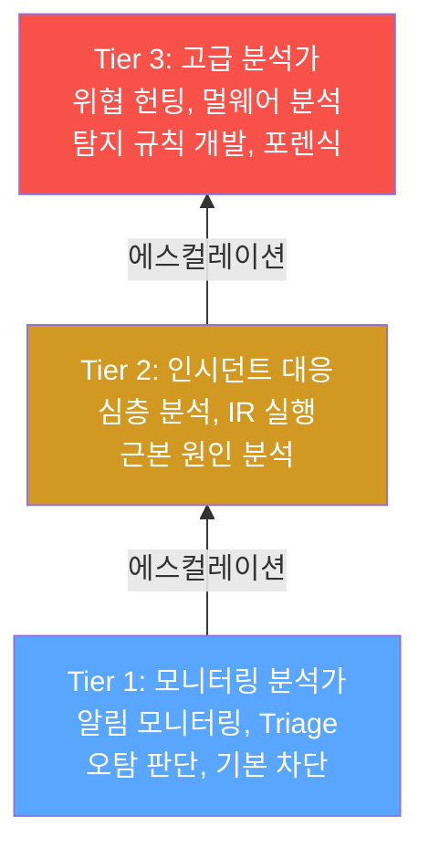
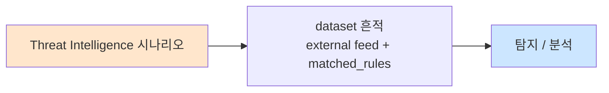

# Week 12: 블루팀 운영 — SOC 구축, SIEM, SOAR 자동화, IR 플레이북

## 학습 목표
- SOC(Security Operations Center)의 Tier 1/2/3 구조와 운영 프로세스를 이해한다
- Wazuh SIEM을 활용하여 실시간 보안 모니터링과 알림 규칙을 구성할 수 있다
- SOAR(Security Orchestration, Automation and Response) 자동화 플레이북을 설계할 수 있다
- 인시던트 대응(IR) 절차의 6단계를 실행하고 문서화할 수 있다
- Bastion를 SOAR 엔진으로 활용하여 보안 대응을 자동화할 수 있다
- 공격 탐지-분석-대응의 전체 사이클을 실습 환경에서 수행할 수 있다

## 전제 조건
- Week 11 레드팀 운영 이수 완료
- MITRE ATT&CK 프레임워크 이해
- Wazuh 기본 개념 (에이전트, 매니저, 규칙)
- 네트워크 보안 기본 (방화벽, IDS/IPS, 로그 분석)
- Bastion execute-plan, dispatch API 사용 경험

## 실습 환경 (공통)

| 호스트 | IP | 역할 | 접속 |
|--------|-----|------|------|
| bastion | 10.20.30.201 | Control Plane / SOAR 엔진 | `ssh ccc@10.20.30.201` (pw: 1) |
| secu | 10.20.30.1 | 방화벽/IPS (nftables, Suricata) | `ssh ccc@10.20.30.1` |
| web | 10.20.30.80 | 웹 서버 (JuiceShop, Apache) | `ssh ccc@10.20.30.80` |
| siem | 10.20.30.100 | SIEM (Wazuh 4.11.2) | `ssh ccc@10.20.30.100` |

**Bastion API:** `http://localhost:9100` / Key: `ccc-api-key-2026`
**Wazuh API:** `https://10.20.30.100:55000` (admin/admin)

## 강의 시간 배분 (3시간)

| 시간 | 내용 | 유형 |
|------|------|------|
| 0:00-0:40 | Part 1: SOC 아키텍처와 운영 프로세스 | 강의 |
| 0:40-1:20 | Part 2: Wazuh SIEM 심화 — 규칙, 디코더, 알림 | 강의/실습 |
| 1:20-1:30 | 휴식 | - |
| 1:30-2:10 | Part 3: SOAR 자동화와 Bastion 연동 | 실습 |
| 2:10-2:50 | Part 4: 인시던트 대응(IR) 실전 시뮬레이션 | 실습 |
| 2:50-3:00 | 휴식 | - |
| 3:00-3:20 | IR 보고서 작성 + 교훈 토론 | 토론 |
| 3:20-3:40 | 검증 퀴즈 + 과제 안내 | 퀴즈 |

---

## 용어 해설

| 용어 | 영문 | 설명 | 비유 |
|------|------|------|------|
| **SOC** | Security Operations Center | 보안 운영 센터 — 24/7 모니터링 | 비행기 관제탑 |
| **SIEM** | Security Information and Event Management | 보안 이벤트 수집/분석/상관 분석 | 범죄 수사 데이터베이스 |
| **SOAR** | Security Orchestration, Automation and Response | 보안 자동화 오케스트레이션 | 자동화된 응급 대응 시스템 |
| **IR** | Incident Response | 보안 인시던트 대응 절차 | 화재 대응 절차 |
| **Playbook** | 대응 절차서 | 특정 인시던트에 대한 단계별 대응 절차 | 응급 처치 매뉴얼 |
| **IOC** | Indicator of Compromise | 침해 지표 (악성 IP, 해시, 도메인) | 범죄 증거물 |
| **Triage** | 분류/우선순위 결정 | 알림의 심각도와 긴급도 분류 | 응급실 환자 분류 |
| **False Positive** | 오탐 | 정상 활동을 공격으로 잘못 탐지 | 화재 오경보 |
| **MTTD** | Mean Time to Detect | 평균 탐지 시간 | 화재 발견 시간 |
| **MTTR** | Mean Time to Respond | 평균 대응 시간 | 화재 진압 시간 |
| **Sigma** | Sigma 규칙 | SIEM 독립적 탐지 규칙 형식 | 범용 범죄 수배 양식 |
| **Enrichment** | 보강/풍부화 | 알림에 추가 컨텍스트(GeoIP, 위협 인텔) 부가 | 수사 보고서 보충 |

---

# Part 1: SOC 아키텍처와 운영 프로세스 (40분)

## 1.1 SOC의 구조

SOC(Security Operations Center)는 조직의 **보안 이벤트를 24/7 모니터링하고 대응**하는 중앙 조직이다.

### SOC Tier 구조



### Tier별 역할과 도구

| Tier | 역할 | 주요 도구 | 대응 시간 | 인력 비율 |
|------|------|----------|----------|----------|
| **Tier 1** | 모니터링, 초기 분류 | SIEM 대시보드, 티켓 시스템 | 15분 이내 | 60% |
| **Tier 2** | 심층 분석, IR 실행 | SIEM, EDR, 네트워크 포렌식 | 1시간 이내 | 30% |
| **Tier 3** | 위협 헌팅, 규칙 개발 | 멀웨어 분석, OSINT, 커스텀 도구 | 비동기 | 10% |

## 1.2 SOC 운영 프로세스

### 알림 처리 워크플로

```
이벤트 발생 → SIEM 수집 → 상관 분석 → 알림 생성
                                        |
                                        ▼
                                  Tier 1: Triage
                                   +- 오탐 → 닫기
                                   +- 정보성 → 기록
                                   +- 실탐 → Tier 2 에스컬레이션
                                              |
                                              ▼
                                        Tier 2: 분석/대응
                                         +- 억제 (Containment)
                                         +- 근본 원인 분석
                                         +- 복구 + 보고서
```

### 핵심 SOC 메트릭

| 메트릭 | 설명 | 목표 값 | 계산 방법 |
|--------|------|---------|----------|
| **MTTD** | 평균 탐지 시간 | < 1시간 | 공격 시작 → 첫 알림 |
| **MTTR** | 평균 대응 시간 | < 4시간 | 알림 → 억제 완료 |
| **오탐률** | False Positive 비율 | < 20% | 오탐 수 / 전체 알림 수 |
| **에스컬레이션률** | Tier 2로 올라간 비율 | 30-50% | Tier 2 건수 / Tier 1 건수 |
| **알림 커버리지** | ATT&CK 기법 탐지율 | > 60% | 탐지 기법 수 / 전체 기법 수 |

## 1.3 SIEM의 핵심 기능

| 기능 | 설명 | Wazuh 구현 |
|------|------|-----------|
| **로그 수집** | 다양한 소스에서 로그 수집 | Wazuh Agent → Manager |
| **정규화** | 다른 형식의 로그를 통일 | Decoder 규칙 |
| **상관 분석** | 여러 이벤트를 연결하여 패턴 탐지 | Correlation 규칙 |
| **알림 생성** | 탐지 조건 충족 시 알림 | Rules (level 1-16) |
| **대시보드** | 시각적 모니터링 | Wazuh Dashboard (OpenSearch) |
| **보고서** | 정기/임시 보고서 생성 | Wazuh Reports |

## 1.4 Wazuh 아키텍처 심화

### Wazuh 구성 요소

```
+------------------------------------------------+
|              Wazuh SIEM 아키텍처               |
|                                                |
|  Agent ----▶ Manager ----▶ Indexer             |
|  (수집)       (분석)        (저장/검색)        |
|                |                               |
|                ▼                               |
|           Dashboard                            |
|           (시각화)                             |
|                                                |
|  Agent 배포:                                   |
|  - web (10.20.30.80): 웹 서버 로그             |
|  - secu (10.20.30.1): 방화벽/IPS 로그          |
|  - bastion (10.20.30.201): 시스템 로그         |
+------------------------------------------------+
```

### Wazuh 규칙 레벨

| 레벨 | 의미 | 예시 | SOC 대응 |
|------|------|------|---------|
| 0-4 | 시스템/디버그 | 서비스 시작/종료 | 무시 |
| 5-7 | 정보/낮은 위험 | 로그인 성공, 파일 변경 | 기록 |
| 8-10 | 중간 위험 | 인증 실패 5회, 비정상 프로세스 | Tier 1 확인 |
| 11-13 | 높은 위험 | 권한 상승 시도, 웹 공격 탐지 | Tier 2 분석 |
| 14-16 | 치명적 | 루트킷 탐지, 대량 데이터 유출 | 즉시 대응 |

---

# Part 2: Wazuh SIEM 심화 — 규칙, 디코더, 알림 (40분)

## 2.1 Wazuh 규칙 구조

Wazuh 규칙은 **XML 기반**으로, 로그 패턴을 매칭하여 알림을 생성한다.

### 규칙 예시: SQL Injection 탐지

```xml
<!-- /var/ossec/etc/rules/local_rules.xml -->
<group name="web,attack,sqli">
  <rule id="100001" level="12">
    <if_group>web</if_group>
    <url>rest/products/search</url>
    <match>UNION|SELECT|OR 1=1|DROP TABLE|INSERT INTO</match>
    <description>SQL Injection attempt detected on JuiceShop</description>
    <mitre>
      <id>T1190</id>
    </mitre>
    <group>attack,sqli,</group>
  </rule>
</group>
```

### 규칙 작성 요소

| 요소 | 설명 | 예시 |
|------|------|------|
| `id` | 고유 규칙 ID (100000+: 커스텀) | 100001 |
| `level` | 심각도 (0-16) | 12 (높은 위험) |
| `if_group` | 전제 조건 그룹 | web |
| `match` | 패턴 매칭 (정규식 가능) | UNION\|SELECT |
| `url` | URL 패턴 | rest/products/search |
| `description` | 알림 설명 | SQL Injection 탐지 |
| `mitre` | ATT&CK 매핑 | T1190 |

## 2.2 Wazuh 디코더

디코더는 **원시 로그를 구조화된 필드로 파싱**하는 역할을 한다.

### Apache 접근 로그 디코더 예시

```xml
<!-- /var/ossec/etc/decoders/local_decoder.xml -->
<decoder name="apache-access-custom">
  <parent>apache-access</parent>
  <regex>(\S+) \S+ \S+ \[(.+?)\] "(\S+) (\S+) \S+" (\d+) (\d+)</regex>
  <order>srcip,timestamp,method,url,status,size</order>
</decoder>
```

### 주요 디코더 필드

| 필드 | 설명 | 활용 |
|------|------|------|
| `srcip` | 출발지 IP | GeoIP 조회, 차단 |
| `url` | 요청 URL | 공격 패턴 매칭 |
| `status` | HTTP 상태 코드 | 성공/실패 판단 |
| `method` | HTTP 메서드 | 비정상 메서드 탐지 |
| `user` | 사용자 ID | 계정 이상 탐지 |

## 2.3 Sigma 규칙과 호환성

Sigma는 **SIEM 독립적인 탐지 규칙 형식**이다. Wazuh, Splunk, ELK 등 다양한 SIEM으로 변환할 수 있다.

### Sigma 규칙 예시

```yaml
title: SQL Injection via Web Application
id: a1234567-b890-cdef-1234-567890abcdef
status: experimental
description: Detects SQL injection attempts in web server logs
logsource:
    category: webserver
    product: apache
detection:
    selection:
        cs-uri-query|contains:
            - 'UNION SELECT'
            - 'OR 1=1'
            - "' OR '"
            - 'DROP TABLE'
    condition: selection
falsepositives:
    - Legitimate SQL queries in URL parameters
level: high
tags:
    - attack.initial_access
    - attack.t1190
```

### Sigma → Wazuh 변환

| Sigma 필드 | Wazuh 매핑 | 설명 |
|-----------|-----------|------|
| `detection.selection` | `<match>` 또는 `<regex>` | 탐지 패턴 |
| `level: high` | `level="12"` | 심각도 매핑 |
| `logsource.product` | `<if_group>` | 로그 소스 |
| `tags` | `<mitre><id>` | ATT&CK 매핑 |

---

# Part 3: SOAR 자동화와 Bastion 연동 (40분)

## 실습 3.1: Wazuh 알림 확인 및 분석

> **실습 목적**: Wazuh SIEM에서 발생한 보안 알림을 확인하고 분류(Triage)하는 SOC Tier 1 업무를 체험한다.
>
> **배우는 것**: Wazuh 알림 로그의 구조, 알림 심각도 분류 방법, 오탐/실탐 판단 기준을 이해한다.
>
> **결과 해석**: level 10 이상의 알림이 존재하면 실제 공격 가능성이 높다. 동일 IP에서 반복된 알림은 자동화 공격을 의미한다.
>
> **실전 활용**: SOC Tier 1 분석관의 핵심 업무이다. 신속한 Triage 능력이 MTTD를 좌우한다.

```bash
# API 키 설정
export BASTION_API_KEY=ccc-api-key-2026

# 1. Wazuh 최근 알림 확인
curl -s -X POST http://localhost:9100/projects \
  -H "Content-Type: application/json" \
  -H "X-API-Key: $BASTION_API_KEY" \
  -d '{
    "name": "week12-blueteam-soc",
    "request_text": "블루팀 SOC 운영: Wazuh 알림 분석 및 SOAR 자동화",
    "master_mode": "external"
  }' | python3 -m json.tool
# PROJECT_ID 메모
```

```bash
export PROJECT_ID="반환된-프로젝트-ID"

curl -s -X POST http://localhost:9100/projects/$PROJECT_ID/plan \
  -H "X-API-Key: $BASTION_API_KEY" | python3 -m json.tool
curl -s -X POST http://localhost:9100/projects/$PROJECT_ID/execute \
  -H "X-API-Key: $BASTION_API_KEY" | python3 -m json.tool
```

```bash
# Wazuh 알림 수집 및 분석
curl -s -X POST http://localhost:9100/projects/$PROJECT_ID/execute-plan \
  -H "Content-Type: application/json" \
  -H "X-API-Key: $BASTION_API_KEY" \
  -d '{
    "tasks": [
      {
        "order": 1,
        "instruction_prompt": "echo \"=== SOC Tier 1: Wazuh 알림 수집 ===\"; ssh ccc@10.20.30.100 \"tail -50 /var/ossec/logs/alerts/alerts.json 2>/dev/null | python3 -c \\\"import sys,json; [print(json.dumps({\\x27level\\x27:json.loads(l).get(\\x27rule\\x27,{}).get(\\x27level\\x27), \\x27desc\\x27:json.loads(l).get(\\x27rule\\x27,{}).get(\\x27description\\x27,\\x27\\x27)[:60], \\x27src\\x27:json.loads(l).get(\\x27data\\x27,{}).get(\\x27srcip\\x27,\\x27-\\x27)})) for l in sys.stdin if l.strip()]\\\" 2>/dev/null | tail -20 || echo No alerts\"",
        "risk_level": "low",
        "subagent_url": "http://10.20.30.201:8002"
      },
      {
        "order": 2,
        "instruction_prompt": "echo \"=== SOC Tier 1: Suricata IPS 알림 ===\"; ssh ccc@10.20.30.1 \"tail -30 /var/log/suricata/fast.log 2>/dev/null | tail -15 || echo No Suricata alerts\"",
        "risk_level": "low",
        "subagent_url": "http://10.20.30.201:8002"
      },
      {
        "order": 3,
        "instruction_prompt": "echo \"=== SOC Tier 1: 웹 서버 에러 로그 ===\"; ssh ccc@10.20.30.80 \"tail -20 /var/log/apache2/error.log 2>/dev/null | tail -10 || echo No errors\"; echo \"---\"; echo \"=== 접근 로그 이상 패턴 ===\"; ssh ccc@10.20.30.80 \"tail -100 /var/log/apache2/access.log 2>/dev/null | grep -iE \\\"union|select|script|alert|../|etc/passwd\\\" | tail -10 || echo No suspicious patterns\"",
        "risk_level": "low",
        "subagent_url": "http://10.20.30.201:8002"
      }
    ],
    "subagent_url": "http://localhost:8002"
  }' | python3 -m json.tool
```

> **명령어 해설**:
> - task 1: Wazuh alerts.json에서 level, description, srcip를 추출하여 Triage용 요약 생성
> - task 2: Suricata fast.log에서 IPS 탐지 알림을 확인
> - task 3: Apache 에러 로그와 접근 로그에서 공격 시그니처 패턴을 검색
>
> **트러블슈팅**: alerts.json이 비어있으면 Wazuh 에이전트가 비활성 상태이다. `ssh siem "systemctl status wazuh-manager"`로 확인한다.

## 실습 3.2: SOAR 자동화 플레이북 — Bastion 연동

> **실습 목적**: Bastion를 SOAR 엔진으로 활용하여 "SQL Injection 탐지 시 자동 차단" 플레이북을 구현한다.
>
> **배우는 것**: SOAR 플레이북의 구조(트리거→분석→대응→통보), Bastion execute-plan으로 자동화 플레이북을 구현하는 방법, 방화벽 규칙 동적 추가를 이해한다.
>
> **결과 해석**: 플레이북이 성공적으로 실행되면 공격 IP가 방화벽에 차단되고, SIEM에 대응 기록이 남고, 관리자에게 통보된다.
>
> **실전 활용**: SOAR 자동화는 MTTR을 크게 단축한다. 반복적인 대응을 자동화하면 Tier 1 분석관의 피로를 줄이고 고급 분석에 집중할 수 있다.

```bash
# SOAR 플레이북: SQL Injection 탐지 시 자동 대응
curl -s -X POST http://localhost:9100/projects/$PROJECT_ID/execute-plan \
  -H "Content-Type: application/json" \
  -H "X-API-Key: $BASTION_API_KEY" \
  -d '{
    "tasks": [
      {
        "order": 1,
        "instruction_prompt": "echo \"=== SOAR Step 1: 트리거 — SQLi 탐지 확인 ===\"; ssh ccc@10.20.30.80 \"tail -100 /var/log/apache2/access.log 2>/dev/null | grep -iE \\\"union|select.*from|or 1=1\\\" | tail -5 || echo No SQLi detected\"; echo \"탐지 시각: $(date +%Y-%m-%d_%H:%M:%S)\"",
        "risk_level": "low",
        "subagent_url": "http://10.20.30.201:8002"
      },
      {
        "order": 2,
        "instruction_prompt": "echo \"=== SOAR Step 2: 분석 — 공격 IP 추출 ===\"; ssh ccc@10.20.30.80 \"tail -200 /var/log/apache2/access.log 2>/dev/null | grep -iE \\\"union|select.*from|or 1=1\\\" | awk '{print \\$1}' | sort | uniq -c | sort -rn | head -5 || echo No attacking IPs found\"",
        "risk_level": "low",
        "subagent_url": "http://10.20.30.201:8002"
      },
      {
        "order": 3,
        "instruction_prompt": "echo \"=== SOAR Step 3: 대응 — 방화벽 규칙 확인 (dry-run) ===\"; echo \"[DRY-RUN] nft add rule inet filter input ip saddr {공격IP} drop\"; echo \"실제 차단은 수동 확인 후 실행합니다.\"; echo \"---\"; echo \"현재 nftables 규칙:\"; ssh ccc@10.20.30.1 \"nft list ruleset 2>/dev/null | head -20 || echo nftables not available\"",
        "risk_level": "low",
        "subagent_url": "http://10.20.30.201:8002"
      },
      {
        "order": 4,
        "instruction_prompt": "echo \"=== SOAR Step 4: 통보 — 대응 기록 생성 ===\"; echo \"[SOAR 보고서]\"; echo \"시각: $(date +%Y-%m-%d_%H:%M:%S)\"; echo \"유형: SQL Injection 탐지\"; echo \"대상: web (10.20.30.80)\"; echo \"조치: 공격 IP 식별, 방화벽 차단 준비\"; echo \"상태: 분석 완료, 차단 대기\"",
        "risk_level": "low",
        "subagent_url": "http://10.20.30.201:8002"
      }
    ],
    "subagent_url": "http://localhost:8002"
  }' | python3 -m json.tool
```

> **명령어 해설**:
> - Step 1 (트리거): Apache 로그에서 SQLi 패턴을 탐지하여 플레이북을 기동
> - Step 2 (분석): 공격 IP를 추출하고 빈도 분석하여 주요 공격원 식별
> - Step 3 (대응): nftables 방화벽 규칙 추가를 dry-run으로 확인 (안전을 위해 실제 차단은 수동)
> - Step 4 (통보): 구조화된 대응 보고서를 생성하여 evidence에 기록
>
> **트러블슈팅**: Apache 로그에 SQLi 패턴이 없으면 Week 11 실습을 먼저 수행하여 공격 로그를 생성한다. nftables가 없으면 iptables를 대안으로 사용한다.

## 실습 3.3: 커스텀 Wazuh 탐지 규칙 작성

> **실습 목적**: Wazuh에 커스텀 탐지 규칙을 추가하여 특정 공격 패턴(SQLi, 브루트포스)을 실시간 탐지한다.
>
> **배우는 것**: Wazuh 규칙 XML 문법, 규칙 레벨 설정 기준, ATT&CK 매핑 방법, 규칙 테스트 절차를 이해한다.
>
> **결과 해석**: 규칙을 추가한 후 공격을 재실행했을 때 Wazuh 알림이 생성되면 규칙이 올바르게 동작하는 것이다.
>
> **실전 활용**: SOC Tier 3 분석관의 핵심 업무가 탐지 규칙 개발이다. 새로운 공격 기법에 대한 규칙을 신속히 개발하는 능력이 조직의 보안 성숙도를 결정한다.

```bash
# Wazuh 커스텀 규칙 확인 (SIEM 서버)
curl -s -X POST http://localhost:9100/projects/$PROJECT_ID/execute-plan \
  -H "Content-Type: application/json" \
  -H "X-API-Key: $BASTION_API_KEY" \
  -d '{
    "tasks": [
      {
        "order": 1,
        "instruction_prompt": "echo \"=== Wazuh 현재 규칙 확인 ===\"; ssh ccc@10.20.30.100 \"cat /var/ossec/etc/rules/local_rules.xml 2>/dev/null | head -30 || echo No custom rules\"",
        "risk_level": "low",
        "subagent_url": "http://10.20.30.201:8002"
      },
      {
        "order": 2,
        "instruction_prompt": "echo \"=== 규칙 추가 예시 (참고용) ===\"; echo \"아래 규칙을 /var/ossec/etc/rules/local_rules.xml에 추가:\"; echo; echo \"<group name=\\\"web,sqli\\\">\"; echo \"  <rule id=\\\"100001\\\" level=\\\"12\\\">\"; echo \"    <if_group>web</if_group>\"; echo \"    <match>UNION SELECT|OR 1=1|DROP TABLE</match>\"; echo \"    <description>SQL Injection attempt detected</description>\"; echo \"    <mitre><id>T1190</id></mitre>\"; echo \"  </rule>\"; echo \"</group>\"; echo; echo \"규칙 추가 후: systemctl restart wazuh-manager\"",
        "risk_level": "low",
        "subagent_url": "http://10.20.30.201:8002"
      },
      {
        "order": 3,
        "instruction_prompt": "echo \"=== Wazuh 규칙 테스트 ===\"; ssh ccc@10.20.30.100 \"/var/ossec/bin/wazuh-logtest 2>/dev/null <<< '10.20.30.201 - - [01/Apr/2026:10:00:00 +0900] \\\"GET /rest/products/search?q=UNION+SELECT+1,2,3 HTTP/1.1\\\" 200 1234' 2>/dev/null | tail -10 || echo logtest not available\"",
        "risk_level": "low",
        "subagent_url": "http://10.20.30.201:8002"
      }
    ],
    "subagent_url": "http://localhost:8002"
  }' | python3 -m json.tool
```

> **명령어 해설**:
> - task 1: 현재 Wazuh 커스텀 규칙 파일의 내용을 확인한다
> - task 2: SQLi 탐지 커스텀 규칙의 XML 구조를 표시한다 (참고용)
> - task 3: wazuh-logtest로 규칙이 올바르게 매칭되는지 테스트한다
>
> **트러블슈팅**: wazuh-logtest가 없으면 Wazuh 버전을 확인한다 (`/var/ossec/bin/wazuh-control info`). 규칙 문법 오류 시 XML 유효성을 검사한다.

---

# Part 4: 인시던트 대응(IR) 실전 시뮬레이션 (40분)

## 4.1 IR 6단계 프로세스 (NIST SP 800-61)

| 단계 | 활동 | SOC Tier | Bastion 매핑 |
|------|------|---------|-------------|
| **1. 준비 (Preparation)** | IR 계획, 도구 준비, 훈련 | 전체 | 프로젝트 생성, 환경 확인 |
| **2. 식별 (Identification)** | 인시던트 탐지, 분류 | Tier 1 | 알림 수집, Triage |
| **3. 억제 (Containment)** | 피해 확산 방지 | Tier 2 | 방화벽 차단, 격리 |
| **4. 근절 (Eradication)** | 근본 원인 제거 | Tier 2/3 | 멀웨어 제거, 패치 |
| **5. 복구 (Recovery)** | 정상 운영 복귀 | Tier 2 | 서비스 재시작, 검증 |
| **6. 교훈 (Lessons Learned)** | 사후 분석, 개선 | 전체 | completion-report |

## 실습 4.2: IR 시뮬레이션 — SQL Injection 인시던트 대응

> **실습 목적**: 실제 SQL Injection 인시던트를 시뮬레이션하고 IR 6단계를 실행한다.
>
> **배우는 것**: 인시던트 대응의 전체 사이클, 각 단계의 구체적 행동, 의사결정 과정, 문서화 방법을 이해한다.
>
> **결과 해석**: 모든 6단계가 순서대로 완료되고, 각 단계의 결과가 evidence에 기록되면 IR 절차가 올바르게 수행된 것이다.
>
> **실전 활용**: 이 IR 절차는 NIST SP 800-61 표준에 기반하며, 실제 기업 SOC에서 사용하는 것과 동일한 구조이다.

```bash
# IR 시뮬레이션 프로젝트
curl -s -X POST http://localhost:9100/projects \
  -H "Content-Type: application/json" \
  -H "X-API-Key: $BASTION_API_KEY" \
  -d '{
    "name": "week12-ir-simulation",
    "request_text": "IR 시뮬레이션: SQL Injection 인시던트 대응 6단계",
    "master_mode": "external"
  }' | python3 -m json.tool
```

```bash
export PROJECT_ID2="반환된-프로젝트-ID"

curl -s -X POST http://localhost:9100/projects/$PROJECT_ID2/plan \
  -H "X-API-Key: $BASTION_API_KEY" | python3 -m json.tool
curl -s -X POST http://localhost:9100/projects/$PROJECT_ID2/execute \
  -H "X-API-Key: $BASTION_API_KEY" | python3 -m json.tool
```

```bash
# IR 6단계 실행
curl -s -X POST http://localhost:9100/projects/$PROJECT_ID2/execute-plan \
  -H "Content-Type: application/json" \
  -H "X-API-Key: $BASTION_API_KEY" \
  -d '{
    "tasks": [
      {
        "order": 1,
        "instruction_prompt": "echo \"=== IR Step 1: 준비 (Preparation) ===\"; echo \"IR 계획: SQLi 인시던트 대응\"; echo \"도구: Wazuh, Suricata, nftables, Bastion\"; echo \"팀: Tier 1(모니터링), Tier 2(분석/대응)\"; echo \"통신 채널: Bastion Slack #bot-cc\"",
        "risk_level": "low",
        "subagent_url": "http://10.20.30.201:8002"
      },
      {
        "order": 2,
        "instruction_prompt": "echo \"=== IR Step 2: 식별 (Identification) ===\"; echo \"[알림 확인]\"; ssh ccc@10.20.30.80 \"tail -50 /var/log/apache2/access.log 2>/dev/null | grep -iE \\\"union|select|or 1=1|script\\\" | wc -l\" 2>/dev/null; echo \"건의 의심스러운 요청 발견\"; echo \"---\"; echo \"[공격 IP]\"; ssh ccc@10.20.30.80 \"tail -200 /var/log/apache2/access.log 2>/dev/null | grep -iE \\\"union|select|or 1=1\\\" | awk '{print \\$1}' | sort -u\" 2>/dev/null || echo \"IP 추출 실패\"; echo \"---\"; echo \"[판정] 실제 SQL Injection 공격으로 분류\"",
        "risk_level": "low",
        "subagent_url": "http://10.20.30.201:8002"
      },
      {
        "order": 3,
        "instruction_prompt": "echo \"=== IR Step 3: 억제 (Containment) ===\"; echo \"[단기 억제] 공격 IP 차단 (dry-run)\"; echo \"  nft add rule inet filter input ip saddr {공격IP} drop\"; echo \"[장기 억제] WAF 규칙 강화\"; echo \"  JuiceShop search 파라미터에 입력 검증 추가 필요\"; echo \"---\"; echo \"현재 방화벽 상태:\"; ssh ccc@10.20.30.1 \"nft list ruleset 2>/dev/null | grep -c rule || echo 0\"; echo \"개의 규칙 활성\"",
        "risk_level": "low",
        "subagent_url": "http://10.20.30.201:8002"
      },
      {
        "order": 4,
        "instruction_prompt": "echo \"=== IR Step 4: 근절 (Eradication) ===\"; echo \"[근본 원인] JuiceShop search API의 입력 검증 부재\"; echo \"[수정 방안]\"; echo \"  1. Prepared Statement 사용 (SQLi 근본 해결)\"; echo \"  2. WAF에 SQLi 시그니처 규칙 추가\"; echo \"  3. 입력값 화이트리스트 필터링\"; echo \"[데이터 무결성 확인]\"; echo \"  DB 백업과 현재 데이터 비교 필요\"",
        "risk_level": "low",
        "subagent_url": "http://10.20.30.201:8002"
      },
      {
        "order": 5,
        "instruction_prompt": "echo \"=== IR Step 5: 복구 (Recovery) ===\"; echo \"[서비스 상태 확인]\"; curl -s -o /dev/null -w \"JuiceShop: HTTP %{http_code}\" http://10.20.30.80:3000 2>/dev/null; echo; echo \"[정상 기능 검증]\"; curl -s \"http://10.20.30.80:3000/rest/products/search?q=apple\" 2>/dev/null | python3 -c \"import sys,json; d=json.load(sys.stdin); print(f\\\"정상 검색: {len(d.get(\\x27data\\x27,[]))}건\\\")\" 2>/dev/null; echo \"[모니터링 강화] 향후 72시간 집중 모니터링\"",
        "risk_level": "low",
        "subagent_url": "http://10.20.30.201:8002"
      },
      {
        "order": 6,
        "instruction_prompt": "echo \"=== IR Step 6: 교훈 (Lessons Learned) ===\"; echo \"[타임라인]\"; echo \"  탐지: Wazuh 알림 + Apache 로그 분석\"; echo \"  분류: SQL Injection (T1190) 확인\"; echo \"  대응: IP 차단 준비, WAF 강화 권고\"; echo \"[개선 사항]\"; echo \"  1. Wazuh SQLi 전용 규칙 추가\"; echo \"  2. SOAR 자동 차단 플레이북 구현\"; echo \"  3. 개발팀 보안 교육 (Prepared Statement)\"; echo \"[메트릭]\"; echo \"  MTTD: ~15분 (수동 분석)\"; echo \"  MTTR: ~30분 (dry-run 포함)\"",
        "risk_level": "low",
        "subagent_url": "http://10.20.30.201:8002"
      }
    ],
    "subagent_url": "http://localhost:8002"
  }' | python3 -m json.tool
```

> **명령어 해설**:
> - Step 1-6: NIST SP 800-61의 IR 6단계를 순서대로 실행
> - Step 2: 실제 로그에서 공격 증거를 추출하여 인시던트를 식별
> - Step 3: 방화벽 차단을 dry-run으로 확인 (안전)
> - Step 5: 서비스 정상 복구 여부를 HTTP 응답 코드와 정상 검색으로 검증
> - Step 6: MTTD/MTTR 메트릭을 산출하여 성과를 측정
>
> **트러블슈팅**: Apache 로그에 공격 흔적이 없으면 Week 11 실습에서 생성된 것이 만료된 것이다. 간단한 SQLi 테스트를 실행하여 로그를 생성한 후 재시도한다.

```bash
# IR 완료 보고서 생성
curl -s -X POST http://localhost:9100/projects/$PROJECT_ID2/completion-report \
  -H "Content-Type: application/json" \
  -H "X-API-Key: $BASTION_API_KEY" \
  -d '{
    "summary": "SQL Injection 인시던트 대응 시뮬레이션 완료. IR 6단계 전 과정 수행.",
    "outcome": "success",
    "work_details": [
      "Step 1 준비: IR 계획, 도구, 팀 구성 확인",
      "Step 2 식별: Apache 로그에서 SQLi 패턴 탐지, 공격 IP 추출",
      "Step 3 억제: 방화벽 차단 규칙 준비 (dry-run)",
      "Step 4 근절: 근본 원인(입력 검증 부재) 식별, Prepared Statement 권고",
      "Step 5 복구: 서비스 정상 동작 확인, 72시간 모니터링 계획",
      "Step 6 교훈: MTTD ~15분, MTTR ~30분, 개선 사항 3건 도출"
    ]
  }' | python3 -m json.tool
```

> **명령어 해설**: `completion-report`로 IR 시뮬레이션의 최종 보고서를 생성한다. work_details에 각 IR 단계의 핵심 결과를 기록한다.
>
> **트러블슈팅**: "stage transition not allowed" 시 프로젝트 상태를 `GET /projects/{id}`로 확인하고 필요한 단계 전환을 수행한다.

---

## 검증 체크리스트

실습 완료 후 다음 항목을 스스로 확인한다:

- [ ] SOC Tier 1/2/3의 역할과 에스컬레이션 기준을 설명할 수 있는가?
- [ ] SIEM의 핵심 기능 6가지(수집, 정규화, 상관분석, 알림, 대시보드, 보고서)를 설명할 수 있는가?
- [ ] Wazuh 규칙의 XML 구조를 이해하고 커스텀 규칙을 작성할 수 있는가?
- [ ] Sigma 규칙의 구조와 Wazuh 변환 방법을 이해하는가?
- [ ] SOAR 플레이북의 4단계(트리거→분석→대응→통보)를 설계할 수 있는가?
- [ ] NIST IR 6단계를 순서대로 나열하고 각 단계의 활동을 설명할 수 있는가?
- [ ] MTTD와 MTTR의 차이와 측정 방법을 설명할 수 있는가?
- [ ] Bastion를 SOAR 엔진으로 활용하여 자동 대응 플레이북을 구현할 수 있는가?
- [ ] Wazuh 알림 레벨(0-16)의 의미와 SOC 대응 매핑을 이해하는가?
- [ ] IR 시뮬레이션 결과를 completion-report로 문서화할 수 있는가?

---

## 과제

### 과제 1: Wazuh 커스텀 규칙 세트 개발 (필수)
다음 공격 유형 각각에 대한 Wazuh 탐지 규칙을 작성하라:
- SQL Injection (level 12, ATT&CK T1190)
- XSS (level 10, ATT&CK T1059.007)
- 브루트포스 (level 11, ATT&CK T1110)
- 디렉토리 트래버설 (level 10, ATT&CK T1083)
- 각 규칙에 대한 테스트 로그와 예상 알림을 포함하라

### 과제 2: SOAR 플레이북 3종 설계 (필수)
다음 인시던트 유형별 SOAR 플레이북을 설계하라:
- (A) 브루트포스 공격 탐지 시: 계정 잠금 + IP 차단 + 관리자 통보
- (B) 웹 공격 탐지 시: WAF 규칙 강화 + 로그 분석 + 보고서 생성
- (C) 내부 이상 행위 탐지 시: 세션 종료 + 감사 로그 수집 + 에스컬레이션
- 각 플레이북을 Bastion execute-plan 형식으로 구현하라

### 과제 3: SOC 성숙도 평가 (선택)
실습 환경의 SOC 성숙도를 다음 기준으로 평가하라:
- MTTD/MTTR 현재 수준과 목표 수준
- ATT&CK 탐지 커버리지 (14개 전술 중 몇 개를 탐지 가능한가)
- 자동화 수준 (수동 vs SOAR 자동화 비율)
- 개선 로드맵을 3단계로 제시하라

---

## 다음 주 예고

**Week 13: 퍼플팀 — Red+Blue 협업, ATT&CK Gap 분석, 탐지 규칙 개선**
- 퍼플팀의 개념과 Red/Blue 팀 협업 방법론
- ATT&CK 기반 탐지 Gap 분석 수행
- 공격 결과를 바탕으로 탐지 규칙 개선
- 보안 성숙도 측정과 개선 계획 수립

---

## 📂 실습 참조 파일 가이드

> 이번 주 실습에서 **실제로 조작하는** 솔루션의 기능·경로·파일·설정·UI 요점입니다.

### Wazuh SIEM (4.11.x)
> **역할:** 에이전트 기반 로그·FIM·SCA 통합 분석 플랫폼  
> **실행 위치:** `siem (10.20.30.100)`  
> **접속/호출:** Dashboard `https://10.20.30.100` (admin/admin), Manager API `:55000`

**주요 경로·파일**

| 경로 | 역할 |
|------|------|
| `/var/ossec/etc/ossec.conf` | Manager 메인 설정 (원격, 전송, syscheck 등) |
| `/var/ossec/etc/rules/local_rules.xml` | 커스텀 룰 (id ≥ 100000) |
| `/var/ossec/etc/decoders/local_decoder.xml` | 커스텀 디코더 |
| `/var/ossec/logs/alerts/alerts.json` | 실시간 JSON 알림 스트림 |
| `/var/ossec/logs/archives/archives.json` | 전체 이벤트 아카이브 |
| `/var/ossec/logs/ossec.log` | Manager 데몬 로그 |
| `/var/ossec/queue/fim/db/fim.db` | FIM 기준선 SQLite DB |

**핵심 설정·키**

- `<rule id='100100' level='10'>` — 커스텀 룰 — level 10↑은 고위험
- `<syscheck><directories>...` — FIM 감시 경로
- `<active-response>` — 자동 대응 (firewall-drop, restart)

**로그·확인 명령**

- `jq 'select(.rule.level>=10)' alerts.json` — 고위험 알림만
- `grep ERROR ossec.log` — Manager 오류 (룰 문법 오류 등)

**UI / CLI 요점**

- Dashboard → Security events — KQL 필터 `rule.level >= 10`
- Dashboard → Integrity monitoring — 변경된 파일 해시 비교
- `/var/ossec/bin/wazuh-logtest` — 룰 매칭 단계별 확인 (Phase 1→3)
- `/var/ossec/bin/wazuh-analysisd -t` — 룰·설정 문법 검증

> **해석 팁.** Phase 3에서 원하는 `rule.id`가 떠야 커스텀 룰 정상. `local_rules.xml` 수정 후 `systemctl restart wazuh-manager`, 문법 오류가 있으면 **분석 데몬 전체가 기동 실패**하므로 `-t`로 먼저 검증.

### CCC Bastion Agent
> **역할:** CCC 자율 운영 에이전트 — 스킬/플레이북/경험 학습  
> **실행 위치:** `bastion (10.20.30.201)`  
> **접속/호출:** TUI `./dev.sh bastion`, API `http://10.20.30.200:8003` (Bastion /ask·/chat)

**주요 경로·파일**

| 경로 | 역할 |
|------|------|
| `packages/bastion/agent.py` | 메인 에이전트 루프 |
| `packages/bastion/skills.py` | 스킬 정의 |
| `packages/bastion/playbooks/` | 정적 플레이북 YAML |
| `data/bastion/experience/` | 수집된 경험 (pass/fail) |

**핵심 설정·키**

- `LLM_BASE_URL / LLM_MODEL` — Ollama 연결
- `CCC_API_KEY` — ccc-api 인증
- `max_retry=2` — 실패 시 self-correction 재시도

**로그·확인 명령**

- ``docs/test-status.md`` — 현재 테스트 진척 요약
- ``bastion_test_progress.json`` — 스텝별 pass/fail 원시

**UI / CLI 요점**

- 대화형 TUI 프롬프트 — 자연어 지시 → 계획 → 실행 → 검증
- `/a2a/mission` (API) — 자율 미션 실행
- Experience→Playbook 승격 — 반복 성공 패턴 저장

> **해석 팁.** 실패 시 output을 분석해 **근본 원인 교정**이 설계의 핵심. 증상 회피/땜빵은 금지.

---

## 실제 사례 (WitFoo Precinct 6 — Threat Intelligence)

> 출처: WitFoo Precinct 6 Cybersecurity Dataset (Apache 2.0)
> 본 lecture *Threat Intelligence* 학습 항목 매칭.

### Threat Intelligence 의 dataset 흔적 — "external feed + matched_rules"

dataset 의 정상 운영에서 *external feed + matched_rules* 신호의 baseline 을 알아두면, *Threat Intelligence* 시도 시 발생하는 anomaly 를 정량으로 탐지할 수 있다. 핵심 정량 지표는 — AlienVault OTX / abuse.ch 매칭.



### Case 1: dataset 정량 지표

| 항목 | 값 |
|---|---|
| 핵심 신호 | external feed + matched_rules |
| 정량 baseline | AlienVault OTX / abuse.ch 매칭 |
| 학습 매핑 | TI 의 dataset 적용 |

**자세한 해석**: TI 의 dataset 적용. 이 차이를 정량으로 측정해야 *공격 시도와 정상 운영의 구분* 이 가능. 학생이 baseline 숫자를 외워두면 — 운영 환경에서 anomaly 를 즉시 탐지할 수 있다.

### Case 2: 실전 적용 시나리오

| 단계 | dataset 활용 |
|---|---|
| 시도 식별 | external feed + matched_rules 의 spike |
| 정상 vs 이상 | baseline 대비 비율 |
| 룰 작성 | Suricata / Wazuh / Sigma |
| 검증 | dataset 재실행 |

**자세한 해석**: 운영 환경 룰 작성은 — *baseline 측정 → 임계 결정 → 룰 작성 → dataset 검증* 의 4 단계. 한 단계라도 빠지면 false positive 폭증.

### 이 사례에서 학생이 배워야 할 3가지

1. **Threat Intelligence = external feed + matched_rules 의 anomaly** — 정량 신호로 탐지.
2. **baseline 숫자 외우기** — AlienVault OTX / abuse.ch 매칭.
3. **4 단계 룰 작성** — 측정 → 임계 → 룰 → 검증.

**학생 액션**: OTX feed 1개 import → match 측정.


---

## 부록: 학습 OSS 도구 매트릭스 (Course12 — Week 12 공급망 공격)

### lab step → 도구 매핑

| step | 학습 항목 | OSS 도구 |
|------|----------|---------|
| s1 | SBOM 생성 + 비교 | syft / cyclonedx-cli |
| s2 | 의존성 CVE | grype / Trivy / pip-audit |
| s3 | 모델 검증 | modelscan / picklescan / safetensors |
| s4 | 코드 서명 | sigstore + cosign |
| s5 | YARA 룰 | yara / yara-x |
| s6 | Typosquatting | guarddog / oss-fuzz / 자체 |
| s7 | Dependency confusion | 자체 detection |
| s8 | Admission control | OPA Gatekeeper (cosign verify) |

### 학생 환경 준비

```bash
# === sigstore + cosign ===
sudo curl -L https://github.com/sigstore/cosign/releases/latest/download/cosign-linux-amd64 -o /usr/local/bin/cosign
sudo chmod +x /usr/local/bin/cosign

# === syft + grype ===
curl -sSfL https://raw.githubusercontent.com/anchore/syft/main/install.sh | sudo sh -s -- -b /usr/local/bin
curl -sSfL https://raw.githubusercontent.com/anchore/grype/main/install.sh | sudo sh -s -- -b /usr/local/bin

# === Trivy ===
sudo apt install -y trivy

# === modelscan + picklescan ===
pip install modelscan picklescan safetensors

# === YARA ===
sudo apt install -y yara
git clone https://github.com/Yara-Rules/rules ~/yara-rules

# === guarddog (Datadog OSS — typosquatting/malicious package) ===
pip install guarddog

# === Python 의존성 점검 ===
pip install pip-audit safety bandit semgrep
```

### 핵심 — 공급망 공격 6 통제

#### 1. cosign (코드/모델/이미지 서명 — 가장 강력)

```bash
# === Key 생성 ===
cosign generate-key-pair                                  # cosign.key + cosign.pub

# === Container image 서명 ===
docker push registry.example.com/agent:v1.2.3
cosign sign --key cosign.key registry.example.com/agent:v1.2.3

# === Model 파일 서명 ===
cosign sign-blob --key cosign.key model.bin > model.bin.sig
cosign verify-blob --key cosign.pub --signature model.bin.sig model.bin

# === Keyless (OIDC, GitHub Actions) ===
# Signature 가 Sigstore Rekor 의 transparency log 에 자동 기록
cosign sign --identity-token=$ID_TOKEN registry.example.com/agent:v1.2.3

# === Verification (배포 전 강제) ===
cosign verify --key cosign.pub registry.example.com/agent:v1.2.3
# → 서명 안 되어 있으면 fail
```

#### 2. SBOM (syft + cyclonedx-cli)

```bash
# === Container image SBOM ===
syft my-agent:latest -o spdx-json > sbom-image.json
syft my-agent:latest -o cyclonedx-json > sbom-cdx.json
syft my-agent:latest -o table                              # human-readable

# === Filesystem SBOM ===
syft dir:/opt/agent -o spdx-json > sbom-fs.json

# === Python project SBOM ===
syft scan dir:. -o spdx-json
# 모든 Python deps + version + license 자동

# === SBOM diff (전 버전 vs 현재) ===
syft my-agent:v1 -o spdx-json > sbom-v1.json
syft my-agent:v2 -o spdx-json > sbom-v2.json
diff <(jq '.packages[] | "\(.name)@\(.versionInfo)"' sbom-v1.json | sort) \
     <(jq '.packages[] | "\(.name)@\(.versionInfo)"' sbom-v2.json | sort)

# === SBOM → CVE (grype) ===
grype sbom:./sbom.json --severity-threshold high
```

#### 3. 의존성 CVE (grype + Trivy + pip-audit)

```bash
# === grype (가장 정확) ===
grype my-agent:latest --severity-threshold high \
    --output json > /tmp/grype-result.json

# Fix 가능한 CVE 만
grype my-agent:latest --only-fixed

# CI 통합 (CRITICAL 발견 시 fail)
grype my-agent:latest --fail-on critical

# === Trivy (대안) ===
trivy image --severity HIGH,CRITICAL my-agent:latest

# === pip-audit (Python 전용 — PyPA 공식) ===
pip-audit -r requirements.txt
pip-audit -r requirements.txt --fix --dry-run             # 자동 fix 제안

# === safety (PyUp.io) ===
safety check -r requirements.txt --json > /tmp/safety.json

# === bandit (코드 정적 분석) ===
bandit -r src/
```

#### 4. ModelScan (악성 pickle/model 탐지)

```bash
# === Pickle scan ===
modelscan -p model.pkl
modelscan -p model.pt
modelscan -p model.h5

# 출력 예 (악성):
# CRITICAL: Suspicious operator detected: os.system call in pickle
# HIGH: Unsafe pickle.loads call
# MEDIUM: Globals access detected

# === URL (Hugging Face 직접) ===
modelscan -url https://huggingface.co/user/model/resolve/main/pytorch_model.bin

# === 디렉토리 일괄 ===
modelscan -p /opt/models/

# === JSON 출력 (CI 통합) ===
modelscan -p /opt/models/ --format json > /tmp/modelscan.json

# === picklescan (대안) ===
picklescan -p model.pkl
```

#### 5. Safetensors (안전한 형식 — pickle 대체)

```python
from safetensors.torch import save_file, load_file
import torch

# Save (pickle 대신)
weights = model.state_dict()
save_file(weights, "model.safetensors")

# Load (코드 실행 불가능 — 안전)
weights = load_file("model.safetensors")

# 비교:
# torch.save (pickle) → 임의 코드 실행 가능 (보안 위험)
# safetensors → 단순 binary 형식 (안전)
```

#### 6. YARA (악성 시그니처)

```bash
# === 룰 작성 ===
cat > /tmp/malware.yar << 'YEOF'
rule sliver_implant
{
    meta:
        description = "Detects Sliver C2 implant"
    strings:
        $a = "sliver-server" wide ascii
        $b = "BeaconJitter" wide ascii
        $c = { 53 6c 69 76 65 72 }                       // "Sliver"
    condition:
        any of them
}

rule mimikatz_signature
{
    strings:
        $s1 = "sekurlsa::logonpasswords"
        $s2 = "kerberos::list"
        $s3 = "lsadump::sam"
    condition:
        any of them
}

rule typosquat_python_package
{
    meta:
        description = "Suspicious Python package (typosquatting requests, urllib3, etc)"
    strings:
        $s1 = "subprocess.Popen"
        $s2 = "urllib.request.urlopen"
        $s3 = "/etc/passwd"
        $s4 = "AWS_ACCESS_KEY"
    condition:
        $s1 and ($s2 or $s3 or $s4)
}
YEOF

# === Scan ===
yara /tmp/malware.yar /tmp/sample.exe
yara -r /tmp/malware.yar /tmp/                            # 재귀

# === yara-x (Rust, 빠름) ===
~/yara-x/target/release/yr scan /tmp/malware.yar /tmp/

# === 카탈로그 ===
yara -r ~/yara-rules/index.yar /tmp/sample
```

#### 7. Typosquatting / Dependency Confusion 탐지

```bash
# === guarddog (Datadog) — 악성 PyPI/npm 패키지 ===
pip install guarddog

# Specific package
guarddog pypi scan requests
guarddog npm scan lodash

# 자체 패키지 점검
guarddog pypi scan-local /path/to/setup.py

# === 자체 typosquat detection ===
python3 << 'PEOF'
# 흔한 패키지 + 1 char 변경 (typosquat 후보)
TARGETS = ["requests", "urllib3", "numpy", "pandas", "tensorflow"]
import requests as req

for target in TARGETS:
    # PyPI 의 모든 패키지 목록
    all_pkgs = req.get("https://pypi.org/simple/").text  # 매우 큼
    # ... typosquat candidates 비교 (Levenshtein distance) ...
PEOF

# === Dependency confusion (private + public 같은 이름) ===
# 1) Internal package list
INTERNAL=$(pip list --format=json | jq -r '.[].name')

# 2) PyPI public 에서 같은 이름 확인
for p in $INTERNAL; do
    if curl -s "https://pypi.org/pypi/$p/json" | jq -e .info > /dev/null 2>&1; then
        echo "⚠ Internal package '$p' also on public PyPI — confusion risk"
    fi
done

# Private registry 사용 강제
echo "[global]" > ~/.pip/pip.conf
echo "index-url = https://internal-pypi.example.com/simple/" >> ~/.pip/pip.conf
```

#### 8. CI/CD 통합 (전체 supply chain pipeline)

```yaml
# .gitlab-ci.yml
stages: [scan, build, sign, deploy]

# === Phase 1: Pre-build ===
secret_scan:
  stage: scan
  script:
    - gitleaks detect --no-git --source . --report-path gitleaks.json

dep_check:
  stage: scan
  script:
    - pip-audit -r requirements.txt
    - safety check -r requirements.txt
    - bandit -r src/
    - guarddog pypi scan-local setup.py

model_scan:
  stage: scan
  script:
    - modelscan -p ./models/
    - picklescan -p ./models/*.pkl

# === Phase 2: Build ===
build:
  stage: build
  script:
    - docker build -t $CI_REGISTRY/$IMAGE:$CI_COMMIT_SHA .

# === Phase 3: Sign + SBOM + CVE ===
container_scan:
  stage: sign
  script:
    - trivy image --severity HIGH,CRITICAL --exit-code 1 $CI_REGISTRY/$IMAGE:$CI_COMMIT_SHA

sbom:
  stage: sign
  script:
    - syft $CI_REGISTRY/$IMAGE:$CI_COMMIT_SHA -o spdx-json > sbom.json
    - grype $CI_REGISTRY/$IMAGE:$CI_COMMIT_SHA --severity-threshold high
  artifacts:
    paths: [sbom.json]

cosign_sign:
  stage: sign
  script:
    - cosign sign --key $COSIGN_KEY $CI_REGISTRY/$IMAGE:$CI_COMMIT_SHA
  
# === Phase 4: Deploy (admission control) ===
deploy:
  stage: deploy
  script:
    - cosign verify --key $COSIGN_PUB $CI_REGISTRY/$IMAGE:$CI_COMMIT_SHA
    - kubectl apply -f deploy.yaml
```

#### 9. Kubernetes Admission (cosign verify 강제)

```yaml
# OPA Gatekeeper 정책
apiVersion: templates.gatekeeper.sh/v1
kind: ConstraintTemplate
metadata: {name: requirecosignverification}
spec:
  crd:
    spec:
      names: {kind: RequireCosignVerification}
  targets:
    - target: admission.k8s.gatekeeper.sh
      rego: |
        package requirecosignverification
        violation[{"msg": msg}] {
          input.review.object.kind == "Pod"
          image := input.review.object.spec.containers[_].image
          not has_cosign_signature(image)
          msg := sprintf("Image %v missing cosign signature", [image])
        }
        
        has_cosign_signature(image) {
          response := http.send({
            "method": "GET",
            "url": sprintf("https://cosign-verifier/verify?image=%v", [image])
          })
          response.body.verified == true
        }
---
apiVersion: constraints.gatekeeper.sh/v1beta1
kind: RequireCosignVerification
metadata: {name: production-image-must-be-signed}
spec:
  match:
    namespaces: [production]
    kinds: [{apiGroups: [""], kinds: ["Pod"]}]
```

학생은 본 12주차에서 **sigstore + cosign + syft + grype + Trivy + modelscan + safetensors + YARA + guarddog + pip-audit + safety + bandit** 12 도구로 공급망 공격의 8 위협 (악성 pickle / 백도어 / 변조 / CVE / secret / 데이터 / typosquat / dependency confusion) 통합 방어 + CI/CD 통합 sigchain 을 익힌다.
