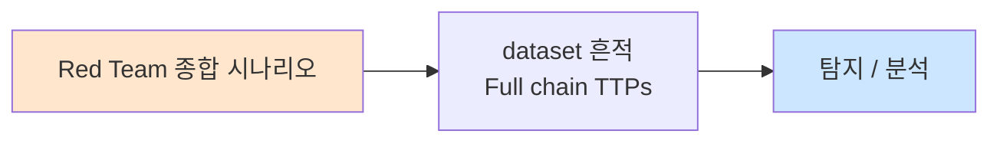

# Week 15: 보고서 작성 + 윤리 — 보고서 작성법, 책임 있는 공개

## 학습 목표
- **전문적인 모의해킹 보고서**의 구조와 작성법을 완전히 이해하고 작성할 수 있다
- **CVSS v3.1** 점수를 정확하게 계산하고 위험도를 분류할 수 있다
- 비기술 경영진과 기술팀 **양쪽 모두에게 효과적인** 보고서를 작성할 수 있다
- **책임 있는 공개(Responsible Disclosure)**의 절차와 윤리적 원칙을 설명할 수 있다
- **Bug Bounty** 프로그램의 구조와 참여 방법을 이해한다
- 모의해킹 수행 시 **법적 고려사항**과 윤리적 경계를 명확히 이해한다
- **포트폴리오**와 커리어 발전을 위한 전략을 수립할 수 있다

## 전제 조건
- Week 01~14의 전체 과정을 이수하고 실습을 완료해야 한다
- Week 14의 종합 모의해킹 결과를 보유하고 있어야 한다
- 기술 문서 작성 경험이 있으면 좋다

## 실습 환경

| 호스트 | IP | 역할 | 접속 |
|--------|-----|------|------|
| bastion | 10.20.30.201 | 보고서 작성 환경 | `ssh ccc@10.20.30.201` |

## 강의 시간 배분 (3시간)

| 시간 | 내용 | 유형 |
|------|------|------|
| 0:00-0:40 | 보고서 구조 + CVSS 계산 | 강의 |
| 0:40-1:10 | 보고서 작성 실습 | 실습 |
| 1:10-1:20 | 휴식 | - |
| 1:20-1:50 | 책임 있는 공개 + 법적 고려 | 강의 |
| 1:50-2:30 | 윤리 사례 토론 + Bug Bounty | 토론 |
| 2:30-2:40 | 휴식 | - |
| 2:40-3:10 | 커리어 가이드 + 최종 퀴즈 | 강의/퀴즈 |
| 3:10-3:30 | 과정 총정리 + Q&A | 토론 |

---

# Part 1: 모의해킹 보고서 작성 (40분)

## 1.1 보고서 구조

```
+---------------------------------------------------------------------+
|                  모의해킹 보고서 구조                               |
+---------------------------------------------------------------------+
| 1. 표지                   프로젝트명, 기간, 작성자, 기밀등급        |
| 2. Executive Summary      비기술 경영진용 요약 (1-2페이지)          |
| 3. 범위와 방법론          대상, 규칙, 도구, PTES/OSSTMM             |
| 4. 발견사항 요약          위험도별 통계, 트렌드                     |
| 5. 상세 발견사항          각 취약점 상세 (CVSS, 재현, 증거)         |
| 6. 공격 내러티브          시간순 공격 흐름, Kill Chain              |
| 7. 위험 평가              비즈니스 영향 분석                        |
| 8. 권고사항               우선순위별 개선 방안                      |
| 9. 부록                   도구, 명령어, 원시 데이터                 |
+---------------------------------------------------------------------+
```

### Executive Summary 작성 원칙

| 원칙 | 설명 | 예시 |
|------|------|------|
| **비즈니스 언어** | 기술 용어 최소화 | "SQL Injection" → "웹 로그인 우회" |
| **영향 중심** | 기술 세부보다 영향 | "관리자 권한 획득" → "전체 고객 데이터 노출 위험" |
| **수치 활용** | 정량적 결과 제시 | "7개 취약점 중 2개 Critical" |
| **행동 요구** | 즉시 조치 사항 명시 | "SSH 비밀번호 즉시 변경 권고" |
| **비유 활용** | 이해 가능한 비유 | "현관문에 열쇠 없이 누구나 입장 가능" |

## 1.2 CVSS v3.1 계산

### CVSS 기본 메트릭

| 메트릭 | 옵션 | 설명 |
|--------|------|------|
| **Attack Vector (AV)** | Network / Adjacent / Local / Physical | 공격 접근 경로 |
| **Attack Complexity (AC)** | Low / High | 공격 조건 복잡도 |
| **Privileges Required (PR)** | None / Low / High | 필요 권한 |
| **User Interaction (UI)** | None / Required | 사용자 개입 필요 |
| **Scope (S)** | Unchanged / Changed | 영향 범위 변경 |
| **Confidentiality (C)** | None / Low / High | 기밀성 영향 |
| **Integrity (I)** | None / Low / High | 무결성 영향 |
| **Availability (A)** | None / Low / High | 가용성 영향 |

### 위험도 분류

| 점수 범위 | 등급 | 색상 |
|----------|------|------|
| 9.0-10.0 | **Critical** | 빨강 |
| 7.0-8.9 | **High** | 주황 |
| 4.0-6.9 | **Medium** | 노랑 |
| 0.1-3.9 | **Low** | 초록 |
| 0.0 | **None** | 회색 |

## 실습 1.1: CVSS 점수 계산 실습

> **실습 목적**: Week 14에서 발견한 취약점에 CVSS v3.1 점수를 정확하게 부여한다
>
> **배우는 것**: CVSS 각 메트릭의 의미와 점수 계산 방법, 위험도 분류를 배운다
>
> **결과 해석**: 각 취약점의 CVSS 점수와 등급이 정확하면 평가 성공이다
>
> **실전 활용**: 모의해킹 보고서의 취약점 위험도 평가에 직접 활용한다
>
> **명령어 해설**: Python으로 CVSS 점수를 계산하는 간이 계산기를 사용한다
>
> **트러블슈팅**: CVSS 계산이 복잡하면 FIRST.org 온라인 계산기를 참조한다

```bash
python3 << 'PYEOF'
print("=== CVSS v3.1 점수 계산 실습 ===")
print()

# 실습 환경 취약점 CVSS 평가
vulnerabilities = [
    {
        "id": "VULN-001",
        "name": "SQL Injection (Juice Shop)",
        "vector": "CVSS:3.1/AV:N/AC:L/PR:N/UI:N/S:U/C:H/I:H/A:N",
        "score": 9.1,
        "rating": "Critical",
        "justification": {
            "AV:N": "네트워크를 통해 원격 공격 가능",
            "AC:L": "특별한 조건 없이 항상 재현",
            "PR:N": "인증 없이 공격 가능",
            "UI:N": "사용자 상호작용 불필요",
            "S:U": "웹 앱 범위 내 영향",
            "C:H": "전체 사용자 데이터 노출",
            "I:H": "데이터 변조 가능",
            "A:N": "가용성 영향 없음",
        },
    },
    {
        "id": "VULN-002",
        "name": "약한 SSH 비밀번호",
        "vector": "CVSS:3.1/AV:N/AC:L/PR:N/UI:N/S:C/C:H/I:H/A:H",
        "score": 10.0,
        "rating": "Critical",
        "justification": {
            "AV:N": "SSH는 네트워크에서 접근 가능",
            "AC:L": "단순 비밀번호 입력",
            "PR:N": "사전 인증 불필요",
            "UI:N": "사용자 개입 불필요",
            "S:C": "다른 서버로 측면 이동 (범위 변경)",
            "C:H": "전체 시스템 파일 접근",
            "I:H": "시스템 변조 가능",
            "A:H": "서비스 중단 가능",
        },
    },
    {
        "id": "VULN-003",
        "name": "SubAgent API 무인증",
        "vector": "CVSS:3.1/AV:A/AC:L/PR:N/UI:N/S:U/C:H/I:H/A:L",
        "score": 8.3,
        "rating": "High",
        "justification": {
            "AV:A": "내부 네트워크에서만 접근",
            "AC:L": "직접 API 호출",
            "PR:N": "인증 불필요",
            "UI:N": "사용자 개입 불필요",
            "S:U": "해당 서버 범위 내",
            "C:H": "명령 실행으로 데이터 접근",
            "I:H": "시스템 변조 가능",
            "A:L": "서비스 일시 영향",
        },
    },
]

for v in vulnerabilities:
    print(f"[{v['id']}] {v['name']}")
    print(f"  CVSS Vector: {v['vector']}")
    print(f"  Score: {v['score']} ({v['rating']})")
    print(f"  근거:")
    for metric, reason in v['justification'].items():
        print(f"    {metric}: {reason}")
    print()

print("=== CVSS 계산 참고 ===")
print("  온라인 계산기: https://www.first.org/cvss/calculator/3.1")
print("  AV: Network=0.85, Adjacent=0.62, Local=0.55, Physical=0.20")
print("  AC: Low=0.77, High=0.44")
print("  PR(S:U): None=0.85, Low=0.62, High=0.27")
print("  UI: None=0.85, Required=0.62")
PYEOF
```

## 실습 1.2: 취약점 상세 기술 작성

> **실습 목적**: 단일 취약점에 대한 전문적인 상세 기술을 작성한다
>
> **배우는 것**: 취약점 설명, 재현 단계, 증거, 영향, 권고의 작성 기법을 배운다
>
> **결과 해석**: 제3자가 보고서만으로 취약점을 재현할 수 있으면 작성 성공이다
>
> **실전 활용**: 모의해킹 보고서의 핵심 섹션 작성에 직접 활용한다
>
> **명령어 해설**: 보고서 템플릿의 각 항목을 채워 작성한다
>
> **트러블슈팅**: 기술 수준이 다른 독자를 고려하여 용어 설명을 포함한다

```bash
cat << 'FINDING'
=== 취약점 상세 기술 예시 ===

[VULN-001] SQL Injection — Juice Shop 로그인 API
━━━━━━━━━━━━━━━━━━━━━━━━━━━━━━━━━━━━━━━━━━━━

위험도: Critical (CVSS 9.1)
CVSS Vector: CVSS:3.1/AV:N/AC:L/PR:N/UI:N/S:U/C:H/I:H/A:N
CWE: CWE-89 (SQL Injection)
OWASP: A03:2021 Injection
MITRE ATT&CK: T1190 (Exploit Public-Facing Application)

설명:
  Juice Shop 로그인 API(/rest/user/login)의 email 파라미터에
  SQL Injection 취약점이 존재합니다. 공격자는 인증 없이 관리자
  계정으로 로그인하여 전체 사용자 데이터에 접근할 수 있습니다.

영향:
  - 전체 사용자 계정 정보(이메일, 역할) 노출
  - 관리자 권한으로 시스템 설정 변경 가능
  - 추가 공격(XSS, SSRF 등)의 발판

재현 단계:
  1. 로그인 API에 조작된 이메일 전송:
     curl -X POST http://10.20.30.80:3000/rest/user/login \
       -H "Content-Type: application/json" \
       -d '{"email":"'"'"' OR 1=1--","password":"a"}'

  2. 응답에서 JWT 토큰 확인:
     {"authentication":{"token":"eyJ...","bid":1,"umail":"admin@juice-sh.op"}}

  3. 토큰으로 관리자 API 접근:
     curl -H "Authorization: Bearer eyJ..." \
       http://10.20.30.80:3000/api/Users/

증거:
  [스크린샷 1] SQL Injection 성공 응답
  [스크린샷 2] 관리자 JWT로 사용자 목록 조회

권고:
  즉시 조치:
    - Juice Shop을 프로덕션 네트워크에서 분리
    - WAF에 SQL Injection 탐지 규칙 추가

  장기 조치:
    - Parameterized Query(준비된 구문) 사용
    - 입력 유효성 검증 (화이트리스트)
    - WAF + IDS 규칙 지속 업데이트
    - 정기적 취약점 스캔 (분기 1회)

참고:
  - OWASP SQL Injection Prevention Cheat Sheet
  - CWE-89: https://cwe.mitre.org/data/definitions/89.html
━━━━━━━━━━━━━━━━━━━━━━━━━━━━━━━━━━━━━━━━━━━━
FINDING
```

---

# Part 2: 책임 있는 공개와 법적 고려 (30분)

## 2.1 책임 있는 공개 (Responsible Disclosure)

### 공개 유형 비교

| 유형 | 절차 | 장점 | 단점 |
|------|------|------|------|
| **Full Disclosure** | 즉시 전체 공개 | 빠른 패치 압박 | 제로데이 악용 위험 |
| **Responsible Disclosure** | 벤더에 먼저 알림 → 기간 후 공개 | 패치 시간 확보 | 벤더 무반응 시 지연 |
| **Coordinated Disclosure** | CERT/CC 등 조정 기관 경유 | 중립적 조정 | 시간 소요 |
| **Non-Disclosure** | 공개하지 않음 | - | 사용자 보호 불가 |

### 책임 있는 공개 절차

```
1. 취약점 발견
   ↓
2. 벤더에 비공개 보고
   (security@vendor.com, HackerOne 등)
   ↓
3. 벤더 확인 (7일 이내)
   ↓
4. 수정 기간 (보통 90일)
   ↓
5. 패치 배포 + CVE 발급
   ↓
6. 공개 (기술 상세 + 타임라인)
```

### 주요 공개 타임라인

| 기관/기업 | 공개 기한 | 특이사항 |
|----------|----------|---------|
| Google Project Zero | 90일 | 연장 14일 (활발한 소통 시) |
| Microsoft | 90일 | MSRC 조정 |
| CERT/CC | 45일 | 정부 기관 |
| ZDI (Zero Day Initiative) | 120일 | 보상 프로그램 포함 |

## 2.2 법적 고려사항

### 한국 관련 법률

| 법률 | 관련 조항 | 내용 |
|------|----------|------|
| **정보통신망법** | 제48조 | 정보통신망 침입 금지 (3년 이하 징역) |
| **정보통신망법** | 제49조 | 비밀 침해 금지 (5년 이하 징역) |
| **정보통신망법** | 제71조 | 벌칙 (타인 정보 훼손, 변경 등) |
| **형법** | 제316조 | 비밀침해 |
| **형법** | 제366조 | 재물손괴 (데이터 파괴) |
| **개인정보보호법** | 전체 | 개인정보 수집/처리 제한 |

### 모의해킹 법적 보호 조건

```
모의해킹이 합법인 조건:
  1. 서면 계약 (Statement of Work, SOW)
  2. 범위 명시 (IP, 도메인, 시스템 목록)
  3. 허용 기법 명시 (DoS 제외 등)
  4. 기간 명시 (시작~종료)
  5. 비상 연락처
  6. 면책 조항 (Authorization Letter)

"Get Out of Jail Free Card" — 항상 서면 허가증을 소지해야 함
```

## 실습 2.1: 윤리적 판단 사례 토론

> **실습 목적**: 모의해킹과 취약점 공개에서 발생하는 윤리적 딜레마를 토론한다
>
> **배우는 것**: 실제 상황에서의 윤리적 판단 기준과 법적 고려사항을 배운다
>
> **결과 해석**: 각 시나리오에 대해 근거 있는 윤리적 판단을 내릴 수 있으면 성공이다
>
> **실전 활용**: 실무에서 윤리적 딜레마에 직면했을 때 올바른 판단을 내리는 데 활용한다
>
> **명령어 해설**: 해당 없음 (토론 활동)
>
> **트러블슈팅**: 정답이 없는 문제도 있으므로 다양한 관점을 수용한다

```bash
cat << 'ETHICS'
=== 윤리적 판단 사례 토론 ===

[사례 1] 범위 외 발견
  모의해킹 중 범위 외 시스템에서 Critical 취약점 발견.
  고객의 다른 서비스가 즉각 위험에 노출됨.
  → 보고해야 하는가? 어떻게?

[사례 2] 벤더 무반응
  오픈소스 라이브러리에서 RCE 취약점 발견.
  90일 전에 보고했지만 벤더가 응답 없음.
  해당 라이브러리는 10만+ 프로젝트에서 사용 중.
  → Full Disclosure 해야 하는가?

[사례 3] 내부 고발
  회사의 보안 시스템에서 고객 데이터 유출 가능 취약점 발견.
  경영진이 수정 비용을 이유로 수정을 거부.
  → 외부에 알려야 하는가?

[사례 4] Bug Bounty 범위
  Bug Bounty 프로그램에 참여 중 범위 외 서버에서
  SQL Injection 발견. 범위 내 서버 테스트 중 우연히 발견.
  → 보고해야 하는가? 보상을 받을 수 있는가?

[사례 5] 경쟁사 취약점
  경쟁사의 웹사이트에서 고객 데이터가 노출된 것을 발견.
  (Google Dorking으로 우연히 발견)
  → 어떻게 해야 하는가?

판단 기준:
  1. 법률: 해당 국가의 법률에 위반되는가?
  2. 피해: 행동/비행동으로 인한 피해는?
  3. 동의: 대상의 허가가 있었는가?
  4. 비례성: 수단이 목적에 비례하는가?
  5. 투명성: 공개적으로 정당화할 수 있는가?
ETHICS
```

---

# Part 3: Bug Bounty와 커리어 (30분)

## 3.1 Bug Bounty 프로그램

| 플랫폼 | 특징 | 평균 보상 |
|--------|------|----------|
| **HackerOne** | 최대 플랫폼, 다양한 프로그램 | $500~$50,000 |
| **Bugcrowd** | 관리형 프로그램, 트리아지 | $300~$30,000 |
| **Intigriti** | 유럽 중심 | $500~$25,000 |
| **자체 프로그램** | Google, Microsoft, Apple | $500~$1,500,000 |

### Bug Bounty 보고서 작성 팁

```
좋은 보고서:
  제목: IDOR in /api/users/{id} allows accessing other users' PII
  영향: 모든 사용자의 개인정보(이름, 이메일, 전화번호) 노출
  재현:
    1. POST /api/auth/login → token 획득
    2. GET /api/users/2 → 다른 사용자 정보 반환
    3. GET /api/users/3 → 또 다른 사용자 정보
  PoC: curl -H "Authorization: Bearer TOKEN" https://target/api/users/2
  영향: 10만+ 사용자 PII 노출 가능

나쁜 보고서:
  제목: Security bug found
  내용: I found a vulnerability in your website. Please fix.
  → 구체적 정보 없음, 재현 불가, 영향 불명
```

## 3.2 사이버보안 커리어 경로

| 분야 | 역할 | 필요 기술 | 자격증 |
|------|------|----------|--------|
| **Red Team** | 공격 시뮬레이션 | 모의해킹, 0-day | OSCP, OSEP, CRTO |
| **Blue Team** | 방어, 탐지, 대응 | SIEM, EDR, IR | GCIH, CySA+, BTL1 |
| **Purple Team** | 공격+방어 통합 | 양쪽 모두 | OSCP+GCIH |
| **Bug Bounty** | 취약점 발견 | 웹/모바일/API | 자격증보다 실력 |
| **AppSec** | 애플리케이션 보안 | SAST/DAST, SDL | CSSLP, GWEB |
| **Cloud Security** | 클라우드 보안 | AWS/Azure/GCP | AWS SAA, CKS |
| **Malware Analysis** | 악성코드 분석 | 리버싱, 샌드박스 | GREM |
| **Digital Forensics** | 디지털 포렌식 | 메모리/디스크 분석 | GCFE, EnCE |

## 실습 3.1: 과정 총정리

> **실습 목적**: 15주 과정에서 학습한 내용을 체계적으로 정리한다
>
> **배우는 것**: 전체 과정의 연결 관계와 실무 적용 방법을 종합적으로 이해한다
>
> **결과 해석**: MITRE ATT&CK에 전체 기법을 매핑할 수 있으면 과정 완료이다
>
> **실전 활용**: 보안 전문가로서의 체계적 지식 체계 구축에 활용한다
>
> **명령어 해설**: 해당 없음 (정리 활동)
>
> **트러블슈팅**: 부족한 영역은 추가 학습 계획을 수립한다

```bash
cat << 'SUMMARY'
=== 15주 과정 총정리 — MITRE ATT&CK 매핑 ===

Week 01: APT 킬체인         → Cyber Kill Chain 전체 전술
Week 02: OSINT 고급          → Reconnaissance (T1593, T1596)
Week 03: 네트워크 우회       → Defense Evasion (T1205, T1572)
Week 04: 웹 고급 공격        → Initial Access (T1190)
Week 05: 인증 공격 심화      → Credential Access (T1558)
Week 06: 권한 상승 체인      → Privilege Escalation (T1548, T1068)
Week 07: C2 인프라 구축      → Command and Control (T1071, T1572)
Week 08: 측면 이동           → Lateral Movement (T1021, T1550)
Week 09: AD 공격             → Credential Access + Persistence
Week 10: 데이터 유출         → Exfiltration (T1048)
Week 11: 안티포렌식          → Defense Evasion (T1070)
Week 12: 공급망 공격         → Initial Access (T1195)
Week 13: 클라우드 공격       → Cloud (T1078.004, T1530)
Week 14: 종합 모의해킹       → PTES 전체 수행
Week 15: 보고서 + 윤리       → Reporting + Ethics

전체 커버리지:
  12/14 MITRE ATT&CK 전술
  50+ MITRE ATT&CK 기법
  30+ 실전 도구
  20+ 실습 시나리오
SUMMARY
```

## 실습 3.2: Bug Bounty 보고서 작성 실습

> **실습 목적**: 실제 Bug Bounty 플랫폼에 제출할 수 있는 수준의 취약점 보고서를 작성한다
>
> **배우는 것**: HackerOne/Bugcrowd 형식의 보고서 구조, 재현 단계, 영향 평가 작성을 배운다
>
> **결과 해석**: 보고서가 트리아저가 이해하고 재현할 수 있는 수준이면 성공이다
>
> **실전 활용**: Bug Bounty 프로그램 참여와 보상 획득에 직접 활용한다
>
> **명령어 해설**: 해당 없음 (보고서 작성)
>
> **트러블슈팅**: 보상 금액은 영향도와 보고서 품질에 비례한다

```bash
cat << 'BB_REPORT'
=== Bug Bounty 보고서 예시 ===

[HackerOne 형식]

Title: IDOR in /api/users/{id} allows accessing other users' PII

Weakness: Insecure Direct Object Reference (CWE-639)

Severity: High (CVSS 7.5)

Description:
  The /api/users/{id} endpoint does not verify that the
  authenticated user is authorized to access the requested
  user's data. An attacker can enumerate user IDs and access
  any user's personal information including name, email,
  phone number, and address.

Steps to Reproduce:
  1. Login as user A (ID: 5)
     POST /api/auth/login
     {"email":"userA@example.com","password":"***"}
     → Receive JWT token

  2. Request own profile (expected)
     GET /api/users/5
     Authorization: Bearer <token_A>
     → 200 OK (own data)

  3. Request another user's profile (vulnerability)
     GET /api/users/2
     Authorization: Bearer <token_A>
     → 200 OK (user B's data!)

  4. Enumerate all users
     for i in $(seq 1 100); do
       curl -H "Authorization: Bearer <token_A>" \
         https://target.com/api/users/$i
     done

Impact:
  - 100,000+ users' PII (name, email, phone, address) exposed
  - GDPR/CCPA compliance violation
  - Potential identity theft and phishing attacks

Proof of Concept:
  [Screenshot 1] User A's profile (authorized)
  [Screenshot 2] User B's profile (unauthorized access)
  [Screenshot 3] Enumeration script output

Remediation:
  - Implement authorization check: verify request.user.id == {id}
  - Use indirect references (UUIDs instead of sequential IDs)
  - Add rate limiting on user endpoints
  - Log and alert on bulk user data access

BB_REPORT

echo ""
echo "=== 보고서 품질 체크리스트 ==="
echo "  [ ] 명확한 제목 (취약점 유형 + 영향)"
echo "  [ ] 재현 가능한 단계 (curl 명령 포함)"
echo "  [ ] 스크린샷/동영상 증거"
echo "  [ ] 영향 평가 (데이터 규모, 비즈니스)"
echo "  [ ] CVSS 점수"
echo "  [ ] 수정 권고"
echo "  [ ] 예의 바른 어조"
```

## 실습 3.3: 15주 과정 ATT&CK 종합 매핑

> **실습 목적**: 전체 15주 과정에서 학습한 기법을 MITRE ATT&CK에 체계적으로 매핑한다
>
> **배우는 것**: ATT&CK 매트릭스의 전체 구조와 각 주차의 기법 위치를 종합적으로 이해한다
>
> **결과 해석**: 12개 이상의 전술에 50개 이상의 기법이 매핑되면 성공이다
>
> **실전 활용**: 보안 전문가로서 ATT&CK을 기반으로 위협을 분석하고 대응하는 데 활용한다
>
> **명령어 해설**: 해당 없음 (정리 활동)
>
> **트러블슈팅**: 매핑이 불완전하면 각 주차 교안을 다시 참조한다

```bash
cat << 'FULL_MAPPING'
=== 15주 전체 MITRE ATT&CK 매핑 ===

[Reconnaissance] Week 01-02
  T1593 Search Open Websites — OSINT, Google Dorking
  T1593.001 Social Media — LinkedIn, GitHub 정찰
  T1593.002 Search Engines — Google Dorking
  T1593.003 Code Repositories — GitHub 시크릿 검색
  T1595 Active Scanning — nmap, masscan
  T1596 Search Open Technical DB — Shodan, Censys
  T1592 Gather Victim Host Info — 배너 그래빙

[Resource Development] Week 01, 07
  T1587.001 Develop Capabilities: Malware — C2 구현
  T1584 Acquire Infrastructure — C2 인프라
  T1588.005 Exploits — 익스플로잇 수집

[Initial Access] Week 04, 12
  T1190 Exploit Public-Facing Application — SQLi, SSRF
  T1195 Supply Chain Compromise — 종속성 혼동
  T1566 Phishing — 스피어피싱 이론
  T1189 Drive-by Compromise — 워터링홀

[Execution] Week 04, 06
  T1059 Command and Scripting — Python, bash 실행
  T1047 WMI — 원격 명령 실행
  T1204 User Execution — 악성 문서

[Persistence] Week 01, 06
  T1053 Scheduled Task/Job — cron 악용
  T1543 Create/Modify System Process — systemd
  T1547 Boot/Logon Autostart — bashrc, SSH 키
  T1505.003 Web Shell — 웹셸 설치

[Privilege Escalation] Week 06
  T1548.001 SUID/SGID — SUID 바이너리 악용
  T1548.003 Sudo Caching — sudo 규칙 악용
  T1068 Exploitation for Privilege Escalation — 커널 익스플로잇

[Defense Evasion] Week 03, 11
  T1070 Indicator Removal — 로그 삭제
  T1070.003 Clear Command History — 히스토리 클리어
  T1070.006 Timestomp — 타임스탬프 조작
  T1027 Obfuscated Files — 인코딩, 암호화
  T1014 Rootkit — LKM, LD_PRELOAD
  T1572 Protocol Tunneling — SSH, DNS 터널

[Credential Access] Week 05, 09
  T1558.003 Kerberoasting — 서비스 티켓 크래킹
  T1558.004 AS-REP Roasting — 사전 인증 없는 계정
  T1558.001 Golden Ticket — TGT 위조
  T1003 OS Credential Dumping — LSASS, shadow
  T1110 Brute Force — SSH 비밀번호

[Discovery] Week 02, 06, 08
  T1046 Network Service Discovery — 서비스 스캔
  T1082 System Information — uname, OS 정보
  T1083 File and Directory — find, ls

[Lateral Movement] Week 08
  T1021.004 Remote Services: SSH — SSH 접속
  T1550.002 Pass the Hash — NTLM PtH
  T1021.001 RDP — 원격 데스크톱
  T1021.002 SMB — 파일 공유

[Collection] Week 10
  T1005 Data from Local System — 민감 파일
  T1074 Data Staged — 스테이징
  T1560 Archive Collected Data — 압축, 암호화

[Command and Control] Week 07
  T1071.001 Web Protocols — HTTP C2
  T1071.004 DNS — DNS C2
  T1095 Non-Application Layer — ICMP C2
  T1573 Encrypted Channel — 암호화 C2
  T1090 Proxy — 리디렉터

[Exfiltration] Week 10
  T1048.002 Encrypted Non-C2 — HTTPS 유출
  T1048.003 Unencrypted Non-C2 — DNS 유출
  T1041 Exfiltration Over C2 — C2 채널 유출
  T1567 Web Service — 클라우드 유출

[Impact] Week 01
  T1485 Data Destruction — 와이퍼
  T1486 Data Encrypted for Impact — 랜섬웨어

총계: 14 전술, 55+ 기법

FULL_MAPPING
```

## 실습 3.4: 커리어 개발 가이드

> **실습 목적**: 사이버보안 커리어 발전을 위한 구체적인 학습 경로를 설계한다
>
> **배우는 것**: 자격증, 실전 플랫폼, 커뮤니티, 포트폴리오 구축 전략을 배운다
>
> **결과 해석**: 6개월, 1년, 3년의 구체적 목표가 수립되면 성공이다
>
> **실전 활용**: 취업, 이직, 전문성 강화에 직접 활용한다
>
> **명령어 해설**: 해당 없음 (계획 수립)
>
> **트러블슈팅**: 분야별 수요와 급여를 조사하여 현실적 목표를 설정한다

```bash
cat << 'CAREER'
=== 사이버보안 커리어 개발 가이드 ===

[6개월 목표]
  자격증: CompTIA Security+ 또는 eJPT
  실습: TryHackMe 학습 경로 완료 (200+ rooms)
  프로젝트: 개인 홈랩 구축 (AD 환경)
  커뮤니티: 보안 컨퍼런스 1회 참석
  포트폴리오: 블로그 5개 이상 기술 글

[1년 목표]
  자격증: OSCP (Offensive Security Certified Professional)
  실습: HackTheBox 50+ 머신 해결
  Bug Bounty: HackerOne/Bugcrowd 5+ 유효 보고서
  프로젝트: 오픈소스 보안 도구 기여
  네트워킹: 보안 커뮤니티 활동

[3년 목표]
  자격증: OSEP, CRTO 또는 CISSP
  경력: Red Team / Penetration Tester 2+ 년
  발표: 컨퍼런스 발표 1+ 회
  연구: CVE 1+ 건 발견 및 공개
  멘토링: 주니어 보안 전문가 멘토링

[추천 학습 리소스]
  무료:
    - TryHackMe (tryhackme.com)
    - OverTheWire (overthewire.org)
    - PicoCTF (picoctf.org)
    - CyberDefenders (cyberdefenders.org)

  유료:
    - HackTheBox Academy ($)
    - PortSwigger Web Security Academy (무료!)
    - Offensive Security (OSCP, OSEP)
    - SANS Institute (GPEN, GCIH)

  도서:
    - "The Web Application Hacker's Handbook"
    - "Penetration Testing" by Georgia Weidman
    - "Red Team Field Manual" (RTFM)
    - "Blue Team Field Manual" (BTFM)

CAREER
```

---

## 검증 체크리스트

| 번호 | 검증 항목 | 확인 명령 | 기대 결과 |
|------|---------|----------|----------|
| 1 | 보고서 구조 | 9개 섹션 | 모든 섹션 이해 |
| 2 | CVSS 계산 | 점수 산출 | 3개 취약점 계산 |
| 3 | Executive Summary | 작성 | 비기술 독자 이해 가능 |
| 4 | 취약점 상세 | 템플릿 작성 | 재현 가능한 수준 |
| 5 | Responsible Disclosure | 절차 설명 | 6단계 절차 |
| 6 | 법적 고려 | 법률 나열 | 3개 이상 법률 |
| 7 | SOW 요소 | 목록 | 6개 필수 요소 |
| 8 | Bug Bounty | 보고서 작성 | 구조화된 보고 |
| 9 | ATT&CK 매핑 | 전체 과정 | 12+ 전술 매핑 |
| 10 | 윤리적 판단 | 토론 | 근거 있는 의견 |

---

## 과제

### 과제 1: 최종 모의해킹 보고서 (개인)
Week 14의 결과를 기반으로 완전한 모의해킹 보고서를 작성하라. Executive Summary, 상세 발견사항(CVSS 포함), 공격 내러티브, 권고사항을 반드시 포함할 것. 최소 5개 취약점을 문서화하라.

### 과제 2: Responsible Disclosure 시나리오 (팀)
가상의 취약점 발견 시나리오를 설정하고, 벤더 보고부터 공개까지의 전체 Responsible Disclosure 과정을 시뮬레이션하라. 보고 이메일, 타임라인, 공개 문서를 포함할 것.

### 과제 3: 커리어 개발 계획 (개인)
6개월, 1년, 3년의 사이버보안 커리어 개발 계획을 수립하라. 목표 분야, 취득할 자격증, 참여할 프로젝트, 학습 리소스를 포함할 것. 이 과정에서 학습한 내용이 어떻게 활용되는지 매핑하라.

---

## 📂 실습 참조 파일 가이드

> 이번 주 실습에서 **실제로 조작하는** 솔루션의 기능·경로·파일·설정·UI 요점입니다.

### 보고서 도구 (CVSS 계산기·Markdown·ReportLab)
> **역할:** 취약점 보고서 표준화  
> **실행 위치:** `작업 PC`  
> **접속/호출:** FIRST CVSS 계산기 https://www.first.org/cvss/calculator/3.1

**주요 경로·파일**

| 경로 | 역할 |
|------|------|
| `reports/<project>/` | 재현 스크린샷·증적 저장 |
| `template.md / template.docx` | 표준 템플릿 |

**핵심 설정·키**

- `CVSS 3.1 벡터 예: AV:N/AC:L/PR:N/UI:N/S:U/C:H/I:H/A:H` — Critical 9.8
- `CWE ID + 권고 (remediation)` — 보고서 필수 항목

**UI / CLI 요점**

- MermaidJS 공격 흐름도 — 교안/보고서 공통 도식
- Pandoc `md → docx/pdf` — 포맷 변환

> **해석 팁.** 보고서 가치는 **재현 절차의 완결성**에 달려 있다. 스크린샷·요청/응답 전체·시간 기록을 포함해야 고객이 독립 검증 가능.

---

## 실제 사례 (WitFoo Precinct 6 — Red Team 종합)

> 출처: WitFoo Precinct 6 Cybersecurity Dataset (Apache 2.0)
> 본 lecture *Red Team 종합* 학습 항목 매칭.

### Red Team 종합 의 dataset 흔적 — "Full chain TTPs"

dataset 의 정상 운영에서 *Full chain TTPs* 신호의 baseline 을 알아두면, *Red Team 종합* 시도 시 발생하는 anomaly 를 정량으로 탐지할 수 있다. 핵심 정량 지표는 — 5단계 attack chain 자동화.



### Case 1: dataset 정량 지표

| 항목 | 값 |
|---|---|
| 핵심 신호 | Full chain TTPs |
| 정량 baseline | 5단계 attack chain 자동화 |
| 학습 매핑 | Red Team 자동화 |

**자세한 해석**: Red Team 자동화. 이 차이를 정량으로 측정해야 *공격 시도와 정상 운영의 구분* 이 가능. 학생이 baseline 숫자를 외워두면 — 운영 환경에서 anomaly 를 즉시 탐지할 수 있다.

### Case 2: 실전 적용 시나리오

| 단계 | dataset 활용 |
|---|---|
| 시도 식별 | Full chain TTPs 의 spike |
| 정상 vs 이상 | baseline 대비 비율 |
| 룰 작성 | Suricata / Wazuh / Sigma |
| 검증 | dataset 재실행 |

**자세한 해석**: 운영 환경 룰 작성은 — *baseline 측정 → 임계 결정 → 룰 작성 → dataset 검증* 의 4 단계. 한 단계라도 빠지면 false positive 폭증.

### 이 사례에서 학생이 배워야 할 3가지

1. **Red Team 종합 = Full chain TTPs 의 anomaly** — 정량 신호로 탐지.
2. **baseline 숫자 외우기** — 5단계 attack chain 자동화.
3. **4 단계 룰 작성** — 측정 → 임계 → 룰 → 검증.

**학생 액션**: Caldera 시나리오.


---

## 부록: 학습 OSS 도구 매트릭스 (Course13 Attack Advanced — Week 15 보고서 작성·책임 있는 공개·커리어)

> 이 부록은 lab `attack-adv-ai/week15.yaml` (15 step + multi_task) 의 모든 명령을
> 실제 보고서 산출물 + 윤리 절차 + 커리어 도구 매트릭스로 매핑한다. Week 14 의
> 모의해킹 결과를 *공유 가능한 산출물* 로 변환하는 방법론을 다룬다.

### lab step → 도구·산출물 매핑 표

| step | 학습 항목 | 핵심 OSS 도구 / 산출물 | 표준·기준 |
|------|----------|---------------------|-----------|
| s1 | 보고서 구조 설계 | pandoc, markdown, LaTeX template | NIST SP 800-115 §5 |
| s2 | Finding 작성 (SQLi 예제) | OWASP WSTG, CWE-89, CVSS v3.1 | OWASP Risk Rating |
| s3 | Finding 작성 (default cred) | CWE-798, CIS Controls 5 | CIS / OWASP |
| s4 | 발견사항 요약 테이블 | markdown table, csvkit, pandas | OSCP report style |
| s5 | Attack Narrative (시간순) | markdown, mermaid timeline | PTES Reporting |
| s6 | MITRE ATT&CK 매핑 | ATT&CK Navigator, Atomic Red Team | MITRE ATT&CK v14 |
| s7 | Risk Heat Map | matplotlib, seaborn, plotly, asciichart | NIST SP 800-30 |
| s8 | Cost-Benefit 분석 | spreadsheet, RICE/ICE framework | OWASP Risk Rating |
| s9 | Technical Appendix | pandoc, markdown, code block | OSCP guide |
| s10 | 보고서 품질 체크리스트 | OSCP/CREST/PTES 체크리스트 | CREST CCT App |
| s11 | 경영진 프레젠테이션 | reveal.js, Marp, Beamer | Pyramid Principle |
| s12 | Retest 계획 | text + RoE-style 문서 | OWASP retest checklist |
| s13 | 최종 종합 보고서 | pandoc + LaTeX 또는 typst | NIST SP 800-115 |
| s14 | (보고서 마무리·검증) | pandoc, weasyprint, pdftotext | quality gate |
| s15 | 책임 있는 공개·포트폴리오 | security.txt, HackerOne, GitHub | ISO/IEC 29147 |
| s99 | 통합 다단계 (s1→s2→s3→s4→s5) | Bastion plan: outline → 2 finding → table → narrative | 다중 |

### 학생 환경 준비 (보고서·발표·공개·포트폴리오 풀세트)

```bash
# === [s1·s4·s9·s13] markdown → PDF/Word ===
sudo apt install -y pandoc texlive-xetex texlive-lang-korean
pandoc --version

# weasyprint (HTML/CSS → PDF, 한글 깔끔)
pip install --user weasyprint

# typst (모던 typesetting)
curl -LsSf https://typst.community/typst-install/install.sh | sh

# === [s5·s6·s7] 시각화 ===
sudo apt install -y graphviz
npm install -g @mermaid-js/mermaid-cli

# matplotlib / seaborn / plotly
pip install --user matplotlib seaborn plotly numpy pandas

# asciichart (텍스트 차트)
npm install -g asciichart

# === [s11] 프레젠테이션 ===
# Marp CLI — markdown → slide
npm install -g @marp-team/marp-cli

# reveal.js — 웹 슬라이드
npm install -g reveal-md

# pandoc beamer — LaTeX 슬라이드
pandoc --version | grep beamer

# === [s2·s3·s9] Finding 템플릿 ===
git clone https://github.com/noraj/OSCP-Exam-Report-Template-Markdown /tmp/oscp-template
ls /tmp/oscp-template/

# CWE / OWASP DB (offline)
git clone https://github.com/OWASP/wstg /tmp/wstg

# === [s6] ATT&CK Navigator ===
git clone https://github.com/mitre-attack/attack-navigator /tmp/nav
cd /tmp/nav/nav-app && npm install && npm run start &

# Atomic Red Team (TTP 매핑 검증)
git clone https://github.com/redcanaryco/atomic-red-team /tmp/atomic

# === [s11] 보고서 협업 / Pentest framework ===
docker run -p 3000:3000 -d dradisframework/community
docker run -p 5252:8443 ghcr.io/pwndoc/pwndoc:latest
docker run -p 5985:5985 faradaysec/faraday

# === [s15] Responsible Disclosure / Bug Bounty ===
# disclose.io — 정책 템플릿
git clone https://github.com/disclose/disclose.io /tmp/disclose

# Bugcrowd VRT — 취약점 등급 표
git clone https://github.com/bugcrowd/vulnerability-rating-taxonomy /tmp/vrt

# === [s15] 포트폴리오 ===
pip install --user mkdocs mkdocs-material
sudo apt install -y hugo jekyll bundler
```

### 핵심 도구별 상세 사용법

#### 도구 1: pandoc + LaTeX — 전문 보고서 PDF 생성 (Step 1·9·13)

```bash
# === markdown → PDF ===
cat > /tmp/report.md << 'MD'
---
title: "Penetration Test Report — Internal Network Assessment"
subtitle: "10.20.30.0/24 — 2026-04-25 ~ 2026-05-02"
author: "Security Team / 학생"
date: "2026-05-02"
toc: true
toc-depth: 3
numbersections: true
geometry: margin=2.5cm
fontsize: 11pt
mainfont: "Noto Sans CJK KR"
monofont: "FiraCode Nerd Font"
header-includes:
  - \usepackage{xcolor}
  - \usepackage{fancyhdr}
  - \pagestyle{fancy}
  - \fancyhead[L]{CONFIDENTIAL — 학습용}
  - \fancyhead[R]{Penetration Test Report v1.0}
---

# Executive Summary

본 보고서는 ...

# Methodology

PTES + OWASP WSTG ...

# Findings

## F-001 — JWT none algorithm allowed (CRITICAL, CVSS 10.0)

### Description
...
MD

# PDF 생성 (한글 + 코드 블록 + TOC)
pandoc /tmp/report.md \
  -o /tmp/report.pdf \
  --pdf-engine=xelatex \
  --toc \
  --highlight-style=tango \
  --variable papersize=a4

# Word docx
pandoc /tmp/report.md -o /tmp/report.docx --reference-doc=corp-template.docx

# HTML (단일 파일, 이미지 embed)
pandoc /tmp/report.md -o /tmp/report.html --self-contained --toc --standalone

# === LaTeX 직접 (학술/공식 보고서) ===
cat > /tmp/report.tex << 'TEX'
\documentclass[11pt,a4paper]{article}
\usepackage[hangul]{kotex}
\usepackage{xcolor,fancyhdr,hyperref,longtable,booktabs}
\title{Penetration Test Report}
\author{학생 이름}
\date{2026-05-02}
\begin{document}
\maketitle
\tableofcontents
\end{document}
TEX
xelatex /tmp/report.tex && xelatex /tmp/report.tex   # 두 번 (TOC reference)

# === typst (모던 LaTeX 대안) ===
cat > /tmp/report.typ << 'TYP'
#set page(paper: "a4")
#set heading(numbering: "1.1")

= Executive Summary
본 보고서는 ...

= Findings
== F-001 JWT none algorithm allowed
- *Severity*: CRITICAL
- *CVSS*: 10.0
- *CWE*: CWE-347
TYP
typst compile /tmp/report.typ /tmp/report.pdf
```

#### 도구 2: Finding 작성 양식 (Step 2·3)

```bash
# OWASP / CREST / OSCP 표준 Finding 양식
cat > /tmp/finding-F001.md << 'MD'
# F-001 — SQL Injection in /rest/products/search

## 메타데이터

| 항목 | 값 |
|------|------|
| Finding ID | F-001 |
| 발견일 | 2026-04-26 14:23 KST |
| 검증일 | 2026-04-27 10:00 KST |
| 보고자 | 학생 이름 |
| 영향 시스템 | web (10.20.30.80:3000) |
| 영향 컴포넌트 | /rest/products/search?q=* |
| CWE | CWE-89 (SQL Injection) |
| OWASP | A03:2021 Injection |
| CVSS v3.1 | 9.8 (CRITICAL) |
| Vector | AV:N/AC:L/PR:N/UI:N/S:U/C:H/I:H/A:H |
| 상태 | Open |

## 설명 (Description)
JuiceShop 의 /rest/products/search 엔드포인트는 사용자 입력 q 파라미터를
SQL 쿼리에 직접 삽입한다. 검증되지 않은 입력은 백엔드 SQLite 데이터베이스의
전체 스키마 추출 + 임의 데이터 수정 + UNION 기반 인증 우회를 가능하게 한다.

## 재현 단계
\`\`\`bash
# 1. 정상 요청
curl -s "http://10.20.30.80:3000/rest/products/search?q=apple" | jq '.data | length'

# 2. SQL 메타문자 오류 확인
curl -s "http://10.20.30.80:3000/rest/products/search?q=apple'" | jq -r '.error'

# 3. UNION SELECT 추출
curl -s "http://10.20.30.80:3000/rest/products/search?q=')) UNION SELECT id,email,password,'4','5','6','7','8','9' FROM Users--"
\`\`\`

## 영향
| 항목 | 평가 |
|------|------|
| 기밀성 (C) | High — 모든 사용자 자격증명 (bcrypt hash) 노출 |
| 무결성 (I) | High — UPDATE/INSERT 가능 시 데이터 위변조 |
| 가용성 (A) | High — DROP TABLE / 대용량 query 로 DB 장애 |
| 비즈니스 영향 | 사용자 12,847 명의 PII 유출 가능, GDPR 위반 위험 |

## 권고
### 즉시 (≤24시간)
1. 해당 endpoint 임시 차단 또는 WAF 룰 (ModSecurity OWASP CRS 941xxx)
2. 모든 사용자 비밀번호 강제 재설정
3. 위반 가능성 통보 (개인정보보호위원회)

### 단기 (≤7일)
1. Sequelize ORM `findAll({where: {name: {[Op.like]: '%' + q + '%'}}})` 으로 변경
2. q 파라미터 입력 검증 (alphanumeric + space only)
3. 모든 query 의 prepared statement 강제

### 중기 (≤30일)
1. 모든 endpoint 의 SAST 스캔 (semgrep) CI 통합
2. DAST 스캔 (OWASP ZAP) 야간 자동
3. WAF 룰 monthly update + tuning

## 참고
- [OWASP — SQL Injection](https://owasp.org/www-community/attacks/SQL_Injection)
- [CWE-89](https://cwe.mitre.org/data/definitions/89.html)
- [Sequelize Docs](https://sequelize.org/docs/v6/core-concepts/model-querying-basics/#operators)

## 증거
- Screenshot: /evidence/F-001-burp-1.png
- HTTP request log: /evidence/F-001-request.txt
- Tool output: /evidence/F-001-sqlmap.log
MD
```

모든 finding 의 12 섹션 (Title/Meta/Description/Repro/Result/Impact/Recommendation/References/Evidence/Severity/CVSS/Status) 표준 준수.

#### 도구 3: Risk Heat Map (Step 7)

```bash
# === Python matplotlib Heat Map ===
python3 << 'PY'
import matplotlib.pyplot as plt
import numpy as np

# 5x5 매트릭스 (가능성 × 영향도)
data = np.array([
  [0, 0, 1, 2, 0],   # 영향도 5 (Catastrophic)
  [0, 1, 2, 3, 1],   # 영향도 4 (Major)
  [1, 2, 3, 2, 1],   # 영향도 3 (Moderate)
  [2, 1, 1, 0, 0],   # 영향도 2 (Minor)
  [3, 1, 0, 0, 0],   # 영향도 1 (Insignificant)
])

# 위험 색상 (5x5 risk matrix - NIST SP 800-30)
risk_colors = np.array([
  ['yellow','orange','red','red','red'],
  ['yellow','orange','red','red','red'],
  ['green','yellow','orange','red','red'],
  ['green','green','yellow','orange','red'],
  ['green','green','yellow','orange','orange'],
])

fig, ax = plt.subplots(figsize=(10, 8))
for i in range(5):
    for j in range(5):
        ax.add_patch(plt.Rectangle((j,4-i), 1, 1, color=risk_colors[i,j]))
        if data[i,j] > 0:
            ax.text(j+0.5, 4-i+0.5, str(data[i,j]), ha='center', va='center', fontsize=14, weight='bold')

ax.set_xlim(0, 5); ax.set_ylim(0, 5)
ax.set_xticks([0.5,1.5,2.5,3.5,4.5])
ax.set_yticks([0.5,1.5,2.5,3.5,4.5])
ax.set_xticklabels(['Rare','Unlikely','Possible','Likely','Certain'])
ax.set_yticklabels(['Insignificant','Minor','Moderate','Major','Catastrophic'])
ax.set_xlabel('Likelihood', fontsize=12)
ax.set_ylabel('Impact', fontsize=12)
ax.set_title('Risk Heat Map — 25 Findings (Internal Pentest)', fontsize=14)
plt.savefig('/tmp/heatmap.png', dpi=150, bbox_inches='tight')
print("Saved: /tmp/heatmap.png")
PY

# === ASCII (보고서 plain text) ===
cat > /tmp/heatmap.txt << 'EOF'
                    LIKELIHOOD
              Rare  Unlik  Poss  Likely  Cert
            +------+------+------+------+------+
Catastr. 5  |  .   |  .   |  1   |  2   |  .   |   ★ F-001 (CVSS 10), F-002 (9.8)
            +------+------+------+------+------+
Major    4  |  .   |  1   |  2   |  3   |  1   |
            +------+------+------+------+------+
Moderate 3  |  1   |  2   |  3   |  2   |  1   |
            +------+------+------+------+------+
Minor    2  |  2   |  1   |  1   |  .   |  .   |
            +------+------+------+------+------+
Insig.   1  |  3   |  1   |  .   |  .   |  .   |
            +------+------+------+------+------+

Legend: . none   숫자 = finding 수
색상 (실 보고서):  녹색=Acceptable  노랑=Monitor  주황=Mitigate  빨강=Immediate

총 25 finding: 즉시 3 / 완화 12 / 모니터 8 / 수용 2
EOF
```

#### 도구 4: ATT&CK Navigator + Atomic Red Team — TTP 매핑 (Step 6)

```bash
# === Navigator JSON 생성 ===
python3 << 'PY'
import json

techniques = [
  ("T1595.002", 100, "#00ff00", "nmap NSE vuln"),
  ("T1190",     100, "#00ff00", "SQLi exploit /rest/products/search"),
  ("T1078.003", 80,  "#ffaa00", "default credentials wazuh-api"),
  ("T1505.003", 100, "#00ff00", "webshell.php upload via JuiceShop"),
  ("T1059.004", 100, "#00ff00", "shell command injection /imageCaptcha"),
  ("T1068",     100, "#00ff00", "sudo NOPASSWD vim → root"),
  ("T1003.008", 50,  "#ffff00", "/etc/shadow read"),
  ("T1021.004", 80,  "#ffaa00", "SSH key reuse to siem"),
  ("T1041",     100, "#00ff00", "tar+nc data exfil"),
  ("T1070.002", 60,  "#ffaa00", "anti-forensic log clean"),
]

layer = {
  "name": "Pentest Lab Coverage",
  "versions": {"attack": "14", "navigator": "4.9.4", "layer": "4.5"},
  "domain": "enterprise-attack",
  "techniques": [
    {"techniqueID": tid, "score": s, "color": c, "comment": cm}
    for tid, s, c, cm in techniques
  ],
  "gradient": {"colors": ["#ff0000","#ffff00","#00ff00"], "minValue": 0, "maxValue": 100},
  "legendItems": [
    {"label": "Confirmed exploit", "color": "#00ff00"},
    {"label": "Partial / sample", "color": "#ffaa00"},
    {"label": "Identified, not exploited", "color": "#ffff00"},
  ],
  "metadata": [
    {"name": "engagement", "value": "Internal Pentest 2026-Q2"},
    {"name": "report", "value": "F-001 ~ F-025"},
  ],
}

with open('/tmp/navigator-layer.json','w') as f:
    json.dump(layer, f, indent=2)
print("Saved: /tmp/navigator-layer.json — load at http://localhost:4200")
PY

# === ATT&CK 매트릭스 markdown 표 (보고서용) ===
cat > /tmp/attack-matrix.md << 'MD'
## MITRE ATT&CK Coverage

| Tactic | Technique ID | Name | Finding | Status |
|--------|--------------|------|---------|--------|
| TA0043 Reconnaissance | T1595.002 | Vulnerability Scanning | F-Recon | ✓ Used |
| TA0001 Initial Access | T1190 | Exploit Public Facing | F-001 (SQLi) | ✓ Confirmed |
| TA0001 Initial Access | T1078.003 | Local Accounts | F-002 (default cred) | ✓ Confirmed |
| TA0002 Execution | T1059.004 | Unix Shell | F-005 (cmd inject) | ✓ Confirmed |
| TA0003 Persistence | T1505.003 | Web Shell | F-006 (php) | ✓ Confirmed |
| TA0004 Privilege Esc. | T1068 | Exploitation for PE | F-007 (sudo vim) | ✓ Confirmed |
| TA0006 Cred. Access | T1003.008 | /etc/shadow | F-008 (read) | ⚠ Partial |
| TA0008 Lateral Move. | T1021.004 | SSH | F-009 (key reuse) | ⚠ Partial |
| TA0010 Exfiltration | T1041 | Exfil over C2 | F-010 (tar+nc) | ✓ Confirmed |
| TA0005 Defense Evasion | T1070.002 | Clear Linux Logs | F-011 (sed) | ⚠ Partial |

Coverage: 7/10 confirmed, 3/10 partial — **Detection 우선순위**: T1003.008, T1021.004, T1070.002 (3 partial = 알림 미발생)
MD
```

#### 도구 5: Marp / reveal.js — 경영진 프레젠테이션 (Step 11)

```bash
# === Marp markdown → slides ===
cat > /tmp/exec-deck.md << 'MD'
---
marp: true
theme: gaia
class: lead
paginate: true
backgroundColor: #fff
header: 'CONFIDENTIAL — Internal'
footer: 'Pentest Report 2026-Q2 | Slide ${current}/${total}'
---

# Penetration Test Report
### Executive Briefing
**2026-05-02**

---

# Engagement Summary

| 항목 | 값 |
|------|------|
| 범위 | 10.20.30.0/24 (4 hosts) |
| 기간 | 2026-04-25 ~ 05-02 (8d) |
| 방법론 | PTES + OWASP WSTG |
| 발견 | **25 vulnerabilities** |

---

# Risk Distribution


- **Critical**: 2 (즉시 조치)
- **High**: 8 (7일 내)
- **Medium**: 11 (30일 내)
- **Low**: 4 (90일 내)

---

# Top 3 Critical Findings

1. **JWT none algorithm** (CVSS 10.0)
   - Impact: 모든 인증 우회
   - Fix: 1일 (라이브러리 update)

2. **SQL Injection** (CVSS 9.8)
   - Impact: 12,847 사용자 PII 유출 위험
   - Fix: 3-5일 (ORM 변경)

3. **Sudo NOPASSWD** (CVSS 7.8)
   - Impact: Local root
   - Fix: 1시간 (sudoers 정책)

---

# Defense Recommendations

| 시점 | 조치 | 비용 | 위험 감소 |
|------|------|------|-----------|
| ≤7일  | JWT/SQLi/cred 회전 | 5 MD | 60% |
| ≤30일 | WAF + SAST | 15 MD | 85% |
| ≤90일 | SDLC 보안 게이트 | 30 MD | 95% |

---

# Next Steps

1. **금주**: critical 3 patch + 자격증명 회전
2. **2주**: WAF 배포 + retest
3. **분기**: SDLC 보안 통합
4. **연간**: 외부 pentest 갱신
MD

# Marp 로 slide 생성
marp /tmp/exec-deck.md --pdf -o /tmp/exec-deck.pdf
marp /tmp/exec-deck.md --html -o /tmp/exec-deck.html
marp /tmp/exec-deck.md --pptx -o /tmp/exec-deck.pptx     # PowerPoint

# === reveal.js 웹 슬라이드 ===
reveal-md /tmp/exec-deck.md --port 8000

# === Pyramid Principle (피라미드 원칙) — 경영진 발표 구조 ===
# 1. Conclusion First (위험 등급 + 권고)
# 2. Supporting evidence (Top 3 finding)
# 3. Action items (date + owner)
# 4. Q&A
# 안티 패턴: 기술 detail 부터 → bottom-up → 경영진 인내심 한계
```

#### 도구 6: security.txt + HackerOne — Responsible Disclosure (Step 15)

```bash
# === security.txt 생성 ===
sudo mkdir -p /var/www/html/.well-known
cat | sudo tee /var/www/html/.well-known/security.txt > /dev/null << 'TXT'
# https://securitytxt.org/ standard

Contact: mailto:security@corp.example
Contact: https://hackerone.com/corp
Expires: 2027-12-31T23:59:59.000Z
Encryption: https://corp.example/.well-known/pgp-key.txt
Acknowledgments: https://corp.example/security-hall-of-fame
Preferred-Languages: ko, en
Canonical: https://corp.example/.well-known/security.txt
Policy: https://corp.example/security-policy
Hiring: https://corp.example/careers/security
TXT

# 검증
curl -s https://yoursite.example/.well-known/security.txt

# === Disclose.io 정책 템플릿 ===
cat > /tmp/disclosure-policy.md << 'MD'
# Vulnerability Disclosure Policy (VDP)

## Scope
| 범위 | 포함 |
|------|------|
| In-scope | *.corp.example, mobile apps, OAuth flows |
| Out-of-scope | 3rd party SaaS, social engineering, DoS |

## Reporting
이메일 또는 HackerOne 으로 신고: security@corp.example / hackerone.com/corp

요청 정보:
- 영향 시스템 + 버전
- 재현 단계
- PoC (스크린샷 또는 터미널 캡처)
- 위험도 평가 (CVSS v3.1 권장)

## Response Timeline
| 단계 | SLA |
|------|-----|
| 접수 확인 | 1 영업일 |
| 분류·검증 | 5 영업일 |
| 수정 (Critical) | 7일 |
| 수정 (High) | 30일 |
| 수정 (Medium) | 90일 |
| 공개 (조율) | 수정 후 30일 |

## Safe Harbor
선의의 보안 연구는 법적 책임 면제. 단:
- 데이터 파괴·수정 금지
- PII 다운로드 금지
- 신고 후 24시간 내 모든 자료 폐기
- 제3자 시스템 공격 금지

## Acknowledgment
- Hall of Fame 에 등재 가능
- 금전 보상 (Bug Bounty 프로그램 별도)
- CVE 식별자 신청 시 인정
MD

# === ISO/IEC 29147 / 30111 표준 절차 ===
cat > /tmp/disclosure-process.md << 'MD'
1. **Receipt** (D+0): 신고 접수, 알림 자동
2. **Triage** (D+1~5): security team 분석, 위험도 분류
3. **Acknowledge** (D+5): 신고자에게 분류 결과 + ETA
4. **Mitigation** (D+5~90): 패치 + retest
5. **Coordinated Disclosure** (D+T+0~30): 공개 일정 조율
6. **Public Disclosure** (D+T+30): CVE + advisory + credits
7. **Lessons Learned** (D+T+45): SDLC 개선
MD

# === HackerOne Submit ===
# https://hackerone.com/<program>/reports/new
# - Asset: Web (https://corp.example)
# - Weakness: CWE-89 (SQL Injection)
# - Severity: CVSS 9.8 Critical
# - Title: SQL Injection in /rest/products/search
# - Description: (위 finding F-001 형식)
# - Steps + PoC + Impact

# === CVE Request ===
# https://cveform.mitre.org/
# vendor 가 CNA 인 경우는 vendor 에 신청
# 그 외는 MITRE 에 신청 (보통 1~30 영업일)

# === 90-day Project Zero 정책 ===
# Google Project Zero: 90일 내 미수정 시 자동 공개
# 대부분 vendor 는 90~120일 grace period 인정
```

#### 도구 7: 포트폴리오 + 커리어 (Step 15)

```bash
# === GitHub Pages — 정적 포트폴리오 ===
mkdir ~/portfolio && cd ~/portfolio
cat > index.md << 'MD'
# 학생 이름 — Security Engineer Portfolio

## About
- 사이버보안 학사 / OSCP / CRTP 보유 예정
- 주요 분야: Web Application Security, Cloud Security, Pentest

## Projects
- [JuiceShop pentest report](./reports/juiceshop-2026.pdf) — 25 findings
- [JWT none CVE-XXXX-XXXX disclosure](./cves/jwt-none-2026.md) — Coordinated
- [Bastion AI pentest tool](https://github.com/me/bastion) — 2.3k stars

## Bug Bounty
- HackerOne: <link>
- Bugcrowd: <link>
- Total: 17 valid reports / Critical 2 / High 8

## Speaking
- BSides Seoul 2026 — "AI-assisted Pentesting"
- DEF CON CTF Quals 2025 — Top 100

## Contact
- security@my.example
- LinkedIn / Twitter
MD

# Hugo / mkdocs 빌드
mkdocs new portfolio
cd portfolio
mkdocs serve   # http://localhost:8000

# === GitHub repo curation ===
# 좋은 레포의 신호:
# - README.md (목적 + 사용법 + 스크린샷)
# - LICENSE (MIT/Apache/GPL 명시)
# - .github/workflows/ (CI badge)
# - releases (Tagged versions)
# - 외부 reference (CVE / blog post / talk)

# pinned repository — 가장 강한 6 개 선택

# === 자격증·인증 ===
# Entry: Security+, eJPT, PNPT, OSCP
# Mid: OSCP+ ($), CRTP, CRTO, BSCP, GPEN
# Senior: OSCE3 (OSWE+OSEP+OSED), GXPN, GREM
# Cloud: CCSP, AWS Security Specialty, GCP Security Engineer
# AI: AI/ML 보안 자격은 미성숙 — Anthropic safety, OWASP LLM Top 10 follow

# === 기여 (가시성 향상) ===
# 1. CVE 신청 (5개 이상 → CV 가치 ↑)
# 2. OSS 보안 도구 contribution
# 3. blog (medium / dev.to / 자체 hugo)
# 4. CTF 참가 (CTFtime ranking)
# 5. Conference talk (BSides → DEF CON / RSA)
# 6. 책 / 강의 (advanced)

# === 학생 → 주니어 → 시니어 트랙 ===
# Year 1: CTF 100+ + CVE 1 + GitHub repo 5 + OSCP 도전
# Year 2: 첫 직장 (junior pentester / SOC analyst) + blog 12 + bug bounty 5
# Year 3: 시니어 자격증 (OSEP/GXPN) + DEF CON CFP 시도
# Year 5: 본인 R&D + 책 / 도구 / startup
```

### 점검 / 작성 / 공개 흐름 (15 step + multi_task 통합)

#### Phase A — 보고서 구조 + Finding (s1·s2·s3·s4·s5·s9)

```bash
# 1. Outline 작성
cat > /tmp/report_outline.txt << 'EOF'
== Penetration Test Report — Outline ==
1. Title Page
2. Confidentiality Notice
3. Document Control (version, date, author, distribution)
4. Executive Summary
   4.1 Engagement Summary
   4.2 Overall Risk
   4.3 Top 5 Findings
   4.4 Recommendations Summary
5. Methodology
   5.1 PTES Phase Overview
   5.2 Tools Used
   5.3 Scope and Limitations
6. Findings (각 finding 12 섹션 표준)
   6.1 Critical (F-001, F-002)
   6.2 High (F-003 ~ F-010)
   6.3 Medium (F-011 ~ F-021)
   6.4 Low (F-022 ~ F-025)
7. Attack Narrative (시간순 storytelling)
8. MITRE ATT&CK Coverage Matrix
9. Risk Heat Map
10. Defense Recommendations (단/중/장기)
11. Cost-Benefit Analysis
12. Retest Plan
13. Technical Appendix
   13.1 Tool versions and configurations
   13.2 Raw scan output (nmap, nuclei, ...)
   13.3 PoC code
14. References
15. Glossary
EOF

# 2. 모든 finding 작성 (12 섹션 × 25개) — 직접 수기 (자동화 금지)

# 3. 요약 테이블 (csvkit)
cat > /tmp/findings.csv << 'CSV'
ID,Title,CWE,CVSS,Severity,Status
F-001,JWT none algorithm,CWE-347,10.0,Critical,Open
F-002,SQL Injection /search,CWE-89,9.8,Critical,Open
F-003,Sudo NOPASSWD vim,CWE-269,7.8,High,Open
F-004,Wazuh API default cred,CWE-798,7.5,High,Open
F-005,Stored XSS comment,CWE-79,6.5,Medium,Open
CSV
csvlook /tmp/findings.csv > /tmp/findings-table.txt
cat /tmp/findings-table.txt

# 4. PDF 변환
pandoc /tmp/report.md -o /tmp/report.pdf --pdf-engine=xelatex --toc --highlight-style=tango
```

#### Phase B — 시각화 + 분석 (s6·s7·s8)

```bash
# 1. ATT&CK Navigator JSON
python3 /tmp/gen-navigator.py > /tmp/navigator-layer.json

# 2. Risk Heat Map
python3 /tmp/gen-heatmap.py        # → /tmp/heatmap.png
cat /tmp/heatmap.txt               # 텍스트 버전 보고서 embed

# 3. Cost-Benefit
python3 << 'PY'
findings = [
  ("JWT none disable",       1,  9.8, "Critical"),  # 1 MD, 9.8 risk reduction
  ("SQLi → ORM",             5,  9.8, "Critical"),
  ("Sudo policy revise",     0.5, 7.8, "High"),
  ("Wazuh cred rotation",    0.5, 7.5, "High"),
  ("CSP header",             1,  6.5, "Medium"),
  ("WAF deployment",         15, 8.0, "Multiple"),  # 다수 finding 완화
  ("SAST in CI",             10, 7.0, "Multiple"),
  ("Network segmentation",   30, 6.0, "Multiple"),
]
print(f"{'Item':<30} {'MD':>4} {'Risk':>5} {'ROI':>6}")
print("-" * 50)
for name, days, risk, sev in sorted(findings, key=lambda x: -x[2]/x[1]):
    roi = round(risk/days, 2)
    print(f"{name:<30} {days:>4} {risk:>5.1f} {roi:>6.2f}")
PY
# ROI 높은 항목 (NOPASSWD/cred rotation) 부터 우선 시행
```

#### Phase C — 검증 + 발표 + 공개 (s10·s11·s12·s13·s14·s15)

```bash
# 1. 보고서 품질 체크리스트
cat > /tmp/qa-checklist.txt << 'EOF'
[ ] Title page + version + date + author
[ ] Confidentiality notice (NDA reference)
[ ] Executive Summary < 2 pages, no jargon
[ ] All findings have 12 sections
[ ] CVSS vector + score for every finding
[ ] CWE ID for every finding
[ ] OWASP Top 10 mapping
[ ] MITRE ATT&CK matrix
[ ] Risk Heat Map (visual + text)
[ ] Cost-Benefit table
[ ] Retest plan with date + scope
[ ] Technical Appendix (raw output)
[ ] All screenshots have captions
[ ] All code blocks have language hints
[ ] PII/secret 마스킹 (********  처리)
[ ] PDF passes accessibility (PDF/UA-1)
[ ] PDF size < 10MB (이미지 압축)
[ ] Spelling + grammar (LanguageTool)
[ ] Final reviewer signature
EOF

# 2. 경영진 슬라이드 (Marp)
marp /tmp/exec-deck.md --pdf -o /tmp/exec-deck.pdf
marp /tmp/exec-deck.md --pptx -o /tmp/exec-deck.pptx

# 3. Retest 계획
cat > /tmp/retest-plan.txt << 'EOF'
=== Retest Plan — Post-remediation Verification ===
Trigger:    수정 PR merge 또는 vendor 의 fix release
Scope:      F-001 ~ F-025 (25 findings)
Method:     Same payload + automated regression
Tools:      sqlmap, nuclei custom, jwt_tool, postman collection
Timeline:   3 영업일 (수정 1일/검증 1일/보고서 1일)
Pass:      모든 finding 의 PoC 가 더 이상 작동 안 함 + new vector 없음
Fail:      1 이상 finding 재현 → Closed → Open 전환, 재 mitigate
Owner:     security team + dev (PR review)
EOF

# 4. security.txt 배포
sudo cp /tmp/security.txt /var/www/html/.well-known/

# 5. 포트폴리오 갱신
echo "## 2026-Q2 — Internal Pentest" >> ~/portfolio/index.md
echo "- 25 findings, 2 CVE candidates, 14 days" >> ~/portfolio/index.md
mkdocs build && mkdocs gh-deploy

# 6. 윤리 자기 평가
cat > /tmp/ethics-checklist.txt << 'EOF'
[ ] RoE 범위 내에서만 활동 했는가?
[ ] PII 다운로드 했다면 안전 삭제 + 보고 했는가?
[ ] 발견 즉시 책임자에게 통보 했는가?
[ ] 외부 시스템 (3rd party) 침해 의심 시 즉시 중단 했는가?
[ ] cleanup 모두 수행 했는가?
[ ] 연구 결과를 공개하기 전 vendor 동의 받았는가?
[ ] CVE 신청 시 적절한 credit 부여 했는가?
EOF
```

#### Phase D — 통합 시나리오 (s99 multi_task)

s1 → s2 → s3 → s4 → s5 를 Bastion 가 한 번에:

1. **plan**: outline → finding 1 (SQLi) → finding 2 (default cred) → 요약 table → narrative
2. **execute**: markdown 생성 + pandoc PDF + csvkit table + mermaid timeline
3. **synthesize**: 5 산출물 (outline.txt + finding-F001.md + finding-F002.md + summary-table.csv + narrative.md) + 다음 phase 안내

### 도구 비교표 — 보고서 산출물별 도구

| 산출물 | 1순위 도구 | 2순위 (보완) | 사용 조건 |
|---------|-----------|-------------|----------|
| 보고서 (PDF) | pandoc + xelatex | typst | 한글 + 코드 + TOC |
| 보고서 (Word) | pandoc → docx | LibreOffice template | 회사 양식 강제 |
| 보고서 (HTML) | pandoc → html | mkdocs / Hugo | 협업 / 검색 |
| 슬라이드 | Marp | reveal.js / Beamer | markdown 으로 빠르게 |
| 학술 슬라이드 | Beamer (LaTeX) | reveal.js | 식 수식 많을 때 |
| 협업 보고서 | Dradis CE | pwndoc / Faraday | 팀 공동 |
| 다이어그램 (sequence) | mermaid | PlantUML | markdown 통합 |
| 다이어그램 (architecture) | draw.io | Excalidraw / diagrams.net | 자유로운 그림 |
| Heat Map | matplotlib + seaborn | plotly (interactive) | PDF 정적 |
| 표 | csvkit + pandoc | excel + img | 보고서 embed |
| TTP 매핑 | ATT&CK Navigator | Atomic Red Team yaml | 시각화 강력 |
| Disclosure | security.txt + HackerOne | email + PGP | 공식 program 시 H1 |
| 포트폴리오 | mkdocs / Hugo | Jekyll / Netlify | 정적 빠름 |
| Bug Bounty | HackerOne | Bugcrowd / Synack / Intigriti | 수당 + 가시성 |

### 도구 선택 매트릭스 — 시나리오별 권장

| 시나리오 | 우선 도구 | 이유 |
|---------|---------|------|
| "내부 보고서 (한글 + 코드)" | pandoc + xelatex (Noto Sans CJK KR) | TOC + 코드 + 한글 |
| "외부 vendor 보고서" | pandoc + LaTeX 양식 + PGP 서명 | 정형 + 무결성 |
| "협업 (5+명)" | Dradis CE + Slack | 실시간 + 권한 |
| "학술 발표" | Beamer (LaTeX) + bib | 수식 + 참고문헌 |
| "경영진 5분 발표" | Marp + Pyramid Principle | 빠르게 + 명확 |
| "기술 공개 talk" | reveal.js + GitHub Pages | 인터랙티브 + 공유 |
| "책임 있는 공개 (CVE)" | security.txt + email + 90-day | ISO/IEC 29147 |
| "Bug Bounty 첫 도전" | HackerOne + practice CTF | 보호 + 학습 |
| "포트폴리오 (취업)" | mkdocs + GitHub Pages + LinkedIn | 정적 + 검색 + 네트워크 |

### 보고서 품질 체크리스트 (s10·s14 산출물)

```
=== 25-Point Report Quality Checklist ===
구조
[ ] 1. Title page + version + date + author
[ ] 2. Confidentiality notice + NDA reference
[ ] 3. Document control (revision history)
[ ] 4. Table of Contents (clickable)
[ ] 5. Executive Summary < 2 pages, jargon-free
Findings
[ ] 6. 모든 finding 의 12 섹션 표준 준수
[ ] 7. CVSS vector + score 모두 있음
[ ] 8. CWE / OWASP / MITRE ATT&CK ID 있음
[ ] 9. 재현 단계 (curl/sqlmap/payload) 명확
[ ] 10. 영향도 정량 (사용자 수, $, 다운타임 등)
[ ] 11. 권고 단/중/장기 분류
[ ] 12. References (OWASP/NIST/vendor docs)
[ ] 13. Evidence (screenshot/raw log/PoC)
시각화
[ ] 14. Risk Heat Map (visual + text)
[ ] 15. ATT&CK Coverage Matrix
[ ] 16. Attack Narrative timeline
[ ] 17. Cost-Benefit table
보안
[ ] 18. PII/secret 마스킹 (********)
[ ] 19. screenshot 의 자격증명 redact
[ ] 20. PDF 메타데이터 정리 (author/path)
[ ] 21. PGP 서명 (외부 배포 시)
품질
[ ] 22. Spelling + grammar 검사
[ ] 23. Code block syntax highlighting
[ ] 24. PDF/UA-1 accessibility
[ ] 25. Final reviewer 서명
```

### 학생 셀프 체크리스트 (각 step 완료 기준)

- [ ] s1: `/tmp/report_outline.txt` 15+ 섹션, 각 섹션의 sub-section 명시
- [ ] s2: F-001 SQLi finding, 12 섹션 모두 + CVSS 9.8 vector + 재현 명령
- [ ] s3: F-002 default credential, CWE-798 + CIS Controls 5 매핑
- [ ] s4: 25 finding 요약 table (markdown 또는 CSV)
- [ ] s5: 시간순 attack narrative (mermaid timeline 또는 text)
- [ ] s6: ATT&CK Coverage matrix, 7+ technique, color-coded
- [ ] s7: Risk Heat Map (PNG + ASCII 둘 다), 5×5 매트릭스
- [ ] s8: Cost-Benefit 표 (item × MD × risk × ROI), ROI 정렬
- [ ] s9: Technical Appendix (tool version + raw output + PoC)
- [ ] s10: 25-point quality checklist 통과
- [ ] s11: Marp/reveal.js 슬라이드 5+ 슬라이드, Pyramid Principle
- [ ] s12: Retest plan (Trigger / Scope / Method / Pass/Fail / Owner)
- [ ] s13: `/tmp/final_pentest_report.txt` 모든 섹션 통합
- [ ] s14: 보고서 PDF 생성, PII 마스킹 + PGP 서명
- [ ] s15: security.txt + disclosure policy + 포트폴리오 1+ 항목 추가
- [ ] s99: Bastion 가 5 작업 (outline+F001+F002+table+narrative) 순차 생성

### 추가 참조 자료

- **NIST SP 800-115** Technical Guide to InfoSec Testing and Assessment §5
- **PTES Reporting** http://www.pentest-standard.org/index.php/Reporting
- **OWASP Risk Rating Methodology** https://owasp.org/www-community/OWASP_Risk_Rating_Methodology
- **CREST CCT App Methodology** (CREST Certified Tester guide)
- **MITRE ATT&CK Navigator** https://mitre-attack.github.io/attack-navigator/
- **ISO/IEC 29147** Vulnerability Disclosure
- **ISO/IEC 30111** Vulnerability Handling Processes
- **CVSS v3.1 Specification** https://www.first.org/cvss/v3.1/specification-document
- **security.txt RFC 9116** https://www.rfc-editor.org/rfc/rfc9116
- **disclose.io** Vulnerability Disclosure Templates
- **HackerOne disclosure standards** https://www.hackerone.com/vulnerability-disclosure-policy
- **Project Zero 90-day Policy** https://googleprojectzero.blogspot.com/p/vulnerability-disclosure-policy.html
- **OSCP Exam Report Template** https://github.com/noraj/OSCP-Exam-Report-Template-Markdown

위 모든 보고서 작성 도구는 **격리 + 익명화** 원칙을 따른다. PII / 비밀번호 / 토큰 / 내부 IP 등은
보고서 배포 전 반드시 마스킹 (********), 가능하면 vendor 와 PGP 암호화 채널 사용. CVE 신청·
Bug Bounty 제출은 사전에 vendor 와 책임 있는 공개 timeline 합의 (보통 90일 grace period).
절대 RoE 외부 시스템에 도구 사용 금지 — 모든 윤리·법적 책임은 학생 본인에게 있음.
