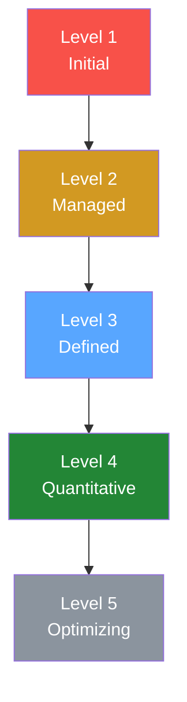
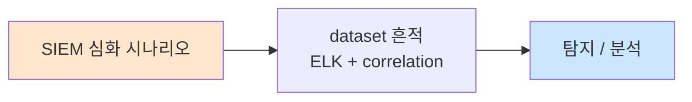

# Week 01: SOC 성숙도 모델

## 학습 목표
- SOC-CMM(SOC Capability Maturity Model) 5단계를 이해하고 자체 SOC 수준을 평가할 수 있다
- Tier 1/2/3 분석가의 역할과 책임을 심화 수준에서 설명할 수 있다
- SOC KPI(MTTD, MTTR, 탐지율, 오탐률 등)를 설계하고 측정할 수 있다
- SOC 운영 성숙도 자가진단 체크리스트를 작성할 수 있다
- Wazuh 환경에서 실제 KPI 데이터를 추출하여 성숙도 평가를 수행할 수 있다

## 실습 환경 (공통)

| 서버 | IP | 역할 | 접속 |
|------|-----|------|------|
| bastion | 10.20.30.201 | Control Plane (Bastion) | `ssh ccc@10.20.30.201` (pw: 1) |
| secu | 10.20.30.1 | 방화벽/IPS (nftables, Suricata) | `ssh ccc@10.20.30.1` |
| web | 10.20.30.80 | 웹서버 (JuiceShop:3000, Apache:80) | `ssh ccc@10.20.30.80` |
| siem | 10.20.30.100 | SIEM (Wazuh Dashboard:443, OpenCTI:8080) | `ssh ccc@10.20.30.100` |

**Bastion API:** `http://localhost:9100` / Key: `ccc-api-key-2026`

## 강의 시간 배분 (3시간)

| 시간 | 내용 | 유형 |
|------|------|------|
| 0:00-0:50 | SOC 성숙도 모델 이론 (Part 1) | 강의 |
| 0:50-1:30 | Tier 심화 + KPI 설계 (Part 2) | 강의/토론 |
| 1:30-1:40 | 휴식 | - |
| 1:40-2:30 | KPI 측정 실습 (Part 3) | 실습 |
| 2:30-3:10 | 성숙도 자가진단 + Bastion 연동 (Part 4) | 실습 |
| 3:10-3:20 | 정리 + 과제 안내 | 정리 |

---

## 용어 해설

| 용어 | 영문 | 설명 | 비유 |
|------|------|------|------|
| **SOC-CMM** | SOC Capability Maturity Model | SOC 역량 성숙도 모델 (5레벨) | 기업 경영품질 인증 등급 |
| **MTTD** | Mean Time to Detect | 평균 탐지 시간 | 화재 발생~경보 울림까지 평균 시간 |
| **MTTR** | Mean Time to Respond | 평균 대응 시간 | 경보~소방차 도착까지 평균 시간 |
| **MTTC** | Mean Time to Contain | 평균 봉쇄 시간 | 화재 확산 차단까지 걸리는 시간 |
| **오탐률** | False Positive Rate | 전체 경보 중 오탐 비율 | 화재 경보 중 요리 연기 비율 |
| **탐지율** | Detection Rate | 실제 위협 중 탐지된 비율 | CCTV가 실제 침입자를 잡은 비율 |
| **Tier 1** | SOC Analyst L1 | 초기 모니터링/트리아지 담당 | 응급실 접수 간호사 |
| **Tier 2** | SOC Analyst L2 | 심화 분석/에스컬레이션 담당 | 전공의 |
| **Tier 3** | SOC Analyst L3 | 위협 헌팅/포렌식 전문가 | 교수급 전문의 |
| **KPI** | Key Performance Indicator | 핵심 성과 지표 | 성적표 |
| **KRI** | Key Risk Indicator | 핵심 위험 지표 | 건강검진 위험 수치 |
| **SLA** | Service Level Agreement | 서비스 수준 합의 | 배달 보장 시간 |
| **NIST CSF** | NIST Cybersecurity Framework | 미국 표준 사이버보안 프레임워크 | 국가 표준 보안 교과서 |
| **CISO** | Chief Information Security Officer | 최고 정보보안 책임자 | 보안 총괄 사령관 |
| **에스컬레이션** | Escalation | 상위 분석가/관리자에게 이관 | 상급자에게 보고 |
| **트리아지** | Triage | 경보 우선순위 분류 | 응급 환자 분류 |
| **플레이북** | Playbook | 인시던트 유형별 대응 절차 | 소방 매뉴얼 |

---

# Part 1: SOC 성숙도 모델 이론 (50분)

## 1.1 SOC 성숙도란?

SOC 성숙도(SOC Maturity)는 보안관제센터가 위협을 탐지하고 대응하는 **역량 수준**을 체계적으로 측정하는 개념이다. 단순히 장비를 도입했다고 성숙한 SOC가 아니다. 인력, 프로세스, 기술, 거버넌스가 유기적으로 작동해야 한다.

### 왜 성숙도를 측정해야 하는가?

```
[현실 시나리오]

A 기업: Wazuh 도입, 분석가 2명, 룰 300개
  → "우리 SOC는 잘 운영되고 있다"
  → 실제: 경보 10,000개/일, 오탐 85%, 분석가 피로 누적
  → MTTD: 4시간, MTTR: 12시간

B 기업: Wazuh 도입, 분석가 2명, 룰 120개
  → "우리 SOC는 아직 부족하다"
  → 실제: 경보 800개/일, 오탐 15%, 자동화 대응 70%
  → MTTD: 8분, MTTR: 25분

→ 장비와 인력 수는 비슷하지만 성숙도는 하늘과 땅 차이
→ 측정하지 않으면 개선할 수 없다
```

## 1.2 SOC-CMM (SOC Capability Maturity Model)

SOC-CMM은 네덜란드의 Rob van Os가 개발한 SOC 역량 성숙도 모델이다. Carnegie Mellon의 CMM/CMMI에서 영감을 받았으며, SOC에 특화된 5가지 도메인과 5단계 성숙도 레벨을 정의한다.

### 5가지 도메인

```mermaid
graph TB
    subgraph "SOC-CMM 5 Domains"
        subgraph Business["Business<br/>비즈니스"]
            B1[거버넌스] ~~~ B2[예산]
            B2 --- B3[보고]
            B3 --- B4[규정]
        end
        subgraph People["People<br/>인력"]
            P1[채용] ~~~ P2[교육]
            P2 --- P3[역량]
            P3 --- P4[유지]
        end
        subgraph Process["Process<br/>프로세스"]
            PR1[모니터링] ~~~ PR2[분석]
            PR2 --- PR3[대응]
            PR3 --- PR4[개선]
        end
        subgraph Technology["Technology<br/>기술"]
            T1[SIEM] ~~~ T2[EDR]
            T2 --- T3[SOAR]
            T3 --- T4[자동화]
        end
        subgraph Services["Services<br/>서비스"]
            S1[탐지] ~~~ S2[대응]
            S2 --- S3[헌팅]
            S3 --- S4[포렌식]
        end
    end
    style Business fill:#58a6ff,color:#fff
    style People fill:#d29922,color:#fff
    style Process fill:#238636,color:#fff
    style Technology fill:#f85149,color:#fff
    style Services fill:#8b949e,color:#fff
```



### 5단계 성숙도 레벨

| 레벨 | 이름 | 설명 | 특징 |
|------|------|------|------|
| **1** | Initial (초기) | 비공식, 임시적 운영 | 문서화 없음, 개인 역량에 의존 |
| **2** | Managed (관리) | 기본 프로세스 수립 | 플레이북 존재, 역할 정의됨 |
| **3** | Defined (정의) | 표준화된 프로세스 | 메트릭 측정, 교육 체계화 |
| **4** | Quantitatively Managed (정량 관리) | 데이터 기반 의사결정 | KPI/KRI 추적, 지속적 측정 |
| **5** | Optimizing (최적화) | 지속적 개선 문화 | AI/ML 활용, 프로액티브 헌팅 |

### 레벨별 상세 비교



| Level | 핵심 특징 |
|-------|----------|
| **1 (Initial)** | 사고 나면 대응, 개인 경험 의존, 문서화 없음 |
| **2 (Managed)** | 플레이북 5-10개, Tier 1/2 구분, SIEM 기본 룰 |
| **3 (Defined)** | 플레이북 30개+, MTTD/MTTR 측정, ATT&CK 매핑 |
| **4 (Quantitative)** | KPI 대시보드, SOAR 자동 대응 50%+, CTI 연동 |
| **5 (Optimizing)** | AI/ML 이상 탐지, 자동 대응 80%+, Purple Team |

## 1.3 다른 성숙도 프레임워크 비교

| 프레임워크 | 개발 기관 | 특징 | SOC 특화 |
|------------|----------|------|----------|
| **SOC-CMM** | Rob van Os | SOC 전용, 5도메인 25영역 | O (최고) |
| **NIST CSF** | NIST | 범용 사이버보안, 5기능 | 부분적 |
| **C2M2** | DoE | 에너지 분야, 사이버보안 역량 | X |
| **CMMI** | CMMI Institute | 소프트웨어 개발 프로세스 | X |
| **CREST SOC** | CREST | 영국 기반, SOC 인증 | O |
| **MITRE ATT&CK** | MITRE | 위협 기법 분류 (성숙도 아님) | 보완적 |

### SOC-CMM vs NIST CSF 매핑

```
SOC-CMM Domain        NIST CSF Function
+-----------+         +----------+
| Business  | ------> | Govern                                      |
| People    | ------> | (없음)   |  ← NIST CSF에는 인력 도메인이 약함
| Process   | ------> | Detect                                      |
|           | ------> | Respond                                     |
| Technology| ------> | Protect                                     |
| Services  | ------> | Recover                                     |
+-----------+         +----------+

→ SOC-CMM이 SOC 운영에 더 구체적이고 실용적
```

## 1.4 SOC-CMM 평가 방법론

### 평가 절차

```
Step 1: 범위 정의
  → 평가 대상 SOC 식별
  → 도메인별 담당자 지정

Step 2: 자료 수집
  → 문서 리뷰 (플레이북, 정책, 보고서)
  → 인터뷰 (Tier 1/2/3 분석가, 매니저)
  → 기술 환경 검토 (SIEM, EDR, SOAR)

Step 3: 레벨 판정
  → 도메인별 성숙도 점수 산정
  → 증거 기반 평가 (자기 주장 아닌 실증)

Step 4: 갭 분석
  → 현재 레벨 vs 목표 레벨
  → 도메인별 개선 과제 도출

Step 5: 로드맵 수립
  → 우선순위 기반 개선 계획
  → 3/6/12개월 마일스톤
```

### 자가진단 점수 기준 (도메인별 0-5점)

| 점수 | 기준 |
|------|------|
| 0 | 해당 활동이 전혀 없음 |
| 1 | 비공식적으로 일부 수행 |
| 2 | 기본 프로세스가 문서화됨 |
| 3 | 표준화되어 일관적으로 수행 |
| 4 | 정량적으로 측정/관리 |
| 5 | 지속적 개선, 업계 최고 수준 |

---

# Part 2: Tier 심화 + KPI 설계 (40분)

## 2.1 Tier 1/2/3 역할 심화

### Tier 1: SOC 모니터링 분석가

```
[Tier 1 일일 워크플로우]

09:00  교대 인수인계 (야간 미처리 경보 확인)
        |
09:15  SIEM 대시보드 경보 큐 확인
        |
09:30  경보 트리아지 시작
        |   +-- 심각도 판단 (Critical/High/Medium/Low/Info)
        |   +-- 오탐 판별 (알려진 오탐 패턴 체크)
        |   +-- 티켓 생성 또는 종결
        |
12:00  오전 경보 처리 현황 보고
        |
13:00  오후 경보 트리아지 계속
        |   +-- 반복 패턴 식별
        |   +-- 신규 오탐 룰 제안
        |
16:00  일일 보고서 작성
        |
17:00  교대 인수인계 (미처리 건 전달)
```

**핵심 역량:**
- SIEM 대시보드 운용 능력
- 경보 트리아지 기준 숙지
- 플레이북 기반 초기 대응
- 에스컬레이션 판단력
- 커뮤니케이션 (명확한 인수인계)

**KPI:**
- 경보 처리량 (건/시간)
- 초기 트리아지 시간 (분)
- 에스컬레이션 정확도 (%)
- 오탐 판별 정확도 (%)

### Tier 2: SOC 심화 분석가

```
[Tier 2 업무 범위]

Tier 1 에스컬레이션 접수
        |
        v
+---[심화 분석]---+
|                  |
| - 로그 상관분석  |
| - 패킷 분석     |
| - 악성코드 분석  |
| - IOC 추출      |
| - 영향도 평가    |
+------------------+
         |
    +--------------+
    |              |
  [대응]    [보고]
    |         |
  - IP 차단   - 인시던트 보고서
  - 계정 잠금 - 타임라인 작성
  - 격리      - 교훈(Lessons Learned)
```

**핵심 역량:**
- 네트워크 패킷 분석 (Wireshark)
- 로그 상관분석 (SIEM 고급 쿼리)
- 악성코드 기초 분석
- 인시던트 대응 리딩
- 포렌식 증거 보존

**KPI:**
- 심화 분석 완료 시간 (시간)
- 인시던트 봉쇄 시간 (MTTC)
- 근본 원인 분석 성공률 (%)
- IOC 추출 정확도 (%)

### Tier 3: SOC 전문가/헌팅

```
[Tier 3 업무 범위]

+--[프로액티브 활동]--+     +--[리액티브 활동]--+
|                      |     |                    |
| - 위협 헌팅          |     | - 고급 포렌식      |
| - 탐지 룰 개발       |     | - 악성코드 리버싱  |
| - ATT&CK 매핑       |     | - APT 분석         |
| - Purple Team        |     | - 법적 증거 수집   |
| - 인텔리전스 분석    |     | - CISO 보고        |
+----------+-----------+     +---------+----------+
           |                                      |
           +--------------------------------------+
                      |
              [SOC 역량 향상]
              - Tier 1/2 교육
              - 플레이북 개선
              - 도구 평가/도입
              - 벤더 관리
```

**핵심 역량:**
- 고급 포렌식 (디스크, 메모리, 네트워크)
- 악성코드 리버스 엔지니어링
- 위협 인텔리전스 분석
- SIGMA/YARA 룰 작성
- ATT&CK 프레임워크 전문가
- 보안 아키텍처 이해

**KPI:**
- 헌팅 캠페인 수/성공률
- 신규 탐지 룰 생성 수
- 탐지 격차(Detection Gap) 감소율
- Tier 1/2 교육 시간

## 2.2 SOC KPI 체계 설계

### 핵심 KPI 분류

```
+--------------------------------------------------------------------+
|                        SOC KPI Framework                           |
+--------------------------------------------------------------------+
|                                                                    |
|  [효율성 KPI]              [효과성 KPI]        [인력 KPI]          |
|  +-----------------+      +----------------+  +----------------+   |
|  | MTTD            |      | 탐지율          |  | 분석가 이직률  |  |
|  | MTTR            |      | 오탐률          |  | 교육 이수율    |  |
|  | MTTC            |      | 미탐률          |  | 인당 경보 처리 |  |
|  | 경보 처리 속도  |      | 인시던트 재발률 |  | 번아웃 지수    |  |
|  | 자동화 비율     |      | 커버리지(ATT&CK)|  | 야간 교대 비율 |  |
|  +-----------------+      +----------------+  +----------------+   |
|                                                                    |
|  [기술 KPI]                [비즈니스 KPI]                          |
|  +-----------------+      +-------------------+                    |
|  | 룰 수/품질      |      | 보안 사고 비용    |                    |
|  | 로그 수집률     |      | SLA 준수율        |                    |
|  | 시스템 가용성   |      | 규정 준수율       |                    |
|  | 자동화 커버리지 |      | 고객 만족도       |                    |
|  +-----------------+      +-------------------+                    |
+--------------------------------------------------------------------+
```

### 주요 KPI 상세

| KPI | 산식 | 목표값 (Level 3) | 목표값 (Level 5) |
|-----|------|-------------------|-------------------|
| MTTD | sum(탐지시각-발생시각)/건수 | < 1시간 | < 5분 |
| MTTR | sum(대응완료-탐지시각)/건수 | < 4시간 | < 30분 |
| MTTC | sum(봉쇄완료-탐지시각)/건수 | < 2시간 | < 15분 |
| 오탐률 | 오탐 건수/전체 경보 x 100 | < 30% | < 5% |
| 탐지율 | 탐지 건수/실제 위협 x 100 | > 70% | > 95% |
| 자동화율 | 자동 대응/전체 대응 x 100 | > 30% | > 80% |
| 에스컬레이션 정확도 | 적절한 에스컬/전체 에스컬 | > 80% | > 95% |

### KPI 대시보드 설계 원칙

```
+--[좋은 KPI 대시보드]--+     +--[나쁜 KPI 대시보드]--+
|                        |     |                        |
| - 5-7개 핵심 지표      |     | - 50개+ 지표 나열     |
| - 추세 그래프 포함     |     | - 숫자만 나열          |
| - 목표 대비 현재 표시  |     | - 목표값 없음          |
| - 색상 코드 (Red/Amber |     | - 단색 테이블          |
|   /Green)              |     |                        |
| - 드릴다운 가능        |     | - 상세 확인 불가       |
| - 실시간 업데이트      |     | - 주 1회 수동 갱신     |
+------------------------+     +------------------------+
```

## 2.3 SOC 운영 모델

### 교대 근무 모델

| 모델 | 인원 요구 | 장점 | 단점 |
|------|----------|------|------|
| **24/7 3교대** | 12-15명 | 완전 커버리지 | 비용 높음 |
| **16/8 + 온콜** | 6-8명 | 비용 절감 | 야간 대응 지연 |
| **비즈니스 시간 + SOAR** | 3-5명 | 소규모 가능 | 자동화 의존 |
| **Follow-the-Sun** | 6-9명 (글로벌) | 야간 없음 | 글로벌 팀 필요 |

### 에스컬레이션 매트릭스

```
경보 심각도    Tier 1 처리    에스컬레이션 기준        최종 대응자
+----------+  +----------+  +-------------------+   +-----------+
| Info     |  | 자동 종결 |  | (에스컬 불필요)    |   | 자동화     |
| Low      |  | 30분 내   |  | 패턴 반복 시       |   | Tier 1     |
| Medium   |  | 15분 내   |  | 1시간 미해결 시    |   | Tier 2     |
| High     |  | 5분 내    |  | 즉시 에스컬        |   | Tier 2     |
| Critical |  | 즉시 보고 |  | 즉시 에스컬+보고   |   | Tier 3+관리|
+----------+  +----------+  +-------------------+   +-----------+
```

---

# Part 3: KPI 측정 실습 (50분)

## 3.1 Wazuh에서 경보 데이터 추출

> **실습 목적**: Wazuh API를 사용하여 실제 경보 데이터를 추출하고, SOC KPI를 계산하는 방법을 익힌다.
>
> **배우는 것**: Wazuh REST API 활용, JSON 데이터 파싱, KPI 산출 방법
>
> **실전 활용**: 실제 SOC에서 SIEM 데이터를 기반으로 주간/월간 KPI 보고서를 작성할 때 활용

```bash
# siem 서버 접속
ssh ccc@10.20.30.100

# Wazuh API 토큰 발급
TOKEN=$(curl -s -u wazuh-wui:MyS3cr37P450r.*- \
  -k https://localhost:55000/security/user/authenticate \
  | python3 -c "import sys,json; print(json.load(sys.stdin)['data']['token'])")

echo "Token: ${TOKEN:0:20}..."

# 최근 24시간 경보 요약 조회
curl -s -k -H "Authorization: Bearer $TOKEN" \
  "https://localhost:55000/alerts?limit=500&pretty=true" \
  | python3 -c "
import sys, json
data = json.load(sys.stdin)
total = data.get('data', {}).get('total_affected_items', 0)
print(f'총 경보 수: {total}')
"
```

> **결과 해석**: `total_affected_items` 값이 최근 경보 총 건수다. 이 수치가 일 기준 1,000건 이상이면 Tier 1 분석가의 업무 부하가 높은 상태로 판단한다.
>
> **명령어 해설**:
> - `curl -u`: HTTP Basic 인증으로 Wazuh API에 접근
> - `-k`: 자체 서명 인증서 무시 (실습 환경용)
> - `python3 -c`: 인라인 Python으로 JSON 파싱
>
> **트러블슈팅**:
> - "401 Unauthorized" → Wazuh 기본 계정/비밀번호 확인
> - "Connection refused" → Wazuh API 서비스 상태 확인: `systemctl status wazuh-manager`

## 3.2 경보 심각도별 분류

```bash
# 심각도별 경보 분포 확인
curl -s -k -H "Authorization: Bearer $TOKEN" \
  "https://localhost:55000/alerts?limit=1000&pretty=true" \
  | python3 -c "
import sys, json
from collections import Counter

data = json.load(sys.stdin)
items = data.get('data', {}).get('affected_items', [])

severity_count = Counter()
for item in items:
    level = item.get('rule', {}).get('level', 0)
    if level <= 3:
        severity_count['Info'] += 1
    elif level <= 6:
        severity_count['Low'] += 1
    elif level <= 9:
        severity_count['Medium'] += 1
    elif level <= 12:
        severity_count['High'] += 1
    else:
        severity_count['Critical'] += 1

print('=== 경보 심각도 분포 ===')
total = sum(severity_count.values())
for sev in ['Critical', 'High', 'Medium', 'Low', 'Info']:
    count = severity_count.get(sev, 0)
    pct = (count/total*100) if total > 0 else 0
    bar = '#' * int(pct/2)
    print(f'{sev:10s}: {count:5d} ({pct:5.1f}%) {bar}')
print(f\"{'Total':10s}: {total:5d}\")
"
```

> **결과 해석**: 건전한 SOC에서는 Critical/High가 전체의 5-10% 이하여야 한다. 30% 이상이면 룰 튜닝이 필요하다. Info/Low가 80% 이상이면 자동 종결 룰을 강화할 필요가 있다.

## 3.3 MTTD 시뮬레이션 계산

```bash
# bastion 서버에서 Bastion API를 통해 MTTD 시뮬레이션
# 시뮬레이션: 공격 이벤트 발생 → 경보 생성까지 시간 측정

cat << 'SCRIPT' > /tmp/mttd_calc.py
#!/usr/bin/env python3
"""SOC KPI 계산기 - MTTD/MTTR 시뮬레이션"""
import random
import statistics
from datetime import datetime, timedelta

# 시뮬레이션 데이터: 인시던트 10건
incidents = []
for i in range(10):
    # 공격 발생 시각
    attack_time = datetime(2026, 4, 4, random.randint(0,23),
                           random.randint(0,59))
    # 탐지 시각 (Level 2 SOC: 5분~60분 랜덤)
    detect_delay = timedelta(minutes=random.randint(5, 60))
    detect_time = attack_time + detect_delay
    # 대응 완료 시각 (추가 15분~120분)
    respond_delay = timedelta(minutes=random.randint(15, 120))
    respond_time = detect_time + respond_delay
    # 봉쇄 시각 (대응의 50-80%)
    contain_delay = timedelta(minutes=random.randint(10, 90))
    contain_time = detect_time + contain_delay

    incidents.append({
        'id': f'INC-2026-{i+1:04d}',
        'attack': attack_time,
        'detect': detect_time,
        'contain': contain_time,
        'respond': respond_time,
        'ttd_min': detect_delay.total_seconds() / 60,
        'ttc_min': contain_delay.total_seconds() / 60,
        'ttr_min': (respond_time - detect_time).total_seconds() / 60,
    })

print("=" * 70)
print(f"{'ID':16s} {'공격시각':>8s} {'탐지시각':>8s} {'TTD(분)':>8s} {'TTR(분)':>8s}")
print("-" * 70)
for inc in incidents:
    print(f"{inc['id']:16s} "
          f"{inc['attack'].strftime('%H:%M'):>8s} "
          f"{inc['detect'].strftime('%H:%M'):>8s} "
          f"{inc['ttd_min']:8.0f} "
          f"{inc['ttr_min']:8.0f}")

ttd_values = [inc['ttd_min'] for inc in incidents]
ttr_values = [inc['ttr_min'] for inc in incidents]
ttc_values = [inc['ttc_min'] for inc in incidents]

print("-" * 70)
print(f"\n=== SOC KPI 결과 ===")
print(f"MTTD (평균 탐지 시간): {statistics.mean(ttd_values):.1f}분")
print(f"MTTR (평균 대응 시간): {statistics.mean(ttr_values):.1f}분")
print(f"MTTC (평균 봉쇄 시간): {statistics.mean(ttc_values):.1f}분")
print(f"MTTD 중앙값: {statistics.median(ttd_values):.1f}분")
print(f"MTTD 표준편차: {statistics.stdev(ttd_values):.1f}분")

# 성숙도 레벨 판정
mttd = statistics.mean(ttd_values)
if mttd > 240:
    level = 1
elif mttd > 60:
    level = 2
elif mttd > 15:
    level = 3
elif mttd > 5:
    level = 4
else:
    level = 5
print(f"\n→ MTTD 기준 SOC 성숙도: Level {level}")
SCRIPT

python3 /tmp/mttd_calc.py
```

> **결과 해석**: MTTD가 30분 이하이면 Level 3 수준이다. 중앙값과 평균의 차이가 크면 일부 인시던트에서 탐지가 크게 지연되는 것이므로 해당 유형의 탐지 룰을 강화해야 한다.
>
> **실전 활용**: 실제 SOC에서는 SIEM의 인시던트 타임스탬프를 기반으로 이 계산을 자동화한다. 월간 KPI 보고서에 추세 그래프를 포함하면 경영진 보고에 효과적이다.

## 3.4 Wazuh 룰 현황 분석

```bash
# siem 서버에서 활성 룰 수 확인
ssh ccc@10.20.30.100 << 'EOF'
echo "=== Wazuh 활성 룰 현황 ==="
# 전체 룰 수
TOTAL_RULES=$(find /var/ossec/ruleset/rules/ -name "*.xml" -exec grep -c '<rule id' {} + 2>/dev/null | awk -F: '{sum+=$2} END{print sum}')
echo "전체 룰 수: $TOTAL_RULES"

# 커스텀 룰 수
CUSTOM_RULES=$(find /var/ossec/etc/rules/ -name "*.xml" -exec grep -c '<rule id' {} + 2>/dev/null | awk -F: '{sum+=$2} END{print sum}')
echo "커스텀 룰 수: $CUSTOM_RULES"

# 레벨별 룰 분포
echo ""
echo "=== 레벨별 룰 분포 ==="
for level in $(seq 1 15); do
    count=$(grep -r "level=\"$level\"" /var/ossec/ruleset/rules/ 2>/dev/null | wc -l)
    if [ "$count" -gt 0 ]; then
        bar=$(python3 -c "print('#' * min($count // 20, 40))")
        printf "Level %2d: %5d %s\n" "$level" "$count" "$bar"
    fi
done

# 최근 수정된 룰 파일
echo ""
echo "=== 최근 수정된 룰 파일 (최근 30일) ==="
find /var/ossec/etc/rules/ -name "*.xml" -mtime -30 -exec ls -la {} \; 2>/dev/null || echo "(최근 수정 없음)"
EOF
```

> **결과 해석**: 커스텀 룰이 전체의 10-20%면 양호하다. 0%면 기본 룰만 사용 중이므로 성숙도 Level 1-2에 해당한다. 레벨별 분포에서 Level 12+ 룰이 과도하게 많으면 경보 피로를 유발할 수 있다.

## 3.5 Bastion를 활용한 KPI 수집 자동화

```bash
# Bastion 프로젝트 생성 - KPI 수집
export BASTION_API_KEY="ccc-api-key-2026"

# 프로젝트 생성
PROJECT_ID=$(curl -s -X POST http://localhost:9100/projects \
  -H "Content-Type: application/json" \
  -H "X-API-Key: $BASTION_API_KEY" \
  -d '{
    "name": "soc-kpi-collection",
    "request_text": "SOC KPI 데이터 수집 - MTTD/MTTR/경보 분포",
    "master_mode": "external"
  }' | python3 -c "import sys,json; print(json.load(sys.stdin)['id'])")

echo "Project ID: $PROJECT_ID"

# Stage 전환
curl -s -X POST "http://localhost:9100/projects/$PROJECT_ID/plan" \
  -H "X-API-Key: $BASTION_API_KEY"
curl -s -X POST "http://localhost:9100/projects/$PROJECT_ID/execute" \
  -H "X-API-Key: $BASTION_API_KEY"

# SIEM 서버에서 KPI 데이터 수집
curl -s -X POST "http://localhost:9100/projects/$PROJECT_ID/execute-plan" \
  -H "Content-Type: application/json" \
  -H "X-API-Key: $BASTION_API_KEY" \
  -d '{
    "tasks": [
      {
        "order": 1,
        "instruction_prompt": "cat /var/ossec/logs/alerts/alerts.json | tail -100 | python3 -c \"import sys,json; lines=[json.loads(l) for l in sys.stdin if l.strip()]; levels=[e.get(\\\"rule\\\",{}).get(\\\"level\\\",0) for e in lines]; print(f\\\"최근 100건 평균 레벨: {sum(levels)/len(levels):.1f}\\\"); print(f\\\"Critical(12+): {sum(1 for l in levels if l>=12)}건\\\")\"",
        "risk_level": "low",
        "subagent_url": "http://10.20.30.100:8002"
      },
      {
        "order": 2,
        "instruction_prompt": "wc -l /var/ossec/logs/alerts/alerts.json",
        "risk_level": "low",
        "subagent_url": "http://10.20.30.100:8002"
      }
    ],
    "subagent_url": "http://10.20.30.100:8002"
  }'
```

> **목적**: Bastion의 자동화 프레임워크를 활용하여 여러 서버에서 KPI 데이터를 원격 수집하는 패턴을 익힌다.
>
> **실전 활용**: 이 패턴을 스케줄러와 결합하면 일간/주간 KPI 자동 수집이 가능하다. Bastion의 evidence 기능으로 이력 관리도 자동화된다.

---

# Part 4: 성숙도 자가진단 실습 (40분)

## 4.1 SOC-CMM 자가진단 체크리스트

아래 체크리스트를 실습 환경에 적용하여 현재 성숙도를 평가하라.

### Business 도메인

```
[ ] 1. SOC 운영 목적/미션이 문서화되어 있는가?
[ ] 2. 연간 예산이 편성되어 있는가?
[ ] 3. 경영진에게 정기 보고를 하는가?
[ ] 4. 관련 규정(개인정보보호법 등) 준수 여부를 추적하는가?
[ ] 5. 서비스 카탈로그(제공 서비스 목록)가 존재하는가?

점수: ___/5  (체크 1개당 1점)
```

### People 도메인

```
[ ] 1. Tier 1/2/3 역할이 명확히 정의되어 있는가?
[ ] 2. 채용 기준(자격/역량)이 문서화되어 있는가?
[ ] 3. 정기 교육/훈련 프로그램이 있는가?
[ ] 4. 번아웃 방지 정책(교대근무 등)이 있는가?
[ ] 5. 경력 개발 경로가 정의되어 있는가?

점수: ___/5
```

### Process 도메인

```
[ ] 1. 인시던트 대응 플레이북이 5개 이상 있는가?
[ ] 2. 에스컬레이션 절차가 문서화되어 있는가?
[ ] 3. 변경 관리 프로세스가 있는가?
[ ] 4. 교훈(Lessons Learned) 회의를 정기적으로 하는가?
[ ] 5. KPI를 정기적으로 측정/보고하는가?

점수: ___/5
```

### Technology 도메인

```
[ ] 1. SIEM이 도입/운영되고 있는가?
[ ] 2. 로그 소스가 3개 이상 연동되어 있는가?
[ ] 3. 탐지 룰이 50개 이상 활성화되어 있는가?
[ ] 4. 자동 대응(SOAR) 기능이 있는가?
[ ] 5. 위협 인텔리전스 피드가 연동되어 있는가?

점수: ___/5
```

### Services 도메인

```
[ ] 1. 실시간 모니터링 서비스를 제공하는가?
[ ] 2. 인시던트 대응 서비스를 제공하는가?
[ ] 3. 위협 헌팅 서비스를 제공하는가?
[ ] 4. 취약점 관리 서비스를 제공하는가?
[ ] 5. 보안 교육 서비스를 제공하는가?

점수: ___/5
```

## 4.2 실습 환경 성숙도 평가 스크립트

```bash
# 실습 환경의 Technology 도메인 자동 평가
cat << 'SCRIPT' > /tmp/soc_maturity_check.sh
#!/bin/bash
echo "=============================================="
echo "  SOC 성숙도 자동 평가 (Technology 도메인)"
echo "=============================================="
echo ""

SCORE=0
TOTAL=10

# 1. SIEM 가동 여부
echo "[체크 1] SIEM(Wazuh) 가동 여부..."
if ssh ccc@10.20.30.100 \
   "systemctl is-active wazuh-manager" 2>/dev/null | grep -q "active"; then
    echo "  [PASS] Wazuh Manager 가동 중"
    SCORE=$((SCORE+1))
else
    echo "  [FAIL] Wazuh Manager 미가동"
fi

# 2. 에이전트 연결 수
echo "[체크 2] 연결된 에이전트 수..."
AGENTS=$(ssh ccc@10.20.30.100 \
   "/var/ossec/bin/agent_control -l 2>/dev/null | grep -c 'Active'" 2>/dev/null)
AGENTS=${AGENTS:-0}
echo "  연결된 에이전트: ${AGENTS}개"
if [ "$AGENTS" -ge 2 ]; then
    echo "  [PASS] 에이전트 2개 이상 연결"
    SCORE=$((SCORE+1))
else
    echo "  [WARN] 에이전트 부족 (권장: 3개 이상)"
fi

# 3. 커스텀 룰 존재 여부
echo "[체크 3] 커스텀 탐지 룰 존재 여부..."
CUSTOM=$(ssh ccc@10.20.30.100 \
   "ls /var/ossec/etc/rules/*.xml 2>/dev/null | wc -l" 2>/dev/null)
CUSTOM=${CUSTOM:-0}
echo "  커스텀 룰 파일: ${CUSTOM}개"
if [ "$CUSTOM" -ge 1 ]; then
    echo "  [PASS] 커스텀 룰 존재"
    SCORE=$((SCORE+1))
else
    echo "  [FAIL] 커스텀 룰 없음"
fi

# 4. IPS(Suricata) 가동 여부
echo "[체크 4] IPS(Suricata) 가동 여부..."
if ssh ccc@10.20.30.1 \
   "systemctl is-active suricata" 2>/dev/null | grep -q "active"; then
    echo "  [PASS] Suricata IPS 가동 중"
    SCORE=$((SCORE+1))
else
    echo "  [FAIL] Suricata IPS 미가동"
fi

# 5. 방화벽(nftables) 활성 여부
echo "[체크 5] 방화벽(nftables) 활성 여부..."
if ssh ccc@10.20.30.1 \
   "nft list tables" 2>/dev/null | grep -q "table"; then
    echo "  [PASS] nftables 활성"
    SCORE=$((SCORE+1))
else
    echo "  [FAIL] nftables 비활성"
fi

# 6. 웹 로그 수집 여부
echo "[체크 6] 웹서버 로그 수집 여부..."
if ssh ccc@10.20.30.80 \
   "test -f /var/ossec/etc/ossec.conf && grep -q 'localfile' /var/ossec/etc/ossec.conf" 2>/dev/null; then
    echo "  [PASS] 웹서버 로그 수집 설정 존재"
    SCORE=$((SCORE+1))
else
    echo "  [WARN] 웹서버 로그 수집 미확인"
fi

# 7. Bastion 자동화 가동 여부
echo "[체크 7] Bastion 자동화 플랫폼 가동 여부..."
if curl -s -o /dev/null -w "%{http_code}" \
   -H "X-API-Key: ccc-api-key-2026" \
   http://localhost:9100/projects 2>/dev/null | grep -q "200"; then
    echo "  [PASS] Bastion Manager API 가동 중"
    SCORE=$((SCORE+1))
else
    echo "  [FAIL] Bastion Manager API 미가동"
fi

# 8. 위협 인텔리전스(OpenCTI) 가동 여부
echo "[체크 8] 위협 인텔리전스(OpenCTI) 가동 여부..."
if curl -s -o /dev/null -w "%{http_code}" \
   http://10.20.30.100:9400 2>/dev/null | grep -q "200\|301\|302"; then
    echo "  [PASS] OpenCTI 접근 가능"
    SCORE=$((SCORE+1))
else
    echo "  [WARN] OpenCTI 미접근 (설치 필요 가능)"
fi

# 9. 로그 보존 기간 확인
echo "[체크 9] 로그 보존 정책..."
RETENTION=$(ssh ccc@10.20.30.100 \
   "ls /var/ossec/logs/alerts/ 2>/dev/null | wc -l" 2>/dev/null)
RETENTION=${RETENTION:-0}
echo "  경보 로그 디렉토리: ${RETENTION}개"
if [ "$RETENTION" -ge 7 ]; then
    echo "  [PASS] 7일 이상 로그 보존"
    SCORE=$((SCORE+1))
else
    echo "  [WARN] 로그 보존 기간 부족"
fi

# 10. AI/LLM 연동 여부
echo "[체크 10] AI/LLM 연동 여부..."
if curl -s -o /dev/null -w "%{http_code}" \
   http://10.20.30.200:11434/v1/models 2>/dev/null | grep -q "200"; then
    echo "  [PASS] Ollama LLM 연동 가능"
    SCORE=$((SCORE+1))
else
    echo "  [WARN] LLM 연동 미확인"
fi

# 결과
echo ""
echo "=============================================="
echo "  평가 결과: ${SCORE}/${TOTAL}"
echo "=============================================="

if [ "$SCORE" -ge 9 ]; then
    echo "  성숙도 수준: Level 4-5 (Quantitatively Managed/Optimizing)"
elif [ "$SCORE" -ge 7 ]; then
    echo "  성숙도 수준: Level 3 (Defined)"
elif [ "$SCORE" -ge 4 ]; then
    echo "  성숙도 수준: Level 2 (Managed)"
else
    echo "  성숙도 수준: Level 1 (Initial)"
fi
SCRIPT

bash /tmp/soc_maturity_check.sh
```

> **실습 목적**: 자동화 스크립트로 실습 환경의 SOC 성숙도를 객관적으로 평가한다.
>
> **배우는 것**: 성숙도 평가의 자동화 가능성, SSH 기반 원격 점검, 정량적 평가 기준
>
> **결과 해석**: 10점 만점에서 7점 이상이면 Level 3 수준의 기술 인프라를 갖추고 있다. 부족한 항목은 개선 로드맵에 포함한다.
>
> **트러블슈팅**:
> - SSH 연결 실패 → `sshpass` 설치 확인: `which sshpass`
> - API 연결 실패 → 해당 서비스 가동 상태 확인
> - 점수가 낮게 나와도 정상 → 실습 환경은 모든 구성 요소가 완비되지 않을 수 있음

## 4.3 성숙도 레이더 차트 데이터 생성

```bash
# Python으로 레이더 차트 데이터 생성
cat << 'SCRIPT' > /tmp/maturity_radar.py
#!/usr/bin/env python3
"""SOC-CMM 성숙도 레이더 차트 데이터 생성"""

# 현재 수준 (실습 환경 기준 예시)
current = {
    'Business': 2,
    'People': 2,
    'Process': 3,
    'Technology': 3,
    'Services': 2,
}

# 목표 수준 (6개월 후)
target = {
    'Business': 3,
    'People': 3,
    'Process': 4,
    'Technology': 4,
    'Services': 3,
}

print("=" * 50)
print("  SOC-CMM 성숙도 레이더 차트 데이터")
print("=" * 50)
print(f"\n{'도메인':12s} {'현재':>6s} {'목표':>6s} {'갭':>6s}")
print("-" * 36)

total_current = 0
total_target = 0
for domain in current:
    gap = target[domain] - current[domain]
    total_current += current[domain]
    total_target += target[domain]
    cur_bar = ">" * current[domain]
    tgt_bar = ">" * target[domain]
    print(f"{domain:12s} {current[domain]:>6d} {target[domain]:>6d} {gap:>+6d}")

avg_current = total_current / len(current)
avg_target = total_target / len(target)
print("-" * 36)
print(f"{'평균':12s} {avg_current:>6.1f} {avg_target:>6.1f} {avg_target-avg_current:>+6.1f}")

# 시각화 (텍스트 기반)
print("\n=== 현재 vs 목표 시각화 ===")
for domain in current:
    cur = current[domain]
    tgt = target[domain]
    print(f"\n{domain}:")
    print(f"  현재: {'|' * cur}{'.' * (5-cur)} [{cur}/5]")
    print(f"  목표: {'|' * tgt}{'.' * (5-tgt)} [{tgt}/5]")

# 개선 우선순위
print("\n=== 개선 우선순위 (갭 크기순) ===")
gaps = [(d, target[d]-current[d]) for d in current]
gaps.sort(key=lambda x: -x[1])
for i, (domain, gap) in enumerate(gaps, 1):
    priority = "HIGH" if gap >= 2 else "MEDIUM" if gap >= 1 else "LOW"
    print(f"  {i}. {domain:12s} (갭: +{gap}) - 우선순위: {priority}")
SCRIPT

python3 /tmp/maturity_radar.py
```

> **실전 활용**: 이 데이터를 엑셀이나 Grafana에 넣으면 경영진 보고용 레이더 차트를 만들 수 있다. 갭 분석 결과는 다음 분기 예산 요청의 근거가 된다.

## 4.4 KPI 기반 개선 로드맵 작성

```bash
cat << 'SCRIPT' > /tmp/soc_roadmap.py
#!/usr/bin/env python3
"""SOC 성숙도 개선 로드맵 생성기"""

roadmap = {
    "3개월 (Quick Wins)": [
        {"task": "Wazuh 커스텀 룰 20개 추가", "domain": "Technology", "effort": "Low"},
        {"task": "Tier 1/2 에스컬레이션 절차 문서화", "domain": "Process", "effort": "Low"},
        {"task": "주간 KPI 보고서 템플릿 작성", "domain": "Business", "effort": "Low"},
        {"task": "Bastion 자동화 플레이북 5개 작성", "domain": "Technology", "effort": "Medium"},
    ],
    "6개월 (Foundation)": [
        {"task": "위협 인텔리전스 피드 3개 연동", "domain": "Technology", "effort": "Medium"},
        {"task": "Tier 1/2/3 교육 프로그램 수립", "domain": "People", "effort": "Medium"},
        {"task": "인시던트 대응 플레이북 15개 작성", "domain": "Process", "effort": "Medium"},
        {"task": "SOAR 자동 대응 30% 목표 달성", "domain": "Services", "effort": "High"},
    ],
    "12개월 (Maturation)": [
        {"task": "Purple Team 분기별 훈련 시작", "domain": "Services", "effort": "High"},
        {"task": "AI/LLM 기반 경보 분류 도입", "domain": "Technology", "effort": "High"},
        {"task": "SOC-CMM Level 3 인증 추진", "domain": "Business", "effort": "High"},
        {"task": "위협 헌팅 프로그램 상시 운영", "domain": "Services", "effort": "High"},
    ],
}

for phase, tasks in roadmap.items():
    print(f"\n{'='*60}")
    print(f"  {phase}")
    print(f"{'='*60}")
    for i, task in enumerate(tasks, 1):
        print(f"  {i}. [{task['domain']:12s}] {task['task']}")
        print(f"     Effort: {task['effort']}")
SCRIPT

python3 /tmp/soc_roadmap.py
```

> **실전 활용**: 성숙도 평가 결과를 기반으로 구체적인 개선 로드맵을 수립하는 것이 SOC-CMM 활용의 핵심이다. "Quick Wins"로 빠르게 성과를 보이고, 장기 과제는 예산과 인력 확보 후 추진한다.

---

## 체크리스트

학습을 마친 후 아래 항목을 점검하라.

- [ ] SOC-CMM 5개 도메인을 열거할 수 있다
- [ ] SOC-CMM 5단계 성숙도 레벨의 차이를 설명할 수 있다
- [ ] Tier 1/2/3 분석가의 역할과 핵심 역량을 구분할 수 있다
- [ ] MTTD, MTTR, MTTC의 정의와 산식을 알고 있다
- [ ] 오탐률과 탐지율의 관계를 설명할 수 있다
- [ ] KPI 대시보드의 설계 원칙 5가지를 알고 있다
- [ ] 에스컬레이션 매트릭스를 설명할 수 있다
- [ ] Wazuh API로 경보 데이터를 추출할 수 있다
- [ ] SOC-CMM 자가진단 체크리스트를 작성할 수 있다
- [ ] 성숙도 갭 분석 기반 개선 로드맵을 수립할 수 있다

---

## 과제

### 과제 1: SOC-CMM 자가진단 보고서 (필수)

실습 환경에 대해 SOC-CMM 5개 도메인 자가진단을 수행하고, 다음을 포함하는 보고서를 작성하라.

1. **도메인별 현재 점수** (0-5점, 증거 기반)
2. **레이더 차트 데이터** (Part 4.3 스크립트 활용)
3. **상위 3개 개선 과제** (우선순위 근거 포함)
4. **3개월 개선 로드맵** (구체적 액션 아이템)

### 과제 2: KPI 대시보드 설계 (선택)

가상의 SOC(분석가 5명, 일 경보 3,000건)를 위한 KPI 대시보드를 설계하라.

1. **핵심 KPI 5-7개** 선정 (산식 포함)
2. **목표값** 설정 (Level 3 기준)
3. **시각화 방법** 제안 (그래프 유형, 색상 코드)
4. **데이터 소스** 명시 (어디서 어떻게 수집하는지)

---

## 다음 주 예고

**Week 02: SIEM 고급 상관분석**에서는 Wazuh의 상관 룰을 심화 학습하고, 다중 소스 이벤트를 연계하여 고도화된 탐지를 구현한다. 단일 이벤트로는 탐지할 수 없는 복합 공격 패턴을 상관분석으로 잡아내는 방법을 다룬다.

---

## 웹 UI 실습

### Wazuh Dashboard 고급 검색

> **접속 URL:** `https://10.20.30.100:443` (ID: `admin` / PW: 초기 설정값)

1. 브라우저에서 `https://10.20.30.100:443` 접속 (인증서 경고 → "고급" → "계속")
2. 좌측 메뉴에서 **Modules → Security events** 클릭
3. 상단 검색바(KQL)에 다음을 입력하여 고급 검색 실습:
   ```
   rule.level >= 10
   ```
4. **Add filter** → `agent.name` = `web` 선택하여 특정 에이전트 필터링
5. 시간 범위를 **Last 24 hours** → **Last 7 days**로 변경하여 트렌드 확인
6. **Visualize** 탭에서 경보 레벨 분포 차트 확인
7. 상단 **Export** 버튼으로 CSV 내보내기 → KPI 계산에 활용

### OpenCTI STIX 분석

> **접속 URL:** `http://10.20.30.100:8080`

1. 브라우저에서 `http://10.20.30.100:8080` 접속 → 로그인
2. 좌측 메뉴 **Analysis → Reports** 클릭하여 등록된 위협 보고서 목록 확인
3. **Data → Entities** 클릭 → STIX 객체(Indicator, Malware, Threat Actor 등) 탐색
4. 특정 엔티티 클릭 → **Knowledge** 탭에서 관계 그래프 확인
5. 상단 검색바에 키워드(예: `APT`, `ransomware`) 입력하여 관련 엔티티 검색
6. **Data → Import** 에서 STIX 2.1 번들 JSON 파일 업로드 실습

---

## 실제 사례 (WitFoo Precinct 6 — SIEM 심화)

> 출처: WitFoo Precinct 6 Cybersecurity Dataset (Apache 2.0)
> 본 lecture *SIEM 심화* 학습 항목 매칭.

### SIEM 심화 의 dataset 흔적 — "ELK + correlation"

dataset 의 정상 운영에서 *ELK + correlation* 신호의 baseline 을 알아두면, *SIEM 심화* 시도 시 발생하는 anomaly 를 정량으로 탐지할 수 있다. 핵심 정량 지표는 — 381K audit 의 룰 매칭.



### Case 1: dataset 정량 지표

| 항목 | 값 |
|---|---|
| 핵심 신호 | ELK + correlation |
| 정량 baseline | 381K audit 의 룰 매칭 |
| 학습 매핑 | Elastic Stack 운영 |

**자세한 해석**: Elastic Stack 운영. 이 차이를 정량으로 측정해야 *공격 시도와 정상 운영의 구분* 이 가능. 학생이 baseline 숫자를 외워두면 — 운영 환경에서 anomaly 를 즉시 탐지할 수 있다.

### Case 2: 실전 적용 시나리오

| 단계 | dataset 활용 |
|---|---|
| 시도 식별 | ELK + correlation 의 spike |
| 정상 vs 이상 | baseline 대비 비율 |
| 룰 작성 | Suricata / Wazuh / Sigma |
| 검증 | dataset 재실행 |

**자세한 해석**: 운영 환경 룰 작성은 — *baseline 측정 → 임계 결정 → 룰 작성 → dataset 검증* 의 4 단계. 한 단계라도 빠지면 false positive 폭증.

### 이 사례에서 학생이 배워야 할 3가지

1. **SIEM 심화 = ELK + correlation 의 anomaly** — 정량 신호로 탐지.
2. **baseline 숫자 외우기** — 381K audit 의 룰 매칭.
3. **4 단계 룰 작성** — 측정 → 임계 → 룰 → 검증.

**학생 액션**: Elastic 룰 5개 작성.


---

## 부록: 학습 OSS 도구 매트릭스 (Course14 SOC Advanced — Week 01 SOC 성숙도 모델·KPI·자가진단)

> 이 부록은 lab `soc-adv-ai/week01.yaml` (10 step + multi_task) 의 모든 명령을
> 실제로 실행 가능한 형태로 도구·옵션·예상 출력·해석을 정리한다. SOC-CMM 5단계 평가 +
> Wazuh/Suricata/nftables 의 KPI 측정 + 5 도메인 (Business/People/Process/Technology/
> Services) 자가진단 + Level 4 목표 gap 분석 + 3/6/12개월 로드맵 작성을 다룬다.

### lab step → 도구·SOC-CMM 매핑 표

| step | SOC-CMM 도메인 | 학습 항목 | 핵심 OSS 도구 / 명령 | KPI |
|------|---------------|----------|---------------------|-----|
| s1 | Technology | Wazuh agent 연결 상태 | `curl -k https://siem:55000/agents`, dashboard | agent active rate |
| s2 | Technology | Wazuh 룰 카탈로그 (custom + base) | `wazuh-control` + jq, `/var/ossec/ruleset/rules/` | rule count, custom ratio |
| s3 | Technology | nftables ruleset (default policy) | `nft list ruleset`, `nft -j` | input/output drop rate |
| s4 | Technology | Suricata 룰 + 카테고리 | `suricatasc -c rules-stats`, `suricata -T` | rule active count |
| s5 | Process | Suricata 24h alert 통계 | `jq '.alert' /var/log/suricata/eve.json` | alert by category |
| s6 | Process | Wazuh 고위험 (level ≥ 10) 알림 | Dashboard query, OpenSearch API | high-severity / day |
| s7 | Process | SOC KPI 기준선 (MTTD/MTTR/FP) | dashboard 위젯, `wazuh-stats` | MTTD, MTTR, accuracy |
| s8 | Business + People + Process + Technology + Services | 5 도메인 평가 | SOC-CMM 자가진단 spreadsheet | 도메인별 1-5 score |
| s9 | All domains | Gap 분석 (Level 4 목표) | spreadsheet + radar chart | gap score per domain |
| s10 | All domains | 3/6/12개월 로드맵 | RACI + Gantt (mermaid) | milestone + owner |
| s99 | 통합 다단계 (s1→s2→s3→s4→s5) | Bastion plan: agent→rule→nft→suricata→eve | 다중 | KPI 통합 |

### 학생 환경 준비 (Wazuh + Suricata + KPI 도구 풀세트)

```bash
# === [s1·s2·s6·s7] Wazuh API + CLI ===
ssh ccc@10.20.30.100
sudo /var/ossec/bin/wazuh-control status
# wazuh-modulesd is running
# wazuh-monitord is running
# wazuh-logcollector is running
# wazuh-remoted is running
# wazuh-syscheckd is running
# wazuh-analysisd is running
# wazuh-execd is running
# wazuh-db is running
# wazuh-authd is running

# === Wazuh API (요청 통과를 위한 토큰 획득) ===
TOKEN=$(curl -s -k -u wazuh:wazuh -X POST "https://10.20.30.100:55000/security/user/authenticate?raw=true")
echo $TOKEN

# 모든 agent 조회
curl -s -k -H "Authorization: Bearer $TOKEN" "https://10.20.30.100:55000/agents?pretty" | \
  jq '.data.affected_items[] | {id,name,ip,status,os,version}'

# 활성 룰 통계
curl -s -k -H "Authorization: Bearer $TOKEN" "https://10.20.30.100:55000/rules?pretty&limit=500&q=status=enabled" | \
  jq '.data.total_affected_items'

# === [s3] nftables ===
sudo apt install -y nftables
ssh ccc@10.20.30.1 'sudo nft list ruleset'
ssh ccc@10.20.30.1 'sudo nft -j list ruleset' | jq '.nftables[]'

# === [s4·s5] Suricata ===
ssh ccc@10.20.30.1 'suricata -V'
# Suricata 6.0.x

ssh ccc@10.20.30.1 'sudo suricatasc -c uptime'
ssh ccc@10.20.30.1 'sudo suricatasc -c rules-stats'
ssh ccc@10.20.30.1 'sudo suricatasc -c iface-stat eth0'

# 룰 카운트
ssh ccc@10.20.30.1 'cat /etc/suricata/rules/*.rules | grep -v ^#  | wc -l'

# eve.json 분석
ssh ccc@10.20.30.1 'sudo tail -100 /var/log/suricata/eve.json | jq -r ".alert.signature" | sort | uniq -c | sort -rn'

# === [s8·s9] SOC-CMM 자가진단 ===
mkdir -p ~/soc-cmm-assessment
cat > ~/soc-cmm-assessment/template.md << 'TPL'
# SOC-CMM Self-Assessment

## 5 Domains × N Aspects × 1-5 Score

### Business
- B.1 Strategy & Mission       [_]
- B.2 Charter                  [_]
- B.3 Funding                  [_]
- B.4 Stakeholders             [_]

### People
- P.1 Roles & Responsibilities [_]
- P.2 Skills & Training        [_]
- P.3 Career Path              [_]
- P.4 Retention                [_]
- P.5 Diversity                [_]

### Process
- PR.1 Use Case Management     [_]
- PR.2 IR Process              [_]
- PR.3 Threat Hunting          [_]
- PR.4 Forensics               [_]
- PR.5 Lessons Learned         [_]

### Technology
- T.1 SIEM                     [_]
- T.2 SOAR                     [_]
- T.3 EDR/XDR                  [_]
- T.4 TIP                      [_]
- T.5 Sandbox                  [_]
- T.6 NDR                      [_]

### Services
- S.1 Monitoring               [_]
- S.2 Detection                [_]
- S.3 Response                 [_]
- S.4 Threat Intel             [_]
- S.5 Vulnerability Mgmt       [_]
- S.6 Reporting                [_]
TPL

# === [s9] Radar chart 시각화 ===
pip install --user matplotlib numpy pyyaml

# === [s10] 로드맵 ===
sudo apt install -y graphviz
npm install -g @mermaid-js/mermaid-cli

# === Bonus: ATT&CK Navigator ===
git clone https://github.com/mitre-attack/attack-navigator /tmp/nav
cd /tmp/nav/nav-app && npm install && npm run start &
```

### 핵심 도구별 상세 사용법

#### 도구 1: Wazuh API — agent + 룰 + 알림 통계 (Step 1·2·6·7)

```bash
# === 인증 토큰 획득 ===
TOKEN=$(curl -s -k -u wazuh:wazuh -X POST "https://10.20.30.100:55000/security/user/authenticate?raw=true")

# === 1. Agent 인벤토리 ===
curl -s -k -H "Authorization: Bearer $TOKEN" \
  "https://10.20.30.100:55000/agents?pretty&select=id,name,ip,status,os.name,os.version,version" | \
  jq '.data.affected_items'

# 상태별 집계
curl -s -k -H "Authorization: Bearer $TOKEN" \
  "https://10.20.30.100:55000/agents/summary/status?pretty" | jq '.data'
# {
#   "total": 4,
#   "active": 4,
#   "disconnected": 0,
#   "never_connected": 0,
#   "pending": 0
# }

# === 2. 룰 카탈로그 ===
curl -s -k -H "Authorization: Bearer $TOKEN" \
  "https://10.20.30.100:55000/rules?pretty&limit=1" | \
  jq '.data.total_affected_items'

curl -s -k -H "Authorization: Bearer $TOKEN" \
  "https://10.20.30.100:55000/rules?status=enabled&pretty&limit=1" | \
  jq '.data.total_affected_items'

curl -s -k -H "Authorization: Bearer $TOKEN" \
  "https://10.20.30.100:55000/rules?filename=local_rules.xml&pretty&limit=500" | \
  jq '.data.affected_items[] | {id,level,description,groups}'

# === 3. 알림 통계 (high severity) ===
INDEX_HOST=10.20.30.100
curl -s -k -u admin:admin "https://$INDEX_HOST:9200/wazuh-alerts-*/_search?pretty" -H 'Content-Type: application/json' -d '{
  "size": 0,
  "query": {
    "bool": {
      "must": [
        {"range": {"@timestamp": {"gte": "now-24h"}}},
        {"range": {"rule.level": {"gte": 10}}}
      ]
    }
  },
  "aggs": {
    "by_rule": {
      "terms": {"field": "rule.id", "size": 20}
    }
  }
}' | jq '.aggregations.by_rule.buckets'

# === 4. SOC KPI 기준선 ===
# MTTD = 사고 발생 시각 - 알림 발생 시각 (sub-minute target)
# MTTR = 알림 발생 시각 - close 시각 (Level 4 SOC: < 1 hour)
curl -s -k -u admin:admin "https://$INDEX_HOST:9200/wazuh-alerts-*/_search" -H 'Content-Type: application/json' -d '{
  "size": 0,
  "query": {"range": {"@timestamp": {"gte": "now-7d"}}},
  "aggs": {
    "rule_levels": {
      "terms": {"field": "rule.level", "size": 16},
      "aggs": {"avg_lag": {"avg": {"field": "decoder.parent.delay_ms"}}}
    }
  }
}'
```

#### 도구 2: nftables — 방화벽 정책 + drop rate (Step 3)

```bash
# 전체 ruleset
ssh ccc@10.20.30.1 'sudo nft list ruleset'
# table inet filter {
#   chain input {
#     type filter hook input priority 0; policy drop;
#     ct state {established, related} accept
#     iifname "lo" accept
#     tcp dport {22, 443, 80} accept
#     ip saddr 10.20.30.0/24 accept
#   }
#   chain output { type filter hook output priority 0; policy accept; }
#   chain forward { type filter hook forward priority 0; policy drop; }
# }

# Default policy 확인
ssh ccc@10.20.30.1 'sudo nft -j list table inet filter' | \
  jq '.nftables[] | select(.chain) | {name: .chain.name, policy: .chain.policy}'

# Counter 확인 (drop rate 측정용)
ssh ccc@10.20.30.1 'sudo nft list counter inet filter input_dropped'

# Drop rate 계산
DROP_PKT=$(ssh ccc@10.20.30.1 'sudo nft -j list counters inet filter' | jq '.nftables[] | select(.counter.name == "input_dropped").counter.packets')
TOTAL_PKT=$(ssh ccc@10.20.30.1 'cat /proc/net/dev | grep eth0 | awk "{print \$3}"')
echo "Drop rate: $((DROP_PKT * 100 / TOTAL_PKT))%"

# 룰 추가
ssh ccc@10.20.30.1 'sudo nft add rule inet filter input ip saddr 192.168.0.10 drop counter'

# Audit log
ssh ccc@10.20.30.1 'sudo nft add rule inet filter input log prefix "NFT_DROP " level info'
ssh ccc@10.20.30.1 'sudo journalctl -t kernel | grep NFT_DROP | tail -20'

# 영구화
ssh ccc@10.20.30.1 'sudo nft list ruleset > /etc/nftables.conf'
ssh ccc@10.20.30.1 'sudo systemctl enable nftables'
```

#### 도구 3: Suricata — IDS 룰 + 알림 분석 (Step 4·5)

```bash
# === 룰 통계 ===
ssh ccc@10.20.30.1 'sudo suricatasc -c uptime'
ssh ccc@10.20.30.1 'sudo suricatasc -c rules-stats'
# {"return": "OK", "message": {"loaded": 25437, "active": 25320, "disabled": 117}}

# 룰 파일별 카운트
ssh ccc@10.20.30.1 'for f in /etc/suricata/rules/*.rules; do
  count=$(grep -v "^#\|^$" $f | wc -l)
  echo "$count $(basename $f)"
done | sort -rn | head -10'

# 카테고리별
ssh ccc@10.20.30.1 'grep -h "metadata:" /etc/suricata/rules/*.rules | \
  grep -oP "attack_target [^,]+" | sort | uniq -c | sort -rn | head -10'

# === 24h alert 분석 ===
ssh ccc@10.20.30.1 'sudo tail -10000 /var/log/suricata/eve.json | jq -r "select(.event_type==\"alert\") | .alert.category" | sort | uniq -c | sort -rn'

# Severity 분포
ssh ccc@10.20.30.1 'sudo tail -10000 /var/log/suricata/eve.json | jq -r "select(.event_type==\"alert\") | .alert.severity" | sort | uniq -c'

# Source IP top 10
ssh ccc@10.20.30.1 'sudo tail -10000 /var/log/suricata/eve.json | jq -r "select(.event_type==\"alert\") | .src_ip" | sort | uniq -c | sort -rn | head -10'

# 시간대별
ssh ccc@10.20.30.1 'sudo tail -10000 /var/log/suricata/eve.json | jq -r "select(.event_type==\"alert\") | .timestamp" | cut -dT -f2 | cut -d: -f1 | sort | uniq -c'

# === Lua 스크립트 — 사용자 정의 logic ===
cat > /etc/suricata/rules/custom-lua.rules << 'RULE'
alert http any any -> $HOME_NET any (msg:"Custom Lua check"; lua:check_admin.lua; sid:1000001;)
RULE

cat > /etc/suricata/lua/check_admin.lua << 'LUA'
function init (args)
  return {http_request_line = tostring(true)}
end
function match(args)
  local line = tostring(args["http.request_line"])
  if line:match("/admin") and not line:match("Authorization:") then
    return 1
  end
  return 0
end
LUA

ssh ccc@10.20.30.1 'sudo suricata -T -c /etc/suricata/suricata.yaml'
ssh ccc@10.20.30.1 'sudo systemctl reload suricata'
```

#### 도구 4: SOC-CMM 자가진단 + Radar Chart (Step 8·9)

```bash
# === 5 도메인 점수 입력 ===
cat > ~/soc-cmm-scores.yaml << 'YAML'
domains:
  Business:
    Strategy_Mission: 3
    Charter: 2
    Funding: 2
    Stakeholders: 3
    avg: 2.5
  People:
    Roles_Responsibilities: 4
    Skills_Training: 3
    Career_Path: 2
    Retention: 3
    Diversity: 2
    avg: 2.8
  Process:
    Use_Case_Management: 2
    IR_Process: 3
    Threat_Hunting: 2
    Forensics: 1
    Lessons_Learned: 2
    avg: 2.0
  Technology:
    SIEM: 4
    SOAR: 1
    EDR_XDR: 3
    TIP: 2
    Sandbox: 1
    NDR: 3
    avg: 2.3
  Services:
    Monitoring: 4
    Detection: 3
    Response: 2
    Threat_Intel: 2
    Vulnerability_Mgmt: 3
    Reporting: 2
    avg: 2.7

target_level: 4
overall_avg: 2.46
gap_to_target: 1.54
YAML

# === Radar chart (matplotlib) ===
python3 << 'PY'
import matplotlib.pyplot as plt
import numpy as np
import yaml

with open('/home/ccc/soc-cmm-scores.yaml') as f:
    data = yaml.safe_load(f)

domains = ["Business", "People", "Process", "Technology", "Services"]
current = [data["domains"][d]["avg"] for d in domains]
target = [data["target_level"]] * len(domains)

angles = np.linspace(0, 2*np.pi, len(domains), endpoint=False).tolist()
current += current[:1]; target += target[:1]; angles += angles[:1]

fig, ax = plt.subplots(figsize=(8,8), subplot_kw=dict(polar=True))
ax.plot(angles, current, 'o-', linewidth=2, label='Current', color='#3b82f6')
ax.fill(angles, current, alpha=0.25, color='#3b82f6')
ax.plot(angles, target, 'o-', linewidth=2, label=f'Target (L{data["target_level"]})', color='#ef4444', linestyle='--')
ax.fill(angles, target, alpha=0.10, color='#ef4444')

ax.set_xticks(angles[:-1])
ax.set_xticklabels(domains, fontsize=12)
ax.set_ylim(0, 5)
ax.set_yticks([1,2,3,4,5])
ax.set_yticklabels(['L1 Initial','L2 Defined','L3 Managed','L4 Quantitative','L5 Optimized'], fontsize=9)
ax.legend(loc='upper right', bbox_to_anchor=(1.3, 1.1))
plt.title('SOC-CMM Maturity Radar — Current vs Target', fontsize=14, pad=20)
plt.savefig('/tmp/socmm-radar.png', dpi=150, bbox_inches='tight')
print("Saved: /tmp/socmm-radar.png")
PY

# === Gap 표 생성 ===
python3 << 'PY'
import yaml
with open('/home/ccc/soc-cmm-scores.yaml') as f: d = yaml.safe_load(f)

target = d["target_level"]
print(f"{'Domain':<14} {'Current':>8} {'Target':>8} {'Gap':>6} {'Priority':>10}")
print("-" * 60)
for dom in ["Business","People","Process","Technology","Services"]:
    cur = d["domains"][dom]["avg"]
    gap = target - cur
    pri = "***" if gap >= 1.5 else ("**" if gap >= 1.0 else "*")
    print(f"{dom:<14} {cur:>8.1f} {target:>8.1f} {gap:>6.1f} {pri:>10}")
PY
# Domain         Current   Target    Gap   Priority
# ------------------------------------------------------------
# Business           2.5      4.0    1.5        ***
# People             2.8      4.0    1.2         **
# Process            2.0      4.0    2.0        ***
# Technology         2.3      4.0    1.7        ***
# Services           2.7      4.0    1.3         **

cat > /tmp/soc_gap_analysis.txt << 'EOF'
=== SOC-CMM Gap Analysis ===
Assessment Date: 2026-05-02
Current Overall: 2.46  → Target: Level 4.0  → Total Gap: 1.54

Priority Domain Order (gap descending):
1. Process (gap 2.0)     *** — Use case mgmt + Forensics + Lessons Learned 부재
2. Technology (gap 1.7)  *** — SOAR / Sandbox 미보유
3. Business (gap 1.5)    *** — Charter, Funding 미정
4. Services (gap 1.3)     ** — Response, TIP 부족
5. People (gap 1.2)       ** — Career Path, Diversity

Quick Wins (≤3개월):
- Process: Use Case Management 도구 도입 (MaGMA UCM)
- Technology: TheHive + Cortex (open source SOAR) 배포
- Services: Threat Intel 자동화 (MISP + OpenCTI)

Long Term (≤12개월):
- Business: 임원 sponsor + 별도 budget code
- Process: Tier 3 Threat Hunting 정규 program
- People: 분기별 training + CTF 참가
EOF
cat /tmp/soc_gap_analysis.txt
```

#### 도구 5: 로드맵 + Gantt + RACI (Step 10)

```bash
# === Mermaid Gantt ===
cat > /tmp/roadmap.mmd << 'M'
gantt
    title SOC Maturity Roadmap — Level 2.46 → 4.0
    dateFormat  YYYY-MM-DD
    section 단기 (3개월)
      Use Case Mgmt 도구 도입(MaGMA)     :crit, a1, 2026-05-15, 30d
      TheHive + Cortex 배포              :crit, a2, 2026-05-15, 45d
      MISP + OpenCTI 활성화              :       a3, after a2, 30d
      Wazuh 알림 룰 50→200건 확장        :       a4, 2026-05-15, 60d
    section 중기 (6개월)
      EDR 도입 (Wazuh Active Response)   :       b1, after a3, 60d
      Suricata + Zeek 통합 NDR           :       b2, 2026-08-01, 60d
      분기별 IR drill 시작                :       b3, 2026-08-15, 90d
      KPI dashboard (Grafana) 구축       :       b4, 2026-08-15, 30d
    section 장기 (12개월)
      Threat Hunting 정규 program        :       c1, after b3, 120d
      24x7 Tier 1 outsource 또는 직접     :       c2, 2026-11-01, 120d
      Sandbox (Cuckoo + ANY.RUN) 배포     :       c3, 2026-12-01, 60d
      Lessons Learned + retrospective     :       c4, 2027-01-01, 90d
M

mmdc -i /tmp/roadmap.mmd -o /tmp/roadmap.png

# === RACI 표 ===
cat > /tmp/raci.md << 'MD'
## RACI (Responsible / Accountable / Consulted / Informed)

| 항목 | SOC Lead | Tier 1 | Tier 2 | Tier 3 | Engineer | CISO |
|------|---------|--------|--------|--------|----------|------|
| Use Case Mgmt    | A   | C   | R   | C   | I   | I   |
| SIEM 룰 작성     | C   | I   | R   | A   | C   | I   |
| IR drill         | A   | C   | R   | R   | C   | C   |
| Threat Hunting   | C   | -   | I   | A/R | C   | C   |
| KPI 보고         | R   | I   | I   | I   | C   | A   |
| Tooling 평가     | C   | -   | C   | R   | A   | I   |
MD

# === KPI dashboard 위젯 (Wazuh 내장 OpenSearch) ===
# Dashboard → Visualize → New → Metric/Pie/Line
# - Active agents (gauge)
# - Alerts last 24h (line)
# - High severity (≥10) heatmap (rule.id × hour)
# - Top source IPs (data table)
# - MTTD / MTTR (custom calculated field)
```

### 점검 / 평가 / 로드맵 흐름 (10 step + multi_task 통합)

#### Phase A — Infra inventory (s1·s2·s3·s4·s5)

```bash
# 1. Wazuh agent + 룰
TOKEN=$(curl -s -k -u wazuh:wazuh -X POST "https://10.20.30.100:55000/security/user/authenticate?raw=true")
AGENT_COUNT=$(curl -s -k -H "Authorization: Bearer $TOKEN" "https://10.20.30.100:55000/agents/summary/status" | jq '.data.active')
RULE_COUNT=$(curl -s -k -H "Authorization: Bearer $TOKEN" "https://10.20.30.100:55000/rules?limit=1" | jq '.data.total_affected_items')
CUSTOM=$(curl -s -k -H "Authorization: Bearer $TOKEN" "https://10.20.30.100:55000/rules?filename=local_rules.xml&limit=1" | jq '.data.total_affected_items')

# 2. nftables policy
NFT_DROP=$(ssh ccc@10.20.30.1 'sudo nft -j list ruleset' | jq '[.nftables[] | select(.chain) | select(.chain.policy == "drop")] | length')

# 3. Suricata
SURI_RULES=$(ssh ccc@10.20.30.1 'sudo suricatasc -c rules-stats' | jq '.message.active')
SURI_ALERTS_24H=$(ssh ccc@10.20.30.1 'sudo grep -c "\"event_type\":\"alert\"" /var/log/suricata/eve.json')

# 4. baseline 출력
cat > /tmp/soc-baseline.txt << EOF
=== SOC Baseline ($(date +%F)) ===
Wazuh agents (active):  $AGENT_COUNT
Wazuh total rules:      $RULE_COUNT
Wazuh custom rules:     $CUSTOM
nftables drop chains:   $NFT_DROP / 3
Suricata active rules:  $SURI_RULES
Suricata 24h alerts:    $SURI_ALERTS_24H
EOF
cat /tmp/soc-baseline.txt
```

#### Phase B — KPI 측정 + 알림 분석 (s6·s7)

```bash
# 1. 고위험 알림 (Level ≥ 10)
HIGH_SEV=$(curl -s -k -u admin:admin "https://10.20.30.100:9200/wazuh-alerts-*/_count?q=rule.level:>=10" | jq '.count')

# 2. MTTD (평균 알림 발생 지연)
MTTD=$(curl -s -k -u admin:admin "https://10.20.30.100:9200/wazuh-alerts-*/_search" -H 'Content-Type: application/json' -d '{
  "size":0,
  "aggs": {"avg_lag": {"avg": {"script": "doc[\"@timestamp\"].value.toInstant().toEpochMilli() - doc[\"decoder.timestamp\"].value.toInstant().toEpochMilli()"}}}
}' | jq '.aggregations.avg_lag.value')

echo "High severity (24h): $HIGH_SEV"
echo "MTTD avg ms:         $MTTD"
```

#### Phase C — 자가진단 + Gap + 로드맵 (s8·s9·s10)

```bash
# 1. 5 도메인 score 입력
vi ~/soc-cmm-scores.yaml

# 2. Radar chart 생성
python3 /tmp/gen-radar.py

# 3. Gap analysis
python3 /tmp/gen-gap.py > /tmp/soc_gap_analysis.txt
cat /tmp/soc_gap_analysis.txt

# 4. 로드맵
mmdc -i /tmp/roadmap.mmd -o /tmp/roadmap.png

# 5. 종합 보고서 (markdown → PDF)
pandoc -o /tmp/soc-cmm-report.pdf --pdf-engine=xelatex \
  /tmp/soc-baseline.txt /tmp/soc_gap_analysis.txt /tmp/raci.md
```

#### Phase D — 통합 시나리오 (s99 multi_task)

s1 → s2 → s3 → s4 → s5 를 Bastion 가 한 번에:

1. **plan**: agent inventory → 룰 카운트 → nft policy → suricata 통계 → eve.json 분석
2. **execute**: Wazuh API + nft list + suricatasc + jq 일괄
3. **synthesize**: 5 KPI 통합 (agent_active / rule_count / nft_drop_chain / suricata_active / alert_24h)

### 도구 비교표 — SOC 요소별 측정·관리 도구

| SOC 요소 | 1순위 도구 | 2순위 (보완) | 사용 조건 |
|---------|-----------|-------------|----------|
| SIEM | Wazuh | Splunk / Elastic | 무료 + 통합 |
| EDR | Wazuh Active Response | Velociraptor / OSSEC | OSS 우선 |
| SOAR | TheHive + Cortex | StackStorm / n8n | 자동화 |
| TIP | OpenCTI / MISP | YETI | OpenCTI 가 GUI 더 풍부 |
| NDR | Suricata + Zeek | Wireshark + ELK | full pcap 시 Zeek |
| IDS/IPS | Suricata | Snort 3 | EVE JSON 이 좋음 |
| Firewall | nftables | iptables (legacy) | nftables 권장 |
| WAF | ModSecurity + OWASP CRS | Coraza | nginx 통합 시 ModSec |
| Dashboard | Wazuh / OpenSearch Dashboard | Grafana | KPI 시각화 |
| 자가진단 | SOC-CMM (van Os 2017) | NIST CSF 2.0 self-assess | 다층 매핑 |
| 룰 관리 | MaGMA UCM | Detection-as-Code (Sigma + GitOps) | 성숙 SOC 시 DaC |
| 로드맵 | mermaid Gantt | MS Project / GitLab Roadmap | OSS 우선 |
| 보고 | pandoc / markdown | LaTeX / Beamer | 코드 + 한글 |

### 도구 선택 매트릭스 — SOC 성숙도별 권장

| 성숙도 (SOC-CMM) | 우선 도구 | 이유 |
|----|----|----|
| L1 Initial (점수 1) | Wazuh + Suricata + nftables | 무료 풀 스택 즉시 배포 |
| L2 Defined (점수 2) | + OpenCTI + ATT&CK Navigator | TIP + TTP 매핑 |
| L3 Managed (점수 3) | + TheHive + Cortex + Wazuh Dashboard 룰 200+ | 자동화 + 알림 confidence |
| L4 Quantitative (점수 4) | + Sigma DaC + Velociraptor + Detection-as-Code | KPI 측정 + 회귀 |
| L5 Optimizing (점수 5) | + ML detection + 분기 IR drill + retrospective | 지속 개선 + 외부 검증 |

### 학생 셀프 체크리스트 (각 step 완료 기준)

- [ ] s1: Wazuh API token + agent count + status 확인
- [ ] s2: 전체 룰 수 + custom 룰 수 (local_rules.xml) 비교
- [ ] s3: nft list ruleset + 3 chain (input/output/forward) 의 default policy
- [ ] s4: Suricata rules-stats + 카테고리별 분포 top 5
- [ ] s5: eve.json 24h alert 카테고리 + severity + source IP top 10
- [ ] s6: Level ≥ 10 알림 수 + 룰 ID top 20
- [ ] s7: MTTD/MTTR/FP rate 측정 (또는 baseline 부재 시 산정 방법)
- [ ] s8: 5 도메인 × N aspects 모두 1-5 점 입력 (radar chart)
- [ ] s9: `/tmp/soc_gap_analysis.txt` (gap descending + priority + quick win)
- [ ] s10: 3/6/12개월 로드맵 (mermaid Gantt + RACI 표)
- [ ] s99: Bastion 가 5 작업 (agent+rule+nft+suricata+eve) 통합 KPI 산출

### 추가 참조 자료

- **SOC-CMM** (Rob van Os, 2017) https://www.soc-cmm.com/
- **NIST CSF 2.0** Cybersecurity Framework
- **MITRE ATT&CK Navigator**
- **MaGMA UCM** (Use Case Management) https://www.betaalvereniging.nl/en/safety/magma/
- **Sigma rules** Generic Detection Format https://github.com/SigmaHQ/sigma
- **Wazuh API Reference** https://documentation.wazuh.com/current/user-manual/api/reference.html
- **Suricata Threat Detection Rules** https://github.com/OISF/suricata
- **TheHive Project** https://thehive-project.org/
- **OpenCTI** https://www.opencti.io/
- **MITRE D3FEND** https://d3fend.mitre.org/

위 모든 측정 작업은 *SOC 관리자 권한* 또는 *읽기 전용 API token* 으로만 수행한다. nft / suricata 의
룰 추가·수정은 학습 시 *변경 윈도우* 사전 공지 + 운영 서비스 영향 사전 평가. 자가진단은
*절대 자기 평가 점수를 부풀리지 말 것* — 외부 audit 시 발각되면 신뢰 붕괴 + 제재 가능.
