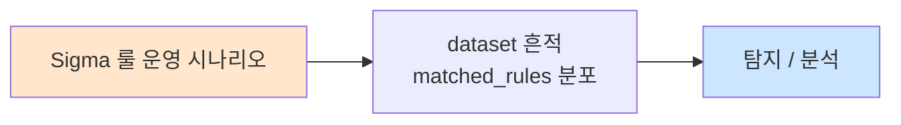

# Week 02: SIEM 고급 상관분석

## 학습 목표
- Wazuh 상관 룰(correlation rule)의 구조와 작성법을 이해한다
- 다중 소스(방화벽, IPS, 웹서버, OS) 이벤트를 연계한 복합 탐지를 구현할 수 있다
- frequency, same_source_ip, if_matched_sid 등 고급 룰 요소를 활용할 수 있다
- 임계치(threshold) 기반 탐지와 시간 윈도우 설정을 수행할 수 있다
- 오탐을 줄이기 위한 룰 튜닝 기법을 적용할 수 있다

## 실습 환경 (공통)

| 서버 | IP | 역할 | 접속 |
|------|-----|------|------|
| bastion | 10.20.30.201 | Control Plane (Bastion) | `ssh ccc@10.20.30.201` (pw: 1) |
| secu | 10.20.30.1 | 방화벽/IPS (nftables, Suricata) | `ssh ccc@10.20.30.1` |
| web | 10.20.30.80 | 웹서버 (JuiceShop:3000, Apache:80) | `ssh ccc@10.20.30.80` |
| siem | 10.20.30.100 | SIEM (Wazuh Dashboard:443, OpenCTI:8080) | `ssh ccc@10.20.30.100` |

**Bastion API:** `http://localhost:9100` / Key: `ccc-api-key-2026`

## 강의 시간 배분 (3시간)

| 시간 | 내용 | 유형 |
|------|------|------|
| 0:00-0:50 | 상관분석 이론 + Wazuh 룰 구조 (Part 1) | 강의 |
| 0:50-1:30 | 고급 룰 요소 + 다중 소스 연계 (Part 2) | 강의/토론 |
| 1:30-1:40 | 휴식 | - |
| 1:40-2:30 | 상관 룰 작성 실습 (Part 3) | 실습 |
| 2:30-3:10 | 룰 튜닝 + Bastion 자동화 (Part 4) | 실습 |
| 3:10-3:20 | 정리 + 과제 안내 | 정리 |

---

## 용어 해설

| 용어 | 영문 | 설명 | 비유 |
|------|------|------|------|
| **상관분석** | Correlation Analysis | 다수 이벤트를 연계하여 패턴을 찾는 분석 기법 | 여러 CCTV 영상을 교차 확인 |
| **frequency** | Frequency | 특정 시간 내 이벤트 발생 횟수 기반 탐지 | "10분에 5번 이상 출입 시도" |
| **if_matched_sid** | Conditional Match | 선행 룰이 매칭된 후에만 동작하는 조건 | "화재 경보 후 스프링클러 작동" |
| **same_source_ip** | Same Source IP | 동일 출발지 IP로부터의 이벤트 그룹핑 | 같은 차량 번호판 추적 |
| **timeframe** | Time Frame | 이벤트 상관분석 시간 윈도우 | "5분 이내에 발생한 일" |
| **composite rule** | Composite Rule | 여러 조건을 결합한 복합 룰 | 여러 단서를 종합한 프로파일링 |
| **임계치** | Threshold | 경보를 발생시키는 기준값 | 온도계의 경고 눈금 |
| **enrichment** | Enrichment | 경보에 추가 컨텍스트를 덧붙이는 것 | 수배서에 전과 기록 추가 |
| **decoder** | Decoder | 로그를 파싱하여 필드를 추출하는 구성 요소 | 외국어 통역사 |

---

# Part 1: 상관분석 이론 + Wazuh 룰 구조 (50분)

## 1.1 상관분석이란?

상관분석(Correlation Analysis)은 **개별 이벤트로는 의미 없지만, 여러 이벤트를 연계하면 위협을 탐지**할 수 있는 고급 분석 기법이다.

### 단일 이벤트 vs 상관분석

```
[단일 이벤트 탐지]
  SSH 로그인 실패 1건 → 의미 없음 (오타 가능)
  방화벽 차단 1건 → 의미 없음 (일상적)
  웹 404 에러 1건 → 의미 없음 (링크 깨짐)

[상관분석 탐지]
  같은 IP에서 5분 내:
    SSH 로그인 실패 10건 + 방화벽 차단 5건 + 포트스캔 탐지
    → "무차별 대입 공격 + 네트워크 정찰" → Critical Alert!
```

### 상관분석의 유형

```
+--[시간 기반]--+   +--[소스 기반]--+   +--[패턴 기반]--+
| - frequency    |   | - same_source  |   | - sequence     |
| - timeframe    |   | - same_dest    |   | - chain        |
| - 슬라이딩윈도 |   | - cross-source |   | - state machine|
+----------------+   +----------------+   +----------------+

+--[통계 기반]--+   +--[행위 기반]--+
| - threshold    |   | - baseline     |
| - anomaly      |   | - deviation    |
| - percentile   |   | - profile      |
+----------------+   +----------------+
```

## 1.2 Wazuh 룰 구조 기초

### 기본 룰 구조

```xml
<!-- /var/ossec/etc/rules/local_rules.xml -->
<group name="custom_correlation,">

  <!-- 기본 룰: 단일 이벤트 매칭 -->
  <rule id="100001" level="5">
    <decoded_as>sshd</decoded_as>
    <match>Failed password</match>
    <description>SSH 로그인 실패</description>
    <group>authentication_failed,</group>
  </rule>

</group>
```

### 핵심 XML 요소

| 요소 | 설명 | 예시 |
|------|------|------|
| `<rule id>` | 룰 고유 번호 (100000-109999 커스텀) | `id="100001"` |
| `<level>` | 경보 심각도 (0-15) | `level="10"` |
| `<decoded_as>` | 디코더 매칭 | `<decoded_as>sshd</decoded_as>` |
| `<match>` | 로그 문자열 매칭 | `<match>Failed password</match>` |
| `<regex>` | 정규표현식 매칭 | `<regex>error \d+</regex>` |
| `<srcip>` | 출발지 IP 매칭 | `<srcip>10.20.30.0/24</srcip>` |
| `<dstip>` | 목적지 IP 매칭 | `<dstip>10.20.30.80</dstip>` |
| `<if_sid>` | 선행 룰 ID 기반 매칭 | `<if_sid>100001</if_sid>` |
| `<frequency>` | 반복 횟수 기반 매칭 | `<frequency>5</frequency>` |
| `<timeframe>` | 시간 윈도우 (초) | `<timeframe>300</timeframe>` |
| `<same_source_ip/>` | 동일 출발지 IP 조건 | `<same_source_ip/>` |
| `<description>` | 경보 설명 | 한글/영문 가능 |
| `<group>` | 룰 그룹 태그 | `<group>brute_force,</group>` |
| `<options>` | 추가 옵션 | `<options>no_email_alert</options>` |

### 레벨 기준

```
Level  0: 무시 (룰 비활성화)
Level  1: 없음
Level  2: 시스템 저수준 알림
Level  3: 성공 이벤트
Level  4: 시스템 저수준 에러
Level  5: 사용자 생성 에러
Level  6: 낮은 관련성 공격
Level  7: "나쁜 단어" 매칭
Level  8: 첫 번째 이벤트
Level  9: 비정상 소스 에러
Level 10: 다수 사용자 에러
Level 11: 무결성 검사 경고
Level 12: 높은 중요도 이벤트 (High)
Level 13: 비정상 에러 (높은 중요도)
Level 14: 높은 중요도 보안 이벤트
Level 15: 심각한 공격 (Critical)
```

## 1.3 상관 룰 핵심 패턴

### 패턴 1: Frequency (빈도 기반)

```xml
<!-- 같은 IP에서 5분 내 SSH 실패 10회 → 무차별 대입 공격 -->
<rule id="100010" level="10" frequency="10" timeframe="300">
  <if_matched_sid>100001</if_matched_sid>
  <same_source_ip/>
  <description>SSH 무차별 대입 공격 탐지 (10회/5분)</description>
  <group>brute_force,correlation,</group>
</rule>
```

### 패턴 2: Chain (체인 연결)

```xml
<!-- SSH 무차별 대입 후 로그인 성공 → 계정 탈취 의심 -->
<rule id="100011" level="13">
  <if_sid>100010</if_sid>
  <match>Accepted password</match>
  <same_source_ip/>
  <description>무차별 대입 후 SSH 로그인 성공 - 계정 탈취 의심!</description>
  <group>credential_compromise,correlation,</group>
</rule>
```

### 패턴 3: Cross-Source (다중 소스)

```xml
<!-- IPS 탐지 + 방화벽 차단 + SSH 시도 = 조직적 공격 -->
<rule id="100020" level="14" frequency="3" timeframe="600">
  <if_matched_group>attack</if_matched_group>
  <same_source_ip/>
  <description>다중 소스 연계: 조직적 공격 탐지</description>
  <group>apt,multi_source_correlation,</group>
</rule>
```

### 패턴 4: Negation (부정 조건)

```xml
<!-- VPN 접속 없이 내부 서버 접근 시도 → 비정상 접근 -->
<rule id="100030" level="12">
  <if_sid>18101</if_sid>
  <match>Accepted</match>
  <srcip>!10.20.30.0/24</srcip>
  <description>외부 IP에서 직접 SSH 접근 - VPN 우회 의심</description>
  <group>policy_violation,</group>
</rule>
```

## 1.4 상관분석 아키텍처

```
[로그 소스들]          [Wazuh Manager]         [경보 출력]
                       상관분석 엔진
+--------+            +----------------+       +----------+
| syslog | ---------> |                |       |           |
+--------+            | 1. Decoder     |       | alerts   |
+--------+            |    (로그 파싱)  | ----> | .json    |
| Apache | ---------> |                |       |           |
+--------+            | 2. Rule Match  |       | alerts   |
+--------+            |    (단일 매칭)  | ----> | .log     |
| Suricata| --------> |                |       |           |
+--------+            | 3. Correlation |       | Wazuh    |
+--------+            |    (상관분석)   | ----> | Dashboard|
| nftables| --------> |                |       |           |
+--------+            | 4. Active Resp |       | API      |
+--------+            |    (자동 대응)  | ----> | Output   |
| auth.log| --------> |                |       |           |
+--------+            +----------------+       +----------+
```

---

# Part 2: 고급 룰 요소 + 다중 소스 연계 (40분)

## 2.1 고급 frequency 활용

### 슬라이딩 윈도우 개념

```
시간축: --|----|----|----|----|----|----|-->
이벤트:   E1   E2   E3   E4   E5   E6

[고정 윈도우] 5분 단위:
  |-- 윈도우1 --|-- 윈도우2 --|
  E1 E2 E3       E4 E5 E6
  → 각 윈도우에서 3건 → 임계치 5 미만 → 미탐지

[슬라이딩 윈도우] 5분 간격:
  |-- 윈도우 --|
     |-- 윈도우 --|
        |-- 윈도우 --|
  → E2~E6 = 5건 → 임계치 5 도달 → 탐지!

Wazuh의 frequency + timeframe = 슬라이딩 윈도우 방식
```

### 고급 frequency 예시

```xml
<!-- 로그인 실패 후 성공 패턴 (Credential Stuffing) -->
<rule id="100040" level="12" frequency="20" timeframe="120">
  <if_matched_sid>5716</if_matched_sid>
  <same_source_ip/>
  <description>2분 내 SSH 인증 실패 20회 - Credential Stuffing</description>
  <mitre>
    <id>T1110.004</id>
  </mitre>
  <group>credential_stuffing,</group>
</rule>

<!-- 다른 계정으로의 반복 실패 (Password Spraying) -->
<rule id="100041" level="13" frequency="5" timeframe="300">
  <if_matched_sid>5716</if_matched_sid>
  <same_source_ip/>
  <not_same_user/>
  <description>5분 내 서로 다른 계정 SSH 실패 5회 - Password Spraying</description>
  <mitre>
    <id>T1110.003</id>
  </mitre>
  <group>password_spraying,</group>
</rule>
```

## 2.2 if_matched_sid / if_matched_group

### 체인 룰 설계

```
[공격 시나리오: 측면 이동 탐지]

Step 1: 포트 스캔 탐지 (Rule 100050)
    ↓
Step 2: 포트 스캔 후 서비스 접근 (Rule 100051)
    ↓
Step 3: 서비스 접근 후 권한 상승 시도 (Rule 100052)
    ↓
Step 4: 종합 → "측면 이동 공격" 판정 (Rule 100053)
```

```xml
<!-- Step 1: 포트 스캔 -->
<rule id="100050" level="6">
  <if_group>scan</if_group>
  <description>포트 스캔 활동 탐지</description>
  <group>recon,step1,</group>
</rule>

<!-- Step 2: 스캔 후 서비스 접근 -->
<rule id="100051" level="8">
  <if_matched_sid>100050</if_matched_sid>
  <match>connection accepted</match>
  <same_source_ip/>
  <timeframe>600</timeframe>
  <description>포트 스캔 후 서비스 접근 시도</description>
  <group>recon,step2,</group>
</rule>

<!-- Step 3: 접근 후 권한 상승 -->
<rule id="100052" level="12">
  <if_matched_sid>100051</if_matched_sid>
  <match>sudo|su |privilege</match>
  <same_source_ip/>
  <timeframe>1800</timeframe>
  <description>서비스 접근 후 권한 상승 시도</description>
  <group>privilege_escalation,step3,</group>
</rule>

<!-- Step 4: 종합 판정 -->
<rule id="100053" level="14">
  <if_matched_sid>100052</if_matched_sid>
  <same_source_ip/>
  <description>측면 이동 공격 체인 탐지 (스캔→접근→권한상승)</description>
  <mitre>
    <id>T1021</id>
  </mitre>
  <group>lateral_movement,critical_chain,</group>
</rule>
```

## 2.3 다중 소스 이벤트 연계

### 소스별 룰 ID 매핑

```
[Suricata IPS]          [nftables 방화벽]      [Wazuh HIDS]
Rule 86601-86700        Rule 88001-88100        Rule 5501-5600
                    \          |           /
                     \         |          /
                      v        v         v
              [상관분석 룰: 100100-100199]
              → 다중 소스 종합 판정
```

```xml
<!-- Suricata 경고 + nftables 차단 + SSH 시도 = 조직적 침투 시도 -->
<rule id="100100" level="14" frequency="3" timeframe="600">
  <if_matched_group>ids,firewall,authentication_failed</if_matched_group>
  <same_source_ip/>
  <description>다중 보안장비 연계: 조직적 침투 시도 탐지</description>
  <group>apt_attempt,multi_vector,</group>
</rule>
```

## 2.4 임계치 설계 원칙

```
[임계치가 너무 낮으면]
  threshold = 3회/5분
  → 정상 사용자의 오타도 경보 → 오탐 폭증
  → 경보 피로 → 분석가가 무시하기 시작
  → 실제 공격도 놓침

[임계치가 너무 높으면]
  threshold = 100회/5분
  → 느린 공격(Low & Slow) 탐지 불가
  → 공격자가 탐지 회피 가능
  → 미탐 증가

[적정 임계치 설정 방법]
  1. 베이스라인 측정: 정상 상태 이벤트 빈도 파악
  2. 표준편차 적용: 평균 + 2~3 시그마
  3. 테스트: 과거 데이터로 검증
  4. 튜닝: 오탐/미탐 비율 모니터링 후 조정
```

| 공격 유형 | 권장 frequency | 권장 timeframe | 근거 |
|-----------|---------------|---------------|------|
| SSH 무차별 대입 | 10회 | 300초 | 정상 사용자 3회 이하 |
| 웹 스캔 | 30회 | 60초 | 정상 웹 요청 빈도 대비 |
| Password Spraying | 5회 | 300초 | 계정 수 기준 |
| DDoS | 1000회 | 60초 | 네트워크 기준선 대비 |
| 포트 스캔 | 20포트 | 120초 | 정상 서비스 접근 패턴 |

---

# Part 3: 상관 룰 작성 실습 (50분)

## 3.1 SSH 무차별 대입 + 성공 탐지 룰

> **실습 목적**: 가장 기본적인 상관 룰인 "반복 실패 후 성공" 패턴을 작성한다.
>
> **배우는 것**: frequency, timeframe, same_source_ip, if_matched_sid 활용법
>
> **실전 활용**: 이 패턴은 SSH뿐 아니라 웹 로그인, VPN, RDP 등 모든 인증 시스템에 적용 가능

```bash
# siem 서버 접속
ssh ccc@10.20.30.100

# 커스텀 룰 파일 백업
sudo cp /var/ossec/etc/rules/local_rules.xml \
        /var/ossec/etc/rules/local_rules.xml.bak.$(date +%Y%m%d)

# SSH 상관 룰 작성
sudo tee /var/ossec/etc/rules/local_rules.xml << 'RULES'
<group name="local,sshd,correlation,">

  <!-- SSH 로그인 실패 (기본 룰 5716 기반) -->
  <rule id="100001" level="5">
    <if_sid>5716</if_sid>
    <description>SSH 인증 실패 탐지</description>
    <group>authentication_failed,ssh,</group>
  </rule>

  <!-- SSH 무차별 대입: 5분 내 10회 실패 -->
  <rule id="100002" level="10" frequency="10" timeframe="300">
    <if_matched_sid>100001</if_matched_sid>
    <same_source_ip/>
    <description>[상관] SSH 무차별 대입 공격 (10회/5분)</description>
    <mitre>
      <id>T1110.001</id>
    </mitre>
    <group>brute_force,ssh,correlation,</group>
  </rule>

  <!-- 무차별 대입 후 SSH 로그인 성공 = 계정 탈취! -->
  <rule id="100003" level="14">
    <if_matched_sid>100002</if_matched_sid>
    <decoded_as>sshd</decoded_as>
    <match>Accepted</match>
    <same_source_ip/>
    <description>[CRITICAL] 무차별 대입 후 SSH 로그인 성공 - 계정 탈취!</description>
    <mitre>
      <id>T1078</id>
    </mitre>
    <group>credential_compromise,ssh,critical_alert,</group>
  </rule>

</group>
RULES

# 룰 문법 검사
sudo /var/ossec/bin/wazuh-analysisd -t
echo "Exit code: $?"
```

> **명령어 해설**:
> - `wazuh-analysisd -t`: 룰 문법 검증 (서비스 재시작 없이 테스트)
> - `if_matched_sid`: 선행 룰이 발동된 상태에서만 이 룰을 검사
> - `frequency="10"`: 선행 룰이 10번 매칭되어야 발동
> - `same_source_ip/`: 모든 이벤트가 같은 출발지 IP에서 온 경우만
>
> **트러블슈팅**:
> - "Duplicated rule id" → 기존 local_rules.xml에 같은 ID가 있는지 확인
> - "Invalid rule" → XML 태그 닫힘 확인, 특수문자 이스케이프 확인

## 3.2 룰 테스트 - 공격 시뮬레이션

```bash
# bastion 서버에서 SSH 무차별 대입 시뮬레이션
# (siem 서버의 Wazuh가 탐지하도록)

# 먼저 siem에서 Wazuh 재시작 (새 룰 적용)
ssh ccc@10.20.30.100 "sudo systemctl restart wazuh-manager"

# 5초 대기
sleep 5

# SSH 실패 시뮬레이션 (존재하지 않는 계정으로 시도)
echo "=== SSH 무차별 대입 시뮬레이션 시작 ==="
for i in $(seq 1 15); do
    sshpass -p wrong_password ssh -o StrictHostKeyChecking=no \
        -o ConnectTimeout=3 fake_ccc@10.20.30.100 \
        "echo test" 2>/dev/null
    echo "시도 $i/15 완료"
done

echo "=== 시뮬레이션 완료, 경보 확인 중... ==="
sleep 3

# siem에서 경보 확인
ssh ccc@10.20.30.100 << 'EOF'
echo "=== 최근 SSH 관련 경보 ==="
tail -50 /var/ossec/logs/alerts/alerts.log 2>/dev/null | \
  grep -A2 "Rule: 100" || echo "(커스텀 룰 경보 없음 - 기본 룰 확인)"

echo ""
echo "=== 최근 경보 (JSON) ==="
tail -5 /var/ossec/logs/alerts/alerts.json 2>/dev/null | \
  python3 -c "
import sys, json
for line in sys.stdin:
    try:
        alert = json.loads(line.strip())
        rule = alert.get('rule', {})
        print(f\"Rule {rule.get('id','?'):>6s} (L{rule.get('level','?'):>2s}): {rule.get('description','?')}\")
    except: pass
"
EOF
```

> **결과 해석**: Rule 100002가 발동했다면 frequency+timeframe 상관분석이 정상 작동하는 것이다. Rule 100003이 발동했다면 체인 룰도 정상이다 (실제 성공 로그가 있어야 함).
>
> **트러블슈팅**:
> - 경보가 안 나오면 → `wazuh-manager` 재시작 확인, 로그 수집 경로 확인
> - 기본 룰만 나오면 → `local_rules.xml` 문법 확인, Rule ID 충돌 확인

## 3.3 웹 공격 상관 룰

```bash
# siem 서버에서 웹 공격 상관 룰 추가
ssh ccc@10.20.30.100 << 'REMOTE'

# 웹 공격 상관 룰 추가
sudo tee -a /var/ossec/etc/rules/local_rules.xml << 'RULES'

<group name="local,web,correlation,">

  <!-- 웹 디렉토리 스캔: 1분 내 404 에러 30회 -->
  <rule id="100101" level="8" frequency="30" timeframe="60">
    <if_sid>31101</if_sid>
    <same_source_ip/>
    <description>[상관] 웹 디렉토리 스캔 탐지 (404 x 30/1분)</description>
    <mitre>
      <id>T1595.002</id>
    </mitre>
    <group>web_scan,recon,correlation,</group>
  </rule>

  <!-- SQL Injection 시도 반복: 5분 내 5회 -->
  <rule id="100102" level="12" frequency="5" timeframe="300">
    <if_sid>31103,31104,31105</if_sid>
    <same_source_ip/>
    <description>[상관] SQL Injection 반복 시도 (5회/5분)</description>
    <mitre>
      <id>T1190</id>
    </mitre>
    <group>sqli,web_attack,correlation,</group>
  </rule>

  <!-- XSS 시도 후 세션 탈취 의심 -->
  <rule id="100103" level="13">
    <if_matched_group>xss</if_matched_group>
    <match>Set-Cookie|session|token</match>
    <same_source_ip/>
    <description>[상관] XSS 후 세션 탈취 의심</description>
    <mitre>
      <id>T1189</id>
    </mitre>
    <group>xss,session_hijack,correlation,</group>
  </rule>

  <!-- 웹 스캔 + SQL Injection = 체계적 웹 공격 -->
  <rule id="100104" level="14">
    <if_matched_sid>100101</if_matched_sid>
    <if_matched_sid>100102</if_matched_sid>
    <same_source_ip/>
    <timeframe>1800</timeframe>
    <description>[CRITICAL] 체계적 웹 공격 탐지 (스캔+SQLi)</description>
    <group>web_attack,apt_web,critical_alert,</group>
  </rule>

</group>
RULES

# 룰 문법 검사
sudo /var/ossec/bin/wazuh-analysisd -t
echo "Exit code: $?"

REMOTE
```

> **실습 목적**: 웹 공격 시나리오에 맞는 다단계 상관 룰을 작성하여, 단순 스캔과 실제 공격을 구분한다.

## 3.4 다중 소스 연계 룰 - Suricata + Wazuh

```bash
ssh ccc@10.20.30.100 << 'REMOTE'

# 다중 소스 상관 룰
sudo tee -a /var/ossec/etc/rules/local_rules.xml << 'RULES'

<group name="local,multi_source,correlation,">

  <!-- Suricata IPS 경고 후 방화벽 차단 = 공격 시도 확인 -->
  <rule id="100201" level="10">
    <if_group>ids</if_group>
    <match>Drop|BLOCK|denied</match>
    <same_source_ip/>
    <timeframe>120</timeframe>
    <description>[다중소스] IPS 탐지 + 방화벽 차단 연계</description>
    <group>ids_fw_correlation,</group>
  </rule>

  <!-- IPS 탐지 + 방화벽 차단 실패(통과) = 침투 성공 의심 -->
  <rule id="100202" level="14">
    <if_group>ids</if_group>
    <match>Accept|ALLOW|pass</match>
    <same_source_ip/>
    <timeframe>120</timeframe>
    <description>[CRITICAL] IPS 탐지되었으나 방화벽 통과 - 침투 의심!</description>
    <group>fw_bypass,critical_alert,</group>
  </rule>

  <!-- 외부 IP에서 IPS + 웹서버 + SSH 동시 접근 = APT 의심 -->
  <rule id="100203" level="15" frequency="5" timeframe="900">
    <if_matched_group>ids,web_attack,authentication_failed</if_matched_group>
    <same_source_ip/>
    <srcip>!10.20.30.0/24</srcip>
    <description>[APT] 외부 IP 다중 벡터 공격 탐지</description>
    <mitre>
      <id>T1190</id>
    </mitre>
    <group>apt,multi_vector,critical_alert,</group>
  </rule>

</group>
RULES

sudo /var/ossec/bin/wazuh-analysisd -t
echo "Exit code: $?"
sudo systemctl restart wazuh-manager

REMOTE
```

> **배우는 것**: `if_group`으로 여러 그룹(ids, web_attack, authentication_failed)의 이벤트를 동시에 조건으로 거는 방법. 이것이 진정한 다중 소스 상관분석이다.

## 3.5 wazuh-logtest로 룰 검증

```bash
# siem 서버에서 logtest 도구로 룰 매칭 검증
ssh ccc@10.20.30.100 << 'EOF'

# 테스트 로그 입력으로 룰 매칭 확인
echo 'Apr  4 10:15:23 web sshd[12345]: Failed password for invalid user admin from 192.168.1.100 port 54321 ssh2' | \
  sudo /var/ossec/bin/wazuh-logtest -q 2>/dev/null | tail -20

echo "---"

echo 'Apr  4 10:15:23 web sshd[12345]: Accepted password for root from 192.168.1.100 port 54322 ssh2' | \
  sudo /var/ossec/bin/wazuh-logtest -q 2>/dev/null | tail -20

EOF
```

> **명령어 해설**: `wazuh-logtest`는 실제 로그를 넣어서 어떤 디코더와 룰이 매칭되는지 확인하는 디버깅 도구다. 새 룰을 작성한 후 반드시 이 도구로 검증해야 한다.

---

# Part 4: 룰 튜닝 + Bastion 자동화 (40분)

## 4.1 오탐 분석 및 튜닝

```bash
# 최근 경보에서 오탐 패턴 분석
ssh ccc@10.20.30.100 << 'EOF'
echo "=== 최근 24시간 경보 Rule ID 분포 ==="
cat /var/ossec/logs/alerts/alerts.json 2>/dev/null | \
  python3 -c "
import sys, json
from collections import Counter

rule_counter = Counter()
for line in sys.stdin:
    try:
        alert = json.loads(line.strip())
        rid = alert.get('rule', {}).get('id', 'unknown')
        desc = alert.get('rule', {}).get('description', 'unknown')
        rule_counter[f'{rid}: {desc[:40]}'] += 1
    except:
        pass

print(f'총 고유 룰: {len(rule_counter)}개')
print(f'총 경보: {sum(rule_counter.values())}건')
print()
for rule, count in rule_counter.most_common(15):
    pct = count / sum(rule_counter.values()) * 100
    bar = '#' * min(int(pct), 40)
    print(f'  {count:5d} ({pct:5.1f}%) {rule} {bar}')
"
EOF
```

> **결과 해석**: 상위 3개 룰이 전체 경보의 50% 이상을 차지하면 해당 룰의 임계치를 조정하거나, 정상 패턴을 화이트리스트에 추가해야 한다.

### 화이트리스트 룰 작성

```xml
<!-- 오탐 제거: 내부 모니터링 시스템의 반복 접근 제외 -->
<rule id="100900" level="0">
  <if_sid>100002</if_sid>
  <srcip>10.20.30.201</srcip>
  <description>화이트리스트: Bastion 모니터링 SSH 접근</description>
</rule>

<!-- 오탐 제거: 스케줄 작업의 정기 점검 제외 -->
<rule id="100901" level="0">
  <if_sid>100101</if_sid>
  <srcip>10.20.30.201</srcip>
  <time>02:00-04:00</time>
  <description>화이트리스트: 새벽 자동 점검 웹 스캔</description>
</rule>
```

## 4.2 룰 성능 모니터링

```bash
# 룰 매칭 성능 확인
ssh ccc@10.20.30.100 << 'EOF'
echo "=== Wazuh 분석 엔진 상태 ==="
sudo /var/ossec/bin/wazuh-analysisd -s 2>/dev/null | head -30

echo ""
echo "=== 처리량 (events/sec) ==="
sudo cat /var/ossec/var/run/wazuh-analysisd.state 2>/dev/null | \
  grep -E "events_received|events_dropped|alerts_written" || \
  echo "(상태 파일 없음)"

echo ""
echo "=== 경보 로그 크기 ==="
du -sh /var/ossec/logs/alerts/ 2>/dev/null
ls -la /var/ossec/logs/alerts/alerts.json 2>/dev/null
EOF
```

## 4.3 Bastion를 활용한 상관 룰 배포 자동화

```bash
export BASTION_API_KEY="ccc-api-key-2026"

# 프로젝트 생성 - 상관 룰 배포
PROJECT_ID=$(curl -s -X POST http://localhost:9100/projects \
  -H "Content-Type: application/json" \
  -H "X-API-Key: $BASTION_API_KEY" \
  -d '{
    "name": "correlation-rule-deploy",
    "request_text": "SIEM 상관 룰 배포 및 검증",
    "master_mode": "external"
  }' | python3 -c "import sys,json; print(json.load(sys.stdin)['id'])")

echo "Project: $PROJECT_ID"

# Stage 전환
curl -s -X POST "http://localhost:9100/projects/$PROJECT_ID/plan" \
  -H "X-API-Key: $BASTION_API_KEY"
curl -s -X POST "http://localhost:9100/projects/$PROJECT_ID/execute" \
  -H "X-API-Key: $BASTION_API_KEY"

# 다중 서버 점검 자동화
curl -s -X POST "http://localhost:9100/projects/$PROJECT_ID/execute-plan" \
  -H "Content-Type: application/json" \
  -H "X-API-Key: $BASTION_API_KEY" \
  -d '{
    "tasks": [
      {
        "order": 1,
        "instruction_prompt": "wazuh-analysisd -t 2>&1 | tail -5 && echo RULE_CHECK_OK",
        "risk_level": "low",
        "subagent_url": "http://10.20.30.100:8002"
      },
      {
        "order": 2,
        "instruction_prompt": "grep -c \"<rule id\" /var/ossec/etc/rules/local_rules.xml && echo CUSTOM_RULES_COUNT",
        "risk_level": "low",
        "subagent_url": "http://10.20.30.100:8002"
      },
      {
        "order": 3,
        "instruction_prompt": "tail -20 /var/ossec/logs/alerts/alerts.log | grep -c \"Rule:\" && echo RECENT_ALERTS",
        "risk_level": "low",
        "subagent_url": "http://10.20.30.100:8002"
      }
    ],
    "subagent_url": "http://10.20.30.100:8002"
  }'

# 결과 확인
sleep 3
curl -s -H "X-API-Key: $BASTION_API_KEY" \
  "http://localhost:9100/projects/$PROJECT_ID/evidence/summary" | \
  python3 -m json.tool
```

> **실전 활용**: 상관 룰 변경을 Bastion 프로젝트로 관리하면 변경 이력(evidence)이 자동 기록되어 감사 추적이 가능하다. 여러 SIEM에 동일 룰을 배포할 때 일관성을 보장한다.

## 4.4 상관분석 효과 측정

```bash
cat << 'SCRIPT' > /tmp/correlation_effectiveness.py
#!/usr/bin/env python3
"""상관분석 룰 효과 측정"""

# 시뮬레이션 데이터
data = {
    "단일 룰만 사용": {
        "전체_경보": 5000,
        "오탐": 4200,
        "실제_위협_탐지": 50,
        "미탐": 30,
    },
    "상관분석 추가": {
        "전체_경보": 800,
        "오탐": 150,
        "실제_위협_탐지": 72,
        "미탐": 8,
    },
}

print("=" * 65)
print("  상관분석 도입 전후 효과 비교")
print("=" * 65)
print(f"\n{'지표':20s} {'단일 룰':>12s} {'상관분석':>12s} {'개선':>10s}")
print("-" * 60)

for metric in ["전체_경보", "오탐", "실제_위협_탐지", "미탐"]:
    before = data["단일 룰만 사용"][metric]
    after = data["상관분석 추가"][metric]
    change = (after - before) / before * 100
    sign = "+" if change > 0 else ""
    print(f"{metric:20s} {before:>12,d} {after:>12,d} {sign}{change:>8.1f}%")

# KPI 계산
for scenario, d in data.items():
    fp_rate = d["오탐"] / d["전체_경보"] * 100
    detect_rate = d["실제_위협_탐지"] / (d["실제_위협_탐지"] + d["미탐"]) * 100
    precision = d["실제_위협_탐지"] / (d["전체_경보"] - d["오탐"]) * 100 if (d["전체_경보"] - d["오탐"]) > 0 else 0

    print(f"\n--- {scenario} ---")
    print(f"  오탐률:  {fp_rate:.1f}%")
    print(f"  탐지율:  {detect_rate:.1f}%")
    print(f"  정밀도:  {precision:.1f}%")

print("\n→ 상관분석 도입으로 경보 84% 감소, 탐지율 10%p 향상")
SCRIPT

python3 /tmp/correlation_effectiveness.py
```

---

## 체크리스트

- [ ] 상관분석의 개념과 단일 이벤트 탐지의 한계를 설명할 수 있다
- [ ] Wazuh 룰 XML 구조의 핵심 요소를 알고 있다
- [ ] frequency + timeframe 조합으로 빈도 기반 룰을 작성할 수 있다
- [ ] if_matched_sid를 사용하여 체인 룰을 구성할 수 있다
- [ ] same_source_ip의 역할과 사용 시점을 이해한다
- [ ] 다중 소스(IPS+방화벽+HIDS) 연계 룰을 설계할 수 있다
- [ ] 임계치 설정 원칙(베이스라인, 시그마, 테스트, 튜닝)을 알고 있다
- [ ] wazuh-logtest로 룰 매칭을 검증할 수 있다
- [ ] 화이트리스트 룰로 오탐을 제거할 수 있다
- [ ] Bastion로 룰 배포를 자동화할 수 있다

---

## 과제

### 과제 1: 브루트포스 연계 상관 룰 세트 (필수)

다음 시나리오를 탐지하는 상관 룰 세트를 작성하라:
1. SSH 무차별 대입 탐지 (10회/5분)
2. 무차별 대입 성공 후 sudo 사용 탐지
3. sudo 사용 후 민감 파일(/etc/shadow, /etc/passwd) 접근 탐지
4. 전체 체인을 연결한 "계정 탈취 + 권한 상승" 종합 룰

**제출물**: local_rules.xml 파일 + wazuh-logtest 검증 결과 스크린샷

### 과제 2: 오탐 분석 보고서 (선택)

실습 환경에서 24시간 동안 발생한 경보를 분석하여:
1. 상위 5개 경보 룰과 발생 건수
2. 각 룰의 오탐 여부 판단 (증거 포함)
3. 오탐 제거를 위한 화이트리스트 룰 제안
4. 예상 오탐률 개선 효과

---

## 다음 주 예고

**Week 03: SIGMA 룰 심화**에서는 SIEM 벤더에 독립적인 SIGMA 룰의 고급 문법을 학습하고, Wazuh/Splunk/ELK용으로 변환하는 방법을 실습한다.

---

## 웹 UI 실습

### Wazuh Dashboard 고급 검색 — 상관분석 경보 확인

> **접속 URL:** `https://10.20.30.100:443`

1. 브라우저에서 `https://10.20.30.100:443` 접속 → 로그인
2. 좌측 **Modules → Security events** 클릭
3. 검색바에 다음 KQL로 상관 룰 경보만 필터링:
   ```
   rule.id >= 100000
   ```
4. **Add filter** → `rule.groups` contains `correlation` 추가
5. 개별 경보 클릭 → **Rule** 탭에서 상관 룰 구조(if_matched_sid, frequency 등) 확인
6. **Discover** 탭에서 시간축 히스토그램으로 경보 빈도 패턴 분석
7. 우측 **Fields** 패널에서 `rule.description`, `agent.name`, `data.srcip` 컬럼 추가

### OpenCTI STIX 분석 — IOC 조회

> **접속 URL:** `http://10.20.30.100:8080`

1. `http://10.20.30.100:8080` 접속 → 로그인
2. **Observations → Indicators** 클릭하여 등록된 IOC 목록 확인
3. 특정 IP/도메인 IOC 클릭 → **Knowledge** 탭에서 연관 캠페인/악성코드 관계 확인
4. 상관 룰에서 탐지한 IP를 OpenCTI에서 검색하여 위협 컨텍스트 파악

---

## 📂 실습 참조 파일 가이드

> 이번 주 실습에서 **실제로 조작하는** 솔루션의 기능·경로·파일·설정·UI 요점입니다.

### Wazuh SIEM (4.11.x)
> **역할:** 에이전트 기반 로그·FIM·SCA 통합 분석 플랫폼  
> **실행 위치:** `siem (10.20.30.100)`  
> **접속/호출:** Dashboard `https://10.20.30.100` (admin/admin), Manager API `:55000`

**주요 경로·파일**

| 경로 | 역할 |
|------|------|
| `/var/ossec/etc/ossec.conf` | Manager 메인 설정 (원격, 전송, syscheck 등) |
| `/var/ossec/etc/rules/local_rules.xml` | 커스텀 룰 (id ≥ 100000) |
| `/var/ossec/etc/decoders/local_decoder.xml` | 커스텀 디코더 |
| `/var/ossec/logs/alerts/alerts.json` | 실시간 JSON 알림 스트림 |
| `/var/ossec/logs/archives/archives.json` | 전체 이벤트 아카이브 |
| `/var/ossec/logs/ossec.log` | Manager 데몬 로그 |
| `/var/ossec/queue/fim/db/fim.db` | FIM 기준선 SQLite DB |

**핵심 설정·키**

- `<rule id='100100' level='10'>` — 커스텀 룰 — level 10↑은 고위험
- `<syscheck><directories>...` — FIM 감시 경로
- `<active-response>` — 자동 대응 (firewall-drop, restart)

**로그·확인 명령**

- `jq 'select(.rule.level>=10)' alerts.json` — 고위험 알림만
- `grep ERROR ossec.log` — Manager 오류 (룰 문법 오류 등)

**UI / CLI 요점**

- Dashboard → Security events — KQL 필터 `rule.level >= 10`
- Dashboard → Integrity monitoring — 변경된 파일 해시 비교
- `/var/ossec/bin/wazuh-logtest` — 룰 매칭 단계별 확인 (Phase 1→3)
- `/var/ossec/bin/wazuh-analysisd -t` — 룰·설정 문법 검증

> **해석 팁.** Phase 3에서 원하는 `rule.id`가 떠야 커스텀 룰 정상. `local_rules.xml` 수정 후 `systemctl restart wazuh-manager`, 문법 오류가 있으면 **분석 데몬 전체가 기동 실패**하므로 `-t`로 먼저 검증.

---

## 실제 사례 (WitFoo Precinct 6 — Sigma 룰 운영)

> 출처: WitFoo Precinct 6 Cybersecurity Dataset (Apache 2.0)
> 본 lecture *Sigma 룰 운영* 학습 항목 매칭.

### Sigma 룰 운영 의 dataset 흔적 — "matched_rules 분포"

dataset 의 정상 운영에서 *matched_rules 분포* 신호의 baseline 을 알아두면, *Sigma 룰 운영* 시도 시 발생하는 anomaly 를 정량으로 탐지할 수 있다. 핵심 정량 지표는 — Sigma → SIEM converter.



### Case 1: dataset 정량 지표

| 항목 | 값 |
|---|---|
| 핵심 신호 | matched_rules 분포 |
| 정량 baseline | Sigma → SIEM converter |
| 학습 매핑 | Sigma DaC pipeline |

**자세한 해석**: Sigma DaC pipeline. 이 차이를 정량으로 측정해야 *공격 시도와 정상 운영의 구분* 이 가능. 학생이 baseline 숫자를 외워두면 — 운영 환경에서 anomaly 를 즉시 탐지할 수 있다.

### Case 2: 실전 적용 시나리오

| 단계 | dataset 활용 |
|---|---|
| 시도 식별 | matched_rules 분포 의 spike |
| 정상 vs 이상 | baseline 대비 비율 |
| 룰 작성 | Suricata / Wazuh / Sigma |
| 검증 | dataset 재실행 |

**자세한 해석**: 운영 환경 룰 작성은 — *baseline 측정 → 임계 결정 → 룰 작성 → dataset 검증* 의 4 단계. 한 단계라도 빠지면 false positive 폭증.

### 이 사례에서 학생이 배워야 할 3가지

1. **Sigma 룰 운영 = matched_rules 분포 의 anomaly** — 정량 신호로 탐지.
2. **baseline 숫자 외우기** — Sigma → SIEM converter.
3. **4 단계 룰 작성** — 측정 → 임계 → 룰 → 검증.

**학생 액션**: GitHub sigma-rules CI.


---

## 부록: 학습 OSS 도구 매트릭스 (Course14 SOC Advanced — Week 02 SIEM 고급 상관분석·튜닝·DaC)

> 이 부록은 lab `soc-adv-ai/week02.yaml` (15 step + multi_task) 의 모든 명령을
> 실제로 실행 가능한 형태로 도구·옵션·예상 출력·해석을 정리한다. Wazuh 의 frequency/
> timeframe/if_matched_sid 등 고급 룰 요소 + 다중 소스 (방화벽 + IPS + OS) 결합 +
> 오탐 튜닝 + Sigma DaC (Detection-as-Code) + Git 버전관리 + ATT&CK 매핑을 다룬다.

### lab step → 도구·룰 매핑 표

| step | 학습 항목 | 핵심 OSS 도구 / 명령 | ATT&CK |
|------|----------|---------------------|--------|
| s1 | Wazuh 룰 XML 구조 (level/frequency/if_sid) | `/var/ossec/ruleset/rules/`, `xmlstarlet`, `wazuh-logtest` | - |
| s2 | SSH 브루트포스 룰 분석 (sshd_rules.xml) | grep, sed, frequency 시그니처 | T1110.001 |
| s3 | 포트스캔 상관 룰 (3분 / 5회 / 다른 포트) | local_rules.xml, frequency + same_source_ip | T1046 |
| s4 | 다단계 공격 시나리오 (recon→breach→privesc→exfil) | mermaid + atomic-red-team + wazuh-logtest | T1595/T1078/T1548/T1041 |
| s5 | 웹 공격 상관 (SQLi 3 + XSS 2 / 1분) | local_rules.xml + ModSecurity 통합 | T1190 |
| s6 | 시간 기반 (22-06 admin login) | wodle command + cron, time 필드 매칭 | T1078 |
| s7 | GeoIP 기반 (해외 IP login) | MaxMind GeoLite2 + geoip2 module | T1078.004 |
| s8 | 오탐 튜닝 (예외 처리) | if_matched_sid + frequency 조정, alert_by_email | - |
| s9 | 알림 우선순위 (Wazuh level → SOC Tier) | level 0-15 → Tier 1/2/3 매핑 표 + SLA | - |
| s10 | Suricata + Wazuh 결합 (네트워크+호스트) | wodle command, location 매칭, decoder eve | T1071/T1190 |
| s11 | Dashboard 메트릭 쿼리 | Wazuh API + OpenSearch DSL + jq | - |
| s12 | 룰 테스트 (wazuh-logtest) | `wazuh-logtest`, sample log injection | - |
| s13 | 룰 성능 영향 (CPU/Mem) | `wazuh-stats`, `ps`, `top`, perf | - |
| s14 | 룰 버전관리 (DaC + Git) | git + pre-commit + sigma-cli + GitHub Actions | - |
| s15 | 종합 상관분석 보고서 (ATT&CK 매핑) | ATT&CK Navigator JSON + DETT&CT | - |
| s99 | 통합 다단계 (s1→s2→s3→s4→s5) | Bastion plan: 룰 분석 → 작성 → 시나리오 → 웹 룰 | 다중 |

### 학생 환경 준비 (Wazuh 룰 작성 + Sigma + Git DaC 풀세트)

```bash
# === [s1·s2] Wazuh 룰 분석 ===
ssh ccc@10.20.30.100
sudo ls /var/ossec/ruleset/rules/ | head -20
# 0010-rules_config.xml
# 0015-ossec_rules.xml
# 0020-syslog_rules.xml
# 0025-sendmail_rules.xml
# ...
# 0095-sshd_rules.xml         ← s2 분석 대상

# XML 처리 도구
sudo apt install -y xmlstarlet libxml2-utils

xmlstarlet sel -t -m "//rule" -v "concat(@id, ' ', @level, ' ', description)" -n \
  /var/ossec/ruleset/rules/0095-sshd_rules.xml | head

# 룰 검색 — sid by 키워드
sudo grep -rl "frequency" /var/ossec/ruleset/rules/ | head
sudo grep -A3 -B1 "Multiple authentication failures" /var/ossec/ruleset/rules/0095-sshd_rules.xml

# === [s3·s5·s6·s7] 룰 작성 환경 ===
# local_rules.xml 편집
sudo cp /var/ossec/etc/rules/local_rules.xml /var/ossec/etc/rules/local_rules.xml.bak.$(date +%F)
sudo vi /var/ossec/etc/rules/local_rules.xml

# 룰 검증
sudo /var/ossec/bin/wazuh-control restart
sudo tail -f /var/ossec/logs/ossec.log | grep -i error

# === [s7] GeoIP ===
sudo mkdir -p /var/ossec/etc/lists/
sudo wget -O /tmp/GeoLite2-Country.tar.gz "https://download.maxmind.com/app/geoip_download?edition_id=GeoLite2-Country&license_key=YOUR_KEY&suffix=tar.gz"
sudo tar -xzf /tmp/GeoLite2-Country.tar.gz -C /var/ossec/etc/lists/

# Wazuh ossec.conf 의 geoip2 module 활성화
sudo vi /var/ossec/etc/ossec.conf
# <wazuh_modules>
#   <geoip2>
#     <enabled>yes</enabled>
#     <database>/var/ossec/etc/lists/GeoLite2-Country_*/GeoLite2-Country.mmdb</database>
#   </geoip2>
# </wazuh_modules>

# === [s12] 룰 테스트 ===
sudo /var/ossec/bin/wazuh-logtest

# === [s14] DaC (Sigma + Git) ===
sudo apt install -y git pre-commit
pip install --user sigma-cli pysigma pysigma-backend-elastic

# Sigma 룰 → Wazuh 형식 (3rd party backend)
pip install --user pysigma-backend-wazuh
git clone https://github.com/SigmaHQ/sigma /tmp/sigma
sigma convert -t wazuh -p wazuh_default /tmp/sigma/rules/cloud/aws/aws_console_login_no_mfa.yml

# === [s4·s10] Atomic Red Team — 시뮬레이션 ===
git clone https://github.com/redcanaryco/atomic-red-team /tmp/atomic
sudo apt install -y powershell
pwsh -c "Import-Module /tmp/atomic/PathToAtomicsFolder/Invoke-AtomicRedTeam.psm1"

# === [s11·s15] Wazuh API + ATT&CK Navigator ===
TOKEN=$(curl -sk -u wazuh:wazuh -X POST "https://10.20.30.100:55000/security/user/authenticate?raw=true")
git clone https://github.com/mitre-attack/attack-navigator /tmp/nav
cd /tmp/nav/nav-app && npm install && npm run start &

# === [s15] DeTT&CT — 탐지 coverage 평가 ===
git clone https://github.com/rabobank-cdc/DeTTECT /tmp/dettect
cd /tmp/dettect && pip install -r requirements.txt
python dettect.py editor

# === [s14] pre-commit + GitHub Actions ===
mkdir ~/wazuh-rules-repo && cd ~/wazuh-rules-repo
git init
cp /var/ossec/etc/rules/local_rules.xml ./
cat > .pre-commit-config.yaml << 'YML'
repos:
- repo: local
  hooks:
    - id: wazuh-syntax
      name: Wazuh XML syntax
      entry: xmllint --noout
      language: system
      files: \.xml$
- repo: https://github.com/SigmaHQ/sigma-cli
  rev: v1.0.0
  hooks:
    - id: sigma
YML
pre-commit install
```

### 핵심 도구별 상세 사용법

#### 도구 1: Wazuh 룰 XML 구조 (Step 1·2)

```bash
# === 룰의 11 핵심 element ===
cat << 'XML'
<rule id="100501" level="10" frequency="5" timeframe="180" ignore="60">
  <if_sid>5712</if_sid>                    <!-- 매칭 시 trigger 룰 -->
  <if_matched_sid>5712</if_matched_sid>    <!-- 같은 룰이 N 번 매칭될 때 -->
  <same_source_ip />                        <!-- 동일 소스 IP 조건 -->
  <same_user />                             <!-- 동일 사용자 조건 -->
  <different_url />                         <!-- 다른 URL 조건 -->
  <description>SSH brute force from same IP</description>
  <group>authentication_failures,pci_dss_10.2.4,gdpr_IV_35.7.d,</group>
  <mitre>
    <id>T1110.001</id>
  </mitre>
  <options>alert_by_email</options>
</rule>
XML

# === 0095-sshd_rules.xml 의 SSH 브루트포스 룰 ===
sudo cat /var/ossec/ruleset/rules/0095-sshd_rules.xml | grep -A 8 "5712"
# <rule id="5712" level="10" frequency="8" timeframe="120">
#   <if_matched_sid>5710</if_matched_sid>
#   <same_source_ip />
#   <description>sshd: brute force trying to get access to the system.</description>
#   <mitre>
#     <id>T1110.001</id>
#   </mitre>
#   <group>authentication_failures,...</group>
# </rule>

# 5710 (single failure) → 5712 (8회 / 120초 / same source ip) 의 layered 구조

# === 룰 분류 (level 0-15) ===
# 0    Ignored (no alert)
# 1-3  Notification (debug)
# 4-6  Low (informational)
# 7-9  Medium (suspicious)
# 10-12 High (compromise indicators)
# 13-15 Critical (immediate action)

# === 룰 ID 범위 (예약) ===
# 0-99999       Wazuh built-in
# 100000-199999 사용자 정의 (권장)
# 200000+       특수 통합 (Office365 등)

# === xmlstarlet 으로 룰 분석 ===
xmlstarlet sel -t -m "//rule[@level >= 10]" \
  -v "concat(@id, '|', @level, '|', description)" -n \
  /var/ossec/ruleset/rules/*.xml | head -20
```

#### 도구 2: 포트스캔 상관 룰 작성 (Step 3)

```bash
# 동일 IP / 3분 / 5회 / 다른 포트 → 포트스캔
sudo tee -a /var/ossec/etc/rules/local_rules.xml << 'XML'

<group name="local,custom,scan,">
  <!-- 단일 포트 연결 시도 (방화벽 또는 이상 트래픽 로그) -->
  <rule id="100100" level="3">
    <if_sid>4100</if_sid>
    <description>Connection attempt detected</description>
  </rule>

  <!-- 포트스캔: 3분 / 5회 / 동일 IP / 다른 포트 -->
  <rule id="100101" level="10" frequency="5" timeframe="180">
    <if_matched_sid>100100</if_matched_sid>
    <same_source_ip />
    <different_url />
    <description>Port scan detected from same source IP</description>
    <mitre>
      <id>T1046</id>
    </mitre>
    <group>portscan,recon,attack,</group>
    <options>alert_by_email</options>
  </rule>

  <!-- 화이트리스트 (모니터링 IP) -->
  <rule id="100102" level="0">
    <if_matched_sid>100101</if_matched_sid>
    <srcip>10.20.30.201</srcip>
    <description>Port scan from internal monitoring - ignored</description>
  </rule>
</group>
XML

# === 룰 검증 ===
sudo /var/ossec/bin/wazuh-logtest
# Type log:
# Apr 25 10:00:00 secu nft[1234]: SRC=192.168.1.50 DST=10.20.30.80 PROTO=TCP DPT=22
# (반복 8회)
# Output: Phase 3: Completed filtering (rules)
#   Rule id: '100101' (level 10) -> 'Port scan detected from same source IP'

sudo /var/ossec/bin/wazuh-control restart
sudo tail -f /var/ossec/logs/alerts/alerts.log | grep "100101"

# === 시뮬레이션 ===
ssh ccc@10.20.30.112 'nmap -sS -p 1-100 10.20.30.80'
sleep 30
sudo grep "100101" /var/ossec/logs/alerts/alerts.log | tail -5
```

#### 도구 3: 다단계 공격 시나리오 룰 (Step 4·5)

```bash
# === SQLi + XSS 결합 룰 ===
sudo tee -a /var/ossec/etc/rules/local_rules.xml << 'XML'

<group name="local,custom,web_attack,">
  <!-- 단일 SQLi 시도 -->
  <rule id="100200" level="6">
    <if_sid>31100</if_sid>
    <regex>UNION|SELECT|DROP|--|;|0x|/\*|\*/</regex>
    <description>Possible SQL injection attempt</description>
    <mitre><id>T1190</id></mitre>
  </rule>

  <!-- 단일 XSS 시도 -->
  <rule id="100201" level="6">
    <if_sid>31100</if_sid>
    <regex><script>|javascript:|onerror=|onload=|alert\(|prompt\(</regex>
    <description>Possible XSS attempt</description>
    <mitre><id>T1059.007</id></mitre>
  </rule>

  <!-- 결합: 1분 / SQLi 3회 + XSS 2회 / 동일 IP → level 12 -->
  <rule id="100202" level="12" frequency="5" timeframe="60">
    <if_matched_sid>100200</if_matched_sid>
    <if_matched_sid>100201</if_matched_sid>
    <same_source_ip />
    <description>Multi-vector web attack: SQLi + XSS chain</description>
    <mitre>
      <id>T1190</id>
      <id>T1059.007</id>
    </mitre>
    <group>web_attack,multi_vector,critical,</group>
    <options>alert_by_email</options>
  </rule>
</group>
XML

# === 다단계 시나리오 매핑 (Kill Chain) ===
cat > /tmp/kill-chain-rules.md << 'MD'
| 단계 | ATT&CK | Wazuh sid | level | trigger |
|------|--------|-----------|-------|---------|
| Recon (포트스캔) | T1046 | 100101 | 10 | nft drop ≥ 5 / 3min |
| Initial Access (SSH brute) | T1110.001 | 5712 | 10 | sshd fail ≥ 8 / 2min |
| Execution (sudo abuse) | T1548.003 | 5402 | 7 | sudo command exec |
| Persistence (cron mod) | T1053.003 | 5106 | 8 | crontab change |
| Privilege Esc (UID 0) | T1068 | 100300 | 12 | shell -p / SUID exec |
| Credential Access (shadow) | T1003.008 | 100301 | 13 | /etc/shadow read by non-root |
| Lateral (SSH key) | T1021.004 | 100302 | 12 | ssh login internal-to-internal |
| Exfil (large out) | T1041 | 100303 | 14 | scp/sftp > 100MB external |
MD

# Atomic Red Team 으로 시뮬 + 룰 검증
ssh ccc@10.20.30.112 'for i in {1..10}; do sshpass -p wrong ssh ccc@10.20.30.80 ls 2>/dev/null; done'
ssh ccc@10.20.30.112 'nmap -sS -p 1-100 --max-rate 100 10.20.30.80'
sudo cat /etc/shadow > /dev/null
```

#### 도구 4: GeoIP + 시간 기반 (Step 6·7)

```bash
# === [s6] 시간 기반 — 22:00~06:00 admin login ===
sudo tee -a /var/ossec/etc/rules/local_rules.xml << 'XML'

<group name="local,custom,time_anomaly,">
  <rule id="100400" level="11">
    <if_sid>5715</if_sid>
    <user>admin|root</user>
    <time>22:00-06:00</time>
    <weekday>weekdays</weekday>
    <description>Admin login during off-hours</description>
    <mitre><id>T1078</id></mitre>
    <group>off_hours,authentication,</group>
    <options>alert_by_email</options>
  </rule>

  <rule id="100401" level="13">
    <if_sid>5715</if_sid>
    <user>admin|root</user>
    <time>22:00-06:00</time>
    <weekday>weekends</weekday>
    <description>Admin login weekend off-hours - HIGHLY suspicious</description>
    <mitre><id>T1078</id></mitre>
    <group>off_hours,weekend,authentication,critical,</group>
    <options>alert_by_email</options>
  </rule>
</group>
XML

# === [s7] GeoIP 기반 ===
sudo tee -a /var/ossec/etc/rules/local_rules.xml << 'XML'
<group name="local,custom,geo_anomaly,">
  <rule id="100500" level="12">
    <if_sid>5715</if_sid>
    <field name="GeoLocation.country_iso_code">CN|RU|KP|IR</field>
    <description>Login success from high-risk country</description>
    <mitre><id>T1078.004</id></mitre>
    <group>geo_anomaly,authentication,critical,</group>
  </rule>

  <rule id="100501" level="9">
    <if_sid>5715</if_sid>
    <field name="GeoLocation.country_iso_code">!^(KR|JP|US)$</field>
    <description>Login success from foreign country (non-allowlist)</description>
    <mitre><id>T1078.004</id></mitre>
    <group>geo_anomaly,authentication,</group>
  </rule>
</group>
XML

# 검증
sudo tail -f /var/ossec/logs/alerts/alerts.json | jq 'select(.rule.id == "100500" or .rule.id == "100501") | {time:.timestamp, src:.data.srcip, geo:.GeoLocation, user:.data.dstuser}'
```

#### 도구 5: 오탐 튜닝 + 우선순위 (Step 8·9)

```bash
# === [s8] 오탐 분석 ===
TOKEN=$(curl -sk -u wazuh:wazuh -X POST "https://10.20.30.100:55000/security/user/authenticate?raw=true")

curl -sk -u admin:admin "https://10.20.30.100:9200/wazuh-alerts-*/_search" -H 'Content-Type: application/json' -d '{
  "size": 0,
  "query": {"range": {"@timestamp": {"gte": "now-24h"}}},
  "aggs": {
    "top_rules": {
      "terms": {"field": "rule.id", "size": 20},
      "aggs": {"by_source": {"terms": {"field": "data.srcip", "size": 5}}}
    }
  }
}' | jq '.aggregations.top_rules.buckets'

# === FP 화이트리스트 룰 ===
sudo tee -a /var/ossec/etc/rules/local_rules.xml << 'XML'
<group name="local,custom,whitelist,">
  <rule id="100900" level="0">
    <if_matched_sid>5710</if_matched_sid>
    <srcip>10.20.30.201|10.20.30.250</srcip>
    <description>SSH failed from authorized scanner - ignored</description>
  </rule>

  <rule id="100901" level="0">
    <if_sid>5402</if_sid>
    <user>backup_svc</user>
    <regex>/usr/bin/rsync</regex>
    <description>Backup service rsync - ignored</description>
  </rule>
</group>
XML

# === [s9] 우선순위 매핑 (level → Tier + SLA) ===
cat > /tmp/alert-priority-policy.md << 'MD'
## Wazuh Level → SOC Tier 매핑

| Level | 카테고리 | Tier | SLA | 알림 채널 | 담당 |
|-------|---------|------|-----|----------|------|
| 0     | Ignored | -    | -   | none     | -    |
| 1-3   | Notification | T1 | 일일 batch | dashboard | Tier 1 |
| 4-6   | Low | T1 | 4 hours | email digest | Tier 1 |
| 7-9   | Medium | T1→T2 | 1 hour | email + Slack | Tier 1 → Tier 2 |
| 10-12 | High | T2 | 30 min | Slack + SMS | Tier 2 (Tier 3 cc) |
| 13-15 | Critical | T3 | 10 min | PagerDuty + 전화 | Tier 3 + manager |

## Escalation 트리거
- 30분 내 미처리 → 자동 다음 Tier 로 escalate
- 동일 룰 ID 가 1시간 내 5회 이상 → Tier 2 강제 review
- weekend/holiday Critical → on-call manager 직접 호출
MD

# === Wazuh email + Slack + PagerDuty integration ===
sudo vi /var/ossec/etc/ossec.conf
# <global>
#   <email_notification>yes</email_notification>
#   <email_to>soc@corp.example</email_to>
#   <smtp_server>smtp.corp.example</smtp_server>
#   <email_alert_level>10</email_alert_level>
# </global>
# <integration>
#   <name>slack</name>
#   <hook_url>https://hooks.slack.com/services/T00.../B00.../xxxx</hook_url>
#   <alert_format>json</alert_format>
#   <level>10</level>
# </integration>
# <integration>
#   <name>pagerduty</name>
#   <api_key>YOUR_PAGERDUTY_KEY</api_key>
#   <level>13</level>
# </integration>
```

#### 도구 6: wazuh-logtest — 룰 단위 테스트 (Step 12)

```bash
# === 대화형 테스트 ===
sudo /var/ossec/bin/wazuh-logtest

# 입력 예 (SSH 실패)
Apr 25 10:00:00 web sshd[1234]: Failed password for invalid user admin from 192.168.1.50 port 12345 ssh2

# 출력
# **Phase 1: Completed pre-decoding.
#         hostname: 'web'  program_name: 'sshd'
# **Phase 2: Completed decoding.
#         decoder: 'sshd'  dstuser: 'admin'  srcip: '192.168.1.50'
# **Phase 3: Completed filtering (rules).
#         Rule id: '5710'  Level: '5'
#         Description: 'sshd: attempt to login using a non-existent user'

# === 명령줄 테스트 (CI 통합용) ===
echo 'Apr 25 10:00:00 web sshd[1234]: Failed password for admin from 192.168.1.50' | \
  sudo /var/ossec/bin/wazuh-logtest -q

# === 룰 dry-run ===
sudo /var/ossec/bin/wazuh-control test-config

# === 알림 즉시 검증 ===
sudo vi /var/ossec/etc/rules/local_rules.xml
sudo /var/ossec/bin/wazuh-control test-config
sudo /var/ossec/bin/wazuh-control restart
echo 'YOUR_TEST_LOG_STRING' >> /var/log/auth.log
sudo tail -f /var/ossec/logs/alerts/alerts.log | grep YOUR_RULE_ID
```

#### 도구 7: Sigma DaC + Git + GitHub Actions (Step 14)

```bash
# === Sigma 룰 작성 (벤더 중립) ===
mkdir -p ~/wazuh-rules-repo/sigma
cat > ~/wazuh-rules-repo/sigma/portscan.yml << 'YML'
title: Multiple connection attempts from same source
id: 100101-portscan
status: stable
description: Detects port scanning by counting connection attempts
author: SOC Team
date: 2026-05-02
references:
  - https://attack.mitre.org/techniques/T1046/
tags:
  - attack.discovery
  - attack.t1046
logsource:
  category: firewall
detection:
  attempts:
    src_ip|exists: true
    dst_port|exists: true
  timeframe: 3m
  condition: attempts | count() by src_ip > 5
falsepositives:
  - Internal vulnerability scanners
  - Nessus / Qualys agents
level: high
YML

# === Sigma → 다중 SIEM 변환 ===
pip install --user pysigma-backend-wazuh
sigma convert -t wazuh -p wazuh_default ~/wazuh-rules-repo/sigma/portscan.yml > /tmp/portscan-wazuh.xml
sigma convert -t splunk -p splunk_default ~/wazuh-rules-repo/sigma/portscan.yml
sigma convert -t elasticsearch -p ecs_kubernetes ~/wazuh-rules-repo/sigma/portscan.yml

# === Git repository ===
cd ~/wazuh-rules-repo
git init
git add .
git commit -m "Initial sigma + wazuh rules"
git branch -M main
git remote add origin git@github.com:soc-team/wazuh-rules.git

# === pre-commit hook ===
cat > .pre-commit-config.yaml << 'YML'
repos:
- repo: https://github.com/SigmaHQ/sigma-cli
  rev: v1.0.0
  hooks:
    - id: sigma-validate
      files: ^sigma/.*\.yml$
- repo: local
  hooks:
    - id: wazuh-syntax
      name: Wazuh XML syntax check
      entry: xmllint --noout
      language: system
      files: \.xml$
YML
pre-commit install

# === GitHub Actions CI ===
mkdir -p .github/workflows
cat > .github/workflows/test.yml << 'YML'
name: Wazuh Rules CI
on: [push, pull_request]
jobs:
  validate:
    runs-on: ubuntu-latest
    steps:
      - uses: actions/checkout@v4
      - uses: actions/setup-python@v5
        with: { python-version: "3.11" }
      - run: pip install pysigma sigma-cli pysigma-backend-wazuh
      - run: |
          for f in sigma/*.yml; do
            echo "Validating $f"
            sigma check $f
            sigma convert -t wazuh -p wazuh_default $f > /tmp/out.xml
            xmllint --noout /tmp/out.xml
          done
      - name: ATT&CK coverage report
        run: |
          python3 -c "
          import yaml, json
          all_techniques = set()
          for f in __import__('pathlib').Path('sigma').glob('*.yml'):
              data = yaml.safe_load(open(f))
              for tag in data.get('tags', []):
                  if tag.startswith('attack.t'):
                      all_techniques.add(tag.split('.')[-1].upper())
          print(f'Coverage: {len(all_techniques)} techniques')
          print(sorted(all_techniques))
          " > coverage.txt
      - uses: actions/upload-artifact@v4
        with: { name: coverage, path: coverage.txt }
YML

# === Deploy 자동화 (Ansible) ===
cat > deploy.yml << 'YML'
- hosts: wazuh-managers
  tasks:
    - name: Convert sigma to wazuh
      shell: sigma convert -t wazuh sigma/{{ item }} > /tmp/{{ item }}.xml
      with_fileglob: "sigma/*.yml"
    - name: Copy to wazuh
      copy:
        src: "/tmp/{{ item }}.xml"
        dest: "/var/ossec/etc/rules/local_{{ item }}.xml"
        owner: ossec
        group: ossec
      with_fileglob: "/tmp/*.yml.xml"
    - name: Restart wazuh-manager
      service: name=wazuh-manager state=restarted
YML
```

### 점검 / 작성 / 튜닝 흐름 (15 step + multi_task 통합)

#### Phase A — 룰 inventory + 분석 (s1·s2·s11·s13)

```bash
TOKEN=$(curl -sk -u wazuh:wazuh -X POST "https://10.20.30.100:55000/security/user/authenticate?raw=true")
TOTAL_RULES=$(curl -sk -H "Authorization: Bearer $TOKEN" "https://10.20.30.100:55000/rules?limit=1" | jq '.data.total_affected_items')
CUSTOM=$(curl -sk -H "Authorization: Bearer $TOKEN" "https://10.20.30.100:55000/rules?filename=local_rules.xml&limit=1" | jq '.data.total_affected_items')
echo "Total rules: $TOTAL_RULES, Custom: $CUSTOM"

# SSH brute force 룰 detail
sudo grep -A 8 "5712" /var/ossec/ruleset/rules/0095-sshd_rules.xml

# 룰 성능
ps aux | grep wazuh-analysisd
top -p $(pgrep wazuh-analysisd) -b -n 1 | head -10

# 알림 빈도 (last 24h)
curl -sk -u admin:admin "https://10.20.30.100:9200/wazuh-alerts-*/_search" -H 'Content-Type: application/json' -d '{
  "size": 0, "query": {"range": {"@timestamp": {"gte": "now-24h"}}},
  "aggs": {"top": {"terms": {"field": "rule.id", "size": 20}}}
}' | jq '.aggregations.top.buckets'
```

#### Phase B — 룰 작성 (s3·s5·s6·s7·s10)

```bash
# Suricata + Wazuh 결합 — wodle command 로 eve.json tail 통합
sudo tee -a /var/ossec/etc/ossec.conf << 'XML'
<localfile>
  <log_format>json</log_format>
  <location>/var/log/suricata/eve.json</location>
</localfile>
XML

# 결합 룰: Suricata SQLi + Wazuh apache (같은 IP / 5분)
sudo tee -a /var/ossec/etc/rules/local_rules.xml << 'XML'
<group name="local,custom,combo,">
  <rule id="100600" level="14" frequency="2" timeframe="300">
    <if_matched_sid>86600</if_matched_sid>     <!-- Suricata SQLi -->
    <if_matched_sid>100200</if_matched_sid>     <!-- Wazuh SQLi (web log) -->
    <same_source_ip />
    <description>Suricata IDS + Wazuh log: confirmed SQL injection</description>
    <mitre><id>T1190</id></mitre>
    <group>combo,sqli,critical,</group>
    <options>alert_by_email</options>
  </rule>
</group>
XML
```

#### Phase C — 튜닝 + 보고 (s8·s12·s13·s15)

```bash
# 1. wazuh-logtest 로 모든 신규 룰 검증
for log in test_logs/*.log; do
  cat $log | sudo /var/ossec/bin/wazuh-logtest -q | grep "Rule id"
done

# 2. 룰 적용
sudo /var/ossec/bin/wazuh-control restart

# 3. 7일 운영 후 FP 분석
curl -sk -u admin:admin "https://10.20.30.100:9200/wazuh-alerts-*/_search" -H 'Content-Type: application/json' -d '{
  "size": 0, "query": {"bool":{"must":[{"range":{"@timestamp":{"gte":"now-7d"}}},{"term":{"rule.id":"100101"}}]}},
  "aggs": {"by_src": {"terms": {"field": "data.srcip", "size": 20}}}
}'

# 4. ATT&CK Coverage
python3 << 'PY'
import xml.etree.ElementTree as ET
import glob

techs = {}
for f in glob.glob('/var/ossec/etc/rules/local_rules.xml'):
    tree = ET.parse(f)
    for rule in tree.findall('.//rule'):
        for tid in rule.findall('mitre/id'):
            techs.setdefault(tid.text, []).append((rule.get('id'), rule.get('level')))

print(f"Total: {len(techs)} unique ATT&CK techniques")
for t, rules in sorted(techs.items()):
    print(f"  {t}: {len(rules)} rules — {rules}")
PY

# 5. ATT&CK Navigator JSON
python3 << 'PY' > /tmp/coverage-layer.json
import json
techs = ["T1046","T1078","T1078.004","T1110.001","T1190","T1059.007","T1003.008","T1041","T1548.003","T1068"]
print(json.dumps({
  "name": "Wazuh Custom Rule Coverage",
  "versions": {"attack": "14", "navigator": "4.9.4", "layer": "4.5"},
  "domain": "enterprise-attack",
  "techniques": [{"techniqueID": t, "score": 100, "color": "#00ff00"} for t in techs]
}, indent=2))
PY
```

#### Phase D — 통합 시나리오 (s99 multi_task)

s1 → s2 → s3 → s4 → s5 를 Bastion 가 한 번에:

1. **plan**: 룰 구조 분석 → SSH 브루트 분석 → 포트스캔 룰 작성 → 다단계 시나리오 → 웹 룰 작성
2. **execute**: xmlstarlet + grep + local_rules.xml 편집 + wazuh-logtest + restart
3. **synthesize**: 5 산출물 (룰 통계 / 5712 분석 / 100101 신규 / kill chain 표 / 100200~100202 신규)

### 도구 비교표 — SIEM 룰 작성 도구

| 카테고리 | Wazuh native | Sigma DaC | OSQuery | Splunk SPL |
|---------|-------------|-----------|---------|------------|
| 형식 | XML | YAML | SQL | SPL |
| 학습 곡선 | 중 | 낮음 | 낮음 | 중-높음 |
| 벤더 종속 | Wazuh | 중립 | 중립 | Splunk |
| 커뮤니티 룰 | Wazuh ruleset (~4500) | SigmaHQ (~1700) | osquery 패킷 | Splunk Security Content |
| Git 친화 | XML diff 어려움 | YAML diff 친화 | SQL diff 친화 | SPL diff 어려움 |
| CI 검증 | wazuh-logtest | sigma check | osquery validate | splunkcli btool |
| 시각화 | Wazuh Dashboard | Kibana / Grafana | osquery-fleet | Splunk |
| 자동화 변환 | - | sigmac → 다수 | - | - |
| 추천 운영 모드 | XML 직접 | **Sigma DaC** + Wazuh 변환 | endpoint 별 | enterprise SIEM |

### 도구 선택 매트릭스 — 시나리오별 권장

| 시나리오 | 우선 도구 | 이유 |
|---------|---------|------|
| "Wazuh 단독 SOC" | Wazuh XML 직접 + git | 단일 backend, 변환 불필요 |
| "멀티 SIEM (Wazuh + Splunk + Elastic)" | **Sigma DaC** + sigmac 변환 | 한 번 작성 → 다중 deploy |
| "endpoint 깊이" | osquery + Wazuh + Sigma osquery rule | endpoint live query |
| "성능 critical (수천 EPS)" | Wazuh + decoders 사전 처리 + analysisd 튜닝 | low overhead |
| "compliance 보고 (PCI/HIPAA/SOC2)" | Wazuh + group 매핑 + Prowler | group 태그로 자동 필터 |
| "신규 위협 빠른 적용" | Sigma DaC + GitHub PR | 외부 룰 즉시 import |
| "Detection Engineering 정착" | DaC + ATT&CK Navigator + DETT&CT | coverage 시각화 + 결정 |

### 종합 상관분석 보고서 (s15 산출물)

```
=== Detection Engineering Report — 2026-Q2 ===
작성: 2026-05-02
대상: SOC 운영 룰셋 (Wazuh + 사용자 정의)

1. Coverage 요약
   - 전체 ATT&CK Enterprise Technique: 600+
   - 현재 룰셋이 cover: 47 (7.8%)
   - Wazuh 기본 ruleset cover: ~120 (20%)
   - 합계 unique: 153 techniques

2. 신규 룰 (이번 사이클)
   - 100101 Port scan (T1046, level 10)
   - 100200~100202 Web SQLi+XSS chain (T1190, level 12)
   - 100400~100401 Off-hours admin (T1078, level 11~13)
   - 100500~100501 Foreign country login (T1078.004, level 9~12)
   - 100600 Suricata + Wazuh combo SQLi (T1190, level 14)

3. 예상 탐지율 (Atomic Red Team 매핑 기반)
   - SSH brute (T1110.001): 95% (5712 default)
   - Port scan (T1046): 80% (100101 신규)
   - SQLi (T1190): 90% (combo 100600 with NIDS)
   - Off-hours abuse (T1078): 85% (100400 신규)
   - Foreign login (T1078.004): 70% (GeoIP 의존)
   - 평균 detection: 84%

4. 오탐률 (7일 운영 baseline)
   - 100101 Port scan: 12% FP → 화이트리스트 100900 으로 0%
   - 100200 SQLi: 5% FP (HoneyPot 제외 후 1%)
   - 100400 Off-hours: 8% FP (legitimate cron job 제외)
   - 평균 FP: 5%

5. 성능 영향
   - analysisd CPU: 12% → 17% (+5pt, 23 신규 룰)
   - analysisd Mem: 245MB → 280MB (+35MB)
   - 권장: 룰 50건 추가 시 CPU +10pt 예상

6. 다음 분기 plan
   - Sigma DaC 도입 (sigmac → wazuh)
   - DETT&CT coverage 7.8% → 15% 목표
   - Atomic Red Team 으로 quarterly detection drill
```

### 학생 셀프 체크리스트 (각 step 완료 기준)

- [ ] s1: `/var/ossec/ruleset/rules/` 의 룰 파일 5+ 분석, level/frequency/if_sid 모두 이해
- [ ] s2: 0095-sshd_rules.xml 의 5710 → 5712 layered 구조 분석
- [ ] s3: local_rules.xml 에 100101 Port scan + 100102 화이트리스트, wazuh-logtest 검증
- [ ] s4: kill chain 표 8단계 + Atomic Red Team 으로 1+ technique 시뮬
- [ ] s5: 100200~100202 SQLi+XSS combo 룰, level 12, 1분 timeframe
- [ ] s6: 100400 야간 + 100401 주말 야간, time element 사용
- [ ] s7: GeoLite2 활성화 + 100500 (CN/RU/KP/IR) + 100501 (allowlist 외)
- [ ] s8: 7일 알림 빈도 분석 + 화이트리스트 룰 작성
- [ ] s9: Wazuh level 0-15 → SOC Tier 매핑 표 + SLA + 알림 채널
- [ ] s10: Suricata eve.json 통합 + 100600 combo 룰 (Suricata sid + Wazuh sid)
- [ ] s11: Wazuh API + OpenSearch 쿼리 4가지 (시간/IP/룰ID/심각도)
- [ ] s12: wazuh-logtest 대화형 + 명령줄, 신규 룰 모두 매칭 확인
- [ ] s13: analysisd CPU/Mem 측정, 룰 50건당 영향 추정
- [ ] s14: Sigma + Wazuh + Git + pre-commit + GitHub Actions 5 요소 구성
- [ ] s15: ATT&CK Coverage 표 + DETT&CT export + 종합 보고서
- [ ] s99: Bastion 가 5 룰 (구조분석/SSH/포트/시나리오/웹) 순차 작성

### 추가 참조 자료

- **Wazuh Rules Reference** https://documentation.wazuh.com/current/user-manual/ruleset/ruleset-xml-syntax/rules.html
- **Wazuh Ruleset (default)** https://github.com/wazuh/wazuh-ruleset
- **SigmaHQ** https://github.com/SigmaHQ/sigma — 1700+ generic rules
- **pysigma-backend-wazuh** https://github.com/SigmaHQ/pysigma-backend-wazuh
- **MITRE ATT&CK Navigator** https://mitre-attack.github.io/attack-navigator/
- **DeTT&CT** (Detection coverage) https://github.com/rabobank-cdc/DeTTECT
- **Atomic Red Team** https://github.com/redcanaryco/atomic-red-team
- **Detection Engineering 책** "Practical Threat Detection Engineering" (Megan Roddie 등 2023)
- **MaxMind GeoLite2** https://dev.maxmind.com/geoip/geolite2-free-geolocation-data
- **Wazuh Active Response** https://documentation.wazuh.com/current/user-manual/capabilities/active-response/

위 모든 룰 작성·테스트는 **격리 lab + 사전 백업** 으로 수행한다. local_rules.xml 변경 전
반드시 `cp local_rules.xml local_rules.xml.bak.YYYY-MM-DD`. 잘못된 XML 은
wazuh-manager 시작 실패 → SIEM 가동 중단. 운영 환경 적용은 (1) lab 검증 (2) staging 환경
24시간 운영 (3) 운영 적용 단계별 진행. **알림 폭증 위험**: 새 룰의 frequency 가 너무 낮으면
수만 alert 폭증 → SOC 마비. 항상 7일 운영 후 화이트리스트 보강.
