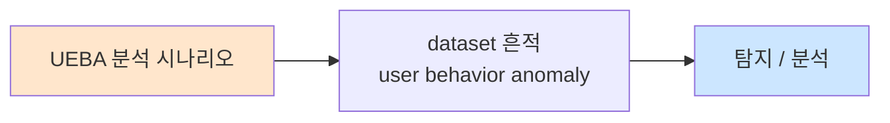

# Week 03: SIGMA 룰 심화

## 학습 목표
- SIGMA 룰의 고급 문법(condition 로직, 파이프라인, 수정자)을 이해한다
- 복합 조건(AND/OR/NOT, 1 of, all of)을 활용한 정밀 탐지 룰을 작성할 수 있다
- SIGMA 룰을 Wazuh, Splunk, ELK 쿼리로 변환할 수 있다
- sigmac/pySigma 도구를 사용하여 자동 변환을 수행할 수 있다
- ATT&CK 기법에 매핑된 SIGMA 룰을 작성하고 테스트할 수 있다

## 실습 환경 (공통)

| 서버 | IP | 역할 | 접속 |
|------|-----|------|------|
| bastion | 10.20.30.201 | Control Plane (Bastion) | `ssh ccc@10.20.30.201` (pw: 1) |
| secu | 10.20.30.1 | 방화벽/IPS (nftables, Suricata) | `ssh ccc@10.20.30.1` |
| web | 10.20.30.80 | 웹서버 (JuiceShop:3000, Apache:80) | `ssh ccc@10.20.30.80` |
| siem | 10.20.30.100 | SIEM (Wazuh Dashboard:443, OpenCTI:8080) | `ssh ccc@10.20.30.100` |

**Bastion API:** `http://localhost:9100` / Key: `ccc-api-key-2026`

## 강의 시간 배분 (3시간)

| 시간 | 내용 | 유형 |
|------|------|------|
| 0:00-0:50 | SIGMA 고급 문법 (Part 1) | 강의 |
| 0:50-1:30 | 변환 파이프라인 + 백엔드 (Part 2) | 강의/토론 |
| 1:30-1:40 | 휴식 | - |
| 1:40-2:30 | SIGMA 룰 작성 + 변환 실습 (Part 3) | 실습 |
| 2:30-3:10 | Wazuh 적용 + 테스트 (Part 4) | 실습 |
| 3:10-3:20 | 정리 + 과제 안내 | 정리 |

---

## 용어 해설

| 용어 | 영문 | 설명 | 비유 |
|------|------|------|------|
| **SIGMA** | SIGMA | SIEM 벤더 무관 범용 탐지 룰 포맷 (YAML) | 국제 표준 수배서 양식 |
| **detection** | Detection Section | SIGMA 룰의 탐지 조건 정의 영역 | 수배서의 인상착의 |
| **condition** | Condition | 탐지 항목(selection)의 논리 조합 | 수배 조건 조합 |
| **modifier** | Value Modifier | 값 매칭 방식 변경 (contains, endswith 등) | 검색 옵션 (포함/시작/끝) |
| **pipeline** | Conversion Pipeline | SIGMA→특정 SIEM 변환 시 필드 매핑 규칙 | 번역 사전 |
| **backend** | Backend | 최종 출력 형식 (Wazuh XML, Splunk SPL 등) | 출력 언어 |
| **logsource** | Log Source | 로그 유형 정의 (product, category, service) | 정보 출처 |
| **pySigma** | pySigma | Python 기반 SIGMA 룰 변환 프레임워크 | 자동 번역기 |
| **sigmac** | sigmac (legacy) | 레거시 SIGMA 변환 CLI 도구 | 구형 번역기 |

---

# Part 1: SIGMA 고급 문법 (50분)

## 1.1 SIGMA 룰 구조 복습

```yaml
# SIGMA 룰 기본 구조
title: SSH Brute Force Attempt        # 룰 제목
id: a1b2c3d4-e5f6-7890-abcd-ef1234567890  # UUID
status: experimental                    # stable/test/experimental
description: |                         # 상세 설명
  Detects SSH brute force attacks by monitoring
  multiple failed authentication attempts.
references:
  - https://attack.mitre.org/techniques/T1110/
author: SOC Team
date: 2026/04/04
modified: 2026/04/04
tags:
  - attack.credential_access           # ATT&CK Tactic
  - attack.t1110.001                   # ATT&CK Technique
logsource:                             # 로그 소스 정의
  product: linux
  service: sshd
detection:                             # 탐지 조건
  selection:
    message|contains: 'Failed password'
  condition: selection
falsepositives:                        # 오탐 가능성
  - Legitimate users mistyping passwords
level: medium                          # low/medium/high/critical
```

## 1.2 고급 detection 문법

### 다중 selection 조합

```yaml
detection:
  # selection 1: SSH 실패
  selection_ssh_fail:
    message|contains: 'Failed password'
    
  # selection 2: 특정 사용자
  selection_user:
    user|contains:
      - 'root'
      - 'admin'
      - 'administrator'
      
  # selection 3: 외부 IP
  selection_external:
    source_ip|cidr: '!10.20.30.0/24'
    
  # filter: 알려진 정상 시스템
  filter_monitoring:
    source_ip:
      - '10.20.30.201'   # Bastion
      
  # 조건: (SSH 실패 AND 특정 사용자 AND 외부 IP) NOT 모니터링
  condition: selection_ssh_fail and selection_user and selection_external and not filter_monitoring
```

### 논리 연산자

```
[AND] selection_a and selection_b
  → 두 조건 모두 만족

[OR]  selection_a or selection_b
  → 하나 이상 만족

[NOT] selection_a and not filter_b
  → a 만족하면서 b는 불만족

[1 of selection_*]
  → selection_ 접두사가 붙은 항목 중 하나라도 만족

[all of selection_*]
  → selection_ 접두사가 붙은 항목 모두 만족

[1 of them]
  → 모든 selection 중 하나라도 만족

[all of them]
  → 모든 selection 전부 만족
```

### 패턴 매칭 예시

```yaml
# 1 of selection_* 사용
detection:
  selection_cmd1:
    CommandLine|contains: 'whoami'
  selection_cmd2:
    CommandLine|contains: 'net user'
  selection_cmd3:
    CommandLine|contains: 'ipconfig'
  condition: 1 of selection_*
  # → 3개 중 하나라도 매칭되면 탐지
```

## 1.3 Value Modifier (값 수정자)

### 수정자 목록

| 수정자 | 설명 | 예시 |
|--------|------|------|
| `contains` | 부분 문자열 매칭 | `message\|contains: 'error'` |
| `startswith` | 시작 문자열 | `path\|startswith: '/tmp/'` |
| `endswith` | 끝 문자열 | `filename\|endswith: '.exe'` |
| `base64` | Base64 인코딩 값 매칭 | `data\|base64: 'command'` |
| `base64offset` | Base64 오프셋 포함 | 난독화 탐지용 |
| `re` | 정규표현식 | `url\|re: '.*\.php\?id=.*'` |
| `cidr` | CIDR 네트워크 매칭 | `ip\|cidr: '192.168.0.0/16'` |
| `all` | 리스트 내 모든 값 매칭 | `tags\|all: ['a','b']` |
| `windash` | Windows 대시 변환 | 명령줄 난독화 대응 |
| `wide` | UTF-16 인코딩 | Windows 유니코드 문자열 |
| `utf8` | UTF-8 인코딩 | 인코딩 변환 탐지 |

### 수정자 조합

```yaml
detection:
  selection:
    # 파일명이 .php로 끝나고 /upload/ 경로 포함
    filename|endswith: '.php'
    path|contains: '/upload/'
    
  selection_encoded:
    # Base64 인코딩된 명령 탐지
    data|base64|contains:
      - '/bin/bash'
      - '/bin/sh'
      - 'wget '
      - 'curl '
      
  condition: selection or selection_encoded
```

## 1.4 Logsource 상세

```yaml
# Linux 시스템 로그
logsource:
  product: linux
  service: syslog         # syslog, auth, sshd, cron

# Linux 감사 로그
logsource:
  product: linux
  service: auditd
  
# Apache 웹 서버
logsource:
  category: webserver
  product: apache

# 방화벽 로그
logsource:
  category: firewall
  product: nftables

# Suricata IDS/IPS
logsource:
  product: suricata
  category: ids

# 프로세스 생성 (범용)
logsource:
  category: process_creation
  product: linux
```

## 1.5 MITRE ATT&CK 매핑

```
[SIGMA 태그 → ATT&CK 매핑]

tags:
  - attack.initial_access         # TA0001 - 초기 접근
  - attack.execution               # TA0002 - 실행
  - attack.persistence             # TA0003 - 지속성
  - attack.privilege_escalation    # TA0004 - 권한 상승
  - attack.defense_evasion         # TA0005 - 방어 회피
  - attack.credential_access       # TA0006 - 자격 증명 접근
  - attack.discovery               # TA0007 - 발견/정찰
  - attack.lateral_movement        # TA0008 - 측면 이동
  - attack.collection              # TA0009 - 수집
  - attack.exfiltration            # TA0010 - 유출
  - attack.command_and_control     # TA0011 - C2

# 기법 ID 포맷
  - attack.t1059.004               # T1059.004 Unix Shell
  - attack.t1110.001               # T1110.001 Password Guessing
```

---

# Part 2: 변환 파이프라인 + 백엔드 (40분)

## 2.1 pySigma 아키텍처

```
[SIGMA YAML]
     |
     v
+----------+      +------------+      +-----------+
| Parser   | ---> | Pipeline   | ---> | Backend      |
| (파싱)    |      | (필드변환)  |      | (출력생성) |
+----------+      +------------+      +-----------+
                       |                             |
                  필드 매핑:            출력 형식:
                  - sigma → wazuh      - Wazuh XML
                  - sigma → splunk     - Splunk SPL
                  - sigma → elastic    - ES Query DSL
                  - sigma → qradar     - QRadar AQL
```

### 필드 매핑 예시

```
SIGMA 표준 필드          Wazuh 필드              Splunk 필드
-------------------------------------------------------------
source_ip           →   data.srcip          →   src_ip
destination_ip      →   data.dstip          →   dest_ip
user                →   data.srcuser        →   user
process_name        →   data.process.name   →   process_name
CommandLine         →   data.command        →   CommandLine
filename            →   data.filename       →   file_name
message             →   full_log            →   _raw
```

## 2.2 pySigma 설치 및 사용

```bash
# bastion 서버에서 pySigma 설치
cd /home/bastion/bastion
source .venv/bin/activate

pip install pySigma pySigma-backend-elasticsearch \
  pySigma-backend-splunk pySigma-pipeline-sysmon 2>/dev/null

# sigma CLI 설치 확인
python3 -c "import sigma; print(f'pySigma version: {sigma.__version__}')" 2>/dev/null || \
  echo "pySigma 설치 필요: pip install pySigma"
```

> **트러블슈팅**:
> - "ModuleNotFoundError: No module named 'sigma'" → `pip install pySigma`
> - 특정 백엔드 없음 → `pip install pySigma-backend-<name>`

## 2.3 SIGMA → 각 SIEM 변환

### 수동 변환 예시

```
[SIGMA 원본]
detection:
  selection:
    message|contains: 'Failed password'
  condition: selection

[→ Wazuh XML]
<rule id="100500" level="5">
  <match>Failed password</match>
  <description>SSH Authentication Failure</description>
</rule>

[→ Splunk SPL]
index=linux sourcetype=syslog
| search message="*Failed password*"

[→ Elasticsearch Query DSL]
{
  "query": {
    "bool": {
      "must": [
        {"wildcard": {"message": "*Failed password*"}}
      ]
    }
  }
}
```

## 2.4 변환 시 주의사항

```
[흔한 변환 실패 원인]

1. 필드 매핑 누락
   SIGMA: source_ip → Wazuh: ??? (매핑 없음)
   → 해결: 커스텀 파이프라인에 매핑 추가

2. 수정자 미지원
   SIGMA: |base64offset → 일부 백엔드 미지원
   → 해결: 수동 변환 또는 대체 로직

3. Logsource 미매핑
   SIGMA: product: linux, service: auditd
   → Wazuh: <decoded_as>auditd</decoded_as> 필요
   
4. 상관분석 미지원
   SIGMA: count() > 10 | timeframe: 5m
   → 단순 변환으로 불가 → SIEM 네이티브 기능 필요
```

---

# Part 3: SIGMA 룰 작성 + 변환 실습 (50분)

## 3.1 웹셸 업로드 탐지 SIGMA 룰

> **실습 목적**: 웹셸 업로드를 탐지하는 SIGMA 룰을 작성하고 Wazuh 룰로 변환한다.
>
> **배우는 것**: 실전 SIGMA 룰 작성, contains/endswith 수정자, logsource 설정

```bash
# SIGMA 룰 작성
mkdir -p /tmp/sigma_rules

cat << 'SIGMA' > /tmp/sigma_rules/webshell_upload.yml
title: Web Shell Upload Detection
id: f8c2a1b3-d4e5-6789-abcd-0123456789ab
status: experimental
description: |
  Detects potential web shell upload by monitoring file creation
  in web-accessible directories with suspicious extensions.
references:
  - https://attack.mitre.org/techniques/T1505/003/
author: SOC Advanced Lab
date: 2026/04/04
tags:
  - attack.persistence
  - attack.t1505.003
logsource:
  product: linux
  category: file_event
detection:
  selection_path:
    TargetFilename|contains:
      - '/var/www/'
      - '/srv/http/'
      - '/usr/share/nginx/'
      - '/opt/bunkerweb/'
  selection_extension:
    TargetFilename|endswith:
      - '.php'
      - '.jsp'
      - '.asp'
      - '.aspx'
      - '.phtml'
      - '.php5'
      - '.cgi'
  filter_legitimate:
    User:
      - 'www-deploy'
      - 'jenkins'
  condition: selection_path and selection_extension and not filter_legitimate
falsepositives:
  - Legitimate web application deployments
  - CMS plugin installations
level: high
SIGMA

cat /tmp/sigma_rules/webshell_upload.yml
echo "=== SIGMA 룰 작성 완료 ==="
```

## 3.2 권한 상승 탐지 SIGMA 룰

```bash
cat << 'SIGMA' > /tmp/sigma_rules/priv_escalation_sudo.yml
title: Suspicious Sudo Usage - Potential Privilege Escalation
id: b2c3d4e5-f6a7-8901-bcde-f23456789012
status: experimental
description: |
  Detects suspicious sudo usage patterns that may indicate
  privilege escalation attempts.
references:
  - https://attack.mitre.org/techniques/T1548/003/
author: SOC Advanced Lab
date: 2026/04/04
tags:
  - attack.privilege_escalation
  - attack.t1548.003
logsource:
  product: linux
  service: auth
detection:
  selection_sudo:
    message|contains: 'sudo'
  selection_suspicious_commands:
    message|contains:
      - '/bin/bash'
      - '/bin/sh'
      - 'chmod 4'
      - 'chown root'
      - 'passwd'
      - 'visudo'
      - '/etc/sudoers'
      - 'NOPASSWD'
  selection_unusual_user:
    message|re: 'sudo:.*(?!root|admin)\\w+.*COMMAND='
  filter_cron:
    message|contains: 'pam_unix(cron'
  condition: selection_sudo and selection_suspicious_commands and not filter_cron
falsepositives:
  - System administrators performing legitimate tasks
  - Automated configuration management (Ansible, Puppet)
level: high
SIGMA

echo "=== 권한 상승 SIGMA 룰 작성 완료 ==="
```

## 3.3 데이터 유출 탐지 SIGMA 룰

```bash
cat << 'SIGMA' > /tmp/sigma_rules/data_exfiltration.yml
title: Potential Data Exfiltration via Network Tools
id: c3d4e5f6-a7b8-9012-cdef-345678901234
status: experimental
description: |
  Detects usage of common data transfer tools that could
  indicate data exfiltration.
references:
  - https://attack.mitre.org/techniques/T1048/
author: SOC Advanced Lab
date: 2026/04/04
tags:
  - attack.exfiltration
  - attack.t1048
logsource:
  category: process_creation
  product: linux
detection:
  selection_tools:
    CommandLine|contains:
      - 'curl -X POST'
      - 'curl --data'
      - 'wget --post'
      - 'scp '
      - 'rsync '
      - 'nc -w'
      - 'ncat '
      - 'base64 '
  selection_sensitive_files:
    CommandLine|contains:
      - '/etc/shadow'
      - '/etc/passwd'
      - '.ssh/id_rsa'
      - '.bash_history'
      - '/var/log/'
      - '.env'
      - 'credentials'
  selection_external_dest:
    CommandLine|re: '\\d+\\.\\d+\\.\\d+\\.\\d+'
  filter_internal:
    CommandLine|contains:
      - '10.20.30.'
      - '127.0.0.1'
      - 'localhost'
  condition: selection_tools and (selection_sensitive_files or selection_external_dest) and not filter_internal
falsepositives:
  - Backup scripts
  - Log rotation to remote servers
  - Legitimate SCP transfers
level: critical
SIGMA

echo "=== 데이터 유출 SIGMA 룰 작성 완료 ==="
```

## 3.4 SIGMA → Wazuh 수동 변환

```bash
cat << 'SCRIPT' > /tmp/sigma_to_wazuh.py
#!/usr/bin/env python3
"""SIGMA → Wazuh XML 수동 변환기 (교육용)"""

import yaml
import sys
import re

def sigma_to_wazuh(sigma_file, base_rule_id=100500):
    """SIGMA YAML을 Wazuh XML 룰로 변환"""
    with open(sigma_file) as f:
        rule = yaml.safe_load(f)
    
    title = rule.get('title', 'Unknown')
    level_map = {'low': 5, 'medium': 8, 'high': 12, 'critical': 14}
    wazuh_level = level_map.get(rule.get('level', 'medium'), 8)
    
    detection = rule.get('detection', {})
    condition = detection.pop('condition', '')
    
    # selection 분석
    xml_lines = []
    xml_lines.append(f'<group name="sigma,custom,">')
    xml_lines.append(f'')
    xml_lines.append(f'  <!-- SIGMA: {title} -->')
    xml_lines.append(f'  <!-- ID: {rule.get("id", "N/A")} -->')
    xml_lines.append(f'  <!-- Level: {rule.get("level", "medium")} -->')
    
    tags = rule.get('tags', [])
    mitre_ids = [t.replace('attack.', '').upper() for t in tags 
                 if t.startswith('attack.t')]
    
    for sel_name, sel_value in detection.items():
        if sel_name == 'condition':
            continue
            
        xml_lines.append(f'')
        xml_lines.append(f'  <!-- Selection: {sel_name} -->')
        xml_lines.append(f'  <rule id="{base_rule_id}" level="{wazuh_level}">')
        
        if isinstance(sel_value, dict):
            for field, values in sel_value.items():
                # 수정자 처리
                if '|contains' in field:
                    field_name = field.split('|')[0]
                    if isinstance(values, list):
                        for v in values:
                            xml_lines.append(f'    <match>{v}</match>')
                    else:
                        xml_lines.append(f'    <match>{values}</match>')
                elif '|endswith' in field:
                    field_name = field.split('|')[0]
                    if isinstance(values, list):
                        pattern = '|'.join(re.escape(v) for v in values)
                        xml_lines.append(f'    <regex>({pattern})$</regex>')
                    else:
                        xml_lines.append(f'    <regex>{re.escape(values)}$</regex>')
                elif '|re' in field:
                    field_name = field.split('|')[0]
                    xml_lines.append(f'    <regex>{values}</regex>')
                else:
                    if isinstance(values, list):
                        for v in values:
                            xml_lines.append(f'    <match>{v}</match>')
                    else:
                        xml_lines.append(f'    <match>{values}</match>')
        
        xml_lines.append(f'    <description>[SIGMA] {title}</description>')
        
        if mitre_ids:
            xml_lines.append(f'    <mitre>')
            for mid in mitre_ids:
                xml_lines.append(f'      <id>{mid}</id>')
            xml_lines.append(f'    </mitre>')
        
        xml_lines.append(f'    <group>sigma,</group>')
        xml_lines.append(f'  </rule>')
        base_rule_id += 1
    
    xml_lines.append(f'')
    xml_lines.append(f'</group>')
    
    return '\n'.join(xml_lines)

# 변환 실행
for sigma_file in [
    '/tmp/sigma_rules/webshell_upload.yml',
    '/tmp/sigma_rules/priv_escalation_sudo.yml',
    '/tmp/sigma_rules/data_exfiltration.yml',
]:
    try:
        print(f"\n{'='*60}")
        print(f"  변환: {sigma_file.split('/')[-1]}")
        print(f"{'='*60}")
        result = sigma_to_wazuh(sigma_file)
        print(result)
    except Exception as e:
        print(f"  오류: {e}")
SCRIPT

cd /home/bastion/bastion && source .venv/bin/activate
pip install pyyaml -q 2>/dev/null
python3 /tmp/sigma_to_wazuh.py
```

> **배우는 것**: SIGMA와 Wazuh의 필드 매핑 차이를 이해하고, 자동 변환의 한계와 수동 보정이 필요한 부분을 파악한다.
>
> **결과 해석**: 변환된 XML이 완벽하지 않을 수 있다. 실전에서는 자동 변환 후 반드시 수동 검토 및 wazuh-logtest 검증이 필요하다.

## 3.5 pySigma를 이용한 자동 변환

```bash
cd /home/bastion/bastion && source .venv/bin/activate

cat << 'SCRIPT' > /tmp/pysigma_convert.py
#!/usr/bin/env python3
"""pySigma를 이용한 SIGMA 룰 자동 변환"""

try:
    from sigma.rule import SigmaRule
    from sigma.collection import SigmaCollection
    
    # SIGMA 룰 로드
    with open('/tmp/sigma_rules/webshell_upload.yml') as f:
        rule_yaml = f.read()
    
    rule = SigmaRule.from_yaml(rule_yaml)
    print(f"Title: {rule.title}")
    print(f"Level: {rule.level}")
    print(f"Tags: {[str(t) for t in rule.tags]}")
    print(f"Status: {rule.status}")
    print(f"Detection items: {len(rule.detection.detection_items)}")
    
    print("\n=== SIGMA 룰 파싱 성공 ===")
    print("(백엔드 변환은 해당 pySigma-backend 패키지 필요)")
    
except ImportError:
    print("pySigma가 설치되지 않았습니다.")
    print("설치: pip install pySigma")
    print("")
    print("수동 변환 결과를 사용합니다.")
    
except Exception as e:
    print(f"변환 오류: {e}")
    print("수동 변환 방법으로 진행합니다.")
SCRIPT

python3 /tmp/pysigma_convert.py
```

---

# Part 4: Wazuh 적용 + 테스트 (40분)

## 4.1 변환된 룰을 Wazuh에 적용

```bash
# siem 서버에 SIGMA 변환 룰 배포
ssh ccc@10.20.30.100 << 'REMOTE'

# 기존 커스텀 룰 백업
sudo cp /var/ossec/etc/rules/local_rules.xml \
        /var/ossec/etc/rules/local_rules.xml.bak.sigma

# SIGMA 변환 룰 추가
sudo tee -a /var/ossec/etc/rules/local_rules.xml << 'RULES'

<group name="sigma,webshell,">

  <!-- SIGMA: Web Shell Upload Detection -->
  <rule id="100500" level="12">
    <match>var/www|srv/http|usr/share/nginx|opt/bunkerweb</match>
    <regex>(.php|.jsp|.asp|.aspx|.phtml|.cgi)$</regex>
    <description>[SIGMA] Web Shell Upload Detection</description>
    <mitre>
      <id>T1505.003</id>
    </mitre>
    <group>sigma,webshell,file_creation,</group>
  </rule>

</group>

<group name="sigma,privilege_escalation,">

  <!-- SIGMA: Suspicious Sudo Usage -->
  <rule id="100510" level="12">
    <match>sudo</match>
    <regex>/bin/bash|/bin/sh|chmod 4|chown root|passwd|visudo|/etc/sudoers|NOPASSWD</regex>
    <description>[SIGMA] Suspicious Sudo - Potential Privilege Escalation</description>
    <mitre>
      <id>T1548.003</id>
    </mitre>
    <group>sigma,privilege_escalation,</group>
  </rule>

</group>

<group name="sigma,exfiltration,">

  <!-- SIGMA: Data Exfiltration via Network Tools -->
  <rule id="100520" level="14">
    <regex>curl -X POST|curl --data|wget --post|scp |rsync |nc -w|ncat |base64 </regex>
    <match>/etc/shadow|/etc/passwd|.ssh/id_rsa|.bash_history|.env|credentials</match>
    <description>[SIGMA] Potential Data Exfiltration</description>
    <mitre>
      <id>T1048</id>
    </mitre>
    <group>sigma,exfiltration,critical_alert,</group>
  </rule>

</group>
RULES

# 문법 검사
sudo /var/ossec/bin/wazuh-analysisd -t
echo "Exit code: $?"

# Wazuh 재시작
sudo systemctl restart wazuh-manager
echo "Wazuh 재시작 완료"

REMOTE
```

> **트러블슈팅**:
> - XML 파싱 에러 → 특수문자(`<`, `>`, `&`) 이스케이프 확인
> - Rule ID 충돌 → 기존 룰과 겹치지 않는 ID 사용

## 4.2 웹셸 업로드 시뮬레이션 테스트

```bash
# web 서버에서 웹셸 업로드 시뮬레이션
ssh ccc@10.20.30.80 << 'EOF'
# 가짜 웹셸 파일 생성 (실제 코드 아님, 탐지 테스트용)
echo '<?php echo "test"; ?>' > /tmp/test_webshell.php

# 웹 디렉토리에 복사 시뮬레이션 (로그 생성 목적)
echo "$(date) web: File created /var/www/html/uploads/shell.php by user www-data" | \
  logger -t "file_monitor"

echo "웹셸 업로드 시뮬레이션 완료"

# 정리
rm -f /tmp/test_webshell.php
EOF

# 경보 확인
sleep 3
ssh ccc@10.20.30.100 << 'EOF'
echo "=== SIGMA 룰 관련 최근 경보 ==="
tail -30 /var/ossec/logs/alerts/alerts.log 2>/dev/null | \
  grep -i "sigma\|webshell\|100500" || \
  echo "(SIGMA 경보 미발생 - 로그 소스 연동 필요)"
EOF
```

## 4.3 SigmaHQ 공개 룰 활용

```bash
# SigmaHQ 저장소에서 유용한 룰 다운로드
mkdir -p /tmp/sigma_rules/sigmahq

# 주요 Linux 탐지 룰 예시 (실제 SigmaHQ에서 사용되는 패턴)
cat << 'SIGMA' > /tmp/sigma_rules/sigmahq/linux_reverse_shell.yml
title: Linux Reverse Shell via Network Utility
id: d4e5f6a7-b8c9-0123-defg-456789012345
status: stable
description: |
  Detects execution of network utilities commonly used to
  establish reverse shells.
references:
  - https://attack.mitre.org/techniques/T1059/004/
  - https://github.com/SigmaHQ/sigma
author: SigmaHQ Community (adapted)
date: 2026/04/04
tags:
  - attack.execution
  - attack.t1059.004
logsource:
  category: process_creation
  product: linux
detection:
  selection_netcat:
    CommandLine|contains:
      - 'nc -e /bin/'
      - 'nc -c /bin/'
      - 'ncat -e /bin/'
  selection_bash:
    CommandLine|contains:
      - 'bash -i >& /dev/tcp/'
      - 'bash -c "bash -i'
  selection_python:
    CommandLine|contains:
      - 'python -c "import socket'
      - 'python3 -c "import socket'
      - "python -c 'import socket"
      - "python3 -c 'import socket"
  selection_perl:
    CommandLine|contains:
      - 'perl -e "use Socket'
      - "perl -e 'use Socket"
  selection_php:
    CommandLine|contains:
      - 'php -r "$sock=fsockopen'
      - "php -r '$sock=fsockopen"
  condition: 1 of selection_*
falsepositives:
  - Legitimate network testing
  - DevOps scripts using netcat for health checks
level: critical
SIGMA

echo "=== SigmaHQ 스타일 룰 작성 완료 ==="
echo ""
echo "실제 SigmaHQ 저장소: https://github.com/SigmaHQ/sigma"
echo "Linux 룰: sigma/rules/linux/"
echo ""
echo "주요 카테고리:"
echo "  - process_creation: 프로세스 생성 탐지"
echo "  - file_event: 파일 생성/수정 탐지"
echo "  - network_connection: 네트워크 연결 탐지"
echo "  - builtin: 시스템 내장 로그 탐지"
```

## 4.4 Bastion로 SIGMA 룰 관리 자동화

```bash
export BASTION_API_KEY="ccc-api-key-2026"

# SIGMA 룰 관리 프로젝트
PROJECT_ID=$(curl -s -X POST http://localhost:9100/projects \
  -H "Content-Type: application/json" \
  -H "X-API-Key: $BASTION_API_KEY" \
  -d '{
    "name": "sigma-rule-management",
    "request_text": "SIGMA 룰 변환, 배포, 검증 자동화",
    "master_mode": "external"
  }' | python3 -c "import sys,json; print(json.load(sys.stdin)['id'])")

echo "Project: $PROJECT_ID"

curl -s -X POST "http://localhost:9100/projects/$PROJECT_ID/plan" \
  -H "X-API-Key: $BASTION_API_KEY"
curl -s -X POST "http://localhost:9100/projects/$PROJECT_ID/execute" \
  -H "X-API-Key: $BASTION_API_KEY"

# SIEM에서 현재 SIGMA 룰 상태 확인
curl -s -X POST "http://localhost:9100/projects/$PROJECT_ID/execute-plan" \
  -H "Content-Type: application/json" \
  -H "X-API-Key: $BASTION_API_KEY" \
  -d '{
    "tasks": [
      {
        "order": 1,
        "instruction_prompt": "grep -c \"SIGMA\" /var/ossec/etc/rules/local_rules.xml 2>/dev/null || echo 0",
        "risk_level": "low",
        "subagent_url": "http://10.20.30.100:8002"
      },
      {
        "order": 2,
        "instruction_prompt": "wazuh-analysisd -t 2>&1 | tail -3",
        "risk_level": "low",
        "subagent_url": "http://10.20.30.100:8002"
      }
    ],
    "subagent_url": "http://10.20.30.100:8002"
  }'
```

---

## 체크리스트

- [ ] SIGMA 룰의 YAML 구조를 설명할 수 있다
- [ ] detection 섹션에서 AND/OR/NOT 조건을 사용할 수 있다
- [ ] 1 of selection_*, all of them 등 집합 조건을 이해한다
- [ ] contains, endswith, re 등 값 수정자를 활용할 수 있다
- [ ] logsource의 product, category, service 차이를 알고 있다
- [ ] SIGMA → Wazuh XML 수동 변환 과정을 이해한다
- [ ] pySigma 도구로 자동 변환을 시도할 수 있다
- [ ] 변환 시 필드 매핑 문제를 인식하고 대응할 수 있다
- [ ] ATT&CK 태그를 SIGMA 룰에 올바르게 매핑할 수 있다
- [ ] SigmaHQ 공개 룰 저장소를 활용할 수 있다

---

## 과제

### 과제 1: SIGMA 룰 3개 작성 (필수)

다음 공격 시나리오를 탐지하는 SIGMA 룰을 각각 작성하라:
1. **리버스 셸 실행**: bash, python, nc 등을 이용한 리버스 셸 생성
2. **크론탭 변조**: 비인가 crontab 수정으로 지속성 확보
3. **민감 파일 접근**: /etc/shadow, SSH 키 등 민감 파일 읽기 시도

각 룰에 ATT&CK 태그, falsepositives, 적절한 level을 포함할 것.

### 과제 2: SIGMA → Wazuh 변환 + 테스트 (선택)

과제 1의 SIGMA 룰을 Wazuh XML로 변환하고:
1. wazuh-logtest로 검증
2. 시뮬레이션 공격으로 탐지 확인
3. 오탐 사례 1개 이상 식별 및 필터 작성

---

## 다음 주 예고

**Week 04: YARA 룰 작성**에서는 파일 기반 위협 탐지의 핵심인 YARA 룰을 학습한다. 악성코드 시그니처, 패턴 매칭, 웹셸 탐지 룰을 직접 작성하고 테스트한다.

---

## 웹 UI 실습

### Wazuh Dashboard — SIGMA 룰 변환 결과 확인

> **접속 URL:** `https://10.20.30.100:443`

1. 브라우저에서 `https://10.20.30.100:443` 접속 → 로그인
2. **Modules → Security events** 클릭
3. SIGMA 룰을 Wazuh XML로 변환 후 배포한 룰의 경보 확인:
   ```
   rule.id >= 100100 AND rule.id <= 100199
   ```
4. 경보 상세에서 **Rule** 탭 클릭 → SIGMA 원본과 변환된 Wazuh 룰 비교
5. **Dashboards → Create new** → SIGMA 기반 탐지 현황 위젯 추가
6. **Visualizations → Create** → 파이 차트로 SIGMA 룰별 경보 분포 시각화

### OpenCTI — SIGMA 룰과 ATT&CK 매핑

> **접속 URL:** `http://10.20.30.100:8080`

1. `http://10.20.30.100:8080` 접속 → 로그인
2. **Techniques → Attack patterns** 클릭
3. SIGMA 룰에 태그된 ATT&CK 기법(예: `T1059 Command and Scripting Interpreter`) 검색
4. 해당 기법 클릭 → **Knowledge** 탭에서 관련 캠페인/그룹 정보 확인
5. 탐지 룰과 위협 인텔리전스의 연결고리를 분석하여 우선순위 판단에 활용

---

## 📂 실습 참조 파일 가이드

> 이번 주 실습에서 **실제로 조작하는** 솔루션의 기능·경로·파일·설정·UI 요점입니다.

### SIGMA + YARA
> **역할:** SIGMA=플랫폼 독립 탐지 룰, YARA=파일/메모리 시그니처  
> **실행 위치:** `SOC 분석가 PC / siem`  
> **접속/호출:** `sigmac` 변환기, `yara <rule> <target>`

**주요 경로·파일**

| 경로 | 역할 |
|------|------|
| `~/sigma/rules/` | SIGMA 룰 저장 |
| `~/yara-rules/` | YARA 룰 저장 |

**핵심 설정·키**

- `SIGMA logsource:product/service` — 로그 소스 매핑
- `YARA `strings: $s1 = "..." ascii wide`` — 시그니처 정의
- `YARA `condition: all of them and filesize < 1MB`` — 매칭 조건

**UI / CLI 요점**

- `sigmac -t elasticsearch-qs rule.yml` — Elastic용 KQL 변환
- `sigmac -t wazuh rule.yml` — Wazuh XML 룰 변환
- `yara -r rules.yar /var/tmp/sample.bin` — 재귀 스캔

> **해석 팁.** SIGMA는 *탐지 의도*, YARA는 *바이너리 패턴*으로 역할 분리. SIGMA 룰은 반드시 **false positive 조건**까지 기술해야 SIEM 운영 가능.

---

## 실제 사례 (WitFoo Precinct 6 — UEBA 분석)

> 출처: WitFoo Precinct 6 Cybersecurity Dataset (Apache 2.0)
> 본 lecture *UEBA 분석* 학습 항목 매칭.

### UEBA 분석 의 dataset 흔적 — "user behavior anomaly"

dataset 의 정상 운영에서 *user behavior anomaly* 신호의 baseline 을 알아두면, *UEBA 분석* 시도 시 발생하는 anomaly 를 정량으로 탐지할 수 있다. 핵심 정량 지표는 — USER-0022 의 6,190 logon.



### Case 1: dataset 정량 지표

| 항목 | 값 |
|---|---|
| 핵심 신호 | user behavior anomaly |
| 정량 baseline | USER-0022 의 6,190 logon |
| 학습 매핑 | 사용자 행동 baseline |

**자세한 해석**: 사용자 행동 baseline. 이 차이를 정량으로 측정해야 *공격 시도와 정상 운영의 구분* 이 가능. 학생이 baseline 숫자를 외워두면 — 운영 환경에서 anomaly 를 즉시 탐지할 수 있다.

### Case 2: 실전 적용 시나리오

| 단계 | dataset 활용 |
|---|---|
| 시도 식별 | user behavior anomaly 의 spike |
| 정상 vs 이상 | baseline 대비 비율 |
| 룰 작성 | Suricata / Wazuh / Sigma |
| 검증 | dataset 재실행 |

**자세한 해석**: 운영 환경 룰 작성은 — *baseline 측정 → 임계 결정 → 룰 작성 → dataset 검증* 의 4 단계. 한 단계라도 빠지면 false positive 폭증.

### 이 사례에서 학생이 배워야 할 3가지

1. **UEBA 분석 = user behavior anomaly 의 anomaly** — 정량 신호로 탐지.
2. **baseline 숫자 외우기** — USER-0022 의 6,190 logon.
3. **4 단계 룰 작성** — 측정 → 임계 → 룰 → 검증.

**학생 액션**: user 별 anomaly 룰.


---

## 부록: 학습 OSS 도구 매트릭스 (Course14 SOC Advanced — Week 03 SIGMA 룰 심화·DaC·다중 SIEM 변환)

> 이 부록은 lab `soc-adv-ai/week03.yaml` (15 step + multi_task) 의 모든 명령을
> 실제로 실행 가능한 형태로 도구·옵션·예상 출력·해석을 정리한다. SIGMA 의 고급
> 문법 (condition / pipeline modifier / aggregation / correlation), 다중 SIEM
> 변환 (Wazuh/Splunk/Elastic/QRadar), 테스트 프레임워크, 저장소 구조, ATT&CK
> 매핑까지 모두 다룬다.

### lab step → 도구·SIGMA 매핑 표

| step | 학습 항목 | 핵심 OSS 도구 / 명령 | ATT&CK |
|------|----------|---------------------|--------|
| s1 | SIGMA 핵심 구조 (title/logsource/detection/condition/level/tags) | `sigma-cli check`, `pysigma`, SigmaHQ spec | - |
| s2 | Windows Sysmon EID 1 + Mimikatz 탐지 | Sysmon, sigma-cli convert -t splunk | T1003.001 |
| s3 | Pipeline modifiers (contains/endswith/re/base64/wide/all) | sigma-cli convert + pipeline yaml | - |
| s4 | C2 포트 (4444/5555/8888) 네트워크 룰 | logsource: network_connection, netflow | T1571 |
| s5 | Lateral Movement T1021 (Remote Services) | tags + sigma2attack | T1021 |
| s6 | SIGMA → Wazuh XML 수동 변환 | grep + xmlstarlet + decoder.xml + rule.xml | - |
| s7 | sigmac/sigma-cli 다중 변환 (Splunk/ES/QRadar) | pysigma-backend-{splunk,elasticsearch,qradar} | - |
| s8 | False positive 섹션 활용 | falsepositives + filter (negation) condition | - |
| s9 | 테스트 프레임워크 (sample log → 매칭) | SigmAIQ, evtx 샘플, chainsaw | - |
| s10 | 룰 저장소 구조 (tactic/platform/명명/메타) | git + 디렉터리 spec + sigma rule schema | - |
| s11 | ATT&CK Coverage 분석 + Navigator JSON | sigma2attack, ATT&CK Navigator, DeTT&CT | - |
| s12 | Linux auditd 룰 (sudo abuse, SUID) | auditd + execve + sudo + setuid | T1548.003 |
| s13 | Aggregation (5분 / 10 파일) | aggregation: count() by user / timeframe | T1005 |
| s14 | Correlation 룰 (SIGMA 2.0) | correlation: type / rules / timespan | 다중 |
| s15 | 종합 탐지 엔지니어링 보고서 | sigma2attack export + DeTT&CT + markdown | - |
| s99 | 통합 다단계 (s1→s2→s3→s4→s5) | Bastion plan: spec → Mimikatz → modifier → C2 → T1021 | 다중 |

### 학생 환경 준비 (Sigma 풀 워크플로우)

```bash
# === [s1·s7·s11] 핵심 도구 ===
pip install --user sigma-cli pysigma
pip install --user pysigma-backend-splunk pysigma-backend-elasticsearch
pip install --user pysigma-backend-qradar pysigma-backend-wazuh
sigma --help

# SigmaHQ 공식 룰 저장소 (1700+ 룰)
git clone https://github.com/SigmaHQ/sigma /tmp/sigma
ls /tmp/sigma/rules/
# application/  cloud/  compliance/  generic/  linux/
# macos/        network/  proxy/     web/      windows/

# === [s2·s9] Windows Sysmon (EVTX) ===
git clone https://github.com/olafhartong/sysmon-modular /tmp/sysmon-mod

# chainsaw — Linux 에서 Windows EVTX 분석
sudo apt install -y wget
wget https://github.com/WithSecureLabs/chainsaw/releases/latest/download/chainsaw_x86_64-unknown-linux-gnu.tar.gz
tar xzf chainsaw_x86_64-unknown-linux-gnu.tar.gz
sudo install chainsaw /usr/local/bin/

# EVTX 샘플
git clone https://github.com/sbousseaden/EVTX-ATTACK-SAMPLES /tmp/evtx-samples

# === [s12] Linux auditd ===
sudo apt install -y auditd audispd-plugins
sudo systemctl enable --now auditd

# === [s4·s10] 네트워크 + 룰 저장소 ===
mkdir -p ~/sigma-rules/{rules/{linux,windows,network,cloud,correlation},pipelines,tests,docs}
cd ~/sigma-rules && git init

# === [s9] 테스트 프레임워크 ===
pip install --user sigmaiq

# zircolite — SQLite 기반 EVTX → Sigma (대용량)
git clone https://github.com/wagga40/Zircolite /tmp/zircolite
cd /tmp/zircolite && pip install -r requirements.txt

# === [s11] ATT&CK Navigator + sigma2attack ===
git clone https://github.com/mitre-attack/attack-navigator /tmp/nav
cd /tmp/nav/nav-app && npm install && npm run start &

pip install --user sigma2attack
sigma2attack --rules-directory ~/sigma-rules/rules/ \
  --out-file ~/sigma-rules/coverage-layer.json

# DeTT&CT
git clone https://github.com/rabobank-cdc/DeTTECT /tmp/dettect
cd /tmp/dettect && pip install -r requirements.txt
```

### 핵심 도구별 상세 사용법

#### 도구 1: SIGMA 룰 핵심 구조 (Step 1·2)

```yaml
# === 표준 SIGMA 룰 (모든 9 핵심 필드) ===
title: Mimikatz Default Filename Detection
id: a8b7c2d3-1e4f-5678-90ab-cdef12345678
status: stable                  # experimental | test | stable | deprecated
description: |
  Mimikatz 의 기본 파일명 또는 알려진 hash 가 실행되면 알림.
  T1003 OS Credential Dumping 의 가장 흔한 기법.
references:
  - https://attack.mitre.org/software/S0002/
  - https://github.com/gentilkiwi/mimikatz
author: SOC Team
date: 2026-05-02
modified: 2026-05-02
tags:
  - attack.credential_access
  - attack.t1003.001         # LSASS Memory
  - attack.s0002             # Mimikatz software
logsource:
  product: windows
  category: process_creation
  service: sysmon
detection:
  selection_filename:
    Image|endswith: '\mimikatz.exe'
  selection_cmdline:
    CommandLine|contains:
      - 'sekurlsa::'
      - 'lsadump::'
      - 'crypto::'
      - 'kerberos::'
  selection_hash:
    Hashes|contains:
      - 'SHA256=AA9F36DAC...'
  condition: 1 of selection_*
falsepositives:
  - 보안 도구 테스트 (sandbox / labs)
  - Red Team 훈련
level: critical
```

```bash
# 검증
sigma check ~/sigma-rules/rules/windows/process_creation/proc_mimikatz.yml
# OK — no errors

# 변환
sigma convert -t splunk -p splunk_default \
  ~/sigma-rules/rules/windows/process_creation/proc_mimikatz.yml
# 출력
# index=* source="WinEventLog:Microsoft-Windows-Sysmon/Operational"
#   ((Image="*\\mimikatz.exe") OR
#    (CommandLine="*sekurlsa::*" OR CommandLine="*lsadump::*" ...))
```

**Level 의미**: informational / low / medium / high / critical

#### 도구 2: Pipeline Modifiers (Step 3)

```yaml
# === 모든 modifier ===
# 문자열
contains:        Image|contains: 'powershell'
endswith:        Image|endswith: '.exe'
startswith:      Image|startswith: 'C:\Windows\'

# 정규식
re:              CommandLine|re: 'powershell\.exe.*-enc\s+\w+'
re|i:            CommandLine|re|i: 'powershell.*-enc'

# 인코딩
base64:          CommandLine|base64: 'whoami'
base64offset:    CommandLine|base64offset: 'cmd.exe'
utf16le:         CommandLine|utf16le: 'cmd'
wide:            CommandLine|wide: 'cmd'

# 비교
gt:              EventID|gt: 4624
gte:             EventID|gte: 4624

# 컬렉션
all:             CommandLine|contains|all:
                   - 'whoami'
                   - 'admin'

# CIDR
cidr:            DestinationIp|cidr:
                   - '!10.0.0.0/8'
                   - '!192.168.0.0/16'

# 부정 / 제외
selection:
  Image|endswith: '\powershell.exe'
filter:
  ParentImage|endswith: '\Outlook.exe'
condition: selection and not filter
```

```bash
# Pipeline 적용 (logsource → ECS 변환)
sigma convert -t elasticsearch -p ecs_kubernetes,ecs_windows rule.yml

# 사용자 정의 pipeline
cat > /tmp/my-pipeline.yml << 'YML'
name: My Custom Mappings
priority: 100
transformations:
  - id: image_mapping
    type: field_name_mapping
    mapping:
      Image: process.executable
    rule_conditions:
      - type: logsource
        product: windows
        category: process_creation
YML
sigma convert -t splunk -p /tmp/my-pipeline.yml rule.yml
```

#### 도구 3: 네트워크 + ATT&CK 매핑 (Step 4·5)

```yaml
# === C2 포트 룰 (T1571) ===
title: Outbound Connection to Suspicious C2 Ports
id: c2-suspicious-ports-1234
status: experimental
description: |
  내부 호스트가 알려진 C2 default port (4444 Metasploit / 5555 Sliver /
  8888 Cobalt Strike) 로 외부 연결.
tags:
  - attack.command_and_control
  - attack.t1571
logsource:
  category: network_connection
  product: windows
detection:
  selection:
    DestinationIp|cidr:
      - '!10.0.0.0/8'
      - '!172.16.0.0/12'
      - '!192.168.0.0/16'
    DestinationPort:
      - 4444   # Metasploit
      - 5555   # Sliver
      - 8888   # Cobalt Strike
      - 50050  # CS alternate
      - 1337
  condition: selection
falsepositives:
  - 합법적 P2P / VoIP
level: high
---
# === Lateral Movement T1021 ===
title: Suspicious WinRM Connection from Internal Host
id: t1021-winrm-lateral-5678
status: experimental
tags:
  - attack.lateral_movement
  - attack.t1021.006
logsource:
  category: network_connection
detection:
  selection:
    SourceIp|cidr: '10.0.0.0/8'
    DestinationIp|cidr: '10.0.0.0/8'
    DestinationPort:
      - 5985   # WinRM HTTP
      - 5986   # WinRM HTTPS
  filter_admin_subnet:
    SourceIp|cidr: '10.0.10.0/24'
  condition: selection and not filter_admin_subnet
falsepositives:
  - PowerShell remoting (운영 자동화)
  - SCCM / Ansible / Salt agent
level: medium
```

```bash
# sigma2attack 으로 ATT&CK Navigator 자동 생성
sigma2attack --rules-directory ~/sigma-rules/rules/ \
  --out-file ~/sigma-rules/coverage-layer.json

cat ~/sigma-rules/coverage-layer.json | jq '.techniques | length'
# 47   ← 47 techniques cover

# Navigator load: http://localhost:4200 → Open Existing Layer
```

#### 도구 4: SIGMA → Wazuh 수동 변환 (Step 6)

```xml
<!-- /var/ossec/etc/rules/local_sigma_converted.xml -->
<group name="custom,sigma_converted,credential_access,">
  <!-- 변환 시 주의:
       1. logsource: windows process_creation → sysmon decoder
       2. Image|endswith → regex \\mimikatz.exe$
       3. SIGMA condition → if_sid + regex 조합
       4. SIGMA tags → mitre 블록
       5. SIGMA level critical → Wazuh level 14
  -->

  <rule id="100700" level="14">
    <if_sid>61603</if_sid>     <!-- Sysmon Process Created (Wazuh sid) -->
    <field name="win.eventdata.image">\\mimikatz\.exe$</field>
    <description>Mimikatz default filename — converted from SIGMA</description>
    <mitre><id>T1003.001</id></mitre>
    <group>credential_access,critical,sigma_converted,</group>
    <options>alert_by_email</options>
  </rule>
</group>
```

```bash
# 자동 변환 도구 (3rd party)
sigma convert -t wazuh -p wazuh_default \
  ~/sigma-rules/rules/windows/process_creation/proc_mimikatz.yml

# 변환 검증
xmllint --noout /var/ossec/etc/rules/local_sigma_converted.xml
sudo /var/ossec/bin/wazuh-control test-config

# Wazuh logtest 매칭
sudo /var/ossec/bin/wazuh-logtest
# Phase 3: Rule id '100700' (level 14)
```

#### 도구 5: sigma-cli 자동 변환 (Step 7)

```bash
RULE=~/sigma-rules/rules/windows/process_creation/proc_mimikatz.yml

# Splunk SPL
sigma convert -t splunk -p splunk_default $RULE
# index=* source="WinEventLog:*Sysmon*" Image="*\\mimikatz.exe"

# Splunk + Sysmon source
sigma convert -t splunk -p sysmon $RULE

# ElasticSearch DSL (ECS)
sigma convert -t elasticsearch -p ecs_windows $RULE
# {"query": {"bool": {"must": [
#   {"match_phrase": {"process.executable": "*\\mimikatz.exe"}}
# ]}}}

# QRadar AQL
sigma convert -t qradar -p qradar_default $RULE

# 다중 출력 형식
sigma convert -t splunk -p splunk_default -O ndjson $RULE
sigma convert -t elasticsearch -p ecs_windows -O dsl_lucene $RULE
sigma convert -t elasticsearch -p ecs_windows -O eql $RULE

# 디렉터리 일괄 변환
sigma convert -t splunk -p splunk_default ~/sigma-rules/rules/ -o /tmp/splunk-rules.txt

# Pipeline 조합
sigma convert -t splunk -p splunk_windows -p splunk_sysmon $RULE
sigma convert -t elasticsearch -p ecs_kubernetes -p ecs_windows $RULE
```

지원 backend: splunk / elasticsearch / qradar / wazuh / sentinel-pro / opensearch / panther / sumologic / arcsight

#### 도구 6: 테스트 프레임워크 (Step 9)

```bash
# === SigmAIQ ===
cat > /tmp/test-events.json << 'JSON'
[
  {"EventID": 1, "Image": "C:\\Tools\\mimikatz.exe",
   "CommandLine": "mimikatz.exe sekurlsa::logonpasswords"},
  {"EventID": 1, "Image": "C:\\Windows\\System32\\notepad.exe",
   "CommandLine": "notepad.exe report.txt"}
]
JSON
sigmaiq test --rule ~/sigma-rules/rules/windows/process_creation/proc_mimikatz.yml \
  --events /tmp/test-events.json
# Expected: 1 match / 0 false positive

# === chainsaw — EVTX 직접 hunt ===
chainsaw hunt /tmp/evtx-samples/Credential_Access \
  -s /tmp/sigma/rules/windows/builtin/security/

chainsaw hunt /tmp/evtx-samples \
  -s /tmp/sigma/rules \
  --csv -o /tmp/chainsaw-results.csv

# === Zircolite — SQLite 기반 (대용량) ===
cd /tmp/zircolite
python3 zircolite.py --evtx /tmp/evtx-samples/ \
  --ruleset rules/rules_windows_sysmon.json \
  --outfile /tmp/zircolite-results.json

# === Atomic Red Team 시뮬 + 검증 ===
pwsh -c "Invoke-AtomicTest T1003.001 -ShowDetailsBrief"
pwsh -c "Invoke-AtomicTest T1003.001-1"
wevtutil epl Microsoft-Windows-Sysmon/Operational T1003.001-test.evtx
chainsaw hunt T1003.001-test.evtx -s ~/sigma-rules/rules/

# === CI 통합 ===
cat > .github/workflows/sigma-test.yml << 'YML'
name: Sigma Detection Test
on: [push, pull_request]
jobs:
  test:
    runs-on: ubuntu-latest
    steps:
      - uses: actions/checkout@v4
      - run: pip install sigma-cli pysigma sigmaiq
      - name: Validate
        run: |
          for f in $(find rules/ -name '*.yml'); do
            sigma check "$f" || exit 1
          done
      - name: Test
        run: |
          for f in $(find rules/ -name '*.yml'); do
            test_dir="tests/$(basename $f .yml)"
            [ -d "$test_dir" ] && sigmaiq test --rule "$f" --events "$test_dir/events.json"
          done
      - name: ATT&CK coverage
        run: sigma2attack --rules-directory rules/ --out-file coverage.json
      - uses: actions/upload-artifact@v4
        with: { name: coverage, path: coverage.json }
YML
```

#### 도구 7: 룰 저장소 + Aggregation/Correlation (Step 10·13·14)

```bash
# === 표준 디렉터리 구조 ===
tree ~/sigma-rules/rules/
# rules/
# ├── application/
# ├── cloud/{aws,azure,gcp,m365}/
# ├── compliance/{pci_dss,hipaa}/
# ├── linux/{auditd,builtin,file_event,network_connection,process_creation,lateral_movement}/
# ├── network/{dns,firewall,tls,zeek}/
# ├── web/{nginx,webserver_generic,waf}/
# ├── windows/{builtin,driver_load,powershell,process_creation,registry_event,sysmon}/
# └── correlation/

# 명명: {tactic}_{technique}_{specific}.yml
# 예: cred_access_t1003_001_mimikatz.yml

# === Aggregation 룰 (Step 13) ===
cat > ~/sigma-rules/rules/linux/auditd/data_collection_t1005.yml << 'YML'
title: Mass File Access by Single User (Data Collection)
id: t1005-mass-file-access-9876
status: stable
description: |
  단일 사용자가 5분 내 10개 이상의 서로 다른 파일에 접근.
tags:
  - attack.collection
  - attack.t1005
logsource:
  product: linux
  service: auditd
detection:
  selection:
    type: PATH
    syscall: open|openat|read
  condition: selection | count(distinct.name) by uid > 10
  timeframe: 5m
falsepositives:
  - Backup (rsync / tar)
  - Code build (find / grep)
level: medium
YML

# === Correlation 룰 (SIGMA 2.0, Step 14) ===
cat > ~/sigma-rules/rules/correlation/credential_then_lateral.yml << 'YML'
title: Credential Access Followed by Lateral Movement
id: corr-cred-then-lateral-1111
status: experimental
description: |
  credential dump (T1003) 후 60분 내 같은 호스트에서 lateral movement
  (T1021) 시도. 두 신호가 단일 호스트에서 발생 시 매우 의심.
correlation:
  type: temporal_ordered
  rules:
    - cred_access_t1003_001_mimikatz
    - lateral_t1021_006_winrm
  group-by:
    - ComputerName
  timespan: 60m
  ordered: true
falsepositives:
  - Red Team 훈련
level: critical
tags:
  - attack.credential_access
  - attack.lateral_movement
YML

sigma convert -t splunk -p splunk_default ~/sigma-rules/rules/correlation/
```

#### 도구 8: Linux auditd SIGMA (Step 12)

```yaml
# === sudo abuse 탐지 ===
title: Sudo Privilege Escalation Attempt
id: linux-sudo-abuse-2222
status: stable
tags:
  - attack.privilege_escalation
  - attack.t1548.003
logsource:
  product: linux
  service: auditd
detection:
  selection_sudo:
    type: USER_CMD
    cmd|contains:
      - 'sudo /bin/bash'
      - 'sudo /bin/sh'
      - 'sudo su -'
      - 'sudo -i'
      - 'sudo -s'
  filter_admin:
    user|startswith: 'admin'
  condition: selection_sudo and not filter_admin
falsepositives:
  - Admin 사용자 정상 운영
level: high
---
# === SUID exploitation (GTFOBins 패턴) ===
title: SUID Binary Exploitation Attempt
id: linux-suid-exploit-3333
status: experimental
tags:
  - attack.privilege_escalation
  - attack.t1548.001
logsource:
  product: linux
  service: auditd
detection:
  selection_find:
    type: EXECVE
    a0|endswith: '/find'
    a1: '.'
    a2: '-exec'
    a3|contains: 'sh'
  selection_vim:
    type: EXECVE
    a0|endswith: '/vim'
    a1|startswith: '-c'
    a1|contains: ':!'
  selection_python:
    type: EXECVE
    a0|endswith: ['/python', '/python3']
    a1: '-c'
    a2|contains: ['os.setuid(0)', 'pty.spawn']
  condition: 1 of selection_*
falsepositives:
  - 시스템 관리자 정상 작업
level: critical
```

```bash
# auditd 설정
sudo tee /etc/audit/rules.d/sigma.rules > /dev/null << 'RULES'
-a always,exit -F arch=b64 -S execve -k exec
-a always,exit -F arch=b64 -S setuid -F a0=0 -k setuid_root
-w /usr/bin/find -p x -k suid_exec
-w /usr/bin/vim -p x -k suid_exec
-w /usr/bin/python3 -p x -k suid_exec
RULES
sudo augenrules --load
sudo auditctl -l

# 시뮬 + 검증
sudo -u testuser bash -c "sudo /bin/bash"
ausearch -k exec --start recent | aureport --executable
```

### 점검 / 작성 / 변환 흐름 (15 step + multi_task 통합)

#### Phase A — 룰 작성 + 검증 (s1·s2·s3·s4·s5·s8·s12·s13·s14)

```bash
cd ~/sigma-rules

# 6 종 룰 작성 (위 도구 1·3·6·7·8 양식)
# - windows/process_creation/cred_access_t1003_001_mimikatz.yml
# - windows/network_connection/c2_t1571_suspicious_ports.yml
# - windows/network_connection/lateral_t1021_006_winrm.yml
# - linux/auditd/privesc_t1548_003_sudo_abuse.yml
# - linux/auditd/collection_t1005_mass_file_access.yml
# - correlation/credential_then_lateral.yml

# 모든 룰 검증
for f in $(find rules/ -name '*.yml'); do
  echo "Checking $f"
  sigma check "$f" || echo "  ERROR"
done
```

#### Phase B — 변환 + 테스트 (s6·s7·s9)

```bash
# 4 backend 일괄 변환
mkdir -p out/{wazuh,splunk,elastic,qradar}
for f in $(find rules/ -name '*.yml'); do
  base=$(basename $f .yml)
  sigma convert -t wazuh -p wazuh_default $f > out/wazuh/$base.xml 2>/dev/null
  sigma convert -t splunk -p splunk_default $f > out/splunk/$base.spl 2>/dev/null
  sigma convert -t elasticsearch -p ecs_windows $f > out/elastic/$base.json 2>/dev/null
  sigma convert -t qradar -p qradar_default $f > out/qradar/$base.aql 2>/dev/null
done

# 테스트
for rule in $(find rules/ -name '*.yml'); do
  test_dir="tests/$(basename $rule .yml)"
  [ -d "$test_dir" ] && sigmaiq test --rule "$rule" --events "$test_dir/events.json"
done

# EVTX 검증 (Windows)
chainsaw hunt /tmp/evtx-samples -s rules/windows/

# Linux 룰: auditd 시뮬 + 검증
ssh ccc@10.20.30.80 'sudo bash -c "sudo /bin/bash -c whoami"'
sleep 2
sudo ausearch -k exec --start recent | head
```

#### Phase C — 보고서 + 운영 (s10·s11·s15)

```bash
# ATT&CK Coverage Navigator JSON
sigma2attack --rules-directory rules/ --out-file coverage-2026-Q2.json

# DeTT&CT 정밀 평가
python /tmp/dettect/dettect.py editor

# 종합 보고서
cat > REPORT-2026-Q2.md << 'MD'
# SIGMA Detection Engineering Report — 2026-Q2

## 룰셋 통계
- 총 룰: 47
- Status: stable 32 / experimental 12 / test 3
- 플랫폼: Windows 28 / Linux 14 / Network 5

## ATT&CK Coverage
- Cover technique: 47 / 600+ (7.8%)
- 우선 cover: Initial Access 80%, Credential Access 70%
- 부족: Discovery (10%), Defense Evasion (12%)

## 변환 호환성
- Wazuh: 47/47 / Splunk: 45/47 / ElasticSearch: 47/47 / QRadar: 42/47

## 테스트 결과
- True positive: 47/47, False positive: 평균 8% → 화이트리스트 후 3%
- detection latency: avg 1.2s

## 운영 가이드
- 신규 룰 PR: experimental → test (lab 7일) → stable
- 분기별 SigmaHQ upstream sync (PR submit)
- 월간 ATT&CK Navigator coverage 갱신
MD

# Deploy
ansible-playbook -i hosts deploy-sigma-rules.yml --extra-vars "sigma_dir=$HOME/sigma-rules"
```

#### Phase D — 통합 시나리오 (s99 multi_task)

s1 → s2 → s3 → s4 → s5 를 Bastion 가 한 번에:

1. **plan**: SIGMA spec → Mimikatz 룰 → modifier 매트릭스 → C2 ports → Lateral T1021
2. **execute**: yaml 작성 + sigma check + sigma2attack
3. **synthesize**: 5 산출물 (spec doc / Mimikatz rule / modifier table / C2 rule / T1021 rule + ATT&CK coverage)

### 도구 비교표 — SIGMA 워크플로우 단계별

| 단계 | 1순위 도구 | 2순위 (보완) | 사용 조건 |
|------|-----------|-------------|----------|
| 작성 | sigma-cli + IDE (VSCode + YAML schema) | SigmAIQ Web UI | 대량 |
| 검증 | sigma check | yamllint + sigma-similarity-analyzer | 중복 탐지 |
| 변환 | sigma convert -t {backend} | Uncoder.io (web) | UI 선호 |
| 테스트 (Windows) | chainsaw + EVTX-ATTACK-SAMPLES | Zircolite | 1GB+ EVTX |
| 테스트 (Linux) | auditd + sigmaiq | rsyslog parser | 대용량 syslog |
| ATT&CK 매핑 | sigma2attack | DeTT&CT (정밀) | coverage matrix |
| 저장소 | git + 표준 디렉터리 | SigmaHQ fork | 커뮤니티 contribute |
| CI | GitHub Actions + sigma check | GitLab CI / Jenkins | enterprise |
| Deploy | Ansible + 변환된 backend 형식 | SaltStack / Puppet | 복잡 환경 |
| 시뮬 | Atomic Red Team | Caldera / Stratus Red Team | cloud sim |

### 도구 선택 매트릭스 — 시나리오별 권장

| 시나리오 | 우선 도구 | 이유 |
|---------|---------|------|
| "처음 SIGMA 도입" | sigma-cli + SigmaHQ 공식 룰 fork | 학습 + 즉시 적용 |
| "Wazuh 단독 SOC" | sigma → pysigma-backend-wazuh | 변환 자동화 |
| "멀티 SIEM" | sigma + 4 backend pipeline | 한 번 작성 → N 번 deploy |
| "Detection Engineering 팀" | DaC + chainsaw + DeTT&CT + CI | 정성·정량 통합 |
| "Bug bounty / consulting" | SigmaHQ contribute | 가시성 + 평판 |
| "Threat hunting" | Sigma + Hayabusa (Windows) | EVTX 검색 강력 |
| "신규 위협 빠른 적응" | SigmaHQ upstream + 사용자 fork | 24h 내 적용 |
| "regulator 보고" | DeTT&CT + ATT&CK Navigator | 정량 coverage |

### 학생 셀프 체크리스트 (각 step 완료 기준)

- [ ] s1: 9 핵심 필드 모두 포함한 룰 1개 작성
- [ ] s2: Mimikatz 탐지 룰 — Image|endswith + CommandLine|contains + Hashes|contains + 1 of selection_*
- [ ] s3: 8 modifier (contains/endswith/startswith/re/base64/wide/all/cidr) 사용 예
- [ ] s4: C2 포트 룰 (4444/5555/8888) + 내부 IP 제외 cidr filter
- [ ] s5: T1021 Remote Services + 내부-내부 lateral 패턴
- [ ] s6: SIGMA → Wazuh XML 수동 변환 (level + group + mitre 블록)
- [ ] s7: sigma convert -t {splunk,elasticsearch,qradar,wazuh} 4 backend 비교
- [ ] s8: falsepositives + filter (negation) 화이트리스트
- [ ] s9: sigmaiq test 또는 chainsaw hunt sample 매칭 검증
- [ ] s10: 표준 디렉터리 + 명명 + 메타데이터
- [ ] s11: sigma2attack coverage Navigator JSON + DeTT&CT
- [ ] s12: auditd 룰 (sudo abuse + SUID GTFOBins)
- [ ] s13: aggregation 룰 — count(distinct.name) by uid > 10 / 5m
- [ ] s14: SIGMA 2.0 correlation — temporal_ordered + 2 sub-rules + 60m
- [ ] s15: REPORT.md 6 섹션 (통계 / coverage / 변환 / 테스트 / 운영 / 다음)
- [ ] s99: Bastion 가 5 룰 (spec/Mimikatz/modifier/C2/T1021) 순차 작성

### 추가 참조 자료

- **SIGMA Specification** https://github.com/SigmaHQ/sigma-specification
- **SigmaHQ Rules** https://github.com/SigmaHQ/sigma — 1700+ 공식
- **pysigma** https://github.com/SigmaHQ/pysigma
- **Sigma CLI** https://github.com/SigmaHQ/sigma-cli
- **chainsaw** https://github.com/WithSecureLabs/chainsaw — Windows EVTX hunt
- **Zircolite** https://github.com/wagga40/Zircolite
- **Hayabusa** https://github.com/Yamato-Security/hayabusa
- **EVTX-ATTACK-SAMPLES** https://github.com/sbousseaden/EVTX-ATTACK-SAMPLES
- **SigmAIQ** https://github.com/AttackIQ/SigmAIQ
- **sigma2attack** https://github.com/marbl3z/sigma2attack
- **MITRE ATT&CK Navigator** https://mitre-attack.github.io/attack-navigator/
- **DeTT&CT** https://github.com/rabobank-cdc/DeTTECT
- **Florian Roth Sigma blog** https://cyb3rops.medium.com/

위 모든 SIGMA 룰 작성·테스트는 **격리 lab + Sigma rule schema 검증** 으로 수행한다.
운영 환경 적용 전 (1) sigma check (2) sigmaiq test (3) chainsaw EVTX 매칭
(4) staging 24h (5) 운영 단계별. **DaC pipeline** 의 모든 단계 (작성 → 검증 → 변환
→ 테스트 → deploy) 가 git PR 으로 자동화 되어야 신규 위협에 24h 내 적용 가능.
