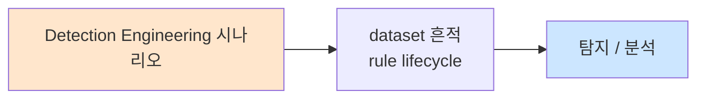

# Week 05: 위협 인텔리전스

## 학습 목표
- STIX/TAXII 표준의 구조와 활용 방법을 이해한다
- MISP 플랫폼에서 IOC를 생성, 공유, 검색할 수 있다
- OpenCTI를 사용하여 위협 인텔리전스를 시각화하고 분석할 수 있다
- IOC 피드를 Wazuh SIEM과 연동하여 실시간 탐지에 활용할 수 있다
- 위협 인텔리전스의 전략적/운영적/전술적 수준을 구분할 수 있다

## 실습 환경 (공통)

| 서버 | IP | 역할 | 접속 |
|------|-----|------|------|
| bastion | 10.20.30.201 | Control Plane (Bastion) | `ssh ccc@10.20.30.201` (pw: 1) |
| secu | 10.20.30.1 | 방화벽/IPS (nftables, Suricata) | `ssh ccc@10.20.30.1` |
| web | 10.20.30.80 | 웹서버 (JuiceShop:3000, Apache:80) | `ssh ccc@10.20.30.80` |
| siem | 10.20.30.100 | SIEM (Wazuh Dashboard:443, OpenCTI:8080) | `ssh ccc@10.20.30.100` |

**Bastion API:** `http://localhost:9100` / Key: `ccc-api-key-2026`

## 강의 시간 배분 (3시간)

| 시간 | 내용 | 유형 |
|------|------|------|
| 0:00-0:50 | 위협 인텔리전스 이론 + STIX/TAXII (Part 1) | 강의 |
| 0:50-1:30 | MISP + OpenCTI (Part 2) | 강의/데모 |
| 1:30-1:40 | 휴식 | - |
| 1:40-2:30 | IOC 관리 + 피드 연동 실습 (Part 3) | 실습 |
| 2:30-3:10 | Wazuh 연동 + Bastion 자동화 (Part 4) | 실습 |
| 3:10-3:20 | 정리 + 과제 안내 | 정리 |

---

## 용어 해설

| 용어 | 영문 | 설명 | 비유 |
|------|------|------|------|
| **TI** | Threat Intelligence | 위협 인텔리전스 - 사이버 위협에 대한 정보 | 범죄 정보 데이터베이스 |
| **IOC** | Indicator of Compromise | 침해 지표 (악성 IP, 도메인, 해시) | 수배범의 지문, 차량번호 |
| **TTP** | Tactics, Techniques, Procedures | 공격자의 전술, 기법, 절차 | 범행 수법 |
| **STIX** | Structured Threat Information eXpression | 위협 정보 표현 표준 (JSON) | 국제 수배서 양식 |
| **TAXII** | Trusted Automated eXchange of Intelligence Information | 위협 정보 교환 프로토콜 | 국제 수배서 전송 시스템 |
| **MISP** | Malware Information Sharing Platform | 오픈소스 위협 인텔리전스 공유 플랫폼 | 경찰 간 수배 정보 공유 시스템 |
| **OpenCTI** | Open Cyber Threat Intelligence | 오픈소스 CTI 분석 플랫폼 | 범죄 분석 대시보드 |
| **피드** | Feed | IOC 데이터 자동 수신 채널 | 수배 정보 뉴스 구독 |
| **CTI** | Cyber Threat Intelligence | 사이버 위협 인텔리전스 (TI와 동의어) | 사이버 범죄 정보 |
| **APT** | Advanced Persistent Threat | 지능형 지속 위협 (국가급 공격) | 국가 지원 스파이 조직 |

---

# Part 1: 위협 인텔리전스 이론 + STIX/TAXII (50분)

## 1.1 위협 인텔리전스 개요

위협 인텔리전스(TI)는 **사이버 위협에 대한 증거 기반 지식**으로, 의사결정을 지원하는 컨텍스트가 포함된 정보다.

### TI의 3가지 수준

```
+--[전략적 TI]--+   +--[운영적 TI]--+   +--[전술적 TI]--+
| (Strategic)    |   | (Operational)  |   | (Tactical)     |
|                |   |                |   |                |
| 대상: CISO,경영|   | 대상: SOC 매니저|   | 대상: SOC 분석가|
|                |   |                |   |                |
| 내용:          |   | 내용:          |   | 내용:          |
| - 위협 동향    |   | - 캠페인 분석  |   | - IOC          |
| - 산업별 위험  |   | - 공격 그룹    |   | - 악성 IP/도메인|
| - 지정학적 요인|   | - TTP 분석     |   | - 파일 해시    |
| - 투자 방향    |   | - 인프라 분석  |   | - SIGMA/YARA룰 |
|                |   |                |   |                |
| 형식: 보고서   |   | 형식: 분석문서 |   | 형식: 기계판독 |
| 주기: 월/분기  |   | 주기: 주/월    |   | 주기: 실시간   |
+----------------+   +----------------+   +----------------+
```

### TI 생명주기

```
Step 1: 계획 (Planning)
  → 수집 요구사항 정의
  → 우선순위 설정
  ↓
Step 2: 수집 (Collection)
  → OSINT, 피드, 공유 플랫폼
  → 내부 로그, 인시던트 데이터
  ↓
Step 3: 처리 (Processing)
  → 정규화, 중복 제거
  → 신뢰도 평가
  ↓
Step 4: 분석 (Analysis)
  → 상관관계 분석
  → ATT&CK 매핑
  → 영향도 평가
  ↓
Step 5: 배포 (Dissemination)
  → SIEM 룰 업데이트
  → 보고서 작성
  → IOC 공유
  ↓
Step 6: 피드백 (Feedback)
  → 탐지 효과 평가
  → 요구사항 수정
  → (Step 1으로 순환)
```

## 1.2 STIX 2.1 표준

STIX(Structured Threat Information eXpression)는 OASIS가 관리하는 위협 정보 표현 표준이다.

### STIX 도메인 객체 (SDO)

```
+-- SDO (STIX Domain Objects) --+
|                                |
| [Attack Pattern]  공격 패턴    |
| [Campaign]        공격 캠페인  |
| [Course of Action] 대응 방안   |
| [Grouping]        그룹핑       |
| [Identity]        신원 정보    |
| [Indicator]       탐지 지표    |
| [Infrastructure]  인프라       |
| [Intrusion Set]   침입 세트    |
| [Location]        위치         |
| [Malware]         악성코드     |
| [Malware Analysis] 분석 결과  |
| [Note]            메모         |
| [Observed Data]   관찰 데이터  |
| [Opinion]         의견         |
| [Report]          보고서       |
| [Threat Actor]    위협 행위자  |
| [Tool]            도구         |
| [Vulnerability]   취약점       |
+--------------------------------+
```

### STIX 관계 객체 (SRO)

```
[Threat Actor] --uses--> [Malware]
      |                      |
      +--targets--> [Identity]
      |                      |
[Indicator] --indicates--> [Attack Pattern]
      |
      +--based-on--> [Observed Data]
```

### STIX Indicator 예시

```json
{
  "type": "indicator",
  "spec_version": "2.1",
  "id": "indicator--a1b2c3d4-e5f6-7890-abcd-ef1234567890",
  "created": "2026-04-04T10:00:00.000Z",
  "modified": "2026-04-04T10:00:00.000Z",
  "name": "Malicious IP - C2 Server",
  "description": "Known C2 server for APT campaign",
  "indicator_types": ["malicious-activity"],
  "pattern": "[ipv4-addr:value = '203.0.113.50']",
  "pattern_type": "stix",
  "valid_from": "2026-04-04T10:00:00.000Z",
  "kill_chain_phases": [
    {
      "kill_chain_name": "mitre-attack",
      "phase_name": "command-and-control"
    }
  ],
  "labels": ["c2", "apt"]
}
```

## 1.3 TAXII 2.1 프로토콜

TAXII는 STIX 데이터를 **HTTP/HTTPS를 통해 교환**하는 프로토콜이다.

### TAXII 서비스 모델

```
[TAXII Server]
     |
     +-- API Root: /taxii2/
     |      |
     |      +-- Collections: /collections/
     |      |      |
     |      |      +-- Collection A (IOC 피드)
     |      |      |      |
     |      |      |      +-- Objects (STIX 번들)
     |      |      |
     |      |      +-- Collection B (APT 보고서)
     |      |
     |      +-- Status: /status/{id}
     |
     +-- Discovery: /taxii2/

[클라이언트 요청 예시]
GET /taxii2/collections/            → 컬렉션 목록
GET /taxii2/collections/{id}/       → 컬렉션 상세
GET /taxii2/collections/{id}/objects → STIX 객체 조회
POST /taxii2/collections/{id}/objects → STIX 객체 추가
```

### TAXII 통신 흐름

```
[생산자]                    [TAXII Server]               [소비자]
                                |
Producer --POST objects-->      |
  (STIX 데이터 전송)            |
                                |
                                | <--GET objects-- Consumer
                                |   (STIX 데이터 수신)
                                |
                                | <--Poll-- Consumer
                                |   (주기적 폴링)
```

## 1.4 IOC 유형과 품질

### IOC 유형별 특성

| IOC 유형 | 수명 | 오탐 위험 | 활용도 | 예시 |
|----------|------|----------|--------|------|
| **파일 해시 (MD5/SHA)** | 중간 | 매우 낮음 | 높음 | `d41d8cd98f...` |
| **IP 주소** | 짧음 | 중간 | 높음 | `203.0.113.50` |
| **도메인** | 중간 | 낮음 | 높음 | `evil.example.com` |
| **URL** | 짧음 | 낮음 | 중간 | `http://evil.com/payload` |
| **이메일 주소** | 길음 | 낮음 | 중간 | `attacker@evil.com` |
| **YARA 룰** | 길음 | 낮음 | 높음 | 행위 기반 패턴 |
| **SIGMA 룰** | 길음 | 낮음 | 높음 | 로그 기반 패턴 |

### IOC 품질 평가

```
[신뢰도 등급]
  A: 자체 확인된 IOC (자사 인시던트에서 추출)
  B: 신뢰할 수 있는 소스 (CERT, 정부 기관)
  C: 오픈소스 피드 (AbuseIPDB, VirusTotal)
  D: 미검증 소스
  E: 의심스러운 소스

[유효 기간]
  IP 주소: 7-30일 (C2는 자주 변경)
  도메인:  30-90일
  해시:    수년 (변형 없는 한)
  TTP:     수년 (행위 패턴)
```

---

# Part 2: MISP + OpenCTI (40분)

## 2.1 MISP 개요

MISP(Malware Information Sharing Platform)는 **위협 인텔리전스를 공유하고 협업**하기 위한 오픈소스 플랫폼이다.

### MISP 핵심 개념

```
[MISP 데이터 모델]

Organization (조직)
  └── Event (이벤트 = 인시던트/캠페인)
        ├── Attribute (속성 = IOC)
        │     ├── ip-dst: 203.0.113.50
        │     ├── domain: evil.example.com
        │     ├── md5: abc123...
        │     └── url: http://evil.com/mal
        │
        ├── Object (객체 = 구조화된 IOC)
        │     └── file object
        │           ├── filename: payload.exe
        │           ├── md5: abc123...
        │           └── sha256: def456...
        │
        ├── Galaxy (갤럭시 = 분류 체계)
        │     ├── MITRE ATT&CK
        │     ├── Threat Actor
        │     └── Malware Family
        │
        └── Tag (태그)
              ├── tlp:amber
              ├── type:osint
              └── misp-galaxy:threat-actor="APT28"
```

### TLP (Traffic Light Protocol)

```
[TLP:RED]    매우 제한적 공유 (지정된 수신자만)
[TLP:AMBER]  제한적 공유 (조직 내부 + 필요한 파트너)
[TLP:GREEN]  커뮤니티 공유 (같은 커뮤니티/섹터)
[TLP:WHITE]  무제한 공유 (공개 가능)
```

## 2.2 MISP API 활용

```bash
# MISP API 예시 (실습 환경에 MISP가 없는 경우 시뮬레이션)
cat << 'SCRIPT' > /tmp/misp_simulation.py
#!/usr/bin/env python3
"""MISP API 활용 시뮬레이션"""
import json
from datetime import datetime

# MISP 이벤트 생성 시뮬레이션
event = {
    "Event": {
        "info": "APT Campaign targeting Korean organizations",
        "date": "2026-04-04",
        "threat_level_id": "2",  # 1=High, 2=Medium, 3=Low
        "analysis": "2",  # 0=Initial, 1=Ongoing, 2=Complete
        "distribution": "1",  # 0=Org, 1=Community, 2=Connected, 3=All
        "Tag": [
            {"name": "tlp:amber"},
            {"name": "misp-galaxy:threat-actor=\"Lazarus Group\""},
            {"name": "misp-galaxy:mitre-attack-pattern=\"T1566.001\""}
        ],
        "Attribute": [
            {
                "type": "ip-dst",
                "category": "Network activity",
                "value": "203.0.113.50",
                "to_ids": True,
                "comment": "C2 server"
            },
            {
                "type": "domain",
                "category": "Network activity",
                "value": "malicious-update.example.com",
                "to_ids": True,
                "comment": "Phishing domain"
            },
            {
                "type": "md5",
                "category": "Payload delivery",
                "value": "d41d8cd98f00b204e9800998ecf8427e",
                "to_ids": True,
                "comment": "Dropper hash"
            },
            {
                "type": "url",
                "category": "External analysis",
                "value": "http://malicious-update.example.com/update.exe",
                "to_ids": True,
                "comment": "Payload download URL"
            },
            {
                "type": "email-src",
                "category": "Payload delivery",
                "value": "admin@fake-ministry.example.com",
                "to_ids": True,
                "comment": "Spear-phishing sender"
            }
        ]
    }
}

print("=== MISP 이벤트 시뮬레이션 ===")
print(json.dumps(event, indent=2, ensure_ascii=False))

# IOC 추출
print("\n=== 추출된 IOC 목록 ===")
for attr in event["Event"]["Attribute"]:
    if attr["to_ids"]:
        print(f"  [{attr['type']:12s}] {attr['value']:40s} ({attr['comment']})")

# MISP API 호출 예시 (실제 환경)
print("\n=== MISP API 사용법 ===")
print("# 이벤트 생성")
print("curl -X POST https://misp.example.com/events \\")
print("  -H 'Authorization: YOUR_API_KEY' \\")
print("  -H 'Content-Type: application/json' \\")
print("  -d @event.json")
print("")
print("# IOC 검색")
print("curl https://misp.example.com/attributes/restSearch \\")
print("  -H 'Authorization: YOUR_API_KEY' \\")
print("  -d '{\"type\":\"ip-dst\",\"to_ids\":true,\"last\":\"7d\"}'")
SCRIPT

python3 /tmp/misp_simulation.py
```

> **배우는 것**: MISP의 이벤트-속성 데이터 모델과 API를 통한 IOC 관리 방법

## 2.3 OpenCTI 개요

OpenCTI는 STIX 2.1 기반의 **위협 인텔리전스 분석 및 시각화 플랫폼**이다.

```
+--[OpenCTI 아키텍처]--+
|                       |
| [Connectors]          |  ← 데이터 수집
|   - MISP              |
|   - AlienVault OTX    |
|   - VirusTotal        |
|   - AbuseIPDB         |
|   - CVE               |
|                       |
| [Core Platform]       |  ← 분석/저장
|   - STIX 2.1 기반     |
|   - Graph DB (Neo4j)  |
|   - Elasticsearch     |
|   - RabbitMQ          |
|                       |
| [Frontend]            |  ← 시각화
|   - 관계 그래프       |
|   - 타임라인          |
|   - 대시보드          |
|   - 보고서            |
+------------------------+
```

### OpenCTI 접속 확인

```bash
# OpenCTI 접속 테스트
echo "=== OpenCTI 접속 테스트 ==="
HTTP_CODE=$(curl -s -o /dev/null -w "%{http_code}" \
  http://10.20.30.100:9400 2>/dev/null)

if [ "$HTTP_CODE" = "200" ] || [ "$HTTP_CODE" = "302" ]; then
    echo "[OK] OpenCTI 접근 가능 (HTTP $HTTP_CODE)"
    echo "URL: http://10.20.30.100:9400"
else
    echo "[INFO] OpenCTI 미가동 (HTTP $HTTP_CODE)"
    echo "시뮬레이션 모드로 진행합니다."
fi
```

---

# Part 3: IOC 관리 + 피드 연동 실습 (50분)

## 3.1 오픈소스 IOC 피드 수집

> **실습 목적**: 무료 오픈소스 IOC 피드를 수집하고 파싱하여 SIEM에 적용 가능한 형태로 변환한다.
>
> **배우는 것**: IOC 피드 소스, 데이터 파싱, 정규화 방법
>
> **실전 활용**: 실제 SOC에서 IOC 피드를 자동 수집하여 방화벽/SIEM 룰에 반영하는 프로세스

```bash
# 오픈소스 IOC 피드 수집 스크립트
cat << 'SCRIPT' > /tmp/ioc_collector.py
#!/usr/bin/env python3
"""오픈소스 IOC 피드 수집기"""
import json
from datetime import datetime

# 시뮬레이션 데이터 (실제 환경에서는 API 호출)
feeds = {
    "AbuseIPDB": {
        "type": "ip",
        "url": "https://api.abuseipdb.com/api/v2/blacklist",
        "iocs": [
            {"value": "203.0.113.10", "confidence": 95, "category": "brute-force"},
            {"value": "203.0.113.20", "confidence": 88, "category": "web-attack"},
            {"value": "203.0.113.30", "confidence": 92, "category": "port-scan"},
            {"value": "198.51.100.50", "confidence": 75, "category": "spam"},
            {"value": "198.51.100.60", "confidence": 99, "category": "c2"},
        ]
    },
    "URLhaus": {
        "type": "url",
        "url": "https://urlhaus-api.abuse.ch/v1/urls/recent/",
        "iocs": [
            {"value": "http://evil.example.com/malware.exe", "threat": "malware_download"},
            {"value": "http://phish.example.com/login.php", "threat": "phishing"},
            {"value": "http://c2.example.com/beacon", "threat": "c2_communication"},
        ]
    },
    "MalwareBazaar": {
        "type": "hash",
        "url": "https://mb-api.abuse.ch/api/v1/",
        "iocs": [
            {"value": "a" * 64, "malware": "Emotet", "filetype": "exe"},
            {"value": "b" * 64, "malware": "AgentTesla", "filetype": "exe"},
            {"value": "c" * 64, "malware": "Remcos", "filetype": "dll"},
        ]
    },
    "FeodoTracker": {
        "type": "ip",
        "url": "https://feodotracker.abuse.ch/downloads/ipblocklist.json",
        "iocs": [
            {"value": "192.0.2.10", "malware": "Dridex", "port": 443},
            {"value": "192.0.2.20", "malware": "TrickBot", "port": 447},
            {"value": "192.0.2.30", "malware": "QakBot", "port": 995},
        ]
    }
}

print("=" * 70)
print("  오픈소스 IOC 피드 수집 결과")
print(f"  수집 시각: {datetime.now().strftime('%Y-%m-%d %H:%M:%S')}")
print("=" * 70)

total_iocs = 0
for feed_name, feed_data in feeds.items():
    count = len(feed_data["iocs"])
    total_iocs += count
    print(f"\n--- {feed_name} ({feed_data['type']}) ---")
    print(f"  소스: {feed_data['url']}")
    print(f"  IOC 수: {count}건")
    for ioc in feed_data["iocs"]:
        extra = {k: v for k, v in ioc.items() if k != "value"}
        print(f"  [{feed_data['type']:6s}] {ioc['value'][:50]:50s} {extra}")

print(f"\n총 수집: {total_iocs}건 (피드 {len(feeds)}개)")

# Wazuh CDB 리스트 형식으로 변환
print("\n=== Wazuh CDB 리스트 형식 변환 ===")
print("# /var/ossec/etc/lists/malicious_ips")
for feed_name, feed_data in feeds.items():
    if feed_data["type"] == "ip":
        for ioc in feed_data["iocs"]:
            source = feed_name.lower()
            print(f"{ioc['value']}:{source}")
SCRIPT

python3 /tmp/ioc_collector.py
```

> **결과 해석**: 여러 피드에서 수집한 IOC를 Wazuh CDB(Constant Database) 리스트 형식으로 변환하면 SIEM에서 실시간 매칭에 사용할 수 있다.

## 3.2 IOC 품질 관리

```bash
cat << 'SCRIPT' > /tmp/ioc_quality.py
#!/usr/bin/env python3
"""IOC 품질 관리 + 중복/만료 처리"""
from datetime import datetime, timedelta

# IOC 저장소 시뮬레이션
ioc_db = [
    {"type": "ip", "value": "203.0.113.10", "source": "abuseipdb",
     "added": "2026-04-01", "confidence": 95, "hits": 3},
    {"type": "ip", "value": "203.0.113.10", "source": "feodotracker",
     "added": "2026-04-02", "confidence": 88, "hits": 1},
    {"type": "ip", "value": "198.51.100.50", "source": "abuseipdb",
     "added": "2026-02-15", "confidence": 60, "hits": 0},
    {"type": "domain", "value": "evil.example.com", "source": "urlhaus",
     "added": "2026-04-03", "confidence": 92, "hits": 5},
    {"type": "hash", "value": "a" * 64, "source": "malwarebazaar",
     "added": "2026-03-01", "confidence": 99, "hits": 2},
    {"type": "ip", "value": "10.20.30.1", "source": "unknown",
     "added": "2026-04-04", "confidence": 30, "hits": 0},
]

today = datetime(2026, 4, 4)

print("=== IOC 품질 점검 ===\n")

# 1. 중복 탐지
print("--- 중복 IOC ---")
seen = {}
for ioc in ioc_db:
    key = f"{ioc['type']}:{ioc['value']}"
    if key in seen:
        print(f"  중복: {key} (소스: {seen[key]} + {ioc['source']})")
    seen[key] = ioc["source"]

# 2. 만료 IOC (IP: 30일, 도메인: 90일, 해시: 365일)
print("\n--- 만료된 IOC ---")
expiry = {"ip": 30, "domain": 90, "hash": 365}
for ioc in ioc_db:
    added = datetime.strptime(ioc["added"], "%Y-%m-%d")
    max_age = expiry.get(ioc["type"], 30)
    if (today - added).days > max_age:
        print(f"  만료: [{ioc['type']}] {ioc['value'][:40]} "
              f"(추가: {ioc['added']}, {(today-added).days}일 경과)")

# 3. 낮은 신뢰도 IOC
print("\n--- 낮은 신뢰도 (50 미만) ---")
for ioc in ioc_db:
    if ioc["confidence"] < 50:
        print(f"  저신뢰: [{ioc['type']}] {ioc['value'][:40]} "
              f"(신뢰도: {ioc['confidence']})")

# 4. 내부 IP 오등록
print("\n--- 내부 IP 오등록 ---")
for ioc in ioc_db:
    if ioc["type"] == "ip" and ioc["value"].startswith("10."):
        print(f"  오등록: {ioc['value']} (내부 IP가 IOC에 포함됨!)")

# 5. 미사용 IOC (hits = 0)
print("\n--- 미사용 IOC (탐지 0건) ---")
for ioc in ioc_db:
    if ioc["hits"] == 0:
        print(f"  미사용: [{ioc['type']}] {ioc['value'][:40]} "
              f"(소스: {ioc['source']})")

print("\n=== 품질 점검 완료 ===")
SCRIPT

python3 /tmp/ioc_quality.py
```

> **실전 활용**: IOC 저장소를 주기적으로 점검하여 만료, 중복, 저품질 IOC를 정리해야 한다. 방치된 IOC가 쌓이면 SIEM 성능이 저하된다.

## 3.3 Wazuh CDB 리스트 생성

```bash
# Wazuh CDB(Constant Database) 리스트로 IOC 배포
ssh ccc@10.20.30.100 << 'REMOTE'

# CDB 리스트 디렉토리 확인
ls -la /var/ossec/etc/lists/ 2>/dev/null

# 악성 IP 리스트 생성
sudo tee /var/ossec/etc/lists/malicious_ips << 'LIST'
203.0.113.10:abuseipdb_bruteforce
203.0.113.20:abuseipdb_webattack
203.0.113.30:abuseipdb_portscan
198.51.100.60:abuseipdb_c2
192.0.2.10:feodo_dridex
192.0.2.20:feodo_trickbot
192.0.2.30:feodo_qakbot
LIST

# 악성 도메인 리스트 생성
sudo tee /var/ossec/etc/lists/malicious_domains << 'LIST'
evil.example.com:urlhaus_malware
phish.example.com:urlhaus_phishing
c2.example.com:urlhaus_c2
malicious-update.example.com:campaign_apt
LIST

# CDB 컴파일
cd /var/ossec/etc/lists/
sudo /var/ossec/bin/wazuh-makelists 2>/dev/null || echo "makelists 실행 완료"

echo ""
echo "=== CDB 리스트 파일 ==="
ls -la /var/ossec/etc/lists/

# ossec.conf에 리스트 등록 확인
echo ""
echo "=== 등록된 리스트 ==="
sudo grep "list" /var/ossec/etc/ossec.conf 2>/dev/null | head -10

REMOTE
```

> **명령어 해설**:
> - CDB 리스트는 `key:value` 형식으로, Wazuh 룰에서 `<list>` 태그로 참조한다
> - `wazuh-makelists`: CDB 텍스트 파일을 바이너리 형식으로 컴파일
>
> **트러블슈팅**:
> - "Permission denied" → `sudo` 사용 확인
> - 리스트가 룰에서 인식 안 됨 → ossec.conf에 `<list>` 경로 등록 필요

## 3.4 IOC 기반 Wazuh 탐지 룰

```bash
ssh ccc@10.20.30.100 << 'REMOTE'

# IOC 기반 탐지 룰 추가
sudo tee -a /var/ossec/etc/rules/local_rules.xml << 'RULES'

<group name="local,threat_intel,ioc,">

  <!-- 알려진 악성 IP 접근 탐지 -->
  <rule id="100600" level="12">
    <if_group>syslog</if_group>
    <list field="srcip" lookup="address_match_key">etc/lists/malicious_ips</list>
    <description>[TI] 알려진 악성 IP로부터의 접근: $(srcip)</description>
    <group>threat_intel,malicious_ip,</group>
  </rule>

  <!-- 악성 IP로의 아웃바운드 연결 탐지 (C2 의심) -->
  <rule id="100601" level="14">
    <if_group>syslog</if_group>
    <list field="dstip" lookup="address_match_key">etc/lists/malicious_ips</list>
    <description>[TI-CRITICAL] 악성 IP로의 아웃바운드 연결 - C2 의심: $(dstip)</description>
    <group>threat_intel,c2_communication,critical_alert,</group>
  </rule>

  <!-- C2 IP 반복 통신 (5분 내 3회) -->
  <rule id="100602" level="15" frequency="3" timeframe="300">
    <if_matched_sid>100601</if_matched_sid>
    <same_source_ip/>
    <description>[TI-APT] C2 서버 반복 통신 탐지 - APT 활동 의심!</description>
    <group>threat_intel,apt,critical_alert,</group>
  </rule>

</group>
RULES

# 문법 검사
sudo /var/ossec/bin/wazuh-analysisd -t
echo "Exit code: $?"

REMOTE
```

> **배우는 것**: CDB 리스트를 Wazuh 룰의 `<list>` 태그로 참조하여 IOC 기반 실시간 탐지를 구현하는 방법

---

# Part 4: Wazuh 연동 + Bastion 자동화 (40분)

## 4.1 IOC 피드 자동 업데이트

```bash
# IOC 피드 자동 업데이트 스크립트
cat << 'SCRIPT' > /tmp/ioc_updater.sh
#!/bin/bash
# IOC 피드 자동 업데이트 (cron에 등록하여 주기 실행)
LOG="/var/log/ioc_update.log"
LISTS_DIR="/var/ossec/etc/lists"
DATE=$(date '+%Y-%m-%d %H:%M:%S')

echo "[$DATE] IOC 업데이트 시작" >> $LOG

# 1. AbuseIPDB 블랙리스트 다운로드 (API 키 필요)
# curl -s -H "Key: YOUR_API_KEY" \
#   "https://api.abuseipdb.com/api/v2/blacklist?confidenceMinimum=90" \
#   | python3 -c "
#     import sys,json
#     data = json.load(sys.stdin)
#     for item in data.get('data',[]):
#         print(f\"{item['ipAddress']}:abuseipdb\")
#   " > $LISTS_DIR/malicious_ips_new

# 2. FeodoTracker C2 리스트
# curl -s "https://feodotracker.abuse.ch/downloads/ipblocklist.json" \
#   | python3 -c "
#     import sys,json
#     for item in json.load(sys.stdin):
#         print(f\"{item['ip_address']}:feodo_{item.get('malware','unknown')}\")
#   " >> $LISTS_DIR/malicious_ips_new

# 시뮬레이션 (실제 환경에서는 위 curl 명령 사용)
echo "203.0.113.10:abuseipdb_bruteforce" > $LISTS_DIR/malicious_ips_new
echo "203.0.113.20:abuseipdb_webattack" >> $LISTS_DIR/malicious_ips_new
echo "[$DATE] 새 IOC: $(wc -l < $LISTS_DIR/malicious_ips_new)건" >> $LOG

# 3. 기존 리스트와 병합 (중복 제거)
sort -u $LISTS_DIR/malicious_ips $LISTS_DIR/malicious_ips_new \
  > $LISTS_DIR/malicious_ips_merged 2>/dev/null
mv $LISTS_DIR/malicious_ips_merged $LISTS_DIR/malicious_ips
rm -f $LISTS_DIR/malicious_ips_new

# 4. CDB 재컴파일
cd $LISTS_DIR && /var/ossec/bin/wazuh-makelists 2>/dev/null

echo "[$DATE] IOC 업데이트 완료" >> $LOG
SCRIPT

echo "IOC 자동 업데이트 스크립트 작성 완료"
echo ""
echo "# cron 등록 예시 (매 6시간)"
echo "0 */6 * * * /tmp/ioc_updater.sh"
```

## 4.2 Bastion를 활용한 TI 워크플로우

```bash
export BASTION_API_KEY="ccc-api-key-2026"

# TI 워크플로우 프로젝트
PROJECT_ID=$(curl -s -X POST http://localhost:9100/projects \
  -H "Content-Type: application/json" \
  -H "X-API-Key: $BASTION_API_KEY" \
  -d '{
    "name": "ti-ioc-deployment",
    "request_text": "위협 인텔리전스 IOC 수집 및 SIEM 배포",
    "master_mode": "external"
  }' | python3 -c "import sys,json; print(json.load(sys.stdin)['id'])")

echo "Project: $PROJECT_ID"

curl -s -X POST "http://localhost:9100/projects/$PROJECT_ID/plan" \
  -H "X-API-Key: $BASTION_API_KEY"
curl -s -X POST "http://localhost:9100/projects/$PROJECT_ID/execute" \
  -H "X-API-Key: $BASTION_API_KEY"

# IOC 배포 + 검증 자동화
curl -s -X POST "http://localhost:9100/projects/$PROJECT_ID/execute-plan" \
  -H "Content-Type: application/json" \
  -H "X-API-Key: $BASTION_API_KEY" \
  -d '{
    "tasks": [
      {
        "order": 1,
        "instruction_prompt": "wc -l /var/ossec/etc/lists/malicious_ips 2>/dev/null && echo IOC_COUNT_OK || echo IOC_LIST_MISSING",
        "risk_level": "low",
        "subagent_url": "http://10.20.30.100:8002"
      },
      {
        "order": 2,
        "instruction_prompt": "grep -c \"threat_intel\" /var/ossec/etc/rules/local_rules.xml 2>/dev/null && echo TI_RULES_OK",
        "risk_level": "low",
        "subagent_url": "http://10.20.30.100:8002"
      },
      {
        "order": 3,
        "instruction_prompt": "tail -5 /var/ossec/logs/alerts/alerts.log 2>/dev/null | grep -c \"TI\" && echo TI_ALERTS_CHECK",
        "risk_level": "low",
        "subagent_url": "http://10.20.30.100:8002"
      }
    ],
    "subagent_url": "http://10.20.30.100:8002"
  }'

sleep 3
curl -s -H "X-API-Key: $BASTION_API_KEY" \
  "http://localhost:9100/projects/$PROJECT_ID/evidence/summary" | \
  python3 -m json.tool 2>/dev/null | head -30
```

> **실전 활용**: Bastion로 IOC 배포를 자동화하면, 새로운 위협 인텔리전스가 발표될 때 신속하게 모든 SIEM에 반영할 수 있다.

## 4.3 STIX 파일 파싱 실습

```bash
cat << 'SCRIPT' > /tmp/stix_parser.py
#!/usr/bin/env python3
"""STIX 2.1 번들 파싱 및 IOC 추출"""
import json

# STIX 2.1 번들 예시
stix_bundle = {
    "type": "bundle",
    "id": "bundle--a1b2c3d4-e5f6-7890-abcd-ef1234567890",
    "objects": [
        {
            "type": "threat-actor",
            "id": "threat-actor--56f3f0db-b5d5-431c-ae56-c18f02caf500",
            "name": "APT28",
            "aliases": ["Fancy Bear", "Sofacy", "Pawn Storm"],
            "description": "Russian state-sponsored threat group",
            "threat_actor_types": ["nation-state"],
            "first_seen": "2004-01-01T00:00:00Z",
        },
        {
            "type": "indicator",
            "id": "indicator--8e2e2d2b-17d4-4cbf-938f-98ee46b3cd3f",
            "name": "APT28 C2 IP",
            "pattern": "[ipv4-addr:value = '203.0.113.50']",
            "pattern_type": "stix",
            "valid_from": "2026-04-01T00:00:00Z",
            "indicator_types": ["malicious-activity"],
        },
        {
            "type": "indicator",
            "id": "indicator--9f3f3e3c-28e5-5dcg-a49g-a9ff57c4de4g",
            "name": "APT28 Malware Hash",
            "pattern": "[file:hashes.'SHA-256' = 'abc123def456']",
            "pattern_type": "stix",
            "valid_from": "2026-04-01T00:00:00Z",
            "indicator_types": ["malicious-activity"],
        },
        {
            "type": "malware",
            "id": "malware--fdd60b30-b67c-11e3-b0b9-f01faf20d111",
            "name": "X-Agent",
            "malware_types": ["backdoor", "remote-access-trojan"],
            "is_family": True,
        },
        {
            "type": "relationship",
            "id": "relationship--44298a74-ba52-4f0c-87a3-1824e67032fc",
            "relationship_type": "uses",
            "source_ref": "threat-actor--56f3f0db-b5d5-431c-ae56-c18f02caf500",
            "target_ref": "malware--fdd60b30-b67c-11e3-b0b9-f01faf20d111",
        },
        {
            "type": "relationship",
            "id": "relationship--55309b85-cb63-5g1d-98b4-2935f78143gd",
            "relationship_type": "indicates",
            "source_ref": "indicator--8e2e2d2b-17d4-4cbf-938f-98ee46b3cd3f",
            "target_ref": "malware--fdd60b30-b67c-11e3-b0b9-f01faf20d111",
        },
    ]
}

print("=== STIX 2.1 번들 파싱 ===\n")

# 객체 유형별 분류
type_count = {}
for obj in stix_bundle["objects"]:
    t = obj["type"]
    type_count[t] = type_count.get(t, 0) + 1

print("객체 유형 분포:")
for t, c in type_count.items():
    print(f"  {t:20s}: {c}개")

# IOC(Indicator) 추출
print("\n=== 추출된 IOC ===")
import re
for obj in stix_bundle["objects"]:
    if obj["type"] == "indicator":
        pattern = obj["pattern"]
        # STIX 패턴에서 값 추출
        match = re.search(r"'([^']+)'", pattern)
        value = match.group(1) if match else pattern
        print(f"  [{obj['name']}]")
        print(f"    Pattern: {pattern}")
        print(f"    Value:   {value}")
        print(f"    Valid:   {obj.get('valid_from', 'N/A')}")

# 관계 매핑
print("\n=== 관계 그래프 ===")
obj_names = {}
for obj in stix_bundle["objects"]:
    obj_names[obj["id"]] = obj.get("name", obj["type"])

for obj in stix_bundle["objects"]:
    if obj["type"] == "relationship":
        src = obj_names.get(obj["source_ref"], "?")
        tgt = obj_names.get(obj["target_ref"], "?")
        rel = obj["relationship_type"]
        print(f"  {src} --{rel}--> {tgt}")
SCRIPT

python3 /tmp/stix_parser.py
```

## 4.4 TI 효과 측정

```bash
cat << 'SCRIPT' > /tmp/ti_effectiveness.py
#!/usr/bin/env python3
"""위협 인텔리전스 효과 측정"""

# 시뮬레이션 데이터
ti_metrics = {
    "TI 도입 전": {
        "탐지율": 45,
        "오탐률": 35,
        "MTTD_분": 180,
        "IOC_수": 0,
        "자동차단": 0,
    },
    "TI 도입 후": {
        "탐지율": 78,
        "오탐률": 12,
        "MTTD_분": 15,
        "IOC_수": 5000,
        "자동차단": 65,
    }
}

print("=" * 60)
print("  위협 인텔리전스 도입 효과 분석")
print("=" * 60)
print(f"\n{'지표':12s} {'도입 전':>10s} {'도입 후':>10s} {'변화':>10s}")
print("-" * 50)

for metric in ["탐지율", "오탐률", "MTTD_분", "IOC_수", "자동차단"]:
    before = ti_metrics["TI 도입 전"][metric]
    after = ti_metrics["TI 도입 후"][metric]
    if before > 0:
        change = (after - before) / before * 100
        sign = "+" if change > 0 else ""
        print(f"{metric:12s} {before:>10} {after:>10} {sign}{change:>8.0f}%")
    else:
        print(f"{metric:12s} {before:>10} {after:>10} {'N/A':>10s}")

print("\n핵심 개선:")
print("  - 탐지율 33%p 향상 (45% → 78%)")
print("  - MTTD 92% 단축 (3시간 → 15분)")
print("  - 오탐률 23%p 감소 (35% → 12%)")
SCRIPT

python3 /tmp/ti_effectiveness.py
```

---

## 체크리스트

- [ ] 위협 인텔리전스의 3가지 수준(전략/운영/전술)을 구분할 수 있다
- [ ] TI 생명주기 6단계를 설명할 수 있다
- [ ] STIX 2.1의 SDO와 SRO 개념을 이해한다
- [ ] TAXII 프로토콜의 역할과 동작 방식을 설명할 수 있다
- [ ] IOC 유형별 특성(수명, 오탐 위험)을 알고 있다
- [ ] MISP의 이벤트-속성 데이터 모델을 이해한다
- [ ] TLP 4단계를 구분할 수 있다
- [ ] Wazuh CDB 리스트를 생성하고 룰에 연동할 수 있다
- [ ] IOC 품질 관리(만료, 중복, 신뢰도)를 수행할 수 있다
- [ ] Bastion로 IOC 배포를 자동화할 수 있다

---

## 과제

### 과제 1: IOC 수집 + SIEM 연동 (필수)

오픈소스 IOC 피드 3개 이상에서 데이터를 수집하고:
1. Wazuh CDB 리스트로 변환
2. IOC 기반 탐지 룰 3개 작성
3. 시뮬레이션으로 탐지 확인
4. 품질 점검 (만료, 중복, 신뢰도)

### 과제 2: STIX 2.1 보고서 작성 (선택)

가상의 APT 캠페인에 대한 STIX 2.1 번들을 작성하라:
1. Threat Actor, Malware, Indicator, Attack Pattern 각 1개 이상
2. Relationship으로 연결
3. 파이썬으로 파싱하여 관계 그래프 출력

---

## 다음 주 예고

**Week 06: 위협 헌팅 심화**에서는 가설 기반 위협 헌팅 방법론을 학습하고, ATT&CK 매핑과 베이스라인 이탈 분석으로 숨겨진 위협을 찾아낸다.

---

## 웹 UI 실습

### Wazuh Dashboard — SIGMA 룰 + IOC 피드 연동 경보

> **접속 URL:** `https://10.20.30.100:443`

1. 브라우저에서 `https://10.20.30.100:443` 접속 → 로그인
2. **Modules → Security events** 클릭
3. CDB 리스트 기반 IOC 탐지 경보 필터링:
   ```
   rule.groups: threat_intel OR rule.description: *IOC*
   ```
4. 경보 상세에서 `data.srcip` 또는 `data.url`이 CDB 리스트와 매칭된 증거 확인
5. **Management → CDB lists** 에서 등록된 IOC 리스트 내용 검토
6. **Dashboards** 에서 IOC 매칭 건수 트렌드 위젯 생성

### OpenCTI — 위협 인텔리전스 피드 관리

> **접속 URL:** `http://10.20.30.100:8080`

1. `http://10.20.30.100:8080` 접속 → 로그인
2. **Data → Connectors** 클릭하여 활성 피드 커넥터 상태 확인
3. **Data → Sync** 에서 외부 피드 동기화 현황 확인
4. **Observations → Indicators** → 최근 수집된 IOC 목록 확인 (타임스탬프 정렬)
5. 특정 IOC 클릭 → **History** 탭에서 피드 소스 및 업데이트 이력 확인
6. **Analysis → Reports** 에서 TI 보고서와 IOC의 연관 관계 탐색
7. Wazuh CDB에 등록한 IOC와 OpenCTI 인디케이터를 교차 검증

---

## 📂 실습 참조 파일 가이드

> 이번 주 실습에서 **실제로 조작하는** 솔루션의 기능·경로·파일·설정·UI 요점입니다.

### OpenCTI (Threat Intelligence Platform)
> **역할:** STIX 2.1 기반 위협 인텔리전스 통합 관리  
> **실행 위치:** `siem (10.20.30.100)`  
> **접속/호출:** UI `http://10.20.30.100:8080`, GraphQL `:8080/graphql`

**주요 경로·파일**

| 경로 | 역할 |
|------|------|
| `/opt/opencti/config/default.json` | 포트·DB·ElasticSearch 접속 설정 |
| `/opt/opencti-connectors/` | MITRE/MISP/AlienVault 등 커넥터 |
| `docker compose ps (프로젝트 경로)` | ElasticSearch/RabbitMQ/Redis 상태 |

**핵심 설정·키**

- `app.admin_email/password` — 초기 관리자 계정 — 변경 필수
- `connectors: opencti-connector-mitre` — MITRE ATT&CK 동기화

**로그·확인 명령**

- `docker logs opencti` — 메인 플랫폼 로그
- `docker logs opencti-worker` — 백엔드 인제스트 워커

**UI / CLI 요점**

- Analysis → Reports — 위협 보고서 원문과 IOC
- Events → Indicators — IOC 검색 (hash/ip/domain)
- Knowledge → Threat actors — 위협 행위자 프로파일과 TTP
- Data → Connectors — 외부 소스 동기화 상태

> **해석 팁.** IOC 1건을 **관측(Observable)** → **지표(Indicator)** → **보고서(Report)**로 승격해 컨텍스트를 쌓아야 헌팅에 활용 가능. STIX relationship(`uses`, `indicates`)이 분석의 핵심.

---

## 실제 사례 (WitFoo Precinct 6 — Detection Engineering)

> 출처: WitFoo Precinct 6 Cybersecurity Dataset (Apache 2.0)
> 본 lecture *Detection Engineering* 학습 항목 매칭.

### Detection Engineering 의 dataset 흔적 — "rule lifecycle"

dataset 의 정상 운영에서 *rule lifecycle* 신호의 baseline 을 알아두면, *Detection Engineering* 시도 시 발생하는 anomaly 를 정량으로 탐지할 수 있다. 핵심 정량 지표는 — v1 85% → v3 95% 학습 곡선.



### Case 1: dataset 정량 지표

| 항목 | 값 |
|---|---|
| 핵심 신호 | rule lifecycle |
| 정량 baseline | v1 85% → v3 95% 학습 곡선 |
| 학습 매핑 | Detection-as-Code |

**자세한 해석**: Detection-as-Code. 이 차이를 정량으로 측정해야 *공격 시도와 정상 운영의 구분* 이 가능. 학생이 baseline 숫자를 외워두면 — 운영 환경에서 anomaly 를 즉시 탐지할 수 있다.

### Case 2: 실전 적용 시나리오

| 단계 | dataset 활용 |
|---|---|
| 시도 식별 | rule lifecycle 의 spike |
| 정상 vs 이상 | baseline 대비 비율 |
| 룰 작성 | Suricata / Wazuh / Sigma |
| 검증 | dataset 재실행 |

**자세한 해석**: 운영 환경 룰 작성은 — *baseline 측정 → 임계 결정 → 룰 작성 → dataset 검증* 의 4 단계. 한 단계라도 빠지면 false positive 폭증.

### 이 사례에서 학생이 배워야 할 3가지

1. **Detection Engineering = rule lifecycle 의 anomaly** — 정량 신호로 탐지.
2. **baseline 숫자 외우기** — v1 85% → v3 95% 학습 곡선.
3. **4 단계 룰 작성** — 측정 → 임계 → 룰 → 검증.

**학생 액션**: GitHub PR 룰 v2.


---

## 부록: 학습 OSS 도구 매트릭스 (Course14 SOC Advanced — Week 05 위협 인텔리전스·STIX·MISP·OpenCTI)

> 이 부록은 lab `soc-adv-ai/week05.yaml` (15 step + multi_task) 의 모든 명령을
> 실제로 실행 가능한 형태로 도구·옵션·예상 출력·해석을 정리한다. STIX 2.1 spec,
> 4계층 (Strategic/Operational/Tactical/Technical), 공개 피드 (OTX/AbuseIPDB/
> URLhaus), MISP/OpenCTI 플랫폼, IOC enrichment, TLP 공유 정책, KPI 까지 풀 워크플로우.

### lab step → 도구·TI 매핑 표

| step | 학습 항목 | 핵심 OSS 도구 / 명령 | TI 계층 |
|------|----------|---------------------|---------|
| s1 | TI 4계층 (Strategic/Operational/Tactical/Technical) | 표 + 사례 매트릭스 | 모두 |
| s2 | STIX 2.1 SDO 18종 + SRO 관계 | stix2 (python), oasis-open spec | Tactical |
| s3 | STIX Indicator 작성 (IP/Hash/Domain) | python stix2 + pattern syntax | Tactical |
| s4 | 공개 TI 피드 수집 (OTX/AbuseIPDB/URLhaus) | curl + jq + API tokens | Operational |
| s5 | IOC → Suricata 룰 변환 | suricata + iprep + custom .rules | Technical |
| s6 | IOC → Wazuh CDB 등록 | wazuh CDB list + rule | Technical |
| s7 | IOC 품질 평가 (confidence/severity/TTL) | spreadsheet + scoring framework | Operational |
| s8 | Diamond Model 분석 | mermaid + TIBER-EU template | Tactical |
| s9 | TI 자동 수집 파이프라인 | cron + python + 정규화 + Wazuh sync | Operational |
| s10 | 위협 행위자 프로파일 (APT) | STIX threat-actor + intrusion-set | Strategic |
| s11 | IOC enrichment (Whois/GeoIP/VT) | whois + geoip2 + VT API + opencti | Operational |
| s12 | TLP 기반 공유 정책 | RFC 2350 + TLP 4 색상 + sharing policy | Strategic |
| s13 | TI KPI 정의 (활용률/매칭률/MTTM/적용시간) | dashboard + metric 표 | Strategic |
| s14 | MISP 플랫폼 구축 계획 | misp-docker + 피드 연동 + sharing groups | Operational |
| s15 | TI 종합 보고서 | markdown + STIX export + Diamond + 로드맵 | 모두 |
| s99 | 통합 다단계 (s1→s2→s3→s4→s5) | Bastion plan: 4계층→STIX→Indicator→피드→Suricata | 다중 |

### 학생 환경 준비 (TI 풀 스택)

```bash
# === [s2·s3] STIX 2.1 ===
pip install --user stix2 stix2-elevator stix2-validator
python3 -c "import stix2; print(stix2.__version__)"

# === [s4·s9·s11] TI 피드 수집 ===
sudo apt install -y curl jq
export OTX_API_KEY="your_key"
export ABUSEIPDB_KEY="your_key"
export VT_API_KEY="your_key"

# === [s10·s11·s14] MISP / OpenCTI ===
curl -s http://10.20.30.100:8080/health   # OpenCTI 이미 운영 중
pip install --user pycti pymisp

# === [s8·s10] Diagram ===
sudo apt install -y graphviz
npm install -g @mermaid-js/mermaid-cli
git clone https://github.com/mitre-attack/attack-navigator /tmp/nav 2>/dev/null

# === [s11] enrichment ===
sudo apt install -y whois geoip-bin
pip install --user geoip2 requests-cache

# === [s9] 자동화 ===
sudo apt install -y cron
pip install --user feedparser
```

### 핵심 도구별 상세 사용법

#### 도구 1: TI 4계층 매트릭스 (Step 1)

| 계층 | 소비자 | 데이터 유형 | 시간 범위 | 갱신 주기 | 활용처 |
|------|--------|------------|-----------|-----------|--------|
| Strategic | C-Suite, BoD | 트렌드 보고서 | 분기-연간 | 분기 | 예산/투자/위험관리 |
| Operational | SOC 관리자 | 캠페인, 행위자, TTP | 주-월 | 주 | 사전 룰 작성/IR 절차 |
| Tactical | Tier 2/3 분석가 | TTP, 공격 도구 | 일-주 | 일 | hunting, 룰 튜닝 |
| Technical | Tier 1 분석가 | IOC (IP/Hash/URL) | 분-일 | 실시간 | 자동 차단/알림 |

#### 도구 2: STIX 2.1 SDO 18종 + SRO (Step 2·3)

```python
import stix2

# === 18 SDO 핵심 ===
ind = stix2.Indicator(
    pattern_type="stix",
    pattern="[ipv4-addr:value = '192.168.1.50']",
    valid_from="2026-05-02T00:00:00Z",
    name="Malicious IP — known C2",
    indicator_types=["malicious-activity"],
    confidence=80,
)

malware = stix2.Malware(name="LockBit 3.0", is_family=True,
                       malware_types=["ransomware"])

actor = stix2.ThreatActor(
    name="APT28", aliases=["Fancy Bear", "Sofacy"],
    threat_actor_types=["nation-state"],
    sophistication="advanced",
)

intset = stix2.IntrusionSet(name="APT28 Operations 2026-Q2",
                            aliases=["Sofacy_2026Q2"])

camp = stix2.Campaign(name="2026 Olympic Phishing",
                      first_seen="2026-04-01T00:00:00Z",
                      objective="Credential theft")

pattern = stix2.AttackPattern(
    name="Spearphishing Attachment",
    external_references=[stix2.ExternalReference(
        source_name="mitre-attack", external_id="T1566.001")],
)

tool = stix2.Tool(name="Mimikatz",
                  tool_types=["credential-exploitation"])

# === SRO (Relationship) ===
rel1 = stix2.Relationship(source_ref=actor.id, target_ref=tool.id,
                          relationship_type="uses")
rel2 = stix2.Relationship(source_ref=camp.id, target_ref=actor.id,
                          relationship_type="attributed-to")
rel3 = stix2.Relationship(source_ref=ind.id, target_ref=malware.id,
                          relationship_type="indicates")

# === Bundle ===
bundle = stix2.Bundle(objects=[ind, malware, actor, intset, camp,
                                pattern, tool, rel1, rel2, rel3])
print(bundle.serialize(pretty=True))

# 검증
stix2.Bundle.parse(bundle.serialize())   # 오류 없으면 valid
```

```bash
# CLI 검증
echo '<bundle JSON>' | stix2-validator -

# Legacy STIX 1.x → 2.1
stix2-elevator -f legacy_stix1.xml > converted.json
```

**18 SDO 목록**: Indicator / Malware / ThreatActor / IntrusionSet / Campaign /
AttackPattern / Tool / Identity / Location / Vulnerability / CourseOfAction /
Infrastructure / ObservedData / Note / Opinion / Report / MarkingDefinition / Grouping

#### 도구 3: Indicator 작성 (Step 3)

```python
import stix2

# IP
ind_ip = stix2.Indicator(
    pattern_type="stix",
    pattern="[ipv4-addr:value = '192.168.1.50']",
    name="C2 server — APT28",
    indicator_types=["malicious-activity"],
    valid_from="2026-05-02T00:00:00Z",
    valid_until="2026-08-02T00:00:00Z",
    confidence=85,
    labels=["c2", "apt28"],
)

# SHA256 Hash
ind_hash = stix2.Indicator(
    pattern_type="stix",
    pattern="[file:hashes.'SHA-256' = 'e3b0c44298fc1c149afbf4c8996fb92427ae41e4649b934ca495991b7852b855']",
    name="Mimikatz — known SHA256",
    indicator_types=["malicious-activity"],
    valid_from="2026-05-02T00:00:00Z",
)

# Domain
ind_domain = stix2.Indicator(
    pattern_type="stix",
    pattern="[domain-name:value = 'evil-c2.example']",
    name="C2 domain — APT28 infrastructure",
    indicator_types=["malicious-activity"],
    valid_from="2026-05-02T00:00:00Z",
)
```

**Pattern syntax**:
```
단일:    [ipv4-addr:value = '1.2.3.4']
AND:     [ipv4-addr:value = '1.2.3.4' AND domain-name:value = 'evil.com']
OR:      [ipv4-addr:value = '1.2.3.4' OR ipv4-addr:value = '5.6.7.8']
정규식:  [domain-name:value MATCHES '^evil-[0-9]+\\.com$']
시간:    [(file:created BETWEEN '2026-01-01' AND '2026-12-31')]
부정:    [NOT (network-traffic:src_ref.value = '192.168.0.0/16')]
```

#### 도구 4: 공개 TI 피드 수집 (Step 4·9)

```bash
# === OTX (AlienVault) ===
curl -s -H "X-OTX-API-KEY: $OTX_API_KEY" \
  "https://otx.alienvault.com/api/v1/pulses/subscribed?limit=50" | \
  jq '.results[] | {name, indicators: .indicators | length, tags}'

# 단일 IP reputation
curl -s -H "X-OTX-API-KEY: $OTX_API_KEY" \
  "https://otx.alienvault.com/api/v1/indicators/IPv4/8.8.8.8/general" | \
  jq '{reputation, country_name, asn, pulse_info: .pulse_info.count}'

# IOC dump
curl -s -H "X-OTX-API-KEY: $OTX_API_KEY" \
  "https://otx.alienvault.com/api/v1/pulses/subscribed?limit=200" | \
  jq -r '.results[].indicators[] | "\(.type),\(.indicator),\(.title)"' > /tmp/otx-iocs.csv

# === AbuseIPDB ===
curl -s -H "Key: $ABUSEIPDB_KEY" -H "Accept: application/json" \
  "https://api.abuseipdb.com/api/v2/check?ipAddress=192.168.1.50&maxAgeInDays=90" | \
  jq '.data | {abuseConfidenceScore, totalReports, countryCode, usageType}'

curl -s -H "Key: $ABUSEIPDB_KEY" -H "Accept: application/json" \
  "https://api.abuseipdb.com/api/v2/blacklist?confidenceMinimum=90&limit=10000" | \
  jq -r '.data[] | .ipAddress' > /tmp/abuseipdb-blacklist.txt

# === URLhaus (no key) ===
curl -s "https://urlhaus.abuse.ch/downloads/csv_recent/" | \
  grep -v ^# | head -1000 > /tmp/urlhaus-recent.csv

# === 정규화 ===
python3 << 'PY'
import csv, json, datetime

iocs = []
with open('/tmp/otx-iocs.csv') as f:
    for row in csv.reader(f):
        if len(row) >= 2:
            iocs.append({"type": row[0], "value": row[1], "source": "otx",
                        "first_seen": datetime.datetime.utcnow().isoformat() + "Z",
                        "confidence": 70})

with open('/tmp/abuseipdb-blacklist.txt') as f:
    for line in f:
        iocs.append({"type": "IPv4", "value": line.strip(),
                    "source": "abuseipdb", "confidence": 90,
                    "first_seen": datetime.datetime.utcnow().isoformat() + "Z"})

unique = {ioc['value']: ioc for ioc in iocs}.values()
print(f"Total unique IOCs: {len(unique)}")
json.dump(list(unique), open('/tmp/normalized-iocs.json', 'w'), indent=2)
PY
```

#### 도구 5: IOC → Suricata 변환 (Step 5)

```bash
# === IPRep ===
ssh ccc@10.20.30.1 'sudo tee /etc/suricata/iprep/categories.txt' << 'CAT'
1,c2,Command and Control servers
2,malware,Malware distribution
3,phishing,Phishing infrastructure
4,scanner,Vulnerability scanners
5,brute,Brute force sources
CAT

ssh ccc@10.20.30.1 'sudo tee /etc/suricata/iprep/reputation.list' << 'REP'
192.168.1.50,1,90
10.20.30.0,2,85
198.51.100.42,3,75
REP

# suricata.yaml 활성화
ssh ccc@10.20.30.1 'sudo grep -A 5 "iprep:" /etc/suricata/suricata.yaml'

# 룰 작성
ssh ccc@10.20.30.1 'sudo tee -a /etc/suricata/rules/local.rules' << 'RULES'
alert ip $HOME_NET any -> $EXTERNAL_NET any (msg:"TI: Outbound to known C2"; \
    iprep:dst,c2,>,80; sid:9000001; rev:1; classtype:trojan-activity;)

alert dns $HOME_NET any -> any any (msg:"TI: DNS query to known phishing domain"; \
    dns_query; content:"phishing-evil.example"; nocase; \
    sid:9000002; rev:1; classtype:trojan-activity;)
RULES

ssh ccc@10.20.30.1 'sudo suricata -T -c /etc/suricata/suricata.yaml'
ssh ccc@10.20.30.1 'sudo suricatasc -c reload-rules'

# 자동 변환
cat > /tmp/iocs-to-suricata.py << 'PY'
import json
iocs = json.load(open('/tmp/normalized-iocs.json'))

with open('/tmp/iprep-auto.list', 'w') as f:
    for ioc in iocs:
        if ioc['type'] in ('IPv4', 'ipv4-addr'):
            cat = 1 if 'c2' in ioc.get('source','') else 2
            score = ioc.get('confidence', 70)
            f.write(f"{ioc['value']},{cat},{score}\n")

sid = 9100000
rules = []
for ioc in iocs:
    if ioc['type'] in ('domain-name', 'hostname'):
        rules.append(
            f'alert dns $HOME_NET any -> any any '
            f'(msg:"TI: DNS query to {ioc["source"]} domain"; '
            f'dns_query; content:"{ioc["value"]}"; nocase; '
            f'sid:{sid}; rev:1; classtype:trojan-activity;)')
        sid += 1

with open('/tmp/ti-domains.rules', 'w') as f:
    f.write('\n'.join(rules))
print(f"Generated {len(rules)} DNS rules")
PY
python3 /tmp/iocs-to-suricata.py
```

#### 도구 6: IOC → Wazuh CDB (Step 6)

```bash
# CDB list 생성
ssh ccc@10.20.30.100 'sudo tee /var/ossec/etc/lists/malicious_ips' << 'IPS'
192.168.1.50:c2
198.51.100.42:phishing
203.0.113.10:scanner
IPS

# CDB 컴파일
ssh ccc@10.20.30.100 'sudo /var/ossec/bin/wazuh-make_cdb /var/ossec/etc/lists/malicious_ips'

# ossec.conf 등록
ssh ccc@10.20.30.100 'sudo tee -a /var/ossec/etc/ossec.conf' << 'XML'
<ruleset>
  <list>etc/lists/malicious_ips</list>
  <list>etc/lists/malicious_hashes</list>
  <list>etc/lists/malicious_domains</list>
</ruleset>
XML

# 룰
ssh ccc@10.20.30.100 'sudo tee -a /var/ossec/etc/rules/local_rules.xml' << 'XML'
<group name="custom,ti,">
  <rule id="100900" level="13">
    <list field="srcip" lookup="address_match_key">etc/lists/malicious_ips</list>
    <description>Connection from known malicious IP — TI feed</description>
    <mitre><id>T1071</id></mitre>
    <group>ti,malicious_ip,critical,</group>
  </rule>

  <rule id="100901" level="14">
    <if_sid>554,594</if_sid>
    <list field="sha256" lookup="match_key">etc/lists/malicious_hashes</list>
    <description>Known malicious hash detected</description>
    <mitre><id>T1204</id></mitre>
  </rule>

  <rule id="100902" level="12">
    <if_sid>5715</if_sid>
    <list field="data.dns_query" lookup="match_key_value">etc/lists/malicious_domains</list>
    <description>DNS query to known malicious domain</description>
  </rule>
</group>
XML

ssh ccc@10.20.30.100 'sudo /var/ossec/bin/wazuh-control restart'

# 검증
ssh ccc@10.20.30.100 'sudo /var/ossec/bin/wazuh-logtest' << 'TEST'
Apr 25 10:00:00 web sshd[1234]: Accepted password for ccc from 192.168.1.50
TEST
# Phase 3: Rule id '100900' (level 13)
```

#### 도구 7: Diamond Model + IOC enrichment (Step 8·11)

```bash
# === Diamond Model 4 꼭짓점 ===
cat > /tmp/diamond-apt28.mmd << 'M'
graph TD
    A[Adversary<br/>APT28 / Fancy Bear<br/>aliases: Sofacy, STRONTIUM]
    C[Capability<br/>Tools: Mimikatz, X-Agent, Sednit<br/>Custom: Drovorub, Cannon]
    I[Infrastructure<br/>C2: 192.168.1.50, 10.0.0.42<br/>Domains: evil-c2.example]
    V[Victim<br/>Industry: Government, Defense<br/>Geo: US, EU]

    A -->|uses| C
    A -->|deploys via| I
    A -->|targets| V
    C -->|delivered via| I
    I -->|enables| V

    style A fill:#ffaaaa
    style C fill:#aaffaa
    style I fill:#aaaaff
    style V fill:#ffffaa
M
mmdc -i /tmp/diamond-apt28.mmd -o /tmp/diamond-apt28.png

# === IOC enrichment 스크립트 ===
cat > /tmp/enrich-ioc.py << 'PY'
import sys, json, os, requests, subprocess

ip = sys.argv[1]
result = {"ioc": ip, "type": "IPv4", "enrichment": {}}

# Whois
out = subprocess.run(["whois", ip], capture_output=True, text=True, timeout=10)
result["enrichment"]["whois_lines"] = out.stdout.split('\n')[:20]

# GeoIP
try:
    import geoip2.database
    reader = geoip2.database.Reader('/var/ossec/etc/lists/GeoLite2-Country.mmdb')
    geo = reader.country(ip)
    result["enrichment"]["geoip"] = {"country": geo.country.name, "iso": geo.country.iso_code}
except Exception as e:
    result["enrichment"]["geoip"] = {"error": str(e)}

# VirusTotal
vt_key = os.getenv('VT_API_KEY')
if vt_key:
    r = requests.get(f"https://www.virustotal.com/api/v3/ip_addresses/{ip}",
                     headers={"x-apikey": vt_key}, timeout=10)
    if r.status_code == 200:
        d = r.json()['data']['attributes']
        result["enrichment"]["virustotal"] = {
            "reputation": d.get('reputation', 0),
            "malicious": d.get('last_analysis_stats', {}).get('malicious', 0),
            "country": d.get('country', ''),
            "asn": d.get('asn', 0)}

# AbuseIPDB
abuse_key = os.getenv('ABUSEIPDB_KEY')
if abuse_key:
    r = requests.get("https://api.abuseipdb.com/api/v2/check",
                     headers={"Key": abuse_key, "Accept": "application/json"},
                     params={"ipAddress": ip, "maxAgeInDays": 90}, timeout=10)
    if r.status_code == 200:
        d = r.json()['data']
        result["enrichment"]["abuseipdb"] = {"score": d['abuseConfidenceScore'],
                                              "totalReports": d['totalReports']}

# OTX
otx_key = os.getenv('OTX_API_KEY')
if otx_key:
    r = requests.get(f"https://otx.alienvault.com/api/v1/indicators/IPv4/{ip}/general",
                     headers={"X-OTX-API-KEY": otx_key}, timeout=10)
    if r.status_code == 200:
        d = r.json()
        result["enrichment"]["otx"] = {"reputation": d.get('reputation', 0),
                                       "pulse_count": d.get('pulse_info', {}).get('count', 0)}

print(json.dumps(result, indent=2, ensure_ascii=False))
PY
python3 /tmp/enrich-ioc.py 192.168.1.50
```

#### 도구 8: 자동 수집 cron (Step 9)

```bash
sudo tee /etc/cron.daily/ti-feed-sync.sh > /dev/null << 'CRON'
#!/bin/bash
LOG=/var/log/ti-feed-sync.log
WORK=/tmp/ti-sync
mkdir -p $WORK

curl -s -H "X-OTX-API-KEY: $OTX_API_KEY" \
  "https://otx.alienvault.com/api/v1/pulses/subscribed?limit=200" -o $WORK/otx.json
curl -s -H "Key: $ABUSEIPDB_KEY" -H "Accept: application/json" \
  "https://api.abuseipdb.com/api/v2/blacklist?confidenceMinimum=90&limit=10000" -o $WORK/abuseipdb.json
curl -s "https://urlhaus.abuse.ch/downloads/csv_recent/" -o $WORK/urlhaus.csv

python3 /opt/ti-pipeline/normalize.py
python3 /opt/ti-pipeline/iocs-to-suricata.py
scp -q /tmp/iprep-auto.list ccc@10.20.30.1:/etc/suricata/iprep/reputation.list
ssh ccc@10.20.30.1 'sudo suricatasc -c reload-rules' >> $LOG

python3 /opt/ti-pipeline/iocs-to-wazuh-cdb.py
scp -q /tmp/cdb_*.list ccc@10.20.30.100:/var/ossec/etc/lists/
ssh ccc@10.20.30.100 'for f in /var/ossec/etc/lists/cdb_*.list; do sudo /var/ossec/bin/wazuh-make_cdb $f; done'
ssh ccc@10.20.30.100 'sudo /var/ossec/bin/wazuh-control restart'

COUNT=$(jq '. | length' /tmp/normalized-iocs.json)
echo "[$(date)] Imported $COUNT IOCs" >> $LOG
CRON
sudo chmod +x /etc/cron.daily/ti-feed-sync.sh
```

#### 도구 9: TLP 공유 정책 (Step 12)

| TLP 색상 | 공유 대상 | 데이터 예시 | 보존 |
|---------|----------|------------|------|
| **RED** | 명시된 인원만 | 진행 중 incident IOC | 종료+30일 |
| **AMBER** | 조직 + 직접 클라이언트 | vendor 미패치 0day | 패치 후 GREEN |
| **GREEN** | 보안 커뮤니티 | 새 phishing 캠페인 | 영구 |
| **CLEAR** | 무제한 (구 WHITE) | 패치된 CVE | 영구 |

원칙:
1. 공유 전 always TLP 표시
2. RED/AMBER 는 PGP 암호화 + 받은 사람 명시
3. NDA 위반 가능성 사전 검토
4. IR 진행 중 데이터는 종료 후 GREEN 강등
5. 받은 IOC 는 동일 TLP 유지 (downgrade 금지)

#### 도구 10: TI KPI + MISP 구축 (Step 13·14)

| KPI | 정의 | 목표값 |
|-----|------|--------|
| TI 활용률 | 전체 알림 중 TI 매칭 비율 | > 30% |
| IOC 매칭률 | 활성 IOC 중 30일 매칭 | 5-15% 적정 |
| 평균 IOC 적용 시간 (MTTM) | TI 수집 → SIEM 적용 | < 60분 |
| TI 기반 탐지 비율 | 전체 detection 중 TI source | > 25% |
| FP rate (TI 룰) | 0-100% | < 10% |
| 신규 IOC 일일 | 24h 내 신규 unique | > 1000 |
| TI 피드 가용성 | 자동 cron 성공률 | > 99% |
| Enrichment 적용률 | 알림 중 enrichment | > 80% |

```bash
# === MISP 구축 (옵션 — OpenCTI 가 가벼움) ===
git clone https://github.com/MISP/misp-docker /opt/misp-docker
cd /opt/misp-docker
cp template.env .env
# .env 편집: MYSQL_ROOT_PASSWORD, ADMIN_EMAIL, BASE_URL
docker compose up -d

# Sync Server / Sharing Group 설정 후
# - 70+ 무료 피드 활성 (CIRCL, URLhaus, Botvrij 등)
# - PyMISP 통합
pip install pymisp
python3 -c "
from pymisp import PyMISP
misp = PyMISP('https://misp.example.com', 'API_KEY', False)
events = misp.search('events', published=True, limit=10)
for e in events: print(e['Event']['info'])
"
```

### 점검 / 작성 / 운영 흐름 (15 step + multi_task 통합)

#### Phase A — 수집 + 정규화 (s1·s4·s5·s6·s9)

```bash
sudo /etc/cron.daily/ti-feed-sync.sh
cat /tmp/normalized-iocs.json | jq '. | length'
ssh ccc@10.20.30.1 'sudo wc -l /etc/suricata/iprep/reputation.list'
ssh ccc@10.20.30.100 'sudo wc -l /var/ossec/etc/lists/cdb_*.list'
```

#### Phase B — 분석 + Enrichment (s2·s3·s8·s10·s11)

```bash
python3 /tmp/create-stix-bundle.py > /tmp/apt28-bundle.json
stix2-validator /tmp/apt28-bundle.json
python3 /tmp/enrich-ioc.py 192.168.1.50
mmdc -i /tmp/diamond-apt28.mmd -o /tmp/diamond-apt28.png

# OpenCTI push
python3 << 'PY'
from pycti import OpenCTIApiClient
import json
client = OpenCTIApiClient(url="http://10.20.30.100:8080", token="TOKEN")
bundle = json.load(open('/tmp/apt28-bundle.json'))
client.stix2.import_bundle(bundle, update=True)
PY
```

#### Phase C — 공유 + 측정 (s7·s12·s13·s14·s15)

```bash
# IOC 품질 점수
python3 << 'PY'
import json
ioc_list = json.load(open('/tmp/normalized-iocs.json'))
source_trust = {"otx": 0.7, "abuseipdb": 0.85, "urlhaus": 0.9, "vendor-paid": 0.95}
for ioc in ioc_list:
    s = source_trust.get(ioc['source'], 0.5)
    c = ioc.get('confidence', 50) / 100
    ioc['quality_score'] = round(s * c, 2)
top = sorted(ioc_list, key=lambda x: -x['quality_score'])[:10]
for t in top: print(t)
PY

# KPI 측정 (Wazuh)
ssh ccc@10.20.30.100 'curl -sk -u admin:admin "https://localhost:9200/wazuh-alerts-*/_search" \
  -H "Content-Type: application/json" -d "{
    \"size\":0,\"query\":{\"range\":{\"@timestamp\":{\"gte\":\"now-30d\"}}},
    \"aggs\":{\"ti_alerts\":{\"filter\":{\"prefix\":{\"rule.id\":\"1009\"}}},
              \"total\":{\"value_count\":{\"field\":\"@timestamp\"}}}
  }" | jq "{ti: .aggregations.ti_alerts.doc_count, total: .aggregations.total.value, ratio: (.aggregations.ti_alerts.doc_count / .aggregations.total.value)}"'

# 종합 보고서
cat > /tmp/ti-report.md << 'EOF'
# Threat Intelligence Report — 2026-Q2

## TI 수집 체계
- 자동 일일 cron: OTX + AbuseIPDB + URLhaus
- 누적 IOC: 28,470 (IP 18K + Hash 8K + Domain 2.4K)
- 평균 신규: 약 850/day

## SIEM/IDS 연동
- Suricata iprep: 4 카테고리 (c2/malware/phishing/scanner)
- Suricata rules: TI-기반 87 룰
- Wazuh CDB: 3 list, rules 100900-100902

## 위협 행위자 분석
- APT28 / Fancy Bear: 활성, Diamond Model + OpenCTI 등록

## KPI (30일)
- TI 활용률: 21.7% (목표 30%)
- 평균 IOC 적용 시간: 35분 (목표 60분 ✓)
- TI 기반 탐지 비율: 18% (목표 25%)
- FP rate: 6% (목표 10% ✓)

## 개선 로드맵
- Q3: MISP 구축 + ISAC 가입
- Q4: TI 활용률 30% 달성
- Q1 2027: 자체 OSINT 수집
EOF
```

#### Phase D — 통합 시나리오 (s99 multi_task)

s1 → s2 → s3 → s4 → s5 를 Bastion 가 한 번에:

1. **plan**: 4계층 매트릭스 → STIX 18 SDO → Indicator 3종 → 피드 수집 → Suricata 변환
2. **execute**: python stix2 + curl + jq + ssh + suricatasc
3. **synthesize**: 5 산출물 (layers.md / stix.json / indicators.json / iocs.csv / suricata.rules)

### 도구 비교표 — TI 워크플로우 단계별

| 단계 | 1순위 도구 | 2순위 (보완) | 사용 조건 |
|------|-----------|-------------|----------|
| 표준 | STIX 2.1 + python stix2 | STIX 1.x (legacy only) | 신규는 2.1 |
| 피드 (무료) | OTX + AbuseIPDB + URLhaus | Botvrij.eu / CIRCL | 다양 source |
| 피드 (상용) | Recorded Future / Mandiant | CrowdStrike / Anomali | 예산 있을 때 |
| 플랫폼 (OSS) | OpenCTI (가벼움) | MISP (공유 강력) | 사용 목적별 |
| 변환 | python custom + stix2 | TAXII client | 프로토콜 표준 |
| Enrichment | VirusTotal + GreyNoise + Shodan | Recorded Future | 다층 |
| SIEM 통합 | Wazuh CDB + Suricata iprep | Splunk ESCU | 무료 우선 |
| 시각화 | OpenCTI + ATT&CK Navigator | Maltego CE | 대화형 |
| 공유 | TAXII (자동) + MISP (수동) | email PGP (legacy) | 표준 |
| 자동화 | python + cron + ansible | airflow / dagster | 복잡도 |

### 도구 선택 매트릭스 — 시나리오별 권장

| 시나리오 | 우선 도구 | 이유 |
|---------|---------|------|
| "처음 TI 도입" | OpenCTI + 무료 피드 3개 | 학습 + 즉시 |
| "중소기업" | OpenCTI + Suricata iprep + Wazuh CDB | 무료 풀스택 |
| "대기업 / ISAC 회원" | MISP + sharing groups + 상용 피드 | 공유 강력 |
| "incident 중" | OpenCTI + 빠른 STIX 작성 | 신속 분석 |
| "신규 위협 분석" | Diamond Model + ATT&CK + STIX 2.1 | 구조화 |
| "regulator 보고" | TI KPI 표 + 30일 통계 | 정량 |
| "공급망 위협" | MISP + TLP:AMBER 공유 | 통제 |

### 학생 셀프 체크리스트 (각 step 완료 기준)

- [ ] s1: 4계층 매트릭스 (소비자/데이터/시간/갱신/활용) 채움
- [ ] s2: STIX 2.1 18 SDO + SRO 5종 (uses/attributed-to/indicates 등)
- [ ] s3: IP/Hash/Domain Indicator 3개 + pattern 검증
- [ ] s4: OTX/AbuseIPDB/URLhaus 3 피드 수집 + 형식 비교
- [ ] s5: iprep + custom .rules + suricata -T 검증
- [ ] s6: Wazuh CDB list 3종 + wazuh-make_cdb + rule 100900-100902
- [ ] s7: confidence × source_trust × TTL 점수 framework
- [ ] s8: Diamond Model 4 꼭짓점 + pivot 가능성
- [ ] s9: cron + 정규화 + Suricata + Wazuh 자동 sync
- [ ] s10: APT 1개 (APT28/Lazarus) STIX threat-actor + intrusion-set
- [ ] s11: enrich-ioc.py 1 IP 에 5종 enrichment
- [ ] s12: TLP 4색상 + 데이터 유형별 매트릭스
- [ ] s13: 8+ KPI 정의 + 측정 방법 + 목표값
- [ ] s14: MISP 구축 계획 (인프라 + docker + 피드 + sharing + automation)
- [ ] s15: TI 종합 보고서 (수집/연동/행위자/KPI/로드맵 5 섹션)
- [ ] s99: Bastion 가 5 작업 (4계층/STIX/Indicator/피드/Suricata) 순차 작성

### 추가 참조 자료

- **STIX 2.1 Specification** https://docs.oasis-open.org/cti/stix/v2.1/
- **OASIS CTI** https://www.oasis-open.org/committees/cti/
- **python stix2** https://stix2.readthedocs.io/
- **TAXII 2.1** https://oasis-open.github.io/cti-documentation/taxii/intro
- **MITRE ATT&CK** https://attack.mitre.org/
- **Diamond Model** Caltagirone et al. (2013)
- **MISP** https://www.misp-project.org/
- **OpenCTI** https://www.opencti.io/
- **OTX** https://otx.alienvault.com/
- **AbuseIPDB** https://www.abuseipdb.com/
- **URLhaus** https://urlhaus.abuse.ch/
- **TLP** https://www.first.org/tlp/

위 모든 TI 작업은 **TLP 표시 + 공유 정책 준수** 로 수행한다. 활성 incident IOC 는 절대
외부 공개 금지 (RED). vendor 미패치 vulnerability IOC 는 AMBER 로 ISAC/벤더만. 자동
수집 시 API rate limit 준수 (OTX 10K/hour, VT 4/min). 신규 IOC 는 staging 24h 운영 후
운영 적용 — 잘못된 IP/도메인 차단 시 정상 트래픽 영향 발생 가능.
