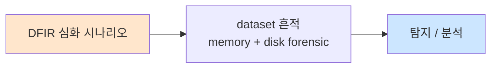

# Week 07: 네트워크 포렌식

## 학습 목표
- Wireshark/tshark를 심화 수준으로 사용하여 패킷 분석을 수행할 수 있다
- NetFlow/sFlow 데이터를 분석하여 네트워크 트래픽 이상을 탐지할 수 있다
- PCAP 파일에서 악성 통신, 데이터 유출, C2 트래픽을 식별할 수 있다
- DNS, HTTP, TLS 프로토콜 분석으로 위협을 탐지할 수 있다
- 네트워크 포렌식 증거를 체계적으로 수집하고 보존할 수 있다

## 실습 환경 (공통)

| 서버 | IP | 역할 | 접속 |
|------|-----|------|------|
| bastion | 10.20.30.201 | Control Plane (Bastion) | `ssh ccc@10.20.30.201` (pw: 1) |
| secu | 10.20.30.1 | 방화벽/IPS (nftables, Suricata) | `ssh ccc@10.20.30.1` |
| web | 10.20.30.80 | 웹서버 (JuiceShop:3000, Apache:80) | `ssh ccc@10.20.30.80` |
| siem | 10.20.30.100 | SIEM (Wazuh Dashboard:443, OpenCTI:8080) | `ssh ccc@10.20.30.100` |

**Bastion API:** `http://localhost:9100` / Key: `ccc-api-key-2026`

## 강의 시간 배분 (3시간)

| 시간 | 내용 | 유형 |
|------|------|------|
| 0:00-0:50 | 네트워크 포렌식 이론 + 증거 수집 (Part 1) | 강의 |
| 0:50-1:30 | tshark 심화 + 필터 (Part 2) | 강의/데모 |
| 1:30-1:40 | 휴식 | - |
| 1:40-2:30 | PCAP 분석 실습 (Part 3) | 실습 |
| 2:30-3:10 | 프로토콜 심화 분석 + 자동화 (Part 4) | 실습 |
| 3:10-3:20 | 정리 + 과제 안내 | 정리 |

---

## 용어 해설

| 용어 | 영문 | 설명 | 비유 |
|------|------|------|------|
| **PCAP** | Packet Capture | 네트워크 패킷 캡처 파일 | CCTV 녹화 영상 |
| **tshark** | Terminal Shark | Wireshark의 CLI 버전 | 터미널 CCTV 재생기 |
| **NetFlow** | NetFlow | 네트워크 플로우(세션) 통계 데이터 | 차량 통행량 기록 |
| **BPF** | Berkeley Packet Filter | 패킷 필터링 문법 | CCTV 검색 필터 |
| **display filter** | Display Filter | Wireshark 표시 필터 | 특정 영상만 보기 |
| **DPI** | Deep Packet Inspection | 패킷 내용까지 검사 | 소포 내용물 검사 |
| **C2** | Command and Control | 공격자의 원격 제어 통신 | 스파이의 비밀 통신 |
| **비콘** | Beacon | C2 서버에 주기적으로 접속하는 패턴 | 정기 보고 |
| **페이로드** | Payload | 패킷의 실제 데이터 부분 | 소포 내용물 |
| **핸드셰이크** | Handshake | TCP/TLS 연결 설정 과정 | 악수(인사) |

---

# Part 1: 네트워크 포렌식 이론 + 증거 수집 (50분)

## 1.1 네트워크 포렌식이란?

네트워크 포렌식은 **네트워크 트래픽을 캡처, 기록, 분석하여 보안 사고의 증거를 확보**하는 디지털 포렌식의 한 분야다.

### 네트워크 포렌식 데이터 유형

```
[Full Packet Capture (PCAP)]
  → 패킷 전체 내용 기록
  → 가장 상세하지만 용량 큼
  → 도구: tcpdump, Wireshark, tshark

[Flow Data (NetFlow/sFlow)]
  → 세션 메타데이터만 기록 (IP, 포트, 크기, 시간)
  → 용량 작음, 장기 보관 가능
  → 도구: nfdump, ntopng

[Log Data]
  → 방화벽, IDS, 프록시 로그
  → 이벤트 기반 기록
  → 도구: Wazuh, Suricata

[선택 기준]
  PCAP:    "무엇을 말했는가" (내용)
  Flow:    "누가 누구와 대화했는가" (메타)
  Log:     "무엇이 탐지되었는가" (이벤트)
```

## 1.2 증거 수집 원칙

```
[네트워크 포렌식 증거 수집 4원칙]

1. 무결성 (Integrity)
   → 캡처 파일의 해시값 즉시 기록
   → 원본은 읽기 전용으로 보존
   → 분석은 복사본으로 수행

2. 연속성 (Chain of Custody)
   → 증거 접근 기록 유지
   → 누가, 언제, 왜 접근했는지 기록

3. 적시성 (Timeliness)
   → 증거는 빨리 수집할수록 좋음
   → 네트워크 데이터는 휘발성 높음

4. 합법성 (Legality)
   → 캡처 권한 확인 (자사 네트워크)
   → 개인정보 처리 규정 준수
```

## 1.3 패킷 캡처 실습

```bash
# tcpdump로 패킷 캡처
# secu 서버(방화벽)에서 트래픽 캡처
ssh ccc@10.20.30.1 << 'EOF'
echo "=== 네트워크 인터페이스 확인 ==="
ip link show | grep -E "^[0-9]+:" | awk '{print $2}' | tr -d ':'

echo ""
echo "=== 10초간 패킷 캡처 ==="
sudo timeout 10 tcpdump -i any -c 100 -w /tmp/capture.pcap \
  'net 10.20.30.0/24' 2>&1 || echo "캡처 완료"

echo ""
echo "=== 캡처 파일 정보 ==="
ls -la /tmp/capture.pcap 2>/dev/null
sudo tcpdump -r /tmp/capture.pcap -q 2>/dev/null | head -20

echo ""
echo "=== 해시값 기록 (증거 무결성) ==="
sha256sum /tmp/capture.pcap 2>/dev/null
EOF
```

> **명령어 해설**:
> - `tcpdump -i any`: 모든 인터페이스에서 캡처
> - `-c 100`: 100개 패킷만 캡처
> - `-w /tmp/capture.pcap`: PCAP 파일로 저장
> - `'net 10.20.30.0/24'`: BPF 필터 (내부 네트워크만)
>
> **트러블슈팅**:
> - "Permission denied" → sudo 필요
> - "No such device" → 인터페이스 이름 확인

---

# Part 2: tshark 심화 + 필터 (40분)

## 2.1 tshark 핵심 옵션

```bash
# tshark 기본 사용법
echo "=== tshark 버전 확인 ==="
tshark --version 2>/dev/null | head -1 || echo "tshark 미설치"

# 주요 옵션 정리
echo ""
echo "=== tshark 주요 옵션 ==="
cat << 'INFO'
-i <interface>    캡처 인터페이스
-r <file>         PCAP 파일 읽기
-w <file>         PCAP 파일 쓰기
-c <count>        패킷 수 제한
-f <filter>       캡처 필터 (BPF)
-Y <filter>       표시 필터 (display filter)
-T fields         필드 출력 모드
-e <field>        출력할 필드 지정
-q                통계 모드 (quiet)
-z <stat>         통계 유형 지정
INFO
```

## 2.2 Display Filter 심화

```
[IP 필터]
ip.addr == 10.20.30.80          # 특정 IP (src/dst)
ip.src == 10.20.30.80           # 출발지
ip.dst == 10.20.30.100          # 목적지
!(ip.addr == 10.20.30.0/24)    # 내부 IP 제외

[TCP 필터]
tcp.port == 80                   # 포트 (src/dst)
tcp.dstport == 443               # 목적지 포트
tcp.flags.syn == 1               # SYN 플래그
tcp.flags.rst == 1               # RST 플래그
tcp.analysis.retransmission      # 재전송 패킷

[HTTP 필터]
http.request.method == "POST"    # POST 요청
http.response.code == 200        # 200 응답
http.request.uri contains "admin"# URI에 admin 포함
http.host == "evil.com"          # 호스트 필터

[DNS 필터]
dns.qry.name contains "evil"    # DNS 쿼리 도메인
dns.qry.type == 1               # A 레코드 쿼리
dns.flags.response == 1          # DNS 응답

[TLS 필터]
tls.handshake.type == 1          # Client Hello
tls.handshake.extensions.server_name  # SNI
ssl.handshake.ciphersuite        # 암호 스위트

[조합]
(ip.src == 10.20.30.80) && (tcp.dstport == 443)
http.request || dns.qry.name
!(arp || dns || mdns)            # 노이즈 제거
```

## 2.3 tshark 통계 분석

```bash
# PCAP 파일 생성 (실습용)
ssh ccc@10.20.30.1 << 'EOF'
sudo timeout 15 tcpdump -i any -c 500 -w /tmp/forensic.pcap \
  'net 10.20.30.0/24' 2>&1
ls -la /tmp/forensic.pcap 2>/dev/null
EOF

# PCAP 파일 복사
scp -o StrictHostKeyChecking=no ccc@10.20.30.1:/tmp/forensic.pcap \
  /tmp/forensic.pcap 2>/dev/null

# tshark 통계 분석 (로컬 PCAP이 있는 경우)
if [ -f /tmp/forensic.pcap ]; then
    echo "=== 프로토콜 분포 ==="
    tshark -r /tmp/forensic.pcap -q -z io,phs 2>/dev/null | head -30

    echo ""
    echo "=== 대화 상위 10 ==="
    tshark -r /tmp/forensic.pcap -q -z conv,tcp 2>/dev/null | head -15

    echo ""
    echo "=== HTTP 요청 ==="
    tshark -r /tmp/forensic.pcap -Y "http.request" \
      -T fields -e ip.src -e http.request.method -e http.host -e http.request.uri \
      2>/dev/null | head -20

    echo ""
    echo "=== DNS 쿼리 ==="
    tshark -r /tmp/forensic.pcap -Y "dns.flags.response == 0" \
      -T fields -e ip.src -e dns.qry.name \
      2>/dev/null | sort | uniq -c | sort -rn | head -15
else
    echo "PCAP 파일 없음 - tshark 명령어 예시만 표시"
    echo ""
    echo "# 프로토콜 분포"
    echo "tshark -r capture.pcap -q -z io,phs"
    echo ""
    echo "# TCP 대화 통계"
    echo "tshark -r capture.pcap -q -z conv,tcp"
    echo ""
    echo "# HTTP 요청 추출"
    echo "tshark -r capture.pcap -Y 'http.request' -T fields -e ip.src -e http.host -e http.request.uri"
fi
```

> **결과 해석**: 프로토콜 분포에서 비정상적인 프로토콜(IRC, 비표준 포트)이 보이면 C2 통신 가능성. DNS 쿼리에서 알 수 없는 도메인이 반복되면 비콘 패턴 의심.

---

# Part 3: PCAP 분석 실습 (50분)

## 3.1 실시간 트래픽 캡처 + 분석

> **실습 목적**: 실습 환경의 실시간 트래픽을 캡처하고 분석하여 네트워크 포렌식 기법을 익힌다.
>
> **배우는 것**: tcpdump/tshark 실전 활용, BPF 필터, 트래픽 패턴 분석

```bash
# 웹서버로 트래픽을 발생시키면서 캡처
echo "=== Step 1: 트래픽 발생 ==="
# 백그라운드로 웹 요청 생성
for i in $(seq 1 10); do
    curl -s -o /dev/null http://10.20.30.80/ 2>/dev/null &
    curl -s -o /dev/null "http://10.20.30.80/api/test?id=1 OR 1=1" 2>/dev/null &
done
wait

echo ""
echo "=== Step 2: secu에서 캡처된 트래픽 분석 ==="
ssh ccc@10.20.30.1 << 'REMOTE'
# 방화벽에서 최근 패킷 분석
if [ -f /tmp/forensic.pcap ]; then
    echo "--- IP 주소별 패킷 수 ---"
    sudo tcpdump -r /tmp/forensic.pcap -nn 2>/dev/null | \
      awk '{print $3}' | cut -d. -f1-4 | sort | uniq -c | sort -rn | head -10
    
    echo ""
    echo "--- 포트별 분포 ---"
    sudo tcpdump -r /tmp/forensic.pcap -nn 'tcp' 2>/dev/null | \
      awk '{print $5}' | rev | cut -d. -f1 | rev | sort | uniq -c | sort -rn | head -10
    
    echo ""
    echo "--- SYN 스캔 탐지 (SYN without ACK) ---"
    sudo tcpdump -r /tmp/forensic.pcap 'tcp[tcpflags] & (tcp-syn) != 0 and tcp[tcpflags] & (tcp-ack) == 0' -nn 2>/dev/null | wc -l
    echo "건 (SYN-only 패킷)"
fi
REMOTE
```

## 3.2 C2 비콘 패턴 분석

```bash
cat << 'SCRIPT' > /tmp/detect_beacon.py
#!/usr/bin/env python3
"""C2 비콘 패턴 탐지 시뮬레이션"""
import random
import statistics
from datetime import datetime, timedelta

# C2 비콘 시뮬레이션 데이터
# 정상 트래픽: 랜덤 간격
normal_intervals = [random.uniform(1, 600) for _ in range(20)]

# C2 비콘: 일정한 간격 (~60초 + 약간의 지터)
c2_intervals = [60 + random.uniform(-3, 3) for _ in range(20)]

def analyze_intervals(name, intervals):
    mean = statistics.mean(intervals)
    stdev = statistics.stdev(intervals)
    cv = stdev / mean  # 변동 계수 (Coefficient of Variation)
    
    print(f"\n--- {name} ---")
    print(f"  평균 간격: {mean:.1f}초")
    print(f"  표준편차:  {stdev:.1f}초")
    print(f"  변동계수:  {cv:.3f}")
    
    if cv < 0.1:
        print(f"  [경고] 매우 규칙적 → C2 비콘 가능성 높음!")
    elif cv < 0.3:
        print(f"  [주의] 비교적 규칙적 → 추가 분석 필요")
    else:
        print(f"  [정상] 불규칙적 → 정상 트래픽 패턴")

print("=" * 50)
print("  C2 비콘 패턴 분석")
print("=" * 50)

analyze_intervals("정상 HTTP 트래픽", normal_intervals)
analyze_intervals("C2 비콘 의심 트래픽", c2_intervals)

print("\n=== 탐지 기준 ===")
print("  변동계수(CV) < 0.1: C2 비콘 가능성 매우 높음")
print("  변동계수(CV) < 0.3: 추가 분석 필요")
print("  변동계수(CV) > 0.3: 정상 트래픽")
SCRIPT

python3 /tmp/detect_beacon.py
```

> **배우는 것**: C2 통신의 특징인 "일정한 간격의 비콘"을 통계적으로 탐지하는 방법. 변동계수(CV)가 낮을수록 규칙적인 통신으로 C2 의심도가 높다.

## 3.3 DNS 터널링 탐지

```bash
cat << 'SCRIPT' > /tmp/detect_dns_tunnel.py
#!/usr/bin/env python3
"""DNS 터널링 탐지"""
import random
import string

# 정상 DNS 쿼리
normal_dns = [
    "www.google.com", "mail.naver.com", "api.github.com",
    "cdn.example.com", "update.microsoft.com",
]

# DNS 터널링 쿼리 (긴 서브도메인, 인코딩된 데이터)
tunnel_dns = [
    f"{''.join(random.choices(string.ascii_lowercase + string.digits, k=50))}.evil.example.com"
    for _ in range(5)
]

print("=" * 60)
print("  DNS 터널링 탐지 분석")
print("=" * 60)

print("\n--- 정상 DNS 쿼리 ---")
for q in normal_dns:
    labels = q.split('.')
    max_label = max(len(l) for l in labels)
    entropy = len(set(q)) / len(q)
    print(f"  {q:40s} 최대라벨: {max_label:2d}자 엔트로피: {entropy:.3f}")

print("\n--- DNS 터널링 의심 쿼리 ---")
for q in tunnel_dns:
    labels = q.split('.')
    max_label = max(len(l) for l in labels)
    entropy = len(set(q)) / len(q)
    flag = "[경고]" if max_label > 30 or entropy > 0.6 else ""
    print(f"  {q[:40]:40s}... 최대라벨: {max_label:2d}자 엔트로피: {entropy:.3f} {flag}")

print("\n=== 탐지 기준 ===")
print("  라벨 길이 > 30자: DNS 터널링 의심")
print("  쿼리 엔트로피 > 0.6: 인코딩된 데이터 의심")
print("  단일 도메인 쿼리 빈도 > 100/분: 비정상")
SCRIPT

python3 /tmp/detect_dns_tunnel.py
```

## 3.4 HTTP 페이로드 분석

```bash
# tshark로 HTTP 요청/응답 상세 분석
echo "=== HTTP 페이로드 분석 명령어 ==="

cat << 'INFO'
# HTTP POST 요청 본문 추출
tshark -r capture.pcap -Y "http.request.method == POST" \
  -T fields -e ip.src -e http.host -e http.request.uri \
  -e http.file_data

# HTTP 응답에서 파일 다운로드 추출
tshark -r capture.pcap --export-objects http,/tmp/http_objects/

# SQL Injection 시도 탐지
tshark -r capture.pcap -Y "http.request.uri contains \"OR 1=1\" || http.request.uri contains \"UNION SELECT\"" \
  -T fields -e ip.src -e http.request.uri

# User-Agent 분석 (비정상 UA 탐지)
tshark -r capture.pcap -Y "http.request" \
  -T fields -e http.user_agent | sort | uniq -c | sort -rn

# 대용량 응답 탐지 (데이터 유출 의심)
tshark -r capture.pcap -Y "http.response and http.content_length > 1000000" \
  -T fields -e ip.src -e ip.dst -e http.content_length
INFO
```

---

# Part 4: 프로토콜 심화 분석 + 자동화 (40분)

## 4.1 TLS 핸드셰이크 분석

```bash
cat << 'SCRIPT' > /tmp/tls_analysis.py
#!/usr/bin/env python3
"""TLS 핸드셰이크 분석 포인트"""

analysis_points = [
    {
        "항목": "SNI (Server Name Indication)",
        "정상": "알려진 도메인 (google.com, naver.com)",
        "의심": "IP 직접 접속, DGA 도메인, 무료 TLD (.tk, .ml)",
        "tshark": "tshark -r cap.pcap -Y 'tls.handshake.type==1' -T fields -e tls.handshake.extensions_server_name"
    },
    {
        "항목": "JA3 해시 (TLS 핑거프린트)",
        "정상": "알려진 브라우저/앱 JA3",
        "의심": "알려진 악성코드 JA3 매칭",
        "tshark": "tshark -r cap.pcap -Y 'tls.handshake.type==1' -T fields -e tls.handshake.ja3"
    },
    {
        "항목": "인증서 발급자",
        "정상": "알려진 CA (DigiCert, Let's Encrypt)",
        "의심": "자체 서명, 알 수 없는 CA",
        "tshark": "tshark -r cap.pcap -Y 'tls.handshake.type==11' -T fields -e x509ce.dNSName"
    },
    {
        "항목": "TLS 버전",
        "정상": "TLS 1.2 / 1.3",
        "의심": "TLS 1.0, SSL 3.0 (구형)",
        "tshark": "tshark -r cap.pcap -Y 'tls.handshake.type==1' -T fields -e tls.handshake.version"
    },
]

print("=" * 60)
print("  TLS 핸드셰이크 분석 가이드")
print("=" * 60)

for point in analysis_points:
    print(f"\n--- {point['항목']} ---")
    print(f"  정상: {point['정상']}")
    print(f"  의심: {point['의심']}")
    print(f"  명령: {point['tshark']}")
SCRIPT

python3 /tmp/tls_analysis.py
```

## 4.2 Suricata PCAP 분석

```bash
# Suricata로 PCAP 파일 분석
ssh ccc@10.20.30.1 << 'REMOTE'
if [ -f /tmp/forensic.pcap ]; then
    echo "=== Suricata 오프라인 PCAP 분석 ==="
    sudo suricata -r /tmp/forensic.pcap -l /tmp/suricata_analysis/ \
      --set outputs.0.fast.enabled=yes 2>/dev/null
    
    echo ""
    echo "--- Suricata 탐지 결과 ---"
    cat /tmp/suricata_analysis/fast.log 2>/dev/null | head -20 || echo "(탐지 없음)"
    
    echo ""
    echo "--- EVE JSON 로그 ---"
    cat /tmp/suricata_analysis/eve.json 2>/dev/null | \
      python3 -c "
import sys, json
for line in sys.stdin:
    try:
        e = json.loads(line)
        if e.get('event_type') == 'alert':
            print(f\"  Alert: {e['alert']['signature']} ({e['src_ip']}:{e.get('src_port','')} -> {e['dest_ip']}:{e.get('dest_port','')})\")
    except: pass
" | head -10 || echo "(EVE 로그 없음)"
    
    rm -rf /tmp/suricata_analysis/
else
    echo "캡처 파일 없음"
fi
REMOTE
```

## 4.3 Bastion 자동화 네트워크 분석

```bash
export BASTION_API_KEY="ccc-api-key-2026"

PROJECT_ID=$(curl -s -X POST http://localhost:9100/projects \
  -H "Content-Type: application/json" \
  -H "X-API-Key: $BASTION_API_KEY" \
  -d '{
    "name": "network-forensics",
    "request_text": "네트워크 트래픽 포렌식 분석",
    "master_mode": "external"
  }' | python3 -c "import sys,json; print(json.load(sys.stdin)['id'])")

curl -s -X POST "http://localhost:9100/projects/$PROJECT_ID/plan" \
  -H "X-API-Key: $BASTION_API_KEY"
curl -s -X POST "http://localhost:9100/projects/$PROJECT_ID/execute" \
  -H "X-API-Key: $BASTION_API_KEY"

# 전체 서버 네트워크 상태 수집
curl -s -X POST "http://localhost:9100/projects/$PROJECT_ID/execute-plan" \
  -H "Content-Type: application/json" \
  -H "X-API-Key: $BASTION_API_KEY" \
  -d '{
    "tasks": [
      {
        "order": 1,
        "instruction_prompt": "ss -tnp 2>/dev/null | grep ESTAB | wc -l && ss -tnp 2>/dev/null | head -10",
        "risk_level": "low",
        "subagent_url": "http://10.20.30.1:8002"
      },
      {
        "order": 2,
        "instruction_prompt": "ss -tnp 2>/dev/null | grep ESTAB | wc -l && ss -tnp 2>/dev/null | head -10",
        "risk_level": "low",
        "subagent_url": "http://10.20.30.80:8002"
      }
    ],
    "subagent_url": "http://localhost:8002"
  }'
```

## 4.4 네트워크 포렌식 타임라인

```bash
cat << 'SCRIPT' > /tmp/network_timeline.py
#!/usr/bin/env python3
"""네트워크 포렌식 타임라인 생성"""
from datetime import datetime, timedelta

events = [
    {"time": "02:00:00", "type": "SCAN", "src": "203.0.113.50", "dst": "10.20.30.80",
     "detail": "포트 스캔 (22,80,443,3306,8080)"},
    {"time": "02:05:23", "type": "ATTACK", "src": "203.0.113.50", "dst": "10.20.30.80:80",
     "detail": "SQL Injection 시도 (/api/products?id=1 OR 1=1)"},
    {"time": "02:05:45", "type": "ATTACK", "src": "203.0.113.50", "dst": "10.20.30.80:80",
     "detail": "웹셸 업로드 시도 (POST /upload shell.php)"},
    {"time": "02:06:10", "type": "ACCESS", "src": "203.0.113.50", "dst": "10.20.30.80:80",
     "detail": "웹셸 접근 (GET /uploads/shell.php?cmd=id)"},
    {"time": "02:06:30", "type": "C2", "src": "10.20.30.80", "dst": "203.0.113.50:4444",
     "detail": "리버스 셸 연결 (TCP SYN)"},
    {"time": "02:07:00", "type": "LATERAL", "src": "10.20.30.80", "dst": "10.20.30.100:22",
     "detail": "내부 SSH 접근 시도"},
    {"time": "02:10:00", "type": "EXFIL", "src": "10.20.30.100", "dst": "203.0.113.50:443",
     "detail": "대량 데이터 전송 (15MB TLS)"},
    {"time": "02:15:00", "type": "DETECT", "src": "10.20.30.100", "dst": "-",
     "detail": "Wazuh 경보: 비정상 아웃바운드 트래픽"},
]

print("=" * 80)
print("  네트워크 포렌식 타임라인")
print("=" * 80)
print(f"\n{'시각':>10s} {'유형':>8s} {'출발지':>16s} → {'목적지':>20s}  설명")
print("-" * 80)

for e in events:
    type_color = {
        "SCAN": "SCAN", "ATTACK": "ATTACK", "ACCESS": "ACCESS",
        "C2": "C2", "LATERAL": "LATERAL", "EXFIL": "EXFIL", "DETECT": "DETECT"
    }
    print(f"{e['time']:>10s} [{e['type']:>7s}] {e['src']:>16s} → {e['dst']:>20s}  {e['detail']}")

print("\n=== Kill Chain 매핑 ===")
print("  정찰(02:00) → 무기화+침투(02:05) → 설치(02:06)")
print("  → C2(02:06) → 측면이동(02:07) → 유출(02:10) → 탐지(02:15)")
SCRIPT

python3 /tmp/network_timeline.py
```

---

## 체크리스트

- [ ] 네트워크 포렌식의 3가지 데이터 유형(PCAP/Flow/Log)을 구분할 수 있다
- [ ] 증거 수집 4원칙(무결성, 연속성, 적시성, 합법성)을 알고 있다
- [ ] tcpdump로 패킷을 캡처하고 BPF 필터를 적용할 수 있다
- [ ] tshark display filter를 사용하여 패킷을 필터링할 수 있다
- [ ] tshark 통계 기능(-z)으로 트래픽 분석을 할 수 있다
- [ ] C2 비콘 패턴을 통계적으로 탐지할 수 있다
- [ ] DNS 터널링의 특징을 알고 탐지할 수 있다
- [ ] TLS 핸드셰이크 분석 포인트(SNI, JA3, 인증서)를 알고 있다
- [ ] Suricata로 PCAP 오프라인 분석을 수행할 수 있다
- [ ] 네트워크 포렌식 타임라인을 구성할 수 있다

---

## 과제

### 과제 1: 트래픽 캡처 + 분석 (필수)

실습 환경에서 15분간 트래픽을 캡처하고:
1. 프로토콜 분포 분석
2. 상위 통신 쌍(conversation) 식별
3. 비정상 패턴 1개 이상 식별
4. 네트워크 포렌식 타임라인 작성

### 과제 2: C2 통신 탐지 (선택)

시뮬레이션된 C2 비콘 패턴을 생성하고:
1. tshark로 비콘 간격 추출
2. 변동계수로 규칙성 분석
3. DNS/HTTP/TLS 관점 분석
4. Suricata 탐지 룰 작성

---

## 보충: NetFlow 분석 + 고급 tshark 활용

### NetFlow 데이터 시뮬레이션 분석

```bash
cat << 'SCRIPT' > /tmp/netflow_analysis.py
#!/usr/bin/env python3
"""NetFlow 데이터 분석 시뮬레이션"""
import random
from datetime import datetime, timedelta
from collections import defaultdict

# NetFlow 레코드 시뮬레이션
flows = []
base_time = datetime(2026, 4, 4, 10, 0, 0)

# 정상 트래픽
for i in range(50):
    flows.append({
        "start": base_time + timedelta(seconds=random.randint(0, 3600)),
        "src": "10.20.30.201",
        "dst": f"10.20.30.{random.choice([1, 80, 100])}",
        "sport": random.randint(32768, 65535),
        "dport": random.choice([22, 80, 443, 8000]),
        "bytes": random.randint(100, 50000),
        "packets": random.randint(1, 100),
        "protocol": "TCP",
    })

# 의심 트래픽: C2 비콘
for i in range(20):
    flows.append({
        "start": base_time + timedelta(seconds=60 * i + random.randint(-2, 2)),
        "src": "10.20.30.80",
        "dst": "203.0.113.50",
        "sport": random.randint(32768, 65535),
        "dport": 443,
        "bytes": random.randint(200, 500),
        "packets": random.randint(3, 8),
        "protocol": "TCP",
    })

# 의심 트래픽: 대량 데이터 전송
flows.append({
    "start": base_time + timedelta(seconds=1800),
    "src": "10.20.30.100",
    "dst": "203.0.113.50",
    "sport": 54321,
    "dport": 443,
    "bytes": 15_000_000,  # 15MB
    "packets": 10000,
    "protocol": "TCP",
})

print("=" * 70)
print("  NetFlow 분석 결과")
print("=" * 70)

# 1. 상위 통신량 쌍
print("\n--- 상위 통신량 (바이트 기준) ---")
pair_bytes = defaultdict(int)
for f in flows:
    key = f"{f['src']} → {f['dst']}:{f['dport']}"
    pair_bytes[key] += f['bytes']

for pair, total in sorted(pair_bytes.items(), key=lambda x: -x[1])[:10]:
    mb = total / 1_000_000
    print(f"  {pair:45s} {mb:8.2f} MB")

# 2. 외부 IP 통신
print("\n--- 외부 IP 통신 ---")
external_flows = [f for f in flows if not f['dst'].startswith('10.')]
for f in sorted(external_flows, key=lambda x: -x['bytes'])[:5]:
    print(f"  {f['src']:16s} → {f['dst']:16s}:{f['dport']} "
          f"({f['bytes']:>10,} bytes, {f['packets']} pkts)")

# 3. 비콘 패턴 탐지
print("\n--- 비콘 패턴 분석 ---")
beacon_flows = [f for f in flows if f['dst'] == '203.0.113.50' and f['bytes'] < 1000]
if len(beacon_flows) > 5:
    intervals = []
    sorted_beacons = sorted(beacon_flows, key=lambda x: x['start'])
    for i in range(1, len(sorted_beacons)):
        diff = (sorted_beacons[i]['start'] - sorted_beacons[i-1]['start']).total_seconds()
        intervals.append(diff)
    
    import statistics
    mean_interval = statistics.mean(intervals)
    stdev_interval = statistics.stdev(intervals) if len(intervals) > 1 else 0
    cv = stdev_interval / mean_interval if mean_interval > 0 else 0
    
    print(f"  10.20.30.80 → 203.0.113.50:443")
    print(f"  플로우 수: {len(beacon_flows)}개")
    print(f"  평균 간격: {mean_interval:.1f}초")
    print(f"  변동계수: {cv:.3f}")
    if cv < 0.1:
        print(f"  [경고] 매우 규칙적 통신 → C2 비콘 의심!")
    
# 4. 대량 전송 탐지
print("\n--- 대량 데이터 전송 (1MB 이상) ---")
large_flows = [f for f in flows if f['bytes'] > 1_000_000]
for f in large_flows:
    mb = f['bytes'] / 1_000_000
    print(f"  [경고] {f['src']} → {f['dst']}:{f['dport']} ({mb:.1f} MB)")
    print(f"          → 데이터 유출 의심!")
SCRIPT

python3 /tmp/netflow_analysis.py
```

> **결과 해석**: NetFlow에서 외부 IP로의 규칙적 소량 통신(비콘)과 대량 전송(유출)을 식별하는 것이 핵심이다. PCAP 없이도 Flow 데이터만으로 C2/유출을 탐지할 수 있다.

### tshark 고급 통계 활용

```bash
echo "=== tshark 고급 통계 명령어 ==="

cat << 'INFO'
# 1. 시간대별 트래픽 분포 (1분 단위)
tshark -r capture.pcap -q -z io,stat,60

# 2. HTTP 요청 메서드 분포
tshark -r capture.pcap -q -z http,tree

# 3. DNS 도메인별 쿼리 수
tshark -r capture.pcap -Y "dns.flags.response == 0" \
  -T fields -e dns.qry.name | sort | uniq -c | sort -rn | head -20

# 4. TLS SNI(Server Name) 목록
tshark -r capture.pcap -Y "tls.handshake.type == 1" \
  -T fields -e tls.handshake.extensions_server_name | sort -u

# 5. TCP 재전송 분석 (네트워크 이상)
tshark -r capture.pcap -q -z io,stat,10,"tcp.analysis.retransmission"

# 6. 특정 IP의 세션 추적
tshark -r capture.pcap -Y "ip.addr == 203.0.113.50" \
  -T fields -e frame.time -e ip.src -e ip.dst -e tcp.dstport -e frame.len

# 7. HTTP 응답 크기 Top 10 (데이터 유출 탐지)
tshark -r capture.pcap -Y "http.response" \
  -T fields -e ip.dst -e http.content_length | \
  sort -t$'\t' -k2 -rn | head -10

# 8. 비표준 포트 HTTP 트래픽
tshark -r capture.pcap -Y "http && !(tcp.port == 80 || tcp.port == 443 || tcp.port == 8080)"

# 9. ICMP 터널링 의심
tshark -r capture.pcap -Y "icmp && frame.len > 100" \
  -T fields -e ip.src -e ip.dst -e frame.len

# 10. 패킷 크기 분포
tshark -r capture.pcap -T fields -e frame.len | \
  sort -n | uniq -c | sort -rn | head -15
INFO
```

> **실전 활용**: 위 명령어를 스크립트로 묶어 "네트워크 포렌식 초기 분석 킷"으로 사용할 수 있다. 새 PCAP을 받으면 이 스크립트를 먼저 실행하여 전체 윤곽을 파악한 후 세부 분석에 진입한다.

### HTTP 객체 추출 + 파일 분석

```bash
echo "=== HTTP 객체 추출 기법 ==="

cat << 'INFO'
# tshark로 HTTP 파일 추출
tshark -r capture.pcap --export-objects http,/tmp/http_export/
ls -la /tmp/http_export/

# 추출된 파일 유형 확인
file /tmp/http_export/*

# 추출된 파일 해시 계산
sha256sum /tmp/http_export/*

# 의심 파일 YARA 스캔
yara /path/to/rules.yar /tmp/http_export/

# SMB 파일 추출 (내부 측면 이동 시)
tshark -r capture.pcap --export-objects smb,/tmp/smb_export/

# FTP 전송 파일 추출
tshark -r capture.pcap -Y "ftp-data" \
  -T fields -e tcp.payload > /tmp/ftp_data.bin
INFO

echo ""
echo "→ HTTP 객체 추출은 웹셸 다운로드, 악성코드 전달 등을 확인하는 핵심 기법이다."
```

### 포렌식 PCAP 보고서 자동 생성

```bash
cat << 'SCRIPT' > /tmp/pcap_report.py
#!/usr/bin/env python3
"""네트워크 포렌식 PCAP 분석 보고서 자동 생성"""

report = {
    "case_id": "NF-2026-0404-001",
    "pcap_file": "capture_secu_20260404.pcap",
    "capture_start": "2026-04-04 10:00:00",
    "capture_end": "2026-04-04 10:15:00",
    "total_packets": 15234,
    "total_bytes": 8_543_210,
    "protocols": {
        "TCP": 12500, "UDP": 2200, "ICMP": 300, "ARP": 234
    },
    "top_talkers": [
        ("10.20.30.201", "10.20.30.80", 3500),
        ("10.20.30.80", "203.0.113.50", 1200),
        ("10.20.30.201", "10.20.30.100", 800),
    ],
    "findings": [
        {"severity": "Critical", "finding": "10.20.30.80 → 203.0.113.50:443 규칙적 통신 (비콘 의심)"},
        {"severity": "High", "finding": "10.20.30.100 → 203.0.113.50:443 15MB 대량 전송 (유출 의심)"},
        {"severity": "Medium", "finding": "203.0.113.50 → 10.20.30.80:80 SQL Injection 패턴"},
    ],
}

print("=" * 60)
print(f"  네트워크 포렌식 분석 보고서")
print(f"  Case: {report['case_id']}")
print("=" * 60)

print(f"\n파일: {report['pcap_file']}")
print(f"기간: {report['capture_start']} ~ {report['capture_end']}")
print(f"패킷: {report['total_packets']:,}개 / {report['total_bytes']:,} bytes")

print(f"\n프로토콜 분포:")
for proto, count in report['protocols'].items():
    pct = count / report['total_packets'] * 100
    bar = '#' * int(pct / 2)
    print(f"  {proto:6s}: {count:6d} ({pct:5.1f}%) {bar}")

print(f"\n상위 통신 쌍:")
for src, dst, count in report['top_talkers']:
    print(f"  {src:16s} → {dst:16s}: {count:,} 패킷")

print(f"\n발견 사항:")
for f in report['findings']:
    print(f"  [{f['severity']:8s}] {f['finding']}")
SCRIPT

python3 /tmp/pcap_report.py
```

---

## 다음 주 예고

**Week 08: 메모리 포렌식**에서는 Volatility3를 사용하여 메모리 덤프에서 악성 프로세스, 인젝션, 루트킷을 탐지하는 방법을 학습한다.

---

## 웹 UI 실습

### Wazuh Dashboard — 네트워크 포렌식 연계

> **접속 URL:** `https://10.20.30.100:443`

1. 브라우저에서 `https://10.20.30.100:443` 접속 → 로그인
2. **Modules → Security events** 클릭
3. 네트워크 관련 경보 필터링:
   ```
   rule.groups: (suricata OR network) AND rule.level >= 8
   ```
4. Suricata 경보에서 `data.src_ip`, `data.dest_ip`, `data.dest_port` 필드 확인
5. 의심 IP를 기반으로 시간대별 통신 패턴 분석
6. **Dashboards** 에서 네트워크 경보 히트맵 확인 (시간 × 심각도)

### OpenCTI — 네트워크 IOC 위협 헌팅

> **접속 URL:** `http://10.20.30.100:8080`

1. `http://10.20.30.100:8080` 접속 → 로그인
2. **Observations → Indicators** → 필터: `pattern_type = STIX` + `observable_type = IPv4-Addr`
3. 네트워크 포렌식에서 발견한 의심 IP를 검색하여 알려진 위협 여부 확인
4. **Observations → Observables** 에서 도메인/URL 타입 검색
5. 매칭된 결과의 **Knowledge** 탭에서 C2 서버, 캠페인 연관성 분석

---

## 📂 실습 참조 파일 가이드

> 이번 주 실습에서 **실제로 조작하는** 솔루션의 기능·경로·파일·설정·UI 요점입니다.

### Wireshark · tshark
> **역할:** 네트워크 패킷 분석 GUI/CLI  
> **실행 위치:** `분석 PC`  
> **접속/호출:** `wireshark` GUI / `tshark -r <pcap>`

**주요 경로·파일**

| 경로 | 역할 |
|------|------|
| `~/.config/wireshark/preferences` | 컬럼·디코더 설정 |

**핵심 설정·키**

- `Display filter `http.request.method == POST`` — 디코드 후 필터
- `Capture filter `tcp port 80` (BPF)` — 커널 레벨 필터

**UI / CLI 요점**

- Statistics → Conversations — 호스트·포트 쌍 통계
- Follow → TLS Stream — 세션 재구성 (키 제공 시 복호화)
- File → Export Objects → HTTP — 업/다운로드 파일 복원

> **해석 팁.** TLS 1.3 트래픽은 **세션 키 로깅(SSLKEYLOGFILE)** 없이는 복호화 불가. 브라우저에서 `export SSLKEYLOGFILE=...` 후 캡처.

### Suricata IDS/IPS
> **역할:** 시그니처 기반 네트워크 침입 탐지/차단 엔진  
> **실행 위치:** `secu (10.20.30.1)`  
> **접속/호출:** `systemctl status suricata` / `suricatasc` 소켓 / `suricata -T`

**주요 경로·파일**

| 경로 | 역할 |
|------|------|
| `/etc/suricata/suricata.yaml` | 메인 설정 (HOME_NET, af-packet, rule-files) |
| `/etc/suricata/rules/local.rules` | 사용자 커스텀 탐지 룰 |
| `/var/lib/suricata/rules/suricata.rules` | `suricata-update` 병합 룰 |
| `/var/log/suricata/eve.json` | JSON 이벤트 (alert/flow/http/dns/tls) |
| `/var/log/suricata/fast.log` | 알림 1줄 텍스트 로그 |
| `/var/log/suricata/stats.log` | 엔진 성능 통계 |

**핵심 설정·키**

- `HOME_NET` — 내부 대역 — 틀리면 내부/외부 판별 실패
- `af-packet.interface` — 캡처 NIC — 트래픽이 흐르는 인터페이스와 일치해야 함
- `rule-files: ["local.rules"]` — 로드할 룰 파일 목록

**로그·확인 명령**

- `jq 'select(.event_type=="alert")' eve.json` — 알림만 추출
- `grep 'Priority: 1' fast.log` — 고위험 탐지만 빠르게 확인

**UI / CLI 요점**

- `suricata -T -c /etc/suricata/suricata.yaml` — 설정/룰 문법 검증
- `suricatasc -c stats` — 실시간 통계 조회 (런타임 소켓)
- `suricata-update` — 공개 룰셋 다운로드·병합

> **해석 팁.** `stats.log`의 `kernel_drops > 0`이면 누락 발생 → `af-packet threads` 증설. 커스텀 룰 `sid`는 **1,000,000 이상** 할당 권장.

---

## 실제 사례 (WitFoo Precinct 6 — DFIR 심화)

> 출처: WitFoo Precinct 6 Cybersecurity Dataset (Apache 2.0)
> 본 lecture *DFIR 심화* 학습 항목 매칭.

### DFIR 심화 의 dataset 흔적 — "memory + disk forensic"

dataset 의 정상 운영에서 *memory + disk forensic* 신호의 baseline 을 알아두면, *DFIR 심화* 시도 시 발생하는 anomaly 를 정량으로 탐지할 수 있다. 핵심 정량 지표는 — Volatility + plaso.



### Case 1: dataset 정량 지표

| 항목 | 값 |
|---|---|
| 핵심 신호 | memory + disk forensic |
| 정량 baseline | Volatility + plaso |
| 학습 매핑 | RAM dump 분석 |

**자세한 해석**: RAM dump 분석. 이 차이를 정량으로 측정해야 *공격 시도와 정상 운영의 구분* 이 가능. 학생이 baseline 숫자를 외워두면 — 운영 환경에서 anomaly 를 즉시 탐지할 수 있다.

### Case 2: 실전 적용 시나리오

| 단계 | dataset 활용 |
|---|---|
| 시도 식별 | memory + disk forensic 의 spike |
| 정상 vs 이상 | baseline 대비 비율 |
| 룰 작성 | Suricata / Wazuh / Sigma |
| 검증 | dataset 재실행 |

**자세한 해석**: 운영 환경 룰 작성은 — *baseline 측정 → 임계 결정 → 룰 작성 → dataset 검증* 의 4 단계. 한 단계라도 빠지면 false positive 폭증.

### 이 사례에서 학생이 배워야 할 3가지

1. **DFIR 심화 = memory + disk forensic 의 anomaly** — 정량 신호로 탐지.
2. **baseline 숫자 외우기** — Volatility + plaso.
3. **4 단계 룰 작성** — 측정 → 임계 → 룰 → 검증.

**학생 액션**: Volatility 분석.


---

## 부록: 학습 OSS 도구 매트릭스 (Course14 SOC Advanced — Week 07 네트워크 포렌식·PCAP·Zeek·NetFlow)

> 이 부록은 lab `soc-adv-ai/week07.yaml` (15 step + multi_task) 의 모든 명령을
> 실제로 실행 가능한 형태로 도구·옵션·예상 출력·해석을 정리한다. 법적 요건 (CoC +
> 해시 체인) 부터 tcpdump 캡처, tshark/Zeek 통계, HTTP/DNS/TLS 분석, 파일 추출,
> Suricata 상관, JA3, NetFlow, 타임라인 (Plaso/Timesketch), Wireshark 프로파일,
> 증거 보고서 까지 풀 워크플로우.

### lab step → 도구·포렌식 매핑 표

| step | 학습 항목 | 핵심 OSS 도구 / 명령 | 표준 |
|------|----------|---------------------|------|
| s1 | 법적 요건 (해시 체인 + Chain of Custody) | sha256sum + 양식 + RFC 3227 | NIST SP 800-86 |
| s2 | tcpdump 패킷 캡처 (5분) | tcpdump -i -w -G -W | RFC 791 |
| s3 | 캡처 통계 (proto/IP/port/시간) | capinfos + tshark + zeek + jq | - |
| s4 | HTTP 분석 (SQLi/XSS/traversal) | tshark -Y http + zeek http.log | - |
| s5 | DNS 분석 (NXDOMAIN/긴 subdomain/TXT) | zeek dns.log + jq + entropy | - |
| s6 | TCP 세션 재구성 | tshark -z follow + tcpflow | - |
| s7 | 파일 추출 (HTTP) | zeek + foremost + binwalk + bro-cut | - |
| s8 | Suricata + PCAP 상관 | suricata -r + jq + 시간 매칭 | - |
| s9 | TLS 분석 (JA3/JA3S/SNI/Cert) | zeek ssl.log + ja3-tools + tlsx | - |
| s10 | NetFlow / IPFIX 분석 | nfcapd + nfdump + softflowd | RFC 7011 |
| s11 | 공격 타임라인 재구성 | plaso (log2timeline) + Timesketch | - |
| s12 | PCAP 저장 전략 | full vs selective + Stenographer | - |
| s13 | Wireshark 프로파일 + 색상 룰 | profile dir + display filter | - |
| s14 | 증거 보고서 템플릿 | NIST SP 800-86 + ISO/IEC 27037 | - |
| s15 | 네트워크 포렌식 종합 보고서 | markdown + 타임라인 + 증거 catalog | - |
| s99 | 통합 다단계 (s1→s2→s3→s4→s5) | Bastion plan: 법적→캡처→통계→HTTP→DNS | 다중 |

### 학생 환경 준비

```bash
# === [s2·s4·s6] PCAP 도구 ===
sudo apt install -y tcpdump tshark wireshark-common tcpflow tcpreplay

# === [s3·s5·s7·s9] Zeek (네트워크 분석 표준) ===
sudo apt install -y zeek zeek-aux zeek-spicy

# === [s7] 파일 추출 ===
sudo apt install -y foremost binwalk

# === [s9] TLS / JA3 ===
pip install --user ja3
go install -v github.com/projectdiscovery/tlsx/cmd/tlsx@latest

# === [s10] NetFlow ===
sudo apt install -y nfcapd nfdump softflowd

# === [s11] Plaso + Timesketch ===
pip install --user plaso
git clone https://github.com/google/timesketch /tmp/timesketch
cd /tmp/timesketch && docker compose up -d 2>/dev/null

# === [s12] Stenographer ===
git clone https://github.com/google/stenographer /tmp/stenographer

# === [s8] Suricata (이미 설치) ===
ssh ccc@10.20.30.1 'suricata -V'
```

### 핵심 도구별 상세 사용법

#### 도구 1: 법적 요건 + Chain of Custody (Step 1·14)

```bash
# === 증거 무결성 — 해시 체인 ===
PCAP=/var/log/forensics/2026-05-02-incident.pcap
sha256sum $PCAP > ${PCAP}.sha256
sha256sum -c ${PCAP}.sha256             # 정상: OK / 변조: FAILED
gpg --armor --detach-sign $PCAP         # PGP 서명

# === Chain of Custody 양식 ===
cat > /var/log/forensics/coc-incident-2026-05-02.txt << 'COC'
=== CHAIN OF CUSTODY ===
Case ID: IR-2026-Q2-001
Evidence ID: EVD-001
Description: PCAP capture - 10.20.30.0/24
File: 2026-05-02-incident.pcap
SHA256: 029a5cefb1...
Captured: 2026-05-02 14:00 ~ 14:05 KST (secu/eth0)

CHAIN:
| Date/Time           | From          | To            | Action      | Hash 검증 |
|---------------------|---------------|---------------|-------------|----------|
| 2026-05-02 14:05:00 | (capture)     | analyst       | Initial     | OK |
| 2026-05-02 14:30:00 | analyst       | forensic-vm   | scp         | OK |
| 2026-05-02 15:00:00 | forensic-vm   | analyst-host  | Mount RO    | OK |

Storage: Read-only encrypted volume / 7 years retention
COC

# === RFC 3227 Volatility 우선순위 ===
# 1. CPU 레지스터, 캐시
# 2. 라우팅 테이블, ARP 캐시, 프로세스 테이블
# 3. 임시 파일시스템 (memory dump 후)
# 4. 디스크 (이미징)
# 5. 원격 로그
# 6. 물리 구성
# 7. 백업 매체
# → 네트워크 포렌식은 휘발성, 즉시 캡처 필수
```

#### 도구 2: tcpdump 캡처 (Step 2)

```bash
# 5분 단일 파일
ssh ccc@10.20.30.1 'sudo timeout 300 tcpdump -i eth0 -w /tmp/incident.pcap -s 0 not port 22'
# -s 0   전체 패킷
# 'not port 22'  자신의 SSH 제외

# 회전 (1시간마다)
ssh ccc@10.20.30.1 'sudo tcpdump -i eth0 -w /tmp/cap-%Y%m%d-%H%M%S.pcap -G 3600 -z gzip'

# Ring buffer (덮어쓰기)
ssh ccc@10.20.30.1 'sudo tcpdump -i eth0 -w /tmp/ring.pcap -C 100 -W 10'

# 즉시 hash + 가져오기 + 검증
PCAP=/tmp/incident.pcap
ssh ccc@10.20.30.1 "sudo sha256sum $PCAP > ${PCAP}.sha256"
scp ccc@10.20.30.1:${PCAP}{,.sha256} /var/log/forensics/
sha256sum -c /var/log/forensics/incident.pcap.sha256
```

#### 도구 3: tshark + Zeek 통계 (Step 3)

```bash
PCAP=/tmp/incident.pcap

# capinfos 메타데이터
capinfos $PCAP

# tshark 통계
tshark -r $PCAP -q -z io,phs                       # 프로토콜 계층
tshark -r $PCAP -q -z endpoints,ip | head -20      # IP 분포
tshark -r $PCAP -q -z conv,ip | head -20            # 대화
tshark -r $PCAP -q -z io,stat,10                    # 시간대별 (10s bucket)

# Zeek
mkdir /tmp/zeek-out && cd /tmp/zeek-out
zeek -r $PCAP
ls /tmp/zeek-out/
# capture_loss.log conn.log dns.log files.log http.log notice.log ssl.log

# 호스트별 byte 양
zeek-cut id.orig_h orig_bytes resp_bytes < /tmp/zeek-out/conn.log | \
  awk '{ src[$1] += $2; dst[$1] += $3 } END { for (k in src) printf "%s out=%d in=%d\n", k, src[k], dst[k] }' | \
  sort -k 2 -rn | head
```

#### 도구 4: HTTP 분석 (Step 4)

```bash
# tshark
tshark -r $PCAP -Y "http.request" -T fields \
  -e ip.src -e ip.dst -e http.host -e http.request.method -e http.request.uri | head -20

# SQLi
tshark -r $PCAP -Y 'http.request and (http.request.uri contains "UNION" or http.request.uri contains "SELECT" or http.request.uri contains "--")' \
  -T fields -e frame.time -e ip.src -e http.request.uri | head

# XSS
tshark -r $PCAP -Y 'http.request and (http.request.uri contains "<script>" or http.request.uri contains "javascript:")' \
  -T fields -e frame.time -e ip.src -e http.request.uri | head

# Directory Traversal
tshark -r $PCAP -Y 'http.request and http.request.uri matches "\\.\\./"' \
  -T fields -e frame.time -e ip.src -e http.request.uri | head

# Zeek http.log
zeek-cut ts id.orig_h host method uri user_agent < /tmp/zeek-out/http.log | head

# 의심 user-agent
zeek-cut user_agent < /tmp/zeek-out/http.log | sort -u | grep -iE "(sqlmap|nikto|nmap|hydra)"

# 대용량 응답 (exfil 의심)
zeek-cut id.orig_h id.resp_h response_body_len uri < /tmp/zeek-out/http.log | \
  awk '$3 > 10485760' | sort -k 3 -rn | head
```

#### 도구 5: DNS 분석 (Step 5)

```bash
# Zeek dns.log
zeek-cut id.orig_h query qtype_name rcode_name < /tmp/zeek-out/dns.log | head

# NXDOMAIN 비율 (DGA 의심)
total=$(wc -l < /tmp/zeek-out/dns.log)
nxd=$(grep -c NXDOMAIN /tmp/zeek-out/dns.log)
echo "NXDOMAIN: $(echo "scale=2; $nxd*100/$total" | bc)%"
# 정상 < 5%, DGA 의심 > 20%

# 호스트별 NXDOMAIN
zeek-cut id.orig_h rcode_name < /tmp/zeek-out/dns.log | \
  awk '$2 == "NXDOMAIN"' | cut -f1 | sort | uniq -c | sort -rn | head

# 긴 subdomain (DNS 터널링)
zeek-cut query < /tmp/zeek-out/dns.log | awk '{ if (length($1) > 50) print }' | sort -u | head

# TXT 남용 (data exfil)
zeek-cut query qtype_name < /tmp/zeek-out/dns.log | \
  awk '$2 == "TXT"' | cut -f1 | sort | uniq -c | sort -rn | head

# entropy 분석 (DGA / 터널링)
python3 << 'PY'
import math
def ent(s):
    if not s: return 0
    f={}; [f.__setitem__(c,f.get(c,0)+1) for c in s]
    t=len(s); return -sum((c/t)*math.log2(c/t) for c in f.values())

with open('/tmp/zeek-out/dns.log') as fh:
    queries = set()
    for line in fh:
        if line.startswith('#'): continue
        cols = line.strip().split('\t')
        if len(cols) >= 9:
            queries.add(cols[8])
high = [(q, ent(q.split('.')[0])) for q in queries if len(q.split('.')[0]) > 8]
high.sort(key=lambda x: -x[1])
for q, e in high[:10]:
    print(f"  entropy={e:.2f}  {q}")
PY
```

#### 도구 6: TCP 세션 + 파일 추출 (Step 6·7)

```bash
# tshark - TCP follow
tshark -r $PCAP -Y 'tcp.port == 4444' -T fields -e tcp.stream | sort -u | head
tshark -r $PCAP -q -z follow,tcp,ascii,5 | head -50   # stream id 5

# tcpflow - 모든 stream 자동 분리
mkdir /tmp/tcpflow && cd /tmp/tcpflow
tcpflow -r $PCAP

# Zeek extract (HTTP/SMB/FTP 자동)
mkdir /tmp/zeek-files && cd /tmp/zeek-files
zeek -r $PCAP /opt/zeek/share/zeek/policy/frameworks/files/extract-all-files.zeek
ls extract_files/

# 각 파일 hash + 유형
for f in extract_files/*; do
    file_type=$(file -b "$f" | cut -d',' -f1)
    sha=$(sha256sum "$f" | cut -d' ' -f1)
    echo "$sha  $(stat -c%s $f)  $file_type  $(basename $f)"
done

# foremost - magic byte 카빙
mkdir /tmp/foremost-out
foremost -i $PCAP -o /tmp/foremost-out

# binwalk
binwalk $PCAP | head

# YARA 결합 (week04 와)
yara -wr ~/yara-rules/all-rules.yar /tmp/zeek-files/extract_files/
```

#### 도구 7: Suricata + PCAP 상관 (Step 8)

```bash
# Suricata replay
ssh ccc@10.20.30.1 'sudo suricata -r /tmp/incident.pcap -l /tmp/suricata-replay/ -c /etc/suricata/suricata.yaml'

ssh ccc@10.20.30.1 'sudo jq -r "select(.event_type==\"alert\") | [.timestamp, .src_ip, .dest_ip, .alert.signature] | @tsv" /tmp/suricata-replay/eve.json | head -20'

# 알림 시간 → 패킷 매칭
ALERT_TIME="2026-05-02T14:01:23.456789+0900"
EPOCH=$(date -d "$ALERT_TIME" +%s)
PRE=$((EPOCH - 1)); POST=$((EPOCH + 1))

tshark -r $PCAP -Y "frame.time >= \"$ALERT_TIME\" and frame.time < \"$(date -d "@$POST" -Iseconds)\"" \
  -T fields -e frame.number -e ip.src -e ip.dst -e http.request.uri | head

# 5-tuple 정밀 매칭
SRC_IP=192.168.1.50; DST_IP=10.20.30.80; DST_PORT=80
tshark -r $PCAP -Y "(ip.src == $SRC_IP and ip.dst == $DST_IP and tcp.dstport == $DST_PORT) or (ip.src == $DST_IP and ip.dst == $SRC_IP and tcp.srcport == $DST_PORT)" \
  -T fields -e frame.number -e frame.time -e tcp.flags | head
```

#### 도구 8: TLS + JA3 (Step 9)

```bash
# Zeek ssl.log
zeek-cut id.orig_h id.resp_h server_name version cipher subject ja3 < /tmp/zeek-out/ssl.log | head

# 의심 SNI
zeek-cut server_name < /tmp/zeek-out/ssl.log | sort -u | head

# 알려진 악성 JA3 (sslbl)
curl -s https://sslbl.abuse.ch/blacklist/ja3_fingerprints.csv > /tmp/ja3-blacklist.csv

# 매칭
join -t, \
  <(zeek-cut id.orig_h id.resp_h ja3 < /tmp/zeek-out/ssl.log | awk '{print $3","$1","$2}' | sort -t, -k 1) \
  <(grep -v ^# /tmp/ja3-blacklist.csv | awk -F, '{print $2","$3}' | sort -t, -k 1) | head

# 빈도 (botnet beacon 의심)
zeek-cut ja3 < /tmp/zeek-out/ssl.log | sort | uniq -c | sort -rn | head -10

# 인증서 — 자체서명
awk -F'\t' '$2 == $3' /tmp/zeek-out/x509.log | head

# tshark 직접
tshark -r $PCAP -Y "ssl.handshake.type == 1" -T fields \
  -e ip.src -e ssl.handshake.extensions_server_name | head

# ja3-tools (python)
python3 -c "
from ja3 import process_pcap
for r in process_pcap('/tmp/incident.pcap')[:10]:
    print(f'src={r[\"source_ip\"]:15s} dst={r[\"destination_ip\"]:15s} ja3={r[\"ja3_digest\"]}')
"
```

#### 도구 9: NetFlow / IPFIX (Step 10)

```bash
# softflowd - interface NetFlow 생성
ssh ccc@10.20.30.1 'sudo softflowd -i eth0 -n 10.20.30.100:9995 -v 9 -t maxlife=300'

# nfcapd - collector
ssh ccc@10.20.30.100 'sudo nfcapd -p 9995 -l /var/log/netflow/ -t 60'

# nfdump 분석
ssh ccc@10.20.30.100 'sudo nfdump -R /var/log/netflow/ -A srcip -O bytes -c 10'   # top talker
ssh ccc@10.20.30.100 'sudo nfdump -R /var/log/netflow/ -A srcip,dstip -O bytes \
  "src net 10.20.30.0/24 and dst not net 10.20.30.0/24" -c 10'                     # exfil

# Port scan 시그니처 (small packets, large count)
ssh ccc@10.20.30.100 'sudo nfdump -R /var/log/netflow/ -A srcip,dstip,dstport -c 100 \
  "proto tcp and packets < 5" | sort | uniq -c | sort -rn | head'
```

#### 도구 10: 타임라인 (Plaso / Timesketch) (Step 11)

```bash
# Plaso - log2timeline
log2timeline.py --storage_file /tmp/incident.plaso /tmp/forensic-evidence/

# Storage → CSV
psort.py -o l2tcsv -w /tmp/incident-timeline.csv /tmp/incident.plaso
sort -t, -k 1 /tmp/incident-timeline.csv | head -50

# Timesketch - 시각화
docker compose -f /tmp/timesketch/docker-compose.yml up -d
psort.py -o timesketch \
  --timesketch_url http://localhost:5000 \
  --timesketch_user admin \
  --timesketch_password password \
  /tmp/incident.plaso

# 수동 5-phase 타임라인
cat > /tmp/incident-timeline.md << 'EOF'
## Phase 1: Reconnaissance (14:00 ~ 14:01)
- 14:00:01  attacker (192.168.1.50) → web — nmap SYN scan port 1-1000
- 14:00:45  Suricata alert: ET SCAN nmap

## Phase 2: Initial Access (14:01 ~ 14:02)
- 14:01:23  attacker → web — POST /rest/user/login (SQL injection)
- 14:01:24  web → attacker — admin JWT token

## Phase 3: Privilege Escalation (14:02 ~ 14:03)
- 14:02:10  attacker → web — webshell.php upload
- 14:02:30  web (sudo NOPASSWD vim) → root shell

## Phase 4: Lateral Movement (14:03 ~ 14:04)
- 14:03:15  web → siem — SSH key reuse
- 14:03:45  siem login as ccc

## Phase 5: Exfiltration (14:04 ~ 14:05)
- 14:04:00  siem → attacker — tar+nc 40MB
EOF
```

#### 도구 11: PCAP 저장 전략 + Wireshark 프로파일 (Step 12·13)

| 전략 | 보관 | 스토리지 (1Gbps × 7일) | 장단점 |
|------|------|----------------------|--------|
| Full PCAP | 7-30일 | ~10TB / week | 모든 분석, 비싸다 |
| Selective | 90일+ | ~1TB / 월 | 알림 시만, 미탐 시 못 잡음 |
| Headers only | 1년 | ~50GB / 월 | 빠른 검색, payload 분석 불가 |
| NetFlow | 1년 | ~10GB / 월 | 메타만, 효율 |
| Hybrid (Stenographer + Suricata + flow) | full 7일 + 알림 90일 + flow 1년 | ~12TB | **권장** |

```bash
# Wireshark 프로파일
mkdir -p ~/.config/wireshark/profiles/SOC

cat > ~/.config/wireshark/profiles/SOC/colorfilters << 'CF'
# 빨강 — Suricata 알림
@Suspicious@http.request.uri matches "(?i)(union.*select|<script>|\\.\\./)"@[64,255,255]
# 노랑 — 비정상 user-agent
@Bad UA@http.user_agent matches "(?i)(sqlmap|nikto|nmap|hydra)"@[200,200,0]
# 보라 — 자체서명 SSL
@Self-signed SSL@ssl.handshake.type == 11 and ssl.handshake.extensions_server_name@[150,0,150]
CF
```

#### 도구 12: 증거 보고서 (Step 14·15)

```bash
cat > /tmp/network-forensic-report.md << 'EOF'
# Network Forensic Report — IR-2026-Q2-001

## 1. Executive Summary
- Incident: web 서버 침투 + lateral + exfil
- 영향: 사용자 12,847 명 PII (예상)
- 캡처: 2026-05-02 14:00~14:05 (4.2GB PCAP)

## 2. Evidence Collection
### Chain of Custody
| Date/Time | Action | Actor | Hash |
|-----------|--------|-------|------|
| 14:00 | Capture | secu/eth0 | initial |
| 14:05 | sha256 | analyst | abc123... |
| 14:30 | scp | analyst | abc123... ✓ |

### Tools
- tcpdump 4.99.4 / Zeek 5.0 / tshark 4.0 / Suricata 6.0 / Plaso 20240525

## 3. Attack Timeline
[위 도구 10 의 incident-timeline.md 참조]

## 4. Indicators of Compromise
### Network IOCs
- Source IP: 192.168.1.50 (attacker)
- C2 Domain: evil-c2.example
- TLS JA3: 6734f37431670b3ab4292b8f60f29984
- Webshell upload: /api/Files (POST, multipart, .php)

### File IOCs
- webshell.php (SHA256: a1b2c3...)
- exfil.tar.gz (SHA256: d4e5f6...)

## 5. Network Statistics
- Packets: 100K / Unique IPs: 47
- Top talker: 192.168.1.50 (4.2MB out / 12MB in)
- HTTP req: 1247 / HTTPS: 89 / DNS: 2134

## 6. Detection Coverage
- Suricata: 12 (3 critical / 8 high / 1 medium)
- Wazuh: 47

## 7. Recommendations
### Short-term (≤24h)
- 192.168.1.50 차단 + web 서버 격리 + 메모리 dump
### Mid-term (≤7일)
- JuiceShop 패치 + WAF + SSH key 회전
### Long-term (≤90일)
- Stenographer 도입 + JA3 blacklist 자동 + Threat Hunting 정기화

## 8. Appendix
- A. 추출 파일 catalog (33 files, 12 unique)
- B. Suricata alert detail
- C. Zeek logs (전문)
- D. Plaso timeline (CSV)
- E. CoC sign-offs

## 9. Legal & Compliance
- 개인정보보호법 위반 가능성 (KISA 신고)
- GDPR 영향 평가 (EU 사용자 8명)
- NDA 검토 (외부 공유 전)
EOF

# PDF 변환 (week14 의 pandoc + xelatex)
pandoc /tmp/network-forensic-report.md \
  -o /tmp/network-forensic-report.pdf \
  --pdf-engine=xelatex --toc \
  --highlight-style=tango \
  -V mainfont="Noto Sans CJK KR"
```

### 점검 / 분석 / 보고 흐름 (15 step + multi_task 통합)

#### Phase A — 캡처 + 통계 (s1·s2·s3)

```bash
ssh ccc@10.20.30.1 'sudo timeout 300 tcpdump -i eth0 -w /tmp/incident.pcap -s 0 not port 22'
ssh ccc@10.20.30.1 'sudo sha256sum /tmp/incident.pcap > /tmp/incident.pcap.sha256'
scp ccc@10.20.30.1:/tmp/incident.pcap{,.sha256} /var/log/forensics/
sha256sum -c /var/log/forensics/incident.pcap.sha256

capinfos /var/log/forensics/incident.pcap
mkdir /tmp/zeek-out && cd /tmp/zeek-out && zeek -r /var/log/forensics/incident.pcap
```

#### Phase B — 프로토콜 + 파일 분석 (s4·s5·s6·s7·s9)

```bash
mkdir /tmp/zeek-files && cd /tmp/zeek-files
zeek -r /var/log/forensics/incident.pcap /opt/zeek/share/zeek/policy/frameworks/files/extract-all-files.zeek
yara -wr ~/yara-rules/all-rules.yar /tmp/zeek-files/extract_files/
```

#### Phase C — 상관 + 타임라인 (s8·s10·s11)

```bash
ssh ccc@10.20.30.1 'sudo suricata -r /tmp/incident.pcap -l /tmp/suricata-replay/'
ssh ccc@10.20.30.100 'sudo nfdump -R /var/log/netflow/ -A srcip -O bytes -c 10'
log2timeline.py --storage_file /tmp/incident.plaso /var/log/forensics/
psort.py -o l2tcsv -w /tmp/timeline.csv /tmp/incident.plaso
```

#### Phase D — 통합 시나리오 (s99 multi_task)

s1 → s2 → s3 → s4 → s5 를 Bastion 가 한 번에:

1. **plan**: 법적 요건 → 캡처 → 통계 → HTTP 분석 → DNS 분석
2. **execute**: tcpdump + sha256sum + capinfos + Zeek + tshark + jq
3. **synthesize**: 5 산출물 (coc.txt / incident.pcap+sha / capinfos.txt / http-findings.csv / dns-findings.csv)

### 도구 비교표 — 네트워크 포렌식 단계별

| 단계 | 1순위 | 2순위 | 사용 조건 |
|------|-------|-------|----------|
| 캡처 | tcpdump | dumpcap | 표준 |
| Live (대용량) | Stenographer | Arkime | 분산 |
| 통계 | Zeek + zeek-cut | tshark + capinfos | depth |
| HTTP 분석 | Zeek http.log | tshark -Y http | depth |
| DNS 분석 | Zeek dns.log | dnstop / passivedns | live |
| TLS / JA3 | Zeek ssl.log + ja3 | tshark -Y ssl | depth |
| TCP follow | tcpflow | tshark -z follow | bulk |
| 파일 추출 | Zeek extract-all-files | foremost / binwalk | magic |
| Suricata 상관 | suricata -r + jq | Sguil (legacy) | OSS |
| NetFlow | nfcapd + nfdump | pmacct / ntopng | 풍부 |
| 타임라인 | Plaso + Timesketch | Splunk Time | OSS |
| 보고서 | pandoc + LaTeX | Dradis / pwndoc | 기술 |
| GUI | Wireshark | Capanalysis | 인터랙티브 |
| Replay | tcpreplay | Suricata -r | 룰 회귀 |

### 도구 선택 매트릭스 — 시나리오별 권장

| 시나리오 | 우선 도구 | 이유 |
|---------|---------|------|
| "incident response 즉시" | tcpdump + Zeek + Plaso | 빠른 통합 |
| "장기 보존 (full PCAP)" | Stenographer | 효율 |
| "분산 환경 (TB+)" | Arkime + Elasticsearch | 검색 강력 |
| "메타만 (privacy)" | NetFlow + nfcapd | header only |
| "악성코드 분석 결합" | Zeek extract + YARA + Cuckoo | 자동 sandbox |
| "TLS 통신 분석" | Zeek ssl.log + JA3 + sslbl | fingerprint |
| "타임라인 시각화" | Plaso + Timesketch | UI |
| "법적 증거 (court)" | tcpdump + sha256 + PGP + CoC | 무결성 |

### 학생 셀프 체크리스트 (각 step 완료 기준)

- [ ] s1: CoC 양식 + sha256sum + RFC 3227 + NIST SP 800-86 인용
- [ ] s2: tcpdump 5분 + sha256 + scp 검증
- [ ] s3: capinfos + tshark phs/endpoints/conv + Zeek 통계 4종
- [ ] s4: HTTP SQLi/XSS/traversal 3종 + Zeek http.log
- [ ] s5: NXDOMAIN 비율 + 긴 subdomain + TXT + entropy
- [ ] s6: tshark -z follow + tcpflow 자동 분리
- [ ] s7: Zeek extract-all-files + foremost + 파일 hash + YARA
- [ ] s8: suricata -r + 5-tuple 매칭 + 알림→패킷
- [ ] s9: Zeek ssl.log + JA3 + 자체서명 + sslbl
- [ ] s10: nfcapd + nfdump 4 분석 (top / scan / exfil / ratio)
- [ ] s11: Plaso → CSV → 5 phase markdown 타임라인
- [ ] s12: full vs selective vs flow 비교표 + Stenographer
- [ ] s13: ~/.config/wireshark/profiles/SOC + colorfilters
- [ ] s14: 9 섹션 보고서 (Exec/Evidence/Timeline/IOC/Stats/Detection/Reco/Appendix/Legal)
- [ ] s15: pandoc PDF + sha256 + PGP + NDA 검토
- [ ] s99: Bastion 가 5 작업 (CoC/캡처/통계/HTTP/DNS) 순차

### 추가 참조 자료

- **NIST SP 800-86** Guide to Integrating Forensic Techniques
- **NIST SP 800-101** Mobile Device Forensics
- **RFC 3227** Evidence Collection
- **ISO/IEC 27037** Digital evidence handling
- **Zeek Documentation** https://docs.zeek.org/
- **Wireshark User Guide** https://www.wireshark.org/docs/
- **Plaso (log2timeline)** https://plaso.readthedocs.io/
- **Timesketch** https://timesketch.org/
- **Stenographer** https://github.com/google/stenographer
- **Arkime** https://arkime.com/
- **JA3** https://github.com/salesforce/ja3
- **sslbl ja3** https://sslbl.abuse.ch/blacklist/ja3_fingerprints.csv
- **Suricata** https://suricata.io/

위 모든 네트워크 포렌식 작업은 **법적 요건 (CoC + 해시 체인) 우선** 으로 수행한다. 캡처
즉시 sha256 + write-only 매체 (또는 read-only mount) 로 보존. 외부 공유 전 NDA + 개인정보보호법
검토. 활성 incident 의 PCAP 은 **TLP:RED** (week05 의 TLP 정책 참조). 분석 host 는 격리
환경 (forensic VM) 에서만, 절대 운영 host 에서 직접 분석 금지 — 메모리 swap / 캐시 변조 위험.
