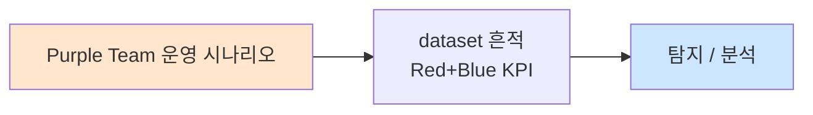

# Week 09: 악성코드 분석 기초

## 학습 목표
- 정적 분석(strings, file, hexdump)으로 악성코드의 기본 특성을 파악할 수 있다
- 동적 분석(strace, ltrace)으로 악성코드의 실행 행위를 관찰할 수 있다
- 안전한 분석 환경(sandbox)을 구성하고 활용할 수 있다
- 악성코드의 주요 행위(C2 통신, 지속성 확보, 데이터 유출)를 식별할 수 있다
- 분석 결과를 IOC로 추출하고 SIEM 룰에 반영할 수 있다

## 실습 환경 (공통)

| 서버 | IP | 역할 | 접속 |
|------|-----|------|------|
| bastion | 10.20.30.201 | Control Plane (Bastion) | `ssh ccc@10.20.30.201` (pw: 1) |
| secu | 10.20.30.1 | 방화벽/IPS (nftables, Suricata) | `ssh ccc@10.20.30.1` |
| web | 10.20.30.80 | 웹서버 (JuiceShop:3000, Apache:80) | `ssh ccc@10.20.30.80` |
| siem | 10.20.30.100 | SIEM (Wazuh Dashboard:443, OpenCTI:8080) | `ssh ccc@10.20.30.100` |

**Bastion API:** `http://localhost:9100` / Key: `ccc-api-key-2026`

## 강의 시간 배분 (3시간)

| 시간 | 내용 | 유형 |
|------|------|------|
| 0:00-0:50 | 악성코드 분석 이론 + 분류 (Part 1) | 강의 |
| 0:50-1:30 | 정적 분석 기법 (Part 2) | 강의/데모 |
| 1:30-1:40 | 휴식 | - |
| 1:40-2:30 | 동적 분석 + strace 실습 (Part 3) | 실습 |
| 2:30-3:10 | IOC 추출 + SIEM 연동 (Part 4) | 실습 |
| 3:10-3:20 | 정리 + 과제 안내 | 정리 |

---

## 용어 해설

| 용어 | 영문 | 설명 | 비유 |
|------|------|------|------|
| **정적 분석** | Static Analysis | 실행하지 않고 파일 자체를 분석 | X-ray 촬영 |
| **동적 분석** | Dynamic Analysis | 실행하면서 행위를 관찰 | 미행 수사 |
| **sandbox** | Sandbox | 격리된 분석 환경 | 폭탄 해체실 |
| **strings** | Strings | 바이너리에서 문자열 추출 | 편지 내용 읽기 |
| **strace** | System Trace | 시스템 콜 추적 도구 | 행동 기록기 |
| **패킹** | Packing | 실행파일 압축/암호화 (분석 방해) | 봉인된 상자 |
| **난독화** | Obfuscation | 코드를 읽기 어렵게 변환 | 암호문 |
| **드로퍼** | Dropper | 실제 악성코드를 설치하는 1단계 파일 | 택배 배달부 |
| **페이로드** | Payload | 실제 악성 기능을 수행하는 코드 | 폭발물 |
| **C2** | Command & Control | 공격자의 원격 제어 서버 | 본부 |

---

# Part 1: 악성코드 분석 이론 + 분류 (50분)

## 1.1 악성코드 분류

```
+--[악성코드 유형]--+
|                    |
| [바이러스]         | 다른 파일에 기생하여 확산
| [웜]               | 자체 복제하여 네트워크 확산
| [트로이 목마]      | 정상 소프트웨어로 위장
| [랜섬웨어]         | 파일 암호화 후 몸값 요구
| [백도어]           | 비인가 원격 접근 제공
| [루트킷]           | 시스템에 숨어 탐지 회피
| [봇넷]             | 원격 제어 좀비 네트워크
| [스파이웨어]       | 정보 수집 및 유출
| [크립토마이너]     | 암호화폐 무단 채굴
| [웹셸]             | 웹 서버 원격 제어 백도어
+--------------------+
```

## 1.2 분석 접근법

```
[분석 단계]

1단계: 기초 정적 분석 (5분)
  → file, strings, sha256sum
  → 파일 유형, 문자열, 해시 확인
  → VirusTotal 조회

2단계: 고급 정적 분석 (30분)
  → objdump, readelf, Ghidra
  → 디스어셈블리, 함수 분석
  → 임포트/익스포트 테이블

3단계: 기초 동적 분석 (30분)
  → strace, ltrace, netstat
  → sandbox에서 실행
  → 파일/레지스트리/네트워크 모니터링

4단계: 고급 동적 분석 (수시간)
  → GDB 디버깅
  → 패킹 해제, 난독화 해제
  → 프로토콜 리버싱
```

## 1.3 분석 환경 안전 수칙

```
[필수 안전 수칙]

1. 절대로 호스트 시스템에서 악성코드를 실행하지 마라
2. 분석은 반드시 격리된 VM/sandbox에서 수행
3. 네트워크는 차단하거나 가짜 서버로 리디렉션
4. 분석 완료 후 VM 스냅샷으로 롤백
5. 실수로 실행하는 것을 방지하기 위해 확장자 변경
   (.exe → .exe.malware, .elf → .elf.sample)
6. 클립보드 공유 비활성화
7. 공유 폴더 최소화
```

---

# Part 2: 정적 분석 기법 (40분)

## 2.1 기초 정적 분석 도구

> **실습 목적**: 안전한 테스트 샘플을 만들어 정적 분석 도구의 사용법을 익힌다.
>
> **배우는 것**: file, strings, hexdump, readelf, objdump 활용법

```bash
# 교육용 테스트 샘플 생성 (실제 악성코드가 아님)
cat << 'CODE' > /tmp/test_sample.c
#include <stdio.h>
#include <stdlib.h>
#include <string.h>
#include <unistd.h>

// 교육용: 악성코드가 흔히 사용하는 패턴 시뮬레이션
const char *c2_server = "http://evil.example.com:4444/beacon";
const char *user_agent = "Mozilla/5.0 (compatible; Bot/1.0)";
const char *persistence_path = "/tmp/.hidden_service";

int main() {
    char hostname[256];
    gethostname(hostname, sizeof(hostname));
    
    // C2 통신 시뮬레이션 (실제 연결 안 함)
    printf("Connecting to %s\n", c2_server);
    printf("User-Agent: %s\n", user_agent);
    printf("Hostname: %s\n", hostname);
    
    // 지속성 시뮬레이션
    FILE *f = fopen(persistence_path, "w");
    if (f) {
        fprintf(f, "#!/bin/bash\necho persistent\n");
        fclose(f);
    }
    
    // 정보 수집 시뮬레이션
    system("whoami");
    system("id");
    system("uname -a");
    
    return 0;
}
CODE

# 컴파일
gcc -o /tmp/test_sample /tmp/test_sample.c 2>/dev/null

echo "=== 1. file 명령 ==="
file /tmp/test_sample

echo ""
echo "=== 2. sha256sum (해시) ==="
sha256sum /tmp/test_sample

echo ""
echo "=== 3. strings (문자열 추출) ==="
echo "--- 주요 문자열 ---"
strings /tmp/test_sample | grep -iE "http|evil|password|shell|exec|system|tmp|hidden|beacon|agent|whoami|uname"

echo ""
echo "=== 4. strings 길이 제한 (8자 이상) ==="
strings -n 8 /tmp/test_sample | head -30

echo ""
echo "=== 5. hexdump (ELF 헤더) ==="
hexdump -C /tmp/test_sample | head -5

echo ""
echo "=== 6. readelf (ELF 정보) ==="
readelf -h /tmp/test_sample 2>/dev/null | head -15

echo ""
echo "=== 7. 임포트 함수 (동적 심볼) ==="
readelf -d /tmp/test_sample 2>/dev/null | grep NEEDED
nm -D /tmp/test_sample 2>/dev/null | grep " U " | head -15
```

> **결과 해석**:
> - strings에서 C2 URL, 명령어 문자열이 보이면 악성코드의 기능을 추정할 수 있다
> - 임포트 함수에 system(), exec(), socket() 등이 있으면 명령 실행/네트워크 기능 보유
> - ELF 헤더에서 stripped 여부로 분석 난이도를 판단
>
> **명령어 해설**:
> - `file`: 파일 유형 식별 (ELF, PE, script 등)
> - `strings -n 8`: 8자 이상 문자열만 추출 (노이즈 감소)
> - `readelf -d`: 동적 링킹 정보 (사용하는 라이브러리)
> - `nm -D`: 동적 심볼 테이블 (임포트/익스포트 함수)

## 2.2 고급 정적 분석

```bash
echo "=== 8. objdump (디스어셈블리) ==="
objdump -d /tmp/test_sample 2>/dev/null | grep -A5 "<main>" | head -30

echo ""
echo "=== 9. 섹션 분석 ==="
readelf -S /tmp/test_sample 2>/dev/null | head -20

echo ""
echo "=== 10. 엔트로피 분석 (패킹 탐지) ==="
cat << 'PYCODE' > /tmp/entropy_check.py
#!/usr/bin/env python3
import math
import sys

def entropy(data):
    if not data:
        return 0
    counter = {}
    for byte in data:
        counter[byte] = counter.get(byte, 0) + 1
    length = len(data)
    return -sum((c/length) * math.log2(c/length) for c in counter.values())

with open('/tmp/test_sample', 'rb') as f:
    data = f.read()

ent = entropy(data)
print(f"파일 크기: {len(data):,} bytes")
print(f"전체 엔트로피: {ent:.4f} / 8.0")

if ent > 7.5:
    print("[경고] 매우 높은 엔트로피 → 암호화/패킹 의심")
elif ent > 6.5:
    print("[주의] 높은 엔트로피 → 압축 또는 일부 난독화")
else:
    print("[정상] 일반적인 실행파일 엔트로피")

# 섹션별 엔트로피
chunk_size = len(data) // 10
for i in range(min(10, len(data) // chunk_size)):
    chunk = data[i*chunk_size:(i+1)*chunk_size]
    e = entropy(chunk)
    bar = '#' * int(e * 5)
    print(f"  블록 {i}: {e:.2f} {bar}")
PYCODE
python3 /tmp/entropy_check.py
```

> **배우는 것**: 엔트로피가 7.5 이상이면 패킹/암호화된 악성코드일 가능성이 높다. 정상 실행파일은 보통 5.0-6.5 범위다.

---

# Part 3: 동적 분석 + strace 실습 (50분)

## 3.1 strace를 이용한 시스콜 추적

> **실습 목적**: strace로 프로그램의 시스템 콜을 추적하여 악성코드의 행위를 분석한다.
>
> **배우는 것**: strace 옵션, 시스콜 유형별 해석, 의심 행위 식별

```bash
# strace로 테스트 샘플 분석
echo "=== strace 기본 실행 ==="
strace -f -o /tmp/strace_output.txt /tmp/test_sample 2>/dev/null

echo ""
echo "--- 파일 접근 시스콜 ---"
grep -E "^[0-9]+ +open|openat|creat|unlink|rename|chmod" /tmp/strace_output.txt 2>/dev/null | head -15

echo ""
echo "--- 네트워크 시스콜 ---"
grep -E "^[0-9]+ +socket|connect|bind|listen|sendto|recvfrom" /tmp/strace_output.txt 2>/dev/null | head -10

echo ""
echo "--- 프로세스 시스콜 ---"
grep -E "^[0-9]+ +execve|fork|clone|kill" /tmp/strace_output.txt 2>/dev/null | head -10

echo ""
echo "--- 시스콜 통계 ==="
strace -c /tmp/test_sample 2>&1 | tail -20
```

> **결과 해석**:
> - `openat("/tmp/.hidden_service", O_WRONLY|O_CREAT)`: 숨겨진 파일 생성 → 지속성 확보
> - `execve("whoami")`: 시스템 정보 수집 → 정찰 활동
> - `connect(...)`: 네트워크 연결 → C2 통신
>
> **명령어 해설**:
> - `strace -f`: 자식 프로세스도 추적
> - `strace -o`: 결과를 파일로 저장
> - `strace -c`: 시스콜 통계 요약
> - `strace -e trace=network`: 네트워크 시스콜만 추적

## 3.2 ltrace를 이용한 라이브러리 호출 추적

```bash
# ltrace로 라이브러리 함수 호출 추적
echo "=== ltrace 실행 ==="
ltrace -o /tmp/ltrace_output.txt /tmp/test_sample 2>/dev/null

echo ""
echo "--- 주요 라이브러리 호출 ---"
cat /tmp/ltrace_output.txt 2>/dev/null | head -30

echo ""
echo "--- system() 호출 ---"
grep "system(" /tmp/ltrace_output.txt 2>/dev/null

echo ""
echo "--- fopen/fwrite 호출 ---"
grep -E "fopen|fwrite|fclose" /tmp/ltrace_output.txt 2>/dev/null
```

> **배우는 것**: ltrace는 strace와 달리 glibc 수준의 함수 호출을 보여준다. system(), popen(), exec() 등 위험 함수의 인자를 확인할 수 있다.

## 3.3 네트워크 행위 분석

```bash
cat << 'SCRIPT' > /tmp/analyze_network_behavior.py
#!/usr/bin/env python3
"""악성코드 네트워크 행위 분석"""

# strace에서 추출한 네트워크 시스콜 시뮬레이션
network_calls = [
    {"syscall": "socket", "args": "AF_INET, SOCK_STREAM, 0", "result": "fd=3"},
    {"syscall": "connect", "args": "fd=3, {sa_family=AF_INET, sin_port=4444, sin_addr='203.0.113.50'}", "result": "0"},
    {"syscall": "sendto", "args": "fd=3, 'POST /beacon HTTP/1.1\\r\\n...', 256", "result": "256"},
    {"syscall": "recvfrom", "args": "fd=3, 'HTTP/1.1 200 OK\\r\\n{\"cmd\":\"id\"}', 1024", "result": "45"},
    {"syscall": "sendto", "args": "fd=3, 'uid=0(root) gid=0(root)', 32", "result": "32"},
]

print("=" * 60)
print("  네트워크 행위 분석 결과")
print("=" * 60)

for call in network_calls:
    print(f"\n  {call['syscall']}({call['args'][:60]})")
    print(f"  → 반환값: {call['result']}")

print("\n=== 분석 결론 ===")
print("  1. C2 서버: 203.0.113.50:4444")
print("  2. 프로토콜: HTTP POST (비콘)")
print("  3. 명령 수신: JSON 형식 ({\"cmd\":\"...\"})")
print("  4. 결과 전송: 명령 실행 결과를 C2로 전달")
print("  5. ATT&CK: T1071.001 (Web Protocols)")

print("\n=== 추출된 IOC ===")
print("  IP:  203.0.113.50")
print("  Port: 4444")
print("  URI: /beacon")
print("  UA:  Mozilla/5.0 (compatible; Bot/1.0)")
SCRIPT

python3 /tmp/analyze_network_behavior.py
```

## 3.4 파일 시스템 행위 분석

```bash
# inotifywait로 파일 시스템 변경 모니터링
echo "=== 파일 시스템 모니터링 ==="

# inotifywait가 있는 경우
if command -v inotifywait &>/dev/null; then
    echo "inotifywait로 /tmp 모니터링 (5초)..."
    timeout 5 inotifywait -m -r /tmp/ 2>/dev/null &
    WATCH_PID=$!
    sleep 1
    /tmp/test_sample 2>/dev/null
    sleep 2
    kill $WATCH_PID 2>/dev/null
else
    echo "inotifywait 미설치 - strace 기반 분석"
    echo ""
    echo "--- strace에서 파일 관련 시스콜 추출 ---"
    grep -E "openat|creat|write|unlink|rename|mkdir|chmod" /tmp/strace_output.txt 2>/dev/null | \
      grep -v "/proc\|/lib\|/usr\|/etc/ld" | head -15
fi

echo ""
echo "--- 생성된 파일 확인 ---"
ls -la /tmp/.hidden_service 2>/dev/null && echo "[발견] 숨겨진 파일 생성됨!" || echo "(숨겨진 파일 없음)"
cat /tmp/.hidden_service 2>/dev/null
rm -f /tmp/.hidden_service 2>/dev/null
```

---

# Part 4: IOC 추출 + SIEM 연동 (40분)

## 4.1 분석 결과에서 IOC 추출

```bash
cat << 'SCRIPT' > /tmp/extract_iocs.py
#!/usr/bin/env python3
"""악성코드 분석 결과에서 IOC 자동 추출"""
import re
import hashlib

# 테스트 샘플에서 추출할 IOC
sample_path = "/tmp/test_sample"

# 1. 파일 해시
with open(sample_path, 'rb') as f:
    data = f.read()
    md5 = hashlib.md5(data).hexdigest()
    sha256 = hashlib.sha256(data).hexdigest()

print("=" * 60)
print("  IOC 추출 결과")
print("=" * 60)

print(f"\n[파일 해시]")
print(f"  MD5:    {md5}")
print(f"  SHA256: {sha256}")

# 2. 문자열에서 IOC 추출
import subprocess
result = subprocess.run(['strings', sample_path], capture_output=True, text=True)
strings_output = result.stdout

# IP 주소 추출
ips = set(re.findall(r'\b\d{1,3}\.\d{1,3}\.\d{1,3}\.\d{1,3}\b', strings_output))
print(f"\n[IP 주소] ({len(ips)}개)")
for ip in sorted(ips):
    # 내부 IP 필터링
    if not ip.startswith(('10.', '172.', '192.168.', '127.', '0.')):
        print(f"  {ip}")

# URL 추출
urls = set(re.findall(r'https?://[^\s"\'<>]+', strings_output))
print(f"\n[URL] ({len(urls)}개)")
for url in sorted(urls):
    print(f"  {url}")

# 도메인 추출
domains = set(re.findall(r'[a-zA-Z0-9][-a-zA-Z0-9]*\.[a-zA-Z]{2,}', strings_output))
print(f"\n[도메인] ({len(domains)}개)")
for d in sorted(domains):
    if '.' in d and not d.replace('.','').isdigit():
        print(f"  {d}")

# 파일 경로 추출
paths = set(re.findall(r'/(?:tmp|var|etc|home|dev|opt)/[^\s"\']+', strings_output))
print(f"\n[파일 경로] ({len(paths)}개)")
for p in sorted(paths):
    print(f"  {p}")

# User-Agent 추출
uas = re.findall(r'Mozilla/[^\n"]+', strings_output)
print(f"\n[User-Agent] ({len(uas)}개)")
for ua in uas:
    print(f"  {ua[:60]}")

# YARA 룰 자동 생성
print(f"\n=== 자동 생성 YARA 룰 ===")
print(f"""rule Sample_{sha256[:8]}
{{
    meta:
        hash = "{sha256}"
        date = "2026-04-04"
    strings:
        $url = "evil.example.com" nocase
        $ua = "Bot/1.0"
        $path = "/tmp/.hidden"
        $cmd1 = "whoami"
        $cmd2 = "uname -a"
    condition:
        uint32(0) == 0x464C457F and 3 of them
}}""")
SCRIPT

python3 /tmp/extract_iocs.py
```

> **실전 활용**: 분석 결과에서 추출한 IOC를 SIEM, 방화벽, IDS에 즉시 배포하여 동일 악성코드의 재감염을 탐지/차단한다.

## 4.2 Wazuh 룰로 변환

```bash
ssh ccc@10.20.30.100 << 'REMOTE'

sudo tee -a /var/ossec/etc/rules/local_rules.xml << 'RULES'

<group name="local,malware_analysis,">

  <!-- 분석에서 추출된 C2 통신 패턴 -->
  <rule id="100800" level="14">
    <match>evil.example.com</match>
    <description>[MAL-ANALYSIS] 알려진 C2 도메인 통신: evil.example.com</description>
    <group>malware,c2,critical_alert,</group>
  </rule>

  <!-- 분석에서 추출된 UA 패턴 -->
  <rule id="100801" level="10">
    <match>Bot/1.0</match>
    <regex>Mozilla.*compatible.*Bot</regex>
    <description>[MAL-ANALYSIS] 악성코드 User-Agent 탐지</description>
    <group>malware,suspicious_ua,</group>
  </rule>

  <!-- 분석에서 추출된 지속성 패턴 -->
  <rule id="100802" level="10">
    <if_group>syscheck</if_group>
    <match>.hidden_service</match>
    <description>[MAL-ANALYSIS] 알려진 악성코드 지속성 파일 생성</description>
    <group>malware,persistence,</group>
  </rule>

</group>
RULES

sudo /var/ossec/bin/wazuh-analysisd -t
echo "Exit code: $?"

REMOTE
```

## 4.3 분석 보고서 생성

```bash
cat << 'SCRIPT' > /tmp/malware_report.py
#!/usr/bin/env python3
"""악성코드 분석 보고서 생성"""
import hashlib

with open('/tmp/test_sample', 'rb') as f:
    data = f.read()

report = f"""
{'='*60}
  악성코드 분석 보고서
{'='*60}

1. 샘플 정보
   MD5:    {hashlib.md5(data).hexdigest()}
   SHA256: {hashlib.sha256(data).hexdigest()}
   크기:   {len(data):,} bytes
   유형:   ELF 64-bit LSB executable

2. 정적 분석 결과
   - C2 서버 URL: http://evil.example.com:4444/beacon
   - User-Agent: Mozilla/5.0 (compatible; Bot/1.0)
   - 지속성 경로: /tmp/.hidden_service
   - 정보 수집 명령: whoami, id, uname -a
   - 엔트로피: 정상 범위 (패킹 없음)

3. 동적 분석 결과
   - 파일 생성: /tmp/.hidden_service (셸 스크립트)
   - 명령 실행: system("whoami"), system("id"), system("uname -a")
   - 네트워크: C2 서버로 HTTP POST 비콘 전송
   - 명령 수신: JSON 형식으로 명령 수신 후 실행

4. ATT&CK 매핑
   T1071.001  Application Layer Protocol: Web
   T1059.004  Command and Scripting: Unix Shell
   T1082      System Information Discovery
   T1505.003  Server Software Component: Web Shell (variant)
   T1053.003  Scheduled Task/Job: Cron (지속성)

5. IOC
   IP:     203.0.113.50 (시뮬레이션)
   Domain: evil.example.com
   URL:    http://evil.example.com:4444/beacon
   File:   /tmp/.hidden_service
   UA:     Mozilla/5.0 (compatible; Bot/1.0)

6. 권고 사항
   - 방화벽: evil.example.com 및 203.0.113.50 차단
   - SIEM: 추출된 IOC 기반 탐지 룰 배포 완료
   - 서버: /tmp/.hidden_service 파일 존재 여부 점검
   - 네트워크: User-Agent "Bot/1.0" 포함 HTTP 트래픽 모니터링
"""

print(report)
SCRIPT

python3 /tmp/malware_report.py

# 정리
rm -f /tmp/test_sample /tmp/test_sample.c /tmp/strace_output.txt \
      /tmp/ltrace_output.txt 2>/dev/null
```

---

## 체크리스트

- [ ] 악성코드의 주요 유형 10가지를 나열할 수 있다
- [ ] 정적/동적 분석의 차이와 각각의 장단점을 설명할 수 있다
- [ ] file, strings, readelf로 기초 정적 분석을 수행할 수 있다
- [ ] 엔트로피 분석으로 패킹 여부를 판단할 수 있다
- [ ] strace로 시스콜을 추적하고 파일/네트워크/프로세스 행위를 분석할 수 있다
- [ ] ltrace로 라이브러리 함수 호출을 확인할 수 있다
- [ ] 분석 결과에서 IOC(IP, 도메인, 해시, URL, 파일경로)를 추출할 수 있다
- [ ] 추출된 IOC를 Wazuh 룰로 변환할 수 있다
- [ ] 악성코드 분석 보고서를 작성할 수 있다
- [ ] 안전한 분석 환경 구성 원칙을 알고 있다

---

## 과제

### 과제 1: 악성코드 정적+동적 분석 보고서 (필수)

교육용 테스트 샘플(또는 자체 작성 샘플)에 대해:
1. 기초 정적 분석 (file, strings, 해시, 엔트로피)
2. 동적 분석 (strace 시스콜 분석)
3. IOC 추출 (IP, 도메인, 해시, 파일경로, UA)
4. ATT&CK 매핑
5. Wazuh 탐지 룰 1개 이상 작성

### 과제 2: YARA 룰 작성 (선택)

분석 결과를 기반으로:
1. 해당 악성코드를 탐지하는 YARA 룰 작성
2. 양성/음성 테스트 샘플로 검증
3. Wazuh FIM + YARA 연동 설정

---

## 보충: 악성코드 분석 고급 기법

### Sandbox 환경 구성 가이드

```bash
cat << 'SCRIPT' > /tmp/sandbox_guide.py
#!/usr/bin/env python3
"""악성코드 분석 Sandbox 구성 가이드"""

print("""
================================================================
  악성코드 분석 Sandbox 구성 가이드
================================================================

1. VM 기반 Sandbox (권장)

   [호스트 시스템]
        |
   [VirtualBox/KVM]
        |
   +---------+
   |         |
   [분석 VM]  [네트워크 시뮬레이터]
   Ubuntu 22.04   inetsim/fakenet
   YARA, strings  DNS/HTTP/SMTP 가짜 서버
   strace, ltrace
   Ghidra

   네트워크 설정:
   - NAT 모드 (인터넷 차단)
   - Host-Only + inetsim (가짜 응답)

2. Docker 기반 (간단한 분석용)

   docker run --rm --network none \\
     -v /samples:/samples:ro \\
     remnux/remnux-distro \\
     strings /samples/malware.bin

3. 클라우드 Sandbox 서비스
   - VirusTotal (무료, 해시 업로드)
   - Any.Run (무료 tier, 인터랙티브)
   - Hybrid Analysis (무료, 자동 분석)
   - Joe Sandbox (상용, 상세 분석)

4. REMnux 배포판 (추천)
   - 악성코드 분석 전용 Linux 배포판
   - 도구 100+ 사전 설치
   - https://remnux.org/
""")

# 분석 도구 체크리스트
tools = [
    ("file", "파일 유형 식별", "file sample.bin"),
    ("strings", "문자열 추출", "strings -n 8 sample.bin"),
    ("sha256sum", "해시 계산", "sha256sum sample.bin"),
    ("readelf", "ELF 분석", "readelf -a sample.bin"),
    ("objdump", "디스어셈블리", "objdump -d sample.bin"),
    ("strace", "시스콜 추적", "strace -f -o log.txt ./sample.bin"),
    ("ltrace", "라이브러리 추적", "ltrace -o log.txt ./sample.bin"),
    ("yara", "패턴 매칭", "yara rules.yar sample.bin"),
    ("hexdump", "헥스 뷰어", "hexdump -C sample.bin | head"),
    ("upx", "패킹 해제", "upx -d sample.bin"),
    ("gdb", "디버거", "gdb ./sample.bin"),
    ("Ghidra", "디컴파일러", "ghidraRun (GUI)"),
]

print("\n=== 분석 도구 체크리스트 ===")
print(f"{'도구':12s} {'용도':20s} {'명령 예시':40s}")
print("-" * 75)
for tool, purpose, cmd in tools:
    print(f"{tool:12s} {purpose:20s} {cmd:40s}")
SCRIPT

python3 /tmp/sandbox_guide.py
```

### 패킹/난독화 탐지 기법

```bash
cat << 'SCRIPT' > /tmp/packing_detection.py
#!/usr/bin/env python3
"""패킹/난독화 탐지 기법"""
import math
import os

def file_entropy(filepath):
    """파일 엔트로피 계산"""
    with open(filepath, 'rb') as f:
        data = f.read()
    if not data:
        return 0
    counter = {}
    for byte in data:
        counter[byte] = counter.get(byte, 0) + 1
    length = len(data)
    return -sum((c/length) * math.log2(c/length) for c in counter.values())

def section_entropy(filepath, num_sections=8):
    """섹션별 엔트로피 분석"""
    with open(filepath, 'rb') as f:
        data = f.read()
    chunk_size = max(len(data) // num_sections, 1)
    results = []
    for i in range(num_sections):
        chunk = data[i*chunk_size:(i+1)*chunk_size]
        if chunk:
            results.append(file_entropy_data(chunk))
    return results

def file_entropy_data(data):
    if not data:
        return 0
    counter = {}
    for byte in data:
        counter[byte] = counter.get(byte, 0) + 1
    length = len(data)
    return -sum((c/length) * math.log2(c/length) for c in counter.values())

# 분석 대상
targets = {
    "/tmp/test_sample": "교육용 샘플",
    "/bin/ls": "시스템 바이너리 (정상)",
    "/bin/bash": "Bash 셸 (정상)",
}

print("=" * 60)
print("  패킹/난독화 탐지 - 엔트로피 분석")
print("=" * 60)

for filepath, desc in targets.items():
    if not os.path.exists(filepath):
        continue
    
    ent = file_entropy(filepath)
    size = os.path.getsize(filepath)
    
    # 판정
    if ent > 7.5:
        verdict = "[경고] 암호화/패킹 가능성 매우 높음"
    elif ent > 6.8:
        verdict = "[주의] 패킹 또는 압축 가능"
    elif ent > 5.0:
        verdict = "[정상] 일반 실행파일 범위"
    else:
        verdict = "[정상] 낮은 엔트로피"
    
    print(f"\n  {filepath} ({desc})")
    print(f"    크기: {size:,} bytes")
    print(f"    엔트로피: {ent:.4f} / 8.0")
    print(f"    판정: {verdict}")
    
    # 시각화
    bar_len = int(ent * 6)
    bar = "#" * bar_len + "." * (48 - bar_len)
    print(f"    [{bar}] {ent:.2f}")

print("""
=== 패킹 탐지 추가 지표 ===
  1. 섹션 이름 이상: UPX0, .packed, .crypted
  2. 임포트 테이블이 비정상적으로 작음 (5개 미만)
  3. 엔트리포인트가 마지막 섹션에 위치
  4. 섹션 크기 불일치 (raw size << virtual size)
  5. 문자열이 거의 추출되지 않음
""")
SCRIPT

python3 /tmp/packing_detection.py
```

### 스크립트 기반 악성코드 분석

```bash
# 스크립트 악성코드 분석 (Python, Bash, PowerShell)
cat << 'SCRIPT' > /tmp/script_malware_analysis.py
#!/usr/bin/env python3
"""스크립트 악성코드 분석 기법"""

print("=" * 60)
print("  스크립트 악성코드 분석 기법")
print("=" * 60)

script_types = {
    "Python 악성코드": {
        "특징": [
            "import socket, subprocess, os",
            "base64.b64decode() 사용 (난독화)",
            "exec(), eval() 사용 (동적 실행)",
            "os.system(), subprocess.Popen()",
            "urllib/requests로 C2 통신",
        ],
        "분석법": "1) 문자열 추출 2) import 분석 3) base64 디코딩 4) 실행 흐름 추적",
        "도구": "strings, python3 -c (디코딩), strace",
    },
    "Bash 악성코드": {
        "특징": [
            "curl/wget으로 페이로드 다운로드",
            "eval $(base64 -d <<< 'encoded')",
            "/dev/tcp/ 리버스 셸",
            "crontab에 지속성 등록",
            "history 삭제, unset HISTFILE",
        ],
        "분석법": "1) cat으로 내용 확인 2) base64 디코딩 3) 변수 추적 4) 실행 경로 확인",
        "도구": "cat, base64 -d, bash -x (디버그 모드)",
    },
    "PHP 웹셸": {
        "특징": [
            "eval($_GET/POST/REQUEST)",
            "system(), exec(), passthru()",
            "base64_decode() 난독화",
            "preg_replace('/e', ...) 실행",
            "assert() 동적 실행",
        ],
        "분석법": "1) grep 위험 함수 2) 난독화 해제 3) 입력 변수 추적 4) 실행 결과 확인",
        "도구": "strings, php -r (디코딩), YARA",
    },
}

for script_type, info in script_types.items():
    print(f"\n  --- {script_type} ---")
    print(f"  특징:")
    for feat in info["특징"]:
        print(f"    - {feat}")
    print(f"  분석법: {info['분석법']}")
    print(f"  도구: {info['도구']}")
SCRIPT

python3 /tmp/script_malware_analysis.py
```

### VirusTotal API 연동

```bash
cat << 'SCRIPT' > /tmp/vt_check.py
#!/usr/bin/env python3
"""VirusTotal 해시 조회 시뮬레이션"""
import hashlib

# 시뮬레이션 (실제 API 키 필요)
print("=" * 60)
print("  VirusTotal 조회 가이드")
print("=" * 60)

print("""
# VirusTotal API v3 사용법

## 해시로 파일 조회
curl -s -H "x-apikey: YOUR_API_KEY" \\
  "https://www.virustotal.com/api/v3/files/SHA256_HASH" | \\
  python3 -c "
import sys, json
data = json.load(sys.stdin)
stats = data.get('data',{}).get('attributes',{}).get('last_analysis_stats',{})
print(f'탐지: {stats.get(\"malicious\",0)}/{sum(stats.values())}')
print(f'이름: {data[\"data\"][\"attributes\"].get(\"meaningful_name\",\"?\")}')" 

## IP 주소 평판 조회
curl -s -H "x-apikey: YOUR_API_KEY" \\
  "https://www.virustotal.com/api/v3/ip_addresses/203.0.113.50"

## 도메인 조회
curl -s -H "x-apikey: YOUR_API_KEY" \\
  "https://www.virustotal.com/api/v3/domains/evil.example.com"

## 파일 업로드 (주의: 파일이 공개됨)
curl -s -H "x-apikey: YOUR_API_KEY" \\
  -F "file=@sample.bin" \\
  "https://www.virustotal.com/api/v3/files"

주의사항:
  - 무료 API: 분당 4회 제한
  - 업로드된 파일은 전체 공개됨 (민감 파일 업로드 금지)
  - 해시 조회만으로 파일 내용 노출 없이 확인 가능
""")

# 테스트 샘플 해시
if __import__('os').path.exists('/tmp/test_sample'):
    with open('/tmp/test_sample', 'rb') as f:
        sha256 = hashlib.sha256(f.read()).hexdigest()
    print(f"\n교육용 샘플 SHA256: {sha256}")
    print(f"VT 조회 URL: https://www.virustotal.com/gui/file/{sha256}")
SCRIPT

python3 /tmp/vt_check.py
```

### 악성코드 분류 체계

```bash
cat << 'SCRIPT' > /tmp/malware_classification.py
#!/usr/bin/env python3
"""악성코드 분류 체계 + 행위 분석 프레임워크"""

behaviors = {
    "파일 시스템": {
        "indicators": [
            "임시 디렉토리에 파일 생성 (/tmp, /dev/shm)",
            "숨김 파일 생성 (.으로 시작)",
            "시스템 파일 수정 (/etc/passwd, /etc/crontab)",
            "자기 자신 삭제",
            "파일 암호화 (랜섬웨어)",
        ],
        "syscalls": ["openat", "creat", "unlink", "rename", "chmod"],
    },
    "네트워크": {
        "indicators": [
            "외부 IP로 연결 (C2 통신)",
            "DNS 쿼리 (도메인 해석)",
            "HTTP POST (데이터 전송)",
            "비표준 포트 사용",
            "암호화 통신 (TLS)",
        ],
        "syscalls": ["socket", "connect", "sendto", "recvfrom", "bind"],
    },
    "프로세스": {
        "indicators": [
            "자식 프로세스 생성 (fork/clone)",
            "다른 프로그램 실행 (execve)",
            "프로세스 인젝션 (ptrace)",
            "시그널 조작 (kill, sigaction)",
            "데몬화 (setsid, daemon)",
        ],
        "syscalls": ["clone", "execve", "ptrace", "kill", "setsid"],
    },
    "정보 수집": {
        "indicators": [
            "시스템 정보 조회 (uname, hostname)",
            "사용자 정보 (whoami, id)",
            "네트워크 정보 (ifconfig, ip)",
            "디스크 정보 (df, lsblk)",
            "프로세스 목록 (ps)",
        ],
        "syscalls": ["uname", "getuid", "gethostname"],
    },
}

print("=" * 60)
print("  악성코드 행위 분석 프레임워크")
print("=" * 60)

for category, info in behaviors.items():
    print(f"\n  [{category}]")
    print(f"    행위 지표:")
    for ind in info["indicators"]:
        print(f"      - {ind}")
    print(f"    관련 시스콜: {', '.join(info['syscalls'])}")
SCRIPT

python3 /tmp/malware_classification.py
```

---

## 다음 주 예고

**Week 10: SOAR 자동화**에서는 플레이북 기반 자동 대응을 설계하고, API 연동과 Wazuh Active Response를 활용한 SOC 자동화를 구현한다.

---

## 웹 UI 실습

### Wazuh Dashboard — 악성코드 탐지 경보 분석

> **접속 URL:** `https://10.20.30.100:443`

1. 브라우저에서 `https://10.20.30.100:443` 접속 → 로그인
2. **Modules → Security events** 클릭
3. 악성코드 관련 경보 필터링:
   ```
   rule.groups: (rootcheck OR syscheck OR yara) AND rule.level >= 7
   ```
4. FIM(파일 무결성) 경보에서 변경된 파일 경로, 해시값 확인
5. 의심 파일의 시간대별 변경 이력 추적 → 악성코드 드롭 시점 특정
6. **Modules → Vulnerabilities** 에서 해당 에이전트의 취약점 현황 확인

### OpenCTI — 악성코드 인텔리전스 활용

> **접속 URL:** `http://10.20.30.100:8080`

1. `http://10.20.30.100:8080` 접속 → 로그인
2. **Arsenal → Malware** 에서 알려진 악성코드 패밀리 목록 탐색
3. 분석 중인 악성코드의 특징(문자열, 행위)을 기반으로 유사 악성코드 검색
4. 해당 악성코드 상세 → **Knowledge** 탭에서 사용 기법(ATT&CK), 연관 캠페인 확인
5. **Observations → Indicators** 에서 관련 IOC(C2 IP, 도메인, 해시) 일괄 확인
6. 분석 결과를 OpenCTI에 **Note** 또는 **Report** 로 기록

---

## 📂 실습 참조 파일 가이드

> 이번 주 실습에서 **실제로 조작하는** 솔루션의 기능·경로·파일·설정·UI 요점입니다.

### SIGMA + YARA
> **역할:** SIGMA=플랫폼 독립 탐지 룰, YARA=파일/메모리 시그니처  
> **실행 위치:** `SOC 분석가 PC / siem`  
> **접속/호출:** `sigmac` 변환기, `yara <rule> <target>`

**주요 경로·파일**

| 경로 | 역할 |
|------|------|
| `~/sigma/rules/` | SIGMA 룰 저장 |
| `~/yara-rules/` | YARA 룰 저장 |

**핵심 설정·키**

- `SIGMA logsource:product/service` — 로그 소스 매핑
- `YARA `strings: $s1 = "..." ascii wide`` — 시그니처 정의
- `YARA `condition: all of them and filesize < 1MB`` — 매칭 조건

**UI / CLI 요점**

- `sigmac -t elasticsearch-qs rule.yml` — Elastic용 KQL 변환
- `sigmac -t wazuh rule.yml` — Wazuh XML 룰 변환
- `yara -r rules.yar /var/tmp/sample.bin` — 재귀 스캔

> **해석 팁.** SIGMA는 *탐지 의도*, YARA는 *바이너리 패턴*으로 역할 분리. SIGMA 룰은 반드시 **false positive 조건**까지 기술해야 SIEM 운영 가능.

### Volatility 3
> **역할:** 메모리 이미지 포렌식 프레임워크  
> **실행 위치:** `분석 PC`  
> **접속/호출:** `vol -f mem.raw <plugin>`

**주요 경로·파일**

| 경로 | 역할 |
|------|------|
| `volatility3/volatility3/plugins/` | 플러그인 소스 |
| `~/symbols/` | 커널 심볼 캐시 |

**핵심 설정·키**

- `windows.pslist / linux.pslist` — 프로세스 열거
- `windows.malfind` — 주입된 코드 탐지
- `windows.netscan` — 열린 소켓

**UI / CLI 요점**

- `vol -f mem.raw windows.pstree` — 프로세스 트리
- `vol -f mem.raw windows.cmdline` — 실행된 명령행
- `vol -f mem.raw linux.bash` — bash 히스토리 복원

> **해석 팁.** Volatility 3은 **심볼 자동 다운로드**가 필요하므로 오프라인 분석 시 `--symbol-dirs`로 미리 준비. 샘플 복사 시 `md5sum`로 무결성 확인 필수.

---

## 실제 사례 (WitFoo Precinct 6 — Purple Team 운영)

> 출처: WitFoo Precinct 6 Cybersecurity Dataset (Apache 2.0)
> 본 lecture *Purple Team 운영* 학습 항목 매칭.

### Purple Team 운영 의 dataset 흔적 — "Red+Blue KPI"

dataset 의 정상 운영에서 *Red+Blue KPI* 신호의 baseline 을 알아두면, *Purple Team 운영* 시도 시 발생하는 anomaly 를 정량으로 탐지할 수 있다. 핵심 정량 지표는 — MTTD/MTTR/MTTRecover.



### Case 1: dataset 정량 지표

| 항목 | 값 |
|---|---|
| 핵심 신호 | Red+Blue KPI |
| 정량 baseline | MTTD/MTTR/MTTRecover |
| 학습 매핑 | Atomic Red Team 활용 |

**자세한 해석**: Atomic Red Team 활용. 이 차이를 정량으로 측정해야 *공격 시도와 정상 운영의 구분* 이 가능. 학생이 baseline 숫자를 외워두면 — 운영 환경에서 anomaly 를 즉시 탐지할 수 있다.

### Case 2: 실전 적용 시나리오

| 단계 | dataset 활용 |
|---|---|
| 시도 식별 | Red+Blue KPI 의 spike |
| 정상 vs 이상 | baseline 대비 비율 |
| 룰 작성 | Suricata / Wazuh / Sigma |
| 검증 | dataset 재실행 |

**자세한 해석**: 운영 환경 룰 작성은 — *baseline 측정 → 임계 결정 → 룰 작성 → dataset 검증* 의 4 단계. 한 단계라도 빠지면 false positive 폭증.

### 이 사례에서 학생이 배워야 할 3가지

1. **Purple Team 운영 = Red+Blue KPI 의 anomaly** — 정량 신호로 탐지.
2. **baseline 숫자 외우기** — MTTD/MTTR/MTTRecover.
3. **4 단계 룰 작성** — 측정 → 임계 → 룰 → 검증.

**학생 액션**: Atomic test 5 케이스.


---

## 부록: 학습 OSS 도구 매트릭스 (Course14 SOC Advanced — Week 09 악성코드 분석·정적/동적·Sandbox)

> 이 부록은 lab `soc-adv-ai/week09.yaml` (15 step + multi_task) 의 모든 명령을
> 실제로 실행 가능한 형태로 정리한다. SANS 4 단계 (자동/정적/동적/리버싱), 정적
> 분석 (file/strings/PE/엔트로피/패커), 동적 분석 (strace/ltrace/network/FS),
> 안티 분석 우회, 분류, IOC 추출, 탐지 룰 (YARA/Suricata/SIGMA), Cuckoo Sandbox,
> SOC 통합 워크플로우까지.

### lab step → 도구·악성코드 매핑 표

| step | 학습 항목 | 핵심 OSS 도구 | ATT&CK |
|------|----------|--------------|--------|
| s1 | 4 단계 방법론 (자동/정적/동적/리버싱) | SANS FOR610 양식 | - |
| s2 | 정적 속성 (file/hash/strings/PE) | file, sha256sum, strings, readelf, objdump | - |
| s3 | 패킹/난독화 탐지 | DIE, math.entropy, YARA packer | T1027.002 |
| s4 | 격리 분석 환경 | KVM/VirtualBox + INetSim + 스냅샷 | - |
| s5 | strace / ltrace 시스템 콜 | strace, ltrace, sysdig, bpftrace | T1059 |
| s6 | 네트워크 행위 (C2/비콘) | tshark, INetSim, mitmproxy | T1071 |
| s7 | 파일시스템 변경 (지속성) | inotifywait, auditd, osquery | T1053 / T1546 |
| s8 | 안티 분석 우회 | unipacker, pafish, strings filter | T1497 |
| s9 | 악성코드 분류 (RAT/랜섬/봇/드롭퍼) | YARA + 분류 휴리스틱 | - |
| s10 | IOC 추출 (Network/Host/Behavior) | strings + grep + jq + STIX2 | - |
| s11 | 탐지 룰 (YARA + Suricata + SIGMA) | week04 + week05 + week03 도구 재사용 | - |
| s12 | 악성코드 리포트 (업계 표준) | SANS FOR610 + markdown | - |
| s13 | 샌드박스 자동 분석 | Cuckoo Sandbox 3 / CAPE / DRAKVUF | - |
| s14 | SOC 워크플로우 통합 | TheHive + Cortex + MISP | - |
| s15 | 종합 보고서 + ATT&CK 매핑 | markdown + Navigator JSON | - |
| s99 | 통합 다단계 (s1→s2→s3→s4→s5) | Bastion plan: 방법론→정적→패킹→환경→strace | 다중 |

### 학생 환경 준비

```bash
# === [s2] 정적 ===
sudo apt install -y binutils file hexdump xxd
pip install --user pefile

# === [s3] 패커 탐지 ===
wget https://github.com/horsicq/DIE-engine/releases/latest/download/die_3.10_Ubuntu_22.04_amd64.deb
sudo dpkg -i die_*.deb 2>/dev/null
pip install --user unipacker

# === [s4] 격리 ===
sudo apt install -y qemu-kvm libvirt-daemon-system virt-manager inetsim
sudo systemctl enable --now libvirtd inetsim

# === [s5] 동적 ===
sudo apt install -y strace ltrace sysdig bpftrace

# === [s6] 네트워크 ===
sudo apt install -y tshark wireshark-common
pip install --user mitmproxy

# === [s7] FS ===
sudo apt install -y inotify-tools

# === [s8] 안티 분석 우회 ===
git clone https://github.com/a0rtega/pafish /tmp/pafish

# === [s13] Sandbox ===
git clone https://github.com/cuckoosandbox/cuckoo /tmp/cuckoo
cd /tmp/cuckoo && pip install -r requirements.txt 2>/dev/null
git clone https://github.com/kevoreilly/CAPEv2 /tmp/cape

# === [s14] TheHive + Cortex + MISP (week05 와 동일) ===
docker pull strangebee/thehive:5.2
docker pull thehiveproject/cortex:3.1
```

### 핵심 도구별 상세 사용법

#### 도구 1: SANS 4 단계 방법론 (Step 1)

| 단계 | 목적 | 주요 도구 | 시간 |
|-----|------|----------|------|
| **1. Automated** | 빠른 분류 (악성/정상) | VirusTotal, Hybrid Analysis, AV | 분 |
| **2. Static Properties** | 시그니처 + 속성 | file, strings, PE, YARA | 분-시간 |
| **3. Interactive Dynamic** | 행위 관찰 | strace, tshark, sandbox | 시간 |
| **4. Code RE** | 코드 깊이 분석 | Ghidra, IDA, radare2 | 시간-일 |

원칙: 단계별 escalate (Automated → Static → Dynamic → RE), 각 단계 발견을 다음 입력으로, "필요한 만큼만" — RE 까지 안 가도 IOC 충분 시 종료.

#### 도구 2: 정적 속성 분석 (Step 2)

```bash
SAMPLE=/tmp/samples/suspicious.bin

# file 유형
file $SAMPLE
# ELF 64-bit LSB executable, x86-64, ... 또는 PE32 / HTML dropper

# Hash
md5sum $SAMPLE; sha1sum $SAMPLE; sha256sum $SAMPLE
ssdeep $SAMPLE   # fuzzy (변종 비교)

# Strings
strings -n 8 $SAMPLE | head -50
strings $SAMPLE | grep -iE "(http://|password|cmd.exe|/bin/sh|powershell)"
strings -el $SAMPLE | head   # UTF-16 (Windows)

# ELF (Linux)
readelf -h $SAMPLE       # 헤더
readelf -S $SAMPLE       # 섹션
readelf -d $SAMPLE       # dynamic 의존성
readelf -s $SAMPLE       # 심볼
objdump -d $SAMPLE | head -50
ldd $SAMPLE 2>/dev/null

# PE (Windows)
python3 << 'PY'
import pefile
pe = pefile.PE('/tmp/samples/malware.exe')
print(f"Compile time: {pe.FILE_HEADER.TimeDateStamp}")
print(f"Subsystem: {pe.OPTIONAL_HEADER.Subsystem}")
print(f"Image base: 0x{pe.OPTIONAL_HEADER.ImageBase:x}")
print(f"Entry: 0x{pe.OPTIONAL_HEADER.AddressOfEntryPoint:x}")

for s in pe.sections:
    name = s.Name.decode().strip('\x00')
    print(f"  {name}: VS=0x{s.Misc_VirtualSize:x} entropy={s.get_entropy():.2f}")

for entry in pe.DIRECTORY_ENTRY_IMPORT:
    print(f"\n{entry.dll.decode()}:")
    for imp in entry.imports[:10]:
        if imp.name: print(f"  {imp.name.decode()}")
PY

hexdump -C $SAMPLE | head -20
xxd $SAMPLE | head -20
```

#### 도구 3: 패커 / 난독화 탐지 (Step 3)

```bash
# 엔트로피
python3 << 'PY'
import math
def entropy(data):
    if not data: return 0
    f = {}
    for b in data: f[b] = f.get(b, 0) + 1
    t = len(data)
    return -sum((c/t) * math.log2(c/t) for c in f.values())

with open('/tmp/samples/suspicious.bin', 'rb') as f:
    data = f.read()
print(f"Total entropy: {entropy(data):.3f}")
# 정상 5.0~6.5 / 패킹 7.0+ / 암호화 7.5+

# 1KB 블록별
block_size = 1024
for i in range(0, len(data), block_size):
    e = entropy(data[i:i+block_size])
    if e > 6.5: print(f"  Block {i:08x}: entropy={e:.3f} (suspicious)")
PY

# DIE
die /tmp/samples/suspicious.bin
# PE32 / Console / UPX 3.96  또는 ELF / Linux / Themida 3.x

# YARA packer (week04 룰)
yara -wr ~/yara-rules/packers.yar /tmp/samples/

# Unpacking
upx -d /tmp/samples/upx-packed.exe -o /tmp/samples/unpacked.exe   # UPX
unipacker /tmp/samples/packed.exe                                  # 다양

# PE 섹션 entropy
python3 << 'PY'
import pefile
pe = pefile.PE('/tmp/samples/malware.exe')
for s in pe.sections:
    e = s.get_entropy()
    name = s.Name.decode().strip('\x00')
    flag = "★ HIGH" if e > 7.0 else ""
    print(f"  {name:10s}: entropy={e:.3f} {flag}")
PY
```

#### 도구 4: 격리 분석 환경 (Step 4)

```bash
# KVM 가상머신 격리 네트워크
cat > /tmp/isolated.xml << 'XML'
<network>
  <name>isolated</name>
  <bridge name="virbr10"/>
  <ip address="192.168.100.1" netmask="255.255.255.0">
    <dhcp><range start="192.168.100.10" end="192.168.100.50"/></dhcp>
  </ip>
  <forward mode="nat"/>
</network>
XML
sudo virsh net-define /tmp/isolated.xml
sudo virsh net-start isolated

# 스냅샷
sudo virsh snapshot-create-as --domain analysis-vm --name baseline
sudo virsh snapshot-revert --domain analysis-vm --snapshotname baseline

# INetSim (가짜 internet — DNS/HTTP/SMTP 모두 응답)
sudo vi /etc/inetsim/inetsim.conf
# service_bind_address 192.168.100.1
# service_run dns http https ftp smtp pop3
sudo systemctl enable --now inetsim

# 분석 VM 의 DNS → INetSim
# /etc/resolv.conf nameserver 192.168.100.1

# 안전 수칙
cat > /tmp/sandbox-safety.md << 'MD'
1. 물리 격리: 분석 host 별도 NIC/VLAN
2. 네트워크 격리: VM internet 차단 (host-only or NAT 차단)
3. 스냅샷 우선: 매 분석 전 baseline → 분석 후 복구
4. 시간 격리: NTP 변경 (시간 기반 trigger 우회)
5. 제한 권한: 분석 VM 의 host 자원 최소
6. 로그 분리: 결과 read-only 매체로 export
7. 법적: 자기 권한 sample 만
8. outbound 모니터링: tshark 모든 트래픽 캡처
MD
```

#### 도구 5: 동적 분석 — strace / ltrace / sysdig (Step 5)

```bash
# strace (시스템 콜)
strace -f -e trace=all -o /tmp/strace.log /tmp/samples/suspicious.bin
# 또는 카테고리: -e trace=network,file,process

# 출력 분석
grep -E "open|read|write" /tmp/strace.log | head        # 파일
grep -E "socket|connect|bind|sendto" /tmp/strace.log    # 네트워크
grep -E "fork|clone|execve" /tmp/strace.log              # 프로세스

# ltrace (라이브러리 콜)
ltrace -f -o /tmp/ltrace.log /tmp/samples/suspicious.bin
# malloc, strcpy, system 등 libc 호출

# sysdig (강력)
sudo sysdig -p '%proc.name %evt.type %evt.args' proc.name=suspicious | head -30
sudo sysdig -c spy_users           # 사용자 명령 모니터링
sudo sysdig -c topfiles_bytes       # 파일 쓰기
sudo sysdig -c topconns             # 네트워크 연결

# bpftrace (eBPF)
sudo bpftrace -e 'tracepoint:syscalls:sys_enter_execve { printf("%s %s\n", comm, str(args->filename)); }'
sudo bpftrace -e 'tracepoint:syscalls:sys_enter_connect { printf("%s connect\n", comm); }'

# Container 격리 (sandbox 대안)
docker run --rm --network=none -v /tmp/samples:/samples:ro \
  --memory=256m --pids-limit=10 \
  ubuntu:22.04 strace -f -o /samples/strace.log /samples/suspicious.bin
```

#### 도구 6: 네트워크 행위 분석 (Step 6)

```bash
# 분석 VM 안에서
sudo tcpdump -i any -w /tmp/dynamic-capture.pcap -s 0 not port 22 &
TCPDUMP_PID=$!

strace -f -e trace=network /tmp/samples/suspicious.bin &
sleep 60   # 비콘 / DNS query 캡처 충분히

kill $TCPDUMP_PID

# 분석 (week07 도구와 동일)
tshark -r /tmp/dynamic-capture.pcap -q -z io,phs

# DNS query
tshark -r /tmp/dynamic-capture.pcap -Y dns.qry.name -T fields -e dns.qry.name | sort -u | head

# C2 후보 (SYN out, no SYN/ACK back)
tshark -r /tmp/dynamic-capture.pcap -Y "tcp.flags.syn == 1 and tcp.flags.ack == 0" \
  -T fields -e ip.dst -e tcp.dstport | sort | uniq -c | sort -rn | head

# 비콘 (week06 와 동일 방법)
zeek -r /tmp/dynamic-capture.pcap

# mitmproxy (HTTP/HTTPS 인터셉트)
sudo iptables -t nat -A OUTPUT -p tcp --dport 80 -j REDIRECT --to-port 8080
mitmproxy -T --host

# INetSim 응답 검증
sudo cat /var/log/inetsim/main.log | head
# 모든 query 가 inetsim 도달 = 격리 정상

# Custom binary protocol
strings -n 8 /tmp/dynamic-capture.pcap | grep -iE "(http|user-agent|cookie|auth)" | head
xxd /tmp/dynamic-capture.pcap | head -100
```

#### 도구 7: 파일시스템 변경 (Step 7)

```bash
# inotifywait 실시간
sudo inotifywait -m -r --format '%T %e %w%f' --timefmt '%Y-%m-%dT%H:%M:%S' \
  /tmp /var/tmp /etc /home /root &
INOTIFY_PID=$!

/tmp/samples/suspicious.bin &
sleep 30

kill $INOTIFY_PID

# Persistence diff (분석 전후)
sudo find /etc/cron.d /etc/cron.daily /etc/cron.hourly /etc/init.d \
  /etc/systemd/system /home/*/.bashrc /etc/ld.so.preload \
  -newer /tmp/baseline -ls 2>/dev/null > /tmp/persistence-after.txt

diff /tmp/persistence-before.txt /tmp/persistence-after.txt

# osquery
sudo osqueryi << 'SQL'
SELECT * FROM file WHERE directory LIKE '/tmp/%' AND atime > DATE('now', '-1 hour');
SELECT * FROM crontab;
SELECT * FROM systemd_units WHERE source_path LIKE '%/tmp/%';
SELECT path, mtime FROM file WHERE path LIKE '/home/%/.bashrc';
SQL

# auditd (사후)
sudo auditctl -w /etc -p wa -k etc_change
sudo auditctl -w /var/spool/cron -p wa -k cron_change
sudo ausearch -k etc_change --start recent | head
```

#### 도구 8: 안티 분석 우회 (Step 8)

```bash
# pafish 검증
cd /tmp/pafish && make
./pafish
# CPU vendor / VM / Sandboxie / Cuckoo / 디버거 / 시간 모두 검사

# 시그니처 검색
strings $SAMPLE | grep -iE "(vmware|virtualbox|qemu|xen|hyper-v|kvm)"
strings $SAMPLE | grep -iE "(IsDebuggerPresent|ptrace|TracerPid)"
strings $SAMPLE | grep -iE "(GetTickCount|sleep|nanosleep)"
strings $SAMPLE | grep -iE "(ProgramData/Sandboxie|cuckoo|VBoxGuest)"

# 우회: VM hide (KVM)
# /etc/libvirt/qemu/analysis-vm.xml:
# <hyperv>
#   <vendor_id state='on' value='Microsoft Hv'/>
# </hyperv>

# 시간 가속
sudo date -s "2026-12-31 23:59:50"   # 시간 trigger 우회

# ptrace 우회 (sysdig / bpftrace 사용 — strace 대신)
sudo bpftrace -e 'tracepoint:syscalls:sys_enter_ptrace { printf("%s ptrace called\n", comm); }'
```

#### 도구 9: 악성코드 분류 (Step 9)

| 카테고리 | 시그니처 | YARA tag |
|---------|---------|----------|
| **RAT** | C2 + reverse shell + screenshot | `tag:rat` |
| **Ransomware** | Crypt API + 랜섬노트 + 확장자 | `tag:ransomware` |
| **Botnet** | C2 + worm + DDoS payload | `tag:bot` |
| **Dropper** | 작은 크기 + URL download + 실행 | `tag:dropper` |
| **Cryptominer** | 100% CPU + mining pool URL | `tag:miner` |
| **Wiper** | 파일 삭제/덮어쓰기 + MBR 손상 | `tag:wiper` |
| **Stealer** | 브라우저 / wallet / SSH key 수집 | `tag:stealer` |
| **Backdoor** | reverse shell + persistence | `tag:backdoor` |

```python
import re
def classify(strings_output, network_log, fs_log):
    score = {'rat':0,'ransomware':0,'bot':0,'dropper':0,'miner':0,
             'wiper':0,'stealer':0,'backdoor':0}
    if re.search(r'CryptEncrypt|CryptGenKey|ransom|decrypt', strings_output, re.I):
        score['ransomware'] += 3
    if re.search(r'\.lockbit|\.conti|\.ryuk', strings_output, re.I):
        score['ransomware'] += 2
    if re.search(r'reverse.shell|/bin/sh -i|cmd\.exe /c', strings_output, re.I):
        score['rat'] += 2; score['backdoor'] += 2
    if re.search(r'wget|curl|InternetOpen|URLDownloadToFile', strings_output, re.I):
        score['dropper'] += 2
    if re.search(r'xmrig|mining.pool|cryptonight|monero', strings_output, re.I):
        score['miner'] += 5
    if re.search(r'Cookies|Login Data|wallet\.dat|\.ssh/id_rsa', strings_output, re.I):
        score['stealer'] += 4
    if re.search(r'shred -u|dd if=.*of=/dev/[sh]d|wbadmin delete', strings_output, re.I):
        score['wiper'] += 4
    return sorted(score.items(), key=lambda x: -x[1])[:3]

print(classify(open('/tmp/strings.txt').read(),
               open('/tmp/network.txt').read(),
               open('/tmp/fs.txt').read()))
```

#### 도구 10: IOC + 탐지 룰 (Step 10·11)

```bash
SAMPLE=/tmp/samples/suspicious.bin

# Network IOCs
strings $SAMPLE | grep -oE "https?://[a-zA-Z0-9.-]+(/[^ ]*)?" | sort -u
strings $SAMPLE | grep -oE "\b[0-9]{1,3}\.[0-9]{1,3}\.[0-9]{1,3}\.[0-9]{1,3}\b" | sort -u
strings $SAMPLE | grep -oE "\b[a-zA-Z0-9.-]+\.(com|net|org|io|cn|ru)\b" | sort -u

# Host IOCs
sha256sum $SAMPLE
ssdeep $SAMPLE

# 행위 IOC
grep -E "openat|connect|execve" /tmp/strace.log | head -20

# STIX 2.1 (week05)
python3 << 'PY'
import stix2, hashlib
sha = hashlib.sha256(open('/tmp/samples/suspicious.bin','rb').read()).hexdigest()
ind_hash = stix2.Indicator(
    pattern_type="stix",
    pattern=f"[file:hashes.'SHA-256' = '{sha}']",
    indicator_types=["malicious-activity"],
    name="Sample malware SHA256")
ind_ip = stix2.Indicator(
    pattern_type="stix",
    pattern="[ipv4-addr:value = '192.168.1.50']",
    indicator_types=["malicious-activity"],
    name="C2 server")
print(stix2.Bundle(objects=[ind_hash, ind_ip]).serialize(pretty=True))
PY

# 1. YARA (week04)
cat > /tmp/yara-malware.yar << 'YARA'
rule Malware_Sample_2026Q2_001 : malware
{
    meta:
        sha256 = "029a5cefb1..."
        description = "Sample malware analyzed 2026-05-02"
    strings:
        $c2 = "192.168.1.50"
        $cmd1 = "/bin/sh -i"
        $cmd2 = "reverse_shell"
    condition:
        any of them
}
YARA
yara -wr /tmp/yara-malware.yar /var/www/

# 2. Suricata (week05 + 사용자 정의)
cat >> /etc/suricata/rules/local.rules << 'RULES'
alert ip $HOME_NET any -> 192.168.1.50 any (msg:"Malware C2 — sample 2026Q2"; \
    sid:9000010; rev:1; classtype:trojan-activity;)
RULES

# 3. SIGMA (week03)
cat > /tmp/sigma-malware.yml << 'SIGMA'
title: Malware Sample 2026Q2 Network Activity
id: malware-2026q2-001
tags: [attack.command_and_control, attack.t1071]
logsource: { category: network_connection }
detection:
  selection:
    DestinationIp: '192.168.1.50'
  condition: selection
level: critical
SIGMA
sigma convert -t wazuh -p wazuh_default /tmp/sigma-malware.yml
```

#### 도구 11: Cuckoo Sandbox (Step 13)

```bash
# Cuckoo Sandbox 3
cd /tmp/cuckoo
cuckoo init                # ~/.cuckoo
cuckoo machinery libvirt   # KVM 등록
cuckoo                     # daemon
cuckoo web                 # 5000 port

cuckoo submit /tmp/samples/suspicious.bin
# Task ID: 1

cuckoo task summary 1
ls ~/.cuckoo/storage/analyses/1/
# reports/  shots/  files/  logs/  network/  memory/

cat ~/.cuckoo/storage/analyses/1/reports/report.json | \
  jq '.behavior.summary | {files: .files | length, network: .domains}'

# CAPE Sandbox (modern)
cd /tmp/cape && docker compose up -d
# UI: http://localhost:8000

# DRAKVUF (hypervisor 깊이) — Xen + 별도 설치
```

#### 도구 12: SOC 워크플로우 (Step 14)

```
## SOC 악성코드 분석 10 단계

1. 탐지: Wazuh alert level≥12 / 사용자 신고 / EDR
2. Triage (5분): TheHive case 자동 + VirusTotal (Cortex)
3. Sample 확보 (15분): 호스트 격리 + scp + 메모리 dump (week08)
4. Static (30분): file + hash + strings + PE
5. Dynamic (1-3시간): Cuckoo / CAPE 제출
6. IOC 추출 (30분): strings → URL/IP/Domain + 행위 → ATT&CK
7. 룰 작성 (30분): YARA + Suricata + SIGMA
8. 배포 (15분): Wazuh CDB + Suricata reputation + TheHive observable
9. 보고 (1시간): TheHive case 마감 + MISP 공유 (TLP:GREEN)
10. Lessons Learned (30분): 탐지 누락 + hunting 가설 + SOC 개선
```

#### 도구 13: 종합 보고서 (Step 12·15)

```bash
cat > /tmp/malware-report.md << 'EOF'
# Malware Analysis Report — Sample 2026Q2-001

## 1. Sample Info
- Filename: suspicious.bin
- File type: ELF 64-bit LSB executable, x86-64
- Size: 156 KB
- MD5: 029a5cefb1... / SHA256: e3b0c44...
- ssdeep: 384:abc123...
- Source: /var/www/uploads/document.bin
- First seen: 2026-05-02 14:05:00

## 2. Static Analysis
### Strings
- C2 IP: 192.168.1.50:4444
- 의심 명령: "/bin/sh -i", "wget", "chmod +s"
- LD_PRELOAD: "/tmp/libev.so"

### ELF
- Sections: 5 (entropy: text=6.2, data=7.8 ★)
- Imports: connect, execve, open
- Stripped symbols ★

### Packing
- Total entropy: 7.4 (suspected packed)
- DIE: ELF / Linux / UPX 3.96

## 3. Dynamic Analysis
### strace 핵심
- execve("/tmp/payload", ...)
- open("/etc/passwd", O_RDONLY)
- connect(192.168.1.50:4444)

### Network
- DNS: evil-c2.example
- TCP: 192.168.1.50:4444 (reverse shell)
- 비콘: 60s ± 5s (CV 0.08, regular)

### File System
- /tmp/payload (생성)
- /etc/cron.d/backup (생성, persistence)
- /home/ccc/.bashrc (변조, LD_PRELOAD)

## 4. Classification
- Top 3: RAT (4) / Backdoor (4) / Dropper (2)
- 최종: Linux RAT with persistence + reverse shell

## 5. ATT&CK Mapping
| Tactic | Technique | Evidence |
|--------|-----------|----------|
| Initial Access | T1190 | web exploit (week07) |
| Execution | T1059.004 | bash via execve |
| Persistence | T1053.003 | /etc/cron.d/backup |
| Persistence | T1546.004 | .bashrc LD_PRELOAD |
| Defense Evasion | T1027.002 | UPX packing |
| C2 | T1071.001 | reverse shell 4444 |

## 6. IOC
### Network
- IP: 192.168.1.50:4444
- Domain: evil-c2.example
### Host
- SHA256: e3b0c44...
- Filename: payload, libev.so
- Cron: /etc/cron.d/backup
- LD_PRELOAD: /tmp/libev.so

## 7. Detection Rules
### YARA / Suricata / SIGMA — 위 도구 10 참조

## 8. Recommendations
### Short-term (≤24h)
- 영향 호스트 격리
- 모든 IOC 차단 (Wazuh CDB + Suricata reputation)
- 다른 호스트 yara 스캔
### Mid-term (≤7일)
- LD_PRELOAD 모니터링
- /etc/cron.d 무결성 (AIDE)
### Long-term (≤90일)
- Cuckoo Sandbox 운영 자동화
- TheHive workflow 정립

## 9. Appendix
- A. strings.txt / B. strace.log / C. dynamic-capture.pcap / D. cuckoo report.json / E. CoC
EOF

pandoc /tmp/malware-report.md -o /tmp/malware-report.pdf \
  --pdf-engine=xelatex --toc -V mainfont="Noto Sans CJK KR"
```

### 점검 / 분석 / 배포 흐름 (15 step + multi_task)

#### Phase A — 정적 (s1·s2·s3)

```bash
SAMPLE=/tmp/samples/suspicious.bin
file $SAMPLE; sha256sum $SAMPLE; ssdeep $SAMPLE
strings $SAMPLE > /tmp/strings.txt
readelf -h $SAMPLE
python3 -c "
import math
data=open('$SAMPLE','rb').read()
f={};[f.__setitem__(b,f.get(b,0)+1) for b in data]
t=len(data); print(f'Entropy: {-sum((c/t)*math.log2(c/t) for c in f.values()):.3f}')"
die $SAMPLE
yara -wr ~/yara-rules/packers.yar $SAMPLE
```

#### Phase B — 동적 (s4·s5·s6·s7·s8)

```bash
scp $SAMPLE analyst@analysis-vm:/tmp/
ssh analyst@analysis-vm '
  sudo tcpdump -i any -w /tmp/capture.pcap -s 0 not port 22 &
  sudo inotifywait -m -r /tmp /etc /home --format "%T %e %w%f" --timefmt "%Y-%m-%dT%H:%M:%S" > /tmp/fs.log &
  strace -f -e trace=all -o /tmp/strace.log /tmp/suspicious.bin &
  sleep 60; kill %1 %2 %3
'
scp analyst@analysis-vm:/tmp/{capture.pcap,fs.log,strace.log} /var/log/forensics/
zeek -r /var/log/forensics/capture.pcap
```

#### Phase C — 분류 + IOC + 룰 (s9·s10·s11·s13)

```bash
python3 /tmp/classify-malware.py
strings $SAMPLE | grep -oE "https?://[a-zA-Z0-9.-]+" | sort -u > /tmp/ioc-urls.txt
strings $SAMPLE | grep -oE "\b[0-9]{1,3}(\.[0-9]{1,3}){3}\b" | sort -u > /tmp/ioc-ips.txt

yara -wr /tmp/yara-malware.yar /var/www/
ssh ccc@10.20.30.1 'sudo cp /tmp/local.rules /etc/suricata/rules/ && sudo suricatasc -c reload-rules'
ssh ccc@10.20.30.100 'sudo cp /tmp/cdb_*.list /var/ossec/etc/lists/ && sudo /var/ossec/bin/wazuh-control restart'

cuckoo submit /tmp/samples/suspicious.bin
```

#### Phase D — 통합 시나리오 (s99 multi_task)

s1 → s2 → s3 → s4 → s5 를 Bastion 가 한 번에:

1. **plan**: 4단계 방법론 → 정적 (file/hash/strings) → 패킹 entropy → 격리 VM 구성 → strace 실행
2. **execute**: file + sha256 + strings + readelf + python entropy + DIE + KVM + strace
3. **synthesize**: 5 산출물 (methodology.md / static.json / packing.txt / vm-config.xml / strace.log)

### 도구 비교표 — 악성코드 분석 단계별

| 단계 | 1순위 | 2순위 | 사용 조건 |
|------|-------|-------|----------|
| 자동 분석 | VirusTotal + Cortex | Falcon Sandbox / Hybrid | API |
| 정적 file | file + binwalk | DIE | magic |
| 정적 string | strings + grep | FLOSS (decoded) | 정밀 |
| 정적 PE | pefile (Python) | PEStudio | depth |
| 정적 ELF | readelf + objdump | Ghidra | RE |
| 패킹 탐지 | DIE + 엔트로피 | YARA packer | depth |
| Unpacking | upx -d / unipacker | manual w/ x86dbg | tool 별 |
| 격리 환경 | KVM + INetSim | VirtualBox + REMnux | OSS |
| Syscall | strace | sysdig + bpftrace | depth |
| 라이브러리 | ltrace | API Monitor (Win) | depth |
| 네트워크 | tshark + Zeek | mitmproxy | depth |
| FS 변경 | inotifywait + auditd | osquery diff | 자동 |
| Anti-analysis | pafish + manual | al-khaser (Win) | 검증 |
| 분류 | YARA tag + 휴리스틱 | manual analyst | 자동 |
| Sandbox 자동 | Cuckoo / CAPE | DRAKVUF | depth |
| RE | Ghidra | radare2 / IDA Free | OSS |
| SOC 통합 | TheHive + Cortex + MISP | Splunk SOAR | OSS |

### 도구 선택 매트릭스 — 시나리오별 권장

| 시나리오 | 우선 도구 | 이유 |
|---------|---------|------|
| "처음 sample" | VirusTotal + file + strings + Cuckoo | 자동 + 분류 |
| "실시간 격리 분석" | KVM + INetSim + strace + tshark | 격리 |
| "패킹/난독화" | DIE + unipacker + Ghidra | unpack 후 RE |
| "fileless / 메모리만" | Volatility (week08) | 메모리 |
| "리눅스 ELF" | readelf + objdump + Ghidra | OSS |
| "Windows PE" | pefile + Cuckoo + Ghidra | OSS |
| "안티 분석 강력" | DRAKVUF (hypervisor) | 회피 |
| "regulator 보고" | SANS FOR610 양식 + ATT&CK | 정형 |
| "팀 협업" | TheHive + Cortex + MISP | 워크플로우 |

### 학생 셀프 체크리스트 (각 step 완료 기준)

- [ ] s1: 4 단계 방법론 표 (목적/도구/시간/escalation)
- [ ] s2: file + md5 + sha256 + ssdeep + strings + readelf 또는 pefile
- [ ] s3: total + 1KB 블록 엔트로피 + DIE + YARA packer
- [ ] s4: KVM + INetSim 구성 + 8 안전 수칙
- [ ] s5: strace + ltrace + sysdig 또는 bpftrace
- [ ] s6: tcpdump + tshark + Zeek + 비콘 간격
- [ ] s7: inotifywait + 5 persistence 카테고리
- [ ] s8: pafish 결과 + VM hide + 시간 가속 + ptrace 우회
- [ ] s9: 8 카테고리 분류 휴리스틱 + Top 3
- [ ] s10: Network/Host/Behavior IOC + STIX 2.1 변환
- [ ] s11: YARA + Suricata + SIGMA 3 형식 룰
- [ ] s12: SANS FOR610 양식 보고서 (9 섹션)
- [ ] s13: Cuckoo 또는 CAPE 제출 + 보고서 분석
- [ ] s14: SOC 10 단계 워크플로우 + TheHive/Cortex/MISP
- [ ] s15: 종합 보고서 + ATT&CK 매핑 + IOC 배포
- [ ] s99: Bastion 가 5 작업 (방법론/정적/패킹/환경/strace) 순차

### 추가 참조 자료

- **SANS FOR610** Reverse-Engineering Malware (Lenny Zeltser)
- **Practical Malware Analysis** Sikorski & Honig (No Starch 2012)
- **Cuckoo Sandbox** https://cuckoosandbox.org/
- **CAPE Sandbox** https://github.com/kevoreilly/CAPEv2
- **REMnux** https://remnux.org/
- **Detect It Easy** https://github.com/horsicq/Detect-It-Easy
- **unipacker** https://github.com/unipacker/unipacker
- **pafish** https://github.com/a0rtega/pafish
- **DRAKVUF** https://drakvuf.com/
- **Ghidra** https://ghidra-sre.org/
- **radare2** https://rada.re/
- **VirusTotal** https://www.virustotal.com/
- **Hybrid Analysis** https://www.hybrid-analysis.com/
- **Malpedia** https://malpedia.caad.fkie.fraunhofer.de/

위 모든 악성코드 분석은 **격리 환경 + 자기 권한 sample 만** 으로 수행한다. 외부 sample 수집 시
저작권 / 법적 검토 필수. 분석 host 의 외부 통신 차단 (INetSim 으로 가짜 응답). 메모리 dump /
PCAP 은 자격증명 / PII 포함 가능 — read-only encrypted volume + 7년 retention. **랜섬웨어
sample 다룰 때 절대 운영 host 에서 실행 금지** — VM 스냅샷 복원 필수.
