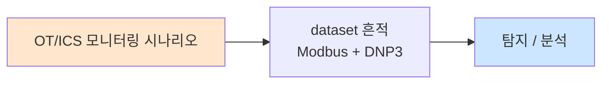

# Week 11: 인시던트 대응 심화

## 학습 목표
- NIST SP 800-61r2 인시던트 대응 프레임워크를 심화 수준으로 이해한다
- 봉쇄(Containment) 전략을 인시던트 유형별로 설계하고 적용할 수 있다
- 디지털 증거를 법적 요건에 맞게 수집하고 보존할 수 있다
- 증거 체인(Chain of Custody)을 관리할 수 있다
- 인시던트 타임라인을 구성하고 근본 원인 분석을 수행할 수 있다

## 실습 환경 (공통)

| 서버 | IP | 역할 | 접속 |
|------|-----|------|------|
| bastion | 10.20.30.201 | Control Plane (Bastion) | `ssh ccc@10.20.30.201` (pw: 1) |
| secu | 10.20.30.1 | 방화벽/IPS (nftables, Suricata) | `ssh ccc@10.20.30.1` |
| web | 10.20.30.80 | 웹서버 (JuiceShop:3000, Apache:80) | `ssh ccc@10.20.30.80` |
| siem | 10.20.30.100 | SIEM (Wazuh Dashboard:443, OpenCTI:8080) | `ssh ccc@10.20.30.100` |

**Bastion API:** `http://localhost:9100` / Key: `ccc-api-key-2026`

## 강의 시간 배분 (3시간)

| 시간 | 내용 | 유형 |
|------|------|------|
| 0:00-0:50 | NIST IR 심화 + 봉쇄 전략 (Part 1) | 강의 |
| 0:50-1:30 | 증거 수집 + 체인 관리 (Part 2) | 강의/토론 |
| 1:30-1:40 | 휴식 | - |
| 1:40-2:30 | IR 시뮬레이션 실습 (Part 3) | 실습 |
| 2:30-3:10 | 근본 원인 분석 + 보고서 (Part 4) | 실습 |
| 3:10-3:20 | 정리 + 과제 안내 | 정리 |

---

## 용어 해설

| 용어 | 영문 | 설명 | 비유 |
|------|------|------|------|
| **IR** | Incident Response | 인시던트 대응 | 소방 대응 |
| **봉쇄** | Containment | 피해 확산 방지 조치 | 화재 방화벽 |
| **근절** | Eradication | 위협 요소 완전 제거 | 잔불 진화 |
| **복구** | Recovery | 정상 운영 상태로 복원 | 재건 |
| **증거 체인** | Chain of Custody | 증거의 접근/이동 기록 | 증거물 관리 일지 |
| **포렌식 이미지** | Forensic Image | 디스크/메모리의 비트 단위 복제 | 원본 복사본 |
| **IOC** | Indicator of Compromise | 침해 지표 | 범행 흔적 |
| **RCA** | Root Cause Analysis | 근본 원인 분석 | 화재 원인 조사 |
| **Lessons Learned** | Lessons Learned | 교훈 도출 회의 | 사후 검토 |
| **RACI** | Responsible, Accountable, Consulted, Informed | 역할 책임 매트릭스 | 업무 분담표 |

---

# Part 1: NIST IR 심화 + 봉쇄 전략 (50분)

## 1.1 NIST SP 800-61r2 4단계

```
Phase 1: 준비 (Preparation)
    → IR 팀 구성, 도구 준비, 플레이북 작성
    → "사고 전에 준비하는 단계"

Phase 2: 탐지 및 분석 (Detection & Analysis)
    → 인시던트 식별, 심각도 판정, 범위 파악
    → "사고를 인지하고 파악하는 단계"

Phase 3: 봉쇄, 근절, 복구 (Containment, Eradication, Recovery)
    → 확산 방지, 위협 제거, 시스템 복원
    → "사고를 처리하는 단계"

Phase 4: 사후 활동 (Post-Incident Activity)
    → 교훈 도출, 프로세스 개선, 보고서
    → "사고에서 배우는 단계"
```

## 1.2 봉쇄 전략

### 단기 봉쇄 vs 장기 봉쇄

```
[단기 봉쇄 (Short-term Containment)]
  목적: 즉각적 피해 확산 방지 (분 단위)
  조치:
    - 공격 IP 방화벽 차단
    - 감염 서버 네트워크 격리
    - 침해 계정 비활성화
    - 악성 프로세스 종료
  주의: 증거 보존을 위해 시스템 종료는 최후 수단

[장기 봉쇄 (Long-term Containment)]
  목적: 근절 준비 기간 동안 안전 운영 (시간~일)
  조치:
    - 임시 보안 패치 적용
    - 추가 모니터링 강화
    - 백업 시스템으로 전환
    - 접근 통제 강화
```

### 인시던트 유형별 봉쇄 전략

| 유형 | 단기 봉쇄 | 장기 봉쇄 | 근절 |
|------|----------|----------|------|
| 무차별 대입 | IP 차단, 계정 잠금 | MFA 활성화 | 비밀번호 전체 변경 |
| 웹셸 | 웹서버 격리 | WAF 강화 | 웹셸 제거, 패치 |
| 랜섬웨어 | 네트워크 격리 | 백업 복원 | 전체 재구축 |
| 데이터 유출 | 아웃바운드 차단 | DLP 강화 | 유출 경로 차단 |
| 내부자 위협 | 계정 비활성화 | 감사 로그 강화 | 접근 권한 재검토 |

## 1.3 증거 수집 절차

```bash
# 증거 수집 자동화 스크립트
cat << 'SCRIPT' > /tmp/evidence_collect.sh
#!/bin/bash
# 인시던트 대응 - 증거 수집 스크립트
EVIDENCE_DIR="/tmp/ir_evidence/$(date +%Y%m%d_%H%M%S)"
mkdir -p "$EVIDENCE_DIR"

echo "============================================"
echo "  인시던트 대응 - 증거 수집"
echo "  서버: $(hostname)"
echo "  시각: $(date)"
echo "  저장: $EVIDENCE_DIR"
echo "============================================"

# 1. 시스템 정보
echo "=== 1. 시스템 정보 ===" | tee "$EVIDENCE_DIR/01_system_info.txt"
{
    echo "Date: $(date)"
    echo "Hostname: $(hostname)"
    echo "Uptime: $(uptime)"
    echo "Kernel: $(uname -a)"
    echo ""
    echo "=== IP 구성 ==="
    ip addr show 2>/dev/null
    echo ""
    echo "=== 라우팅 ==="
    ip route show 2>/dev/null
} >> "$EVIDENCE_DIR/01_system_info.txt"
echo "  [수집] 시스템 정보"

# 2. 프로세스 목록
ps auxf > "$EVIDENCE_DIR/02_processes.txt" 2>/dev/null
echo "  [수집] 프로세스 목록"

# 3. 네트워크 연결
ss -tnpa > "$EVIDENCE_DIR/03_network_connections.txt" 2>/dev/null
echo "  [수집] 네트워크 연결"

# 4. 사용자 계정
{
    echo "=== /etc/passwd ==="
    cat /etc/passwd
    echo ""
    echo "=== 현재 로그인 ==="
    who
    echo ""
    echo "=== 최근 로그인 ==="
    last -20
} > "$EVIDENCE_DIR/04_users.txt" 2>/dev/null
echo "  [수집] 사용자 정보"

# 5. 크론 작업
{
    echo "=== System crontabs ==="
    ls -la /etc/cron* 2>/dev/null
    echo ""
    for user in root $(awk -F: '$3>=1000{print $1}' /etc/passwd); do
        echo "=== $user crontab ==="
        crontab -l -u "$user" 2>/dev/null || echo "(없음)"
    done
} > "$EVIDENCE_DIR/05_cron.txt" 2>/dev/null
echo "  [수집] 크론 작업"

# 6. 최근 수정된 파일
find / -type f -mmin -60 \
  -not -path "/proc/*" -not -path "/sys/*" -not -path "/dev/*" \
  -not -path "/run/*" 2>/dev/null | head -100 > "$EVIDENCE_DIR/06_recent_files.txt"
echo "  [수집] 최근 수정 파일"

# 7. 로그 수집
cp /var/log/auth.log "$EVIDENCE_DIR/07_auth.log" 2>/dev/null
cp /var/log/syslog "$EVIDENCE_DIR/07_syslog.log" 2>/dev/null
echo "  [수집] 시스템 로그"

# 해시 생성
echo ""
echo "=== 증거 무결성 해시 ==="
cd "$EVIDENCE_DIR"
sha256sum * > "$EVIDENCE_DIR/CHECKSUMS.sha256" 2>/dev/null
cat "$EVIDENCE_DIR/CHECKSUMS.sha256"

echo ""
echo "=== 증거 수집 완료 ==="
echo "총 파일: $(ls "$EVIDENCE_DIR" | wc -l)개"
echo "위치: $EVIDENCE_DIR"
SCRIPT

bash /tmp/evidence_collect.sh
```

> **실습 목적**: 인시던트 발생 시 증거를 체계적으로 수집하는 자동화 스크립트를 실행하고 증거 무결성을 보장한다.
>
> **실전 활용**: 이 스크립트를 USB에 넣어두거나 Bastion에 등록해두면 인시던트 발생 시 신속하게 증거를 수집할 수 있다.

---

# Part 2: 증거 수집 + 체인 관리 (40분)

## 2.1 증거 체인(Chain of Custody) 관리

```bash
cat << 'SCRIPT' > /tmp/chain_of_custody.py
#!/usr/bin/env python3
"""증거 체인(Chain of Custody) 관리"""
from datetime import datetime
import json

# 증거 체인 기록
coc = {
    "case_id": "IR-2026-0404-001",
    "incident": "웹서버 침해 (웹셸 발견)",
    "entries": [
        {
            "seq": 1,
            "timestamp": "2026-04-04 10:00:00",
            "action": "최초 인지",
            "person": "SOC L1 분석가 (김분석)",
            "description": "Wazuh 경보로 웹셸 의심 파일 탐지",
        },
        {
            "seq": 2,
            "timestamp": "2026-04-04 10:05:00",
            "action": "에스컬레이션",
            "person": "SOC L2 분석가 (이분석)",
            "description": "L1 분석가로부터 인수, 심화 분석 시작",
        },
        {
            "seq": 3,
            "timestamp": "2026-04-04 10:15:00",
            "action": "증거 수집",
            "person": "SOC L2 분석가 (이분석)",
            "description": "web 서버에서 증거 수집 스크립트 실행",
            "evidence": [
                {"file": "01_system_info.txt", "hash": "sha256:abc123..."},
                {"file": "02_processes.txt", "hash": "sha256:def456..."},
                {"file": "shell.php", "hash": "sha256:789abc..."},
            ],
        },
        {
            "seq": 4,
            "timestamp": "2026-04-04 10:30:00",
            "action": "봉쇄",
            "person": "SOC L2 분석가 (이분석)",
            "description": "웹서버 네트워크 격리, 공격 IP 차단",
        },
        {
            "seq": 5,
            "timestamp": "2026-04-04 11:00:00",
            "action": "증거 이관",
            "person": "SOC L3 분석가 (박분석)",
            "description": "포렌식 분석을 위해 L3에게 증거 이관",
        },
    ],
}

print("=" * 65)
print(f"  증거 체인 (Chain of Custody)")
print(f"  사건: {coc['case_id']}")
print(f"  내용: {coc['incident']}")
print("=" * 65)

for entry in coc["entries"]:
    print(f"\n  [{entry['seq']}] {entry['timestamp']}")
    print(f"      행위: {entry['action']}")
    print(f"      담당: {entry['person']}")
    print(f"      설명: {entry['description']}")
    if "evidence" in entry:
        print(f"      증거물:")
        for ev in entry["evidence"]:
            print(f"        - {ev['file']} ({ev['hash'][:20]}...)")
SCRIPT

python3 /tmp/chain_of_custody.py
```

---

# Part 3: IR 시뮬레이션 실습 (50분)

## 3.1 시나리오: 웹서버 침해 대응

> **시나리오**: web 서버(10.20.30.80)에서 웹셸이 발견되었다. SOC 분석가로서 NIST IR 프레임워크에 따라 대응하라.

```bash
# Phase 2: 탐지 및 분석
echo "============================================"
echo "  IR 시뮬레이션 - Phase 2: 탐지 및 분석"
echo "============================================"

# 웹서버 현황 확인
echo ""
echo "--- 웹서버 프로세스 상태 ---"
ssh ccc@10.20.30.80 "ps aux | grep -E 'apache|nginx|node|http' | head -5" 2>/dev/null

echo ""
echo "--- 의심 파일 검색 ---"
ssh ccc@10.20.30.80 "find /var/www /opt -name '*.php' -newer /etc/hostname 2>/dev/null | head -10" 2>/dev/null

echo ""
echo "--- 최근 SSH 접속 ---"
ssh ccc@10.20.30.80 "last -10" 2>/dev/null

echo ""
echo "--- 외부 네트워크 연결 ---"
ssh ccc@10.20.30.80 "ss -tnp 2>/dev/null | grep ESTAB" 2>/dev/null | head -10
```

## 3.2 Phase 3: 봉쇄 + 근절

```bash
# Phase 3: 봉쇄, 근절, 복구 (Bastion 활용)
export BASTION_API_KEY="ccc-api-key-2026"

PROJECT_ID=$(curl -s -X POST http://localhost:9100/projects \
  -H "Content-Type: application/json" \
  -H "X-API-Key: $BASTION_API_KEY" \
  -d '{
    "name": "ir-webserver-compromise",
    "request_text": "웹서버 침해 인시던트 대응 - 봉쇄 및 근절",
    "master_mode": "external"
  }' | python3 -c "import sys,json; print(json.load(sys.stdin)['id'])")

echo "IR Project: $PROJECT_ID"

curl -s -X POST "http://localhost:9100/projects/$PROJECT_ID/plan" \
  -H "X-API-Key: $BASTION_API_KEY"
curl -s -X POST "http://localhost:9100/projects/$PROJECT_ID/execute" \
  -H "X-API-Key: $BASTION_API_KEY"

# 봉쇄 조치
curl -s -X POST "http://localhost:9100/projects/$PROJECT_ID/execute-plan" \
  -H "Content-Type: application/json" \
  -H "X-API-Key: $BASTION_API_KEY" \
  -d '{
    "tasks": [
      {
        "order": 1,
        "instruction_prompt": "echo \"[봉쇄] 의심 파일 검색\" && find /var/www /opt -name \"*.php\" -mtime -7 2>/dev/null | head -5 && echo CONTAINMENT_SEARCH_DONE",
        "risk_level": "low",
        "subagent_url": "http://10.20.30.80:8002"
      },
      {
        "order": 2,
        "instruction_prompt": "echo \"[봉쇄] 방화벽 상태 확인\" && nft list ruleset 2>/dev/null | wc -l && echo FW_CHECK_DONE",
        "risk_level": "low",
        "subagent_url": "http://10.20.30.1:8002"
      },
      {
        "order": 3,
        "instruction_prompt": "echo \"[분석] Wazuh 최근 경보\" && tail -5 /var/ossec/logs/alerts/alerts.log 2>/dev/null && echo ALERT_CHECK_DONE",
        "risk_level": "low",
        "subagent_url": "http://10.20.30.100:8002"
      }
    ],
    "subagent_url": "http://localhost:8002"
  }'

sleep 3

# 완료 보고
curl -s -X POST "http://localhost:9100/projects/$PROJECT_ID/completion-report" \
  -H "Content-Type: application/json" \
  -H "X-API-Key: $BASTION_API_KEY" \
  -d '{
    "summary": "웹서버 침해 IR 봉쇄 단계 완료",
    "outcome": "success",
    "work_details": ["의심 파일 검색", "방화벽 상태 확인", "경보 분석"]
  }'
```

---

# Part 4: 근본 원인 분석 + 보고서 (40분)

## 4.1 타임라인 구성

```bash
cat << 'SCRIPT' > /tmp/ir_timeline.py
#!/usr/bin/env python3
"""인시던트 타임라인 구성"""

timeline = [
    ("2026-04-03 23:30", "RECON", "203.0.113.50 → web:80", "포트 스캔 탐지 (Suricata)"),
    ("2026-04-03 23:45", "ATTACK", "203.0.113.50 → web:80", "SQL Injection 시도 (15회)"),
    ("2026-04-04 00:10", "EXPLOIT", "203.0.113.50 → web:80", "파일 업로드 취약점 악용"),
    ("2026-04-04 00:12", "INSTALL", "web 로컬", "웹셸 설치 (/var/www/uploads/cmd.php)"),
    ("2026-04-04 00:15", "C2", "web → 203.0.113.50:4444", "리버스 셸 연결"),
    ("2026-04-04 00:20", "DISCOVERY", "web 로컬", "whoami, id, cat /etc/passwd"),
    ("2026-04-04 00:30", "LATERAL", "web → siem:22", "SSH 접속 시도 (실패)"),
    ("2026-04-04 01:00", "EXFIL", "web → 203.0.113.50:443", "데이터 전송 (8MB)"),
    ("2026-04-04 10:00", "DETECT", "Wazuh", "SOC L1 경보 확인"),
    ("2026-04-04 10:05", "RESPOND", "SOC", "에스컬레이션 + 봉쇄 시작"),
]

print("=" * 80)
print("  인시던트 타임라인")
print("=" * 80)
print(f"\n{'시각':>20s} {'유형':>8s} {'위치':>25s}  설명")
print("-" * 80)

for time, type_, location, desc in timeline:
    print(f"{time:>20s} [{type_:>7s}] {location:>25s}  {desc}")

# 체류 시간 계산
print(f"\n=== 핵심 지표 ===")
print(f"  최초 침투: 2026-04-04 00:10")
print(f"  최초 탐지: 2026-04-04 10:00")
print(f"  체류 시간(Dwell Time): 약 10시간")
print(f"  MTTD: 10시간")
print(f"  봉쇄 시작: 2026-04-04 10:05")
print(f"  MTTR: 5분 (탐지 후)")
SCRIPT

python3 /tmp/ir_timeline.py
```

## 4.2 근본 원인 분석 (RCA)

```bash
cat << 'SCRIPT' > /tmp/root_cause_analysis.py
#!/usr/bin/env python3
"""근본 원인 분석 (5 Whys)"""

print("=" * 60)
print("  근본 원인 분석 (5 Whys Method)")
print("=" * 60)

whys = [
    ("문제", "웹서버가 침해되었다"),
    ("Why 1", "웹셸이 업로드되었다"),
    ("Why 2", "파일 업로드 기능에 확장자 검증이 없었다"),
    ("Why 3", "개발팀이 보안 코드 리뷰를 하지 않았다"),
    ("Why 4", "보안 코드 리뷰 프로세스가 없었다"),
    ("Why 5", "보안 개발 가이드라인이 수립되지 않았다 (근본 원인)"),
]

for q, a in whys:
    if q == "문제":
        print(f"\n  {q}: {a}")
    elif "근본 원인" in a:
        print(f"  {q}: {a}")
        print(f"         ^^^^^^^^^^^^^^^^^^^^^^^^^^^^^^^^")
    else:
        print(f"  {q}: {a}")

print("\n=== 재발 방지 대책 ===")
recommendations = [
    ("즉시", "웹 애플리케이션 파일 업로드 취약점 패치"),
    ("단기 (1주)", "WAF 파일 업로드 검증 룰 강화"),
    ("중기 (1개월)", "보안 코드 리뷰 프로세스 수립"),
    ("장기 (3개월)", "보안 개발 가이드라인 + 교육 프로그램"),
]

for period, action in recommendations:
    print(f"  [{period:15s}] {action}")
SCRIPT

python3 /tmp/root_cause_analysis.py
```

## 4.3 인시던트 보고서 생성

```bash
cat << 'SCRIPT' > /tmp/ir_report.py
#!/usr/bin/env python3
"""인시던트 대응 보고서"""

print("""
================================================================
          인시던트 대응 보고서
================================================================

1. 개요
   사건 번호: IR-2026-0404-001
   일시: 2026-04-03 23:30 ~ 2026-04-04 10:30
   유형: 웹서버 침해 (웹셸 업로드)
   심각도: High
   상태: 봉쇄 완료

2. 영향 범위
   침해 서버: web (10.20.30.80)
   영향 서비스: JuiceShop 웹 애플리케이션
   데이터 유출: 약 8MB (사용자 데이터 포함 여부 확인 중)
   2차 피해: siem 서버 SSH 접속 시도 (실패)

3. 대응 타임라인
   00:10  최초 침투 (파일 업로드 취약점)
   00:12  웹셸 설치
   00:15  C2 통신 시작
   01:00  데이터 유출
   10:00  SOC 탐지 (Wazuh 경보)
   10:05  봉쇄 시작 (IP 차단, 서버 격리)
   10:30  봉쇄 완료

4. IOC
   공격 IP: 203.0.113.50
   웹셸: /var/www/uploads/cmd.php (SHA256: ...)
   C2 포트: 4444
   User-Agent: Python-urllib/3.9

5. 근본 원인
   파일 업로드 기능에 확장자/MIME 검증이 없어
   PHP 웹셸이 업로드됨

6. 재발 방지 대책
   - [즉시] 업로드 취약점 패치
   - [단기] WAF 룰 강화
   - [중기] 보안 코드 리뷰 프로세스 수립
   - [장기] 보안 개발 가이드라인 + 교육

7. 교훈 (Lessons Learned)
   - MTTD 10시간은 개선 필요 → 웹셸 탐지 YARA 룰 추가
   - 파일 업로드 모니터링 Wazuh 룰 부재 → 추가
   - 자동 대응(SOAR) 미적용 → 다음 분기 도입
""")
SCRIPT

python3 /tmp/ir_report.py
```

---

## 체크리스트

- [ ] NIST SP 800-61r2의 4단계를 설명할 수 있다
- [ ] 단기/장기 봉쇄 전략의 차이를 알고 있다
- [ ] 인시던트 유형별 봉쇄 조치를 설계할 수 있다
- [ ] 디지털 증거 수집 스크립트를 실행하고 해시를 기록할 수 있다
- [ ] 증거 체인(Chain of Custody)을 관리할 수 있다
- [ ] 인시던트 타임라인을 구성할 수 있다
- [ ] 5 Whys 기법으로 근본 원인 분석을 수행할 수 있다
- [ ] Bastion로 다중 서버 IR 조치를 자동화할 수 있다
- [ ] 인시던트 대응 보고서를 작성할 수 있다
- [ ] Lessons Learned 회의의 목적과 산출물을 알고 있다

---

## 과제

### 과제 1: IR 시뮬레이션 (필수)

가상 시나리오 "siem 서버에서 비인가 SSH 접속이 발견됨"에 대해 NIST IR 4단계를 수행하라:
1. 증거 수집 스크립트 실행 + 해시 기록
2. 타임라인 구성
3. 봉쇄 조치 계획 + Bastion로 실행
4. 근본 원인 분석 (5 Whys)
5. 인시던트 보고서 작성

### 과제 2: IR 플레이북 작성 (선택)

"랜섬웨어 감염" 시나리오에 대한 IR 플레이북을 작성하라:
1. 단기/장기 봉쇄 절차
2. 증거 수집 절차
3. 복구 절차 (백업 활용)
4. 재발 방지 대책

---

## 보충: IR 고급 절차

### 증거 수집 자동화 (전체 서버)

```bash
# Bastion를 활용한 전체 서버 동시 증거 수집
export BASTION_API_KEY="ccc-api-key-2026"

cat << 'SCRIPT' > /tmp/mass_evidence_collection.sh
#!/bin/bash
# 대규모 증거 수집 스크립트 (Bastion execute-plan용)
EVIDENCE="/tmp/evidence_$(hostname)_$(date +%Y%m%d%H%M%S)"
mkdir -p "$EVIDENCE"

# 1. 휘발성 증거 (우선)
date > "$EVIDENCE/00_collection_time.txt"
hostname >> "$EVIDENCE/00_collection_time.txt"
ps auxf > "$EVIDENCE/01_processes.txt" 2>/dev/null
ss -tnpa > "$EVIDENCE/02_network.txt" 2>/dev/null
who > "$EVIDENCE/03_logged_in.txt" 2>/dev/null
ip addr > "$EVIDENCE/04_ip_config.txt" 2>/dev/null
ip route > "$EVIDENCE/05_routes.txt" 2>/dev/null
arp -an > "$EVIDENCE/06_arp_cache.txt" 2>/dev/null
env > "$EVIDENCE/07_environment.txt" 2>/dev/null

# 2. 비휘발성 증거
last -50 > "$EVIDENCE/10_last_logins.txt" 2>/dev/null
cat /etc/passwd > "$EVIDENCE/11_passwd.txt" 2>/dev/null
cat /etc/group > "$EVIDENCE/12_group.txt" 2>/dev/null
crontab -l > "$EVIDENCE/13_crontab.txt" 2>/dev/null
systemctl list-units --type=service --state=running > "$EVIDENCE/14_services.txt" 2>/dev/null
find / -perm -4000 -type f > "$EVIDENCE/15_suid.txt" 2>/dev/null
find /tmp /var/tmp /dev/shm -type f > "$EVIDENCE/16_tmp_files.txt" 2>/dev/null

# 3. 로그 수집
cp /var/log/auth.log "$EVIDENCE/20_auth.log" 2>/dev/null
cp /var/log/syslog "$EVIDENCE/21_syslog" 2>/dev/null
journalctl --since "24 hours ago" > "$EVIDENCE/22_journal_24h.txt" 2>/dev/null

# 4. 해시 기록
cd "$EVIDENCE"
sha256sum * > CHECKSUMS.sha256 2>/dev/null

echo "증거 수집 완료: $EVIDENCE"
echo "파일 수: $(ls "$EVIDENCE" | wc -l)"
echo "총 크기: $(du -sh "$EVIDENCE" | awk '{print $1}')"
SCRIPT

echo "=== 증거 수집 스크립트 준비 완료 ==="
echo "사용법: Bastion execute-plan으로 전체 서버에 배포"

# 실행 (로컬 테스트)
bash /tmp/mass_evidence_collection.sh
```

> **실전 활용**: 이 스크립트를 Bastion의 execute-plan에 등록하면 인시던트 발생 시 전체 서버의 증거를 1분 내에 동시 수집할 수 있다. 증거 수집 순서는 RFC 3227의 휘발성 순서를 따른다.

### RACI 매트릭스

```bash
cat << 'SCRIPT' > /tmp/ir_raci.py
#!/usr/bin/env python3
"""인시던트 대응 RACI 매트릭스"""

# R=Responsible, A=Accountable, C=Consulted, I=Informed
raci = {
    "활동": [
        "경보 확인",
        "트리아지",
        "에스컬레이션",
        "심화 분석",
        "봉쇄 결정",
        "봉쇄 실행",
        "포렌식",
        "근절",
        "복구",
        "보고서 작성",
        "경영진 보고",
        "Lessons Learned",
    ],
    "Tier 1": ["R", "R", "R", "I", "I", "I", "I", "I", "I", "C", "I", "C"],
    "Tier 2": ["I", "C", "A", "R", "R", "R", "C", "R", "R", "R", "C", "R"],
    "Tier 3": ["I", "I", "C", "C", "C", "C", "R", "A", "A", "A", "C", "A"],
    "SOC 매니저": ["I", "I", "I", "I", "A", "A", "I", "C", "C", "C", "R", "R"],
    "CISO": ["I", "I", "I", "I", "C", "I", "I", "I", "I", "I", "A", "I"],
}

print("=" * 80)
print("  인시던트 대응 RACI 매트릭스")
print("  R=Responsible, A=Accountable, C=Consulted, I=Informed")
print("=" * 80)

header = f"{'활동':16s} {'Tier 1':>6s} {'Tier 2':>6s} {'Tier 3':>6s} {'매니저':>6s} {'CISO':>6s}"
print(f"\n{header}")
print("-" * 55)

for i, activity in enumerate(raci["활동"]):
    row = f"{activity:16s}"
    for role in ["Tier 1", "Tier 2", "Tier 3", "SOC 매니저", "CISO"]:
        val = raci[role][i]
        row += f" {val:>6s}"
    print(row)
SCRIPT

python3 /tmp/ir_raci.py
```

### 인시던트 심각도 분류 기준

```bash
cat << 'SCRIPT' > /tmp/incident_severity.py
#!/usr/bin/env python3
"""인시던트 심각도 분류 기준"""

severity_matrix = {
    "P1 (Critical)": {
        "기준": "핵심 서비스 중단 또는 대규모 데이터 유출",
        "예시": "랜섬웨어 감염, 고객 DB 유출, 핵심 서버 장악",
        "대응 시간": "즉시 (15분 내 봉쇄 시작)",
        "에스컬레이션": "SOC 매니저 + CISO + 법률팀",
        "교대": "24/7 전담 팀 구성",
    },
    "P2 (High)": {
        "기준": "공격 진행 중이나 핵심 서비스 영향 없음",
        "예시": "웹셸 발견, 내부 서버 측면 이동, C2 통신",
        "대응 시간": "1시간 내 봉쇄",
        "에스컬레이션": "SOC 매니저",
        "교대": "업무 시간 집중 대응",
    },
    "P3 (Medium)": {
        "기준": "공격 시도 확인, 성공 여부 불확실",
        "예시": "무차별 대입, 포트 스캔, SQL Injection 시도",
        "대응 시간": "4시간 내 분석 완료",
        "에스컬레이션": "Tier 2 분석가",
        "교대": "정상 업무 내 처리",
    },
    "P4 (Low)": {
        "기준": "정상 활동의 변형, 위험도 낮음",
        "예시": "정책 위반, 비인가 소프트웨어, 설정 오류",
        "대응 시간": "24시간 내",
        "에스컬레이션": "불필요",
        "교대": "정상 업무 내 처리",
    },
}

print("=" * 60)
print("  인시던트 심각도 분류 기준")
print("=" * 60)

for level, info in severity_matrix.items():
    print(f"\n  --- {level} ---")
    for key, value in info.items():
        print(f"    {key}: {value}")
SCRIPT

python3 /tmp/incident_severity.py
```

### 포렌식 이미지 수집 절차

```bash
cat << 'SCRIPT' > /tmp/forensic_imaging.py
#!/usr/bin/env python3
"""포렌식 이미지 수집 절차"""

print("""
================================================================
  포렌식 이미지 수집 절차
================================================================

1. 디스크 이미지 수집 (dd/dcfldd)

   # 원본 디스크 → 이미지 파일
   dcfldd if=/dev/sda of=/evidence/disk_image.dd \\
     hash=sha256 hashlog=/evidence/disk_hash.log \\
     hashwindow=1G

   # 압축 이미지 (용량 절감)
   dd if=/dev/sda bs=4M | gzip > /evidence/disk_image.dd.gz

   # 해시 기록
   sha256sum /evidence/disk_image.dd > /evidence/disk_image.dd.sha256

2. 메모리 이미지 수집 (LiME)

   # LiME 모듈 로드
   insmod lime-$(uname -r).ko \\
     "path=/evidence/memory.lime format=lime"

   # 해시 기록
   sha256sum /evidence/memory.lime > /evidence/memory.lime.sha256

3. 증거 보존

   # 읽기 전용 마운트
   mount -o ro,loop /evidence/disk_image.dd /mnt/evidence/

   # 해시 검증
   sha256sum -c /evidence/disk_image.dd.sha256

4. 증거 보관

   # 암호화 보관
   gpg -c /evidence/disk_image.dd
   # → disk_image.dd.gpg

   # 이중 보관 (원본 + 사본)
   rsync -av /evidence/ /backup/evidence/
""")
SCRIPT

python3 /tmp/forensic_imaging.py
```

### 인시던트 대응 자동화 스크립트 라이브러리

```bash
cat << 'SCRIPT' > /tmp/ir_scripts_library.py
#!/usr/bin/env python3
"""IR 자동화 스크립트 라이브러리"""

scripts = {
    "ip_block.sh": {
        "용도": "공격 IP 방화벽 차단",
        "사용": "./ip_block.sh <IP>",
        "내용": "nft add rule ip filter input ip saddr $1 drop",
    },
    "account_lock.sh": {
        "용도": "침해 계정 잠금",
        "사용": "./account_lock.sh <username>",
        "내용": "usermod -L $1 && passwd -l $1",
    },
    "evidence_collect.sh": {
        "용도": "증거 수집 (휘발성 우선)",
        "사용": "./evidence_collect.sh",
        "내용": "ps, ss, who, last, 로그 수집 + 해시",
    },
    "timeline_build.sh": {
        "용도": "파일 시스템 타임라인 구축",
        "사용": "./timeline_build.sh /",
        "내용": "find / -printf '%T+ %p\\n' | sort",
    },
    "ioc_scan.sh": {
        "용도": "IOC 일괄 검색",
        "사용": "./ioc_scan.sh ioc_list.txt",
        "내용": "grep -rF -f ioc_list.txt /var/log/",
    },
    "snapshot_system.sh": {
        "용도": "시스템 상태 스냅샷",
        "사용": "./snapshot_system.sh",
        "내용": "프로세스, 네트워크, 사용자, cron, 서비스 전체 기록",
    },
}

print("=" * 60)
print("  IR 자동화 스크립트 라이브러리")
print("=" * 60)

for name, info in scripts.items():
    print(f"\n  --- {name} ---")
    print(f"    용도: {info['용도']}")
    print(f"    사용: {info['사용']}")
    print(f"    내용: {info['내용']}")

print("""
배포 위치:
  /opt/ir-toolkit/scripts/
  Bastion Playbook으로 등록 가능

사용 원칙:
  1. 실행 전 반드시 해시 확인 (변조 방지)
  2. 결과는 중앙 저장소에 자동 업로드
  3. 실행 로그는 별도 기록
""")
SCRIPT

python3 /tmp/ir_scripts_library.py
```

### 인시던트 커뮤니케이션 템플릿

```bash
cat << 'SCRIPT' > /tmp/ir_communication.py
#!/usr/bin/env python3
"""인시던트 커뮤니케이션 템플릿"""

templates = {
    "초기 알림 (Slack)": """
[INCIDENT] IR-2026-XXXX - {severity}
시각: {time}
유형: {type}
영향: {impact}
상태: 조사 중
담당: {assignee}
다음 업데이트: 30분 후
""",
    "경영진 보고 (이메일)": """
제목: [보안 인시던트] {type} - {severity}

1. 현황: {status}
2. 영향: {impact}
3. 조치: {actions}
4. 예상 복구: {eta}
5. 다음 보고: {next_update}
""",
    "종결 알림 (Slack)": """
[RESOLVED] IR-2026-XXXX
종결 시각: {time}
대응 시간: {response_time}
결과: {outcome}
후속: Lessons Learned 예정
""",
}

print("=" * 60)
print("  인시던트 커뮤니케이션 템플릿")
print("=" * 60)

for name, template in templates.items():
    print(f"\n  --- {name} ---")
    print(template)
SCRIPT

python3 /tmp/ir_communication.py
```

### 인시던트 대응 테이블탑 연습(TTX) 가이드

```bash
cat << 'SCRIPT' > /tmp/ttx_guide.py
#!/usr/bin/env python3
"""인시던트 대응 테이블탑 연습(TTX) 가이드"""

print("""
================================================================
  테이블탑 연습(TTX) 운영 가이드
================================================================

1. 목적
   → IR 프로세스와 의사결정 능력을 검증
   → 실제 시스템을 건드리지 않는 토론 기반 연습

2. 참가자
   → SOC 팀 (Tier 1/2/3)
   → SOC 매니저
   → IT 운영팀 대표
   → (선택) 경영진, 법률, HR, PR

3. 시나리오 예시

   [시나리오 A: 랜섬웨어]
   "금요일 오후 5시, 회계팀에서 파일이 열리지 않는다고 보고.
    확인 결과 다수 파일이 .encrypted로 변경됨.
    몸값 요구 메모가 바탕화면에 생성됨."

   질문:
   - 누가 가장 먼저 알림을 받아야 하는가?
   - 어떤 서버를 우선 격리해야 하는가?
   - 백업에서 복구 가능한가?
   - 몸값을 지불해야 하는가?
   - 고객에게 어떻게 알릴 것인가?

   [시나리오 B: 공급망 공격]
   "월요일 아침, 자동 업데이트 서버에서 배포된 패키지에
    백도어가 포함되어 있다는 외부 제보를 받음."

   질문:
   - 해당 패키지를 설치한 서버를 어떻게 식별하는가?
   - 공급망 전체를 차단해야 하는가?
   - 이미 실행된 백도어를 어떻게 탐지하는가?

4. 진행 절차
   0:00-0:10  시나리오 브리핑
   0:10-0:30  Phase 1 상황 제시 + 토론
   0:30-0:50  Phase 2 상황 악화 + 의사결정
   0:50-1:10  Phase 3 복구/보고 + 토론
   1:10-1:30  교훈 도출 + 개선 사항

5. 평가 기준
   - 의사결정 속도와 적절성
   - 팀 간 소통 효과성
   - 에스컬레이션 정확성
   - 증거 보존 인식
   - 커뮤니케이션 적절성
""")
SCRIPT

python3 /tmp/ttx_guide.py
```

---

## 다음 주 예고

**Week 12: 로그 엔지니어링**에서는 커스텀 디코더 작성, 로그 파서 개발, 정규화, 보존 정책을 학습한다.

---

## 웹 UI 실습

### SOAR 시나리오: Dashboard 알림 → OpenCTI IoC → 인시던트 대응

#### Step 1: Wazuh Dashboard에서 인시던트 경보 수집

> **접속 URL:** `https://10.20.30.100:443`

1. `https://10.20.30.100:443` 접속 → 로그인
2. **Modules → Security events** 클릭
3. 인시던트 관련 경보 수집 쿼리:
   ```
   rule.level >= 10 AND agent.name: web
   ```
4. 경보를 시간순 정렬하여 공격 타임라인 구성
5. 각 경보의 `rule.mitre.id` 필드에서 ATT&CK 기법 ID 추출
6. **Export** → CSV로 증거 보존

#### Step 2: OpenCTI에서 IoC 교차 확인

> **접속 URL:** `http://10.20.30.100:8080`

1. `http://10.20.30.100:8080` 접속 → 로그인
2. 경보에서 추출한 IP/도메인/해시를 **Observations → Observables** 에서 검색
3. 매칭된 IOC의 연관 캠페인 → 공격자 프로파일링
4. **Techniques → Attack patterns** 에서 타임라인의 ATT&CK 기법 매핑
5. 인시던트 보고서 작성 시 OpenCTI의 위협 컨텍스트를 증거로 활용

#### Step 3: nftables 차단 확인

1. Dashboard **Modules → Security events** 에서 Active Response 로그 확인:
   ```
   rule.description: *active*response* OR data.command: *nftables*
   ```
2. 봉쇄 조치 전후 경보 빈도 비교로 효과 측정

---

## 📂 실습 참조 파일 가이드

> 이번 주 실습에서 **실제로 조작하는** 솔루션의 기능·경로·파일·설정·UI 요점입니다.

### Wazuh SIEM (4.11.x)
> **역할:** 에이전트 기반 로그·FIM·SCA 통합 분석 플랫폼  
> **실행 위치:** `siem (10.20.30.100)`  
> **접속/호출:** Dashboard `https://10.20.30.100` (admin/admin), Manager API `:55000`

**주요 경로·파일**

| 경로 | 역할 |
|------|------|
| `/var/ossec/etc/ossec.conf` | Manager 메인 설정 (원격, 전송, syscheck 등) |
| `/var/ossec/etc/rules/local_rules.xml` | 커스텀 룰 (id ≥ 100000) |
| `/var/ossec/etc/decoders/local_decoder.xml` | 커스텀 디코더 |
| `/var/ossec/logs/alerts/alerts.json` | 실시간 JSON 알림 스트림 |
| `/var/ossec/logs/archives/archives.json` | 전체 이벤트 아카이브 |
| `/var/ossec/logs/ossec.log` | Manager 데몬 로그 |
| `/var/ossec/queue/fim/db/fim.db` | FIM 기준선 SQLite DB |

**핵심 설정·키**

- `<rule id='100100' level='10'>` — 커스텀 룰 — level 10↑은 고위험
- `<syscheck><directories>...` — FIM 감시 경로
- `<active-response>` — 자동 대응 (firewall-drop, restart)

**로그·확인 명령**

- `jq 'select(.rule.level>=10)' alerts.json` — 고위험 알림만
- `grep ERROR ossec.log` — Manager 오류 (룰 문법 오류 등)

**UI / CLI 요점**

- Dashboard → Security events — KQL 필터 `rule.level >= 10`
- Dashboard → Integrity monitoring — 변경된 파일 해시 비교
- `/var/ossec/bin/wazuh-logtest` — 룰 매칭 단계별 확인 (Phase 1→3)
- `/var/ossec/bin/wazuh-analysisd -t` — 룰·설정 문법 검증

> **해석 팁.** Phase 3에서 원하는 `rule.id`가 떠야 커스텀 룰 정상. `local_rules.xml` 수정 후 `systemctl restart wazuh-manager`, 문법 오류가 있으면 **분석 데몬 전체가 기동 실패**하므로 `-t`로 먼저 검증.

### Volatility 3
> **역할:** 메모리 이미지 포렌식 프레임워크  
> **실행 위치:** `분석 PC`  
> **접속/호출:** `vol -f mem.raw <plugin>`

**주요 경로·파일**

| 경로 | 역할 |
|------|------|
| `volatility3/volatility3/plugins/` | 플러그인 소스 |
| `~/symbols/` | 커널 심볼 캐시 |

**핵심 설정·키**

- `windows.pslist / linux.pslist` — 프로세스 열거
- `windows.malfind` — 주입된 코드 탐지
- `windows.netscan` — 열린 소켓

**UI / CLI 요점**

- `vol -f mem.raw windows.pstree` — 프로세스 트리
- `vol -f mem.raw windows.cmdline` — 실행된 명령행
- `vol -f mem.raw linux.bash` — bash 히스토리 복원

> **해석 팁.** Volatility 3은 **심볼 자동 다운로드**가 필요하므로 오프라인 분석 시 `--symbol-dirs`로 미리 준비. 샘플 복사 시 `md5sum`로 무결성 확인 필수.

---

## 실제 사례 (WitFoo Precinct 6 — OT/ICS 모니터링)

> 출처: WitFoo Precinct 6 Cybersecurity Dataset (Apache 2.0)
> 본 lecture *OT/ICS 모니터링* 학습 항목 매칭.

### OT/ICS 모니터링 의 dataset 흔적 — "Modbus + DNP3"

dataset 의 정상 운영에서 *Modbus + DNP3* 신호의 baseline 을 알아두면, *OT/ICS 모니터링* 시도 시 발생하는 anomaly 를 정량으로 탐지할 수 있다. 핵심 정량 지표는 — OT 프로토콜 baseline.



### Case 1: dataset 정량 지표

| 항목 | 값 |
|---|---|
| 핵심 신호 | Modbus + DNP3 |
| 정량 baseline | OT 프로토콜 baseline |
| 학습 매핑 | Suricata OT 룰 |

**자세한 해석**: Suricata OT 룰. 이 차이를 정량으로 측정해야 *공격 시도와 정상 운영의 구분* 이 가능. 학생이 baseline 숫자를 외워두면 — 운영 환경에서 anomaly 를 즉시 탐지할 수 있다.

### Case 2: 실전 적용 시나리오

| 단계 | dataset 활용 |
|---|---|
| 시도 식별 | Modbus + DNP3 의 spike |
| 정상 vs 이상 | baseline 대비 비율 |
| 룰 작성 | Suricata / Wazuh / Sigma |
| 검증 | dataset 재실행 |

**자세한 해석**: 운영 환경 룰 작성은 — *baseline 측정 → 임계 결정 → 룰 작성 → dataset 검증* 의 4 단계. 한 단계라도 빠지면 false positive 폭증.

### 이 사례에서 학생이 배워야 할 3가지

1. **OT/ICS 모니터링 = Modbus + DNP3 의 anomaly** — 정량 신호로 탐지.
2. **baseline 숫자 외우기** — OT 프로토콜 baseline.
3. **4 단계 룰 작성** — 측정 → 임계 → 룰 → 검증.

**학생 액션**: Modbus anomaly 룰.


---

## 부록: 학습 OSS 도구 매트릭스 (Course14 SOC Advanced — Week 11 인시던트 대응 심화·NIST SP 800-61·격리·근절·복구)

> 이 부록은 lab `soc-adv-ai/week11.yaml` (15 step + multi_task) 의 모든 명령을
> 실제로 실행 가능한 형태로 정리한다. NIST SP 800-61 r2 의 4 단계, SQLi 시나리오 +
> 내부자 위협, P1~P4 분류, tabletop exercise, 법적 요건까지 풀 워크플로우.

### lab step → 도구·IR 매핑 표

| step | 학습 항목 | 핵심 OSS 도구 | NIST 단계 |
|------|----------|--------------|----------|
| s1 | NIST SP 800-61 r2 4 단계 | NIST 양식 + RACI | All |
| s2 | SQLi triage (초기 분류) | Wazuh API + jq + TheHive | Detection |
| s3 | 공격 범위 파악 | Apache log + Wazuh + Zeek (week07) | Analysis |
| s4 | 격리 (firewall + endpoint disable) | nft drop + apache disable + LB drain | Containment |
| s5 | 증거 수집 (log + pcap + 메모리) | tcpdump + LiME + sha256 + CoC | Analysis |
| s6 | 근절 (코드 fix + WAF + DB 권한) | git PR + ModSecurity + GRANT REVOKE | Eradication |
| s7 | 복구 (서비스 정상화 + 모니터링) | restore + monitoring + canary | Recovery |
| s8 | 커뮤니케이션 (내·외부) | RACI + 통보 매트릭스 + 보도자료 | Communication |
| s9 | 통합 타임라인 | Plaso + mermaid + Timesketch | Analysis |
| s10 | Lessons Learned (AAR) | After Action Report 양식 | Post-Incident |
| s11 | 내부자 위협 대응 | UEBA + DLP + CCTV + HR 협력 | Special |
| s12 | 심각도 분류 (P1~P4) | severity matrix + SLA | Preparation |
| s13 | Tabletop Exercise | scenario card + 진행자 | Preparation |
| s14 | 법적 요건 (PIPA/GDPR) | compliance 매트릭스 | Legal |
| s15 | IR 종합 보고서 | NIST 양식 + 5 phase + 교훈 | - |
| s99 | 통합 다단계 (s1→s2→s3→s4→s5) | Bastion plan: NIST→triage→범위→격리→증거 | 다중 |

### 학생 환경 준비

```bash
# === [s2·s5] Wazuh + jq (이미 설치) ===
TOKEN=$(curl -sk -u wazuh:wazuh -X POST "https://10.20.30.100:55000/security/user/authenticate?raw=true")

# === [s4] nftables + Apache ===
ssh ccc@10.20.30.1 'sudo nft list ruleset'
ssh ccc@10.20.30.80 'sudo apache2ctl -t -D DUMP_VHOSTS'

# === [s5] 증거 수집 (week07·08 도구) ===
sudo apt install -y tcpdump
ls /tmp/lime/src/lime-*.ko 2>/dev/null

# === [s6] WAF (ModSecurity OWASP CRS) ===
sudo apt install -y libapache2-mod-security2 modsecurity-crs
ssh ccc@10.20.30.80 'sudo a2enmod security2'

# === [s9] Plaso + Timesketch (week07 와 동일) ===
pip install --user plaso

# === [s11] UEBA / DLP — Wazuh 기반 ===

# === [s14] 법적 — 개인정보보호위원회 신고 양식 ===

# === [s15] 보고서 (pandoc) ===
```

### 핵심 도구별 상세 사용법

#### 도구 1: NIST SP 800-61 r2 4 단계 (Step 1)

| 단계 | 활동 | 핵심 도구 | 기간 |
|------|------|----------|------|
| **1. Preparation** | playbook + tools + training | TheHive + Bastion + Tabletop | 상시 |
| **2. Detection & Analysis** | alert → 분류 → 범위 → 영향 | Wazuh + Suricata + Plaso | 분-시간 |
| **3. Containment / Eradication / Recovery** | 격리 → 제거 → 복구 | nft + WAF + backup | 시간-일 |
| **4. Post-Incident Activity** | lessons learned + 보고 | After Action Report | 일-주 |

원칙: Containment 우선 (eradication 전), 증거 + 운영 동시, AAR 매번.

#### 도구 2: 초기 분류 — SQLi (Step 2)

```bash
TOKEN=$(curl -sk -u wazuh:wazuh -X POST "https://10.20.30.100:55000/security/user/authenticate?raw=true")

# 최근 1h SQLi 알림
curl -sk -u admin:admin "https://10.20.30.100:9200/wazuh-alerts-*/_search" -H 'Content-Type: application/json' -d '{
  "size": 100,
  "query": {"bool":{"must":[
    {"range":{"@timestamp":{"gte":"now-1h"}}},
    {"prefix":{"rule.id":"1002"}}]}},
  "sort": [{"@timestamp":"desc"}]
}' | jq '.hits.hits[] | {time:._source["@timestamp"], src:._source.data.srcip, uri:._source.data.url}'

# 빈도 — 단일 vs 분산
curl -sk -u admin:admin "https://10.20.30.100:9200/wazuh-alerts-*/_search" -H 'Content-Type: application/json' -d '{
  "size": 0,
  "query": {"bool":{"must":[{"range":{"@timestamp":{"gte":"now-1h"}}},{"prefix":{"rule.id":"1002"}}]}},
  "aggs": {"by_src": {"terms": {"field": "data.srcip", "size": 10}}}
}' | jq '.aggregations.by_src.buckets'
```

| 질문 | Yes | No |
|------|-----|-----|
| 1. SIEM 알림 신뢰도 90+? | → 2 | FP, close |
| 2. payload 가 실제 SQLi pattern? | → 3 | FP, close |
| 3. 응답 코드 200 (성공)? | → P1 (Critical) | → 4 |
| 4. 단일 IP 분산? | → P2 (recon) | → P3 (general) |

```bash
# TheHive case
curl -X POST "$THEHIVE/api/v1/case" \
  -H "Authorization: Bearer $API_KEY" \
  -d '{"title":"[P1] SQLi — web (10.20.30.80)", "severity":4, "tlp":2, "tags":["sqli","P1"]}'
```

#### 도구 3: 공격 범위 파악 (Step 3)

```bash
# 시작 시점
ssh ccc@10.20.30.80 'sudo grep -E "UNION.*SELECT" /var/log/apache2/access.log | head -1'

# 영향 시스템
ssh ccc@10.20.30.80 'sudo grep -c "SQL syntax error" /var/log/apache2/error.log'
ssh ccc@10.20.30.80 'sudo grep -E "SELECT.*UNION|password|user.*=" /var/log/mysql/general.log | head'

# Lateral 검사
for host in 10.20.30.1 10.20.30.100; do
    ssh ccc@$host 'sudo grep "10.20.30.80\|192.168.1.50" /var/log/auth.log | tail'
done

# 응답 크기 (exfil 의심)
ssh ccc@10.20.30.80 'sudo awk "{print \$10}" /var/log/apache2/access.log | sort -n | tail -10'

# Zeek (week07)
zeek -r /var/log/forensics/incident.pcap

# 외부 outbound
zeek-cut id.orig_h id.resp_h orig_bytes resp_bytes < /var/log/zeek/conn.log | \
  awk '$1 ~ /^10\.20\.30\./ && $2 !~ /^10\.20\.30\./ && $4 > 1048576' | sort -k 4 -rn

# 정리
cat > /tmp/incident-scope.md << 'MD'
## Incident Scope — IR-2026-Q2-001
- 시작: 2026-05-02 14:01:23
- 영향: web (10.20.30.80) — 직접
- DB: web mysql — SELECT FROM users 1247건
- 사용자: 12,847 (전체)
- Lateral: 없음
- 유출 추정: ~1.3MB (12,847 × 100B)
MD
```

#### 도구 4: 격리 (Step 4)

```bash
# 1. 공격 IP 차단
ssh ccc@10.20.30.1 'sudo nft add rule inet filter input ip saddr 192.168.1.50 drop counter'

# 2. 취약 endpoint 비활성화
ssh ccc@10.20.30.80 'sudo a2dissite vulnerable-app && sudo systemctl reload apache2'

# 또는 path 만 차단
ssh ccc@10.20.30.80 'sudo tee -a /etc/apache2/conf-enabled/emergency-block.conf' << 'CONF'
<Location "/rest/products/search">
    Require all denied
</Location>
CONF
ssh ccc@10.20.30.80 'sudo systemctl reload apache2'

# 3. DB 권한 read-only
ssh ccc@10.20.30.80 'sudo mysql -e "REVOKE INSERT, UPDATE, DELETE, CREATE ON juiceshop.* FROM \"webapp\"@\"localhost\""'

# 4. 모니터링 강화
ssh ccc@10.20.30.100 'sudo sed -i "s/<level>5</<level>10</" /var/ossec/etc/rules/local_rules.xml'
ssh ccc@10.20.30.100 'sudo /var/ossec/bin/wazuh-control restart'

# 검증
ssh ccc@10.20.30.1 'sudo nft list counter inet filter input_dropped'
ssh ccc@10.20.30.80 'sudo grep 192.168.1.50 /var/log/apache2/access.log | tail'   # 새 접근 없음
```

| 시나리오 | 격리 | 영향 | 시간 |
|---------|------|------|------|
| SQLi 성공 + 활성 | nft drop + endpoint disable | 사용자 일부 | 5분 |
| 랜섬웨어 active | 호스트 격리 (모든 포트) | 서비스 중단 | 1분 |
| 내부자 의심 | 사용자 계정 잠금 + 모니터링 | 정상 업무 영향 | 10분 |
| C2 통신 | outbound 차단 | 외부 통신 영향 | 5분 |
| 다중 호스트 침해 | VLAN 격리 | 부서 전체 | 30분 |

원칙: 영향 최소화 (don't kill the patient), 증거 보존, 가역성, 단계적.

#### 도구 5: 증거 수집 (Step 5)

```bash
EVID=/var/log/forensics/incident-2026-05-02
mkdir -p $EVID

# 1. Web log
ssh ccc@10.20.30.80 'sudo cp /var/log/apache2/access.log /tmp/access.log.snapshot'
scp ccc@10.20.30.80:/tmp/access.log.snapshot $EVID/web-access.log
sha256sum $EVID/web-access.log > $EVID/web-access.log.sha256

# DB log
ssh ccc@10.20.30.80 'sudo cp /var/log/mysql/general.log /tmp/mysql.log.snapshot'
scp ccc@10.20.30.80:/tmp/mysql.log.snapshot $EVID/mysql-general.log
sha256sum $EVID/mysql-general.log >> $EVID/web-access.log.sha256

# 2. PCAP (week07)
ssh ccc@10.20.30.1 'sudo timeout 300 tcpdump -i eth0 -w /tmp/incident.pcap -s 0 not port 22'
scp ccc@10.20.30.1:/tmp/incident.pcap{,.sha256} $EVID/

# 3. 메모리 dump (week08)
ssh ccc@10.20.30.80 '
  cd /tmp/lime/src
  sudo insmod lime-$(uname -r).ko "path=/tmp/mem.lime format=lime"
'
scp ccc@10.20.30.80:/tmp/mem.lime $EVID/
sha256sum $EVID/mem.lime > $EVID/mem.lime.sha256

# 4. Wazuh / Suricata export
curl -sk -u admin:admin "https://10.20.30.100:9200/wazuh-alerts-*/_search?size=10000" \
  -H 'Content-Type: application/json' \
  -d '{"query":{"range":{"@timestamp":{"gte":"now-3h"}}}}' > $EVID/wazuh-alerts.json

ssh ccc@10.20.30.1 'sudo cat /var/log/suricata/eve.json' > $EVID/suricata-eve.json

# 5. CoC (week07 양식)
cat > $EVID/coc.txt << 'COC'
=== CHAIN OF CUSTODY — IR-2026-Q2-001 ===
Incident: SQL Injection on web (10.20.30.80)
Date: 2026-05-02
Captured by: 학생 이름

Evidence:
- web-access.log / mysql-general.log
- incident.pcap (5분, secu/eth0)
- mem.lime (web 8GB)
- wazuh-alerts.json / suricata-eve.json

Hashes: hashes.sha256
Storage: read-only encrypted volume / 7 years retention
COC

# 6. PGP 서명 (외부 제출)
gpg --armor --detach-sign $EVID/coc.txt
```

#### 도구 6: 근절 (Step 6)

```bash
# 1. 근본 원인 분석
ssh ccc@10.20.30.80 'grep -A 20 "products/search" /opt/juiceshop/routes/search.js'
# 취약: db.query(`SELECT ... '%${q}%'`, ...)   ← template literal SQL

# 2. 코드 fix
cat > /tmp/fix-sqli.diff << 'DIFF'
--- a/routes/search.js
+++ b/routes/search.js
@@ -3,7 +3,7 @@
 router.get('/search', (req, res) => {
   const q = req.query.q;
-  db.query(`SELECT * FROM products WHERE name LIKE '%${q}%'`, ...);
+  db.query('SELECT * FROM products WHERE name LIKE ?', [`%${q}%`], ...);
 });
DIFF

ssh ccc@10.20.30.80 'cd /opt/juiceshop && patch < /tmp/fix-sqli.diff && git commit -am "fix: SQLi"'

# 3. WAF 활성화
ssh ccc@10.20.30.80 '
  sudo apt install -y libapache2-mod-security2 modsecurity-crs
  sudo a2enmod security2
  sudo cp /etc/modsecurity/modsecurity.conf-recommended /etc/modsecurity/modsecurity.conf
  sudo sed -i "s/SecRuleEngine DetectionOnly/SecRuleEngine On/" /etc/modsecurity/modsecurity.conf
  sudo systemctl reload apache2
'

# 시뮬 검증
curl -s "http://10.20.30.80/search?q=' OR 1=1--" -o /dev/null -w "%{http_code}\n"
# 403 = 차단 성공

# 4. DB 권한 강화
ssh ccc@10.20.30.80 'sudo mysql -e "
  CREATE USER \"webapp_readonly\"@\"localhost\" IDENTIFIED BY \"random\";
  GRANT SELECT ON juiceshop.products TO \"webapp_readonly\"@\"localhost\";
  -- users 등 다른 테이블 차단
"'

# 5. 신규 룰
ssh ccc@10.20.30.100 'sudo tee -a /var/ossec/etc/rules/local_rules.xml' << 'XML'
<group name="custom,sqli,response,">
  <rule id="100250" level="14">
    <if_sid>100200</if_sid>
    <regex>UNION.*SELECT.*FROM.*users</regex>
    <description>SQLi targeting users table — high impact</description>
    <mitre><id>T1190</id></mitre>
    <options>alert_by_email</options>
  </rule>
</group>
XML

# 검증
ssh ccc@10.20.30.80 'cd /opt/juiceshop && grep -rn "db.query.*\${" routes/'   # 다른 SQLi 위험
docker run --rm -v /opt/juiceshop:/src returntocorp/semgrep --config p/owasp-top-ten /src
```

#### 도구 7: 복구 (Step 7)

```bash
# 1. 격리 해제
ssh ccc@10.20.30.1 'sudo nft delete rule inet filter input handle $(sudo nft -a list chain inet filter input | grep "192.168.1.50" | awk "{print \$NF}")'
ssh ccc@10.20.30.80 'sudo a2ensite vulnerable-app && sudo systemctl reload apache2'

# 2. 데이터 무결성
ssh ccc@10.20.30.80 'sudo mysql -e "CHECK TABLE juiceshop.users"'
ssh ccc@10.20.30.80 'sudo mysql -e "SELECT COUNT(*) FROM juiceshop.users"'

# backup 비교
ssh ccc@10.20.30.80 'sudo mysqldump juiceshop users > /tmp/users-current.sql'
diff /tmp/users-current.sql /var/backups/users-2026-05-01.sql

# 3. canary (10% traffic, 24h 후 100%)
ssh ccc@10.20.30.1 'sudo nft add rule inet filter forward ip daddr 10.20.30.80 ip saddr 10.0.0.0/8 limit rate 10/second accept'

# 4. 복구 체크리스트
cat > /tmp/recovery-checklist.md << 'MD'
- [ ] 격리 해제 (nft drop 제거)
- [ ] 엔드포인트 재활성화
- [ ] 코드 fix 검증 (curl test)
- [ ] WAF active 확인
- [ ] DB 무결성 (CHECK TABLE)
- [ ] DB 권한 검증 (REVOKE 적용)
- [ ] 모니터링 강화 (Wazuh rule level)
- [ ] Wazuh / Suricata reload
- [ ] 사이트 smoke test
- [ ] 24h 안정 운영
- [ ] 영향 사용자 통보
- [ ] 외부 통보 (개인정보보호위) 검토
MD
```

#### 도구 8: 커뮤니케이션 (Step 8)

| 대상 | 시점 | 내용 | 채널 |
|------|------|------|------|
| 내부 IT | 즉시 (5분) | 격리 + 협조 | Slack #incident |
| CISO / 경영진 | 30분 (sev 3+) | summary + 영향 + 대응 | 전화 + email |
| 법무팀 | 2h (PII 영향) | 법적 의무 검토 | email + 회의 |
| 사용자 | 24h (피해 확정) | 명확 통보 + 다음 단계 | email + 사이트 공지 |
| 개인정보보호위원회 | 72h (PIPA 위반) | 정형 양식 신고 | 공식 시스템 |
| 금융 규제기관 | 24h (금융 산업) | FSS / KISA | 전화 + email |
| 언론 | (선택) 사실 공개 후 | 보도자료 | PR 팀 |

```
=== 보도자료 양식 ===
[제목] [회사명] 보안 사고 발생에 대한 공지

1. 사고 개요: 2026-05-02 SQL Injection → 사용자 정보 일부 노출
2. 영향 범위: 사용자 12,847 명 (이메일 + 해시 비밀번호)
3. 대응: 즉시 차단, 비밀번호 강제 재설정, 보안 강화
4. 권고: 비밀번호 변경, 동일 비밀번호 다른 사이트도 변경
5. 문의: support@corp.example, 02-XXX-XXXX
[발송] CISO/CEO 명의
```

```bash
# 사용자 통보 자동화
ssh ccc@10.20.30.80 'sudo mysql -N -e "SELECT email FROM juiceshop.users LIMIT 12847"' > /tmp/affected.txt

while read email; do
    cat << 'EOF' | mail -s "[보안 통보] 비밀번호 재설정 요청" "$email"
귀하 안녕하세요,

저희 시스템에서 보안 사고 발생으로 일부 정보가 노출되었습니다.

1. 영향 정보: 이메일, 해시 비밀번호
2. 권장 조치: 즉시 비밀번호 변경 (https://corp.example/reset)
3. 동일 비밀번호 사용 다른 사이트도 변경 권장

문의: security@corp.example
EOF
done < /tmp/affected.txt
```

#### 도구 9: 통합 타임라인 (Step 9)

```bash
# Plaso (week07)
log2timeline.py --storage_file /tmp/incident.plaso /var/log/forensics/incident-2026-05-02/
psort.py -o l2tcsv -w /tmp/timeline.csv /tmp/incident.plaso
sort -t, -k 1 /tmp/timeline.csv | head -50

# Mermaid Gantt (공격 + 대응)
cat > /tmp/incident-timeline.mmd << 'M'
gantt
    title Incident IR-2026-Q2-001 — Timeline
    dateFormat  HH:mm:ss
    section Attack
      Recon (nmap)         :a1, 14:00:01, 30s
      SQLi exploit         :a2, 14:01:23, 90s
      Data exfil (UNION)   :a3, 14:02:50, 130s
      Webshell upload      :a4, 14:05:00, 60s
      C2 connection        :a5, 14:06:00, 600s

    section Detection
      Wazuh alert          :crit, d1, 14:01:25, 5s
      Suricata alert       :d2, 14:01:30, 3s
      SOC analyst review   :d3, 14:02:00, 600s

    section Response
      P1 case 생성         :crit, r1, 14:02:30, 30s
      Triage decision      :r2, 14:03:00, 300s
      IP 차단 (nft)        :crit, r3, 14:08:00, 30s
      Endpoint disable     :r4, 14:08:30, 60s
      증거 수집            :r5, 14:09:30, 1800s

    section Eradication
      코드 fix PR          :e1, 14:40:00, 1800s
      WAF 활성화           :e2, 15:10:00, 600s
      DB 권한 강화         :e3, 15:20:00, 600s

    section Recovery
      엔드포인트 재활성화  :rc1, 15:30:00, 300s
      Smoke test          :rc2, 15:35:00, 1200s

    section Communication
      내부 통보            :com1, 14:05:00, 60s
      경영진 통보          :com2, 14:30:00, 300s
      사용자 통보          :com3, 17:00:00, 3600s
M

mmdc -i /tmp/incident-timeline.mmd -o /tmp/incident-timeline.png
```

#### 도구 10: Lessons Learned (Step 10)

```
=== After Action Report (AAR) — IR-2026-Q2-001 ===

## 1. 사고 요약
- 시점: 2026-05-02 14:01 ~ 15:55 (1시간 54분)
- 유형: SQLi → 사용자 데이터 노출
- 영향: 12,847 사용자 (이메일 + 해시 비밀번호)
- MTTR: 87분 (목표 30분, 초과)

## 2. 잘된 점
- Wazuh + Suricata 양측 알림 정확 (5초 latency)
- TheHive 자동 case 생성 작동 (week10 SOAR)
- 격리 신속 (탐지 → 차단 8분)
- 증거 무결성 OK

## 3. 개선점
- Triage 시간 길음 (5분 30초)
- Manual 의사결정 (자동 차단 룰 부재)
- 사용자 통보 지연 (탐지 14:01 → 통보 17:00, 3시간)

## 4. 개선 항목
### 기술
- [ ] Wazuh rule 100200 자동 차단 (week10 block-malicious-ip)
- [ ] WAF 사전 활성화 (DetectionOnly → On)
- [ ] DB 권한 사전 분리
- [ ] SAST CI 통합 (semgrep)

### 프로세스
- [ ] Triage SLA 5분 → 2분
- [ ] 자동 사용자 통보 playbook
- [ ] 분기별 tabletop
- [ ] 증거 수집 자동화 (Wazuh AR)

### 인력
- [ ] T1 SQLi 식별 훈련
- [ ] On-call rotation 명확화
- [ ] CISO 보고 양식 표준화

## 5. Action Items
| 항목 | 담당 | 마감 | 우선순위 |
|------|------|------|---------|
| WAF 활성화 | Engineer | 1주 | High |
| 자동 차단 playbook | SOAR | 2주 | High |
| SAST CI | Dev + Security | 1개월 | Medium |
| Tabletop | SOC Lead | 분기 | Medium |
| Triage 훈련 | Manager | 2주 | High |

## 6. 다음 회의
- 2주 후 진행 검토
- 1개월 후 효과 측정
- 분기 후 tabletop
```

#### 도구 11: 내부자 위협 (Step 11)

```bash
# UEBA — Wazuh 룰
ssh ccc@10.20.30.100 'sudo tee -a /var/ossec/etc/rules/local_rules.xml' << 'XML'
<group name="custom,insider,">
  <!-- off-hours user activity -->
  <rule id="100600" level="11">
    <if_sid>5715</if_sid>
    <user>!^backup_svc$</user>
    <time>22:00-06:00</time>
    <weekday>weekdays</weekday>
    <description>User login during off-hours</description>
    <mitre><id>T1078</id></mitre>
  </rule>

  <!-- 비인가 sensitive data 접근 -->
  <rule id="100601" level="13">
    <if_sid>2501</if_sid>
    <regex>SELECT.*FROM (users|payment|hr_data)</regex>
    <user>!admin|dba</user>
    <description>Insider — sensitive data by non-DBA</description>
  </rule>

  <!-- 대용량 download (DLP simulation) -->
  <rule id="100602" level="12">
    <if_sid>31100</if_sid>
    <regex>response_size > 10485760</regex>
    <description>Large download — possible exfil</description>
    <mitre><id>T1041</id></mitre>
  </rule>
</group>
XML
```

```
## Insider Threat Response

### 1. 의심 시점 (HR + 기술 신호)
- HR: 퇴사 예정, 평가 부정적, 비정상 행동
- 기술: off-hours, sensitive data download

### 2. Triage (HR 협력 필수)
- 즉시 IT 차단 X (오해 시 영향 큼)
- HR 와 회의 (1h 내)
- 법무팀 상의 (개인정보 + 노동법)

### 3. 증거 수집 (조용히)
- auth.log + bash_history + DB query
- auditd (파일 접근)
- Zeek (네트워크)
- email / Slack DM (회사 정책 따라)

### 4. 격리 (HR + 법무 결정 후)
- 계정 잠금
- 회사 자산 회수 (laptop, badge)
- 시설 출입 차단

### 5. 법적 (필요 시)
- 형사 고발 (배임 / 영업비밀 침해)
- 민사 소송
- 외부 노출 시 통보

## CCTV
- 사무실 출입 시간 (badge log + CCTV 매칭)
- 화면 촬영 / USB 사용 영상

## 윤리 / 법적
- 개인정보보호법 + 통신비밀보호법 준수
- 사전 정책 동의 (employment contract)
- 과도한 모니터링 → 노조 분쟁 위험
```

#### 도구 12: P1~P4 + Tabletop (Step 12·13)

| 분류 | 정의 | 영향 | SLA Triage | SLA Resolve | Escalation |
|------|------|------|-----------|-------------|------------|
| **P1 Critical** | 활성 침해 + 고가치 | 사용자 1000+ | 5분 | 1시간 | 즉시 CISO + 법무 |
| **P2 High** | 잠재 침해 + 중요 | 사용자 100+ | 15분 | 4시간 | 30분 후 manager |
| **P3 Medium** | 잠재 / 미확인 | 단일 호스트 | 1시간 | 24시간 | 4시간 후 manager |
| **P4 Low** | 정보성 / 학습 | 영향 없음 | 4시간 | 1주 | 일일 batch |

```
=== Tabletop Exercise — Ransomware Scenario ===

## 시나리오 (진행자만)
- 14:00 백업 alert: 다수 파일 변경
- 14:05 사용자 신고: .lockbit 확장자
- 14:10 README.txt: "Pay 5 BTC..."

## 참가자 (역할)
- T1 분석가 / T2 분석가 / SOC Lead
- IT manager / CISO / 법무 / HR

## 진행 (90분)
- Phase 1 Detection (15m)
- Phase 2 Containment (15m)
- Phase 3 Communication (20m)
- Phase 4 Recovery (15m)
- Phase 5 Lessons (25m)

## 평가
- NIST SP 800-61 준수
- 의사결정 명확성
- 커뮤니케이션
- 시간 관리

## 도구
- /docs/tabletop-facilitator.md
- /docs/scenarios/{ransomware,phishing,insider,supply-chain}.md
- /docs/tabletop-evaluation.xlsx
- AAR (도구 10)
```

#### 도구 13: 법적 요건 (Step 14)

| 산업 / 데이터 | 규제 | 신고 의무 | 기한 | 대상 |
|--------------|------|----------|------|------|
| **개인정보 (한국)** | PIPA | 의무 | 72시간 (1000명+) | 개인정보보호위원회 + 사용자 |
| **EU 사용자** | GDPR | 의무 | 72시간 | DPA + 사용자 |
| **금융 (한국)** | 전자금융거래법 | 의무 | 24시간 | FSS + 한국은행 |
| **의료 (한국)** | 의료법 + PIPA | 의무 | 72시간 | 보건복지부 + 환자 |
| **상장사** | 자본시장법 | 의무 (영향 시) | 즉시 | 거래소 + 투자자 |
| **신용정보** | 신용정보법 | 의무 | 24시간 | 금감원 + 사용자 |
| **공공기관** | 공공기관 정보보안 지침 | 의무 | 24시간 | KISA + 상위기관 |
| **결제 (PCI DSS)** | PCI DSS | 의무 (계약) | 24시간 | acquirer + Visa/MC |

### 점검 / 대응 / 회복 흐름 (15 step + multi_task)

#### Phase A — 탐지 + 분석 (s1·s2·s3)

```bash
TOKEN=$(curl -sk -u wazuh:wazuh -X POST "https://10.20.30.100:55000/security/user/authenticate?raw=true")
curl -sk -u admin:admin "https://10.20.30.100:9200/wazuh-alerts-*/_search" -H 'Content-Type: application/json' -d '...'
curl -X POST "$THEHIVE/api/v1/case" -d '{"title":"[P1] SQLi","severity":4}'
ssh ccc@10.20.30.80 'sudo grep -E "UNION.*SELECT" /var/log/apache2/access.log | head'
```

#### Phase B — 격리 + 증거 (s4·s5)

```bash
ssh ccc@10.20.30.1 'sudo nft add rule inet filter input ip saddr 192.168.1.50 drop counter'
ssh ccc@10.20.30.80 'sudo a2dissite vulnerable-app && sudo systemctl reload apache2'

EVID=/var/log/forensics/incident-2026-05-02
mkdir -p $EVID
ssh ccc@10.20.30.80 'sudo cp /var/log/apache2/access.log /tmp/access.log.snapshot'
scp ccc@10.20.30.80:/tmp/access.log.snapshot $EVID/
sha256sum $EVID/* > $EVID/hashes.sha256
```

#### Phase C — 근절 + 복구 (s6·s7)

```bash
ssh ccc@10.20.30.80 'cd /opt/juiceshop && patch < /tmp/fix-sqli.diff && git commit -am "fix: SQLi"'
ssh ccc@10.20.30.80 'sudo a2enmod security2 && sudo systemctl reload apache2'

ssh ccc@10.20.30.1 'sudo nft delete rule inet filter input handle ...'
ssh ccc@10.20.30.80 'sudo a2ensite vulnerable-app && sudo systemctl reload apache2'
```

#### Phase D — 통합 시나리오 (s99 multi_task)

s1 → s2 → s3 → s4 → s5 를 Bastion 가 한 번에:

1. **plan**: NIST 4 단계 → SQLi triage → 범위 → 격리 → 증거
2. **execute**: Wazuh API + jq + nft + tcpdump + LiME + sha256
3. **synthesize**: 5 산출물 (nist-stages.md / triage.md / scope.md / containment.txt / evid-hashes.sha256)

### 도구 비교표 — IR 단계별

| 단계 | 1순위 | 2순위 | 사용 조건 |
|------|-------|-------|----------|
| Case mgmt | TheHive | DFIR-IRIS | OSS |
| Triage 분석 | Wazuh API + jq | Splunk REST | OSS |
| 범위 파악 | Wazuh + Zeek + 직접 log | Splunk Enterprise | OSS |
| 격리 | nft + Apache config | Wazuh AR (week10) | manual + auto |
| 증거 수집 | tcpdump + LiME + scp | Wazuh + osquery | depth |
| 근절 | git PR + SAST | Snyk / SonarQube | OSS |
| WAF | ModSecurity OWASP CRS | Coraza | OSS |
| 복구 | restore + smoke | canary deploy | 점진 |
| 통신 | email + Slack + 양식 | PR / 보도자료 | manual |
| 타임라인 | Plaso + Timesketch | Splunk Time | OSS |
| AAR | markdown 양식 | dedicated AAR tool | 단순 |
| Tabletop | scenario card + facilitator | TTX 도구 | manual |

### 도구 선택 매트릭스 — 시나리오별 권장

| 시나리오 | 우선 도구 | 이유 |
|---------|---------|------|
| "처음 IR 도입" | NIST SP 800-61 r2 + TheHive + 5 phase | 표준 |
| "P1 Critical" | TheHive + Wazuh AR + 즉시 격리 | 시간 |
| "내부자 위협" | UEBA + DLP + HR + 법무 | 신중 |
| "Ransomware" | week10 의 ransomware playbook | 5 phase |
| "supply chain" | week09 sandbox + week05 TI | 분석 |
| "regulator audit" | NIST 양식 + Plaso + 법적 | 정형 |
| "tabletop" | scenario card + AAR | 훈련 |

### 학생 셀프 체크리스트 (각 step 완료 기준)

- [ ] s1: NIST 4 단계 + 도구 + 기간 + RACI 표
- [ ] s2: SQLi 분석 + Triage Decision Tree + TheHive case
- [ ] s3: 시작 + 영향 시스템 + 유출 데이터 + 정리
- [ ] s4: nft + Apache + DB 권한 + 모니터링 4 격리 + 매트릭스
- [ ] s5: web log + DB log + PCAP + 메모리 + Wazuh + CoC
- [ ] s6: 근본 원인 + 코드 fix + WAF + DB + 신규 룰 + 검증
- [ ] s7: 격리 해제 + 무결성 + 모니터링 + canary + 체크리스트
- [ ] s8: 통보 매트릭스 (7 대상) + 보도자료 + 자동 통보
- [ ] s9: Plaso + mermaid Gantt 5 phase + Timesketch
- [ ] s10: AAR (요약/평가/개선/책임/다음)
- [ ] s11: UEBA 3 룰 + DLP + HR 절차 + CCTV + 법적
- [ ] s12: P1~P4 분류 + SLA + Escalation
- [ ] s13: tabletop scenario + 진행자 + 평가 + AAR
- [ ] s14: 8 산업 × 규제 × 기한 × 대상
- [ ] s15: 종합 보고서 (Executive + 상세 + 타임라인 + 영향 + 교훈)
- [ ] s99: Bastion 가 5 작업 (NIST/triage/범위/격리/증거) 순차

### 추가 참조 자료

- **NIST SP 800-61 r2** Computer Security Incident Handling Guide
- **NIST SP 800-86** Forensic Techniques
- **NIST SP 800-184** Cybersecurity Event Recovery
- **ISO/IEC 27035** Incident Management
- **SANS Incident Handler's Handbook**
- **개인정보보호법** https://www.privacy.go.kr/
- **GDPR** https://gdpr.eu/
- **TheHive Project** https://thehive-project.org/
- **DFIR-IRIS** https://dfir-iris.org/
- **CISA Tabletop Exercise Packages** https://www.cisa.gov/cybersecurity-training-exercises
- **Plaso** https://plaso.readthedocs.io/

위 모든 IR 작업은 **NIST SP 800-61 r2 + 사전 playbook** 으로 수행한다. 격리 우선 (eradication
이전), 증거 보존 + 운영 정상화 동시. 외부 통보 (PIPA / GDPR) **기한 24-72h 엄수** —
위반 시 추가 제재. AAR 매번 (작은 incident 도) — 학습 누락 시 같은 incident 반복.
