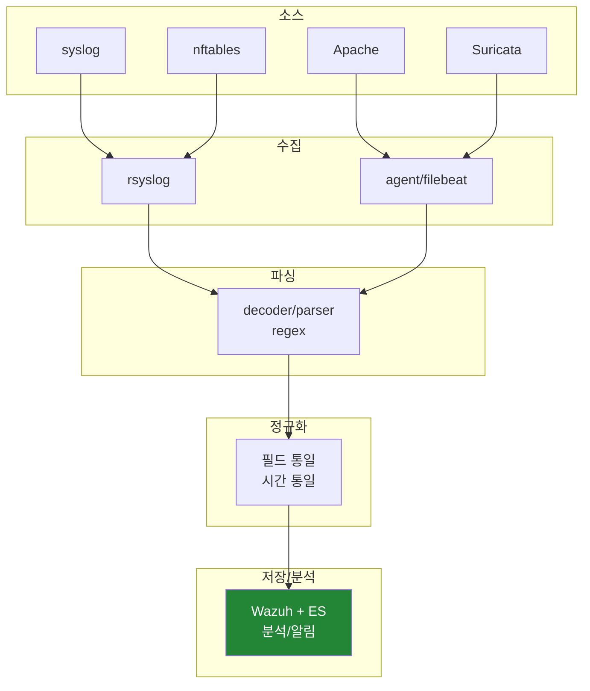
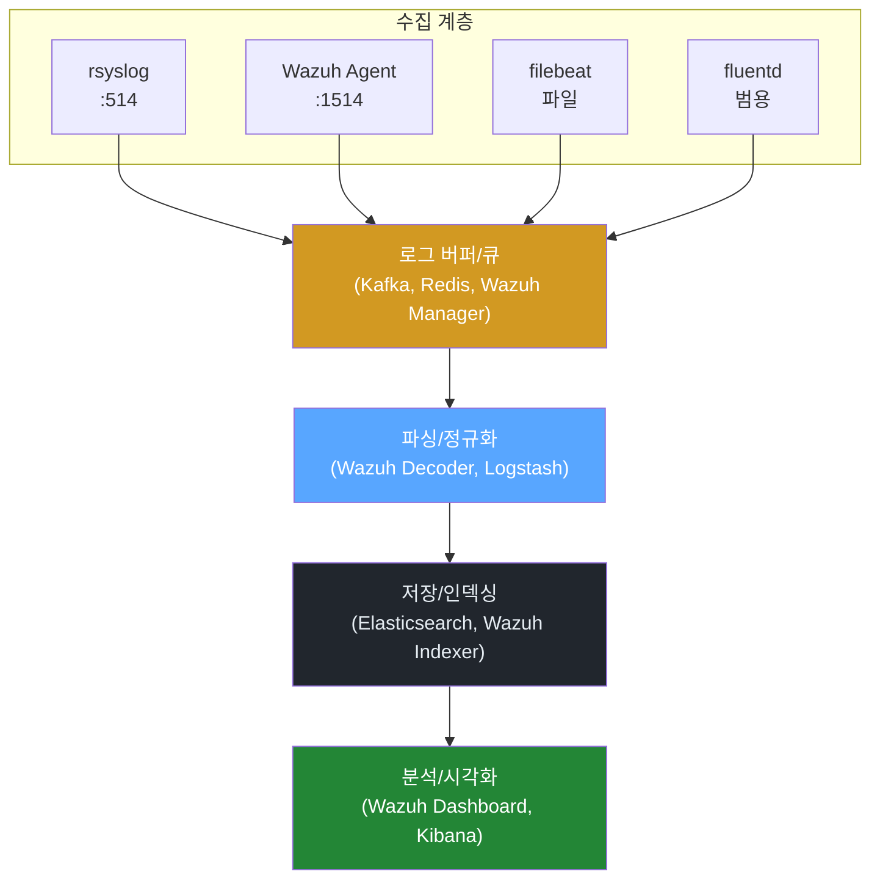
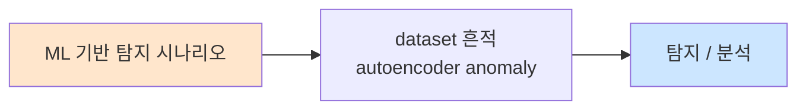

# Week 12: 로그 엔지니어링

## 학습 목표
- Wazuh 커스텀 디코더를 작성하여 비표준 로그를 파싱할 수 있다
- 정규표현식 기반 로그 파서를 개발할 수 있다
- 로그 정규화(normalization) 방법론을 이해하고 적용할 수 있다
- 로그 보존 정책을 수립하고 구현할 수 있다
- Bastion를 활용하여 다중 소스 로그 수집 파이프라인을 구축할 수 있다

## 실습 환경 (공통)

| 서버 | IP | 역할 | 접속 |
|------|-----|------|------|
| bastion | 10.20.30.201 | Control Plane (Bastion) | `ssh ccc@10.20.30.201` (pw: 1) |
| secu | 10.20.30.1 | 방화벽/IPS (nftables, Suricata) | `ssh ccc@10.20.30.1` |
| web | 10.20.30.80 | 웹서버 (JuiceShop:3000, Apache:80) | `ssh ccc@10.20.30.80` |
| siem | 10.20.30.100 | SIEM (Wazuh Dashboard:443, OpenCTI:8080) | `ssh ccc@10.20.30.100` |

**Bastion API:** `http://localhost:9100` / Key: `ccc-api-key-2026`

## 강의 시간 배분 (3시간)

| 시간 | 내용 | 유형 |
|------|------|------|
| 0:00-0:50 | 로그 엔지니어링 이론 + 정규화 (Part 1) | 강의 |
| 0:50-1:30 | Wazuh 디코더 심화 (Part 2) | 강의/데모 |
| 1:30-1:40 | 휴식 | - |
| 1:40-2:30 | 커스텀 디코더 작성 실습 (Part 3) | 실습 |
| 2:30-3:10 | 보존 정책 + 자동화 (Part 4) | 실습 |
| 3:10-3:20 | 정리 + 과제 안내 | 정리 |

---

## 용어 해설

| 용어 | 영문 | 설명 | 비유 |
|------|------|------|------|
| **디코더** | Decoder | 로그를 파싱하여 구조화된 필드로 분리 | 외국어 통역사 |
| **파서** | Parser | 텍스트를 구문 분석하는 프로그램 | 문장 구조 분석기 |
| **정규화** | Normalization | 다양한 포맷의 로그를 통일된 형식으로 변환 | 도량형 통일 |
| **정규표현식** | Regular Expression (regex) | 문자열 패턴 매칭 언어 | 만능 검색 도구 |
| **syslog** | Syslog | 시스템 로그 전송 표준 프로토콜 | 보고서 전달 시스템 |
| **CEF** | Common Event Format | ArcSight의 이벤트 로그 형식 | 표준 보고서 양식 |
| **ECS** | Elastic Common Schema | Elastic의 표준 필드 스키마 | 표준 데이터베이스 구조 |
| **로그 로테이션** | Log Rotation | 오래된 로그를 압축/삭제하는 관리 | 문서 보관/폐기 |
| **보존 정책** | Retention Policy | 로그 보관 기간/방법 규정 | 서류 보관 기한 규정 |

---

# Part 1: 로그 엔지니어링 이론 + 정규화 (50분)

## 1.1 로그 엔지니어링이란?

로그 엔지니어링은 **다양한 소스에서 생성되는 로그를 수집, 파싱, 정규화, 저장, 분석 가능한 형태로 가공**하는 기술이다.



## 1.2 로그 포맷 비교

```
[Apache Access Log]
10.20.30.201 - - [04/Apr/2026:10:15:23 +0900] "GET /api/test HTTP/1.1" 200 1234

[Suricata EVE JSON]
{"timestamp":"2026-04-04T10:15:23.456+0900","event_type":"alert",
 "src_ip":"10.20.30.201","dest_ip":"10.20.30.80","alert":{"signature":"ET SCAN"}}

[auth.log]
Apr  4 10:15:23 web sshd[12345]: Failed password for root from 10.20.30.201 port 54321

[nftables log]
Apr  4 10:15:23 secu kernel: nft_log: IN=eth0 SRC=10.20.30.201 DST=10.20.30.80 PROTO=TCP DPT=80

→ 4개의 서로 다른 포맷을 통일된 구조로 정규화해야 함
```

## 1.3 Wazuh 디코더 구조

```xml
<!-- 디코더 기본 구조 -->
<decoder name="custom_app">
  <prematch>^custom_app:</prematch>         <!-- 1차 필터 -->
</decoder>

<decoder name="custom_app_detail">
  <parent>custom_app</parent>                <!-- 부모 디코더 -->
  <regex>user=(\S+) action=(\S+) ip=(\S+)</regex>  <!-- 필드 추출 -->
  <order>user, action, srcip</order>         <!-- 필드 이름 매핑 -->
</decoder>
```

### 디코더 필드 타입

| 필드 | 설명 | 예시 |
|------|------|------|
| `srcip` | 출발지 IP | 10.20.30.201 |
| `dstip` | 목적지 IP | 10.20.30.80 |
| `srcuser` | 사용자명 | root |
| `dstuser` | 대상 사용자 | admin |
| `srcport` | 출발지 포트 | 54321 |
| `dstport` | 목적지 포트 | 80 |
| `protocol` | 프로토콜 | TCP |
| `action` | 수행 동작 | login_failed |
| `status` | 상태 | success/failure |
| `extra_data` | 추가 데이터 | 자유 형식 |

---

# Part 2: Wazuh 디코더 심화 (40분)

## 2.1 기존 디코더 분석

```bash
ssh ccc@10.20.30.100 << 'REMOTE'
echo "=== Wazuh 기본 디코더 수 ==="
find /var/ossec/ruleset/decoders/ -name "*.xml" | wc -l

echo ""
echo "=== SSH 디코더 예시 ==="
grep -A5 "decoder name=\"sshd\"" /var/ossec/ruleset/decoders/0310-ssh_decoders.xml 2>/dev/null | head -20

echo ""
echo "=== Apache 디코더 예시 ==="
grep -A5 "decoder name=\"apache\"" /var/ossec/ruleset/decoders/0025-apache_decoders.xml 2>/dev/null | head -20

echo ""
echo "=== 커스텀 디코더 ==="
cat /var/ossec/etc/decoders/local_decoder.xml 2>/dev/null || echo "(커스텀 디코더 없음)"
REMOTE
```

## 2.2 정규표현식 핵심 패턴

```bash
cat << 'SCRIPT' > /tmp/regex_patterns.py
#!/usr/bin/env python3
"""로그 파싱을 위한 정규표현식 핵심 패턴"""
import re

patterns = {
    "IP 주소": r"\b\d{1,3}\.\d{1,3}\.\d{1,3}\.\d{1,3}\b",
    "포트 번호": r":(\d{1,5})\b",
    "타임스탬프 (syslog)": r"(\w{3}\s+\d{1,2}\s+\d{2}:\d{2}:\d{2})",
    "타임스탬프 (ISO)": r"(\d{4}-\d{2}-\d{2}T\d{2}:\d{2}:\d{2})",
    "타임스탬프 (Apache)": r"\[(\d{2}/\w{3}/\d{4}:\d{2}:\d{2}:\d{2}\s+[+-]\d{4})\]",
    "HTTP 메서드": r"\"(GET|POST|PUT|DELETE|PATCH|HEAD|OPTIONS)\s",
    "HTTP 상태코드": r"\"\s(\d{3})\s",
    "이메일": r"[a-zA-Z0-9._%+-]+@[a-zA-Z0-9.-]+\.[a-zA-Z]{2,}",
    "MAC 주소": r"([0-9a-fA-F]{2}:){5}[0-9a-fA-F]{2}",
    "사용자명 (SSH)": r"for\s+(invalid\s+user\s+)?(\S+)\s+from",
    "PID": r"\[(\d+)\]:",
}

# 테스트 로그
test_logs = [
    'Apr  4 10:15:23 web sshd[12345]: Failed password for root from 10.20.30.201 port 54321 ssh2',
    '10.20.30.201 - - [04/Apr/2026:10:15:23 +0900] "GET /api/test HTTP/1.1" 200 1234',
    '{"timestamp":"2026-04-04T10:15:23","src_ip":"10.20.30.201","alert":{"signature":"ET SCAN"}}',
]

print("=" * 60)
print("  로그 파싱 정규표현식 패턴")
print("=" * 60)

for name, pattern in patterns.items():
    print(f"\n  {name}:")
    print(f"    패턴: {pattern}")

print("\n" + "=" * 60)
print("  테스트 로그 파싱 결과")
print("=" * 60)

for log in test_logs:
    print(f"\n  로그: {log[:60]}...")
    ips = re.findall(patterns["IP 주소"], log)
    if ips:
        print(f"    IP: {ips}")
    ts_syslog = re.findall(patterns["타임스탬프 (syslog)"], log)
    if ts_syslog:
        print(f"    시각: {ts_syslog}")
    user = re.findall(patterns["사용자명 (SSH)"], log)
    if user:
        print(f"    사용자: {user}")
SCRIPT

python3 /tmp/regex_patterns.py
```

---

# Part 3: 커스텀 디코더 작성 실습 (50분)

## 3.1 Bastion 로그용 커스텀 디코더

> **실습 목적**: Bastion API 로그를 Wazuh에서 파싱하는 커스텀 디코더를 작성한다.

```bash
ssh ccc@10.20.30.100 << 'REMOTE'

# Bastion 로그 디코더 작성
sudo tee /var/ossec/etc/decoders/local_decoder.xml << 'DECODERS'
<!-- Bastion Manager API 로그 디코더 -->
<decoder name="bastion">
  <prematch>^bastion-manager:</prematch>
</decoder>

<decoder name="bastion_api">
  <parent>bastion</parent>
  <regex>user=(\S+) method=(\S+) path=(\S+) status=(\d+) ip=(\S+)</regex>
  <order>srcuser, action, url, status, srcip</order>
</decoder>

<!-- Suricata EVE JSON 커스텀 디코더 -->
<decoder name="suricata_custom">
  <prematch>^suricata_alert:</prematch>
</decoder>

<decoder name="suricata_custom_detail">
  <parent>suricata_custom</parent>
  <regex>src=(\S+) dst=(\S+) sig="([^"]+)" severity=(\d+)</regex>
  <order>srcip, dstip, extra_data, status</order>
</decoder>

<!-- nftables 로그 디코더 -->
<decoder name="nftables_custom">
  <prematch>^nft_log:</prematch>
</decoder>

<decoder name="nftables_custom_detail">
  <parent>nftables_custom</parent>
  <regex>IN=(\S+) SRC=(\S+) DST=(\S+) \.+PROTO=(\S+) \.+DPT=(\d+)</regex>
  <order>extra_data, srcip, dstip, protocol, dstport</order>
</decoder>

<!-- 커스텀 애플리케이션 로그 디코더 -->
<decoder name="custom_app">
  <prematch>^\[APP\]</prematch>
</decoder>

<decoder name="custom_app_detail">
  <parent>custom_app</parent>
  <regex>level=(\S+) user=(\S+) action=(\S+) resource=(\S+) result=(\S+)</regex>
  <order>status, srcuser, action, url, extra_data</order>
</decoder>
DECODERS

# 디코더 문법 검사
sudo /var/ossec/bin/wazuh-analysisd -t
echo "Exit code: $?"

REMOTE
```

> **명령어 해설**:
> - `<prematch>`: 로그의 첫 부분을 매칭하여 해당 디코더를 선택
> - `<parent>`: 부모 디코더가 매칭된 후에만 이 디코더 적용
> - `<regex>`: 괄호 그룹으로 필드 값 추출
> - `<order>`: 추출된 값을 Wazuh 필드에 매핑

## 3.2 wazuh-logtest로 디코더 검증

```bash
ssh ccc@10.20.30.100 << 'REMOTE'

# 테스트 로그로 디코더 검증
echo "=== Bastion 로그 테스트 ==="
echo 'bastion-manager: user=admin method=POST path=/projects status=201 ip=10.20.30.201' | \
  sudo /var/ossec/bin/wazuh-logtest -q 2>/dev/null | tail -15

echo ""
echo "=== nftables 로그 테스트 ==="
echo 'nft_log: IN=eth0 SRC=203.0.113.50 DST=10.20.30.80 LEN=60 PROTO=TCP SPT=54321 DPT=80' | \
  sudo /var/ossec/bin/wazuh-logtest -q 2>/dev/null | tail -15

echo ""
echo "=== 커스텀 앱 로그 테스트 ==="
echo '[APP] level=ERROR user=admin action=delete resource=/etc/passwd result=denied' | \
  sudo /var/ossec/bin/wazuh-logtest -q 2>/dev/null | tail -15

REMOTE
```

> **결과 해석**: "decoder" 항목에 커스텀 디코더 이름이 표시되면 파싱 성공이다. "srcip", "srcuser" 등의 필드에 올바른 값이 들어가는지 확인한다.

## 3.3 다중 소스 로그 정규화

```bash
cat << 'SCRIPT' > /tmp/log_normalizer.py
#!/usr/bin/env python3
"""다중 소스 로그 정규화"""
import re
import json
from datetime import datetime

def normalize_syslog(line):
    """syslog 형식 정규화"""
    match = re.match(
        r'(\w{3}\s+\d{1,2}\s+\d{2}:\d{2}:\d{2})\s+(\S+)\s+(\S+?)(?:\[(\d+)\])?:\s+(.*)',
        line
    )
    if match:
        return {
            "timestamp": match.group(1),
            "hostname": match.group(2),
            "program": match.group(3),
            "pid": match.group(4),
            "message": match.group(5),
            "source_type": "syslog",
        }
    return None

def normalize_apache(line):
    """Apache access log 정규화"""
    match = re.match(
        r'(\S+)\s+\S+\s+\S+\s+\[([^\]]+)\]\s+"(\S+)\s+(\S+)\s+\S+"\s+(\d+)\s+(\d+)',
        line
    )
    if match:
        return {
            "src_ip": match.group(1),
            "timestamp": match.group(2),
            "method": match.group(3),
            "uri": match.group(4),
            "status_code": int(match.group(5)),
            "bytes": int(match.group(6)),
            "source_type": "apache_access",
        }
    return None

# 테스트
logs = [
    'Apr  4 10:15:23 web sshd[12345]: Failed password for root from 10.20.30.201 port 54321 ssh2',
    '10.20.30.201 - - [04/Apr/2026:10:15:23 +0900] "GET /api/test HTTP/1.1" 200 1234',
]

print("=" * 60)
print("  로그 정규화 결과")
print("=" * 60)

for log in logs:
    result = normalize_syslog(log) or normalize_apache(log)
    if result:
        print(f"\n원본: {log[:60]}...")
        print(f"정규화: {json.dumps(result, indent=2, ensure_ascii=False)}")
SCRIPT

python3 /tmp/log_normalizer.py
```

---

# Part 4: 보존 정책 + 자동화 (40분)

## 4.1 로그 보존 정책 수립

```bash
cat << 'SCRIPT' > /tmp/retention_policy.py
#!/usr/bin/env python3
"""로그 보존 정책"""

policy = {
    "보안 경보 (Wazuh alerts)": {"보존": "1년", "압축": "30일 후", "근거": "개인정보보호법"},
    "접근 로그 (auth.log)": {"보존": "6개월", "압축": "7일 후", "근거": "정보통신망법"},
    "웹 접근 로그": {"보존": "6개월", "압축": "7일 후", "근거": "개인정보보호법"},
    "방화벽 로그": {"보존": "1년", "압축": "30일 후", "근거": "정보통신망법"},
    "IDS/IPS 로그": {"보존": "1년", "압축": "30일 후", "근거": "보안 감사"},
    "시스템 로그 (syslog)": {"보존": "3개월", "압축": "7일 후", "근거": "운영"},
    "애플리케이션 로그": {"보존": "3개월", "압축": "7일 후", "근거": "운영"},
    "DNS 쿼리 로그": {"보존": "3개월", "압축": "7일 후", "근거": "위협 헌팅"},
}

print("=" * 70)
print("  로그 보존 정책")
print("=" * 70)
print(f"\n{'로그 유형':25s} {'보존':>8s} {'압축':>10s} {'근거':>15s}")
print("-" * 65)

for log_type, info in policy.items():
    print(f"{log_type:25s} {info['보존']:>8s} {info['압축']:>10s} {info['근거']:>15s}")
SCRIPT

python3 /tmp/retention_policy.py
```

## 4.2 로그 로테이션 구성

```bash
# Wazuh 로그 로테이션 확인
ssh ccc@10.20.30.100 << 'REMOTE'
echo "=== Wazuh 로그 크기 ==="
du -sh /var/ossec/logs/ 2>/dev/null
du -sh /var/ossec/logs/alerts/ 2>/dev/null

echo ""
echo "=== logrotate 설정 ==="
cat /etc/logrotate.d/wazuh-manager 2>/dev/null || echo "(wazuh logrotate 없음)"

echo ""
echo "=== 로그 파일 목록 ==="
ls -lh /var/ossec/logs/alerts/ 2>/dev/null | tail -10
REMOTE
```

## 4.3 Bastion로 로그 수집 자동화

```bash
export BASTION_API_KEY="ccc-api-key-2026"

PROJECT_ID=$(curl -s -X POST http://localhost:9100/projects \
  -H "Content-Type: application/json" \
  -H "X-API-Key: $BASTION_API_KEY" \
  -d '{
    "name": "log-engineering-audit",
    "request_text": "전체 서버 로그 수집 상태 감사",
    "master_mode": "external"
  }' | python3 -c "import sys,json; print(json.load(sys.stdin)['id'])")

curl -s -X POST "http://localhost:9100/projects/$PROJECT_ID/plan" \
  -H "X-API-Key: $BASTION_API_KEY"
curl -s -X POST "http://localhost:9100/projects/$PROJECT_ID/execute" \
  -H "X-API-Key: $BASTION_API_KEY"

curl -s -X POST "http://localhost:9100/projects/$PROJECT_ID/execute-plan" \
  -H "Content-Type: application/json" \
  -H "X-API-Key: $BASTION_API_KEY" \
  -d '{
    "tasks": [
      {
        "order": 1,
        "instruction_prompt": "du -sh /var/log/ 2>/dev/null && ls /var/log/*.log 2>/dev/null | wc -l && echo LOG_AUDIT_DONE",
        "risk_level": "low",
        "subagent_url": "http://10.20.30.1:8002"
      },
      {
        "order": 2,
        "instruction_prompt": "du -sh /var/log/ 2>/dev/null && ls /var/log/*.log 2>/dev/null | wc -l && echo LOG_AUDIT_DONE",
        "risk_level": "low",
        "subagent_url": "http://10.20.30.80:8002"
      },
      {
        "order": 3,
        "instruction_prompt": "du -sh /var/ossec/logs/ 2>/dev/null && echo WAZUH_LOG_AUDIT",
        "risk_level": "low",
        "subagent_url": "http://10.20.30.100:8002"
      }
    ],
    "subagent_url": "http://localhost:8002"
  }'
```

---

## 체크리스트

- [ ] Wazuh 디코더의 prematch, parent, regex, order 구조를 설명할 수 있다
- [ ] 정규표현식으로 IP, 타임스탬프, 사용자명을 추출할 수 있다
- [ ] 커스텀 디코더를 작성하고 wazuh-logtest로 검증할 수 있다
- [ ] 다중 소스 로그를 통일된 형식으로 정규화할 수 있다
- [ ] 로그 보존 정책의 법적 근거를 이해한다
- [ ] logrotate 설정을 확인하고 수정할 수 있다
- [ ] syslog, Apache, JSON 등 주요 로그 포맷을 파싱할 수 있다
- [ ] Wazuh의 디코더→룰 파이프라인을 이해한다
- [ ] Bastion로 다중 서버 로그 상태를 감사할 수 있다
- [ ] 로그 수집 누락을 진단하고 해결할 수 있다

---

## 과제

### 과제 1: 커스텀 디코더 3개 작성 (필수)

다음 로그 형식에 대한 Wazuh 커스텀 디코더를 작성하라:
1. Bastion dispatch 로그
2. JuiceShop 애플리케이션 로그
3. 커스텀 보안 감사 로그

각 디코더에 wazuh-logtest 검증 결과를 포함하라.

### 과제 2: 로그 보존 정책서 (선택)

실습 환경에 대한 로그 보존 정책서를 작성하라:
1. 로그 유형별 보존 기간 (법적 근거 포함)
2. 로테이션 설정
3. 저장 용량 계산
4. 백업 절차

---

## 보충: 로그 엔지니어링 고급 기법

### 고급 정규표현식 패턴

```bash
cat << 'SCRIPT' > /tmp/advanced_regex.py
#!/usr/bin/env python3
"""로그 파싱을 위한 고급 정규표현식"""
import re

# 고급 패턴
advanced_patterns = {
    "Named Groups": {
        "pattern": r"(?P<timestamp>\w{3}\s+\d{1,2}\s+\d{2}:\d{2}:\d{2})\s+(?P<host>\S+)\s+(?P<program>\S+?)(?:\[(?P<pid>\d+)\])?:\s+(?P<message>.*)",
        "test": "Apr  4 10:15:23 web sshd[12345]: Failed password for root from 10.20.30.201",
        "description": "명명된 그룹으로 필드 추출",
    },
    "Lookahead": {
        "pattern": r"\d{1,3}\.\d{1,3}\.\d{1,3}\.\d{1,3}(?=:\d{1,5})",
        "test": "Connection from 10.20.30.201:54321 to 10.20.30.100:22",
        "description": "포트가 뒤따르는 IP만 매칭 (포트 제외)",
    },
    "Lookbehind": {
        "pattern": r"(?<=from\s)\d{1,3}\.\d{1,3}\.\d{1,3}\.\d{1,3}",
        "test": "Failed password for root from 10.20.30.201 port 54321",
        "description": "'from' 뒤의 IP만 매칭",
    },
    "Non-greedy": {
        "pattern": r'"(.*?)"',
        "test": '"GET /api/test HTTP/1.1" 200 1234 "Mozilla/5.0"',
        "description": "따옴표 내 최소 매칭",
    },
    "Conditional": {
        "pattern": r"(Failed|Accepted)\s+password\s+for\s+(invalid\s+user\s+)?(\S+)",
        "test": "Failed password for invalid user admin from 10.20.30.201",
        "description": "성공/실패 + 유효/무효 사용자 동시 처리",
    },
}

print("=" * 70)
print("  고급 정규표현식 패턴 가이드")
print("=" * 70)

for name, info in advanced_patterns.items():
    print(f"\n  --- {name} ---")
    print(f"  설명: {info['description']}")
    print(f"  패턴: {info['pattern'][:60]}")
    print(f"  테스트: {info['test'][:60]}")
    
    match = re.search(info['pattern'], info['test'])
    if match:
        if match.groupdict():
            print(f"  결과: {match.groupdict()}")
        else:
            print(f"  결과: {match.group(0)}")
    else:
        print(f"  결과: (매칭 없음)")
SCRIPT

python3 /tmp/advanced_regex.py
```

### 로그 수집 파이프라인 아키텍처

```bash
cat << 'SCRIPT' > /tmp/log_pipeline.py
#!/usr/bin/env python3
"""로그 수집 파이프라인 아키텍처"""

print("""
================================================================
  로그 수집 파이프라인 아키텍처
================================================================



성능 지표:
  - EPS (Events Per Second): 초당 이벤트 처리량
  - 권장: 소규모 SOC 1,000 EPS, 중규모 10,000 EPS
  - 지연: 수집~분석 1초 이내 권장
  - 저장: 1,000 EPS x 86,400초 = 86.4M 이벤트/일
""")
SCRIPT

python3 /tmp/log_pipeline.py
```

### syslog 심화 설정

```bash
echo "=== syslog 심화 설정 가이드 ==="

cat << 'INFO'
# rsyslog에서 원격 로그 수집 (UDP/TCP)

# 1. UDP 수신 활성화 (/etc/rsyslog.conf)
module(load="imudp")
input(type="imudp" port="514")

# 2. TCP 수신 활성화 (더 안정적)
module(load="imtcp")
input(type="imtcp" port="514")

# 3. 소스별 분리 저장
template(name="RemoteLog" type="string"
  string="/var/log/remote/%HOSTNAME%/%PROGRAMNAME%.log")
*.* ?RemoteLog

# 4. JSON 형식 출력 (SIEM 연동용)
template(name="JsonFormat" type="list") {
  constant(value="{")
  property(name="timestamp" format="jsonf")
  constant(value=",")
  property(name="hostname" format="jsonf")
  constant(value=",")
  property(name="syslogtag" format="jsonf")
  constant(value=",")
  property(name="msg" format="jsonf")
  constant(value="}\n")
}

# 5. 소스 IP 기반 필터링
if $fromhost-ip == '10.20.30.80' then /var/log/web_server.log

# 6. Wazuh로 전달
*.* @@10.20.30.100:1514   # TCP 전달
*.* @10.20.30.100:514     # UDP 전달
INFO
```

### 로그 품질 점검 자동화

```bash
cat << 'SCRIPT' > /tmp/log_quality_check.py
#!/usr/bin/env python3
"""로그 품질 점검 자동화"""
from datetime import datetime

checks = [
    {
        "항목": "로그 수집 연속성",
        "기준": "모든 소스에서 최근 5분 내 로그 존재",
        "방법": "각 소스의 마지막 로그 타임스탬프 확인",
        "명령": "tail -1 /var/log/<source>.log | awk '{print $1,$2,$3}'",
    },
    {
        "항목": "로그 형식 일관성",
        "기준": "파싱 실패율 1% 미만",
        "방법": "Wazuh 디코더 미매칭 로그 수 확인",
        "명령": "grep 'decoder:' /var/ossec/logs/alerts/alerts.json | grep -c 'unknown'",
    },
    {
        "항목": "타임스탬프 동기화",
        "기준": "서버 간 시각 차이 1초 미만",
        "방법": "NTP 상태 확인",
        "명령": "timedatectl status | grep 'synchronized'",
    },
    {
        "항목": "로그 무결성",
        "기준": "로그 파일 변조 없음",
        "방법": "Wazuh FIM으로 로그 파일 모니터링",
        "명령": "grep 'syscheck' /var/ossec/logs/alerts/alerts.log | grep '/var/log'",
    },
    {
        "항목": "저장 용량",
        "기준": "디스크 사용률 80% 미만",
        "방법": "로그 파티션 사용량 확인",
        "명령": "df -h /var/log/ | awk 'NR==2{print $5}'",
    },
    {
        "항목": "로테이션 정상",
        "기준": "최근 7일 내 로테이션 실행됨",
        "방법": "로테이션 로그 확인",
        "명령": "grep 'logrotate' /var/log/syslog | tail -1",
    },
]

print("=" * 60)
print("  로그 품질 점검 체크리스트")
print("=" * 60)

for check in checks:
    print(f"\n  --- {check['항목']} ---")
    print(f"    기준: {check['기준']}")
    print(f"    방법: {check['방법']}")
    print(f"    명령: {check['명령']}")
SCRIPT

python3 /tmp/log_quality_check.py
```

### 로그 파이프라인 성능 모니터링

```bash
cat << 'SCRIPT' > /tmp/log_pipeline_monitor.py
#!/usr/bin/env python3
"""로그 파이프라인 성능 모니터링"""

print("=" * 60)
print("  로그 파이프라인 성능 모니터링")
print("=" * 60)

metrics = {
    "수집 계층": {
        "EPS (Events/sec)": "1,200",
        "지연 시간": "< 1초",
        "손실률": "0.01%",
        "모니터링": "wazuh-analysisd.state 파일",
    },
    "파싱 계층": {
        "파싱 성공률": "99.2%",
        "디코더 미매칭": "0.8%",
        "평균 파싱 시간": "0.5ms/이벤트",
        "모니터링": "디코더 미매칭 로그 카운트",
    },
    "저장 계층": {
        "인덱싱 속도": "800 docs/sec",
        "디스크 사용": "12GB/일",
        "쿼리 응답": "< 2초",
        "모니터링": "Elasticsearch _cluster/health",
    },
    "분석 계층": {
        "룰 매칭 속도": "50,000 룰/sec",
        "경보 생성": "45/분",
        "Active Response": "< 5초",
        "모니터링": "alerts/min 추세",
    },
}

for layer, data in metrics.items():
    print(f"\n  [{layer}]")
    for metric, value in data.items():
        print(f"    {metric:20s}: {value}")

print("""
=== 성능 임계치 경보 ===
  EPS > 5,000: 파싱 지연 가능 → 스케일 아웃 검토
  파싱 실패 > 5%: 디코더 추가 필요
  디스크 사용 > 80%: 로테이션/보존 정책 조정
  쿼리 응답 > 10초: 인덱스 최적화 필요
""")
SCRIPT

python3 /tmp/log_pipeline_monitor.py
```

### ECS(Elastic Common Schema) 정규화

```bash
cat << 'SCRIPT' > /tmp/ecs_normalization.py
#!/usr/bin/env python3
"""ECS(Elastic Common Schema) 정규화 예시"""
import json

# 원본 로그
raw_logs = [
    {
        "source": "sshd",
        "raw": "Apr  4 10:15:23 web sshd[12345]: Failed password for root from 10.20.30.201 port 54321",
    },
    {
        "source": "apache",
        "raw": '10.20.30.201 - - [04/Apr/2026:10:15:23 +0900] "GET /api/test HTTP/1.1" 200 1234',
    },
]

# ECS 정규화 결과
ecs_events = [
    {
        "@timestamp": "2026-04-04T10:15:23.000+09:00",
        "event": {"category": "authentication", "type": "start", "outcome": "failure"},
        "source": {"ip": "10.20.30.201", "port": 54321},
        "destination": {"ip": "10.20.30.80"},
        "user": {"name": "root"},
        "process": {"name": "sshd", "pid": 12345},
        "host": {"name": "web"},
        "ecs": {"version": "8.0"},
    },
    {
        "@timestamp": "2026-04-04T10:15:23.000+09:00",
        "event": {"category": "web", "type": "access", "outcome": "success"},
        "source": {"ip": "10.20.30.201"},
        "http": {"request": {"method": "GET"}, "response": {"status_code": 200, "bytes": 1234}},
        "url": {"path": "/api/test"},
        "host": {"name": "web"},
        "ecs": {"version": "8.0"},
    },
]

print("=" * 60)
print("  ECS 정규화 예시")
print("=" * 60)

for raw, ecs in zip(raw_logs, ecs_events):
    print(f"\n원본 ({raw['source']}):")
    print(f"  {raw['raw'][:70]}")
    print(f"\nECS 정규화:")
    print(f"  {json.dumps(ecs, indent=2, ensure_ascii=False)[:300]}")
SCRIPT

python3 /tmp/ecs_normalization.py
```

### Wazuh 디코더 디버깅 기법

```bash
echo "=== Wazuh 디코더 디버깅 기법 ==="

cat << 'INFO'
1. wazuh-logtest 단계별 분석

   # 테스트 모드 실행
   echo 'test log line' | /var/ossec/bin/wazuh-logtest -q
   
   출력 해석:
   - "decoder": 어떤 디코더가 매칭되었는가
   - "rule": 어떤 룰이 매칭되었는가
   - "srcip": IP가 올바르게 추출되었는가
   - "srcuser": 사용자명이 올바르게 추출되었는가

2. 디코더 매칭 안 될 때 체크리스트

   [ ] prematch가 로그 시작 부분과 일치하는가?
   [ ] parent 디코더가 먼저 매칭되는가?
   [ ] regex의 그룹 수와 order의 필드 수가 일치하는가?
   [ ] 특수문자가 올바르게 이스케이프되었는가?
   [ ] XML 태그가 올바르게 닫혔는가?

3. 흔한 실수

   실수: <regex>user=(.+) ip=(.+)</regex>
   문제: .+는 greedy하여 첫 그룹이 모든 것을 매칭
   해결: <regex>user=(\S+) ip=(\S+)</regex>
         (\S+는 공백이 아닌 문자만 매칭)

   실수: <prematch>error</prematch>
   문제: 로그 어디에나 있는 error와 매칭
   해결: <prematch>^myapp: error</prematch>
         (^로 시작 위치 고정)

4. 성능 최적화

   - prematch를 가능한 구체적으로
   - regex에서 .* 대신 \S+ 사용
   - 불필요한 캡처 그룹 제거
   - parent 디코더로 계층화
INFO
```

---

## 다음 주 예고

**Week 13: 레드팀 연동**에서는 Purple Team 운영, 탐지 격차 분석, 룰 개선 방법을 학습한다.

---

## 웹 UI 실습

### SOAR 시나리오: Dashboard 알림 → OpenCTI IoC → 로그 엔지니어링 검증

#### Step 1: Wazuh Dashboard에서 커스텀 디코더/룰 검증

> **접속 URL:** `https://10.20.30.100:443`

1. `https://10.20.30.100:443` 접속 → 로그인
2. **Management → Rules** 클릭 → 커스텀 룰 파일(local_rules.xml) 확인
3. **Management → Decoders** → 커스텀 디코더(local_decoder.xml) 확인
4. **Modules → Security events** 에서 커스텀 룰 경보 필터링:
   ```
   rule.id >= 100000
   ```
5. 경보 상세에서 디코딩된 필드(`data.*`)가 올바르게 파싱되었는지 확인
6. 파싱 오류 발견 시 디코더 수정 후 재배포 → Dashboard에서 재검증

#### Step 2: OpenCTI에서 IoC 연동 확인

> **접속 URL:** `http://10.20.30.100:8080`

1. `http://10.20.30.100:8080` 접속 → 로그인
2. Wazuh에서 탐지한 IOC가 OpenCTI에 자동/수동 동기화되었는지 확인
3. **Data → Connectors** 에서 Wazuh 연동 커넥터 상태 점검
4. 누락된 IOC는 수동으로 **+ Create → Indicator** 등록

---

## 📂 실습 참조 파일 가이드

> 이번 주 실습에서 **실제로 조작하는** 솔루션의 기능·경로·파일·설정·UI 요점입니다.

### Wazuh SIEM (4.11.x)
> **역할:** 에이전트 기반 로그·FIM·SCA 통합 분석 플랫폼  
> **실행 위치:** `siem (10.20.30.100)`  
> **접속/호출:** Dashboard `https://10.20.30.100` (admin/admin), Manager API `:55000`

**주요 경로·파일**

| 경로 | 역할 |
|------|------|
| `/var/ossec/etc/ossec.conf` | Manager 메인 설정 (원격, 전송, syscheck 등) |
| `/var/ossec/etc/rules/local_rules.xml` | 커스텀 룰 (id ≥ 100000) |
| `/var/ossec/etc/decoders/local_decoder.xml` | 커스텀 디코더 |
| `/var/ossec/logs/alerts/alerts.json` | 실시간 JSON 알림 스트림 |
| `/var/ossec/logs/archives/archives.json` | 전체 이벤트 아카이브 |
| `/var/ossec/logs/ossec.log` | Manager 데몬 로그 |
| `/var/ossec/queue/fim/db/fim.db` | FIM 기준선 SQLite DB |

**핵심 설정·키**

- `<rule id='100100' level='10'>` — 커스텀 룰 — level 10↑은 고위험
- `<syscheck><directories>...` — FIM 감시 경로
- `<active-response>` — 자동 대응 (firewall-drop, restart)

**로그·확인 명령**

- `jq 'select(.rule.level>=10)' alerts.json` — 고위험 알림만
- `grep ERROR ossec.log` — Manager 오류 (룰 문법 오류 등)

**UI / CLI 요점**

- Dashboard → Security events — KQL 필터 `rule.level >= 10`
- Dashboard → Integrity monitoring — 변경된 파일 해시 비교
- `/var/ossec/bin/wazuh-logtest` — 룰 매칭 단계별 확인 (Phase 1→3)
- `/var/ossec/bin/wazuh-analysisd -t` — 룰·설정 문법 검증

> **해석 팁.** Phase 3에서 원하는 `rule.id`가 떠야 커스텀 룰 정상. `local_rules.xml` 수정 후 `systemctl restart wazuh-manager`, 문법 오류가 있으면 **분석 데몬 전체가 기동 실패**하므로 `-t`로 먼저 검증.

---

## 실제 사례 (WitFoo Precinct 6 — ML 기반 탐지)

> 출처: WitFoo Precinct 6 Cybersecurity Dataset (Apache 2.0)
> 본 lecture *ML 기반 탐지* 학습 항목 매칭.

### ML 기반 탐지 의 dataset 흔적 — "autoencoder anomaly"

dataset 의 정상 운영에서 *autoencoder anomaly* 신호의 baseline 을 알아두면, *ML 기반 탐지* 시도 시 발생하는 anomaly 를 정량으로 탐지할 수 있다. 핵심 정량 지표는 — label_binary + label_confidence.



### Case 1: dataset 정량 지표

| 항목 | 값 |
|---|---|
| 핵심 신호 | autoencoder anomaly |
| 정량 baseline | label_binary + label_confidence |
| 학습 매핑 | ML 분류기 학습/평가 |

**자세한 해석**: ML 분류기 학습/평가. 이 차이를 정량으로 측정해야 *공격 시도와 정상 운영의 구분* 이 가능. 학생이 baseline 숫자를 외워두면 — 운영 환경에서 anomaly 를 즉시 탐지할 수 있다.

### Case 2: 실전 적용 시나리오

| 단계 | dataset 활용 |
|---|---|
| 시도 식별 | autoencoder anomaly 의 spike |
| 정상 vs 이상 | baseline 대비 비율 |
| 룰 작성 | Suricata / Wazuh / Sigma |
| 검증 | dataset 재실행 |

**자세한 해석**: 운영 환경 룰 작성은 — *baseline 측정 → 임계 결정 → 룰 작성 → dataset 검증* 의 4 단계. 한 단계라도 빠지면 false positive 폭증.

### 이 사례에서 학생이 배워야 할 3가지

1. **ML 기반 탐지 = autoencoder anomaly 의 anomaly** — 정량 신호로 탐지.
2. **baseline 숫자 외우기** — label_binary + label_confidence.
3. **4 단계 룰 작성** — 측정 → 임계 → 룰 → 검증.

**학생 액션**: scikit-learn 분류기.


---

## 부록: 학습 OSS 도구 매트릭스 (Course14 SOC Advanced — Week 12 로그 엔지니어링·decoder·정규화·EPS·ATT&CK 매핑)

> 이 부록은 lab `soc-adv-ai/week12.yaml` (15 step + multi_task) 의 모든 명령을
> 실제로 실행 가능한 형태로 정리한다. Wazuh decoder 작성, 로그 정규화 (CIM/ECS),
> 보관 (Hot/Warm/Cold), 무결성 (해시 체인 + WORM), EPS 측정, ATT&CK 데이터 소스 매핑까지.

### lab step → 도구·로그 매핑 표

| step | 학습 항목 | 핵심 OSS 도구 | 표준 |
|------|----------|--------------|------|
| s1 | 로그 소스 인벤토리 | journalctl + ls /var/log + Wazuh agent | - |
| s2 | Wazuh agent 설정 최적화 | ossec.conf localfile + 누락 로그 추가 | Wazuh |
| s3 | 커스텀 decoder | local_decoder.xml + regex | Wazuh |
| s4 | 로그 정규화 (CIM/ECS) | Wazuh decoder field 매핑 | ECS / CIM |
| s5 | 필터링 + 집계 (EPS 절감) | Wazuh ignore + Suricata threshold | - |
| s6 | 보관 (Hot/Warm/Cold) | OpenSearch ILM + S3 Glacier | NIST SP 800-92 |
| s7 | 무결성 (해시 체인 + 원격) | rsyslog TLS + WORM + journald | NIST SP 800-92 |
| s8 | EPS / latency / 손실률 | wazuh-stats + osquery | - |
| s9 | ATT&CK Data Source 매핑 | DeTT&CT + Data Source 매트릭스 | MITRE |
| s10 | JSON 파싱 최적화 (eve.json) | Wazuh json decoder + jq | - |
| s11 | enrichment (GeoIP/DNS/asset/TI) | Wazuh wodle + Logstash | - |
| s12 | 로그 품질 dashboard | Grafana + Prometheus + OpenSearch | - |
| s13 | Audit log 정책 (auditd) | auditctl 룰 (10 카테고리) | NIST SP 800-92 |
| s14 | 로그 아키텍처 리뷰 | 확장성 / 내결함성 / 보안 평가 | - |
| s15 | 로그 엔지니어링 종합 보고서 | markdown + ATT&CK Coverage + 로드맵 | - |
| s99 | 통합 다단계 (s1→s2→s3→s4→s5) | Bastion plan: 인벤토리→agent→decoder→정규화→필터 | 다중 |

### 학생 환경 준비

```bash
# Wazuh
ssh ccc@10.20.30.100 'sudo /var/ossec/bin/wazuh-control status'
ssh ccc@10.20.30.100 'ls /var/ossec/etc/decoders/'

# Suricata + jq
ssh ccc@10.20.30.1 'suricatasc -c rules-stats'
sudo apt install -y jq

# OpenSearch ILM
curl -s -k -u admin:admin "https://10.20.30.100:9200/_ilm/policy"

# rsyslog
sudo apt install -y rsyslog rsyslog-gnutls

# DeTT&CT
git clone https://github.com/rabobank-cdc/DeTTECT /tmp/dettect 2>/dev/null

# Grafana + Prometheus (이미 설치)
# auditd
sudo apt install -y auditd audispd-plugins
sudo systemctl enable --now auditd
```

### 핵심 도구별 상세 사용법

#### 도구 1: 로그 소스 인벤토리 (Step 1)

```bash
for host in 10.20.30.1 10.20.30.80 10.20.30.100 10.20.30.112; do
    echo "=== $host ==="
    ssh ccc@$host '
      ls -la /var/log/ | grep -v "^d" | head -20
      sudo journalctl --disk-usage
      sudo systemctl list-units --type=service --state=running | head -20
    '
done

# Wazuh agent active logs
ssh ccc@10.20.30.80 'sudo cat /var/ossec/etc/ossec.conf | grep -A 3 "<localfile>" | head -30'
```

| Host | 주요 로그 | 위치 | 형식 | 용도 |
|------|----------|------|------|------|
| **secu** | Suricata eve.json | /var/log/suricata/ | JSON | NIDS alert |
| | nft drop | journald | syslog | firewall |
| | auth.log | /var/log/ | syslog | SSH/sudo |
| **web** | Apache access | /var/log/apache2/ | combined | HTTP |
| | MySQL general | /var/log/mysql/ | text | DB query |
| | auth.log | /var/log/ | syslog | SSH/sudo |
| **siem** | Wazuh alerts | /var/ossec/logs/alerts/alerts.json | JSON | SIEM |
| | Wazuh archives | /var/ossec/logs/archives/ | JSON | 모든 이벤트 |
| **attacker** | auth.log | /var/log/ | syslog | 학습용 |

#### 도구 2: Wazuh agent 최적화 (Step 2)

```bash
ssh ccc@10.20.30.80 'sudo tee -a /var/ossec/etc/ossec.conf' << 'XML'
<localfile>
  <log_format>apache</log_format>
  <location>/var/log/apache2/access.log</location>
</localfile>
<localfile>
  <log_format>syslog</log_format>
  <location>/var/log/apache2/error.log</location>
</localfile>
<localfile>
  <log_format>syslog</log_format>
  <location>/var/log/mysql/general.log</location>
</localfile>
<localfile>
  <log_format>json</log_format>
  <location>/var/log/suricata/eve.json</location>
</localfile>
<localfile>
  <log_format>audit</log_format>
  <location>/var/log/audit/audit.log</location>
</localfile>
<localfile>
  <log_format>json</log_format>
  <location>/var/log/myapp/security.json</location>
</localfile>
XML

ssh ccc@10.20.30.80 'sudo /var/ossec/bin/wazuh-control restart'
ssh ccc@10.20.30.80 'sudo cat /var/ossec/logs/ossec.log | tail -20 | grep -i "tail"'
```

#### 도구 3: 커스텀 decoder (Step 3)

```bash
ssh ccc@10.20.30.100 'sudo tee -a /var/ossec/etc/decoders/local_decoder.xml' << 'XML'
<!-- CCC API: 2026-05-02T14:00:01.234Z [INFO] api=POST /students user_id=admin remote_ip=192.168.1.50 status=201 -->

<decoder name="ccc-api">
  <prematch>^\d+-\d+-\d+T\d+:\d+:\d+\.\d+Z \[\w+\] api=</prematch>
</decoder>

<decoder name="ccc-api-fields">
  <parent>ccc-api</parent>
  <regex>api=(\S+) user_id=(\S+) remote_ip=(\S+) status=(\d+)$</regex>
  <order>method_path,user_id,srcip,status_code</order>
</decoder>
XML

# 테스트
ssh ccc@10.20.30.100 'sudo /var/ossec/bin/wazuh-logtest' << 'TEST'
2026-05-02T14:00:01.234Z [INFO] api=POST /students user_id=admin remote_ip=192.168.1.50 status=201
TEST
# decoder: 'ccc-api', method_path: 'POST', srcip: '192.168.1.50', status_code: '201'

# Rule
ssh ccc@10.20.30.100 'sudo tee -a /var/ossec/etc/rules/local_rules.xml' << 'XML'
<group name="custom,ccc-api,">
  <rule id="100700" level="3">
    <decoded_as>ccc-api</decoded_as>
    <description>CCC API access</description>
  </rule>
  <rule id="100701" level="9">
    <if_sid>100700</if_sid>
    <field name="status_code">^4\d{2}$</field>
    <description>CCC API 4xx error — possible attack</description>
  </rule>
  <rule id="100702" level="11" frequency="5" timeframe="60">
    <if_sid>100701</if_sid>
    <same_source_ip />
    <description>CCC API 4xx 다발 — brute/scan</description>
    <mitre><id>T1110</id></mitre>
  </rule>
</group>
XML

ssh ccc@10.20.30.100 'sudo /var/ossec/bin/wazuh-control restart'
```

#### 도구 4: 정규화 (CIM / ECS) (Step 4)

| 원본 | ECS 필드 | 변환 |
|------|----------|------|
| Apache: %h | source.ip | 직접 |
| Apache: %u | user.name | 직접 |
| Apache: "%r" | url.original | "GET /path HTTP/1.1" |
| Apache: %>s | http.response.status_code | int |
| MySQL: User@host | user.name + source.ip | split @ |
| Suricata: src_ip | source.ip | 직접 |
| Suricata: dest_port | destination.port | int |
| Wazuh: srcip | source.ip | 직접 |
| Wazuh: dstuser | user.target.name | 직접 |
| auditd: a0/a1/a2 | process.command_line | join |

```bash
# Wazuh decoder field 매핑
ssh ccc@10.20.30.100 'sudo tee -a /var/ossec/etc/decoders/local_decoder.xml' << 'XML'
<decoder name="suricata-ecs-mapper">
  <parent>json</parent>
  <regex>"src_ip":"([^"]+)"</regex>
  <order>source.ip</order>
</decoder>
XML

# Logstash 대안
cat > /tmp/logstash-ecs.conf << 'LS'
filter {
  mutate {
    rename => {
      "src_ip" => "[source][ip]"
      "dest_ip" => "[destination][ip]"
      "dest_port" => "[destination][port]"
    }
  }
}
LS
```

#### 도구 5: 필터링 + 집계 (Step 5)

```bash
# Wazuh ignore
ssh ccc@10.20.30.100 'sudo tee -a /var/ossec/etc/rules/local_rules.xml' << 'XML'
<rule id="100800" level="0">
  <if_sid>2902</if_sid>
  <user>root</user>
  <regex>/usr/bin/python3 /opt/scheduler.py</regex>
  <description>Scheduled job — ignored</description>
</rule>

<rule id="100801" level="0">
  <if_sid>31100</if_sid>
  <regex>"GET /health HTTP/1.1" 200</regex>
  <srcip>10.20.30.250</srcip>
  <description>Health check — ignored</description>
</rule>
XML

# Suricata threshold
ssh ccc@10.20.30.1 'sudo tee /etc/suricata/threshold.config' << 'CFG'
suppress gen_id 1, sig_id 2024793, track by_dst
threshold gen_id 1, sig_id 2003070, type both, track by_src, count 5, seconds 60
CFG
ssh ccc@10.20.30.1 'sudo suricatasc -c reload-rules'

# 효과 측정
# Before: 100K events/h
# After:  30K events/h (70% reduction)
# Storage: 4GB/day → 1.2GB/day
# Analyst burden: 1500/h → 450/h
```

#### 도구 6: 보관 정책 (Hot/Warm/Cold) (Step 6)

```bash
# OpenSearch ILM
curl -X PUT "https://10.20.30.100:9200/_ilm/policy/wazuh-alerts-policy" \
  -k -u admin:admin -H "Content-Type: application/json" -d '{
  "policy": {
    "phases": {
      "hot": {"actions":{"rollover":{"max_size":"30gb","max_age":"7d"}}},
      "warm": {"min_age":"7d","actions":{"shrink":{"number_of_shards":1},"forcemerge":{"max_num_segments":1}}},
      "cold": {"min_age":"30d","actions":{"freeze":{}}},
      "delete": {"min_age":"365d","actions":{"delete":{}}}
    }
  }
}'

# 인덱스 템플릿
curl -X PUT "https://10.20.30.100:9200/_index_template/wazuh-template" \
  -k -u admin:admin -H "Content-Type: application/json" -d '{
  "index_patterns": ["wazuh-alerts-*"],
  "template": {"settings": {"index.lifecycle.name": "wazuh-alerts-policy"}}
}'

# S3 Glacier
aws s3api put-bucket-lifecycle-configuration --bucket wazuh-cold-storage \
  --lifecycle-configuration '{"Rules":[{"ID":"ToGlacier","Status":"Enabled",
    "Transitions":[{"Days":90,"StorageClass":"GLACIER"},{"Days":180,"StorageClass":"DEEP_ARCHIVE"}],
    "Expiration":{"Days":2555}}]}'
```

| Tier | 기간 | 매체 | 접근 시간 | 비용 |
|------|------|------|----------|------|
| Hot | 0-7일 | SSD (OpenSearch) | <100ms | 높음 |
| Warm | 7-30일 | HDD | <10s | 중 |
| Cold | 30-365일 | S3 / Glacier | <1h | 낮음 |
| Archive | 1-7년 | Deep Archive | <12h | 매우 낮음 |
| Delete | 7년+ | (정리) | - | - |

규제: PIPA 3년 / 전자금융 5년 / PCI 1년 / HIPAA 6년 / SOC 2 1년 / GDPR 6년

비용: $50K/year (all-Hot) → $10K/year (tier 분리, -80%)

#### 도구 7: 무결성 (Step 7)

```bash
# 1. rsyslog TLS (송신)
ssh ccc@10.20.30.80 'sudo tee /etc/rsyslog.d/01-remote.conf' << 'RSY'
$DefaultNetstreamDriver gtls
$DefaultNetstreamDriverCAFile /etc/ssl/certs/siem-ca.pem
$DefaultNetstreamDriverCertFile /etc/ssl/certs/web.pem
$DefaultNetstreamDriverKeyFile /etc/ssl/private/web.key

*.* action(type="omfwd"
  Target="siem.corp.example" Port="6514" Protocol="tcp"
  StreamDriver="gtls" StreamDriverMode="1" StreamDriverAuthMode="x509/name")
RSY
ssh ccc@10.20.30.80 'sudo systemctl restart rsyslog'

# 2. 수신 측
ssh ccc@10.20.30.100 'sudo tee /etc/rsyslog.d/01-recv.conf' << 'RCV'
$ModLoad imtcp
$InputTCPServerStreamDriverMode 1
$InputTCPServerStreamDriverAuthMode x509/name
$InputTCPServerRun 6514

template(name="RemoteFiles" type="list") {
  constant(value="/var/log/remote/")
  property(name="hostname")
  constant(value=".log")
}
*.* ?RemoteFiles
RCV

# 3. 해시 체인 (매시간)
sudo tee /etc/cron.hourly/log-hash-chain.sh << 'SH'
#!/bin/bash
LOG=/var/log/remote
PREV=$(cat $LOG/.last_hash 2>/dev/null || echo "GENESIS")
HOUR=$(date +%Y%m%d%H)
CURRENT=$(find $LOG -newer $LOG/.timestamp 2>/dev/null | xargs sha256sum | sha256sum | cut -d' ' -f1)
NEW=$(echo "$PREV $CURRENT" | sha256sum | cut -d' ' -f1)
echo "$HOUR $NEW (prev=$PREV)" >> $LOG/.hash_chain
echo "$NEW" > $LOG/.last_hash
touch $LOG/.timestamp
SH
sudo chmod +x /etc/cron.hourly/log-hash-chain.sh

# 4. WORM
sudo mkdir /var/log/worm
sudo chattr +a /var/log/worm

# 5. S3 Object Lock
aws s3api put-object-lock-configuration \
  --bucket wazuh-worm-storage \
  --object-lock-configuration '{"ObjectLockEnabled":"Enabled",
    "Rule":{"DefaultRetention":{"Mode":"COMPLIANCE","Years":7}}}'

# Wazuh 자체 hash chain (built-in)
ssh ccc@10.20.30.100 'sudo cat /var/ossec/logs/alerts/alerts.log | head -3'
```

#### 도구 8: EPS / latency / 손실률 (Step 8)

```bash
ssh ccc@10.20.30.100 'sudo /var/ossec/bin/wazuh-control info'
ssh ccc@10.20.30.100 'sudo /var/ossec/bin/wazuh-stats -m'
# Maximum events per second: 12,847 / Average: 5,234

# 직접 측정
ssh ccc@10.20.30.100 'sudo wc -l /var/ossec/logs/alerts/alerts.json'
sleep 3600
ssh ccc@10.20.30.100 'sudo wc -l /var/ossec/logs/alerts/alerts.json'

# Latency (Python)
python3 << 'PY'
import json
from datetime import datetime
alerts = []
with open('/var/ossec/logs/alerts/alerts.json') as f:
    for line in f:
        try:
            a = json.loads(line)
            event_ts = a.get('decoder',{}).get('parent',{}).get('timestamp','')
            alert_ts = a.get('@timestamp','')
            if event_ts and alert_ts:
                e = datetime.fromisoformat(event_ts.replace('Z','+00:00'))
                t = datetime.fromisoformat(alert_ts.replace('Z','+00:00'))
                alerts.append((t-e).total_seconds()*1000)
        except: pass
a = sorted(alerts)
print(f"Latency: avg={sum(a)/len(a):.1f} p50={a[len(a)//2]:.1f} p95={a[int(len(a)*0.95)]:.1f} p99={a[int(len(a)*0.99)]:.1f}")
PY

# 손실률 (Zeek)
zeek-cut acks_loss percent_lost < /tmp/zeek-out/capture_loss.log

# 병목
ssh ccc@10.20.30.100 'top -p $(pgrep wazuh-analysisd) -b -n 1 | head -10'
ssh ccc@10.20.30.100 'sudo iotop -ao -d 5 | head -20'
```

#### 도구 9: ATT&CK Data Source 매핑 (Step 9)

```bash
cd /tmp/dettect
python dettect.py editor   # GUI

# CLI
cat > /tmp/data-sources-current.yaml << 'YML'
version: 1.2
file_type: data-source-administration
domain: enterprise-attack
name: SOC Data Source Coverage
data_sources:
  - data_source_name: Process Creation
    products: [auditd, sysmon]
    available_for_data_analytics: true
    data_quality:
      device_completeness: 4
      data_field_completeness: 5
      timeliness: 5
      consistency: 5
      retention: 4
  - data_source_name: Network Connection Creation
    products: [suricata, zeek]
    available_for_data_analytics: true
    data_quality: {device_completeness: 5, data_field_completeness: 5, timeliness: 5, consistency: 5, retention: 5}
YML

python dettect.py d -fd /tmp/data-sources-current.yaml -l
```

| Data Source | 수집 | 로그 | Cover |
|------------|------|------|-------|
| Process Creation | ✓ | auditd execve + Sysmon EID 1 | High |
| Process Termination | ✓ | auditd | Medium |
| Command Execution | ✓ | bash_history + auditd | High |
| File Creation | ✓ | inotifywait + auditd PATH | Medium |
| File Modification | ✓ | auditd + Wazuh syscheck | High |
| File Access | ✗ | (auditd watch 추가 필요) | None |
| Network Connection | ✓ | Suricata + Zeek conn.log | High |
| Network Traffic Content | ✓ | Suricata + tshark | High |
| Network Traffic Flow | ✓ | NetFlow + Zeek | High |
| Authentication | ✓ | auth.log + Wazuh | High |
| Account Modification | ✓ | auditd /etc/passwd | Medium |
| Service Creation | ✗ | (systemd 추가 필요) | None |
| Logon Session | ✓ | last + wtmp | High |
| Module Load | ✗ | (auditd kernel module) | None |
| Cloud API Calls | ✗ | (CloudTrail) | None |

총 8/38 High = 21%, 14/38 Medium+ = 37%
우선 보강: File Access, Service, Module Load, Cloud API

#### 도구 10: JSON 파싱 최적화 (Step 10)

```bash
# Suricata eve 필요 필드만
ssh ccc@10.20.30.1 'sudo tee /etc/suricata/eve-minimal.yaml' << 'YML'
outputs:
  - eve-log:
      enabled: yes
      filename: eve.json
      types:
        - alert: {tagged-packets: no, payload-printable: yes, http: yes, tls: yes}
        - http: {extended: no}
        - dns: {version: 2}
        - tls: {extended: no}
YML

# jq 빠른 분석
ssh ccc@10.20.30.1 'sudo jq -c "select(.event_type==\"alert\") | {ts:.timestamp,src:.src_ip,sig:.alert.signature}" /var/log/suricata/eve.json | head'

# alert 만 카운트
ssh ccc@10.20.30.1 'sudo grep -c "\"event_type\":\"alert\"" /var/log/suricata/eve.json'
```

#### 도구 11: Enrichment pipeline (Step 11)

```bash
# Wazuh wodle (간단)
ssh ccc@10.20.30.100 'sudo tee /var/ossec/integrations/asset-lookup.sh' << 'SH'
#!/bin/bash
TODAY_IPS=$(jq -r '.data.srcip // empty' /var/ossec/logs/alerts/alerts.json | sort -u)
for ip in $TODAY_IPS; do
    geo=$(geoiplookup -d /var/ossec/etc/lists "$ip" | head -1)
    dns=$(dig +short -x "$ip" 2>/dev/null | head -1)
    asset=$(grep "$ip" /etc/cmdb.csv | cut -d, -f2 || echo "unknown")
    echo "$ip:$geo|$dns|$asset"
done > /var/ossec/etc/lists/asset-enrichment
sudo /var/ossec/bin/wazuh-make_cdb /var/ossec/etc/lists/asset-enrichment
SH

ssh ccc@10.20.30.100 'sudo tee -a /var/ossec/etc/ossec.conf' << 'XML'
<wodle name="command">
  <disabled>no</disabled>
  <tag>asset-enrich</tag>
  <command>/var/ossec/integrations/asset-lookup.sh</command>
  <interval>1d</interval>
</wodle>
XML

# Logstash 대안 (강력)
cat > /tmp/logstash-enrich.conf << 'LS'
filter {
  if [source][ip] {
    geoip { source => "[source][ip]"; target => "[source][geo]" }
    dns { reverse => ["[source][ip]"]; action => "append"; target => "[source][hostname]" }
    translate {
      field => "[source][ip]"
      destination => "[source][asset]"
      dictionary_path => "/etc/logstash/cmdb.yml"
    }
    elasticsearch {
      hosts => ["opencti:9200"]
      query => "indicator.value:%{[source][ip]}"
      fields => {"threat.actor" => "[threat][actor]"}
    }
  }
}
LS
```

#### 도구 12: 로그 품질 dashboard (Step 12)

```python
from prometheus_client import start_http_server, Gauge
import requests, time

agents_active = Gauge('wazuh_agents_active', 'Active agents')
alerts_total = Gauge('wazuh_alerts_total', 'Total alerts last hour')
parse_errors = Gauge('wazuh_parse_errors_total', 'Parse errors')
eps_current = Gauge('wazuh_eps_current', 'EPS')

def collect():
    token = requests.post('https://siem:55000/security/user/authenticate?raw=true',
                          auth=('wazuh','wazuh'), verify=False).text
    r = requests.get('https://siem:55000/agents/summary/status',
                    headers={'Authorization': f'Bearer {token}'}, verify=False).json()
    agents_active.set(r['data']['active'])
    r = requests.post('https://siem:9200/wazuh-alerts-*/_count',
                     auth=('admin','admin'), verify=False,
                     json={'query':{'range':{'@timestamp':{'gte':'now-1h'}}}}).json()
    alerts_total.set(r['count'])

if __name__ == "__main__":
    start_http_server(9101)
    while True:
        try: collect()
        except: pass
        time.sleep(30)
```

Grafana dashboard 패널:
- Active Agents (gauge)
- EPS current (stat)
- Alerts/hour 추이 (graph)
- Parse errors (stat)
- Alert by rule_id × hour (heatmap)
- Top sources (table)
- ILM Hot/Warm/Cold (graph)
- Latency p50/p95/p99 (graph)

#### 도구 13: Audit log 정책 (Step 13)

```bash
sudo tee /etc/audit/rules.d/security.rules << 'RULES'
# 1. 권한 상승
-a always,exit -F arch=b64 -S setuid,setgid,setresuid,setresgid -F a0=0 -k privilege_escalation

# 2. /etc 변경
-w /etc/passwd -p wa -k user_change
-w /etc/group -p wa -k group_change
-w /etc/shadow -p wa -k password_change
-w /etc/sudoers -p wa -k sudoers_change
-w /etc/ssh/sshd_config -p wa -k sshd_change

# 3. 권한
-a always,exit -F arch=b64 -S chmod,chown,fchmod,fchown,fchmodat,fchownat,setxattr,lsetxattr,fsetxattr -F auid>=1000 -F auid!=4294967295 -k file_perm_change
-a always,exit -F arch=b64 -S capset -k capability_change

# 4. 모듈
-a always,exit -F arch=b64 -S init_module,delete_module -k kernel_module

# 5. 네트워크
-w /etc/network -p wa -k network_change
-w /etc/hosts -p wa -k hosts_change
-w /etc/resolv.conf -p wa -k dns_change

# 6. execve
-a always,exit -F arch=b64 -S execve -F auid!=4294967295 -k user_command

# 7. 파일 삭제
-a always,exit -F arch=b64 -S unlink,unlinkat,rename,renameat -F auid>=1000 -F auid!=4294967295 -k file_delete

# 8. 시간 변경
-a always,exit -F arch=b64 -S adjtimex,settimeofday,clock_settime -k time_change

# 9. SSH key
-w /etc/ssh -p wa -k ssh_config
-w /home -p wa -k home_change

# 10. Immutable (최후)
-e 2
RULES

sudo augenrules --load
sudo auditctl -l

# Wazuh 통합
ssh ccc@10.20.30.80 'sudo tee -a /var/ossec/etc/ossec.conf' << 'XML'
<localfile>
  <log_format>audit</log_format>
  <location>/var/log/audit/audit.log</location>
</localfile>
XML
ssh ccc@10.20.30.80 'sudo /var/ossec/bin/wazuh-control restart'
```

#### 도구 14: 아키텍처 리뷰 (Step 14)

| 영역 | 현재 | 한계 | 개선 |
|------|------|------|------|
| 확장성 | ~5K EPS (단일 manager) | ~10K | cluster mode (master/worker), Logstash |
| 내결함성 | 단일 SIEM (SPOF) | 가용성 위험 | HA (active/passive), 3-node OpenSearch, daily snapshot |
| 보안 | TLS + agent mTLS + Wazuh hash | WORM 미적용 | chattr +a + S3 Object Lock |
| 감사 | (관리자 액션 audit 부재) | 추적 불가 | auditd 추가 + Wazuh 통합 |
| 데이터 품질 | 21% High Cover, parse 96%, p95 2.3s | 부족 | DeTT&CT 50% target, decoder 보강 |

비용: 현재 $5K/월 (단일) → 개선 후 $15K/월 (3-node + DR), incident 회피 1회 = $1M+

#### 도구 15: 종합 보고서 (Step 15)

```bash
cat > /tmp/log-engineering-report.md << 'EOF'
# Log Engineering Report — 2026-Q2

## 1. Executive Summary
- 현재 EPS: 5K avg / 12K peak (목표 10K)
- ATT&CK Coverage: 37% (목표 50%)
- Parse 성공률: 96% (목표 99%)
- Latency p95: 2.3s (목표 1s)

## 2. 인프라
- 4 hosts × Wazuh agent
- Suricata eve.json
- 단일 manager + OpenSearch single-node

## 3. 최적화
### Decoder
- 신규 3개 (CCC API, MyApp, Custom CSV)
- Parse: 92% → 96% (+4pt)

### 필터링
- alert volume: 100K/h → 30K/h (-70%)
- 분석가 burden: 1500/h → 450/h
- 스토리지: 4GB/day → 1.2GB/day

### Retention
- ILM: Hot 7d / Warm 30d / Cold 365d / Archive 7y
- 비용: $50K/year → $10K/year (-80%)

### 무결성
- rsyslog TLS ✓
- Wazuh hash chain (built-in) ✓
- WORM 미적용 (개선)

## 4. ATT&CK Coverage 매트릭스 (38 sources)
- High: 8 / Medium+: 14 / 미보유: 24

## 5. 측정
- EPS avg 5,234 / max 12,847
- Latency p50=0.8s p95=2.3s p99=5.1s
- Parse error 4%
- Disk 1.2GB/day
- Active agents 4/4

## 6. 로드맵
### Q3
- WORM 추가
- ATT&CK 5개 보강 (50%)
- Wazuh cluster plan

### Q4
- Wazuh 3-node cluster
- DR cluster
- 30K EPS

### 2027 Q1
- Logstash enrichment
- ML anomaly (week06 + ML)

## 7. 부록 (전문)
- A. Decoder XML
- B. ILM 정책 JSON
- C. auditd 룰
- D. Grafana dashboard
- E. ATT&CK Coverage Layer
EOF

pandoc /tmp/log-engineering-report.md -o /tmp/log-engineering-report.pdf \
  --pdf-engine=xelatex --toc -V mainfont="Noto Sans CJK KR"
```

### 점검 / 최적화 / 측정 흐름 (15 step + multi_task)

#### Phase A — 인벤토리 + 수집 (s1·s2·s3·s4)

```bash
for h in 10.20.30.{1,80,100,112}; do
    ssh ccc@$h 'ls /var/log/ | head'
done
ssh ccc@10.20.30.80 'sudo cat /var/ossec/etc/ossec.conf | grep localfile'
ssh ccc@10.20.30.100 'sudo vi /var/ossec/etc/decoders/local_decoder.xml'
```

#### Phase B — 최적화 + 보관 (s5·s6·s7·s8·s10)

```bash
ssh ccc@10.20.30.100 'sudo vi /var/ossec/etc/rules/local_rules.xml'
curl -X PUT "https://10.20.30.100:9200/_ilm/policy/wazuh-policy" -k -u admin:admin -d '...'
ssh ccc@10.20.30.80 'sudo systemctl restart rsyslog'
ssh ccc@10.20.30.100 'sudo /var/ossec/bin/wazuh-stats -m'
```

#### Phase C — 매핑 + Enrichment + Dashboard + 보고 (s9·s11·s12·s13·s14·s15)

```bash
python /tmp/dettect/dettect.py d -fd /tmp/data-sources-current.yaml -l
ssh ccc@10.20.30.100 'sudo cp /tmp/asset-lookup.sh /var/ossec/integrations/'
sudo systemctl restart wazuh-prometheus-exporter
sudo cp /tmp/security.rules /etc/audit/rules.d/
sudo augenrules --load
pandoc /tmp/log-engineering-report.md -o /tmp/log-engineering-report.pdf
```

#### Phase D — 통합 시나리오 (s99 multi_task)

s1 → s2 → s3 → s4 → s5 를 Bastion 가 한 번에:

1. **plan**: 인벤토리 → agent 최적화 → custom decoder → 정규화 → 필터링
2. **execute**: ssh + cat /var/log + vi ossec.conf + decoder XML + jq
3. **synthesize**: 5 산출물 (inventory.md / agent-config.diff / decoder.xml / normalization.md / filter.xml)

### 도구 비교표 — 로그 엔지니어링 단계별

| 단계 | 1순위 | 2순위 | 사용 조건 |
|------|-------|-------|----------|
| 수집 (host) | Wazuh agent | Filebeat | OSS |
| 수집 (network) | Suricata + Zeek | Snort | OSS |
| 정규화 | Wazuh decoder + ECS | Logstash filter | depth |
| 집계 | Wazuh frequency + Suricata threshold | Logstash aggregate | 자체 |
| Storage Hot | OpenSearch | Elasticsearch | OSS |
| Storage Warm/Cold | OpenSearch ILM + S3 | Splunk lifecycle | OSS |
| 무결성 | rsyslog TLS + Wazuh + WORM | journald sealing | 다층 |
| Forwarder | rsyslog | syslog-ng / Fluentd / Vector | 표준 |
| Enrichment | Wazuh wodle + GeoIP | Logstash | depth |
| Audit | auditd | osquery + Falco | 깊이 |
| Dashboard | Grafana + Prometheus | Wazuh / Splunk native | OSS |
| ATT&CK 매핑 | DeTT&CT + Navigator | manual | 자동 |

### 도구 선택 매트릭스 — 시나리오별 권장

| 시나리오 | 우선 도구 | 이유 |
|---------|---------|------|
| "처음 SIEM 도입" | Wazuh + Suricata + auditd | OSS 풀스택 |
| "EPS 30K+" | Wazuh cluster + Logstash | scale |
| "regulator audit" | rsyslog TLS + WORM + 7년 retention | 무결성 |
| "Cloud + on-prem" | Splunk Cloud / Sumo | hybrid |
| "ATT&CK Coverage" | DeTT&CT + Navigator + 보강 | 정량 |
| "분석가 burnout" | 필터 + 집계 + 우선순위 | volume |
| "비용 절감" | ILM + S3 Glacier | tier |
| "신속 enrichment" | Logstash + GeoIP + TI | pipeline |

### 학생 셀프 체크리스트 (각 step 완료 기준)

- [ ] s1: 4 호스트 인벤토리 (위치/형식/용도)
- [ ] s2: Wazuh agent localfile 5+ 추가 + 검증
- [ ] s3: 사용자 decoder + rule (CCC API)
- [ ] s4: ECS 매핑 매트릭스 + decoder field 변환
- [ ] s5: ignore 룰 + Suricata threshold + 70% 절감
- [ ] s6: ILM 정책 + 비용 추정
- [ ] s7: rsyslog TLS + Wazuh hash + WORM
- [ ] s8: EPS / latency p50/p95/p99 / 손실률 + 병목
- [ ] s9: Data Source 38 매트릭스 + DeTT&CT layer
- [ ] s10: Suricata eve 필요 필드만 + jq
- [ ] s11: GeoIP + DNS + Asset + TI 4종
- [ ] s12: Prometheus exporter + Grafana 8 패널
- [ ] s13: auditd 10 카테고리 + immutable + Wazuh 통합
- [ ] s14: 4 평가 + 개선 권고
- [ ] s15: 종합 보고서 (현황/최적화/Coverage/측정/로드맵)
- [ ] s99: Bastion 가 5 작업 (인벤토리/agent/decoder/정규화/필터) 순차

### 추가 참조 자료

- **NIST SP 800-92** Computer Security Log Management
- **MITRE ATT&CK Data Sources** https://attack.mitre.org/datasources/
- **Elastic Common Schema** https://www.elastic.co/guide/en/ecs/current/
- **Splunk CIM** https://docs.splunk.com/Documentation/CIM/
- **Wazuh Decoders** https://documentation.wazuh.com/current/user-manual/ruleset/ruleset-xml-syntax/decoders.html
- **OpenSearch ILM** https://opensearch.org/docs/latest/im-plugin/ism/
- **DeTT&CT** https://github.com/rabobank-cdc/DeTTECT
- **rsyslog TLS** https://www.rsyslog.com/doc/v8-stable/tutorials/tls.html
- **Logstash** https://www.elastic.co/logstash
- **Vector** https://vector.dev/
- **Fluentd** https://www.fluentd.org/
- **Grafana** https://grafana.com/

위 모든 로그 엔지니어링은 **무결성 우선 + 보존 정책 준수** 로 운영한다. rsyslog TLS + WORM +
Wazuh hash chain 3중. 보존은 규제 (PIPA 3년 / 전자금융 5년) 최소 + 회사 정책 더 엄격.
**ATT&CK Coverage 분기 측정** — DeTT&CT + Navigator. EPS / latency 일일 모니터링.
