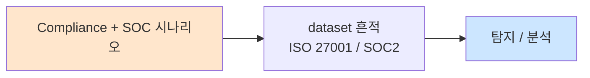

# Week 14: SOC 자동화 + AI

## 학습 목표
- LLM(Large Language Model)을 SOC 운영에 활용하는 방법을 이해한다
- AI 기반 경보 분류(triage)와 우선순위 판정을 구현할 수 있다
- LLM을 활용한 자동 경보 분석 및 요약을 수행할 수 있다
- AI 기반 인시던트 보고서 자동 생성을 구현할 수 있다
- AI SOC의 한계와 인간 분석가의 역할을 이해한다

## 실습 환경 (공통)

| 서버 | IP | 역할 | 접속 |
|------|-----|------|------|
| bastion | 10.20.30.201 | Control Plane (Bastion) | `ssh ccc@10.20.30.201` (pw: 1) |
| secu | 10.20.30.1 | 방화벽/IPS (nftables, Suricata) | `ssh ccc@10.20.30.1` |
| web | 10.20.30.80 | 웹서버 (JuiceShop:3000, Apache:80) | `ssh ccc@10.20.30.80` |
| siem | 10.20.30.100 | SIEM (Wazuh Dashboard:443, OpenCTI:8080) | `ssh ccc@10.20.30.100` |

**ccc-api:** `http://localhost:9100` / Key: `ccc-api-key-2026`
**Bastion:** `http://10.20.30.200:8003` (/ask, /chat, /evidence)
**Ollama:** `http://10.20.30.200:11434/v1` (OpenAI 호환)

## 강의 시간 배분 (3시간)

| 시간 | 내용 | 유형 |
|------|------|------|
| 0:00-0:50 | AI/LLM SOC 활용 이론 (Part 1) | 강의 |
| 0:50-1:30 | AI 경보 분류 + 분석 (Part 2) | 강의/데모 |
| 1:30-1:40 | 휴식 | - |
| 1:40-2:30 | LLM 연동 실습 (Part 3) | 실습 |
| 2:30-3:10 | 보고서 자동 생성 + 한계 (Part 4) | 실습 |
| 3:10-3:20 | 정리 + 과제 안내 | 정리 |

---

## 용어 해설

| 용어 | 영문 | 설명 | 비유 |
|------|------|------|------|
| **LLM** | Large Language Model | 대규모 언어 모델 (GPT, Llama 등) | AI 전문가 |
| **프롬프트** | Prompt | LLM에게 주는 지시/질문 | AI에게 하는 질문 |
| **RAG** | Retrieval-Augmented Generation | 검색 보강 생성 | 참고 자료 보며 답변 |
| **hallucination** | Hallucination | LLM이 사실이 아닌 내용을 생성 | AI의 착각 |
| **Ollama** | Ollama | 로컬 LLM 실행 프레임워크 | 개인용 AI 서버 |
| **토큰** | Token | LLM 입출력의 최소 단위 | 단어 조각 |
| **few-shot** | Few-shot Learning | 몇 개의 예시로 학습시키는 기법 | 예시 보고 배우기 |
| **경보 피로** | Alert Fatigue | 과도한 경보로 인한 분석가 피로 | 양치기 소년 효과 |

---

# Part 1: AI/LLM SOC 활용 이론 (50분)

## 1.1 AI가 SOC에서 할 수 있는 것

```
[AI/LLM SOC 활용 영역]

1. 경보 트리아지 (Alert Triage)
   → 경보를 자동으로 분류 + 우선순위 판정
   → Tier 1 업무의 60-80% 자동화 가능

2. 경보 분석 (Alert Analysis)
   → 경보의 컨텍스트를 자동 분석
   → ATT&CK 매핑, 관련 IOC 추출

3. 보고서 생성 (Report Generation)
   → 인시던트 요약, 타임라인 자동 구성
   → 경영진/기술 보고서 초안 작성

4. 위협 헌팅 보조 (Hunting Assist)
   → 가설 제안, 쿼리 생성 보조
   → 이상 패턴 설명

5. 플레이북 추천 (Playbook Recommendation)
   → 경보 유형에 맞는 대응 절차 제안
   → 과거 유사 사례 검색

[AI가 할 수 없는 것 (현재)]
  - 최종 판단 (사람의 승인 필요)
  - 새로운 공격 기법 발견 (창의적 헌팅)
  - 법적 판단, 사업 영향 평가
  - 100% 정확한 분류 (hallucination 위험)
```

## 1.2 LLM 기반 경보 분류 아키텍처

```
[경보 흐름]

Wazuh Alert
    |
    v
[경보 수집]
    → JSON 형식으로 추출
    |
    v
[프롬프트 구성]
    → 시스템 프롬프트 + 경보 데이터 + 분류 기준
    |
    v
[LLM 호출]
    → Ollama API (로컬 LLM)
    → 응답: 분류, 우선순위, 분석, 권고
    |
    v
[결과 처리]
    → 자동: Info/Low → 로그만 기록
    → 알림: Medium → Slack 알림
    → 에스컬: High/Critical → 분석가에게 즉시 전달
```

## 1.3 프롬프트 엔지니어링 for SOC

```
[좋은 SOC 프롬프트의 요소]

1. 역할 정의
   "당신은 SOC Tier 2 분석가입니다."

2. 컨텍스트 제공
   "우리 환경: Wazuh SIEM, nftables 방화벽, 3대 서버"

3. 분류 기준 명시
   "다음 기준으로 분류하세요:
    - Critical: 실제 공격 진행 중
    - High: 공격 시도 확인
    - Medium: 의심스럽지만 추가 분석 필요
    - Low: 정상 활동의 변형
    - Info: 정보성 이벤트"

4. 출력 형식 지정
   "JSON 형식으로 응답: {severity, analysis, recommendation}"

5. 제약 조건
   "확실하지 않으면 'Medium'으로 분류하고 추가 분석을 권고하세요"
```

---

# Part 2: AI 경보 분류 + 분석 (40분)

## 2.1 Ollama LLM 연동

```bash
# Ollama LLM 접속 테스트
echo "=== Ollama 연결 테스트 ==="
curl -s http://10.20.30.200:11434/v1/models 2>/dev/null | \
  python3 -c "
import sys, json
try:
    data = json.load(sys.stdin)
    models = data.get('data', [])
    print(f'사용 가능한 모델: {len(models)}개')
    for m in models[:5]:
        print(f'  - {m.get(\"id\", \"unknown\")}')
except:
    print('Ollama 연결 실패 - 시뮬레이션 모드로 진행')
"
```

## 2.2 AI 경보 트리아지

```bash
cat << 'SCRIPT' > /tmp/ai_triage.py
#!/usr/bin/env python3
"""AI 기반 경보 트리아지 시스템"""
import json

# 시뮬레이션 경보 데이터
alerts = [
    {
        "rule_id": "100002",
        "rule_level": 10,
        "description": "SSH 무차별 대입 공격 (10회/5분)",
        "src_ip": "203.0.113.50",
        "dst_ip": "10.20.30.100",
        "timestamp": "2026-04-04T10:15:23",
    },
    {
        "rule_id": "31101",
        "rule_level": 5,
        "description": "Apache: 404 Not Found",
        "src_ip": "10.20.30.201",
        "dst_ip": "10.20.30.80",
        "timestamp": "2026-04-04T10:16:00",
    },
    {
        "rule_id": "100601",
        "rule_level": 14,
        "description": "알려진 C2 IP로의 아웃바운드 연결",
        "src_ip": "10.20.30.80",
        "dst_ip": "203.0.113.99",
        "timestamp": "2026-04-04T10:17:30",
    },
    {
        "rule_id": "5501",
        "rule_level": 3,
        "description": "PAM: 로그인 성공",
        "src_ip": "10.20.30.201",
        "dst_ip": "10.20.30.100",
        "timestamp": "2026-04-04T10:18:00",
    },
]

# AI 트리아지 프롬프트 구성
system_prompt = """당신은 SOC Tier 2 분석가입니다.
주어진 Wazuh 경보를 분석하여 다음 형식으로 분류하세요:

심각도: Critical/High/Medium/Low/Info
분석: 1-2문장으로 경보 의미 설명
권고: 즉시 조치 / 추가 분석 / 모니터링 / 무시

환경: Linux 서버 4대 (10.20.30.0/24), Wazuh SIEM, nftables 방화벽
내부 IP: 10.20.30.1, 10.20.30.80, 10.20.30.100, 10.20.30.201"""

# 시뮬레이션 AI 분류 결과
ai_results = [
    {"severity": "High", "analysis": "외부 IP(203.0.113.50)에서 SSH 무차별 대입 공격 진행 중. 10회 이상 시도로 자동화 도구 사용 의심.", "recommendation": "즉시 조치: 공격 IP 차단, 대상 계정 잠금 검토"},
    {"severity": "Info", "analysis": "내부 관리 서버(Bastion)에서 웹서버로의 404 요청. 정상 모니터링 활동으로 판단.", "recommendation": "무시: 정상 활동"},
    {"severity": "Critical", "analysis": "내부 웹서버에서 알려진 C2 서버로 아웃바운드 연결 탐지. 웹서버 침해 가능성 매우 높음.", "recommendation": "즉시 조치: 웹서버 격리, 포렌식 분석 시작, 인시던트 선언"},
    {"severity": "Info", "analysis": "내부 관리 서버에서 SIEM으로의 정상 SSH 접속.", "recommendation": "무시: 정상 운영 활동"},
]

print("=" * 60)
print("  AI 경보 트리아지 결과")
print("=" * 60)

for i, (alert, result) in enumerate(zip(alerts, ai_results)):
    severity_mark = {
        "Critical": "[!!!]", "High": "[!! ]", "Medium": "[!  ]",
        "Low": "[   ]", "Info": "[   ]"
    }
    print(f"\n--- 경보 {i+1} ---")
    print(f"  원본: {alert['description']}")
    print(f"  출발: {alert['src_ip']} → 목적: {alert['dst_ip']}")
    print(f"  AI 분류: {severity_mark.get(result['severity'], '?')} {result['severity']}")
    print(f"  AI 분석: {result['analysis']}")
    print(f"  AI 권고: {result['recommendation']}")

# 통계
from collections import Counter
severity_counts = Counter(r["severity"] for r in ai_results)
print(f"\n=== 트리아지 통계 ===")
for sev in ["Critical", "High", "Medium", "Low", "Info"]:
    print(f"  {sev}: {severity_counts.get(sev, 0)}건")

auto_close = sum(1 for r in ai_results if r["severity"] in ["Info", "Low"])
print(f"\n  자동 종결 가능: {auto_close}/{len(alerts)} ({auto_close/len(alerts)*100:.0f}%)")
SCRIPT

python3 /tmp/ai_triage.py
```

> **배우는 것**: LLM이 경보를 분류하면 Info/Low 경보를 자동 종결하여 분석가의 업무 부하를 줄일 수 있다. 50% 이상의 경보가 자동 종결 대상이 될 수 있다.

---

# Part 3: LLM 연동 실습 (50분)

## 3.1 Ollama API 호출

```bash
# Ollama를 이용한 경보 분석 (실제 LLM 호출)
cat << 'SCRIPT' > /tmp/llm_alert_analysis.py
#!/usr/bin/env python3
"""Ollama LLM을 이용한 경보 분석"""
import json

try:
    import httpx
    
    alert_data = {
        "rule_id": "100002",
        "description": "SSH 무차별 대입 공격 (10회/5분)",
        "src_ip": "203.0.113.50",
        "dst_ip": "10.20.30.100",
        "rule_level": 10,
    }
    
    prompt = f"""다음 Wazuh 보안 경보를 분석하세요:

경보 데이터:
{json.dumps(alert_data, indent=2)}

환경: Linux SOC (10.20.30.0/24 내부 네트워크)

다음 형식으로 응답하세요:
1. 심각도: (Critical/High/Medium/Low/Info)
2. 분석: (경보의 의미와 위험도)
3. ATT&CK: (관련 기법 ID와 이름)
4. 권고: (즉시 취해야 할 조치)
5. 추가 조사: (확인할 사항)"""
    
    response = httpx.post(
        "http://10.20.30.200:11434/v1/chat/completions",
        json={
            "model": "llama3.1:8b",
            "messages": [
                {"role": "system", "content": "당신은 숙련된 SOC 분석가입니다. 한국어로 응답하세요."},
                {"role": "user", "content": prompt},
            ],
            "temperature": 0.3,
            "max_tokens": 500,
        },
        timeout=30.0,
    )
    
    if response.status_code == 200:
        result = response.json()
        content = result["choices"][0]["message"]["content"]
        print("=== LLM 경보 분석 결과 ===")
        print(content)
    else:
        print(f"API 오류: {response.status_code}")
        raise Exception("API 호출 실패")

except Exception as e:
    print(f"LLM 연동 실패: {e}")
    print("\n=== 시뮬레이션 결과 ===")
    print("1. 심각도: High")
    print("2. 분석: 외부 IP(203.0.113.50)에서 SSH 서비스에 대한 무차별 대입 공격이 진행 중입니다.")
    print("3. ATT&CK: T1110.001 (Brute Force: Password Guessing)")
    print("4. 권고: 공격 IP를 방화벽에서 즉시 차단하고, 대상 계정의 잠금 여부를 확인하세요.")
    print("5. 추가 조사: 로그인 성공 여부 확인, 동일 IP의 다른 서비스 접근 시도 확인")
SCRIPT

cd /home/bastion/bastion && source .venv/bin/activate
python3 /tmp/llm_alert_analysis.py
```

> **실전 활용**: 실시간으로 경보가 발생할 때 LLM에 분석을 요청하면 Tier 1 분석가의 트리아지 시간을 크게 단축할 수 있다.
>
> **트러블슈팅**:
> - "Connection refused" → Ollama 서버 상태 확인
> - 응답이 느림 → 모델 크기 축소 또는 max_tokens 줄이기
> - 부정확한 응답 → 프롬프트 개선, 온도(temperature) 낮추기

## 3.2 Bastion + AI 연동 자동화

```bash
export BASTION_API_KEY="ccc-api-key-2026"

PROJECT_ID=$(curl -s -X POST http://localhost:9100/projects \
  -H "Content-Type: application/json" \
  -H "X-API-Key: $BASTION_API_KEY" \
  -d '{
    "name": "ai-soc-automation",
    "request_text": "AI 기반 SOC 경보 분석 자동화",
    "master_mode": "external"
  }' | python3 -c "import sys,json; print(json.load(sys.stdin)['id'])")

curl -s -X POST "http://localhost:9100/projects/$PROJECT_ID/plan" \
  -H "X-API-Key: $BASTION_API_KEY"
curl -s -X POST "http://localhost:9100/projects/$PROJECT_ID/execute" \
  -H "X-API-Key: $BASTION_API_KEY"

# SIEM에서 최근 경보 수집 → AI 분석
curl -s -X POST "http://localhost:9100/projects/$PROJECT_ID/execute-plan" \
  -H "Content-Type: application/json" \
  -H "X-API-Key: $BASTION_API_KEY" \
  -d '{
    "tasks": [
      {
        "order": 1,
        "instruction_prompt": "tail -5 /var/ossec/logs/alerts/alerts.json 2>/dev/null | head -3",
        "risk_level": "low",
        "subagent_url": "http://10.20.30.100:8002"
      }
    ],
    "subagent_url": "http://10.20.30.100:8002"
  }'
```

---

# Part 4: 보고서 자동 생성 + 한계 (40분)

## 4.1 AI 인시던트 보고서 자동 생성

```bash
cat << 'SCRIPT' > /tmp/ai_report_generator.py
#!/usr/bin/env python3
"""AI 인시던트 보고서 자동 생성"""

# 인시던트 데이터
incident = {
    "id": "IR-2026-0404-001",
    "type": "SSH Brute Force + Potential Compromise",
    "severity": "High",
    "alerts": [
        {"time": "10:15", "rule": "100002", "desc": "SSH 무차별 대입 (10회/5분)"},
        {"time": "10:20", "rule": "100003", "desc": "무차별 대입 후 SSH 성공"},
        {"time": "10:25", "rule": "100900", "desc": "시스템 정찰 명령 조합"},
    ],
    "src_ip": "203.0.113.50",
    "target": "10.20.30.100 (siem)",
    "actions_taken": ["IP 차단", "계정 잠금", "증거 수집"],
}

# AI가 생성한 보고서 (시뮬레이션)
report = f"""
================================================================
  AI 자동 생성 인시던트 보고서
  사건 번호: {incident['id']}
================================================================

1. 요약
   유형: {incident['type']}
   심각도: {incident['severity']}
   공격자: {incident['src_ip']}
   대상: {incident['target']}
   경보 수: {len(incident['alerts'])}건

2. 타임라인
"""

for alert in incident['alerts']:
    report += f"   {alert['time']} - {alert['desc']} (Rule {alert['rule']})\n"

report += f"""
3. 분석
   외부 IP {incident['src_ip']}에서 SIEM 서버(10.20.30.100)를 대상으로
   SSH 무차별 대입 공격을 수행했습니다. 10분 내 10회 이상 인증 실패 후
   로그인에 성공했으며, 이후 시스템 정찰 명령(whoami, uname 등)을
   실행한 것이 탐지되었습니다.

   ATT&CK 매핑:
   - T1110.001 (Brute Force: Password Guessing)
   - T1078 (Valid Accounts)
   - T1082 (System Information Discovery)

4. 수행 조치
"""

for action in incident['actions_taken']:
    report += f"   - {action}\n"

report += f"""
5. 위험 평가
   현재 상태: 봉쇄 완료
   잔여 위험: 공격자가 수집한 시스템 정보로 추가 공격 가능
   권고: 전체 비밀번호 변경, MFA 활성화, 방화벽 룰 강화

6. 주의사항
   * 이 보고서는 AI가 자동 생성한 초안입니다.
   * 분석가의 검토와 승인이 필요합니다.
   * AI 분석의 정확도는 100%가 아닙니다.
"""

print(report)
SCRIPT

python3 /tmp/ai_report_generator.py
```

## 4.2 AI SOC의 한계와 주의사항

```bash
cat << 'SCRIPT' > /tmp/ai_soc_limitations.py
#!/usr/bin/env python3
"""AI SOC의 한계와 주의사항"""

limitations = [
    {
        "한계": "Hallucination (환각)",
        "설명": "LLM이 사실이 아닌 내용을 자신있게 생성",
        "예시": "존재하지 않는 CVE 번호나 IP 주소를 보고서에 포함",
        "대책": "AI 출력을 반드시 사실 확인(fact-check), 자동 검증 파이프라인",
    },
    {
        "한계": "Context Window 제한",
        "설명": "대량 로그를 한 번에 분석할 수 없음",
        "예시": "1만 줄의 경보를 한 번에 분석 불가",
        "대책": "요약 → 분석 단계적 처리, RAG 활용",
    },
    {
        "한계": "최신 위협 정보 부재",
        "설명": "학습 데이터 이후의 새로운 위협을 모름",
        "예시": "최신 CVE, 새로운 APT 캠페인 정보 없음",
        "대책": "RAG로 최신 TI 연동, 프롬프트에 컨텍스트 주입",
    },
    {
        "한계": "판단의 일관성",
        "설명": "동일 입력에 다른 결과를 생성할 수 있음",
        "예시": "같은 경보를 High와 Medium으로 번갈아 분류",
        "대책": "temperature=0, 구조화된 출력(JSON), 앙상블 투표",
    },
    {
        "한계": "보안 위험",
        "설명": "민감 데이터가 외부 LLM으로 전송될 수 있음",
        "예시": "내부 IP, 비밀번호가 클라우드 AI로 전송",
        "대책": "로컬 LLM(Ollama) 사용, 데이터 마스킹",
    },
]

print("=" * 60)
print("  AI SOC의 한계와 주의사항")
print("=" * 60)

for lim in limitations:
    print(f"\n  --- {lim['한계']} ---")
    print(f"  설명: {lim['설명']}")
    print(f"  예시: {lim['예시']}")
    print(f"  대책: {lim['대책']}")

print("\n=== 핵심 원칙 ===")
print("  1. AI는 '보조'이지 '대체'가 아니다")
print("  2. Critical 판단은 반드시 사람이 한다")
print("  3. AI 출력은 항상 검증한다")
print("  4. 민감 데이터는 로컬 LLM만 사용한다")
print("  5. AI 성능을 정기적으로 측정한다")
SCRIPT

python3 /tmp/ai_soc_limitations.py
```

---

## 체크리스트

- [ ] LLM이 SOC에서 할 수 있는 5가지 업무를 알고 있다
- [ ] AI 경보 트리아지 아키텍처를 설명할 수 있다
- [ ] SOC용 프롬프트 엔지니어링 원칙을 이해한다
- [ ] Ollama API를 호출하여 경보를 분석할 수 있다
- [ ] AI 기반 보고서 자동 생성의 장단점을 알고 있다
- [ ] Hallucination 문제와 대책을 이해한다
- [ ] 로컬 LLM vs 클라우드 LLM의 보안 차이를 알고 있다
- [ ] AI 출력의 검증 방법을 알고 있다
- [ ] AI SOC의 5가지 한계를 설명할 수 있다
- [ ] Bastion + AI 연동 패턴을 이해한다

---

## 과제

### 과제 1: AI 경보 트리아지 구현 (필수)

Wazuh 경보 5개를 수집하여 AI(Ollama)로 분류하고:
1. 프롬프트 설계 (시스템 + 사용자)
2. 분류 결과와 분석 내용
3. 사람 분류와의 일치율 비교
4. 개선 사항 제안

### 과제 2: AI 보고서 생성 파이프라인 (선택)

가상 인시던트 데이터를 기반으로:
1. AI가 타임라인 자동 구성
2. ATT&CK 자동 매핑
3. 보고서 초안 생성
4. 사람 검토 후 최종본 비교

---

## 보충: AI SOC 고급 활용

### RAG(Retrieval-Augmented Generation) 구현

```bash
cat << 'SCRIPT' > /tmp/rag_soc.py
#!/usr/bin/env python3
"""RAG 기반 SOC 분석 시스템"""

# RAG 아키텍처
print("""
================================================================
  RAG 기반 SOC 분석 시스템 아키텍처
================================================================

[경보 수신]
    |
    v
[벡터 검색] ← [지식 저장소]
    |            ├── 과거 인시던트 보고서
    |            ├── ATT&CK 기법 설명
    |            ├── 우리 환경 문서
    |            ├── 플레이북
    |            └── TI 보고서
    |
    v
[프롬프트 구성]
    경보 데이터 + 관련 지식 + 분석 지시
    |
    v
[LLM 분석]
    Ollama (로컬)
    |
    v
[결과 검증]
    → 사실 확인 (IP/도메인/해시)
    → 신뢰도 점수 부여
    |
    v
[출력]
    분류, 분석, ATT&CK, 권고, 유사 사례
""")

# RAG 시뮬레이션
knowledge_base = [
    {
        "type": "incident",
        "title": "IR-2026-0301: SSH 무차별 대입",
        "content": "203.0.113.0/24 대역에서 SSH 공격. 15분 내 IP 차단으로 봉쇄. MTTD: 5분.",
        "tags": ["ssh", "brute_force", "T1110"],
    },
    {
        "type": "playbook",
        "title": "PB-001: SSH Brute Force Response",
        "content": "1) IP 차단 2) 계정 잠금 3) TI 조회 4) 알림",
        "tags": ["ssh", "brute_force", "response"],
    },
    {
        "type": "ti_report",
        "title": "TI-2026-Q1: APT28 활동 보고",
        "content": "APT28이 한국 기관 대상 SSH 공격 캠페인 수행 중. IP: 203.0.113.0/24 대역 사용.",
        "tags": ["apt28", "ssh", "korea"],
    },
]

# 검색 시뮬레이션
query = "SSH 무차별 대입 공격, 출발지 203.0.113.50"
print(f"\n=== RAG 검색 ===")
print(f"쿼리: {query}")
print(f"\n관련 지식:")
for kb in knowledge_base:
    relevance = sum(1 for tag in kb["tags"] if tag in query.lower() or "ssh" in tag)
    if relevance > 0:
        print(f"  [{kb['type']:10s}] {kb['title']}")
        print(f"    → {kb['content'][:60]}...")

print(f"\n→ 관련 지식을 프롬프트에 포함하여 LLM에 전달")
print(f"→ LLM: '과거 유사 사례(IR-2026-0301)와 동일 대역(203.0.113.0/24)이며,")
print(f"        APT28 캠페인과 연관 가능성이 있습니다.'")
SCRIPT

python3 /tmp/rag_soc.py
```

### AI 경보 분류 정확도 측정

```bash
cat << 'SCRIPT' > /tmp/ai_accuracy_measurement.py
#!/usr/bin/env python3
"""AI 경보 분류 정확도 측정"""
import random

# 시뮬레이션: AI vs 사람 분류 비교
alerts_count = 100
categories = ["Critical", "High", "Medium", "Low", "Info"]

# 시뮬레이션 데이터
results = []
for i in range(alerts_count):
    human = random.choice(categories)
    # AI는 90% 확률로 사람과 일치, 10%는 다름
    if random.random() < 0.90:
        ai = human
    else:
        ai = random.choice([c for c in categories if c != human])
    results.append({"human": human, "ai": ai})

# 혼동 매트릭스
from collections import Counter
confusion = {}
for cat in categories:
    confusion[cat] = Counter()

for r in results:
    confusion[r["human"]][r["ai"]] += 1

print("=" * 60)
print("  AI 경보 분류 정확도 측정")
print("=" * 60)

# 전체 정확도
correct = sum(1 for r in results if r["human"] == r["ai"])
accuracy = correct / len(results) * 100
print(f"\n전체 정확도: {accuracy:.1f}% ({correct}/{len(results)})")

# 혼동 매트릭스
print(f"\n혼동 매트릭스 (행: 사람, 열: AI):")
header = f"{'':10s}" + "".join(f"{c:>10s}" for c in categories)
print(header)
print("-" * 60)
for human_cat in categories:
    row = f"{human_cat:10s}"
    for ai_cat in categories:
        count = confusion[human_cat].get(ai_cat, 0)
        if human_cat == ai_cat and count > 0:
            row += f"  [{count:>4d}]  "
        else:
            row += f"   {count:>4d}   "
    print(row)

# 위험한 오분류 (Critical을 Low/Info로)
dangerous = sum(1 for r in results 
                if r["human"] in ["Critical", "High"] 
                and r["ai"] in ["Low", "Info"])
print(f"\n위험 오분류 (Critical/High → Low/Info): {dangerous}건")
if dangerous > 0:
    print(f"  [경고] 실제 위협을 놓칠 수 있는 위험한 오분류!")

# 보수적 오분류 (Low/Info를 High/Critical로)
conservative = sum(1 for r in results
                   if r["human"] in ["Low", "Info"]
                   and r["ai"] in ["Critical", "High"])
print(f"보수적 오분류 (Low/Info → Critical/High): {conservative}건")
print(f"  → 안전한 방향의 오분류 (오탐 증가지만 미탐 감소)")
SCRIPT

python3 /tmp/ai_accuracy_measurement.py
```

### AI SOC 도입 로드맵

```bash
cat << 'SCRIPT' > /tmp/ai_soc_roadmap.py
#!/usr/bin/env python3
"""AI SOC 도입 로드맵"""

roadmap = {
    "Phase 1 (1-3개월): 파일럿": {
        "목표": "AI 트리아지 POC",
        "범위": "Info/Low 경보만 대상",
        "도구": "Ollama + 간단한 프롬프트",
        "검증": "사람 분류와 비교 (정확도 85% 이상 목표)",
        "위험": "낮음 (사람이 모든 결과 검토)",
    },
    "Phase 2 (3-6개월): 확대": {
        "목표": "Medium 경보까지 확대",
        "범위": "전체 경보의 70%",
        "도구": "RAG 연동 + few-shot 프롬프트",
        "검증": "주간 정확도 리포트, 오분류 분석",
        "위험": "중간 (자동 종결 시작)",
    },
    "Phase 3 (6-12개월): 최적화": {
        "목표": "자동 보고서 + 플레이북 추천",
        "범위": "전체 경보",
        "도구": "파인튜닝 모델 + SOAR 연동",
        "검증": "월간 벤치마크, A/B 테스트",
        "위험": "중간-높음 (Critical은 여전히 사람 검토)",
    },
    "Phase 4 (12개월+): 자율화": {
        "목표": "자율 SOC 비전",
        "범위": "탐지→분석→대응 전체",
        "도구": "강화학습 + 멀티에이전트",
        "검증": "지속적 성능 모니터링",
        "위험": "높음 (사람의 감독 필수 유지)",
    },
}

print("=" * 60)
print("  AI SOC 도입 로드맵")
print("=" * 60)

for phase, info in roadmap.items():
    print(f"\n  --- {phase} ---")
    for key, value in info.items():
        print(f"    {key}: {value}")

print("""
핵심 원칙:
  1. 점진적 도입 (Big Bang 금지)
  2. 사람의 검토 유지 (특히 Critical)
  3. 정확도 지속 측정
  4. 로컬 LLM 우선 (데이터 보안)
  5. 실패해도 안전한 설계 (Fail-safe)
""")
SCRIPT

python3 /tmp/ai_soc_roadmap.py
```

### AI 기반 위협 헌팅 보조

```bash
cat << 'SCRIPT' > /tmp/ai_hunting_assist.py
#!/usr/bin/env python3
"""AI 기반 위협 헌팅 보조"""

print("=" * 60)
print("  AI 기반 위협 헌팅 보조 시스템")
print("=" * 60)

use_cases = {
    "1. 가설 생성 보조": {
        "프롬프트": "최근 TI 보고서에 따르면 Lazarus 그룹이 한국 기관을 공격 중입니다. 우리 Linux 환경(Wazuh SIEM, 4대 서버)에서 이 위협을 탐지하기 위한 헌팅 가설 3개를 제안하세요.",
        "AI 출력": [
            "가설 1: Lazarus의 알려진 C2 도메인/IP가 DNS 쿼리에 있을 수 있다",
            "가설 2: crontab에 비정상 작업이 등록되어 지속성을 확보했을 수 있다",
            "가설 3: /tmp에 알려진 Lazarus 도구가 존재할 수 있다",
        ],
    },
    "2. 쿼리 생성 보조": {
        "프롬프트": "Wazuh에서 야간(22:00-06:00) SSH 접속 중 외부 IP에서의 성공 로그를 찾는 쿼리를 작성하세요.",
        "AI 출력": [
            "alerts.json에서 sshd 디코더 + Accepted 매칭 + 시간 필터",
            "grep -E 'Accepted.*from [^1]' alerts.log | time_filter",
        ],
    },
    "3. 이상 패턴 설명": {
        "프롬프트": "web 서버에서 프로세스 목록에 'apache -> bash -> python' 체인이 발견되었습니다. 이것이 의미하는 바를 설명하세요.",
        "AI 출력": [
            "웹서버(Apache)가 셸(bash)을 생성하고 Python을 실행한 것은 비정상",
            "웹셸을 통한 명령 실행 또는 리버스 셸 가능성 매우 높음",
            "즉시 해당 프로세스 조사 및 웹 디렉토리 점검 필요",
        ],
    },
    "4. IOC 컨텍스트 제공": {
        "프롬프트": "IP 203.0.113.50이 우리 환경에서 발견되었습니다. 이 IP에 대한 분석을 제공하세요.",
        "AI 출력": [
            "AbuseIPDB 점수 92/100 (brute-force 카테고리)",
            "과거 3일간 8건의 경보 발생",
            "APT28 캠페인과 관련된 IP 대역",
            "권고: 즉시 차단 및 과거 통신 이력 전체 조사",
        ],
    },
}

for name, info in use_cases.items():
    print(f"\n  --- {name} ---")
    print(f"  프롬프트: {info['프롬프트'][:60]}...")
    print(f"  AI 출력:")
    for output in info["AI 출력"]:
        print(f"    - {output}")
SCRIPT

python3 /tmp/ai_hunting_assist.py
```

### LLM 프롬프트 최적화 기법

```bash
cat << 'SCRIPT' > /tmp/prompt_optimization.py
#!/usr/bin/env python3
"""SOC용 LLM 프롬프트 최적화 기법"""

techniques = [
    {
        "기법": "Chain of Thought (CoT)",
        "설명": "단계별 추론을 유도하여 정확도 향상",
        "예시": "이 경보를 분석하세요. 1) 먼저 공격 유형을 판단하고, 2) 심각도를 결정하고, 3) 대응 방안을 제시하세요.",
        "효과": "복잡한 경보 분석에서 정확도 10-15% 향상",
    },
    {
        "기법": "Few-shot Examples",
        "설명": "유사한 경보의 올바른 분류 예시를 제공",
        "예시": "예시 1: SSH 실패 3회 → Low (정상 오타)\n예시 2: SSH 실패 50회/5분 → High (공격)",
        "효과": "분류 일관성 향상, 도메인 특화 정확도 개선",
    },
    {
        "기법": "Role Assignment",
        "설명": "LLM에게 구체적 역할을 부여",
        "예시": "당신은 10년 경력의 SOC Tier 2 분석가입니다. Wazuh SIEM을 사용합니다.",
        "효과": "도메인 관련 응답 품질 향상",
    },
    {
        "기법": "Output Format Constraint",
        "설명": "JSON 등 구조화된 출력 형식 강제",
        "예시": "반드시 다음 JSON 형식으로 응답: {\"severity\":\"...\",\"analysis\":\"...\"}",
        "효과": "자동 파싱 가능, 후처리 용이",
    },
    {
        "기법": "Safety Guardrails",
        "설명": "안전 제약 조건 명시",
        "예시": "확실하지 않으면 Medium으로 분류하세요. 내부 IP는 차단을 권고하지 마세요.",
        "효과": "위험한 오분류 방지",
    },
]

print("=" * 60)
print("  SOC용 LLM 프롬프트 최적화 기법")
print("=" * 60)

for tech in techniques:
    print(f"\n  --- {tech['기법']} ---")
    print(f"  설명: {tech['설명']}")
    print(f"  예시: {tech['예시'][:60]}...")
    print(f"  효과: {tech['효과']}")
SCRIPT

python3 /tmp/prompt_optimization.py
```

### AI SOC 운영 베스트 프랙티스

```bash
cat << 'SCRIPT' > /tmp/ai_best_practices.py
#!/usr/bin/env python3
"""AI SOC 운영 베스트 프랙티스"""

best_practices = [
    {
        "원칙": "1. 점진적 도입",
        "설명": "Info/Low부터 시작하여 단계적으로 확대",
        "실패 사례": "모든 경보를 한번에 AI에 맡겨 Critical 오분류 발생",
        "성공 사례": "3개월간 Info만 대상으로 파일럿 후 확대",
    },
    {
        "원칙": "2. 이중 검증 (Human-in-the-loop)",
        "설명": "AI 결과를 사람이 반드시 검토",
        "실패 사례": "AI 자동 분류를 맹신하여 APT 공격 놓침",
        "성공 사례": "Critical은 100% 사람 검토, Medium은 샘플링 검토",
    },
    {
        "원칙": "3. 성능 지속 모니터링",
        "설명": "주간 정확도 리포트 생성 및 검토",
        "실패 사례": "초기 높은 정확도에 안심하다 모델 드리프트 발생",
        "성공 사례": "주간 혼동 매트릭스 + 위험 오분류 0건 목표",
    },
    {
        "원칙": "4. 데이터 보안",
        "설명": "민감 데이터는 로컬 LLM만 사용",
        "실패 사례": "내부 IP/비밀번호가 클라우드 AI로 전송됨",
        "성공 사례": "Ollama 로컬 배포 + 데이터 마스킹 파이프라인",
    },
    {
        "원칙": "5. 실패 안전 설계 (Fail-safe)",
        "설명": "AI 장애 시 수동 모드로 자동 전환",
        "실패 사례": "AI 서버 다운 시 모든 경보 처리 중단",
        "성공 사례": "AI 응답 5초 초과 시 자동으로 수동 큐에 추가",
    },
]

print("=" * 60)
print("  AI SOC 운영 베스트 프랙티스")
print("=" * 60)

for bp in best_practices:
    print(f"\n  {bp['원칙']}")
    print(f"    설명: {bp['설명']}")
    print(f"    실패: {bp['실패 사례']}")
    print(f"    성공: {bp['성공 사례']}")
SCRIPT

python3 /tmp/ai_best_practices.py
```

---

## 다음 주 예고

**Week 15: 종합 실전**에서는 모의 인시던트 전체 대응(탐지→분석→대응→보고)을 수행하며 15주 과정을 종합 실습한다.

---

## 웹 UI 실습

### 종합: Dashboard + OpenCTI + Suricata 통합 분석 (AI 연동)

#### Step 1: Wazuh Dashboard — AI 자동 트리아지 결과 확인

> **접속 URL:** `https://10.20.30.100:443`

1. `https://10.20.30.100:443` 접속 → 로그인
2. **Modules → Security events** 클릭
3. AI 트리아지가 처리한 경보 확인:
   ```
   rule.level >= 8
   ```
4. 경보 목록에서 Bastion API의 AI 분류 결과와 Dashboard 경보 레벨 비교
5. **Dashboards** → AI 분류 정확도 대시보드 확인 (TP/FP/FN 분포)
6. Suricata 경보와 Wazuh 호스트 경보의 AI 분류 결과 교차 검증

#### Step 2: OpenCTI — AI 분석 결과 보강

> **접속 URL:** `http://10.20.30.100:8080`

1. `http://10.20.30.100:8080` 접속 → 로그인
2. AI가 "위협"으로 분류한 IOC를 OpenCTI에서 검색하여 컨텍스트 보강
3. **Analysis → Reports** 에서 AI 생성 보고서의 근거가 되는 TI 확인
4. AI 판단과 OpenCTI 위협 정보의 일치 여부로 AI 신뢰도 평가
5. 불일치 사례는 AI 학습 데이터 개선에 피드백

---

## 📂 실습 참조 파일 가이드

> 이번 주 실습에서 **실제로 조작하는** 솔루션의 기능·경로·파일·설정·UI 요점입니다.

### CCC Bastion Agent
> **역할:** CCC 자율 운영 에이전트 — 스킬/플레이북/경험 학습  
> **실행 위치:** `bastion (10.20.30.201)`  
> **접속/호출:** TUI `./dev.sh bastion`, API `http://10.20.30.200:8003` (Bastion /ask·/chat)

**주요 경로·파일**

| 경로 | 역할 |
|------|------|
| `packages/bastion/agent.py` | 메인 에이전트 루프 |
| `packages/bastion/skills.py` | 스킬 정의 |
| `packages/bastion/playbooks/` | 정적 플레이북 YAML |
| `data/bastion/experience/` | 수집된 경험 (pass/fail) |

**핵심 설정·키**

- `LLM_BASE_URL / LLM_MODEL` — Ollama 연결
- `CCC_API_KEY` — ccc-api 인증
- `max_retry=2` — 실패 시 self-correction 재시도

**로그·확인 명령**

- ``docs/test-status.md`` — 현재 테스트 진척 요약
- ``bastion_test_progress.json`` — 스텝별 pass/fail 원시

**UI / CLI 요점**

- 대화형 TUI 프롬프트 — 자연어 지시 → 계획 → 실행 → 검증
- `/a2a/mission` (API) — 자율 미션 실행
- Experience→Playbook 승격 — 반복 성공 패턴 저장

> **해석 팁.** 실패 시 output을 분석해 **근본 원인 교정**이 설계의 핵심. 증상 회피/땜빵은 금지.

### Ollama + LangChain
> **역할:** 로컬 LLM 서빙(Ollama) + 체인 오케스트레이션(LangChain)  
> **실행 위치:** `bastion (LLM 서버)`  
> **접속/호출:** `OLLAMA_HOST=http://10.20.30.201:11434`, Python `from langchain_ollama import OllamaLLM`

**주요 경로·파일**

| 경로 | 역할 |
|------|------|
| `~/.ollama/models/` | 다운로드된 모델 블롭 |
| `/etc/systemd/system/ollama.service` | 서비스 유닛 |

**핵심 설정·키**

- `OLLAMA_HOST=0.0.0.0:11434` — 외부 바인드
- `OLLAMA_KEEP_ALIVE=30m` — 모델 유휴 유지
- `LLM_MODEL=gemma3:4b (env)` — CCC 기본 모델

**로그·확인 명령**

- `journalctl -u ollama` — 서빙 로그
- `LangChain `verbose=True`` — 체인 단계 출력

**UI / CLI 요점**

- `ollama list` — 설치된 모델
- `curl -XPOST $OLLAMA_HOST/api/generate -d '{...}'` — REST 생성
- LangChain `RunnableSequence | parser` — 체인 조립 문법

> **해석 팁.** Ollama는 **첫 호출에 모델 로드**가 커서 지연이 크다. 성능 실험 시 워밍업 호출을 배제하고 측정하자.

---

## 실제 사례 (WitFoo Precinct 6 — Compliance + SOC)

> 출처: WitFoo Precinct 6 Cybersecurity Dataset (Apache 2.0)
> 본 lecture *Compliance + SOC* 학습 항목 매칭.

### Compliance + SOC 의 dataset 흔적 — "ISO 27001 / SOC2"

dataset 의 정상 운영에서 *ISO 27001 / SOC2* 신호의 baseline 을 알아두면, *Compliance + SOC* 시도 시 발생하는 anomaly 를 정량으로 탐지할 수 있다. 핵심 정량 지표는 — audit 추적 무결성.



### Case 1: dataset 정량 지표

| 항목 | 값 |
|---|---|
| 핵심 신호 | ISO 27001 / SOC2 |
| 정량 baseline | audit 추적 무결성 |
| 학습 매핑 | 감사 대응 |

**자세한 해석**: 감사 대응. 이 차이를 정량으로 측정해야 *공격 시도와 정상 운영의 구분* 이 가능. 학생이 baseline 숫자를 외워두면 — 운영 환경에서 anomaly 를 즉시 탐지할 수 있다.

### Case 2: 실전 적용 시나리오

| 단계 | dataset 활용 |
|---|---|
| 시도 식별 | ISO 27001 / SOC2 의 spike |
| 정상 vs 이상 | baseline 대비 비율 |
| 룰 작성 | Suricata / Wazuh / Sigma |
| 검증 | dataset 재실행 |

**자세한 해석**: 운영 환경 룰 작성은 — *baseline 측정 → 임계 결정 → 룰 작성 → dataset 검증* 의 4 단계. 한 단계라도 빠지면 false positive 폭증.

### 이 사례에서 학생이 배워야 할 3가지

1. **Compliance + SOC = ISO 27001 / SOC2 의 anomaly** — 정량 신호로 탐지.
2. **baseline 숫자 외우기** — audit 추적 무결성.
3. **4 단계 룰 작성** — 측정 → 임계 → 룰 → 검증.

**학생 액션**: compliance gap 분석.

