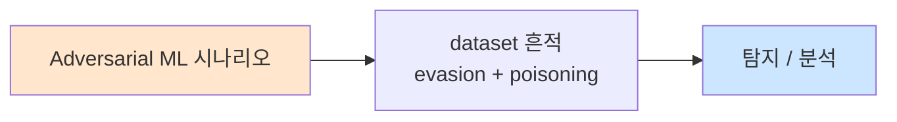

# Week 06: 모델 탈취/추출

## 학습 목표
- 모델 추출(Model Extraction) 공격의 원리와 위협을 이해한다
- API 쿼리 기반 모델 복제 기법을 실습한다
- 모델 역공학(Reverse Engineering) 접근법을 학습한다
- 워터마킹(Watermarking)과 핑거프린팅 방어 기법을 구현한다
- 모델 도난 탐지 시스템을 구축할 수 있다

## 실습 환경 (공통)

| 서버 | IP | 역할 | 접속 |
|------|-----|------|------|
| bastion | 10.20.30.201 | Control Plane (Bastion) | `ssh ccc@10.20.30.201` (pw: 1) |
| secu | 10.20.30.1 | 방화벽/IPS (nftables, Suricata) | `ssh ccc@10.20.30.1` |
| web | 10.20.30.80 | 웹서버 (JuiceShop:3000, Apache:80) | `ssh ccc@10.20.30.80` |
| siem | 10.20.30.100 | SIEM (Wazuh Dashboard:443, OpenCTI:8080) | `ssh ccc@10.20.30.100` |

**Bastion API:** `http://localhost:9100` / Key: `ccc-api-key-2026`

## 강의 시간 배분 (3시간)

| 시간 | 내용 | 유형 |
|------|------|------|
| 0:00-0:40 | Part 1: 모델 추출 공격 이론 | 강의 |
| 0:40-1:20 | Part 2: 모델 보호 기법 | 강의/토론 |
| 1:20-1:30 | 휴식 | - |
| 1:30-2:10 | Part 3: API 기반 모델 복제 실습 | 실습 |
| 2:10-2:50 | Part 4: 워터마킹과 탐지 시스템 | 실습 |
| 2:50-3:00 | 정리 + 과제 안내 | 정리 |

---

## 용어 해설

| 용어 | 영문 | 설명 | 비유 |
|------|------|------|------|
| **모델 추출** | Model Extraction | API 응답으로 모델을 복제하는 공격 | 시험 문제를 외워서 복제 |
| **Knowledge Distillation** | Knowledge Distillation | 큰 모델의 지식을 작은 모델로 이전 | 교수가 학생에게 지식 전달 |
| **워터마킹** | Watermarking | 모델에 추적 가능한 고유 마커 삽입 | 지폐의 워터마크 |
| **핑거프린팅** | Fingerprinting | 모델의 고유 특성으로 식별 | 지문 인식 |
| **쿼리 예산** | Query Budget | 공격에 필요한 API 호출 수 | 비용 제한 |
| **충실도** | Fidelity | 복제 모델과 원본의 유사도 | 복사본의 품질 |
| **부채널** | Side Channel | 의도치 않은 정보 유출 경로 | 벽 너머로 들리는 소리 |
| **Rate Limiting** | Rate Limiting | API 호출 빈도 제한 | 출입 속도 통제 |

---

# Part 1: 모델 추출 공격 이론 (40분)

## 1.1 모델 추출이란

모델 추출은 API로만 접근 가능한 모델(블랙박스)에 쿼리를 반복하여, 유사한 기능을 하는 복제 모델을 만드는 공격이다.

```
모델 추출 공격 개요

  공격자                              피해자
  ------                             ------
  [쿼리 생성기]                       [원본 모델 (API)]
       |                                  |
       | -- 질문1: "한국의 수도는?" -----→ |
       | ←---- 답변1: "서울입니다" ------- |
       |                                  |
       | -- 질문2: "2+3은?" -----------→  |
       | ←---- 답변2: "5입니다" --------- |
       |                                  |
       | -- ... (수천~수만 회) --------→  |
       | ←---- ... ---------------------- |
       |
       v
  [학습 데이터셋 구축]
  (질문, 답변) 쌍 수만 개
       |
       v
  [대리 모델 학습]
  파인튜닝: 작은 모델이 원본과
  유사하게 응답하도록 학습
       |
       v
  [복제 모델 완성]
  원본의 ~90% 성능을 자체 보유
```

### 모델 추출의 동기

| 동기 | 설명 | 예시 |
|------|------|------|
| **경제적** | API 비용 절감 | GPT-4 API 대신 자체 모델 |
| **경쟁** | 경쟁사 모델 복제 | 상용 모델의 지식 탈취 |
| **규제 우회** | 검열 없는 복제 모델 | 안전 제한 없는 버전 |
| **연구** | 모델 내부 이해 | 행동 분석, 취약점 연구 |
| **공격 준비** | 적대적 예제 생성 | 원본 공격용 프록시 모델 |

## 1.2 추출 공격의 분류

### 유형 1: 기능적 추출 (Functional Extraction)

모델의 입출력 관계를 복제한다.

```
목표: 원본 모델 f(x)에 대해 f'(x) ≈ f(x)인 f'를 학습

  방법:
  1. 다양한 x를 생성
  2. 원본에 x를 쿼리하여 y = f(x) 수집
  3. (x, y) 쌍으로 f' 학습

  평가: 충실도(Fidelity)
  Fidelity = P(f'(x) == f(x)) for random x
```

### 유형 2: 지식 증류 (Knowledge Distillation)

원본 모델의 지식을 작은 모델로 이전한다.

```
Knowledge Distillation 과정

  [Teacher: 원본 대형 모델]
       |
       | soft labels (확률 분포)
       v
  [Student: 소형 복제 모델]
  
  Teacher: "서울" (p=0.85), "수원" (p=0.08), "부산" (p=0.05), ...
  Student: 이 확률 분포를 학습 (hard label보다 정보가 풍부)
```

### 유형 3: 부채널 추출 (Side-channel Extraction)

API 응답의 메타데이터를 활용한다.

| 부채널 | 정보 | 용도 |
|--------|------|------|
| **응답 시간** | 모델 크기/복잡도 추정 | 아키텍처 추론 |
| **토큰 확률** | logprobs (일부 API 제공) | 정밀 증류 |
| **에러 메시지** | 모델명, 버전, 제한 | 취약점 발견 |
| **응답 패턴** | 특유의 문체, 거부 패턴 | 모델 식별 |
| **Rate Limit 헤더** | 요금제, 사용량 | 서비스 구조 파악 |

## 1.3 추출 공격의 비용 분석

```
모델 추출 비용 대비 효과

  원본 모델 학습 비용:    $1,000,000+ (GPU, 데이터, 인력)
  API 추출 비용:          $1,000~$10,000 (API 호출)
  비용 비율:              0.1% ~ 1%

  추출 효율:
  ┌─────────────────────────────────────────────┐
  │ 쿼리 수    충실도     비용     시간           │
  │ 1,000      ~40%      $10     1시간          │
  │ 10,000     ~60%      $100    10시간         │
  │ 100,000    ~80%      $1,000  4일            │
  │ 1,000,000  ~90%      $10,000 40일           │
  └─────────────────────────────────────────────┘

  → 원본의 0.1% 비용으로 90% 성능 복제 가능
```

## 1.4 실제 사례

### 사례 1: OpenAI 모델의 Distillation

```
2024년 다수의 사례:
- 연구자들이 GPT-4 API로 대량 쿼리를 수행
- 수집된 (질문, 답변) 쌍으로 Llama 7B를 파인튜닝
- 결과: 특정 도메인에서 GPT-4의 ~85% 성능 달성
- 비용: GPT-4 학습비의 0.01% 미만

대응: OpenAI가 이용 약관에 "경쟁 모델 학습 금지" 조항 추가
```

### 사례 2: 모델 API 리버스 엔지니어링

```
2023-2025년 지속적 발생:
- API 응답 패턴 분석으로 모델 버전/크기 추정
- 에러 메시지에서 내부 구조 정보 유출
- Rate Limit 헤더에서 서비스 아키텍처 추론
```

---

# Part 2: 모델 보호 기법 (40분)

## 2.1 워터마킹 (Watermarking)

### 출력 워터마킹

```
출력 워터마킹 원리

  LLM 생성 과정:
  각 토큰 선택 시 확률 분포에서 샘플링

  일반:     P(token) = softmax(logits)
  워터마킹: P(token) = modified_softmax(logits, watermark_key)

  Green/Red list 방식:
  1. 토큰 사전을 Green(선호)/Red(비선호)로 분류
  2. Green 토큰의 확률을 약간 높임
  3. 생성된 텍스트에 Green 토큰이 통계적으로 더 많음
  4. 검증: Green 토큰 비율이 임계값 초과 → 워터마크 탐지

  사용자 인식: 텍스트 품질에 거의 영향 없음
  통계 검증: p-value로 워터마크 존재 확률 계산
```

### 모델 워터마킹

```
모델 자체에 워터마크 삽입

  1. 백도어 워터마크
     특정 트리거 입력에 대해 고유 응답을 생성하도록 학습
     예: "Watermark-Check-2026" → "This model is WM-ABC123"
     
  2. 파라미터 워터마크
     모델 가중치의 특정 패턴에 서명 삽입
     예: 가중치의 LSB에 서명 임베딩
```

## 2.2 핑거프린팅 (Fingerprinting)

```
모델 핑거프린팅

  특정 입력에 대한 모델의 고유 반응 패턴을 수집

  핑거프린트 입력 세트:
  ┌─────────────────────────────┐
  │ 입력              원본 응답   │
  │ "2+2="            "4"       │
  │ "Hello"           "Hi!"     │
  │ "AAAA...A(100개)" "..."     │
  │ "[특수 시퀀스]"    "..."     │
  └─────────────────────────────┘

  → 이 응답 패턴이 "지문"이 됨
  → 의심 모델에 같은 입력 → 응답 비교
  → 핑거프린트 일치 → 복제 모델로 판정
```

## 2.3 API 보안

| 방어 기법 | 설명 | 효과 |
|----------|------|------|
| **Rate Limiting** | API 호출 빈도 제한 | 대량 쿼리 방지 |
| **쿼리 예산** | 사용자별 일일 쿼리 수 제한 | 추출 비용 증가 |
| **응답 제한** | logprobs 비제공, 토큰 확률 숨김 | 정밀 증류 방지 |
| **쿼리 다양성 탐지** | 비정상 쿼리 패턴 탐지 | 추출 시도 탐지 |
| **출력 섭동** | 응답에 약간의 노이즈 추가 | 학습 데이터 품질 저하 |
| **워터마킹** | 출력에 추적 마커 삽입 | 도난 증명 |
| **이용 약관** | 모델 복제 금지 조항 | 법적 보호 |

## 2.4 탐지 메커니즘

```
모델 추출 탐지 파이프라인

  [API 요청 로그]
       |
       v
  [패턴 분석기]
  ├── 쿼리 빈도 분석 (burst detection)
  ├── 쿼리 다양성 분석 (entropy)
  ├── 쿼리 유형 분석 (분류/생성/특수)
  └── 사용자 프로파일링
       |
       v
  [이상 탐지]
  ├── 정상 사용자 프로파일과 비교
  ├── 알려진 추출 패턴 매칭
  └── 통계적 이상치 탐지
       |
       v
  [대응]
  ├── 경고 발생
  ├── Rate Limit 강화
  ├── 계정 차단
  └── 증거 수집
```

---

# Part 3: API 기반 모델 복제 실습 (40분)

> **이 실습을 왜 하는가?**
> 모델 추출 공격의 실제 과정을 체험해야 방어 기법의 필요성을 이해할 수 있다.
> 간이 추출 파이프라인을 구축하여 공격의 비용과 효과를 측정한다.
>
> **이걸 하면 무엇을 알 수 있는가?**
> - 모델 추출에 필요한 쿼리 수와 시간
> - 복제 모델의 충실도 측정 방법
> - 추출 과정에서 남는 흔적
>
> **주의:** 모든 실습은 허가된 실습 환경(10.20.30.0/24)에서만 수행한다.

## 3.1 데이터 수집 파이프라인

```bash
# 모델 추출을 위한 데이터 수집기
cat > /tmp/model_extract.py << 'PYEOF'
import json
import urllib.request
import time
import random

OLLAMA_URL = "http://10.20.30.200:11434/v1/chat/completions"
TARGET_MODEL = "gemma3:12b"

class ModelExtractor:
    """API 기반 모델 추출 시뮬레이터"""

    # 다양한 도메인의 질문 생성
    QUERY_TEMPLATES = [
        # 일반 지식
        "{country}의 수도는 어디인가요?",
        "{topic}에 대해 한 문장으로 설명해주세요.",
        # 분류
        "'{text}'의 감정은 긍정/부정/중립 중 무엇인가요? 한 단어로만 답하세요.",
        # 추론
        "{num1} + {num2} = ?",
        # 코드
        "Python으로 {task}하는 함수를 작성하세요.",
    ]

    COUNTRIES = ["한국", "일본", "미국", "프랑스", "독일", "브라질", "호주"]
    TOPICS = ["양자컴퓨팅", "블록체인", "딥러닝", "사이버보안", "클라우드"]
    TEXTS = ["정말 좋은 서비스입니다", "최악의 경험이었어요", "그냥 보통이에요"]
    TASKS = ["리스트 정렬", "피보나치 수열 계산", "문자열 뒤집기"]

    def __init__(self):
        self.collected = []
        self.query_count = 0
        self.total_tokens = 0
        self.start_time = None

    def generate_query(self):
        template = random.choice(self.QUERY_TEMPLATES)
        try:
            query = template.format(
                country=random.choice(self.COUNTRIES),
                topic=random.choice(self.TOPICS),
                text=random.choice(self.TEXTS),
                num1=random.randint(1, 100),
                num2=random.randint(1, 100),
                task=random.choice(self.TASKS),
            )
        except KeyError:
            query = template
        return query

    def query_model(self, prompt, system="Answer concisely in Korean."):
        payload = json.dumps({
            "model": TARGET_MODEL,
            "messages": [
                {"role": "system", "content": system},
                {"role": "user", "content": prompt},
            ],
            "temperature": 0.3,
            "max_tokens": 200,
        }).encode()
        req = urllib.request.Request(OLLAMA_URL, data=payload, headers={"Content-Type": "application/json"})
        try:
            with urllib.request.urlopen(req, timeout=30) as resp:
                data = json.loads(resp.read())
                content = data["choices"][0]["message"]["content"]
                tokens = data.get("usage", {}).get("total_tokens", len(content) // 4)
                return content, tokens
        except Exception as e:
            return f"ERROR: {e}", 0

    def extract(self, n_queries=20):
        self.start_time = time.time()
        print(f"=== 모델 추출 시작: {n_queries}개 쿼리 ===\n")

        for i in range(n_queries):
            query = self.generate_query()
            response, tokens = self.query_model(query)
            self.query_count += 1
            self.total_tokens += tokens

            self.collected.append({
                "query": query,
                "response": response,
                "tokens": tokens,
            })
            print(f"[{i+1}/{n_queries}] Q: {query[:40]}... → A: {response[:40]}...")
            time.sleep(0.3)

        elapsed = time.time() - self.start_time
        print(f"\n=== 수집 완료 ===")
        print(f"  쿼리 수: {self.query_count}")
        print(f"  총 토큰: {self.total_tokens}")
        print(f"  소요 시간: {elapsed:.1f}초")
        print(f"  수집 속도: {self.query_count/elapsed:.1f} qps")

        return self.collected

    def save(self, path="/tmp/extraction_data.jsonl"):
        with open(path, "w") as f:
            for item in self.collected:
                f.write(json.dumps(item, ensure_ascii=False) + "\n")
        print(f"저장: {path} ({len(self.collected)}건)")


if __name__ == "__main__":
    extractor = ModelExtractor()
    data = extractor.extract(n_queries=15)
    extractor.save()
PYEOF

python3 /tmp/model_extract.py
```

## 3.2 충실도 측정

```bash
# 복제 모델의 충실도 측정 (동일 모델에서 시뮬레이션)
cat > /tmp/fidelity_test.py << 'PYEOF'
import json
import urllib.request
import time

OLLAMA_URL = "http://10.20.30.200:11434/v1/chat/completions"

# 일관성 테스트: 같은 질문을 여러 번 하여 응답 일관성 측정
TEST_QUERIES = [
    "한국의 수도는?",
    "1+1=?",
    "Python에서 리스트를 정렬하는 방법은?",
    "AI의 가장 큰 위험은?",
    "HTTP 상태코드 404는 무엇을 의미하나요?",
]

def query(model, prompt):
    payload = json.dumps({
        "model": model,
        "messages": [
            {"role": "system", "content": "Answer concisely in Korean."},
            {"role": "user", "content": prompt},
        ],
        "temperature": 0.1,  # 낮은 temperature로 일관성 높임
        "max_tokens": 100,
    }).encode()
    req = urllib.request.Request(OLLAMA_URL, data=payload, headers={"Content-Type": "application/json"})
    try:
        with urllib.request.urlopen(req, timeout=30) as resp:
            data = json.loads(resp.read())
            return data["choices"][0]["message"]["content"]
    except:
        return "ERROR"

def similarity(text1, text2):
    """간이 텍스트 유사도 (토큰 겹침)"""
    tokens1 = set(text1.lower().split())
    tokens2 = set(text2.lower().split())
    if not tokens1 or not tokens2:
        return 0.0
    intersection = tokens1 & tokens2
    union = tokens1 | tokens2
    return len(intersection) / len(union) if union else 0.0

print("=== 모델 응답 충실도 테스트 ===\n")
print(f"{'질문':30s} | {'응답1':20s} | {'응답2':20s} | {'유사도':6s}")
print("-" * 80)

total_sim = 0
for q in TEST_QUERIES:
    r1 = query("gemma3:12b", q)
    time.sleep(0.5)
    r2 = query("gemma3:12b", q)
    sim = similarity(r1, r2)
    total_sim += sim
    print(f"{q:30s} | {r1[:18]:20s} | {r2[:18]:20s} | {sim:.3f}")
    time.sleep(0.5)

avg_sim = total_sim / len(TEST_QUERIES)
print(f"\n평균 자기 일관성: {avg_sim:.3f}")
print(f"해석: {'높음' if avg_sim > 0.6 else '중간' if avg_sim > 0.3 else '낮음'}")
PYEOF

python3 /tmp/fidelity_test.py
```

## 3.3 모델 핑거프린팅

```bash
# 모델 핑거프린팅: 고유 응답 패턴 수집
cat > /tmp/fingerprint.py << 'PYEOF'
import json
import urllib.request
import hashlib
import time

OLLAMA_URL = "http://10.20.30.200:11434/v1/chat/completions"

# 핑거프린트 입력 세트 (고정)
FINGERPRINT_INPUTS = [
    "What is 2+2?",
    "Say hello in 3 languages.",
    "Complete: The quick brown fox",
    "What is your name?",
    "Translate to Korean: I love AI safety",
    "AAAAAAAAAA",  # 반복 패턴
    "###",  # 특수 문자
    "null undefined NaN",  # 에지 케이스
]

def query(model, prompt):
    payload = json.dumps({
        "model": model,
        "messages": [{"role": "user", "content": prompt}],
        "temperature": 0.0,
        "max_tokens": 50,
    }).encode()
    req = urllib.request.Request(OLLAMA_URL, data=payload, headers={"Content-Type": "application/json"})
    try:
        with urllib.request.urlopen(req, timeout=30) as resp:
            data = json.loads(resp.read())
            return data["choices"][0]["message"]["content"]
    except:
        return "ERROR"

def generate_fingerprint(model):
    responses = []
    for prompt in FINGERPRINT_INPUTS:
        resp = query(model, prompt)
        responses.append(resp[:100])
        time.sleep(0.3)

    # 핑거프린트 해시 생성
    combined = "|".join(responses)
    fp_hash = hashlib.sha256(combined.encode()).hexdigest()[:16]

    return {
        "model": model,
        "fingerprint": fp_hash,
        "responses": responses,
    }

print("=== 모델 핑거프린팅 ===\n")
fp = generate_fingerprint("gemma3:12b")
print(f"모델: {fp['model']}")
print(f"핑거프린트: {fp['fingerprint']}")
print(f"\n응답 패턴:")
for i, (inp, resp) in enumerate(zip(FINGERPRINT_INPUTS, fp['responses'])):
    print(f"  [{i+1}] {inp:35s} → {resp[:40]}")

# 핑거프린트 저장
with open("/tmp/model_fingerprint.json", "w") as f:
    json.dump(fp, f, ensure_ascii=False, indent=2)
print(f"\n핑거프린트 저장: /tmp/model_fingerprint.json")
PYEOF

python3 /tmp/fingerprint.py
```

---

# Part 4: 워터마킹과 탐지 시스템 (40분)

> **이 실습을 왜 하는가?**
> 모델 도난을 방지하고, 도난 시 증거를 확보하기 위한 기술을 구현한다.
> 워터마킹, 핑거프린팅, 이상 쿼리 탐지 등 방어 기술을 실습한다.
>
> **이걸 하면 무엇을 알 수 있는가?**
> - 텍스트 워터마킹의 구현 방법
> - 추출 시도 탐지 패턴
> - 모델 보호 종합 전략
>
> **주의:** 모든 실습은 허가된 실습 환경(10.20.30.0/24)에서만 수행한다.

## 4.1 텍스트 워터마킹

```bash
# 간이 텍스트 워터마킹 시스템
cat > /tmp/watermark.py << 'PYEOF'
import hashlib
import json
import re

class TextWatermarker:
    """텍스트 출력에 통계적 워터마크를 삽입/탐지"""

    def __init__(self, secret_key="watermark-secret-2026"):
        self.key = secret_key

    def _green_tokens(self, prev_token):
        """이전 토큰 기반으로 Green/Red 토큰 집합 결정"""
        seed = hashlib.sha256(f"{self.key}:{prev_token}".encode()).hexdigest()
        # 해시값 기반으로 확률 결정
        return int(seed[:8], 16) % 2 == 0  # 50% Green

    def embed(self, text):
        """텍스트에 워터마크 삽입 (동의어 치환 방식)"""
        SYNONYMS = {
            "좋은": "우수한",
            "나쁜": "좋지 않은",
            "큰": "대규모의",
            "작은": "소규모의",
            "중요한": "핵심적인",
            "사용하다": "활용하다",
            "확인하다": "점검하다",
            "시작하다": "개시하다",
        }
        watermarked = text
        substitutions = 0
        for original, replacement in SYNONYMS.items():
            if original in watermarked:
                watermarked = watermarked.replace(original, replacement, 1)
                substitutions += 1

        return {
            "original": text,
            "watermarked": watermarked,
            "substitutions": substitutions,
        }

    def detect(self, text, threshold=2):
        """워터마크 탐지: 치환된 동의어의 수를 확인"""
        WATERMARK_INDICATORS = [
            "우수한", "좋지 않은", "대규모의", "소규모의",
            "핵심적인", "활용하다", "점검하다", "개시하다",
        ]
        found = []
        for indicator in WATERMARK_INDICATORS:
            if indicator in text:
                found.append(indicator)

        is_watermarked = len(found) >= threshold
        confidence = min(len(found) / max(threshold, 1), 1.0)

        return {
            "is_watermarked": is_watermarked,
            "confidence": confidence,
            "indicators_found": found,
            "indicator_count": len(found),
        }


# 테스트
wm = TextWatermarker()

test_text = "서버 보안은 중요한 주제입니다. 좋은 방화벽을 사용하다 보면 큰 효과를 확인하다."
result = wm.embed(test_text)
print("=== 워터마킹 삽입 ===")
print(f"원본: {result['original']}")
print(f"워터마크: {result['watermarked']}")
print(f"치환 수: {result['substitutions']}")

print("\n=== 워터마크 탐지 ===")
detect_result = wm.detect(result['watermarked'])
print(f"탐지 결과: {detect_result['is_watermarked']}")
print(f"신뢰도: {detect_result['confidence']:.2f}")
print(f"발견된 지표: {detect_result['indicators_found']}")

# 워터마크 없는 텍스트 테스트
clean_text = "서버 보안은 중요한 주제입니다. 좋은 방화벽을 사용하면 큰 효과가 있습니다."
clean_result = wm.detect(clean_text)
print(f"\n정상 텍스트 탐지: {clean_result['is_watermarked']} (지표: {clean_result['indicator_count']}개)")
PYEOF

python3 /tmp/watermark.py
```

## 4.2 추출 시도 탐지

```bash
# API 사용 패턴 기반 모델 추출 시도 탐지
cat > /tmp/extraction_detector.py << 'PYEOF'
import json
import time
from collections import defaultdict
from datetime import datetime, timedelta

class ExtractionDetector:
    """모델 추출 시도를 API 사용 패턴으로 탐지"""

    THRESHOLDS = {
        "queries_per_minute": 20,
        "queries_per_hour": 500,
        "query_diversity_min": 0.3,  # 최소 다양성 (낮으면 의심)
        "avg_response_usage_min": 0.5,  # 응답을 실제로 사용하는지
        "systematic_pattern_score": 0.7,  # 체계적 패턴 점수
    }

    def __init__(self):
        self.user_logs = defaultdict(list)
        self.alerts = []

    def log_query(self, user_id, query, response_tokens):
        self.user_logs[user_id].append({
            "timestamp": datetime.now(),
            "query": query,
            "response_tokens": response_tokens,
        })

    def analyze_user(self, user_id):
        logs = self.user_logs[user_id]
        if len(logs) < 5:
            return {"risk": "low", "detail": "데이터 부족"}

        findings = []

        # 1. 빈도 분석
        recent = [l for l in logs if (datetime.now() - l["timestamp"]).seconds < 60]
        qpm = len(recent)
        if qpm > self.THRESHOLDS["queries_per_minute"]:
            findings.append(f"분당 쿼리 {qpm}회 (임계: {self.THRESHOLDS['queries_per_minute']})")

        # 2. 다양성 분석
        queries = [l["query"] for l in logs]
        unique_words = set()
        for q in queries:
            unique_words.update(q.split())
        total_words = sum(len(q.split()) for q in queries)
        diversity = len(unique_words) / max(total_words, 1)

        if diversity < self.THRESHOLDS["query_diversity_min"]:
            findings.append(f"쿼리 다양성 낮음: {diversity:.2f}")

        # 3. 체계적 패턴 탐지
        # 연속 번호, 순차 질문 등
        sequential_count = 0
        for i in range(1, len(queries)):
            if queries[i][:5] == queries[i-1][:5]:
                sequential_count += 1
        systematic_score = sequential_count / max(len(queries) - 1, 1)

        if systematic_score > self.THRESHOLDS["systematic_pattern_score"]:
            findings.append(f"체계적 패턴 감지: {systematic_score:.2f}")

        risk = "critical" if len(findings) >= 3 else "high" if len(findings) >= 2 else "medium" if findings else "low"

        return {
            "user_id": user_id,
            "total_queries": len(logs),
            "qpm": qpm,
            "diversity": round(diversity, 3),
            "systematic_score": round(systematic_score, 3),
            "risk": risk,
            "findings": findings,
        }


# 시뮬레이션
detector = ExtractionDetector()

# 정상 사용자
normal_queries = [
    "오늘 날씨 어때?", "파이썬 설치 방법", "맛있는 음식 추천",
    "서울에서 부산까지 거리", "AI 뉴스 알려줘",
]
for q in normal_queries:
    detector.log_query("user_normal", q, 50)

# 추출 시도 사용자
extract_queries = [
    f"{c}의 수도는?" for c in ["한국", "일본", "미국", "프랑스", "독일",
                              "영국", "중국", "이탈리아", "스페인", "캐나다",
                              "브라질", "호주", "인도", "러시아", "멕시코"]
]
for q in extract_queries:
    detector.log_query("user_extract", q, 20)

# 분석
print("=== 모델 추출 시도 탐지 ===\n")
for uid in ["user_normal", "user_extract"]:
    result = detector.analyze_user(uid)
    print(f"[{uid}]")
    print(f"  총 쿼리: {result['total_queries']}")
    print(f"  다양성: {result['diversity']}")
    print(f"  체계성: {result['systematic_score']}")
    print(f"  위험도: {result['risk']}")
    for f in result.get("findings", []):
        print(f"  경고: {f}")
    print()
PYEOF

python3 /tmp/extraction_detector.py
```

## 4.3 Bastion 연동

```bash
curl -s -X POST http://localhost:9100/projects \
  -H "Content-Type: application/json" \
  -H "X-API-Key: ccc-api-key-2026" \
  -d '{
    "name": "model-theft-week06",
    "request_text": "모델 추출/탈취 테스트 - API 복제, 핑거프린팅, 워터마킹, 추출 탐지",
    "master_mode": "external"
  }' | python3 -m json.tool
```

---

## 체크리스트

- [ ] 모델 추출 공격의 원리와 동기를 설명할 수 있다
- [ ] Knowledge Distillation의 과정을 이해한다
- [ ] API 기반 모델 복제 파이프라인을 구축할 수 있다
- [ ] 충실도(Fidelity)를 정의하고 측정할 수 있다
- [ ] 모델 핑거프린팅을 수행할 수 있다
- [ ] 텍스트 워터마킹을 구현할 수 있다
- [ ] 워터마크 탐지를 수행할 수 있다
- [ ] 추출 시도 탐지 시스템을 구축할 수 있다
- [ ] API 보안 기법을 열거하고 설명할 수 있다
- [ ] 부채널 정보 유출 위험을 인식한다

---

## 4.4 모델 보호 종합 프레임워크

```bash
# 종합 모델 보호 프레임워크
cat > /tmp/model_protection.py << 'PYEOF'
import json
import hashlib
from datetime import datetime

class ModelProtectionFramework:
    """종합 모델 보호 프레임워크"""

    def __init__(self, model_name):
        self.model_name = model_name
        self.protection_layers = {}

    def add_rate_limiting(self, max_per_minute=20, max_per_hour=500, max_per_day=5000):
        self.protection_layers["rate_limiting"] = {
            "per_minute": max_per_minute,
            "per_hour": max_per_hour,
            "per_day": max_per_day,
            "action": "429 Too Many Requests",
        }

    def add_query_monitoring(self, diversity_threshold=0.3, systematic_threshold=0.7):
        self.protection_layers["query_monitoring"] = {
            "diversity_threshold": diversity_threshold,
            "systematic_threshold": systematic_threshold,
            "action": "경고 + Rate Limit 강화",
        }

    def add_watermarking(self, method="synonym_replacement"):
        self.protection_layers["watermarking"] = {
            "method": method,
            "detection_threshold": 3,
            "action": "출력에 자동 삽입",
        }

    def add_fingerprinting(self, n_probes=10):
        self.protection_layers["fingerprinting"] = {
            "n_probes": n_probes,
            "stored": True,
            "action": "도난 모델 식별용",
        }

    def add_legal_protection(self):
        self.protection_layers["legal"] = {
            "tos_clause": "경쟁 모델 학습을 위한 API 사용 금지",
            "license": "비상업적 사용만 허용",
            "monitoring": "이용 약관 위반 감지",
        }

    def generate_report(self):
        report = f"""
{'='*60}
모델 보호 프레임워크 보고서
{'='*60}
모델: {self.model_name}
보고일: {datetime.now().strftime('%Y-%m-%d')}
보호 계층: {len(self.protection_layers)}개

보호 계층 상세:
"""
        for i, (name, config) in enumerate(self.protection_layers.items(), 1):
            report += f"\n  [{i}] {name}\n"
            for key, value in config.items():
                report += f"      {key}: {value}\n"

        report += f"""
종합 보호 수준:
  - Rate Limiting: {'적용' if 'rate_limiting' in self.protection_layers else '미적용'}
  - 쿼리 모니터링: {'적용' if 'query_monitoring' in self.protection_layers else '미적용'}
  - 워터마킹: {'적용' if 'watermarking' in self.protection_layers else '미적용'}
  - 핑거프린팅: {'적용' if 'fingerprinting' in self.protection_layers else '미적용'}
  - 법적 보호: {'적용' if 'legal' in self.protection_layers else '미적용'}

보호 등급: {'Strong' if len(self.protection_layers) >= 4 else 'Medium' if len(self.protection_layers) >= 2 else 'Weak'}
{'='*60}
"""
        return report


# 사용 예시
framework = ModelProtectionFramework("AcmeCorp SecureBot (gemma3:12b)")
framework.add_rate_limiting()
framework.add_query_monitoring()
framework.add_watermarking()
framework.add_fingerprinting()
framework.add_legal_protection()

print(framework.generate_report())
PYEOF

python3 /tmp/model_protection.py
```

## 4.5 모델 보호 전략 종합

```
모델 보호 종합 전략

  기술적 보호:
  ├── API Rate Limiting (분/시/일 단위)
  ├── 쿼리 예산 (사용자별 일일 한도)
  ├── 출력 제한 (logprobs 비공개, 토큰 확률 숨김)
  ├── 응답 노이즈 추가 (학습 데이터 품질 저하)
  ├── 출력 워터마킹 (Green/Red list)
  ├── 모델 핑거프린팅 (고유 응답 패턴)
  └── 이상 쿼리 탐지 (다양성, 체계성 분석)

  운영적 보호:
  ├── 접근 제어 (API 키 인증, IP 화이트리스트)
  ├── 사용량 모니터링 (대시보드)
  ├── 감사 로그 (전체 쿼리/응답 기록)
  └── 정기 보안 감사

  법적 보호:
  ├── 이용 약관 (경쟁 모델 학습 금지)
  ├── 라이선스 (비상업적 사용 제한)
  ├── 특허/저작권 보호
  └── 법적 대응 준비 (증거 수집)

  탐지 및 대응:
  ├── 추출 시도 실시간 탐지
  ├── 자동 Rate Limit 강화
  ├── 계정 차단
  └── 포렌식 증거 보존
```

---

## 과제

### 과제 1: 모델 핑거프린트 비교 (필수)
- Ollama에서 사용 가능한 2개 이상의 모델에 대해 핑거프린트 생성
- 핑거프린트 간 유사도를 계산하여 모델 구별 가능성 분석
- 결과를 표와 그래프로 정리

### 과제 2: 추출 탐지기 개선 (필수)
- extraction_detector.py에 시계열 분석 추가 (시간대별 쿼리 패턴)
- 정상 사용자 5명 + 추출 시도자 3명의 시뮬레이션 데이터 생성
- precision/recall 측정 및 보고

### 과제 3: 모델 보호 정책 설계 (심화)
- 가상의 LLM 서비스를 위한 종합 모델 보호 정책 설계
- 포함: API 보안, 워터마킹, 핑거프린팅, 이상 탐지, 법적 대응
- 비용 대비 효과 분석 포함

---

## 📂 실습 참조 파일 가이드

> 이번 주 실습에서 **실제로 조작하는** 솔루션의 기능·경로·파일·설정·UI 요점입니다.

### Ollama + LangChain
> **역할:** 로컬 LLM 서빙(Ollama) + 체인 오케스트레이션(LangChain)  
> **실행 위치:** `bastion (LLM 서버)`  
> **접속/호출:** `OLLAMA_HOST=http://10.20.30.201:11434`, Python `from langchain_ollama import OllamaLLM`

**주요 경로·파일**

| 경로 | 역할 |
|------|------|
| `~/.ollama/models/` | 다운로드된 모델 블롭 |
| `/etc/systemd/system/ollama.service` | 서비스 유닛 |

**핵심 설정·키**

- `OLLAMA_HOST=0.0.0.0:11434` — 외부 바인드
- `OLLAMA_KEEP_ALIVE=30m` — 모델 유휴 유지
- `LLM_MODEL=gemma3:4b (env)` — CCC 기본 모델

**로그·확인 명령**

- `journalctl -u ollama` — 서빙 로그
- `LangChain `verbose=True`` — 체인 단계 출력

**UI / CLI 요점**

- `ollama list` — 설치된 모델
- `curl -XPOST $OLLAMA_HOST/api/generate -d '{...}'` — REST 생성
- LangChain `RunnableSequence | parser` — 체인 조립 문법

> **해석 팁.** Ollama는 **첫 호출에 모델 로드**가 커서 지연이 크다. 성능 실험 시 워밍업 호출을 배제하고 측정하자.

---

## 실제 사례 (WitFoo Precinct 6 — Adversarial ML)

> 출처: WitFoo Precinct 6 Cybersecurity Dataset (Apache 2.0)
> 본 lecture *Adversarial ML* 학습 항목 매칭.

### Adversarial ML 의 dataset 흔적 — "evasion + poisoning"

dataset 의 정상 운영에서 *evasion + poisoning* 신호의 baseline 을 알아두면, *Adversarial ML* 시도 시 발생하는 anomaly 를 정량으로 탐지할 수 있다. 핵심 정량 지표는 — 0.1% poisoning effect.



### Case 1: dataset 정량 지표

| 항목 | 값 |
|---|---|
| 핵심 신호 | evasion + poisoning |
| 정량 baseline | 0.1% poisoning effect |
| 학습 매핑 | ML 보안 |

**자세한 해석**: ML 보안. 이 차이를 정량으로 측정해야 *공격 시도와 정상 운영의 구분* 이 가능. 학생이 baseline 숫자를 외워두면 — 운영 환경에서 anomaly 를 즉시 탐지할 수 있다.

### Case 2: 실전 적용 시나리오

| 단계 | dataset 활용 |
|---|---|
| 시도 식별 | evasion + poisoning 의 spike |
| 정상 vs 이상 | baseline 대비 비율 |
| 룰 작성 | Suricata / Wazuh / Sigma |
| 검증 | dataset 재실행 |

**자세한 해석**: 운영 환경 룰 작성은 — *baseline 측정 → 임계 결정 → 룰 작성 → dataset 검증* 의 4 단계. 한 단계라도 빠지면 false positive 폭증.

### 이 사례에서 학생이 배워야 할 3가지

1. **Adversarial ML = evasion + poisoning 의 anomaly** — 정량 신호로 탐지.
2. **baseline 숫자 외우기** — 0.1% poisoning effect.
3. **4 단계 룰 작성** — 측정 → 임계 → 룰 → 검증.

**학생 액션**: MITRE ATLAS.


---

## 부록: 학습 OSS 도구 매트릭스 (Course15 AI Safety Advanced — Week 06 차분 프라이버시·DP-SGD·SmartNoise·OpenDP)

> 이 부록은 lab `ai-safety-adv-ai/week06.yaml` (8 step + multi_task) 의 모든 명령을
> 실제로 실행 가능한 형태로 정리한다. Differential Privacy (DP) — Opacus / TF-Privacy /
> Diffprivlib / OpenDP / SmartNoise + RAPPOR / Google DP + (ε, δ) budget 추적.

### lab step → 도구·범위 매핑 표

| step | 학습 항목 | 핵심 OSS 도구 | 표준 |
|------|----------|--------------|------|
| s1 | DP 기본 시나리오 | Diffprivlib (IBM) 통계 query | NIST SP 800-188 |
| s2 | DP 위협 시나리오 | LLM + (ε, δ) tradeoff | NIST AI |
| s3 | DP 정책 평가 | LLM + budget 검토 | NIST AI 600-1 |
| s4 | DP 인젝션 (LLM 측면) | week01~03 도구 | LLM06 |
| s5 | DP 자동 분석 파이프라인 | OpenDP + Pipeline | training |
| s6 | DP 가드레일 | DP-SGD + DP query | training |
| s7 | DP 모니터링 | (ε, δ) budget tracker + Prometheus | observability |
| s8 | DP 평가 보고서 | markdown + accuracy/privacy curve | report |
| s99 | 통합 (s1→s2→s3→s5→s6) | Bastion plan 5 단계 | 전체 |

### DP 개념·도구 매핑

| 개념 | 정의 | 도구 |
|------|------|------|
| **(ε, δ)-DP** | ε small = 강한 privacy, δ ≈ 0 | Opacus / Diffprivlib |
| **Laplace 메커니즘** | 결정적 query 에 noise | Diffprivlib |
| **Gaussian 메커니즘** | gradient 에 noise | Opacus DP-SGD |
| **Exponential 메커니즘** | top-k 선택 | OpenDP |
| **Composition** | ε / δ 누적 | RDP / GDP / PRV accountant |
| **Local DP** | client 가 noise 추가 | RAPPOR / Apple DP |
| **Central DP** | server 가 noise 추가 | SmartNoise |
| **Federated DP** | DP + FL | Opacus + Flower |
| **Privacy budget** | ε ≤ 8 (적당), ε ≤ 1 (강함) | budget tracker |
| **Hybrid** | Local + Central | shuffle DP |

### 학생 환경 준비

```bash
pip install --user opacus tensorflow-privacy
pip install --user diffprivlib pydp
pip install --user opendp opendp-smartnoise

# Google DP
git clone https://github.com/google/differential-privacy /tmp/google-dp

# RAPPOR (Local DP)
pip install --user rappor
```

### 핵심 도구별 상세 사용법

#### 도구 1: Diffprivlib (IBM) — 통계 query (Step 1)

```python
from diffprivlib import mechanisms
import numpy as np

# Laplace mechanism
laplace = mechanisms.Laplace(epsilon=1.0, sensitivity=1.0)
print(f"True count: 100, DP count: {laplace.randomise(100):.2f}")

# Gaussian mechanism
gaussian = mechanisms.Gaussian(epsilon=1.0, delta=1e-5, sensitivity=1.0)
print(f"DP count (Gaussian): {gaussian.randomise(100):.2f}")

# DP queries
from diffprivlib import tools
data = np.random.normal(50, 10, 1000)

dp_mean = tools.mean(data, epsilon=1.0, bounds=(0, 100))
dp_var = tools.var(data, epsilon=1.0, bounds=(0, 100))
print(f"DP mean: {dp_mean:.2f} (true: {data.mean():.2f})")
print(f"DP var: {dp_var:.2f} (true: {data.var():.2f})")

# DP histogram
hist, bins = tools.histogram(data, epsilon=0.5, bins=10, range=(0, 100))
```

#### 도구 2: DP 위협 시나리오 (Step 2)

```python
import requests

prompt = """Generate a Differential Privacy threat scenario:
1. Attack type (membership inference / reconstruction / re-identification)
2. Adversary (insider with access / external query / both)
3. Privacy budget (ε ≤ 1 / ≤ 8 / unconstrained)
4. Mitigation (DP query / DP-SGD / shuffle / local DP)
5. Impact (utility loss vs privacy guarantee)
6. Detection signals (query patterns / abnormal frequency)

JSON: {"attack":"...", "adversary":"...", "epsilon":"...", "mitigation":"...", "impact":"...", "detection":[...]}"""

r = requests.post("http://192.168.0.105:11434/api/generate",
                 json={"model":"gpt-oss:120b","prompt":prompt,"stream":False})
print(r.json()['response'])
```

#### 도구 3: DP 정책 평가 (Step 3)

```python
def eval_dp_policy(policy):
    p = f"""정책이 DP 위협에 견고한지 평가:
{policy}

분석:
1. (ε, δ) 선택 (NIST 800-188 기준 ε ≤ 8)
2. Sensitivity bounding
3. Composition (RDP / GDP accountant)
4. Privacy budget 누적 추적
5. Query rate limiting
6. Local vs Central DP 선택

JSON: {{"weaknesses":[...], "missing_defenses":[...], "rec":[...]}}"""

    r = requests.post("http://192.168.0.105:11434/api/generate",
        json={"model":"gpt-oss:120b","prompt":p,"stream":False})
    return r.json()['response']

policy = """
1. ε = 100 (실질적 privacy 없음)
2. Sensitivity 미설정
3. Composition 추적 안 함
4. Query rate 무제한
5. Central DP only
"""
print(eval_dp_policy(policy))
```

#### 도구 5: 자동 분석 파이프라인 (Step 5) — OpenDP

```python
import opendp.prelude as dp

dp.enable_features("contrib")

# OpenDP transformation chain
preprocessor = (
    dp.t.make_split_dataframe(separator=",", col_names=["age", "income"])
    >> dp.t.make_select_column(key="age", TOA=str)
    >> dp.t.then_cast_default(TOA=int)
    >> dp.t.then_clamp(bounds=(0, 100))
    >> dp.t.then_resize(size=1000, constant=50)
    >> dp.t.then_mean()
)

# DP measurement
dp_mean_query = preprocessor >> dp.m.then_laplace(scale=1.0)

# Run
csv_data = "age,income\n25,50000\n30,60000\n..."
result = dp_mean_query(csv_data)
print(f"DP mean age: {result}")

# Privacy budget calculation
epsilon = dp_mean_query.map(d_in=1)   # adjacent dataset = 1 row diff
print(f"ε spent: {epsilon}")
```

#### 도구 6: DP 가드레일 (Step 6) — DP-SGD + DP query

```python
# === DP-SGD 학습 (week05 Opacus) ===
from opacus import PrivacyEngine
import torch

model = ...
optimizer = torch.optim.SGD(model.parameters(), lr=0.05)
data_loader = ...

privacy_engine = PrivacyEngine()
model, optimizer, data_loader = privacy_engine.make_private_with_epsilon(
    module=model, optimizer=optimizer, data_loader=data_loader,
    target_epsilon=8.0, target_delta=1e-5,
    epochs=10, max_grad_norm=1.0,
)

for epoch in range(10):
    for batch in data_loader:
        optimizer.zero_grad()
        loss = criterion(model(batch.x), batch.y)
        loss.backward()
        optimizer.step()
    print(f"ε = {privacy_engine.get_epsilon(delta=1e-5):.2f}")

# === DP query API wrapper ===
from diffprivlib import tools as dp_tools

class PrivateAnalytics:
    def __init__(self, epsilon_budget=10.0):
        self.budget = epsilon_budget
        self.spent = 0.0
        self.queries = []

    def check_budget(self, epsilon):
        if self.spent + epsilon > self.budget:
            raise Exception(f"Privacy budget exceeded: spent={self.spent}, requested={epsilon}, budget={self.budget}")

    def dp_count(self, data, epsilon):
        self.check_budget(epsilon)
        from diffprivlib.mechanisms import Laplace
        m = Laplace(epsilon=epsilon, sensitivity=1.0)
        result = m.randomise(len(data))
        self.spent += epsilon
        self.queries.append({"type":"count","epsilon":epsilon,"result":result})
        return result

    def dp_mean(self, data, epsilon, bounds):
        self.check_budget(epsilon)
        result = dp_tools.mean(data, epsilon=epsilon, bounds=bounds)
        self.spent += epsilon
        self.queries.append({"type":"mean","epsilon":epsilon,"result":result})
        return result

    def remaining_budget(self):
        return self.budget - self.spent

# 사용
analytics = PrivateAnalytics(epsilon_budget=10.0)
print(analytics.dp_count(data, epsilon=1.0))
print(analytics.dp_mean(data, epsilon=2.0, bounds=(0,100)))
print(f"Remaining: {analytics.remaining_budget():.2f}")
```

#### 도구 7: 모니터링 — (ε, δ) budget tracker (Step 7)

```python
from prometheus_client import start_http_server, Gauge, Counter, Histogram
import time

dp_epsilon_spent = Gauge('dp_epsilon_spent', 'Privacy budget spent', ['user_id'])
dp_epsilon_remaining = Gauge('dp_epsilon_remaining', 'Privacy budget remaining', ['user_id'])
dp_query_count = Counter('dp_query_total', 'DP queries', ['user_id', 'type'])
dp_noise_added = Histogram('dp_noise_magnitude', 'Noise added', ['mechanism'])
dp_budget_violations = Counter('dp_budget_violations_total', 'Budget exceeded')

class DPBudgetTracker:
    def __init__(self, total_budget=10.0):
        self.budgets = {}
        self.total = total_budget

    def get_or_init(self, user_id):
        if user_id not in self.budgets:
            self.budgets[user_id] = {"spent": 0.0, "queries": []}
            dp_epsilon_remaining.labels(user_id=user_id).set(self.total)
        return self.budgets[user_id]

    def query(self, user_id, epsilon, query_type, mechanism):
        b = self.get_or_init(user_id)
        if b['spent'] + epsilon > self.total:
            dp_budget_violations.inc()
            return None

        b['spent'] += epsilon
        b['queries'].append({"epsilon":epsilon,"type":query_type,"ts":time.time()})

        dp_epsilon_spent.labels(user_id=user_id).set(b['spent'])
        dp_epsilon_remaining.labels(user_id=user_id).set(self.total - b['spent'])
        dp_query_count.labels(user_id=user_id, type=query_type).inc()
        dp_noise_added.labels(mechanism=mechanism).observe(1.0/epsilon)
        return True

start_http_server(9305)
tracker = DPBudgetTracker(total_budget=10.0)
```

#### 도구 8: 보고서 (Step 8)

```bash
cat > /tmp/dp-eval-report.md << 'EOF'
# Differential Privacy Evaluation — 2026-Q2

## 1. Executive Summary
- Dataset: 1M records (synthetic salary survey)
- DP-SGD 학습 + DP query analytics
- ε budget: 10.0 (사용자당)
- 권장: ε ≤ 8 (NIST 800-188)

## 2. accuracy / privacy tradeoff
| ε | acc (DP-SGD) | inference attack ASR | utility |
|---|--------------|---------------------|---------|
| ∞ (no DP) | 99% | 73% (high leak) | full |
| 8 | 96% | 55% | excellent |
| 1 | 88% | 51% | good |
| 0.1 | 60% | 50.3% | poor |

## 3. Query API ε 사용 패턴 (1 month)
| 사용자 | ε spent | 위반 | 비고 |
|--------|---------|------|------|
| analyst-001 | 7.8 | 0 | 정상 |
| analyst-002 | 9.95 | 1 | 차단 |
| auditor | 4.2 | 0 | 정상 |

## 4. 발견
### Critical
- 1 user 가 budget 한계 시도 (차단됨)
- 동일 query 반복 (composition 효과)

### Mid
- ε=8 권장 vs 일부 query ε=2 사용 (강함)
- Local DP 미적용 (raw data 노출)

## 5. 권고
### Short
- ε=8 default + composition 자동 추적
- Query rate limit (10 queries/h)
- Sensitivity bounding 강제

### Mid
- Local DP 옵션 (RAPPOR / Apple DP)
- Composition accountant (RDP)
- Audit log full

### Long
- Hybrid (Local + Central) DP
- Synthetic data generation (DP-GAN)
- Federated DP (week05 Flower 통합)
EOF

pandoc /tmp/dp-eval-report.md -o /tmp/dp-eval-report.pdf \
  --pdf-engine=xelatex -V mainfont="Noto Sans CJK KR"
```

### 점검 / 평가 / 보고 흐름 (8 step + multi_task)

#### Phase A — 기본 + 시나리오 + 정책 (s1·s2·s3)

```bash
python3 /tmp/dp-basic-diffprivlib.py
python3 /tmp/dp-scenario.py
python3 /tmp/dp-policy-eval.py
```

#### Phase B — 인젝션 + 자동화 (s4·s5)

```bash
python3 /tmp/extraction-injection.py    # week01~03 재사용
python3 /tmp/dp-opendp-pipeline.py
```

#### Phase C — 가드레일 + 모니터링 + 보고 (s6·s7·s8)

```bash
python3 /tmp/dp-private-analytics.py
python3 /tmp/dp-budget-tracker.py &
pandoc /tmp/dp-eval-report.md -o /tmp/dp-eval-report.pdf
```

#### Phase D — 통합 (s99 multi_task)

s1 → s2 → s3 → s5 → s6 를 Bastion 가:

1. plan: DP 기본 → 시나리오 → 정책 평가 → OpenDP pipeline → DP-SGD + query API
2. execute: Diffprivlib / OpenDP / Opacus
3. synthesize: 5 산출물 (basic.txt / scenario.json / policy.json / pipeline.csv / dp-api.py)

### 도구 비교표 — DP 단계별

| 단계 | 1순위 | 2순위 | 사용 |
|------|-------|-------|------|
| 통계 query DP | Diffprivlib (IBM) | PyDP (Google bind) | OSS |
| ML 학습 DP | Opacus (Meta) | TF-Privacy (Google) | OSS |
| Pipeline | OpenDP (Harvard) | SmartNoise (Microsoft) | OSS |
| Local DP | RAPPOR | Apple DP | OSS |
| Composition accountant | RDP / GDP | Privacy Risk Profiles | 학계 |
| Budget tracker | 자체 구현 | OpenDP framework | 자유 |
| Synthetic data | DP-GAN / DP-SGD-GAN | Synthetic Data Vault | 학계 |
| 모니터링 | Prometheus + custom | Datadog | OSS |
| Compliance | NIST 800-188 / GDPR | HIPAA | 표준 |
| 보고서 | pandoc | Word | 기술 |

### 도구 선택 매트릭스 — 시나리오별 권장

| 시나리오 | 우선 도구 | 이유 |
|---------|---------|------|
| "통계 dashboard DP" | Diffprivlib + budget tracker | 단순 |
| "ML 학습 DP" | Opacus DP-SGD | Meta 표준 |
| "production pipeline" | OpenDP / SmartNoise | 검증 |
| "사용자 client DP" | RAPPOR (Local DP) | 강함 |
| "FL + DP" | Opacus + Flower (week05) | 통합 |
| "compliance (HIPAA)" | OpenDP + NIST 800-188 | 규제 |
| "데이터 공개" | DP-GAN / Synthetic | 강함 |

### 학생 셀프 체크리스트 (각 step 완료 기준)

- [ ] s1: Laplace + Gaussian + DP query (mean / var / histogram)
- [ ] s2: 6 컴포넌트 시나리오
- [ ] s3: 정책 평가 (6 항목)
- [ ] s4: week01~03 인젝션 재실행
- [ ] s5: OpenDP transformation chain + ε 추적
- [ ] s6: DP-SGD + PrivateAnalytics class
- [ ] s7: 5+ 메트릭 (spent / remaining / queries / noise / violations)
- [ ] s8: 보고서 (tradeoff curve + 사용 패턴 + 권고)
- [ ] s99: Bastion 가 5 작업 (basic / scenario / policy / pipeline / api) 순차

### 추가 참조 자료

- **NIST SP 800-188** (De-Identification of Personal Information)
- **NIST AI 600-1** (Generative AI RMF)
- **Diffprivlib (IBM)** https://github.com/IBM/differential-privacy-library
- **Opacus (Meta)** https://opacus.ai/
- **TF-Privacy (Google)** https://github.com/tensorflow/privacy
- **OpenDP (Harvard)** https://opendp.org/
- **SmartNoise (Microsoft)** https://github.com/opendp/smartnoise-sdk
- **PyDP (Google)** https://github.com/OpenMined/PyDP
- **RAPPOR (Google)** https://github.com/google/rappor
- **Apple DP** (학습 자료 only)
- **GDPR Art.32** Anonymization

위 모든 DP 평가는 **격리 환경** 으로 수행한다. ε 은 한 번 소비되면 영구히 누적 — 사용자별
budget 관리 필수. ε ≤ 8 권장 (NIST 800-188), ε ≤ 1 강함, ε > 100 은 실질적 privacy 없음.
Composition 은 단순 합 (basic) 또는 RDP / GDP accountant (tight) 두 가지 — production 은
RDP 권장. Local DP 는 더 강하지만 utility 손실 큼 — sensitive feature 만 선택적 적용.
