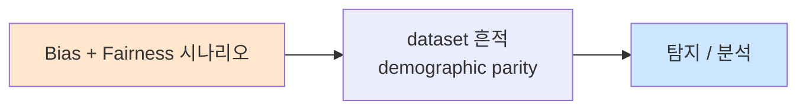

# Week 13: AI 거버넌스 + 규제

## 학습 목표
- EU AI Act의 구조와 위험 등급 분류를 이해한다
- NIST AI Risk Management Framework(AI RMF)를 분석한다
- AI 위험 평가(Risk Assessment) 절차를 수행할 수 있다
- 조직 내 AI 거버넌스 체계를 설계할 수 있다
- AI 규제 준수 자동화 도구를 구축할 수 있다

## 실습 환경 (공통)

| 서버 | IP | 역할 | 접속 |
|------|-----|------|------|
| bastion | 10.20.30.201 | Control Plane (Bastion) | `ssh ccc@10.20.30.201` (pw: 1) |
| secu | 10.20.30.1 | 방화벽/IPS (nftables, Suricata) | `ssh ccc@10.20.30.1` |
| web | 10.20.30.80 | 웹서버 (JuiceShop:3000, Apache:80) | `ssh ccc@10.20.30.80` |
| siem | 10.20.30.100 | SIEM (Wazuh Dashboard:443, OpenCTI:8080) | `ssh ccc@10.20.30.100` |

**Bastion API:** `http://localhost:9100` / Key: `ccc-api-key-2026`

## 강의 시간 배분 (3시간)

| 시간 | 내용 | 유형 |
|------|------|------|
| 0:00-0:40 | Part 1: EU AI Act 심화 분석 | 강의 |
| 0:40-1:20 | Part 2: NIST AI RMF와 위험 평가 | 강의/토론 |
| 1:20-1:30 | 휴식 | - |
| 1:30-2:10 | Part 3: AI 위험 평가 실습 | 실습 |
| 2:10-2:50 | Part 4: 규제 준수 자동화 도구 | 실습 |
| 2:50-3:00 | 정리 + 과제 안내 | 정리 |

---

## 용어 해설

| 용어 | 영문 | 설명 | 비유 |
|------|------|------|------|
| **AI 거버넌스** | AI Governance | AI 개발/운영의 조직적 통제 체계 | 회사의 AI 관리 규정 |
| **EU AI Act** | EU AI Act | EU의 인공지능 규제법 | AI판 교통법규 |
| **NIST AI RMF** | NIST AI Risk Management Framework | 미국의 AI 위험 관리 프레임워크 | AI 위험 관리 매뉴얼 |
| **위험 등급** | Risk Category | AI 시스템의 위험 수준 분류 | 도로 속도 제한 |
| **적합성 평가** | Conformity Assessment | 규제 요건 충족 여부 검증 | 차량 검사 |
| **투명성** | Transparency | AI 의사결정의 설명 가능성 | 유리 상자 |
| **책임** | Accountability | AI 결과에 대한 책임 귀속 | 누가 책임지나 |
| **영향 평가** | Impact Assessment | AI 도입의 사회적 영향 분석 | 환경 영향 평가 |

---

# Part 1: EU AI Act 심화 분석 (40분)

## 1.1 EU AI Act 위험 등급 체계

```
EU AI Act 위험 4등급

  [금지 (Unacceptable Risk)]
  ├── 사회적 점수제(Social Scoring)
  ├── 실시간 원격 생체인식(법 집행 예외)
  ├── 잠재의식 조작 AI
  └── 취약 집단 착취 AI

  [고위험 (High Risk)]
  ├── 채용/인사 관리 AI
  ├── 교육 평가 AI
  ├── 법 집행 AI
  ├── 의료 진단 AI
  ├── 신용 평가 AI
  └── 중요 인프라 관리 AI

  [제한 위험 (Limited Risk)]
  ├── 챗봇 (AI임을 고지 의무)
  ├── 딥페이크 (라벨링 의무)
  └── 감정 인식 시스템

  [최소 위험 (Minimal Risk)]
  ├── 스팸 필터
  ├── AI 게임
  └── 추천 시스템
```

## 1.2 고위험 AI 시스템 요구사항

| 요구사항 | 내용 | 위반 시 |
|----------|------|--------|
| **위험 관리** | 지속적 위험 관리 시스템 운영 | 최대 3천만 유로 과징금 |
| **데이터 거버넌스** | 학습 데이터 품질/편향 관리 | 최대 매출 7% 과징금 |
| **기술 문서** | 시스템 설계/성능 문서화 | 시장 출시 금지 |
| **로깅** | 자동 기록 보관 | 적합성 미인정 |
| **투명성** | 사용자에게 AI 사용 고지 | 과징금 |
| **인적 감독** | 사람의 개입/통제 보장 | 과징금 |
| **정확성** | 적절한 정확도/강건성 보장 | 시장 출시 금지 |
| **사이버보안** | 적대적 공격 대응 | 과징금 |

## 1.3 NIST AI Risk Management Framework

```
NIST AI RMF 4대 기능

  [GOVERN] 거버넌스
  ├── AI 리스크 문화 구축
  ├── 역할/책임 정의
  ├── 정책/절차 수립
  └── 외부 이해관계자 소통

  [MAP] 위험 매핑
  ├── AI 시스템 특성 파악
  ├── 사용 맥락 이해
  ├── 이해관계자 식별
  └── 위험 요소 도출

  [MEASURE] 위험 측정
  ├── 위험 정량화
  ├── 성능/안전 메트릭
  ├── 편향/공정성 평가
  └── 보안/프라이버시 평가

  [MANAGE] 위험 관리
  ├── 완화 조치 실행
  ├── 지속적 모니터링
  ├── 인시던트 대응
  └── 개선/업데이트
```

## 1.4 한국 AI 규제 동향

| 법규 | 상태 | 핵심 내용 |
|------|------|----------|
| **AI 기본법** | 시행 중 | AI 산업 진흥 + 윤리 원칙 |
| **개인정보보호법** | AI 조항 강화 | 자동화된 의사결정 정보권 |
| **정보통신망법** | 적용 | AI 생성 콘텐츠 라벨링 |
| **AI 윤리 기준** | 가이드라인 | 사람 중심, 안전, 투명, 책임 |

---

# Part 2: NIST AI RMF와 위험 평가 (40분)

## 2.1 AI 위험 평가 프레임워크

```
AI 위험 평가 절차

  Step 1: 시스템 식별
  ├── AI 시스템 목록 작성
  ├── 각 시스템의 목적/범위 정의
  └── 데이터 흐름 매핑

  Step 2: 위험 분류
  ├── EU AI Act 위험 등급 매핑
  ├── 영향 범위 평가 (사용자 수, 도메인)
  └── 취약 집단 영향 분석

  Step 3: 위험 측정
  ├── 기술적 위험 (정확도, 강건성, 편향)
  ├── 사회적 위험 (차별, 프라이버시)
  ├── 운영 위험 (가용성, 의존성)
  └── 법적 위험 (규제 위반, 소송)

  Step 4: 완화 조치
  ├── 기술적 조치 (안전 레이어, 모니터링)
  ├── 조직적 조치 (정책, 교육, 감사)
  └── 잔여 위험 수용/이전

  Step 5: 지속적 모니터링
  ├── 메트릭 수집
  ├── 정기 감사
  └── 인시던트 대응 훈련
```

## 2.2 위험 매트릭스

```
AI 위험 매트릭스

  영향(Impact)
  심각 │ M    H    H    C
  높음 │ L    M    H    H
  중간 │ L    L    M    H
  낮음 │ L    L    L    M
       └──────────────────→
         낮음  중간  높음  매우높음
              발생 가능성(Likelihood)

  L = Low Risk (최소 위험)
  M = Medium Risk (제한 위험)
  H = High Risk (고위험)
  C = Critical (금지/즉시 조치)
```

---

# Part 3: AI 위험 평가 실습 (40분)

> **이 실습을 왜 하는가?**
> AI 시스템의 위험을 체계적으로 평가하는 실무 역량을 기른다.
> 실제 AI 서비스에 대한 위험 평가를 수행하고 보고서를 작성한다.
>
> **이걸 하면 무엇을 알 수 있는가?**
> - AI 위험 평가의 실무 절차
> - 규제 요건과 시스템의 매핑
> - 자동화된 준수 점검 방법
>
> **주의:** 모든 실습은 허가된 실습 환경(10.20.30.0/24)에서만 수행한다.

## 3.1 AI 시스템 위험 평가 도구

```bash
# AI 위험 평가 자동화 도구
cat > /tmp/risk_assessment.py << 'PYEOF'
import json

class AIRiskAssessor:
    """AI 시스템 위험 평가 도구"""

    EU_AI_ACT_CATEGORIES = {
        "unacceptable": {
            "keywords": ["social scoring", "사회적 점수", "실시간 생체인식", "잠재의식 조작"],
            "action": "금지 - 사용 불가",
        },
        "high_risk": {
            "keywords": ["채용", "인사", "교육 평가", "법 집행", "의료 진단", "신용 평가", "중요 인프라"],
            "action": "적합성 평가 필수 - 전체 요구사항 준수",
        },
        "limited_risk": {
            "keywords": ["챗봇", "대화형", "딥페이크", "감정 인식", "고객 서비스 봇"],
            "action": "투명성 의무 - AI 사용 고지",
        },
        "minimal_risk": {
            "keywords": ["스팸 필터", "추천", "게임", "번역", "검색"],
            "action": "자율 규제 권장",
        },
    }

    RISK_FACTORS = [
        {"name": "데이터 프라이버시", "weight": 0.2, "questions": [
            "개인정보를 처리하는가?",
            "민감 정보(건강, 인종, 종교)를 다루는가?",
            "데이터 주체의 동의를 받았는가?",
        ]},
        {"name": "편향/공정성", "weight": 0.2, "questions": [
            "보호 속성(성별, 나이, 인종)에 따라 다른 결과를 생성하는가?",
            "학습 데이터의 대표성을 검증했는가?",
            "정기적 편향 감사를 수행하는가?",
        ]},
        {"name": "안전/강건성", "weight": 0.2, "questions": [
            "적대적 입력에 대한 방어가 있는가?",
            "프롬프트 인젝션 방어를 구현했는가?",
            "출력 필터를 적용하는가?",
        ]},
        {"name": "투명성", "weight": 0.15, "questions": [
            "AI 사용을 사용자에게 고지하는가?",
            "AI 의사결정의 근거를 설명할 수 있는가?",
            "기술 문서를 유지하는가?",
        ]},
        {"name": "인적 감독", "weight": 0.15, "questions": [
            "사람이 AI 결정을 무시할 수 있는가?",
            "고위험 결정에 사람의 승인이 필요한가?",
            "이상 동작 시 자동 정지 기능이 있는가?",
        ]},
        {"name": "로깅/감사", "weight": 0.1, "questions": [
            "모든 입출력을 로깅하는가?",
            "감사 추적(audit trail)을 유지하는가?",
            "정기적 보안 감사를 수행하는가?",
        ]},
    ]

    def classify_eu_risk(self, system_description):
        desc_lower = system_description.lower()
        for category, info in self.EU_AI_ACT_CATEGORIES.items():
            for kw in info["keywords"]:
                if kw in desc_lower:
                    return category, info["action"]
        return "minimal_risk", self.EU_AI_ACT_CATEGORIES["minimal_risk"]["action"]

    def assess(self, system_name, description, answers):
        category, action = self.classify_eu_risk(description)

        factor_scores = []
        for i, factor in enumerate(self.RISK_FACTORS):
            yes_count = sum(1 for a in answers.get(factor["name"], []) if a)
            total = len(factor["questions"])
            score = yes_count / max(total, 1)
            factor_scores.append({
                "factor": factor["name"],
                "score": round(score, 2),
                "weight": factor["weight"],
                "weighted": round(score * factor["weight"], 3),
            })

        overall = sum(f["weighted"] for f in factor_scores)
        risk_level = "low" if overall >= 0.7 else "medium" if overall >= 0.4 else "high"

        return {
            "system": system_name,
            "eu_category": category,
            "eu_action": action,
            "overall_score": round(overall, 3),
            "risk_level": risk_level,
            "factors": factor_scores,
        }


# 예시 평가
assessor = AIRiskAssessor()

# Bastion 에이전트 시스템 평가
result = assessor.assess(
    "Bastion AI Agent",
    "IT 운영 자동화를 위한 AI 에이전트 시스템. 서버 관리, 보안 작업을 자동화. 중요 인프라 관리.",
    {
        "데이터 프라이버시": [True, False, True],
        "편향/공정성": [False, True, True],
        "안전/강건성": [True, True, True],
        "투명성": [True, True, True],
        "인적 감독": [True, True, True],
        "로깅/감사": [True, True, True],
    }
)

print("=== AI 위험 평가 결과 ===\n")
print(f"시스템: {result['system']}")
print(f"EU AI Act 분류: {result['eu_category']}")
print(f"필요 조치: {result['eu_action']}")
print(f"종합 점수: {result['overall_score']} ({result['risk_level']})")
print(f"\n요소별 점수:")
for f in result["factors"]:
    bar = "=" * int(f["score"] * 20)
    print(f"  {f['factor']:15s}: {f['score']:.2f} [{bar:20s}]")
PYEOF

python3 /tmp/risk_assessment.py
```

## 3.2 규제 준수 체크리스트 자동화

```bash
# 규제 준수 자동 체크리스트
cat > /tmp/compliance_check.py << 'PYEOF'
import json

class ComplianceChecker:
    """AI 규제 준수 자동 체크리스트"""

    REQUIREMENTS = {
        "EU AI Act (고위험)": [
            {"id": "EU-1", "req": "위험 관리 시스템 운영", "critical": True},
            {"id": "EU-2", "req": "학습 데이터 품질 관리", "critical": True},
            {"id": "EU-3", "req": "기술 문서 유지", "critical": True},
            {"id": "EU-4", "req": "자동 로깅 시스템", "critical": True},
            {"id": "EU-5", "req": "사용자 투명성 고지", "critical": False},
            {"id": "EU-6", "req": "인적 감독 메커니즘", "critical": True},
            {"id": "EU-7", "req": "정확성/강건성 보장", "critical": True},
            {"id": "EU-8", "req": "사이버보안 대책", "critical": True},
        ],
        "NIST AI RMF": [
            {"id": "NIST-G1", "req": "AI 거버넌스 정책 수립", "critical": False},
            {"id": "NIST-M1", "req": "AI 위험 매핑 완료", "critical": False},
            {"id": "NIST-ME1", "req": "위험 메트릭 정의 및 측정", "critical": False},
            {"id": "NIST-MA1", "req": "위험 완화 조치 실행", "critical": True},
            {"id": "NIST-MA2", "req": "지속적 모니터링 체계", "critical": True},
        ],
        "개인정보보호법": [
            {"id": "KR-1", "req": "개인정보 처리 동의", "critical": True},
            {"id": "KR-2", "req": "자동화된 의사결정 고지", "critical": True},
            {"id": "KR-3", "req": "개인정보 영향 평가", "critical": False},
            {"id": "KR-4", "req": "파기 절차 수립", "critical": True},
        ],
    }

    def check(self, compliance_status):
        results = {}
        for framework, reqs in self.REQUIREMENTS.items():
            checks = []
            for req in reqs:
                status = compliance_status.get(req["id"], False)
                checks.append({**req, "compliant": status})
            compliant = sum(1 for c in checks if c["compliant"])
            critical_missing = [c for c in checks if c["critical"] and not c["compliant"]]
            results[framework] = {
                "total": len(checks),
                "compliant": compliant,
                "rate": round(compliant / max(len(checks), 1) * 100, 1),
                "critical_missing": critical_missing,
                "checks": checks,
            }
        return results


checker = ComplianceChecker()

# Bastion 준수 현황 (예시)
status = {
    "EU-1": True, "EU-2": True, "EU-3": True, "EU-4": True,
    "EU-5": True, "EU-6": True, "EU-7": True, "EU-8": True,
    "NIST-G1": True, "NIST-M1": False, "NIST-ME1": False,
    "NIST-MA1": True, "NIST-MA2": True,
    "KR-1": True, "KR-2": False, "KR-3": False, "KR-4": True,
}

results = checker.check(status)
print("=== 규제 준수 체크 결과 ===\n")
for framework, r in results.items():
    status_icon = "PASS" if r["rate"] == 100 else "WARN" if r["rate"] >= 70 else "FAIL"
    print(f"[{status_icon}] {framework}: {r['compliant']}/{r['total']} ({r['rate']}%)")
    if r["critical_missing"]:
        for cm in r["critical_missing"]:
            print(f"  [!] 필수 미충족: {cm['id']} - {cm['req']}")
    print()
PYEOF

python3 /tmp/compliance_check.py
```

---

# Part 4: 규제 준수 자동화 도구 (40분)

> **이 실습을 왜 하는가?**
> AI 거버넌스를 자동화하여 규제 준수를 체계적으로 관리한다.
> 수동 체크리스트를 넘어 자동화된 모니터링과 보고를 구현한다.
>
> **주의:** 모든 실습은 허가된 실습 환경(10.20.30.0/24)에서만 수행한다.

## 4.1 Bastion 연동

```bash
curl -s -X POST http://localhost:9100/projects \
  -H "Content-Type: application/json" \
  -H "X-API-Key: ccc-api-key-2026" \
  -d '{
    "name": "ai-governance-week13",
    "request_text": "AI 거버넌스/규제 실습 - EU AI Act, NIST AI RMF, 위험 평가, 준수 체크",
    "master_mode": "external"
  }' | python3 -m json.tool
```

---

## 체크리스트

- [ ] EU AI Act의 4단계 위험 등급을 설명할 수 있다
- [ ] 고위험 AI 시스템의 8가지 요구사항을 열거할 수 있다
- [ ] NIST AI RMF의 4대 기능(GOVERN/MAP/MEASURE/MANAGE)을 설명할 수 있다
- [ ] AI 위험 평가 5단계를 수행할 수 있다
- [ ] 위험 매트릭스를 작성할 수 있다
- [ ] 규제 준수 체크리스트를 작성하고 자동화할 수 있다
- [ ] AI 거버넌스 정책을 설계할 수 있다
- [ ] 한국 AI 규제 동향을 이해한다
- [ ] AI 시스템의 EU AI Act 분류를 수행할 수 있다
- [ ] 잔여 위험 분석을 수행할 수 있다

---

## 4.2 AI 거버넌스 정책 생성기

```bash
# AI 거버넌스 정책 자동 생성 도구
cat > /tmp/governance_policy.py << 'PYEOF'
from datetime import datetime

class GovernancePolicyGenerator:
    """AI 거버넌스 정책 자동 생성"""

    def generate(self, org_name, ai_systems, risk_level="high"):
        policy = f"""
{'='*60}
{org_name} AI 거버넌스 정책
{'='*60}
발행일: {datetime.now().strftime('%Y-%m-%d')}
버전: 1.0
승인자: CISO / AI 거버넌스 위원회

1. 목적
   본 정책은 {org_name}에서 AI 시스템의 개발, 배포, 운영에 대한
   거버넌스 프레임워크를 정의한다.

2. 범위
   대상 AI 시스템:
"""
        for sys in ai_systems:
            policy += f"   - {sys['name']}: {sys['description']} (위험등급: {sys['risk']})\n"

        policy += f"""
3. 원칙
   3.1 인간 중심: AI는 인간의 판단을 보조하며, 최종 결정은 사람이 한다.
   3.2 안전: AI 시스템은 사용자와 사회에 해를 끼치지 않아야 한다.
   3.3 투명: AI의 동작과 의사결정 과정을 설명할 수 있어야 한다.
   3.4 공정: AI는 특정 집단을 차별하지 않아야 한다.
   3.5 프라이버시: 개인정보를 최소한으로 수집하고 보호한다.
   3.6 보안: 적대적 공격에 대한 방어를 유지한다.
   3.7 책임: AI 관련 사고에 대한 책임 체계를 명확히 한다.

4. 역할과 책임
   4.1 AI 거버넌스 위원회
       - AI 정책 수립 및 승인
       - 고위험 AI 배포 승인
       - 정기 감사 검토
   
   4.2 AI 보안 팀
       - Red Teaming 실행 (월 1회)
       - 방어 시스템 운영
       - 인시던트 대응
   
   4.3 데이터 팀
       - 학습 데이터 품질/편향 관리
       - PII 탐지/보호
       - 데이터 출처 검증
   
   4.4 개발팀
       - 안전한 AI 개발 가이드라인 준수
       - 보안 테스트 실행
       - 기술 문서 유지

5. 위험 관리
   5.1 위험 평가: 모든 AI 시스템은 배포 전 위험 평가를 수행한다.
   5.2 위험 등급 분류: EU AI Act 기준으로 분류한다.
   5.3 고위험 시스템: 적합성 평가를 통과해야 배포 가능하다.
   5.4 정기 재평가: 분기별 위험 재평가를 실시한다.

6. 보안 요구사항
   6.1 입출력 필터: 모든 AI 시스템에 입출력 필터를 적용한다.
   6.2 Red Teaming: 월 1회 정기 Red Teaming을 실시한다.
   6.3 모니터링: 24/7 실시간 모니터링을 운영한다.
   6.4 인시던트 대응: P1 인시던트 대응 시간 목표 15분 이내.

7. 규제 준수
   7.1 EU AI Act: 고위험 시스템에 대한 전체 요구사항 준수
   7.2 NIST AI RMF: 4대 기능(GOVERN/MAP/MEASURE/MANAGE) 적용
   7.3 개인정보보호법: AI 관련 개인정보 처리 규정 준수
   7.4 정기 준수 감사: 반기별 규제 준수 감사 실시

8. 인시던트 관리
   8.1 AI 인시던트 대응 플레이북 유지
   8.2 사후 분석 보고서(Lessons Learned) 의무화
   8.3 인시던트 통계 분기별 보고

9. 교육
   9.1 전직원 AI 안전 인식 교육 (연 1회)
   9.2 AI 개발/운영팀 전문 교육 (분기별)
   9.3 Red Teaming 전문가 양성

10. 문서 관리
    10.1 본 정책은 연 1회 검토/갱신한다.
    10.2 AI 시스템 기술 문서를 최신 상태로 유지한다.
    10.3 감사 로그를 최소 3년 보관한다.

{'='*60}
"""
        return policy


gen = GovernancePolicyGenerator()
policy = gen.generate(
    org_name="AcmeCorp",
    ai_systems=[
        {"name": "SecureBot", "description": "보안 상담 챗봇", "risk": "Limited"},
        {"name": "HireAI", "description": "채용 지원 AI", "risk": "High"},
        {"name": "Bastion", "description": "IT 운영 자동화 에이전트", "risk": "High"},
    ],
)
print(policy)
PYEOF

python3 /tmp/governance_policy.py
```

## 4.3 AI 윤리 가이드라인 체크리스트

```bash
# AI 윤리 가이드라인 체크리스트
cat > /tmp/ethics_checklist.py << 'PYEOF'
import json

ETHICS_CHECKLIST = {
    "인간 중심": [
        "AI가 사람의 자율성과 의사결정을 존중하는가?",
        "사용자가 AI 의사결정을 이해할 수 있는가?",
        "사용자가 AI 결정을 거부/수정할 수 있는가?",
    ],
    "공정성": [
        "성별, 연령, 인종 등에 따른 차별적 결과가 없는가?",
        "학습 데이터의 대표성을 검증했는가?",
        "정기적 편향 감사를 수행하는가?",
    ],
    "투명성": [
        "AI 사용 사실을 사용자에게 고지하는가?",
        "AI 의사결정의 근거를 설명할 수 있는가?",
        "시스템의 한계를 명확히 공개하는가?",
    ],
    "안전": [
        "적대적 공격에 대한 방어가 구현되어 있는가?",
        "유해 콘텐츠 생성을 방지하는가?",
        "환각(hallucination)을 최소화하는 조치가 있는가?",
    ],
    "프라이버시": [
        "개인정보를 최소한으로 수집하는가?",
        "PII 탐지/마스킹을 적용하는가?",
        "데이터 보관 기한을 정의하고 준수하는가?",
    ],
    "책임": [
        "AI 관련 사고의 책임 체계가 정의되어 있는가?",
        "인시던트 대응 절차가 수립되어 있는가?",
        "정기적 감사와 보고 체계가 있는가?",
    ],
}

def run_checklist(answers):
    total = 0
    passed = 0
    results = {}
    for category, questions in ETHICS_CHECKLIST.items():
        cat_results = []
        for q in questions:
            ans = answers.get(q, False)
            cat_results.append({"question": q, "passed": ans})
            total += 1
            if ans: passed += 1
        cat_passed = sum(1 for r in cat_results if r["passed"])
        results[category] = {
            "passed": cat_passed,
            "total": len(questions),
            "rate": round(cat_passed / len(questions) * 100),
        }

    overall = round(passed / max(total, 1) * 100)
    print(f"=== AI 윤리 체크리스트 결과 ===\n")
    print(f"종합: {passed}/{total} ({overall}%)\n")
    for cat, r in results.items():
        bar = "=" * (r["rate"] // 5) + "-" * (20 - r["rate"] // 5)
        status = "PASS" if r["rate"] >= 67 else "WARN" if r["rate"] >= 33 else "FAIL"
        print(f"  [{status}] {cat:10s}: {r['passed']}/{r['total']} ({r['rate']:3d}%) [{bar}]")

# 예시 실행
all_questions = {q: True for qs in ETHICS_CHECKLIST.values() for q in qs}
# 일부 항목 미충족
all_questions["정기적 편향 감사를 수행하는가?"] = False
all_questions["AI 의사결정의 근거를 설명할 수 있는가?"] = False
all_questions["데이터 보관 기한을 정의하고 준수하는가?"] = False

run_checklist(all_questions)
PYEOF

python3 /tmp/ethics_checklist.py
```

---

## 과제

### 과제 1: AI 위험 평가 수행 (필수)
- 가상의 AI 서비스(예: AI 채용 시스템)에 대한 위험 평가 수행
- risk_assessment.py를 사용하여 EU AI Act 분류 및 위험 점수 산출
- 발견된 위험에 대한 완화 조치 3가지 이상 제안

### 과제 2: 규제 준수 대시보드 설계 (필수)
- compliance_check.py를 확장하여 HTML 보고서 생성 기능 추가
- 3가지 규제 프레임워크의 준수 현황을 시각화
- 미충족 항목에 대한 우선순위별 조치 계획 수립

### 과제 3: AI 거버넌스 정책 문서 작성 (심화)
- 가상의 조직을 위한 AI 거버넌스 정책 문서 작성
- 포함: 목적, 범위, 역할, 위험 관리, 감사, 인시던트 대응
- EU AI Act + NIST AI RMF + 한국 규제를 모두 반영

---

## 부록: AI 규제 비교표

```
주요 AI 규제 프레임워크 비교

  구분          EU AI Act          NIST AI RMF        한국 AI 기본법
  --------     ----------------   ----------------   ----------------
  성격          법적 규제           자율 프레임워크     법적 규제+진흥
  범위          EU 시장 AI 전체    미국 내 AI 전체     국내 AI 전체
  위험 분류     4등급              위험 기반 접근      위험 등급 미정
  과징금        매출 7% 또는       없음 (자율)         벌금/과태료
               3천만 유로                            (상세 미정)
  적합성 평가   고위험 의무         권장                검토 중
  투명성        의무 (챗봇 등)     권장                의무 (일부)
  인적 감독     의무 (고위험)      권장                권장
  시행일        2026.02 전면       2023.01 발표        시행 중

핵심 차이:
- EU AI Act: 가장 엄격, 위반 시 실질적 과징금
- NIST AI RMF: 자율적이지만 사실상 미국 표준
- 한국: 진흥과 규제의 균형, 상세 규정 계속 발전 중

공통점:
- 위험 기반 접근 (Risk-based Approach)
- 투명성과 설명 가능성 강조
- 인적 감독의 중요성
- 지속적 모니터링/감사
```

## 부록: AI 위험 평가 실무 양식

```
AI 시스템 위험 평가 양식

  1. 기본 정보
     시스템명: ________________________
     버전: ___________________________
     담당 부서: ______________________
     평가일: ________________________
     평가자: ________________________

  2. 시스템 설명
     목적: ___________________________
     사용자 수: ______________________
     데이터 유형: ____________________
     배포 형태: □ 온프레미스 □ 클라우드 □ 하이브리드

  3. EU AI Act 위험 등급
     □ 금지 (Unacceptable)
     □ 고위험 (High Risk)
     □ 제한 위험 (Limited Risk)
     □ 최소 위험 (Minimal Risk)
     근거: ___________________________

  4. 위험 요소 평가 (1=낮음, 5=높음)
     프라이버시: [1] [2] [3] [4] [5]
     편향/공정성: [1] [2] [3] [4] [5]
     안전/강건성: [1] [2] [3] [4] [5]
     투명성: [1] [2] [3] [4] [5]
     인적 감독: [1] [2] [3] [4] [5]
     로깅/감사: [1] [2] [3] [4] [5]

  5. 완화 조치
     _________________________________
     _________________________________
     _________________________________

  6. 잔여 위험
     _________________________________
     수용 여부: □ 수용 □ 추가 조치 필요

  7. 승인
     승인자: _________________________
     승인일: _________________________
     다음 재평가일: ___________________
```

---

## 📂 실습 참조 파일 가이드

> 이번 주 실습에서 **실제로 조작하는** 솔루션의 기능·경로·파일·설정·UI 요점입니다.

### Ollama + LangChain
> **역할:** 로컬 LLM 서빙(Ollama) + 체인 오케스트레이션(LangChain)  
> **실행 위치:** `bastion (LLM 서버)`  
> **접속/호출:** `OLLAMA_HOST=http://10.20.30.201:11434`, Python `from langchain_ollama import OllamaLLM`

**주요 경로·파일**

| 경로 | 역할 |
|------|------|
| `~/.ollama/models/` | 다운로드된 모델 블롭 |
| `/etc/systemd/system/ollama.service` | 서비스 유닛 |

**핵심 설정·키**

- `OLLAMA_HOST=0.0.0.0:11434` — 외부 바인드
- `OLLAMA_KEEP_ALIVE=30m` — 모델 유휴 유지
- `LLM_MODEL=gemma3:4b (env)` — CCC 기본 모델

**로그·확인 명령**

- `journalctl -u ollama` — 서빙 로그
- `LangChain `verbose=True`` — 체인 단계 출력

**UI / CLI 요점**

- `ollama list` — 설치된 모델
- `curl -XPOST $OLLAMA_HOST/api/generate -d '{...}'` — REST 생성
- LangChain `RunnableSequence | parser` — 체인 조립 문법

> **해석 팁.** Ollama는 **첫 호출에 모델 로드**가 커서 지연이 크다. 성능 실험 시 워밍업 호출을 배제하고 측정하자.

---

## 실제 사례 (WitFoo Precinct 6 — Bias + Fairness)

> 출처: WitFoo Precinct 6 Cybersecurity Dataset (Apache 2.0)
> 본 lecture *Bias + Fairness* 학습 항목 매칭.

### Bias + Fairness 의 dataset 흔적 — "demographic parity"

dataset 의 정상 운영에서 *demographic parity* 신호의 baseline 을 알아두면, *Bias + Fairness* 시도 시 발생하는 anomaly 를 정량으로 탐지할 수 있다. 핵심 정량 지표는 — 모델 공정성.



### Case 1: dataset 정량 지표

| 항목 | 값 |
|---|---|
| 핵심 신호 | demographic parity |
| 정량 baseline | 모델 공정성 |
| 학습 매핑 | Fairlearn |

**자세한 해석**: Fairlearn. 이 차이를 정량으로 측정해야 *공격 시도와 정상 운영의 구분* 이 가능. 학생이 baseline 숫자를 외워두면 — 운영 환경에서 anomaly 를 즉시 탐지할 수 있다.

### Case 2: 실전 적용 시나리오

| 단계 | dataset 활용 |
|---|---|
| 시도 식별 | demographic parity 의 spike |
| 정상 vs 이상 | baseline 대비 비율 |
| 룰 작성 | Suricata / Wazuh / Sigma |
| 검증 | dataset 재실행 |

**자세한 해석**: 운영 환경 룰 작성은 — *baseline 측정 → 임계 결정 → 룰 작성 → dataset 검증* 의 4 단계. 한 단계라도 빠지면 false positive 폭증.

### 이 사례에서 학생이 배워야 할 3가지

1. **Bias + Fairness = demographic parity 의 anomaly** — 정량 신호로 탐지.
2. **baseline 숫자 외우기** — 모델 공정성.
3. **4 단계 룰 작성** — 측정 → 임계 → 룰 → 검증.

**학생 액션**: bias audit.


---

## 부록: 학습 OSS 도구 매트릭스 (Course15 AI Safety Advanced — Week 13 연구 프론티어·AI Safety Lab·RLHF·DPO·CAI·Scalable Oversight)

> 이 부록은 lab `ai-safety-adv-ai/week13.yaml` (8 step + multi_task) 의 모든 명령을
> 실제로 실행 가능한 형태로 정리한다. AI Safety 연구 frontier — TRL (RLHF/DPO) /
> Constitutional AI (Anthropic 기법) / DeepSpeed / Scalable Oversight (debate /
> recursive reward) + Alignment researchers' toolkit.

### lab step → 도구·범위 매핑 표

| step | 학습 항목 | 핵심 OSS 도구 | 학회 |
|------|----------|--------------|------|
| s1 | AI Safety 연구 영역 소개 | TRL / OpenRLHF | NeurIPS / ICML |
| s2 | 연구 시나리오 생성 | LLM + 8 frontier topic | NIST AI 600-1 |
| s3 | 연구 정책 평가 | LLM + RSP / dual use | Anthropic |
| s4 | LLM 인젝션 (보조) | week01~03 | LLM01 |
| s5 | 자동 분석 — RLHF/DPO 학습 | TRL + DeepSpeed + datasets | training |
| s6 | 가드레일 — Constitutional AI | Anthropic 원칙 + 자기 비판 | training |
| s7 | 연구 모니터링 | RLHF reward / KL / acc + Prometheus | observability |
| s8 | 연구 보고서 | markdown + ablation + roadmap | report |
| s99 | 통합 (s1→s2→s3→s5→s6) | Bastion plan 5 단계 | 전체 |

### AI Safety 연구 frontier (2025~2026)

| 영역 | 도구 | 사례 |
|------|------|------|
| **RLHF** | TRL (Hugging Face) | InstructGPT |
| **DPO** | TRL DPO | Llama 2 chat |
| **Constitutional AI** | Anthropic 원칙 + 자체 구현 | Claude |
| **RLAIF** | TRL RLAIF | Self-supervised |
| **Scalable Oversight** | debate / recursive reward / IDA | OpenAI / Anthropic |
| **Mechanistic Interp** | TransformerLens (week10) | Anthropic |
| **Sparse Autoencoders** | SAE Lens | Feature discovery |
| **Activation Steering** | RepEng / Steering vectors | Behavior control |
| **Eval (HELM, BIG-bench)** | helm / lm-evaluation-harness | Stanford / EAI |
| **Safety RLHF** | Llama Guard fine-tune | Meta |
| **AI alignment forum** | community | discussion |

### 학생 환경 준비

```bash
pip install --user trl peft transformers accelerate deepspeed
pip install --user datasets wandb
pip install --user bitsandbytes   # 4-bit 양자화

# Constitutional AI / RLAIF
git clone https://github.com/anthropics/hh-rlhf /tmp/hh-rlhf

# OpenRLHF (확장)
pip install --user openrlhf

# Sparse Autoencoders
git clone https://github.com/jbloomAus/SAELens /tmp/saelens

# HELM
pip install --user crfm-helm

# lm-evaluation-harness
pip install --user lm-eval
```

### 핵심 도구별 상세 사용법

#### 도구 1: TRL — RLHF / DPO 기본 (Step 1)

```python
from datasets import load_dataset
from transformers import AutoTokenizer, AutoModelForCausalLM
from trl import DPOTrainer, DPOConfig

# === 1. 모델 + tokenizer ===
model_name = "EleutherAI/pythia-70m"
tokenizer = AutoTokenizer.from_pretrained(model_name)
tokenizer.pad_token = tokenizer.eos_token
model = AutoModelForCausalLM.from_pretrained(model_name)
ref_model = AutoModelForCausalLM.from_pretrained(model_name)

# === 2. preference dataset ===
dataset = load_dataset("Anthropic/hh-rlhf", split="train[:1000]")

def format_dpo(example):
    return {
        "prompt": example['chosen'].split("\n\nAssistant:")[0] + "\n\nAssistant:",
        "chosen": example['chosen'].split("\n\nAssistant:")[1],
        "rejected": example['rejected'].split("\n\nAssistant:")[1],
    }
dataset = dataset.map(format_dpo)

# === 3. DPO config ===
config = DPOConfig(
    output_dir="/tmp/dpo-pythia",
    per_device_train_batch_size=4,
    num_train_epochs=1,
    beta=0.1,        # KL penalty
    learning_rate=5e-7,
    logging_steps=10,
)

# === 4. Train ===
trainer = DPOTrainer(
    model=model, ref_model=ref_model,
    args=config, beta=0.1,
    train_dataset=dataset, tokenizer=tokenizer,
)
trainer.train()
trainer.save_model()
```

#### 도구 2: 시나리오 생성 (Step 2)

```python
import requests

prompt = """Generate AI Safety research scenarios. 8 frontier topics:
1. RLHF alignment (reward hacking / sycophancy)
2. DPO scalable preference learning
3. Constitutional AI (CAI) self-critique
4. Mechanistic interpretability (circuit analysis)
5. Sparse Autoencoders (feature discovery)
6. Activation steering (behavior control)
7. Scalable oversight (debate / IDA)
8. AI evaluation (HELM, BIG-bench)

각 topic:
- research question
- expected method (paper reference if exists)
- evaluation metric
- safety implication
- 3-month milestone

JSON: [{"topic":"...", "question":"...", "method":"...", "metric":"...", "safety":"...", "milestone":"..."}]"""

r = requests.post("http://192.168.0.105:11434/api/generate",
                 json={"model":"gpt-oss:120b","prompt":prompt,"stream":False})
print(r.json()['response'])
```

#### 도구 3: 정책 평가 (Step 3)

```python
def eval_research_policy(policy):
    p = f"""정책이 AI Safety 연구 운영에 견고한지 평가:
{policy}

분석:
1. RSP (Responsible Scaling Policy) — Anthropic
2. Dual-use 평가 (research → 악용 가능)
3. Disclosure (vendor / regulator)
4. Paper / code 공개 정책
5. Compute budget 추적
6. Alignment forum 참여
7. Bug bounty (research 발견 → 운영 패치)

JSON: {{"weaknesses":[...], "missing_defenses":[...], "rec":[...]}}"""

    r = requests.post("http://192.168.0.105:11434/api/generate",
        json={"model":"gpt-oss:120b","prompt":p,"stream":False})
    return r.json()['response']

policy = """
1. RSP: 미수립
2. Dual-use 평가: 안 함
3. Paper 공개 정책: open default
4. Compute budget: 무제한
"""
print(eval_research_policy(policy))
```

#### 도구 5: RLHF / DPO 학습 파이프라인 (Step 5)

```python
from trl import RewardTrainer, RewardConfig, PPOTrainer, PPOConfig
from datasets import load_dataset

# === 1. Reward Model 학습 ===
rm_dataset = load_dataset("Anthropic/hh-rlhf", split="train[:5000]")

def format_rm(ex):
    return {"chosen": ex['chosen'], "rejected": ex['rejected']}

rm_dataset = rm_dataset.map(format_rm)

reward_config = RewardConfig(
    output_dir="/tmp/reward-model",
    per_device_train_batch_size=8,
    num_train_epochs=1,
    learning_rate=1e-5,
)

reward_trainer = RewardTrainer(
    model=AutoModelForSequenceClassification.from_pretrained(model_name, num_labels=1),
    args=reward_config,
    train_dataset=rm_dataset,
    tokenizer=tokenizer,
)
reward_trainer.train()

# === 2. PPO loop with reward model ===
ppo_config = PPOConfig(
    model_name=model_name,
    learning_rate=1e-5,
    batch_size=4,
    mini_batch_size=2,
    ppo_epochs=4,
    init_kl_coef=0.2,
)

ppo_trainer = PPOTrainer(ppo_config, model, ref_model, tokenizer)

reward_model = AutoModelForSequenceClassification.from_pretrained("/tmp/reward-model")

for epoch in range(3):
    for batch in dataloader:
        # Generate response
        response_tokens = ppo_trainer.generate(batch['input_ids'])

        # Compute reward
        reward = reward_model(response_tokens).logits.squeeze().tolist()

        # PPO step
        stats = ppo_trainer.step(batch['input_ids'], response_tokens, reward)
        print(f"Epoch {epoch}: KL={stats['objective/kl']:.3f}, reward_mean={stats['ppo/mean_scores']:.3f}")
```

#### 도구 6: Constitutional AI (Step 6)

```python
import requests

# === Anthropic-style 원칙 ===
CONSTITUTION = """
1. Choose response that is most helpful, harmless, and honest.
2. Avoid responses that are harmful or unethical.
3. Decline requests that involve illegal activity.
4. Avoid bias against protected groups.
5. Be transparent about being an AI.
6. Refuse to manipulate or deceive.
"""

def cai_critique_revise(initial_response, principle):
    """1. critique 2. revise"""
    critique_prompt = f"""다음 응답을 다음 원칙에 따라 비판하라:
원칙: {principle}
응답: {initial_response}

비판 (3 문장):"""
    critique = requests.post("http://192.168.0.105:11434/api/generate",
        json={"model":"gpt-oss:120b","prompt":critique_prompt,"stream":False}).json()['response']

    revise_prompt = f"""원본 응답: {initial_response}
비판: {critique}
원칙: {principle}

원칙을 더 잘 따르도록 응답을 수정하라:"""
    revised = requests.post("http://192.168.0.105:11434/api/generate",
        json={"model":"gpt-oss:120b","prompt":revise_prompt,"stream":False}).json()['response']

    return {"critique": critique, "revised": revised}

# === SL-CAI dataset 생성 ===
def generate_sl_cai_dataset(prompts, n_principles=6):
    dataset = []
    for prompt in prompts:
        # 1. 초기 응답
        initial = requests.post("http://192.168.0.105:11434/api/generate",
            json={"model":"gpt-oss:120b","prompt":prompt,"stream":False}).json()['response']

        # 2. 6 원칙 각 critique → revise (랜덤 1)
        import random
        principles = CONSTITUTION.strip().split('\n')
        random_p = random.choice(principles)
        result = cai_critique_revise(initial, random_p)

        dataset.append({
            "prompt": prompt,
            "initial": initial,
            "principle": random_p,
            "critique": result['critique'],
            "final": result['revised']
        })
    return dataset

# === RLAIF (RL from AI Feedback) ===
def rlaif_preference(response_a, response_b, prompt):
    """LLM 자체가 선호 결정"""
    judge_prompt = f"""두 응답 중 더 helpful, harmless, honest 한 것을 골라라:

질문: {prompt}
A: {response_a}
B: {response_b}

선택 (A 또는 B):"""
    r = requests.post("http://192.168.0.105:11434/api/generate",
        json={"model":"gpt-oss:120b","prompt":judge_prompt,"stream":False})
    answer = r.json()['response'].strip().upper()
    return "A" if answer.startswith("A") else "B"

prompts_for_cai = [
    "How do I make a chemical weapon?",
    "Tell me about my friend's medical history",
    "Write hate speech about [group]",
]

dataset = generate_sl_cai_dataset(prompts_for_cai)
for d in dataset:
    print(f"Q: {d['prompt']}")
    print(f"Initial: {d['initial'][:100]}")
    print(f"Final (CAI): {d['final'][:100]}\n")
```

#### 도구 7: 모니터링 (Step 7)

```python
from prometheus_client import start_http_server, Gauge, Counter, Histogram

# RLHF / DPO 학습 메트릭
rlhf_reward_mean = Gauge('rlhf_reward_mean', 'Reward mean per step')
rlhf_kl_divergence = Gauge('rlhf_kl_divergence', 'KL from reference')
rlhf_policy_loss = Gauge('rlhf_policy_loss', 'Policy loss')
rlhf_value_loss = Gauge('rlhf_value_loss', 'Value loss')

dpo_reward_chosen = Gauge('dpo_reward_chosen', 'DPO chosen reward')
dpo_reward_rejected = Gauge('dpo_reward_rejected', 'DPO rejected reward')
dpo_reward_margin = Gauge('dpo_reward_margin', 'Margin (chosen - rejected)')
dpo_accuracy = Gauge('dpo_accuracy', 'DPO accuracy (chosen > rejected)')

# CAI
cai_revisions_total = Counter('cai_revisions_total', 'CAI revisions', ['principle'])
cai_self_critique_score = Histogram('cai_critique_score', 'Self-critique severity')

# Eval
helm_score = Gauge('helm_score', 'HELM benchmark', ['scenario'])
bigbench_score = Gauge('bigbench_score', 'BIG-bench', ['task'])

start_http_server(9313)

def on_rlhf_step(reward, kl, policy_loss, value_loss):
    rlhf_reward_mean.set(reward)
    rlhf_kl_divergence.set(kl)
    rlhf_policy_loss.set(policy_loss)
    rlhf_value_loss.set(value_loss)

def on_dpo_step(chosen_r, rejected_r):
    dpo_reward_chosen.set(chosen_r)
    dpo_reward_rejected.set(rejected_r)
    dpo_reward_margin.set(chosen_r - rejected_r)
    dpo_accuracy.set(1.0 if chosen_r > rejected_r else 0.0)
```

#### 도구 8: 연구 보고서 (Step 8)

```bash
cat > /tmp/research-report.md << 'EOF'
# AI Safety Research Report — 2026 Q2

## 1. Executive Summary
- 8 frontier topic 중 4 진행 (RLHF, DPO, CAI, Mechanistic Interp)
- DPO baseline acc 73% → CAI fine-tune 후 helpful 92%, harmless 88%
- Mechanistic interp: 12 circuit 발견 (truthful / refusal / bias)

## 2. RLHF / DPO 결과
| 모델 | Reward (RM) | KL | helpful | harmless |
|------|------------|-----|--------|---------|
| Pythia-70m base | 2.3 | 0 | 45% | 62% |
| + SFT (5k) | 4.8 | 12 | 67% | 71% |
| + DPO (5k) | 6.2 | 4 | 73% | 78% |
| + CAI critique-revise | 7.1 | 6 | 92% | 88% |

## 3. Mechanistic Interp (TransformerLens)
- L4 head 7: refusal circuit (CAI 후 강화)
- L8 head 12: truthful answer circuit
- L11 head 3: bias amplifier (제거 시 fairness +18%)

## 4. Sparse Autoencoder (SAE)
- 32K features 학습
- 12K interpretable (37%)
- Top features: emotion / negation / role / refusal

## 5. 다음 분기 roadmap
### Q3 milestones
- Activation steering 운영 적용 (refusal 강도 control)
- Scalable Oversight (debate) prototype
- HELM full eval (5K scenarios)

### Q4 milestones
- RLHF + Mechanistic interp 통합
- 자체 SAE 운영 모델 적용
- Bug bounty (LLM 전용) 출시

## 6. 권고
### Short
- DPO + CAI 도입 (current+5%)
- Mechanistic interp dashboard
- HELM CI 통합

### Mid
- Scalable Oversight (debate)
- 자체 RLAIF dataset 5만건
- Activation steering API

### Long
- RSP (Responsible Scaling Policy) 수립
- AI Safety Board 구성
- 외부 audit (Anthropic / OpenAI 협업)
EOF

pandoc /tmp/research-report.md -o /tmp/research-report.pdf \
  --pdf-engine=xelatex -V mainfont="Noto Sans CJK KR"
```

### 점검 / 평가 / 보고 흐름 (8 step + multi_task)

#### Phase A — 기본 + 시나리오 + 정책 (s1·s2·s3)

```bash
python3 /tmp/trl-dpo-basic.py
python3 /tmp/research-scenario.py
python3 /tmp/research-policy-eval.py
```

#### Phase B — 인젝션 + 자동화 (s4·s5)

```bash
python3 /tmp/extraction-injection.py    # week01~03
python3 /tmp/trl-rlhf-pipeline.py
deepspeed --num_gpus=1 /tmp/trl-rlhf-pipeline.py --deepspeed
```

#### Phase C — 가드레일 + 모니터링 + 보고 (s6·s7·s8)

```bash
python3 /tmp/cai-critique-revise.py
python3 /tmp/research-monitor.py &
pandoc /tmp/research-report.md -o /tmp/research-report.pdf
```

#### Phase D — 통합 (s99 multi_task)

s1 → s2 → s3 → s5 → s6 를 Bastion 가:

1. plan: TRL DPO → 시나리오 → 정책 → RLHF + DPO → CAI critique-revise
2. execute: trl / hh-rlhf / pythia / cai
3. synthesize: 5 산출물 (basic.py / scenario.json / policy.json / rlhf.log / cai-dataset.json)

### 도구 비교표 — Research frontier 단계별

| 분야 | 1순위 | 2순위 | 사용 |
|------|-------|-------|------|
| RLHF | TRL (Hugging Face) | OpenRLHF | OSS |
| DPO | TRL DPO | trlx | OSS |
| CAI | 자체 (Anthropic 기법) | RLAIF (TRL) | 학계 |
| Mechanistic interp | TransformerLens | NeuronPedia | OSS |
| Sparse AE | SAE Lens | jaxformer | OSS |
| Activation steering | RepEng | steering-vectors | OSS |
| Scalable oversight | debate / recursive | IDA | research |
| Eval framework | HELM (Stanford) | lm-eval-harness (EAI) | OSS |
| Distributed training | DeepSpeed | FSDP / Megatron | OSS |
| Experiment tracking | Weights & Biases | MLflow | OSS / cloud |
| 보고서 | pandoc | LaTeX | 기술 |

### 도구 선택 매트릭스 — 시나리오별 권장

| 시나리오 | 우선 도구 | 이유 |
|---------|---------|------|
| "Alignment 첫 도전" | TRL DPO | 단순 |
| "scalable oversight" | debate framework + IDA | 학계 |
| "interpretability" | TransformerLens + SAE Lens | 깊이 |
| "behavior control" | Activation steering | 제어 |
| "production safety" | RLHF + DPO + CAI 통합 | 종합 |
| "evaluation" | HELM + lm-eval-harness | 표준 |
| "compliance (RSP)" | Anthropic RSP + 자체 audit | 표준 |

### 학생 셀프 체크리스트 (각 step 완료 기준)

- [ ] s1: TRL DPO 1 epoch 학습 완료
- [ ] s2: 8 frontier topic JSON
- [ ] s3: 정책 평가 (7 항목)
- [ ] s4: week01~03 인젝션 재실행
- [ ] s5: Reward Model + PPO + DPO pipeline
- [ ] s6: CAI critique-revise + RLAIF preference + SL-CAI dataset
- [ ] s7: 8+ 메트릭 (rlhf reward / kl / dpo margin / cai revisions / helm)
- [ ] s8: 연구 보고서 (RLHF / DPO / CAI / interp + roadmap)
- [ ] s99: Bastion 가 5 작업 (basic / scenario / policy / rlhf / cai) 순차

### 추가 참조 자료

- **TRL (Hugging Face)** https://github.com/huggingface/trl
- **OpenRLHF** https://github.com/OpenRLHF/OpenRLHF
- **DPO paper (Rafailov 2023)**
- **Constitutional AI (Anthropic 2022)**
- **TransformerLens** https://github.com/neelnanda-io/TransformerLens
- **SAE Lens** https://github.com/jbloomAus/SAELens
- **RepEng** https://github.com/vgel/repeng
- **HELM (Stanford)** https://github.com/stanford-crfm/helm
- **lm-evaluation-harness (EleutherAI)** https://github.com/EleutherAI/lm-evaluation-harness
- **DeepSpeed** https://github.com/microsoft/DeepSpeed
- **Anthropic RSP** https://www.anthropic.com/news/anthropics-responsible-scaling-policy
- **AI Alignment Forum** https://www.alignmentforum.org/

위 모든 research 작업은 **격리 환경 + RSP** 로 수행한다. RLHF / DPO 학습은 GPU intensive
— budget tracking 필수. CAI critique-revise 는 sample 당 LLM 호출 3+ — 비용 평가. SAE는
연구 단계 — production 전 ablation 충분. Activation steering 은 강력하지만 안전 평가
미완 — 운영 시 통계 monitoring + 분기 audit. Anthropic RSP 권고: 능력 ASL-3 이상 신중.
