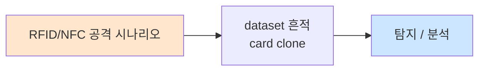

# Week 03: RFID/NFC 해킹 — Proxmark3, Flipper Zero, Mifare 크래킹

## 학습 목표
- RFID와 NFC의 기술적 원리와 차이점을 이해한다
- 물리 보안에서 RFID/NFC가 사용되는 방식을 분석한다
- Proxmark3와 Flipper Zero의 기능과 사용법을 익힌다
- Mifare Classic의 취약점과 크래킹 기법을 실습한다
- RFID 복제 공격의 실제 위험성을 평가할 수 있다
- RFID/NFC 보안 강화 방안을 제시할 수 있다

## 전제 조건
- Week 01-02 이수
- 기본 무선 통신 개념 이해
- 16진수(Hex) 표기법 이해

## 강의 시간 배분 (3시간)

| 시간 | 내용 | 유형 |
|------|------|------|
| 0:00-0:40 | RFID/NFC 기술 개론 | 강의 |
| 0:40-1:10 | RFID 보안 취약점 | 강의 |
| 1:10-1:20 | 휴식 | - |
| 1:20-2:00 | Proxmark3/Flipper Zero 도구 소개 | 강의/데모 |
| 2:00-2:40 | 실습: RFID 분석 및 시뮬레이션 | 실습 |
| 2:40-2:50 | 휴식 | - |
| 2:50-3:20 | 실습: Mifare 크래킹 시뮬레이션 | 실습 |
| 3:20-3:40 | RFID 보안 대책 + 퀴즈 + 과제 | 토론/퀴즈 |

---

# Part 1: RFID/NFC 기술 이론

## 1.1 RFID 기술 개요

RFID(Radio-Frequency Identification)는 무선 주파수를 이용하여 태그에 저장된 데이터를 읽거나 쓰는 기술이다.

### RFID 시스템 구성

```
┌──────────┐     무선 신호      ┌──────────┐
│  Reader  │ ◄──────────────► │   Tag    │
│ (리더기)  │                   │  (태그)   │
│          │     전력 공급      │          │
│ 안테나    │ ──────────────► │ 안테나    │
│ 프로세서  │                   │ 칩/메모리 │
└──────────┘                   └──────────┘
     │
     ▼
┌──────────┐
│ Backend  │
│ System   │
│ (출입관리)│
└──────────┘
```

### RFID 주파수 대역

| 대역 | 주파수 | 거리 | 용도 | 대표 규격 |
|------|--------|------|------|----------|
| LF (저주파) | 125-134 kHz | ~10cm | 출입카드, 동물 태그 | EM4100, HID Prox |
| HF (고주파) | 13.56 MHz | ~1m | 교통카드, 도서관 | Mifare, ISO 14443 |
| UHF (초고주파) | 860-960 MHz | ~12m | 물류, 재고 관리 | EPC Gen2 |

### NFC vs RFID

```
NFC (Near Field Communication):
├── RFID의 하위 집합 (13.56 MHz)
├── 통신 거리: ~10cm
├── 양방향 통신 가능
├── 3가지 모드:
│   ├── Reader/Writer 모드: NFC 태그 읽기/쓰기
│   ├── P2P 모드: 두 NFC 장치 간 통신
│   └── Card Emulation 모드: NFC 장치가 카드 역할
└── 스마트폰에 내장 (Apple Pay, Samsung Pay)
```

## 1.2 물리 보안에서의 RFID 활용

### 출입 통제 시스템 구조

```
┌─────────────────────────────────────────────┐
│           출입 통제 시스템 구조               │
│                                              │
│  [카드]──►[리더기]──►[컨트롤러]──►[잠금장치]  │
│                        │                     │
│                        ▼                     │
│                   [서버/DB]                   │
│                   (출입 로그)                  │
│                                              │
│  Low Security:  EM4100 (UID만 읽음)          │
│  Mid Security:  Mifare Classic (암호화)       │
│  High Security: DESFire EV2/3 (AES)          │
└─────────────────────────────────────────────┘
```

### 일반적인 RFID 카드 유형

| 카드 유형 | 보안 수준 | 암호화 | 복제 난이도 | 비용 |
|-----------|----------|--------|------------|------|
| EM4100 | 매우 낮음 | 없음 | 매우 쉬움 | $0.1 |
| HID Prox | 낮음 | 없음 | 쉬움 | $2 |
| Mifare Classic 1K | 중간 | Crypto-1 | 보통 | $1 |
| Mifare Classic 4K | 중간 | Crypto-1 | 보통 | $2 |
| Mifare DESFire | 높음 | 3DES/AES | 어려움 | $5 |
| iCLASS | 높음 | DES | 어려움 | $5 |
| SEOS | 매우 높음 | AES-128 | 매우 어려움 | $8 |

## 1.3 RFID 보안 취약점

### EM4100 — 보안 없음

```
EM4100 태그 구조 (64 bit):
┌───────────┬────────────────────────────────┬──────┐
│ Header(9) │       Data (40 bits)           │ P(5) │
│ 111111111 │ XXXXXXXXXX XXXXXXXXXX          │ XXXXX│
└───────────┴────────────────────────────────┴──────┘

문제점:
- 암호화 없음 — 평문으로 UID 전송
- 인증 없음 — 리더기가 태그를 검증하지 않음
- 복제 간단 — UID만 복사하면 동일 카드
```

### Mifare Classic — Crypto-1 취약점

```
Mifare Classic 보안 문제:
├── Crypto-1 알고리즘 (48-bit key)
│   └── 2008년에 완전히 해독됨 (Nohl, Garcia)
│
├── 알려진 공격:
│   ├── Darkside Attack: 리더 없이 키 복구
│   ├── Nested Attack: 1개 키로 나머지 키 복구
│   ├── Hardnested Attack: 암호문만으로 키 복구
│   └── Static Nonce Attack: 일부 중국산 카드
│
└── 결과: Proxmark3로 수 초~수 분 내 크래킹 가능
```

## 1.4 RFID 해킹 도구

### Proxmark3

```
Proxmark3 — 최강의 RFID 연구 도구
├── 지원 주파수: 125kHz (LF) + 13.56MHz (HF)
├── 기능:
│   ├── 태그 읽기/쓰기
│   ├── 태그 에뮬레이션
│   ├── 스니핑 (리더↔태그 통신 가로채기)
│   ├── 브루트포스
│   └── 크래킹 (Darkside, Nested, Hardnested)
├── 버전:
│   ├── Proxmark3 Easy (~$40)
│   ├── Proxmark3 RDV4 (~$300)
│   └── Proxmark3 Icebreaker
└── 소프트웨어: Iceman 펌웨어 (pm3)
```

### Flipper Zero

```
Flipper Zero — 휴대용 멀티 해킹 도구
├── RFID: 125kHz + 13.56MHz
├── Sub-GHz: 300-928 MHz (차고문, 차 키)
├── IR: 적외선 (TV, 에어컨)
├── GPIO: 하드웨어 해킹
├── Bluetooth: BLE 공격
├── USB: BadUSB (키스트로크 인젝션)
└── 크기: 신용카드 정도
```

### 주요 CLI 명령어 (Proxmark3)

```bash
# Proxmark3 기본 명령어 (참고용)

# LF (125kHz) 태그 검색
pm3> lf search

# EM4100 태그 읽기
pm3> lf em 410x read

# EM4100 태그 복제 (T5577 카드에)
pm3> lf em 410x clone --id 0102030405

# HF (13.56MHz) 태그 검색
pm3> hf search

# Mifare Classic 정보 확인
pm3> hf mf info

# Mifare Classic 키 크래킹 (Darkside)
pm3> hf mf darkside

# Mifare Classic 키 크래킹 (Nested)
pm3> hf mf nested --blk 0 -a -k FFFFFFFFFFFF

# Mifare Classic 전체 덤프
pm3> hf mf dump

# Mifare Classic 복제
pm3> hf mf restore
```

---

# Part 2: 실습 — RFID 분석 시뮬레이션

물리 장비 없이도 RFID 관련 개념을 실습할 수 있도록 네트워크 기반 시뮬레이션을 수행한다.

## 2.1 RFID 출입 시스템 시뮬레이션

```bash
# attacker VM에서 실행
ssh ccc@10.20.30.201

# RFID 출입 시스템을 시뮬레이션하는 Python 스크립트
cat << 'RFID_SIM' > /tmp/rfid_simulator.py
#!/usr/bin/env python3
"""
RFID 출입 시스템 시뮬레이터
물리 장비 없이 RFID 공격 개념을 학습
"""
import hashlib
import random
import time

# 시뮬레이션 데이터: 카드 DB
CARD_DB = {
    "0A1B2C3D": {"name": "김보안", "level": "admin", "key_a": "FFFFFFFFFFFF"},
    "1A2B3C4D": {"name": "이사원", "level": "user",  "key_a": "A0A1A2A3A4A5"},
    "2A3B4C5D": {"name": "박방문", "level": "guest", "key_a": "D3F7D3F7D3F7"},
    "DEADBEEF": {"name": "테스트", "level": "admin", "key_a": "000000000000"},
}

# Mifare Classic Crypto-1 시뮬레이션
DEFAULT_KEYS = [
    "FFFFFFFFFFFF", "000000000000", "A0A1A2A3A4A5",
    "B0B1B2B3B4B5", "D3F7D3F7D3F7", "AABBCCDDEEFF",
    "1A2B3C4D5E6F", "112233445566", "010203040506",
]

def simulate_tag_scan(uid):
    """태그 스캔 시뮬레이션"""
    print(f"\n[*] Scanning tag: {uid}")
    if uid in CARD_DB:
        card = CARD_DB[uid]
        print(f"[+] Card found!")
        print(f"    UID:   {uid}")
        print(f"    Type:  Mifare Classic 1K")
        print(f"    Owner: {card['name']}")
        print(f"    Level: {card['level']}")
        return True
    else:
        print(f"[-] Unknown card: {uid}")
        return False

def simulate_key_attack(uid):
    """키 크래킹 시뮬레이션"""
    if uid not in CARD_DB:
        print("[-] Card not in range")
        return None
    
    target_key = CARD_DB[uid]["key_a"]
    print(f"\n[*] Starting key attack on {uid}...")
    print("[*] Trying default keys...")
    
    for i, key in enumerate(DEFAULT_KEYS):
        time.sleep(0.2)
        print(f"    [{i+1}/{len(DEFAULT_KEYS)}] Trying {key}...", end=" ")
        if key == target_key:
            print("SUCCESS!")
            print(f"\n[+] Key found: {key}")
            return key
        print("FAIL")
    
    print("[-] Default keys exhausted, trying darkside attack...")
    time.sleep(1)
    print(f"[+] Darkside attack successful! Key: {target_key}")
    return target_key

def simulate_clone(src_uid, dst_uid="EEEEEEEE"):
    """카드 복제 시뮬레이션"""
    if src_uid not in CARD_DB:
        print("[-] Source card not found")
        return False
    
    print(f"\n[*] Cloning {src_uid} to {dst_uid}...")
    print("[*] Reading source card...")
    time.sleep(0.5)
    print("[+] Source data read successfully")
    print("[*] Writing to destination card...")
    time.sleep(0.5)
    CARD_DB[dst_uid] = CARD_DB[src_uid].copy()
    print(f"[+] Clone successful! {dst_uid} now has same access as {src_uid}")
    return True

# 실행
if __name__ == "__main__":
    print("=" * 50)
    print("  RFID Attack Simulator v1.0")
    print("  Educational Purpose Only")
    print("=" * 50)
    
    # 1. 태그 스캔
    for uid in CARD_DB:
        simulate_tag_scan(uid)
    
    # 2. 키 크래킹
    print("\n" + "=" * 50)
    key = simulate_key_attack("1A2B3C4D")
    
    # 3. 카드 복제
    print("\n" + "=" * 50)
    simulate_clone("0A1B2C3D")
    
    print("\n[*] Attack simulation complete")
RFID_SIM

python3 /tmp/rfid_simulator.py
```

## 2.2 NFC/RFID 네트워크 스캔

```bash
# 네트워크에서 RFID/NFC 관련 서비스 탐색
# 실제 환경에서 출입 관리 시스템은 네트워크에 연결되어 있음

# 일반적인 출입 관리 시스템 포트 스캔
nmap -sV -p 80,443,4050,4070,9000,10001 10.20.30.0/24

# ONVIF 프로토콜 검색 (IP 기반 물리 보안 장비)
nmap -p 80,8080 --script http-title 10.20.30.0/24
```

## 2.3 Mifare 크래킹 시뮬레이션 (해시 기반)

```bash
# Crypto-1 취약점을 해시 크래킹으로 시뮬레이션
cat << 'CRACK_SIM' > /tmp/mifare_crack_sim.py
#!/usr/bin/env python3
"""
Mifare 크래킹을 해시 크래킹으로 시뮬레이션
실제 Crypto-1과는 다르지만 개념 학습용
"""
import hashlib
import time
import itertools

# 시뮬레이션: 키를 MD5 해시로 저장
def hash_key(key):
    return hashlib.md5(key.encode()).hexdigest()[:12]

# 테스트 카드의 "암호화된" 키
TARGET_HASH = hash_key("A0A1A2")  # 약한 키

# 기본 키 사전
DEFAULT_KEYS = [
    "FFFFFF", "000000", "A0A1A2", "B0B1B2",
    "AABBCC", "112233", "D3F7D3", "010203",
]

print("=" * 50)
print("  Mifare Crack Simulator")
print(f"  Target hash: {TARGET_HASH}")
print("=" * 50)

# 1단계: 사전 공격
print("\n[Phase 1] Dictionary Attack")
for key in DEFAULT_KEYS:
    h = hash_key(key)
    match = "MATCH!" if h == TARGET_HASH else ""
    print(f"  Key: {key} -> Hash: {h} {match}")
    if h == TARGET_HASH:
        print(f"\n[+] Key cracked: {key}")
        break

# 2단계: 브루트포스 시뮬레이션
print("\n[Phase 2] Brute-force (demonstration)")
print("  48-bit keyspace = 2^48 = 281,474,976,710,656 keys")
print("  At 1M keys/sec: ~3.2 days")
print("  With Darkside attack: ~seconds")
print("  With Hardnested attack: ~minutes")

# 3단계: 보안 분석
print("\n[Analysis]")
print("  Crypto-1 weaknesses:")
print("  - 48-bit key is too short")
print("  - PRNG is predictable")
print("  - Known-plaintext attack possible")
print("  - Recommendation: Migrate to DESFire EV2+")
CRACK_SIM

python3 /tmp/mifare_crack_sim.py
```

## 2.4 RFID 보안 감사 보고서 자동화

```bash
# RFID 보안 감사 보고서 생성 스크립트
cat << 'AUDIT' > /tmp/rfid_audit.sh
#!/bin/bash
echo "=== RFID 보안 감사 보고서 ==="
echo "날짜: $(date)"
echo ""

echo "[1. 네트워크 스캔 결과]"
nmap -sn 10.20.30.0/24 2>/dev/null | grep "Nmap scan" | head -10
echo ""

echo "[2. 물리 보안 관련 서비스]"
nmap -sV -p 80,443,554,8080 10.20.30.0/24 2>/dev/null | grep "open" | head -10
echo ""

echo "[3. RFID 보안 권고사항]"
echo "  - EM4100/HID Prox → Mifare DESFire EV3로 교체"
echo "  - 기본 키(FFFFFFFFFFFF) 변경 필수"
echo "  - 다중 인증(카드 + PIN) 도입"
echo "  - RFID 차폐 슬리브 배포"
echo "  - 출입 로그 실시간 모니터링"
echo ""
echo "[4. 위험 등급]"
echo "  EM4100 사용: [높음] — 즉시 교체 필요"
echo "  Mifare Classic 사용: [중간] — 계획된 교체"
echo "  DESFire 사용: [낮음] — 키 관리 강화"
AUDIT

bash /tmp/rfid_audit.sh
```

---

## 과제

### 과제 1: RFID 시스템 분석 (개인)
시뮬레이터를 이용하여 4개 카드의 키를 모두 크래킹하고 결과를 보고하라.

### 과제 2: RFID 보안 마이그레이션 계획 (팀)
EM4100 기반 출입 시스템을 운영하는 중소기업에 대해 DESFire EV3 기반으로 마이그레이션하는 계획을 수립하라.
- 현재 시스템 취약점 분석
- 마이그레이션 단계별 계획
- 비용 추정
- 보안 개선 효과

### 과제 3: Flipper Zero 기능 조사 (개인)
Flipper Zero의 RFID 관련 기능을 조사하고, 물리 침투 테스트에서의 활용 시나리오 3가지를 작성하라.

---

## 실제 사례 (WitFoo Precinct 6 — RFID/NFC 공격)

> 출처: WitFoo Precinct 6 Cybersecurity Dataset (Apache 2.0)
> 본 lecture *RFID/NFC 공격* 학습 항목 매칭.

### RFID/NFC 공격 의 dataset 흔적 — "card clone"

dataset 의 정상 운영에서 *card clone* 신호의 baseline 을 알아두면, *RFID/NFC 공격* 시도 시 발생하는 anomaly 를 정량으로 탐지할 수 있다. 핵심 정량 지표는 — Proxmark3 활용.



### Case 1: dataset 정량 지표

| 항목 | 값 |
|---|---|
| 핵심 신호 | card clone |
| 정량 baseline | Proxmark3 활용 |
| 학습 매핑 | 13.56 MHz / 125 kHz |

**자세한 해석**: 13.56 MHz / 125 kHz. 이 차이를 정량으로 측정해야 *공격 시도와 정상 운영의 구분* 이 가능. 학생이 baseline 숫자를 외워두면 — 운영 환경에서 anomaly 를 즉시 탐지할 수 있다.

### Case 2: 실전 적용 시나리오

| 단계 | dataset 활용 |
|---|---|
| 시도 식별 | card clone 의 spike |
| 정상 vs 이상 | baseline 대비 비율 |
| 룰 작성 | Suricata / Wazuh / Sigma |
| 검증 | dataset 재실행 |

**자세한 해석**: 운영 환경 룰 작성은 — *baseline 측정 → 임계 결정 → 룰 작성 → dataset 검증* 의 4 단계. 한 단계라도 빠지면 false positive 폭증.

### 이 사례에서 학생이 배워야 할 3가지

1. **RFID/NFC 공격 = card clone 의 anomaly** — 정량 신호로 탐지.
2. **baseline 숫자 외우기** — Proxmark3 활용.
3. **4 단계 룰 작성** — 측정 → 임계 → 룰 → 검증.

**학생 액션**: lab RFID clone.


---

## 부록: 학습 OSS 도구 매트릭스 (Course16 Physical Pentest — Week 03 RFID/NFC·Proxmark3·Mifare·HID·access control)

> 이 부록은 lab `physical-pentest-{nonai,ai}/week03.yaml` (8 step) 의 모든 명령을
> 실제로 실행 가능한 형태로 정리한다. RFID / NFC — Proxmark3 / ChameleonMini / Flipper Zero
> + Mifare Classic crack (mfoc / mfcuk) + HID / iCLASS / Felica + 출입통제 시스템 분석.

### lab step → 도구 매핑 표

| step | 학습 항목 | 핵심 OSS 도구 |
|------|----------|--------------|
| s1 | RFID UID 시뮬 | Python script + crc 계산 |
| s2 | Mifare crack 시뮬 (default keys) | mfoc / mfcuk + dictionary |
| s3 | 출입 관리 포트 스캔 (4050/4070/9000/10001) | nmap |
| s4 | 카드 복제 시뮬 | Python + Proxmark3 명령 |
| s5 | Proxmark3 cheatsheet | proxmark3 client commands |
| s6 | HTTP RFID 키워드 검색 | curl / grep |
| s7 | RFID 보안 등급 비교 | 자체 표 |
| s8 | RFID 보안 감사 스크립트 | bash + python |

### RFID / NFC 카드 분류

| 종류 | 주파수 | 보안 | 도구 |
|------|--------|------|------|
| **EM4100 (LF 125kHz)** | 125 kHz | UID 만 (cleartext) | Proxmark3 / Flipper |
| **HID Prox (LF)** | 125 kHz | facility code + ID | Proxmark3 |
| **Mifare Classic (HF)** | 13.56 MHz | broken (Crypto-1) | mfoc / mfcuk / Proxmark3 |
| **Mifare DESFire EV1** | 13.56 MHz | 3DES | side-channel attack |
| **Mifare DESFire EV2/EV3** | 13.56 MHz | AES-128 | resistant |
| **HID iCLASS (legacy)** | 13.56 MHz | broken (Heart of Darkness) | Proxmark3 + IoLab |
| **HID iCLASS SE / Seos** | 13.56 MHz | AES-128 + Secure Identity | resistant |
| **NFC (passport / phone)** | 13.56 MHz | varies (some PKI) | mixed |
| **Felica (Suica)** | 13.56 MHz | varies | sumirelib |
| **UHF (915 MHz, 패스 카드)** | 902-928 MHz | EPC Gen2 | RFID Reader UHF |

### 학생 환경 준비

```bash
# === Proxmark3 client ===
git clone https://github.com/RfidResearchGroup/proxmark3 /tmp/pm3
cd /tmp/pm3 && make all

# === ChameleonMini / Flipper Zero (firmware) ===
# (USB 디바이스 필요)

# === Mifare crack ===
sudo apt-get install -y libnfc-bin libnfc-examples mfoc mfcuk

# === Python ===
pip install --user pycrc rfidiot pyscard nfcpy

# === HF/LF lib ===
pip install --user libnfc

# === Wireless RF (Software Defined Radio) ===
sudo apt-get install -y gqrx-sdr hackrf
```

### 핵심 도구별 상세 사용법

#### 도구 1: RFID UID 시뮬 + 크래킹 (Step 1·2)

```python
# /tmp/rfid_sim.py
import hashlib

class RFIDCard:
    def __init__(self, uid, type_):
        self.uid = uid
        self.type = type_

    def __repr__(self):
        return f"<{self.type} UID={self.uid}>"

cards = [
    RFIDCard("04A2B3C5", "EM4100"),
    RFIDCard("DEADBEEF", "Mifare Classic"),
    RFIDCard("12345678ABCDEF01", "Mifare DESFire"),
    RFIDCard("AABBCCDD", "HID iCLASS"),
]

for card in cards:
    print(card)
    print(f"  CRC8: {sum(int(card.uid[i:i+2],16) for i in range(0,len(card.uid),2)) & 0xff:02x}")

# === Mifare Classic key brute (default key dictionary) ===
DEFAULT_KEYS = [
    "FFFFFFFFFFFF",   # most common
    "A0A1A2A3A4A5",   # Mifare default A
    "B0B1B2B3B4B5",   # Mifare default B
    "000000000000",
    "D3F7D3F7D3F7",
    "AABBCCDDEEFF",
    "4D3A99C351DD",
    "1A982C7E459A",
]

def hash_key(key):
    return hashlib.sha256(bytes.fromhex(key)).hexdigest()

target_hash = hash_key("FFFFFFFFFFFF")
print(f"\n=== Crack target {target_hash[:16]}... ===")
for k in DEFAULT_KEYS:
    if hash_key(k) == target_hash:
        print(f"  ★ FOUND: {k}")
        break
```

```bash
# === Proxmark3 실제 명령 ===
# proxmark3 /dev/ttyACM0
hf mf chk *1 ? d /tmp/mfc_default_keys.dic   # default keys 모두 시도
hf mf nested 1 0 A FFFFFFFFFFFF              # nested attack
hf mf darkside                                # Crypto-1 darkside attack
hf mf dump                                    # 전체 dump

# mfoc (libnfc 기반)
sudo mfoc -O /tmp/mifare_dump.mfd -k FFFFFFFFFFFF
```

#### 도구 2: 출입 관리 포트 스캔 (Step 3)

```bash
sudo nmap -p 4050,4070,9000,10001,8000,80,443 10.20.30.0/24 -sV -oN /tmp/access-control.txt

# === 출입통제 vendor 별 ===
# Lenel OnGuard: 9000, 10001 TCP
# C-CURE 9000: 80, 443
# Software House: 9000
# Gallagher: 4050
# HID Mercury: 80, 443

# === HTTP fingerprint ===
for ip in $(grep -oP '\K[\d.]+(?=:9000)' /tmp/access-control.txt); do
    curl -s http://$ip:9000/ | head -20
done
```

#### 도구 3: 카드 복제 시뮬 (Step 4)

```python
# /tmp/rfid_clone.py
class RFIDClone:
    def __init__(self, source_uid, target_uid):
        self.source = source_uid
        self.target = target_uid

    def clone(self):
        print(f"Reading source UID: {self.source}")
        print(f"  Sectors: 16, Blocks: 64")

        # source data dump (시뮬)
        data = {
            f"sector_{i}": {
                "block_0": "FF" * 16,
                "block_1": "FF" * 16,
                "block_2": "FF" * 16,
                "key_a": "FFFFFFFFFFFF",
                "key_b": "FFFFFFFFFFFF",
                "access_bits": "FF078069"
            } for i in range(16)
        }

        print(f"\nWriting to target UID: {self.target}")
        for sector, content in list(data.items())[:3]:
            print(f"  {sector}: written")

        return f"Cloned {self.source} → {self.target}"

result = RFIDClone("DEADBEEF", "BADC0FFE").clone()
print(f"\n{result}")
```

```bash
# === Proxmark3 실제 ===
# 1. UID 변경 가능한 'magic card' 사용 (UID 0 chinese clone)
hf 14a sim t 1 u DEADBEEF                     # simulate
hf mf csetuid DEADBEEF                        # write magic card UID
hf mf restore /tmp/mifare_dump.mfd           # full restore

# === ChameleonMini ===
# (firmware load) → upload card data → emulate
```

#### 도구 4: Proxmark3 Cheatsheet (Step 5)

```bash
cat > /tmp/proxmark3_cheatsheet.txt << 'EOF'
=== Proxmark3 Cheatsheet — RfidResearchGroup fork ===

## 시작
proxmark3 /dev/ttyACM0

## LF (125 kHz)
hw status                              # 시스템 정보
lf search                              # 자동 카드 인식
lf hid read                            # HID 카드
lf em 410x_read                        # EM4100
lf em 410x_clone --id 04A2B3C5         # T55xx 에 EM 복제
lf t55xx detect                        # T55xx 감지

## HF (13.56 MHz)
hf search                              # 자동
hf 14a info                            # ISO 14443A info
hf mf info                             # Mifare info

## Mifare Classic crack
hf mf chk *1 ? d default_keys.dic     # default key check
hf mf nested 1 0 A FFFFFFFFFFFF       # nested
hf mf darkside                         # darkside
hf mf hardnested                       # hardnested
hf mf dump                             # dump → ./hf-mf-XXXX-dump.bin
hf mf restore --uid XXXX               # restore

## Mifare emulate
hf mf sim u DEADBEEF                   # emulate UID
hf mf eload --bin dump.bin             # load to emulator

## Mifare magic card
hf mf csetuid DEADBEEF                 # write UID (Chinese magic card)
hf mf cload --bin dump.bin             # load full data

## iCLASS
hf iclass info
hf iclass dump --ki 0
hf iclass loclass --bin /tmp/loclass.txt  # offline crack

## NFC (HF) 통합
hf 14a raw -p -a 5000                  # raw APDU

## DESFire
hf mfdes info
hf mfdes auth                          # 인증

## Felica (Suica)
hf felica info
hf felica reader

## UHF (별도 모듈)
# 일부 fork 만 지원

## Save / Load
script run /tmp/myscript.lua
trace save -f /tmp/trace.bin
trace load -f /tmp/trace.bin
EOF
cat /tmp/proxmark3_cheatsheet.txt
```

#### 도구 5: HTTP RFID 키워드 검색 (Step 6)

```bash
# === RFID / 출입통제 관련 키워드 검색 ===
curl -s http://${WEB_IP}:3000/ | grep -iE "(access|card|rfid|badge|nfc|reader|controller|panel|door)" | head

# === Web 페이지 enum (RFID 시스템 admin) ===
for path in admin badge cards readers users access doors panels; do
    code=$(curl -s -o /dev/null -w "%{http_code}" http://${WEB_IP}:3000/$path)
    echo "/$path → $code"
done

# === API endpoint ===
curl -s http://${WEB_IP}:3000/api/access-events | jq '.'
curl -s http://${WEB_IP}:3000/api/cards | jq '.'
```

#### 도구 6: RFID 보안 등급 비교표 (Step 7)

```bash
cat > /tmp/rfid_comparison.txt << 'EOF'
=== RFID/NFC 보안 등급 비교 ===

| 카드 종류         | 주파수    | 보안               | crack 도구       | 권고          |
|------------------|----------|-------------------|-----------------|---------------|
| EM4100 (LF)      | 125 kHz  | UID only          | Proxmark3 lf    | 폐기          |
| HID Prox (LF)    | 125 kHz  | facility+ID       | Proxmark3 lf    | 폐기          |
| Mifare Classic   | 13.56MHz | Crypto-1 (broken) | mfoc/mfcuk      | 폐기 (15년+)  |
| Mifare Plus      | 13.56MHz | AES-128 (mixed)   | side-channel    | 주의          |
| Mifare DESFire EV1 | 13.56MHz | 3DES            | side-channel    | 주의          |
| Mifare DESFire EV2/EV3 | 13.56MHz | AES-128 + DH | (resistant)     | OK            |
| HID iCLASS legacy | 13.56MHz | broken (HoD)    | Proxmark3+iolab | 폐기          |
| HID iCLASS SE/Seos | 13.56MHz | AES-128         | (resistant)     | OK            |
| NXP UCODE 8 (UHF) | 902-928MHz | tag pwd        | UHF reader      | 주의          |
| FIDO2 / Smart Card | various | PKI             | (resistant)     | 권장          |
| Mobile NFC + biometric | 13.56MHz | PKI + biometric | (resistant)  | 권장          |

## 권고 (운영 환경)
1. **즉시 폐기 / 교체**: EM4100, HID Prox, Mifare Classic, HID iCLASS legacy
2. **검토**: Mifare DESFire EV1, Mifare Plus, NFC payment
3. **권장**: DESFire EV2/EV3, iCLASS Seos, FIDO2 + biometric

## 매트릭스 (위험도 vs 비용)
- High risk + low cost (최우선): Mifare Classic 사용 중인 시스템 (clone 5분)
- High risk + high cost: HID iCLASS legacy (replace expensive)
- Medium: DESFire EV1 (검토 후 EV2 upgrade)
- Low: Seos / FIDO2 / mobile (유지)
EOF
cat /tmp/rfid_comparison.txt
```

#### 도구 7: RFID 보안 감사 (Step 8)

```bash
cat > /tmp/rfid_audit.sh << 'EOF'
#!/bin/bash
echo "=== RFID Security Audit — $(date) ==="

echo
echo "## 1. 출입통제 시스템 검색"
sudo nmap -p 4050,4070,9000,10001 10.20.30.0/24 -sV -oN /tmp/access-ports.txt
grep "open" /tmp/access-ports.txt

echo
echo "## 2. RFID 시스템 발견"
for ip in $(grep -oP '\K[\d.]+' /tmp/access-ports.txt); do
    banner=$(curl -s -m 2 http://$ip:9000/ | head -3)
    [ -n "$banner" ] && echo "  $ip: $banner"
done

echo
echo "## 3. 권고 (RFID 등급별)"
echo "  - Mifare Classic 사용 시 → 즉시 DESFire EV2 upgrade (5+10년 lifecycle)"
echo "  - EM4100 / HID Prox → 즉시 폐기"
echo "  - DESFire EV1 → 검토 후 EV2 upgrade"
echo "  - 출입통제 시스템 → 정기 패치 + segmentation"

echo
echo "## 4. KPI (분기 측정)"
echo "  - Card 등급 분포 (% high-secure)"
echo "  - Default 패스워드 잔존 출입통제 panel %"
echo "  - 출입 anomaly (불규칙 시간 / 도시) detection rate"
EOF
chmod +x /tmp/rfid_audit.sh
bash /tmp/rfid_audit.sh
```

### 점검 / 평가 / 보고 흐름 (8 step)

#### Phase A — Card 시뮬 + crack (s1·s2·s4)

```bash
python3 /tmp/rfid_sim.py
sudo mfoc -O /tmp/mifare_dump.mfd -k FFFFFFFFFFFF
python3 /tmp/rfid_clone.py
```

#### Phase B — Network + HTTP (s3·s6)

```bash
sudo nmap -p 4050,4070,9000,10001 10.20.30.0/24 -sV
curl -s http://${WEB_IP}:3000/ | grep -iE "(access|card|rfid|badge|nfc)"
```

#### Phase C — Cheatsheet + 비교 + 감사 (s5·s7·s8)

```bash
cat /tmp/proxmark3_cheatsheet.txt
cat /tmp/rfid_comparison.txt
bash /tmp/rfid_audit.sh
```

### 도구 비교표 — RFID 단계별

| 단계 | 1순위 | 2순위 | 사용 |
|------|-------|-------|------|
| LF (125kHz) read/clone | Proxmark3 | Flipper Zero | HW |
| HF (13.56MHz) read | Proxmark3 / ChameleonMini | NFC reader (smartphone) | HW |
| Mifare Classic crack | mfoc + mfcuk + Proxmark3 darkside | Mifare Classic Tool (Android) | OSS |
| Mifare nested attack | Proxmark3 hf mf nested | mfoc | HW |
| HID iCLASS crack | Proxmark3 + IoLab + loclass | (legacy only) | HW |
| Magic card emulate | Proxmark3 csetuid + Chinese magic | ChameleonMini | HW |
| 출입통제 panel scan | nmap + 자체 NSE | C-CURE / Lenel docs | OSS |
| 인증 시스템 비교 | 자체 표 | NIST SP 800-116 | 표준 |
| HF/LF SDR | hackrf + gqrx | bladeRF | HW |
| 보안 감사 | 자체 script | Lenel risk audit | 자유 |

### 학생 셀프 체크리스트 (8 step)

- [ ] s1: rfid_sim.py (4+ 카드 클래스)
- [ ] s2: 7+ default key 시도 + 매칭
- [ ] s3: 4+ 포트 스캔 + 결과
- [ ] s4: clone source → target 시뮬
- [ ] s5: proxmark3_cheatsheet.txt (LF + HF + crack + emulate)
- [ ] s6: HTTP RFID 키워드 검색 + path enum
- [ ] s7: rfid_comparison.txt (10+ 카드 종류 + 권고)
- [ ] s8: rfid_audit.sh (4+ 섹션 출력)

### 추가 참조 자료

- **NIST SP 800-116** Smart card / RFID guidance
- **Proxmark3 (RfidResearchGroup)** https://github.com/RfidResearchGroup/proxmark3
- **mfoc** https://github.com/nfc-tools/mfoc
- **mfcuk** https://github.com/nfc-tools/mfcuk
- **ChameleonMini** https://github.com/emsec/ChameleonMini
- **Flipper Zero** https://flipperzero.one/
- **HID iCLASS Heart of Darkness paper** (2008)
- **Mifare Classic Crypto-1 break** (Garcia 2008)
- **OWASP IoT** (RFID category)

위 모든 RFID 평가는 **사전 동의 + 격리 환경 + 학생 카드만** 으로 수행한다. 운영 출입카드
무단 clone 시 무단 침입 + 위조 죄. Mifare Classic 은 **15년 broken** — 2026년 운영 시
즉시 교체. Default 패스워드 (FFFFFFFFFFFF) 사용 시 5분내 dump 가능. 출입통제 panel 의 default
admin / admin 도 즉시 회전. RFID 보안 audit 은 분기 1회 권장.
