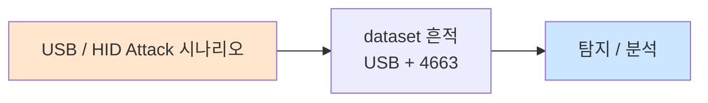

# Week 07: WiFi 해킹 심화 — Evil Twin, Rogue AP, MITM

## 학습 목표
- Evil Twin 공격의 원리와 구현 방법을 이해한다
- Rogue AP의 유형과 탐지 방법을 분석한다
- WiFi 기반 MITM(Man-in-the-Middle) 공격을 수행할 수 있다
- Captive Portal 공격으로 크리덴셜 수집 기법을 실습한다
- KARMA/MANA 공격의 동작 원리를 설명할 수 있다
- WiFi MITM 공격에 대한 방어 전략을 수립할 수 있다

## 전제 조건
- Week 06 WiFi 해킹 기초 이수
- HTTP/HTTPS 프로토콜 이해
- ARP 프로토콜 이해

## 강의 시간 배분 (3시간)

| 시간 | 내용 | 유형 |
|------|------|------|
| 0:00-0:40 | Evil Twin / Rogue AP 이론 | 강의 |
| 0:40-1:10 | KARMA/MANA 공격과 Captive Portal | 강의 |
| 1:10-1:20 | 휴식 | - |
| 1:20-2:00 | WiFi MITM 공격 기법 | 강의/데모 |
| 2:00-2:40 | 실습: Evil Twin 시뮬레이션 | 실습 |
| 2:40-2:50 | 휴식 | - |
| 2:50-3:20 | 실습: ARP MITM + 트래픽 분석 | 실습 |
| 3:20-3:40 | 방어 전략 + 퀴즈 + 과제 | 토론/퀴즈 |

---

# Part 1: Evil Twin / Rogue AP / MITM 이론

## 1.1 Evil Twin 공격

Evil Twin은 정상 AP와 동일한 SSID를 가진 가짜 AP를 만들어 사용자를 속이는 공격이다.

### Evil Twin 공격 흐름

```
정상 상태:
[Client] ──WiFi──► [정상 AP: "CorpWiFi"] ──► [Internet]

Evil Twin 공격:
[Client] ──WiFi──► [Evil Twin: "CorpWiFi"] ──► [Attacker] ──► [Internet]
                   (신호 더 강함)                 (트래픽 스니핑)

공격 단계:
1. 정상 AP와 동일한 SSID로 가짜 AP 생성
2. 정상 AP보다 강한 신호로 브로드캐스트
3. (선택) Deauth로 클라이언트를 정상 AP에서 분리
4. 클라이언트가 Evil Twin에 자동 연결
5. 트래픽 스니핑/변조 수행
```

### Evil Twin 구현 도구

| 도구 | 특징 | 사용 편의성 |
|------|------|-----------|
| WiFi Pineapple | Hak5 전용 장비, 웹 UI | 매우 쉬움 |
| hostapd-wpe | Linux hostapd + WPE 패치 | 중간 |
| Fluxion | 자동화 Evil Twin + Captive Portal | 쉬움 |
| bettercap | WiFi MITM 프레임워크 | 중간 |
| wifiphisher | Python 기반 Evil Twin | 쉬움 |

## 1.2 Rogue AP 유형

```
Rogue AP 분류:
│
├── Evil Twin (악성 쌍둥이)
│   ├── 정상 AP의 SSID 복제
│   ├── 공격자가 의도적으로 설치
│   └── 트래픽 스니핑/크리덴셜 수집
│
├── Unauthorized AP (비인가 AP)
│   ├── 직원이 무단으로 설치한 AP
│   ├── 의도는 선하지만 보안 위험
│   └── 네트워크 세그먼테이션 우회
│
├── Misconfigured AP (오설정 AP)
│   ├── 보안 설정이 잘못된 정상 AP
│   ├── 기본 비밀번호 미변경
│   └── 암호화 비활성화
│
└── Honeypot AP (허니팟 AP)
    ├── "Free WiFi" 등 매력적인 SSID
    ├── 오픈 네트워크로 유인
    └── 연결 즉시 공격 시작
```

## 1.3 KARMA/MANA 공격

```
KARMA 공격:
├── 원리: 클라이언트의 Probe Request에 무조건 응답
├── 동작:
│   1. 클라이언트: "HomeWiFi 있나요?" (Probe Request)
│   2. KARMA AP: "네, 저 HomeWiFi입니다!" (Probe Response)
│   3. 클라이언트: 자동 연결
│
├── 대상: 기존에 연결했던 AP를 자동으로 찾는 장치
└── 방어: Preferred Network List 관리

MANA 공격 (KARMA 개선):
├── Loud MANA: 관찰된 Probe를 브로드캐스트
├── Known Beacon: 인기 있는 SSID로 비콘 전송
└── MANA + EAP: Enterprise 인증 크리덴셜 수집
```

## 1.4 Captive Portal 공격

```
Captive Portal 공격 흐름:
│
├── 1. Evil Twin AP 생성 (오픈 네트워크)
│
├── 2. DHCP/DNS 서버 설정
│   ├── DHCP: IP 할당
│   └── DNS: 모든 도메인을 공격자 서버로
│
├── 3. Captive Portal 페이지 제공
│   ├── WiFi 로그인 페이지 위장
│   ├── 회사 포털 위장
│   └── "인터넷 사용을 위해 로그인하세요"
│
├── 4. 크리덴셜 수집
│   ├── WiFi 비밀번호
│   ├── 회사 계정
│   └── 개인 정보
│
└── 5. 정상 인터넷 제공 (의심 방지)
```

## 1.5 WiFi MITM 공격 기법

### ARP Spoofing 기반 MITM

```
정상 통신:
[Victim] ──ARP──► [Gateway] ──► [Internet]

ARP Spoofing 후:
[Victim] ──ARP──► [Attacker] ──► [Gateway] ──► [Internet]
                  (트래픽 스니핑)

도구:
├── arpspoof (dsniff)
├── bettercap
├── ettercap
└── mitmproxy
```

### SSL Stripping

```
HTTPS → HTTP 다운그레이드:
├── 클라이언트가 HTTP로 접속 시도
├── MITM이 서버와 HTTPS 연결
├── 클라이언트에게는 HTTP로 전달
├── 결과: 암호화 없이 크리덴셜 노출
│
└── 방어: HSTS, HSTS Preload List
```

---

# Part 2: 실습

## 2.1 Evil Twin 시뮬레이션

```bash
# attacker VM에서 실행
ssh ccc@10.20.30.201

# Evil Twin 공격 시뮬레이터
cat << 'EVILTWIN' > /tmp/evil_twin_sim.py
#!/usr/bin/env python3
"""
Evil Twin 공격 시뮬레이터
실제 WiFi 없이 공격 흐름을 학습
"""
import time
import json

class EvilTwinSimulator:
    def __init__(self):
        self.target_ssid = "CorpWiFi"
        self.target_bssid = "AA:BB:CC:11:22:33"
        self.evil_bssid = "DD:EE:FF:11:22:33"
        self.connected_clients = []
        self.captured_creds = []
    
    def phase1_recon(self):
        """Phase 1: 대상 AP 정찰"""
        print("\n[Phase 1] Reconnaissance")
        print("-" * 40)
        print(f"[*] Scanning for target AP...")
        time.sleep(0.5)
        print(f"[+] Target AP found:")
        print(f"    SSID:    {self.target_ssid}")
        print(f"    BSSID:   {self.target_bssid}")
        print(f"    Channel: 1")
        print(f"    Enc:     WPA2-PSK")
        print(f"    Clients: 12")
        print(f"    Signal:  -45 dBm")
    
    def phase2_setup(self):
        """Phase 2: Evil Twin AP 설정"""
        print("\n[Phase 2] Evil Twin Setup")
        print("-" * 40)
        print(f"[*] Creating Evil Twin AP...")
        print(f"    SSID:    {self.target_ssid} (same as target)")
        print(f"    BSSID:   {self.evil_bssid}")
        print(f"    Channel: 1")
        print(f"    Enc:     Open (captive portal)")
        print(f"    Signal:  -30 dBm (stronger than target)")
        time.sleep(0.5)
        print(f"[+] DHCP server started")
        print(f"[+] DNS server started (all domains -> 10.20.30.201)")
        print(f"[+] Captive portal started on port 80")
        print(f"[+] Evil Twin AP is LIVE")
    
    def phase3_deauth(self):
        """Phase 3: Deauth 클라이언트"""
        print("\n[Phase 3] Client Deauthentication")
        print("-" * 40)
        clients = [
            "11:22:33:AA:BB:01",
            "11:22:33:AA:BB:02", 
            "11:22:33:AA:BB:03",
        ]
        for mac in clients:
            print(f"[*] Deauth -> {mac}")
            time.sleep(0.2)
        print(f"[+] {len(clients)} clients deauthenticated")
    
    def phase4_capture(self):
        """Phase 4: 클라이언트 연결 및 크리덴셜 수집"""
        print("\n[Phase 4] Client Capture")
        print("-" * 40)
        
        clients = [
            {"mac": "11:22:33:AA:BB:01", "os": "Windows 10", "cred": "kim.user:P@ss1234"},
            {"mac": "11:22:33:AA:BB:02", "os": "iPhone 15", "cred": "lee.staff:Welcome1!"},
            {"mac": "11:22:33:AA:BB:03", "os": "MacBook Pro", "cred": None},
        ]
        
        for client in clients:
            time.sleep(0.3)
            print(f"\n[+] Client connected: {client['mac']} ({client['os']})")
            print(f"    → Redirected to captive portal")
            if client['cred']:
                print(f"    → Credentials captured: {client['cred']}")
                self.captured_creds.append(client['cred'])
            else:
                print(f"    → User suspicious, did not enter credentials")
    
    def phase5_report(self):
        """Phase 5: 결과 보고"""
        print("\n[Phase 5] Attack Summary")
        print("=" * 40)
        print(f"  Evil Twin SSID:  {self.target_ssid}")
        print(f"  Duration:        ~5 minutes")
        print(f"  Clients caught:  3")
        print(f"  Creds captured:  {len(self.captured_creds)}")
        for cred in self.captured_creds:
            print(f"    -> {cred}")
        print(f"\n  [WARNING] This is a simulation for educational purposes only.")
        print(f"  [WARNING] Unauthorized Evil Twin attacks are illegal.")

# 실행
sim = EvilTwinSimulator()
print("=" * 50)
print("  Evil Twin Attack Simulator")
print("=" * 50)
sim.phase1_recon()
sim.phase2_setup()
sim.phase3_deauth()
sim.phase4_capture()
sim.phase5_report()
EVILTWIN

python3 /tmp/evil_twin_sim.py
```

## 2.2 ARP MITM 실습

```bash
# ARP MITM 공격 시뮬레이션 (실제 네트워크에서)
echo "=== ARP MITM 시뮬레이션 ==="
echo ""

# 1. 현재 ARP 테이블 확인
echo "[1] Current ARP table:"
arp -a 2>/dev/null || ip neigh show
echo ""

# 2. 대상 시스템 MAC 확인
echo "[2] Target MAC addresses:"
for host in 10.20.30.1 10.20.30.80 10.20.30.100; do
    ping -c 1 -W 1 $host &>/dev/null
done
ip neigh show | grep "10.20.30"
echo ""

# 3. IP forwarding 상태 확인
echo "[3] IP forwarding status:"
cat /proc/sys/net/ipv4/ip_forward
echo "(0=disabled, 1=enabled)"
echo ""

# ARP MITM 개념 설명
echo "[*] ARP MITM Attack Flow:"
echo "  1. attacker가 victim에게: '나(attacker MAC)가 gateway야'"
echo "  2. attacker가 gateway에게: '나(attacker MAC)가 victim이야'"
echo "  3. victim과 gateway 사이의 모든 트래픽이 attacker를 경유"
echo "  4. attacker가 트래픽을 스니핑/변조 후 전달"
echo ""
echo "[*] Tools: arpspoof, bettercap, ettercap"
echo "[*] Detection: arpwatch, Dynamic ARP Inspection (DAI)"
```

## 2.3 Captive Portal 시뮬레이션

```bash
# Captive Portal 서버 시뮬레이션
cat << 'PORTAL' > /tmp/captive_portal_sim.py
#!/usr/bin/env python3
"""
Captive Portal 시뮬레이터
Evil Twin에서 사용하는 가짜 로그인 포털
"""
from http.server import HTTPServer, BaseHTTPRequestHandler
import urllib.parse

PORTAL_HTML = """<!DOCTYPE html>
<html>
<head>
<title>CorpWiFi - Authentication Required</title>
<style>
body { font-family: Arial; background: #f0f2f5; margin: 0; padding: 50px; }
.container { max-width: 400px; margin: 0 auto; background: white;
             padding: 30px; border-radius: 8px; box-shadow: 0 2px 4px rgba(0,0,0,0.1); }
h2 { color: #1a73e8; text-align: center; }
input { width: 100%; padding: 12px; margin: 8px 0; box-sizing: border-box;
        border: 1px solid #ddd; border-radius: 4px; }
button { width: 100%; padding: 12px; background: #1a73e8; color: white;
         border: none; border-radius: 4px; cursor: pointer; font-size: 16px; }
.logo { text-align: center; font-size: 24px; margin-bottom: 20px; }
.notice { color: #666; font-size: 12px; text-align: center; margin-top: 15px; }
</style>
</head>
<body>
<div class="container">
<div class="logo">CorpWiFi</div>
<h2>Network Authentication</h2>
<p>인터넷 접속을 위해 회사 계정으로 로그인하세요.</p>
<form method="POST" action="/login">
  <input type="text" name="username" placeholder="사번 또는 이메일" required>
  <input type="password" name="password" placeholder="비밀번호" required>
  <button type="submit">로그인</button>
</form>
<div class="notice">IT 보안팀 | 문의: help@company.com</div>
</div>
</body>
</html>"""

class PortalHandler(BaseHTTPRequestHandler):
    def do_GET(self):
        self.send_response(200)
        self.send_header('Content-Type', 'text/html; charset=utf-8')
        self.end_headers()
        self.wfile.write(PORTAL_HTML.encode())
    
    def do_POST(self):
        length = int(self.headers.get('Content-Length', 0))
        data = urllib.parse.parse_qs(self.rfile.read(length).decode())
        username = data.get('username', [''])[0]
        password = data.get('password', [''])[0]
        
        print(f"[+] CAPTURED: {username}:{password}")
        
        self.send_response(302)
        self.send_header('Location', 'http://10.20.30.80:3000')
        self.end_headers()
    
    def log_message(self, fmt, *args):
        pass

print("[*] Captive Portal HTML generated")
print("[*] In a real attack, this runs on port 80")
print("[*] DNS redirects all domains to this portal")
print(f"\n[*] Portal preview saved to /tmp/captive_portal.html")
with open('/tmp/captive_portal.html', 'w') as f:
    f.write(PORTAL_HTML)
print("[*] Open in browser to see the portal design")
PORTAL

python3 /tmp/captive_portal_sim.py
```

## 2.4 MITM 트래픽 분석

```bash
# HTTP 트래픽 분석 (MITM에서 캡처된 트래픽)
echo "=== MITM 트래픽 분석 ==="

# HTTP 트래픽 캡처 테스트
echo "[1] HTTP 트래픽 분석:"
curl -s -v http://10.20.30.80:3000 2>&1 | head -20
echo ""

# HTTPS vs HTTP 비교
echo "[2] HTTPS vs HTTP 비교:"
echo "  HTTP:  평문 전송 → MITM으로 크리덴셜 가시"
echo "  HTTPS: 암호화 → MITM으로도 내용 불가 (인증서 오류 발생)"
echo ""

# SSL Stripping 테스트
echo "[3] SSL Stripping 방어 확인:"
curl -s -I http://10.20.30.80:3000 2>/dev/null | grep -i "strict\|location\|hsts"
echo ""

echo "[4] MITM 방어 체크리스트:"
echo "  □ HSTS (HTTP Strict Transport Security) 활성화"
echo "  □ HSTS Preload List 등록"
echo "  □ Certificate Pinning 적용"
echo "  □ 802.1X Enterprise 인증"
echo "  □ VPN 사용 의무화"
echo "  □ WIDS/WIPS 배포"
```

---

## 과제

### 과제 1: Evil Twin 공격 분석 (개인)
Evil Twin 시뮬레이터를 실행하고, 각 단계에서 발생하는 네트워크 이벤트를 802.11 프레임 수준에서 분석하라.

### 과제 2: MITM 탐지 도구 (개인)
ARP 스푸핑을 탐지하는 Python 스크립트를 작성하라. (ARP 테이블 변경 모니터링)

### 과제 3: WiFi 보안 정책 (팀)
기업 무선 네트워크 보안 정책을 수립하라. Evil Twin, Rogue AP, MITM에 대한 기술적/관리적 대책을 포함하라.

---

## 실제 사례 (WitFoo Precinct 6 — USB / HID Attack)

> 출처: WitFoo Precinct 6 Cybersecurity Dataset (Apache 2.0)
> 본 lecture *USB / HID Attack* 학습 항목 매칭.

### USB / HID Attack 의 dataset 흔적 — "USB + 4663"

dataset 의 정상 운영에서 *USB + 4663* 신호의 baseline 을 알아두면, *USB / HID Attack* 시도 시 발생하는 anomaly 를 정량으로 탐지할 수 있다. 핵심 정량 지표는 — Rubber Ducky payload.



### Case 1: dataset 정량 지표

| 항목 | 값 |
|---|---|
| 핵심 신호 | USB + 4663 |
| 정량 baseline | Rubber Ducky payload |
| 학습 매핑 | BadUSB |

**자세한 해석**: BadUSB. 이 차이를 정량으로 측정해야 *공격 시도와 정상 운영의 구분* 이 가능. 학생이 baseline 숫자를 외워두면 — 운영 환경에서 anomaly 를 즉시 탐지할 수 있다.

### Case 2: 실전 적용 시나리오

| 단계 | dataset 활용 |
|---|---|
| 시도 식별 | USB + 4663 의 spike |
| 정상 vs 이상 | baseline 대비 비율 |
| 룰 작성 | Suricata / Wazuh / Sigma |
| 검증 | dataset 재실행 |

**자세한 해석**: 운영 환경 룰 작성은 — *baseline 측정 → 임계 결정 → 룰 작성 → dataset 검증* 의 4 단계. 한 단계라도 빠지면 false positive 폭증.

### 이 사례에서 학생이 배워야 할 3가지

1. **USB / HID Attack = USB + 4663 의 anomaly** — 정량 신호로 탐지.
2. **baseline 숫자 외우기** — Rubber Ducky payload.
3. **4 단계 룰 작성** — 측정 → 임계 → 룰 → 검증.

**학생 액션**: Ducky script.

