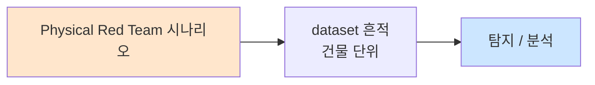

# Week 12: 물리 정보 수집 — OSINT, 덤프스터 다이빙, 숄더 서핑

## 학습 목표
- OSINT(Open Source Intelligence)를 물리 침투에 활용하는 방법을 이해한다
- 덤프스터 다이빙의 기법과 물리 정보 수집 가치를 분석한다
- 숄더 서핑과 시각적 정보 수집 기법을 학습한다
- 현장 정찰(Physical Reconnaissance)의 체계적 방법을 익힌다
- 수집된 정보를 체계적으로 정리하고 활용하는 방법을 실습한다
- 정보 수집에 대한 방어 전략을 수립할 수 있다

## 전제 조건
- Week 01-11 이수
- OSINT 기본 개념 이해
- 웹 브라우저 사용 능력

## 강의 시간 배분 (3시간)

| 시간 | 내용 | 유형 |
|------|------|------|
| 0:00-0:40 | OSINT for Physical Pentest | 강의 |
| 0:40-1:10 | 덤프스터 다이빙과 시각적 정보 수집 | 강의/사례 |
| 1:10-1:20 | 휴식 | - |
| 1:20-2:00 | 현장 정찰 기법 | 강의 |
| 2:00-2:40 | 실습: OSINT 정보 수집 | 실습 |
| 2:40-2:50 | 휴식 | - |
| 2:50-3:20 | 실습: 종합 정보 수집 보고서 | 실습 |
| 3:20-3:40 | 방어 전략 + 퀴즈 + 과제 | 토론/퀴즈 |

---

# Part 1: 물리 정보 수집 이론

## 1.1 OSINT for Physical Penetration Testing

OSINT(오픈소스 정보)는 공개적으로 이용 가능한 정보를 수집하고 분석하는 것으로, 물리 침투의 첫 단계이다.

### 물리 침투를 위한 OSINT 소스

```
OSINT 소스 분류:
│
├── 조직 정보
│   ├── 회사 웹사이트: 주소, 연락처, 조직도
│   ├── 구인 공고: 기술 스택, 보안 시스템 힌트
│   ├── 프레스 릴리스: 사무실 이전, 확장 정보
│   ├── 재무 보고서: 보안 투자 수준
│   └── 특허/논문: 기술 역량
│
├── 위치/건물 정보
│   ├── Google Maps/Earth: 위성 사진, 스트리트뷰
│   ├── 네이버 지도/카카오맵: 로드뷰
│   ├── 건축 허가 문서: 건물 도면
│   ├── 부동산 정보: 층수, 면적
│   └── 소방 검사 기록: 비상구, 스프링클러
│
├── 직원 정보
│   ├── LinkedIn: 직책, 부서, 기술
│   ├── Facebook/Instagram: 사무실 사진, 배지
│   ├── GitHub: 내부 시스템 정보 노출
│   └── 명함: 연락처, 부서 구조
│
├── 기술 정보
│   ├── Shodan/Censys: 노출된 장비
│   ├── DNS 기록: 서브도메인, 메일 서버
│   ├── SSL 인증서: 내부 도메인 정보
│   └── WHOIS: 네트워크 범위
│
└── 물리 보안 정보
    ├── 보안 업체 계약 정보
    ├── CCTV 설치 업체
    ├── 출입 시스템 벤더 (RFID/NFC)
    └── 경비 업체 정보
```

### OSINT 도구

| 도구 | 용도 | 물리 침투 활용 |
|------|------|---------------|
| Google Dorking | 특정 정보 검색 | 건물 도면, 보안 매뉴얼 |
| Shodan | IoT/장비 검색 | IP 카메라, 출입 시스템 |
| theHarvester | 이메일/도메인 수집 | 직원 연락처, 사회공학 |
| Maltego | 관계 분석 | 조직 구조, 연결 관계 |
| Recon-ng | OSINT 프레임워크 | 종합 정보 수집 |
| Google Earth | 위성/3D 지도 | 건물 구조, 접근 경로 |

## 1.2 덤프스터 다이빙 (Dumpster Diving)

덤프스터 다이빙은 대상 조직의 쓰레기통이나 재활용 수거함에서 민감한 정보를 수집하는 물리적 정보 수집 기법이다.

### 수집 가능한 정보

```
덤프스터 다이빙으로 수집 가능한 정보:
│
├── 문서류
│   ├── 조직도, 전화번호부
│   ├── 내부 메모, 회의록
│   ├── 비밀번호가 적힌 포스트잇
│   ├── 고객 정보, 계약서
│   └── 네트워크 구성도, IP 주소 목록
│
├── 전자 매체
│   ├── 파쇄되지 않은 CD/DVD
│   ├── 구형 하드 드라이브 (포맷되지 않은)
│   ├── USB 메모리
│   └── 프린터 토너 카트리지 (내부 메모리)
│
├── 물리 보안 관련
│   ├── 구형 출입 카드/배지
│   ├── 비밀번호 변경 안내문
│   ├── 보안 업체 서신
│   └── 방문자 기록부
│
└── 기타
    ├── 택배 라벨 (부서명, 담당자)
    ├── 명함
    ├── 퇴사자 인사 관련 문서
    └── 벤더/공급업체 정보
```

### 법적 고려사항

```
한국법 관련:
├── 일반 쓰레기: 소유권 포기 간주 가능
├── 개인정보 포함 문서: 개인정보보호법 적용
├── 기업 기밀 문서: 영업비밀보호법 적용
├── 건물 내 수거: 무단 침입에 해당할 수 있음
└── 침투 테스트: 반드시 사전 승인 필요

미국법 참고:
├── California v. Greenwood (1988): 
│   공공장소 쓰레기는 합법적으로 수색 가능
└── 단, 기업 사유지 내 쓰레기통은 다를 수 있음
```

## 1.3 숄더 서핑 (Shoulder Surfing)

```
숄더 서핑: 대상자의 어깨 너머로 정보를 엿보는 기법

수집 대상:
├── PIN 코드: ATM, 출입문 키패드
├── 비밀번호: 로그인 화면
├── 이메일 내용: 노트북 화면
├── 문서 내용: 프린터 출력물
└── 전화 통화: 내부 정보

고급 기법:
├── 쌍안경/망원렌즈: 원거리 관찰
├── 소형 카메라: 녹화
├── 반사면 이용: 유리, 거울
└── 열화상 카메라: 키패드 입력 흔적 (Thermal Attack)

방어:
├── 프라이버시 스크린 필터
├── 화면 자동 잠금
├── PIN 입력 시 가리기
├── 보안 인식 교육
└── 클린 데스크 정책
```

## 1.4 현장 정찰 (Physical Reconnaissance)

```
현장 정찰 체크리스트:
│
├── 외부 관찰
│   ├── 건물 출입구 수와 위치
│   ├── 주차장 구조와 접근 방법
│   ├── CCTV 카메라 위치와 방향
│   ├── 경비원 배치와 순찰 패턴
│   ├── 울타리/담장 높이와 상태
│   ├── 조명 상태 (특히 야간)
│   └── 쓰레기 수거 일정과 위치
│
├── 출입 패턴 관찰
│   ├── 직원 출퇴근 시간
│   ├── 점심시간 출입 패턴
│   ├── 배달/택배 빈도
│   ├── 방문자 등록 절차
│   ├── 흡연 구역 위치 (테일게이팅 기회)
│   └── 비상구 사용 패턴
│
├── 보안 시스템 관찰
│   ├── 출입 카드 시스템 유형 (RFID? 마그네틱?)
│   ├── 키패드 유무 및 위치
│   ├── 생체인식 장치 유무
│   ├── 맨트랩/에어록 유무
│   ├── 경보 시스템 표시
│   └── 보안 업체 스티커/표시
│
└── 무선 환경
    ├── WiFi SSID 목록
    ├── 신호 강도 맵핑
    ├── 블루투스 장치 탐색
    └── 무선 출입 시스템 주파수
```

---

# Part 2: 실습

## 2.1 OSINT 정보 수집

```bash
# attacker VM에서 실행
ssh ccc@10.20.30.201

# OSINT 정보 수집 시뮬레이션
echo "=== OSINT Information Gathering ==="

# 1. DNS 정보 수집
echo "[1] DNS Reconnaissance:"
dig any 10.20.30.80 2>/dev/null
nslookup 10.20.30.80 2>/dev/null
echo ""

# 2. 배너 그래빙
echo "[2] Service Banner Grabbing:"
for host in 10.20.30.1 10.20.30.80 10.20.30.100; do
    echo -n "  $host SSH: "
    echo "" | nc -w 3 $host 22 2>/dev/null | head -1 || echo "N/A"
done
echo ""

# 3. HTTP 헤더 분석 (기술 스택 식별)
echo "[3] HTTP Technology Fingerprinting:"
curl -sI http://10.20.30.80:3000 2>/dev/null | grep -iE "server|x-powered|content-type|set-cookie"
echo ""

# 4. SSL 인증서 정보 (존재하는 경우)
echo "[4] SSL Certificate Info:"
echo | openssl s_client -connect 10.20.30.80:443 2>/dev/null | openssl x509 -text 2>/dev/null | grep -E "Subject:|Issuer:|DNS:" | head -5 || echo "  No SSL service found"
```

## 2.2 Shodan 스타일 장비 검색 시뮬레이션

```bash
# 네트워크 장비 검색 시뮬레이션
cat << 'SHODAN_SIM' > /tmp/device_search_sim.py
#!/usr/bin/env python3
"""
Shodan 스타일 장비 검색 시뮬레이터
네트워크 내 물리 보안 관련 장비 식별
"""
import subprocess
import re

class DeviceSearcher:
    def __init__(self, network="10.20.30.0/24"):
        self.network = network
        self.devices = []
    
    def scan_network(self):
        """네트워크 스캔으로 장비 식별"""
        print("[*] Scanning network for devices...")
        try:
            result = subprocess.run(
                ['nmap', '-sV', '--top-ports', '30', self.network],
                capture_output=True, text=True, timeout=120
            )
            return result.stdout
        except Exception as e:
            return f"Scan error: {e}"
    
    def identify_physical_security(self, scan_result):
        """물리 보안 관련 장비 식별"""
        keywords = {
            'camera': ['rtsp', 'onvif', 'hikvision', 'dahua', 'axis'],
            'access_control': ['hid', 'rfid', 'lenel', 'genetec'],
            'alarm': ['honeywell', 'bosch', 'ademco'],
            'network': ['cisco', 'juniper', 'ubiquiti'],
            'iot': ['mqtt', 'coap', 'zigbee'],
        }
        
        findings = []
        for line in scan_result.split('\n'):
            lower = line.lower()
            for category, kws in keywords.items():
                if any(kw in lower for kw in kws):
                    findings.append((category, line.strip()))
        
        return findings
    
    def generate_osint_report(self, scan_result, findings):
        """OSINT 보고서 생성"""
        print("\n" + "=" * 60)
        print("  Physical Security OSINT Report")
        print("=" * 60)
        
        # 호스트 요약
        hosts = re.findall(r'Nmap scan report for (\S+)', scan_result)
        print(f"\n[Discovered Hosts: {len(hosts)}]")
        for h in hosts:
            print(f"  - {h}")
        
        # 물리 보안 장비
        print(f"\n[Physical Security Related Devices: {len(findings)}]")
        for category, detail in findings:
            print(f"  [{category:15s}] {detail}")
        
        # 서비스 요약
        services = re.findall(r'(\d+/tcp)\s+open\s+(.+)', scan_result)
        print(f"\n[Open Services: {len(services)}]")
        for port, svc in services[:15]:
            print(f"  {port:10s} {svc}")

# 실행
searcher = DeviceSearcher()
scan = searcher.scan_network()
findings = searcher.identify_physical_security(scan)
searcher.generate_osint_report(scan, findings)
SHODAN_SIM

python3 /tmp/device_search_sim.py
```

## 2.3 정보 수집 종합 도구

```bash
# 종합 물리 침투 정보 수집 도구
cat << 'RECON_TOOL' > /tmp/physical_recon.sh
#!/bin/bash
echo "=========================================="
echo " Physical Pentest Reconnaissance Tool"
echo "=========================================="
echo "Target Network: 10.20.30.0/24"
echo "Date: $(date)"
echo ""

# Phase 1: 네트워크 정찰
echo "=== Phase 1: Network Recon ==="
echo "[*] Active hosts:"
nmap -sn 10.20.30.0/24 2>/dev/null | grep "report" | awk '{print "  "$NF}'
echo ""

# Phase 2: 서비스 식별
echo "=== Phase 2: Service Identification ==="
for host in 10.20.30.1 10.20.30.80 10.20.30.100; do
    echo "[*] $host:"
    nmap -sV --top-ports 10 $host 2>/dev/null | grep "open" | sed 's/^/  /'
    echo ""
done

# Phase 3: 물리 보안 장치 스캔
echo "=== Phase 3: Physical Security Devices ==="
echo "[*] Camera/RTSP services:"
nmap -p 554,8554 10.20.30.0/24 2>/dev/null | grep "open" | sed 's/^/  /'
echo ""
echo "[*] IoT/MQTT services:"
nmap -p 1883,8883 10.20.30.0/24 2>/dev/null | grep "open" | sed 's/^/  /'
echo ""

# Phase 4: 정보 종합
echo "=== Phase 4: Intelligence Summary ==="
echo "  Total hosts discovered: $(nmap -sn 10.20.30.0/24 2>/dev/null | grep 'report' | wc -l)"
echo "  SSH services: $(nmap -p 22 10.20.30.0/24 2>/dev/null | grep 'open' | wc -l)"
echo "  HTTP services: $(nmap -p 80,443,3000,8080 10.20.30.0/24 2>/dev/null | grep 'open' | wc -l)"
echo ""
echo "  Report saved: /tmp/physical_recon_report.txt"
RECON_TOOL

bash /tmp/physical_recon.sh | tee /tmp/physical_recon_report.txt
```

## 2.4 클린 데스크 정책 감사

```bash
# 클린 데스크 정책 감사 체크리스트
echo "=== 클린 데스크 정책 감사 ==="
echo ""
echo "[정보 노출 위험 평가]"
echo ""
echo "  === 데스크톱/물리 환경 ==="
echo "  □ 화면에 비밀번호 포스트잇 부착 여부"
echo "  □ 잠금 해제 상태의 무인 컴퓨터"
echo "  □ 책상 위 민감 문서 방치"
echo "  □ 서랍 잠금 상태"
echo "  □ 프린터 출력물 방치"
echo "  □ 화이트보드 내용 (네트워크 구성도 등)"
echo ""
echo "  === 전자적 환경 ==="
echo "  □ 화면 잠금 설정 시간 (권장: 5분 이하)"
echo "  □ 프라이버시 스크린 필터 사용"
echo "  □ 이메일/메신저 알림 내용 노출"
echo "  □ 원격 접속 시 화면 공유 범위"
echo ""
echo "  === 폐기 관리 ==="
echo "  □ 문서 파쇄기 비치 및 사용 여부"
echo "  □ 전자 매체 안전 폐기 절차"
echo "  □ 분리수거함의 민감 문서 여부"
echo "  □ 하드 드라이브/USB 반납 절차"
echo ""
echo "[위험도 평가]"
echo "  비밀번호 노출: [높음]"
echo "  문서 미파쇄:   [높음]"
echo "  화면 미잠금:   [중간]"
echo "  서랍 미잠금:   [중간]"
```

---

## 과제

### 과제 1: OSINT 수집 보고서 (개인)
실습 환경을 대상으로 가능한 모든 OSINT 기법을 활용하여 정보를 수집하고 보고서를 작성하라.

### 과제 2: 클린 데스크 감사 (팀)
가상의 사무실 환경에서 클린 데스크 정책 위반 사례 10가지를 식별하고, 각각의 위험도와 개선 방안을 제시하라.

### 과제 3: 현장 정찰 계획 (개인)
가상 대상 건물에 대한 체계적인 현장 정찰 계획을 수립하라. 관찰 항목, 도구, 일정, 법적 고려사항을 포함하라.

---

## 실제 사례 (WitFoo Precinct 6 — Physical Red Team)

> 출처: WitFoo Precinct 6 Cybersecurity Dataset (Apache 2.0)
> 본 lecture *Physical Red Team* 학습 항목 매칭.

### Physical Red Team 의 dataset 흔적 — "건물 단위"

dataset 의 정상 운영에서 *건물 단위* 신호의 baseline 을 알아두면, *Physical Red Team* 시도 시 발생하는 anomaly 를 정량으로 탐지할 수 있다. 핵심 정량 지표는 — Red Team 작전.



### Case 1: dataset 정량 지표

| 항목 | 값 |
|---|---|
| 핵심 신호 | 건물 단위 |
| 정량 baseline | Red Team 작전 |
| 학습 매핑 | scope + ROE |

**자세한 해석**: scope + ROE. 이 차이를 정량으로 측정해야 *공격 시도와 정상 운영의 구분* 이 가능. 학생이 baseline 숫자를 외워두면 — 운영 환경에서 anomaly 를 즉시 탐지할 수 있다.

### Case 2: 실전 적용 시나리오

| 단계 | dataset 활용 |
|---|---|
| 시도 식별 | 건물 단위 의 spike |
| 정상 vs 이상 | baseline 대비 비율 |
| 룰 작성 | Suricata / Wazuh / Sigma |
| 검증 | dataset 재실행 |

**자세한 해석**: 운영 환경 룰 작성은 — *baseline 측정 → 임계 결정 → 룰 작성 → dataset 검증* 의 4 단계. 한 단계라도 빠지면 false positive 폭증.

### 이 사례에서 학생이 배워야 할 3가지

1. **Physical Red Team = 건물 단위 의 anomaly** — 정량 신호로 탐지.
2. **baseline 숫자 외우기** — Red Team 작전.
3. **4 단계 룰 작성** — 측정 → 임계 → 룰 → 검증.

**학생 액션**: ROE 작성.


---

## 부록: 학습 OSS 도구 매트릭스 (Course16 Physical Pentest — Week 12 OSINT·덤프스터·숄더 서핑·현장 정찰)

> 이 부록은 본문 Part 2 의 4 lab (OSINT 수집 / Shodan 스타일 장비 검색 /
> 정보 수집 종합 / 클린 데스크 감사) 의 모든 시뮬을 *실제 OSS 도구* 시퀀스로
> 매핑한다. 본문은 nmap / dig / nslookup / curl / openssl 등 *공식 단순
> 도구* 위주이지만, 운영 OSINT 는 *전용 framework* (theHarvester /
> recon-ng / spiderfoot / amass / maltego / subfinder / sherlock /
> trufflehog / gowitness 등) 로 자동화 + 정량화한다. 물리 OSINT (덤프스터 /
> 숄더 서핑) 는 OSS 도구가 아닌 *물리 행위* 이지만 — *수집된 사진 / 문서
> 메타* 는 OSS (exiftool / pdfid / 한국 지도 API) 로 자동 분석 가능. 모든
> OSINT 활동은 *공개 정보 한정* — 비공개 / 사유지 / 사생활 침해는 정통망법
> §49 + 통신비밀보호법 §3 + 개인정보보호법 §59 적용.

### lab step → 도구 매핑 표

| step | 본문 위치 | 학습 항목 | 본문 명령 | 핵심 OSS 도구 (실 명령) | 도구 옵션 |
|------|----------|----------|----------|-------------------------|-----------|
| s1 | 2.1 [1] | DNS 정찰 | `dig any / nslookup` | dig / dnsrecon / dnsenum / fierce / amass | `dnsrecon -d example.com -t std` |
| s2 | 2.1 [1] | 서브도메인 enum | (단순) | amass / subfinder / assetfinder / sublist3r | `amass enum -d example.com` |
| s3 | 2.1 [1] | passive DNS | (단순) | securitytrails-cli / dnsdb / waybackurls | `subfinder -d example.com -all` |
| s4 | 2.1 [2] | banner | `nc -w 3 :22` | nmap NSE banner / ssh-audit / amap | `nmap --script banner` |
| s5 | 2.1 [3] | HTTP fingerprint | `curl -sI` | httpx / whatweb / wappalyzer-cli / builtwith | `httpx -title -tech-detect -status-code` |
| s6 | 2.1 [4] | SSL cert | `openssl s_client` | testssl.sh / ssllabs-scan / crt.sh + curl | `curl -s 'https://crt.sh/?q=example.com&output=json'` |
| s7 | 2.2 | Shodan 스타일 | nmap + Python 매칭 | shodan-cli / censys-cli / fofa-cli / zoomeye-cli | `shodan search "title:hikvision"` |
| s8 | 2.3 | 종합 정찰 | bash phase1-4 | spiderfoot / recon-ng / maltego CE | `spiderfoot -s example.com -t IP_ADDRESS,DOMAIN_NAME` |
| s9 | 1.1 직원 | LinkedIn / 이메일 | (개념) | theHarvester / sherlock / linkedin2username / hunter.io | `theHarvester -d example.com -b all` |
| s10 | 1.1 직원 | 사용자명 → 소셜 | (개념) | sherlock / maigret / WhatsMyName | `sherlock alice` |
| s11 | 1.1 기술 | GitHub leak | (개념) | trufflehog / gitleaks / gitrob / git-secrets | `trufflehog github --org=example` |
| s12 | 1.1 위치 | 위성 / 로드뷰 | (개념) | Google Earth / kakaomap-cli / google-static-maps API | (브라우저) |
| s13 | 1.2 | 사진 메타 분석 | (개념) | exiftool / metagoofil / pdfid | `exiftool -GPSPosition photo.jpg` |
| s14 | 1.2 | 회수 문서 OCR | (개념) | tesseract / OCRmyPDF | `tesseract scan.png stdout` |
| s15 | 1.3 | 키패드 thermal | (개념) | OpenCV thermal / FLIR-cli (전용) | (학술 PoC) |
| s16 | 1.4 외부 관찰 | CCTV 위치 + heat map | (개념) | google maps / leaflet + Python / openstreetmap | DIY Folium |
| s17 | 1.4 외부 관찰 | WiFi SSID map | (개념) | kismet (week 06 부록) / wigle.net | `kismet --gpsd` |
| s18 | 정보 정리 | OSINT 보고서 | bash echo | osinx / SpiderFoot HX / Maltego graph export | spiderfoot HTML report |

### OSINT 도구 카테고리 매트릭스

| 카테고리 | 사례 | 대표 도구 (OSS) | 비고 |
|---------|------|----------------|------|
| **Framework — 통합** | spiderfoot 200+ 모듈 | spiderfoot / recon-ng / maltego CE | 자동 multi-source |
| **DNS — 서브도메인** | passive + active | amass / subfinder / assetfinder / sublist3r / findomain | crt.sh + 자체 DNS |
| **DNS — 레코드** | A/MX/NS/TXT enum | dig / dnsrecon / dnsenum / fierce | DNS-only |
| **DNS — passive history** | 과거 IP / 도메인 | securitytrails / dnsdb / passivetotal | API 키 |
| **WHOIS** | 도메인 / IP 소유 | whois / jwhois / ipwhois | 표준 |
| **Web — fingerprint** | 기술 스택 | whatweb / wappalyzer-cli / builtwith / Wapiti | header + body |
| **Web — 스크린샷** | 다수 site 스냅 | gowitness / aquatone / EyeWitness | headless chrome |
| **Web — 디렉터리** | 숨은 endpoint | gobuster / ffuf / dirsearch / wfuzz | 사전 기반 |
| **Web — 백도어 PoC** | (week 11) | nuclei / nikto | template |
| **소셜 — 사용자명** | 다수 사이트 가입 | sherlock / maigret / WhatsMyName / namechk | 400+ 사이트 |
| **소셜 — 이메일** | 도메인 직원 enum | theHarvester / hunter.io / Holehe / EmailHarvester | LinkedIn 통합 |
| **소셜 — LinkedIn** | 직원 → 사용자명 | linkedin2username / scyllastream | OSINT |
| **GitHub — 코드 leak** | API key / secret | trufflehog / gitleaks / gitrob / git-secrets | 정규식 |
| **GitHub — meta** | 직원 / 기술 | github-search / GitMiner | 사용자/repo |
| **Search engine** | dorking 자동 | google-dorking / pagodo / SearchDorks | (rate limit) |
| **Cloud — 노출** | S3 / GCS / Azure | gcs-bucket-brute / cloud_enum / s3scanner | bucket enum |
| **Wayback** | 과거 URL | waybackurls / gau (getallurls) | 시간 여행 |
| **Cred breach** | 노출 cred | dehashed / haveibeenpwned-cli / hashes.org | API 키 |
| **장비 검색 (외부)** | 노출 장비 | shodan-cli / censys-cli / fofa-cli / zoomeye-cli | 윤리 검토 |
| **사진 — 메타** | EXIF / GPS | exiftool / pdfid / metagoofil | 회수 사진 |
| **OCR** | 사진 → 텍스트 | tesseract / OCRmyPDF / paddleocr | 다국어 |
| **지도 / 위치** | 위치 시각화 | folium (Python) / leaflet / openstreetmap | DIY |
| **WiFi 지도** | SSID + RSSI heatmap | kismet --gpsd / wifite + GPS | 차폐 외 자유 |
| **보고서** | OSINT 결과 정리 | spiderfoot HTML / maltego graph / pwndoc / pandoc | export |

### 학생 환경 준비

```bash
# attacker VM — OSINT 통합 도구
sudo apt-get update
sudo apt-get install -y \
   dnsutils dnsrecon dnsenum fierce \
   whois \
   nmap masscan \
   curl wget jq httpie \
   theharvester recon-ng \
   gobuster ffuf dirsearch \
   nikto whatweb \
   nuclei \
   exiftool tesseract-ocr tesseract-ocr-kor \
   ocrmypdf \
   sherlock-project \
   trufflehog \
   python3-pip python3-venv

# spiderfoot
git clone https://github.com/smicallef/spiderfoot /tmp/spiderfoot
cd /tmp/spiderfoot && pip3 install --user -r requirements.txt

# amass / subfinder / assetfinder
go install -v github.com/owasp-amass/amass/v4/...@master
go install -v github.com/projectdiscovery/subfinder/v2/cmd/subfinder@latest
go install -v github.com/tomnomnom/assetfinder@latest

# httpx
go install -v github.com/projectdiscovery/httpx/cmd/httpx@latest

# gowitness (screenshot)
go install -v github.com/sensepost/gowitness@latest

# waybackurls + gau (Wayback)
go install -v github.com/tomnomnom/waybackurls@latest
go install -v github.com/lc/gau/v2/cmd/gau@latest

# linkedin2username / hunter.io
git clone https://github.com/initstring/linkedin2username /tmp/li2u
pip3 install --user holehe maigret

# Shodan / Censys CLI
pip3 install --user shodan censys
echo "export SHODAN_API_KEY=YOUR_KEY" >> ~/.bashrc
echo "export CENSYS_API_ID=YOUR_ID" >> ~/.bashrc

# pdfid / pdf-parser (Didier Stevens)
pip3 install --user pdfid pdf-parser

# OSINT framework (오프라인 reference)
git clone https://github.com/lockfale/osint-framework /tmp/osint-framework

# 검증
amass version 2>&1 | head -1
subfinder -version 2>&1 | head -1
httpx --version 2>&1 | head -1
theHarvester --help 2>&1 | head -1
recon-ng -h 2>&1 | head -3
spiderfoot -h 2>&1 | head -3
sherlock --version 2>&1 | head -1
trufflehog --version 2>&1 | head -1
exiftool -ver
tesseract --version 2>&1 | head -1
```

### 핵심 도구별 상세 사용법

#### 도구 1: amass + subfinder + assetfinder — 서브도메인 통합 enum (s1-s3)

본문 `dig any 10.20.30.80` 의 *완성형*. 도메인 1개 → 수십~수백 서브도메인
+ 각 IP + 통합 OSINT.

```bash
# 1. amass passive (외부 source 만 — 완전 stealth)
amass enum -passive -d example.com -o /tmp/amass-passive.txt
wc -l /tmp/amass-passive.txt    # 보통 50-200 서브도메인

# 2. amass active (자체 DNS brute + ASN expand — 더 발견)
amass enum -active -d example.com -brute -o /tmp/amass-active.txt -src

# 3. subfinder (passive, API 30+ source)
subfinder -d example.com -all -silent -o /tmp/subfinder.txt

# 4. assetfinder (passive 단순)
assetfinder --subs-only example.com > /tmp/assetfinder.txt

# 5. 통합 + 중복 제거
cat /tmp/amass-passive.txt /tmp/subfinder.txt /tmp/assetfinder.txt \
   | sort -u > /tmp/all-subs.txt
wc -l /tmp/all-subs.txt
# 예: 247 서브도메인

# 6. 살아있는 host 만 (httpx)
httpx -l /tmp/all-subs.txt -silent -title -tech-detect -status-code \
   -o /tmp/live-subs.txt -threads 50

# 출력 예:
# https://api.example.com [200] [API Server] [nginx]
# https://admin.example.com [302] [Login] [Apache]
# https://dev.example.com [200] [Dev] [PHP/7.4]

# 7. crt.sh (SSL transparency 로그) 검색
curl -s "https://crt.sh/?q=%.example.com&output=json" | \
   jq -r '.[].name_value' | sort -u | head -20
```

#### 도구 2: theHarvester — 이메일 + 직원 수집 (s9)

본문 *직원 정보 (LinkedIn / Facebook / GitHub)* 의 자동 수집. 100+ 검색
엔진 + LinkedIn / Hunter.io / DuckDuckGo / Google.

```bash
# 1. 모든 source (Google + LinkedIn + Hunter + Bing + ...)
theHarvester -d example.com -b all -l 500 -f /tmp/harvester-report

# 출력 (HTML + JSON + XML 3 형식):
# /tmp/harvester-report.html
# /tmp/harvester-report.json
# /tmp/harvester-report.xml

# 2. 결과 파싱
jq '.emails | length' /tmp/harvester-report.json     # 이메일 수
jq '.hosts | length' /tmp/harvester-report.json      # 발견 host 수
jq '.urls' /tmp/harvester-report.json | head -10

# 3. 단일 source (LinkedIn — API key 없이)
theHarvester -d example.com -b linkedin -l 200

# 4. 사용자명 추출 (이메일 → @ 이전)
jq -r '.emails[]' /tmp/harvester-report.json \
   | awk -F'@' '{print $1}' | sort -u > /tmp/users.txt
wc -l /tmp/users.txt
# 예: 47 사용자명

# 5. linkedin2username — 한 단계 더 (회사명 → username 추정)
cd /tmp/li2u && python3 linkedin2username.py \
   -c "Example Inc" -u "john@example.com" -p 'PASS' \
   --format flast > /tmp/li-users.txt
# 출력: jdoe, asmith, ... (firstname.lastname / flast 형식)
```

> **윤리**: theHarvester / linkedin2username 결과는 *공개 정보 수집*이지만,
> 자동화 결과를 *cred brute / phishing* 에 사용 시 정통망법 §48-49.

#### 도구 3: sherlock / maigret — 사용자명 → 소셜 가입 사이트 (s10)

theHarvester 로 추출한 사용자명을 *수백 사이트* 에 자동 검색 → 가입된
사이트 목록. Red Team 의 *target 프로파일* 작성.

```bash
# 1. sherlock — 단일 사용자명 (400+ 사이트)
sherlock alice
# 출력 (실시간):
# [*] Checking username alice on:
# [+] GitHub: https://github.com/alice
# [+] LinkedIn: https://linkedin.com/in/alice
# [+] Twitter: https://twitter.com/alice
# [+] Reddit: https://reddit.com/user/alice
# [-] Instagram: not found
# [-] Facebook: rate-limited

# 2. 다중 사용자명 (파일)
sherlock --print-found --output /tmp/sherlock-result.txt \
   alice bob charlie david

# 3. JSON 출력 (자동화)
sherlock --json /tmp/sherlock.json alice

# 4. maigret (sherlock 의 강화판 — 2500+ 사이트 + 추가 정보)
maigret alice --html --pdf -fo /tmp/maigret/

# 5. 결과 → 단일 사용자 프로파일 (LinkedIn / GitHub / Twitter 통합)
jq -r 'to_entries[] | select(.value.status.value=="claimed") |
       "\(.key) \(.value.url_user)"' /tmp/sherlock.json
```

#### 도구 4: trufflehog / gitleaks — GitHub credential leak (s11)

본문 *GitHub: 내부 시스템 정보 노출* 의 자동 점검. 회사 GitHub org 의
모든 repo 를 스캔 → API key / password / token / SSH key 발견.

```bash
# 1. trufflehog — 회사 GitHub org 전체 스캔
trufflehog github --org=example-inc --json > /tmp/trufflehog.json

# 출력 예 (JSON):
# {"DetectorName":"AWS","Verified":true,"Raw":"AKIA...",
#  "SourceMetadata":{"Github":{"Repository":"example-inc/web","File":"config/aws.yml","Line":12}}}

# 2. trufflehog — 단일 repo
trufflehog git https://github.com/example-inc/web --json

# 3. gitleaks (대안 — 정규식 더 다양)
git clone https://github.com/example-inc/web /tmp/web && cd /tmp/web
gitleaks detect --source . --report-path /tmp/gitleaks.json --report-format json

# 4. gitleaks — 모든 commit 히스토리 스캔
gitleaks detect --source . --log-opts="--all" --report-path /tmp/gitleaks-all.json

# 5. 통계
jq '.[] | .RuleID' /tmp/trufflehog.json | sort | uniq -c | sort -rn
# 12 AWS_KEY
#  8 SLACK_TOKEN
#  3 PRIVATE_KEY
#  2 STRIPE_API_KEY
```

> **윤리**: 발견된 cred 는 *해당 회사에 24h 내 통보* (responsible disclosure).
> 직접 사용 시 정통망법 §48 위반. 발견 → 통보 → 회수.

#### 도구 5: spiderfoot — 통합 OSINT framework (s8)

200+ 모듈 자동 실행 — 도메인 1개 입력 → 모든 source 자동 매핑 → 그래프
+ HTML 보고서.

```bash
# 1. spiderfoot 시작 (web UI)
cd /tmp/spiderfoot && python3 sf.py -l 0.0.0.0:5001 &
firefox http://localhost:5001
# Web UI 에서 새 scan 생성 → target 입력 → use case 선택 → start

# 2. CLI 모드
python3 sf.py -s example.com \
   -t DOMAIN_NAME,IP_ADDRESS,EMAILADDR,WEBSERVER_BANNER \
   -m sfp_dnsresolve,sfp_subdomain,sfp_ssl,sfp_companyname,sfp_socialprofiles \
   -o /tmp/spiderfoot-result.csv

# 3. 결과 (HTML)
python3 sf.py -s example.com -m all \
   --output csv > /tmp/sf-out.csv

# 4. 흥미로운 발견 — IP / 도메인 / 이메일 / GitHub / 직원 / SSL
csvcut -c 'Type,Data,Source' /tmp/sf-out.csv | csvlook | head -30

# 5. 자동 신뢰도 점수 (spiderfoot 기본)
# - HIGH: 직접 확인 (DNS / SSL / 공식 page)
# - MED: 외부 source (Shodan / VirusTotal)
# - LOW: 추론 / 검색 결과
```

#### 도구 6: recon-ng — 모듈 기반 OSINT (s8 — spiderfoot 대안)

workspace + module 기반. spiderfoot 보다 *수동 제어* 가능 — 학습용.

```bash
# 1. recon-ng 시작
recon-ng

# 2. 새 workspace
[recon-ng][default] > workspaces create example
[recon-ng][example] > 

# 3. target 추가
[recon-ng][example] > db insert domains
domain (TEXT): example.com

# 4. 모듈 검색
[recon-ng][example] > marketplace search
# 100+ 모듈 (recon/* / reporting/* / discovery/*)

# 5. 모듈 설치 + 실행 (예: subdomain 발견)
[recon-ng][example] > marketplace install recon/domains-hosts/hackertarget
[recon-ng][example] > modules load recon/domains-hosts/hackertarget
[recon-ng][example][hackertarget] > options set SOURCE example.com
[recon-ng][example][hackertarget] > run

# 6. 결과 보기
[recon-ng][example] > db query SELECT * FROM hosts

# 7. HTML 보고서 자동 생성
[recon-ng][example] > marketplace install reporting/html
[recon-ng][example] > modules load reporting/html
[recon-ng][example][html] > options set CREATOR Lab
[recon-ng][example][html] > options set CUSTOMER ExampleInc
[recon-ng][example][html] > run
# /root/.recon-ng/workspaces/example/results.html
```

#### 도구 7: shodan / censys CLI — 외부 노출 장비 (s7)

본문 2.2 의 *Shodan 스타일 장비 검색* 의 실 도구. 외부 IP 의 노출 장비
+ 기본 cred + CVE 자동.

```bash
# 1. shodan API 초기화
pip3 install --user shodan
shodan init YOUR_API_KEY

# 2. 검색 — 회사 도메인의 노출 IP
shodan search "hostname:example.com" --fields ip_str,port,product,version

# 3. 검색 — IP 카메라 (회사 IP 범위)
shodan search "net:203.0.113.0/24 product:hikvision"

# 4. 호스트 상세 정보
shodan host 203.0.113.42

# 5. 알려진 CVE 매칭
shodan host 203.0.113.42 | grep -E "CVE-"

# 6. censys — 인증서 검색 (외부 노출 도메인 발견)
censys search 'parsed.names: example.com' --pages 5 \
   --output /tmp/censys-certs.json
jq -r '.parsed.names[]' /tmp/censys-certs.json | sort -u
```

> **윤리**: shodan / censys 결과는 *외부에 이미 노출된* 정보이지만, 그
> 정보를 *exploit / cred brute* 에 사용 시 동의 없으면 정통망법 §48.
> 회사 자체 audit 만 합법.

#### 도구 8: gowitness / aquatone — 다수 site 스크린샷 (s5)

httpx 발견된 수백 site 를 *시각 confirmation* — 어떤 site 가 admin / login
/ default page 인지 한눈에.

```bash
# 1. gowitness — httpx 결과 일괄 스크린샷
httpx -l /tmp/all-subs.txt -silent -mc 200,302,401,403 \
   | awk '{print $1}' > /tmp/live-urls.txt

gowitness file -f /tmp/live-urls.txt -P /tmp/screenshots/
# 결과: /tmp/screenshots/<host>.png

# 2. gowitness 의 web report
gowitness report serve -A 0.0.0.0 -P /tmp/screenshots/
# → http://localhost:7171

# 3. 자주 발견되는 흥미로운 페이지 keyword
ls /tmp/screenshots/*.png | wc -l
# 예: 247 개

# 4. 자동 분류 (login / admin / default page)
for f in /tmp/screenshots/*.png; do
    text=$(tesseract "$f" stdout 2>/dev/null)
    case "$text" in
        *Login*|*Sign*in*) echo "LOGIN: $f" ;;
        *admin*|*Admin*)   echo "ADMIN: $f" ;;
        *default*|*welcome*) echo "DEFAULT: $f" ;;
    esac
done | head -20
```

#### 도구 9: exiftool — 회수 사진 메타 분석 (s13)

덤프스터 / 회의실 회수 사진의 EXIF 메타 (GPS / 시각 / 카메라 모델 / 사용자
이름) 자동 추출.

```bash
# 1. 단일 사진
exiftool /forensic/recovered.jpg

# 출력 예:
# File Modification Date/Time : 2026-04-15 14:23:02
# Camera Model Name           : iPhone 15 Pro
# GPS Position                : 37 deg 30' 12.34" N, 127 deg 1' 45.67" E
# Software                    : iOS 18.2
# Owner Name                  : alice@example.com

# 2. 디렉토리 전체 (재귀)
exiftool -r -GPSPosition -DateTimeOriginal -OwnerName \
   /forensic/ > /tmp/exif-meta.txt

# 3. GPS → 지도 시각화 (Folium Python)
python3 << 'PY'
import folium, exiftool
files = ['/forensic/recovered.jpg', '/forensic/recovered2.jpg']
m = folium.Map(location=[37.5, 127.0], zoom_start=13)
with exiftool.ExifTool() as et:
    for f in files:
        meta = et.get_metadata(f)
        if 'EXIF:GPSLatitude' in meta:
            lat = meta['EXIF:GPSLatitude']
            lon = meta['EXIF:GPSLongitude']
            folium.Marker([lat, lon], popup=f).add_to(m)
m.save('/tmp/photo-locations.html')
PY
firefox /tmp/photo-locations.html

# 4. 메타 *제거* (자기 사진 — 외부 공유 전 정보 보호)
exiftool -all= /forensic/recovered.jpg
```

#### 도구 10: tesseract OCR — 회수 문서 자동 텍스트 화 (s14)

종이 문서 / 화이트보드 사진 → 텍스트. 다국어 지원 (한국어 포함).

```bash
# 1. 한국어 + 영어 OCR (회수 문서 사진)
tesseract /forensic/whiteboard.jpg /tmp/wb-text -l kor+eng
cat /tmp/wb-text.txt
# 예:
# 네트워크 구성도
# 외부방화벽: 203.0.113.1
# 내부서버: 10.20.30.80
# DB: 10.20.30.100 (admin / Welcome2026!)

# 2. PDF (스캔 문서)
ocrmypdf --language kor+eng /forensic/scan.pdf /tmp/scan-ocr.pdf
pdftotext /tmp/scan-ocr.pdf /tmp/scan-text.txt

# 3. 자동 *비밀번호 / IP / 이메일* 추출
grep -oE "([0-9]{1,3}\.){3}[0-9]{1,3}|[a-zA-Z0-9_.+-]+@[a-zA-Z0-9-]+\.[a-zA-Z0-9-.]+|password.*" /tmp/wb-text.txt
```

### 종합 OSINT 흐름 (정찰 → 통합 → 보고) 실 명령 시퀀스

```bash
#!/bin/bash
# osint-flow.sh — 회사 도메인 1개 → 통합 OSINT 30분 시퀀스
set -e
TARGET=${1:-example.com}
LOG=/tmp/osint-$(date +%Y%m%d-%H%M%S).log
mkdir -p /tmp/osint-$TARGET

# 1. 서브도메인 통합 (passive)
echo "===== [1] Subdomain (passive) =====" | tee -a $LOG
amass enum -passive -d $TARGET -o /tmp/osint-$TARGET/amass.txt
subfinder -d $TARGET -all -silent -o /tmp/osint-$TARGET/subfinder.txt
assetfinder --subs-only $TARGET > /tmp/osint-$TARGET/assetfinder.txt
cat /tmp/osint-$TARGET/{amass,subfinder,assetfinder}.txt \
   | sort -u > /tmp/osint-$TARGET/all-subs.txt
wc -l /tmp/osint-$TARGET/all-subs.txt | tee -a $LOG

# 2. 살아있는 host (httpx)
echo "===== [2] Live host =====" | tee -a $LOG
httpx -l /tmp/osint-$TARGET/all-subs.txt -silent \
   -mc 200,201,301,302,401,403 \
   -title -tech-detect -status-code \
   -o /tmp/osint-$TARGET/live.txt -threads 50

# 3. 스크린샷 (gowitness)
echo "===== [3] Screenshots =====" | tee -a $LOG
awk '{print $1}' /tmp/osint-$TARGET/live.txt \
   > /tmp/osint-$TARGET/urls.txt
gowitness file -f /tmp/osint-$TARGET/urls.txt \
   -P /tmp/osint-$TARGET/shots/ 2>&1 | tee -a $LOG

# 4. 직원 / 이메일 (theHarvester)
echo "===== [4] Employees =====" | tee -a $LOG
theHarvester -d $TARGET -b all -l 500 \
   -f /tmp/osint-$TARGET/harvester 2>&1 | tee -a $LOG

# 5. GitHub credential leak (trufflehog)
echo "===== [5] GitHub leaks =====" | tee -a $LOG
ORG=${TARGET%.*}
trufflehog github --org=$ORG --json \
   > /tmp/osint-$TARGET/trufflehog.json 2>&1 || true

# 6. 사용자명 → 소셜 (sherlock)
echo "===== [6] Sherlock (top 5 users) =====" | tee -a $LOG
jq -r '.emails[]' /tmp/osint-$TARGET/harvester.json \
   | awk -F@ '{print $1}' | sort -u | head -5 \
   | while read u; do
       sherlock --print-found --json /tmp/osint-$TARGET/sherlock-$u.json $u
   done

# 7. 외부 노출 장비 (shodan — API key 필요)
echo "===== [7] Shodan =====" | tee -a $LOG
shodan search "hostname:$TARGET" \
   --fields ip_str,port,product,version \
   > /tmp/osint-$TARGET/shodan.txt 2>&1 || echo "API key 필요"

# 8. spiderfoot (전체 통합)
echo "===== [8] Spiderfoot =====" | tee -a $LOG
cd /tmp/spiderfoot && python3 sf.py -s $TARGET -m all \
   -o csv > /tmp/osint-$TARGET/spiderfoot.csv 2>&1 &
SF_PID=$!
sleep 600     # 10분 후 종료
kill $SF_PID 2>/dev/null

# 9. 보고서 종합
echo "===== [9] Report =====" | tee -a $LOG
cat << REP > /tmp/osint-$TARGET/REPORT.md
# OSINT 보고서 — $TARGET

| 항목 | 수치 |
|------|------|
| 서브도메인 (전체) | $(wc -l < /tmp/osint-$TARGET/all-subs.txt) |
| 살아있는 host | $(wc -l < /tmp/osint-$TARGET/live.txt) |
| 스크린샷 | $(ls /tmp/osint-$TARGET/shots/*.png 2>/dev/null | wc -l) |
| 발견 이메일 | $(jq '.emails | length' /tmp/osint-$TARGET/harvester.json 2>/dev/null) |
| GitHub leak | $(jq '. | length' /tmp/osint-$TARGET/trufflehog.json 2>/dev/null) |
| Shodan 발견 | $(wc -l < /tmp/osint-$TARGET/shodan.txt 2>/dev/null) |

상세: /tmp/osint-$TARGET/
REP

cat /tmp/osint-$TARGET/REPORT.md | tee -a $LOG
```

### 물리 정보 수집 자동화 (덤프스터 + 숄더 — 회수 후 자동 분석)

물리 *수집 행위* 자체는 OSS 가 아니지만 — 회수된 사진 / 문서 / USB 의
*자동 분석* 은 OSS:

```bash
# 회수된 자료 디렉토리 표준 구조
mkdir -p /forensic/{photos,documents,usb,whiteboard,recovered}

# 1. 모든 사진 EXIF 메타 자동
exiftool -r -j /forensic/photos > /tmp/photos-exif.json
jq '[.[] | {file: .SourceFile, gps: .GPSPosition, time: .DateTimeOriginal,
            owner: .OwnerName}]' /tmp/photos-exif.json

# 2. PDF / 문서 OCR
for pdf in /forensic/documents/*.pdf; do
    ocrmypdf --language kor+eng --skip-text "$pdf" \
       "/tmp/ocr-$(basename $pdf)"
    pdftotext "/tmp/ocr-$(basename $pdf)" \
       "/tmp/text-$(basename $pdf .pdf).txt"
done

# 3. 화이트보드 사진 → 텍스트
for img in /forensic/whiteboard/*.jpg; do
    tesseract "$img" "/tmp/wb-$(basename $img .jpg)" -l kor+eng
done
cat /tmp/wb-*.txt | head -30

# 4. 회수 USB — 파일 / 삭제 파일 복원
sudo dd if=/dev/sdb1 of=/forensic/usb-image.dd bs=1M
foremost -i /forensic/usb-image.dd -o /forensic/usb-recovered/
photorec /forensic/usb-image.dd

# 5. 자동 비밀번호 / IP / 이메일 grep
grep -roE \
   "([0-9]{1,3}\.){3}[0-9]{1,3}|[a-zA-Z0-9_.+-]+@[a-zA-Z0-9-]+\.[a-zA-Z0-9-.]+|(?i)password[: =][^ ]+" \
   /tmp/wb-*.txt /tmp/text-*.txt

# 6. 사진 GPS → 지도 (Folium 자동)
python3 -c "
import folium, json
m = folium.Map(location=[37.5, 127.0], zoom_start=13)
with open('/tmp/photos-exif.json') as f:
    data = json.load(f)
for d in data:
    if 'GPSLatitude' in d:
        folium.Marker([d['GPSLatitude'], d['GPSLongitude']],
                      popup=d['SourceFile']).add_to(m)
m.save('/tmp/photo-map.html')
"
```

### 클린 데스크 audit 자동화 (방어 측, 본문 2.4 보강)

본문 2.4 의 체크리스트를 *카메라 + AI* 로 자동 audit. lab 방어 시연.

```bash
# /tmp/clean-desk-audit.py — 사무실 사진을 받아 위반 사례 자동 감지
# (필요: OpenCV + 사전 학습된 YOLO model)
python3 << 'PY'
import cv2
img = cv2.imread('/forensic/desk1.jpg')

# 1. 화면에 비밀번호 포스트잇 (yellow rectangle 검출)
# (학습용 — 노란색 영역 + edge detect)
hsv = cv2.cvtColor(img, cv2.COLOR_BGR2HSV)
mask = cv2.inRange(hsv, (20, 100, 100), (40, 255, 255))
contours, _ = cv2.findContours(mask, cv2.RETR_EXTERNAL,
                                cv2.CHAIN_APPROX_SIMPLE)
post_its = [c for c in contours if cv2.contourArea(c) > 500]
print(f"Yellow post-it candidates: {len(post_its)}")

# 2. 화면 잠금 여부 (login screen 인지 working app 인지)
# (사전 학습된 YOLO 또는 단순 keyword OCR)
cropped_screen = img[100:500, 200:800]
import pytesseract
text = pytesseract.image_to_string(cropped_screen, lang='kor+eng')
if any(k in text.lower() for k in ['login', '로그인', 'sign in', 'enter password']):
    print("[OK] 화면 잠금 상태")
else:
    print("[VIOL] 화면 잠금 안 됨")

# 3. 책상 위 종이 문서 (간단 edge / texture)
gray = cv2.cvtColor(img, cv2.COLOR_BGR2GRAY)
edges = cv2.Canny(gray, 100, 200)
paper_density = (edges > 0).mean()
if paper_density > 0.15:
    print(f"[VIOL] 책상 위 문서 추정 density={paper_density:.2f}")
PY
```

### 도구 비교표 (역할별 / 학습 시간 / 윤리)

| 도구 | 역할 | 학습 시간 | 윤리 | lab 적합성 |
|------|------|-----------|------|-----------|
| amass | 서브도메인 (active+passive) | 1시간 | OK | ★★★★★ |
| subfinder | 서브도메인 passive | 30분 | OK | ★★★★★ |
| assetfinder | 서브도메인 단순 | 15분 | OK | ★★★★ |
| dnsrecon | DNS enum | 30분 | OK | ★★★★ |
| httpx | live host + tech | 30분 | OK | ★★★★★ |
| whatweb | tech fingerprint | 30분 | OK | ★★★★ |
| nuclei (web) | CVE 자동 | 30분 | OK | ★★★★★ |
| theHarvester | 이메일 / 직원 | 1시간 | OK (공개) | ★★★★ |
| sherlock | 사용자명 → 소셜 | 30분 | OK (공개) | ★★★★★ |
| maigret | sherlock 강화 | 30분 | OK | ★★★ |
| linkedin2username | LinkedIn → user | 30분 | 공개 데이터 | ★★★ |
| trufflehog | GitHub leak | 1시간 | OK + 통보 의무 | ★★★★★ |
| gitleaks | GitHub leak (정규식) | 1시간 | OK + 통보 | ★★★★ |
| spiderfoot | 통합 OSINT | 4시간 | OK | ★★★★ |
| recon-ng | 모듈 OSINT | 2시간 | OK | ★★★ |
| shodan-cli | 외부 노출 장비 | 30분 | API + 윤리 | ★★★ |
| censys-cli | 외부 cert | 30분 | API | ★★★ |
| gowitness | 다수 스크린샷 | 30분 | OK | ★★★★ |
| aquatone | 스크린샷 + 클러스터 | 1시간 | OK | ★★★ |
| exiftool | 사진 메타 | 30분 | OK (회수) | ★★★★★ |
| tesseract | OCR | 30분 | OK | ★★★★★ |
| ocrmypdf | PDF OCR | 30분 | OK | ★★★★ |
| Folium (Python) | 지도 시각화 | 1시간 | OK | ★★★★ |
| OpenCV (clean desk) | 영상 audit | 4시간 | OK (자기 사무실) | ★★★ |

### 윤리 / 법적 경계

| 행위 | 한국 법 | 미국 법 | 학습 환경 정당화 조건 |
|------|--------|---------|----------------------|
| amass / subfinder (자기 도메인) | 합법 | 합법 | 자기 자산 |
| amass / subfinder (외부 도메인) | 합법 (passive) | 합법 (passive) | 공개 정보 |
| theHarvester 자동 수집 | 합법 (공개) | 합법 | 공개 정보 |
| sherlock 사용자명 검색 | 합법 | 합법 | 공개 |
| trufflehog 자기 org | 합법 | 합법 | 자기 자산 |
| trufflehog 외부 org | 합법 (수집만) — *exploit 시 §48* | 합법 | 발견 → 통보 |
| 발견된 cred 로 외부 로그인 | 정통망법 §48 | CFAA | **절대 금지** |
| shodan 외부 IP 검색 | 합법 (공개) | 합법 | 공개 |
| shodan 결과로 exploit | 정통망법 §48 | CFAA | 자기 자산 한정 |
| 덤프스터 다이빙 (공공 거리) | 회색 — 사유지 진입 시 §319 | greenwood ruling | 사유지 외 |
| 덤프스터 다이빙 (회사 부지) | 형법 §319 (주거침입) | 다양 | 동의 + 책임자 |
| 회수 문서 분석 (lab) | 합법 (lab 한정) | 합법 | 모의 자료 |
| 외부 직원 사진 분석 | 개인정보보호법 §15 | 다양 | 동의 |
| 화이트보드 사진 (회의실) | 개인정보보호법 + 영업비밀 | 다양 | 동의 |
| 숄더 서핑 (자기 화면) | 합법 | 합법 | 자기 자산 |
| 숄더 서핑 (타인 화면) | 정통망법 §49 + 형법 도청 | Wiretap | **절대 금지** |
| LinkedIn 직원 정보 수집 | 합법 (공개) — 이용 약관 검토 | 합법 — 이용 약관 | LinkedIn ToS |

### 학생 자가 점검 체크리스트

- [ ] amass + subfinder + assetfinder 통합 결과로 example.com 의 50+
      서브도메인 발견 1회
- [ ] httpx 로 live host + tech stack 추출
- [ ] gowitness 로 100+ site 스크린샷 일괄 생성
- [ ] theHarvester 로 도메인 1개의 이메일 / host / URL 통합 결과
- [ ] sherlock 으로 사용자명 1개의 가입 사이트 자동 발견
- [ ] trufflehog 로 GitHub repo 1개의 credential leak 1건 식별 (테스트 repo)
- [ ] spiderfoot HTML report 생성 + 흥미로운 발견 3건 highlight
- [ ] shodan-cli 로 자기 IP / 도메인의 외부 노출 항목 확인
- [ ] exiftool 로 자기 스마트폰 사진의 GPS / 시각 / 모델 메타 추출
- [ ] tesseract 로 한국어 사진 → 텍스트 변환 1회
- [ ] Folium 으로 사진 GPS 지도 시각화 1회
- [ ] 본 부록 모든 명령에 대해 "외부 직원 / 외부 회사 적용 시 위반 법조항"
      답변 가능 (정통망법 §48-49 / 개인정보보호법 §15 / LinkedIn ToS)

### 운영 환경 적용 시 주의

1. **공개 정보만 수집** — amass / subfinder / theHarvester 모두 *공개*
   source 한정. 비공개 / 사유지 / 사생활 침해 자동화 금지.
2. **발견된 cred 통보 의무** — trufflehog 결과는 *24h 내 회사에 통보*
   (responsible disclosure). 직접 사용 시 정통망법 §48.
3. **shodan / censys 결과 사용** — 외부 노출 장비 발견 시 *exploit 금지*.
   회사 자체 audit 만 합법. 발견 → 회사 SOC 통보.
4. **개인정보 수집 한계** — theHarvester / sherlock 은 *공개 데이터* 수집
   이지만, 결과 통합 시 개인정보보호법 §15 적용 가능. 익명화 필수.
5. **LinkedIn ToS** — linkedin2username 사용 시 LinkedIn 이용 약관 §8.2
   (자동 scraping 금지) 위반 가능. 학습 한정 + 결과 외부 공유 금지.
6. **물리 OSINT 행위** — 덤프스터 / 숄더 서핑 / 현장 정찰 모두 *서면
   동의 + 책임자 입회* 필수. 동의 없는 사유지 진입은 형법 §319.
7. **회수 자료 보호** — 회수 사진 / 문서 / USB 분석 결과는 *24h 내 lab
   폐기* 또는 *암호화 봉인 + 책임자 서명*.

> 본 부록은 *학습 시연용 OSS 시퀀스* 이다. 실제 OSINT / 물리 정찰은 RoE
> + 위촉 계약 + 책임자 + 개인정보 검토 4 요건 충족 시에만 수행한다. 외부
> 직원 / 외부 회사 OSINT 자동화 결과를 비합법 목적으로 사용 시 형사 처벌
> 대상 (정통망법 §48-49 / 개인정보보호법 §59).

---
