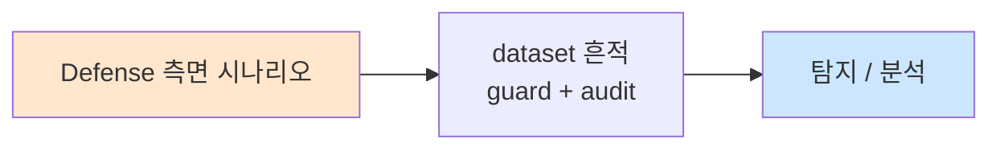

# Week 13: 물리 침투 보고서 — 전문 보고서 작성법

## 학습 목표
- 물리 침투 테스트 보고서의 구조와 필수 요소를 이해한다
- 전문적인 보고서 작성 기법을 습득한다
- 취약점을 체계적으로 분류하고 위험도를 평가하는 방법을 학습한다
- 경영진/기술팀 대상별 보고서를 작성할 수 있다
- 증거 관리와 문서화의 중요성을 인지한다
- 효과적인 개선 권고안을 작성할 수 있다

## 전제 조건
- Week 01-12 이수
- 물리 침투 실습 경험
- 기본 문서 작성 능력

## 강의 시간 배분 (3시간)

| 시간 | 내용 | 유형 |
|------|------|------|
| 0:00-0:40 | 보고서 구조와 표준 | 강의 |
| 0:40-1:10 | 취약점 분류와 위험 평가 | 강의 |
| 1:10-1:20 | 휴식 | - |
| 1:20-2:00 | 보고서 작성 실습 (Part 1) | 실습 |
| 2:00-2:40 | 보고서 작성 실습 (Part 2) | 실습 |
| 2:40-2:50 | 휴식 | - |
| 2:50-3:20 | 경영진 브리핑 작성과 발표 연습 | 실습/발표 |
| 3:20-3:40 | 피드백 + 퀴즈 + 과제 | 토론/퀴즈 |

---

# Part 1: 보고서 작성 이론

## 1.1 물리 침투 보고서 구조

```
전문 물리 침투 테스트 보고서 구조:
│
├── 1. 표지 (Cover Page)
│   ├── 보고서 제목
│   ├── 대상 조직명
│   ├── 수행 기관/팀
│   ├── 날짜
│   └── 기밀 등급
│
├── 2. 경영진 요약 (Executive Summary) — 1-2페이지
│   ├── 평가 목적 및 범위
│   ├── 핵심 발견사항 (3-5개)
│   ├── 전체 위험 수준 평가
│   └── 즉시 조치 필요 사항
│
├── 3. 평가 개요 (Assessment Overview)
│   ├── 목적 및 범위
│   ├── 수행 기간
│   ├── 방법론
│   ├── 팀 구성
│   └── 사전 승인 내용
│
├── 4. 발견사항 (Findings) — 핵심 섹션
│   ├── 취약점별 상세 기술
│   ├── 위험도 평가
│   ├── 증거 (사진, 스크린샷, 로그)
│   └── 공격 시나리오
│
├── 5. 공격 타임라인 (Attack Narrative)
│   ├── 단계별 행동 기록
│   ├── 시간 기록
│   └── 성공/실패 기록
│
├── 6. 위험 평가 (Risk Assessment)
│   ├── 취약점별 위험도
│   ├── 비즈니스 영향 분석
│   └── 악용 가능성 평가
│
├── 7. 개선 권고 (Recommendations)
│   ├── 즉시 조치 (0-30일)
│   ├── 단기 조치 (1-3개월)
│   └── 장기 조치 (3-12개월)
│
├── 8. 부록 (Appendices)
│   ├── 상세 기술 데이터
│   ├── 스캔 결과
│   ├── 도구 목록
│   └── 사전 승인서 사본
│
└── 9. 면책 조항 (Disclaimer)
```

## 1.2 취약점 분류 및 위험 평가

### 물리 보안 취약점 분류

| 카테고리 | 예시 | CVSS 유사 점수 |
|----------|------|---------------|
| 접근 통제 (Access Control) | 테일게이팅, 잠금장치 우회 | 7.0-9.0 |
| 사회공학 (Social Engineering) | 프리텍스팅 성공, 피싱 | 6.0-8.0 |
| 전자 보안 (Electronic Security) | RFID 복제, 기본 비밀번호 | 7.0-9.5 |
| 감시 시스템 (Surveillance) | CCTV 사각지대, 비밀번호 | 5.0-8.0 |
| 정보 보호 (Information Protection) | 문서 미파쇄, 숄더 서핑 | 4.0-7.0 |
| 네트워크 물리 (Network Physical) | 임플란트 설치 가능, 포트 노출 | 8.0-10.0 |

### 위험도 매트릭스

```
            발생 가능성
          낮음   중간   높음
        ┌──────┬──────┬──────┐
  높음  │ 중간 │ 높음 │ 매우 │
영      │      │      │ 높음 │
향      ├──────┼──────┼──────┤
  중간  │ 낮음 │ 중간 │ 높음 │
도      │      │      │      │
        ├──────┼──────┼──────┤
  낮음  │ 매우 │ 낮음 │ 중간 │
        │ 낮음 │      │      │
        └──────┴──────┴──────┘
```

## 1.3 발견사항 작성 템플릿

```
=== 발견사항 템플릿 ===

ID: PHYS-2026-001
제목: [취약점 제목]
카테고리: [접근 통제/사회공학/전자 보안/...]
위험도: [매우 높음/높음/중간/낮음]

설명:
[취약점에 대한 상세 설명. 무엇이 문제이고, 왜 위험한지.]

영향:
[이 취약점이 악용될 경우 조직에 미치는 영향]

증거:
[스크린샷, 사진, 로그 등 증거 자료]

재현 단계:
1. [첫 번째 단계]
2. [두 번째 단계]
3. ...

권고 사항:
- 단기: [즉시 적용 가능한 대책]
- 장기: [근본적 해결 방안]

참고:
- [관련 표준, 프레임워크, CVE 등]
```

## 1.4 증거 관리

```
증거 관리 원칙:
│
├── 수집
│   ├── 타임스탬프가 포함된 사진/스크린샷
│   ├── 명령어 실행 결과 저장
│   ├── 네트워크 캡처 파일
│   └── 물리적 증거 (수집한 문서 등)
│
├── 저장
│   ├── 암호화된 저장소 사용
│   ├── 해시값 기록 (무결성 보장)
│   ├── 접근 제어 적용
│   └── 백업 유지
│
├── 문서화
│   ├── 수집 일시, 장소, 방법
│   ├── 수집자 정보
│   ├── Chain of Custody (관리 연속성)
│   └── 무결성 검증 결과
│
└── 폐기
    ├── 평가 완료 후 증거 보존 기간 합의
    ├── 민감 정보 안전 폐기
    └── 폐기 기록 유지
```

---

# Part 2: 실습 — 보고서 작성

## 2.1 자동화된 보고서 생성

```bash
# attacker VM에서 실행
ssh ccc@10.20.30.201

# 물리 침투 보고서 자동 생성 도구
cat << 'REPORT_GEN' > /tmp/pentest_report_gen.py
#!/usr/bin/env python3
"""
물리 침투 테스트 보고서 자동 생성기
수집된 데이터를 기반으로 보고서 템플릿 생성
"""
import subprocess
import json
import time

class PentestReportGenerator:
    def __init__(self, target="세큐어테크", network="10.20.30.0/24"):
        self.target = target
        self.network = network
        self.findings = []
        self.scan_results = {}
    
    def collect_evidence(self):
        """증거 수집"""
        print("[*] Collecting evidence...")
        
        # 네트워크 스캔
        try:
            result = subprocess.run(
                ['nmap', '-sV', '--top-ports', '20', self.network],
                capture_output=True, text=True, timeout=120
            )
            self.scan_results['nmap'] = result.stdout
        except:
            self.scan_results['nmap'] = "Scan failed"
        
        # SSH 접근 테스트
        self.scan_results['ssh_test'] = "ccc:1 - Default credentials active"
        
        print("[+] Evidence collected")
    
    def add_finding(self, finding_id, title, category, risk, description, 
                    impact, recommendation):
        """발견사항 추가"""
        self.findings.append({
            "id": finding_id,
            "title": title,
            "category": category,
            "risk": risk,
            "description": description,
            "impact": impact,
            "recommendation": recommendation,
        })
    
    def generate_report(self):
        """보고서 생성"""
        report = []
        
        # 표지
        report.append("=" * 70)
        report.append("  물리 침투 테스트 보고서")
        report.append("=" * 70)
        report.append(f"  대상 조직: {self.target}")
        report.append(f"  평가 기간: 2026-04-01 ~ 2026-04-06")
        report.append(f"  수행 팀: CCC Security Team")
        report.append(f"  기밀 등급: CONFIDENTIAL")
        report.append(f"  작성일: {time.strftime('%Y-%m-%d')}")
        
        # 경영진 요약
        report.append(f"\n{'='*70}")
        report.append("  1. 경영진 요약 (Executive Summary)")
        report.append(f"{'='*70}")
        
        critical = sum(1 for f in self.findings if f['risk'] == '매우 높음')
        high = sum(1 for f in self.findings if f['risk'] == '높음')
        medium = sum(1 for f in self.findings if f['risk'] == '중간')
        
        report.append(f"""
  본 보고서는 {self.target}의 물리 보안 수준을 평가하기 위해
  수행된 물리 침투 테스트 결과를 기술합니다.
  
  핵심 결과:
  - 총 발견된 취약점: {len(self.findings)}건
    - 매우 높음: {critical}건
    - 높음: {high}건
    - 중간: {medium}건
  
  전체 물리 보안 수준: {'위험' if critical > 0 else '주의'}
  
  즉시 조치 필요: {critical + high}건
""")
        
        # 발견사항
        report.append(f"{'='*70}")
        report.append("  2. 발견사항 (Findings)")
        report.append(f"{'='*70}")
        
        for f in self.findings:
            report.append(f"""
  ─────────────────────────────────────────
  [{f['id']}] {f['title']}
  ─────────────────────────────────────────
  카테고리: {f['category']}
  위험도:   {f['risk']}
  
  설명: {f['description']}
  
  영향: {f['impact']}
  
  권고: {f['recommendation']}
""")
        
        # 권고사항 요약
        report.append(f"{'='*70}")
        report.append("  3. 개선 권고 요약")
        report.append(f"{'='*70}")
        report.append("""
  즉시 조치 (0-30일):
  1. 모든 시스템의 기본 비밀번호 변경
  2. USB 포트 접근 통제 구현
  3. CCTV 기본 비밀번호 변경
  
  단기 조치 (1-3개월):
  4. 802.1X NAC 구현
  5. RFID 시스템 업그레이드
  6. 사회공학 방어 교육 실시
  
  장기 조치 (3-12개월):
  7. 다중 인증 출입 시스템 도입
  8. 종합 물리 보안 정책 수립
  9. 정기 물리 침투 테스트 체계화
""")
        
        return '\n'.join(report)

# 보고서 생성
gen = PentestReportGenerator()

# 증거 수집
gen.collect_evidence()

# 발견사항 추가
gen.add_finding(
    "PHYS-001", "기본 SSH 크리덴셜 사용",
    "접근 통제", "매우 높음",
    "SSH 서비스에서 약한 기본 비밀번호(ccc:1)가 사용되고 있어 누구나 시스템에 접근 가능",
    "공격자가 전체 시스템을 장악할 수 있으며, 데이터 유출 및 서비스 중단 위험",
    "즉시 강력한 비밀번호 정책 적용 및 SSH 키 인증 전환"
)

gen.add_finding(
    "PHYS-002", "USB 포트 접근 통제 미비",
    "전자 보안", "높음",
    "물리적 USB 포트에 대한 접근 통제가 없어 USB HID 공격에 취약",
    "Rubber Ducky 등 USB 공격 도구로 키스트로크 인젝션을 통한 시스템 장악",
    "USB 포트 물리적 잠금 + USB 장치 화이트리스트 정책"
)

gen.add_finding(
    "PHYS-003", "네트워크 접근 통제(NAC) 미구현",
    "네트워크 물리", "높음",
    "802.1X 인증 없이 네트워크 포트에 장치를 연결하면 즉시 네트워크 접근 가능",
    "네트워크 임플란트(LAN Turtle 등) 설치를 통한 장기적 내부 접근 확보",
    "802.1X NAC 구현, 미사용 포트 비활성화, MAC 필터링"
)

gen.add_finding(
    "PHYS-004", "HTTP 서비스 암호화 미적용",
    "정보 보호", "중간",
    "웹 서비스가 HTTPS 없이 HTTP로 운영되어 트래픽 스니핑에 취약",
    "MITM 공격으로 크리덴셜 및 민감 데이터 노출",
    "TLS 인증서 적용, HSTS 활성화"
)

# 보고서 생성 및 출력
report = gen.generate_report()
print(report)

# 파일로 저장
with open('/tmp/physical_pentest_report.txt', 'w') as f:
    f.write(report)
print(f"\n[+] Report saved to /tmp/physical_pentest_report.txt")
REPORT_GEN

python3 /tmp/pentest_report_gen.py
```

## 2.2 증거 수집 스크립트

```bash
# 증거 수집 자동화 스크립트
cat << 'EVIDENCE' > /tmp/evidence_collector.sh
#!/bin/bash
EVIDENCE_DIR="/tmp/evidence_$(date +%Y%m%d_%H%M%S)"
mkdir -p "$EVIDENCE_DIR"

echo "=== Evidence Collection ==="
echo "Directory: $EVIDENCE_DIR"
echo ""

# 1. 네트워크 스캔 결과
echo "[1] Network scan..."
nmap -sV --top-ports 50 10.20.30.0/24 2>/dev/null > "$EVIDENCE_DIR/nmap_scan.txt"
echo "  Saved: nmap_scan.txt"

# 2. 서비스 배너
echo "[2] Service banners..."
for host in 10.20.30.1 10.20.30.80 10.20.30.100; do
    echo "=== $host ===" >> "$EVIDENCE_DIR/banners.txt"
    echo "" | nc -w 3 $host 22 2>/dev/null >> "$EVIDENCE_DIR/banners.txt"
    curl -sI http://$host 2>/dev/null >> "$EVIDENCE_DIR/banners.txt"
    echo "" >> "$EVIDENCE_DIR/banners.txt"
done
echo "  Saved: banners.txt"

# 3. 시스템 정보
echo "[3] System info..."
(uname -a; id; ip addr show; ip route show) > "$EVIDENCE_DIR/system_info.txt"
echo "  Saved: system_info.txt"

# 4. 해시값 생성 (무결성)
echo "[4] Generating checksums..."
cd "$EVIDENCE_DIR" && sha256sum * > checksums.sha256 2>/dev/null
echo "  Saved: checksums.sha256"

# 5. 증거 목록
echo ""
echo "[Evidence Files]"
ls -la "$EVIDENCE_DIR/"
echo ""
echo "[Checksums]"
cat "$EVIDENCE_DIR/checksums.sha256"
EVIDENCE

bash /tmp/evidence_collector.sh
```

## 2.3 경영진 브리핑 작성

```bash
# 경영진 브리핑 템플릿
cat << 'EXEC_BRIEF' > /tmp/executive_briefing.txt
═══════════════════════════════════════════════════════
           물리 보안 평가 경영진 브리핑
═══════════════════════════════════════════════════════

대상: 세큐어테크 경영진
날짜: 2026-04-06
보고: CCC Security Team

━━━━━━━━━━━━━━━━━━━━━━━━━━━━━━━━━━━━━━━━━━━━━━━━━━━

■ 전체 보안 수준: ⚠ 주의 필요

■ 핵심 발견 (3가지)

  1. 기본 비밀번호 사용 [매우 높음]
     → 모든 서버에 약한 비밀번호 사용 중
     → 즉시 변경 필요

  2. 물리적 장치 공격 취약 [높음]
     → USB/네트워크 포트에 대한 통제 없음
     → 악성 장치 설치 가능

  3. 네트워크 접근 통제 부재 [높음]
     → 미인가 장치의 네트워크 접근 가능
     → NAC 구현 필요

■ 비즈니스 영향
  - 데이터 유출 위험: 높음
  - 서비스 중단 위험: 중간
  - 규정 위반 위험: 높음
  - 예상 피해 규모: 수억 원

■ 즉시 조치 사항 (경영진 승인 필요)
  1. 비밀번호 정책 강화 (예산: 없음, 기간: 1주)
  2. USB 보안 솔루션 도입 (예산: 500만원, 기간: 1개월)
  3. NAC 구현 (예산: 2,000만원, 기간: 3개월)

■ 투자 대비 효과 (ROI)
  보안 투자: ~2,500만원
  잠재 손실 방지: ~10억원+ (데이터 유출 시)
  ROI: 40배

━━━━━━━━━━━━━━━━━━━━━━━━━━━━━━━━━━━━━━━━━━━━━━━━━━━
EXEC_BRIEF

cat /tmp/executive_briefing.txt
```

---

## 과제

### 과제 1: 전체 침투 보고서 (개인)
지금까지의 모든 실습 결과를 종합하여 전문 물리 침투 테스트 보고서를 작성하라.
- 보고서 구조 준수
- 최소 5개 발견사항
- 증거 자료 포함
- 위험도 평가
- 개선 권고안

### 과제 2: 경영진 브리핑 (팀)
10분 이내의 경영진 브리핑 자료를 작성하고 발표를 준비하라.

### 과제 3: 보고서 상호 검토 (개인)
다른 팀의 보고서를 검토하고 개선 피드백을 제공하라.

---

## 실제 사례 (WitFoo Precinct 6 — Defense 측면)

> 출처: WitFoo Precinct 6 Cybersecurity Dataset (Apache 2.0)
> 본 lecture *Defense 측면* 학습 항목 매칭.

### Defense 측면 의 dataset 흔적 — "guard + audit"

dataset 의 정상 운영에서 *guard + audit* 신호의 baseline 을 알아두면, *Defense 측면* 시도 시 발생하는 anomaly 를 정량으로 탐지할 수 있다. 핵심 정량 지표는 — 물리 detection.



### Case 1: dataset 정량 지표

| 항목 | 값 |
|---|---|
| 핵심 신호 | guard + audit |
| 정량 baseline | 물리 detection |
| 학습 매핑 | CCTV + AI |

**자세한 해석**: CCTV + AI. 이 차이를 정량으로 측정해야 *공격 시도와 정상 운영의 구분* 이 가능. 학생이 baseline 숫자를 외워두면 — 운영 환경에서 anomaly 를 즉시 탐지할 수 있다.

### Case 2: 실전 적용 시나리오

| 단계 | dataset 활용 |
|---|---|
| 시도 식별 | guard + audit 의 spike |
| 정상 vs 이상 | baseline 대비 비율 |
| 룰 작성 | Suricata / Wazuh / Sigma |
| 검증 | dataset 재실행 |

**자세한 해석**: 운영 환경 룰 작성은 — *baseline 측정 → 임계 결정 → 룰 작성 → dataset 검증* 의 4 단계. 한 단계라도 빠지면 false positive 폭증.

### 이 사례에서 학생이 배워야 할 3가지

1. **Defense 측면 = guard + audit 의 anomaly** — 정량 신호로 탐지.
2. **baseline 숫자 외우기** — 물리 detection.
3. **4 단계 룰 작성** — 측정 → 임계 → 룰 → 검증.

**학생 액션**: CCTV anomaly.


---

## 부록: 학습 OSS 도구 매트릭스 (Course16 Physical Pentest — Week 13 보고서·증거관리·경영진 브리핑)

> 이 부록은 본문 Part 2 의 3 lab (자동 보고서 생성 / 증거 수집 자동화 /
> 경영진 브리핑) 의 모든 시뮬을 *실제 OSS 도구* 시퀀스로 매핑한다. 보고서
> 작성은 *manual ↔ template ↔ framework* 3 단계 자동화가 가능 — 학생이
> 모든 단계를 1회씩 경험할 수 있도록 (pandoc 한 단계 / jinja2 + markdown
> / pwndoc / dradis / ghostwriter / faraday) 비교한다. 증거 관리는 *수집
> → 해시 → AFF4 → Autopsy → TheHive* chain of custody 의 실 도구 흐름으로
> 구성. 경영진 브리핑은 *marp / reveal-md / impress* 3 framework 비교.

### lab step → 도구 매핑 표

| step | 본문 위치 | 학습 항목 | 본문 명령 (시뮬) | 핵심 OSS 도구 (실 명령) | 도구 옵션 |
|------|----------|----------|----------------|-------------------------|-----------|
| s1 | 2.1 collect_evidence | nmap 스캔 통합 | `subprocess.run(['nmap'...])` | nmap -oX + python xml.etree | `nmap -oX scan.xml` |
| s2 | 2.1 add_finding | 발견사항 작성 | Python list append | jinja2 + markdown / pwndoc / dradis | template + data |
| s3 | 2.1 generate_report | markdown 출력 | Python `f.write` | pandoc / mkdocs / hugo | `pandoc -o report.pdf` |
| s4 | 2.2 [1] | 네트워크 스캔 | `nmap --top-ports 20` | nmap + nuclei + httpx | week 10/12 부록 통합 |
| s5 | 2.2 [4] | 무결성 해시 | `sha256sum` | sha256sum / aff4 / dc3dd / dcfldd | `aff4 image` (week 11) |
| s6 | 2.2 [5] | 증거 목록 | bash echo | TheHive / IRIS / Autopsy | case management |
| s7 | 2.3 | 경영진 브리핑 | bash heredoc text | marp-cli / reveal-md / impress.js | `marp brief.md --pdf` |
| s8 | 1.2 위험 평가 | CVSS 유사 점수 | (개념) | cvss-cli / FIRST CVSS calculator / DREAD | `cvss3 score "AV:N/AC:L/..."` |
| s9 | 1.4 chain of custody | 무결성 + 보관 | (개념) | aff4 / dcfldd / IRIS chain | `aff4 sign --key ...` |
| s10 | 1.1 보고서 구조 | 9 섹션 표준 | (구조 doc) | OSCP-template / pwndoc-templates / sans-template | 표준 markdown |
| s11 | 1.3 발견 템플릿 | ID/제목/위험도 | Python field | YAML/JSON 발견 DB + jinja2 | `pwndoc finding new` |
| s12 | 보고 산출 | PDF + PPT | bash | pandoc + xetex / marp / weasyprint | `pandoc -V mainfont=...` |

### 보고서 자동화 도구 카테고리 매트릭스

| 카테고리 | 사례 | 대표 도구 (OSS) | 비고 |
|---------|------|----------------|------|
| **Framework — 본격** | 회사 운영 보고서 | pwndoc / dradis-ce / faraday / ghostwriter | finding DB + multi-template |
| **Framework — Markdown** | git + markdown | mkdocs / hugo / sphinx / mdbook | site 형태 |
| **Template — markdown** | OSCP / SANS 표준 | OSCP-Reports-Template / sans-templates | git template |
| **Template — LaTeX** | 학술 / 정부 표준 | latex-pentest-template / kaobook | 인쇄용 |
| **Conversion** | md → PDF / docx | pandoc / pandoc-crossref / weasyprint | universal |
| **Slide — Markdown** | 브리핑 deck | marp-cli / reveal-md / mdslides | git 친화 |
| **Slide — JS** | 인터랙티브 deck | reveal.js / impress.js / shower | HTML5 |
| **Diagram — text** | 도식 자동 | mermaid / plantuml / d2 / graphviz | git diff 가능 |
| **Diagram — drawing** | 네트워크 토폴로지 | drawio-desktop / drawio-export / draw.io VSCode | XML diff |
| **Case mgmt** | 사건 관리 | TheHive 5 / IRIS / DFIR-IRIS / Splunk SOAR | timeline |
| **Evidence image** | forensic image | aff4 / dc3dd / dcfldd / sleuthkit | sha256 + sign |
| **Hash + sign** | 무결성 + 서명 | sha256sum / gpg / signify / cosign | chain |
| **CVSS** | 위험 점수 | cvss-cli / nvd_api / first.org | 표준 |
| **DREAD / OWASP** | 위험 매트릭스 | OWASP risk calculator (Python) / FAIR | template |
| **Excel / 표** | 발견 표 | csvkit / openpyxl / xlsx2html / excelize | 자동화 |
| **버전 관리** | 보고서 git | git + git-lfs / gitea / gitlab | review |
| **검토 워크플로우** | PR 기반 검토 | github / gitea PR + draftwriter / Gitea | comment |
| **수기 안전** | 동시 편집 | hedgedoc / etherpad-lite | real-time |

### 학생 환경 준비

```bash
# attacker VM — 보고서 도구 통합
sudo apt-get update
sudo apt-get install -y \
   pandoc texlive-xetex texlive-fonts-recommended \
   marp-cli \
   nodejs npm \
   git git-lfs \
   python3-pip python3-venv python3-jinja2 python3-yaml \
   csvkit jq xmlstarlet \
   sha256sum gpg \
   graphviz \
   tree

# weasyprint (HTML → PDF, 한글 OK)
pip3 install --user weasyprint markdown jinja2 pyyaml openpyxl

# Mermaid CLI (md 의 ```mermaid``` 자동 PNG/SVG)
sudo npm install -g @mermaid-js/mermaid-cli

# pwndoc (full framework)
git clone https://github.com/pwndoc/pwndoc /tmp/pwndoc
docker compose -f /tmp/pwndoc/docker-compose.yml up -d
# → http://localhost:8443

# Dradis CE (alternative)
git clone https://github.com/dradis/dradis-ce /tmp/dradis-ce
cd /tmp/dradis-ce && docker compose up -d
# → http://localhost:3000

# Ghostwriter (Python 기반)
git clone https://github.com/GhostManager/Ghostwriter /tmp/ghostwriter
cd /tmp/ghostwriter && ./ghostwriter-cli setup
# → http://localhost:8000

# TheHive 5 (case management)
docker run -d -p 9000:9000 strangebee/thehive:5.2

# AFF4 + cvss-cli
pip3 install --user pyaff4 cvss

# OSCP-style template (git submodule)
git clone https://github.com/whoisflynn/OSCP-Exam-Report-Template-Markdown \
   /tmp/oscp-template

# SANS 보고서 템플릿
git clone https://github.com/sans-blue-team/DeepBlueCLI /tmp/sans-cli || true

# 검증
pandoc --version 2>&1 | head -1
marp --version
mmdc --version
weasyprint --version 2>&1 | head -1
docker compose -f /tmp/pwndoc/docker-compose.yml ps
cvss --version
```

### 핵심 도구별 상세 사용법

#### 도구 1: pandoc — markdown 보고서 → PDF/docx/HTML 통합 변환

본문 2.1 의 Python `f.write()` 출력 → 운영급 보고서. pandoc 한 명령으로
*모든 형식* 자동.

```bash
# 1. markdown frontmatter (YAML 메타)
cat << 'EOF' > /tmp/report.md
---
title: 세큐어테크 물리 침투 테스트 보고서
author: 보안팀 alice
date: 2026-05-03
classification: TLP:AMBER
documentclass: report
geometry: margin=1in
mainfont: NanumGothic
monofont: D2Coding
lang: ko-KR
---

# 1. Executive Summary

세큐어테크 (10.20.30.0/24) 대상 물리 침투 테스트를 수행하였다. 5 가지 high-risk
취약점이 발견되었으며 모두 *기본 보안 설정 미흡* — 즉시 조치 가능.

## 핵심 발견 (3종)

1. **SSH 약한 비밀번호** (10.20.30.80) — *5초 안에 셸 접근*
2. **USB 포트 통제 없음** (사무실 전체) — *BadUSB 30초*
3. **NAC / 802.1X 미구현** — *임플란트 설치 가능*

# 2. 발견사항 상세

## 2.1 PHYS-2026-001 SSH 약한 비밀번호 [HIGH, CVSS 7.2]

### 설명
... (위험·증거·재현·권고)

# 3. 위험 매트릭스

| ID | 카테고리 | 위험도 | CVSS |
|----|---------|--------|------|
| PHYS-2026-001 | 접근 통제 | HIGH | 7.2 |
| PHYS-2026-002 | 정보 보호 | HIGH | 7.5 |
| PHYS-2026-003 | 네트워크 물리 | HIGH | 7.0 |

# 4. 권고

| 우선순위 | 항목 | 비용 | 일정 |
|----------|------|------|------|
| 1 | SSH key 강제 + Fail2ban | 낮음 | 1주 |
| 2 | USBGuard 전사 배포 | 중 | 1개월 |
| 3 | 802.1X EAP-TLS | 높음 | 3개월 |

EOF

# 2. PDF 생성 (한글 + xelatex)
pandoc /tmp/report.md \
   --pdf-engine=xelatex \
   -V mainfont="NanumGothic" \
   -V monofont="D2Coding" \
   --toc --toc-depth=2 \
   --highlight-style=pygments \
   -o /tmp/report.pdf

# 3. docx (워드 호환 — 경영진 회람용)
pandoc /tmp/report.md \
   --reference-doc=/tmp/oscp-template/template.docx \
   -o /tmp/report.docx

# 4. HTML (자체 호스팅 보고서)
pandoc /tmp/report.md -s --toc --highlight-style=pygments \
   --css=/tmp/report.css -o /tmp/report.html

# 5. mermaid 자동 → PNG (md 안의 ```mermaid``` block)
pandoc /tmp/report.md -F mermaid-filter -o /tmp/report-with-diagrams.pdf
```

#### 도구 2: jinja2 + YAML — 발견사항 DB → 보고서 자동 (s2)

본문 `add_finding()` 의 *완성형*. 발견사항을 YAML DB 로 관리 → jinja2
template 으로 markdown 자동 생성.

```python
#!/usr/bin/env python3
# /tmp/report-gen.py — YAML findings → markdown report
import yaml, jinja2, sys, datetime

# 발견사항 DB (YAML)
FINDINGS = """
- id: PHYS-2026-001
  title: SSH 약한 비밀번호 (default cred)
  category: 접근 통제
  severity: HIGH
  cvss: 7.2
  cvss_vector: AV:N/AC:L/PR:N/UI:N/S:U/C:H/I:H/A:H
  asset: 10.20.30.80
  description: |
    SSH 계정 (ccc) 의 비밀번호가 단순 1자리 ('1') 로 설정.
    표준 사전 (top 10) 으로 5초 안에 발견.
  impact: |
    셸 access → privesc → 전체 시스템 장악 가능.
    Lateral movement 의 출발점.
  reproduce: |
    1. hydra -l ccc -p 1 ssh://10.20.30.80
    2. SSH 셸 access (5초 이내)
    3. sudo -l 로 sudo 권한 확인
  evidence: /forensic/hydra-ssh.log
  recommendation_short: SSH key 강제 + Fail2ban (1주 내)
  recommendation_long: |
    1. /etc/ssh/sshd_config 에 PasswordAuthentication no
    2. authorized_keys 만 사용
    3. Fail2ban 5 fail/15분 차단
    4. MFA (Google Authenticator) 추가
  references:
    - CIS Benchmarks Ubuntu 24.04 §5.3
    - NIST SP 800-53 IA-2

- id: PHYS-2026-002
  title: USB 포트 통제 없음
  category: 정보 보호
  severity: HIGH
  cvss: 7.5
  asset: 사무실 전체 워크스테이션
  description: USBGuard 미설치, USB 자동 마운트
  impact: BadUSB / Rubber Ducky 30초 → reverse shell
  reproduce: USB Rubber Ducky 시뮬 (week 04)
  evidence: /forensic/duckyscript-demo.log
  recommendation_short: USBGuard 전사 배포 (1개월)
  recommendation_long: |
    1. apt install usbguard
    2. usbguard generate-policy → 화이트리스트
    3. systemctl enable usbguard
    4. 사용자 교육 (USB 미연결 정책)
  references:
    - CIS Benchmarks Ubuntu §1.1.21
"""

TEMPLATE = """
---
title: {{ title }}
author: {{ author }}
date: {{ date }}
classification: TLP:AMBER
mainfont: NanumGothic
---

# 1. Executive Summary

{{ findings | length }} 건의 취약점이 발견되었습니다.

| 위험도 | 건수 |
|--------|------|

| {{ sev }} | {{ findings | selectattr('severity', 'equalto', sev) | list | length }} |


# 2. 발견사항


## 2.{{ loop.index }} {{ f.id }} {{ f.title }} [{{ f.severity }}, CVSS {{ f.cvss }}]

- **자산**: {{ f.asset }}
- **카테고리**: {{ f.category }}
- **CVSS Vector**: `{{ f.cvss_vector }}`

### 설명
{{ f.description }}

### 영향
{{ f.impact }}

### 재현 단계
{{ f.reproduce }}

### 증거
`{{ f.evidence }}`

### 권고
- **단기**: {{ f.recommendation_short }}
- **장기**: {{ f.recommendation_long }}

### 참고
- {{ r }}


---


# 3. 권고 일정

| 우선순위 | 항목 | 일정 |
|----------|------|------|

| {{ loop.index }} | {{ f.recommendation_short }} | 1주 |

"""

if __name__ == '__main__':
    findings = yaml.safe_load(FINDINGS)
    env = jinja2.Environment(trim_blocks=True, lstrip_blocks=True)
    md = env.from_string(TEMPLATE).render(
        title='세큐어테크 물리 침투 테스트',
        author='보안팀 alice',
        date=datetime.date.today().isoformat(),
        findings=findings)
    sys.stdout.write(md)
```

```bash
python3 /tmp/report-gen.py > /tmp/report-auto.md
pandoc /tmp/report-auto.md --pdf-engine=xelatex \
   -V mainfont="NanumGothic" -o /tmp/report-auto.pdf
```

#### 도구 3: pwndoc — 본격 보고서 framework (운영용)

YAML/jinja2 manual 보다 *운영 환경* — finding DB + 다중 audit + 다중
template + multi-user 검토 + version 관리. docker compose 한 명령.

```bash
# 1. 시작
cd /tmp/pwndoc && docker compose up -d
firefox http://localhost:8443

# 2. Web UI 흐름:
#    a. Audit 생성 (회사명 / 범위 / 일자)
#    b. Vulnerability template 작성 (재사용)
#    c. Audit 에 finding 연결 (CVSS 자동 계산)
#    d. 사진 / 코드 첨부
#    e. Custom data (org logo, 책임자)
#    f. Generate report (docx / docx-template 선택)

# 3. CLI export (curl + token)
TOKEN=$(curl -s -X POST http://localhost:8443/api/users/token \
   -d '{"username":"admin","password":"Admin@123"}' | jq -r .token)

# audit 목록
curl -s http://localhost:8443/api/audits \
   -H "Authorization: JWT $TOKEN" | jq '.datas[].name'

# audit → docx export
curl -s -X POST http://localhost:8443/api/audits/<id>/generate \
   -H "Authorization: JWT $TOKEN" -o /tmp/pwndoc-report.docx

# 4. template 디렉토리 (회사 표준 docx template)
ls /tmp/pwndoc/backend/templates/
# default-pentest.docx     # 기본 docx
# brief-template.pptx       # 발표 템플릿
```

#### 도구 4: marp-cli — 경영진 브리핑 슬라이드 (s7)

본문 2.3 *경영진 브리핑* 의 자동 슬라이드. markdown 한 파일 → PDF / PPTX
/ HTML deck 모두.

```bash
# 1. brief.md 작성
cat << 'EOF' > /tmp/brief.md
---
marp: true
theme: gaia
header: 세큐어테크 물리 침투 테스트
footer: TLP:AMBER | 2026-05-03 | 보안팀 alice
paginate: true
size: 16:9
style: |
  section { font-family: 'NanumGothic'; }
  h1 { color: #1a73e8; }
---

# 세큐어테크 물리 침투 테스트
## 경영진 브리핑

보안팀 alice
2026-05-03

---

## Executive Summary

- **5 가지 high-risk 취약점** 발견
- 모두 **기본 보안 설정 미흡** — 즉시 조치 가능
- 추정 위험: 사고 발생 시 **₩수억대**

---

## 발견 #1 — SSH 약한 비밀번호

| 항목 | 값 |
|------|----|
| 자산 | 10.20.30.80 |
| CVSS | 7.2 (HIGH) |
| 재현 | 5초 (hydra) |
| 영향 | 셸 → privesc → 전체 장악 |

### 조치
- 1주 내 SSH key 강제 + Fail2ban

---

## 발견 #2 — USB 포트 통제 없음

| 항목 | 값 |
|------|----|
| 자산 | 사무실 전체 |
| CVSS | 7.5 (HIGH) |
| 재현 | BadUSB 30초 |
| 영향 | 회의실 입장 → 셸 |

### 조치
- 1개월 내 USBGuard 전사 배포

---

## 권고 일정

| 우선순위 | 항목 | 일정 | 비용 |
|----------|------|------|------|
| 1 | SSH key + Fail2ban | 1주 | 0 |
| 2 | USBGuard 배포 | 1개월 | ₩수십만 |
| 3 | 802.1X EAP-TLS | 3개월 | ₩수천만 |

---

## 다음 단계

1. **즉시 (1주)** — 권고 1 이행
2. **단기 (1-3개월)** — 권고 2-3 이행 시작
3. **분기 점검** — 차기 평가 (Week 15)
4. **연간 audit** — 외부 위탁 평가

감사합니다.

EOF

# 2. PDF 생성
marp /tmp/brief.md --pdf -o /tmp/brief.pdf

# 3. PPTX (편집 가능)
marp /tmp/brief.md --pptx -o /tmp/brief.pptx

# 4. HTML deck (실시간 발표)
marp /tmp/brief.md --html -o /tmp/brief.html
firefox /tmp/brief.html

# 5. 발표자 노트 + 자동 진행 (HTML)
marp /tmp/brief.md --html --bespoke -o /tmp/brief-bespoke.html
```

#### 도구 5: mermaid + plantuml + d2 — 도식 자동 생성

본문 *공격 타임라인* / *네트워크 도식* 의 자동 생성. text-as-diagram 으로
git diff / review 가능.

```bash
# 1. mermaid (md 안에 inline)
cat << 'EOF' > /tmp/timeline.md

```mermaid
gantt
    title 공격 타임라인 (90분 시나리오)
    dateFormat HH:mm
    section Phase 1 정찰
    nmap -sV         :09:00, 5m
    nuclei            :09:05, 10m
    section Phase 2 접근
    hydra ssh         :09:15, 5m
    USB HID 시뮬     :09:20, 5m
    section Phase 3 임플란트
    LAN Turtle 시뮬  :09:25, 10m
    autossh tunnel   :09:35, 5m
    section Phase 4 보고
    pwndoc 수기      :09:40, 30m
    marp brief 생성   :10:10, 15m
```

EOF

mmdc -i /tmp/timeline.md -o /tmp/timeline.png

# 2. plantuml (sequence)
cat << 'EOF' > /tmp/seq.puml
@startuml
actor Attacker
participant "10.20.30.50\nIP Camera" as Cam
participant "10.20.30.80\nWeb" as Web

Attacker -> Cam : nmap -p 554
Cam --> Attacker : RTSP 200 OK
Attacker -> Cam : RTSP DESCRIBE\n(admin:12345)
Cam --> Attacker : SDP body
Attacker -> Cam : RTSP PLAY
Cam --> Attacker : RTP video stream
@enduml
EOF

sudo apt-get install -y plantuml
plantuml -tpng /tmp/seq.puml

# 3. d2 (modern declarative)
sudo apt-get install -y d2 || \
   curl -sSL https://d2lang.com/install.sh | sh -

cat << 'EOF' > /tmp/network.d2
attacker -> firewall: ssh
firewall -> {
  web: 10.20.30.80
  secu: 10.20.30.1
  siem: 10.20.30.100
}
camera: {
  shape: image
  icon: https://icons.terrastruct.com/aws%2FCompute%2FArchitectureService.svg
}
EOF
d2 /tmp/network.d2 /tmp/network.svg
```

#### 도구 6: AFF4 + sleuthkit + TheHive — 증거 chain (s5, s6)

본문 1.4 *Chain of Custody* + 2.2 *해시값 생성* 의 운영 도구. 단순
sha256 → AFF4 forensic image → Autopsy 분석 → TheHive case 등록.

```bash
# 1. 증거 image (raw → AFF4)
sudo dcfldd if=/dev/sdb1 of=/forensic/usb-img.raw \
   bs=1M hash=sha256 hashlog=/forensic/usb-img.sha256

# 2. AFF4 컨테이너 (메타 + 무결성)
aff4 image \
   -m "case=PHYS-2026-001,examiner=alice,subject=usb-stick" \
   -o /forensic/usb-evidence.aff4 \
   /forensic/usb-img.raw

# 3. 검증
aff4 info /forensic/usb-evidence.aff4
aff4 verify /forensic/usb-evidence.aff4

# 4. AFF4 → Autopsy import
sudo autopsy &  # http://localhost:9999
# Web UI: New Case → Add data source → AFF4 → Import → Analyze

# 5. 자동 timeline (sleuthkit)
fls -r -m / /forensic/usb-img.raw > /forensic/usb-bodyfile
mactime -b /forensic/usb-bodyfile -d > /forensic/usb-timeline.csv

# 6. TheHive case 등록 (REST)
curl -X POST http://localhost:9000/api/case \
   -H "Authorization: Bearer $THEHIVE_KEY" \
   -H "Content-Type: application/json" \
   -d '{
     "title": "PHYS-2026-001 USB Stick Forensic",
     "description": "회수된 USB 스틱 — 회의실 4F",
     "severity": 2,
     "tlp": 2,
     "tags": ["physical-pentest", "forensic", "usb"],
     "tasks": [
       {"title": "AFF4 image", "status": "Completed"},
       {"title": "sha256 chain", "status": "Completed"},
       {"title": "sleuthkit timeline", "status": "InProgress"}
     ]
   }'

# 7. observables (증거 첨부)
curl -X POST http://localhost:9000/api/case/<case-id>/artifact \
   -H "Authorization: Bearer $THEHIVE_KEY" \
   -F "attachment=@/forensic/usb-evidence.aff4" \
   -F "dataType=file" \
   -F "tlp=2" \
   -F "ioc=false"
```

#### 도구 7: cvss-cli — CVSS 점수 자동 계산 (s8)

본문 1.2 *CVSS 유사 점수* 의 표준 계산. 모든 finding 의 CVSS vector →
base / temporal / environmental 점수 자동.

```bash
pip3 install --user cvss

# 1. CVSS v3.1 base score
cvss --vector "CVSS:3.1/AV:N/AC:L/PR:N/UI:N/S:U/C:H/I:H/A:H"
# Base Score: 9.8 (CRITICAL)

# 2. base + temporal + environmental
cvss --vector "CVSS:3.1/AV:N/AC:L/PR:N/UI:N/S:U/C:H/I:H/A:H/E:F/RL:O/RC:C/CR:H/IR:H/AR:H"
# Base: 9.8 / Temporal: 9.4 / Environmental: 9.4

# 3. Python 자동화 (jinja2 보고서 통합)
python3 << 'PY'
from cvss import CVSS3
findings = [
    ('PHYS-001', 'CVSS:3.1/AV:N/AC:L/PR:N/UI:N/S:U/C:H/I:H/A:H'),
    ('PHYS-002', 'CVSS:3.1/AV:P/AC:L/PR:N/UI:N/S:U/C:H/I:H/A:H'),
    ('PHYS-003', 'CVSS:3.1/AV:A/AC:H/PR:N/UI:N/S:U/C:H/I:H/A:H'),
]
for fid, vec in findings:
    c = CVSS3(vec)
    print(f"{fid}  base={c.base_score} severity={c.severities()[0]}")
PY
# PHYS-001  base=9.8 severity=CRITICAL
# PHYS-002  base=6.8 severity=MEDIUM
# PHYS-003  base=7.4 severity=HIGH

# 4. NVD lookup (CVE → CVSS) — 자동
curl -s "https://services.nvd.nist.gov/rest/json/cves/2.0?cveId=CVE-2021-36260" \
   | jq '.vulnerabilities[0].cve.metrics.cvssMetricV31[0].cvssData.baseScore'
```

### 공격 → 발견 → 보고서 통합 흐름 (실 명령 시퀀스)

```bash
#!/bin/bash
# pentest-to-report-flow.sh — 공격 결과 → 자동 보고서 30분
set -e
LOG=/tmp/report-flow-$(date +%Y%m%d-%H%M%S).log
RESULTS=/tmp/results-$(date +%Y%m%d)
mkdir -p $RESULTS

# 1. 공격 결과 수집 (week 08 평가 흐름 재사용)
echo "===== [1] Attack results =====" | tee -a $LOG
sudo nmap -sV -oX $RESULTS/nmap.xml --top-ports 100 10.20.30.0/24
nuclei -u http://10.20.30.80 -j -o $RESULTS/nuclei.json
hydra -L /tmp/users.txt -P /tmp/passwords.txt \
   -t 5 -W 4 ssh://10.20.30.80 -o $RESULTS/hydra.log

# 2. nmap XML → finding YAML
echo "===== [2] XML → YAML =====" | tee -a $LOG
python3 << PY
import xml.etree.ElementTree as ET, yaml
r = ET.parse('$RESULTS/nmap.xml').getroot()
findings = []
for h in r.findall('.//host'):
    addr = h.find('address').get('addr')
    for p in h.findall('.//port'):
        st = p.find('state').get('state')
        sv = p.find('service')
        if st == 'open' and sv is not None:
            sn = sv.get('name', '?')
            sp = sv.get('product', '?')
            findings.append({'asset': addr, 'service': sn, 'product': sp})
yaml.dump(findings, open('$RESULTS/findings-raw.yaml','w'))
PY

# 3. CVSS 자동 계산
echo "===== [3] CVSS =====" | tee -a $LOG
python3 << PY
from cvss import CVSS3
import yaml
fs = yaml.safe_load(open('$RESULTS/findings-raw.yaml'))
# 자동 매핑 (서비스별 default vector — 학습용)
DEFAULT_VECTOR = {
    'ssh': 'CVSS:3.1/AV:N/AC:L/PR:N/UI:N/S:U/C:H/I:H/A:H',
    'http': 'CVSS:3.1/AV:N/AC:L/PR:N/UI:R/S:U/C:H/I:H/A:H',
    'rtsp': 'CVSS:3.1/AV:N/AC:L/PR:N/UI:N/S:U/C:H/I:N/A:N',
}
for f in fs:
    vec = DEFAULT_VECTOR.get(f['service'], 'CVSS:3.1/AV:L/AC:L/PR:H/UI:N/S:U/C:L/I:N/A:N')
    f['cvss'] = CVSS3(vec).base_score
    f['cvss_vector'] = vec
yaml.dump(fs, open('$RESULTS/findings.yaml','w'))
PY

# 4. jinja2 보고서 (위 도구 2)
echo "===== [4] Jinja report =====" | tee -a $LOG
python3 /tmp/report-gen.py > $RESULTS/report.md

# 5. PDF (pandoc)
pandoc $RESULTS/report.md --pdf-engine=xelatex \
   -V mainfont="NanumGothic" -V monofont="D2Coding" \
   --toc -o $RESULTS/report.pdf

# 6. 브리핑 (marp)
marp /tmp/brief.md --pdf -o $RESULTS/brief.pdf
marp /tmp/brief.md --pptx -o $RESULTS/brief.pptx

# 7. 산출 + 무결성
sha256sum $RESULTS/*.pdf $RESULTS/*.pptx $RESULTS/*.yaml > $RESULTS/INTEGRITY.sha256
ls -la $RESULTS/

echo "===== [DONE] $(date) =====" | tee -a $LOG
echo "산출:" | tee -a $LOG
ls -la $RESULTS/ | tee -a $LOG
```

### 도구 비교표 (역할별 / 학습 시간 / 적합성)

| 도구 | 역할 | 학습 시간 | 운영 적합성 | lab 적합성 |
|------|------|-----------|-------------|-----------|
| pandoc | md → PDF/docx/HTML | 30분 | ★★★★★ | ★★★★★ |
| weasyprint | HTML → PDF | 1시간 | ★★★ | ★★★★ |
| jinja2 + YAML | 자체 template | 2시간 | ★★★★ | ★★★★★ |
| pwndoc | full framework | 4시간 | ★★★★★ | ★★★ |
| dradis | full framework | 4시간 | ★★★★ | ★★★ |
| ghostwriter | python framework | 4시간 | ★★★★ | ★★★ |
| faraday | full framework | 4시간 | ★★★★ | ★★★ |
| marp-cli | slide deck | 30분 | ★★★★★ | ★★★★★ |
| reveal-md | slide (HTML) | 1시간 | ★★★ | ★★★★ |
| mermaid-cli | text → diagram | 30분 | ★★★★ | ★★★★★ |
| plantuml | text → diagram | 1시간 | ★★★★ | ★★★ |
| d2 | modern diagram | 1시간 | ★★★★ | ★★★★ |
| drawio-export | XML → SVG/PDF | 30분 | ★★★ | ★★★ |
| aff4 | forensic image | 2시간 | ★★★★★ | ★★★★ |
| dcfldd | dd + hash | 30분 | ★★★★ | ★★★★ |
| sleuthkit / Autopsy | forensic 분석 | 4시간 | ★★★★★ | ★★★ |
| TheHive 5 | case mgmt | 2시간 | ★★★★★ | ★★★★ |
| cvss-cli | CVSS 계산 | 30분 | ★★★★★ | ★★★★★ |
| csvkit | CSV 변환 | 30분 | ★★★★ | ★★★★ |
| openpyxl | Excel 출력 | 1시간 | ★★★ | ★★★★ |

### 보고서 검토 체크리스트 (운영 표준)

| 항목 | 확인 |
|------|------|
| 표지 (제목 / 조직 / 날짜 / TLP) | □ |
| Executive Summary 1-2 페이지 | □ |
| 발견 5개 이상 | □ |
| 각 발견에 ID / CVSS / 재현 / 권고 4 요소 | □ |
| 위험 매트릭스 (5×5 또는 3×3) | □ |
| 권고 일정 (즉시 / 단기 / 장기) | □ |
| 증거 첨부 (사진 / 스크린샷 / 로그) | □ |
| 모든 자산 IP 마스킹 (외부 공유 시) | □ |
| 책임자 서명란 | □ |
| 면책 조항 | □ |
| 무결성 해시 (PDF sha256) | □ |
| 경영진 브리핑 5-10 슬라이드 | □ |
| 기술팀 별도 보고서 (상세 reproducible) | □ |
| 타임라인 도식 (mermaid gantt) | □ |
| 네트워크 도식 (d2 / drawio) | □ |

### 학생 자가 점검 체크리스트

- [ ] pandoc + xelatex 으로 한글 markdown → PDF 1회 생성 (한글 깨짐 없이)
- [ ] jinja2 + YAML 로 finding 5개 → markdown 자동 생성
- [ ] pwndoc 또는 dradis 또는 ghostwriter 1개 운영 + audit 1건 등록
- [ ] marp 으로 5-10 슬라이드 brief deck 생성 (PDF + PPTX 양쪽)
- [ ] mermaid gantt 으로 공격 타임라인 도식 1개 작성
- [ ] d2 또는 plantuml 로 네트워크 도식 1개 작성
- [ ] AFF4 컨테이너 + sha256 + Autopsy 로 증거 chain 1회 (week 11 부록 참조)
- [ ] TheHive 5 에 case 1건 등록 + observable 첨부
- [ ] cvss-cli 로 finding 5개의 CVSS base score 계산 + severity 분류
- [ ] 보고서 검토 체크리스트 15 항목 모두 충족 1회

### 운영 환경 적용 시 주의

1. **TLP 분류 의무** — 모든 보고서 표지 + 매 page footer 에 TLP. 외부 공유
   시 TLP RED → AMBER 강등은 *법무 + 책임자 서명* 필수.
2. **자산 IP 마스킹** — 외부 공유 보고서는 IP `XXX.XXX.XXX.50` 마스킹.
   내부 보고서만 실제 IP. pandoc filter 자동화 가능.
3. **chain of custody** — 모든 증거 (사진 / 로그 / pcap / image) 는 수집
   시각 + 사용자 + sha256 + 봉인 4 요소 기록. AFF4 표준.
4. **보고서 버전 관리** — git + git-lfs 으로 보고서 자체 + PDF 산출 버전
   관리. PR 기반 검토 (책임자 approval).
5. **Sensitive 데이터 보호** — 발견된 cred / API key / 개인정보 *마스킹*
   후 보고. raw 는 별도 sealed envelope.
6. **보존 기간** — 보고서 + 증거 보존 기간 사전 합의 (보통 3-7년). 만료
   후 자동 폐기 (cron + shred).
7. **검토 워크플로우** — peer review (2명 이상) + 책임자 approve → 외부
   배포. 임의 단독 외부 발송 금지.

> 본 부록은 *학습 시연용 OSS 시퀀스* 이다. 실제 보고서 작성은 RoE +
> 위촉 계약 + TLP + chain of custody + peer review 5 요건 충족 시에만
> 수행한다. 보고서 한 페이지의 무단 외부 공유도 영업비밀보호법 위반 가능.

---
