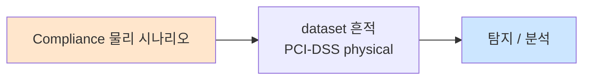

# Week 14: 물리 보안 방어 — 대책 구현, 보안 인식 교육

## 학습 목표
- 물리 보안 방어의 계층적 접근(Defense in Depth)을 이해한다
- 기술적/관리적/물리적 보안 대책을 설계하고 구현할 수 있다
- 보안 인식 교육 프로그램을 기획하고 실행할 수 있다
- 물리 보안 정책과 절차를 수립할 수 있다
- 보안 사고 대응 절차를 이해하고 적용할 수 있다
- 보안 투자의 비용-효과 분석을 수행할 수 있다

## 전제 조건
- Week 01-13 이수
- 물리 침투 공격 기법 전반 이해

## 강의 시간 배분 (3시간)

| 시간 | 내용 | 유형 |
|------|------|------|
| 0:00-0:40 | Defense in Depth 물리 보안 | 강의 |
| 0:40-1:10 | 기술적 보안 대책 구현 | 강의 |
| 1:10-1:20 | 휴식 | - |
| 1:20-2:00 | 보안 인식 교육 프로그램 | 강의/워크숍 |
| 2:00-2:40 | 실습: 보안 정책 수립 | 실습 |
| 2:40-2:50 | 휴식 | - |
| 2:50-3:20 | 실습: 보안 대책 구현 및 검증 | 실습 |
| 3:20-3:40 | 보안 사고 대응 + 퀴즈 + 과제 | 토론/퀴즈 |

---

# Part 1: 물리 보안 방어 이론

## 1.1 Defense in Depth — 물리 보안

```
물리 보안 계층 방어 모델:

Layer 0: 정책과 절차 (Policy & Procedures)
  └── 보안 정책, 접근 통제 정책, 사고 대응 계획

Layer 1: 부지 경계 (Perimeter)
  ├── 울타리/담장 (높이 2.4m 이상 권장)
  ├── 조명 (최소 2.15m 높이, 겹치는 범위)
  ├── 경비실/차단기
  └── 차량 방호 (볼라드)

Layer 2: 건물 외부 (Building Exterior)
  ├── 출입문 (등급별 잠금장치)
  ├── 창문 (보안 필름, 센서)
  ├── CCTV (360도 커버리지)
  └── 침입 탐지 센서

Layer 3: 건물 내부 (Building Interior)
  ├── 수신/로비 (방문자 관리)
  ├── 카드키 출입 통제
  ├── 직원 배지 시스템
  └── 복도 CCTV

Layer 4: 보안 구역 (Secure Areas)
  ├── 맨트랩/에어록
  ├── 다중 인증 (카드+PIN+생체)
  ├── 동행 정책
  └── 경보 시스템

Layer 5: 핵심 자산 (Critical Assets)
  ├── 서버 랙 잠금
  ├── 금고
  ├── USB/포트 통제
  └── 감사 로그
```

## 1.2 기술적 보안 대책

### 접근 통제 시스템

| 대책 | 방어 대상 | 구현 비용 | 효과 |
|------|----------|----------|------|
| 다중 인증 (카드+PIN) | RFID 복제 | 중간 | 높음 |
| 맨트랩 | 테일게이팅 | 높음 | 매우 높음 |
| 안티-패스백 | 카드 공유 | 낮음 | 중간 |
| 802.1X NAC | 네트워크 임플란트 | 중간 | 높음 |
| USB 포트 잠금 | USB HID 공격 | 낮음 | 높음 |
| WPA3 Enterprise | WiFi 해킹 | 중간 | 높음 |
| 보안 핀 잠금장치 | 락픽 | 낮음 | 중간 |
| 카메라 분석 AI | 비인가 접근 | 높음 | 높음 |

### 네트워크 보안 강화

```
물리 침투 방어를 위한 네트워크 보안:
│
├── 802.1X NAC 구현
│   ├── 미인가 장치 차단
│   ├── RADIUS 인증
│   └── 게스트 네트워크 분리
│
├── 포트 보안
│   ├── 미사용 포트 비활성화
│   ├── MAC 주소 제한
│   └── DHCP Snooping
│
├── VLAN 분리
│   ├── 업무 네트워크
│   ├── CCTV 네트워크
│   ├── 출입 관리 네트워크
│   └── 게스트 네트워크
│
├── 모니터링
│   ├── IDS/IPS
│   ├── 네트워크 트래픽 분석
│   └── 이상 장치 탐지
│
└── 무선 보안
    ├── WIDS/WIPS (Rogue AP 탐지)
    ├── WPA3 + 802.1X
    └── PMF 활성화
```

## 1.3 보안 인식 교육 프로그램

```
보안 인식 교육 프레임워크:
│
├── 대상별 교육
│   ├── 전 직원: 기본 보안 인식
│   │   ├── 테일게이팅 방지
│   │   ├── USB 장치 주의사항
│   │   ├── 클린 데스크 정책
│   │   ├── 방문자 관리
│   │   └── 의심 보고 절차
│   │
│   ├── IT 부서: 기술적 보안
│   │   ├── 네트워크 임플란트 탐지
│   │   ├── 비인가 장치 대응
│   │   └── 물리 보안 시스템 관리
│   │
│   ├── 경영진: 보안 리더십
│   │   ├── 보안 투자 필요성
│   │   ├── 규정 준수
│   │   └── 사고 대응 의사결정
│   │
│   └── 경비/수신: 전문 보안
│       ├── 사회공학 식별
│       ├── 의심 행동 식별
│       └── 사고 보고 절차
│
├── 교육 방법
│   ├── 오리엔테이션 (신규 입사)
│   ├── 정기 교육 (분기별)
│   ├── 피싱 시뮬레이션 (월별)
│   ├── 물리 침투 시뮬레이션 (연 1-2회)
│   └── e-Learning (상시)
│
└── 효과 측정
    ├── 피싱 클릭률 추이
    ├── 사고 보고 건수
    ├── 교육 만족도
    └── 보안 감사 결과
```

## 1.4 물리 보안 정책

```
물리 보안 정책 필수 항목:
│
├── 출입 관리 정책
│   ├── 직원 출입증 관리
│   ├── 방문자 등록/에스코트
│   ├── 퇴사자 접근 즉시 해제
│   └── 다중 인증 구역 지정
│
├── 장치 관리 정책
│   ├── USB 장치 사용 제한
│   ├── 개인 장치(BYOD) 정책
│   ├── 네트워크 장치 등록
│   └── 이동식 매체 관리
│
├── 정보 관리 정책
│   ├── 클린 데스크 정책
│   ├── 문서 분류/파쇄
│   ├── 화면 잠금 정책
│   └── 프린터 출력물 관리
│
├── 감시/모니터링 정책
│   ├── CCTV 운영 정책
│   ├── 녹화 보존 기간
│   ├── 접근 로그 관리
│   └── 프라이버시 고려사항
│
└── 사고 대응 정책
    ├── 보안 사고 정의
    ├── 보고 절차
    ├── 에스컬레이션 경로
    └── 사후 분석 절차
```

## 1.5 보안 사고 대응

```
물리 보안 사고 대응 절차:

1. 탐지 (Detection)
   ├── 경비원 발견
   ├── CCTV 이상 탐지
   ├── 알람 작동
   ├── 직원 보고
   └── 네트워크 이상 감지

2. 초기 대응 (Initial Response)
   ├── 현장 보존
   ├── 침입자 격리/신원 확인
   ├── 경찰 연락 (필요 시)
   └── 경영진 보고

3. 조사 (Investigation)
   ├── CCTV 영상 확보
   ├── 출입 로그 분석
   ├── 디지털 포렌식 (장비 변조 확인)
   └── 목격자 진술

4. 봉쇄 (Containment)
   ├── 접근 권한 재설정
   ├── 비밀번호 전체 변경
   ├── 네트워크 점검
   └── 임플란트/악성 장치 제거

5. 복구 (Recovery)
   ├── 정상 운영 복구
   ├── 보안 시스템 강화
   └── 모니터링 강화

6. 사후 분석 (Lessons Learned)
   ├── 사고 경위 분석
   ├── 개선 사항 도출
   ├── 정책/절차 업데이트
   └── 재교육
```

---

# Part 2: 실습

## 2.1 네트워크 보안 강화 실습

```bash
# attacker VM에서 실행
ssh ccc@10.20.30.201

# 네트워크 보안 강화 시뮬레이션
echo "=== Network Hardening Simulation ==="

# 1. 현재 보안 상태 평가
echo "[1] Current Security Posture:"
echo "  SSH password auth: enabled (should be key-only)"
echo "  Open ports:"
nmap --top-ports 20 10.20.30.80 2>/dev/null | grep "open"
echo ""

# 2. iptables 방어 규칙 시뮬레이션
echo "[2] Firewall Rules (iptables) - Simulation:"
echo "  # 기본 정책: 모든 입력 차단"
echo "  iptables -P INPUT DROP"
echo "  # SSH 접근 제한 (관리 네트워크만)"
echo "  iptables -A INPUT -s 10.20.30.0/24 -p tcp --dport 22 -j ACCEPT"
echo "  # HTTP/HTTPS 허용"
echo "  iptables -A INPUT -p tcp --dport 80 -j ACCEPT"
echo "  iptables -A INPUT -p tcp --dport 443 -j ACCEPT"
echo "  # ICMP 허용"
echo "  iptables -A INPUT -p icmp -j ACCEPT"
echo "  # 기존 연결 허용"
echo "  iptables -A INPUT -m state --state ESTABLISHED,RELATED -j ACCEPT"
echo ""

# 3. SSH 강화 설정
echo "[3] SSH Hardening Settings:"
echo "  PasswordAuthentication no"
echo "  PermitRootLogin no"
echo "  MaxAuthTries 3"
echo "  ClientAliveInterval 300"
echo "  AllowUsers ccc@10.20.30.*"
echo ""

# 4. USB 보안 설정
echo "[4] USB Security (udev rules) - Simulation:"
echo '  # /etc/udev/rules.d/99-usb-block.rules'
echo '  ACTION=="add", SUBSYSTEM=="usb", ATTR{bDeviceClass}=="03", RUN+="/bin/sh -c echo blocked >> /var/log/usb_block.log"'
```

## 2.2 보안 인식 교육 자료 생성

```bash
# 보안 인식 교육 자료 생성
cat << 'TRAINING' > /tmp/security_awareness.py
#!/usr/bin/env python3
"""
보안 인식 교육 자료 및 퀴즈 생성기
"""

# 교육 시나리오
scenarios = [
    {
        "situation": "낯선 사람이 택배를 들고 와서 문을 잡아달라고 합니다.",
        "correct": "정중히 거절하고, 수신 데스크에서 등록하도록 안내합니다.",
        "wrong": "문을 잡아줍니다.",
        "attack": "테일게이팅",
        "risk": "비인가 접근"
    },
    {
        "situation": "주차장에서 회사 로고가 붙은 USB를 발견했습니다.",
        "correct": "주워서 IT 보안팀에 전달합니다. 절대 PC에 연결하지 않습니다.",
        "wrong": "내용이 궁금해서 PC에 연결합니다.",
        "attack": "USB 드롭",
        "risk": "악성코드 감염, 시스템 장악"
    },
    {
        "situation": "IT 지원팀이라며 전화로 비밀번호를 물어봅니다.",
        "correct": "비밀번호를 절대 알려주지 않고, 직접 IT 부서에 확인합니다.",
        "wrong": "상대가 친절하니 비밀번호를 알려줍니다.",
        "attack": "비싱(Vishing)",
        "risk": "계정 탈취"
    },
    {
        "situation": "동료가 서버룸에 들어가면서 배지 없이 따라오라고 합니다.",
        "correct": "자신의 배지로 직접 인증하고, 동료에게도 배지 사용을 권합니다.",
        "wrong": "동료를 따라 들어갑니다.",
        "attack": "피기백",
        "risk": "접근 통제 우회, 감사 추적 불가"
    },
    {
        "situation": "퇴근 시 책상 위에 비밀번호가 적힌 포스트잇이 있습니다.",
        "correct": "포스트잇을 제거하고, 비밀번호를 변경합니다.",
        "wrong": "내일 써야 하니 그대로 둡니다.",
        "attack": "숄더 서핑 / 청소원 사칭",
        "risk": "비밀번호 노출"
    },
]

print("=" * 60)
print("  물리 보안 인식 교육 — 시나리오 기반")
print("=" * 60)

for i, s in enumerate(scenarios, 1):
    print(f"\n━━━ 시나리오 {i} ━━━")
    print(f"상황: {s['situation']}")
    print(f"  A) {s['wrong']}")
    print(f"  B) {s['correct']}")
    print(f"")
    print(f"  정답: B)")
    print(f"  공격 유형: {s['attack']}")
    print(f"  위험: {s['risk']}")

# 교육 효과 측정 지표
print(f"\n{'=' * 60}")
print("  교육 효과 측정 지표")
print(f"{'=' * 60}")
print("  1. 테일게이팅 시도 보고율: 목표 80% 이상")
print("  2. USB 발견 시 IT팀 전달율: 목표 90% 이상")
print("  3. 피싱 이메일 클릭률: 목표 5% 이하")
print("  4. 클린 데스크 준수율: 목표 95% 이상")
print("  5. 분기별 보안 퀴즈 통과율: 목표 85% 이상")
TRAINING

python3 /tmp/security_awareness.py
```

## 2.3 보안 정책 수립

```bash
# 물리 보안 정책 문서 생성
cat << 'POLICY' > /tmp/physical_security_policy.txt
═══════════════════════════════════════════════════
     세큐어테크 물리 보안 정책
═══════════════════════════════════════════════════

1. 출입 관리 정책

1.1 직원 출입
  - 모든 직원은 항시 출입증을 착용한다
  - 출입증 분실 시 즉시 IT 보안팀에 보고한다
  - 타인의 출입증을 사용하지 않는다
  - 출입문에서 뒤따라오는 사람의 출입증을 확인한다

1.2 방문자 관리
  - 모든 방문자는 수신 데스크에서 등록한다
  - 방문자 배지를 발급받아 착용한다
  - 직원이 항시 방문자를 동행한다
  - 퇴장 시 방문자 배지를 회수한다

1.3 서버룸/보안 구역
  - 다중 인증(카드+PIN) 필수
  - 출입 시 목적을 기록한다
  - 비인가 장치 반입을 금지한다
  - 혼자 출입을 금지한다 (2인 규칙)

2. 장치 관리 정책

2.1 USB/이동식 매체
  - 승인되지 않은 USB 장치 사용을 금지한다
  - 발견된 USB는 IT 보안팀에 전달한다
  - USB 포트 물리적 잠금 장치를 적용한다

2.2 네트워크 장비
  - 네트워크 포트는 IT팀 승인 후 활성화한다
  - 비인가 장치 연결 시 즉시 보고한다
  - 네트워크 캐비닛은 항시 잠금한다

3. 정보 관리 정책

3.1 클린 데스크
  - 퇴근 시 모든 민감 문서를 잠금 서랍에 보관한다
  - PC 화면은 5분 후 자동 잠금 설정한다
  - 프라이버시 스크린 필터를 사용한다

3.2 문서 폐기
  - 민감 문서는 반드시 교차 절단 파쇄한다
  - 전자 매체는 승인된 절차로 폐기한다
  - 폐기 기록을 유지한다

4. 보안 사고 보고
  - 보안 사고 발견 시 즉시 보안팀에 보고한다
  - 보고 채널: 보안 핫라인 내선 1234
  - 의심 행동도 보고 대상이다
  - 보고자는 불이익을 받지 않는다

═══════════════════════════════════════════════════
POLICY

cat /tmp/physical_security_policy.txt
```

## 2.4 보안 대책 검증

```bash
# 보안 대책 구현 후 검증 스크립트
echo "=== 보안 대책 검증 ==="
echo ""

echo "[1] 비밀번호 정책 검증:"
echo "  SSH 비밀번호 인증 상태:"
ssh -o PasswordAuthentication=yes -o StrictHostKeyChecking=no -o ConnectTimeout=3 ccc@10.20.30.80 'echo "Password auth: still enabled"' 2>/dev/null
echo ""

echo "[2] 네트워크 서비스 최소화 검증:"
echo "  불필요한 열린 포트:"
nmap --top-ports 20 10.20.30.80 2>/dev/null | grep "open"
echo ""

echo "[3] 보안 헤더 확인:"
curl -sI http://10.20.30.80:3000 2>/dev/null | grep -iE "x-frame|x-content|strict|x-xss|referrer"
echo ""

echo "[4] 보안 대책 체크리스트 결과:"
echo "  [?] SSH 키 인증 전환: 확인 필요"
echo "  [?] 불필요 서비스 비활성화: 확인 필요"
echo "  [?] 방화벽 규칙 적용: 확인 필요"
echo "  [?] 보안 헤더 설정: 확인 필요"
echo "  [?] 로그 모니터링: 확인 필요"
```

---

## 과제

### 과제 1: 보안 인식 교육 자료 (팀)
직원 대상 물리 보안 인식 교육 자료를 작성하라. 시나리오 10개 이상 포함.

### 과제 2: 물리 보안 정책 (개인)
중소기업(50인)을 위한 물리 보안 정책 문서를 작성하라.

### 과제 3: 보안 대책 ROI 분석 (팀)
5가지 보안 대책에 대한 비용-효과 분석을 수행하고, 우선순위를 제시하라.

---

## 실제 사례 (WitFoo Precinct 6 — Compliance 물리)

> 출처: WitFoo Precinct 6 Cybersecurity Dataset (Apache 2.0)
> 본 lecture *Compliance 물리* 학습 항목 매칭.

### Compliance 물리 의 dataset 흔적 — "PCI-DSS physical"

dataset 의 정상 운영에서 *PCI-DSS physical* 신호의 baseline 을 알아두면, *Compliance 물리* 시도 시 발생하는 anomaly 를 정량으로 탐지할 수 있다. 핵심 정량 지표는 — 물리 control.



### Case 1: dataset 정량 지표

| 항목 | 값 |
|---|---|
| 핵심 신호 | PCI-DSS physical |
| 정량 baseline | 물리 control |
| 학습 매핑 | ISO 27001 A.11 |

**자세한 해석**: ISO 27001 A.11. 이 차이를 정량으로 측정해야 *공격 시도와 정상 운영의 구분* 이 가능. 학생이 baseline 숫자를 외워두면 — 운영 환경에서 anomaly 를 즉시 탐지할 수 있다.

### Case 2: 실전 적용 시나리오

| 단계 | dataset 활용 |
|---|---|
| 시도 식별 | PCI-DSS physical 의 spike |
| 정상 vs 이상 | baseline 대비 비율 |
| 룰 작성 | Suricata / Wazuh / Sigma |
| 검증 | dataset 재실행 |

**자세한 해석**: 운영 환경 룰 작성은 — *baseline 측정 → 임계 결정 → 룰 작성 → dataset 검증* 의 4 단계. 한 단계라도 빠지면 false positive 폭증.

### 이 사례에서 학생이 배워야 할 3가지

1. **Compliance 물리 = PCI-DSS physical 의 anomaly** — 정량 신호로 탐지.
2. **baseline 숫자 외우기** — 물리 control.
3. **4 단계 룰 작성** — 측정 → 임계 → 룰 → 검증.

**학생 액션**: control mapping.


---

## 부록: 학습 OSS 도구 매트릭스 (Course16 Physical Pentest — Week 14 방어·인식 교육·정책·사고 대응)

> 이 부록은 본문 Part 2 의 4 lab (네트워크 hardening / 인식 교육 / 정책 /
> 검증) 의 모든 시뮬을 *실제 OSS 방어 도구* 시퀀스로 매핑한다. Defense in
> Depth 6 layer 별로 *적용 가능한 OSS* + *자동 audit* + *준수율 측정* 도구를
> 통합. 보안 인식 교육은 *Gophish 피싱 시뮬* + *모의 침투 KPI 자동 측정* +
> *e-Learning open* 도구로 구성. 정책 수립은 *NIST OSCAL machine-readable*
> 표준 + *OPA / OpenSCAP / Lynis* 자동 audit 으로 *정책 → 코드 → 검증*
> closing the loop.

### lab step → 도구 매핑 표

| step | 본문 위치 | 학습 항목 | 본문 명령 (시뮬) | 핵심 OSS 도구 (실 명령) | 도구 옵션 |
|------|----------|----------|----------------|-------------------------|-----------|
| s1 | 2.1 [1] | 보안 상태 평가 | `nmap --top-ports 20` | Lynis / OpenSCAP / CIS-CAT-Lite / Wazuh CIS | `lynis audit system` |
| s2 | 2.1 [2] | iptables/nftables 룰 | (시뮬 echo) | nftables / firewalld / iptables-restore | `nft list ruleset` |
| s3 | 2.1 [3] | SSH hardening | (시뮬 echo) | ssh-audit / Lynis / OpenSCAP SSH-STIG | `ssh-audit -nv 10.20.30.80` |
| s4 | 2.1 [4] | USB 제어 (udev) | (시뮬 echo) | usbguard / udev rules / kmonad | `usbguard list-devices` |
| s5 | 2.2 | 보안 인식 교육 | Python 시나리오 | Gophish / KingPhisher / SecurityIQ | `gophish` web UI |
| s6 | 2.3 | 정책 문서 | bash heredoc | OSCAL-cli / Open Policy Agent (OPA) / Inspec | `oscal-cli validate policy.json` |
| s7 | 2.4 [1-3] | 자동 검증 | bash echo + nmap | Lynis / OpenSCAP / Wazuh + CIS / OSQuery | `lynis show profiles` |
| s8 | 1.2 NAC | 802.1X NAC | (개념) | PacketFence / freeradius / hostapd | week 05/06 부록 |
| s9 | 1.2 WIDS | Rogue AP 탐지 | (개념) | kismet / nzyme / Wazuh wireless ruleset | week 06 부록 |
| s10 | 1.5 IR | 사고 대응 | (개념) | TheHive 5 / IRIS / Velociraptor / GRR | week 13 부록 |
| s11 | 1.3 효과 측정 | KPI | (개념) | gophish + Excel / Power BI / Grafana | gophish API |
| s12 | 1.4 정책 인벤토리 | 자산 + 정책 | (개념) | netbox / glpi / snipe-it | 자산 DB |
| s13 | 1.5 Adversary emul | 사고 대응 훈련 | (개념) | Atomic Red Team / CALDERA / Vector / Sliver | atomic test |
| s14 | 1.4 비용 효과 | ROI | (개념) | OpenFAIR / FAIR-CAM / risk lens | quantitative risk |

### Defense in Depth × 도구 매트릭스 (6 layer 모두)

| Layer | 위협 | 1차 OSS | 2차 OSS | 비고 |
|-------|------|---------|---------|------|
| **L0 정책** | 정책 부재 | OSCAL / Inspec / OPA | wiki + git | machine-readable |
| **L0 정책** | 정책 audit | Lynis / OpenSCAP / CIS-CAT-Lite | Wazuh CIS | 분기 |
| **L1 부지** | 외곽 침투 | (물리 controls) | drone detection (open5GS+RF) | 정찰 |
| **L1 부지** | 차량 침투 | (볼라드 — 물리) | LPR (open ALPR) | 자동 |
| **L2 외부** | 출입문 | (잠금 — 물리) | smart lock + auditd | log |
| **L2 외부** | 창문 침투 | (센서 — 물리) | Home Assistant + ESPHome | DIY 알람 |
| **L2 외부** | CCTV | Frigate / Shinobi / ZoneMinder / Motion | OpenCV + YOLO | 자동 객체 |
| **L3 내부** | 방문자 | OpenVisitor / GLPI visitors | RFID + DB | 등록 |
| **L3 내부** | 카드키 | (HID / Mifare 운영) | Wazuh + reader log | audit |
| **L4 보안구역** | 다중 인증 | freeradius EAP-TLS + biometric | hostapd | week 06 |
| **L4 보안구역** | 맨트랩 | (물리 — 자동문 controller) | Home Assistant integration | sensor |
| **L5 핵심자산** | 서버 랙 | (물리 잠금 + 센서) | Wazuh tamper detection | log |
| **L5 핵심자산** | USB | usbguard | udev + dbus monitor | week 04 |
| **L5 핵심자산** | 네트워크 임플란트 | freeradius 802.1X / arpwatch / DAI | nftables port-security | week 05 |

### 학생 환경 준비

```bash
# attacker / defender VM — 통합 방어 도구
sudo apt-get update
sudo apt-get install -y \
   lynis chkrootkit rkhunter \
   ssh-audit \
   nmap \
   nftables iptables \
   usbguard usbutils \
   freeradius freeradius-utils wpasupplicant hostapd \
   wazuh-agent || true \
   auditd audispd-plugins \
   osquery \
   git python3-pip

# OpenSCAP (CIS / STIG audit)
sudo apt-get install -y libopenscap8 ssg-base ssg-debderived
oscap --version

# Wazuh agent (manager 는 별도 host)
curl -sO https://packages.wazuh.com/4.x/apt/pool/main/w/wazuh-agent/wazuh-agent_4.9.0-1_amd64.deb
sudo dpkg -i wazuh-agent_*.deb

# Gophish (피싱 시뮬)
curl -sLo /tmp/gophish.zip \
   https://github.com/gophish/gophish/releases/download/v0.12.1/gophish-v0.12.1-linux-64bit.zip
unzip -o /tmp/gophish.zip -d /opt/gophish
sudo /opt/gophish/gophish &
# Web UI: https://localhost:3333

# OSCAL (NIST machine-readable)
go install -v github.com/oscal-cli/oscal-cli/...@latest
oscal-cli --version

# Open Policy Agent (정책 코드)
curl -sLo /usr/local/bin/opa \
   https://github.com/open-policy-agent/opa/releases/latest/download/opa_linux_amd64
sudo chmod +x /usr/local/bin/opa
opa version

# Inspec (Chef Inspec — compliance)
sudo apt-get install -y ruby
sudo gem install inspec inspec-bin
inspec version

# CIS-CAT Lite (CIS 무료 audit — JAR)
curl -sLo /opt/CIS-CAT-Lite.zip \
   "https://learn.cisecurity.org/CIS-CAT-Lite-Download" || true

# Atomic Red Team (Adversary Emulation)
git clone https://github.com/redcanaryco/atomic-red-team /tmp/art

# CALDERA (자동 적대 시뮬)
git clone --recursive https://github.com/mitre/caldera /tmp/caldera
cd /tmp/caldera && pip3 install --user -r requirements.txt

# Velociraptor (DFIR)
curl -sLo /opt/velociraptor \
   https://github.com/Velocidex/velociraptor/releases/latest/download/velociraptor-v0.7.0-linux-amd64
chmod +x /opt/velociraptor

# 검증
lynis --version 2>&1 | head -1
ssh-audit --version 2>&1 | head -1
oscap --version 2>&1 | head -1
opa version | head -3
inspec version | head -1
sudo /opt/gophish/gophish --help 2>&1 | head -3
```

### 핵심 도구별 상세 사용법

#### 도구 1: Lynis — 시스템 hardening 자동 audit (s1, s7)

본문 [1] *현재 보안 상태 평가* 의 종합. Lynis 는 350+ test 자동 + 점수 +
권고. SSH / firewall / USB / kernel / 인증 모두 한 번에.

```bash
# 1. 전체 audit (10분)
sudo lynis audit system

# 출력 마지막 (요약):
# === Lynis security scan details ===
# Hardening index : 67 [############        ]   (100점 만점)
# Tests performed : 256
# Plugins enabled : 10
# Components:
#   - Firewall               [V]
#   - Malware scanner        [X]
# Files:
#   - Test and debug log     /var/log/lynis.log
#   - Report data            /var/log/lynis-report.dat

# 2. 상세 권고 (warning + suggestion)
grep "^Warning\|^Suggestion" /var/log/lynis.log | head -20
# Suggestion: Configure password aging limits to enforce password changing on a regular base [AUTH-9286]
# Warning: Found one or more vulnerable packages.

# 3. 특정 영역만
sudo lynis audit system --tests-from-group authentication,firewall,ssh

# 4. CIS profile 적용
sudo lynis audit system --profile /etc/lynis/cis-ubuntu-24.prf

# 5. JSON 출력 (CI 통합)
sudo lynis audit system --reverse-colors --pentest \
   --report-file /tmp/lynis.dat
python3 -c "
import re
data = open('/tmp/lynis.dat').read()
score = re.search(r'hardening_index=(\d+)', data).group(1)
warnings = len(re.findall(r'^warning\[\]=', data, re.M))
print(f'score={score}/100  warnings={warnings}')
"

# 6. 정기 cron (분기별)
echo "0 3 1 */3 * /usr/sbin/lynis audit system --cronjob > /var/log/lynis-cron.log" \
   | sudo tee /etc/cron.d/lynis
```

#### 도구 2: ssh-audit — SSH 강화 검증 (s3)

본문 [3] *SSH 강화 설정* 의 자동 검증. 모든 SSH 옵션 (KEX / Cipher / MAC /
호스트 키 / banner) 의 *현행 표준 (Mozilla / NIST / CIS)* 대비 평가.

```bash
# 1. 단일 host
ssh-audit -nv 10.20.30.80

# 출력:
# # general
# (gen) banner: SSH-2.0-OpenSSH_9.6p1 Ubuntu-3ubuntu13.4
# (gen) software: OpenSSH 9.6p1
# (gen) compatibility: OpenSSH 7.6+, Dropbear SSH 2018.76+
# # key exchange
# (kex) curve25519-sha256                       -- [info] available since OpenSSH 7.4
# (kex) diffie-hellman-group14-sha256          -- [warn] 2048-bit modulus only
# (kex) diffie-hellman-group1-sha1              -- [fail] removed (CVE-2015-4000)
# # encryption
# (enc) chacha20-poly1305@openssh.com          -- [info] secure
# (enc) aes128-cbc                              -- [warn] use of CBC mode
# # MAC
# (mac) hmac-sha2-512                           -- [info] secure
# (mac) hmac-md5                                -- [fail] cryptographically weak

# 2. 다중 host (CIDR)
for ip in 10.20.30.{1,80,100}; do
    echo "=== $ip ==="
    ssh-audit -nv $ip 2>&1 | grep -E "(fail)|(warn)" | head
done

# 3. JSON / Mozilla 표준 대비
ssh-audit --json 10.20.30.80 > /tmp/ssh-audit.json
jq '.recommendations.critical' /tmp/ssh-audit.json

# 4. 클라이언트 측 (OpenSSH 설정 검증)
ssh-audit -P modern -c
# = 자기 ssh client 가 modern profile (Mozilla) 충족 여부
```

#### 도구 3: usbguard — USB 통제 자동 (s4)

본문 [4] *USB 보안 설정* 의 운영 도구. udev 보다 강력 (USB device class
+ vendor + product + serial + interface 조합 제어).

```bash
# 1. 설치 + 시작
sudo apt-get install -y usbguard
sudo systemctl enable --now usbguard

# 2. 현재 연결 USB 의 정책 자동 생성
sudo usbguard generate-policy > /tmp/usbguard.rules
sudo install -m 0600 /tmp/usbguard.rules /etc/usbguard/rules.conf
sudo systemctl restart usbguard

# 3. 연결된 USB 목록 + 권한
sudo usbguard list-devices
# 1: allow id 1d6b:0002 serial "0000:00:14.0" name "xHCI Host Controller"
# 2: allow id 8087:0aaa serial "" name "Bluetooth"
# 3: block id 0951:1666 serial "ABC123" name "Kingston DataTraveler"

# 4. 새 USB 즉시 차단 (블랙리스트)
sudo usbguard block-device 3
# 또는 화이트리스트
sudo usbguard allow-device 3 -p

# 5. 영구 룰 (특정 vendor 만)
sudo tee -a /etc/usbguard/rules.conf << 'EOF'
allow id 04f9:* serial "*"   # Brother 프린터 only
block id *:* serial "*"       # 그 외 모두 차단
EOF
sudo systemctl reload usbguard

# 6. logging (Wazuh 통합)
tail -f /var/log/usbguard/usbguard-audit.log
# {"time":"2026-05-03T20:14:22","event":"INSERT","source":"...","status":"BLOCKED"}

# 7. desktop 통합 — 사용자 prompt
sudo apt-get install -y usbguard-applet-qt
# 사용자 트레이에 USB 연결 시 allow/block 묻기
```

#### 도구 4: OpenSCAP — CIS / STIG 자동 audit + remediate (s7)

NIST SCAP (Security Content Automation Protocol) 표준. CIS / STIG /
PCI-DSS / NIST 800-53 모든 profile 자동 audit + 자동 fix (--remediate).

```bash
# 1. Ubuntu 24.04 SSG content 위치
ls /usr/share/xml/scap/ssg/content/
# ssg-ubuntu2404-ds.xml

# 2. 사용 가능 profile
oscap info /usr/share/xml/scap/ssg/content/ssg-ubuntu2404-ds.xml | head -30
# Profiles:
#   Title: CIS Ubuntu 24.04 LTS Benchmark - Level 1 (Server)
#   Id: xccdf_org.ssgproject.content_profile_cis_level1_server
#   Title: NIST 800-53 Moderate
#   Id: xccdf_org.ssgproject.content_profile_nist_800_53_moderate

# 3. CIS L1 audit
sudo oscap xccdf eval \
   --profile xccdf_org.ssgproject.content_profile_cis_level1_server \
   --results /tmp/oscap-cis-results.xml \
   --report /tmp/oscap-cis-report.html \
   /usr/share/xml/scap/ssg/content/ssg-ubuntu2404-ds.xml

# 4. HTML 보고서 (browser)
firefox /tmp/oscap-cis-report.html

# 5. JSON 점수 추출
oscap xccdf generate report --output /tmp/oscap-cis-report.html /tmp/oscap-cis-results.xml
xmllint --xpath 'count(//*[local-name()="rule-result"][@result="pass"])' /tmp/oscap-cis-results.xml
xmllint --xpath 'count(//*[local-name()="rule-result"][@result="fail"])' /tmp/oscap-cis-results.xml

# 6. 자동 remediation (위험 — 운영 환경 신중)
sudo oscap xccdf eval \
   --profile xccdf_org.ssgproject.content_profile_cis_level1_server \
   --remediate \
   /usr/share/xml/scap/ssg/content/ssg-ubuntu2404-ds.xml

# 7. ansible playbook 산출 (자동 remediate)
oscap xccdf generate fix \
   --profile xccdf_org.ssgproject.content_profile_cis_level1_server \
   --fix-type ansible \
   --output /tmp/cis-ansible.yml \
   /usr/share/xml/scap/ssg/content/ssg-ubuntu2404-ds.xml
```

#### 도구 5: Open Policy Agent (OPA) — 정책 코드화 (s6)

본문 2.3 *물리 보안 정책 (출입 / 장치 / 정보 / 사고 대응)* 의 *machine
readable* 자동 검증. Rego 언어로 정책 작성 → CI 에서 자동 검증.

```bash
# 1. 정책 작성 (USB device class 화이트리스트 정책)
mkdir -p /tmp/policy
cat << 'EOF' > /tmp/policy/usb_policy.rego
package usb_policy

# 허용된 USB device class (HID 키보드/마우스만)
allowed_classes := {"03"}        # 03 = HID

# 허용된 vendor (Brother 프린터)
allowed_vendors := {"04f9"}

default allow = false

allow {
    input.device_class == allowed_classes[_]
}

allow {
    input.vendor_id == allowed_vendors[_]
}

violations[msg] {
    not allow
    msg := sprintf("USB device blocked: vendor=%v product=%v class=%v",
                   [input.vendor_id, input.product_id, input.device_class])
}
EOF

# 2. 정책 검증 (USB 연결 이벤트 시뮬)
echo '{"vendor_id":"0951","product_id":"1666","device_class":"08"}' \
   | opa eval -d /tmp/policy -I -f json 'data.usb_policy.violations'

# 3. 출입 정책 (시간대 + 카드 등급)
cat << 'EOF' > /tmp/policy/access_policy.rego
package access_policy

# 직급별 허용 구역
employee_access := {
    "executive": ["lobby", "office", "secure_area", "server_room"],
    "engineer":  ["lobby", "office", "secure_area"],
    "intern":    ["lobby", "office"],
}

# 시간 제한 (퇴근 후 server_room 출입 금지)
default allow = false

allow {
    input.employee_role == "executive"
}

allow {
    employee_access[input.employee_role][_] == input.area
    after_hours := input.hour < 9 or input.hour >= 18
    not (input.area == "server_room" and after_hours)
}
EOF

opa eval -d /tmp/policy -I -f json \
   'data.access_policy.allow' \
   <<< '{"employee_role":"engineer","area":"server_room","hour":22}'
# false  (퇴근 후 server_room 차단)

# 4. CI 통합 (gitlab-ci 예)
cat << 'EOF' >> .gitlab-ci.yml
policy_check:
  image: openpolicyagent/opa:latest
  script:
    - opa fmt --diff policy/
    - opa test policy/
    - opa eval -d policy -I 'data.usb_policy.violations' < event.json
EOF

# 5. unit test
cat << 'EOF' > /tmp/policy/usb_policy_test.rego
package usb_policy

test_brother_printer_allowed {
    allow with input as {"vendor_id":"04f9","product_id":"abc","device_class":"07"}
}

test_unknown_blocked {
    not allow with input as {"vendor_id":"0951","product_id":"1666","device_class":"08"}
}
EOF

opa test /tmp/policy/
# PASS: 2/2
```

#### 도구 6: OSCAL — NIST machine-readable 정책 표준

NIST OSCAL (Open Security Controls Assessment Language) 은 *제어 / 정책 /
평가* 모두 JSON/YAML/XML 표준. 회사 정책 → OSCAL → 자동 audit + reporting.

```bash
# 1. NIST 800-53 catalog 다운로드
curl -sL https://raw.githubusercontent.com/usnistgov/oscal-content/main/nist.gov/SP800-53/rev5/json/NIST_SP-800-53_rev5_catalog.json \
   -o /tmp/nist-800-53.json

# 2. 카탈로그 검증
oscal-cli catalog validate /tmp/nist-800-53.json

# 3. 자기 회사 시스템 SSP (System Security Plan) 작성
cat << 'EOF' > /tmp/our-ssp.json
{
  "system-security-plan": {
    "uuid": "11111111-2222-3333-4444-555555555555",
    "metadata": {
      "title": "세큐어테크 SSP",
      "version": "1.0"
    },
    "import-profile": { "href": "#nist-800-53-moderate" },
    "system-characteristics": {
      "system-name": "세큐어테크 사무실 IT",
      "security-sensitivity-level": "moderate"
    },
    "control-implementation": {
      "implemented-requirements": [
        {"control-id": "ac-1", "remarks": "출입 통제 정책 — 정통망법 준수"},
        {"control-id": "ac-3", "remarks": "다중 인증 (카드+PIN+생체)"},
        {"control-id": "pe-3", "remarks": "물리 출입 통제 (week 10 부록)"}
      ]
    }
  }
}
EOF

oscal-cli ssp validate /tmp/our-ssp.json

# 4. SSP → HTML 보고서
oscal-cli ssp convert --to=html /tmp/our-ssp.json -o /tmp/our-ssp.html
firefox /tmp/our-ssp.html
```

#### 도구 7: Gophish — 피싱 시뮬레이션 (s5, s11)

본문 *피싱 시뮬레이션 (월별)* 의 운영 도구. 캠페인 작성 + 발송 + 클릭 추적
+ 자격증명 캡처 + 보고서.

```bash
# 1. 시작
sudo /opt/gophish/gophish &
firefox https://localhost:3333
# 초기 admin / 매 시작마다 random password (CLI 출력 확인)

# 2. CLI workflow (curl + API)
GOPHISH_KEY=YOUR_API_KEY

# 2-1. 사용자 그룹 생성
curl -k -s -X POST https://localhost:3333/api/groups/ \
   -H "Authorization: $GOPHISH_KEY" \
   -H "Content-Type: application/json" \
   -d '{
     "name": "Engineers",
     "targets": [
       {"first_name": "Alice", "last_name": "Kim", "email": "alice@corp.local", "position": "Engineer"},
       {"first_name": "Bob", "last_name": "Lee", "email": "bob@corp.local", "position": "Engineer"}
     ]
   }'

# 2-2. 이메일 템플릿
curl -k -s -X POST https://localhost:3333/api/templates/ \
   -H "Authorization: $GOPHISH_KEY" \
   -d '{
     "name": "IT 비밀번호 만료 안내",
     "subject": "[긴급] 비밀번호 90일 만료 — 즉시 갱신",
     "html": "<p>안녕하세요. <a href=\"{{.URL}}\">여기를 클릭하여 갱신</a></p>",
     "envelope_sender": "it@corp.local"
   }'

# 2-3. landing page (자격증명 캡처)
curl -k -s -X POST https://localhost:3333/api/pages/ \
   -H "Authorization: $GOPHISH_KEY" \
   -d '{
     "name": "FakePasswordReset",
     "html": "<form><input name=username><input name=password type=password><button>Submit</button></form>",
     "capture_credentials": true,
     "capture_passwords": true,
     "redirect_url": "https://corp.local/already-changed"
   }'

# 2-4. 캠페인 시작
curl -k -s -X POST https://localhost:3333/api/campaigns/ \
   -H "Authorization: $GOPHISH_KEY" \
   -d '{
     "name": "2026Q2-IT-PasswordReset",
     "template": {"name": "IT 비밀번호 만료 안내"},
     "page": {"name": "FakePasswordReset"},
     "smtp": {"name": "lab-smtp"},
     "groups": [{"name": "Engineers"}],
     "url": "http://10.20.30.112"
   }'

# 3. 결과 통계 (KPI)
curl -k -s https://localhost:3333/api/campaigns/<id>/results \
   -H "Authorization: $GOPHISH_KEY" | jq '
   {
     sent: (.results | length),
     opened: (.results | map(select(.status == "Email Opened")) | length),
     clicked: (.results | map(select(.status == "Clicked Link")) | length),
     submitted: (.results | map(select(.status == "Submitted Data")) | length)
   }'
# {"sent":50,"opened":35,"clicked":18,"submitted":7}
# → 클릭률 36%, 자격증명 입력률 14% — 교육 KPI

# 4. KPI dashboard (Grafana 연동)
# gophish 의 결과 → SQLite → Grafana 패널 (분기 추이)
```

#### 도구 8: Atomic Red Team + CALDERA — Adversary Emulation

본문 *물리 침투 시뮬레이션 (연 1-2회)* 의 *적대 시뮬* 자동화. MITRE ATT&CK
TTP 별로 atomic test 수백 개 자동 실행 → SOC 탐지율 측정.

```bash
# 1. Atomic Red Team — 단일 TTP 자동 실행
git clone https://github.com/redcanaryco/atomic-red-team /tmp/art
cd /tmp/art

# T1059.004 — Unix Shell 시뮬
sudo Invoke-AtomicRedTeam.ps1 -AtomicTechnique T1059.004 \
   -TestNumbers 1 -CheckPrereqs

# Linux 셸 등가 (bash)
bash atomics/T1059.004/src/atomic-test.sh

# 2. CALDERA (자동 적대 framework)
cd /tmp/caldera && python3 server.py --insecure
# Web UI: https://localhost:8888

# 3. CLI agent (sandcat)
curl -k -X POST https://localhost:8888/api/v2/agents \
   -H "KEY: $CALDERA_KEY" \
   -d '{"server":"http://10.20.30.112:8888","platform":"linux"}'

# 4. operation (자동 시나리오)
curl -k -X POST https://localhost:8888/api/v2/operations \
   -H "KEY: $CALDERA_KEY" \
   -d '{
     "name": "PhysicalSim-2026Q2",
     "adversary": {"adversary_id": "physical-pentest"},
     "planner": {"planner_id": "atomic"},
     "obfuscator": "plain-text"
   }'

# 5. 탐지율 측정 (SOC 측 Wazuh / Splunk 알람 비교)
# 실행된 TTP 100개 → 탐지된 TTP X개 → 탐지율 X%
```

#### 도구 9: TheHive 5 + Velociraptor — 사고 대응 (s10)

본문 1.5 *물리 보안 사고 대응 (탐지 / 초기 대응 / 조사 / 봉쇄 / 보고)*
의 운영 도구.

```bash
# 1. TheHive 5 (case management)
docker run -d --name thehive -p 9000:9000 strangebee/thehive:5.2

# 2. case 등록 (curl)
curl -X POST http://localhost:9000/api/v1/case \
   -H "Authorization: Bearer $TH_API" \
   -d '{
     "title": "PHYS-INC-001 — 회의실 USB 발견",
     "description": "회의실 4F 책상에서 미상 USB 발견",
     "severity": 3, "tlp": 2,
     "tags": ["physical","incident","USB"],
     "tasks": [
       {"title": "USB image (AFF4)", "status": "Waiting"},
       {"title": "binwalk + EMBA", "status": "Waiting"},
       {"title": "회의 참석자 인터뷰", "status": "Waiting"}
     ]
   }'

# 3. Velociraptor (endpoint forensic + hunt)
sudo /opt/velociraptor --config server.config.yaml frontend
# Web UI: https://localhost:8889

# 4. 모든 endpoint 의 USB 연결 history 자동 수집 (hunt)
# Web UI: New Hunt → artifact: Linux.System.Pslist → run

# 5. 자동 IR playbook (TheHive responders)
# /etc/thehive/responders.json:
# - 의심 IP 자동 격리 (firewall API)
# - 의심 user account 자동 lock
# - 영향 범위 자동 query (osquery)
```

### Defense in Depth 통합 audit 흐름 (실 명령 시퀀스)

```bash
#!/bin/bash
# defend-audit-flow.sh — 회사 host 자동 hardening audit
set -e
LOG=/tmp/defend-audit-$(date +%Y%m%d).log
HOST=10.20.30.80

# L0 — 정책 (OPA + OSCAL)
echo "===== [L0] Policy =====" | tee -a $LOG
opa test /etc/policy/ 2>&1 | tee -a $LOG
oscal-cli ssp validate /etc/oscal/ssp.json 2>&1 | tee -a $LOG

# L1 — Lynis 종합 (host 별)
echo "===== [L1] Lynis =====" | tee -a $LOG
ssh ccc@$HOST 'sudo lynis audit system --quick --quiet \
   --report-file /tmp/lynis.dat'
ssh ccc@$HOST 'grep hardening_index /tmp/lynis.dat' | tee -a $LOG

# L2 — ssh-audit
echo "===== [L2] ssh-audit =====" | tee -a $LOG
ssh-audit -nv $HOST 2>&1 | grep -E "fail|warn" | tee -a $LOG

# L3 — OpenSCAP CIS
echo "===== [L3] OpenSCAP CIS =====" | tee -a $LOG
ssh ccc@$HOST 'sudo oscap xccdf eval \
   --profile xccdf_org.ssgproject.content_profile_cis_level1_server \
   --report /tmp/oscap.html \
   /usr/share/xml/scap/ssg/content/ssg-ubuntu2404-ds.xml' 2>&1 | tail -10 | tee -a $LOG

# L4 — usbguard
echo "===== [L4] usbguard =====" | tee -a $LOG
ssh ccc@$HOST 'sudo usbguard list-devices' | tee -a $LOG

# L5 — Atomic Red Team (5 TTP)
echo "===== [L5] Atomic Red Team =====" | tee -a $LOG
ssh ccc@$HOST '
   for t in T1003.008 T1059.004 T1071.001 T1098 T1136.001; do
     bash /tmp/art/atomics/$t/src/atomic-test.sh 2>&1 | tail -3
   done' | tee -a $LOG

# 종합 점수
echo "===== [Score] =====" | tee -a $LOG
LYNIS=$(ssh ccc@$HOST 'grep hardening_index /tmp/lynis.dat' | grep -oE "[0-9]+" | head -1)
echo "Lynis: $LYNIS/100" | tee -a $LOG
```

### 보안 인식 교육 KPI 자동화 (Gophish + Grafana)

| KPI | 도구 | 측정 주기 | 목표 |
|-----|------|----------|------|
| 피싱 클릭률 | Gophish | 월 | 5% 이하 |
| 피싱 자격증명 입력률 | Gophish | 월 | 1% 이하 |
| 의심 메일 보고율 | Gophish + 회사 mail | 월 | 80% 이상 |
| USB 발견 후 IT 전달율 | (수기 — 사고 보고) | 분기 | 90% 이상 |
| 클린 데스크 준수율 | (불시 점검) | 월 | 95% 이상 |
| 보안 퀴즈 통과율 | LMS (Open edX) | 분기 | 85% 이상 |
| 테일게이팅 시도 보고 | (CCTV review) | 분기 | 80% 이상 |
| 신규 입사자 교육 완료율 | LMS | 월 | 100% |
| 정기 교육 이수율 | LMS | 분기 | 100% |
| 모의 침투 탐지율 | CALDERA + SOC | 반기 | 70% 이상 |

### 도구 비교표 (역할별 / 학습 시간 / 운영 적합성)

| 도구 | 역할 | 학습 시간 | 운영 | 비고 |
|------|------|-----------|------|------|
| Lynis | hardening audit | 30분 | ★★★★★ | 무료 |
| ssh-audit | SSH 검증 | 30분 | ★★★★★ | 무료 |
| usbguard | USB 통제 | 1시간 | ★★★★★ | 무료 |
| OpenSCAP | CIS / STIG | 2시간 | ★★★★★ | NIST 표준 |
| CIS-CAT Lite | CIS audit | 1시간 | ★★★★ | 일부 무료 |
| OSQuery | endpoint query | 4시간 | ★★★★★ | Facebook |
| auditd | Linux audit | 2시간 | ★★★★ | 표준 |
| OPA | 정책 코드 | 4시간 | ★★★★★ | CNCF |
| OSCAL | 정책 표준 | 4시간 | ★★★★ | NIST |
| Inspec | 컴플라이언스 | 2시간 | ★★★★ | Chef |
| Gophish | 피싱 시뮬 | 2시간 | ★★★★★ | 운영 표준 |
| Atomic Red Team | TTP 시뮬 | 2시간 | ★★★★★ | Red Canary |
| CALDERA | 자동 적대 | 4시간 | ★★★★ | MITRE |
| Velociraptor | DFIR hunt | 4시간 | ★★★★★ | open IR |
| TheHive 5 | case mgmt | 2시간 | ★★★★★ | StrangeBee |
| PacketFence | NAC | 8시간+ | ★★★★ | full NAC |
| FreeRADIUS | 802.1X | 4시간 | ★★★★★ | 표준 |
| Frigate | CCTV AI | 4시간 | ★★★★ | week 11 부록 |
| Wazuh | SIEM + CIS + EDR | 8시간+ | ★★★★★ | 통합 |

### 학생 자가 점검 체크리스트

- [ ] Lynis 자기 host 1회 실행 → score 추출 + 권고 5건 확인
- [ ] ssh-audit 으로 자기 SSH 의 fail / warn 모두 확인 + 1건 수정
- [ ] usbguard generate-policy 로 자기 USB 화이트리스트 1회 작성 + 시작
- [ ] OpenSCAP CIS L1 audit 으로 HTML 보고서 1회 + pass/fail 비율 추출
- [ ] OPA Rego 로 USB / 출입 정책 1개씩 작성 + opa test PASS 확인
- [ ] OSCAL SSP 1개 작성 + oscal-cli validate
- [ ] Gophish 로 lab 캠페인 1개 (대상 5명) → 클릭률 KPI 추출
- [ ] Atomic Red Team 의 5 TTP (T1003.008 등) 자기 host 실행 → 탐지 여부 확인
- [ ] TheHive 5 에 case 1건 + task 3개 + observable 1개 등록
- [ ] 본 부록 모든 명령에 대해 "방어 vs 공격" 도구 분류 (어느 게 누구 측)
      답변 가능

### 운영 환경 적용 시 주의

1. **OpenSCAP --remediate 위험성** — 자동 적용 시 *일부 운영 service 중단*
   가능. 운영은 *report only* + 수기 적용. lab 만 --remediate 허용.
2. **Gophish 캠페인 사전 동의** — 사용자에게 *분기별 모의 피싱 있음* 사전
   고지 필수. 사후 *교육 자료 제공* 의무.
3. **usbguard 운영 적용** — 처음 운영 시 *모든 USB 차단* 위험. 1주일 학습
   모드 (`PresentControllerPolicy=apply-policy` → log only) 후 enforcement.
4. **CALDERA / Atomic 적대 시뮬** — *책임자 사전 통보* + *SOC 통보* + *영향
   범위 사전 합의*. 임의 실행 시 운영 SIEM 마비.
5. **OPA 정책 실패 시 fallback** — production 에서 OPA service down 시
   *fail-open* (정책 검증 통과) 또는 *fail-closed* (모두 차단) 사전 결정.
6. **OSCAL SSP 갱신** — 시스템 변경마다 SSP 갱신 + audit 추적. 외부 audit
   대비.
7. **Wazuh + 통합** — 본 부록의 모든 audit 결과 (Lynis / ssh-audit / OpenSCAP
   / usbguard / Gophish / Atomic Red Team) 가 Wazuh 한 곳에서 통합 view
   가능. SOC 대시보드 표준 권장.

> 본 부록은 *학습 시연용 OSS 시퀀스* 이다. 실제 방어 도구 도입은 RoE +
> 운영 동의 + 사용자 교육 + 단계 적용 4 요건 충족 시에만 수행한다. 모든
> 적대 시뮬 + 피싱 캠페인은 *사용자 사전 동의 + 사후 교육* 의무.

---
