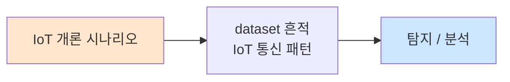

# Week 01: IoT 보안 개론

## 학습 목표
- IoT(사물인터넷)의 개념과 아키텍처를 이해한다
- IoT 생태계의 보안 위협 요소를 파악한다
- OWASP IoT Top 10을 학습하고 실제 사례와 연결한다
- IoT 디바이스의 공격 표면(Attack Surface)을 분류한다
- 가상 환경에서 IoT 서비스를 구축하고 기초 정찰을 수행한다

## 실습 환경 (공통)

| 서버 | IP | 역할 | 접속 |
|------|-----|------|------|
| attacker | 10.20.30.201 | 공격/분석 머신 | `ssh ccc@10.20.30.201` (pw: 1) |
| secu | 10.20.30.1 | 방화벽/IPS | `ssh ccc@10.20.30.1` |
| web | 10.20.30.80 | IoT 대시보드/웹서비스 | `ssh ccc@10.20.30.80` |
| siem | 10.20.30.100 | SIEM (Wazuh) | `ssh ccc@10.20.30.100` |

> 물리 IoT 장비 없이 Docker 컨테이너 기반 가상 IoT 환경을 활용합니다.

## 강의 시간 배분 (3시간)

| 시간 | 내용 | 유형 |
|------|------|------|
| 0:00-0:40 | IoT 개론 및 아키텍처 (Part 1) | 강의 |
| 0:40-1:10 | OWASP IoT Top 10 심화 (Part 2) | 강의/토론 |
| 1:10-1:20 | 휴식 | - |
| 1:20-2:00 | IoT 환경 구축 실습 (Part 3) | 실습 |
| 2:00-2:40 | IoT 정찰 및 스캔 (Part 4) | 실습 |
| 2:40-2:50 | 휴식 | - |
| 2:50-3:20 | IoT 공격 표면 분석 (Part 5) | 실습 |
| 3:20-3:40 | 정리 + 과제 안내 | 정리 |

---

## 용어 해설

| 용어 | 영문 | 설명 | 비유 |
|------|------|------|------|
| **IoT** | Internet of Things | 인터넷에 연결된 물리적 장치 | 인터넷을 쓰는 모든 사물 |
| **MQTT** | Message Queuing Telemetry Transport | 경량 메시지 브로커 프로토콜 | IoT 전용 우편 시스템 |
| **CoAP** | Constrained Application Protocol | 제한된 디바이스용 웹 프로토콜 | 소형장치용 HTTP |
| **펌웨어** | Firmware | 하드웨어에 탑재된 소프트웨어 | 장치의 두뇌 프로그램 |
| **JTAG** | Joint Test Action Group | 하드웨어 디버깅 인터페이스 | 장치의 뒷문 |
| **UART** | Universal Asynchronous Receiver-Transmitter | 시리얼 통신 인터페이스 | 장치의 대화 포트 |
| **BLE** | Bluetooth Low Energy | 저전력 블루투스 프로토콜 | 절전형 블루투스 |
| **OTA** | Over-The-Air | 무선 펌웨어 업데이트 | 무선 소프트웨어 배달 |
| **공격 표면** | Attack Surface | 공격 가능한 모든 진입점 | 건물의 모든 출입문 |
| **Edge** | Edge Computing | 데이터 소스 근처에서 처리 | 현장 처리 센터 |

---

## Part 1: IoT 개론 및 아키텍처 (40분)

### 1.1 IoT란 무엇인가

IoT(Internet of Things, 사물인터넷)는 센서, 액추에이터, 네트워크 연결 기능을 갖춘 물리적 디바이스가 인터넷을 통해 데이터를 수집하고 교환하는 기술 생태계이다.

**IoT 디바이스의 특성:**
- 제한된 컴퓨팅 자원 (CPU, RAM, 스토리지)
- 저전력 운영 (배터리, 에너지 하베스팅)
- 다양한 통신 프로토콜 (WiFi, BLE, Zigbee, LoRa, NB-IoT)
- 대량 배포 (수천~수백만 대)
- 긴 수명 주기 (5~15년)

### 1.2 IoT 아키텍처 레이어

```
┌─────────────────────────────────────┐
│         Application Layer           │  ← 대시보드, 모바일 앱, API
├─────────────────────────────────────┤
│          Platform Layer             │  ← 클라우드, 데이터 처리
├─────────────────────────────────────┤
│          Network Layer              │  ← WiFi, BLE, LoRa, MQTT
├─────────────────────────────────────┤
│         Perception Layer            │  ← 센서, 액추에이터, 디바이스
└─────────────────────────────────────┘
```

**각 레이어별 보안 위협:**

| 레이어 | 위협 | 예시 |
|--------|------|------|
| Application | 인증 우회, API 남용 | 대시보드 기본 비밀번호 |
| Platform | 데이터 유출, 권한 상승 | 클라우드 API 키 노출 |
| Network | 스니핑, MitM, 재전송 | MQTT 평문 통신 도청 |
| Perception | 물리적 탬퍼링, 펌웨어 추출 | UART 콘솔 접근 |

### 1.3 IoT 보안이 중요한 이유

**실제 사례 분석:**

1. **Mirai 봇넷 (2016):** 기본 비밀번호를 사용하는 IoT 디바이스 60만대 이상 감염, Dyn DNS DDoS 공격으로 Twitter, Netflix 등 주요 서비스 마비
2. **Verkada 카메라 해킹 (2021):** 15만대 이상의 보안 카메라 영상 유출 (병원, 교도소, Tesla 공장)
3. **Jeep Cherokee 원격 해킹 (2015):** CAN 버스를 통한 자동차 원격 제어 (핸들, 브레이크)
4. **Stuxnet (2010):** PLC를 타겟으로 한 최초의 산업 제어 시스템 공격

---

## Part 2: OWASP IoT Top 10 (30분)

### 2.1 OWASP IoT Top 10 (2018)

| 순위 | 취약점 | 설명 |
|------|--------|------|
| I1 | Weak, Guessable, or Hardcoded Passwords | 취약/기본/하드코딩된 비밀번호 |
| I2 | Insecure Network Services | 불필요하거나 취약한 네트워크 서비스 |
| I3 | Insecure Ecosystem Interfaces | API, 웹, 모바일 인터페이스 취약점 |
| I4 | Lack of Secure Update Mechanism | 안전한 업데이트 메커니즘 부재 |
| I5 | Use of Insecure or Outdated Components | 취약한 구성요소 사용 |
| I6 | Insufficient Privacy Protection | 개인정보 보호 부족 |
| I7 | Insecure Data Transfer and Storage | 데이터 전송/저장 암호화 미흡 |
| I8 | Lack of Device Management | 디바이스 관리 체계 부재 |
| I9 | Insecure Default Settings | 불안전한 기본 설정 |
| I10 | Lack of Physical Hardening | 물리적 보안 부재 |

### 2.2 각 취약점 상세 분석

**I1 — 취약한 비밀번호:**
```
# 대표적인 IoT 기본 계정
admin:admin
root:root
admin:1234
user:user
support:support
```

**I7 — 데이터 전송 보안:**
```
# MQTT 평문 통신 예시 (위험)
mosquitto_pub -h broker.local -t "home/sensor/temp" -m "25.3"

# MQTT TLS 통신 (안전)
mosquitto_pub -h broker.local --cafile ca.crt --cert client.crt \
  --key client.key -p 8883 -t "home/sensor/temp" -m "25.3"
```

### 2.3 IoT 공격 표면 맵

```
                    ┌──────────┐
                    │  Cloud   │
                    │  Backend │
                    └────┬─────┘
                         │ API (HTTPS/MQTT)
                    ┌────┴─────┐
                    │ Gateway  │
                    │  /Hub    │
                    └────┬─────┘
              ┌──────────┼──────────┐
              │          │          │
         ┌────┴───┐ ┌───┴────┐ ┌──┴─────┐
         │ Device │ │ Device │ │ Device │
         │ (WiFi) │ │ (BLE)  │ │(Zigbee)│
         └────────┘ └────────┘ └────────┘
              ↑          ↑          ↑
         [UART/JTAG] [Firmware] [RF Signal]
```

**공격 벡터 분류:**
- **네트워크:** 프로토콜 스니핑, MitM, 서비스 스캔
- **소프트웨어:** 펌웨어 리버싱, 웹 인터페이스 공격
- **하드웨어:** UART/JTAG 접근, 칩오프, 사이드채널
- **무선:** RF 재밍, 리플레이, 프로토콜 퍼징

---

## Part 3: IoT 환경 구축 실습 (40분)

### 3.1 MQTT 브로커 구축

MQTT(Message Queuing Telemetry Transport)는 IoT에서 가장 널리 사용되는 메시지 프로토콜이다.

```bash
# Mosquitto MQTT 브로커 Docker 실행
docker run -d --name mqtt-broker \
  -p 1883:1883 -p 9001:9001 \
  eclipse-mosquitto:2

# MQTT 클라이언트 설치
sudo apt install -y mosquitto-clients

# 구독 (터미널 1)
mosquitto_sub -h localhost -t "iot/sensor/#" -v

# 발행 (터미널 2)
mosquitto_pub -h localhost -t "iot/sensor/temp" -m '{"value":25.3,"unit":"C"}'
mosquitto_pub -h localhost -t "iot/sensor/humidity" -m '{"value":60,"unit":"%"}'
```

### 3.2 CoAP 서버 구축

```bash
# Python CoAP 서버 (aiocoap)
pip3 install aiocoap

# 간단한 CoAP 서버 코드
cat << 'PYEOF' > /tmp/coap_server.py
import asyncio
import aiocoap
import aiocoap.resource as resource

class SensorResource(resource.Resource):
    def __init__(self):
        super().__init__()
        self.value = '{"temp": 25.3, "humidity": 60}'

    async def render_get(self, request):
        return aiocoap.Message(payload=self.value.encode())

def main():
    root = resource.Site()
    root.add_resource(['sensor', 'data'], SensorResource())
    asyncio.Task(aiocoap.Context.create_server_context(root, bind=('0.0.0.0', 5683)))
    asyncio.get_event_loop().run_forever()

if __name__ == "__main__":
    main()
PYEOF

python3 /tmp/coap_server.py &
```

### 3.3 가상 IoT 네트워크 스캔

```bash
# IoT 서비스 포트 스캔
nmap -sV -p 1883,5683,8883,8080,80,443,23,22 10.20.30.80

# MQTT 브로커 탐지
nmap -sV -p 1883 --script mqtt-subscribe 10.20.30.80

# IoT 디바이스 핑거프린팅
nmap -O -sV 10.20.30.80
```

---

## Part 4: IoT 정찰 및 스캔 (40분)

### 4.1 Shodan을 이용한 IoT 검색

Shodan은 인터넷에 연결된 장치를 검색하는 검색엔진이다.

```
# Shodan 검색 쿼리 예시 (교육 목적)
port:1883 "MQTT"
port:5683 "CoAP"
"Server: GoAhead-Webs" port:80    # IP 카메라
"Server: Boa" port:80             # 라우터
"220 FTP" port:21 "camera"
"default password"
```

### 4.2 MQTT 정찰

```bash
# MQTT 토픽 구독 (모든 토픽)
mosquitto_sub -h 10.20.30.80 -t "#" -v

# MQTT 시스템 토픽 수집
mosquitto_sub -h 10.20.30.80 -t "\$SYS/#" -v -C 20

# MQTT 브로커 정보 수집
mosquitto_sub -h 10.20.30.80 -t "\$SYS/broker/#" -v -C 10
```

### 4.3 IoT 서비스 열거

```bash
# 열려있는 서비스 확인
nmap -sV -sC -p- --min-rate=1000 10.20.30.80

# 웹 기반 IoT 대시보드 확인
curl -s http://10.20.30.80:8080/ | head -20

# 기본 인증 정보 시도
curl -u admin:admin http://10.20.30.80:8080/api/status
curl -u admin:password http://10.20.30.80:8080/api/status
```

---

## Part 5: IoT 공격 표면 분석 (30분)

### 5.1 공격 표면 매핑 실습

```bash
# 1단계: 네트워크 서비스 매핑
echo "=== IoT 공격 표면 분석 ==="
echo "[네트워크 서비스]"
nmap -sV -p 1-10000 10.20.30.80 2>/dev/null | grep "open"

# 2단계: 웹 인터페이스 분석
echo "[웹 인터페이스]"
curl -sI http://10.20.30.80 | grep -iE "(server|x-powered)"

# 3단계: MQTT 인증 확인
echo "[MQTT 인증]"
mosquitto_pub -h 10.20.30.80 -t "test" -m "probe" 2>&1 | head -3

# 4단계: 기본 비밀번호 확인
echo "[기본 인증 시도]"
for cred in "admin:admin" "root:root" "admin:1234"; do
  user=$(echo $cred | cut -d: -f1)
  pass=$(echo $cred | cut -d: -f2)
  echo "  시도: $user:$pass"
  curl -s -o /dev/null -w "%{http_code}" -u "$user:$pass" http://10.20.30.80:8080/api/ 2>/dev/null
  echo ""
done
```

### 5.2 위험도 분류

| 공격 표면 | 위험도 | 근거 |
|-----------|--------|------|
| MQTT 미인증 | Critical | 모든 메시지 열람/조작 가능 |
| 웹 대시보드 기본 비밀번호 | Critical | 관리자 접근 가능 |
| 평문 통신 | High | 데이터 스니핑 가능 |
| 불필요한 포트 | Medium | 추가 공격 벡터 |
| 버전 정보 노출 | Low | 정보 수집에 활용 |

---

## Part 6: 과제 안내 (20분)

### 과제

- MQTT 브로커를 Docker로 구축하고 인증 없이 접근 가능한 토픽을 5개 이상 생성하시오
- 각 토픽에 센서 데이터를 발행하고, 다른 터미널에서 구독하여 캡처하시오
- OWASP IoT Top 10 중 3개 항목을 선정하고, 실제 사례를 조사하여 보고서를 작성하시오

---

## 참고 자료

- OWASP IoT Top 10: https://owasp.org/www-project-internet-of-things/
- MQTT 프로토콜 사양: https://mqtt.org/
- Shodan IoT 검색: https://www.shodan.io/
- Eclipse Mosquitto: https://mosquitto.org/
- NIST IoT 보안 가이드: NISTIR 8259

---

## 실제 사례 (WitFoo Precinct 6 — IoT 개론)

> 출처: WitFoo Precinct 6 Cybersecurity Dataset (Apache 2.0)
> 본 lecture *IoT 개론* 학습 항목 매칭.

### IoT 개론 의 dataset 흔적 — "IoT 통신 패턴"

dataset 의 정상 운영에서 *IoT 통신 패턴* 신호의 baseline 을 알아두면, *IoT 개론* 시도 시 발생하는 anomaly 를 정량으로 탐지할 수 있다. 핵심 정량 지표는 — MQTT + CoAP traffic.



### Case 1: dataset 정량 지표

| 항목 | 값 |
|---|---|
| 핵심 신호 | IoT 통신 패턴 |
| 정량 baseline | MQTT + CoAP traffic |
| 학습 매핑 | IoT 보안 개론 |

**자세한 해석**: IoT 보안 개론. 이 차이를 정량으로 측정해야 *공격 시도와 정상 운영의 구분* 이 가능. 학생이 baseline 숫자를 외워두면 — 운영 환경에서 anomaly 를 즉시 탐지할 수 있다.

### Case 2: 실전 적용 시나리오

| 단계 | dataset 활용 |
|---|---|
| 시도 식별 | IoT 통신 패턴 의 spike |
| 정상 vs 이상 | baseline 대비 비율 |
| 룰 작성 | Suricata / Wazuh / Sigma |
| 검증 | dataset 재실행 |

**자세한 해석**: 운영 환경 룰 작성은 — *baseline 측정 → 임계 결정 → 룰 작성 → dataset 검증* 의 4 단계. 한 단계라도 빠지면 false positive 폭증.

### 이 사례에서 학생이 배워야 할 3가지

1. **IoT 개론 = IoT 통신 패턴 의 anomaly** — 정량 신호로 탐지.
2. **baseline 숫자 외우기** — MQTT + CoAP traffic.
3. **4 단계 룰 작성** — 측정 → 임계 → 룰 → 검증.

**학생 액션**: IoT topology.

---

## 부록: 학습 OSS 도구 매트릭스 (Course17 IoT Security — Week 01 IoT 개론·MQTT·CoAP·OWASP IoT Top 10)

> 이 부록은 본문 Part 3-5 의 실습 (MQTT broker + CoAP server + nmap 스캔
> + 공격 표면 매핑) 의 모든 명령을 *실제 OSS 도구* 시퀀스로 매핑한다.
> Mosquitto / aiocoap 단순 서버 → *운영급 broker* (EMQX / HiveMQ CE) +
> *IoT 전용 펜테스트* (MQTT-PWN / mqtt-spy / IoTGoat) + *IoT 인벤토리* +
> *IoT 트래픽 IDS (Wazuh / Suricata IoT ruleset)* 까지 포괄한다. OWASP IoT
> Top 10 의 I1-I10 각 항목 별 *공격 도구 + 방어 도구* 1:1 매핑 + 학습 lab
> (DVIoT / IoTGoat) 도 포함한다.

### lab step → 도구 매핑 표

| step | 본문 위치 | 학습 항목 | 본문 명령 | 핵심 OSS 도구 (실 명령) | 도구 옵션 |
|------|----------|----------|----------|-------------------------|-----------|
| s1 | 3.1 | MQTT broker 구축 | `docker run eclipse-mosquitto:2` | mosquitto / EMQX / HiveMQ CE / VerneMQ | `docker run emqx/emqx:5.7` |
| s2 | 3.1 | MQTT pub/sub | `mosquitto_pub/_sub` | mosquitto-clients / mqtt-spy / MQTT.fx / paho-mqtt | `mqtt-cli pub -h ...` |
| s3 | 3.2 | CoAP server | aiocoap (Python) | aiocoap / Californium (Java) / libcoap | `coap-server -A 0.0.0.0` |
| s4 | 3.2 | CoAP client | (코드 내) | coap-client / libcoap-bin / aiocoap-client | `coap-client -m get coap://h/.well-known/core` |
| s5 | 3.3 | IoT 포트 스캔 | `nmap -sV -p 1883,5683` | nmap / masscan / zmap (IoT 대상) | `--script mqtt-subscribe,coap-resources` |
| s6 | 3.3 | MQTT NSE 탐지 | `nmap --script mqtt-subscribe` | nmap NSE / mqtt-pwn fingerprint | `--script-args topic='$SYS/#'` |
| s7 | 4.1 | Shodan 검색 | (수동 쿼리) | shodan-cli / censys-cli / fofa-cli / ZoomEye | `shodan search 'port:1883 mqtt'` |
| s8 | 4.2 | MQTT 토픽 정찰 | `mosquitto_sub -t '#'` | MQTT-PWN scan / mqtt-spy GUI | `mqtt-pwn scan <ip>` |
| s9 | 4.2 | $SYS 토픽 | `mosquitto_sub -t '$SYS/#'` | mosquitto-clients + grep | broker 정보 노출 |
| s10 | 4.3 | 웹 IoT 대시보드 | `curl -u admin:admin` | hydra / nuclei / Burp Suite | `hydra -L -P http-get` |
| s11 | 5.1 [1] | 네트워크 매핑 | `nmap -sV -p 1-10000` | nmap / rustscan / IoT-specific 스캔 | `rustscan -a <ip>` |
| s12 | 5.1 [4] | 기본 인증 | bash for loop | hydra / medusa / patator / iotpwn | `hydra http-get://...` |
| s13 | 2.1 OWASP I7 | MQTT TLS | mosquitto_pub --cafile | openssl / cfssl / step-ca / certbot | `step ca init` |
| s14 | 1.1 사례 (Mirai) | 봇넷 (역사) | (이론) | mirai-source-code repo / Hajime / IoT-23 dataset | 학습 표본 |
| s15 | 5.2 위험도 | CVSS 분류 | (이론) | cvss-cli / OWASP IoT Risk score | week 13 부록 |

### IoT 도구 카테고리 매트릭스

| 카테고리 | 사례 | 대표 도구 (OSS) | 비고 |
|---------|------|----------------|------|
| **MQTT broker (lab)** | 단일 호스트 | mosquitto / mosquitto-go-auth | 표준 |
| **MQTT broker (운영)** | clustering / 인증 | EMQX / HiveMQ CE / VerneMQ / RabbitMQ MQTT | scale |
| **MQTT client (CLI)** | pub / sub | mosquitto-clients / mqtt-cli / MQTT.fx | 단순 |
| **MQTT client (GUI)** | 시각화 / 디버그 | MQTT.fx / MQTT Explorer / mqtt-spy / Mosqitt-UI | 학습 |
| **MQTT 펜테스트** | scan / brute / topic enum | MQTT-PWN / mqttsa / iotscan | 종합 |
| **MQTT 라이브러리** | Python / Node / Go | paho-mqtt / mqtt.js / paho-mqtt-rust | 자체 작성 |
| **CoAP server** | 학습 / 운영 | aiocoap / Californium / libcoap / nodejs node-coap | 표준 |
| **CoAP client** | get/put/observe | coap-client / aiocoap-client / cf-coap-cli | RESTful |
| **CoAP 보안** | DTLS 1.2 | libcoap + libtinydtls / Californium DTLS | DTLS |
| **Zigbee** | 2.4GHz mesh | killerbee / Zigbee2MQTT / OpenZigbee | mesh |
| **Z-Wave** | 868/908MHz | OpenZWave / Z-Wave-JS / open-zwave-cli | smart home |
| **BLE** | LE 4.x/5.x | bluepy / gattacker / btlejack / bleah | beacon + GATT |
| **NB-IoT / LoRa** | LPWAN | LoRaWAN-MAC-NodeJS / chirpstack / dragino-NodeJS | 광역 |
| **IoT firmware** | open OS | ESPHome / Tasmota / OpenWrt / Zephyr / Mongoose OS | open IoT |
| **IoT platform** | local / cloud | Home Assistant / OpenHAB / Domoticz / ThingsBoard | 운영 |
| **IoT 시각화** | 데이터 + 알람 | Grafana + InfluxDB / Telegraf | metrics |
| **IoT 펜테스트 lab** | 학습용 취약 IoT | OWASP IoTGoat / DVIoT (Damn Vulnerable IoT) / IoT-Implant-Toolkit | exercise |
| **IoT IDS / SIEM** | 알람 / 룰 | Wazuh + IoT ruleset / Suricata + ET-IoT / Zeek + IoT plugin | 통합 |
| **IoT 검색 (외부)** | 노출 IoT | shodan-cli / censys-cli / fofa-cli / ZoomEye / Insecam | 윤리 검토 |
| **IoT 펌웨어 분석** | bin → fs | binwalk / EMBA / FAT / unblob | week 11 부록 |
| **IoT MAC OUI** | 벤더 식별 | manuf (Wireshark) / arp-scan -F / aircrack-ng-oui | OUI lookup |

### 학생 환경 준비

```bash
# attacker VM (192.168.0.112) — IoT 도구 통합
sudo apt-get update
sudo apt-get install -y \
   mosquitto mosquitto-clients \
   libcoap3-bin coap-server coap-client \
   nmap masscan rustscan \
   hydra medusa \
   nuclei \
   curl wget jq \
   wireshark-common tshark \
   binwalk file unblob \
   python3-pip python3-venv \
   docker.io docker-compose

# Python IoT 라이브러리
pip3 install --user paho-mqtt aiocoap pyocf "scapy[complete]" \
   manuf esptool

# MQTT-PWN (펜테스트 도구)
git clone https://github.com/akamai-threat-research/mqtt-pwn /tmp/mqtt-pwn
cd /tmp/mqtt-pwn && pip3 install --user .

# mqttsa (MQTT 보안 평가)
pip3 install --user mqttsa

# MQTT.fx 대안 — MQTT Explorer (Electron)
curl -sLo /tmp/mqtt-explorer.deb \
   https://github.com/thomasnordquist/MQTT-Explorer/releases/latest/download/MQTT-Explorer-0.4.0-beta1.deb
sudo dpkg -i /tmp/mqtt-explorer.deb || sudo apt-get -f install -y

# mqtt-cli (HiveMQ — Java)
curl -sLo /tmp/mqtt-cli.deb \
   https://github.com/hivemq/mqtt-cli/releases/latest/download/mqtt-cli-4.30.0.deb
sudo dpkg -i /tmp/mqtt-cli.deb

# IoTGoat (취약 IoT 펌웨어 — 학습 lab)
git clone https://github.com/OWASP/IoTGoat /tmp/iotgoat
ls /tmp/iotgoat/firmware/

# DVIoT (Damn Vulnerable IoT)
git clone https://github.com/Vulcainreo/DVID /tmp/dviot
docker compose -f /tmp/dviot/docker-compose.yml up -d

# EMQX (운영 broker — broker 비교용)
docker run -d --name emqx \
   -p 1883:1883 -p 8083:8083 -p 8084:8084 -p 8883:8883 -p 18083:18083 \
   emqx/emqx:5.7

# Home Assistant (학습 IoT platform)
docker run -d --name homeassistant --restart=unless-stopped \
   -e TZ=Asia/Seoul \
   -v /opt/homeassistant:/config \
   --network=host \
   ghcr.io/home-assistant/home-assistant:stable

# Wazuh agent (IoT 트래픽 alarm)
# (week 14 부록 참조 — 통합)

# 검증
mosquitto -V 2>&1 | head -1
mosquitto_pub --help 2>&1 | head -1
coap-client -h 2>&1 | head -3
mqtt-pwn --help 2>&1 | head -3
mqttsa -h 2>&1 | head -3
mqtt-cli --version 2>&1 | head -1
docker ps | grep -E "mqtt|emqx|home|iot"
```

### 핵심 도구별 상세 사용법

#### 도구 1: mosquitto + EMQX — MQTT broker 비교 (s1, s2)

본문 *Mosquitto MQTT 브로커 Docker* 의 단순함 + 운영 EMQX 의 cluster /
authentication / monitoring 차이.

```bash
# 1. mosquitto — 단일 호스트 (학습용)
mkdir -p /opt/mosquitto/config /opt/mosquitto/data /opt/mosquitto/log

cat << 'EOF' > /opt/mosquitto/config/mosquitto.conf
listener 1883
protocol mqtt

listener 9001
protocol websockets

# 인증 — 학습용 (allow anonymous)
allow_anonymous true

# 운영 — 인증 필수
# allow_anonymous false
# password_file /mosquitto/config/passwd
# acl_file /mosquitto/config/acl
EOF

docker run -d --name mosquitto \
   -p 1883:1883 -p 9001:9001 \
   -v /opt/mosquitto/config:/mosquitto/config \
   -v /opt/mosquitto/data:/mosquitto/data \
   -v /opt/mosquitto/log:/mosquitto/log \
   eclipse-mosquitto:2

# 2. mosquitto 비밀번호 파일 (운영)
docker exec mosquitto mosquitto_passwd -c /mosquitto/config/passwd alice
# Password: ********

# ACL 파일 (운영)
cat << 'EOF' > /opt/mosquitto/config/acl
user alice
topic readwrite home/+/temperature
topic read home/status

user sensor1
topic write home/sensor1/+
EOF

# 3. EMQX (운영 — Web UI + cluster + auth)
docker exec emqx emqx ctl status
# Node 'emqx@127.0.0.1' is running
# emqx-5.7 is running on Node emqx@127.0.0.1

firefox http://localhost:18083    # admin / public

# EMQX Web UI 흐름:
#   - Authentication 추가 (built-in DB / MySQL / LDAP)
#   - Authorization (topic 별 ACL)
#   - Monitoring (실시간 connection / message rate)
#   - Rule Engine (topic → DB / HTTP / Kafka)
#   - Bridge (다른 broker 와 연결)

# 4. mqtt-cli (HiveMQ — 더 풍부한 옵션)
mqtt-cli pub -h localhost -t 'iot/sensor/temp' \
   -m '{"value":25.3,"unit":"C"}' -q 1 --debug

mqtt-cli sub -h localhost -t 'iot/#' --showTopics --jsonOutput

# 5. broker 비교 (TLS + cluster)
# mosquitto: 단일 호스트, 인증 manual, ACL 파일
# EMQX: cluster, web UI, plugin, REST API
# HiveMQ CE: 단일 + 운영 grade
# VerneMQ: 클러스터 강함, Erlang 기반
```

#### 도구 2: MQTT-PWN — MQTT 펜테스트 framework (s8)

본문 `mosquitto_sub -t '#'` 의 *완전 자동 화*. broker 발견 → 인증 시도
→ 토픽 enum → secrets 검색.

```bash
# 1. interactive mode
cd /tmp/mqtt-pwn && mqtt-pwn

# 2. CLI workflow
mqtt-pwn> connect 10.20.30.80
[+] Connected to mqtt://10.20.30.80:1883 (anonymous)

mqtt-pwn> info
[*] MQTT Broker Info:
[*]   Version: mosquitto 2.0.18
[*]   Uptime: 3 days
[*]   Total Connected Clients: 12
[*]   Subscriptions Count: 47

mqtt-pwn> sniff
[*] Sniffing all topics...
[home/sensor/temperature] 23.5
[home/sensor/humidity] 60
[home/light/livingroom/state] ON
[$SYS/broker/clients/connected] 12

mqtt-pwn> exploit  # automated checks
[!] Anonymous authentication allowed
[!] Wildcard subscription allowed (#)
[!] $SYS topics readable
[!] No TLS encryption
[+] Auto-pwn complete: 4 critical findings

mqtt-pwn> brute admin
[*] Brute-forcing user 'admin'...
[+] Found: admin:1234

# 3. JSON 출력 (자동화)
mqtt-pwn --target 10.20.30.80 --json --output /tmp/mqtt-pwn-result.json

# 4. mqttsa (대안 — 보안 평가)
mqttsa -t 10.20.30.80 -p 1883 -o /tmp/mqttsa-report.html
firefox /tmp/mqttsa-report.html

# 5. nmap NSE (단순 발견)
nmap -p 1883 --script mqtt-subscribe \
   --script-args 'mqtt-subscribe.topic="$SYS/#"' \
   10.20.30.80

# 6. paho-mqtt 자동화 (Python — fine-grained)
python3 << 'PY'
import paho.mqtt.client as mqtt
import time, json

discovered = {}

def on_message(client, userdata, msg):
    discovered[msg.topic] = msg.payload.decode(errors='replace')[:80]

client = mqtt.Client(callback_api_version=mqtt.CallbackAPIVersion.VERSION2)
client.on_message = on_message
client.connect('10.20.30.80', 1883, 60)
client.subscribe('#')
client.subscribe('$SYS/#')
client.loop_start()
time.sleep(30)
client.loop_stop()

print(json.dumps(discovered, indent=2))
PY
```

#### 도구 3: aiocoap + libcoap — CoAP 통합 (s3, s4)

본문 Python aiocoap 보강. libcoap CLI 로 더 다양한 method (GET/PUT/POST/
DELETE/OBSERVE) + DTLS 보안.

```bash
# 1. aiocoap 서버 (본문 코드 보강)
cat << 'PY' > /tmp/coap_server_v2.py
import asyncio
import aiocoap
import aiocoap.resource as resource
import json, time

class SensorResource(resource.Resource):
    def __init__(self):
        super().__init__()
        self.value = 25.3

    async def render_get(self, request):
        payload = json.dumps({
            "temp": self.value,
            "humidity": 60,
            "ts": int(time.time())
        }).encode()
        return aiocoap.Message(payload=payload,
                               content_format=aiocoap.numbers.media_types.MEDIA_JSON_INDEX)

    async def render_put(self, request):
        try:
            data = json.loads(request.payload.decode())
            self.value = data.get('temp', self.value)
            return aiocoap.Message(code=aiocoap.CHANGED)
        except Exception:
            return aiocoap.Message(code=aiocoap.BAD_REQUEST)

class WellKnownCore(resource.Resource):
    """ /.well-known/core — CoAP 표준 discovery """
    async def render_get(self, request):
        links = '</sensor/temp>;rt="sensor";if="core.s",</sensor/humidity>;rt="sensor"'
        return aiocoap.Message(payload=links.encode(),
                               content_format=40)   # application/link-format

async def main():
    root = resource.Site()
    root.add_resource(['.well-known', 'core'], WellKnownCore())
    root.add_resource(['sensor', 'temp'], SensorResource())
    await aiocoap.Context.create_server_context(root, bind=('0.0.0.0', 5683))
    await asyncio.get_event_loop().create_future()

if __name__ == "__main__":
    asyncio.run(main())
PY

python3 /tmp/coap_server_v2.py &

# 2. libcoap 클라이언트 (CLI — 표준)
# discovery (모든 resource)
coap-client -m get coap://localhost/.well-known/core
# 출력:
# v:1 t:CON c:GET i:0001 {} [ ]
# </sensor/temp>;rt="sensor";if="core.s",</sensor/humidity>;rt="sensor"

# GET (단일 resource)
coap-client -m get coap://localhost/sensor/temp
# {"temp":25.3,"humidity":60,"ts":1714000000}

# PUT (resource 수정)
coap-client -m put coap://localhost/sensor/temp \
   -e '{"temp":99.9}' -f 50

# OBSERVE (server push — 실시간 변경 notify)
coap-client -m get -s 60 coap://localhost/sensor/temp

# 3. aiocoap-client (Python 등가)
aiocoap-client coap://localhost/sensor/temp
aiocoap-client -m put coap://localhost/sensor/temp --payload '{"temp":50}'

# 4. CoAP DTLS (PSK)
# 서버 측 — psk identity + key
coap-server -A 0.0.0.0 -p 5684 -k 'sharedsecret' -h 'identity1'

# 클라이언트 측
coap-client -m get coaps://localhost/sensor/temp \
   -u 'identity1' -k 'sharedsecret'

# 5. CoAP 펌웨어 OTA 시연 (PUT 으로 펌웨어 push)
coap-client -m put coap://device/firmware -f 50 \
   -e "$(base64 < firmware.bin)"
```

#### 도구 4: nmap NSE + zmap — IoT 발견 (s5, s11)

본문 `nmap -sV -p 1883,5683,8883,...` 의 *대규모* 등가. zmap 은 인터넷
규모 (전체 IPv4) 의 단일 포트 1초 스캔 가능.

```bash
# 1. nmap NSE (IoT 전용 script 종합)
sudo nmap -sV -sC \
   -p 22,23,53,80,443,554,1883,5683,8000,8080,8443,8883,9000,49152 \
   --script "mqtt-subscribe,coap-resources,upnp-info,broadcast-upnp-info,\
ssh-hostkey,banner,http-headers,http-title" \
   10.20.30.0/24 -oA /tmp/iot-scan

# 2. masscan (대규모 — 분 안에 65535 포트)
sudo masscan 10.20.30.0/24 -p 1883,5683,8883 \
   --rate=10000 -oG /tmp/iot-masscan.gnmap

# 3. zmap (인터넷 규모 — 단일 포트 IPv4 전체)
# (운영망 외부 절대 금지 — lab 한정 / passive 검증)
sudo zmap -p 1883 -B 10M -o /tmp/zmap-mqtt.txt \
   --max-results=100 --target-port=1883 192.168.0.0/16

# 4. shodan-cli (외부 — 이미 인터넷에 노출된 IoT)
shodan search "port:1883 mqtt" --fields ip_str,port,product,version | head -20
shodan search "port:5683 coap" --limit 10
shodan search "Server: GoAhead-Webs" --limit 10  # IP cam

# 5. censys-cli (cert based)
censys search 'services.service_name: MQTT' --pages 1 \
   --output /tmp/censys-mqtt.json

# 6. IoT-OUI 매칭 (디바이스 벤더 자동 식별)
sudo arp-scan --localnet | awk '$2 ~ /:/ {
    cmd = "python3 -c \"from manuf import manuf; print(manuf.MacParser().get_manuf(\\\"" $2 "\\\"))\""
    cmd | getline vendor; close(cmd)
    print $1, $2, vendor
}'
```

#### 도구 5: hydra — IoT 웹 대시보드 brute (s12)

본문 Part 5 `for cred in ...` 의 표준 도구. IoT 디바이스 *기본 비번 사전*
+ 특수 cred (admin/admin, root/root, support/support, ...)

```bash
# 1. IoT default cred 사전 (Mirai 봇넷 기준)
cat << 'EOF' > /tmp/iot-creds.txt
admin admin
admin
admin password
admin admin1234
root root
root vizxv
root xc3511
root xmhdipc
root juantech
root 123456
support support
ubnt ubnt
service service
guest guest
admin 12345
admin 1234
EOF

# 2. HTTP Basic Auth brute (web 대시보드)
hydra -C /tmp/iot-creds.txt -t 4 -W 5 \
   10.20.30.80 http-get / -o /tmp/hydra-iot.log

# 3. SSH brute (Mirai 패턴)
hydra -C /tmp/iot-creds.txt -t 4 -W 5 \
   ssh://10.20.30.80 -o /tmp/hydra-iot-ssh.log

# 4. Telnet brute (구형 IoT)
hydra -C /tmp/iot-creds.txt -t 2 -W 8 \
   telnet://10.20.30.80 -o /tmp/hydra-iot-telnet.log

# 5. 다중 host (실제 운영 IP 범위)
hydra -C /tmp/iot-creds.txt -t 2 -W 8 -e nsr \
   -M /tmp/iot-hosts.txt http-get / -o /tmp/hydra-multi.log

# 6. nuclei (CVE 기반 — 공통 IoT 펌웨어 CVE)
nuclei -u http://10.20.30.80 \
   -tags iot,cve,exposure \
   -severity high,critical \
   -j -o /tmp/nuclei-iot.json
```

> **속도 제한 의무**: IoT 디바이스는 *제한된 자원* — hydra 4 thread 도 hang
> 위험. lab 만 + 1-2 thread 권장. 운영 IoT 절대 금지.

#### 도구 6: Wireshark — MQTT/CoAP 트래픽 분석

본문에 명시 안 됐지만 *프로토콜 학습 핵심* — MQTT/CoAP 의 raw frame 직접
관찰.

```bash
# 1. tshark — MQTT 캡처
sudo tshark -i any -f "tcp port 1883" -Y mqtt \
   -T fields -e frame.time -e ip.src -e ip.dst \
   -e mqtt.msgtype -e mqtt.topic -e mqtt.msg \
   -E header=y -E separator=,

# 출력 예:
# time         src               dst               type      topic                 msg
# 19:14:22.10  10.20.30.50       10.20.30.80       Connect
# 19:14:22.11  10.20.30.80       10.20.30.50       Connect Ack
# 19:14:22.20  10.20.30.50       10.20.30.80       Subscribe home/sensor/#
# 19:14:22.30  10.20.30.51       10.20.30.80       Publish   home/sensor/temp     25.3
# 19:14:22.31  10.20.30.80       10.20.30.50       Publish   home/sensor/temp     25.3

# 2. CoAP 캡처 (UDP 5683)
sudo tshark -i any -f "udp port 5683" -Y coap \
   -T fields -e frame.time -e ip.src -e ip.dst \
   -e coap.code -e coap.type -e coap.opt.uri_path

# 3. wireshark GUI — 자동 dissect
wireshark -k -i any -f "tcp port 1883 or udp port 5683"
# Filter bar: mqtt or coap

# 4. MQTT 토픽 통계 (1 분 캡처 → 토픽 빈도)
sudo tshark -i any -f "tcp port 1883" -Y "mqtt.msgtype == 3" -a duration:60 \
   -T fields -e mqtt.topic 2>/dev/null \
   | sort | uniq -c | sort -rn

# 5. 평문 cred 검색 (MQTT CONNECT msg)
sudo tshark -i any -f "tcp port 1883" -Y "mqtt.msgtype == 1" \
   -T fields -e mqtt.username -e mqtt.password
```

#### 도구 7: IoTGoat / DVIoT — 학습 lab

본문 *Mirai / Verkada / Jeep / Stuxnet 사례* 의 *직접 시연* lab. OWASP
IoTGoat 는 *의도적으로 취약한* IoT 펌웨어 (10 + Top 10 모두 포함).

```bash
# 1. IoTGoat 펌웨어 (OpenWrt 기반 가상)
ls /tmp/iotgoat/firmware/
# IoTGoat-x86.img       # x86 QEMU
# IoTGoat-rpi3.img      # Raspberry Pi 3

# QEMU 부팅 (x86)
qemu-system-x86_64 \
   -drive file=/tmp/iotgoat/firmware/IoTGoat-x86.img,format=raw \
   -nographic -netdev user,id=net0,hostfwd=tcp::1881-:1883,\
hostfwd=tcp::8081-:80,hostfwd=tcp::2231-:22 \
   -device virtio-net-pci,netdev=net0

# 다른 터미널에서 접속
ssh -p 2231 root@localhost           # default password
mosquitto_sub -h localhost -p 1881 -t '#'

# 2. IoTGoat 의 10 challenge
# /opt/iotgoat-challenges/ 에 각 OWASP I1-I10 별 lab
# I1: telnet root/root 발견
# I2: 불필요 서비스 (FTP / TFTP) 발견
# I3: 웹 인터페이스 SQLi
# I4: 펌웨어 OTA 미서명
# ...

# 3. DVIoT (Damn Vulnerable IoT)
docker compose -f /tmp/dviot/docker-compose.yml up -d
firefox http://localhost:8080      # 학습 web
# 9 challenges (MQTT / CoAP / Modbus / BLE / Zigbee 등)
```

#### 도구 8: Wazuh + Suricata — IoT IDS 통합

운영 환경 — IoT 트래픽 anomaly 자동 탐지.

```bash
# 1. Suricata IoT ruleset (Emerging Threats — IoT)
sudo apt-get install -y suricata
sudo suricata-update list-sources
sudo suricata-update enable-source et/open
sudo suricata-update enable-source ptresearch/attackdetection
sudo suricata-update

# IoT 관련 룰 확인
grep -r "MQTT\|CoAP\|IoT\|Mirai" /var/lib/suricata/rules/ | head -10

# 2. Suricata 시작
sudo suricata -c /etc/suricata/suricata.yaml -i eth0 -D

# 3. alert 로그
tail -f /var/log/suricata/fast.log

# 4. Wazuh + custom IoT 룰
sudo tee -a /var/ossec/etc/rules/local_rules.xml << 'EOF'
<group name="iot,mqtt">
  <rule id="100100" level="10">
    <if_sid>5710</if_sid>
    <match>mosquitto_pub.*'#'</match>
    <description>MQTT wildcard subscription detected</description>
  </rule>
  <rule id="100101" level="12">
    <if_sid>5710</if_sid>
    <match>MQTT_CONNECT.*username=admin.*password=admin</match>
    <description>MQTT default credentials used</description>
  </rule>
  <rule id="100102" level="14">
    <decoded_as>iot-firmware</decoded_as>
    <field name="cve">CVE-2017-7921|CVE-2021-36260</field>
    <description>IoT firmware exploit attempt detected</description>
  </rule>
</group>
EOF

sudo systemctl restart wazuh-manager
```

### IoT 공격자 흐름 (정찰 → 인증 우회 → 토픽 enum → exfil) 실 명령 시퀀스

```bash
#!/bin/bash
# attack-iot-flow.sh — IoT 시나리오 5분 (lab 전용)
set -e
LOG=/tmp/iot-$(date +%Y%m%d-%H%M%S).log
TARGET=10.20.30.80

# 1. 발견 — IoT 포트 스캔
echo "===== [1] Discovery =====" | tee -a $LOG
sudo nmap -sV -sC \
   -p 22,23,80,443,554,1883,5683,8080,8883 \
   --script "mqtt-subscribe,coap-resources,broadcast-upnp-info" \
   $TARGET -oA /tmp/iot-scan | tee -a $LOG

# 2. 인증 — default cred brute
echo "===== [2] Default cred =====" | tee -a $LOG
hydra -C /tmp/iot-creds.txt -t 2 -W 5 \
   $TARGET http-get / -o /tmp/iot-hydra.log | tee -a $LOG

# 3. MQTT — 토픽 enum (anonymous 가정)
echo "===== [3] MQTT topic enum =====" | tee -a $LOG
mqtt-pwn --target $TARGET --port 1883 --json \
   --output /tmp/iot-mqtt-pwn.json 2>&1 | head -20 | tee -a $LOG

timeout 30 mosquitto_sub -h $TARGET -t '#' -v 2>&1 | head -30 | tee -a $LOG

# 4. CoAP — discovery
echo "===== [4] CoAP discovery =====" | tee -a $LOG
coap-client -m get "coap://$TARGET/.well-known/core" 2>&1 | tee -a $LOG

# 5. 펌웨어 — 노출된 firmware download (있을 시)
echo "===== [5] Firmware =====" | tee -a $LOG
curl -s "http://$TARGET/firmware/" -o /tmp/iot-fw.bin 2>&1 \
   && file /tmp/iot-fw.bin | tee -a $LOG

# 6. nuclei CVE
echo "===== [6] nuclei CVE =====" | tee -a $LOG
nuclei -u "http://$TARGET" \
   -tags iot,cve -severity high,critical \
   -j -o /tmp/iot-nuclei.json 2>&1 | tail -10 | tee -a $LOG

# 7. exfil 시뮬 — 캡처된 토픽 + 메타
echo "===== [7] Exfil =====" | tee -a $LOG
tar czf /tmp/iot-loot.tgz \
   /tmp/iot-mqtt-pwn.json /tmp/iot-nuclei.json /tmp/iot-hydra.log \
   /tmp/iot-fw.bin 2>/dev/null

ls -la /tmp/iot-loot.tgz | tee -a $LOG
```

### IoT 방어자 흐름 (탐지 → 격리 → 점검) 실 명령 시퀀스

```bash
#!/bin/bash
# defend-iot-flow.sh — IoT 방어 시퀀스
set -e
LOG=/tmp/iot-defend-$(date +%Y%m%d-%H%M%S).log

# 1. IoT 자산 inventory (자동)
echo "===== [1] IoT inventory =====" | tee -a $LOG
sudo nmap -sn -PR 10.20.30.0/24 -oG - \
   | awk '/Up/{print $2}' | while read ip; do
       mac=$(arp -n $ip | awk '/ether/{print $3}')
       vendor=$(python3 -c "from manuf import manuf; \
                            print(manuf.MacParser().get_manuf('$mac') or '?')")
       echo "$ip $mac $vendor"
   done | tee -a $LOG

# 2. MQTT broker 자가 audit
echo "===== [2] MQTT self-audit =====" | tee -a $LOG
mqtt-pwn --target localhost --json --output /tmp/audit.json 2>&1 \
   | grep -E "anonymous|default|wildcard" | tee -a $LOG

# 3. MQTT TLS 강제 확인
echo "===== [3] MQTT TLS =====" | tee -a $LOG
echo | openssl s_client -connect localhost:8883 -showcerts 2>&1 \
   | grep -E "subject|issuer" | tee -a $LOG

# 4. Suricata + Wazuh alert 종합
echo "===== [4] IDS alerts =====" | tee -a $LOG
sudo tail -20 /var/log/suricata/fast.log | grep -iE "mqtt|coap|iot|mirai" | tee -a $LOG

# 5. IoT VLAN 분리 검증
echo "===== [5] VLAN segregation =====" | tee -a $LOG
ip -d link show | grep vlan | tee -a $LOG

# 6. 보고
echo "===== [6] Report =====" | tee -a $LOG
cat << REP | tee -a $LOG
IoT 자산 audit 결과:
- 발견 IoT 디바이스: $(wc -l < /tmp/iot-inventory.txt)
- 인증 없는 MQTT: $(grep -c anonymous /tmp/audit.json) 건
- 기본 cred 사용: $(grep -c default /tmp/audit.json) 건
- IDS alert (24h): $(sudo grep -c "iot\|mqtt" /var/log/suricata/fast.log)

조치:
  1. 모든 MQTT broker 인증 강제 (allow_anonymous false)
  2. TLS 8883 만 사용 (1883 차단)
  3. IoT 디바이스 전용 VLAN 분리
  4. Wazuh IoT ruleset 적용
REP
```

### OWASP IoT Top 10 × 도구 매핑

| OWASP ID | 취약점 | 1차 발견 도구 | 1차 방어 도구 |
|----------|--------|---------------|---------------|
| **I1** | weak/default cred | hydra / mqtt-pwn brute | password policy + Lynis |
| **I2** | insecure network svc | nmap NSE / mqtt-pwn | nftables port-deny |
| **I3** | insecure interface | nuclei / Burp Suite | WAF (ModSecurity) |
| **I4** | no secure update | OTA 펌웨어 검증 | TUF / signed update |
| **I5** | outdated component | nuclei (CVE) / EMBA | 정기 update + nvd_api |
| **I6** | insufficient privacy | (수기 audit) | data minimization + GDPR |
| **I7** | insecure transfer | wireshark + grep | TLS / DTLS / CoAP+DTLS |
| **I8** | no device mgmt | (자산 inventory 점검) | netbox / Home Assistant |
| **I9** | insecure default | Lynis / OpenSCAP | hardening baseline |
| **I10** | no physical hardening | (물리 점검) | tamper switch + epoxy |

### 도구 비교표 (역할별 / 학습 시간 / 윤리)

| 도구 | 역할 | 학습 시간 | 윤리 | lab 적합성 |
|------|------|-----------|------|-----------|
| mosquitto | MQTT broker (lab) | 30분 | OK | ★★★★★ |
| EMQX | MQTT broker (운영) | 2시간 | OK | ★★★★ |
| HiveMQ CE | MQTT broker | 2시간 | OK | ★★★★ |
| mosquitto-clients | MQTT pub/sub | 15분 | OK | ★★★★★ |
| mqtt-cli (HiveMQ) | MQTT 풍부 옵션 | 30분 | OK | ★★★★ |
| MQTT.fx / MQTT Explorer | GUI MQTT | 30분 | OK | ★★★★★ |
| MQTT-PWN | MQTT 펜테스트 | 1시간 | 동의 + lab | ★★★★ |
| mqttsa | MQTT 보안 평가 | 1시간 | 동의 + lab | ★★★ |
| paho-mqtt | Python lib | 1시간 | OK | ★★★★★ |
| aiocoap | Python CoAP | 1시간 | OK | ★★★★★ |
| libcoap-bin | CoAP CLI | 30분 | OK | ★★★★★ |
| Californium | Java CoAP | 2시간 | OK | ★★★★ |
| nmap NSE | IoT scan | 30분 | OK | ★★★★★ |
| masscan | 대규모 scan | 30분 | 윤리 | ★★★★ |
| zmap | 인터넷 scan | 30분 | 윤리 검토 | ★★★ |
| shodan-cli | 외부 노출 IoT | 30분 | 윤리 | ★★★ |
| hydra | cred brute | 30분 | 동의 + lab | ★★★ |
| nuclei | CVE iot | 30분 | OK | ★★★★★ |
| wireshark | 트래픽 분석 | 1시간 | OK | ★★★★★ |
| IoTGoat | 학습 lab | 1시간 | OK | ★★★★★ |
| DVIoT | 학습 lab | 1시간 | OK | ★★★★ |
| Home Assistant | IoT platform | 4시간 | OK | ★★★★ |
| Wazuh + IoT rules | SIEM | 4시간 | OK | ★★★★ |
| Suricata + ET-IoT | IDS | 2시간 | OK | ★★★★ |

### 윤리 / 법적 경계

| 행위 | 한국 법 | 미국 법 | 학습 환경 정당화 |
|------|--------|---------|-----------------|
| 자기 lab MQTT pub/sub | 합법 | 합법 | 자기 자산 |
| 자기 lab nmap NSE | 합법 | 합법 | 자기 자산 |
| MQTT-PWN 자기 broker | 합법 | 합법 | 자기 자산 |
| MQTT-PWN 외부 broker | 정통망법 §48 | CFAA | **금지** |
| 외부 MQTT 토픽 sub | 정통망법 §49 (비밀침해) | Wiretap | **금지** |
| Shodan 외부 IoT 시청 | 정통망법 §49 (영상시청 시) | Wiretap | **금지** |
| Insecam 외부 cam | 통신비밀 §3 | Wiretap | **금지** |
| 자기 IoT 펌웨어 분석 | 합법 | 합법 | 자기 자산 |
| 회사 IoT 자체 audit | 합법 (동의) | 합법 (동의) | 동의 |
| Mirai 봇넷 코드 학습 | 합법 (학술) | 합법 (학술) | 학술 한정 |
| Mirai 봇넷 운영 | 정통망법 §48 + 형법 | CFAA + 형법 | **절대 금지** |

### 학생 자가 점검 체크리스트

- [ ] mosquitto + EMQX 두 broker 모두 docker 로 1회 실행 + sub/pub 동작
- [ ] mqtt-cli + MQTT Explorer 두 client 사용 + topic tree 시각 확인
- [ ] aiocoap server + libcoap client (GET/PUT/OBSERVE) 모두 1회
- [ ] nmap NSE `--script mqtt-subscribe,coap-resources` 1회
- [ ] mqtt-pwn 으로 자기 broker 의 anonymous / wildcard / $SYS 발견
- [ ] hydra 로 IoT default cred 사전 brute 1회 (lab)
- [ ] wireshark 로 MQTT CONNECT / PUBLISH / SUBSCRIBE 3 메시지 raw 관찰
- [ ] IoTGoat 또는 DVIoT 1개 challenge 풀이
- [ ] Suricata + ET-IoT ruleset 적용 + alert 1건 확인
- [ ] OWASP IoT Top 10 의 I1-I10 각 항목 본 부록 도구 매핑 답변 가능
- [ ] 본 부록 모든 명령에 대해 "외부 IoT 적용 시 위반 법조항" 답변 가능

### 운영 환경 적용 시 주의

1. **MQTT 인증 의무** — 모든 운영 broker 는 `allow_anonymous false` +
   password file + ACL. anonymous = Mirai 봇넷 직격탄.
2. **TLS 8883 강제** — 1883 평문 포트 차단 + 8883 만 listen. CA 자체 발급
   (step-ca / cfssl) 으로 인증서 자동 갱신.
3. **CoAP DTLS 의무** — 평문 5683 운영 금지. 5684 (DTLS + PSK 또는
   인증서) 만 운영.
4. **IoT VLAN 격리** — 회사 IoT 는 별도 VLAN (회사 LAN + DMZ + IoT 3 분리).
   사고 발생 시 LAN 측 영향 차단.
5. **Wazuh + Suricata IoT ruleset** — 24x7 모니터. MQTT wildcard / 평문
   cred / Mirai signature 즉시 alert.
6. **default cred 변경 정책** — 신규 IoT 도입 시 *수령 즉시* 변경 + 1년
   1회 재점검. 자산 inventory 와 연동.
7. **펌웨어 update 자동화** — OTA 표준 (TUF / Uptane) 으로 서명된 update
   만 허용. 수동 update 금지 (사용자 실수 위험).

> 본 부록은 *학습 시연용 OSS 시퀀스* 이다. 실제 IoT 침투 / audit 는
> RoE + 위촉 + 동의 + 격리 lab 4 요건 충족 시에만 수행한다. 외부 IoT
> 한 packet 도 청취 시 통신비밀보호법 §3 위반 — 형사 처벌 대상.

---
