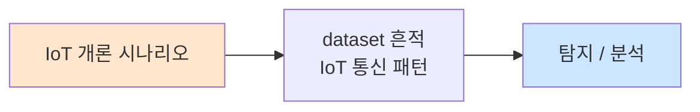

# Week 01: IoT 보안 개론

## 학습 목표
- IoT(사물인터넷)의 개념과 아키텍처를 이해한다
- IoT 생태계의 보안 위협 요소를 파악한다
- OWASP IoT Top 10을 학습하고 실제 사례와 연결한다
- IoT 디바이스의 공격 표면(Attack Surface)을 분류한다
- 가상 환경에서 IoT 서비스를 구축하고 기초 정찰을 수행한다

## 실습 환경 (공통)

| 서버 | IP | 역할 | 접속 |
|------|-----|------|------|
| attacker | 10.20.30.201 | 공격/분석 머신 | `ssh ccc@10.20.30.201` (pw: 1) |
| secu | 10.20.30.1 | 방화벽/IPS | `ssh ccc@10.20.30.1` |
| web | 10.20.30.80 | IoT 대시보드/웹서비스 | `ssh ccc@10.20.30.80` |
| siem | 10.20.30.100 | SIEM (Wazuh) | `ssh ccc@10.20.30.100` |

> 물리 IoT 장비 없이 Docker 컨테이너 기반 가상 IoT 환경을 활용합니다.

## 강의 시간 배분 (3시간)

| 시간 | 내용 | 유형 |
|------|------|------|
| 0:00-0:40 | IoT 개론 및 아키텍처 (Part 1) | 강의 |
| 0:40-1:10 | OWASP IoT Top 10 심화 (Part 2) | 강의/토론 |
| 1:10-1:20 | 휴식 | - |
| 1:20-2:00 | IoT 환경 구축 실습 (Part 3) | 실습 |
| 2:00-2:40 | IoT 정찰 및 스캔 (Part 4) | 실습 |
| 2:40-2:50 | 휴식 | - |
| 2:50-3:20 | IoT 공격 표면 분석 (Part 5) | 실습 |
| 3:20-3:40 | 정리 + 과제 안내 | 정리 |

---

## 용어 해설

| 용어 | 영문 | 설명 | 비유 |
|------|------|------|------|
| **IoT** | Internet of Things | 인터넷에 연결된 물리적 장치 | 인터넷을 쓰는 모든 사물 |
| **MQTT** | Message Queuing Telemetry Transport | 경량 메시지 브로커 프로토콜 | IoT 전용 우편 시스템 |
| **CoAP** | Constrained Application Protocol | 제한된 디바이스용 웹 프로토콜 | 소형장치용 HTTP |
| **펌웨어** | Firmware | 하드웨어에 탑재된 소프트웨어 | 장치의 두뇌 프로그램 |
| **JTAG** | Joint Test Action Group | 하드웨어 디버깅 인터페이스 | 장치의 뒷문 |
| **UART** | Universal Asynchronous Receiver-Transmitter | 시리얼 통신 인터페이스 | 장치의 대화 포트 |
| **BLE** | Bluetooth Low Energy | 저전력 블루투스 프로토콜 | 절전형 블루투스 |
| **OTA** | Over-The-Air | 무선 펌웨어 업데이트 | 무선 소프트웨어 배달 |
| **공격 표면** | Attack Surface | 공격 가능한 모든 진입점 | 건물의 모든 출입문 |
| **Edge** | Edge Computing | 데이터 소스 근처에서 처리 | 현장 처리 센터 |

---

## Part 1: IoT 개론 및 아키텍처 (40분)

### 1.1 IoT란 무엇인가

IoT(Internet of Things, 사물인터넷)는 센서, 액추에이터, 네트워크 연결 기능을 갖춘 물리적 디바이스가 인터넷을 통해 데이터를 수집하고 교환하는 기술 생태계이다.

**IoT 디바이스의 특성:**
- 제한된 컴퓨팅 자원 (CPU, RAM, 스토리지)
- 저전력 운영 (배터리, 에너지 하베스팅)
- 다양한 통신 프로토콜 (WiFi, BLE, Zigbee, LoRa, NB-IoT)
- 대량 배포 (수천~수백만 대)
- 긴 수명 주기 (5~15년)

### 1.2 IoT 아키텍처 레이어

```
┌─────────────────────────────────────┐
│         Application Layer           │  ← 대시보드, 모바일 앱, API
├─────────────────────────────────────┤
│          Platform Layer             │  ← 클라우드, 데이터 처리
├─────────────────────────────────────┤
│          Network Layer              │  ← WiFi, BLE, LoRa, MQTT
├─────────────────────────────────────┤
│         Perception Layer            │  ← 센서, 액추에이터, 디바이스
└─────────────────────────────────────┘
```

**각 레이어별 보안 위협:**

| 레이어 | 위협 | 예시 |
|--------|------|------|
| Application | 인증 우회, API 남용 | 대시보드 기본 비밀번호 |
| Platform | 데이터 유출, 권한 상승 | 클라우드 API 키 노출 |
| Network | 스니핑, MitM, 재전송 | MQTT 평문 통신 도청 |
| Perception | 물리적 탬퍼링, 펌웨어 추출 | UART 콘솔 접근 |

### 1.3 IoT 보안이 중요한 이유

**실제 사례 분석:**

1. **Mirai 봇넷 (2016):** 기본 비밀번호를 사용하는 IoT 디바이스 60만대 이상 감염, Dyn DNS DDoS 공격으로 Twitter, Netflix 등 주요 서비스 마비
2. **Verkada 카메라 해킹 (2021):** 15만대 이상의 보안 카메라 영상 유출 (병원, 교도소, Tesla 공장)
3. **Jeep Cherokee 원격 해킹 (2015):** CAN 버스를 통한 자동차 원격 제어 (핸들, 브레이크)
4. **Stuxnet (2010):** PLC를 타겟으로 한 최초의 산업 제어 시스템 공격

---

## Part 2: OWASP IoT Top 10 (30분)

### 2.1 OWASP IoT Top 10 (2018)

| 순위 | 취약점 | 설명 |
|------|--------|------|
| I1 | Weak, Guessable, or Hardcoded Passwords | 취약/기본/하드코딩된 비밀번호 |
| I2 | Insecure Network Services | 불필요하거나 취약한 네트워크 서비스 |
| I3 | Insecure Ecosystem Interfaces | API, 웹, 모바일 인터페이스 취약점 |
| I4 | Lack of Secure Update Mechanism | 안전한 업데이트 메커니즘 부재 |
| I5 | Use of Insecure or Outdated Components | 취약한 구성요소 사용 |
| I6 | Insufficient Privacy Protection | 개인정보 보호 부족 |
| I7 | Insecure Data Transfer and Storage | 데이터 전송/저장 암호화 미흡 |
| I8 | Lack of Device Management | 디바이스 관리 체계 부재 |
| I9 | Insecure Default Settings | 불안전한 기본 설정 |
| I10 | Lack of Physical Hardening | 물리적 보안 부재 |

### 2.2 각 취약점 상세 분석

**I1 — 취약한 비밀번호:**
```
# 대표적인 IoT 기본 계정
admin:admin
root:root
admin:1234
user:user
support:support
```

**I7 — 데이터 전송 보안:**
```
# MQTT 평문 통신 예시 (위험)
mosquitto_pub -h broker.local -t "home/sensor/temp" -m "25.3"

# MQTT TLS 통신 (안전)
mosquitto_pub -h broker.local --cafile ca.crt --cert client.crt \
  --key client.key -p 8883 -t "home/sensor/temp" -m "25.3"
```

### 2.3 IoT 공격 표면 맵

```
                    ┌──────────┐
                    │  Cloud   │
                    │  Backend │
                    └────┬─────┘
                         │ API (HTTPS/MQTT)
                    ┌────┴─────┐
                    │ Gateway  │
                    │  /Hub    │
                    └────┬─────┘
              ┌──────────┼──────────┐
              │          │          │
         ┌────┴───┐ ┌───┴────┐ ┌──┴─────┐
         │ Device │ │ Device │ │ Device │
         │ (WiFi) │ │ (BLE)  │ │(Zigbee)│
         └────────┘ └────────┘ └────────┘
              ↑          ↑          ↑
         [UART/JTAG] [Firmware] [RF Signal]
```

**공격 벡터 분류:**
- **네트워크:** 프로토콜 스니핑, MitM, 서비스 스캔
- **소프트웨어:** 펌웨어 리버싱, 웹 인터페이스 공격
- **하드웨어:** UART/JTAG 접근, 칩오프, 사이드채널
- **무선:** RF 재밍, 리플레이, 프로토콜 퍼징

---

## Part 3: IoT 환경 구축 실습 (40분)

### 3.1 MQTT 브로커 구축

MQTT(Message Queuing Telemetry Transport)는 IoT에서 가장 널리 사용되는 메시지 프로토콜이다.

```bash
# Mosquitto MQTT 브로커 Docker 실행
docker run -d --name mqtt-broker \
  -p 1883:1883 -p 9001:9001 \
  eclipse-mosquitto:2

# MQTT 클라이언트 설치
sudo apt install -y mosquitto-clients

# 구독 (터미널 1)
mosquitto_sub -h localhost -t "iot/sensor/#" -v

# 발행 (터미널 2)
mosquitto_pub -h localhost -t "iot/sensor/temp" -m '{"value":25.3,"unit":"C"}'
mosquitto_pub -h localhost -t "iot/sensor/humidity" -m '{"value":60,"unit":"%"}'
```

### 3.2 CoAP 서버 구축

```bash
# Python CoAP 서버 (aiocoap)
pip3 install aiocoap

# 간단한 CoAP 서버 코드
cat << 'PYEOF' > /tmp/coap_server.py
import asyncio
import aiocoap
import aiocoap.resource as resource

class SensorResource(resource.Resource):
    def __init__(self):
        super().__init__()
        self.value = '{"temp": 25.3, "humidity": 60}'

    async def render_get(self, request):
        return aiocoap.Message(payload=self.value.encode())

def main():
    root = resource.Site()
    root.add_resource(['sensor', 'data'], SensorResource())
    asyncio.Task(aiocoap.Context.create_server_context(root, bind=('0.0.0.0', 5683)))
    asyncio.get_event_loop().run_forever()

if __name__ == "__main__":
    main()
PYEOF

python3 /tmp/coap_server.py &
```

### 3.3 가상 IoT 네트워크 스캔

```bash
# IoT 서비스 포트 스캔
nmap -sV -p 1883,5683,8883,8080,80,443,23,22 10.20.30.80

# MQTT 브로커 탐지
nmap -sV -p 1883 --script mqtt-subscribe 10.20.30.80

# IoT 디바이스 핑거프린팅
nmap -O -sV 10.20.30.80
```

---

## Part 4: IoT 정찰 및 스캔 (40분)

### 4.1 Shodan을 이용한 IoT 검색

Shodan은 인터넷에 연결된 장치를 검색하는 검색엔진이다.

```
# Shodan 검색 쿼리 예시 (교육 목적)
port:1883 "MQTT"
port:5683 "CoAP"
"Server: GoAhead-Webs" port:80    # IP 카메라
"Server: Boa" port:80             # 라우터
"220 FTP" port:21 "camera"
"default password"
```

### 4.2 MQTT 정찰

```bash
# MQTT 토픽 구독 (모든 토픽)
mosquitto_sub -h 10.20.30.80 -t "#" -v

# MQTT 시스템 토픽 수집
mosquitto_sub -h 10.20.30.80 -t "\$SYS/#" -v -C 20

# MQTT 브로커 정보 수집
mosquitto_sub -h 10.20.30.80 -t "\$SYS/broker/#" -v -C 10
```

### 4.3 IoT 서비스 열거

```bash
# 열려있는 서비스 확인
nmap -sV -sC -p- --min-rate=1000 10.20.30.80

# 웹 기반 IoT 대시보드 확인
curl -s http://10.20.30.80:8080/ | head -20

# 기본 인증 정보 시도
curl -u admin:admin http://10.20.30.80:8080/api/status
curl -u admin:password http://10.20.30.80:8080/api/status
```

---

## Part 5: IoT 공격 표면 분석 (30분)

### 5.1 공격 표면 매핑 실습

```bash
# 1단계: 네트워크 서비스 매핑
echo "=== IoT 공격 표면 분석 ==="
echo "[네트워크 서비스]"
nmap -sV -p 1-10000 10.20.30.80 2>/dev/null | grep "open"

# 2단계: 웹 인터페이스 분석
echo "[웹 인터페이스]"
curl -sI http://10.20.30.80 | grep -iE "(server|x-powered)"

# 3단계: MQTT 인증 확인
echo "[MQTT 인증]"
mosquitto_pub -h 10.20.30.80 -t "test" -m "probe" 2>&1 | head -3

# 4단계: 기본 비밀번호 확인
echo "[기본 인증 시도]"
for cred in "admin:admin" "root:root" "admin:1234"; do
  user=$(echo $cred | cut -d: -f1)
  pass=$(echo $cred | cut -d: -f2)
  echo "  시도: $user:$pass"
  curl -s -o /dev/null -w "%{http_code}" -u "$user:$pass" http://10.20.30.80:8080/api/ 2>/dev/null
  echo ""
done
```

### 5.2 위험도 분류

| 공격 표면 | 위험도 | 근거 |
|-----------|--------|------|
| MQTT 미인증 | Critical | 모든 메시지 열람/조작 가능 |
| 웹 대시보드 기본 비밀번호 | Critical | 관리자 접근 가능 |
| 평문 통신 | High | 데이터 스니핑 가능 |
| 불필요한 포트 | Medium | 추가 공격 벡터 |
| 버전 정보 노출 | Low | 정보 수집에 활용 |

---

## Part 6: 과제 안내 (20분)

### 과제

- MQTT 브로커를 Docker로 구축하고 인증 없이 접근 가능한 토픽을 5개 이상 생성하시오
- 각 토픽에 센서 데이터를 발행하고, 다른 터미널에서 구독하여 캡처하시오
- OWASP IoT Top 10 중 3개 항목을 선정하고, 실제 사례를 조사하여 보고서를 작성하시오

---

## 참고 자료

- OWASP IoT Top 10: https://owasp.org/www-project-internet-of-things/
- MQTT 프로토콜 사양: https://mqtt.org/
- Shodan IoT 검색: https://www.shodan.io/
- Eclipse Mosquitto: https://mosquitto.org/
- NIST IoT 보안 가이드: NISTIR 8259

---

## 실제 사례 (WitFoo Precinct 6 — IoT 개론)

> 출처: WitFoo Precinct 6 Cybersecurity Dataset (Apache 2.0)
> 본 lecture *IoT 개론* 학습 항목 매칭.

### IoT 개론 의 dataset 흔적 — "IoT 통신 패턴"

dataset 의 정상 운영에서 *IoT 통신 패턴* 신호의 baseline 을 알아두면, *IoT 개론* 시도 시 발생하는 anomaly 를 정량으로 탐지할 수 있다. 핵심 정량 지표는 — MQTT + CoAP traffic.



### Case 1: dataset 정량 지표

| 항목 | 값 |
|---|---|
| 핵심 신호 | IoT 통신 패턴 |
| 정량 baseline | MQTT + CoAP traffic |
| 학습 매핑 | IoT 보안 개론 |

**자세한 해석**: IoT 보안 개론. 이 차이를 정량으로 측정해야 *공격 시도와 정상 운영의 구분* 이 가능. 학생이 baseline 숫자를 외워두면 — 운영 환경에서 anomaly 를 즉시 탐지할 수 있다.

### Case 2: 실전 적용 시나리오

| 단계 | dataset 활용 |
|---|---|
| 시도 식별 | IoT 통신 패턴 의 spike |
| 정상 vs 이상 | baseline 대비 비율 |
| 룰 작성 | Suricata / Wazuh / Sigma |
| 검증 | dataset 재실행 |

**자세한 해석**: 운영 환경 룰 작성은 — *baseline 측정 → 임계 결정 → 룰 작성 → dataset 검증* 의 4 단계. 한 단계라도 빠지면 false positive 폭증.

### 이 사례에서 학생이 배워야 할 3가지

1. **IoT 개론 = IoT 통신 패턴 의 anomaly** — 정량 신호로 탐지.
2. **baseline 숫자 외우기** — MQTT + CoAP traffic.
3. **4 단계 룰 작성** — 측정 → 임계 → 룰 → 검증.

**학생 액션**: IoT topology.

