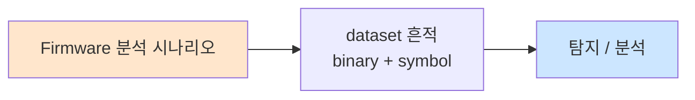

# Week 02: IoT 네트워크 프로토콜

## 학습 목표
- IoT에서 사용되는 주요 무선 프로토콜(WiFi, BLE, Zigbee, LoRa)의 특성을 이해한다
- MQTT, CoAP 등 IoT 애플리케이션 프로토콜의 동작 원리를 파악한다
- 각 프로토콜의 보안 취약점과 공격 벡터를 분류한다
- MQTT 브로커를 구축하고 메시지 가로채기 실습을 수행한다
- 프로토콜별 보안 설정 방법을 실습한다

## 실습 환경 (공통)

| 서버 | IP | 역할 | 접속 |
|------|-----|------|------|
| attacker | 10.20.30.201 | 공격/분석 머신 | `ssh ccc@10.20.30.201` (pw: 1) |
| secu | 10.20.30.1 | 방화벽/IPS | `ssh ccc@10.20.30.1` |
| web | 10.20.30.80 | IoT 서비스 호스트 | `ssh ccc@10.20.30.80` |
| siem | 10.20.30.100 | SIEM (Wazuh) | `ssh ccc@10.20.30.100` |

## 강의 시간 배분 (3시간)

| 시간 | 내용 | 유형 |
|------|------|------|
| 0:00-0:40 | 무선 프로토콜 개론 (Part 1) | 강의 |
| 0:40-1:10 | MQTT/CoAP 심화 (Part 2) | 강의/토론 |
| 1:10-1:20 | 휴식 | - |
| 1:20-2:00 | MQTT 실습 (Part 3) | 실습 |
| 2:00-2:40 | CoAP/프로토콜 분석 (Part 4) | 실습 |
| 2:40-2:50 | 휴식 | - |
| 2:50-3:20 | 프로토콜 보안 설정 (Part 5) | 실습 |
| 3:20-3:40 | 정리 + 과제 안내 | 정리 |

---

## Part 1: IoT 무선 프로토콜 개론 (40분)

### 1.1 IoT 프로토콜 스택 개요

```
┌──────────────────────────────────────────────┐
│ Application  │ MQTT │ CoAP │ HTTP │ AMQP    │
├──────────────────────────────────────────────┤
│ Transport    │ TCP  │ UDP  │ TCP  │ TCP     │
├──────────────────────────────────────────────┤
│ Network      │       IPv4 / IPv6 / 6LoWPAN  │
├──────────────────────────────────────────────┤
│ Data Link    │ WiFi│ BLE │Zigbee│ LoRa│ NB-IoT│
├──────────────────────────────────────────────┤
│ Physical     │ 2.4GHz │ 2.4GHz │ Sub-GHz   │
└──────────────────────────────────────────────┘
```

### 1.2 무선 프로토콜 비교

| 프로토콜 | 주파수 | 범위 | 속도 | 전력 | 보안 |
|----------|--------|------|------|------|------|
| WiFi (802.11) | 2.4/5 GHz | ~100m | ~1Gbps | 높음 | WPA3 |
| BLE 5.0 | 2.4 GHz | ~100m | 2Mbps | 매우 낮음 | AES-CCM |
| Zigbee | 2.4 GHz | ~100m | 250kbps | 낮음 | AES-128 |
| LoRa | Sub-GHz | ~15km | 50kbps | 매우 낮음 | AES-128 |
| NB-IoT | Licensed | ~10km | 250kbps | 낮음 | LTE 보안 |
| Z-Wave | 868/915 MHz | ~100m | 100kbps | 낮음 | AES-128 |

### 1.3 WiFi 보안 이슈

```
WEP → WPA → WPA2 → WPA3
(깨짐)  (취약)  (KRACK)  (Dragonblood)
```

**IoT WiFi 취약점:**
- 많은 IoT 디바이스가 여전히 WPA2-PSK만 지원
- ESP8266/ESP32 기반 디바이스의 WiFi 설정 모드 악용
- Deauth 공격에 취약 (802.11 관리 프레임 미보호)

### 1.4 BLE (Bluetooth Low Energy)

**BLE 아키텍처:**
```
┌─────────────┐     ┌─────────────┐
│  Central     │────│ Peripheral  │
│  (스마트폰)  │    │ (센서/장치) │
└─────────────┘     └─────────────┘
        │                   │
   GATT Client         GATT Server
   (데이터 읽기)       (데이터 제공)
```

**BLE 보안 모드:**
- Mode 1, Level 1: 보안 없음 (Just Works)
- Mode 1, Level 2: 미인증 페어링 + 암호화
- Mode 1, Level 3: 인증 페어링 + 암호화
- Mode 1, Level 4: 인증 LE Secure Connections

### 1.5 Zigbee

**Zigbee 네트워크 구조:**
```
     ┌──────────┐
     │Coordinator│ ← 네트워크 키 관리
     └─────┬────┘
     ┌─────┼─────┐
  ┌──┴──┐ ┌┴───┐ ┌┴───┐
  │Router│ │Router│ │Router│
  └──┬──┘ └┬───┘ └┬───┘
   ┌─┴─┐  ┌┴─┐  ┌─┴─┐
   │End│  │End│  │End│
   │Dev│  │Dev│  │Dev│
   └───┘  └───┘  └───┘
```

**Zigbee 보안 취약점:**
- 네트워크 키가 평문으로 전송되는 경우 존재
- 기본 Trust Center Link Key (ZigBeeAlliance09)
- 리플레이 공격 가능

### 1.6 LoRa / LoRaWAN

**LoRaWAN 아키텍처:**
```
End Device → Gateway → Network Server → Application Server
   (센서)    (중계기)    (관리서버)        (데이터처리)
```

**보안 키:**
- NwkSKey: 네트워크 세션 키 (무결성 검증)
- AppSKey: 애플리케이션 세션 키 (페이로드 암호화)
- AppKey: 애플리케이션 키 (OTAA 활성화)

---

## Part 2: MQTT/CoAP 프로토콜 심화 (30분)

### 2.1 MQTT 프로토콜 상세

**MQTT 동작 원리:**
```
Publisher ──publish──→ Broker ──deliver──→ Subscriber
  (센서)     (토픽)    (중계)    (토픽)     (대시보드)
```

**MQTT QoS 레벨:**
- QoS 0: At most once (최대 1회, 유실 가능)
- QoS 1: At least once (최소 1회, 중복 가능)
- QoS 2: Exactly once (정확히 1회, 가장 느림)

**MQTT 토픽 구조:**
```
home/livingroom/temperature
home/livingroom/humidity
home/+/temperature        # + : 단일 레벨 와일드카드
home/#                    # # : 다중 레벨 와일드카드
$SYS/broker/uptime        # $SYS : 시스템 토픽
```

**MQTT 보안 위협:**
1. **미인증 접근:** 인증 없이 브로커 연결
2. **토픽 스니핑:** 와일드카드(#)로 모든 메시지 수신
3. **메시지 위조:** 임의 토픽에 악성 데이터 발행
4. **DoS 공격:** 대량 메시지 발행으로 브로커 과부하
5. **Will 메시지 악용:** 연결 해제 시 자동 발행 메시지 조작

### 2.2 CoAP 프로토콜 상세

**CoAP vs HTTP:**

| 항목 | CoAP | HTTP |
|------|------|------|
| 전송 | UDP | TCP |
| 헤더 | 4바이트 | 수십~수백 바이트 |
| 메서드 | GET/POST/PUT/DELETE | 동일 |
| 관찰 | Observe 옵션 | WebSocket |
| 보안 | DTLS | TLS |
| 멀티캐스트 | 지원 | 미지원 |

**CoAP 보안 모드:**
- NoSec: 보안 없음 (UDP)
- PreSharedKey: 사전 공유 키 (DTLS-PSK)
- RawPublicKey: 원시 공개 키 (DTLS-RPK)
- Certificate: X.509 인증서 (DTLS)

---

## Part 3: MQTT 실습 (40분)

### 3.1 MQTT 브로커 구축 및 모니터링

```bash
# Mosquitto 브로커 (인증 없음 - 취약 설정)
docker run -d --name mqtt-vulnerable \
  -p 1883:1883 \
  eclipse-mosquitto:2 \
  mosquitto -c /dev/null -p 1883 -v

# 모든 토픽 구독 (도청)
mosquitto_sub -h localhost -t "#" -v &

# 센서 데이터 시뮬레이션
for i in $(seq 1 10); do
  mosquitto_pub -h localhost -t "factory/sensor/$i/temp" \
    -m "{\"value\": $((RANDOM % 40 + 10)), \"ts\": $(date +%s)}"
  sleep 0.5
done
```

### 3.2 MQTT 메시지 가로채기

```bash
# 공격자 관점: 모든 메시지 캡처
mosquitto_sub -h 10.20.30.80 -p 1883 -t "#" -v 2>/dev/null | \
  tee /tmp/mqtt_capture.txt &

# 민감 토픽 탐색
mosquitto_sub -h 10.20.30.80 -t "\$SYS/#" -v -C 20

# 악성 메시지 주입
mosquitto_pub -h 10.20.30.80 -t "factory/actuator/valve" \
  -m '{"action":"open","value":100}'
```

### 3.3 MQTT 인증 설정

```bash
# 비밀번호 파일 생성
docker exec mqtt-vulnerable sh -c \
  'mosquitto_passwd -c /mosquitto/passwd admin'

# 인증 설정 파일
cat << 'EOF' > /tmp/mosquitto_secure.conf
listener 1883
allow_anonymous false
password_file /mosquitto/passwd
EOF

# 보안 브로커 재시작
docker stop mqtt-vulnerable
docker run -d --name mqtt-secure \
  -p 1884:1883 \
  -v /tmp/mosquitto_secure.conf:/mosquitto/config/mosquitto.conf \
  eclipse-mosquitto:2
```

---

## Part 4: CoAP 및 프로토콜 분석 (40분)

### 4.1 CoAP 서버/클라이언트 실습

```bash
# CoAP 서버 시뮬레이터
pip3 install aiocoap linkheader

cat << 'PYEOF' > /tmp/coap_iot_server.py
import asyncio
import aiocoap
import aiocoap.resource as resource
import json, time

class TemperatureResource(resource.ObservableResource):
    def __init__(self):
        super().__init__()
        self.handle = None

    async def render_get(self, request):
        data = json.dumps({"temp": 23.5, "unit": "C", "ts": int(time.time())})
        return aiocoap.Message(payload=data.encode())

class ActuatorResource(resource.Resource):
    async def render_put(self, request):
        payload = request.payload.decode()
        print(f"[ACTUATOR] Received command: {payload}")
        return aiocoap.Message(code=aiocoap.CHANGED, payload=b"OK")

root = resource.Site()
root.add_resource(['sensor', 'temp'], TemperatureResource())
root.add_resource(['actuator', 'valve'], ActuatorResource())

asyncio.Task(aiocoap.Context.create_server_context(root, bind=('0.0.0.0', 5683)))
asyncio.get_event_loop().run_forever()
PYEOF

python3 /tmp/coap_iot_server.py &

# CoAP 클라이언트 요청
pip3 install aiocoap
python3 -m aiocoap.cli.client GET coap://localhost/sensor/temp
```

### 4.2 Wireshark/tcpdump를 이용한 프로토콜 분석

```bash
# MQTT 트래픽 캡처
tcpdump -i any -w /tmp/mqtt_traffic.pcap port 1883 &
TCPDUMP_PID=$!

# 트래픽 생성
mosquitto_pub -h localhost -t "test/data" -m "secret_data_123"
mosquitto_sub -h localhost -t "test/data" -C 1

sleep 2 && kill $TCPDUMP_PID

# 캡처 분석
tcpdump -r /tmp/mqtt_traffic.pcap -A | grep -a "secret_data"

# CoAP 트래픽 캡처
tcpdump -i any -w /tmp/coap_traffic.pcap port 5683 &
```

### 4.3 프로토콜 퍼징

```bash
# MQTT 퍼징 스크립트
cat << 'PYEOF' > /tmp/mqtt_fuzzer.py
import socket
import struct

def send_malformed_mqtt(host, port):
    """MQTT CONNECT 패킷 퍼징"""
    payloads = [
        b'\x10\x00',                          # 빈 CONNECT
        b'\x10\xff\xff\xff\x7f' + b'\x00'*100,  # 큰 길이
        b'\x10\x0c\x00\x04MQTT\x05\x00\x00\x3c\x00\x00',  # MQTTv5
        b'\x10\x0c\x00\x04MQTT\x04\xce\x00\x3c\x00\x00',  # 플래그 변조
        b'\x30\x00',                           # 빈 PUBLISH
    ]
    
    for i, payload in enumerate(payloads):
        try:
            s = socket.socket(socket.AF_INET, socket.SOCK_STREAM)
            s.settimeout(3)
            s.connect((host, port))
            s.send(payload)
            resp = s.recv(1024)
            print(f"[{i}] Sent {len(payload)}B -> Response: {resp.hex()}")
        except Exception as e:
            print(f"[{i}] Sent {len(payload)}B -> Error: {e}")
        finally:
            s.close()

send_malformed_mqtt('localhost', 1883)
PYEOF

python3 /tmp/mqtt_fuzzer.py
```

---

## Part 5: 프로토콜 보안 설정 (30분)

### 5.1 MQTT TLS 설정

```bash
# 자체 서명 인증서 생성
openssl req -new -x509 -days 365 -extensions v3_ca \
  -keyout /tmp/ca.key -out /tmp/ca.crt \
  -subj "/CN=IoT-CA" -nodes

openssl genrsa -out /tmp/server.key 2048
openssl req -new -key /tmp/server.key -out /tmp/server.csr \
  -subj "/CN=mqtt-server"
openssl x509 -req -in /tmp/server.csr -CA /tmp/ca.crt \
  -CAkey /tmp/ca.key -CAcreateserial -out /tmp/server.crt -days 365

# TLS MQTT 브로커
cat << 'EOF' > /tmp/mosquitto_tls.conf
listener 8883
cafile /mosquitto/certs/ca.crt
certfile /mosquitto/certs/server.crt
keyfile /mosquitto/certs/server.key
require_certificate false
allow_anonymous false
password_file /mosquitto/passwd
EOF
```

### 5.2 MQTT ACL (접근 제어 목록)

```bash
# ACL 설정 파일
cat << 'EOF' > /tmp/mosquitto_acl.conf
# 관리자: 모든 토픽 읽기/쓰기
user admin
topic readwrite #

# 센서: 자기 토픽만 쓰기
user sensor01
topic write sensor/01/#

# 대시보드: 센서 데이터 읽기만
user dashboard
topic read sensor/#
topic read $SYS/broker/clients/connected
EOF
```

### 5.3 프로토콜 보안 체크리스트

| 항목 | 확인 사항 | 상태 |
|------|-----------|------|
| MQTT 인증 | 사용자/비밀번호 설정됨 | |
| MQTT TLS | 8883 포트 + 인증서 | |
| MQTT ACL | 토픽별 접근 제어 | |
| CoAP DTLS | DTLS 암호화 활성화 | |
| 와일드카드 차단 | # 구독 제한 | |
| QoS 정책 | 적절한 QoS 레벨 설정 | |
| 메시지 크기 | 최대 메시지 크기 제한 | |
| 연결 제한 | 최대 동시 연결 수 제한 | |

---

## Part 6: 과제 안내 (20분)

### 과제

- MQTT 브로커에 TLS와 인증을 설정하고, ACL로 토픽 접근을 제어하시오
- tcpdump로 평문 MQTT와 TLS MQTT 트래픽을 캡처하여 차이를 비교하시오
- CoAP 서버를 구축하고 DTLS 없이/있을 때의 보안 차이를 분석하시오

---

## 참고 자료

- MQTT 5.0 사양: https://docs.oasis-open.org/mqtt/mqtt/v5.0/mqtt-v5.0.html
- CoAP RFC 7252: https://tools.ietf.org/html/rfc7252
- BLE 보안: https://www.bluetooth.com/learn-about-bluetooth/key-attributes/bluetooth-security/
- Zigbee 보안: https://csa-iot.org/all-solutions/zigbee/
- LoRaWAN 보안: https://lora-alliance.org/about-lorawan/

---

## 실제 사례 (WitFoo Precinct 6 — Firmware 분석)

> 출처: WitFoo Precinct 6 Cybersecurity Dataset (Apache 2.0)
> 본 lecture *Firmware 분석* 학습 항목 매칭.

### Firmware 분석 의 dataset 흔적 — "binary + symbol"

dataset 의 정상 운영에서 *binary + symbol* 신호의 baseline 을 알아두면, *Firmware 분석* 시도 시 발생하는 anomaly 를 정량으로 탐지할 수 있다. 핵심 정량 지표는 — binwalk + ghidra.



### Case 1: dataset 정량 지표

| 항목 | 값 |
|---|---|
| 핵심 신호 | binary + symbol |
| 정량 baseline | binwalk + ghidra |
| 학습 매핑 | firmware extract |

**자세한 해석**: firmware extract. 이 차이를 정량으로 측정해야 *공격 시도와 정상 운영의 구분* 이 가능. 학생이 baseline 숫자를 외워두면 — 운영 환경에서 anomaly 를 즉시 탐지할 수 있다.

### Case 2: 실전 적용 시나리오

| 단계 | dataset 활용 |
|---|---|
| 시도 식별 | binary + symbol 의 spike |
| 정상 vs 이상 | baseline 대비 비율 |
| 룰 작성 | Suricata / Wazuh / Sigma |
| 검증 | dataset 재실행 |

**자세한 해석**: 운영 환경 룰 작성은 — *baseline 측정 → 임계 결정 → 룰 작성 → dataset 검증* 의 4 단계. 한 단계라도 빠지면 false positive 폭증.

### 이 사례에서 학생이 배워야 할 3가지

1. **Firmware 분석 = binary + symbol 의 anomaly** — 정량 신호로 탐지.
2. **baseline 숫자 외우기** — binwalk + ghidra.
3. **4 단계 룰 작성** — 측정 → 임계 → 룰 → 검증.

**학생 액션**: lab firmware analyze.

---

## 부록: 학습 OSS 도구 매트릭스 (Course17 IoT Security — Week 02 IoT 네트워크 프로토콜·BLE·Zigbee·LoRa·MQTT TLS·퍼징)

> 이 부록은 본문 Part 3-5 의 5 lab (MQTT broker 모니터링 / MQTT 가로채기 /
> MQTT 인증 / CoAP server-client / 프로토콜 퍼징 / MQTT TLS / ACL) 의 모든
> 명령을 *실제 OSS 도구* 시퀀스로 매핑한다. w01 부록과 중복 피하기 위해
> *프로토콜별 심화 도구* (BLE → bluepy/gattacker/btlejack, Zigbee →
> killerbee/Zigbee2MQTT, LoRa → chirpstack/LoRaWAN-MAC) + *프로토콜 퍼징
> framework* (boofuzz / radamsa / AFL++) + *MQTT TLS 운영 자동화* (step-ca
> + cert-manager) + *6LoWPAN / 802.15.4* 까지 포괄한다.

### lab step → 도구 매핑 표

| step | 본문 위치 | 학습 항목 | 본문 명령 | 핵심 OSS 도구 (실 명령) | 도구 옵션 |
|------|----------|----------|----------|-------------------------|-----------|
| s1 | 3.1 | MQTT broker (anonymous) | `mosquitto -c /dev/null -p 1883 -v` | mosquitto / EMQX (w01 부록) | `-v` verbose |
| s2 | 3.1 | 센서 데이터 시뮬 | `mosquitto_pub -t factory/sensor/$i/temp` | mqtt-cli / paho-mqtt + asyncio | 다중 토픽 |
| s3 | 3.2 | 메시지 가로채기 | `mosquitto_sub -t '#'` | MQTT-PWN / mqtt-spy GUI | wildcard |
| s4 | 3.2 | 악성 메시지 주입 | `mosquitto_pub -t factory/actuator/valve` | paho-mqtt automation | impersonation |
| s5 | 3.3 | MQTT 인증 | `mosquitto_passwd -c` | mosquitto-go-auth / Vault dynamic | LDAP / DB backend |
| s6 | 4.1 | CoAP Observable | aiocoap ObservableResource | libcoap (server) / Californium | OBSERVE option |
| s7 | 4.2 | tcpdump MQTT | `tcpdump -i any port 1883 -w` | tshark + MQTT dissector / scapy | bit-level |
| s8 | 4.3 | MQTT 퍼징 | Python socket struct | boofuzz / radamsa / AFL++ / scapy fuzz | framework |
| s9 | 5.1 | MQTT TLS | openssl req + mosquitto.conf | step-ca / cert-manager / certbot | 자동 갱신 |
| s10 | 5.2 | MQTT ACL | mosquitto_acl.conf | mosquitto-go-auth (DB) / EMQX rule engine | dynamic |
| s11 | 1.4 BLE | BLE GATT | (이론) | bluepy / gattacker / btlejack / bleah / hcitool / nRF Connect | scan + GATT |
| s12 | 1.5 Zigbee | Zigbee 캡처 | (이론) | killerbee / Zigbee2MQTT / wireshark zigbee dissector | sniff |
| s13 | 1.6 LoRa | LoRaWAN | (이론) | chirpstack-server / LoRaWAN-MAC-NodeJS / lorabridge | network server |

### 무선 / 메시지 프로토콜 도구 매트릭스 (5 layer)

| Layer / 프로토콜 | 카테고리 | OSS 도구 | 비고 |
|------------------|---------|----------|------|
| **WiFi (802.11)** | scan / attack | aircrack-ng / wifite / kismet | course16 w06 부록 |
| **BLE 4.x** | scan + GATT | bluepy / hcitool / gatttool | classical |
| **BLE 4.x** | exploit | gattacker / bleah / btlejack | passive crack |
| **BLE 5.x** | secure pairing | bluez (5.65+) / nRF Connect Desktop | 인증서 |
| **Zigbee** | sniff | killerbee + atmel raven / Apimote | 802.15.4 |
| **Zigbee** | network 분석 | Zigbee2MQTT / wireshark Zigbee | mesh |
| **Zigbee** | exploit | killerbee zbgoodfind / zbstumbler | network key 탈취 |
| **Z-Wave** | network | OpenZWave / Z-Wave-JS / zwave-js-server | smart home |
| **Z-Wave** | exploit | EZ-Wave (RFCat) | 868/908MHz |
| **LoRa** | end-device | LoRaWAN-MAC-NodeJS / RAK 보드 + Python | chip lib |
| **LoRa** | gateway | chirpstack-network-server / chirpstack-app-server | full stack |
| **LoRa** | exploit | LoRaPWN / lorawan-attacks | replay / join hijack |
| **NB-IoT** | network | open5GS / srsRAN | LTE-M / NB-IoT |
| **6LoWPAN** | IPv6 over 802.15.4 | contiki-ng / Riot OS / Tinyos | embedded IPv6 |
| **MQTT broker** | broker | mosquitto / EMQX / HiveMQ CE | w01 부록 |
| **MQTT auth** | auth backend | mosquitto-go-auth (LDAP/MySQL) / EMQX plugin | dynamic auth |
| **MQTT TLS** | cert mgmt | step-ca / cert-manager / certbot | 자동 갱신 |
| **MQTT 퍼징** | malformed | boofuzz / radamsa / scapy fuzz / mqtt-fuzzer | framework |
| **CoAP** | server / client | aiocoap / libcoap / Californium | Java/Py/C |
| **CoAP DTLS** | TLS over UDP | libcoap + tinydtls / Californium DTLS | PSK / cert |
| **CoAP 퍼징** | malformed | boofuzz / coap-fuzzer | framework |
| **AMQP** | broker (lab) | RabbitMQ / Apache Qpid / ActiveMQ | enterprise |
| **Modbus / OPC-UA** | OT | modbus-cli / open62541 (OPC-UA) | OT 보안 |

### 학생 환경 준비

```bash
# attacker VM (w01 보강 — 무선 + 퍼징 도구 추가)
sudo apt-get update
sudo apt-get install -y \
   bluez bluez-tools bluez-hcidump python3-bluez \
   wireshark-common tshark \
   openssl ca-certificates \
   socat ncat \
   python3-pip

# BLE 도구
pip3 install --user bluepy bleak pygatt
git clone https://github.com/securing/gattacker /tmp/gattacker
cd /tmp/gattacker && npm install

# btlejack (BLE 5.0 sniffer + jammer)
pip3 install --user btlejack

# bleah (BLE recon)
pip3 install --user bleah

# Zigbee — killerbee
git clone https://github.com/riverloopsec/killerbee /tmp/killerbee
cd /tmp/killerbee && pip3 install --user -e .

# Zigbee2MQTT (운영 zigbee → mqtt bridge)
git clone https://github.com/Koenkk/zigbee2mqtt /tmp/zigbee2mqtt
cd /tmp/zigbee2mqtt && npm install

# Z-Wave-JS (Z-Wave server)
npm install -g @zwave-js/server

# chirpstack (LoRaWAN full stack — docker)
git clone https://github.com/brocaar/chirpstack-docker /tmp/chirpstack
cd /tmp/chirpstack && docker compose up -d

# 퍼징 framework
pip3 install --user boofuzz scapy
sudo apt-get install -y radamsa afl++

# step-ca (MQTT TLS 자동 인증서)
curl -sLo /tmp/step-ca.deb \
   https://github.com/smallstep/certificates/releases/latest/download/step-ca_0.27.5_amd64.deb
sudo dpkg -i /tmp/step-ca.deb

# step CLI
curl -sLo /tmp/step-cli.deb \
   https://github.com/smallstep/cli/releases/latest/download/step-cli_0.27.5_amd64.deb
sudo dpkg -i /tmp/step-cli.deb

# mosquitto-go-auth (DB-based auth plugin)
git clone https://github.com/iegomez/mosquitto-go-auth /tmp/mosq-go-auth
cd /tmp/mosq-go-auth && make

# 검증
hcitool --version 2>&1 | head -1
bluetoothctl --version
btlejack -v 2>&1 | head -1
zbstumbler -h 2>&1 | head -3 || echo "killerbee 인터페이스 필요"
boofuzz --version 2>&1 | head -1
radamsa --version
step --version | head -1
step-ca --version | head -1
docker ps | grep chirpstack
```

### 핵심 도구별 상세 사용법

#### 도구 1: bluepy / hcitool — BLE 디바이스 GATT scan (s11)

본문 1.4 *BLE GATT 아키텍처* 의 실 도구. Linux bluez stack + Python bluepy
로 GATT scan / read / write / notify 모두 가능.

```bash
# 1. BLE adapter 확인
hciconfig
# hci0:   Type: Primary  Bus: USB
#         BD Address: AA:BB:CC:11:22:33  ACL MTU: 1021:8
#         UP RUNNING

# 2. BLE 디바이스 scan (10초)
sudo hcitool lescan --duplicates &
sleep 10 && sudo killall hcitool
# 11:22:33:44:55:66 (unknown)
# 11:22:33:44:55:66 Mi Band 5
# AA:BB:CC:11:22:33 ESP32-Sensor

# 3. Python bluepy (GATT scan + read)
python3 << 'PY'
from bluepy.btle import Scanner, DefaultDelegate, Peripheral, ADDR_TYPE_RANDOM

class ScanDelegate(DefaultDelegate):
    def handleDiscovery(self, dev, isNewDev, isNewData):
        if isNewDev:
            print(f"[+] {dev.addr} ({dev.addrType}) RSSI={dev.rssi}")
            for ad_type, desc, value in dev.getScanData():
                print(f"    {desc}: {value}")

scanner = Scanner().withDelegate(ScanDelegate())
devices = scanner.scan(10.0)

# 첫 발견 디바이스 GATT 분석
if devices:
    dev = list(devices)[0]
    print(f"\n[*] Connecting to {dev.addr}...")
    p = Peripheral(dev.addr, addrType=dev.addrType)
    for svc in p.getServices():
        print(f"  Service: {svc.uuid}")
        for ch in svc.getCharacteristics():
            props = ch.propertiesToString()
            try:
                val = ch.read() if 'READ' in props else b''
            except Exception:
                val = b'(no read)'
            print(f"    Char: {ch.uuid} [{props}] value={val.hex() if val else '-'}")
    p.disconnect()
PY

# 4. gatttool (인터랙티브)
sudo gatttool -b AA:BB:CC:11:22:33 -I
[AA:BB:CC:11:22:33][LE]> connect
[AA:BB:CC:11:22:33][LE]> primary
[AA:BB:CC:11:22:33][LE]> characteristics
[AA:BB:CC:11:22:33][LE]> char-read-hnd 0x0010
[AA:BB:CC:11:22:33][LE]> char-write-req 0x0014 1234

# 5. bleah (BLE 종합 recon)
sudo bleah -b "AA:BB:CC:11:22:33" -e
# 모든 service + characteristic + value 한 번에

# 6. nRF Connect for Mobile (Android — 학습용 공식 GUI)
# Google Play 에서 설치 — BLE 최고 GUI
```

#### 도구 2: gattacker — BLE MITM (s11)

GATT 트래픽을 가로채고 변조. central / peripheral 사이 proxy.

```bash
# gattacker workflow (Node.js)
cd /tmp/gattacker

# 1. central 측 (디바이스 응답)
node ws-slave.js
# 진짜 BLE 디바이스에 연결 → 모든 GATT 응답 캡처

# 2. peripheral 측 (스마트폰 측 — 가짜 디바이스 발행)
node advertise.js targetdevice.adv.json
# 가짜 BLE 디바이스 advertise → 스마트폰이 연결

# 3. 트래픽 변조 (script)
cat << 'JS' > scripts/temperature_modify.js
exports.processWrite = function(handle, data) {
    if (handle === 0x0014) {
        console.log("[!] Modifying temperature setting");
        return Buffer.from([0xFF, 0xFF, 0xFF]);  // 변조
    }
    return data;
};
JS
node ws-slave.js scripts/temperature_modify.js
```

#### 도구 3: btlejack — BLE 5.0 sniffer + jammer (s11)

BLE 4.0/5.0 의 connection / hopping pattern 추적. micro:bit 보드 필요
($15).

```bash
# 1. micro:bit 펌웨어 flash
btlejack -f
# Flashing micro:bit firmware...
# Done

# 2. BLE advertise scan
btlejack -s
# [+] AA:BB:CC:11:22:33 (RSSI: -45) Mi Band

# 3. specific device 추적
btlejack -f AA:BB:CC:11:22:33 -t 30
# [+] 35 connection events captured

# 4. jamming (lab 한정)
btlejack -j -t AA:BB:CC:11:22:33

# 5. Hijack (advanced)
btlejack -f AA:BB:CC:11:22:33 -j -h
# → 능동 hijack — 진짜 central 자리 차지
```

#### 도구 4: killerbee — Zigbee 보안 (s12)

본문 1.5 *Zigbee 네트워크 키 평문* / *기본 Trust Center Link Key
(ZigBeeAlliance09)* 의 실 도구. Atmel Raven 또는 Apimote dongle 필요.

```bash
# 1. Zigbee 인터페이스 확인
zbid
# Dev   Product String      Serial Number
# 1:5   AVR Raven           Apimote v3

# 2. 채널 scan (Zigbee 11-26)
zbstumbler -i 1:5
# Channel 11: BTU3LR PAN 0x1234
# Channel 15: Hue Bridge PAN 0xABCD

# 3. 패킷 캡처 (특정 채널)
zbdump -f 15 -w /tmp/zigbee.pcap

# 4. wireshark 로 .pcap 분석 (Zigbee dissector)
wireshark /tmp/zigbee.pcap
# Filter: zbee_nwk

# 5. network key 탐색 (구형 — 평문 join 캡처)
zbgoodfind -d /tmp/zigbee.pcap -f /tmp/keys.txt

# 6. join 시 trust center key 검색
zbreplay -f 15 -r /tmp/zigbee.pcap -j

# 7. Zigbee2MQTT (방어 — Zigbee mesh 를 MQTT 로 통합)
docker run -d --name zigbee2mqtt \
   -v /opt/zigbee2mqtt/data:/app/data \
   -v /run/udev:/run/udev:ro \
   --device=/dev/ttyACM0 \
   -e TZ=Asia/Seoul \
   koenkk/zigbee2mqtt
```

#### 도구 5: chirpstack + LoRaWAN — LoRa 전체 스택 (s13)

본문 1.6 *LoRaWAN: NwkSKey + AppSKey + AppKey* 의 실 lab. chirpstack 는
network server + application server + gateway bridge 통합.

```bash
# 1. chirpstack docker compose
cd /tmp/chirpstack && docker compose up -d
# 서비스:
#   chirpstack-gateway-bridge:1700  (gateway → MQTT)
#   chirpstack:8080                  (network + app server)
#   redis:6379, postgresql:5432, mosquitto:1883

# 2. Web UI
firefox http://localhost:8080
# admin / admin

# 3. workflow:
#   a. Network server 추가
#   b. Service profile 생성
#   c. Application 생성
#   d. Device profile (regional band — 한국 KR920 / 유럽 EU868 / 미국 US915)
#   e. End device 등록 (DevEUI / AppKey)

# 4. 가상 LoRa device (Python — chirpstack-simulator)
git clone https://github.com/brocaar/chirpstack-simulator /tmp/cs-sim
cd /tmp/cs-sim && go build -o /usr/local/bin/chirpstack-simulator ./cmd/chirpstack-simulator
chirpstack-simulator --service-profile-id $SP_ID

# 5. LoRaWAN 보안 키 학습
# - DevEUI:  64-bit device 식별자 (MAC 주소 등가)
# - AppEUI:  64-bit app 식별자
# - AppKey:  128-bit OTAA 활성화 키 (사전 공유)
# - NwkSKey: 128-bit 세션 키 (네트워크 — 무결성 MAC)
# - AppSKey: 128-bit 세션 키 (애플리케이션 — 페이로드 암호화)

# 6. LoRaWAN 공격 시뮬 (lab)
git clone https://github.com/IOActive/lorapwn /tmp/lorapwn
# - Join Hijack (AppKey 탈취 시)
# - Replay attack (counter 미리 캡처)
# - DevAddr collision DoS

# 7. 방어 — chirpstack 의 frame_counter_validation 강제
# - Strict frame counter check (replay 차단)
# - LoRaWAN 1.1 (forward / backward 키 분리)
```

#### 도구 6: boofuzz — 프로토콜 퍼징 framework (s8)

본문 4.3 의 *MQTT 퍼징* (Python socket + struct) 의 *완성형*. boofuzz
는 Sulley 의 후속 — 상태 기반 fuzzing + crash detection + restart hook.

```python
#!/usr/bin/env python3
# /tmp/mqtt-boofuzz.py — MQTT broker 본격 퍼징
from boofuzz import *

# 1. session
session = Session(
    target=Target(connection=TCPSocketConnection("10.20.30.80", 1883)),
    sleep_time=0.1,
    crash_threshold_request=3,
)

# 2. MQTT CONNECT 패킷 정의
s_initialize("mqtt_connect")
# Fixed header
s_byte(0x10, name="msg_type")           # CONNECT (0x10)
s_size("payload", length=1, name="remaining_len", fuzzable=True)
# Variable header
if s_block_start("payload"):
    s_word(0x0004, name="proto_name_len", endian=">")
    s_string("MQTT", name="proto_name", fuzzable=True)
    s_byte(0x05, name="proto_level", fuzzable=True)
    s_byte(0xc0, name="connect_flags", fuzzable=True)
    s_word(0x003c, name="keep_alive", endian=">", fuzzable=True)
    # Properties (MQTTv5)
    s_byte(0x00, name="prop_len")
    # Payload
    s_word(0x000a, name="client_id_len", endian=">")
    s_string("fuzz_client", name="client_id", fuzzable=True)
s_block_end("payload")

# 3. 세션 등록
session.connect(s_get("mqtt_connect"))

# 4. 실행 (모든 mutation 자동)
session.fuzz()

# 5. 결과 — boofuzz_results.db (sqlite)
# crash 발견 시 자동 restart + 로그
PY

python3 /tmp/mqtt-boofuzz.py

# 6. radamsa (단순 일반화 fuzz)
echo -ne '\x10\x0c\x00\x04MQTT\x05\xc0\x00\x3c\x00\x00' \
   | radamsa -n 100 \
   | while read -d '' mutated; do
       echo -n "$mutated" | nc -w 2 10.20.30.80 1883
   done

# 7. AFL++ (binary fuzzing — broker 실행파일 직접)
afl-fuzz -i /tmp/seeds/mqtt -o /tmp/afl-out \
   -- /usr/sbin/mosquitto -c /etc/mosquitto/test.conf
```

#### 도구 7: step-ca — MQTT TLS 자동 인증서 (s9)

본문 5.1 의 openssl 자체 서명 → step-ca 자동 발급 + 자동 갱신. 운영
환경 표준.

```bash
# 1. CA 초기화
step ca init \
   --name "IoT-CA" \
   --dns "ca.lab.local" \
   --address ":8443" \
   --provisioner admin@lab.local

# 2. CA 시작
step-ca $(step path)/config/ca.json &

# 3. broker 인증서 발급 (자동)
step ca certificate "mqtt-broker.lab.local" \
   /tmp/server.crt /tmp/server.key \
   --provisioner admin@lab.local

# 4. 클라이언트 인증서 (mTLS)
step ca certificate "sensor-001" \
   /tmp/sensor-001.crt /tmp/sensor-001.key

# 5. mosquitto.conf — mTLS 강제
cat << 'EOF' > /tmp/mosquitto-mtls.conf
listener 8883
cafile /etc/mosquitto/certs/root_ca.crt
certfile /etc/mosquitto/certs/server.crt
keyfile /etc/mosquitto/certs/server.key
require_certificate true               # mTLS — 클라이언트 인증서 필수
use_identity_as_username true          # 인증서 CN 을 username 으로
allow_anonymous false
EOF

# 6. 클라이언트 mTLS 접속
mosquitto_pub \
   --cafile $(step path)/certs/root_ca.crt \
   --cert /tmp/sensor-001.crt \
   --key /tmp/sensor-001.key \
   -h mqtt-broker.lab.local -p 8883 \
   -t 'home/sensor/temp' -m '25.3'

# 7. 자동 갱신 (cron)
echo "0 3 * * * step ca renew /etc/mosquitto/certs/server.crt /etc/mosquitto/certs/server.key --force --exec 'systemctl restart mosquitto'" \
   | crontab -
```

#### 도구 8: mosquitto-go-auth — DB 기반 동적 ACL (s10)

본문 5.2 정적 ACL → DB / Redis / LDAP 동적 인증. 사용자 추가 시 broker
재시작 불필요.

```bash
# 1. mosquitto-go-auth plugin 설치
cd /tmp/mosq-go-auth && make
sudo install -m755 go-auth.so /usr/lib/mosquitto/

# 2. PostgreSQL DB 준비 (사용자 + ACL)
sudo -u postgres psql << EOF
CREATE DATABASE mqtt_auth;
\c mqtt_auth
CREATE TABLE accounts (
    username text PRIMARY KEY,
    password_hash text NOT NULL,
    is_admin boolean DEFAULT false
);
CREATE TABLE acls (
    id serial PRIMARY KEY,
    username text REFERENCES accounts(username),
    topic text NOT NULL,
    rw integer NOT NULL  -- 1=read, 2=write, 3=both
);

INSERT INTO accounts VALUES ('alice', crypt('alice123', gen_salt('bf')), false);
INSERT INTO acls (username, topic, rw) VALUES
    ('alice', 'home/+/temperature', 3),
    ('alice', 'home/status', 1);
EOF

# 3. mosquitto.conf
cat << 'EOF' >> /etc/mosquitto/mosquitto.conf
auth_plugin /usr/lib/mosquitto/go-auth.so
auth_opt_backends postgres
auth_opt_pg_host 127.0.0.1
auth_opt_pg_dbname mqtt_auth
auth_opt_pg_user postgres
auth_opt_pg_password postgres
auth_opt_pg_userquery SELECT password_hash FROM accounts WHERE username = $1
auth_opt_pg_aclquery SELECT topic FROM acls WHERE username = $1 AND rw >= $2
EOF

sudo systemctl restart mosquitto

# 4. 동적 사용자 추가 (DB INSERT 만으로 즉시 반영)
sudo -u postgres psql -d mqtt_auth -c "
INSERT INTO accounts VALUES ('bob', crypt('bob123', gen_salt('bf')), false);
INSERT INTO acls (username, topic, rw) VALUES ('bob', 'home/+/+', 1);"

# 5. 즉시 검증 (broker 재시작 없이)
mosquitto_sub -h localhost -u bob -P bob123 -t 'home/+/+'
```

### 프로토콜별 공격 / 방어 매트릭스

| 프로토콜 | 1차 공격 | 1차 방어 |
|---------|----------|----------|
| **MQTT (anonymous)** | mqtt-pwn / paho-mqtt sub '#' | allow_anonymous false |
| **MQTT (basic auth)** | hydra / mqtt-pwn brute | mosquitto-go-auth + bcrypt |
| **MQTT (no TLS)** | tshark + grep cred | TLS 8883 + step-ca |
| **MQTT (broad ACL)** | mqtt-pwn topic enum | ACL per-user per-topic |
| **MQTT (퍼징)** | boofuzz / radamsa | rate limit + size limit |
| **CoAP (NoSec)** | coap-client / aiocoap | DTLS + PSK |
| **CoAP (DTLS-PSK)** | (PSK 누출 시 동일) | Cert-based DTLS |
| **BLE (Just Works)** | gattacker / bleah | LE Secure Conn (LESC) |
| **BLE (Legacy pairing)** | crackle (offline crack) | LESC ECDH |
| **Zigbee (default key)** | killerbee zbgoodfind | unique install code |
| **Zigbee (replay)** | zbreplay | frame counter check |
| **LoRa (replay)** | lorapwn replay | strict counter validation |
| **LoRa (join hijack)** | lorapwn (AppKey 탈취 시) | LoRaWAN 1.1 + HSM |
| **6LoWPAN** | scapy + RPL exploit | secure RPL + IPv6 firewall |

### 학생 자가 점검 체크리스트

- [ ] 본문 mqtt-vulnerable broker → mqtt-secure (인증 + ACL) 마이그레이션 1회
- [ ] step-ca 로 자체 CA 생성 + broker / 클라이언트 인증서 발급 + mTLS 1회
- [ ] mosquitto-go-auth + PostgreSQL 동적 ACL 1회 (사용자 add 즉시 반영)
- [ ] bluepy 또는 hcitool 로 BLE 디바이스 GATT scan + read 1회
- [ ] killerbee 로 Zigbee 채널 scan + .pcap 캡처 (또는 simulator)
- [ ] chirpstack docker 부팅 + Web UI 접근 + 가상 device 등록 1회
- [ ] boofuzz 로 MQTT CONNECT 패킷 fuzzing 1회 + crash 발견 시 분석
- [ ] tshark MQTT / CoAP 캡처에서 평문 cred 직접 추출 (TLS 미적용 시)
- [ ] BLE / Zigbee / LoRa / Z-Wave 4 프로토콜의 *주파수 / 보안 / 공격* 답변 가능
- [ ] 본 부록 모든 명령에 대해 "외부 디바이스 적용 시 위반 법조항" 답변 가능

### 운영 환경 적용 시 주의

1. **MQTT 평문 1883 즉시 차단** — 운영 broker 는 8883 (TLS) + 인증 + ACL.
   1883 listen 자체 비활성.
2. **BLE LESC 강제** — Just Works / Legacy pairing 차단. LESC (LE Secure
   Connections) ECDH 만 허용.
3. **Zigbee install code 의무** — default ZigBeeAlliance09 키 사용 금지.
   각 디바이스 unique install code (16-byte 랜덤) 사용.
4. **LoRaWAN 1.1 마이그** — LoRaWAN 1.0.x 의 join 공격 위험 → 1.1 (forward
   / backward key 분리) + HSM 보관.
5. **퍼징 격리** — boofuzz / AFL++ 는 broker crash 유발. 반드시 lab 격리
   환경 한정. 운영 broker 절대 금지.
6. **TLS 인증서 자동 갱신** — step-ca + cron 으로 90일 갱신. 만료 시 모든
   IoT 통신 중단 위험.
7. **프로토콜 인벤토리** — 회사 IoT 의 *모든 프로토콜 (MQTT/CoAP/BLE/Zigbee/
   LoRa)* 자산 inventory + 보안 등급 분기 audit.

> 본 부록은 *학습 시연용 OSS 시퀀스* 이다. 모든 무선 / 메시지 프로토콜
> 공격은 *허가된 lab + RF 격리 + 본인 자산* 한정. 외부 BLE / Zigbee /
> LoRa 디바이스 한 packet 도 송신 시 전파법 §29 + 통신비밀보호법 §3.

---
