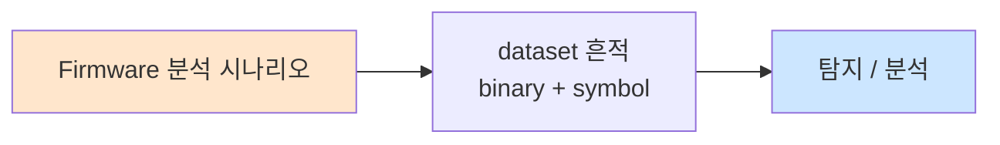

# Week 02: IoT 네트워크 프로토콜

## 학습 목표
- IoT에서 사용되는 주요 무선 프로토콜(WiFi, BLE, Zigbee, LoRa)의 특성을 이해한다
- MQTT, CoAP 등 IoT 애플리케이션 프로토콜의 동작 원리를 파악한다
- 각 프로토콜의 보안 취약점과 공격 벡터를 분류한다
- MQTT 브로커를 구축하고 메시지 가로채기 실습을 수행한다
- 프로토콜별 보안 설정 방법을 실습한다

## 실습 환경 (공통)

| 서버 | IP | 역할 | 접속 |
|------|-----|------|------|
| attacker | 10.20.30.201 | 공격/분석 머신 | `ssh ccc@10.20.30.201` (pw: 1) |
| secu | 10.20.30.1 | 방화벽/IPS | `ssh ccc@10.20.30.1` |
| web | 10.20.30.80 | IoT 서비스 호스트 | `ssh ccc@10.20.30.80` |
| siem | 10.20.30.100 | SIEM (Wazuh) | `ssh ccc@10.20.30.100` |

## 강의 시간 배분 (3시간)

| 시간 | 내용 | 유형 |
|------|------|------|
| 0:00-0:40 | 무선 프로토콜 개론 (Part 1) | 강의 |
| 0:40-1:10 | MQTT/CoAP 심화 (Part 2) | 강의/토론 |
| 1:10-1:20 | 휴식 | - |
| 1:20-2:00 | MQTT 실습 (Part 3) | 실습 |
| 2:00-2:40 | CoAP/프로토콜 분석 (Part 4) | 실습 |
| 2:40-2:50 | 휴식 | - |
| 2:50-3:20 | 프로토콜 보안 설정 (Part 5) | 실습 |
| 3:20-3:40 | 정리 + 과제 안내 | 정리 |

---

## Part 1: IoT 무선 프로토콜 개론 (40분)

### 1.1 IoT 프로토콜 스택 개요

```
┌──────────────────────────────────────────────┐
│ Application  │ MQTT │ CoAP │ HTTP │ AMQP    │
├──────────────────────────────────────────────┤
│ Transport    │ TCP  │ UDP  │ TCP  │ TCP     │
├──────────────────────────────────────────────┤
│ Network      │       IPv4 / IPv6 / 6LoWPAN  │
├──────────────────────────────────────────────┤
│ Data Link    │ WiFi│ BLE │Zigbee│ LoRa│ NB-IoT│
├──────────────────────────────────────────────┤
│ Physical     │ 2.4GHz │ 2.4GHz │ Sub-GHz   │
└──────────────────────────────────────────────┘
```

### 1.2 무선 프로토콜 비교

| 프로토콜 | 주파수 | 범위 | 속도 | 전력 | 보안 |
|----------|--------|------|------|------|------|
| WiFi (802.11) | 2.4/5 GHz | ~100m | ~1Gbps | 높음 | WPA3 |
| BLE 5.0 | 2.4 GHz | ~100m | 2Mbps | 매우 낮음 | AES-CCM |
| Zigbee | 2.4 GHz | ~100m | 250kbps | 낮음 | AES-128 |
| LoRa | Sub-GHz | ~15km | 50kbps | 매우 낮음 | AES-128 |
| NB-IoT | Licensed | ~10km | 250kbps | 낮음 | LTE 보안 |
| Z-Wave | 868/915 MHz | ~100m | 100kbps | 낮음 | AES-128 |

### 1.3 WiFi 보안 이슈

```
WEP → WPA → WPA2 → WPA3
(깨짐)  (취약)  (KRACK)  (Dragonblood)
```

**IoT WiFi 취약점:**
- 많은 IoT 디바이스가 여전히 WPA2-PSK만 지원
- ESP8266/ESP32 기반 디바이스의 WiFi 설정 모드 악용
- Deauth 공격에 취약 (802.11 관리 프레임 미보호)

### 1.4 BLE (Bluetooth Low Energy)

**BLE 아키텍처:**
```
┌─────────────┐     ┌─────────────┐
│  Central     │────│ Peripheral  │
│  (스마트폰)  │    │ (센서/장치) │
└─────────────┘     └─────────────┘
        │                   │
   GATT Client         GATT Server
   (데이터 읽기)       (데이터 제공)
```

**BLE 보안 모드:**
- Mode 1, Level 1: 보안 없음 (Just Works)
- Mode 1, Level 2: 미인증 페어링 + 암호화
- Mode 1, Level 3: 인증 페어링 + 암호화
- Mode 1, Level 4: 인증 LE Secure Connections

### 1.5 Zigbee

**Zigbee 네트워크 구조:**
```
     ┌──────────┐
     │Coordinator│ ← 네트워크 키 관리
     └─────┬────┘
     ┌─────┼─────┐
  ┌──┴──┐ ┌┴───┐ ┌┴───┐
  │Router│ │Router│ │Router│
  └──┬──┘ └┬───┘ └┬───┘
   ┌─┴─┐  ┌┴─┐  ┌─┴─┐
   │End│  │End│  │End│
   │Dev│  │Dev│  │Dev│
   └───┘  └───┘  └───┘
```

**Zigbee 보안 취약점:**
- 네트워크 키가 평문으로 전송되는 경우 존재
- 기본 Trust Center Link Key (ZigBeeAlliance09)
- 리플레이 공격 가능

### 1.6 LoRa / LoRaWAN

**LoRaWAN 아키텍처:**
```
End Device → Gateway → Network Server → Application Server
   (센서)    (중계기)    (관리서버)        (데이터처리)
```

**보안 키:**
- NwkSKey: 네트워크 세션 키 (무결성 검증)
- AppSKey: 애플리케이션 세션 키 (페이로드 암호화)
- AppKey: 애플리케이션 키 (OTAA 활성화)

---

## Part 2: MQTT/CoAP 프로토콜 심화 (30분)

### 2.1 MQTT 프로토콜 상세

**MQTT 동작 원리:**
```
Publisher ──publish──→ Broker ──deliver──→ Subscriber
  (센서)     (토픽)    (중계)    (토픽)     (대시보드)
```

**MQTT QoS 레벨:**
- QoS 0: At most once (최대 1회, 유실 가능)
- QoS 1: At least once (최소 1회, 중복 가능)
- QoS 2: Exactly once (정확히 1회, 가장 느림)

**MQTT 토픽 구조:**
```
home/livingroom/temperature
home/livingroom/humidity
home/+/temperature        # + : 단일 레벨 와일드카드
home/#                    # # : 다중 레벨 와일드카드
$SYS/broker/uptime        # $SYS : 시스템 토픽
```

**MQTT 보안 위협:**
1. **미인증 접근:** 인증 없이 브로커 연결
2. **토픽 스니핑:** 와일드카드(#)로 모든 메시지 수신
3. **메시지 위조:** 임의 토픽에 악성 데이터 발행
4. **DoS 공격:** 대량 메시지 발행으로 브로커 과부하
5. **Will 메시지 악용:** 연결 해제 시 자동 발행 메시지 조작

### 2.2 CoAP 프로토콜 상세

**CoAP vs HTTP:**

| 항목 | CoAP | HTTP |
|------|------|------|
| 전송 | UDP | TCP |
| 헤더 | 4바이트 | 수십~수백 바이트 |
| 메서드 | GET/POST/PUT/DELETE | 동일 |
| 관찰 | Observe 옵션 | WebSocket |
| 보안 | DTLS | TLS |
| 멀티캐스트 | 지원 | 미지원 |

**CoAP 보안 모드:**
- NoSec: 보안 없음 (UDP)
- PreSharedKey: 사전 공유 키 (DTLS-PSK)
- RawPublicKey: 원시 공개 키 (DTLS-RPK)
- Certificate: X.509 인증서 (DTLS)

---

## Part 3: MQTT 실습 (40분)

### 3.1 MQTT 브로커 구축 및 모니터링

```bash
# Mosquitto 브로커 (인증 없음 - 취약 설정)
docker run -d --name mqtt-vulnerable \
  -p 1883:1883 \
  eclipse-mosquitto:2 \
  mosquitto -c /dev/null -p 1883 -v

# 모든 토픽 구독 (도청)
mosquitto_sub -h localhost -t "#" -v &

# 센서 데이터 시뮬레이션
for i in $(seq 1 10); do
  mosquitto_pub -h localhost -t "factory/sensor/$i/temp" \
    -m "{\"value\": $((RANDOM % 40 + 10)), \"ts\": $(date +%s)}"
  sleep 0.5
done
```

### 3.2 MQTT 메시지 가로채기

```bash
# 공격자 관점: 모든 메시지 캡처
mosquitto_sub -h 10.20.30.80 -p 1883 -t "#" -v 2>/dev/null | \
  tee /tmp/mqtt_capture.txt &

# 민감 토픽 탐색
mosquitto_sub -h 10.20.30.80 -t "\$SYS/#" -v -C 20

# 악성 메시지 주입
mosquitto_pub -h 10.20.30.80 -t "factory/actuator/valve" \
  -m '{"action":"open","value":100}'
```

### 3.3 MQTT 인증 설정

```bash
# 비밀번호 파일 생성
docker exec mqtt-vulnerable sh -c \
  'mosquitto_passwd -c /mosquitto/passwd admin'

# 인증 설정 파일
cat << 'EOF' > /tmp/mosquitto_secure.conf
listener 1883
allow_anonymous false
password_file /mosquitto/passwd
EOF

# 보안 브로커 재시작
docker stop mqtt-vulnerable
docker run -d --name mqtt-secure \
  -p 1884:1883 \
  -v /tmp/mosquitto_secure.conf:/mosquitto/config/mosquitto.conf \
  eclipse-mosquitto:2
```

---

## Part 4: CoAP 및 프로토콜 분석 (40분)

### 4.1 CoAP 서버/클라이언트 실습

```bash
# CoAP 서버 시뮬레이터
pip3 install aiocoap linkheader

cat << 'PYEOF' > /tmp/coap_iot_server.py
import asyncio
import aiocoap
import aiocoap.resource as resource
import json, time

class TemperatureResource(resource.ObservableResource):
    def __init__(self):
        super().__init__()
        self.handle = None

    async def render_get(self, request):
        data = json.dumps({"temp": 23.5, "unit": "C", "ts": int(time.time())})
        return aiocoap.Message(payload=data.encode())

class ActuatorResource(resource.Resource):
    async def render_put(self, request):
        payload = request.payload.decode()
        print(f"[ACTUATOR] Received command: {payload}")
        return aiocoap.Message(code=aiocoap.CHANGED, payload=b"OK")

root = resource.Site()
root.add_resource(['sensor', 'temp'], TemperatureResource())
root.add_resource(['actuator', 'valve'], ActuatorResource())

asyncio.Task(aiocoap.Context.create_server_context(root, bind=('0.0.0.0', 5683)))
asyncio.get_event_loop().run_forever()
PYEOF

python3 /tmp/coap_iot_server.py &

# CoAP 클라이언트 요청
pip3 install aiocoap
python3 -m aiocoap.cli.client GET coap://localhost/sensor/temp
```

### 4.2 Wireshark/tcpdump를 이용한 프로토콜 분석

```bash
# MQTT 트래픽 캡처
tcpdump -i any -w /tmp/mqtt_traffic.pcap port 1883 &
TCPDUMP_PID=$!

# 트래픽 생성
mosquitto_pub -h localhost -t "test/data" -m "secret_data_123"
mosquitto_sub -h localhost -t "test/data" -C 1

sleep 2 && kill $TCPDUMP_PID

# 캡처 분석
tcpdump -r /tmp/mqtt_traffic.pcap -A | grep -a "secret_data"

# CoAP 트래픽 캡처
tcpdump -i any -w /tmp/coap_traffic.pcap port 5683 &
```

### 4.3 프로토콜 퍼징

```bash
# MQTT 퍼징 스크립트
cat << 'PYEOF' > /tmp/mqtt_fuzzer.py
import socket
import struct

def send_malformed_mqtt(host, port):
    """MQTT CONNECT 패킷 퍼징"""
    payloads = [
        b'\x10\x00',                          # 빈 CONNECT
        b'\x10\xff\xff\xff\x7f' + b'\x00'*100,  # 큰 길이
        b'\x10\x0c\x00\x04MQTT\x05\x00\x00\x3c\x00\x00',  # MQTTv5
        b'\x10\x0c\x00\x04MQTT\x04\xce\x00\x3c\x00\x00',  # 플래그 변조
        b'\x30\x00',                           # 빈 PUBLISH
    ]
    
    for i, payload in enumerate(payloads):
        try:
            s = socket.socket(socket.AF_INET, socket.SOCK_STREAM)
            s.settimeout(3)
            s.connect((host, port))
            s.send(payload)
            resp = s.recv(1024)
            print(f"[{i}] Sent {len(payload)}B -> Response: {resp.hex()}")
        except Exception as e:
            print(f"[{i}] Sent {len(payload)}B -> Error: {e}")
        finally:
            s.close()

send_malformed_mqtt('localhost', 1883)
PYEOF

python3 /tmp/mqtt_fuzzer.py
```

---

## Part 5: 프로토콜 보안 설정 (30분)

### 5.1 MQTT TLS 설정

```bash
# 자체 서명 인증서 생성
openssl req -new -x509 -days 365 -extensions v3_ca \
  -keyout /tmp/ca.key -out /tmp/ca.crt \
  -subj "/CN=IoT-CA" -nodes

openssl genrsa -out /tmp/server.key 2048
openssl req -new -key /tmp/server.key -out /tmp/server.csr \
  -subj "/CN=mqtt-server"
openssl x509 -req -in /tmp/server.csr -CA /tmp/ca.crt \
  -CAkey /tmp/ca.key -CAcreateserial -out /tmp/server.crt -days 365

# TLS MQTT 브로커
cat << 'EOF' > /tmp/mosquitto_tls.conf
listener 8883
cafile /mosquitto/certs/ca.crt
certfile /mosquitto/certs/server.crt
keyfile /mosquitto/certs/server.key
require_certificate false
allow_anonymous false
password_file /mosquitto/passwd
EOF
```

### 5.2 MQTT ACL (접근 제어 목록)

```bash
# ACL 설정 파일
cat << 'EOF' > /tmp/mosquitto_acl.conf
# 관리자: 모든 토픽 읽기/쓰기
user admin
topic readwrite #

# 센서: 자기 토픽만 쓰기
user sensor01
topic write sensor/01/#

# 대시보드: 센서 데이터 읽기만
user dashboard
topic read sensor/#
topic read $SYS/broker/clients/connected
EOF
```

### 5.3 프로토콜 보안 체크리스트

| 항목 | 확인 사항 | 상태 |
|------|-----------|------|
| MQTT 인증 | 사용자/비밀번호 설정됨 | |
| MQTT TLS | 8883 포트 + 인증서 | |
| MQTT ACL | 토픽별 접근 제어 | |
| CoAP DTLS | DTLS 암호화 활성화 | |
| 와일드카드 차단 | # 구독 제한 | |
| QoS 정책 | 적절한 QoS 레벨 설정 | |
| 메시지 크기 | 최대 메시지 크기 제한 | |
| 연결 제한 | 최대 동시 연결 수 제한 | |

---

## Part 6: 과제 안내 (20분)

### 과제

- MQTT 브로커에 TLS와 인증을 설정하고, ACL로 토픽 접근을 제어하시오
- tcpdump로 평문 MQTT와 TLS MQTT 트래픽을 캡처하여 차이를 비교하시오
- CoAP 서버를 구축하고 DTLS 없이/있을 때의 보안 차이를 분석하시오

---

## 참고 자료

- MQTT 5.0 사양: https://docs.oasis-open.org/mqtt/mqtt/v5.0/mqtt-v5.0.html
- CoAP RFC 7252: https://tools.ietf.org/html/rfc7252
- BLE 보안: https://www.bluetooth.com/learn-about-bluetooth/key-attributes/bluetooth-security/
- Zigbee 보안: https://csa-iot.org/all-solutions/zigbee/
- LoRaWAN 보안: https://lora-alliance.org/about-lorawan/

---

## 실제 사례 (WitFoo Precinct 6 — Firmware 분석)

> 출처: WitFoo Precinct 6 Cybersecurity Dataset (Apache 2.0)
> 본 lecture *Firmware 분석* 학습 항목 매칭.

### Firmware 분석 의 dataset 흔적 — "binary + symbol"

dataset 의 정상 운영에서 *binary + symbol* 신호의 baseline 을 알아두면, *Firmware 분석* 시도 시 발생하는 anomaly 를 정량으로 탐지할 수 있다. 핵심 정량 지표는 — binwalk + ghidra.



### Case 1: dataset 정량 지표

| 항목 | 값 |
|---|---|
| 핵심 신호 | binary + symbol |
| 정량 baseline | binwalk + ghidra |
| 학습 매핑 | firmware extract |

**자세한 해석**: firmware extract. 이 차이를 정량으로 측정해야 *공격 시도와 정상 운영의 구분* 이 가능. 학생이 baseline 숫자를 외워두면 — 운영 환경에서 anomaly 를 즉시 탐지할 수 있다.

### Case 2: 실전 적용 시나리오

| 단계 | dataset 활용 |
|---|---|
| 시도 식별 | binary + symbol 의 spike |
| 정상 vs 이상 | baseline 대비 비율 |
| 룰 작성 | Suricata / Wazuh / Sigma |
| 검증 | dataset 재실행 |

**자세한 해석**: 운영 환경 룰 작성은 — *baseline 측정 → 임계 결정 → 룰 작성 → dataset 검증* 의 4 단계. 한 단계라도 빠지면 false positive 폭증.

### 이 사례에서 학생이 배워야 할 3가지

1. **Firmware 분석 = binary + symbol 의 anomaly** — 정량 신호로 탐지.
2. **baseline 숫자 외우기** — binwalk + ghidra.
3. **4 단계 룰 작성** — 측정 → 임계 → 룰 → 검증.

**학생 액션**: lab firmware analyze.

