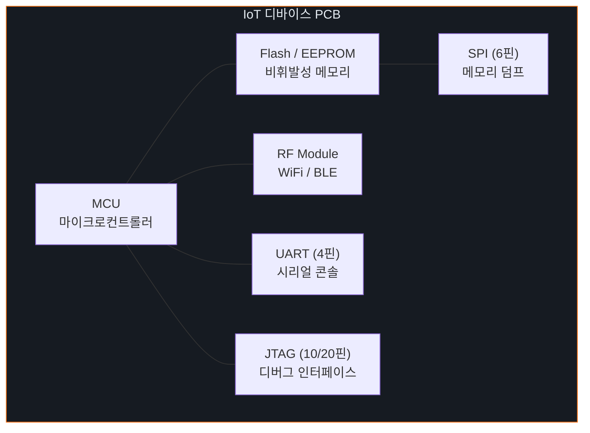
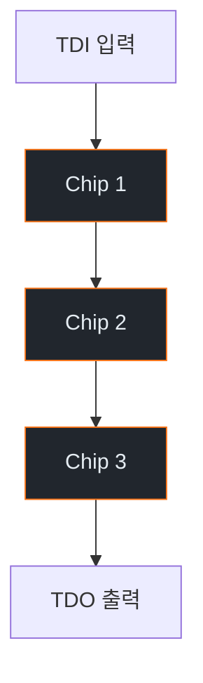

# Week 03: 하드웨어 인터페이스 보안

## 학습 목표
- IoT 디바이스의 주요 하드웨어 인터페이스(UART, SPI, I2C, JTAG)를 이해한다
- 각 인터페이스의 동작 원리와 보안 위협을 파악한다
- Bus Pirate 등 도구를 활용한 하드웨어 분석 기법을 학습한다
- 가상 환경에서 시리얼 통신 시뮬레이션을 수행한다
- 하드웨어 인터페이스 보안 대책을 수립한다

## 실습 환경 (공통)

| 서버 | IP | 역할 | 접속 |
|------|-----|------|------|
| attacker | 10.20.30.201 | 공격/분석 머신 | `ssh ccc@10.20.30.201` (pw: 1) |
| secu | 10.20.30.1 | 방화벽/IPS | `ssh ccc@10.20.30.1` |
| web | 10.20.30.80 | IoT 서비스 호스트 | `ssh ccc@10.20.30.80` |
| siem | 10.20.30.100 | SIEM (Wazuh) | `ssh ccc@10.20.30.100` |

## 강의 시간 배분 (3시간)

| 시간 | 내용 | 유형 |
|------|------|------|
| 0:00-0:40 | 하드웨어 인터페이스 이론 (Part 1) | 강의 |
| 0:40-1:10 | JTAG/SWD 디버깅 심화 (Part 2) | 강의/토론 |
| 1:10-1:20 | 휴식 | - |
| 1:20-2:00 | UART 시뮬레이션 실습 (Part 3) | 실습 |
| 2:00-2:40 | SPI/I2C 분석 실습 (Part 4) | 실습 |
| 2:40-2:50 | 휴식 | - |
| 2:50-3:20 | 하드웨어 보안 대책 (Part 5) | 실습 |
| 3:20-3:40 | 정리 + 과제 안내 | 정리 |

---

## Part 1: 하드웨어 인터페이스 이론 (40분)

### 1.1 IoT 디바이스 해부



### 1.2 UART (Universal Asynchronous Receiver-Transmitter)

**UART 핀 구성:**
```
디바이스          분석 장비
  TX  ──────────→  RX
  RX  ←──────────  TX
  GND ────────────  GND
  VCC              (연결하지 않음)
```

**UART 파라미터:**
- 보드레이트: 9600, 19200, 38400, 57600, 115200 (가장 흔함)
- 데이터 비트: 8
- 패리티: None
- 스톱 비트: 1
- 흐름 제어: None

**UART를 통한 공격:**
1. 부트로그 확인 → 시스템 정보 수집
2. 루트 쉘 접근 (비밀번호 없는 경우)
3. U-Boot 인터럽트 → 부트 설정 변경
4. 파일시스템 마운트 → 비밀번호 해시 추출

### 1.3 SPI (Serial Peripheral Interface)

**SPI 핀 구성:**
```
Master                Slave
  MOSI  ──────────→  MOSI   (Master Out, Slave In)
  MISO  ←──────────  MISO   (Master In, Slave Out)
  SCK   ──────────→  SCK    (Serial Clock)
  CS    ──────────→  CS     (Chip Select)
  GND   ────────────  GND
```

**SPI 공격 시나리오:**
- Flash 칩 직접 읽기 (펌웨어 추출)
- Flash 칩 쓰기 (백도어 주입)
- EEPROM 인증 데이터 추출

### 1.4 I2C (Inter-Integrated Circuit)

**I2C 핀 구성:**
```
Master ──── SDA (데이터) ──── Slave 1
       ──── SCL (클럭)  ──── Slave 2
       ──── GND         ──── Slave 3
```

**I2C 특성:**
- 2선식 (SDA + SCL)
- 7비트/10비트 주소 체계
- 멀티 마스터/슬레이브 지원
- 속도: 100kHz(표준), 400kHz(고속), 3.4MHz(초고속)

### 1.5 JTAG (Joint Test Action Group)

**JTAG 핀 구성:**
```
TCK  ── Test Clock
TMS  ── Test Mode Select
TDI  ── Test Data In
TDO  ── Test Data Out
TRST ── Test Reset (선택)
```

**JTAG 공격:**
1. 칩 식별 (IDCODE 읽기)
2. 메모리 덤프 (RAM, Flash)
3. 디버그 접근 (중단점, 레지스터 읽기)
4. 펌웨어 추출/수정
5. 보안 퓨즈 우회 시도

**SWD (Serial Wire Debug):**
- ARM 프로세서 전용 디버그 인터페이스
- JTAG보다 적은 핀 (SWDIO, SWCLK, GND)
- ARM Cortex-M 시리즈에서 주로 사용

---

## Part 2: JTAG/SWD 디버깅 심화 (30분)

### 2.1 JTAG 체인 탐색



**JTAG IDCODE 구조:**
```
31      28 27        12 11         1  0
┌────────┬─────────────┬───────────┬──┐
│Version │ Part Number │Manufacturer│ 1│
│ (4bit) │  (16bit)    │  (11bit)  │  │
└────────┴─────────────┴───────────┴──┘
```

### 2.2 OpenOCD를 이용한 디버깅

```bash
# OpenOCD 설정 예시
cat << 'EOF' > /tmp/openocd_jtag.cfg
# JTAG 어댑터 설정
interface ftdi
ftdi_vid_pid 0x0403 0x6010

# 타겟 MCU 설정
set CHIPNAME stm32f4x
source [find target/stm32f4x.cfg]

# 디버그 명령
init
halt
flash read_image /tmp/firmware_dump.bin 0x08000000 0x100000
resume
shutdown
EOF
```

### 2.3 하드웨어 분석 도구

| 도구 | 용도 | 가격 |
|------|------|------|
| Bus Pirate | UART/SPI/I2C/JTAG 범용 | ~$30 |
| FTDI FT232R | USB-UART 변환 | ~$15 |
| Logic Analyzer | 디지털 신호 분석 | ~$10 |
| JTAGulator | JTAG 핀 자동 탐색 | ~$150 |
| Shikra | SPI/I2C Flash 읽기 | ~$30 |
| Saleae Logic | 고급 로직 분석기 | ~$500 |

---

## Part 3: UART 시뮬레이션 실습 (40분)

### 3.1 가상 시리얼 포트 생성

```bash
# socat으로 가상 시리얼 포트 쌍 생성
sudo apt install -y socat minicom

# PTY 쌍 생성 (가상 UART)
socat -d -d pty,raw,echo=0,link=/tmp/vUART0 \
              pty,raw,echo=0,link=/tmp/vUART1 &

# IoT 디바이스 시뮬레이터 (Python)
cat << 'PYEOF' > /tmp/uart_device_sim.py
#!/usr/bin/env python3
"""가상 IoT 디바이스 UART 콘솔 시뮬레이터"""
import serial
import time
import os

def main():
    try:
        ser = serial.Serial('/tmp/vUART0', 115200, timeout=1)
    except:
        print("socat PTY를 먼저 실행하세요")
        return

    # 부트 시퀀스 출력
    boot_messages = [
        "\r\n",
        "U-Boot 2020.04 (IoT Gateway v2.1)\r\n",
        "CPU: ARM Cortex-A7 @ 800MHz\r\n",
        "DRAM: 256MB\r\n",
        "Flash: 32MB NOR\r\n",
        "Loading kernel from 0x80000...\r\n",
        "Starting kernel ...\r\n",
        "[    0.000000] Booting Linux on physical CPU 0x0\r\n",
        "[    1.234567] IoT Gateway OS v2.1.3\r\n",
        "[    2.345678] Starting services...\r\n",
        "[    3.456789] MQTT broker started on port 1883\r\n",
        "[    4.567890] Web dashboard on port 80\r\n",
        "\r\niot-gateway login: ",
    ]

    for msg in boot_messages:
        ser.write(msg.encode())
        time.sleep(0.3)

    # 로그인 처리 루프
    while True:
        data = ser.readline().decode(errors='ignore').strip()
        if not data:
            continue
        if data == 'root':
            ser.write(b"Password: ")
            pwd = ser.readline().decode(errors='ignore').strip()
            if pwd in ['root', 'admin', 'toor', '']:
                ser.write(b"\r\n# ")
                handle_shell(ser)
            else:
                ser.write(b"\r\nLogin incorrect\r\niot-gateway login: ")
        else:
            ser.write(b"Password: ")
            ser.readline()
            ser.write(b"\r\nLogin incorrect\r\niot-gateway login: ")

def handle_shell(ser):
    while True:
        data = ser.readline().decode(errors='ignore').strip()
        if data == 'cat /etc/passwd':
            ser.write(b"root:$6$xyz:0:0:root:/root:/bin/sh\r\nadmin:$6$abc:1000:1000::/home/admin:/bin/sh\r\n# ")
        elif data == 'cat /etc/shadow':
            ser.write(b"root:$6$rounds=5000$salt$hash:18000:0:99999:7:::\r\n# ")
        elif data == 'ifconfig':
            ser.write(b"eth0: 192.168.1.1 netmask 255.255.255.0\r\nwlan0: 10.0.0.1 netmask 255.255.255.0\r\n# ")
        elif data == 'uname -a':
            ser.write(b"Linux iot-gateway 4.14.0 armv7l\r\n# ")
        elif data == 'ps':
            ser.write(b"  PID CMD\r\n    1 init\r\n  101 mosquitto\r\n  102 lighttpd\r\n  103 telnetd\r\n# ")
        elif data == 'exit':
            ser.write(b"\r\niot-gateway login: ")
            return
        else:
            ser.write(f"{data}: command not found\r\n# ".encode())

if __name__ == "__main__":
    main()
PYEOF

pip3 install pyserial
python3 /tmp/uart_device_sim.py &
```

### 3.2 UART 접속 및 정보 수집

```bash
# minicom으로 가상 UART 접속
minicom -D /tmp/vUART1 -b 115200

# 또는 screen 사용
screen /tmp/vUART1 115200

# Python 시리얼 접속
cat << 'PYEOF' > /tmp/uart_connect.py
import serial
import time

ser = serial.Serial('/tmp/vUART1', 115200, timeout=2)
time.sleep(3)  # 부트 대기

# 부트 로그 수집
print("=== Boot Log ===")
while ser.in_waiting:
    print(ser.readline().decode(errors='ignore'), end='')

# 로그인 시도
ser.write(b'root\n')
time.sleep(0.5)
ser.write(b'root\n')  # 기본 비밀번호
time.sleep(0.5)

# 정보 수집 명령
commands = ['uname -a', 'cat /etc/passwd', 'ifconfig', 'ps']
for cmd in commands:
    ser.write(f'{cmd}\n'.encode())
    time.sleep(0.5)
    while ser.in_waiting:
        print(ser.readline().decode(errors='ignore'), end='')

ser.close()
PYEOF

python3 /tmp/uart_connect.py
```

### 3.3 보드레이트 자동 탐지

```bash
# 보드레이트 브루트포스
cat << 'PYEOF' > /tmp/baudrate_detect.py
import serial
import time

COMMON_BAUDRATES = [9600, 19200, 38400, 57600, 115200, 230400, 460800, 921600]

def detect_baudrate(port):
    for baud in COMMON_BAUDRATES:
        try:
            ser = serial.Serial(port, baud, timeout=2)
            ser.write(b'\r\n')
            time.sleep(0.5)
            data = ser.read(100)
            if data:
                text = data.decode(errors='ignore')
                printable = sum(c.isprintable() or c in '\r\n' for c in text)
                ratio = printable / len(text) if text else 0
                print(f"[{baud}] Readable: {ratio:.0%} | {repr(text[:50])}")
                if ratio > 0.7:
                    print(f"  → 유력한 보드레이트: {baud}")
            ser.close()
        except Exception as e:
            print(f"[{baud}] Error: {e}")

detect_baudrate('/tmp/vUART1')
PYEOF

python3 /tmp/baudrate_detect.py
```

---

## Part 4: SPI/I2C 분석 실습 (40분)

### 4.1 SPI Flash 덤프 시뮬레이션

```bash
# SPI Flash 덤프 시뮬레이터
cat << 'PYEOF' > /tmp/spi_flash_sim.py
#!/usr/bin/env python3
"""SPI Flash 읽기 시뮬레이션"""
import struct
import os

# 가상 펌웨어 이미지 생성
firmware_size = 1024 * 1024  # 1MB
firmware = bytearray(firmware_size)

# 부트로더 영역 (0x0000-0x1000)
bootloader_header = b'\x27\x05\x19\x56'  # U-Boot magic
firmware[0:4] = bootloader_header
firmware[4:20] = b'U-Boot 2020.04\x00\x00'

# 커널 영역 (0x10000-0x80000)
kernel_magic = b'\x27\x05\x19\x56'  # uImage header
firmware[0x10000:0x10004] = kernel_magic

# 파일시스템 영역 (0x80000-0x100000)
squashfs_magic = b'hsqs'  # SquashFS magic
firmware[0x80000:0x80004] = squashfs_magic

# WiFi 비밀번호 (보안 취약점 시뮬레이션)
wifi_config = b'SSID=IoT-Gateway\nPSK=SuperSecret123\nENC=WPA2\n'
firmware[0x90000:0x90000+len(wifi_config)] = wifi_config

# API 키 하드코딩 (보안 취약점)
api_key = b'API_KEY=sk-1234567890abcdef\nSERVER=api.iot-cloud.com\n'
firmware[0x90100:0x90100+len(api_key)] = api_key

# 파일로 저장
with open('/tmp/firmware_dump.bin', 'wb') as f:
    f.write(firmware)

print(f"[+] 가상 펌웨어 이미지 생성: {firmware_size} bytes")
print(f"[+] 저장 위치: /tmp/firmware_dump.bin")

# 분석
print("\n=== 매직 바이트 분석 ===")
with open('/tmp/firmware_dump.bin', 'rb') as f:
    data = f.read()
    if data[0:4] == b'\x27\x05\x19\x56':
        print("[+] U-Boot header found at 0x0000")
    if data[0x80000:0x80004] == b'hsqs':
        print("[+] SquashFS found at 0x80000")

print("\n=== 문자열 검색 ===")
import re
strings = re.findall(rb'[\x20-\x7e]{8,}', data)
for s in strings:
    decoded = s.decode('ascii', errors='ignore')
    if any(kw in decoded.lower() for kw in ['password', 'psk', 'key', 'secret', 'api']):
        offset = data.find(s)
        print(f"  [!] 0x{offset:06x}: {decoded}")
PYEOF

python3 /tmp/spi_flash_sim.py
```

### 4.2 I2C EEPROM 분석 시뮬레이션

```bash
# I2C EEPROM 시뮬레이터
cat << 'PYEOF' > /tmp/i2c_eeprom_sim.py
#!/usr/bin/env python3
"""I2C EEPROM 읽기/쓰기 시뮬레이션"""

class I2C_EEPROM:
    def __init__(self, address=0x50, size=256):
        self.address = address
        self.size = size
        self.memory = bytearray(size)
        self._init_data()

    def _init_data(self):
        # 디바이스 설정 데이터
        config = {
            0x00: b'\xAA\x55',          # Magic
            0x02: b'\x01\x03',          # HW version 1.3
            0x04: b'\x02\x01\x00',      # FW version 2.1.0
            0x10: b'IoT-Sensor-01\x00',  # Device name
            0x20: b'\xDE\xAD\xBE\xEF\x00\x01',  # MAC address
            0x30: b'admin\x00',          # Default username
            0x36: b'admin123\x00',       # Default password (취약!)
            0x40: b'\xC0\xA8\x01\x64',  # IP: 192.168.1.100
            0x50: b'AES_KEY_1234567890\x00',  # 암호화 키 (취약!)
        }
        for offset, data in config.items():
            self.memory[offset:offset+len(data)] = data

    def read(self, offset, length):
        return bytes(self.memory[offset:offset+length])

    def write(self, offset, data):
        self.memory[offset:offset+len(data)] = data

    def dump(self):
        print(f"=== EEPROM Dump (0x{self.address:02X}) ===")
        for i in range(0, self.size, 16):
            hex_str = ' '.join(f'{b:02X}' for b in self.memory[i:i+16])
            ascii_str = ''.join(chr(b) if 32 <= b < 127 else '.' for b in self.memory[i:i+16])
            print(f"0x{i:04X}: {hex_str:<48} {ascii_str}")

eeprom = I2C_EEPROM()
eeprom.dump()

print("\n=== 민감 정보 추출 ===")
print(f"Device Name: {eeprom.read(0x10, 14).decode(errors='ignore').strip(chr(0))}")
print(f"Username: {eeprom.read(0x30, 6).decode(errors='ignore').strip(chr(0))}")
print(f"Password: {eeprom.read(0x36, 9).decode(errors='ignore').strip(chr(0))}")
print(f"AES Key: {eeprom.read(0x50, 19).decode(errors='ignore').strip(chr(0))}")
PYEOF

python3 /tmp/i2c_eeprom_sim.py
```

---

## Part 5: 하드웨어 보안 대책 (30분)

### 5.1 하드웨어 보안 강화

| 인터페이스 | 취약점 | 대책 |
|------------|--------|------|
| UART | 루트 쉘 접근 | 생산 후 비활성화, 인증 요구 |
| SPI | 펌웨어 추출 | 암호화, 보안 부트 |
| I2C | 인증 정보 추출 | 민감 데이터 암호화 |
| JTAG | 디버그 접근 | JTAG Lock, 보안 퓨즈 |

### 5.2 보안 부트 체인

```
┌─────────┐    ┌──────────┐    ┌────────┐    ┌──────┐
│ ROM Boot│───→│Bootloader│───→│ Kernel │───→│ App  │
│(변경불가)│    │(서명검증) │    │(서명검증)│   │      │
└─────────┘    └──────────┘    └────────┘    └──────┘
     ↑              ↑              ↑
  하드웨어       공개키 검증     해시 체인
  신뢰 루트
```

### 5.3 물리적 보안 체크리스트

- [ ] 디버그 포트(UART/JTAG) 생산 시 비활성화
- [ ] 보안 퓨즈로 JTAG 잠금
- [ ] SPI Flash 읽기 보호 활성화
- [ ] 에폭시로 테스트 포인트 은폐
- [ ] 보안 부트 체인 구현
- [ ] 하드웨어 보안 모듈(HSM) 사용
- [ ] 탬퍼 감지 메커니즘 구현
- [ ] 안티 리버싱 (BGA, 칩 마킹 제거)

---

## Part 6: 과제 안내 (20분)

### 과제

- 가상 UART 시뮬레이터에 접속하여 부트 로그를 분석하고, 시스템 정보를 수집하시오
- SPI Flash 덤프에서 민감 정보(비밀번호, API 키)를 추출하시오
- 하드웨어 보안 점검 체크리스트를 작성하시오

---

## 참고 자료

- Bus Pirate 문서: http://dangerousprototypes.com/docs/Bus_Pirate
- OpenOCD 사용자 가이드: https://openocd.org/doc/
- JTAG/SWD 디버깅: https://www.saleae.com/
- IoT 하드웨어 해킹: "The Hardware Hacking Handbook" (Jasper van Woudenberg)

---

## 실제 사례 (WitFoo Precinct 6 — UART/JTAG)

> 출처: WitFoo Precinct 6 Cybersecurity Dataset (Apache 2.0)
> 본 lecture *UART/JTAG* 학습 항목 매칭.

### UART/JTAG 의 dataset 흔적 — "hardware debugging"

dataset 의 정상 운영에서 *hardware debugging* 신호의 baseline 을 알아두면, *UART/JTAG* 시도 시 발생하는 anomaly 를 정량으로 탐지할 수 있다. 핵심 정량 지표는 — physical access.


### Case 1: dataset 정량 지표

| 항목 | 값 |
|---|---|
| 핵심 신호 | hardware debugging |
| 정량 baseline | physical access |
| 학습 매핑 | BusPirate + JTAGulator |

**자세한 해석**: BusPirate + JTAGulator. 이 차이를 정량으로 측정해야 *공격 시도와 정상 운영의 구분* 이 가능. 학생이 baseline 숫자를 외워두면 — 운영 환경에서 anomaly 를 즉시 탐지할 수 있다.

### Case 2: 실전 적용 시나리오

| 단계 | dataset 활용 |
|---|---|
| 시도 식별 | hardware debugging 의 spike |
| 정상 vs 이상 | baseline 대비 비율 |
| 룰 작성 | Suricata / Wazuh / Sigma |
| 검증 | dataset 재실행 |

**자세한 해석**: 운영 환경 룰 작성은 — *baseline 측정 → 임계 결정 → 룰 작성 → dataset 검증* 의 4 단계. 한 단계라도 빠지면 false positive 폭증.

### 이 사례에서 학생이 배워야 할 3가지

1. **UART/JTAG = hardware debugging 의 anomaly** — 정량 신호로 탐지.
2. **baseline 숫자 외우기** — physical access.
3. **4 단계 룰 작성** — 측정 → 임계 → 룰 → 검증.

**학생 액션**: lab UART.

