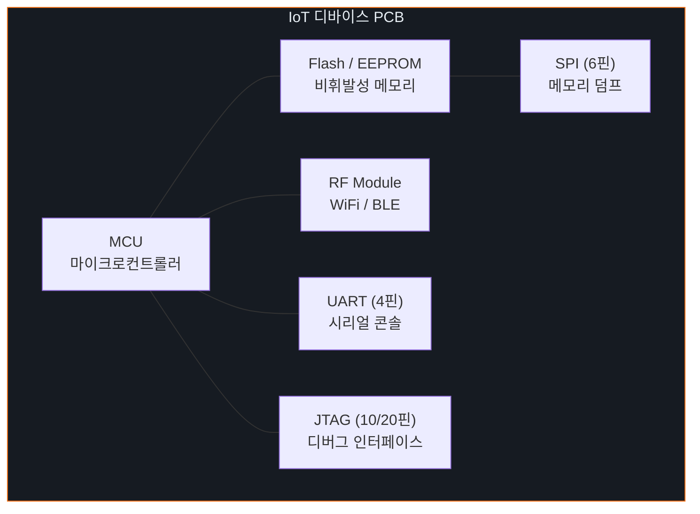
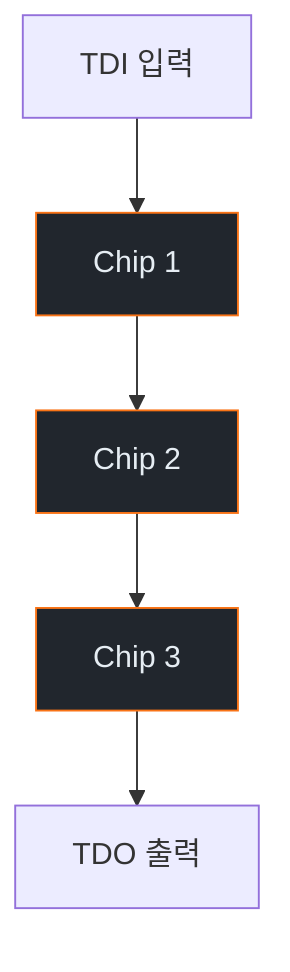

# Week 03: 하드웨어 인터페이스 보안

## 학습 목표
- IoT 디바이스의 주요 하드웨어 인터페이스(UART, SPI, I2C, JTAG)를 이해한다
- 각 인터페이스의 동작 원리와 보안 위협을 파악한다
- Bus Pirate 등 도구를 활용한 하드웨어 분석 기법을 학습한다
- 가상 환경에서 시리얼 통신 시뮬레이션을 수행한다
- 하드웨어 인터페이스 보안 대책을 수립한다

## 실습 환경 (공통)

| 서버 | IP | 역할 | 접속 |
|------|-----|------|------|
| attacker | 10.20.30.201 | 공격/분석 머신 | `ssh ccc@10.20.30.201` (pw: 1) |
| secu | 10.20.30.1 | 방화벽/IPS | `ssh ccc@10.20.30.1` |
| web | 10.20.30.80 | IoT 서비스 호스트 | `ssh ccc@10.20.30.80` |
| siem | 10.20.30.100 | SIEM (Wazuh) | `ssh ccc@10.20.30.100` |

## 강의 시간 배분 (3시간)

| 시간 | 내용 | 유형 |
|------|------|------|
| 0:00-0:40 | 하드웨어 인터페이스 이론 (Part 1) | 강의 |
| 0:40-1:10 | JTAG/SWD 디버깅 심화 (Part 2) | 강의/토론 |
| 1:10-1:20 | 휴식 | - |
| 1:20-2:00 | UART 시뮬레이션 실습 (Part 3) | 실습 |
| 2:00-2:40 | SPI/I2C 분석 실습 (Part 4) | 실습 |
| 2:40-2:50 | 휴식 | - |
| 2:50-3:20 | 하드웨어 보안 대책 (Part 5) | 실습 |
| 3:20-3:40 | 정리 + 과제 안내 | 정리 |

---

## Part 1: 하드웨어 인터페이스 이론 (40분)

### 1.1 IoT 디바이스 해부



### 1.2 UART (Universal Asynchronous Receiver-Transmitter)

**UART 핀 구성:**
```
디바이스          분석 장비
  TX  ──────────→  RX
  RX  ←──────────  TX
  GND ────────────  GND
  VCC              (연결하지 않음)
```

**UART 파라미터:**
- 보드레이트: 9600, 19200, 38400, 57600, 115200 (가장 흔함)
- 데이터 비트: 8
- 패리티: None
- 스톱 비트: 1
- 흐름 제어: None

**UART를 통한 공격:**
1. 부트로그 확인 → 시스템 정보 수집
2. 루트 쉘 접근 (비밀번호 없는 경우)
3. U-Boot 인터럽트 → 부트 설정 변경
4. 파일시스템 마운트 → 비밀번호 해시 추출

### 1.3 SPI (Serial Peripheral Interface)

**SPI 핀 구성:**
```
Master                Slave
  MOSI  ──────────→  MOSI   (Master Out, Slave In)
  MISO  ←──────────  MISO   (Master In, Slave Out)
  SCK   ──────────→  SCK    (Serial Clock)
  CS    ──────────→  CS     (Chip Select)
  GND   ────────────  GND
```

**SPI 공격 시나리오:**
- Flash 칩 직접 읽기 (펌웨어 추출)
- Flash 칩 쓰기 (백도어 주입)
- EEPROM 인증 데이터 추출

### 1.4 I2C (Inter-Integrated Circuit)

**I2C 핀 구성:**
```
Master ──── SDA (데이터) ──── Slave 1
       ──── SCL (클럭)  ──── Slave 2
       ──── GND         ──── Slave 3
```

**I2C 특성:**
- 2선식 (SDA + SCL)
- 7비트/10비트 주소 체계
- 멀티 마스터/슬레이브 지원
- 속도: 100kHz(표준), 400kHz(고속), 3.4MHz(초고속)

### 1.5 JTAG (Joint Test Action Group)

**JTAG 핀 구성:**
```
TCK  ── Test Clock
TMS  ── Test Mode Select
TDI  ── Test Data In
TDO  ── Test Data Out
TRST ── Test Reset (선택)
```

**JTAG 공격:**
1. 칩 식별 (IDCODE 읽기)
2. 메모리 덤프 (RAM, Flash)
3. 디버그 접근 (중단점, 레지스터 읽기)
4. 펌웨어 추출/수정
5. 보안 퓨즈 우회 시도

**SWD (Serial Wire Debug):**
- ARM 프로세서 전용 디버그 인터페이스
- JTAG보다 적은 핀 (SWDIO, SWCLK, GND)
- ARM Cortex-M 시리즈에서 주로 사용

---

## Part 2: JTAG/SWD 디버깅 심화 (30분)

### 2.1 JTAG 체인 탐색



**JTAG IDCODE 구조:**
```
31      28 27        12 11         1  0
┌────────┬─────────────┬───────────┬──┐
│Version │ Part Number │Manufacturer│ 1│
│ (4bit) │  (16bit)    │  (11bit)  │  │
└────────┴─────────────┴───────────┴──┘
```

### 2.2 OpenOCD를 이용한 디버깅

```bash
# OpenOCD 설정 예시
cat << 'EOF' > /tmp/openocd_jtag.cfg
# JTAG 어댑터 설정
interface ftdi
ftdi_vid_pid 0x0403 0x6010

# 타겟 MCU 설정
set CHIPNAME stm32f4x
source [find target/stm32f4x.cfg]

# 디버그 명령
init
halt
flash read_image /tmp/firmware_dump.bin 0x08000000 0x100000
resume
shutdown
EOF
```

### 2.3 하드웨어 분석 도구

| 도구 | 용도 | 가격 |
|------|------|------|
| Bus Pirate | UART/SPI/I2C/JTAG 범용 | ~$30 |
| FTDI FT232R | USB-UART 변환 | ~$15 |
| Logic Analyzer | 디지털 신호 분석 | ~$10 |
| JTAGulator | JTAG 핀 자동 탐색 | ~$150 |
| Shikra | SPI/I2C Flash 읽기 | ~$30 |
| Saleae Logic | 고급 로직 분석기 | ~$500 |

---

## Part 3: UART 시뮬레이션 실습 (40분)

### 3.1 가상 시리얼 포트 생성

```bash
# socat으로 가상 시리얼 포트 쌍 생성
sudo apt install -y socat minicom

# PTY 쌍 생성 (가상 UART)
socat -d -d pty,raw,echo=0,link=/tmp/vUART0 \
              pty,raw,echo=0,link=/tmp/vUART1 &

# IoT 디바이스 시뮬레이터 (Python)
cat << 'PYEOF' > /tmp/uart_device_sim.py
#!/usr/bin/env python3
"""가상 IoT 디바이스 UART 콘솔 시뮬레이터"""
import serial
import time
import os

def main():
    try:
        ser = serial.Serial('/tmp/vUART0', 115200, timeout=1)
    except:
        print("socat PTY를 먼저 실행하세요")
        return

    # 부트 시퀀스 출력
    boot_messages = [
        "\r\n",
        "U-Boot 2020.04 (IoT Gateway v2.1)\r\n",
        "CPU: ARM Cortex-A7 @ 800MHz\r\n",
        "DRAM: 256MB\r\n",
        "Flash: 32MB NOR\r\n",
        "Loading kernel from 0x80000...\r\n",
        "Starting kernel ...\r\n",
        "[    0.000000] Booting Linux on physical CPU 0x0\r\n",
        "[    1.234567] IoT Gateway OS v2.1.3\r\n",
        "[    2.345678] Starting services...\r\n",
        "[    3.456789] MQTT broker started on port 1883\r\n",
        "[    4.567890] Web dashboard on port 80\r\n",
        "\r\niot-gateway login: ",
    ]

    for msg in boot_messages:
        ser.write(msg.encode())
        time.sleep(0.3)

    # 로그인 처리 루프
    while True:
        data = ser.readline().decode(errors='ignore').strip()
        if not data:
            continue
        if data == 'root':
            ser.write(b"Password: ")
            pwd = ser.readline().decode(errors='ignore').strip()
            if pwd in ['root', 'admin', 'toor', '']:
                ser.write(b"\r\n# ")
                handle_shell(ser)
            else:
                ser.write(b"\r\nLogin incorrect\r\niot-gateway login: ")
        else:
            ser.write(b"Password: ")
            ser.readline()
            ser.write(b"\r\nLogin incorrect\r\niot-gateway login: ")

def handle_shell(ser):
    while True:
        data = ser.readline().decode(errors='ignore').strip()
        if data == 'cat /etc/passwd':
            ser.write(b"root:$6$xyz:0:0:root:/root:/bin/sh\r\nadmin:$6$abc:1000:1000::/home/admin:/bin/sh\r\n# ")
        elif data == 'cat /etc/shadow':
            ser.write(b"root:$6$rounds=5000$salt$hash:18000:0:99999:7:::\r\n# ")
        elif data == 'ifconfig':
            ser.write(b"eth0: 192.168.1.1 netmask 255.255.255.0\r\nwlan0: 10.0.0.1 netmask 255.255.255.0\r\n# ")
        elif data == 'uname -a':
            ser.write(b"Linux iot-gateway 4.14.0 armv7l\r\n# ")
        elif data == 'ps':
            ser.write(b"  PID CMD\r\n    1 init\r\n  101 mosquitto\r\n  102 lighttpd\r\n  103 telnetd\r\n# ")
        elif data == 'exit':
            ser.write(b"\r\niot-gateway login: ")
            return
        else:
            ser.write(f"{data}: command not found\r\n# ".encode())

if __name__ == "__main__":
    main()
PYEOF

pip3 install pyserial
python3 /tmp/uart_device_sim.py &
```

### 3.2 UART 접속 및 정보 수집

```bash
# minicom으로 가상 UART 접속
minicom -D /tmp/vUART1 -b 115200

# 또는 screen 사용
screen /tmp/vUART1 115200

# Python 시리얼 접속
cat << 'PYEOF' > /tmp/uart_connect.py
import serial
import time

ser = serial.Serial('/tmp/vUART1', 115200, timeout=2)
time.sleep(3)  # 부트 대기

# 부트 로그 수집
print("=== Boot Log ===")
while ser.in_waiting:
    print(ser.readline().decode(errors='ignore'), end='')

# 로그인 시도
ser.write(b'root\n')
time.sleep(0.5)
ser.write(b'root\n')  # 기본 비밀번호
time.sleep(0.5)

# 정보 수집 명령
commands = ['uname -a', 'cat /etc/passwd', 'ifconfig', 'ps']
for cmd in commands:
    ser.write(f'{cmd}\n'.encode())
    time.sleep(0.5)
    while ser.in_waiting:
        print(ser.readline().decode(errors='ignore'), end='')

ser.close()
PYEOF

python3 /tmp/uart_connect.py
```

### 3.3 보드레이트 자동 탐지

```bash
# 보드레이트 브루트포스
cat << 'PYEOF' > /tmp/baudrate_detect.py
import serial
import time

COMMON_BAUDRATES = [9600, 19200, 38400, 57600, 115200, 230400, 460800, 921600]

def detect_baudrate(port):
    for baud in COMMON_BAUDRATES:
        try:
            ser = serial.Serial(port, baud, timeout=2)
            ser.write(b'\r\n')
            time.sleep(0.5)
            data = ser.read(100)
            if data:
                text = data.decode(errors='ignore')
                printable = sum(c.isprintable() or c in '\r\n' for c in text)
                ratio = printable / len(text) if text else 0
                print(f"[{baud}] Readable: {ratio:.0%} | {repr(text[:50])}")
                if ratio > 0.7:
                    print(f"  → 유력한 보드레이트: {baud}")
            ser.close()
        except Exception as e:
            print(f"[{baud}] Error: {e}")

detect_baudrate('/tmp/vUART1')
PYEOF

python3 /tmp/baudrate_detect.py
```

---

## Part 4: SPI/I2C 분석 실습 (40분)

### 4.1 SPI Flash 덤프 시뮬레이션

```bash
# SPI Flash 덤프 시뮬레이터
cat << 'PYEOF' > /tmp/spi_flash_sim.py
#!/usr/bin/env python3
"""SPI Flash 읽기 시뮬레이션"""
import struct
import os

# 가상 펌웨어 이미지 생성
firmware_size = 1024 * 1024  # 1MB
firmware = bytearray(firmware_size)

# 부트로더 영역 (0x0000-0x1000)
bootloader_header = b'\x27\x05\x19\x56'  # U-Boot magic
firmware[0:4] = bootloader_header
firmware[4:20] = b'U-Boot 2020.04\x00\x00'

# 커널 영역 (0x10000-0x80000)
kernel_magic = b'\x27\x05\x19\x56'  # uImage header
firmware[0x10000:0x10004] = kernel_magic

# 파일시스템 영역 (0x80000-0x100000)
squashfs_magic = b'hsqs'  # SquashFS magic
firmware[0x80000:0x80004] = squashfs_magic

# WiFi 비밀번호 (보안 취약점 시뮬레이션)
wifi_config = b'SSID=IoT-Gateway\nPSK=SuperSecret123\nENC=WPA2\n'
firmware[0x90000:0x90000+len(wifi_config)] = wifi_config

# API 키 하드코딩 (보안 취약점)
api_key = b'API_KEY=sk-1234567890abcdef\nSERVER=api.iot-cloud.com\n'
firmware[0x90100:0x90100+len(api_key)] = api_key

# 파일로 저장
with open('/tmp/firmware_dump.bin', 'wb') as f:
    f.write(firmware)

print(f"[+] 가상 펌웨어 이미지 생성: {firmware_size} bytes")
print(f"[+] 저장 위치: /tmp/firmware_dump.bin")

# 분석
print("\n=== 매직 바이트 분석 ===")
with open('/tmp/firmware_dump.bin', 'rb') as f:
    data = f.read()
    if data[0:4] == b'\x27\x05\x19\x56':
        print("[+] U-Boot header found at 0x0000")
    if data[0x80000:0x80004] == b'hsqs':
        print("[+] SquashFS found at 0x80000")

print("\n=== 문자열 검색 ===")
import re
strings = re.findall(rb'[\x20-\x7e]{8,}', data)
for s in strings:
    decoded = s.decode('ascii', errors='ignore')
    if any(kw in decoded.lower() for kw in ['password', 'psk', 'key', 'secret', 'api']):
        offset = data.find(s)
        print(f"  [!] 0x{offset:06x}: {decoded}")
PYEOF

python3 /tmp/spi_flash_sim.py
```

### 4.2 I2C EEPROM 분석 시뮬레이션

```bash
# I2C EEPROM 시뮬레이터
cat << 'PYEOF' > /tmp/i2c_eeprom_sim.py
#!/usr/bin/env python3
"""I2C EEPROM 읽기/쓰기 시뮬레이션"""

class I2C_EEPROM:
    def __init__(self, address=0x50, size=256):
        self.address = address
        self.size = size
        self.memory = bytearray(size)
        self._init_data()

    def _init_data(self):
        # 디바이스 설정 데이터
        config = {
            0x00: b'\xAA\x55',          # Magic
            0x02: b'\x01\x03',          # HW version 1.3
            0x04: b'\x02\x01\x00',      # FW version 2.1.0
            0x10: b'IoT-Sensor-01\x00',  # Device name
            0x20: b'\xDE\xAD\xBE\xEF\x00\x01',  # MAC address
            0x30: b'admin\x00',          # Default username
            0x36: b'admin123\x00',       # Default password (취약!)
            0x40: b'\xC0\xA8\x01\x64',  # IP: 192.168.1.100
            0x50: b'AES_KEY_1234567890\x00',  # 암호화 키 (취약!)
        }
        for offset, data in config.items():
            self.memory[offset:offset+len(data)] = data

    def read(self, offset, length):
        return bytes(self.memory[offset:offset+length])

    def write(self, offset, data):
        self.memory[offset:offset+len(data)] = data

    def dump(self):
        print(f"=== EEPROM Dump (0x{self.address:02X}) ===")
        for i in range(0, self.size, 16):
            hex_str = ' '.join(f'{b:02X}' for b in self.memory[i:i+16])
            ascii_str = ''.join(chr(b) if 32 <= b < 127 else '.' for b in self.memory[i:i+16])
            print(f"0x{i:04X}: {hex_str:<48} {ascii_str}")

eeprom = I2C_EEPROM()
eeprom.dump()

print("\n=== 민감 정보 추출 ===")
print(f"Device Name: {eeprom.read(0x10, 14).decode(errors='ignore').strip(chr(0))}")
print(f"Username: {eeprom.read(0x30, 6).decode(errors='ignore').strip(chr(0))}")
print(f"Password: {eeprom.read(0x36, 9).decode(errors='ignore').strip(chr(0))}")
print(f"AES Key: {eeprom.read(0x50, 19).decode(errors='ignore').strip(chr(0))}")
PYEOF

python3 /tmp/i2c_eeprom_sim.py
```

---

## Part 5: 하드웨어 보안 대책 (30분)

### 5.1 하드웨어 보안 강화

| 인터페이스 | 취약점 | 대책 |
|------------|--------|------|
| UART | 루트 쉘 접근 | 생산 후 비활성화, 인증 요구 |
| SPI | 펌웨어 추출 | 암호화, 보안 부트 |
| I2C | 인증 정보 추출 | 민감 데이터 암호화 |
| JTAG | 디버그 접근 | JTAG Lock, 보안 퓨즈 |

### 5.2 보안 부트 체인

```
┌─────────┐    ┌──────────┐    ┌────────┐    ┌──────┐
│ ROM Boot│───→│Bootloader│───→│ Kernel │───→│ App  │
│(변경불가)│    │(서명검증) │    │(서명검증)│   │      │
└─────────┘    └──────────┘    └────────┘    └──────┘
     ↑              ↑              ↑
  하드웨어       공개키 검증     해시 체인
  신뢰 루트
```

### 5.3 물리적 보안 체크리스트

- [ ] 디버그 포트(UART/JTAG) 생산 시 비활성화
- [ ] 보안 퓨즈로 JTAG 잠금
- [ ] SPI Flash 읽기 보호 활성화
- [ ] 에폭시로 테스트 포인트 은폐
- [ ] 보안 부트 체인 구현
- [ ] 하드웨어 보안 모듈(HSM) 사용
- [ ] 탬퍼 감지 메커니즘 구현
- [ ] 안티 리버싱 (BGA, 칩 마킹 제거)

---

## Part 6: 과제 안내 (20분)

### 과제

- 가상 UART 시뮬레이터에 접속하여 부트 로그를 분석하고, 시스템 정보를 수집하시오
- SPI Flash 덤프에서 민감 정보(비밀번호, API 키)를 추출하시오
- 하드웨어 보안 점검 체크리스트를 작성하시오

---

## 참고 자료

- Bus Pirate 문서: http://dangerousprototypes.com/docs/Bus_Pirate
- OpenOCD 사용자 가이드: https://openocd.org/doc/
- JTAG/SWD 디버깅: https://www.saleae.com/
- IoT 하드웨어 해킹: "The Hardware Hacking Handbook" (Jasper van Woudenberg)

---

## 실제 사례 (WitFoo Precinct 6 — UART/JTAG)

> 출처: WitFoo Precinct 6 Cybersecurity Dataset (Apache 2.0)
> 본 lecture *UART/JTAG* 학습 항목 매칭.

### UART/JTAG 의 dataset 흔적 — "hardware debugging"

dataset 의 정상 운영에서 *hardware debugging* 신호의 baseline 을 알아두면, *UART/JTAG* 시도 시 발생하는 anomaly 를 정량으로 탐지할 수 있다. 핵심 정량 지표는 — physical access.


### Case 1: dataset 정량 지표

| 항목 | 값 |
|---|---|
| 핵심 신호 | hardware debugging |
| 정량 baseline | physical access |
| 학습 매핑 | BusPirate + JTAGulator |

**자세한 해석**: BusPirate + JTAGulator. 이 차이를 정량으로 측정해야 *공격 시도와 정상 운영의 구분* 이 가능. 학생이 baseline 숫자를 외워두면 — 운영 환경에서 anomaly 를 즉시 탐지할 수 있다.

### Case 2: 실전 적용 시나리오

| 단계 | dataset 활용 |
|---|---|
| 시도 식별 | hardware debugging 의 spike |
| 정상 vs 이상 | baseline 대비 비율 |
| 룰 작성 | Suricata / Wazuh / Sigma |
| 검증 | dataset 재실행 |

**자세한 해석**: 운영 환경 룰 작성은 — *baseline 측정 → 임계 결정 → 룰 작성 → dataset 검증* 의 4 단계. 한 단계라도 빠지면 false positive 폭증.

### 이 사례에서 학생이 배워야 할 3가지

1. **UART/JTAG = hardware debugging 의 anomaly** — 정량 신호로 탐지.
2. **baseline 숫자 외우기** — physical access.
3. **4 단계 룰 작성** — 측정 → 임계 → 룰 → 검증.

**학생 액션**: lab UART.

---

## 부록: 학습 OSS 도구 매트릭스 (Course17 IoT Security — Week 03 하드웨어 인터페이스·UART·SPI·I2C·JTAG·SWD)

> 이 부록은 본문 Part 3-4 의 lab (socat 가상 UART / Python 시뮬레이터 /
> 보드레이트 자동 탐지 / SPI Flash 덤프 / I2C EEPROM) 의 모든 시뮬을
> *실제 OSS 도구 + 저가 하드웨어* (~$30 Bus Pirate / ~$15 FTDI / ~$10
> Logic Analyzer) 매핑한다. 가상 환경 (socat / minicom / pyserial) → 실
> 하드웨어 (flashrom / OpenOCD / urjtag / pyOCD) → 펌웨어 분석 (binwalk /
> EMBA / ghidra) 의 *3 단계 학습 경로* 로 구성.

### lab step → 도구 매핑 표

| step | 본문 위치 | 학습 항목 | 본문 명령 (시뮬) | 핵심 OSS 도구 (실 명령) | 도구 옵션 |
|------|----------|----------|----------------|-------------------------|-----------|
| s1 | 3.1 | 가상 PTY UART | `socat pty pty` | socat / pty / virtualbox serial | `link=/tmp/vUART0` |
| s2 | 3.1 | Python UART 시뮬 | pyserial | pyserial / pyftdi / minicom | `serial.Serial('/tmp/vUART1', 115200)` |
| s3 | 3.2 | UART 접속 (CLI) | `minicom -D` | minicom / screen / picocom / tio / cu | `tio -b 115200 /dev/ttyUSB0` |
| s4 | 3.2 | UART 자동화 | Python 코드 | pyserial / pexpect / expect script | `expect "login:" → send` |
| s5 | 3.3 | baudrate detect | Python loop | baudrate (Craig Heffner) / pyserial 자작 | `baudrate.py /dev/ttyUSB0` |
| s6 | 4.1 | SPI Flash 덤프 | Python bytearray | flashrom / spi-flash-tools / linux mtd | `flashrom -p ch341a_spi -r dump.bin` |
| s7 | 4.1 | 펌웨어 분석 | strings + re | binwalk / EMBA / ghidra / radare2 | week 11 부록 |
| s8 | 4.2 | I2C EEPROM | Python class | i2cdump / i2cget / i2cset (i2c-tools) | `i2cdump -y 1 0x50` |
| s9 | 2.1 JTAG 체인 | (이론) | OpenOCD / urjtag / jtag-finder | `openocd -f interface/...` |
| s10 | 2.2 OpenOCD | openocd_jtag.cfg | OpenOCD / pyOCD / Black Magic Probe | `flash read_image` |
| s11 | 2.3 JTAGulator | (Joe Grand 도구) | JTAGulator OSS firmware / jtagscan | UART → JTAG 자동 |
| s12 | 1.5 SWD | ARM 전용 | pyOCD / OpenOCD swd / cmsis-dap | `pyocd cmd -t stm32f4` |
| s13 | 5.2 보안 부트 | (개념) | Trust Onion / OP-TEE / TF-A / U-Boot Secure | signed image |
| s14 | 5.1 Tamper | 회수 분석 | tamper detect Linux dmesg / Wazuh | log + alarm |
| s15 | 회수 후 | 칩 분석 | binwalk / firmware-mod-kit / ghidra | 정적 |

### 하드웨어 인터페이스 도구 카테고리 매트릭스

| 카테고리 | 사례 | 대표 도구 (OSS) | 비고 |
|---------|------|----------------|------|
| **UART (가상)** | lab pty 쌍 | socat / pty / qemu serial | 학습 |
| **UART (CLI 접속)** | 시리얼 콘솔 | minicom / screen / picocom / tio / cu / putty | 표준 |
| **UART (Python)** | 자동화 | pyserial / pyftdi / esptool | 자동 |
| **UART (자동 baud)** | 보드레이트 탐지 | baudrate (devttys0) / craig-heffner | OSS |
| **UART → USB 어댑터** | $5-15 | FTDI FT232R / CP2102 / CH340 | 표준 |
| **SPI Flash 읽기** | $5 CH341A | flashrom / spi-flash-tools / linux mtd-utils | 운영 표준 |
| **SPI Flash 분석** | 추출 후 | binwalk / EMBA / firmware-mod-kit | week 11 |
| **I2C 통신** | i2c-tools | i2cdetect / i2cdump / i2cget / i2cset (Linux) | 표준 |
| **I2C bus monitor** | logic analyzer | sigrok-cli + pulseview / saleae logic | 디버그 |
| **JTAG (universal)** | $30-150 | OpenOCD / urjtag / Black Magic Probe | OSS standard |
| **JTAG (auto pin scan)** | JTAGulator | JTAGulator OSS firmware / jtag-finder | 핀 탐색 |
| **SWD (ARM)** | 2-pin debug | pyOCD / OpenOCD swd / Black Magic Probe / DAPLink | ARM Cortex |
| **JTAG / SWD 어댑터** | 저가 | FTDI FT232H / FT2232H + OpenOCD / J-Link EDU | 표준 |
| **Logic analyzer** | $10-500 | sigrok-cli + pulseview / saleae logic-2 | 신호 분석 |
| **Bus Pirate** | $30 — UART/SPI/I2C/JTAG/1-Wire | OSS firmware / flashrom + Bus Pirate | 범용 |
| **Shikra** | $30 — SPI/I2C 빠른 덤프 | OSS firmware + flashrom | 빠름 |
| **칩 disassembly** | bin → 코드 | ghidra / radare2 / cutter / IDA Free | 정적 |
| **펌웨어 dynamic** | emul | qiling / FAT / qemu-user-static | 부팅 |
| **보안 부트** | secure boot | Trust Onion / OP-TEE / TF-A / U-Boot Secure / Coreboot | 방어 |
| **HSM (저가)** | $5-30 | OpenSC + ATECC608A / TPM 2.0 | 키 보관 |
| **Tamper switch** | 물리 감지 | linux dmesg + Wazuh / Home Assistant | alarm |

### 학생 환경 준비

```bash
# attacker VM (192.168.0.112) — 하드웨어 도구
sudo apt-get update
sudo apt-get install -y \
   socat minicom picocom screen cu tio \
   python3-serial python3-pyftdi \
   flashrom \
   i2c-tools \
   openocd \
   sigrok-cli pulseview \
   binwalk file unblob \
   radare2 \
   gdb gdb-multiarch \
   git build-essential \
   libftdi1-dev libusb-1.0-0-dev

# pyOCD (ARM SWD/JTAG)
pip3 install --user pyocd

# urjtag (universal JTAG)
sudo apt-get install -y urjtag

# esptool (ESP8266/ESP32)
pip3 install --user esptool

# baudrate (Craig Heffner — auto baudrate detection)
git clone https://github.com/devttys0/baudrate /tmp/baudrate
sudo install -m755 /tmp/baudrate/baudrate.py /usr/local/bin/baudrate.py

# JTAGulator firmware (Joe Grand — Parallax Propeller P8X32A)
# (실 보드 필요 — $150)
git clone https://github.com/grandideastudio/jtagulator /tmp/jtagulator

# JTAG-finder (Arduino 기반 자동 핀 탐색)
git clone https://github.com/cyphunk/JTAGenum /tmp/jtagenum

# spi-flash-tools (linux kernel)
git clone https://github.com/google/spi-flash-tools /tmp/spi-flash-tools

# Black Magic Probe firmware (BMP)
git clone --recursive https://github.com/blackmagic-debug/blackmagic /tmp/bmp

# DAPLink (CMSIS-DAP — ARM SWD)
git clone https://github.com/ARMmbed/DAPLink /tmp/daplink

# 검증
socat -V 2>&1 | head -1
minicom --version 2>&1 | head -1
picocom --help 2>&1 | head -3
tio --version 2>&1 | head -1
flashrom --version 2>&1 | head -1
i2cdetect -V
openocd -v 2>&1 | head -1
pyocd --version
urjtag --version 2>&1 | head -3
sigrok-cli -V | head -3
esptool.py version
```

### 핵심 도구별 상세 사용법

#### 도구 1: minicom / picocom / tio — UART CLI 접속 비교 (s3)

본문 minicom + screen 외에 *현대 도구* picocom / tio 비교.

```bash
# 1. minicom (전통 — UI 메뉴)
sudo minicom -D /dev/ttyUSB0 -b 115200 -8 -E
# Ctrl+A → Z 메뉴
# Ctrl+A → X 종료

# 2. picocom (lightweight — 학습 추천)
sudo picocom -b 115200 -d 8 -p n -f n /dev/ttyUSB0
# Ctrl+A → Ctrl+X 종료

# 3. screen (모든 시스템 기본)
sudo screen /dev/ttyUSB0 115200,cs8,-parenb,-cstopb
# Ctrl+A → \ 종료

# 4. tio (현대 — 자동 reconnect + 색상 + log)
sudo tio -b 115200 -d 8 -p none -s 1 -m INLCRNL,ONLCRNL \
   --log /tmp/uart-session.log /dev/ttyUSB0
# Ctrl+T → q 종료
# 자동 reconnect (디바이스 분리/재연결 시 자동)

# 5. cu (BSD 표준)
sudo cu -l /dev/ttyUSB0 -s 115200
# ~. 종료

# 6. Python pyserial (자동화)
python3 << 'PY'
import serial, time
ser = serial.Serial('/dev/ttyUSB0', 115200, timeout=2)
ser.write(b'\r\n')
time.sleep(1)
print(ser.read(1024).decode(errors='ignore'))
ser.close()
PY
```

#### 도구 2: baudrate.py + 자작 — UART 보드레이트 자동 탐지 (s5)

본문 brute force 의 표준 도구. Craig Heffner (devttys0) 의 baudrate.py 가
운영 표준 — *통계적 baudrate 검출* + *interactive switch*.

```bash
# 1. baudrate.py (Craig Heffner — 표준)
sudo baudrate.py -p /dev/ttyUSB0
# Looking for baudrate...
# 9600    : ........
# 19200   : ........
# 115200  : Hello! Welcome to BusyBox v1.21.1
# Detected baudrate: 115200
# Press 'q' to quit, 's' to swap baudrate

# 2. 자작 (본문 baudrate_detect.py 보강)
cat << 'PY' > /tmp/baudrate-v2.py
#!/usr/bin/env python3
"""보드레이트 자동 검출 — 통계 기반 + interactive"""
import serial, time, sys

BAUDS = [300, 1200, 2400, 4800, 9600, 19200, 38400, 57600,
         115200, 230400, 460800, 921600]

def score(text):
    """ASCII printable 비율 + 라인 break + 일반 단어 점수"""
    if not text: return 0
    p = sum(1 for c in text if 32 <= ord(c) < 127 or c in '\r\n\t')
    common = sum(1 for w in ['Hello','login','OK','Boot','Linux','BusyBox','U-Boot']
                 if w.encode() in text.encode(errors='replace'))
    return (p / len(text)) + common * 0.5

def detect(port, sample_time=2):
    print(f"Scanning baudrates on {port}...")
    best = (0, 0, b'')
    for b in BAUDS:
        try:
            s = serial.Serial(port, b, timeout=sample_time)
            s.write(b'\r\n\r\n')
            time.sleep(0.3)
            data = s.read(512)
            sc = score(data.decode(errors='replace'))
            print(f"  {b:7d} score={sc:.2f}  {repr(data[:50])}")
            if sc > best[0]:
                best = (sc, b, data)
            s.close()
        except Exception as e:
            print(f"  {b:7d} ERR: {e}")
    print(f"\n[+] Best: baudrate={best[1]} score={best[0]:.2f}")
    return best[1]

if __name__ == '__main__':
    port = sys.argv[1] if len(sys.argv) > 1 else '/dev/ttyUSB0'
    detect(port)
PY

sudo python3 /tmp/baudrate-v2.py /dev/ttyUSB0
```

#### 도구 3: flashrom — SPI Flash 직접 덤프 (s6)

본문 4.1 *SPI Flash 시뮬* 의 *실 도구*. CH341A 프로그래머 (~$5) + flashrom
한 명령으로 전체 NOR Flash 덤프.

```bash
# 1. CH341A 프로그래머 인식
lsusb | grep -i 1a86
# Bus 003 Device 005: ID 1a86:5512 QinHeng Electronics CH341A

# 2. flashrom — 사용 가능 chip 확인
sudo flashrom --programmer ch341a_spi
# Found Winbond flash chip "W25Q64.V" (8192 kB, SPI)
# Found Spansion flash chip "S25FL128S......0" (16384 kB, SPI)

# 3. 전체 chip 읽기 (덤프)
sudo flashrom --programmer ch341a_spi -r /tmp/firmware.bin -V
# Reading flash... done.
# 8192 kB read

# 4. sha256 보존 (chain of custody)
sha256sum /tmp/firmware.bin > /tmp/firmware.sha256

# 5. binwalk 자동 파일시스템 추출
binwalk -e /tmp/firmware.bin
ls _firmware.bin.extracted/

# 6. 추출된 squashfs / cpio / jffs2 분석
ls _firmware.bin.extracted/squashfs-root/
# bin/  etc/  lib/  sbin/  usr/  var/

# 7. /etc/passwd / /etc/shadow / config 검색
cat _firmware.bin.extracted/squashfs-root/etc/passwd
grep -r "password\|api_key\|secret" \
   _firmware.bin.extracted/squashfs-root/etc/

# 8. 쓰기 (백도어 주입 — lab 한정)
sudo flashrom --programmer ch341a_spi \
   -w /tmp/firmware-modified.bin --force

# 9. 다른 어댑터 (FT232H + flashrom)
sudo flashrom --programmer ft2232_spi:type=232H,divisor=4 \
   -r /tmp/firmware-ft.bin

# 10. Linux mtd (운영 호스트의 SPI Flash — 자가 점검)
ls /dev/mtd*
sudo dd if=/dev/mtd0 of=/tmp/mtd0.bin bs=1M
```

#### 도구 4: i2c-tools — I2C EEPROM / sensor 통신 (s8)

본문 4.2 *I2C EEPROM 시뮬* 의 *실 도구*. Linux i2c-tools (Raspberry Pi /
BeagleBone / I2C-USB 어댑터).

```bash
# 1. I2C bus 활성 (Raspberry Pi)
sudo raspi-config nonint do_i2c 0
sudo modprobe i2c-dev

# 2. I2C bus 목록
ls /dev/i2c-*
# /dev/i2c-1

# 3. I2C device 검색 (주소 0x03-0x77)
sudo i2cdetect -y 1
#      0  1  2  3  4  5  6  7  8  9  a  b  c  d  e  f
# 00:          -- -- -- -- -- -- -- -- -- -- -- -- --
# 10: -- -- -- -- -- -- -- -- -- -- -- -- -- -- -- --
# 20: -- -- -- -- -- -- -- -- -- -- -- -- -- -- -- --
# 50: 50 -- -- -- -- -- -- -- 57 -- -- -- -- -- -- --
#                                 ↑                ↑
#                              EEPROM           RTC

# 4. EEPROM 전체 dump (256 bytes)
sudo i2cdump -y 1 0x50
# 본문 시뮬레이터의 출력과 동일한 hex dump

# 5. 단일 byte 읽기
sudo i2cget -y 1 0x50 0x00
# 0xaa  (Magic byte)

# 6. byte 쓰기 (lab 한정)
sudo i2cset -y 1 0x50 0x00 0x55

# 7. 16-bit 읽기 (EEPROM 큰 주소 공간)
sudo i2cget -y 1 0x50 0x00 w

# 8. SMBus block 읽기
sudo i2ctransfer -y 1 w1@0x50 0x00 r16
# 16 byte 한 번에

# 9. 디바이스 메타 자동 식별 (대표 sensor)
# 0x40: SHT31 (온습도)
# 0x68: DS3231 (RTC)
# 0x76/0x77: BME280 (기압/온습도)
# 0x50-0x57: EEPROM 24Cxx
# 0x29: VL53L0X (ToF distance)

# 10. Python smbus2 (자동화)
pip3 install --user smbus2
python3 << 'PY'
from smbus2 import SMBus
with SMBus(1) as bus:
    # EEPROM 0x50 의 16 byte 읽기
    data = bus.read_i2c_block_data(0x50, 0x00, 16)
    print(' '.join(f'{b:02X}' for b in data))
PY
```

#### 도구 5: OpenOCD + pyOCD — JTAG/SWD 디버그 (s9-s12)

본문 2.2 *OpenOCD 설정* 의 보강 + ARM SWD 전용 pyOCD 비교.

```bash
# 1. OpenOCD — JTAG 어댑터 + 타겟 자동
# /usr/share/openocd/scripts/interface/ — 어댑터 cfg
# /usr/share/openocd/scripts/target/    — MCU cfg

# FT2232H + STM32F4 예
sudo openocd \
   -f interface/ftdi/dp_busblaster.cfg \
   -f target/stm32f4x.cfg

# 결과 (foreground):
# Open On-Chip Debugger 0.12.0
# Info : ftdi: if you experience problems at higher adapter clocks, ...
# Info : clock speed 1000 kHz
# Info : JTAG tap: stm32f4x.cpu tap/device found: 0x4ba00477
# Info : stm32f4x.cpu: hardware has 6 breakpoints, 4 watchpoints

# 2. telnet 인터페이스 (다른 터미널)
telnet localhost 4444
> halt
> reg                    # CPU 레지스터 읽기
> mdw 0x20000000 16      # SRAM 16 word 읽기
> flash banks            # Flash bank 정보
> flash read_image /tmp/fw.bin 0x08000000 0x100000   # Flash 덤프
> flash erase_sector 0 0 last
> flash write_image /tmp/new-fw.bin 0x08000000
> resume

# 3. GDB 통합
arm-none-eabi-gdb -ex 'target extended-remote localhost:3333' \
   /tmp/firmware.elf
(gdb) load
(gdb) monitor reset halt
(gdb) b main
(gdb) c

# 4. pyOCD (ARM SWD 전용 — 더 간단)
# CMSIS-DAP 어댑터 (DAPLink / J-Link CMSIS-DAP) 인식
pyocd list
# Connected probes:
#   #     UID                         Vendor              Product            Target
#   0     1234567890                  ARM                 DAPLink CMSIS-DAP  cortex_m

# 사용 가능 타겟
pyocd list --targets | grep stm32

# Flash dump
pyocd cmd -t stm32f407vg \
   -c "load_memory 0x08000000 1048576 /tmp/fw.bin --type=raw"

# Flash 쓰기
pyocd flash -t stm32f407vg /tmp/new-fw.elf

# GDB server (Visual Studio Code 등 IDE 연동)
pyocd gdbserver -t stm32f407vg -p 3333

# 5. urjtag (보드 디스커버리)
urjtag
> cable ft2232 vid=0x0403 pid=0x6010
> detect
# IR length: 4
# Chain length: 1
# Device Id: 00100110000010100000000001110001
#   Manufacturer: Atmel
#   Part(0):  AT91SAM7S256
> peek 0x00200000
> poke 0x00200000 0xDEADBEEF
```

#### 도구 6: JTAGulator + JTAG-finder — 핀 자동 탐색 (s11)

미상 보드의 JTAG 핀 위치 자동 탐색. JTAGulator 는 Joe Grand 의 Parallax
Propeller 보드 ($150). 저가 대안 — JTAGenum (Arduino 기반).

```bash
# 1. JTAGulator (실 보드 필요 — 학습용)
# 보드 0-23 핀에 디바이스 연결 → UART 콘솔
sudo picocom -b 115200 /dev/ttyUSB0
# JTAGulator menu:
# > IDCODE Scan        # JTAG IDCODE 자동 검출
# > BYPASS Scan        # JTAG BYPASS 모드 검출
# > UART Scan          # UART TX/RX 자동 검출

# IDCODE Scan 결과:
# Voltage: 3.3V
# Pins: 24
# Discovered JTAG pinout!
# TCK: pin 5
# TMS: pin 7
# TDO: pin 9
# TDI: pin 11

# 2. JTAGenum (Arduino — 저가 대안 ~$10)
# Arduino IDE 에서 JTAGenum.ino 컴파일 + flash
# Serial Monitor 9600 baud 접속
# Commands:
#   r → IDCODE scan
#   l → loopback test (UART 검출)
#   p → 핀 매핑 출력

# 3. Bus Pirate (UART/SPI/I2C/JTAG 다목적)
sudo picocom -b 115200 /dev/ttyUSB0
HiZ> m
1. HiZ
2. 1-WIRE
3. UART
4. I2C
5. SPI
6. 2WIRE
7. 3WIRE
8. KEYB
9. LCD
10. PIC
x. exit(without change)

(1)>3              # UART 모드
Set serial port speed: (bps)
1. 300
...
9. 115200
(1)>9
```

#### 도구 7: sigrok-cli + pulseview — 로직 분석기 (s7-s8)

저가 USB 로직 analyzer (~$10) + sigrok 으로 *I2C / SPI / UART / 1-Wire*
신호 프로토콜 디코드.

```bash
# 1. 디바이스 인식
sigrok-cli --scan
# fx2lafw - Generic 8-channel logic analyzer with 8 channels: D0 D1 D2 D3 D4 D5 D6 D7

# 2. 캡처 (1초, 4MHz, 8 채널)
sigrok-cli -d fx2lafw --config samplerate=4M \
   --samples 4M -O srzip -o /tmp/capture.sr

# 3. I2C 디코드 (SDA on D0, SCL on D1)
sigrok-cli -i /tmp/capture.sr \
   -P i2c:scl=D1:sda=D0 -A i2c=address-read,address-write,data-read,data-write
# Address: 0x50
# Data write: 0x00
# Data read: 0xAA, 0x55, ...

# 4. SPI 디코드 (CLK on D0, MOSI on D1, MISO on D2, CS on D3)
sigrok-cli -i /tmp/capture.sr \
   -P spi:clk=D0:mosi=D1:miso=D2:cs=D3 -A spi=mosi-data,miso-data

# 5. UART 디코드 (TX on D0, baud 115200)
sigrok-cli -i /tmp/capture.sr \
   -P uart:rx=D0:baudrate=115200 -A uart=rx-data
# RX: 'L', 'i', 'n', 'u', 'x'

# 6. PulseView GUI (실시간)
sudo pulseview &
# File → Open → /tmp/capture.sr
# Decoders → I2C → 자동 시각화

# 7. 자동 baudrate (UART)
sigrok-cli -i /tmp/capture.sr -P uart:rx=D0:baudrate=auto
```

#### 도구 8: esptool — ESP32/ESP8266 전용 (펌웨어 + Flash)

ESP32 (week 09 / week 11 부록 참조) 의 *통합 도구* — UART → 펌웨어 read/write
+ chip 정보 + secure boot + flash encrypt.

```bash
# 1. chip 정보
esptool.py --port /dev/ttyUSB0 chip_id
# Chip is ESP32-D0WD-V3 (revision 3)
# Features: WiFi, BT, Dual Core, 240MHz, ...
# MAC: aa:bb:cc:11:22:33

# 2. 전체 flash 덤프 (4MB)
esptool.py --port /dev/ttyUSB0 --baud 921600 \
   read_flash 0 0x400000 /tmp/esp32-fw.bin

# 3. 메타 (partition table)
esptool.py --port /dev/ttyUSB0 read_flash 0x8000 0xC00 /tmp/partition.bin
parttool.py --port /dev/ttyUSB0 get_partition_info --info offset --partition-name nvs

# 4. 펌웨어 쓰기 (lab — 백도어 주입)
esptool.py --port /dev/ttyUSB0 --baud 921600 \
   write_flash 0x10000 /tmp/modified.bin

# 5. NVS (저장된 cred / wifi pwd)
git clone https://github.com/Jason2866/esp32-nvs-tool /tmp/esp32-nvs
python3 /tmp/esp32-nvs/nvs_partition_gen.py extract \
   --input /tmp/partition.bin --output /tmp/nvs-extracted/

# 6. secure boot 확인 (eFuse)
espefuse.py --port /dev/ttyUSB0 summary
```

### 가상 lab → 실 하드웨어 학습 경로

| 단계 | 구성 | 비용 | 학습 |
|------|------|------|------|
| **1. 완전 가상 (본문)** | socat + pyserial | $0 | UART 프로토콜 |
| **2. USB-UART** | FTDI FT232R + 점퍼 + Raspberry Pi GPIO | $20 | 실 시리얼 |
| **3. 저가 logic 분석기** | $10 8-ch USB analyzer + sigrok | $10 | I2C/SPI/UART decode |
| **4. SPI 프로그래머** | CH341A + Pomona test clip + flashrom | $15 | Flash read/write |
| **5. JTAG 어댑터** | FTDI FT2232H + OpenOCD | $30 | JTAG/SWD |
| **6. Bus Pirate** | OSS firmware | $30 | UART+SPI+I2C+JTAG 통합 |
| **7. JTAG auto** | JTAGulator (Joe Grand) | $150 | 핀 자동 탐색 |
| **8. 운영 grade** | Saleae Logic + Segger J-Link | $1000+ | 전문 |

### IoT 하드웨어 공격 → 방어 매핑

| 공격 | 1차 도구 | 방어 |
|------|----------|------|
| UART 부트로그 | minicom + Power on | 생산 시 UART 비활성 |
| UART 루트 셸 | minicom + login default | 인증 강제 + 로그 |
| U-Boot 인터럽트 | UART + Ctrl+C | U-Boot 비번 + Secure Boot |
| SPI Flash 덤프 | flashrom + CH341A | Flash 암호화 + 보안 부트 |
| I2C EEPROM cred | i2cdump + grep | EEPROM 암호화 + ATECC608A |
| JTAG IDCODE | JTAGulator + OpenOCD | JTAG fuse blow + lock |
| SWD 디버그 | pyOCD + GDB | SWD disable + secure boot |
| 펌웨어 변조 | flashrom -w + 수정 binary | TPM + signed update |
| chip-off | desolder + reader | epoxy + BGA |
| side channel | (학술) | masking + shielding |

### 학생 자가 점검 체크리스트

- [ ] socat 가상 PTY + pyserial 시뮬레이터 동작 1회 (본문 lab)
- [ ] minicom + picocom + tio 3 도구 모두 사용 + 차이 답변 가능
- [ ] baudrate.py 또는 자작 v2 로 알 수 없는 device 의 baudrate 자동 검출
- [ ] flashrom 으로 자기 보드 (Pi / OpenWrt 라우터) Flash 덤프 1회
- [ ] binwalk -e 로 덤프 파일 → squashfs 추출 → /etc/passwd 확인
- [ ] i2cdetect + i2cdump 로 lab 의 EEPROM (또는 sensor) 자동 식별
- [ ] OpenOCD JTAG 또는 pyOCD SWD 로 ARM 보드 (STM32 NUCLEO 등) Flash 덤프
- [ ] sigrok-cli I2C / SPI / UART decode 1회 (가상 또는 실 신호)
- [ ] esptool 로 ESP32 전체 flash 덤프 + strings 분석 1회
- [ ] 본 부록 모든 명령에 대해 "외부 디바이스 적용 시 위반 법조항" 답변 가능

### 운영 환경 적용 시 주의

1. **UART / JTAG 생산 비활성** — IoT 출하 전 UART 콘솔 / JTAG fuse 비활성화.
   에폭시 + BGA 패키지 권장.
2. **Flash 암호화 의무** — ESP32 Flash Encryption / STM32 RDP Level 2 / NXP
   secure boot. 평문 cred 절대 금지.
3. **EEPROM 암호화** — I2C EEPROM 의 cred / API key 평문 보관 금지.
   ATECC608A / TPM 2.0 같은 secure element 사용.
4. **JTAG fuse blow** — 출하 전 JTAG / SWD 영구 비활성. 디버그 필요 시
   인증서 기반 unlock (ARM CryptoCell 등).
5. **secure boot chain** — ROM → Bootloader → Kernel → App 모든 단계 서명
   검증. U-Boot / OP-TEE / Trust Onion.
6. **물리 lab 한정** — 본 부록 모든 도구는 *자기 IoT* 또는 *학습 lab* 한정.
   외부 IoT 의 UART / JTAG 접근은 정통망법 §48.
7. **chain of custody** — 회수된 IoT 의 Flash 덤프 시 sha256 + 시각 + 사용자
   기록 (week 11 부록 AFF4 표준).

> 본 부록은 *학습 시연용 OSS 시퀀스* 이다. 모든 하드웨어 인터페이스
> 접근은 *자기 IoT* 또는 *허가된 lab* 한정. 외부 IoT 의 UART / JTAG
> 접근 시 정통망법 §48 + 영업비밀보호법 위반 가능 — 형사 처벌 대상.

---
